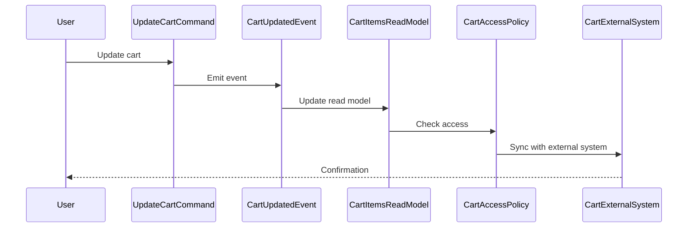
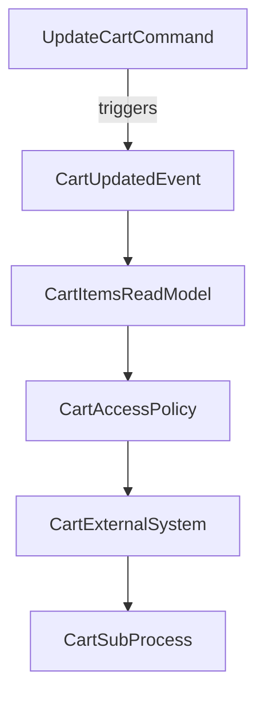
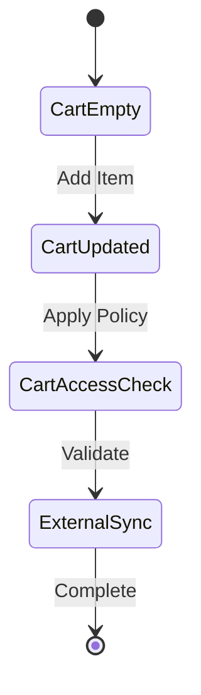

# Event Storming with Mermaid

This page demonstrates how to use Mermaid diagrams in your blog posts.

## Sequence Diagram Example

```mermaid
sequenceDiagram
    participant User
    participant CartCommand as UpdateCartCommand
    participant CartEvent as CartUpdatedEvent
    participant ReadModel as CartItemsReadModel
    participant Policy as CartAccessPolicy
    participant External as CartExternalSystem

    User->>CartCommand: Update cart
    CartCommand->>CartEvent: Emit event
    CartEvent->>ReadModel: Update read model
    ReadModel->>Policy: Check access
    Policy->>External: Sync with external system
    External-->>User: Confirmation
```

## Flowchart Example

```mermaid
graph TD
    A[UpdateCartCommand] -->|triggers| B[CartUpdatedEvent]
    B --> C[CartItemsReadModel]
    C --> D[CartAccessPolicy]
    D --> E[CartExternalSystem]
    E --> F[CartSubProcess]
```

## State Diagram Example

```mermaid
stateDiagram-v2
    [*] --> CartEmpty
    CartEmpty --> CartUpdated: Add Item
    CartUpdated --> CartAccessCheck: Apply Policy
    CartAccessCheck --> ExternalSync: Validate
    ExternalSync --> [*]: Complete
```