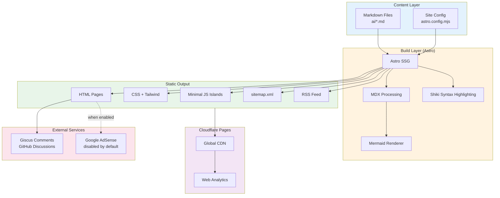

# TechDiagrams - Developer Resource Site Design

**Date:** 2025-12-31
**Status:** Approved
**Author:** quochuydev + Claude

## Overview

A dedicated developer resource website for technical overviews with architecture diagrams. Monetized via Google AdSense with social engagement through GitHub-based comments.

### Key Decisions

| Decision | Choice |
|----------|--------|
| Platform | Separate dedicated site |
| Audience | Developer Resource Hub |
| Stack | Astro (SSG) |
| Hosting | Cloudflare Pages (free) |
| Comments | Giscus (GitHub Discussions) |
| Ads | Minimal layout, disabled by default |
| Theme | System preference + Developer bold |
| Structure | Category sections |
| Domain | techdiagrams.dev (configurable) |

## Architecture



## Project Structure

```
techdiagrams/
├── astro.config.mjs          # Astro configuration
├── tailwind.config.mjs       # Tailwind styling
├── package.json
│
├── src/
│   ├── config.ts             # Site config (name, domain, ads toggle)
│   │
│   ├── content/
│   │   ├── config.ts         # Content collections schema
│   │   └── posts/            # Markdown files organized by category
│   │       ├── blockchain/
│   │       │   ├── bitcoin-overview.md
│   │       │   ├── solana-overview.md
│   │       │   └── binance-smart-chain-overview.md
│   │       ├── ai-tools/
│   │       │   ├── claude-code-web-overview.md
│   │       │   ├── loveable-overview.md
│   │       │   └── deepwiki-overview.md
│   │       ├── devops/
│   │       │   ├── dokploy-overview.md
│   │       │   └── oauth2-proxy-overview.md
│   │       └── architecture/
│   │           ├── c4-model-overview.md
│   │           └── architecture-decision-record-overview.md
│   │
│   ├── layouts/
│   │   ├── BaseLayout.astro  # HTML head, theme toggle
│   │   └── PostLayout.astro  # Article layout with ads slots
│   │
│   ├── components/
│   │   ├── Header.astro      # Logo + nav
│   │   ├── Footer.astro
│   │   ├── ThemeToggle.astro # Dark/light switch
│   │   ├── CategoryCard.astro
│   │   ├── PostCard.astro
│   │   ├── TableOfContents.astro
│   │   ├── Mermaid.astro     # Diagram renderer
│   │   ├── Giscus.astro      # Comments (lazy-loaded)
│   │   └── AdSlot.astro      # Ads (respects config toggle)
│   │
│   ├── pages/
│   │   ├── index.astro       # Homepage with categories
│   │   ├── [category]/
│   │   │   ├── index.astro   # Category listing
│   │   │   └── [slug].astro  # Individual post
│   │   ├── search.astro      # Search page
│   │   └── rss.xml.ts        # RSS feed
│   │
│   └── styles/
│       └── global.css        # Tailwind + custom styles
│
└── public/
    ├── favicon.svg
    └── og-image.png          # Default social share image
```

## Configuration

```typescript
// src/config.ts - Single source of truth

export const siteConfig = {
  // Site identity (easy to change later)
  name: "TechDiagrams",
  domain: "techdiagrams.dev",
  tagline: "Technical diagrams that explain how things work",

  // SEO
  defaultOgImage: "/og-image.png",
  twitterHandle: "@yourhandle",  // optional

  // Features toggle
  features: {
    ads: false,           // Flip to true when AdSense approved
    comments: true,       // Giscus enabled
    search: true,         // Client-side search
    rss: true,
  },

  // Google AdSense (fill when approved)
  adsense: {
    clientId: "",         // ca-pub-XXXXXXX
    slots: {
      sidebar: "",        // Slot ID for sidebar ad
      afterContent: "",   // Slot ID for after-content ad
    },
  },

  // Giscus config (GitHub Discussions)
  giscus: {
    repo: "quochuydev/techdiagrams",
    repoId: "",           // Get from giscus.app
    category: "Comments",
    categoryId: "",       // Get from giscus.app
  },

  // Categories definition
  categories: [
    { slug: "blockchain", name: "Blockchain", icon: "📦", description: "Crypto & Web3 protocols" },
    { slug: "ai-tools", name: "AI & Tools", icon: "🤖", description: "AI platforms & developer tools" },
    { slug: "devops", name: "DevOps", icon: "🔧", description: "Infrastructure & deployment" },
    { slug: "architecture", name: "Architecture", icon: "📐", description: "Patterns & methodologies" },
  ],
};
```

## Page Layouts

### Homepage

```
┌─────────────────────────────────────────────────────────────┐
│  🔷 TechDiagrams          [Search 🔍]    [☀️/🌙]           │
├─────────────────────────────────────────────────────────────┤
│                                                             │
│     Technical diagrams that explain how things work         │
│     ─────────────────────────────────────────────────       │
│     Developer-focused overviews with architecture           │
│     diagrams, flowcharts, and deep technical details.       │
│                                                             │
├─────────────────────────────────────────────────────────────┤
│                                                             │
│  ┌─────────────────────┐    ┌─────────────────────┐        │
│  │ 📦 Blockchain       │    │ 🤖 AI & Tools       │        │
│  │                     │    │                     │        │
│  │ • Bitcoin           │    │ • Claude Code Web   │        │
│  │ • Solana            │    │ • Loveable          │        │
│  │ • Binance Chain     │    │ • DeepWiki          │        │
│  │                     │    │                     │        │
│  │ [View all →]        │    │ [View all →]        │        │
│  └─────────────────────┘    └─────────────────────┘        │
│                                                             │
│  ┌─────────────────────┐    ┌─────────────────────┐        │
│  │ 🔧 DevOps           │    │ 📐 Architecture     │        │
│  │                     │    │                     │        │
│  │ • Dokploy           │    │ • C4 Model          │        │
│  │ • OAuth2 Proxy      │    │ • ADR               │        │
│  │ • LiveKit           │    │                     │        │
│  │                     │    │                     │        │
│  │ [View all →]        │    │ [View all →]        │        │
│  └─────────────────────┘    └─────────────────────┘        │
│                                                             │
├─────────────────────────────────────────────────────────────┤
│  TechDiagrams © 2025  •  RSS  •  GitHub                    │
└─────────────────────────────────────────────────────────────┘
```

### Post Page (with ads disabled)

```
┌─────────────────────────────────────────────────────────────┐
│  🔷 TechDiagrams          [Search 🔍]    [☀️/🌙]           │
├─────────────────────────────────────────────────────────────┤
│  Blockchain > Bitcoin                                       │
├───────────────────────────────────────┬─────────────────────┤
│                                       │                     │
│  # How Bitcoin Works                  │  Table of Contents  │
│                                       │  ────────────────   │
│  Technical overview of Bitcoin...     │  • Architecture     │
│                                       │  • Transaction Flow │
│  ┌─────────────────────────────┐     │  • Mining Process   │
│  │                             │     │  • Key Concepts     │
│  │    [Mermaid Diagram]        │     │                     │
│  │                             │     │  ┌───────────────┐  │
│  └─────────────────────────────┘     │  │   [AD SLOT]   │  │
│                                       │  │   (hidden)    │  │
│  ## Transaction Flow                  │  └───────────────┘  │
│                                       │                     │
│  Content continues...                 │  Related Posts      │
│                                       │  ────────────────   │
│  ┌─────────────────────────────┐     │  • Solana Overview  │
│  │    [Mermaid Diagram]        │     │  • BSC Overview     │
│  └─────────────────────────────┘     │                     │
│                                       │                     │
├───────────────────────────────────────┴─────────────────────┤
│                      [AD SLOT - hidden]                     │
├─────────────────────────────────────────────────────────────┤
│  💬 Comments (powered by Giscus)                           │
│  ┌─────────────────────────────────────────────────────┐   │
│  │  Sign in with GitHub to comment                     │   │
│  │  ───────────────────────────────────────────────    │   │
│  │  💬 2 comments                                      │   │
│  └─────────────────────────────────────────────────────┘   │
├─────────────────────────────────────────────────────────────┤
│  TechDiagrams © 2025  •  RSS  •  GitHub                    │
└─────────────────────────────────────────────────────────────┘
```

## Content Schema

### Frontmatter

```yaml
---
title: "How Bitcoin Works"
description: "Deep dive into Bitcoin architecture with transaction flow, mining, and consensus diagrams."
category: "blockchain"
tags: ["bitcoin", "crypto", "blockchain", "proof-of-work"]
date: 2025-01-15
updatedDate: 2025-01-20  # optional
author: "TechDiagrams"
ogImage: "./og.png"  # optional, auto-generates if missing
featured: true  # shows on homepage
draft: false
---
```

### Category Mapping

| Category Slug | Files |
|---------------|-------|
| `blockchain` | bitcoin, solana, binance-smart-chain |
| `ai-tools` | claude-code-web, loveable, deepwiki, agentskills, bloom |
| `devops` | dokploy, oauth2-proxy, livekit |
| `architecture` | c4-model, architecture-decision-record |

## SEO Strategy

### Meta Tags (auto-generated)

```html
<title>How Bitcoin Works - Technical Overview | TechDiagrams</title>
<meta name="description" content="Deep dive into Bitcoin architecture...">
<meta property="og:title" content="How Bitcoin Works - Technical Overview">
<meta property="og:image" content="https://techdiagrams.dev/posts/bitcoin/og.png">
<meta property="og:type" content="article">
<meta name="twitter:card" content="summary_large_image">
```

### Structured Data

```json
{
  "@type": "TechArticle",
  "headline": "How Bitcoin Works - Technical Overview",
  "author": { "@type": "Person", "name": "TechDiagrams" },
  "datePublished": "2025-01-15"
}
```

### Auto-generated Files

- `sitemap.xml` - All pages for Google indexing
- `robots.txt` - Crawl rules
- `rss.xml` - RSS feed for subscribers

### Performance Targets

| Metric | Target |
|--------|--------|
| Lighthouse Performance | 95+ |
| Lighthouse SEO | 100 |
| LCP | <2.5s |
| FID | <100ms |
| CLS | <0.1 |

## Visual Design

### Theme

- **Mode:** System preference with manual toggle
- **Style:** Developer bold (like Vercel, Raycast)
- **Colors:** Strong contrast, accent colors, modern feel

### Typography

- Headlines: Bold, clear hierarchy
- Body: Readable, good line height
- Code: Monospace with syntax highlighting (Shiki)

## External Services

### Giscus (Comments)

- Backend: GitHub Discussions
- Data ownership: You own it
- Auth: GitHub login required
- Features: Reactions, threaded replies, markdown

### Google AdSense (Ads)

- Layout: Minimal (sidebar + after content)
- Status: Disabled by default
- Enable: Flip `features.ads: true` after approval

### Cloudflare (Hosting)

- CDN: Global edge network
- SSL: Automatic HTTPS
- Analytics: Privacy-friendly, built-in
- Cost: Free (unlimited bandwidth)

## Migration Plan

1. Copy `ai/*.md` → `src/content/posts/{category}/`
2. Add frontmatter to each file
3. Map files to correct categories
4. Verify Mermaid diagrams render correctly

## Implementation Phases

### Phase 1: Foundation
- [ ] Initialize Astro project
- [ ] Configure Tailwind + theme toggle
- [ ] Create base layouts
- [ ] Set up content collections

### Phase 2: Core Features
- [ ] Build homepage with category grid
- [ ] Create post layout with TOC
- [ ] Add Mermaid diagram support
- [ ] Implement search

### Phase 3: Engagement
- [ ] Integrate Giscus comments
- [ ] Add ad slots (hidden)
- [ ] Generate sitemap + RSS

### Phase 4: Content Migration
- [ ] Migrate all 16 posts
- [ ] Add frontmatter
- [ ] Verify all diagrams

### Phase 5: Deploy
- [ ] Deploy to Cloudflare Pages
- [ ] Configure custom domain
- [ ] Submit to Google Search Console
- [ ] Apply for AdSense (when ready)

## Future Enhancements (Not in Scope)

- Newsletter signup
- User accounts
- Bookmarking/favorites
- Print-friendly view
- PDF export
- Multi-language support

---

**Next Steps:**
1. Create isolated workspace with git worktree
2. Write detailed implementation plan
3. Start building Phase 1
