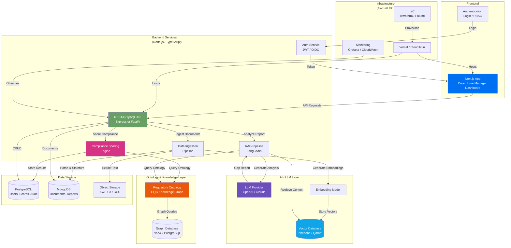

## Client's Upwork job description

Summary
Senior Full Stack Engineer — AI/Ontology Platform (Healthcare)
Remote | TypeScript · Next.js · Node.js · LLMs

We're hiring a founding engineer to build an AI compliance platform for UK care homes - ontology-driven, LLM-powered, technically serious work.

What you're building
Sonarcare is an AI compliance platform for UK care homes - purpose-built around a regulatory knowledge graph that models how the Care Quality Commission actually inspects. Think Palantir Foundry, but for a highly regulated sector in genuine crisis.

The ontology layer is already mapped and structured. You're not starting from zero — you're building the engine that brings it to life.

The role
This is the founding engineering hire. You'll own the technical build end-to-end — architecture, backend, frontend, and AI integration. You'll work closely with the founder and a domain expert (ontologist/AI researcher) during initial design, then operate with high autonomy day-to-day.
What you'll work on first:

Data ingestion pipeline into a structured semantic layer
Backend services in Node.js/TypeScript to query and score against the regulatory ontology
LLM integration for report analysis and gap identification (RAG architecture)
A clean, functional frontend for care home managers (Next.js)
Cloud infrastructure on AWS or GCP (IaC preferred)

Stack
TypeScript across the stack · Next.js · Node.js · PostgreSQL · MongoDB · AWS or GCP · LangChain/RAG · Vercel
Python is useful for prototyping. Vector databases a bonus.

What we're looking for

5+ years as a full stack engineer at senior level
Strong TypeScript, React/Next.js, and Node.js
Experience building and consuming AI/LLM-powered services
Comfortable owning cloud infrastructure, not just writing application code
Ideally: some exposure to knowledge graphs, ontologies, or structured semantic data (RDF, OWL, graph databases) — not essential, but this is central to the product
Experience in regulated industries (healthcare, fintech, legal) is a genuine advantage
Fluent English, comfortable with async remote work, UK timezone overlap preferred

What's on offer

Competitive contract or full-time rate (open to either)
Fully remote, high autonomy
A technically interesting problem — not another CRUD app

## My cover letter

Hi,

This role is a strong match for my background. I have 7+ years building full-stack TypeScript applications, and I've worked specifically on healthcare and AI platforms in regulated environments. Here's why I'm confident I can deliver:

1. Healthcare + regulated industry experience. I built a German healthcare product that passed Swiss corporate pen-testing and served 10,000+ KYC user accounts. I understand the compliance mindset — security, auditability, and data governance aren't afterthoughts for me.

2. AI/LLM and RAG are my current focus. I'm building an agentic coding platform using LangChain, LlamaIndex, and Claude/OpenAI — including prompt engineering, tool orchestration, and workflow pipelines. I've worked with vector databases (ChromaDB, Pinecone, Qdrant) for RAG retrieval, which maps directly to your report analysis and gap identification needs.

3. Your exact stack is my daily stack. TypeScript end-to-end, Next.js, Node.js, PostgreSQL, MongoDB — this is what I ship production code in. I also have hands-on experience with AWS, GCP, Docker, Kubernetes, and Vercel deployments.

4. Ontology and semantic data interest me. While I haven't worked with RDF/OWL specifically, I've built systems around structured knowledge — Elasticsearch for semantic search, graph-like data models, and metadata-driven architectures. I'm eager to go deep on your regulatory knowledge graph and learn quickly from your domain expert.

5. I thrive as a founding engineer. I've owned end-to-end builds from architecture to deployment across multiple products — authentication platforms, payment systems, real-time video services, microservice backends. I'm comfortable with high autonomy and async remote work.

I can overlap with UK timezone and will provide frequent progress updates with clear documentation. I'd love to discuss how I can help bring Sonarcare's ontology layer to life.

Looking forward to connecting.

# Architecture Diagram

_Diagram generated with Anthropic Claude Opus 4.6_

## System Flow

**Document Ingestion Flow:**

1. Care home manager uploads inspection reports, policies, or evidence documents
2. Ingestion pipeline parses documents, extracts text, stores raw files in S3
3. Embedding model generates vector representations of document chunks
4. Vectors stored in vector database for semantic retrieval
5. Structured metadata indexed in MongoDB for filtering and lookup

**Compliance Scoring Flow:**

1. Manager requests compliance assessment for their care home
2. Scoring engine queries the CQC regulatory ontology for applicable standards
3. Engine cross-references uploaded evidence against ontology requirements
4. Gap analysis identifies missing or weak compliance areas
5. Scores and results stored in PostgreSQL with full audit trail

**RAG Report Analysis Flow:**

1. Manager submits a CQC report or inspection document for analysis
2. RAG pipeline retrieves relevant context from vector database
3. Ontology provides structured regulatory knowledge as additional context
4. LLM generates detailed gap identification with specific recommendations
5. Results presented in dashboard with actionable compliance tasks

**Admin & Monitoring:**

- Audit log of all compliance assessments and score changes
- User management with role-based access (manager, admin, auditor)
- Infrastructure monitoring via Grafana/CloudWatch
- Data retention policies aligned with UK healthcare regulations

## Technical Stack

**Frontend:** Next.js (React 19, TypeScript)
**Backend:** Node.js (Express/Fastify, TypeScript)
**Databases:** PostgreSQL (scores, users, audit) + MongoDB (documents, reports)
**Vector DB:** Pinecone or Qdrant (RAG retrieval)
**Graph/Ontology:** Neo4j or PostgreSQL with graph extensions
**AI/LLM:** LangChain, OpenAI/Claude, embedding models
**Infrastructure:** AWS or GCP, Vercel, Terraform/Pulumi
**Monitoring:** Grafana, structured logging, audit trails
**Auth:** OIDC-compliant (Zitadel or similar)

## Security & Compliance

- UK healthcare data handling best practices (NHS DSPT alignment)
- End-to-end encryption for data at rest and in transit
- Role-based access control with audit logging
- Infrastructure as Code for reproducible, auditable deployments
- Regular dependency scanning and vulnerability assessments
