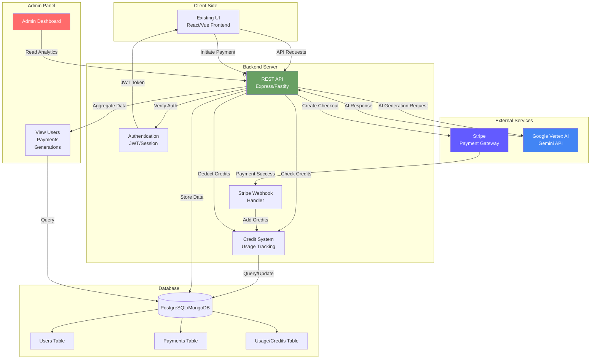

## Client's Upwork job description

Full-Stack Developer to Build AI SaaS (Stripe + Vertex AI)
Full Stack Development Posted Dec 3, 2025
I’m building a small AI-powered design app using Google Vertex AI.
I already have a working prototype, but it behaves like a demo (asks for API key, no Stripe, no user system).
I need a developer who can turn it into a real SaaS product.

Tasks:

Create backend (Node.js or Python)

Integrate Stripe Checkout + Webhooks
Hide API keys on server
Connect backend to Vertex AI (Gemini API)
Create user accounts + credit/usage system
Connect my existing UI to the backend
Build a simple admin dashboard (view users, payments, generations) - I have already built it

You MUST have experience with:

Stripe
Google Cloud / Vertex AI
Backend development
API integrations
Deploying SaaS products

Goal:

Users pay €7.99–€9.99 → receive X AI generations → backend calls Vertex AI using MY API key → I see everything in admin dashboard. lessMore/Less about

## My cover letter

Hi,
I’m confident I can handle this job. I have 7 years of experience with Node.js, and here’s how I would approach your tasks:

1. Stripe integration is straightforward. I’ve completed U.S.-based payment systems using Stripe, PayPal, and Braintree. The delivery speed mainly depends on having the production API keys available.
2. AI API integration is also easy for me. I’m currently building an agent-based SaaS coding platform for my company, including prompt design, tool orchestration, cost management, and analytics.
3. Deployment is simple. I can also help set up additional production monitoring and tracing with Grafana at no extra cost.
4. For a SaaS product, a solid authentication and authorization system is essential. I recommend Zitadel (or a similar open-source option). It’s free, GDPR-compliant, and I’ve used it for the German market, which has very strict security requirements.
5. Throughout the project, I’ll report progress frequently and deliver clear, high-quality documentation and guidelines. I’ll also provide long-term support after the job is completed.

I hope we can start working together soon.

# Architecture Diagram

_Diagram generated with Anthropic Claude Sonnet 4.5_

## System Flow

**User Payment Flow:**

1. User visits UI → Clicks "Buy Credits"
2. Frontend calls Backend API → Creates Stripe Checkout session
3. User completes payment on Stripe
4. Stripe sends webhook to Backend
5. Backend adds credits to user account

**AI Generation Flow:**

1. User requests AI generation through UI
2. Backend verifies authentication & checks credits
3. Backend calls Vertex AI with secure API key
4. Vertex AI returns generated content
5. Backend deducts credits & logs usage
6. Response sent to Frontend

**Admin Monitoring:**

- Real-time dashboard showing:
  - Active users & registrations
  - Payment transactions (€7.99-€9.99)
  - AI generation usage & costs
  - Credit balance analytics

## Technical Stack

**Backend:** Node.js (Express/Fastify)
**Database:** PostgreSQL (Prisma ORM)
**Authentication:** JWT + Refresh Tokens
**Payment:** Stripe Checkout + Webhooks
**AI:** Google Vertex AI (Gemini API)
**Deployment:** Google Cloud Run / AWS Lambda
**Monitoring:** Grafana + Custom Admin Dashboard

## Security Features

- API keys stored server-side (environment variables)
- Rate limiting on API endpoints
- GDPR-compliant authentication (Zitadel option)
- Webhook signature verification
- Encrypted user data at rest
