# Database Indexing Deep Dive

Why your queries are slow and how to fix them

<div class="pt-12">
  <span class="px-2 py-1 rounded cursor-pointer" hover="bg-white bg-opacity-10">
    Live Demo: 1M Movie Records
  </span>
</div>

---

# Agenda

<v-clicks>

1. 📚 **What is an Index?** - The library analogy
2. 🌳 **How B-Tree Works** - Under the hood
3. ⚡ **Live Demo** - No Index vs Index vs Wrong Index
4. ⚠️ **Common Mistakes** - Anti-patterns to avoid
5. ✅ **Best Practices** - Rules to follow

</v-clicks>

---
layout: section
---

# What is a Database Index?

---
layout: two-cols
---

# Without Index

Like searching a book **page by page**

```sql
SELECT * FROM movies
WHERE title = 'Inception';
```

<v-click>

**Sequential Scan**
- Check every single row
- 1M rows = 1M comparisons
- Time: **600+ ms** 😱

</v-click>

::right::

# With Index

Like using a book's **table of contents**

```sql
SELECT * FROM movies
WHERE title = 'Inception';
```

<v-click>

**Index Scan**
- Jump directly to the data
- 1M rows = ~20 comparisons
- Time: **< 1 ms** 🚀

</v-click>

---

# Index = Sorted Reference

```mermaid {scale: 0.8}
flowchart LR
    subgraph Index["Index (Sorted)"]
        A["Avatar → Row 532"]
        B["Batman → Row 891"]
        C["Inception → Row 445"]
        D["Matrix → Row 123"]
    end
    subgraph Table["Table (Unsorted)"]
        R1["Row 123: Matrix, 1999"]
        R2["Row 445: Inception, 2010"]
        R3["Row 532: Avatar, 2009"]
        R4["Row 891: Batman, 2008"]
    end
    C --> R2
```



<v-click>

> Index stores: **Key** → **Pointer to Row**
>
> Search time: **O(log n)** instead of **O(n)**

</v-click>

---
layout: section
---

# How B-Tree Index Works

The data structure behind 90% of database indexes

---

# B-Tree Structure


<v-clicks>

- **Root node**: Entry point for all searches
- **Internal nodes**: Guide the search direction
- **Leaf nodes**: Contain actual data pointers (linked for range queries)

</v-clicks>

---

# Search: Find "Inception"

```mermaid {scale: 0.65}
flowchart TB
    Root["[M]<br/>I < M → Go Left"] --> L1["[D, H]<br/>H < I → Go Right"]
    Root --> L2["[R, W]"]
    L1 --> Leaf1["A, B, C"]
    L1 --> Leaf2["E, F, G"]
    L1 --> Leaf3["I, J, K, L<br/>✅ Found!"]
    L2 --> Leaf4["N, O, P, Q"]
    L2 --> Leaf5["S, T, U, V"]
    L2 --> Leaf6["X, Y, Z"]

    style Root fill:#f9a825
    style L1 fill:#f9a825
    style Leaf3 fill:#4caf50
```



<v-click>

**1 Million rows → Only ~20 node visits** (log₂ 1,000,000 ≈ 20)

</v-click>

---

# Why B-Tree is Perfect for Databases

<v-clicks>

| Property | Benefit |
|----------|---------|
| **Balanced** | Every search takes same time O(log n) |
| **Wide nodes** | Fewer disk reads (node = disk page ~4KB) |
| **Linked leaves** | Fast range queries (BETWEEN, ORDER BY) |
| **Self-maintaining** | Auto-balances on insert/delete |

</v-clicks>

---
layout: section
---

# 🎬 Live Demo

1 Million Movies: No Index vs Index vs Wrong Index

---

# Demo Setup

```sql
-- Create table
CREATE TABLE movies (
    id SERIAL PRIMARY KEY,
    title VARCHAR(255),
    genre VARCHAR(50),
    release_year INT,
    rating DECIMAL(3,2),
    created_at TIMESTAMP DEFAULT NOW()
);

-- Insert 1 million records
INSERT INTO movies (title, genre, release_year, rating)
SELECT
    'Movie_' || generate_series(1, 1000000),
    (ARRAY['Action','Drama','Comedy','Horror','SciFi'])[floor(random()*5+1)],
    1990 + floor(random() * 35),
    (random() * 4 + 6)::decimal(3,2)
FROM generate_series(1, 1);
```

---
layout: two-cols
---

# ❌ No Index

```sql
EXPLAIN ANALYZE
SELECT * FROM movies
WHERE title = 'Movie_500000';
```

<v-click>

```
Seq Scan on movies
  Filter: title = 'Movie_500000'
  Rows Removed by Filter: 999999

Planning Time: 0.1 ms
Execution Time: 450.32 ms  ← 😱
```

</v-click>

::right::

# ✅ With Index

```sql
CREATE INDEX idx_movies_title
ON movies(title);

EXPLAIN ANALYZE
SELECT * FROM movies
WHERE title = 'Movie_500000';
```

<v-click>

```
Index Scan using idx_movies_title
  Index Cond: title = 'Movie_500000'

Planning Time: 0.2 ms
Execution Time: 0.05 ms   ← 🚀
```

**9000x faster!**

</v-click>

---

# ⚠️ Wrong Index - Example 1

**Indexing low-selectivity column**

```sql
-- Genre only has 5 distinct values
CREATE INDEX idx_movies_genre ON movies(genre);

EXPLAIN ANALYZE
SELECT * FROM movies WHERE genre = 'Action';
```

<v-click>

```
Seq Scan on movies  ← Index IGNORED!
  Filter: genre = 'Action'
  Rows Removed by Filter: 800000

Execution Time: 380.21 ms
```

> 200,000 matching rows = 20% of table → Sequential scan is faster!

</v-click>

---

# ⚠️ Wrong Index - Example 2

**Function on indexed column**

```sql
CREATE INDEX idx_movies_title ON movies(title);

-- ❌ Function disables index
EXPLAIN ANALYZE
SELECT * FROM movies WHERE UPPER(title) = 'MOVIE_500000';
```

<v-click>

```
Seq Scan on movies  ← Index IGNORED!
  Filter: upper(title) = 'MOVIE_500000'

Execution Time: 520.18 ms
```

</v-click>

<v-click>

**Fix: Create expression index**
```sql
CREATE INDEX idx_movies_title_upper ON movies(UPPER(title));
```

</v-click>

---

# ⚠️ Wrong Index - Example 3

**Wrong column order in composite index**

```sql
-- ❌ Bad: Low selectivity column first
CREATE INDEX idx_bad ON movies(genre, title);

-- ✅ Good: High selectivity column first
CREATE INDEX idx_good ON movies(title, genre);
```

<v-click>

```sql
EXPLAIN ANALYZE
SELECT * FROM movies WHERE genre = 'Action' AND title = 'Movie_500000';
```

| Index | Execution Time |
|-------|----------------|
| idx_bad (genre, title) | 12.5 ms |
| idx_good (title, genre) | 0.08 ms |

</v-click>

---
layout: section
---

# Common Indexing Mistakes

What NOT to do

---

# 🚫 Anti-Patterns

<v-clicks>

1. **Over-indexing** - Index on every column
   - Each index = extra write overhead + storage
   - Insert/Update must update ALL indexes

2. **Indexing low-selectivity columns** - gender, status, boolean
   - < 1% unique values = index often ignored

3. **Missing foreign key indexes**
   - JOINs become table scans
   - DELETE on parent can lock entire table

4. **Ignoring composite index order**
   - Put most selective column FIRST
   - Order must match query patterns

5. **Outdated statistics**
   - Run `ANALYZE` after bulk operations

</v-clicks>

---

# Index Selectivity

<div class="grid grid-cols-2 gap-4">

<div>

### ❌ Low Selectivity
```sql
-- 5 unique values in 1M rows
SELECT COUNT(DISTINCT genre)
FROM movies;
-- Result: 5

-- Selectivity: 5/1,000,000 = 0.0005%
-- Index likely IGNORED
```

</div>

<div>

### ✅ High Selectivity
```sql
-- 1M unique values in 1M rows
SELECT COUNT(DISTINCT title)
FROM movies;
-- Result: 1,000,000

-- Selectivity: 100%
-- Index very effective
```

</div>

</div>

<v-click>

> **Rule of thumb**: Index is useful when it filters out > 90% of rows

</v-click>

---
layout: section
---

# Best Practices

---

# ✅ Index Best Practices

<v-clicks>

| Do | Don't |
|----|-------|
| Index columns in WHERE, JOIN, ORDER BY | Index every column |
| Put high-selectivity columns first | Index boolean/status columns alone |
| Use covering indexes for read-heavy queries | Create redundant indexes |
| Monitor with `EXPLAIN ANALYZE` | Guess which index to create |
| Run `ANALYZE` after bulk changes | Forget to update statistics |
| Create indexes CONCURRENTLY in production | Lock tables during index creation |

</v-clicks>

---

# Query Optimization Tips

```sql
-- ❌ Bad: Function on column
WHERE YEAR(created_at) = 2024

-- ✅ Good: Range condition
WHERE created_at >= '2024-01-01'
  AND created_at < '2025-01-01'
```

<v-click>

```sql
-- ❌ Bad: OR conditions (hard to optimize)
WHERE status = 'active' OR created_at > '2024-01-01'

-- ✅ Good: UNION (can use separate indexes)
SELECT * FROM orders WHERE status = 'active'
UNION ALL
SELECT * FROM orders WHERE created_at > '2024-01-01'
```

</v-click>

---

# Summary

<v-clicks>

🎯 **Key Takeaways**

1. **Index = O(log n)** - Makes 1M row searches instant
2. **B-Tree** - Self-balancing, disk-optimized, supports ranges
3. **Selectivity matters** - High cardinality = effective index
4. **Column order matters** - Most selective column first
5. **Avoid functions on indexed columns** - Use expression indexes instead
6. **Monitor with EXPLAIN ANALYZE** - Don't guess, measure!

</v-clicks>

<v-click>

<div class="mt-8 text-center text-xl">

**Questions?** 🤔

</div>

</v-click>

---
layout: end
---

# Thank You!

Resources:
- [Use The Index, Luke](https://use-the-index-luke.com/)
- [PostgreSQL Documentation](https://www.postgresql.org/docs/current/indexes.html)
- [PlanetScale: B-trees and Database Indexes](https://planetscale.com/blog/btrees-and-database-indexes)
