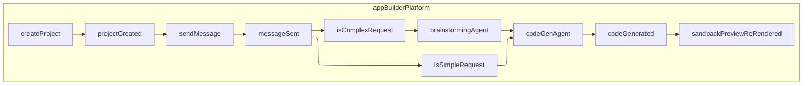

## Architecture

```mermaid
---
config:
  layout: elk
---
flowchart LR
 subgraph appBuilderPlatform
        createProject
        projectCreated
        sendMessage
        messageSent
        isSimpleRequest
        isComplexRequest
        brainstormingAgent
        codeGenAgent
        sandpackPreviewReRendered
        codeGenerated
end

    createProject --> projectCreated
    projectCreated --> sendMessage
    sendMessage --> messageSent
    messageSent --> isSimpleRequest & isComplexRequest
    isComplexRequest --> brainstormingAgent
    isSimpleRequest --> codeGenAgent
    brainstormingAgent --> codeGenAgent
    codeGenAgent --> codeGenerated
    codeGenerated --> sandpackPreviewReRendered
```
