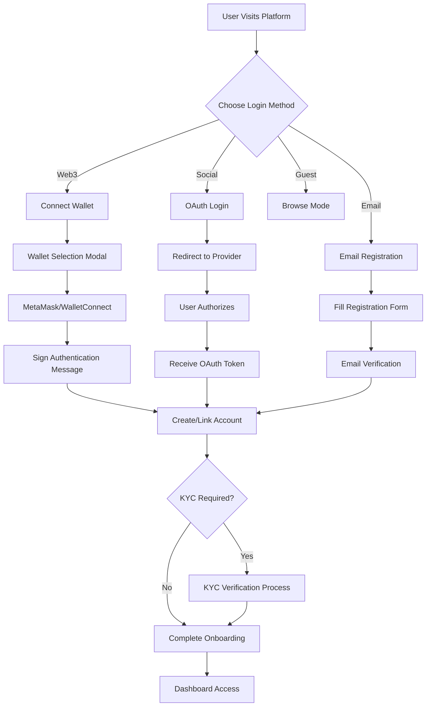

## Polymarket Login Flow Analysis

### 🎯 **Authentication Entry Points**

**Primary Login Options:**

- 🔗 **Connect Wallet** (MetaMask, WalletConnect, Coinbase Wallet)
- 🔐 **Social Login** (Google, Apple, Twitter)
- 📧 **Email Registration** (Traditional signup)
- 👁️ **Browse Markets** (Guest mode - limited access)

### 🔄 **Complete Authentication Flow**



### 💻 **Technical Implementation**

**1. Web3 Wallet Integration:**

```typescript
// Wallet connection service
class WalletAuthService {
  async connectWallet(walletType: "metamask" | "walletconnect" | "coinbase") {
    const provider = await this.getProvider(walletType);

    // Request account access
    const accounts = await provider.request({
      method: "eth_requestAccounts",
    });

    // Generate nonce for security
    const nonce = await this.getNonce(accounts[0]);

    // Create authentication message
    const message = `Welcome to Polymarket!\n\nPlease sign this message to authenticate.\n\nWallet: ${accounts[0]}\nNonce: ${nonce}`;

    // Request signature
    const signature = await provider.request({
      method: "personal_sign",
      params: [message, accounts[0]],
    });

    // Verify and authenticate
    return this.authenticateWithSignature(accounts[0], signature, message);
  }
}
```

**2. Social Login Integration:**

```typescript
// OAuth configuration
const socialAuthConfig = {
  google: {
    clientId: process.env.GOOGLE_CLIENT_ID,
    redirectUri: `${process.env.BASE_URL}/auth/google/callback`,
  },
  apple: {
    clientId: process.env.APPLE_CLIENT_ID,
    redirectUri: `${process.env.BASE_URL}/auth/apple/callback`,
  },
};

// Social login handler
class SocialAuthService {
  async loginWithGoogle() {
    const authUrl = `https://accounts.google.com/oauth/authorize?client_id=${socialAuthConfig.google.clientId}&redirect_uri=${socialAuthConfig.google.redirectUri}&response_type=code&scope=email profile`;
    window.location.href = authUrl;
  }
}
```

### 🛡️ **Security & Compliance Features**

**1. KYC Verification Process:**

- Document upload (ID, passport, driver's license)
- Address verification (utility bills, bank statements)
- Selfie verification with liveness detection
- Risk assessment questionnaire
- AML screening against sanctions lists

**2. Session Management:**

```typescript
// JWT-based session management
interface AuthToken {
  userId: string;
  walletAddress?: string;
  email?: string;
  kycStatus: "pending" | "approved" | "rejected";
  permissions: string[];
  exp: number;
}

class SessionManager {
  generateToken(user: User): string {
    return jwt.sign(
      {
        userId: user.id,
        walletAddress: user.walletAddress,
        kycStatus: user.kycStatus,
        permissions: user.permissions,
      },
      JWT_SECRET,
      { expiresIn: "24h" }
    );
  }
}
```

### 📊 **Database Schema**

```sql
-- Users table
CREATE TABLE users (
  id UUID PRIMARY KEY DEFAULT gen_random_uuid(),
  email VARCHAR UNIQUE,
  username VARCHAR UNIQUE,
  wallet_address VARCHAR UNIQUE,
  profile_image_url VARCHAR,
  kyc_status VARCHAR DEFAULT 'pending' CHECK (kyc_status IN ('pending', 'approved', 'rejected')),
  compliance_score INTEGER DEFAULT 0,
  created_at TIMESTAMP DEFAULT NOW(),
  updated_at TIMESTAMP DEFAULT NOW()
);

-- Authentication methods
CREATE TABLE user_auth_methods (
  id UUID PRIMARY KEY DEFAULT gen_random_uuid(),
  user_id UUID REFERENCES users(id) ON DELETE CASCADE,
  provider VARCHAR NOT NULL CHECK (provider IN ('wallet', 'google', 'apple', 'email')),
  provider_id VARCHAR NOT NULL,
  is_primary BOOLEAN DEFAULT FALSE,
  created_at TIMESTAMP DEFAULT NOW()
);

-- User sessions
CREATE TABLE user_sessions (
  id UUID PRIMARY KEY DEFAULT gen_random_uuid(),
  user_id UUID REFERENCES users(id) ON DELETE CASCADE,
  token_hash VARCHAR NOT NULL,
  device_fingerprint VARCHAR,
  ip_address INET,
  user_agent TEXT,
  expires_at TIMESTAMP NOT NULL,
  created_at TIMESTAMP DEFAULT NOW()
);

-- KYC documents
CREATE TABLE kyc_submissions (
  id UUID PRIMARY KEY DEFAULT gen_random_uuid(),
  user_id UUID REFERENCES users(id) ON DELETE CASCADE,
  document_type VARCHAR NOT NULL,
  file_url VARCHAR NOT NULL,
  status VARCHAR DEFAULT 'pending' CHECK (status IN ('pending', 'approved', 'rejected')),
  reviewed_at TIMESTAMP,
  reviewer_notes TEXT,
  created_at TIMESTAMP DEFAULT NOW()
);
```

### 🔧 **API Endpoints**

```typescript
// Authentication routes
app.post("/api/auth/wallet/connect", walletAuthController.connect);
app.post("/api/auth/wallet/verify", walletAuthController.verify);
app.get("/api/auth/google", socialAuthController.googleLogin);
app.get("/api/auth/google/callback", socialAuthController.googleCallback);
app.post("/api/auth/email/register", emailAuthController.register);
app.post("/api/auth/email/verify", emailAuthController.verifyEmail);
app.post("/api/auth/refresh", authController.refreshToken);
app.post("/api/auth/logout", authController.logout);

// KYC routes
app.post(
  "/api/kyc/upload",
  upload.single("document"),
  kycController.uploadDocument
);
app.get("/api/kyc/status", authMiddleware, kycController.getStatus);
app.post("/api/kyc/submit", authMiddleware, kycController.submitVerification);

// User management
app.get("/api/user/profile", authMiddleware, userController.getProfile);
app.put("/api/user/profile", authMiddleware, userController.updateProfile);
```

### 📱 **User Experience Flow**

**1. Onboarding Journey:**

- Welcome screen with authentication options
- Progressive disclosure of features
- Tutorial overlay for first-time users
- Achievement system for completed actions

**2. Mobile-First Design:**

- Responsive wallet connection modals
- Touch-friendly interface elements
- Deep linking for mobile wallet apps
- Push notifications for important updates

This comprehensive login flow ensures security, compliance, and excellent user experience similar to platforms like Polymarket, balancing Web3 innovation with traditional user expectations.
