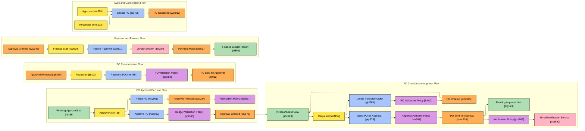

```mermaid
---
config:
  layout: elk
---
flowchart LR
 subgraph s1["PO Creation and Approval Flow"]
    n1["PO Dashboard View [abc123]"]
    n2["Requester [def456]"]
    n3["Create Purchase Order [ghi789]"]
    n4["PO Validation Policy [jkl012]"]
    n5["PO Created [mno345]"]
    n6["Send PO for Approval [pqr678]"]
    n7["Approval Authority Policy [stu901]"]
    n8["PO Sent for Approval [vwx234]"]
    n9["Notification Policy [yza567]"]
    n10["Email Notification Service [bcd890]"]
    n11["Pending Approval List [efg123]"]
  end
    n1 --> n2
    n2 --> n3
    n3 --> n4
    n4 --> n5
    n5 --> n1
    n2 --> n6
    n6 --> n7
    n7 --> n8
    n8 --> n9
    n9 --> n10
    n8 --> n11

 subgraph s2["PO Approval Decision Flow"]
    n12["Pending Approval List [hij456]"]
    n13["Approver [klm789]"]
    n14["Approve PO [nop012]"]
    n15["Budget Validation Policy [qrs345]"]
    n16["Approval Granted [tuv678]"]
    n17["Reject PO [wxy901]"]
    n18["Approval Rejected [zab234]"]
    n19["Notification Policy [cde567]"]
  end
    n12 --> n13
    n13 --> n14
    n14 --> n15
    n15 --> n16
    n16 --> n1
    n13 --> n17
    n17 --> n18
    n18 --> n19

 subgraph s3["PO Resubmission Flow"]
    n20["Approval Rejected [fgh890]"]
    n21["Requester [ijk123]"]
    n22["Resubmit PO [lmn456]"]
    n23["PO Validation Policy [opq789]"]
    n24["PO Sent for Approval [rst012]"]
  end
    n20 --> n21
    n21 --> n22
    n22 --> n23
    n23 --> n24

 subgraph s4["Payment and Finance Flow"]
    n25["Approval Granted [uvw345]"]
    n26["Finance Staff [xyz678]"]
    n27["Record Payment [abc901]"]
    n28["Vendor System [def234]"]
    n29["Payment Made [ghi567]"]
    n30["Finance Budget Report [jkl890]"]
  end
    n25 --> n26
    n26 --> n27
    n27 --> n28
    n28 --> n29
    n29 --> n30

 subgraph s5["Audit and Cancellation Flow"]
    n31["Requester [mno123]"]
    n32["Cancel PO [pqr456]"]
    n33["Approver [stu789]"]
    n34["PO Cancelled [vwx012]"]
  end
    n31 --> n32
    n33 --> n32
    n32 --> n34

    n1:::read_models
    n11:::read_models
    n12:::read_models
    n30:::read_models
    n2:::actor
    n13:::actor
    n21:::actor
    n26:::actor
    n31:::actor
    n33:::actor
    n3:::command
    n6:::command
    n14:::command
    n17:::command
    n22:::command
    n27:::command
    n32:::command
    n4:::policy
    n7:::policy
    n9:::policy
    n15:::policy
    n19:::policy
    n23:::policy
    n10:::external_system
    n28:::external_system
    n5:::event
    n8:::event
    n16:::event
    n18:::event
    n20:::event
    n24:::event
    n25:::event
    n29:::event
    n34:::event

    classDef read_models fill:#b0deb3, stroke:#000, stroke-width:1px, color:#000
    classDef actor fill:#fee750, stroke:#000, stroke-width:1px, color:#000, border-radius:0
    classDef command fill:#a7c5fc,stroke:#000,stroke-width:1px,color:#000
    classDef policy fill:#da99e6, stroke:#000, stroke-width:1px, color:#000
    classDef event fill:#feae57, stroke:#000, stroke-width:1px, color:#000
    classDef external_system fill:#ffb3c5, stroke:#000, stroke-width:1px, color:#000
```