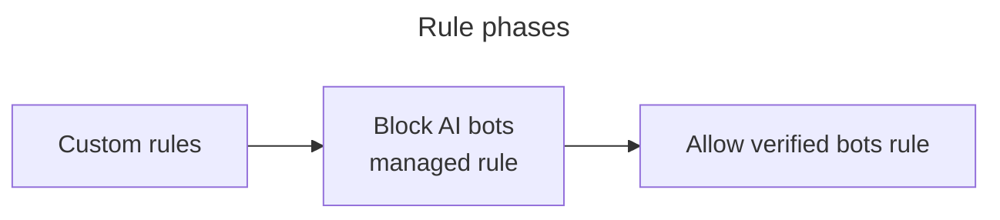

<page>
---
title: Overview · Cloudflare API Shield docs
description: APIs have become the backbone of popular web services, helping the
  Internet become more accessible and useful.
lastUpdated: 2025-08-18T14:27:42.000Z
chatbotDeprioritize: false
source_url:
  html: https://developers.cloudflare.com/api-shield/
  md: https://developers.cloudflare.com/api-shield/index.md
---

Identify and address your API vulnerabilities.

Enterprise-only paid add-on

Note

Enterprise customers can preview this product as a [non-contract service](https://developers.cloudflare.com/billing/preview-services/), which provides full access, free of metered usage fees, limits, and certain other restrictions.

## Why care about API security?

APIs have become the [backbone of popular web services](https://blog.postman.com/intro-to-apis-history-of-apis/), helping the Internet become more accessible and useful.

As APIs have become more prevalent, however, so have their problems:

* Many companies have [thousands of APIs](https://developers.cloudflare.com/api-shield/security/api-discovery/), including ones they do not even know about.
* To support a large base of users, many APIs are protected by a negative security model that makes them vulnerable to credential-stuffing attacks and automated scanning tools.
* With so many endpoints and users, it’s difficult to recognize brute-force attacks against [specific endpoints](https://developers.cloudflare.com/api-shield/security/volumetric-abuse-detection/).
* Sophisticated attacks are even harder to recognize, often because even development teams are unaware of common and uncommon [usage patterns](https://developers.cloudflare.com/api-shield/security/sequence-analytics/).

Refer to the [Get started](https://developers.cloudflare.com/api-shield/get-started/) guide to set up API Shield.

## Features

### Security features

Secure your APIs using API Shield's security features.

[Use Security features](https://developers.cloudflare.com/api-shield/security/)

### Management, monitoring, and more

Monitor the health of your API endpoints.

[Use Management, monitoring, and more](https://developers.cloudflare.com/api-shield/management-and-monitoring/)

## Availability

Cloudflare API Security products are available to Enterprise customers only, though anyone can set up [Mutual TLS](https://developers.cloudflare.com/api-shield/security/mtls/) with a Cloudflare-managed certificate authority.

The full API Shield security suite is available as an Enterprise-only paid add-on, but all customers can access [Endpoint Management](https://developers.cloudflare.com/api-shield/management-and-monitoring/) and [Schema validation](https://developers.cloudflare.com/api-shield/security/schema-validation/) functionalities.

## Related products

**[DDoS Protection](https://developers.cloudflare.com/ddos-protection/)**

Cloudflare DDoS protection secures websites, applications, and entire networks while ensuring the performance of legitimate traffic is not compromised.

</page>

<page>
---
title: Overview · Cloudflare bot solutions docs
description: While Cloudflare offers several products that relate to bot
  traffic, this section reviews our bot-specific products, Bot Fight Mode, Super
  Bot Fight Mode, and Bot Management for Enterprise.
lastUpdated: 2025-07-22T08:32:07.000Z
chatbotDeprioritize: false
source_url:
  html: https://developers.cloudflare.com/bots/
  md: https://developers.cloudflare.com/bots/index.md
---

Identify and mitigate automated traffic to protect your domain from bad bots.

Available on all plans

While Cloudflare offers several products that relate to bot traffic, this section reviews our bot-specific products, Bot Fight Mode, Super Bot Fight Mode, and Bot Management for Enterprise.

Note

Enterprise customers can preview this product as a [non-contract service](https://developers.cloudflare.com/billing/preview-services/), which provides full access, free of metered usage fees, limits, and certain other restrictions.

## Which bot solution do I need?

If you have a smaller domain and have identified a bot problem, we recommend Bot Fight Mode or Super Bot Fight Mode, which are included with your plan subscription. You can enable either from your dashboard, but these solutions offer limited configuration options.

If you have a large domain with a lot of traffic, we recommend Bot Management for Enterprise, especially for customers in ecommerce, banking, and security. To enable Bot Management for Enterprise and write rules to customize your bot protection, contact your account team.

To see the differences in features and functionality, visit [Plans](https://developers.cloudflare.com/bots/plans/).

## Features

### Bot Fight Mode

Detect and mitigate bot traffic on your domain.

[Use Bot Fight Mode](https://developers.cloudflare.com/bots/get-started/bot-fight-mode/)

### Super Bot Fight Mode

Identify traffic matching patterns of known bots, challenge or block bots, protect static resources, and view analytics to help you understand bot traffic using Super Bot Fight Mode.

[Use Super Bot Fight Mode](https://developers.cloudflare.com/bots/get-started/super-bot-fight-mode/)

### Bot Analytics

Use Bot Analytics to dynamically examine bot traffic.

[Use Bot Analytics](https://developers.cloudflare.com/bots/bot-analytics/)

### Firewall variables

Access several new variables within the Firewall expression builder.

[Use Firewall variables](https://developers.cloudflare.com/bots/reference/bot-management-variables/)

## Related products

**[API Shield](https://developers.cloudflare.com/api-shield/)**

Identify and address API vulnerabilities using API Shield.

**[DDoS Protection](https://developers.cloudflare.com/ddos-protection/)**

Detect and mitigate Distributed Denial of Service (DDoS) attacks using Cloudflare's Autonomous Edge.

**[Turnstile](https://developers.cloudflare.com/turnstile/)**

Use Cloudflare's smart CAPTCHA alternative to run less intrusive challenges.

**[WAF](https://developers.cloudflare.com/waf/)**

Get automatic protection from vulnerabilities and the flexibility to create custom rules.

## More resources

[Plans](https://www.cloudflare.com/plans/#overview)

Compare available Cloudflare plans

</page>

<page>
---
title: Challenges · Cloudflare challenges docs
description: When a Challenge is issued, Cloudflare asks the browser to perform
  a series of checks that help confirm the visitor's legitimacy. This process
  involves evaluating client-side signals or asking a visitor to take minimal
  action such as checking a box or selecting a button.
lastUpdated: 2025-06-24T17:41:46.000Z
chatbotDeprioritize: false
source_url:
  html: https://developers.cloudflare.com/cloudflare-challenges/
  md: https://developers.cloudflare.com/cloudflare-challenges/index.md
---

Challenges are security mechanisms used by Cloudflare to verify whether a visitor to your site is a real human and not a bot or automated script.

When a Challenge is issued, Cloudflare asks the browser to perform a series of checks that help confirm the visitor's legitimacy. This process involves evaluating client-side signals or asking a visitor to take minimal action such as checking a box or selecting a button.

Challenges are designed to protect your application without introducing unnecessary friction. Most visitors will pass Challenges automatically without interaction.

Cloudflare does not use CAPTCHA puzzles or visual tests like selecting objects or typing distorted characters. All challenge types are lightweight, privacy-preserving, and optimized for real-world traffic.

***

## Related products

**[Turnstile](https://developers.cloudflare.com/turnstile/)**

Use Cloudflare's smart CAPTCHA alternative to run less intrusive Challenges.

**[Bots](https://developers.cloudflare.com/bots/)**

Cloudflare bot solutions identify and mitigate automated traffic to protect your domain from bad bots.

**[WAF](https://developers.cloudflare.com/waf/)**

Get automatic protection from vulnerabilities and the flexibility to create custom rules.

**[DDoS Protection](https://developers.cloudflare.com/ddos-protection/)**

Detect and mitigate Distributed Denial of Service (DDoS) attacks using Cloudflare's Autonomous Edge.

</page>

<page>
---
title: Overview · Cloudflare DDoS Protection docs
description: Cloudflare automatically detects and mitigates distributed
  denial-of-service (DDoS) attacks via our autonomous DDoS systems.
lastUpdated: 2025-03-14T16:33:10.000Z
chatbotDeprioritize: false
source_url:
  html: https://developers.cloudflare.com/ddos-protection/
  md: https://developers.cloudflare.com/ddos-protection/index.md
---

Detect and mitigate distributed denial-of-service (DDoS) attacks automatically.

Available on all plans

Cloudflare automatically detects and mitigates [distributed denial-of-service (DDoS) attacks](https://www.cloudflare.com/learning/ddos/what-is-a-ddos-attack/) via our autonomous DDoS systems.

These systems include multiple dynamic mitigation rules exposed as [DDoS attack protection managed rulesets](https://developers.cloudflare.com/ddos-protection/managed-rulesets/). You can customize the mitigation rules included in these rulesets to optimize and tailor the protection to your needs.

***

## Features

### Managed rulesets

Protect against a variety of DDoS attacks across layers 3/4 (network layer) and layer 7 (application layer) of the OSI model.

[Use Managed rulesets](https://developers.cloudflare.com/ddos-protection/managed-rulesets/)

### Adaptive DDoS protection

Get increased protection against sophisticated DDoS attacks on layer 7 and layers 3/4.

[Use Adaptive DDoS protection](https://developers.cloudflare.com/ddos-protection/managed-rulesets/adaptive-protection/)

### Advanced TCP protection

Detect and mitigate sophisticated out-of-state TCP attacks such as randomized and spoofed ACK floods, or SYN and SYN-ACK floods.

[Use Advanced TCP protection](https://developers.cloudflare.com/ddos-protection/advanced-ddos-systems/overview/advanced-tcp-protection/)

### Advanced DNS protection

Protect against DNS-based DDoS attacks, specifically sophisticated and fully randomized DNS attacks such as random prefix attacks.

[Use Advanced DNS protection](https://developers.cloudflare.com/ddos-protection/advanced-ddos-systems/overview/advanced-dns-protection/)

***

## Availability

| | Free | Pro | Business | Enterprise | Enterprise with Advanced DDoS Protection add-on |
| - | - | - | - | - | - |
| Availability | Yes | Yes | Yes | Yes | Yes |
| Standard, unmetered DDoS protection (layers 3-7) | Yes | Yes | Yes | Yes | Yes |
| HTTP DDoS attack protection | Yes | Yes | Yes | Yes | Yes |
| Network-layer (L3/4) DDoS attack protection | Yes | Yes | Yes | Yes | Yes |
| Managed rules customization | Yes | Yes | Yes | Yes, with Log action | Expression fields & multi-rule support |
| Proactive false positive detection for new rules | No | No | No | Yes | Yes |
| Adaptive DDoS protection | Only error adaptive rules | Only error adaptive rules | Only error adaptive rules | Only error adaptive rules | All adaptive rules |
| Traffic profiling signals for adaptive DDoS protection | Error rates only | Error rates only | Error rates & historical trends | Error rates & historical trends | Error rates & historical trends, client country, user agent, query string, ML-scores |
| Advanced TCP Protection | Available to [Magic Transit](https://developers.cloudflare.com/magic-transit/) customers | Available to [Magic Transit](https://developers.cloudflare.com/magic-transit/) customers | Available to [Magic Transit](https://developers.cloudflare.com/magic-transit/) customers | Available to [Magic Transit](https://developers.cloudflare.com/magic-transit/) customers | Available to [Magic Transit](https://developers.cloudflare.com/magic-transit/) customers |
| Advanced DNS Protection | Available to [Magic Transit](https://developers.cloudflare.com/magic-transit/) customers | Available to [Magic Transit](https://developers.cloudflare.com/magic-transit/) customers | Available to [Magic Transit](https://developers.cloudflare.com/magic-transit/) customers | Available to [Magic Transit](https://developers.cloudflare.com/magic-transit/) customers | Available to [Magic Transit](https://developers.cloudflare.com/magic-transit/) customers |
| Number of ruleset overrides allowed | 1 | 1 | 1 | 1 | 10 |
| Alerts | Yes | Yes | Yes | Yes | Advanced alerts with filtering |

***

## Related products

**[Spectrum](https://developers.cloudflare.com/spectrum/)**

Provides security and acceleration for any TCP or UDP based application.

**[Magic Transit](https://developers.cloudflare.com/magic-transit/)**

A network security and performance solution that offers DDoS protection, traffic acceleration, and more for on-premise, cloud-hosted, and hybrid networks.

**[Web Application Firewall (WAF)](https://developers.cloudflare.com/waf/)**

Get automatic protection from vulnerabilities and the flexibility to create custom rules.

</page>

<page>
---
title: Overview · Cloudflare DMARC Management docs
description: Stop brand impersonation.
lastUpdated: 2025-08-22T14:11:35.000Z
chatbotDeprioritize: false
source_url:
  html: https://developers.cloudflare.com/dmarc-management/
  md: https://developers.cloudflare.com/dmarc-management/index.md
---

Stop brand impersonation.

Available on all plans

Cloudflare DMARC Management helps you track every source that is sending emails from your domain and review [Domain-based Message Authentication Reporting and Conformance (DMARC)](https://www.cloudflare.com/learning/dns/dns-records/dns-dmarc-record/) reports for each source. DMARC reports will help you understand if messages sent from your domain are passing DMARC authentication, [DomainKeys Identified Mail (DKIM)](https://www.cloudflare.com/learning/dns/dns-records/dns-dkim-record/) authentication, and [Sender Policy Framework (SPF)](https://www.cloudflare.com/learning/dns/dns-records/dns-spf-record/) policies.

Note

DMARC Management is available to all Cloudflare customers with [Cloudflare DNS](https://developers.cloudflare.com/dns/).

***

## Related products

**[Email Security](https://developers.cloudflare.com/cloudflare-one/email-security/)**

Protect your email inbox with Email Security.

**[Cloudflare DNS](https://developers.cloudflare.com/dns/)**

Fast, resilient and easy-to-manage DNS service.

</page>

<page>
---
title: Cloudflare Firewall Rules (deprecated) · Cloudflare Firewall Rules
  (deprecated) docs
description: Cloudflare Firewall Rules allows you to create rules that inspect
  incoming traffic and block, challenge, log, or allow specific requests.
lastUpdated: 2025-08-20T21:45:15.000Z
chatbotDeprioritize: true
source_url:
  html: https://developers.cloudflare.com/firewall/
  md: https://developers.cloudflare.com/firewall/index.md
---

Cloudflare Firewall Rules allows you to create rules that inspect incoming traffic and block, challenge, log, or allow specific requests.

Deprecation notice

Cloudflare Firewall Rules has been deprecated. Cloudflare has moved existing firewall rules to [WAF custom rules](https://developers.cloudflare.com/waf/custom-rules/). For more information on this change, refer to the [upgrade guide](https://developers.cloudflare.com/waf/reference/legacy/firewall-rules-upgrade/).

## Main features

* **Rule-based protection**: Use pre-defined rulesets provided by Cloudflare, or define your own firewall rules. Create rules in the Cloudflare dashboard or via API.
* **Complex custom rules**: Each rule's expression can reference multiple fields from all the available HTTP request parameters and fields, allowing you to create complex rules.

## Availability

This table outlines the Firewall Rules features and entitlements available with each customer plan:

| | Free | Pro | Business | Enterprise |
| - | - | - | - | - |
| Availability | Yes | Yes | Yes | Yes |
| Number of rules | 5 | 20 | 100 | 1,000 |
| Supported actions | All except Log | All except Log | All except Log | All |
| Regex support | No | No | Yes | Yes |

## Next steps

* Unless you are already an advanced user, refer to [Expressions](https://developers.cloudflare.com/ruleset-engine/rules-language/expressions/) and [Actions](https://developers.cloudflare.com/firewall/cf-firewall-rules/actions/) to learn more about the basic elements of firewall rules.

* To start building your own firewall rules, refer to one of the following pages:

  * [Manage firewall rules in the dashboard](https://developers.cloudflare.com/firewall/cf-dashboard/create-edit-delete-rules/)
  * [Manage firewall rules via the APIs](https://developers.cloudflare.com/firewall/api/)

* You can also manage firewall rules through Terraform. For more information, refer to [Getting Started with Terraform](https://blog.cloudflare.com/getting-started-with-terraform-and-cloudflare-part-1/).

## Related resources

* [Cloudflare Rules language](https://developers.cloudflare.com/ruleset-engine/rules-language/)

</page>

<page>
---
title: Overview · Cloudflare Key Transparency Auditor docs
description: Cloudflare's Key Transparency Auditor aims to secure the
  distribution of public keys for end-to-end encrypted (E2EE) messaging systems
  like WhatsApp. It achieves this by building a verifiable append-only data
  structure called a Log, similar to Certificate Transparency.
lastUpdated: 2025-03-14T16:33:10.000Z
chatbotDeprioritize: false
source_url:
  html: https://developers.cloudflare.com/key-transparency/
  md: https://developers.cloudflare.com/key-transparency/index.md
---

Secure the distribution of public keys in your end-to-end encrypted (E2EE) messaging systems

Cloudflare's Key Transparency Auditor aims to secure the distribution of public keys for end-to-end encrypted (E2EE) messaging systems like [WhatsApp](https://engineering.fb.com/2023/04/13/security/whatsapp-key-transparency/). It achieves this by building a verifiable append-only data structure called a Log, similar to [Certificate Transparency](https://developer.mozilla.org/en-US/docs/Web/Security/Certificate_Transparency).

Cloudflare acts as an auditor of Key Transparency Logs to ensure the transparency of end-to-end encrypted messaging public keys. Cloudflare provides an API for anyone to monitor the verification work we perform, and verify the state of its associated Logs locally.

## Related products

**[Certificate Transparency Monitoring](https://developers.cloudflare.com/ssl/edge-certificates/additional-options/certificate-transparency-monitoring/)**

Certificate Transparency (CT) Monitoring is an opt-in feature in public beta that aims to improve security by allowing you to double-check any SSL/TLS certificates issued for your domain.

**[Privacy Gateway](https://developers.cloudflare.com/privacy-gateway/)**

Privacy Gateway is a managed service deployed on Cloudflare's global network that implements part of the [Oblivious HTTP (OHTTP) IETF](https://www.ietf.org/archive/id/draft-thomson-http-oblivious-01.html) standard. The goal of Privacy Gateway and Oblivious HTTP is to hide the client's IP address when interacting with an application backend.

</page>

<page>
---
title: Overview · Cloudflare Page Shield docs
description: Page Shield is a comprehensive client-side security and privacy
  solution that allows you to ensure the safety of your website visitors'
  browsing environment.
lastUpdated: 2025-07-10T11:20:10.000Z
chatbotDeprioritize: false
source_url:
  html: https://developers.cloudflare.com/page-shield/
  md: https://developers.cloudflare.com/page-shield/index.md
---

Ensures the safety and privacy of your website visitors' browsing environment.

Available on all plans

Page Shield helps manage resources loaded by your website visitors — including scripts, their connections, and cookies — and triggers alert notifications when resources change or are considered malicious.

Learn how to [get started](https://developers.cloudflare.com/page-shield/get-started/).

***

## Features

### Resource monitoring

Displays information about client-side resources loaded in your domain's pages.

[Monitor client-side resources](https://developers.cloudflare.com/page-shield/detection/monitor-connections-scripts/)

### Page attribution

Find in which page a resource first appeared, and view a list of the latest occurrences of the resource in your pages.

[Find resource occurrences](https://developers.cloudflare.com/page-shield/detection/monitor-connections-scripts/#view-details)

### Malicious script detection

Detects malicious scripts in your pages using threat intelligence and machine learning.

[Review malicious scripts](https://developers.cloudflare.com/page-shield/detection/review-malicious-scripts/)

### Code change detection

Detects any changes in the scripts loaded in your pages.

[Review changed scripts](https://developers.cloudflare.com/page-shield/detection/review-changed-scripts/)

### Alerts

Receive notifications about newly detected scripts, scripts loaded from unknown domains, new scripts considered malicious, or code changes in your existing scripts.

[Use Alerts](https://developers.cloudflare.com/page-shield/alerts/)

### Policies

Policies define allowed resources on your websites. Use policies to enforce an allowlist of resources, effectively blocking resources not included in your policies.

[Use Policies](https://developers.cloudflare.com/page-shield/policies/)

## Availability

| | Free | Pro | Business | Enterprise | Enterprise with add-on |
| - | - | - | - | - | - |
| Availability | Yes | Yes | Yes | Yes | Yes |
| Script monitoring | Yes | Yes | Yes | Yes | Yes |
| Connection monitoring | No | No | Yes | Yes | Yes |
| Cookie monitoring | No | No | Yes | Yes | Yes |
| Page attribution | No | No | Yes | Yes | Yes |
| New Resources Alerts and New Domain Alerts | No | No | Yes | Yes | Yes |
| Malicious script detection and alerting | No | No | No | No | Yes |
| Code change detection and alerting | No | No | No | No | Yes |
| Malicious connection detection and alerting | No | No | No | No | Yes |
| Cookie monitoring advanced fields | No | No | No | No | Yes |
| Number of policies (positive blocking) | 0 | 0 | 0 | 0 | 5 |
| Number of Logpush jobs | 0 | 0 | 0 | 0 | 4 |

</page>

<page>
---
title: Overview · Cloudflare Secrets Store docs
description: Use Secrets Store to encrypt and store sensitive information as
  secrets that are securely reusable across your Cloudflare account.
lastUpdated: 2025-09-03T14:48:22.000Z
chatbotDeprioritize: false
source_url:
  html: https://developers.cloudflare.com/secrets-store/
  md: https://developers.cloudflare.com/secrets-store/index.md
---

Encrypt and store sensitive information as secrets that are securely reusable across your account.

Available in open beta

Cloudflare Secrets Store is a secure, centralized location in which account-level secrets are stored and managed. The secrets are securely encrypted and stored across all [Cloudflare data centers](https://www.cloudflare.com/network/).

Secrets Store is currently compatible with [Cloudflare Workers](https://developers.cloudflare.com/secrets-store/integrations/workers/) and [AI Gateway](https://developers.cloudflare.com/ai-gateway/configuration/bring-your-own-keys/). Integrations with other products will be added in the future.

China availability

Secrets Store is unavailable in the [Cloudflare China Network](https://developers.cloudflare.com/china-network/), operated by Cloudflare's partner JD Cloud.

</page>

<page>
---
title: Overview · Cloudflare Security Center docs
description: "Cloudflare Security Center brings together our suite of security
  products, our security expertise, and unique Internet intelligence as a
  unified security intelligence solution. Security Center enables you to
  strengthen your security posture by:"
lastUpdated: 2025-08-20T21:45:15.000Z
chatbotDeprioritize: false
source_url:
  html: https://developers.cloudflare.com/security-center/
  md: https://developers.cloudflare.com/security-center/index.md
---

Cloudflare Security Center brings together our suite of security products, our security expertise, and unique Internet intelligence as a unified security intelligence solution. Security Center enables you to strengthen your security posture by:

* Mapping your cyber attack surface
* Providing asset inventory and discovery
* Identifying potential security risks, misconfigurations, and vulnerabilities
* Helping you to mitigate these risks through remediation in a few clicks

## Main features

* **Security Insights**: Review and manage potential security risks and vulnerabilities associated with your IT infrastructure.
* **Infrastructure**: Review and manage your IT infrastructure.
* **Investigate**: Investigate threats using data from Cloudflare's global network.
* **Security Reports (beta)**: Gain visibility into requests blocked or challenged by the Cloudflare Application Security suite of products.
* **Brand Protection (beta)**: Search for new domains that may be attempting to impersonate your brand.

[Get started](https://developers.cloudflare.com/security-center/get-started/)

***

## Availability

Cloudflare Security Center is available to customers on all plans. If you have any comments, questions, or bugs to report, create a post in the [Cloudflare Community forum](https://community.cloudflare.com/c/security/security-center/65).

The frequency of security scans depends on your Cloudflare plan. Refer to [Scan frequency](https://developers.cloudflare.com/security-center/security-insights/how-it-works/#scan-frequency) for more information.

## Limitations

* Users with an [Administrator Read Only](https://developers.cloudflare.com/fundamentals/manage-members/roles/#account-scoped-roles) role cannot access the Cloudflare Security Center.
* Only Cloudflare accounts with at least one Business or Enterprise zone, or accounts on the Teams Standard or Teams Enterprise plans, can manually start a new scan.

</page>

<page>
---
title: Overview · Cloudflare Turnstile docs
description: Turnstile can be embedded into any website without sending traffic
  through Cloudflare and works without showing visitors a CAPTCHA.
lastUpdated: 2025-08-20T21:45:15.000Z
chatbotDeprioritize: false
source_url:
  html: https://developers.cloudflare.com/turnstile/
  md: https://developers.cloudflare.com/turnstile/index.md
---

Cloudflare's smart CAPTCHA alternative.

Turnstile can be embedded into any website without sending traffic through Cloudflare and works without showing visitors a CAPTCHA.


Cloudflare issues challenges through the [Challenge Platform](https://developers.cloudflare.com/cloudflare-challenges/), which is the same underlying technology powering [Turnstile](https://developers.cloudflare.com/turnstile/).

In contrast to our Challenge page offerings, Turnstile allows you to run challenges anywhere on your site in a less-intrusive way without requiring the use of Cloudflare's CDN.

## How Turnstile works

Turnstile adapts the challenge outcome to the individual visitor or browser. First, we run a series of small non-interactive JavaScript challenges to gather signals about the visitor or browser environment.

These challenges include proof-of-work, proof-of-space, probing for web APIs, and various other challenges for detecting browser-quirks and human behavior. As a result, we can fine-tune the difficulty of the challenge to the specific request and avoid showing a visual or interactive puzzle to a user.

Note

For detailed information on Turnstile's data privacy practices, refer to the [Turnstile Privacy Addendum](https://www.cloudflare.com/turnstile-privacy-policy/).

### Widget types

Turnstile [widget types](https://developers.cloudflare.com/turnstile/concepts/widget/) include:

* **Non-interactive**: Visitors never need to interact with the widget.
* **Managed**: Visitors are presented with an interactive checkbox if they are a suspected bot.
* **Invisible**: The widget is completely hidden from the visitor.

***

## Accessibility

Turnstile is WCAG 2.1 AA compliant.

***

## Features

### Turnstile Analytics

Assess the number of challenges issued, evaluate the [challenge solve rate](https://developers.cloudflare.com/cloudflare-challenges/reference/challenge-solve-rate/), and view the metrics of issued challenges.

[Use Turnstile Analytics](https://developers.cloudflare.com/turnstile/turnstile-analytics/)

### Pre-clearance

Integrate Cloudflare challenges on single-page applications (SPAs) by allowing Turnstile to issue a Pre-Clearance cookie.

[Use Pre-clearance](< /cloudflare-challenges/concepts/clearance/#pre-clearance-support-in-turnstile>)

***

## Related products

**[Bots](https://developers.cloudflare.com/bots/)**

Cloudflare bot solutions identify and mitigate automated traffic to protect your domain from bad bots.

**[DDoS Protection](https://developers.cloudflare.com/ddos-protection/)**

Detect and mitigate Distributed Denial of Service (DDoS) attacks using Cloudflare's Autonomous Edge.

**[WAF](https://developers.cloudflare.com/waf/)**

Get automatic protection from vulnerabilities and the flexibility to create custom rules.

***

## More resources

[Plans](https://developers.cloudflare.com/turnstile/plans/)

Learn more about Turnstile's plan availability.

</page>

<page>
---
title: Overview · Cloudflare Web Application Firewall (WAF) docs
description: The Cloudflare Web Application Firewall (WAF) provides automatic
  protection from vulnerabilities and the flexibility to create custom rules.
lastUpdated: 2025-08-27T18:02:21.000Z
chatbotDeprioritize: false
source_url:
  html: https://developers.cloudflare.com/waf/
  md: https://developers.cloudflare.com/waf/index.md
---

Get automatic protection from vulnerabilities and the flexibility to create custom rules.

Available on all plans

The Cloudflare Web Application Firewall (Cloudflare WAF) checks incoming web and API requests and filters undesired traffic based on sets of rules called rulesets. The matching engine that powers the WAF rules supports the wirefilter syntax using the [Rules language](https://developers.cloudflare.com/ruleset-engine/rules-language/).

Learn how to [get started](https://developers.cloudflare.com/waf/get-started/).

***

## Features

### Custom rules

Create your own custom rules to protect your website and your APIs from malicious incoming traffic. Use advanced features like [WAF attack score](https://developers.cloudflare.com/waf/detections/attack-score/) and [malicious uploads detection](https://developers.cloudflare.com/waf/detections/malicious-uploads/) in your custom rules.

[Use Custom rules](https://developers.cloudflare.com/waf/custom-rules/)

### Rate limiting rules

Define rate limits for incoming requests matching an expression, and the action to take when those rate limits are reached.

[Use Rate limiting rules](https://developers.cloudflare.com/waf/rate-limiting-rules/)

### Managed rules

Enable the pre-configured managed rulesets to get immediate protection. These rulesets are [regularly updated](https://developers.cloudflare.com/waf/change-log/), offering advanced zero-day vulnerability protections, and you can adjust their behavior.

[Use Managed rules](https://developers.cloudflare.com/waf/managed-rules/)

### Account-level configuration

Enterprise-only paid add-on

Create and deploy rulesets to multiple Enterprise zones.

[Use Account-level configuration](https://developers.cloudflare.com/waf/account/)

### Security Events

Review mitigated requests (rule matches) using an intuitive interface. Tailor your security configurations based on sampled logs.

[Explore Security Events](https://developers.cloudflare.com/waf/analytics/security-events/)

### Security Analytics

Displays information about all incoming HTTP requests, including those not affected by security measures.

[Explore Security Analytics](https://developers.cloudflare.com/waf/analytics/security-analytics/)

***

## Related products

**[DDoS Protection](https://developers.cloudflare.com/ddos-protection/)**

Cloudflare DDoS protection secures websites, applications, and entire networks while ensuring the performance of legitimate traffic is not compromised.

**[Page Shield](https://developers.cloudflare.com/page-shield/)**

Page Shield is a comprehensive client-side security solution to ensure the safety of your website visitors' browser environment.

**[Bots](https://developers.cloudflare.com/bots/)**

Cloudflare bot solutions identify and mitigate automated traffic to protect your domain from bad bots.

</page>

<page>
---
title: 404 - Page Not Found · Cloudflare API Shield docs
chatbotDeprioritize: false
source_url:
  html: https://developers.cloudflare.com/api-shield/404/
  md: https://developers.cloudflare.com/api-shield/404/index.md
---

# 404

Check the URL, try using our [search](https://developers.cloudflare.com/search/) or try our LLM-friendly [llms.txt directory](https://developers.cloudflare.com/llms.txt).

</page>

<page>
---
title: API Gateway · Cloudflare API Shield docs
description: Cloudflare API Shield empowers you to use Cloudflare as your API
  Gateway, providing robust security features, streamlined management tools, and
  integration with the Cloudflare Developer Platform for building new APIs.​
lastUpdated: 2025-08-20T16:33:17.000Z
chatbotDeprioritize: false
source_url:
  html: https://developers.cloudflare.com/api-shield/api-gateway/
  md: https://developers.cloudflare.com/api-shield/api-gateway/index.md
---

Cloudflare API Shield empowers you to use Cloudflare as your API Gateway, providing robust security features, streamlined management tools, and integration with the Cloudflare Developer Platform for building new APIs.​

APIs are fundamental to modern applications but are increasingly targeted by malicious actors. Cloudflare API Shield offers a comprehensive solution to protect, manage, and build your APIs.

* **Enhanced security**: Implement robust runtime protection such as JWT validation, mutual TLS (mTLS) authentication, Schema validation, and protection against the [OWASP Top 10 API Security risks](https://owasp.org/www-project-api-security/).

* **Efficient management and monitoring**: Utilize tools for endpoint management, analytics, and routing to streamline API operations. Highlight risks with Posture Management, and gain visibility with Security Analytics and Security Center Insights.

* **Integrated development**: Leverage the Cloudflare Developer Platform to build and deploy new APIs with ease, taking advantage of scalable infrastructure and a suite of developer tools.

## Cloudflare as your API Gateway

### API security features

* **Protection Against OWASP Top 10 API Security risks**: Mitigate common API vulnerabilities, including injection attacks and improper asset management.

### Management and Monitoring tools

* **[Endpoint management](https://developers.cloudflare.com/api-shield/management-and-monitoring/endpoint-management/)**: Gain visibility into your API endpoints, including discovery of shadow APIs and monitoring of active endpoints.

* **[Analytics and logging](https://developers.cloudflare.com/api-shield/security/sequence-analytics/)**: Access detailed analytics and logs to monitor API usage, performance, and security events.

* **[API Routing](https://developers.cloudflare.com/api-shield/management-and-monitoring/api-routing/)**: Optimize API performance and reliability with secure routing.

* **[Posture Management](https://developers.cloudflare.com/api-shield/security/authentication-posture/)**: Monitor API Authentication status and receive alerts for common API risks.

### Build APIs with Cloudflare’s Developer Platform

The [Cloudflare Developer Platform](https://www.cloudflare.com/developer-platform/) offers a serverless execution environment, allowing you to build and deploy new APIs without the need to manage infrastructure. Its benefits include:

* **Global scalability**: Deploy your APIs across Cloudflare's extensive global network, ensuring low latency and high availability. ​

* **Integrated services**: Access a suite of services, including storage, databases, and AI tools, to enhance your API functionality.

* **Developer-friendly tools**: Utilize modern development tools and frameworks to streamline the API development process. ​

## Get started

To begin using Cloudflare API Shield, refer to our [Get started](https://developers.cloudflare.com/api-shield/get-started/) guide.

For detailed instructions and additional resources, refer to the Cloudflare [API Shield documentation](https://developers.cloudflare.com/api-shield/).

By integrating API security, management, and development into a single platform, Cloudflare API Shield provides a comprehensive solution to protect, manage, and build APIs.

</page>

<page>
---
title: Changelog · Cloudflare API Shield docs
description: Now, API Shield automatically labels your API inventory with
  API-specific risks so that you can track and manage risks to your APIs.
lastUpdated: 2025-08-20T16:33:17.000Z
chatbotDeprioritize: false
source_url:
  html: https://developers.cloudflare.com/api-shield/changelog/
  md: https://developers.cloudflare.com/api-shield/changelog/index.md
---

[Subscribe to RSS](https://developers.cloudflare.com/changelog/rss/api-shield.xml)

## 2025-03-18

**New API Posture Management for API Shield**

Now, API Shield **automatically** labels your API inventory with API-specific risks so that you can track and manage risks to your APIs.

View these risks in [Endpoint Management](https://developers.cloudflare.com/api-shield/management-and-monitoring/) by label:


...or in [Security Center Insights](https://developers.cloudflare.com/security-center/security-insights/):


API Shield will scan for risks on your API inventory daily. Here are the new risks we're scanning for and automatically labelling:

* **cf-risk-sensitive**: applied if the customer is subscribed to the [sensitive data detection ruleset](https://developers.cloudflare.com/waf/managed-rules/reference/sensitive-data-detection/) and the WAF detects sensitive data returned on an endpoint in the last seven days.
* **cf-risk-missing-auth**: applied if the customer has configured a session ID and no successful requests to the endpoint contain the session ID.
* **cf-risk-mixed-auth**: applied if the customer has configured a session ID and some successful requests to the endpoint contain the session ID while some lack the session ID.
* **cf-risk-missing-schema**: added when a learned schema is available for an endpoint that has no active schema.
* **cf-risk-error-anomaly**: added when an endpoint experiences a recent increase in response errors over the last 24 hours.
* **cf-risk-latency-anomaly**: added when an endpoint experiences a recent increase in response latency over the last 24 hours.
* **cf-risk-size-anomaly**: added when an endpoint experiences a spike in response body size over the last 24 hours.

In addition, API Shield has two new 'beta' scans for **Broken Object Level Authorization (BOLA) attacks**. If you're in the beta, you will see the following two labels when API Shield suspects an endpoint is suffering from a BOLA vulnerability:

* **cf-risk-bola-enumeration**: added when an endpoint experiences successful responses with drastic differences in the number of unique elements requested by different user sessions.
* **cf-risk-bola-pollution**: added when an endpoint experiences successful responses where parameters are found in multiple places in the request.

We are currently accepting more customers into our beta. Contact your account team if you are interested in BOLA attack detection for your API.

Refer to the [blog post](https://blog.cloudflare.com/cloudflare-security-posture-management/) for more information about Cloudflare's expanded posture management capabilities.

## 2025-02-17

**New automatically applied risk labels**

API Shield now automatically labels endpoints with risks due to missing schemas and performance anomalies (spikes in error rates, latency, and body response sizes).

## 2025-01-16

**API Authentication Posture**

Customers will see per-endpoint authentication details inside [Endpoints](https://developers.cloudflare.com/api-shield/management-and-monitoring/) for zones with configured session identifiers.

## 2024-12-19

**Automatically applied endpoint risk labels**

API Shield now automatically labels endpoints with risks due to authentication status and sensitive data detection.

## 2024-11-04

**Endpoint labels**

Customers can now organize their endpoints by use case and custom labels using the [Endpoint labeling service](https://developers.cloudflare.com/api-shield/management-and-monitoring/endpoint-labels/) for easy reference and future machine learning (ML) model training.

## 2024-10-18

**API Shield fields in Custom Rules**

Customers can now use API Shield product feature fields in [custom rules](https://developers.cloudflare.com/waf/custom-rules/), referencing features such as [JWT validation](https://developers.cloudflare.com/api-shield/security/jwt-validation/), [session identifiers](https://developers.cloudflare.com/api-shield/get-started/#session-identifiers), and [Schema validation](https://developers.cloudflare.com/api-shield/security/schema-validation/).

## 2024-09-25

**Fallthrough rule for Schema validation 2.0**

Customers can now enable the [Fallthrough Action](https://developers.cloudflare.com/api-shield/security/schema-validation/#add-validation-by-adding-a-fallthrough-rule) for Schema validation 2.0 to block or log requests that do not match the endpoints listed in schemas protected by Schema validation 2.0.

## 2024-08-28

**Increased capacity for Endpoint management and Schema validation**

Endpoint management and Schema validation now support up to 10,000 saved and validated API endpoints.

## 2024-07-08

**API Discovery's hostname variables**

Customers can now see when [API Discovery](https://developers.cloudflare.com/api-shield/security/api-discovery/) groups similar subdomains with the same methods and paths, making it easy to discover and manage APIs that share many vanity domains or subdomains.

## 2024-07-02

**Route API requests using API Routing**

Customers can now route requests to different back-end services through [API Routing](https://developers.cloudflare.com/api-shield/management-and-monitoring/api-routing/), creating a unified front for their APIs distributed across otherwise disparate systems.

## 2024-05-13

**Use JWT claims in Advanced Rate Limiting, Transform Rules, and as session IDs**

Customers can now use the fields inside [JSON Web Tokens (known as claims)](https://developers.cloudflare.com/api-shield/security/jwt-validation/transform-rules/#enhance-transform-rules-with-jwt-claims) as [session identifiers in API Shield](https://developers.cloudflare.com/api-shield/get-started/#session-identifiers), to count values in [Advanced Rate Limiting](https://developers.cloudflare.com/waf/rate-limiting-rules/), and to send on useful information in [Transform Rules](https://developers.cloudflare.com/rules/transform/#transform-rules).

## 2024-04-30

**Build sequence mitigation rules via the Cloudflare dashboard**

Customers can now build [Sequence mitigation](https://developers.cloudflare.com/api-shield/security/sequence-mitigation/) rules with a new user interface inside the API Shield section of the [Cloudflare dashboard](https://dash.cloudflare.com/).

## 2024-02-23

**Endpoint management supports hostname variables**

Customers can now save endpoints in [Endpoint management](https://developers.cloudflare.com/api-shield/management-and-monitoring/) that contain variables in the hostname. Hostname variables are supported across all product features.

</page>

<page>
---
title: FAQ · Cloudflare API Shield docs
description: In most cases, this is due to the system not observing enough valid
  requests over a continuous period.
lastUpdated: 2025-08-20T16:33:17.000Z
chatbotDeprioritize: false
source_url:
  html: https://developers.cloudflare.com/api-shield/frequently-asked-questions/
  md: https://developers.cloudflare.com/api-shield/frequently-asked-questions/index.md
---

## Why are my API endpoints not found by API Discovery?

In most cases, this is due to the system not observing enough valid requests over a continuous period.

API Discovery only looks at requests that satisfy all of the following criteria:

1. Requests must return `2XX` response codes from the edge.
2. Requests must not come directly from Cloudflare Workers.
3. At least 500 requests are made to the discovered endpoint within a 10 day period.

Endpoints discovered using session identifiers will be labeled as such in the dashboard. If the endpoints are not discovered through session identifiers, they will be discovered using our machine learning-based [API Discovery](https://developers.cloudflare.com/api-shield/security/api-discovery/).

***

## How does Cloudflare calculate the recommended rate limit for my endpoint?

Cloudflare uses both the volume and frequency of traffic to guide your recommended rate. We calculate the recommended rate value throughout the day, and the new calculation may equal the existing recommendation due to similar traffic profiles existing on your API. When we recalculate, we look at requests that happened in the last 24 hours.

You can view the `P50`/`95`/`99` of your request count for more details under an endpoint’s expanded view.

***

## Will I be able to access an endpoint’s data after I delete it?

No. Cloudflare will stop tracking performance data when you delete an endpoint and its previous data will not be stored. This means that if you save this endpoint again, the metrics will start tracking from the point that you save it.

***

### Why do I not receive threshold recommendations for my discovered API endpoints?

Thresholds can only be recommended for endpoints that receive sufficient levels of traffic that meet the following criteria:

* Only requests with the same criteria as API Discovery are considered.
* If traffic has been erratic or intermittent to this endpoint, the threshold might not show up. Cloudflare needs endpoints to receive sufficient valid traffic in any 24-hour period in the last 7 days or since the initial discovery of the endpoint to make statistically safe threshold suggestions.
* Cloudflare also requires at least 50 distinct sessions to have accessed the endpoint in any 24-hour period in the last 7 days or since the initial discovery of the endpoint. To detect sessions, you must set up [session identifiers](https://developers.cloudflare.com/api-shield/get-started/#session-identifiers).

If you do not receive threshold recommendations for a discovered endpoint, you will see one of the following error codes:

* `404 response`: Cloudflare has not seen sufficient valid traffic for this zone to generate recommendations.
* `551 response`: Cloudflare has successfully generated recommendations at some point in the past, but we have not seen sufficient recent valid traffic to provide up-to-date recommendations.

***

## Does API Shield work for JDCloud customers?

Not currently.

***

## What version of OpenAPI specification do you support?

The importing ([Schema validation](https://developers.cloudflare.com/api-shield/security/schema-validation/)) and exporting ([Schema learning](https://developers.cloudflare.com/api-shield/management-and-monitoring/#endpoint-schema-learning)) of OpenAPI schemas from our product to customers is done using **OpenAPI v3.0**. Any specifications using patched versions (3.0.x) are compatible as well.

***

## Why am I not seeing latency metrics?

Latency metrics currently are not supported when a Cloudflare Worker is running on the URL, as the requests are not passed directly to your origin.

Some Cloudflare products such as [Waiting Room](https://developers.cloudflare.com/waiting-room/) are built on top of Workers, so the same limitations apply to applications using these products.

</page>

<page>
---
title: Get started with API Shield · Cloudflare API Shield docs
description: This guide will help you set up API Shield to identify and address
  API security best practices.
lastUpdated: 2025-08-20T18:25:25.000Z
chatbotDeprioritize: false
source_url:
  html: https://developers.cloudflare.com/api-shield/get-started/
  md: https://developers.cloudflare.com/api-shield/get-started/index.md
---

This guide will help you set up API Shield to identify and address API security best practices.

Note

Enabling API Shield features will have no impact on your traffic until you choose to move a setting from `log` to `block` mode.

## Session identifiers

While not strictly required, it is recommended that you configure your session identifiers when getting started with API Shield. When Cloudflare inspects your API traffic for individual sessions, we can offer more tools for visibility, management, and control.

If you are unsure of the session identifiers that your API uses, consult with your development team.

Session identifiers should uniquely identify API clients. A common session identifier for API traffic is the `Authorization` header. When a [JSON Web Token (JWT)](https://developers.cloudflare.com/api-shield/security/jwt-validation/) is used by the API for client authentication, its value may change over time. You can use a claim value inside the JWT such as `sub` or `email` as a session ID to uniquely identify the session over time.

If your API uses the `Authorization` header on more than 1% of successful requests to your zone, Cloudflare will automatically set it as the API Shield session identifier.

You must have specific entitlements to configure session identifiers or cookies as a form of identifiers, such as an Enterprise subscription, for features such as [API Discovery](https://developers.cloudflare.com/api-shield/security/api-discovery/), [Sequence Mitigation](https://developers.cloudflare.com/api-shield/security/sequence-mitigation/) or [rate limiting recommendations](https://developers.cloudflare.com/api-shield/security/volumetric-abuse-detection/), and to see results in [Sequence Analytics](https://developers.cloudflare.com/api-shield/security/sequence-analytics/) and [Authentication Posture](https://developers.cloudflare.com/api-shield/security/authentication-posture/).

### To set up session identifiers

* Old dashboard

  1. Log in to the [Cloudflare dashboard](https://dash.cloudflare.com/login), and select your account and domain.

  2. Go to **Security** > **API Shield**.

  3. Select **Settings**.

  4. On **Endpoint settings**, select **Manage identifiers**.

  5. Choose the type of session identifier (cookie, HTTP header, or JWT claim).

     Note

     The session identifier cookie must comply with RFC 6265. Otherwise, it will be rejected.

     If you are using a JWT claim, choose the [Token Configuration](https://developers.cloudflare.com/api-shield/security/jwt-validation/api/#token-configurations) that will verify the JWT. Token Configurations are required to use JWT claims as session identifiers. Refer to [JWT Validation](https://developers.cloudflare.com/api-shield/security/jwt-validation/) for more information.

  6. Enter the name of the session identifier.

  7. Select **Save**.

* New dashboard

  1. Log in to the [Cloudflare dashboard](https://dash.cloudflare.com/login), and select your account and domain.

  2. Go to **Security** > **Settings**

  3. Filter by **API abuse**.

  4. On **Session identifiers**, select **Configure session identifiers**.

  5. Select **Manage identifiers**.

  6. Choose the type of session identifier (cookie, HTTP header, or JWT claim).

     Note

     The session identifier cookie must comply with RFC 6265. Otherwise, it will be rejected.

     If you are using a JWT claim, choose the [Token Configuration](https://developers.cloudflare.com/api-shield/security/jwt-validation/api/#token-configurations) that will verify the JWT. Token Configurations are required to use JWT claims as session identifiers. Refer to [JWT Validation](https://developers.cloudflare.com/api-shield/security/jwt-validation/) for more information.

  7. Enter the name of the session identifier.

  8. Select **Save**.

After setting up session identifiers and allowing some time for Cloudflare to learn your traffic patterns, you can view your per endpoint and per session rate limiting recommendations, as well as enforce per endpoint and per session rate limits by creating new rules. Session identifiers will allow you to view API Discovery results from session ID-based discovery and session traffic patterns in Sequence Analytics.

## Upload a schema using Schema validation (optional)

Schema validation protects your APIs by ensuring only requests matching your API schema are allowed to communicate with your origin.

While not strictly required, uploading a pre-existing schema will offer the chance to automatically add endpoints to Endpoint Management. If you already have a schema, you can upload it to [Schema validation](https://developers.cloudflare.com/api-shield/security/schema-validation/).

Note

It is recommended to start with Schema validation rules set to `log` to review logged requests in **Security** > **Events**. When you are confident that only the correct requests are logged, you should switch the rule to `block`.

If you do not have a schema to upload, continue reading this guide to learn how to generate a schema with API Shield.

## Enable the Sensitive Data Detection ruleset and accompanying rules

API Shield works with Cloudflare WAF’s [Sensitive Data Detection](https://developers.cloudflare.com/api-shield/management-and-monitoring/#sensitive-data-detection) ruleset to identify API endpoints that return sensitive data such as social security or credit card numbers in their HTTP responses. Monitoring these endpoints can be critical to ensuring sensitive data is returned only when expected.

Note

A subscription is required for Sensitive Data Detection. Contact your account team if you are not entitled for Sensitive Data Detection.

You can identify endpoints returning sensitive data by selecting the icon next to the path in a row. Expand the endpoint to see details on which rules were triggered and view more information by exploring events in **Firewall Events**.

## Add your discovered endpoints to Endpoint Management

Cloudflare’s machine learning models have already inspected your existing traffic for the presence of API endpoints. By adding endpoints from API Discovery to Endpoint Management, you can unlock further security, visibility, and management features of the platform. Endpoint Management monitors the health of your API endpoints by saving, updating, and monitoring performance metrics.

Note

Schema validation, schema learning, JWT validation, Sequence Analytics, sequence mitigation, and rate limit recommendations only run on endpoints saved to Endpoint Management.

You can save your endpoints directly from [API Discovery](https://developers.cloudflare.com/api-shield/management-and-monitoring/#add-endpoints-from-api-discovery), [Schema validation](https://developers.cloudflare.com/api-shield/management-and-monitoring/#add-endpoints-from-schema-validation), or [manually](https://developers.cloudflare.com/api-shield/management-and-monitoring/#add-endpoints-manually) by method, path, and host.

This will add the specified endpoints to your list of managed endpoints. You can view your list of saved endpoints in the **Endpoint Management** page.

Cloudflare will aggregate [performance data](https://developers.cloudflare.com/api-shield/management-and-monitoring/#endpoint-analysis) and security data on your endpoint once it is saved.

### Allow the system to learn your traffic patterns

Cloudflare will inspect your API traffic and begin to learn its schema over the next 24 hours after adding an endpoint. Depending on how much traffic an individual endpoint sees, our confidence in the resulting schema may differ.

Cloudflare will also use the configured session identifiers to suggest rate limits per endpoint.

For best results, allow at least 24 hours after adding endpoints before proceeding to the following steps.

We recommend proceeding with [additional configurations](https://developers.cloudflare.com/api-shield/get-started/#additional-configuration) if this is your first time setting up API Shield and have added your first API endpoints to Endpoint Management.

## Add rate limits to your most sensitive endpoints

[Rate limiting rules](https://developers.cloudflare.com/waf/rate-limiting-rules/) allow you to define rate limits for requests matching an expression, and choose the action to perform when those rate limits are reached.

You can observe Cloudflare suggested rate limits in Endpoint Management for endpoints using session identifiers. Unlike many security tools, these recommended rate limits are per-endpoint and per-session, not site-wide and not based on IP address. When creating a rule, it will be based on only traffic to that specific endpoint from unique visitors during their session. This feature allows you to be very specific and targeted with your rate limit enforcement, both lowering abusive traffic and false positives due to broadly scoped rules.

## Import a learned schema to Schema validation

Cloudflare learns schema parameters via traffic inspection for all endpoints stored in Endpoint Management. You can export OpenAPI schemas in OpenAPI v3.0.0 format by hostname.

By importing the learned schema, you can protect API endpoints found via API Discovery that were never previously possible to protect due to not knowing about their presence or schema.

You can import the learned schema of an entire hostname using the [Cloudflare dashboard](https://developers.cloudflare.com/api-shield/security/schema-validation/#add-validation-by-applying-a-learned-schema-to-an-entire-hostname). Alternatively, you can [apply learned schemas to individual endpoints](https://developers.cloudflare.com/api-shield/security/schema-validation/#add-validation-by-applying-a-learned-schema-to-a-single-endpoint). Before applying the learned schema, Cloudflare suggests exporting the schema to review what will validate your traffic.

## Export a learned schema from Endpoint Management

Learned schemas will always include the listed hostname in the servers section, all endpoints by host, method, and path, and detected path variables. They can also potentially include detected query parameters and their format. You can optionally include API Shield’s rate limit threshold recommendations.

You can export your learned schemas in the [Cloudflare dashboard](https://developers.cloudflare.com/api-shield/management-and-monitoring/#export-a-schema) or via the [API](https://developers.cloudflare.com/api/resources/api_gateway/subresources/schemas/methods/list/).

## View and configure Sequence Analytics

[Sequence Analytics](https://developers.cloudflare.com/api-shield/security/sequence-analytics/) surfaces a subset of important API request sequences found in your API traffic over time.

You can observe the top sequences in your API traffic that contain endpoints stored in Endpoint Management. We rank sequences by Correlation Score. High-scoring sequences contain API requests which are likely to occur together in order.

[Sequence mitigation](https://developers.cloudflare.com/api-shield/security/sequence-mitigation/) allows you to enforce request patterns for authenticated clients communicating with your API. Use Sequence Analytics to better understand the request sequences used by your API clients.

You should apply all possible API Shield protections (rate limiting suggestions, Schema validation, JWT validation, and mTLS) to API endpoints found in high correlation score sequences that make up the critical request flows in your application. You should also check their specific endpoint order with your development team.

For more information, refer to [Detecting API abuse automatically using sequence analysis](https://blog.cloudflare.com/api-sequence-analytics) blog post.

## Additional configuration

### Set up JSON Web Tokens (JWT) validation

Use the Cloudflare API to configure [JSON Web Tokens validation](https://developers.cloudflare.com/api-shield/security/jwt-validation/), which validates the integrity and validity of JWTs sent by clients to your API or web application.

### Set up GraphQL Malicious Query Protection

If your origin uses GraphQL, you may consider setting limits on GraphQL query size and depth.

[GraphQL malicious query protection](https://developers.cloudflare.com/api-shield/security/graphql-protection/api/) scans your GraphQL traffic for queries that could overload your origin and result in a denial of service. Customers can build rules that limit the query depth and size of incoming GraphQL queries in order to block suspiciously large or complex queries.

For more information, refer to the [blog post](https://blog.cloudflare.com/protecting-graphql-apis-from-malicious-queries/).

### Mutual TLS (mTLS) authentication

If you operate an API that requires or would benefit from an extra layer of protection, you may consider using Mutual TLS (mTLS).

[Mutual TLS (mTLS) authentication](https://developers.cloudflare.com/api-shield/security/mtls/) uses client certificates to ensure traffic between client and server is bidirectionally secure and trusted. mTLS also allows requests that do not authenticate via an identity provider, such as Internet-of-things (IoT) devices, to demonstrate they can reach a given resource.

</page>

<page>
---
title: Glossary · Cloudflare API Shield docs
description: Review the definitions for terms used across Cloudflare's API
  Shield documentation.
lastUpdated: 2024-09-24T14:19:57.000Z
chatbotDeprioritize: false
source_url:
  html: https://developers.cloudflare.com/api-shield/glossary/
  md: https://developers.cloudflare.com/api-shield/glossary/index.md
---

Review the definitions for terms used across Cloudflare's API Shield documentation.

| Term | Definition |
| - | - |
| API call | Also known as an API request. An API call is a message sent to a server asking an API to provide a service or information. |
| API endpoint | The API endpoint is the location where API calls or requests are fulfilled. API Shield defines endpoints as a host, method, and path tuple. |
| API schema | The API schema defines which API requests are valid based on several request properties like target endpoint, path or query variable format, and HTTP method. |
| session identifier | A session identifier is a unique number that a website assigns to identify a specific user for the duration of their visit. |
| source endpoint | The source endpoint is the endpoint managed by API Shield in Endpoint Management by its routing feature. |
| target endpoint | The target endpoint is the ultimate destination that a request is sent to by API Shield's routing feature. |

</page>

<page>
---
title: Management and Monitoring · Cloudflare API Shield docs
lastUpdated: 2025-05-30T21:42:40.000Z
chatbotDeprioritize: true
source_url:
  html: https://developers.cloudflare.com/api-shield/management-and-monitoring/
  md: https://developers.cloudflare.com/api-shield/management-and-monitoring/index.md
---

* [Endpoint Management](https://developers.cloudflare.com/api-shield/management-and-monitoring/endpoint-management/)
* [Endpoint labeling service](https://developers.cloudflare.com/api-shield/management-and-monitoring/endpoint-labels/)
* [Session identifiers](https://developers.cloudflare.com/api-shield/management-and-monitoring/session-identifiers/)
* [API Routing](https://developers.cloudflare.com/api-shield/management-and-monitoring/api-routing/)
* [Build developer portals](https://developers.cloudflare.com/api-shield/management-and-monitoring/developer-portal/)

</page>

<page>
---
title: Plans · Cloudflare API Shield docs
description: Free, Pro, Business, and Enterprise customers without an API Shield
  subscription can access Endpoint Management and Schema validation, but no
  other API Shield features.
lastUpdated: 2025-08-18T14:27:42.000Z
chatbotDeprioritize: false
source_url:
  html: https://developers.cloudflare.com/api-shield/plans/
  md: https://developers.cloudflare.com/api-shield/plans/index.md
---

Free, Pro, Business, and Enterprise customers without an API Shield subscription can access [Endpoint Management](https://developers.cloudflare.com/api-shield/management-and-monitoring/) and [Schema validation](https://developers.cloudflare.com/api-shield/security/schema-validation/), but no other [API Shield](https://developers.cloudflare.com/api-shield/) features.

To subscribe to API Shield, upgrade to an Enterprise plan and contact your account team.

Limits to endpoints apply to Endpoint Management and Schema validation. Refer to the table below for limits based on your zone plan.

| Plan type | Saved endpoints | Uploaded schemas | Total uploaded schema size | Rule action |
| - | - | - | - | - |
| **Free** | 100 | 5 | 200 kB | `Block` only |
| **Pro** | 250 | 5 | 500 kB | `Block` only |
| **Business** | 500 | 10 | 2 MB | `Block` only |
| **Enterprise without API Shield** | 500 | 10 | 5 MB | `Log` or `Block` |
| **Enterprise with API Shield** | 10,000 | 10+ | 10+ MB | `Log` or `Block` |

</page>

<page>
---
title: Reference · Cloudflare API Shield docs
description: "Refer to the following pages for more information about API Shield:"
lastUpdated: 2025-05-30T21:42:40.000Z
chatbotDeprioritize: true
source_url:
  html: https://developers.cloudflare.com/api-shield/reference/
  md: https://developers.cloudflare.com/api-shield/reference/index.md
---

Refer to the following pages for more information about API Shield:

* [Classic Schema validation (deprecated)](https://developers.cloudflare.com/api-shield/reference/classic-schema-validation/)
* [Terraform](https://developers.cloudflare.com/api-shield/reference/terraform/)

</page>

<page>
---
title: Security · Cloudflare API Shield docs
description: "Cloudflare offers the following features to help secure your APIs:"
lastUpdated: 2025-08-20T16:33:17.000Z
chatbotDeprioritize: false
source_url:
  html: https://developers.cloudflare.com/api-shield/security/
  md: https://developers.cloudflare.com/api-shield/security/index.md
---

Cloudflare offers the following features to help secure your APIs:

| Discovery & management | Posture management | Runtime protection |
| - | - | - |
| [API Discovery](https://developers.cloudflare.com/api-shield/security/api-discovery/) | [Volumetric Abuse Detection](https://developers.cloudflare.com/api-shield/security/volumetric-abuse-detection/) | [Schema validation](https://developers.cloudflare.com/api-shield/security/schema-validation/) |
| [Schema learning](https://developers.cloudflare.com/api-shield/management-and-monitoring/endpoint-management/schema-learning/) | [Authentication Posture](https://developers.cloudflare.com/api-shield/security/authentication-posture/) | [JWT validation](https://developers.cloudflare.com/api-shield/security/jwt-validation/) |
| [Sequence Analytics](https://developers.cloudflare.com/api-shield/security/sequence-analytics/) | [BOLA vulnerability detection](https://developers.cloudflare.com/api-shield/security/bola-vulnerability-detection/) | [Sequence mitigation](https://developers.cloudflare.com/api-shield/security/sequence-mitigation/) |
| | [Risk labels](https://developers.cloudflare.com/api-shield/management-and-monitoring/endpoint-labels/#risk-labels) | [Mutual TLS (mTLS)](https://developers.cloudflare.com/api-shield/security/mtls/) |
| | | [GraphQL query protection](https://developers.cloudflare.com/api-shield/security/graphql-protection/) |

## Example Cloudflare solutions

Cloudflare's API Shield — together with other compatible Cloudflare products — helps protect your API from the issues detailed in the [OWASP® API Security Top 10](https://owasp.org/www-project-api-security/).

The following table provides examples of how you might match Cloudflare products to OWASP vulnerabilities:

| OWASP issue | Example Cloudflare solution |
| - | - |
| Broken Object Level Authorization | [BOLA vulnerability detection](https://developers.cloudflare.com/api-shield/security/bola-vulnerability-detection/), [Sequence mitigation](https://developers.cloudflare.com/api-shield/security/sequence-mitigation/), [Schema validation](https://developers.cloudflare.com/api-shield/security/schema-validation/), [JWT validation](https://developers.cloudflare.com/api-shield/security/jwt-validation/), [Rate Limiting](https://developers.cloudflare.com/waf/rate-limiting-rules/) |
| Broken Authentication | [Authentication Posture](https://developers.cloudflare.com/api-shield/security/authentication-posture/), [mTLS](https://developers.cloudflare.com/api-shield/security/mtls/), [JWT validation](https://developers.cloudflare.com/api-shield/security/jwt-validation/), [Exposed Credential Checks](https://developers.cloudflare.com/waf/managed-rules/check-for-exposed-credentials/), [Bot Management](https://developers.cloudflare.com/bots/) |
| Broken Object Property Level Authorization | [Schema validation](https://developers.cloudflare.com/api-shield/security/schema-validation/), [JWT validation](https://developers.cloudflare.com/api-shield/security/jwt-validation/) |
| Unrestricted Resource Consumption | [Rate Limiting](https://developers.cloudflare.com/waf/rate-limiting-rules/), [Sequence mitigation](https://developers.cloudflare.com/api-shield/security/sequence-mitigation/), [Bot Management](https://developers.cloudflare.com/bots/), [GraphQL Query Protection](https://developers.cloudflare.com/api-shield/security/graphql-protection/) |
| Broken Function Level Authorization | [Schema validation](https://developers.cloudflare.com/api-shield/security/schema-validation/), [JWT validation](https://developers.cloudflare.com/api-shield/security/jwt-validation/) |
| Unrestricted Access to Sensitive Business Flows | [Sequence mitigation](https://developers.cloudflare.com/api-shield/security/sequence-mitigation/), [Bot Management](https://developers.cloudflare.com/bots/), [GraphQL Query Protection](https://developers.cloudflare.com/api-shield/security/graphql-protection/) |
| Server Side Request Forgery | [Schema validation](https://developers.cloudflare.com/api-shield/security/schema-validation/), [WAF managed rules](https://developers.cloudflare.com/waf/managed-rules/), [WAF custom rules](https://developers.cloudflare.com/waf/custom-rules/) |
| Security Misconfiguration | [Sequence mitigation](https://developers.cloudflare.com/api-shield/security/sequence-mitigation/), [Schema validation](https://developers.cloudflare.com/api-shield/security/schema-validation/), [WAF managed rules](https://developers.cloudflare.com/waf/managed-rules/), [GraphQL Query Protection](https://developers.cloudflare.com/api-shield/security/graphql-protection/) |
| Improper Inventory Management | [Discovery](https://developers.cloudflare.com/api-shield/security/api-discovery/), [Schema learning](https://developers.cloudflare.com/api-shield/management-and-monitoring/#endpoint-schema-learning) |
| Unsafe Consumption of APIs | [JWT validation](https://developers.cloudflare.com/api-shield/security/jwt-validation/), [WAF managed rules](https://developers.cloudflare.com/waf/managed-rules/) |

</page>

<page>
---
title: 404 - Page Not Found · Cloudflare bot solutions docs
chatbotDeprioritize: false
source_url:
  html: https://developers.cloudflare.com/bots/404/
  md: https://developers.cloudflare.com/bots/404/index.md
---

# 404

Check the URL, try using our [search](https://developers.cloudflare.com/search/) or try our LLM-friendly [llms.txt directory](https://developers.cloudflare.com/llms.txt).

</page>

<page>
---
title: Additional Bots configurations · Cloudflare bot solutions docs
description: "Refer to the following pages for more information on additional
  bot management configurations:"
lastUpdated: 2025-06-03T17:37:32.000Z
chatbotDeprioritize: true
source_url:
  html: https://developers.cloudflare.com/bots/additional-configurations/
  md: https://developers.cloudflare.com/bots/additional-configurations/index.md
---

Refer to the following pages for more information on additional bot management configurations:

* [JA3/JA4 fingerprint](https://developers.cloudflare.com/bots/additional-configurations/ja3-ja4-fingerprint/)
* [Detection IDs](https://developers.cloudflare.com/bots/additional-configurations/detection-ids/)
* [JavaScript detections](https://developers.cloudflare.com/cloudflare-challenges/challenge-types/javascript-detections/)
* [Sequence rules](https://developers.cloudflare.com/bots/additional-configurations/sequence-rules/)
* [AI Labyrinth](https://developers.cloudflare.com/bots/additional-configurations/ai-labyrinth/)
* [Block AI Bots](https://developers.cloudflare.com/bots/additional-configurations/block-ai-bots/)
* [Direct AI crawlers with managed robots.txt](https://developers.cloudflare.com/bots/additional-configurations/managed-robots-txt/)
* [Static resource protection](https://developers.cloudflare.com/bots/additional-configurations/static-resources/)

</page>

<page>
---
title: Cloudflare Bot Analytics · Cloudflare bot solutions docs
description: Business and Enterprise customers without Bot Management can use
  Bot Analytics to dynamically examine bot traffic. These dashboards offer less
  functionality than Bot Management for Enterprise but still help you understand
  bot traffic on your domain.
lastUpdated: 2025-08-20T21:45:15.000Z
chatbotDeprioritize: false
source_url:
  html: https://developers.cloudflare.com/bots/bot-analytics/
  md: https://developers.cloudflare.com/bots/bot-analytics/index.md
---

## Business and Enterprise

Business and Enterprise customers without Bot Management can use **Bot Analytics** to dynamically examine bot traffic. These dashboards offer less functionality than Bot Management for Enterprise but still help you understand bot traffic on your domain.

### Access

You can access Bot Analytics by going to the [Cloudflare dashboard](https://dash.cloudflare.com/login), and selecting your account and domain.

Old dashboard: **Security** > **Bots**.

New dashboard: **Security** > **Analytics** > **Bot analysis**.


### Features

For a full tour of Bot Analytics, see [our blog post](https://blog.cloudflare.com/introducing-bot-analytics/). At a high level, the tool includes:

* **Requests by traffic type**: View your total domain traffic segmented vertically by traffic type. Keep an eye on *automated* and *likely automated* traffic.
* **Requests by detection source**: Identify the most common detection engines used to score your traffic. Hover over a tooltip to learn more about each engine.
* **Top requests by attribute**: View more detailed information on specific IP addresses and other characteristics.

Bot Analytics shows up to 72 hours of data at a time and can display data up to 30 days old. Bot Analytics displays data in real time in most cases.

Cloudflare uses adaptive bitrate technology to show sampled data — most customers will see a 1-10% sample depending on how much information they are trying to view. Tooltips on the page will display the current sample rate.

### Common uses

Business and Enterprise customers without Bot Management can use Bot Analytics to:

* Understand bot traffic
* Study recent attacks to find trends and detailed information
* Learn more about Cloudflare’s detection engines with real data

For more details and granular control over bot traffic, consider upgrading to [Bot Management for Enterprise](https://developers.cloudflare.com/bots/bot-analytics/#enterprise-bot-management).

## Enterprise Bot Management

Enterprise customers with Bot Management can use **Bot Analytics** to dynamically examine bot traffic.

### Access

You can access Bot Analytics by going to the [Cloudflare dashboard](https://dash.cloudflare.com/login), and selecting your account and domain.

Old dashboard: **Security** > **Bots**.

New dashboard: **Security** > **Analytics** > **Bot analysis**.


### Features

For a full tour of Bot Analytics, see [our blog post](https://blog.cloudflare.com/introducing-bot-analytics/). At a high level, the tool includes:

* **Requests by bot score**: View your total domain traffic and segment it vertically by traffic type. Keep an eye on *automated* and *likely automated* traffic.
* **Bot score distribution**: View the number of requests assigned a bot score 1 through 99.
* **Bot score source**: Identify the most common detection engines used to score your traffic. Hover over a tooltip to learn more about each engine.
* **Top requests by attribute**: View more detailed information on specific IP addresses and other characteristics.

Bot Analytics shows up to one week of data at a time and can display data up to 30 days old. Bot Analytics displays data in real time in most cases.

Cloudflare uses adaptive bitrate technology to show sampled data — most customers will see a 1-10% sample depending on how much information they are trying to view. Tooltips on the page will display the current sample rate.

### Common uses

Bot Management customers can use Bot Analytics to:

* Understand traffic during [your onboarding phase](https://developers.cloudflare.com/bots/get-started/bot-management/).
* Tune WAF custom rules to be effective but not overly aggressive.
* Study recent attacks to find trends and detailed information.
* Learn more about Cloudflare’s detection engines with real data.

### API

Data from Bot Analytics is also available via the GraphQL API. You can access bot scores, bot sources, [bot tags](https://developers.cloudflare.com/bots/concepts/bot-tags/), and bot *decisions* (*automated*, *likely automated*, etc.), and more.

Read the [GraphQL Analytics API documentation](https://developers.cloudflare.com/analytics/graphql-api/) for more information about GraphQL and basic querying.

</page>

<page>
---
title: Changelog · Cloudflare bot solutions docs
description: Subscribe to RSS
lastUpdated: 2025-02-13T19:35:19.000Z
chatbotDeprioritize: false
source_url:
  html: https://developers.cloudflare.com/bots/changelog/
  md: https://developers.cloudflare.com/bots/changelog/index.md
---

[Subscribe to RSS](https://developers.cloudflare.com/bots/changelog/index.xml)

## 2025-07-02

**Managed robots.txt will prepend existing files**

Cloudflare will prepend our managed `robots.txt` before your existing `robots.txt`, combining both into a single response.

## 2025-06-26

**Web Bot Auth is now available for bot verification**

Web Bot Auth is an authentication method that leverages cryptographic signatures in HTTP messages to verify that a request comes from an automated bot. This provides a more robust way of verifying bots.

## 2025-05-14

**Anomaly detection events now receive a bot score of 2**

Events detected by the [anomaly detection engine](https://developers.cloudflare.com/bots/concepts/bot-detection-engines/#anomaly-detection-enterprise) are now given a bot score of 2.

## 2025-05-08

**Machine Learning model v9 is now the default model**

[Machine Learning model v9](https://developers.cloudflare.com/bots/reference/machine-learning-models/#model-versions-and-release-notes) is now the default model for all new zones and existing zones set to use the latest machine learning model.

## 2025-04-28

**Managed robots.txt is now available**

Direct AI crawlers on what they can and cannot scrape from your website or application by [implementing a `robots.txt` file](https://developers.cloudflare.com/bots/additional-configurations/managed-robots-txt/) to your domain.

## 2025-04-24

**Bot Detection Alerts are now available**

You can now create a [Bot Detection Alert](https://developers.cloudflare.com/bots/reference/alerts/) to notify you when Cloudflare detects a spike in Bot traffic on your website.

## 2024-08-19

**AI bots is now a managed rule**

[AI bots protection](https://developers.cloudflare.com/bots/concepts/bot/#ai-bots) has been upgraded from a custom rule to a managed rule.

</page>

<page>
---
title: Concepts · Cloudflare bot solutions docs
description: "Refer to the following pages for more information on bot concepts:"
lastUpdated: 2025-06-03T17:37:32.000Z
chatbotDeprioritize: true
source_url:
  html: https://developers.cloudflare.com/bots/concepts/
  md: https://developers.cloudflare.com/bots/concepts/index.md
---

Refer to the following pages for more information on bot concepts:

* [Bots](https://developers.cloudflare.com/bots/concepts/bot/)
* [Bot scores](https://developers.cloudflare.com/bots/concepts/bot-score/)
* [Bot tags](https://developers.cloudflare.com/bots/concepts/bot-tags/)
* [Bot Feedback Loop](https://developers.cloudflare.com/bots/concepts/feedback-loop/)
* [Bot detection engines](https://developers.cloudflare.com/bots/concepts/bot-detection-engines/)

</page>

<page>
---
title: FAQ · Cloudflare bot solutions docs
description: Cloudflare uses multiple methods to detect bots, but these vary by
  plan. For more details, refer to Plans.
lastUpdated: 2025-08-27T23:23:49.000Z
chatbotDeprioritize: false
source_url:
  html: https://developers.cloudflare.com/bots/frequently-asked-questions/
  md: https://developers.cloudflare.com/bots/frequently-asked-questions/index.md
---

## Bots

### How does Cloudflare detect bots?

Cloudflare uses multiple methods to detect bots, but these vary by plan. For more details, refer to [Plans](https://developers.cloudflare.com/bots/plans).

***

### How do I know what is included in my plan?

To know what's included in your plan, refer to our [Plans](https://developers.cloudflare.com/bots/plans).

***

### How do I set up my bot product?

To learn how to set up your bot product, refer to [Get started](https://developers.cloudflare.com/bots/get-started/).

***

### Yandex bot unexpectedly blocked by the WAF managed rule with ID `...f6cbb163`

Yandex updates their bots very frequently, you may see more false positives while these changes are propagated. New and recently updated bots will occasionally be blocked by a Cloudflare WAF managed rule, as the IP list of Yandex bots has not yet synced with Yandex's most recent changes.

**Workarounds:**

* Create an [exception](https://developers.cloudflare.com/waf/managed-rules/waf-exceptions/) to temporarily skip the managed rule with ID 2854e3f18ad946049e6d90ccf6cbb163 when a request is coming from the **Yandex IP** and the user-agent contains **Yandex.**
* Create a [WAF custom rule with the *Skip* action](https://developers.cloudflare.com/waf/custom-rules/skip/) to temporarily bypass WAF Managed Rules when a request is coming from the **Yandex IP** and the user-agent contains **Yandex.**

If you are using the [legacy WAF managed rules](https://developers.cloudflare.com/waf/reference/legacy/old-waf-managed-rules/), disable the WAF managed rule with ID `100203` temporarily.

**Solution:**

Once the new Yandex IP is propagated to our system, the requests will not be blocked anymore and you can remove any workaround you configured. This can take up to 48 hours. If you see any Yandex bots still being blocked after 48 hours with no change to the bot, contact [Cloudflare Support](https://developers.cloudflare.com/support/contacting-cloudflare-support/).

***

### How does machine learning work?

Supervised machine learning takes certain variables (X) like gender and age and predicts another variable (Y) like income.

In Bot Management and Super Bot Fight Mode, the X variables are request features, while the Y variable represents the probability of solving a challenge based on X values.

Cloudflare uses data from millions of requests and re-train the system on a periodic basis. You can learn about this data from your own request logs such as Cloudflare Logpull and Logpush as well as the Firewall API.

***

### Why am I seeing a Managed Challenge action for WAF rules?

When you choose to challenge different bot categories with Bot Fight Mode or Super Bot Fight Mode, you will see Security Events with an **Action Taken** of **Managed Challenge**.

You may also see Managed Challenge due to a triggered [WAF custom rule](https://developers.cloudflare.com/cloudflare-challenges/challenge-types/challenge-pages/#managed-challenge-recommended).

This does not mean that your traffic was blocked. It is the challenge sent to your user to determine whether they are likely human or likely bot.

To understand if the result of the challenge was a success or a failure, you can verify using [Logpush](https://developers.cloudflare.com/logs/logpush/).

### Does the WAF run before Super Bot Fight Mode?

Yes. WAF rules are executed before Super Bot Fight Mode. If a WAF custom rule performs a [terminating action](https://developers.cloudflare.com/ruleset-engine/rules-language/actions/) such as *Block*, your Super Bot Fight Mode configuration will not be evaluated.

***

### What is cf.bot\_management.verified\_bot?

A request's *cf.bot\_management.verified\_bot* value is a boolean indicating whether such request comes from a Cloudflare allowed bot.

Cloudflare has built an allowlist of good, automated bots, for example Google Search Engine, Pingdom, and more.

This allowlist is large based on reverse DNS verification, meaning that the IPs we allow really match the requesting service. In addition to this, Cloudflare uses multiple validation methods including ASN blocks and public lists. If none of these validation types are available for a customer, we use internal Cloudflare data and machine learning to identify legitimate IP addresses from good bots.

To allow traffic from good bots, use the [Verified Bot](https://developers.cloudflare.com/ruleset-engine/rules-language/fields/reference/cf.bot_management.verified_bot/) field in your WAF custom rule.

***

### Why might the ja3hash or JA4 be empty in HTTP logs?

The [JA3/JA4 fingerprint](https://developers.cloudflare.com/bots/additional-configurations/ja3-ja4-fingerprint/) can be null or empty in some cases. The most common case is for HTTP requests because JA3 and JA4 are calculated in TLS. It can also be empty due to the Worker sending requests within the same zone or to a zone that is not proxied (or a third party).

[Orange to Orange (O2O)](https://developers.cloudflare.com/cloudflare-for-platforms/cloudflare-for-saas/saas-customers/) should not cause null or empty JA3 or JA4 fingerprints, unless the eyeball zone is routing traffic to the target zone using a Worker.

***

### I run a good bot and want for it to be added to the allowlist (cf.bot\_management.verified\_bot). What should I do?

Cloudflare maintains a sample list of verified bots in [Cloudflare Radar](https://radar.cloudflare.com/verified-bots).

As a bot operator, in order to be listed by Cloudflare as a Verified Bot, your bot must conform with our [verified bot public policy](https://developers.cloudflare.com/bots/concepts/bot/verified-bots/policy/). If your bot meets this criteria, submit this [online application](https://docs.google.com/forms/d/e/1FAIpQLSdqYNuULEypMnp4i5pROSc-uP6x65Xub9svD27mb8JChA_-XA/viewform?usp=sf_link).

***

### What information do I need to troubleshoot my bot issues?

If you are experiencing errors with your bot solution and need to submit a Support request, include the following information:

Warning

The following information gathering are required when you are experiencing issues (for example, false positives) with Enterprise Bot Management only (Enterprise plan).

Because Bot Fight Mode (BFM) and Super Bot Fight Mode (SBFM) are set at a domain level, we often find that disabling these features is the best solution to false positives.

Please follow instructions in the following questions on how to disable BFM and SBFM features. We conduct more thorough investigations for Enterprise Bot Management.

* [Ray IDs](https://developers.cloudflare.com/fundamentals/reference/cloudflare-ray-id/)

* IP addresses

* WAF custom rule IDs, rule expression, Challenge solve rates

* Common user-agents among false positives

* Common ASNs among false positives

* Screenshots of strange activity from the WAF, such as a huge spike in challenged traffic on the graph

* Problematic URIs or paths

* Rough description of how your domain is configured.

  * Is one zone Cloudflare for SaaS while the others are not?
  * Is most API traffic sent to a particular URI?
  * How much mobile traffic do you expect?

***

### What should I do if I am getting False positives caused by Bot Fight Mode (BFM) or Super Bot Fight Mode (SBFM)?

Important considerations you need to be aware of before turning on BFM or SBFM

* BFM and SBFM are high security features intended to quickly help customers under active attack stop as many bots as possible. Due to the high security threshold, false positives do sometimes happen.
* BFM has limited control. You cannot bypass or skip BFM using the *Skip* action in WAF custom rules or using Page Rules. BFM will be disabled if there are any IP Access rules present. If you turned on BFM during an attack, and the attack has subsided, we recommend either disabling the feature using IP Access rules to bypass BFM, or looking at [Bot Management for Enterprise](https://developers.cloudflare.com/bots/plans/bm-subscription/), which gives you the ability to precisely customize your security threshold and create exception rules as needed.
* SBFM can be bypassed with IP Access *Allow* action rules. You can use the *Skip* action in [WAF custom rules](https://developers.cloudflare.com/waf/custom-rules/skip/) to specify where Super Bot Fight Mode should not run.

**How to disable BFM/SBFM feature?**

If you encounter any issues with BFM/SBFM feature (for example, false positive), you can disable it under **Security** > **Settings**.

For **Free** plans

1. Filter by **Bot traffic**.
2. Turn **Bot Fight Mode** off.

For **Pro** plans

1. Filter by **Bot traffic**.
2. Go to **Super Bot Fight Mode**.
3. Set **Definitely automated traffic** and **Verified bots** to **Allow**
4. Turn **Static resource protection** and **JavaScript detections** off.

For **Business** and **Enterprise** (with no Bot Management add-on) plans

1. Filter by **Bot traffic**.
2. Go to **Super Bot Fight Mode**.
3. Set each of **Definitely automated traffic**, **Likely automated** and **Verified bots** to **Allow**.
4. Turn **Static resource protection** and **JavaScript detections** off.

In parts of your site where you want bot traffic, you can use the [*Skip* action](https://developers.cloudflare.com/waf/custom-rules/skip/) in [WAF custom rules](https://developers.cloudflare.com/waf/custom-rules/) to specify where Super Bot Fight Mode should not run.

You can use the [Rules language](https://developers.cloudflare.com/ruleset-engine/rules-language/) and its [operators](https://developers.cloudflare.com/ruleset-engine/rules-language/operators/) and [fields](https://developers.cloudflare.com/ruleset-engine/rules-language/fields/) in custom rules to configure a scoped rule for approved automated traffic in Super Bot Fight Mode.

You cannot bypass or skip Bot Fight Mode using the *Skip* action in WAF custom rules or using Page Rules. *Skip*, *Bypass*, and *Allow* actions apply to rules or rulesets running on the [Ruleset Engine](https://developers.cloudflare.com/ruleset-engine/). While Super Bot Fight Mode rules are implemented in the Ruleset Engine, Bot Fight Mode checks are not. This is why you can skip Super Bot Fight Mode, but not Bot Fight Mode. If you need to skip Bot Fight Mode, consider using [Super Bot Fight Mode](https://developers.cloudflare.com/bots/get-started/super-bot-fight-mode/).

Bot Fight Mode can still trigger if you have IP Access rules, but it cannot trigger if an IP Access rule matches the request. For example, the IP Access rule matches the connecting IP.

***

### Super Bot Fight Mode feature (SBFM) is still blocking requests even though the feature is turned off, why?

This is a known issue the Bots team is working to resolve in the near future. In the meantime, there is a workaround to resolve such issue. You will need to run the following API command to check and remove the SBFM ruleset:

1. List the existing Rulesets at the zone level.

   Required API token permissions

   At least one of the following [token permissions](https://developers.cloudflare.com/fundamentals/api/reference/permissions/) is required:

   * `Response Compression Write`
   * `Response Compression Read`
   * `Config Settings Write`
   * `Config Settings Read`
   * `Dynamic URL Redirects Write`
   * `Dynamic URL Redirects Read`
   * `Cache Settings Write`
   * `Cache Settings Read`
   * `Custom Errors Write`
   * `Custom Errors Read`
   * `Origin Write`
   * `Origin Read`
   * `Managed headers Write`
   * `Managed headers Read`
   * `Zone Transform Rules Write`
   * `Zone Transform Rules Read`
   * `Mass URL Redirects Write`
   * `Mass URL Redirects Read`
   * `Magic Firewall Write`
   * `Magic Firewall Read`
   * `L4 DDoS Managed Ruleset Write`
   * `L4 DDoS Managed Ruleset Read`
   * `HTTP DDoS Managed Ruleset Write`
   * `HTTP DDoS Managed Ruleset Read`
   * `Sanitize Write`
   * `Sanitize Read`
   * `Transform Rules Write`
   * `Transform Rules Read`
   * `Select Configuration Write`
   * `Select Configuration Read`
   * `Bot Management Write`
   * `Bot Management Read`
   * `Zone WAF Write`
   * `Zone WAF Read`
   * `Account WAF Write`
   * `Account WAF Read`
   * `Account Rulesets Read`
   * `Account Rulesets Write`
   * `Logs Write`
   * `Logs Read`
   * `Logs Write`
   * `Logs Read`

   ```bash
   curl "https://api.cloudflare.com/client/v4/zones/$ZONE_ID/rulesets" \
     --request GET \
     --header "Authorization: Bearer $CLOUDFLARE_API_TOKEN"
   ```

2. From the output in step 1, find the ruleset ID that is associated with the zone's SBFM configuration. You should be able to see `"kind": "zone"` and `"phase": "http_request_sbfm"` for that ruleset.

3. Use the ruleset ID you found to delete the SBFM ruleset.

   Required API token permissions

   At least one of the following [token permissions](https://developers.cloudflare.com/fundamentals/api/reference/permissions/) is required:

   * `Response Compression Write`
   * `Config Settings Write`
   * `Dynamic URL Redirects Write`
   * `Cache Settings Write`
   * `Custom Errors Write`
   * `Origin Write`
   * `Managed headers Write`
   * `Zone Transform Rules Write`
   * `Mass URL Redirects Write`
   * `Magic Firewall Write`
   * `L4 DDoS Managed Ruleset Write`
   * `HTTP DDoS Managed Ruleset Write`
   * `Sanitize Write`
   * `Transform Rules Write`
   * `Select Configuration Write`
   * `Bot Management Write`
   * `Zone WAF Write`
   * `Account WAF Write`
   * `Account Rulesets Write`
   * `Logs Write`
   * `Logs Write`

   ```bash
   curl "https://api.cloudflare.com/client/v4/zones/$ZONE_ID/rulesets/$RULESET_ID" \
     --request DELETE \
     --header "Authorization: Bearer $CLOUDFLARE_API_TOKEN"
   ```

Note that you need to replace `<API_TOKEN>` with your own [API token](https://developers.cloudflare.com/fundamentals/api/get-started/create-token/).

***

## Web Bot Auth

### What key algorithms does Cloudflare support?

Cloudflare supports Ed25519 key algorithm.

***

### What `web-bot-auth` features from the IETF draft are not supported?

The following derived components are not supported, and we will fail to verify a message if they are included:

* `@query-params`: Cloudflare recommends signing the whole query using the `@query` component instead of signing an individual parameter.
* `@status`: This is not possible to include in the request path.

The following component parameters defined in IETF RFC 9421 are not supported, and Cloudflare will fail to verify a message if they are included:

* `sf` (for HTTP header fields)
* `bs` (for HTTP header fields)
* `key` (for HTTP header fields)
* `req` (for HTTP header fields or derived components)
* `name` (for `@query-param` support - this requires `@query-param` support)

***

### Should I supply a `nonce` parameter in `Signature-Input`?

The `nonce` parameter allows you to supply a `nonce` to prevent attackers from replaying past messages against a server.

While Cloudflare recommends including it, there is currently no `nonce` validation, nor does Cloudflare guard against replay attacks using a database of seen `nonces`.

Instead, Cloudflare recommends short `expires` as a protection against replay attacks. A minute is often sufficient.

***

### How do I know my JSON Web Key set directory will be accepted?

Cloudflare uses [`http-signature-directory` tool](https://crates.io/crates/http-signature-directory) to validate your directory. Please ensure this works against your directory before registering with us.

***

### My message is failing validation. What could be the cause?

* Ensure you have a [`Signature-Agent` header](https://developers.cloudflare.com/bots/reference/bot-verification/web-bot-auth/#signature-agent-header), and that its value is in double-quotes.
* Ensure you include `signature-agent` in the component list in your [`Signature-Input` header](https://developers.cloudflare.com/bots/reference/bot-verification/web-bot-auth/#signature-agent-header).
* Ensure your `expires` timestamp is not too short, such that, by the time it arrives at Cloudflare servers, it has already expired. A minute is often sufficient.
* Ensure you are not signing components containing non-ASCII values, or on the unsupported list.

***

### I want to use HTTP message signatures / Web Bot Auth on my zone, and do not want Cloudflare's verification to intervene. What do I do?

You can request the Web Bot Auth feature be disabled for your zone by contacting Cloudflare support. This will disable usage of Web Bot Auth specifically with Cloudflare, and verified bots will fallback to other modes to validate traffic.

</page>

<page>
---
title: Get started with Cloudflare bot solutions · Cloudflare bot solutions docs
description: "Refer to the following pages to get started with Cloudflare's bot
  solutions based on your plan type:"
lastUpdated: 2025-06-03T17:37:32.000Z
chatbotDeprioritize: true
source_url:
  html: https://developers.cloudflare.com/bots/get-started/
  md: https://developers.cloudflare.com/bots/get-started/index.md
---

Refer to the following pages to get started with Cloudflare's bot solutions based on your plan type:

* [Bot Fight Mode](https://developers.cloudflare.com/bots/get-started/bot-fight-mode/)
* [Super Bot Fight Mode](https://developers.cloudflare.com/bots/get-started/super-bot-fight-mode/)
* [Bot Management](https://developers.cloudflare.com/bots/get-started/bot-management/)

</page>

<page>
---
title: Glossary · Cloudflare bot solutions docs
description: Review the definitions for terms used across Cloudflare's Bots documentation.
lastUpdated: 2024-08-19T15:27:10.000Z
chatbotDeprioritize: false
source_url:
  html: https://developers.cloudflare.com/bots/glossary/
  md: https://developers.cloudflare.com/bots/glossary/index.md
---

Review the definitions for terms used across Cloudflare's Bots documentation.

| Term | Definition |
| - | - |
| bot | A software application programmed to do tasks that can be used for good (chatbots, search engine crawlers) or for evil (inventory hoarding, credential stuffing). |
| bot score | A score from 1 to 99 that indicates how likely that request came from a bot, in which 1 to 29 is likely automated and 30 to 99 is likely human. |
| bot tags | Additional information about a bot request, such as why Cloudflare has given it a bot score and whether the request came from a verified bot or a category of verified bots. |
| Challenge solve rate (CSR) | The percentage of issued challenges that were solved. |
| detection ID | Static rules that are used to detect predictable bot behavior with no overlap with human traffic. |
| JA3 fingerprint | JA3 and JA4 fingerprints profile specific SSL/TLS clients across different destination IPs, Ports, and X509 certificates. |
| verified bot | Bots that are transparent about who they are and what they do. |

</page>

<page>
---
title: Cloudflare bot plans · Cloudflare bot solutions docs
description: To learn more about features and functionality, select a plan.
lastUpdated: 2025-08-20T21:45:15.000Z
chatbotDeprioritize: false
source_url:
  html: https://developers.cloudflare.com/bots/plans/
  md: https://developers.cloudflare.com/bots/plans/index.md
---

To learn more about features and functionality, select a plan.

[Free](https://developers.cloudflare.com/bots/plans/free/)

[Pro](https://developers.cloudflare.com/bots/plans/pro/)

[Business](https://developers.cloudflare.com/bots/plans/biz-and-ent/)

[Bot Management for Enterprise](https://developers.cloudflare.com/bots/plans/bm-subscription/)

## How do I get started?

To get started, review our [setup guides](https://developers.cloudflare.com/bots/get-started/). If you have any questions, visit the [community](https://community.cloudflare.com/) to engage with other Cloudflare users.

</page>

<page>
---
title: Reference · Cloudflare bot solutions docs
description: "Refer to the following pages for more information on Cloudflare's
  bot solutions:"
lastUpdated: 2025-06-03T17:37:32.000Z
chatbotDeprioritize: true
source_url:
  html: https://developers.cloudflare.com/bots/reference/
  md: https://developers.cloudflare.com/bots/reference/index.md
---

Refer to the following pages for more information on Cloudflare's bot solutions:

* [Bot verification methods](https://developers.cloudflare.com/bots/reference/bot-verification/)
* [Bot Management variables](https://developers.cloudflare.com/bots/reference/bot-management-variables/)
* [Machine Learning models](https://developers.cloudflare.com/bots/reference/machine-learning-models/)
* [Bot Detection Alerts](https://developers.cloudflare.com/bots/reference/alerts/)
* [Sample terms](https://developers.cloudflare.com/bots/reference/sample-terms/)

</page>

<page>
---
title: Troubleshoot issues with Bots · Cloudflare bot solutions docs
description: "Refer to the following pages to troubleshoot issues with
  Cloudflare's bot solutions:"
lastUpdated: 2025-06-03T17:37:32.000Z
chatbotDeprioritize: true
source_url:
  html: https://developers.cloudflare.com/bots/troubleshooting/
  md: https://developers.cloudflare.com/bots/troubleshooting/index.md
---

Refer to the following pages to troubleshoot issues with Cloudflare's bot solutions:

* [Bot Management skips](https://developers.cloudflare.com/bots/troubleshooting/bot-management-skips/)
* [Super Bot Fight Mode for WordPress](https://developers.cloudflare.com/bots/troubleshooting/wordpress-loopback-issue/)

</page>

<page>
---
title: Workers templates · Cloudflare bot solutions docs
description: "Refer to the templates below to integrate Bot Management with
  Cloudflare Workers:"
lastUpdated: 2025-06-03T17:37:32.000Z
chatbotDeprioritize: true
source_url:
  html: https://developers.cloudflare.com/bots/workers-templates/
  md: https://developers.cloudflare.com/bots/workers-templates/index.md
---

Refer to the templates below to integrate Bot Management with [Cloudflare Workers](https://developers.cloudflare.com/workers/):

* [Delay action](https://developers.cloudflare.com/bots/workers-templates/delay-action/)

</page>

<page>
---
title: 404 - Page Not Found · Cloudflare challenges docs
chatbotDeprioritize: false
source_url:
  html: https://developers.cloudflare.com/cloudflare-challenges/404/
  md: https://developers.cloudflare.com/cloudflare-challenges/404/index.md
---

# 404

Check the URL, try using our [search](https://developers.cloudflare.com/search/) or try our LLM-friendly [llms.txt directory](https://developers.cloudflare.com/llms.txt).

</page>

<page>
---
title: Available Challenges · Cloudflare challenges docs
description: "Refer to the following pages for more information on available
  Challenge types:"
lastUpdated: 2025-06-24T17:41:46.000Z
chatbotDeprioritize: true
source_url:
  html: https://developers.cloudflare.com/cloudflare-challenges/challenge-types/
  md: https://developers.cloudflare.com/cloudflare-challenges/challenge-types/index.md
---

Refer to the following pages for more information on available Challenge types:

* [Interstitial Challenge Pages](https://developers.cloudflare.com/cloudflare-challenges/challenge-types/challenge-pages/)
* [Turnstile](https://developers.cloudflare.com/cloudflare-challenges/challenge-types/turnstile/)
* [JavaScript Detections](https://developers.cloudflare.com/cloudflare-challenges/challenge-types/javascript-detections/)

</page>

<page>
---
title: Concepts · Cloudflare challenges docs
description: "Refer to the following pages for more information on how Challenges work:"
lastUpdated: 2025-06-24T17:41:46.000Z
chatbotDeprioritize: true
source_url:
  html: https://developers.cloudflare.com/cloudflare-challenges/concepts/
  md: https://developers.cloudflare.com/cloudflare-challenges/concepts/index.md
---

Refer to the following pages for more information on how Challenges work:

* [How Challenges work](https://developers.cloudflare.com/cloudflare-challenges/concepts/how-challenges-work/)
* [Clearance](https://developers.cloudflare.com/cloudflare-challenges/concepts/clearance/)

</page>

<page>
---
title: FAQ · Cloudflare challenges docs
description: "Cloudflare issues Challenges to website visitors to protect
  against malicious activity such as bot attacks and DDoS attacks. Key reasons
  include:"
lastUpdated: 2025-08-13T20:53:06.000Z
chatbotDeprioritize: false
source_url:
  html: https://developers.cloudflare.com/cloudflare-challenges/frequently-asked-questions/
  md: https://developers.cloudflare.com/cloudflare-challenges/frequently-asked-questions/index.md
---

## Why am I being challenged on a Cloudflare-protected site?

Cloudflare issues Challenges to website visitors to protect against malicious activity such as bot attacks and DDoS attacks. Key reasons include:

* **High threat score**: IP addresses with a high-risk score trigger Challenges.
* **IP reputation**: If your IP has a history of suspicious activity, it may be flagged.
* **Bot detection**: Automated traffic resembling bots is filtered by Cloudflare.
* **Web Application Firewall (WAF) custom rules**: Site owners may set rules targeting specific regions or user agents.
* **Browser Integrity Check**: Cloudflare verifies that browsers meet certain standards.
* **Challenge Passage**: Technologies like Privacy Pass reduce the frequency of repeated Challenges.

To avoid repeated Challenges, ensure your browser is up to date, disable any privacy tools that might block standard browser headers, or use a different network connection if your current one has a poor IP reputation.

## How do I exclude certain requests from being blocked or challenged?

In certain situations you want to enforce a blocking or challenging action but make an exception for specific types of requests.

Cloudflare supports two methods of allowing requests using WAF custom rules:

* Exclude a type of request from being blocked or challenged in a custom rule by updating the rule expression, for example adding an exclusion based on IP address, ASN, or country.
* Create a separate custom rule with a [*Skip* action](https://developers.cloudflare.com/waf/custom-rules/skip/). This skip rule must appear before the rule with the block or challenge action in the rules list.

The examples below illustrate a few possible approaches.

**Example 1**

Exclude multiple IP addresses from a blocking/challenging rule that assesses attack score.

* Basic rule, no exclusion:

  * **Expression**: `(http.host eq "example.com" and cf.waf.score lt 20)`
  * **Action**: Block (or a challenge action)

* Rule that excludes IP addresses from being blocked/challenged:

  * **Expression**: `(http.host eq "example.com" and cf.waf.score lt 20) and not (ip.src in {192.0.2.1 198.51.100.42 203.0.113.0/24})`
  * **Action**: Block (or a challenge action)

* Two rules to skip remaining custom rules for specific IPs and block the rest.

  1. Rule 1:

     * Expression: `ip.src in {192.0.2.1 198.51.100.42 203.0.113.0/24}`
     * Action: Skip > All remaining custom rules

  2. Rule 2:

     * Expression: `(http.host eq "example.com" and cf.waf.score lt 20)`
     * Action: Block (or a challenge action)

**Example 2**

Block Amazon Web Services (AWS) and Google Cloud Platform (GCP) because of large volumes of undesired traffic, but allow Googlebot and other known bots that Cloudflare validates.

* Basic rule, no exclusion:

  * **Expression**: `(ip.src.asnum in {16509 15169} and not cf.client.bot)`
  * **Action**: Block (or a challenge action)

* Rule that excludes IP addresses from being blocked/challenged:

  * **Expression**: `(ip.src.asnum in {16509 15169} and not cf.client.bot) and not (ip.src in {192.0.2.1 198.51.100.42 203.0.113.0/24})`
  * **Action**: Block (or a challenge action)

* Two rules to skip remaining custom rules for specific IPs and block the rest.

  1. Rule 1:

     * Expression: `ip.src in {192.0.2.1 198.51.100.42 203.0.113.0/24}`
     * Action: Skip > All remaining custom rules

  2. Rule 2:

     * Expression: `(ip.src.asnum in {16509 15169} and not cf.client.bot)`
     * Action: Block (or a challenge action)

## Do the Challenge actions support content types other than HTML (for example, AJAX or XHR requests)?

Previously, unless you customize your front-end application, any AJAX request that is challenged will fail because AJAX calls are not rendered in the DOM.

Now, you can [opt-in to Turnstile's Pre-clearance cookies](https://developers.cloudflare.com/cloudflare-challenges/concepts/clearance/#pre-clearance-support-in-turnstile). This allows you to issue a Challenge early in your web application flow and pre-clear users to interact with sensitive APIs. Clearance cookies issued by a Turnstile widget are automatically applied to the Cloudflare zone that the Turnstile widget is embedded on, with no configuration necessary. The duration of the clearance cookie's validity is controlled by the zone-specific configurable [Challenge Passage](https://developers.cloudflare.com/cloudflare-challenges/challenge-types/challenge-pages/challenge-passage/) security setting.

## Why would I not find any failed Challenges?

Users do not complete all Challenges. Cloudflare issues Challenges that are never answered — only 2-3% of all served Challenges are usually answered.

There are multiple reasons for this:

* Users give up on a Challenge.
* Users try to solve a Challenge but cannot provide an answer.
* Users keep refreshing the Challenge, but never submit an answer.
* Cloudflare receives a malformed Challenge answer.

You can calculated the number of failed Challenges as follows: `number of Challenges issued - number of Challenges solved`.

## Why do I have matches for a firewall rule that was not supposed to match the request?

Make sure you are looking at the correct request.

Only requests that triggered a Challenge will match the request parameters of the rule. Subsequent requests with a `[js]challengeSolved` action may not match the parameters of the rule — for example, the bot score may have changed because the user solved a Challenge.

The "solved" action is an informative action about a previous request that matched a rule. This action states that "previously a rule had matched a request with the action set to *Interactive Challenge* or *JS Challenge* and now that Challenge was answered."

## Are custom Content Security Policies (CSP) or custom error pages supported?

You cannot set your own Content Security Policy (CSP) and/or Referer-Policy via meta tags or [Transform Rules](https://developers.cloudflare.com/rules/transform/) in Challenge Pages.

Origin headers also cannot be modified for Challenge Pages.

If you are setting any of these headers using Transform Rules for your entire website, you must prefix the rule with `not (starts_with(http.request.uri.path, "/cdn-cgi/challenge-platform/") or cf.response.error_type in {"managed_challenge" "iuam" "legacy_challenge" "country_challenge"})` in the rule expression to avoid issues with Challenges.

</page>

<page>
---
title: Reference · Cloudflare challenges docs
description: "Refer to the following pages for more information about Cloudflare
  Challenges:"
lastUpdated: 2025-06-24T17:41:46.000Z
chatbotDeprioritize: true
source_url:
  html: https://developers.cloudflare.com/cloudflare-challenges/reference/
  md: https://developers.cloudflare.com/cloudflare-challenges/reference/index.md
---

Refer to the following pages for more information about Cloudflare Challenges:

* [Challenge solve rate (CSR)](https://developers.cloudflare.com/cloudflare-challenges/reference/challenge-solve-rate/)
* [Private Access Tokens (PAT)](https://developers.cloudflare.com/cloudflare-challenges/reference/private-access-tokens/)
* [Supported browsers](https://developers.cloudflare.com/cloudflare-challenges/reference/supported-browsers/)
* [Supported languages](https://developers.cloudflare.com/cloudflare-challenges/reference/supported-languages/)

</page>

<page>
---
title: Troubleshooting · Cloudflare challenges docs
description: If your hostname is proxied through Cloudflare, visitors may
  experience challenges on your webpages.
lastUpdated: 2025-06-24T17:41:46.000Z
chatbotDeprioritize: false
source_url:
  html: https://developers.cloudflare.com/cloudflare-challenges/troubleshooting/
  md: https://developers.cloudflare.com/cloudflare-challenges/troubleshooting/index.md
---

## Common issues

### Proxied hostnames

If your hostname is proxied through Cloudflare, visitors may experience challenges on your webpages.

Cloudflare issues challenges through the [Challenge Platform](https://developers.cloudflare.com/cloudflare-challenges/), which is the same underlying technology powering [Turnstile](https://developers.cloudflare.com/turnstile/).

In contrast to our Challenge page offerings, Turnstile allows you to run challenges anywhere on your site in a less-intrusive way without requiring the use of Cloudflare's CDN.

### Deprecated browser support

Challenges are not supported by Microsoft Internet Explorer. If you are currently using Internet Explorer, try using another modern web browser (Chrome, Safari, Firefox). If you are already using a modern web browser, make sure it is using the latest version.

### Referer header

When a request is sent with a referer header, the user will receive a Challenge Page as a response. Upon solving the Challenge Page, the request with the referer is sent to the origin, and the response to the request is served to the user. The JavaScript on the response page may read the value of `document.referer`, but it will be inaccurate. This affects tools such as Google Analytics, which reads the referer from JavaScript.

You can add tracking scripts to Challenge Pages to capture the correct referer header on the initial request.

### Cross-origin resource sharing (CORS) preflight requests

Cross-origin resource sharing (CORS) preflight requests, or `OPTIONS`, exclude user credentials that include cookies. As a result, the `cf_clearance` cookie will not be sent with the request, causing it to fail to bypass a Challenge Page (Non-interactive, Managed, or Interactive Challenge).

</page>

<page>
---
title: 404 - Page Not Found · Cloudflare DDoS Protection docs
chatbotDeprioritize: false
source_url:
  html: https://developers.cloudflare.com/ddos-protection/404/
  md: https://developers.cloudflare.com/ddos-protection/404/index.md
---

# 404

Check the URL, try using our [search](https://developers.cloudflare.com/search/) or try our LLM-friendly [llms.txt directory](https://developers.cloudflare.com/llms.txt).

</page>

<page>
---
title: About Cloudflare DDoS protection · Cloudflare DDoS Protection docs
description: Cloudflare provides unmetered and unlimited distributed
  denial-of-service (DDoS) protection at layers 3, 4, and 7 to all customers on
  all plans and services.
lastUpdated: 2025-08-19T15:06:40.000Z
chatbotDeprioritize: false
source_url:
  html: https://developers.cloudflare.com/ddos-protection/about/
  md: https://developers.cloudflare.com/ddos-protection/about/index.md
---

Cloudflare provides unmetered and unlimited [distributed denial-of-service (DDoS)](https://www.cloudflare.com/learning/ddos/what-is-a-ddos-attack/) protection at layers 3, 4, and 7 to all customers on all plans and services.

The protection is enabled by Cloudflare's [Autonomous DDoS Protection Edge](https://developers.cloudflare.com/ddos-protection/about/components/#autonomous-edge), which automatically detects and mitigates DDoS attacks.

The Autonomous Edge includes multiple dynamic mitigation rules exposed as [managed rulesets](https://developers.cloudflare.com/ddos-protection/managed-rulesets/), which provide comprehensive protection against a variety of DDoS attacks across layers 3/4 and layer 7 of the OSI model.

[Adaptive DDoS Protection](https://developers.cloudflare.com/ddos-protection/managed-rulesets/adaptive-protection/) also learns your unique traffic patterns and adapts to them to provide better protection against sophisticated DDoS attacks on layer 7 and layers 3/4. Your Internet properties can be secured from sophisticated TCP and DNS DDoS attacks using [Advanced DDoS Protection](https://developers.cloudflare.com/ddos-protection/advanced-ddos-systems/overview/) that leverages stateful inspection and traffic profiling.

</page>

<page>
---
title: Advanced DDoS systems · Cloudflare DDoS Protection docs
description: "Refer to the following pages for more information on Cloudflare's
  Advanced DDoS systems:"
lastUpdated: 2025-06-03T17:37:32.000Z
chatbotDeprioritize: true
source_url:
  html: https://developers.cloudflare.com/ddos-protection/advanced-ddos-systems/
  md: https://developers.cloudflare.com/ddos-protection/advanced-ddos-systems/index.md
---

Refer to the following pages for more information on Cloudflare's Advanced DDoS systems:

* [General settings](https://developers.cloudflare.com/ddos-protection/advanced-ddos-systems/overview/)
* [Concepts](https://developers.cloudflare.com/ddos-protection/advanced-ddos-systems/concepts/)
* [How to](https://developers.cloudflare.com/ddos-protection/advanced-ddos-systems/how-to/)
* [API configuration](https://developers.cloudflare.com/ddos-protection/advanced-ddos-systems/api/)

</page>

<page>
---
title: Best practices · Cloudflare DDoS Protection docs
description: Learn about best practices for configuring Cloudflare's DDoS protection.
lastUpdated: 2024-08-27T14:57:59.000Z
chatbotDeprioritize: true
source_url:
  html: https://developers.cloudflare.com/ddos-protection/best-practices/
  md: https://developers.cloudflare.com/ddos-protection/best-practices/index.md
---

Refer to the following pages for more information on DDoS protection best practices:

* [Prevent DDoS attacks](https://developers.cloudflare.com/learning-paths/prevent-ddos-attacks/concepts/)
* [Respond to DDoS attacks](https://developers.cloudflare.com/ddos-protection/best-practices/respond-to-ddos-attacks/)
* [Third-party services and DDoS protection](https://developers.cloudflare.com/ddos-protection/best-practices/third-party/)

</page>

<page>
---
title: DDoS Botnet Threat Feed for service providers · Cloudflare DDoS Protection docs
description: The Cloudflare DDoS Botnet Threat Feed is a threat intelligence
  feed for service providers (SPs) such as hosting providers and Internet
  service providers (ISPs) that provides information about their own IP
  addresses that have participated in HTTP DDoS attacks as observed from
  Cloudflare's global network. The feed aims to help service providers stop the
  abuse and reduce DDoS attacks originating from within their networks.
lastUpdated: 2025-09-03T18:12:42.000Z
chatbotDeprioritize: false
source_url:
  html: https://developers.cloudflare.com/ddos-protection/botnet-threat-feed/
  md: https://developers.cloudflare.com/ddos-protection/botnet-threat-feed/index.md
---

The Cloudflare DDoS Botnet Threat Feed is a threat intelligence feed for service providers (SPs) such as hosting providers and Internet service providers (ISPs) that provides information about their own IP addresses that have participated in HTTP DDoS attacks as observed from Cloudflare's global network. The feed aims to help service providers stop the abuse and reduce DDoS attacks originating from within their networks.

Each offense is a mitigated HTTP request from the specific IP address. For example, if an IP has 3,000 offenses, it means that Cloudflare has mitigated 3,000 HTTP requests from that IP.

A service provider can only get information about IP addresses associated with their autonomous system numbers (ASNs). The affiliation of a service provider with their ASNs will be checked against [PeeringDB](https://www.peeringdb.com/), a reliable and globally recognized interconnection database.

To ensure the feed's accuracy, Cloudflare will only include IP addresses that have participated in multiple HTTP DDoS attacks and have triggered high-confidence rules.

## Context

A single DDoS attack consisting of thousands of bots can involve as little as one single IP per service provider. Service providers usually only see a small fraction of the attack traffic leaving their network, and it can be hard to correlate it to malicious activity, while trying to identify abusers.

In the case of HTTPS DDoS attacks, service providers only see encrypted payloads leaving their network without any possibility to decrypt or understand if it is malicious or legitimate traffic. However, Cloudflare can see an entire attack and all of its sources if the attack targets an Internet property that uses Cloudflare's services. This global view can help service providers stop the abusers.

For more details, refer to [How DDoS protection works](https://developers.cloudflare.com/ddos-protection/about/how-ddos-protection-works/).

## Availability

The Cloudflare DDoS Botnet Threat Feed is available for free to service providers. For more information, refer to the [Terms of Use](https://www.cloudflare.com/en-gb/service-specific-terms-application-services/#ddos-botnet-threat-feed).

***

## Before you begin

Make sure that:

* You have [created a Cloudflare account](https://developers.cloudflare.com/fundamentals/account/).

## Get started

### 1. Authenticate your ASN via PeeringDB

1. In the Cloudflare dashboard, go to your account settings page.

   [Go to **Settings**](https://dash.cloudflare.com/?to=/:account/configurations)

2. Select **DDoS Threat Feed ASNs**.

3. On the list of ASNs configured for your threat feed, select **Add ASN**.

4. You will be redirected to the PeeringDB authentication page, where you can log in and consent to share the affiliation data with us. You will be redirected back to the configuration page once it is successful.

Note

You can add multiple ASNs to your threat feed.

### 2. Obtain Cloudflare API token

You must [obtain a Cloudflare API token](https://developers.cloudflare.com/fundamentals/api/get-started/create-token/) with at least the following account-level permission:

* *DDoS Botnet Feed* > *Read*

### 3. Call Botnet Threat Feed API

Invoke one of the Botnet Threat Feed API endpoints:

* [Get full report](#get-full-report)
* [Get day report](#get-day-report)

***

## Available API endpoints

Important notes

* The API URI path is planned to change from `.../botnet_feed/...` to `.../ddos_botnet_feed/...` in the future.
* Responses with no IP addresses in the results (empty state) will return an `HTTP 200` status code (success), with an empty list in the `result` property.
* When the response is a success but the result is `0` or `null`, this means that there are no detected offenses.

To invoke an API endpoint, append the operation endpoint to the Cloudflare API base URL:

```txt
https://api.cloudflare.com/client/v4
```

### Get full report

Retrieves all the data in the botnet tracking database for a given ASN (currently two weeks worth of data).

* HTTP verb: `GET`
* Operation endpoint: `/accounts/{account_id}/botnet_feed/asn/{asn}/full_report`

The provided `{asn}` must be affiliated with your account.

Required API token permissions

At least one of the following [token permissions](https://developers.cloudflare.com/fundamentals/api/reference/permissions/) is required:

* `DDoS Botnet Feed Write`
* `DDoS Botnet Feed Read`

```bash
curl "https://api.cloudflare.com/client/v4/accounts/$ACCOUNT_ID/botnet_feed/asn/$ASN_ID/full_report" \
  --request GET \
  --header "Authorization: Bearer $CLOUDFLARE_API_TOKEN"
```

```json
{
  "result": [
    {
      "cidr": "127.0.0.1/32",
      "date": "1970-01-01T00:00:00Z",
      "offense_count": 10000
    },
    // ... other entries ...
  ],
  "success": true,
  "errors": [],
  "messages": []
}
```

### Get day report

Retrieves all the data the botnet tracking database has for a given ASN on a given date. This operation currently allows dates greater than two weeks prior, but in this case it will return an empty dataset (the database currently stores two-weeks worth of data).

* HTTP verb: `GET`
* Operation endpoint: `/accounts/{account_id}/botnet_feed/asn/{asn}/day_report?date={date}`

The provided `{asn}` must be affiliated with your account.

`{date}` must be an ISO 8601-formatted date: `YYYY-MM-DD`. If no date is specified, the API responds with the data from the day before.

Required API token permissions

At least one of the following [token permissions](https://developers.cloudflare.com/fundamentals/api/reference/permissions/) is required:

* `DDoS Botnet Feed Write`
* `DDoS Botnet Feed Read`

```bash
curl "https://api.cloudflare.com/client/v4/accounts/$ACCOUNT_ID/botnet_feed/asn/$ASN_ID/day_report" \
  --request GET \
  --header "Authorization: Bearer $CLOUDFLARE_API_TOKEN"
```

```json
{
  "result": [
    {
      "cidr": "127.0.0.1/32",
      "date": "2024-05-05T00:00:00Z",
      "offense_count": 10000
    },
    // ... other entries ...
  ],
  "success": true,
  "errors": [],
  "messages": []
}
```

</page>

<page>
---
title: Changelog for global changes to DDoS protection · Cloudflare DDoS
  Protection docs
description: Stay updated with Cloudflare's DDoS protection. Discover the latest
  rule updates, accuracy improvements, and threat landscape adaptations.
lastUpdated: 2025-06-30T19:31:22.000Z
chatbotDeprioritize: false
source_url:
  html: https://developers.cloudflare.com/ddos-protection/change-log/
  md: https://developers.cloudflare.com/ddos-protection/change-log/index.md
---

Cloudflare has a regular cadence of releasing updates and new rules to the DDoS managed rulesets. The updates either improve a rule's accuracy, lower false positives rates, or increase the protection due to a change in the threat landscape.

The release cycle for a new rule within the regular cadence follows this process:

* Cloudflare adds a new rule configured with the *Log* action, and announces the rule in the "Scheduled changes" section of each managed ruleset.
* From that point on, if this rule matches any traffic, the matched traffic will be visible in one of the [analytics dashboards](https://developers.cloudflare.com/ddos-protection/reference/analytics/). If you suspect this might be a false positive, you can lower the sensitivity for that rule. Refer to [override examples](https://developers.cloudflare.com/ddos-protection/managed-rulesets/http/http-overrides/override-examples/#legitimate-traffic-is-incorrectly-identified-as-an-attack-and-causes-a-false-positive) for details.
* Cloudflare updates the rule action to mitigate traffic (for example, using the *Block* action) after a period of at least seven days, usually on a Monday. The exact date is shown in the scheduled changes list.

Changes to existing rules follow the same process, except that Cloudflare will create a temporary updated rule (denoted as `BETA` in rule description) before updating the original rule on the next release cycle.

Cloudflare is very proactive in responding to new attack vectors, which may need to be released outside of the 7-day cycle, defined as an Emergency Release. This emergency release is only used to respond to new high priority threats with a low false positive probability.

## RSS feeds

* [General updates](https://developers.cloudflare.com/ddos-protection/change-log/general-updates/) - [Subscribe to RSS](https://developers.cloudflare.com/ddos-protection/change-log/general-updates/index.xml)
* [Network-layer DDoS managed ruleset](https://developers.cloudflare.com/ddos-protection/change-log/network/) - [Subscribe to RSS](https://developers.cloudflare.com/ddos-protection/change-log/network/index.xml)
* [HTTP DDoS managed ruleset](https://developers.cloudflare.com/ddos-protection/change-log/http/) - [Subscribe to RSS](https://developers.cloudflare.com/ddos-protection/change-log/http/index.xml)

</page>

<page>
---
title: Frequently asked questions for DDoS Protection · Cloudflare DDoS
  Protection docs
description: When Cloudflare's DDoS systems detect and mitigate attacks, they
  drop, rate-limit, or challenge (as applicable) packets, DNS queries, or HTTP
  requests, based on the type of attack.
lastUpdated: 2025-08-19T15:06:40.000Z
chatbotDeprioritize: false
source_url:
  html: https://developers.cloudflare.com/ddos-protection/frequently-asked-questions/
  md: https://developers.cloudflare.com/ddos-protection/frequently-asked-questions/index.md
---

## What is a DDoS attack event?

When Cloudflare's DDoS systems detect and mitigate attacks, they drop, rate-limit, or challenge (as applicable) packets, DNS queries, or HTTP requests, based on the type of attack.

There are three main DDoS mitigation systems:

1. [DDoS managed rulesets](https://developers.cloudflare.com/ddos-protection/managed-rulesets/)

   a. [Network-layer DDoS managed ruleset](https://developers.cloudflare.com/ddos-protection/managed-rulesets/network/)

   b. [HTTP DDoS managed ruleset](https://developers.cloudflare.com/ddos-protection/managed-rulesets/http/)

2. [Advanced TCP Protection](https://developers.cloudflare.com/ddos-protection/advanced-ddos-systems/overview/advanced-tcp-protection/)

3. [Advanced DNS Protection](https://developers.cloudflare.com/ddos-protection/advanced-ddos-systems/overview/advanced-dns-protection/)

The DDoS managed ruleset includes many individual rules. Each rule provides the heuristics that instructs the system how to identify DDoS attack traffic. When the DDoS managed ruleset identifies an attack, it will generate a real-time fingerprint to match against the attack traffic, and install an ephemeral mitigation rule to mitigate the attack using that fingerprint.

The start time of the attack is when the mitigation rule is installed. The attack ends when there is no more traffic matching the rule. This is a single DDoS attack event.

A DDoS attack has a start time, end time, and additional attack metadata such as:

* Attack ID
* Attack vector
* Mitigating rule
* Total bytes and packets
* Attack target
* Mitigation action

This information is used to populate the [Executive Summary](https://developers.cloudflare.com/analytics/network-analytics/understand/main-dashboard/#executive-summary) section in the [Network Analytics](https://developers.cloudflare.com/analytics/network-analytics/) dashboard.

It can also be retrieved via GraphQL API using the `dosdAttackAnalyticsGroups` node.

Currently, the concept of a DDoS attack event only exists for the [Network-layer DDoS managed ruleset](https://developers.cloudflare.com/ddos-protection/managed-rulesets/network/). There is no such grouping of individual packets, queries, or HTTP requests for the other systems yet.

***

## How does Cloudflare protect against "low and slow" DDoS attacks?

A [low and slow DDoS attack](https://www.cloudflare.com/learning/ddos/ddos-low-and-slow-attack/) is most commonly a non-volumetric attack. The attacker will send a low volume of HTTP requests, and do so slowly. This type of attack aims to be less detectable and slowly exhausts resources.

[Slowloris](https://www.cloudflare.com/learning/ddos/ddos-attack-tools/slowloris/) is a type of low and slow attack where the attacker establishes [TCP connections](https://developers.cloudflare.com/fundamentals/reference/tcp-connections/) to the target server, often using HTTP or HTTPS protocols.

In the case of a Slowloris attack, the attacker sends incomplete HTTP header lines, thus never completing the HTTP request. The server waits for the complete request, holding the connection open. The attacker periodically sends additional HTTP header fields or partial lines to keep the connection alive. This can be achieved by sending partial HTTP headers, or using the `content-length` header to declare a message body size larger than what is actually sent.

The best practice to defend against low and slow attacks is by using an HTTP reverse proxy, such as Cloudflare's [CDN](https://developers.cloudflare.com/fundamentals/concepts/how-cloudflare-works/) or [WAF](https://developers.cloudflare.com/waf/) service. The reverse proxy acts as a shield. It waits for a full HTTP request before forwarding it to the origin, serving from cache, or applying other actions based on user configuration. If you are using our CDN/WAF services, our L7 reverse proxy will absorb low and slow attacks. It will buffer uploads at the edge by default. The proxy will wait for the full HTTP request before passing it on. The client requests must be completed.

The request will be served from Cloudflare's [Cache](https://developers.cloudflare.com/cache/) or [Workers](https://developers.cloudflare.com/workers/), if applicable. If not, it will only be sent to the origin — assuming it was fully completed and has passed WAF checks. So the attack does not exist, similar to TCP Slowloris attacks protection.

Additionally, the reverse proxy will timeout incomplete HTTP requests after a series of [keepalive probes](https://developers.cloudflare.com/fundamentals/reference/tcp-connections/#tcp-connections-and-keepalives).

There is not a minimum threshold for activation. However, to provide additional security, custom firewall rules check for payload sizes and conducts basic sanity checks to ensure the content looks like what is expected.

The RUDY (R-U-Dead-Yet?) DDoS attack is another type of denial-of-service (DoS) tool that performs slow-rate attacks on targeted servers.

Unlike conventional DDoS attacks that overwhelm servers with a high volume of requests in a short period, RUDY focuses on creating a few prolonged requests. It does this by submitting form data at an extremely slow pace to keep the web server tied up and unavailable to legitimate traffic. This approach makes RUDY attacks difficult to detect, because the traffic can appear legitimate and does not flood the server with requests that would typically trigger conventional DDoS protection mechanisms​​​​​​.

RUDY specifically targets the application layer (Layer 7) of web servers by exploiting the way web forms handle data submission. The attack works by injecting one byte of information into an application `POST` field at a time, then waiting. This process causes application threads to await the completion of the form submission indefinitely, effectively exhausting the server's resources and preventing it from processing legitimate requests​​​​.

Refer to the [learning center](https://www.cloudflare.com/learning/ddos/ddos-attack-tools/r-u-dead-yet-rudy/) for more information on RUDY attacks.

***

## How does Cloudflare deal with SSL/TLS negotiation attacks or floods?

SSL/TLS based attacks such as BEAST, Poodle, and CRIME are mitigated by Cloudflare's TLS settings, configuration, and cipher limitations. Because Cloudflare serves as the HTTP reverse proxy, TLS exhaustion style attacks are mitigated by terminating TLS sessions before passing HTTP requests to origin servers. TLS traffic is not proxied to origin servers without completing a proper TLS handshake. Additionally, our automated DDoS detection and mitigation systems leverage cipher suites, packet fields, HTTP request attributes and metadata, origin health, traffic profiling, Machine Learning models, and threat intelligence to detect and mitigate additional SSL-based attacks.

***

## Does Cloudflare use BGP Flowspec for upstream mitigation?

Yes. Using our anycast network, along with Traffic Manager, Unimog, and Plurimog, we conduct automated traffic engineering to spread the load of traffic (legitimate and attack) to ensure our network is performant, especially during mitigation of large attacks.

***

## Where can I see latest DDoS trends?

Cloudflare publishes quarterly DDoS reports and coverage of significant DDoS attacks. The publications are available on our [blog website](https://blog.cloudflare.com/tag/ddos-reports/) and as interactive reports on the [Cloudflare Radar Reports website](https://radar.cloudflare.com/reports?q=DDoS).

Learn more about the [methodologies](https://developers.cloudflare.com/radar/reference/quarterly-ddos-reports/) behind these reports.

You can also view [Cloudflare Radar](https://radar.cloudflare.com/) for near real-time insights and trends.

***

## What is the Ping of Death DDoS attacks?

The Ping of Death (PoD) attack involves sending malformed or oversized packets to another computer or server, which can cause the system to freeze, crash, or reboot. Packets are pieces of data sent over the Internet, and the Ping of Death takes advantage of the fact that the IP protocol requires packets to be a maximum of 65,535 bytes in size. By sending a packet larger than this size, the attacker can exploit vulnerabilities in the target's TCP/IP stack, causing a buffer overflow and leading to unpredictable behavior, including system crashes. This type of attack is less common nowadays, as most modern systems and networking equipment have been patched to handle such anomalies.

***

## What are LOIC and HOIC?

LOIC is a popular network stress testing and DoS attack application that is used to flood a server with TCP, UDP, or HTTP requests with the intention of disrupting the service. It is known for its simplicity and ability to be used by individuals with minimal hacking experience. LOIC can be directed by the user to attack a small server, which can cause the server to slow down or crash from the overload of requests. It became famous around 2010 for its use by the hacker group Anonymous in attacks against major companies and organizations.

HOIC is an upgrade from LOIC, designed to overcome some of its limitations, especially in terms of detection and mitigation. It allows users to launch a more powerful DoS attack by enabling attacks on multiple websites at the same time with a higher volume of requests. HOIC also incorporates a feature that makes it more difficult for defense mechanisms to identify and mitigate the attack traffic, partly because it uses a technique that allows the traffic to mimic legitimate HTTP traffic, which is more challenging for traditional network security tools to detect. HOIC supports the use of "booster" scripts that enable it to target various websites simultaneously, significantly increasing its potency as a tool for conducting broad-scale DoS attacks.

These tools and attacks exploit different aspects of network protocols and behaviors to overwhelm targets with unwanted traffic, leading to denial of service. Due to their potential for abuse, their use is illegal and unethical outside of controlled environments for testing purposes.

***

## Can I exclude specific user agents from HTTP DDoS protection?

Yes, you can create an [override](https://developers.cloudflare.com/ddos-protection/managed-rulesets/http/http-overrides/override-expressions/) and use the expression fields to match against HTTP requests with the user agent. There are a variety of [fields](https://developers.cloudflare.com/ddos-protection/managed-rulesets/http/http-overrides/override-expressions/#available-expression-fields) that you can use.

You can then adjust the [sensitivity level](https://developers.cloudflare.com/ddos-protection/managed-rulesets/http/override-parameters/#sensitivity-level) or [mitigation action](https://developers.cloudflare.com/ddos-protection/managed-rulesets/http/override-parameters/#action).

Refer to the guide on how to [create an override](https://developers.cloudflare.com/ddos-protection/managed-rulesets/http/http-overrides/configure-dashboard/#create-a-ddos-override).

The use of expression fields is subject to [availability](https://developers.cloudflare.com/ddos-protection/#availability).

***

## Does Cloudflare charge for DDoS attack traffic?

No. Since 2017, Cloudflare offers [free, unmetered, and unlimited DDoS protection](https://blog.cloudflare.com/unmetered-mitigation/). There is no limit to the number of DDoS attacks, their duration, or their size. Cloudflare's billing systems automatically exclude DDoS attack traffic from your usage.

***

## How does DDoS Protection determine whether a SYN flood attack is mitigated by `dosd` or Advanced TCP Protection?

DDoS [managed rules](https://developers.cloudflare.com/ddos-protection/managed-rulesets/) detect and mitigate attacks by finding commonality between attack packets and generating a real-time fingerprint to mitigate the attack.

When the attacks are highly randomized and DDoS managed rules are unable to detect a common pattern among the attack packets, [Advanced TCP Protection](https://developers.cloudflare.com/ddos-protection/advanced-ddos-systems/overview/advanced-tcp-protection/) uses its stateful TCP flowtracking capabilities to determine whether or not packets are legitimate. Advanced TCP Protection also mitigates simpler TCP-based attacks.

Advanced TCP Protection is only necessary and available to [Magic Transit](https://developers.cloudflare.com/magic-transit/) customers. For [Spectrum](https://developers.cloudflare.com/spectrum/) and our HTTP services, we leverage the reverse proxy to mitigate sophisticated randomized TCP-based DDoS attacks.

***

## How does Cloudflare handle hyper-localized DDoS attacks that may aim to overwhelm a specific Point of Presence (PoP)?

Hyper-localized DDoS attacks are attacks that target specific PoPs or data centers from botnet nodes that are close to those locations in an attempt to overwhelm them and cause an outage or service disruptions.

However, Cloudflare's defense approach is resilient to these attacks and uses a combination of intelligent traffic engineering, global Anycast, and real-time, autonomous DDoS mitigation to handle hyper-localized DDoS attacks — even those that may temporarily exceed the capacity of a specific Point of Presence (PoP).

### Global Anycast Network

Anycast allows multiple servers (PoPs) to share the same IP address, and the Border Gateway Protocol (BGP) routing system ensures user traffic is routed to the nearest or lowest-cost node.

#### Process

When one PoP is overwhelmed due to a local DDoS flood or as a result of limited capacity, BGP route propagation can be adjusted to shift traffic away from that PoP. Cloudflare can also withdraw BGP announcements from specific peers or upstreams to force traffic to reroute through better-equipped PoPs. Because DDoS traffic originates from multiple geographic regions, Anycast and traffic engineering distributes the attack across [Cloudflare's full capacity Anycast network](https://www.cloudflare.com/network/) to reduce the burden on a single PoP.

### Intelligent Traffic Engineering

Cloudflare uses real-time data and intelligence systems to make decisions about traffic routing, load balancing, and congestion management.

#### Process

If a specific PoP becomes saturated or experiences attack traffic, Cloudflare's internal traffic engineering systems dynamically steer traffic across alternative paths using traffic shaping, path-aware routing, and dynamic DNS responses.

The system monitors CPU load, network congestion, and traffic type to make smart decisions about whether to reroute or throttle connections.

For Layer 7 (application-level) attacks, Cloudflare can challenge or rate-limit traffic before it reaches application servers. This scenario is similar to some extent to when we take down certain PoPs for maintenance. This can be done automatically via Traffic Manager, and if needed, by our Site Reliability Engineers (SRE).

### Real-Time DDoS Mitigation

DDoS managed rules and Advanced DDoS Protection are autonomous and run on every single server independently, while also coordinating locally and globally, contributing to the resilience of each server and PoP. These systems run close to the network edge in every PoP, meaning detection and mitigation happen rapidly, often before any noticeable impact. If traffic exceeds the capacity of one PoP, mitigation rules are replicated to other PoPs to help absorb overflow.

* **DDoS managed rules**: Detects and mitigates DDoS attacks in real-time. When it detects an attack, it deploys rules within seconds to mitigate the malicious traffic.
* **Advanced TCP Protection**: Identifies and drops abnormal TCP/IP behavior before it hits application servers.
* **Advanced DNS Protection**: Identifies and drops abnormal DNS queries behavior before it hits DNS servers.

***

## What is Advanced TCP Protection's Protected Learning functionality?

The Protected Learning functionality enables the [Advanced TCP Protection](https://developers.cloudflare.com/ddos-protection/advanced-ddos-systems/overview/advanced-tcp-protection/) system to overcome Internet routing chaos while allowing your legitimate traffic through and blocking DDoS attacks at the edge.

Anycast and BGP are protocols that help route Internet traffic by sending it to the nearest or most optimal data center. Occasional network events—such as a data center being taken offline for maintenance or changes in Internet routing—can cause an established connection to be rerouted to a different data center.

Cloudflare's flow inference functionality, also known as Protected Learning, is specifically designed to handle this. When a TCP connection, such as a flow, shifts to a new data center, our system observes that it is an existing connection that does not appear in the local flow table. Instead of immediately blocking the flow as an unknown connection that may be part of a DDoS attack, our system uses a proprietary process to verify if the connection is legitimate. It might challenge the acknowledgment (ACK) packets of the flow to ensure it is not part of a DDoS attack. Once the flow passes our checks, we allow it to continue without interruption. This ensures that even rare, legitimate shifts in traffic do not break your long-running connections while keeping your network protected against DDoS attacks.

</page>

<page>
---
title: Get started · Cloudflare DDoS Protection docs
description: The DDoS Attack Protection managed rulesets provided by Cloudflare
  are enabled by default on zones onboarded to Cloudflare, IP applications
  onboarded to Spectrum, and IP Prefixes onboarded to Magic Transit.
lastUpdated: 2025-09-03T18:12:42.000Z
chatbotDeprioritize: false
source_url:
  html: https://developers.cloudflare.com/ddos-protection/get-started/
  md: https://developers.cloudflare.com/ddos-protection/get-started/index.md
---

## Free, Pro, and Business plans

The DDoS Attack Protection managed rulesets provided by Cloudflare are enabled by default on zones onboarded to Cloudflare, IP applications onboarded to Spectrum, and IP Prefixes onboarded to Magic Transit.

In some situations, the default protection offered by DDoS rules may need to be fine-tuned to your specific situation. You may also want to configure additional protection using other Cloudflare products.

### Adjust the provided DDoS rules

If one or more DDoS rules provided by Cloudflare affects legitimate traffic, you can adjust them so that they do not perform any mitigation action against this kind of traffic. Follow the steps in [handling a false positive](https://developers.cloudflare.com/ddos-protection/managed-rulesets/http/http-overrides/override-examples/#legitimate-traffic-is-incorrectly-identified-as-an-attack-and-causes-a-false-positive) to reduce the sensitivity level of one or more DDoS rules and allow incoming legitimate traffic.

### Configure additional protection

To configure additional protection against DDoS attacks, refer to the related Cloudflare products listed in [Network-layer DDoS Attack Protection](https://developers.cloudflare.com/ddos-protection/managed-rulesets/network/#related-cloudflare-products) and [HTTP DDoS Attack Protection](https://developers.cloudflare.com/ddos-protection/managed-rulesets/http/#related-cloudflare-products).

## Enterprise plan

Cloudflare's DDoS protection systems automatically detect and mitigate DDoS attacks. Additionally, the systems may flag suspiciously-looking incoming traffic from legacy applications, Internet services, or faulty client applications as malicious and apply mitigation actions. If the traffic is in fact legitimate, the mitigation actions can cause service disruptions and outages in your Internet properties.

To prevent this situation, Cloudflare recommends that you perform these steps to get started:

1. Set the ruleset actions for all the [DDoS Attack Protection managed rulesets](https://developers.cloudflare.com/ddos-protection/managed-rulesets/) to *Log*.
2. Analyze the flagged traffic.
3. Adjust the sensitivity or action of individual managed ruleset rules, if required.
4. Switch ruleset actions from *Log* back to the default.

### Prerequisites

You must have one of the following:

* [A zone onboarded to Cloudflare](https://developers.cloudflare.com/dns/zone-setups/full-setup/) but without updated DNS records.
* [An IP application onboarded to Spectrum](https://developers.cloudflare.com/spectrum/get-started/).
* [An IP Prefix onboarded to Magic Transit](https://developers.cloudflare.com/magic-transit/get-started/).

### 1. Configure ruleset actions to Log

Note

The *Log* action is only available to Enterprise customers.

1. [Configure all the rules in the HTTP DDoS Attack Protection managed ruleset](https://developers.cloudflare.com/ddos-protection/managed-rulesets/http/http-overrides/configure-dashboard/#access), setting their action to *Log*.
2. [Configure all the rules in the Network-layer DDoS Attack Protection managed ruleset](https://developers.cloudflare.com/ddos-protection/managed-rulesets/network/network-overrides/configure-dashboard/#create-a-ddos-override), setting the action to *Log*.

Alternatively, if you are using the API, define an override at the ruleset level to set the action of all managed ruleset rules to `log` by following these instructions:

* [Configure an override for the HTTP DDoS Attack Protection managed ruleset](https://developers.cloudflare.com/ddos-protection/managed-rulesets/http/http-overrides/configure-api/#configure-an-override-for-the-http-ddos-attack-protection-managed-ruleset)
* [Configure an override for the Network-layer DDoS Attack Protection managed ruleset](https://developers.cloudflare.com/ddos-protection/managed-rulesets/network/network-overrides/configure-api/#configure-an-override-for-the-network-layer-ddos-attack-protection-managed-ruleset)

### 2. Review flagged traffic

1. Go to your [analytics dashboard](https://developers.cloudflare.com/ddos-protection/reference/analytics/) (the exact dashboard depends on your Cloudflare services).
2. Apply one or more filters, if required, and identify any rules that would have blocked legitimate traffic if *Log* mode were disabled. Take note of the rule IDs.

### 3. Customize managed ruleset rules

Customize the specific managed ruleset rules you identified, changing their sensitivity or their action, using the Cloudflare dashboard or using the API.

If you are using the Cloudflare dashboard, refer to:

* [Configure HTTP DDoS Attack Protection in the dashboard](https://developers.cloudflare.com/ddos-protection/managed-rulesets/http/http-overrides/configure-dashboard/)
* [Configure Network-layer DDoS Attack Protection in the dashboard](https://developers.cloudflare.com/ddos-protection/managed-rulesets/network/network-overrides/configure-dashboard/)

If you are using the API, refer to:

* [Configure HTTP DDoS Attack Protection via API](https://developers.cloudflare.com/ddos-protection/managed-rulesets/http/http-overrides/configure-api/)
* [Configure Network-layer DDoS Attack Protection via API](https://developers.cloudflare.com/ddos-protection/managed-rulesets/network/network-overrides/configure-api/)

When using the API, ensure that you add any required rule overrides without removing the ruleset override you configured in [Step 1](#1-configure-ruleset-actions-to-log).

### 4. Switch ruleset actions back to the default

Revert the change you did in [Step 1](#1-configure-ruleset-actions-to-log), changing the action of each managed ruleset rule back to *Default* in **Ruleset action**.

Alternatively, if you are using the API, [remove the override](https://developers.cloudflare.com/ddos-protection/managed-rulesets/http/http-overrides/configure-api/#configure-an-override-for-the-http-ddos-attack-protection-managed-ruleset) you previously configured at the ruleset level for each managed ruleset. Ensure that you only remove the ruleset override and not any of the rule overrides you may have configured in [Step 3](#3-customize-managed-ruleset-rules).

</page>

<page>
---
title: Managed rulesets · Cloudflare DDoS Protection docs
description: The DDoS Attack Protection managed rulesets provide comprehensive
  protection against a variety of DDoS attacks across L3/4 (network layer) and
  L7 (application layer) of the OSI model.
lastUpdated: 2025-06-30T19:31:22.000Z
chatbotDeprioritize: false
source_url:
  html: https://developers.cloudflare.com/ddos-protection/managed-rulesets/
  md: https://developers.cloudflare.com/ddos-protection/managed-rulesets/index.md
---

The DDoS Attack Protection managed rulesets provide comprehensive protection against a [variety of DDoS attacks](https://developers.cloudflare.com/ddos-protection/about/attack-coverage/) across L3/4 (network layer) and L7 (application layer) of the [OSI model](https://www.cloudflare.com/learning/ddos/glossary/open-systems-interconnection-model-osi/).

The available managed rulesets are:

* **[HTTP DDoS Attack Protection](https://developers.cloudflare.com/ddos-protection/managed-rulesets/http/)**

  * This ruleset includes rules to detect and mitigate DDoS attacks over HTTP and HTTPS.

* **[Network-layer DDoS Attack Protection](https://developers.cloudflare.com/ddos-protection/managed-rulesets/network/)**

  * This ruleset includes rules to detect and mitigate DDoS attacks on L3/4 of the OSI model such as UDP floods, SYN-ACK reflection attacks, SYN Floods, and DNS floods.

***

## Proactive false positive detection for new rules

Note

Only available on Business and Enterprise plans.

When Cloudflare creates a new managed rule, we check the rule impact against the traffic of Business and Enterprise zones while the rule is not blocking traffic yet.

If a [false positive](https://developers.cloudflare.com/ddos-protection/managed-rulesets/http/http-overrides/override-examples/#legitimate-traffic-is-incorrectly-identified-as-an-attack-and-causes-a-false-positive) is detected, we proactively reach out to the affected customers and help them make configuration changes (for example, to lower the sensitivity level of the new rule) before the rule starts mitigating traffic. This prevents the new rule from causing service disruptions and outages to your Internet properties.

</page>

<page>
---
title: Reference · Cloudflare DDoS Protection docs
description: Reference information for Cloudflare's DDoS protection.
lastUpdated: 2024-08-27T14:57:59.000Z
chatbotDeprioritize: true
source_url:
  html: https://developers.cloudflare.com/ddos-protection/reference/
  md: https://developers.cloudflare.com/ddos-protection/reference/index.md
---

Refer to the following pages for more information about Cloudflare DDoS protection:

* [Analytics](https://developers.cloudflare.com/ddos-protection/reference/analytics/)
* [Reports](https://developers.cloudflare.com/ddos-protection/reference/reports/)
* [Alerts](https://developers.cloudflare.com/ddos-protection/reference/alerts/)
* [Logs](https://developers.cloudflare.com/ddos-protection/reference/logs/)
* [Simulating test DDoS attacks](https://developers.cloudflare.com/ddos-protection/reference/simulate-ddos-attack/)

</page>

<page>
---
title: 404 - Page Not Found · Cloudflare DMARC Management docs
chatbotDeprioritize: false
source_url:
  html: https://developers.cloudflare.com/dmarc-management/404/
  md: https://developers.cloudflare.com/dmarc-management/404/index.md
---

# 404

Check the URL, try using our [search](https://developers.cloudflare.com/search/) or try our LLM-friendly [llms.txt directory](https://developers.cloudflare.com/llms.txt).

</page>

<page>
---
title: DNS lookup limit · Cloudflare DMARC Management docs
description: Review number of DNS lookups on your SPF records
lastUpdated: 2025-08-11T15:20:54.000Z
chatbotDeprioritize: false
source_url:
  html: https://developers.cloudflare.com/dmarc-management/dns-lookup-limits/
  md: https://developers.cloudflare.com/dmarc-management/dns-lookup-limits/index.md
---

The [Sender Policy Framework (SPF)](https://datatracker.ietf.org/doc/rfc4408/) specification has a limit on the number of DNS lookups required to fully resolve an SPF record. According to the specification, SPF must limit the number of DNS lookups to 10 per SPF check. If your SPF records exceed this number, your emails might not reach their destination.

To check if your SPF records are compliant with the SPF specification:

1. Log in to the [Cloudflare dashboard](https://dash.cloudflare.com/), and select your account and domain.
2. Go to **Email** > **DMARC Management**.
3. In **Email record overview**, select **View records**.
4. Find your SPF record, and select the three dots next to it > **Edit**.
5. DMARC Management will inspect your records and check for the total number of DNS lookups. If the record exceeds the maximum number of DNS lookups, DMARC Management will warn you about this. You should edit and remove unnecessary records in the DNS page. Refer to [Manage DNS records](https://developers.cloudflare.com/dns/manage-dns-records/how-to/create-dns-records/#delete-dns-records) for more information on how to delete DNS records.

</page>

<page>
---
title: Enable DMARC Management · Cloudflare DMARC Management docs
description: You need to enable DMARC Management to allow Cloudflare to process
  DMARC reports on your behalf. DMARC Management only works with apex domains
  and not domains in subdomain setups.
lastUpdated: 2025-08-06T12:16:28.000Z
chatbotDeprioritize: false
source_url:
  html: https://developers.cloudflare.com/dmarc-management/enable/
  md: https://developers.cloudflare.com/dmarc-management/enable/index.md
---

You need to enable DMARC Management to allow Cloudflare to process DMARC reports on your behalf. DMARC Management only works with apex domains and not domains in [subdomain setups](https://developers.cloudflare.com/dns/zone-setups/subdomain-setup/).

A warning on DMARC Management and SPF records

DMARC Management does not support modifications to SPF records when a CNAME record in your zone points to an external domain. Any changes to the SPF record could invalidate your DMARC policy, as Cloudflare cannot update the associated external DNS records. We recommend managing SPF updates directly through the external domain's DNS provider.

1. Log in to the [Cloudflare dashboard](https://dash.cloudflare.com/), and select your account and domain.

2. Go to **Email** > **DMARC Management**.

3. Select **Enable DMARC Management**.

4. DMARC Management will scan your zone for DMARC records.

   1. If no record is found, Cloudflare will automatically invite you to add one that you can edit later. Select **Add** to continue.
   2. If there is a DMARC record in your zone, Cloudflare will add another `rua` entry to it. This additional `rua` tag has a Cloudflare email address and is needed for Cloudflare to be able to start processing DMARC reports on your behalf. Select **Next** to continue.

DMARC Management (beta) is now active. However, it may take up to 24 hours to receive your first DMARC report and to display this information in DMARC Management.

</page>

<page>
---
title: Configure email security records · Cloudflare DMARC Management docs
description: Learn how to configure SPF records, DKIM records, and DMARC records
  in your Cloudflare account to help improve email security.
lastUpdated: 2025-08-20T21:45:15.000Z
chatbotDeprioritize: false
source_url:
  html: https://developers.cloudflare.com/dmarc-management/security-records/
  md: https://developers.cloudflare.com/dmarc-management/security-records/index.md
---

There are several DNS mechanisms to prevent others from sending emails on behalf of your domain. These all work as TXT records that need to be added on your domain:

* [Sender Policy Framework (SPF)](https://www.cloudflare.com/learning/dns/dns-records/dns-spf-record/): List authorized IP addresses and domains that can send email on behalf of your domain.
* [DomainKeys Identified Mail (DKIM)](https://www.cloudflare.com/learning/dns/dns-records/dns-dkim-record/): Ensure email authenticity by cryptographically signing emails.
* [Domain-based Message Authentication Reporting and Conformance (DMARC)](https://www.cloudflare.com/learning/dns/dns-records/dns-dmarc-record/): Receive aggregate reports about your email traffic and provide clear instructions for how email receivers should treat non-conforming emails.

Note

For additional background on email security records, refer to the [introductory blog post](https://blog.cloudflare.com/tackling-email-spoofing/).

## Create security records

To set up email security records:

1. Log in to the [Cloudflare dashboard](https://dash.cloudflare.com/), and select your account and domain.
2. Go to **Email** > **DMARC Management**.
3. In **Email record overview**, select **View records**.
4. Use the available options to set up SPF, DKIM, and DMARC records. This page will also list any previous records you might already have in your account.

## Edit or delete records

Refer to [Manage DNS records](https://developers.cloudflare.com/dns/manage-dns-records/how-to/create-dns-records/) for more information.

</page>

<page>
---
title: Review DMARC statistics · Cloudflare DMARC Management docs
description: DMARC Management (beta) allows you to review how emails sent on
  your behalf have fared regarding security policies such as DMARC, SFP, and
  DKIM.
lastUpdated: 2024-08-13T19:56:56.000Z
chatbotDeprioritize: false
source_url:
  html: https://developers.cloudflare.com/dmarc-management/statistics/
  md: https://developers.cloudflare.com/dmarc-management/statistics/index.md
---

DMARC Management (beta) allows you to review how emails sent on your behalf have fared regarding security policies such as DMARC, SFP, and DKIM.

1. Log in to the [Cloudflare dashboard](https://dash.cloudflare.com/), and select your account and domain.
2. Go to **Email** > **DMARC Management**.
3. The graph shows you the volume of emails during a certain period of time. Select the dropdown to select a period of time up to 30 days.
4. Moving your mouse through the graph gives you details for a particular day. Select **View reports** for a list of DMARC reports by date.
5. Select one of the dates shown to open a window with more details.

## Source details

The Top 10 sources section shows you details about the top sources sending emails on your behalf, with information such as total volume of emails and how these sources fared regarding security policies.

You also have access to information about all third parties, and can drill down for further details on each of them:

1. Log in to the [Cloudflare dashboard](https://dash.cloudflare.com/), and select your account and domain.
2. Go to **Email** > **DMARC Management**.
3. Select **View all**.
4. The next page shows you a list of all sources sending email on your behalf. You can filter this list by time period.
5. Find a source you want to inspect further, and select the three dots in front of it > **Details** to learn more about that third party.

</page>

<page>
---
title: 404 - Page Not Found · Cloudflare Firewall Rules (deprecated) docs
chatbotDeprioritize: true
source_url:
  html: https://developers.cloudflare.com/firewall/404/
  md: https://developers.cloudflare.com/firewall/404/index.md
---

# 404

Check the URL, try using our [search](https://developers.cloudflare.com/search/) or try our LLM-friendly [llms.txt directory](https://developers.cloudflare.com/llms.txt).

</page>

<page>
---
title: Manage firewall rules via the APIs · Cloudflare Firewall Rules
  (deprecated) docs
description: Cloudflare offers APIs that work together to achieve the same
  effect as the UI-based Firewall rules feature under Security > WAF.
lastUpdated: 2025-08-20T21:45:15.000Z
chatbotDeprioritize: true
source_url:
  html: https://developers.cloudflare.com/firewall/api/
  md: https://developers.cloudflare.com/firewall/api/index.md
---

Cloudflare offers APIs that work together to achieve the same effect as the UI-based **Firewall rules** feature under **Security** > **WAF**.

Deprecation notice

Cloudflare Firewall Rules has been deprecated. Cloudflare has moved existing firewall rules to [WAF custom rules](https://developers.cloudflare.com/waf/custom-rules/). For more information on this change, refer to the [upgrade guide](https://developers.cloudflare.com/waf/reference/legacy/firewall-rules-upgrade/).

These APIs are the following:

* [**Firewall Rules API**](https://developers.cloudflare.com/firewall/api/cf-firewall-rules/): Manage firewall rules and their actions, based on criteria separately defined through filters.
* [**Filters API**](https://developers.cloudflare.com/firewall/api/cf-filters/): Manage the filters that enable rule matching.
* [**Lists API**](https://developers.cloudflare.com/waf/tools/lists/lists-api/): Manage named lists of items (such as IP addresses) that you can use in the rules of different Cloudflare products.

</page>

<page>
---
title: Manage firewall rules in the Cloudflare dashboard · Cloudflare Firewall
  Rules (deprecated) docs
description: To configure firewall rules in the Cloudflare dashboard, open
  Firewall rules in Security > WAF.
lastUpdated: 2025-08-20T21:45:15.000Z
chatbotDeprioritize: true
source_url:
  html: https://developers.cloudflare.com/firewall/cf-dashboard/
  md: https://developers.cloudflare.com/firewall/cf-dashboard/index.md
---

To configure firewall rules in the Cloudflare dashboard, open **Firewall rules** in **Security** > **WAF**.

Deprecation notice

Cloudflare Firewall Rules has been deprecated. Cloudflare has moved existing firewall rules to [WAF custom rules](https://developers.cloudflare.com/waf/custom-rules/). For more information on this change, refer to the [upgrade guide](https://developers.cloudflare.com/waf/reference/legacy/firewall-rules-upgrade/).

As depicted in the image below, the **Firewall rules** dashboard interface lets you:

* View the list of existing rules, both enabled and disabled.
* [Create, edit, and delete](https://developers.cloudflare.com/firewall/cf-dashboard/create-edit-delete-rules/) firewall rules.
* Enable or disable rules.
* Search and filter the list of existing rules.
* Reorder firewall rules when using [list ordering](https://developers.cloudflare.com/firewall/cf-firewall-rules/order-priority/#managing-rule-evaluation-by-list-order).


</page>

<page>
---
title: About Cloudflare Firewall Rules · Cloudflare Firewall Rules (deprecated) docs
description: Cloudflare Firewall Rules is a flexible and intuitive framework for
  filtering HTTP requests. It gives you fine-grained control over which requests
  reach your applications, proactively inspecting incoming site traffic and
  automatically responding to threats.
lastUpdated: 2025-08-20T21:45:15.000Z
chatbotDeprioritize: true
source_url:
  html: https://developers.cloudflare.com/firewall/cf-firewall-rules/
  md: https://developers.cloudflare.com/firewall/cf-firewall-rules/index.md
---

Cloudflare Firewall Rules is a flexible and intuitive framework for filtering HTTP requests. It gives you fine-grained control over which requests reach your applications, proactively inspecting incoming site traffic and automatically responding to threats.

Deprecation notice

Cloudflare Firewall Rules has been deprecated. Cloudflare has moved existing firewall rules to [WAF custom rules](https://developers.cloudflare.com/waf/custom-rules/). For more information on this change, refer to the [upgrade guide](https://developers.cloudflare.com/waf/reference/legacy/firewall-rules-upgrade/).

In a firewall rule you define an [expression](https://developers.cloudflare.com/ruleset-engine/rules-language/expressions/) that tells Cloudflare what to look for in a request, and specify the appropriate [action](https://developers.cloudflare.com/firewall/cf-firewall-rules/actions/) to take when those conditions are met. Expressions can reference [IP lists](https://developers.cloudflare.com/waf/tools/lists/custom-lists/#ip-lists) - groups of IP addresses that you can reference collectively by name.

To write firewall rule expressions, use the [Rules language](https://developers.cloudflare.com/ruleset-engine/rules-language/), a powerful expression language inspired in the Wireshark Display Filter language.

</page>

<page>
---
title: Troubleshooting · Cloudflare Firewall Rules (deprecated) docs
description: The following topics are useful for troubleshooting firewall issues.
lastUpdated: 2024-12-12T14:55:48.000Z
chatbotDeprioritize: true
source_url:
  html: https://developers.cloudflare.com/firewall/troubleshooting/
  md: https://developers.cloudflare.com/firewall/troubleshooting/index.md
---

The following topics are useful for troubleshooting firewall issues.

* [Required firewall rule changes to enable URL normalization](https://developers.cloudflare.com/firewall/troubleshooting/required-changes-to-enable-url-normalization/)

</page>

<page>
---
title: 404 - Page Not Found · Cloudflare Key Transparency Auditor docs
chatbotDeprioritize: false
source_url:
  html: https://developers.cloudflare.com/key-transparency/404/
  md: https://developers.cloudflare.com/key-transparency/404/index.md
---

# 404

Check the URL, try using our [search](https://developers.cloudflare.com/search/) or try our LLM-friendly [llms.txt directory](https://developers.cloudflare.com/llms.txt).

</page>

<page>
---
title: API · Cloudflare Key Transparency Auditor docs
lastUpdated: 2024-09-24T11:10:22.000Z
chatbotDeprioritize: true
source_url:
  html: https://developers.cloudflare.com/key-transparency/api/
  md: https://developers.cloudflare.com/key-transparency/api/index.md
---

* [Auditor](https://developers.cloudflare.com/key-transparency/api/auditor-information/)
* [Namespaces](https://developers.cloudflare.com/key-transparency/api/namespaces/)
* [Epochs](https://developers.cloudflare.com/key-transparency/api/epochs/)

</page>

<page>
---
title: Monitor the Auditor · Cloudflare Key Transparency Auditor docs
description: Cloudflare's Key Transparency Auditor validates Log audit proofs
  and provides a signature for them. The Log can then distribute these
  signatures to its end-users, and provides users with confidence that keys have
  not been tampered with.
lastUpdated: 2024-09-27T14:40:29.000Z
chatbotDeprioritize: false
source_url:
  html: https://developers.cloudflare.com/key-transparency/monitor-the-auditor/
  md: https://developers.cloudflare.com/key-transparency/monitor-the-auditor/index.md
---

Cloudflare's Key Transparency Auditor validates Log audit proofs and provides a signature for them. The Log can then distribute these signatures to its end-users, and provides users with confidence that keys have not been tampered with.

In order to verify our work, you can use [Plexi](https://github.com/cloudflare/plexi), a CLI tool that allows anyone to perform proof verification locally via a public [API](https://developers.cloudflare.com/key-transparency/api/).

## Features

* Verify authenticity of a signature, to confirm it has been signed by a given public key
* Verify the validity of [facebook/akd](https://github.com/facebook/akd) proofs
* List Logs an Auditor monitors

## Installation

| Environment | CLI Command |
| - | - |
| [Cargo](https://www.rust-lang.org/tools/install) (Rust 1.81+) | `cargo install plexi` |

## Usage

Use the `--help` option for more details about the commands and their options.

```bash
plexi [OPTIONS] <COMMAND>
```

### Configure your auditor remote

`plexi` does not come with a default remote auditor, and you will need to choose your own.

You can do so either by passing `--remote-url=<REMOTE>` or setting the `PLEXI_REMOTE_URL` environment variable.

A common remote is provided below:

| Name | Remote |
| - | - |
| Cloudflare | `https://plexi.key-transparency.cloudflare.com` |

If you have deployed your own auditor, you can add a remote by filing a [GitHub issue](https://github.com/cloudflare/plexi/issues).

### List monitored Logs

An auditor monitors multiple Logs at once. To discover which Logs an auditor is monitoring, run the following:

```shell
plexi ls --remote-url 'https://plexi.key-transparency.cloudflare.com'
whatsapp.key-transparency.v1
```

### Audit a signature

The Key Transparency Auditor vouches for Log validity by ensuring epoch uniqueness and verifying the associated proof.

`plexi audit` provides information about a given epoch and its validity. It can perform a local audit to confirm the auditor behaviour.

For instance, to verify WhatsApp Log auditted by Cloudflare Auditor, run the following:

```shell
> plexi audit --remote-url 'https://plexi.key-transparency.cloudflare.com' --namespace 'whatsapp.key-transparency.v1' --long
Namespace
  Name               : whatsapp.key-transparency.v1
  Ciphersuite        : ed25519(protobuf)


Signature (2024-09-23T16:53:45Z)
  Epoch height        : 489193
  Epoch digest        : cbe5097ae832a3ae51ad866104ffd4aa1f7479e873fd18df9cb96a02fc91ebfe
  Signature           : fe94973e19da826487b637c019d3ce52f0c08093ada00b4fe6563e2f8117b4345121342bc33aae249be47979dfe704478e2c18aed86e674df9f934b718949c08
  Signature verification: success
  Proof verification  : success
```

</page>

<page>
---
title: 404 - Page Not Found · Cloudflare Page Shield docs
chatbotDeprioritize: false
source_url:
  html: https://developers.cloudflare.com/page-shield/404/
  md: https://developers.cloudflare.com/page-shield/404/index.md
---

# 404

Check the URL, try using our [search](https://developers.cloudflare.com/search/) or try our LLM-friendly [llms.txt directory](https://developers.cloudflare.com/llms.txt).

</page>

<page>
---
title: Alerts · Cloudflare Page Shield docs
description: Cloudflare client-side resource alerts notify you when new scripts
  are detected on your domain or when Cloudflare detects resources that are
  likely malicious.
lastUpdated: 2025-08-20T21:45:15.000Z
chatbotDeprioritize: false
source_url:
  html: https://developers.cloudflare.com/page-shield/alerts/
  md: https://developers.cloudflare.com/page-shield/alerts/index.md
---

Note

New resource alerts require a Business plan or higher. Code change and malicious resource alerts require an Enterprise plan with a paid add-on. For details, refer to [Alert types](https://developers.cloudflare.com/page-shield/alerts/alert-types/).

Once you have activated Page Shield's client-side resource monitoring, you can set up one or more alerts informing you of relevant client-side changes on your zones.

You can configure unscoped or scoped alerts:

* **Unscoped alert**: An alert configured for all zones in your Cloudflare account. Unscoped alerts are trigged either daily, hourly, or immediately, depending on the [alert type](https://developers.cloudflare.com/page-shield/alerts/alert-types/).

* **Scoped alert**: An alert scoped to one or more zones. You must configure [policies](https://developers.cloudflare.com/page-shield/policies/) for the zones you select to receive any notifications. Scoped alerts are triggered immediately. Policy violations will not trigger an alert. For more information, refer to [Scoped alerts](#scoped-alerts).

  Note

  Cloudflare only takes into account [policies in allow mode](https://developers.cloudflare.com/page-shield/policies/#policy-actions) for scoped alerts.

For alerts sent at regular intervals, you might experience a delay between adding a new script and receiving an alert.

For instructions on configuring alerts, refer to [Configure an alert](https://developers.cloudflare.com/page-shield/alerts/configure/).

## Scoped alerts

Note

Applies to Enterprise customers with a paid add-on.

If you have configured [allow policies](https://developers.cloudflare.com/page-shield/policies/#policy-actions) in a zone — policies which allow specific scripts and connections and block everything else — you can filter alert notifications according to those policies. These alerts are called scoped alerts.

When you create a scoped alert using the **Policies of these zones** alert filter, you will only receive the most relevant notifications based on the values of the allow policies you configured.

For each scoped alert, Cloudflare does the following:

1. Check which allow policies in a zone are enabled.
2. For every enabled policy, compare the URL of the new or changed resource against the allowed sources in the policy.
3. If the resource is allowed by the policy, check if the new or modified resource should trigger the current alert.
4. If the alert should trigger, send an alert notification to the configured destinations.

When you create a scoped alert you will not receive notifications for resources blocked by an allow policy. These are [policy violations](https://developers.cloudflare.com/page-shield/policies/violations/) that you can review in the dashboard, through GraphQL, or via Logpush.

Note

You will not receive notifications for a scoped alert in the following cases:

* No configured policies in the zone
* Policy configured in log mode
* Policy is not enabled

For unscoped alerts, you will receive alerts for resources detected in all your zones, and you may receive alerts about resources that are blocked by one of your configured allow policies.

</page>

<page>
---
title: Best practices · Cloudflare Page Shield docs
description: Best practices for using Page Shield.
lastUpdated: 2025-07-10T11:20:10.000Z
chatbotDeprioritize: true
source_url:
  html: https://developers.cloudflare.com/page-shield/best-practices/
  md: https://developers.cloudflare.com/page-shield/best-practices/index.md
---

Review the topics below for best practices related to Page Shield's client-side resource monitoring:

* [Handle a client-side resource alert](https://developers.cloudflare.com/page-shield/best-practices/handle-an-alert/)

</page>

<page>
---
title: Changelog · Cloudflare Page Shield docs
description: Subscribe to RSS
lastUpdated: 2025-02-13T19:35:19.000Z
chatbotDeprioritize: false
source_url:
  html: https://developers.cloudflare.com/page-shield/changelog/
  md: https://developers.cloudflare.com/page-shield/changelog/index.md
---

[Subscribe to RSS](https://developers.cloudflare.com/page-shield/changelog/index.xml)

## 2025-05-20

**Updated machine learning (ML) model**

The latest ML model has been deployed to all Page Shield add-on customers with better classification precision. Scripts with false positive classification may have a different pattern than the previous model deployment.

## 2025-05-09

**Reports from browser extension injected resources are filtered out**

Script and connection reports caused by browser extension injections are now filtered out, helping you focus on managing application dependencies.

## 2024-12-02

**Alerts based on customer-defined policies**

You can now scope all of Page Shield's alert types to selected zones and their associated policies, alerting only on the resources that have been explicitly allowed.

## 2024-09-30

**New machine learning (ML) scores for detected scripts**

In addition to the global integrity score, Page Shield now provides individual script scores (from 1 to 99) for the following malicious code detections: Magecart, Crypto mining, and Malware.

## 2024-09-18

**Page Shield's script monitor now available in Free plan**

The Page Shield's script monitor feature is now available to all users, including users in the Free plan.

## 2024-09-18

**Page Shield policy changes now available in audit logs**

Cloudflare [Audit Logs](https://developers.cloudflare.com/fundamentals/account/account-security/review-audit-logs/) now include entries for any changes to Page Shield's policies.

## 2024-06-18

**Cookie Monitor now available**

Page Shield now captures HTTP cookies set and used by your web application. The [list of detected cookies](https://developers.cloudflare.com/page-shield/detection/monitor-connections-scripts/) in available in the Cloudflare dashboard or via API.

## 2024-06-14

**Added filter operators for scripts and connections**

You can now filter scripts and connections in the Cloudflare dashboard using the `does not contain` operator. Pages associated with scripts and connections can be filtered by `includes`, `starts with`, and `ends with`.

## 2024-04-26

**Suggestions for the default directive**

When creating a policy in the dashboard, default directive aggregates suggestions of monitored scripts and connections data, enabling defining default directive easier.

## 2024-04-04

**Individual threat intelligence categories**

Instead of aggregating categories of URL and domain data from threat intelligence, they are now listed per type.

## 2024-03-21

**Increase allowed length per policy**

Now each policy supports up to 6,000 characters.

</page>

<page>
---
title: Detection · Cloudflare Page Shield docs
description: Learn more about Page Shield's detection features.
lastUpdated: 2025-05-29T15:25:43.000Z
chatbotDeprioritize: true
source_url:
  html: https://developers.cloudflare.com/page-shield/detection/
  md: https://developers.cloudflare.com/page-shield/detection/index.md
---

* [Monitor resources and cookies](https://developers.cloudflare.com/page-shield/detection/monitor-connections-scripts/)
* [Review resources considered malicious](https://developers.cloudflare.com/page-shield/detection/review-malicious-scripts/)
* [Review changed scripts](https://developers.cloudflare.com/page-shield/detection/review-changed-scripts/)

</page>

<page>
---
title: Get started with Cloudflare Page Shield · Cloudflare Page Shield docs
description: Learn how to get started with client-side resource monitoring.
lastUpdated: 2025-08-29T08:22:07.000Z
chatbotDeprioritize: false
source_url:
  html: https://developers.cloudflare.com/page-shield/get-started/
  md: https://developers.cloudflare.com/page-shield/get-started/index.md
---

## Activate client-side resource monitoring

To enable client-side resource monitoring:

* Old dashboard

  1. Log in to the [Cloudflare dashboard](https://dash.cloudflare.com/), and select your account and domain.
  2. Go to **Security** > **Page Shield**.
  3. Select **Enable Page Shield**.

  If you do not have access to Page Shield in the Cloudflare dashboard, check if your user has one of the [necessary roles](https://developers.cloudflare.com/page-shield/reference/roles-and-permissions/).

* New dashboard

  1. Log in to the [Cloudflare dashboard](https://dash.cloudflare.com/), and select your account and domain.
  2. Go to **Security** > **Settings** and filter by **Client-side abuse**.
  3. Turn on **Continuous script monitoring**.

  If you do not have access to resource monitoring in the Cloudflare dashboard, check if your user has one of the [necessary roles](https://developers.cloudflare.com/page-shield/reference/roles-and-permissions/).

## Review detected resources

When you enable client-side resource monitoring, it may take a while to get the list of detected scripts in your domain.

To review the scripts detected by Cloudflare:

1. Go to the client-side resources page:

   * Old dashboard: Go to **Security** > **Page Shield**.
   * New security dashboard: Go to **Security** > **Web assets** > **Client-side resources** tab.

2. Review the list of detected scripts, checking for any unknown or unexpected scripts.\
   [Depending on your plan](https://developers.cloudflare.com/page-shield/#availability), Cloudflare will also:

   * Inform you if a script is [considered malicious](https://developers.cloudflare.com/page-shield/how-it-works/malicious-script-detection/).
   * [Show the details](https://developers.cloudflare.com/page-shield/detection/monitor-connections-scripts/#script-and-connection-details) about each detected script.

Depending on your plan, you may be able to also review the connections made by scripts in your domain's pages and check them for malicious activity.

## Configure alerts

Once you have activated Page Shield's client-side resource monitoring, you can set up one or more alerts informing you of relevant client-side changes on your zones. The [available alert types](https://developers.cloudflare.com/page-shield/alerts/alert-types/) depend on your Cloudflare plan.

To configure an alert:

1. In the Cloudflare dashboard, go to the **Notifications** page.

   [Go to **Notifications**](https://dash.cloudflare.com/?to=/:account/notifications)

2. Choose **Add** and then select **Page Shield** in the **Product** dropdown.

3. Select an [alert type](https://developers.cloudflare.com/page-shield/alerts/alert-types/).

4. Enter the notification name and description.

5. (Optional) If you are an Enterprise customer with a paid add-on, you can [define the zones for which you want to filter alerts](https://developers.cloudflare.com/page-shield/alerts/#scoped-alerts) in **Policies of these zones**. This option requires that you define [allow policies](https://developers.cloudflare.com/page-shield/policies/#policy-actions) in the selected zones.

6. Select one or more notification destinations (notification email, webhooks, and connected notification services).

7. Select **Create**.

## Define policies

Note

Only available to Enterprise customers with a paid add-on.

[Policies](https://developers.cloudflare.com/page-shield/policies/) — called content security rules in the [new security dashboard](https://developers.cloudflare.com/security/) — define allowed resources on your websites. Create policies to implement a positive security model[1](#user-content-fn-1).

### 1. Create a policy with the Log action

When you create a policy with the [*Log* action](https://developers.cloudflare.com/page-shield/policies/#policy-actions), Cloudflare logs any resources not covered by the policy, without blocking any resources. Use this action to validate a new policy before deploying it.

* Old dashboard

  1. Log in to the [Cloudflare dashboard](https://dash.cloudflare.com) and select your account and domain.

  2. Go to **Security** > **Page Shield** > **Policies**.

  3. Select **Create policy**.

  4. Enter a descriptive name for the rule in **Description**.

  5. Under **If incoming requests match**, define the policy scope. You can use the Expression Builder (specifying one or more values for **Field**, **Operator**, and **Value**) or manually enter an expression using the Expression Editor. For more information, refer to [Edit expressions in the dashboard](https://developers.cloudflare.com/ruleset-engine/rules-language/expressions/edit-expressions/).

  6. Under **Allow these directives**, select the desired [CSP directives](https://developers.cloudflare.com/page-shield/policies/csp-directives/) for the policy by enabling one or more checkboxes.

     * To manually enter an allowed source, select **Add source**.

     * To refresh the displayed sources based on Page Shield's detected resources, select **Refresh suggestions**.

       Note

       Page Shield provides suggestions for **Default**, **Scripts**, and **Connections** directives. For the **Default** directive, suggestions are based on monitored scripts and connections resources.

  7. Under **Then take action**, select *Log*.

  8. To save and deploy your rule, select **Deploy**.

* New dashboard

  Note

  In the [new security dashboard](https://developers.cloudflare.com/security/), policies are called content security rules.

  1. Log in to the [Cloudflare dashboard](https://dash.cloudflare.com) and select your account and domain.

  2. Go to **Security** > **Security rules**.

  3. Select **Create** > **Content security rules**.

  4. []()

     Enter a descriptive name for the rule in **Description**.

  5. Under **If incoming requests match**, define the scope of the content security rule (or policy). You can use the Expression Builder (specifying one or more values for **Field**, **Operator**, and **Value**) or manually enter an expression using the Expression Editor. For more information, refer to [Edit expressions in the dashboard](https://developers.cloudflare.com/ruleset-engine/rules-language/expressions/edit-expressions/).

  6. Under **Allow these directives**, select the desired [CSP directives](https://developers.cloudflare.com/page-shield/policies/csp-directives/) for the content security rule by enabling one or more checkboxes.

     * To manually enter an allowed source, select **Add source**.

     * To refresh the displayed sources based on detected resources, select **Refresh suggestions**.

       Note

       Cloudflare provides suggestions for **Default**, **Scripts**, and **Connections** directives. For the **Default** directive, suggestions are based on monitored scripts and connections resources.

  7. Under **Then take action**, select *Log*.

  8. To save and deploy your rule, select **Deploy**.

### 2. Review policy violations

Resources not covered by the policy you created will be reported as [policy violations](https://developers.cloudflare.com/page-shield/policies/violations/). After some time, review the list of policy violations to make sure the policy is correct.

To view policy violation information:

* Old dashboard: Go to **Security** > **Page Shield** > **Policies**.
* New security dashboard: Go to **Security** > **Security rules**, and filter by **Content security rules**.

The displayed information includes the following:

* A sparkline next to the policy/rule name, showing violations in the past seven days.
* For policies with associated violations, an expandable details section for each policy, with the top resources present in violation events and a sparkline per top resource.

Update the policy if needed.

### 3. Change policy action to Allow

Once you have verified that your policy is correct, change the policy action from *Log* to *Allow*.

When you use the [*Allow* action](https://developers.cloudflare.com/page-shield/policies/#policy-actions), Cloudflare starts blocking any resources not explicitly allowed by the policy.

## Footnotes

1. A positive security model is one that defines what is allowed and rejects everything else. In contrast, a negative security model defines what will be rejected and accepts the rest. [↩](#user-content-fnref-1)

</page>

<page>
---
title: How Page Shield works · Cloudflare Page Shield docs
description: Page Shield tracks resources (such as scripts) loaded by your
  website visitors and provides alerts when it detects new, changed, or
  malicious resources.
lastUpdated: 2025-07-10T11:20:10.000Z
chatbotDeprioritize: false
source_url:
  html: https://developers.cloudflare.com/page-shield/how-it-works/
  md: https://developers.cloudflare.com/page-shield/how-it-works/index.md
---

Page Shield helps manage client-side resources loaded by your website visitors, including scripts, their connections, and [cookies](https://www.cloudflare.com/learning/privacy/what-are-cookies/). It can trigger alert notifications when resources change or are considered malicious.

Enabling resource monitoring adds a [Content Security Policy (CSP)](https://developer.mozilla.org/en-US/docs/Web/HTTP/CSP) deployed with a [report-only directive](https://developers.cloudflare.com/page-shield/reference/csp-header/) to collect information from the browser. This allows Cloudflare to provide you with a list of all scripts running on your application and the connections they make to third-party endpoints. Cloudflare also monitors ingress and egress traffic for cookies, either set by origin servers or by the visitor's browser.

The client-side resource monitoring dashboard shows the list of active scripts, connections, and cookies. The **All Reported Scripts** and **All Reported Connections** dashboards show the full list of detected scripts and connections in your domain, respectively, including infrequent and inactive ones.

Cloudflare adds a CSP report-only HTTP header used to monitor webpage resources to a sample of sent responses. This means that there may be a [small delay](https://developers.cloudflare.com/page-shield/troubleshooting/#page-shield-does-not-show-any-resources-after-activating-it) between deploying a script or cookie and having its data displayed in the resource monitoring dashboards.

Enterprise customers with a paid add-on have access to additional classification mechanisms based on threat feeds to determine if a script, or a connection made by a script, is malicious. For more information, refer to [Malicious script and connection detection](https://developers.cloudflare.com/page-shield/how-it-works/malicious-script-detection/).

## Positive security model using policies

Enterprise customers with a paid add-on can create [policies](https://developers.cloudflare.com/page-shield/policies/) to define a positive security model (also known as positive blocking) for resources such as scripts.

When you create policies, Cloudflare will generate CSP directives from those policies based on their configuration:

* Log policies will create CSP directives for the `Content-Security-Policy-Report-Only` HTTP header.
* Allow policies will create CSP directives for the `Content-Security-Policy` HTTP header.

For more information, refer to [Policies](https://developers.cloudflare.com/page-shield/policies/).

## Learn more

For more background on Page Shield and client-side resource monitoring, refer to our [blog post](https://blog.cloudflare.com/page-shield-generally-available/).

</page>

<page>
---
title: Policies · Cloudflare Page Shield docs
description: Use Page Shield policies to define the resources (scripts) allowed
  on your applications.
lastUpdated: 2025-07-10T11:20:10.000Z
chatbotDeprioritize: false
source_url:
  html: https://developers.cloudflare.com/page-shield/policies/
  md: https://developers.cloudflare.com/page-shield/policies/index.md
---

Note

Only available to Enterprise customers with a paid add-on.

Policies define the resources allowed on your applications through Content Security Policy (CSP) directives. Policies can log violations and also enforce an allowlist of resources, effectively blocking resources not included in the policies.

In the [new security dashboard](https://developers.cloudflare.com/security/), policies are called content security rules, and they are one of the available types of [security rules](https://developers.cloudflare.com/security/rules/). Security rules perform security-related actions on incoming requests that match specified filters.

Create [allow policies](#policy-actions) to define a positive security model, also known as positive blocking. According to this model, you define what is allowed and reject everything else. Such an approach helps you reduce the attack surface for unwanted third-party scripts in your application.

A policy can control both client-side resources monitored by Cloudflare, such as scripts and their connections, and other types of resources. Refer to [Supported CSP directives](https://developers.cloudflare.com/page-shield/policies/csp-directives/) for details.

### Important remarks

Third-party service providers may require specific CSP directives. Refer to your provider's documentation for more information on the CSP directives you need to include in your policy.

## Policy actions

A policy — or content security rule — can perform one of the following actions:

* **Log**: Cloudflare will log any resources not covered by the policy, without blocking any resources. Use this action to validate a new policy before deploying it. Resources not covered by the policy will be reported as [policy violations](https://developers.cloudflare.com/page-shield/policies/violations/).
* **Allow**: Cloudflare will block any resources not explicitly allowed by the policy. Switch to the *Allow* action after validating a new policy with the *Log* action, so that your policy does not block essential application resources, which would affect your application's end users. Policies with the *Allow* action will log [policy violations](https://developers.cloudflare.com/page-shield/policies/violations/) for any blocked resources.

For details on the CSP directives Cloudflare creates for each type of policy action, refer to [How Page Shield works](https://developers.cloudflare.com/page-shield/how-it-works/#positive-security-model-using-policies). For more information on the CSP directives supported by policies, refer to [Supported CSP directives](https://developers.cloudflare.com/page-shield/policies/csp-directives/).

## Next steps

Refer to the following pages for instructions on creating a policy or content security rule:

* [Create a policy in the dashboard](https://developers.cloudflare.com/page-shield/policies/create-dashboard/)
* [Page Shield API: Create a policy](https://developers.cloudflare.com/page-shield/reference/page-shield-api/#create-a-policy)

Once you have configured one or more allow policies in a zone, you can filter alert notifications according to those policies. These alerts are called [scoped alerts](https://developers.cloudflare.com/page-shield/alerts/#scoped-alerts).

</page>

<page>
---
title: Page Shield reference · Cloudflare Page Shield docs
description: "The following pages include additional information about Page Shield:"
lastUpdated: 2024-09-06T15:21:19.000Z
chatbotDeprioritize: true
source_url:
  html: https://developers.cloudflare.com/page-shield/reference/
  md: https://developers.cloudflare.com/page-shield/reference/index.md
---

The following pages include additional information about Page Shield:

* [Configuration settings](https://developers.cloudflare.com/page-shield/reference/settings/)
* [Script and connection statuses](https://developers.cloudflare.com/page-shield/reference/script-statuses/)
* [Page Shield and PCI DSS compliance](https://developers.cloudflare.com/page-shield/reference/pci-dss/)
* [CSP HTTP header format](https://developers.cloudflare.com/page-shield/reference/csp-header/)
* [Roles and permissions](https://developers.cloudflare.com/page-shield/reference/roles-and-permissions/)
* [Page Shield API](https://developers.cloudflare.com/page-shield/reference/page-shield-api/)

</page>

<page>
---
title: Troubleshooting · Cloudflare Page Shield docs
description: Cloudflare does not collect data on every single page view.
  Instead, it uses a sampling approach to gather information efficiently. This
  means that domains with lower traffic might take longer to generate initial
  reports, as these domains need more page views to accumulate enough samples.
  To speed up the reporting process, it is recommended that you actively
  generate traffic to your application after activating client-side resource
  monitoring. This will provide Cloudflare with more data to work with, leading
  to faster report generation.
lastUpdated: 2025-07-10T11:20:10.000Z
chatbotDeprioritize: false
source_url:
  html: https://developers.cloudflare.com/page-shield/troubleshooting/
  md: https://developers.cloudflare.com/page-shield/troubleshooting/index.md
---

## Cloudflare does not show any client-side resources after activation

Cloudflare does not collect data on every single page view. Instead, it uses a sampling approach to gather information efficiently. This means that domains with lower traffic might take longer to generate initial reports, as these domains need more page views to accumulate enough samples. To speed up the reporting process, it is recommended that you actively generate traffic to your application after [activating client-side resource monitoring](https://developers.cloudflare.com/page-shield/get-started/). This will provide Cloudflare with more data to work with, leading to faster report generation.

## The dashboard shows scripts and connections that I do not recognize

Scripts often reference other scripts outside your application.

But, if you see unexpected scripts on your resource monitoring dashboard, check them for signs of malicious activity.

## I get warnings in my browser's developer tools related to Content Security Policy (CSP)

Cloudflare uses a Content Security Policy (CSP) report-only directive to gather a list of all scripts running on your application.

Some browsers display scripts being reported as warnings in the console pane of their developer tools. For example:

```txt
[Report Only] Refused to execute inline script because it violates
the following Content Security Policy directive: "script-src 'none'".


Either the 'unsafe-inline' keyword, a hash ('sha256-RFWPLDbv2BY+rCkDzsE+0fr8ylGr2R2faWMhq4lfEQc='), or a nonce ('nonce-...')
is required to enable inline execution.
```

You can safely ignore these warnings, since they are related to the reports that Cloudflare requires to detect loaded scripts. For more information, refer to [How Page Shield works](https://developers.cloudflare.com/page-shield/how-it-works/).

## I get policy violation reports for a domain I allowlisted

Policy violations reported via CSP's [report-only directive](https://developers.cloudflare.com/page-shield/reference/csp-header/) do not take into consideration any redirects or redirect HTTP status codes. This is [by design](https://www.w3.org/TR/CSP3/#create-violation-for-request) for security reasons.

Some third-party services you may want to cover in your allow policies perform redirects. An example of such a service is Google Ads, which [does not work well with CSP policies](https://support.google.com/adsense/thread/102839782?hl=en\&msgid=103611259).

For example, if you add the `adservice.google.com` domain to an allow policy, you could get policy violation reports for this domain due to redirects to a different domain (not present in your allow policy). In this case, the violation report would still mention the original domain, and not the domain of the redirected destination, which can cause some confusion.

To try to solve this issue, add the domain of the redirected destination to your allow policy. You may need to add several domains to your policy due to redirects.

</page>

<page>
---
title: 404 - Page Not Found · Cloudflare Secrets Store docs
chatbotDeprioritize: false
source_url:
  html: https://developers.cloudflare.com/secrets-store/404/
  md: https://developers.cloudflare.com/secrets-store/404/index.md
---

# 404

Check the URL, try using our [search](https://developers.cloudflare.com/search/) or try our LLM-friendly [llms.txt directory](https://developers.cloudflare.com/llms.txt).

</page>

<page>
---
title: Secrets Store access control · Cloudflare Secrets Store docs
description: Learn about role-based access control with Cloudflare Secrets Store
lastUpdated: 2025-09-03T14:48:22.000Z
chatbotDeprioritize: false
source_url:
  html: https://developers.cloudflare.com/secrets-store/access-control/
  md: https://developers.cloudflare.com/secrets-store/access-control/index.md
---

Secrets Store allows security administrators to have more control by implementing role-based access. For details about roles at Cloudflare, refer to [Fundamentals](https://developers.cloudflare.com/fundamentals/manage-members/).

Availability

While all Cloudflare accounts will have access to the Secrets Store section on the dashboard, only users with the necessary permissions will be able to interact with it, as described below.

## Relevant roles

Refer to the list below for default role definitions.

#### Super Administrator

* Can create, edit, duplicate, delete, and view secrets metadata.
* Can [add a Secrets Store binding to a Worker](https://developers.cloudflare.com/secrets-store/integrations/workers/).
* Can [create an association between a secret and an AI gateway](https://developers.cloudflare.com/ai-gateway/configuration/bring-your-own-keys/).

#### Secrets Store Admin

* Can create, edit, duplicate, delete, and view secrets metadata.

#### Secrets Store Deployer

* Can view secrets metadata but cannot create, edit, duplicate, nor delete secrets.
* Can [add a Secrets Store binding to a Worker](https://developers.cloudflare.com/secrets-store/integrations/workers/).
* Can [create an association between a secret and an AI gateway](https://developers.cloudflare.com/ai-gateway/configuration/bring-your-own-keys/).

#### Secrets Store Reporter

* Can view secrets metadata.
* Cannot perform any actions (create, edit, duplicate, delete secrets), nor use Secrets Store integrations with other Cloudflare products.

## API token permissions

The following API token permissions can also be used to grant access to Secrets Store resources.

* **Account Secrets Store Edit**: Allows a user to create, edit, duplicate, or delete secrets.
* **Account Secrets Store Read**: Allows a user to view secrets metadata.

</page>

<page>
---
title: Audit logs · Cloudflare Secrets Store docs
description: Audit logs provide a comprehensive summary of changes made within
  your Cloudflare account. This page lists the actions that are logged for
  Secrets Store.
lastUpdated: 2025-05-29T18:16:56.000Z
chatbotDeprioritize: false
source_url:
  html: https://developers.cloudflare.com/secrets-store/audit-logs/
  md: https://developers.cloudflare.com/secrets-store/audit-logs/index.md
---

[Audit logs](https://developers.cloudflare.com/fundamentals/account/account-security/review-audit-logs/) provide a comprehensive summary of changes made within your Cloudflare account. This page lists the actions that are logged for Secrets Store.

* Access
* Create
  * Duplicating a secret is presented as a `create` log with a field `duplicated_from_id`.
* Update
  * A boolean `"value_modified": true` is presented when the secret value is edited.
* Delete

For information on how to access and use audit logs, refer to [Fundamentals](https://developers.cloudflare.com/fundamentals/account/account-security/review-audit-logs/).

</page>

<page>
---
title: Secrets Store integrations · Cloudflare Secrets Store docs
lastUpdated: 2025-04-08T22:03:50.000Z
chatbotDeprioritize: true
source_url:
  html: https://developers.cloudflare.com/secrets-store/integrations/
  md: https://developers.cloudflare.com/secrets-store/integrations/index.md
---

* [Workers integration](https://developers.cloudflare.com/secrets-store/integrations/workers/)
* [AI Gateway integration](https://developers.cloudflare.com/ai-gateway/configuration/bring-your-own-keys/)

</page>

<page>
---
title: Manage account secrets · Cloudflare Secrets Store docs
description: Learn about different operations to manage your secrets in
  Cloudflare Secrets Store.
lastUpdated: 2025-05-23T15:11:34.000Z
chatbotDeprioritize: false
source_url:
  html: https://developers.cloudflare.com/secrets-store/manage-secrets/
  md: https://developers.cloudflare.com/secrets-store/manage-secrets/index.md
---

Secrets can be API tokens, public/private keys, authorization keys, passwords, or even code variables. The only limitation is that a secret must be a string that does not exceed 1024 bytes.

Once a secret is added to the Secrets Store, it can no longer be decrypted or accessed via API or on the dashboard. Only the service associated with a given secret will be able to access it.

## Limits

Customers who create a secrets store in the open beta can have up to 100 secrets per account. Also, there can only be one store per account.

Production secrets

If you use [Wrangler](https://developers.cloudflare.com/secrets-store/manage-secrets/how-to/#manage-via-wrangler), there is a difference between production secrets and secrets that are only created locally (without the `--remote` flag). The limit of 100 secrets per account only considers production secrets.

## Resources

* [Manage via Wrangler](https://developers.cloudflare.com/workers/wrangler/commands/#secrets-store-secret)
* [Create a secret](https://developers.cloudflare.com/secrets-store/manage-secrets/how-to/#create-a-secret)
* [Duplicate a secret](https://developers.cloudflare.com/secrets-store/manage-secrets/how-to/#duplicate-a-secret)
* [Edit a secret](https://developers.cloudflare.com/secrets-store/manage-secrets/how-to/#edit-a-secret)
* [Delete a secret](https://developers.cloudflare.com/secrets-store/manage-secrets/how-to/#delete-a-secret)

</page>

<page>
---
title: 404 - Page Not Found · Cloudflare Security Center docs
chatbotDeprioritize: false
source_url:
  html: https://developers.cloudflare.com/security-center/404/
  md: https://developers.cloudflare.com/security-center/404/index.md
---

# 404

Check the URL, try using our [search](https://developers.cloudflare.com/search/) or try our LLM-friendly [llms.txt directory](https://developers.cloudflare.com/llms.txt).

</page>

<page>
---
title: Application security reports · Cloudflare Security Center docs
description: Application security reports provide visibility into requests
  blocked or challenged by the Cloudflare Application Security suite of
  products.
lastUpdated: 2025-09-03T13:18:17.000Z
chatbotDeprioritize: false
source_url:
  html: https://developers.cloudflare.com/security-center/app-security-reports/
  md: https://developers.cloudflare.com/security-center/app-security-reports/index.md
---

Note

Currently, this feature is only available to Enterprise customers.

Application security reports provide visibility into requests blocked or challenged by the Cloudflare Application Security suite of products.

These reports allow you to get insights and analyze trends for all the zones in your account on a monthly basis, covering the mitigation actions performed by all Cloudflare layer 7 (application layer) security products. Each report includes an overview section and a per-product breakdown.

Cloudflare automatically generates a report every month, usually within the first five days of the month.

To dive deeper into the mitigations performed by Cloudflare security products, use the [Security Analytics](https://developers.cloudflare.com/waf/analytics/security-analytics/) dashboard.

## Download a report

To download a monthly application security report:

1. In the Cloudflare dashboard, go to the **Security Reports** page.

   [Go to **Security reports**](https://dash.cloudflare.com/?to=/:account/security-center/reports)

2. For a given month and year, select **Download** to download the report for that particular month.

Warning

Due to limitations in the current reporting solution, some customers do not have access to reports from the past few months. We are working on a new version of app security reports without the current limitations.

***

## Required roles

A Cloudflare user must have one of the following [roles](https://developers.cloudflare.com/fundamentals/manage-members/roles/) to download application security reports:

* Super Administrator
* Administrator

## Number of mitigated requests

As of the April 2023 report, the number of mitigated requests in each report is a sum of the following requests:

* Blocked requests
* Challenged requests that were not solved or bypassed (that is, not issued again because the visitor had previously passed a similar challenge)

</page>

<page>
---
title: Blocked Content · Cloudflare Security Center docs
description: If your domain has content that has been blocked, Blocked Content
  on the dashboard gives you the ability to request the Trust and Safety team to
  remove a block.
lastUpdated: 2025-09-03T13:18:17.000Z
chatbotDeprioritize: false
source_url:
  html: https://developers.cloudflare.com/security-center/blocked-content/
  md: https://developers.cloudflare.com/security-center/blocked-content/index.md
---

If your domain has content that has been blocked, Blocked Content on the dashboard gives you the ability to request the Trust and Safety team to remove a block.

To view Blocked Content on the dashboard:

1. In the Cloudflare dashboard, go to the **Blocked Content** page.

[Go to **Blocked content**](https://dash.cloudflare.com/?to=/:account/blocked-content)

Note

You must have Admin, Super Admin, or Trust and Safety [role](https://developers.cloudflare.com/fundamentals/manage-members/roles/) to access Blocked Content.

The Security Center dashboard displays three statuses for blocked content: active, pending, or resolved blocks.

## Active blocks

An active block is a block that is in effect on blocking content.

When you select **Request Review**, the status changes to **In Review**, and the block will be reviewed by the Trust and Safety team.

## Pending blocks

A pending block represents a blocking action Cloudflare will take at the scheduled time.

You can view all your pending blocks by selecting **Pending** on the dashboard. Selecting **Request Review** cancels the pending delayed action. This means that the block will not be placed.

## Resolved blocks

Resolved blocks list your recently resolved blocks. Resolved blocks are limited to 30 days of recently resolved blocks. Resolved blocks require no action. You can only sort and/or filter the list.

</page>

<page>
---
title: Brand Protection · Cloudflare Security Center docs
description: Brand Protection gives you the ability to search for new domains
  that may be attempting to impersonate your brand. Common misspellings
  (cloudfalre.com) and concatenation of services (cloudflare-okta.com) are often
  registered by attackers to trick unsuspecting victims into submitting private
  information such as passwords. Our system allows you to save search queries
  that run continuously and alert you if any new domains match those queries.
lastUpdated: 2025-09-03T13:18:17.000Z
chatbotDeprioritize: false
source_url:
  html: https://developers.cloudflare.com/security-center/brand-protection/
  md: https://developers.cloudflare.com/security-center/brand-protection/index.md
---

User permission

While the Brand Protection tool is in beta, all Cloudflare Enterprise customers have automatic access to Brand Protection, including five saved queries. Only Admin, Super Admin and users with a Brand Protection role can access Brand Protection

Brand Protection gives you the ability to search for new domains that may be attempting to impersonate your brand. Common misspellings (`cloudfalre.com`) and concatenation of services (`cloudflare-okta.com`) are often registered by attackers to trick unsuspecting victims into submitting private information such as passwords. Our system allows you to save search queries that run continuously and alert you if any new domains match those queries.

## Domain search

To start searching for new domains that might be trying to impersonate your brand:

1. In the Cloudflare dashboard, go to the **Brand Protection** page.

   [Go to **Brand Protection**](https://dash.cloudflare.com/?to=/:account/security-center/brand-protection)

2. In **String query**, provide a name for your query. You can add multiple brand phrases on the same query, and the results will generate matches for all of those. Once you entered the string queries, select **Search matches**.

3. In the **Character distance**, select from `0-3`. The number of characters the results can differ from your domain.

   Note

   If a brand phrase or search term has less than five characters, you can only choose a max distance of `0` (zero).

4. You can select **Save query** to monitor it in the future and perform other actions, such as delete, clone and set up alerts, according to your Paid plan limits.

5. To export all matches from a saved query, select your **Query name** > select the three dots > **Export matches**.

In the section **Monitor Strings**, you can check all the string queries that you selected to monitor. You can delete, clone, or create notifications for a string query. Refer to [Brand Protection Alerts](#brand-protection-alerts) to set up notifications.

### Report abuse

Submit abuse report

You can only submit an abuse report if your domain is with [Cloudflare Registrar](https://www.cloudflare.com/products/registrar/), or if the IP used by the domain is hosted by Cloudflare.

To submit abuse reports directly from the dashboard:

1. Go to **Monitor Strings**, select the query you want to report.
2. Select **Report to Cloudflare**.
3. Fill in the details to submit an abuse report.
4. Select **Submit**.

## Logo queries

To set up a new logo query:

1. Select **Monitor Logos** and select **Add logo**.
2. Add a name for your query and upload your logo. Only the `.png`, `.jpeg`, and `.jpg` file extensions are supported.
3. Select **Save logo**.

The browser will return to the **Monitored Logos** page, where you can access your query and configure notifications.

## Investigate a query

In this section, the dashboard displays:

* **Domain overview** where you can request to [change categorization](https://developers.cloudflare.com/security-center/investigate/change-categorization/) and view the resolution history of your domain for up to seven days.
* **WHOIS** that provides details about the date the domain was created, registrant and nameservers.
* **Domain history** that provides information on the domain category and when it was last changed. Refer to [Investigate threats](https://developers.cloudflare.com/security-center/investigate/investigate-threats/) for more details.
* **URL Reports** that provides information on any reported URL.

To investigate a string query:

1. Go to the **Monitor Strings** or **Monitor Logos** section to view all your queries.
2. Select a monitored query to inspect all the domains that matched your query.
3. Next to the domain, select **Domain** or **URL**. This will trigger a search on the [**Investigate**](https://developers.cloudflare.com/security-center/investigate/) section in a separate tab. URL scanner will also be triggered from **Brand Protection** through **Security Center** > **Investigate**. You will also have access to a report which will be generated automatically. The report will display screenshots of the matched domain, and the registrar of your domain.

## Brand Protection API

The [Brand Protection API](https://developers.cloudflare.com/api/resources/brand_protection/) allows you to:

* Create new strings or logo queries
* Delete strings or logo queries
* Download matches for both logo and string queries
* Read matches for both logo and string queries

## Brand Protection Alerts

Brand Protection works with Cloudflare’s ANS (Alerts Notification Service) to provide configurable alerts when new domains are detected.

Any matches that are found during the new domain search are then inserted into an internal alerts table which triggers an alert for the user. This allows you to receive real-time notifications and take immediate action to investigate and potentially block any suspicious domains that may be attempting to impersonate your brand.

Brand Protection Alerts

**Who is it for?**

Customers who want a summary of activity related to [Brand Protection](https://developers.cloudflare.com/security-center/brand-protection/).

**Other options / filters**

You can set up Brand Protection Alerts on individual monitored queries. For more details, refer to [Brand Protection Alerts](https://developers.cloudflare.com/security-center/brand-protection/#brand-protection-alerts).

**Included with**

Professional plans or higher.

**What should you do if you receive one?**

Investigate and potentially block any suspicious domains that may be trying to impersonate your brand.

Brand Protection Digest

**Who is it for?**

Customers who want a summary of activity related to [Brand Protection](https://developers.cloudflare.com/security-center/brand-protection/).

**Other options / filters**

You can set up Brand Protection Digest on individual monitored queries. For more details, refer to [Brand Protection Alerts](https://developers.cloudflare.com/security-center/brand-protection/#brand-protection-alerts).

**Included with**

Professional plans or higher.

**What should you do if you receive one?**

Investigate and potentially block any suspicious domains that may be trying to impersonate your brand.

Logo Match Alerts

**Who is it for?**

Customers who want to receive a notification when the [Brand Protection](https://developers.cloudflare.com/security-center/brand-protection/) system detects a new domain which is using the uploaded logo and might be infringing copyright.

**Other options / filters**

You can select the query that you want to be alerted on.

**Included with**

Enterprise plans.

**What should you do if you receive one?**

Review the domains and URLs that are potentially impersonating your brand.

Security Insights

**Who is it for?**

Customers who want to receive notifications based on security insights findings.

**Other options / filters**

You can select the insight(s) you want to be alerted on.

**Included with**

All Cloudflare plans.

**What should you do if you receive one?**

Review the insight and decide whether you want to resolve it, archive it, or export it.

To set up a Brand Protection Alert:

1. Go to **Monitor Strings** and locate the query for which you would like to create notifications.

2. Select **alerts**. This should redirect you to the **Add Notification** page, where you can configure what you want to be notified about, and how.

   Note

   You can also set up the alerts from your [Notifications](https://developers.cloudflare.com/notifications/) menu.

3. Create a notification name, add a description (optional), and select the monitored queries. You can also add a Webhook, and a notification email. You can add multiple email addresses.

4. Select **Save**.

Manage your notifications in the **All notifications** tab. You can disable, edit, delete, or test them.

## Limitations

* While this product is in beta, all Enterprise customers and Cloudforce One subscribers have access to Brand Protection. Enterprise customers are entitled to five saved queries for their account.
* You may only use the Brand Protection search tools to search for domains that may be attempting to impersonate your brand or a brand that has authorized you to conduct such search on its behalf.

</page>

<page>
---
title: Changelog · Cloudflare Security Center docs
description: Brand Protection detects domains that may be impersonating your
  brand — from common misspellings (cloudfalre.com) to malicious concatenations
  (cloudflare-okta.com). Saved search queries run continuously and alert you
  when suspicious domains appear.
lastUpdated: 2025-08-08T13:53:13.000Z
chatbotDeprioritize: false
source_url:
  html: https://developers.cloudflare.com/security-center/changelog/
  md: https://developers.cloudflare.com/security-center/changelog/index.md
---

[Subscribe to RSS](https://developers.cloudflare.com/changelog/rss/security-center.xml)

## 2025-08-15

**Save time with bulk query creation in Brand Protection**

[Brand Protection](https://developers.cloudflare.com/security-center/brand-protection/) detects domains that may be impersonating your brand — from common misspellings (`cloudfalre.com`) to malicious concatenations (`cloudflare-okta.com`). Saved search queries run continuously and alert you when suspicious domains appear.

You can now create and save multiple queries in a single step, streamlining setup and management. Available now via the [Brand Protection bulk query creation API](https://developers.cloudflare.com/api/resources/brand_protection/subresources/queries/methods/bulk/).

## 2025-07-18

**New APIs for Brand Protection setup**

The Brand Protection API is now available, allowing users to create new queries and delete existing ones, fetch matches and more!

What you can do:

* **create new string or logo query**
* **delete string or logo queries**
* **download matches for both logo and string queries**
* **read matches for both logo and string queries**

Ready to start? Check out the [Brand Protection API](https://developers.cloudflare.com/api/resources/brand_protection/) in our documentation.

## 2025-05-08

**URL Scanner now supports geo-specific scanning**

Enterprise customers can now choose the geographic location from which a URL scan is performed — either via [Security Center](https://developers.cloudflare.com/security-center/investigate/) in the Cloudflare dashboard or via the [URL Scanner API](https://developers.cloudflare.com/api/resources/url_scanner/subresources/scans/methods/create/).

This feature gives security teams greater insight into how a website behaves across different regions, helping uncover targeted, location-specific threats.

**What’s new:**

* Location Picker: Select a location for the scan via **Security Center → Investigate** in the dashboard or through the API.
* Region-aware scanning: Understand how content changes by location — useful for detecting regionally tailored attacks.
* Default behavior: If no location is set, scans default to the user’s current geographic region.

Learn more in the [Security Center documentation](https://developers.cloudflare.com/security-center/).

## 2025-02-03

* Security Center now has a role called Brand Protection. This role gives you access to the Brand Protection feature on the API and Cloudflare dashboard. Brand Protection role also gives you access to the Investigate platform, where you can consume the Threat Intel API and URL scanner API calls.

## 2025-01-20

* On the URL scanner, customers who search for a report will now get a list of all reports related to that specific hostname. A hash is also available in the security report. By selecting the hash, the dashboard will list reports containing the same hash.

## 2024-09-23

* Customers can now export all matches from a saved query. Select your **Query name** > select the three dots > **Export matches**.

## 2024-09-19

* Customers can now create a `security.txt` file file to provide the security research team with a standardized way to report vulnerabilities.

## 2024-07-22

* Customers can now archive multiple Security Insights at the same time. Go to **Security Center** > **Security Insights** and select the insights to archive.

</page>

<page>
---
title: Cloudforce One · Cloudflare Security Center docs
description: Cloudforce One is a threat intelligence solution that offers threat
  research reports, brand protection, Request for Information (RFIs), and more.
lastUpdated: 2025-09-03T13:18:17.000Z
chatbotDeprioritize: false
source_url:
  html: https://developers.cloudflare.com/security-center/cloudforce-one/
  md: https://developers.cloudflare.com/security-center/cloudforce-one/index.md
---

Note

You must have a Cloudforce One subscription to access Cloudforce One on the dashboard.

Cloudforce One is a threat intelligence solution that offers threat research reports, brand protection, Request for Information (RFIs), and more.

To access Cloudforce One:

1. In the Cloudflare dashboard, go to the **Threat Intelligence** page.

   [Go to **Threat intelligence**](https://dash.cloudflare.com/?to=/:account/security-center/threat-intelligence)

You can also use Cloudforce One via [REST API](https://developers.cloudflare.com/api/resources/cloudforce_one/subresources/requests/subresources/assets/).

Cloudforce One Threat Intelligence displays the following information:

* **Threat Events** to analyze threat intelligence data.
* **Priority Intelligence Requirements** to review and manage Cloudforce One Priority Intelligence Requirements (PIRs). PIRs are a structured approach to identifying intelligence gaps.
* **Requests for Information** to submit specific queries and requests directly into Cloudforce One's analysis queue.
* **Reports** to get the latest Cloudforce One Threat reports.

## Submit RFIs

To submit RFIs (Request for Information):

1. In the Cloudflare dashboard, go to the **Threat Intelligence** page.

   [Go to **Threat intelligence**](https://dash.cloudflare.com/?to=/:account/security-center/threat-intelligence)

2. Select **Requests for Information**.

3. Select **New Request**.

4. Fill in the required fields, then select **Save**.

List of RFI types

The Cloudflare dashboard presents the following request types when you want to configure a Cloudforce One Requests for Information:

* **Binary Analysis - IOCs**: Conduct high level malware analysis to produce [indicators](https://www.cloudflare.com/en-gb/learning/security/what-are-indicators-of-compromise/) such as a call-back domain or IP address.

* **Binary Analysis - Report**: A thorough analysis of a malware sample to produce an attribution assessment and extract the configuration of the sample for further analysis. Useful for customers that are investigating a problem or trying to develop detection logic in an [EDR](https://en.wikipedia.org/wiki/Endpoint_detection_and_response) or network sensor.

* **DDoS Attack**: Confirm if an attack is happening against a specific website to share any available indicators and potential attribution.

* **Indicator Analysis - IOCs**: Conduct DNS lookups, origin pivots, and account pivots to provide indicators such as DNS resolutions, origin IPs, and subdomains. Analysis can include account registration patterns and victimology.

* **Indicator Analysis - Report**: A thorough analysis of indicators written in a formal, structured format. In addition to listing [Indicator of compromise (IOCs)](https://www.cloudflare.com/en-gb/learning/security/what-are-indicators-of-compromise/), the report explains how IOCs function within the attack chain, and adds context by linking IOCs to specific campaigns and/or threat actors and their TTPs.

* **Passive DNS Resolution**: Research the pair of an IP address to the domain it resolved to during a specified period of time.

* **Strategic Threat Research**: Strategic Threat Research goes beyond simple indicators to analyze broader, long-term trends, threat actors, and industries — often supplemented by open-source intelligence to inform high-level management and planning rather than providing immediately actionable intelligence.

* **Threat Detection Signature - IOCs**: Develop a rule such as Yara that will detect a sample, behavior, or network observable such as an IP address, domain, file hash, or attribute of a file or HTTP request.

* **Threat Detection Signature - Report**: A thorough analysis report that investigates the details of a threat detection alert or report for the benefit of customers that are trying to prioritize their response effort or to attribute activity to a threat actor.

* **Traffic Analysis - IOCs**: Review HTTP telemetry of IOCs in question and provide relevant, sanitized traffic which can include victim country and in some cases victim ASNs. Identify malicious files/payloads, and unusual file paths or request patterns.

* **Traffic Analysis - Report**: Report that analyzes HTTP telemetry to identify patterns, anomalies, and data pointing to malicious behavior. Provides context for observed network behaviors and maps them to known TTPs of specific threat groups.

* **Vulnerability**: Investigation to attribute vulnerability exploitation to a threat actor or investigation of IPs, domains, or threat actor groups exploiting the vulnerability. Response can include relevant, sanitized traffic demonstrating exploitation and identification of victim countries and industries.

Once you select **Save**, the dashboard will display an overview of the shared information consisting of:

* **Status**: When you submit the RFI, the status is `Open`. Once the team accepts the RFI, the status changes to `Accept`. When the team commits to answer your RFI, the status changes to `Complete`.
* **Priority**: Priority of request.
* **Request type**: Choose among a selection of request types, such as DDos Attack, Passive DNS Resolution, and more.
* **Request content**: The content of the request.

The **Responses** section allows you to add clarifying questions and comments.

To view your RFI, select **Cloudforce One Requests** on the sidebar, locate your RFI, then select **View**. From here, you can also choose to edit your existing RFI by selecting **Edit**.

To delete your RFI, the status must be `Open`. Go to the RFI you want to delete, and select **Delete**. On the pop-up, select **Delete** to confirm deletion. Once Cloudflare accepts and begins processing RFIs, you will not be able to delete RFIs.

### Upload and download attachment

You can also choose to upload and download an attachment.

Under **Attachments**, select the file you want to upload, then select **Save**.

To download an attachment, select **Download** on the attachment.

## Analyze threat events

Threat events allow you to protect your assets and respond to emerging threats.

To access and analyze threat intelligence data on the dashboard:

1. In the Cloudflare dashboard, go to the **Threat Intelligence** page.

   [Go to **Threat intelligence**](https://dash.cloudflare.com/?to=/:account/security-center/threat-intelligence)

You can also access threat events via the [API](https://developers.cloudflare.com/api/resources/cloudforce_one/subresources/threat_events/).

Cloudforce One customers have access to the following existing datasets:

* APTs (default)
* DDoS attacks
* Cybercrime
* Compromised devices
* Residential Proxies

You can filter **Threat Events** by:

* Attacker
* Attacker Country
* Target Country
* Target Industry
* TLP (Traffic Light Protocol)
* Indicator Type
* [Kill Chain](https://en.wikipedia.org/wiki/Cyber_kill_chain)
* Tags
* Event Category

You can also filter by **Date range**.

Some events will not display **Target Country** and **Target Industry** because they are unknown information. There may be situations where the attacker's information is unknown. When Cloudflare finds a new attacker, the attacker will be assigned a new name.

## Use Cloudy to analyze threat events

You can use Cloudy, Cloudflare's AI Agent, to receive an analysis and summary of threat events.

To analyze threat events using Cloudy:

1. In the Cloudflare dashboard, go to the **Threat Intelligence** page.

   [Go to **Threat intelligence**](https://dash.cloudflare.com/?to=/:account/security-center/threat-intelligence)

2. Go to **Threat Events** > **Analyze with Cloudy**.

Cloudy will show you the top threat events, analyze them, and give you a summary of threat events. You can also decide to receive an analysis based on **Attacker**, **Indicator**, and more. For example, you can enter "Give me a summary of threat events for ABC Attacker". Cloudy will then summarize threat events for ABC attacker.

</page>

<page>
---
title: Get started · Cloudflare Security Center docs
description: This guide covers the steps you need to take to set up Security
  Center in your Cloudflare account for the first time.
lastUpdated: 2025-09-03T13:18:17.000Z
chatbotDeprioritize: false
source_url:
  html: https://developers.cloudflare.com/security-center/get-started/
  md: https://developers.cloudflare.com/security-center/get-started/index.md
---

This guide covers the steps you need to take to set up Security Center in your Cloudflare account for the first time.

## Prerequisites

* A Cloudflare account
* At least one zone onboarded to Cloudflare

## Enable Security Insights and start initial scan

Security Insights start scans by default. Security Insights will scan your Cloudflare environment and provide you with a list of detected [insights](https://developers.cloudflare.com/security-center/security-insights/). Refer to [How it works](https://developers.cloudflare.com/security-center/security-insights/how-it-works/) to learn more about how Security Insights perform a scan.

The initial scan time depends on the number of IT assets in all the domains of your Cloudflare account. When the scan is complete, the status of the page will change from **Scan in Progress** to **Last scan performed on: `<DATE_TIME>`**.

You can decide to stop a scan, and restart a scan later.

To disable scans:

1. In the Cloudflare dashboard, go to the **Security Insights** page.

   [Go to **Security insights**](https://dash.cloudflare.com/?to=/:account/security-center)

2. Go to **Disable Security Center scans**, select **Disable scans**.

To restart a scan:

1. In the Cloudflare dashboard, go to the **Security Insights** page.

   [Go to **Security insights**](https://dash.cloudflare.com/?to=/:account/security-center)

2. Select **Scan now**.

### Start a new scan

To manually start a scan:

1. In the Cloudflare dashboard, go to the **Infrastructure** page.

   [Go to **Infrastructure**](https://dash.cloudflare.com/?to=/:account/security-center/inventory)

2. Select **Scan now**.

### Scan Frequency

Once you enable Security Insights, Cloudflare performs scans at a [regular frequency](https://developers.cloudflare.com/security-center/security-insights/how-it-works/#scan-frequency), according to your Cloudflare plan.

</page>

<page>
---
title: Custom Indicator Feeds · Cloudflare Security Center docs
description: Cloudflare's threat intelligence team crowdsources attack trends
  and protects users automatically, such as from zero-day vulnerabilities like
  the HTTP/2 Rapid Reset attack. However, in some cases, Cloudflare will partner
  with external entities that have their own feeds which can be shared with
  eligible Cloudflare users.
lastUpdated: 2025-08-20T21:45:15.000Z
chatbotDeprioritize: false
source_url:
  html: https://developers.cloudflare.com/security-center/indicator-feeds/
  md: https://developers.cloudflare.com/security-center/indicator-feeds/index.md
---

Cloudflare's threat intelligence team crowdsources attack trends and protects users automatically, such as from zero-day vulnerabilities like the [HTTP/2 Rapid Reset attack](https://blog.cloudflare.com/technical-breakdown-http2-rapid-reset-ddos-attack/). However, in some cases, Cloudflare will partner with external entities that have their own feeds which can be shared with eligible Cloudflare users.

With Custom Indicator Feeds, Cloudflare provides a threat intelligence feed based on data received from various Cyber Defense Collaboration groups. The security filtering capabilities are available to eligible public and private sector organizations.

## Publicly available feeds

Cloudflare provides some feeds to Gateway users without the need to establish a provider relationship.

| Name | Description | Availability |
| - | - | - |
| [Treasury Early Indicator Feed](https://www.cloudflare.com/press-releases/2024/us-department-of-treasury-pnnl-finserv-threat-intel-feed/), Feed ID 14 | Threat data for financial institutions provided by the US Department of Treasury and Pacific Northwest National Laboratory (PNNL). For more information, contact your account team. | Approved financial services organizations |
| [UK NCSC Public Threat Indicators](https://www.ncsc.gov.uk/information/pdns) Feed ID 24 | Recursive DNS service supplied by the UK National Cyber Security Centre (NCSC) to block DNS-based malware. | All users |
| Cloudforce One - Public Feed Feed ID 34 | Feed of indicators. | All users |

## Get started

Cloudflare threat intelligence data consists of a data exchange between providers and subscribers.

A provider is an organization that has a set of data that they are interested in sharing with other Cloudflare organizations. Any organization can be a provider. Examples of current providers are Government Cyber Defense groups.

Subscribers can be any Cloudflare customer that wants to secure their environment further by creating rules based on provider datasets. Subscribers must be authorized by a provider. Authorization is granted using the [Grant permission to indicator feed endpoint](https://developers.cloudflare.com/api/resources/intel/subresources/indicator_feeds/subresources/permissions/methods/create/).

If your organization is interested in becoming a provider or a subscriber, contact your account team.

### Create a Custom Indicator Feed

Providers can create and manage a Custom Indicator Feed with the [Custom Indicator Feeds API endpoints](https://developers.cloudflare.com/api/resources/intel/subresources/indicator_feeds/methods/list/):

1. Contact your account team to configure your account as an indicator feed provider.

2. Create a feed with the [Create new indicator feed endpoint](https://developers.cloudflare.com/api/resources/intel/subresources/indicator_feeds/methods/create/). Make note of the `feed_id` generated for your feed. For example:

   ```bash
   curl "https://api.cloudflare.com/client/v4/accounts/<ACCOUNT_ID>/intel/indicator-feeds" \
     --header 'Content-Type: application/json' \
     --header 'X-Auth-Email: <EMAIL>' \
     --header 'X-Auth-Key: <API_KEY>' \
     --data '{
     "description": "Custom indicator feed to detect threats",
     "name": "threat_indicator_feed"
   }'
   ```

   ```json
   {
     "result": {
       "id": 10,
       "name": "threat_indicator_feed",
       "description": "Custom indicator feed to detect threats",
       "created_on": "2024-09-17T21:16:09.412Z",
       "modified_on": "2024-09-17T21:16:09.412Z"
     },
     "success": true,
     "errors": [],
     "messages": []
   }
   ```

3. Upload data to the feed with the [Update indicator feed data endpoint](https://developers.cloudflare.com/api/resources/intel/subresources/indicator_feeds/subresources/snapshots/methods/update/). Uploaded indicator data must be in a [`.stix2`](https://oasis-open.github.io/cti-documentation/stix/intro) formatted file. The [maximum upload file size](https://developers.cloudflare.com/r2/platform/limits/) is 4.995 GiB.

   ```bash
   curl --request PUT \
     "https://api.cloudflare.com/client/v4/accounts/<ACCOUNT_ID>/intel/indicator-feeds/<FEED_ID>/snapshot" \
     --header 'Content-Type: multipart/form-data' \
     --header 'X-Auth-Email: <EMAIL>' \
     --header 'X-Auth-Key: <API_KEY>' \
     --form 'source=@/path/to/file'
   ```

   ```json
   {
     "result": {
       "file_id": 1,
       "filename": "snapshot_file.unified",
       "status": "unified"
     },
     "errors": [],
     "messages": [],
     "success": true
   }
   ```

   Note

   Indicator feeds use a snapshot system. To update feeds with new data, providers must upload a file containing all previous and new indicators.

4. (Optional) Verify the status of your feed upload with the [Get indicator feed data endpoint](https://developers.cloudflare.com/api/resources/intel/subresources/indicator_feeds/methods/data/). For example:

   ```bash
   curl --request GET \
     "https://api.cloudflare.com/client/v4/accounts/<ACCOUNT_ID>/intel/indicator-feeds/<FEED_ID>/data" \
     --header 'Content-Type: application/json' \
     --header 'X-Auth-Email: <EMAIL>' \
     --header 'X-Auth-Key: <API_KEY>'
   ```

   ```json
   {
     "result": {
       "id": 10,
       "name": "threat_indicator_feed",
       "description": "Custom indicator feed to detect threats",
       "created_on": "2023-08-01T18:00:26.65715Z",
       "modified_on": "2023-08-01T18:00:26.65715Z",
       "latest_upload_status": "Complete"
     },
     "success": true,
     "errors": [],
     "messages": []
   }
   ```

5. Grant access to subscribers with the [Grant permission to indicator feed endpoint](https://developers.cloudflare.com/api/resources/intel/subresources/indicator_feeds/subresources/permissions/methods/create/). You can add subscribers to the feed's allowed subscribers list using their [account IDs](https://developers.cloudflare.com/fundamentals/account/find-account-and-zone-ids/). For example:

   ```bash
   curl --request PUT \
     "https://api.cloudflare.com/client/v4/accounts/<ACCOUNT_ID>/intel/indicator-feeds/<FEED_ID>/snapshot" \
     --header 'Content-Type: multipart/form-data' \
     --header 'X-Auth-Email: <EMAIL>' \
     --header 'X-Auth-Key: <API_KEY>' \
     --data '{
     "account_tag": "823f45f16fd2f7e21e1e054aga4d2859",
     "feed_id": 10
   }'
   ```

### Use a feed in Gateway

Once an account is granted access to a feed, it will be available to match traffic as a [selector in Gateway DNS policies](https://developers.cloudflare.com/cloudflare-one/policies/gateway/dns-policies/#indicator-feeds).

1. In [Zero Trust](https://one.dash.cloudflare.com/), go to **Gateway** > **Firewall policies**. Select **DNS**.

2. To create a new DNS policy, select **Add a policy**.

3. Name your policy.

4. In **Traffic**, add a condition with the **Indicator Feeds** selector. If your account has been granted access to a Custom Indicator Feed, Gateway will list the feed in **Value**. For example, you can block sites that appear in a feed:

   | Selector | Operator | Value | Action |
   | - | - | - | - |
   | Indicator Feeds | in | *Threat Intel Feed* | Block |

5. Select **Create policy**.

For more information on creating Gateway policies, refer to [DNS policies](https://developers.cloudflare.com/cloudflare-one/policies/gateway/dns-policies/).

</page>

<page>
---
title: Infrastructure · Cloudflare Security Center docs
description: After enabling Security Insights and letting the first scan run,
  the Infrastructure tab displays an overview of the infrastructure associated
  with your Cloudflare account.
lastUpdated: 2024-10-17T14:10:26.000Z
chatbotDeprioritize: false
source_url:
  html: https://developers.cloudflare.com/security-center/infrastructure/
  md: https://developers.cloudflare.com/security-center/infrastructure/index.md
---

User permission

Only Super Admin users with edit permissions can start scans, turn scans off, or manage issues.

After [enabling Security Insights](https://developers.cloudflare.com/security-center/get-started/) and letting the first scan run, the **Infrastructure** tab displays an overview of the infrastructure associated with your Cloudflare account.

To open the **Infrastructure** tab, go to Account Home > **Security Center** > **Infrastructure**.

You can perform the following actions:

* Filter the displayed information
* Print or download a PDF report
* Manage your security.txt file

</page>

<page>
---
title: Threat Intelligence APIs · Cloudflare Security Center docs
description: Cloudflare provides a series of endpoints covering various areas of
  internet security and insights. Based on your Cloudflare plan type, the limit
  of API calls will vary per month.
lastUpdated: 2025-07-18T15:18:28.000Z
chatbotDeprioritize: false
source_url:
  html: https://developers.cloudflare.com/security-center/intel-apis/
  md: https://developers.cloudflare.com/security-center/intel-apis/index.md
---

Cloudflare provides a series of endpoints covering various areas of internet security and insights. Based on your Cloudflare plan type, the [limit](https://developers.cloudflare.com/security-center/intel-apis/limits/) of API calls will vary per month.

| Intelligence Endpoint | Definition |
| - | - |
| [ASN Intelligence](https://developers.cloudflare.com/api/resources/intel/subresources/asn/methods/get/) | Provides an overview of the Autonomous System Number (ASN) and a list of subnets for it. |
| [Custom Indicator Feed Download](https://developers.cloudflare.com/api/resources/intel/subresources/indicator_feeds/subresources/downloads/methods/get/) | Provides the ability to download any custom indicator feeds that users create. |
| [Domain Intelligence](https://developers.cloudflare.com/api/resources/intel/subresources/domains/methods/get/) | Provides security details and statistics about a domain. |
| [Domain History](https://developers.cloudflare.com/api/resources/intel/subresources/domain_history/methods/get/) | Provides historical security threat and content categories that are currently and previously assigned to a domain. |
| [IP Intelligence](https://developers.cloudflare.com/api/resources/intel/subresources/ips/methods/get/) | Provides the geolocation, ASN, infrastructure type of the ASN, and any security threat categories of an IP address. |
| [Passive DNS by IP](https://developers.cloudflare.com/api/resources/intel/subresources/dns/methods/list/) | Provides a list of all the domains, including first seen and last seen dates, that have resolved to a specific IP address. |
| [Phishing Intelligence](https://developers.cloudflare.com/api/resources/brand_protection/methods/url_info/) | Provides phishing details about a URL. |
| [Miscategorization Intelligence](https://developers.cloudflare.com/api/resources/intel/subresources/miscategorizations/methods/create/) | Enables users to submit requests for modifying a domain's category, subsequently undergoing review by the Cloudflare Intelligence team. |
| [Priority Intelligence Requirements](https://developers.cloudflare.com/api/resources/cloudforce_one/subresources/requests/subresources/priority/methods/create/) | Provides a structured approach to identifying intelligence gaps, formulating precise requirements, and organizing them into categories. |
| [Request for Information](https://developers.cloudflare.com/api/resources/cloudforce_one/subresources/requests/methods/create/) | Creates a targeted inquiry for specific intelligence insights to help organizations understand and respond to imminent security threats and vulnerabilities. |
| [WHOIS](https://developers.cloudflare.com/api/resources/intel/subresources/whois/methods/get/) | Provides the WHOIS registration information for a specific domain. |
| [DDoS Botnet Threat Feed](https://developers.cloudflare.com/ddos-protection/botnet-threat-feed/) (early access) | Provides information to service providers about their own IP addresses that have participated in HTTP DDoS attacks as observed from Cloudflare's global network. |
| [Cloudforce One](https://developers.cloudflare.com/api/resources/cloudforce_one/subresources/requests/subresources/assets/methods/create/) | Enable users to list, delete, get, or update a request asset. |
| [Brand Protection API](https://developers.cloudflare.com/api/resources/brand_protection/) | Provides the ability to create and delete queries, download matches for logo and string queries, read matches for logo and string queries. |

## API Examples

Below you can find examples of Threat Intelligence API calls. Make sure you are using an [API Token](https://developers.cloudflare.com/fundamentals/api/get-started/create-token/) with the appropriate edit permissions. For comprehensive details, navigate to the respective API documentation using the links above.

### ASN Intelligence

Get ASN Overview

```bash
curl "https://api.cloudflare.com/client/v4/accounts/{account_id}/intel/asn/13335" \
--header "Authorization: Bearer <API_TOKEN>" | jq .


# Example response:
{
    "result": {
        "asn": 13335,
        "description": "CLOUDFLARENET",
        "country": "US",
        "type": "isp"
    },
    "success": true,
    "errors": [],
    "messages": []
}
```

### Custom Indicator Feed Download

Download Custom Indicator Feed

```bash
curl "https://api.cloudflare.com/client/v4/accounts/10d79d097895ae7ed7942a2b3832186c/intel/indicator-feeds/31/download" \
--header "Authorization: Bearer <API_TOKEN>" | jq .


# Example response:
{
    "result": [
        {
            "type": "bundle",
            "id": "bundle--f4a735b7-b330-465d-8e6e-87b3c6a01287",
            "objects":
                [
                    {
                        "type": "indicator",
                        "spec_version": "2.1",
                        "id": "indicator--3d0ad6e0-3d49-4575-a0cb-d0e5c8b81f08",
                        "created": "2024-07-18T00:00:00Z",
                        "modified": "2024-07-18T00:00:00Z",
                        "name": "Malicious domain ahilesopolker.com",
                        "description": "This domain is associated with malicious activity.",
                        "pattern": "[domain-name:value = 'ahilesopolker.com']",
                        "pattern_type": "stix",
                        "valid_from": "2024-07-18T00:00:00Z"
                    },
                    {
                        "type": "domain-name",
                        "spec_version": "2.1",
                        "id": "domain-name--b252f8d7-5b63-4b59-9d58-8f313db76c35",
                        "value": "ahilesopolker.com",
                        "object_marking_refs": [ "marking-definition--34098fce-860f-48ae-8e50-ebd3cc5e41da" ],
                        "created": "2024-07-18T00:00:00Z",
                        "modified": "2024-07-18T00:00:00Z"
                        }
],
    },
    "success": true,
    "errors": [],
    "messages": []
}
```

### Domain Intelligence

Get Domain Details

```bash
curl "https://api.cloudflare.com/client/v4/accounts/{account_id}/intel/domain?domain=cloudflare.com" \
--header "Authorization: Bearer <API_TOKEN>" | jq .


# Example response:
{
    "result": {
        "domain": "cloudflare.com",
        "resolves_to_refs": [
            {
                "id": "ipv4-addr--71f6bb54-e0c5-5e7d-b939-5698fc15a102",
                "value": "104.16.133.229"
            },
            {
                "id": "ipv4-addr--015b0df4-7fcd-5409-9b56-cfd300c662f6",
                "value": "104.16.132.229"
            },
            {
                "id": "ipv6-addr--4a7455cd-e8d0-5bfb-8bdb-f6ebb1759508",
                "value": "2606:4700::6810:85e5"
            },
            {
                "id": "ipv6-addr--68f89579-7204-5ebd-a851-e91b3a86fc6d",
                "value": "2606:4700::6810:84e5"
            }
        ],
        "application": {},
        "content_categories": [
            {
                "id": 155,
                "super_category_id": 26,
                "name": "Technology"
            },
            {
                "id": 26,
                "name": "Technology"
            }
        ],
        "additional_information": {},
        "type": "Apex domain",
        "notes": "Apex domain given."
    },
    "success": true,
    "errors": [],
    "messages": []
}
```

### Domain History

Get Domain History

```bash
curl "https://api.cloudflare.com/client/v4/accounts/{account_id}/intel/domain-history?domain=cloudflare.com" \
--header "Authorization: Bearer <API_TOKEN>" | jq .


{
    "result": [
        {
            "domain": "cloudflare.com",
            "categorizations": [
                {
                    "categories": [
                        {
                            "id": 155,
                            "name": "Technology"
                        }
                    ],
                    "start": "2020-12-16T19:49:30.533482Z",
                    "end": "2023-05-31T08:12:53.547029Z"
                },
                {
                    "categories": [
                        {
                            "id": 115,
                            "name": "Login Screens"
                        },
                        {
                            "id": 155,
                            "name": "Technology"
                        }
                    ],
                    "start": "2023-05-31T08:12:53.547029Z"
                }
            ]
        }
    ],
    "success": true,
    "errors": [],
    "messages": []
}
```

### IP Intelligence

Get IP Overview

```bash
curl "https://api.cloudflare.com/client/v4/accounts/{account_id}/intel/ip?ipv4=1.1.1.1" \
--header "Authorization: Bearer <API_TOKEN>" | jq .


# Example response:
{
    "result": [
        {
            "ip": "1.1.1.1",
            "belongs_to_ref": {
                "id": "autonomous-system--2fa28d71-3549-5a38-af05-770b79ad6ea8",
                "value": 13335,
                "type": "isp",
                "country": "US",
                "description": "CLOUDFLARENET"
            },
            "ip_lists": null,
            "ptr_lookup": {
                "ptr_domains": [
                    "one.one.one.one."
                ],
                "ptr_lookup_errors": ""
            },
            "iana_reservations": []
        }
    ],
    "success": true,
    "errors": [],
    "messages": []
}
```

### Passive DNS by IP

Get Passive DNS by IP

```bash
curl "https://api.cloudflare.com/client/v4/accounts/{account_id}/intel/dns?ipv4=1.1.1.1&start=2023-07-15&end=2023-07-18&per_page=5" \
--header "Authorization: Bearer <API_TOKEN>" | jq .


# Example response:
{
    "result": {
        "reverse_records": [
            {
                "first_seen": "2023-07-15T00:00:00Z",
                "last_seen": "2023-07-18T00:00:00Z",
                "hostname": "internet-ping.svc.starlink.com"
            },
            {
                "first_seen": "2023-07-15T00:00:00Z",
                "last_seen": "2023-07-18T00:00:00Z",
                "hostname": "one.one.one.one"
            },
            {
                "first_seen": "2023-07-15T00:00:00Z",
                "last_seen": "2023-07-18T00:00:00Z",
                "hostname": "ping.ui.com"
            },
            {
                "first_seen": "2023-07-15T00:00:00Z",
                "last_seen": "2023-07-18T00:00:00Z",
                "hostname": "ping.ubnt.com"
            },
            {
                "first_seen": "2023-07-15T00:00:00Z",
                "last_seen": "2023-07-18T00:00:00Z",
                "hostname": "bflow.tiki.video"
            }
        ],
        "count": 778,
        "page": 1,
        "per_page": 5
    },
    "success": true,
    "errors": [],
    "messages": []
}
```

### Phishing Intelligence

Get results for a URL scan

```bash
curl "https://api.cloudflare.com/client/v4/accounts/{account_id}/brand-protection/url-info?url=http://worcester-realistic-ellen-portland.trycloudflare.com/login.html" \
--header "Authorization: Bearer <API_TOKEN>" | jq .


# Example response:
{
    "errors": [],
    "messages": [],
    "result": [
        {
            "categorizations": [],
            "model_results": [
                {
                    "model_name": "MACHINE_LEARNING_v2",
                    "model_score": 0.999
                }
            ],
            "rule_matches": [
                {
                    "description": "Match frequently used phishing kit (Discord, Facebook, Instagram, Twitter)",
                    "name": "phishkit.social"
                }
            ],
            "scan_status": {
                "last_processed": "Wed, 19 Jul 2023 14:15:28 GMT",
                "scan_complete": true,
                "status_code": 200,
                "submission_id": 23098147
            },
            "url": "http://worcester-realistic-ellen-portland.trycloudflare.com/login.html"
        }
    ],
    "success": true
}
```

### Miscategorization Intelligence

Create Miscategorization

```bash
curl "https://api.cloudflare.com/client/v4/accounts/{account_id}/intel/miscategorization" \
--header "Authorization: Bearer <API_TOKEN>" \
--header "Content-Type: application/json" \
--data '{
    "content_adds": [
        82
    ],
    "content_removes": [
        82
    ],
    "indicator_type": "url",
    "ip": null,
    "security_adds": [
        117,
        131
    ],
    "security_removes": [
        117
    ],
    "url": "https://wrong-category.example.com"
}'


# Example response:
{
    "result": "",
    "success": true,
    "errors": [],
    "messages": []
}
```

### WHOIS

Get WHOIS Record

```bash
curl "https://api.cloudflare.com/client/v4/accounts/{account_id}/intel/whois?domain=cloudflare.com" \
--header "Authorization: Bearer <API_TOKEN>" | jq .


# Example response:
{
    "result": {
        "domain": "cloudflare.com",
        "created_date": "2009-02-17",
        "updated_date": "2017-05-24",
        "registrant": "DATA REDACTED",
        "registrant_org": "DATA REDACTED",
        "registrant_country": "United States",
        "registrant_email": "https://domaincontact.cloudflareregistrar.com/cloudflare.com",
        "registrar": "CloudFlare, Inc.",
        "nameservers": [
            "ns3.cloudflare.com",
            "ns4.cloudflare.com",
            "ns5.cloudflare.com",
            "ns6.cloudflare.com",
            "ns7.cloudflare.com"
        ]
    },
    "success": true,
    "errors": [],
    "messages": []
}
```

</page>

<page>
---
title: Investigate · Cloudflare Security Center docs
description: Investigate allows you to view a domain’s category, the IP it
  belongs to, and whether the category has changed before. You can also see
  which records it points to, including the country of origin and passive DNS
  records. After searching with Investigate, you will get an API curl to
  retrieve the same search results.
lastUpdated: 2024-10-17T14:10:26.000Z
chatbotDeprioritize: false
source_url:
  html: https://developers.cloudflare.com/security-center/investigate/
  md: https://developers.cloudflare.com/security-center/investigate/index.md
---

User permission

All users can access Investigate. This includes accessing URL scanning, and filter passive DNS range.

Investigate allows you to view a domain’s category, the IP it belongs to, and whether the category has changed before. You can also see which records it points to, including the country of origin and passive DNS records. After searching with Investigate, you will get an API curl to retrieve the same search results.

You can learn more about the IP addresses in your logs by searching via the IP address to view its category and threat data. Enter any IP address, domain name, and hostname to see how it has been categorized from a threat perspective.

Investigate also shows [Web Application Firewall](https://developers.cloudflare.com/waf/) analytics for your websites behind Cloudflare to help you discover what your vulnerabilities are, where attacks come from, and what to do about it.

</page>

<page>
---
title: Security Insights · Cloudflare Security Center docs
description: "Security Insights provides you with a list of insights, covering
  different areas of your Cloudflare environment, such as: Cloudflare account
  settings, DNS record configurations, SSL/TLS certificates configurations,
  Cloudflare Access configurations and Cloudflare WAF configurations."
lastUpdated: 2025-08-20T21:45:15.000Z
chatbotDeprioritize: false
source_url:
  html: https://developers.cloudflare.com/security-center/security-insights/
  md: https://developers.cloudflare.com/security-center/security-insights/index.md
---

User permission

Ensure your user has one of the necessary roles to access Security Insights. Refer to [Roles and permissions](https://developers.cloudflare.com/security-center/security-insights/roles-and-permissions/) for more information.

Security Insights provides you with a list of insights, covering different areas of your Cloudflare environment, such as: Cloudflare account settings, DNS record configurations, SSL/TLS certificates configurations, Cloudflare Access configurations and Cloudflare WAF configurations.

Listed below are the specific insights currently available:

| Insight Name | Description |
| - | - |
| [CASB integration status](https://developers.cloudflare.com/cloudflare-one/applications/casb/troubleshooting/) | We detect unhealthy CASB integrations. |
| [Dangling `A` Records](https://developers.cloudflare.com/dns/manage-dns-records/reference/dns-record-types/#a-and-aaaa) | A record is pointing to an IPv4 address that you might no longer control. You are at risk of a subdomain takeover. |
| [Dangling `AAAA` Records](https://developers.cloudflare.com/dns/manage-dns-records/reference/dns-record-types/#a-and-aaaa) | A record is pointing to an IPv6 address that you might no longer control. You are at risk of a subdomain takeover. |
| [Dangling `CNAME` Records](https://developers.cloudflare.com/dns/manage-dns-records/reference/dns-record-types/#a-and-aaaa) | A record is pointing to a resource that cannot be found. You are at risk of a subdomain takeover. |
| [DMARC Record Errors](https://developers.cloudflare.com/dns/manage-dns-records/reference/dns-record-types/#dmarc) | We detect an incorrect or missing `DMARC` record. |
| [Domains missing TLS Encryption](https://developers.cloudflare.com/ssl/get-started/) | We detect that there is no TLS encryption for this domain. |
| [Domains supporting older TLS version](https://developers.cloudflare.com/ssl/reference/protocols/) | This domain supports older versions of the TLS protocol. |
| [Domains without 'Always Use HTTPS'](https://developers.cloudflare.com/ssl/edge-certificates/additional-options/always-use-https/) | HTTP requests to this domain may not redirect to its HTTPS equivalent. |
| [Domains without HSTS](https://developers.cloudflare.com/ssl/edge-certificates/additional-options/http-strict-transport-security/) | HTTP Strict Transport Security (`HSTS`), is a header which allows a website to specify and enforce security policy in client web browsers. This policy enforcement protects secure websites from downgrade attacks SSL stripping and cookie hijacking. |
| [Exposed RDP Servers](https://developers.cloudflare.com/cloudflare-one/connections/connect-networks/use-cases/rdp/) | We detect an RDP server that is exposed to the public Internet. |
| [Get notified of malicious client-side scripts](https://developers.cloudflare.com/page-shield/alerts/) | We detect that Page Shield alerts are not configured. You will not receive notifications when we detect potential malicious scripts executing in your client-side environment. |
| [Increased body response size detected on API endpoints](https://developers.cloudflare.com/api-shield/management-and-monitoring/endpoint-labels/) | Investigate changes, abuse, or successful attacks that may have led to this increase in response body size. |
| [Increased errors detected on API endpoints](https://developers.cloudflare.com/api-shield/management-and-monitoring/endpoint-labels/) | Investigate changes, abuse, or successful attacks that may have led to this increase in errors. |
| [Increased latency detected on API endpoints](https://developers.cloudflare.com/api-shield/management-and-monitoring/endpoint-labels/) | Investigate changes, abuse, or successful attacks that may have led to this increase in response latency. |
| [Managed Rules not deployed](https://developers.cloudflare.com/waf/managed-rules/reference/cloudflare-managed-ruleset/) | No managed rules deployed on a WAF protected domain. |
| [Upgrade to new Managed Rules](https://developers.cloudflare.com/waf/reference/legacy/old-waf-managed-rules/upgrade/) | Upgrade to new Managed Rules system required for optimal protection. |
| [Mixed-authentication API endpoints detected](https://developers.cloudflare.com/api-shield/management-and-monitoring/endpoint-labels/#managed-labels) | Not all of the successful requests against API endpoints carried session identifiers. |
| [New API endpoints detected](https://developers.cloudflare.com/api-shield/security/api-discovery/) | API Discovery detects new API endpoints in your zone's traffic. |
| [New CASB integrations found](https://developers.cloudflare.com/cloudflare-one/applications/casb/casb-integrations/) | New CASB integrations have been found. |
| [Overprovisioned Access Policies](https://developers.cloudflare.com/cloudflare-one/policies/access/) | We detect an Access policy to allow everyone access to your application. |
| [Page Shield not enabled](https://developers.cloudflare.com/page-shield/get-started/) | Page Shield helps meet PCI DSS v4.0 compliance regarding requirement 6.4.3. |
| [SPF Record Errors](https://developers.cloudflare.com/dns/manage-dns-records/reference/dns-record-types/#spf) | We detect an incorrect or missing `SPF` record. |
| [Schema Validation missing from eligible API endpoints](https://developers.cloudflare.com/api-shield/security/schema-validation/) | Apply the learned schema to protect your API against fuzzing attacks. |
| [Sensitive data in API response](https://developers.cloudflare.com/api-shield/management-and-monitoring/#sensitive-data-detection) | Sensitive data in API responses detected. |
| [Turn on JavaScript Detection](https://developers.cloudflare.com/bots/additional-configurations/javascript-detections/) | One or more of your Bot Management enabled zones does not have JavaScript Detection enabled, which is a critical part of our bot detection suite. |
| [Unassigned Access seats](https://developers.cloudflare.com/cloudflare-one/) | We detect a Zero Trust subscription that is not configured yet. |
| [Unauthenticated API endpoints detected](https://developers.cloudflare.com/api-shield/management-and-monitoring/endpoint-labels/#managed-labels) | None of the successful requests against API endpoints carried session identifiers. |
| [Unprotected Cloudflare Tunnels](https://developers.cloudflare.com/cloudflare-one/applications/configure-apps/self-hosted-public-app/#4-connect-your-origin-to-cloudflare) | We detect an application that is served by a Cloudflare Tunnel but not protected by a corresponding Access policy. |
| [Unproxied `A` Records](https://developers.cloudflare.com/dns/manage-dns-records/reference/dns-record-types/#a-and-aaaa) | This DNS record is not proxied by Cloudflare. Cloudflare can not protect this origin because it is exposed to the public Internet. |
| [Unproxied `AAAA` Records](https://developers.cloudflare.com/dns/manage-dns-records/reference/dns-record-types/#a-and-aaaa) | This DNS record is not proxied by Cloudflare. Cloudflare can not protect this origin because it is exposed to the public Internet. |
| [Unproxied `CNAME` Records](https://developers.cloudflare.com/dns/proxy-status/#dns-only-records) | This DNS record is not proxied by Cloudflare. Cloudflare can not protect this origin because it is exposed to the public Internet. |
| [Users without MFA](https://developers.cloudflare.com/fundamentals/user-profiles/2fa/) | We detect that a Cloudflare administrative user has not enabled multifactor authentication. |
| [Zones without WAF Managed Rules](https://developers.cloudflare.com/waf/managed-rules/) | We detect that this domain does not have the WAF's Managed Rules enabled. You are at risk from zero-day and other common vulnerabilities. |
| [No Turnstile enabled](https://developers.cloudflare.com/turnstile/) | We detect that there is no Turnstile widget configured on the account. |

For more information on available operations for Security Insights, refer to [Review Security Insights](https://developers.cloudflare.com/security-center/security-insights/review-insights/).

</page>

<page>
---
title: 404 - Page Not Found · Cloudflare Turnstile docs
chatbotDeprioritize: false
source_url:
  html: https://developers.cloudflare.com/turnstile/404/
  md: https://developers.cloudflare.com/turnstile/404/index.md
---

# 404

Check the URL, try using our [search](https://developers.cloudflare.com/search/) or try our LLM-friendly [llms.txt directory](https://developers.cloudflare.com/llms.txt).

</page>

<page>
---
title: Additional configurations · Cloudflare Turnstile docs
description: "Refer to the following pages for more information about
  Turnstile's additional configurations:"
lastUpdated: 2025-08-13T20:53:06.000Z
chatbotDeprioritize: true
source_url:
  html: https://developers.cloudflare.com/turnstile/additional-configuration/
  md: https://developers.cloudflare.com/turnstile/additional-configuration/index.md
---

Refer to the following pages for more information about Turnstile's additional configurations:

* [Hostname management](https://developers.cloudflare.com/turnstile/additional-configuration/hostname-management/)
* [Pre-clearance support](https://developers.cloudflare.com/cloudflare-challenges/concepts/clearance/#pre-clearance-support-in-turnstile)
* [Ephemeral IDs](https://developers.cloudflare.com/turnstile/additional-configuration/ephemeral-id/)

</page>

<page>
---
title: Changelog · Cloudflare Turnstile docs
description: Subscribe to RSS
lastUpdated: 2025-02-13T19:35:19.000Z
chatbotDeprioritize: false
source_url:
  html: https://developers.cloudflare.com/turnstile/changelog/
  md: https://developers.cloudflare.com/turnstile/changelog/index.md
---

[Subscribe to RSS](https://developers.cloudflare.com/turnstile/changelog/index.xml)

## 2024-08-12

* Added [`[flexible]`](https://developers.cloudflare.com/turnstile/get-started/client-side-rendering/#widget-size) width widget size.
* Added new dimensions for Turnstile's compact size.
* Added a Feedback Report toggle on the widget's configuration.

## 2024-04-10

* Added [`[refresh-timeout]`](https://developers.cloudflare.com/turnstile/get-started/client-side-rendering/#refresh-a-timed-out-widget) and document new automatic interactive timeout-refresh.

## 2024-03-25

* Added more [supported languages](https://developers.cloudflare.com/turnstile/reference/supported-languages).

## 2023-12-18

* Added [Pre-Clearance mode](https://developers.cloudflare.com/turnstile/concepts/pre-clearance-support/).

## 2023-08-24

* Added [Client-side errors](https://developers.cloudflare.com/turnstile/troubleshooting/client-side-errors/).

## 2023-07-31

* Added [`[turnstile.isExpired]`](https://developers.cloudflare.com/turnstile/get-started/client-side-rendering/#access-a-widgets-state).
* Added `uk` language.

## 2023-05-25

* Added idempotency support for `POST /siteverify` requests via the `idempotency_key` parameter.

## 2023-04-17

* Added references to Turnstile Public API.
* Added references for [`[after-interactive-callback]`](https://developers.cloudflare.com/turnstile/get-started/client-side-rendering/#explicitly-render-the-turnstile-widget), [`[before-interactive-callback]`](https://developers.cloudflare.com/turnstile/get-started/client-side-rendering/#explicitly-render-the-turnstile-widget), and [`[unsupported-callback]`](https://developers.cloudflare.com/turnstile/get-started/client-side-rendering/#explicitly-render-the-turnstile-widget).

## 2023-03-06

* Added [`[execution]`](https://developers.cloudflare.com/turnstile/get-started/client-side-rendering/#explicitly-render-the-turnstile-widget) and [`[appearance]`](https://developers.cloudflare.com/turnstile/get-started/client-side-rendering/#explicitly-render-the-turnstile-widget).

## 2023-02-15

* Added the [`[turnstile.ready]`](https://developers.cloudflare.com/turnstile/get-started/client-side-rendering/#explicitly-render-the-turnstile-widget) callback.

## 2023-02-01

* Added the [`[data-]language`](https://developers.cloudflare.com/turnstile/get-started/client-side-rendering/#configurations) parameter.

## 2022-12-12

* [`POST /siteverify`](https://developers.cloudflare.com/turnstile/get-started/server-side-validation/) supports JSON requests now.

## 2022-11-11

* Added [`retry` and `retry-interval`](https://developers.cloudflare.com/turnstile/get-started/client-side-rendering/#configurations) for controlling retry behavior.

## 2022-10-28

* Renamed the `[data-]expired-callback` callback to [`[data-]timeout-callback`](https://developers.cloudflare.com/turnstile/get-started/client-side-rendering/#configurations) (called when the challenge times out).
* Added the [`[data-]expired-callback`](https://developers.cloudflare.com/turnstile/get-started/client-side-rendering/#configurations) callback (called when the token expires).

## 2022-10-24

* Added [`response-field` and `response-field-name`](https://developers.cloudflare.com/turnstile/get-started/client-side-rendering/#configurations) for controlling the input element created by Turnstile.
* Added option for changing the [size of the Turnstile widget](https://developers.cloudflare.com/turnstile/get-started/client-side-rendering/#widget-size).

## 2022-10-13

* Added validation for action: `/^[a-z0-9_-]{0,32}$/i`
* Added validation for cData: `/^[a-z0-9_-]{0,255}$/i`

## 2022-10-11

* Added [`turnstile.remove`](https://developers.cloudflare.com/turnstile/get-started/client-side-rendering/#remove-a-widget)

</page>

<page>
---
title: Community resources · Cloudflare Turnstile docs
description: Community resources for our customers to help them integrate Turnstile.
lastUpdated: 2024-10-04T16:22:18.000Z
chatbotDeprioritize: false
source_url:
  html: https://developers.cloudflare.com/turnstile/community-resources/
  md: https://developers.cloudflare.com/turnstile/community-resources/index.md
---

Community resources for our customers to help them integrate Turnstile.

Warning

These resources are made by the **community** and not maintained directly by Cloudflare.

As such, Cloudflare is not liable for any damages arising from using them.

Note

Did we miss your library? [Contribute to our list](https://github.com/cloudflare/cloudflare-docs/blob/production/CONTRIBUTING.md#pull-request-guidelines).

## Client-side rendering libraries

Libraries that only support the client-side rendering of Turnstile:

* React

  * [react-turnstile](https://www.npmjs.com/package/react-turnstile)
  * [@marsidev/react-turnstile](https://www.npmjs.com/package/@marsidev/react-turnstile)

Note

Cloudflare recommends [@marsidev/react-turnstile](https://www.npmjs.com/package/@marsidev/react-turnstile) when rendering Turnstile. We have deployed an implementation of the library and can confirm that it is safe to use and works as expected.

* Vue

  * [cfturnstile-vue3](https://www.npmjs.com/package/cfturnstile-vue3)
  * [vue-turnstile](https://www.npmjs.com/package/vue-turnstile)

* [Angular](https://www.npmjs.com/package/ngx-turnstile)

* [Svelte](https://www.npmjs.com/package/svelte-turnstile)

## Server-side validation libraries

Libraries that only support the server-side validation of Turnstile:

* [fastify-cloudflare-turnstile](https://www.npmjs.com/package/fastify-cloudflare-turnstile)

## Full-stack libraries

Libraries that both support the both client-side rendering and server-side validation of Turnstile:

* [Nuxt](https://www.npmjs.com/package/@nuxtjs/turnstile)
* [Laravel](https://github.com/romanzipp/Laravel-Turnstile)
* [Phoenix](https://github.com/jsonmaur/phoenix-turnstile)

## Integrations

Turnstile integrations for popular content management systems:

* [Craft CMS](https://plugins.craftcms.com/turnstile)
* [Google Forms](https://github.com/ModMalwareInvestigation/turnstile-for-forms)
* [SilverStripe](https://github.com/webbuilders-group/silverstripe-turnstile)
* [Statamic](https://statamic.com/addons/aryeh-raber/captcha)
* [WordPress](https://wordpress.org/plugins/simple-cloudflare-turnstile)

## Other

Other resources related to integrating Turnstile:

### TypeScript definitions

* [turnstile-types](https://www.npmjs.com/package/turnstile-types)
* [@types/cloudflare-turnstile](https://www.npmjs.com/package/@types/cloudflare-turnstile)

### Additional support

* [Cloudflare Community](https://community.cloudflare.com/c/website-application-performance/turnstile/83)
* [Cloudflare Developers Discord server](https://discord.com/channels/595317990191398933/1025131875397812224)

</page>

<page>
---
title: Concepts · Cloudflare Turnstile docs
description: "Refer to the following pages for more information about Turnstile's concepts:"
lastUpdated: 2025-08-13T20:53:06.000Z
chatbotDeprioritize: true
source_url:
  html: https://developers.cloudflare.com/turnstile/concepts/
  md: https://developers.cloudflare.com/turnstile/concepts/index.md
---

Refer to the following pages for more information about Turnstile's concepts:

* [Turnstile widgets](https://developers.cloudflare.com/turnstile/concepts/widget/)
* [Cloudflare Challenges](https://developers.cloudflare.com/cloudflare-challenges/)

</page>

<page>
---
title: Extensions · Cloudflare Turnstile docs
description: "Refer to the following pages for more information about Turnstile extensions:"
lastUpdated: 2025-08-13T20:53:06.000Z
chatbotDeprioritize: true
source_url:
  html: https://developers.cloudflare.com/turnstile/extensions/
  md: https://developers.cloudflare.com/turnstile/extensions/index.md
---

Refer to the following pages for more information about Turnstile extensions:

* [Pages Plugin](https://developers.cloudflare.com/pages/functions/plugins/turnstile/)
* [Implement Turnstile with Google Firebase](https://developers.cloudflare.com/turnstile/extensions/google-firebase/)
* [Waiting Room Analytics](https://developers.cloudflare.com/waiting-room/waiting-room-analytics/#turnstile-widget-traffic)

</page>

<page>
---
title: FAQ · Cloudflare Turnstile docs
description: Refer to Availability for more information on features available per tier.
lastUpdated: 2025-09-05T21:19:20.000Z
chatbotDeprioritize: false
source_url:
  html: https://developers.cloudflare.com/turnstile/frequently-asked-questions/
  md: https://developers.cloudflare.com/turnstile/frequently-asked-questions/index.md
---

## General

### What features are available for Free or Enterprise users?

Refer to [Availability](https://developers.cloudflare.com/turnstile/#availability) for more information on features available per tier.

***

### What languages does Turnstile support?

Refer to the [list of supported languages](https://developers.cloudflare.com/turnstile/reference/supported-languages/) for more information.

***

### Does Turnstile conform to WCAG 2.1 Level AA accessibility standard?

Yes, Turnstile is WCAG 2.1 Level AA compliant.

***

### Where can I get additional support for Turnstile?

Refer to the [Cloudflare Community](https://community.cloudflare.com/c/website-application-performance/turnstile/83) or join the [Cloudflare Developers Discord server](https://discord.com/channels/595317990191398933/1025131875397812224).

***

### Can I use Turnstile in websites not proxied by Cloudflare?

Turnstile can be embedded into any website without sending traffic through Cloudflare and works without showing visitors a CAPTCHA.

***

### What is Turnstile's data privacy policy?

For information on Turnstile's data privacy policy, refer to the [Turnstile Privacy Addendum](https://www.cloudflare.com/turnstile-privacy-policy/).

***

## Troubleshooting

### What happens if the user takes longer than five minutes?

The Turnstile widget needs to be refreshed to generate a new token. This can be done using the `turnstile.reset` function.

### Can the front end use Siteverify?

The Siteverify API must not be called by the front end as this may reveal the secret key used to authenticate. An attacker may simply modify the front end to not perform the siteverify check at all, rendering Turnstile ineffective.

### What is challenges.cloudflare.com, and why does my application connect to this origin?

Turnstile is hosted under `challenges.cloudflare.com`.

### I am seeing a 401 error in your console during a Turnstile security check, is this a problem?

You can safely ignore the error. It is requesting a [Private Access Token (PAT)](https://developers.cloudflare.com/cloudflare-challenges/reference/private-access-tokens/) that your device or browser does not support yet.

### How can I obtain the Ray ID or QR code for troubleshooting?

You will need to provide a [Ray ID](https://developers.cloudflare.com/fundamentals/reference/cloudflare-ray-id/) or QR code when debugging issues. The Ray ID is found at the end of the challenge page. You can obtain the QR code by clicking the success/failure/spinner logo on the widget four times.

### Can I use Turnstile on URI schemes such as `file://`?

No, Turnstile only works on `http://` and `https://` URI schemes. Other protocols such as `file://` are not supported.

### Why do I see a challenge on my proxied hostnames?

If your hostname is proxied through Cloudflare, visitors may experience challenges on your webpages.

Cloudflare issues challenges through the [Challenge Platform](https://developers.cloudflare.com/cloudflare-challenges/), which is the same underlying technology powering [Turnstile](https://developers.cloudflare.com/turnstile/).

In contrast to our Challenge page offerings, Turnstile allows you to run challenges anywhere on your site in a less-intrusive way without requiring the use of Cloudflare's CDN.

</page>

<page>
---
title: Get started · Cloudflare Turnstile docs
description: This guide will get you started on setting up the Turnstile widget
  to protect your website from bots while maintaining a seamless user
  experience.
lastUpdated: 2025-08-22T21:44:46.000Z
chatbotDeprioritize: false
source_url:
  html: https://developers.cloudflare.com/turnstile/get-started/
  md: https://developers.cloudflare.com/turnstile/get-started/index.md
---

This guide will get you started on setting up the Turnstile widget to protect your website from bots while maintaining a seamless user experience.

## Prerequisites

Before you begin, you must have:

* A Cloudflare account
* A website or web application to protect
* Basic knowledge of HTML and your preferred server-side language

***

## Process

Turnstile widgets are the foundation of your bot protection implementation.

Each widget gets its own unique sitekey and secret key pair, and options for configurations.

| Component | Description |
| - | - |
| Sitekey | Public key used to invoke the Turnstile widget on your site. |
| Secret key | Private key used for server-side token validation. |
| Configurations | Mode, hostnames, appearance settings, and other options. |

Important

Regardless of how you create and manage your widgets, you will still need to [embed the widget](https://developers.cloudflare.com/turnstile/get-started/client-side-rendering/) on your webpage and [validate the token](https://developers.cloudflare.com/turnstile/get-started/server-side-validation/) on your server.

Implementing Turnstile involves two essential components that work together:

1. Client-side: [Embed the widget](https://developers.cloudflare.com/turnstile/get-started/client-side-rendering/)

   Add the Turnstile widget to your webpage to challenge visitors and generate verification tokens.

2. Server-side: [Validate the token](https://developers.cloudflare.com/turnstile/get-started/server-side-validation/)

   Verify the tokens on your server using the Siteverify API to ensure they are authentic and have not been tampered with.

Refer to [Implementation](#implementation) below for guidance on how to implement Turnstile on your website.

***

## Implementation

Follow the steps below to implement Turnstile.

### 1. Create your widget

First, you must create a Turnstile widget to get your sitekey and secret key.

Select your preferred implementation method:

[Cloudflare dashboard ](https://developers.cloudflare.com/turnstile/get-started/widget-management/dashboard/)[API ](https://developers.cloudflare.com/turnstile/get-started/widget-management/api/)[Terraform](https://developers.cloudflare.com/turnstile/get-started/widget-management/terraform/)

### 2. Embed the widget

Add the Turnstile widget to your webpage forms and applications.

Refer to [Embed the widget](https://developers.cloudflare.com/turnstile/get-started/client-side-rendering/) to learn more about implicit and explicit rendering methods.

Testing

You can test your Turnstile widget on your webpage without triggering an actual Cloudflare Challenge by using a testing sitekey.

Refer to [Testing](https://developers.cloudflare.com/turnstile/troubleshooting/testing/) for more information.

### 3. Validate tokens

Implement server-side validation to verify the tokens generated by your widgets.

Refer to [Validate the token](https://developers.cloudflare.com/turnstile/get-started/server-side-validation/) to secure your implementation with proper token verification.

Testing

You can test the dummy token generated with testing sitekey via Siteverify API with the testing secret key. Your production secret keys will reject dummy tokens.

Refer to [Testing](https://developers.cloudflare.com/turnstile/troubleshooting/testing/) for more information.

## Additional implementation options

### Mobile configuration

Special considerations are necessary for mobile applications and WebView implementations.

Refer to [Mobile implementation](https://developers.cloudflare.com/turnstile/get-started/mobile-implementation/) for more information on mobile application integration.

### Migration from other CAPTCHAs

If you are currently using reCAPTCHA, hCaptcha, or another CAPTCHA service, Turnstile can be a drop-in replacement. You can copy and paste our script wherever you have deployed the existing script today.

Refer to [Migration](https://developers.cloudflare.com/turnstile/migration/) for step-by-step migration guidance from other CAPTCHA services.

***

## Security requirements

* Server-side validation is mandatory. It is critical to enforce Turnstile tokens with the Siteverify API. The Turnstile token could be invalid, expired, or already redeemed. Not verifying the token will leave major vulnerabilities in your implementation. You must call Siteverify to complete your Turnstile configuration. Otherwise, it is incomplete and will result in zeroes for token validation when viewing your metrics in [Turnstile Analytics](https://developers.cloudflare.com/turnstile/turnstile-analytics/).

* Tokens expire after 300 seconds (5 minutes). Each token can only be validated once. Expired or used tokens must be replaced with fresh challenges.

***

## Best practices

### Security

* Protect your secret keys. Never expose secret keys in client-side code.
* Rotate your keys regularly. Use API or dashboard to rotate secret keys periodically.
* Restrict your hostnames. Only allow widgets on domains that you control.
* Monitor the usage. Use analytics to detect unusual patterns.

### Operational

* Use descriptive names. Name widgets based on their purpose, such as "Login Form" or "Contact Page".
* Separate your environments. Use different widgets for development, staging, and production.
* Keep track of which widgets are used at which locations.
* Store your widget configurations in version control when using Terraform.

</page>

<page>
---
title: Migration · Cloudflare Turnstile docs
description: If you are using alternative CAPTCHA services, you can switch to
  Cloudflare Turnstile using the guides below to assist with the upgrade
  process.
lastUpdated: 2025-08-13T20:53:06.000Z
chatbotDeprioritize: false
source_url:
  html: https://developers.cloudflare.com/turnstile/migration/
  md: https://developers.cloudflare.com/turnstile/migration/index.md
---

If you are using alternative CAPTCHA services, you can switch to Cloudflare Turnstile using the guides below to assist with the upgrade process.

[Get started with Turnstile](https://developers.cloudflare.com/turnstile/get-started/) if there is no guide available yet.

## Guides

* [reCAPTCHA](https://developers.cloudflare.com/turnstile/migration/recaptcha/)
* [hCAPTCHA](https://developers.cloudflare.com/turnstile/migration/hcaptcha/)

</page>

<page>
---
title: Cloudflare Turnstile plans · Cloudflare Turnstile docs
description: "Cloudflare Turnstile is available on the following plans:"
lastUpdated: 2025-08-18T14:27:42.000Z
chatbotDeprioritize: false
source_url:
  html: https://developers.cloudflare.com/turnstile/plans/
  md: https://developers.cloudflare.com/turnstile/plans/index.md
---

Cloudflare Turnstile is available on the following plans:

Free plan

The Free plan is best for:

* Personal websites and blogs
* Small to medium businesses
* Development and testing environments
* Most production applications

Enterprise plan

The Enterprise plan is best for:

* Large enterprises with high-volume traffic
* Organizations requiring advanced bot detection and device fingerprinting
* Organizations requiring custom branding, companies with strict compliance requirements
* Multi-domain or complex hosting environments

| | Free | Enterprise |
| - | - | - |
| Pricing | Free | Contact Sales |
| Number of widgets | Up to 20 widgets | Unlimited |
| All widget types | Yes | Yes |
| Unlimited challenges (traffic or verification requests) | Yes | Yes |
| Hostname management | 15 hostnames per widget | Maximum of 200 hostnames per widget |
| Any hostname widget (no preconfigured hostnames) | No | Yes |
| Analytics lookback | 7 days maximum | 30 days maximum |
| Pre-clearance support | Yes | Yes |
| Ephemeral IDs | No | Yes |
| Offlabel (remove Cloudflare branding) | No | Yes |
| WCAG 2.1 AA compliance | Yes | Yes |
| Community support | Yes | Yes |

Notes

* If you upgrade from Free to Enterprise, your existing widgets and configurations will be preserved during the upgrade process.
* Free users are limited to 20 widgets per account. Customers with Enterprise Bot Management and Enterprise Turnstile can have this limit increased. Contact your account team to discuss your requirements.
* Turnstile can be used independently without requiring other Cloudflare services.

</page>

<page>
---
title: Reference · Cloudflare Turnstile docs
description: "Refer to the following pages for more information about Turnstile:"
lastUpdated: 2025-08-13T20:53:06.000Z
chatbotDeprioritize: true
source_url:
  html: https://developers.cloudflare.com/turnstile/reference/
  md: https://developers.cloudflare.com/turnstile/reference/index.md
---

Refer to the following pages for more information about Turnstile:

* [Content Security Policy](https://developers.cloudflare.com/turnstile/reference/content-security-policy/)
* [Supported languages](https://developers.cloudflare.com/turnstile/reference/supported-languages/)
* [Supported browsers](https://developers.cloudflare.com/cloudflare-challenges/reference/supported-browsers/)
* [Workers templates](https://developers.cloudflare.com/turnstile/reference/workers-templates/)

</page>

<page>
---
title: Troubleshooting · Cloudflare Turnstile docs
description: "Refer to the following pages for more information about
  troubleshooting Turnstile:"
lastUpdated: 2025-08-13T20:53:06.000Z
chatbotDeprioritize: true
source_url:
  html: https://developers.cloudflare.com/turnstile/troubleshooting/
  md: https://developers.cloudflare.com/turnstile/troubleshooting/index.md
---

Refer to the following pages for more information about troubleshooting Turnstile:

* [Testing](https://developers.cloudflare.com/turnstile/troubleshooting/testing/)
* [Rotate secret key](https://developers.cloudflare.com/turnstile/troubleshooting/rotate-secret-key/)
* [Client-side errors](https://developers.cloudflare.com/turnstile/troubleshooting/client-side-errors/)
* [Challenge solve issues](https://developers.cloudflare.com/cloudflare-challenges/troubleshooting/challenge-solve-issues/)
* [Feedback reports](https://developers.cloudflare.com/turnstile/troubleshooting/feedback-reports/)

</page>

<page>
---
title: Turnstile Analytics · Cloudflare Turnstile docs
description: Use Turnstile Analytics to view the number of challenges issued,
  the challenge solve rate, and the metrics of issued challenges.
lastUpdated: 2025-09-04T15:24:34.000Z
chatbotDeprioritize: false
source_url:
  html: https://developers.cloudflare.com/turnstile/turnstile-analytics/
  md: https://developers.cloudflare.com/turnstile/turnstile-analytics/index.md
---

Turnstile Analytics provides you with a view of the top widget statistics across different metadata dimensions to understand where your traffic is coming from, which environments have the highest challenge activity, and whether certain sources are disproportionately failing or bypassing challenges, allowing you to fine-tune your security settings, apply more granular mitigations, and proactively respond to evolving threats.

## Available statistics

* **Top Hostnames**: If the Turnstile widget is placed across multiple hostnames, this will display the highest traffic hostnames where challenges are being issued.
* **Top Browsers**: A breakdown of browsers that are most commonly encountering Turnstile challenges, helping customers spot trends in visitor traffic.
* **Top Countries**: View the top originating countries for visitors completing challenges, which can help identify regional traffic anomalies.
* **Top User Agents**: Identify which user agents are generating the most Turnstile challenge requests.
* [**Top ASNs**](https://cloudflare.com/learning/network-layer/what-is-an-autonomous-system): Displays the highest volume of challenges issued from specific Autonomous System Numbers (ASNs), helping customers detect potential bot activity.
* **Top Operating Systems**: Shows which operating systems are most common among visitors passing or failing challenges.
* [**Top Source IPs**](https://cloudflare.com/learning/ddos/glossary/ip-spoofing): Identify the highest-volume IP addresses issuing Turnstile challenges, which can be useful in identifying attack sources or repeated challenge failures.

## View widget metrics

To see an overview of your widget analytics:

[Go to **Turnstile** ](https://dash.cloudflare.com/?to=/:account/turnstile)

The metrics show changes in the solve rate, widget traffic, and top actions for your widget.

Refer to the pages below for more information about Turnstile Analytics:

* [Challenge outcome](https://developers.cloudflare.com/turnstile/turnstile-analytics/challenge-outcomes/)
* [Token validation](https://developers.cloudflare.com/turnstile/turnstile-analytics/token-validation/)

</page>

<page>
---
title: Tutorials · Cloudflare Turnstile docs
description: View tutorials to help you get started with Turnstile.
lastUpdated: 2025-08-13T20:53:06.000Z
chatbotDeprioritize: false
source_url:
  html: https://developers.cloudflare.com/turnstile/tutorials/
  md: https://developers.cloudflare.com/turnstile/tutorials/index.md
---

View tutorials to help you get started with Turnstile.

| Name | Last Updated | Type | Difficulty |
| - | - | - | - |
| [Protect your forms](https://developers.cloudflare.com/turnstile/tutorials/login-pages/) | 3 months ago | 📝 Tutorial | Beginner |
| [Conditionally enforce Turnstile](https://developers.cloudflare.com/turnstile/tutorials/conditionally-enforcing-turnstile/) | 5 months ago | 📝 Tutorial | Intermediate |
| [Exclude Turnstile from E2E tests](https://developers.cloudflare.com/turnstile/tutorials/excluding-turnstile-from-e2e-tests/) | 8 months ago | 📝 Tutorial | Intermediate |
| [Protect payment forms from malicious bots using Turnstile](https://developers.cloudflare.com/turnstile/tutorials/protecting-your-payment-form-from-attackers-bots-using-turnstile/) | 9 months ago | 📝 Tutorial | Beginner |
| [Integrate Turnstile, WAF, & Bot Management](https://developers.cloudflare.com/turnstile/tutorials/integrating-turnstile-waf-and-bot-management/) | 12 months ago | 📝 Tutorial | Beginner |
| [Implement Turnstile using implicit and explicit rendering](https://developers.cloudflare.com/turnstile/tutorials/implicit-vs-explicit-rendering/) | 12 months ago | 📝 Tutorial | Beginner |

## Demo

Learn how you can use Turnstile within your existing application.

Explore the following demo applications for Turnstile.

* [Turnstile Demo:](https://github.com/cloudflare/turnstile-demo-workers) A simple demo with a Turnstile-protected form, using Cloudflare Workers. With the code in this repository, we demonstrate implicit rendering and explicit rendering.

</page>

<page>
---
title: 404 - Page Not Found · Cloudflare Web Application Firewall (WAF) docs
chatbotDeprioritize: false
source_url:
  html: https://developers.cloudflare.com/waf/404/
  md: https://developers.cloudflare.com/waf/404/index.md
---

# 404

Check the URL, try using our [search](https://developers.cloudflare.com/search/) or try our LLM-friendly [llms.txt directory](https://developers.cloudflare.com/llms.txt).

</page>

<page>
---
title: Account-level WAF configuration · Cloudflare Web Application Firewall
  (WAF) docs
description: The account-level Web Application Firewall (WAF) configuration
  allows you to define a configuration once and apply it to multiple Enterprise
  zones in your account.
lastUpdated: 2024-10-10T09:25:18.000Z
chatbotDeprioritize: false
source_url:
  html: https://developers.cloudflare.com/waf/account/
  md: https://developers.cloudflare.com/waf/account/index.md
---

Note

This feature requires an Enterprise plan with a paid add-on.

The account-level Web Application Firewall (WAF) configuration allows you to define a configuration once and apply it to multiple Enterprise zones in your account.

Configure and deploy custom rulesets, rate limiting rulesets, and managed rulesets to multiple Enterprise zones, affecting all incoming traffic or only a subset (for example, all traffic to `/admin/*` URI paths in both `example.com` and `example.net`).

At the account level, WAF rules are grouped into rulesets. You can perform the following operations:

* Create and deploy [custom rulesets](https://developers.cloudflare.com/waf/account/custom-rulesets/)
* Create and deploy [rate limiting rulesets](https://developers.cloudflare.com/waf/account/rate-limiting-rulesets/)
* Deploy [managed rulesets](https://developers.cloudflare.com/waf/account/managed-rulesets/)

</page>

<page>
---
title: Analytics · Cloudflare Web Application Firewall (WAF) docs
description: "Refer to the following pages for more information on the available
  analytics dashboards for Cloudflare security products:"
lastUpdated: 2024-09-06T15:21:19.000Z
chatbotDeprioritize: true
source_url:
  html: https://developers.cloudflare.com/waf/analytics/
  md: https://developers.cloudflare.com/waf/analytics/index.md
---

Refer to the following pages for more information on the available analytics dashboards for Cloudflare security products:

* [Security Analytics](https://developers.cloudflare.com/waf/analytics/security-analytics/)
* [Security Events](https://developers.cloudflare.com/waf/analytics/security-events/)

</page>

<page>
---
title: Changelog for managed rulesets · Cloudflare Web Application Firewall (WAF) docs
description: The WAF changelog provides information about changes to managed
  rulesets and general updates to WAF protection.
lastUpdated: 2025-07-24T15:14:42.000Z
chatbotDeprioritize: false
source_url:
  html: https://developers.cloudflare.com/waf/change-log/
  md: https://developers.cloudflare.com/waf/change-log/index.md
---

The WAF changelog provides information about changes to managed rulesets and general updates to WAF protection.

## Changelog for managed rulesets

Cloudflare has a regular cadence of releasing updates and new rules to WAF managed rulesets. The updates either improve a rule's accuracy, lower false positives rates, or increase the protection due to a change in the threat landscape.

The release cycle for new rules happens on a 7-day cycle, typically every Monday or Tuesday depending on public holidays. For existing rule updates, Cloudflare will initially deploy the updated rule as a BETA rule (denoted in rule description) and with a `BETA` tag, before updating the original rule on the next release cycle. Cloudflare will deploy the updated or new rules into logging only mode (*Log* action), with `BETA` and `New` tags. Essentially, any newly created rules will carry both the `BETA` and `New` tags. Logging only mode allows you to identify any increases in security event volumes which look like potential false positives. On the following Monday (or Tuesday) the rules will change from logging only mode to the intended default action (**New Action** column in the changelog table), with the `BETA` and `New` tags removed.

Cloudflare is very proactive in responding to new vulnerabilities, which may need to be released outside of the 7-day cycle, defined as an Emergency Release.

Warning

[Ruleset overrides and tag overrides](https://developers.cloudflare.com/ruleset-engine/managed-rulesets/override-managed-ruleset/) apply to existing and **future** rules in the managed ruleset, which includes changes in regular and emergency releases.

If you do notice a new or updated rule generating an increased volume of security events, you can disable or change the rule from its *Default* action. Once you change a rule to use an action other than the default one, Cloudflare will not be able to override the rule action.

[View scheduled changes](https://developers.cloudflare.com/waf/change-log/scheduled-changes/)

[Subscribe to RSS](https://developers.cloudflare.com/changelog/rss/waf.xml)

## General updates

For more general updates to the WAF, refer to [general updates](https://developers.cloudflare.com/waf/change-log/general-updates/).

</page>

<page>
---
title: Concepts · Cloudflare Web Application Firewall (WAF) docs
description: The Cloudflare Web Application Firewall (Cloudflare WAF) checks
  incoming web and API requests and filters undesired traffic based on sets of
  rules called rulesets. The matching engine that powers the WAF rules supports
  the wirefilter syntax using the Rules language.
lastUpdated: 2025-08-20T20:59:04.000Z
chatbotDeprioritize: false
source_url:
  html: https://developers.cloudflare.com/waf/concepts/
  md: https://developers.cloudflare.com/waf/concepts/index.md
---

The Cloudflare Web Application Firewall (Cloudflare WAF) checks incoming web and API requests and filters undesired traffic based on sets of rules called rulesets. The matching engine that powers the WAF rules supports the wirefilter syntax using the [Rules language](https://developers.cloudflare.com/ruleset-engine/rules-language/).

What is a Web Application Firewall?

A Web Application Firewall or WAF creates a shield between a web app and the Internet. This shield can help mitigate many common attacks. For a more thorough definition, refer to [Web Application Firewall explained](https://www.cloudflare.com/learning/ddos/glossary/web-application-firewall-waf/) in the Learning Center.

## Rules and rulesets

A [rule](https://developers.cloudflare.com/ruleset-engine/about/rules/) defines a filter and an action to perform on the incoming requests that match the filter.

A [ruleset](https://developers.cloudflare.com/ruleset-engine/about/rulesets/) is an ordered set of rules that you can apply to traffic on the Cloudflare global network.

## Main components

The Cloudflare WAF includes:

* [Managed Rules](https://developers.cloudflare.com/waf/managed-rules/) (for example, the [Cloudflare Managed Ruleset](https://developers.cloudflare.com/waf/managed-rules/reference/cloudflare-managed-ruleset/)), which are signature-based rules created by Cloudflare that provide immediate protection against known attacks.
* [Traffic detections](https://developers.cloudflare.com/waf/detections/) (for example, bot score and attack score) that enrich requests with metadata.
* User-defined rules for your specific needs, including [custom rules](https://developers.cloudflare.com/waf/custom-rules/) and [rate limiting rules](https://developers.cloudflare.com/waf/rate-limiting-rules/).

## Detection versus mitigation

The two main roles of the Cloudflare WAF are the following:

* **Detection**: Run incoming requests through one or more [traffic detections](https://developers.cloudflare.com/waf/detections/) to find malicious or potentially malicious activity. The scores from enabled detections are available in the [Security Analytics](https://developers.cloudflare.com/waf/analytics/security-analytics/) dashboard, where you can analyze your security posture and determine the most appropriate mitigation rules.

* **Mitigation**: Blocks, challenges, or throttles requests through different mitigation features such as [custom rules](https://developers.cloudflare.com/waf/custom-rules/), [Managed Rules](https://developers.cloudflare.com/waf/managed-rules/), and [rate limiting rules](https://developers.cloudflare.com/waf/rate-limiting-rules/). Rules that mitigate traffic can include scores from traffic scans in their expressions to better address possibly malicious requests.

Warning

Enabling traffic detections will not apply any mitigation measures to incoming traffic; detections only provide signals that you can use to define your attack mitigation strategy.

### Available traffic detections

The WAF currently provides the following detections for finding security threats in incoming requests:

* [**Attack score**](https://developers.cloudflare.com/waf/detections/attack-score/): Checks for known attack variations and malicious payloads. Scores traffic on a scale from 1 (likely to be malicious) to 99 (unlikely to be malicious).
* [**Leaked credentials**](https://developers.cloudflare.com/waf/detections/leaked-credentials/): Scans incoming requests for credentials (usernames and passwords) previously leaked from data breaches.
* [**Malicious uploads**](https://developers.cloudflare.com/waf/detections/malicious-uploads/): Scans content objects, such as uploaded files, for malicious signatures like malware.
* [**Firewall for AI**](https://developers.cloudflare.com/waf/detections/firewall-for-ai/): Helps protect your services powered by large language models (LLMs) against abuse.
* [**Bot score**](https://developers.cloudflare.com/bots/concepts/bot-score/): Scores traffic on a scale from 1 (likely to be a bot) to 99 (likely to be human).

To enable traffic detections in the Cloudflare dashboard, go to your domain > **Security** > **Settings**.

Note

Currently, you cannot manage the [bot score](https://developers.cloudflare.com/bots/concepts/bot-score/) and [attack score](https://developers.cloudflare.com/waf/detections/attack-score/) detections from **Security** > **Settings**. Refer to the documentation of each feature for availability details.

***

## Rule execution order

Cloudflare evaluates different types of rules when processing incoming requests. The rule execution order is the following:

1. [IP Access Rules](https://developers.cloudflare.com/waf/tools/ip-access-rules/)
2. [Firewall rules](https://developers.cloudflare.com/firewall/cf-firewall-rules/) (deprecated)
3. [Custom rulesets](https://developers.cloudflare.com/waf/account/custom-rulesets/)
4. [Custom rules](https://developers.cloudflare.com/waf/custom-rules/)
5. [Rate limiting rules](https://developers.cloudflare.com/waf/rate-limiting-rules/)
6. [Managed Rules](https://developers.cloudflare.com/waf/managed-rules/)
7. [Cloudflare Rate Limiting](https://developers.cloudflare.com/waf/reference/legacy/old-rate-limiting/) (previous version, deprecated)

Rules are evaluated in order. If there is a match for a rule with a [terminating action](https://developers.cloudflare.com/ruleset-engine/rules-language/actions/), the rule evaluation will stop and the action will be executed immediately. Rules with a non-terminating action (such as *Log*) will not prevent subsequent rules from being evaluated and executed. For more information on how rules are evaluated, refer to [Rule evaluation](https://developers.cloudflare.com/ruleset-engine/about/rules/#rule-evaluation) in the Ruleset Engine documentation.

For more information on the phases where each WAF feature will execute, refer to [WAF phases](https://developers.cloudflare.com/waf/reference/phases/).

</page>

<page>
---
title: Custom rules · Cloudflare Web Application Firewall (WAF) docs
description: Custom rules allow you to control incoming traffic by filtering
  requests to a zone. They work as customized web application firewall (WAF)
  rules that you can use to perform actions like Block or Managed Challenge on
  incoming requests.
lastUpdated: 2025-08-27T15:11:16.000Z
chatbotDeprioritize: false
source_url:
  html: https://developers.cloudflare.com/waf/custom-rules/
  md: https://developers.cloudflare.com/waf/custom-rules/index.md
---

Custom rules allow you to control incoming traffic by filtering requests to a zone. They work as customized web application firewall (WAF) rules that you can use to perform actions like *Block* or *Managed Challenge* on incoming requests.

In the [new security dashboard](https://developers.cloudflare.com/security/), custom rules are one of the available types of [security rules](https://developers.cloudflare.com/security/rules/). Security rules perform security-related actions on incoming requests that match specified filters.

Like other rules evaluated by Cloudflare's [Ruleset Engine](https://developers.cloudflare.com/ruleset-engine/), custom rules have the following basic parameters:

* An [expression](https://developers.cloudflare.com/ruleset-engine/rules-language/expressions/) that specifies the criteria you are matching traffic on using the [Rules language](https://developers.cloudflare.com/ruleset-engine/rules-language/).
* An [action](https://developers.cloudflare.com/ruleset-engine/rules-language/actions/) that specifies what to perform when there is a match for the rule.

Custom rules are evaluated in order, and some actions like *Block* will stop the evaluation of other rules. For more details on actions and their behavior, refer to the [actions reference](https://developers.cloudflare.com/ruleset-engine/rules-language/actions/).

To define sets of custom rules that apply to more than one zone, use [custom rulesets](https://developers.cloudflare.com/waf/account/custom-rulesets/), which require an Enterprise plan with a paid add-on.

## Availability

| | Free | Pro | Business | Enterprise |
| - | - | - | - | - |
| Availability | Yes | Yes | Yes | Yes |
| Number of rules | 5 | 20 | 100 | 1,000 |
| Supported actions | All except Log | All except Log | All except Log | All |
| Regex support | No | No | Yes | Yes |
| Custom rulesets | No | No | No | Paid add-on |

***

## Next steps

To create custom rules using the Cloudflare dashboard, refer to [Create custom rules in the dashboard](https://developers.cloudflare.com/waf/custom-rules/create-dashboard/).

You can also create custom rules [via API](https://developers.cloudflare.com/waf/custom-rules/create-api/) or [using Terraform](https://developers.cloudflare.com/terraform/additional-configurations/waf-custom-rules/).

</page>

<page>
---
title: Traffic detections · Cloudflare Web Application Firewall (WAF) docs
description: Traffic detections check incoming requests for malicious or
  potentially malicious activity. Each enabled detection provides one or more
  scores — available in the Security Analytics dashboard — that you can use in
  rule expressions.
lastUpdated: 2025-08-27T15:11:16.000Z
chatbotDeprioritize: false
source_url:
  html: https://developers.cloudflare.com/waf/detections/
  md: https://developers.cloudflare.com/waf/detections/index.md
---

Traffic detections check incoming requests for malicious or potentially malicious activity. Each enabled detection provides one or more scores — available in the [Security Analytics](https://developers.cloudflare.com/waf/analytics/security-analytics/) dashboard — that you can use in rule expressions.

Cloudflare currently provides the following detections for finding security threats in incoming requests:

* [WAF attack score](https://developers.cloudflare.com/waf/detections/attack-score/)
* [Leaked credentials detection](https://developers.cloudflare.com/waf/detections/leaked-credentials/)
* [Malicious uploads detection](https://developers.cloudflare.com/waf/detections/malicious-uploads/)
* [Firewall for AI (beta)](https://developers.cloudflare.com/waf/detections/firewall-for-ai/)
* [Bot score](https://developers.cloudflare.com/bots/concepts/bot-score/)

## Availability

| | Free | Pro | Business | Enterprise |
| - | - | - | - | - |
| Availability | Yes | Yes | Yes | Yes |
| Malicious uploads detection | No | No | No | Paid add-on |
| Leaked credentials detection | Yes | Yes | Yes | Yes |
| Leaked credentials fields | Password Leaked | Password Leaked, User and Password Leaked | Password Leaked, User and Password Leaked | All leaked credentials fields |
| Number of custom detection locations | 0 | 0 | 0 | 10 |
| Attack score | No | No | One field only | Yes |
| Firewall for AI (beta) | No | No | No | Yes |

For more information on bot score, refer to the [Bots documentation](https://developers.cloudflare.com/bots/concepts/bot-score/).

## Turn on a detection

To turn on a traffic detection:

* Old dashboard

  1. Log in to the [Cloudflare dashboard](https://dash.cloudflare.com/), and select your account and domain.
  2. Go to **Security** > **Settings**.
  3. Under **Incoming traffic detections**, turn on the desired detections.

* New dashboard

  1. Log in to the [Cloudflare dashboard](https://dash.cloudflare.com/), and select your account and domain.
  2. Go to **Security** > **Settings** and filter by **Detections**.
  3. Turn on the desired detections.

Enabled detections will run for all incoming traffic.

Notes

On Free plans, the leaked credentials detection is enabled by default, and no action is required.

Currently, you cannot manage the [bot score](https://developers.cloudflare.com/bots/concepts/bot-score/) and [attack score](https://developers.cloudflare.com/waf/detections/attack-score/) detections from the **Settings** page. Refer to the documentation of each feature for availability details.

## More resources

For more information on detection versus mitigation, refer to [Concepts](https://developers.cloudflare.com/waf/concepts/#detection-versus-mitigation).

</page>

<page>
---
title: Get started · Cloudflare Web Application Firewall (WAF) docs
description: The Cloudflare Web Application Firewall (Cloudflare WAF) checks
  incoming web and API requests and filters undesired traffic based on sets of
  rules called rulesets.
lastUpdated: 2025-08-28T20:54:03.000Z
chatbotDeprioritize: false
source_url:
  html: https://developers.cloudflare.com/waf/get-started/
  md: https://developers.cloudflare.com/waf/get-started/index.md
---

The Cloudflare Web Application Firewall (Cloudflare WAF) checks incoming web and API requests and filters undesired traffic based on sets of rules called rulesets.

This page will guide you through the recommended initial steps for configuring the WAF to get immediate protection against the most common attacks.

Refer to [Concepts](https://developers.cloudflare.com/waf/concepts/) for more information on WAF concepts, main components, and roles.

Note

This guide focuses on configuring WAF for individual domains, known as zones. The WAF configuration is also available at the account level for Enterprise customers with a paid add-on.

## Before you begin

* Make sure that you have [set up a Cloudflare account](https://developers.cloudflare.com/fundamentals/account/) and [added your domain](https://developers.cloudflare.com/fundamentals/manage-domains/add-site/) to Cloudflare.

* Users on the Free plan have access to the Cloudflare Free Managed Ruleset, a subset of the Cloudflare Managed Ruleset. The Free Managed Ruleset is deployed by default on Free plans and is not specifically covered in this guide.\
  If you are on a Free plan, you may skip to [5. Review traffic in security dashboards](#5-review-traffic-in-security-dashboards).

## 1. Deploy the Cloudflare Managed Ruleset

The [Cloudflare Managed Ruleset](https://developers.cloudflare.com/waf/managed-rules/reference/cloudflare-managed-ruleset/) protects against Common Vulnerabilities and Exposures (CVEs) and known attack vectors. This ruleset is designed to identify common attacks using signatures, while generating low false positives. Rule changes are published on a weekly basis in the [WAF changelog](https://developers.cloudflare.com/waf/change-log/). Cloudflare may also add rules at any time during emergency releases for high profile zero-day protection.

* Old dashboard

  1. Log in to the [Cloudflare dashboard](https://dash.cloudflare.com), and select your account and domain.
  2. Go to **Security** > **WAF** and select the **Managed rules** tab.
  3. Under **Managed Rulesets**, select **Deploy** next to the Cloudflare Managed Ruleset.

* New dashboard

  1. Log in to the [Cloudflare dashboard](https://dash.cloudflare.com), and select your account and domain.
  2. Go to **Security** > **Settings** and filter by **Web application exploits**.
  3. Turn on **Cloudflare managed ruleset**.

Default settings and ruleset customization

By default, the Cloudflare Managed Ruleset enables only a subset of rules and it is designed to strike a balance between protection and false positives. You can review and enable additional rules based on your application technology stack.

In particular situations, enabling the managed ruleset can cause some false positives. False positives are legitimate requests inadvertently mitigated by the WAF. For information on addressing false positives, refer to [Troubleshoot managed rules](https://developers.cloudflare.com/waf/managed-rules/troubleshooting/#troubleshoot-false-positives).

If you are testing the WAF against pentesting tools, it is recommended that you enable all rules by using the following ruleset configuration:

* **Ruleset action**: *Block*
* **Ruleset status**: *Enabled* (enables all rules in the ruleset)

For more information on configuring the Cloudflare Managed Ruleset in the dashboard, refer to [Configure field values for all the rules](https://developers.cloudflare.com/waf/managed-rules/deploy-zone-dashboard/#configure-field-values-for-all-the-rules).

## 2. Create custom rule based on WAF attack score

Note

WAF attack score is only available to Business customers (limited access to a single field) and Enterprise customers (full access).

[WAF attack score](https://developers.cloudflare.com/waf/detections/attack-score/) is a machine-learning layer that complements Cloudflare's managed rulesets, providing additional protection against [SQL injection](https://www.cloudflare.com/learning/security/threats/sql-injection/) (SQLi), [cross-site scripting](https://www.cloudflare.com/learning/security/threats/cross-site-scripting/) (XSS), and many [remote code execution](https://www.cloudflare.com/learning/security/what-is-remote-code-execution/) (RCE) attacks. It helps identify rule bypasses and potentially new, undiscovered attacks.

If you are an Enterprise customer, do the following:

1. Reach out to your account team to get access to WAF attack score.

2. [Create a custom rule](https://developers.cloudflare.com/waf/custom-rules/create-dashboard/) using the Attack Score field:

   * **If incoming requests match**:

     | Field | Operator | Value |
     | - | - | - |
     | WAF Attack Score | less than | `20` |

   * **Choose action**: Block

If you are on a Business plan, create a custom rule as mentioned above but use the [WAF Attack Score Class](https://developers.cloudflare.com/waf/detections/attack-score/#available-scores) field instead. For example, you could use the following rule expression: `WAF Attack Score Class equals Attack`.

## 3. Create custom rule based on bot score

Note

Bot score is only available to Enterprise customers with [Bot Management](https://developers.cloudflare.com/bots/get-started/bot-management/). Customers on Pro and Business plans may enable [Super Bot Fight mode](https://developers.cloudflare.com/bots/get-started/super-bot-fight-mode/) instead.

Customers with access to [Bot Management](https://developers.cloudflare.com/bots/get-started/bot-management/) can block automated traffic (for example, from [bots scraping online content](https://www.cloudflare.com/learning/bots/what-is-content-scraping/)) using a custom rule with bot score, preventing this traffic from hitting your application.

[Create a custom rule](https://developers.cloudflare.com/waf/custom-rules/create-dashboard/) using the Bot Score and Verified Bot fields:

* **If incoming requests match**:

  | Field | Operator | Value | Logic |
  | - | - | - | - |
  | Bot Score | less than | `20` | And |
  | Verified Bot | equals | Off | |

* **Choose action**: Managed Challenge

For a more comprehensive example of a baseline protection against malicious bots, refer to [Challenge bad bots](https://developers.cloudflare.com/waf/custom-rules/use-cases/challenge-bad-bots/#general-protection).

For more information about the bot-related fields you can use in expressions, refer to [Bot Management variables](https://developers.cloudflare.com/bots/reference/bot-management-variables/).

Once you have deployed the Cloudflare Managed Ruleset and rules based on attack score and bot score you will have achieved substantial protection, limiting the chance of false positives.

## 4. Optional - Deploy the Cloudflare OWASP Core Ruleset

After configuring the Cloudflare Managed Ruleset and attack score, you can also deploy the [Cloudflare OWASP Core Ruleset](https://developers.cloudflare.com/waf/managed-rules/reference/owasp-core-ruleset/). This managed ruleset is Cloudflare's implementation of the OWASP ModSecurity Core Rule Set. Its attack coverage significantly overlaps with Cloudflare Managed Ruleset by detecting common attack vectors such as SQLi and XSS.

Warning

The Cloudflare OWASP Core Ruleset is prone to false positives and offers only marginal benefits when added on top of Cloudflare Managed Ruleset and WAF attack score. If you decide to deploy this managed ruleset, you will need to monitor and adjust its settings based on your traffic to prevent false positives.

* Old dashboard

  1. Go to your domain > **Security** > **WAF** and select the **Managed rules** tab.
  2. Under **Managed Rulesets**, select **Deploy** next to the Cloudflare OWASP Core Ruleset.\
     This will deploy the ruleset with the default configuration: paranoia level = *PL1* and score threshold = *Medium - 40 and higher*.

* New dashboard

  1. Go to your domain > **Security** > **Settings** and filter by **Web application exploits**.
  2. Turn on **OWASP Core**.\
     This will deploy the Cloudflare OWASP Core Ruleset with the default configuration: paranoia level = *PL1* and score threshold = *Medium - 40 and higher*.

Ruleset configuration

Unlike the signature-based Cloudflare Managed Ruleset, the Cloudflare OWASP Core Ruleset is score-based. You select a certain paranoia level (levels vary from *PL1* to *PL4*, where *PL1* is the lowest level), which enables an increasing larger group of rules. You also select a score threshold, which decides when to perform the configured action. Low paranoia with a high score threshold usually leads to fewer false positives. For an example of how the OWASP Core Ruleset is evaluated, refer to [OWASP evaluation example](https://developers.cloudflare.com/waf/managed-rules/reference/owasp-core-ruleset/example/).

Follow one of these strategies to configure the ruleset according to your needs:

* Start from a strict configuration (paranoia level = *PL4*, score threshold = *Low - 60 and higher*). Reduce the score threshold and paranoia level until you achieve a good false positives/true positives rate for your incoming traffic.
* Alternatively, start from a more permissive configuration (paranoia level = *PL1*, score threshold = *High - 25 and higher*) and increase both parameters to adjust your protection, trying to keep a low number of false positives.

For more information on configuring the Cloudflare OWASP Core Ruleset in the dashboard, refer to [Configure field values for all the rules](https://developers.cloudflare.com/waf/managed-rules/deploy-zone-dashboard/#configure-field-values-for-all-the-rules).

## 5. Review traffic in security dashboards

Note

Users on the Free plan only have access to Security Events.

After setting up your WAF configuration, review how incoming traffic is being affected by your current settings using the following dashboards:

* Use [Security Analytics](https://developers.cloudflare.com/waf/analytics/security-analytics/) to explore all traffic, including traffic not affected by WAF mitigation measures. All data provided by [traffic detections](https://developers.cloudflare.com/waf/concepts/#available-traffic-detections) is available in this dashboard.
* Use [Security Events](https://developers.cloudflare.com/waf/analytics/security-events/) to get more information about requests that are being mitigated by Cloudflare security products.

Enterprise customers can also obtain data about HTTP requests and security events using [Cloudflare Logs](https://developers.cloudflare.com/logs/).

## 6. Optional - Next steps

After configuring the WAF based on the information in the previous sections, you should have a strong base protection against possible threats to your applications.

You can explore the following recommendations to get additional protection for specific use cases.

### Allowlist certain IP addresses

Create a custom rule to [allow traffic from IP addresses in allowlist only](https://developers.cloudflare.com/waf/custom-rules/use-cases/allow-traffic-from-ips-in-allowlist/).

### Block specific countries

Create a custom rule to [block traffic from specific countries](https://developers.cloudflare.com/waf/custom-rules/use-cases/block-traffic-from-specific-countries/).

### Define rate limits

Create a rate limiting rule to [apply rate limiting on a login endpoint](https://developers.cloudflare.com/waf/rate-limiting-rules/use-cases/#example-1).

### Prevent credential stuffing attacks

Use [leaked credentials detection](https://developers.cloudflare.com/waf/detections/leaked-credentials/) to prevent [credential stuffing](https://www.cloudflare.com/learning/bots/what-is-credential-stuffing/) attacks on your applications.

### Prevent users from uploading malware into your applications

Note

Available to Enterprise customers with a paid add-on.

[Use WAF content scanning](https://developers.cloudflare.com/waf/detections/malicious-uploads/get-started/) to scan content being uploaded to your application, searching for malicious content.

### Get additional security for your APIs

Note

Available to Enterprise customers.

Cloudflare protects your APIs from new and known application attacks and exploits such as SQL injection attacks. API-specific security products extend those protections to the unique risks in APIs such as API discovery and authentication management.

For more information on Cloudflare's API security features, refer to [Cloudflare API Shield](https://developers.cloudflare.com/api-shield/).

</page>

<page>
---
title: Glossary · Cloudflare Web Application Firewall (WAF) docs
description: Review the definitions for terms used across Cloudflare's WAF documentation.
lastUpdated: 2024-08-13T19:56:56.000Z
chatbotDeprioritize: false
source_url:
  html: https://developers.cloudflare.com/waf/glossary/
  md: https://developers.cloudflare.com/waf/glossary/index.md
---

Review the definitions for terms used across Cloudflare's WAF documentation.

| Term | Definition |
| - | - |
| allowlist | An allowlist is a list of items (usually websites, IP addresses, email addresses, etc.) that are permitted to access a system. |
| attack score | A number from 1 (likely malicious) to 99 (likely clean) classifying how likely an incoming request is malicious or not. Allows you to detect new attack techniques before they are publicly known. |
| blocklist | A blocklist is a list of items (usually websites, IP addresses, email addresses, etc.) that are prevented from accessing a system. |
| content object | A content object is any binary part of a request body (as detected by Cloudflare systems) that does not match any of the following content types: `text/html`, `text/x-shellscript`, `application/json`, `text/csv`, or `text/xml`. |
| credential stuffing | Credential stuffing is the automated injection of stolen username and password pairs (known as "credentials") into website login forms, trying to gain access to user accounts. |
| firewall | A firewall is a security system that monitors and controls network traffic based on a set of security rules. |
| leaked credentials | Leaked credentials refers to sensitive authentication information disclosed in some way (for example, due to misconfigurations, data breaches, or simple human error), allowing other parties to gain access to digital resources.Credentials may include usernames, passwords, API keys, authentication tokens, or private keys. |
| LLM | A machine learning model that can comprehend and generate human language text. It works by analyzing massive data sets of language. |
| mitigated request | A request to which Cloudflare applied a terminating action such as block or challenge. |
| paranoia level | Classifies rules of the OWASP managed ruleset according to their aggressiveness. |
| prompt injection | The process of overwriting the system prompt for a large language model (LLM), which instructs the LLM on how to respond to user input. |
| rate limiting | Rate limiting is a technique used in computer systems to control the rate at which requests are processed. It can be used as a security measure to prevent attacks, or to limit resource usage in your origin servers. |
| SIEM | A Security Information and Event Management (SIEM) solution collects, analyzes, and correlates data to help manage security incidents, detect anomalies, and meet compliance requirements. |
| threat score | The threat score was a score from `0` (zero risk) to `100` (high risk) classifying the IP reputation of a visitor. Currently, the threat score is always `0` (zero). |

</page>

<page>
---
title: Managed Rules · Cloudflare Web Application Firewall (WAF) docs
description: "Cloudflare provides pre-configured managed rulesets that protect
  against web application exploits such as the following:"
lastUpdated: 2025-08-22T14:24:45.000Z
chatbotDeprioritize: false
source_url:
  html: https://developers.cloudflare.com/waf/managed-rules/
  md: https://developers.cloudflare.com/waf/managed-rules/index.md
---

Cloudflare provides pre-configured managed rulesets that protect against web application exploits such as the following:

* Zero-day vulnerabilities
* Top-10 attack techniques
* Use of stolen/leaked credentials
* Extraction of sensitive data

Managed rulesets are [regularly updated](https://developers.cloudflare.com/waf/change-log/). Each rule has a default action that varies according to the severity of the rule. You can adjust the behavior of specific rules, choosing from several possible actions.

Rules of managed rulesets have associated tags (such as `wordpress`) that allow you to search for a specific group of rules and configure them in bulk.

## Available managed rulesets

* [**Cloudflare Managed Ruleset**](https://developers.cloudflare.com/waf/managed-rules/reference/cloudflare-managed-ruleset/): Created by the Cloudflare security team, this ruleset provides fast and effective protection for all of your applications. The ruleset is updated frequently to cover new vulnerabilities and reduce false positives.\
  Ruleset ID: efb7b8c949ac4650a09736fc376e9aee

* [**Cloudflare OWASP Core Ruleset**](https://developers.cloudflare.com/waf/managed-rules/reference/owasp-core-ruleset/): Cloudflare's implementation of the Open Web Application Security Project, or OWASP ModSecurity Core Rule Set. Cloudflare routinely monitors for updates from OWASP based on the latest version available from the official code repository.\
  Ruleset ID: 4814384a9e5d4991b9815dcfc25d2f1f

* [**Cloudflare Exposed Credentials Check**](https://developers.cloudflare.com/waf/managed-rules/reference/exposed-credentials-check/): Deploy an automated credentials check on your end-user authentication endpoints. For any credential pair, the Cloudflare WAF performs a lookup against a public database of stolen credentials. Cloudflare recommends that you use [leaked credentials detection](https://developers.cloudflare.com/waf/detections/leaked-credentials/) instead of this ruleset.\
  Ruleset ID: c2e184081120413c86c3ab7e14069605

* **Cloudflare Free Managed Ruleset**: Available on all Cloudflare plans. Designed to provide mitigation against high and wide impacting vulnerabilities. The rules are safe to deploy on most applications. If you deployed the Cloudflare Managed Ruleset for your site, you do not need to deploy this managed ruleset.\
  Ruleset ID: 77454fe2d30c4220b5701f6fdfb893ba

The following managed rulesets run in a response phase:

* [**Cloudflare Sensitive Data Detection**](https://developers.cloudflare.com/waf/managed-rules/reference/sensitive-data-detection/): Created by Cloudflare to address common data loss threats. These rules monitor the download of specific sensitive data — for example, financial and personally identifiable information.\
  Ruleset ID: e22d83c647c64a3eae91b71b499d988e

## Availability

The managed rulesets you can deploy depend on your Cloudflare plan.

| | Free | Pro | Business | Enterprise |
| - | - | - | - | - |
| Availability | Yes | Yes | Yes | Yes |
| Free Managed Ruleset | Yes | Yes | Yes | Yes |
| Cloudflare Managed Ruleset | No | Yes | Yes | Yes |
| Cloudflare OWASP Core Ruleset | No | Yes | Yes | Yes |
| Cloudflare Exposed Credentials Check | No | Yes | Yes | Yes |
| Cloudflare Sensitive Data Detection | No | No | No | Paid add-on |

## Customize the behavior of managed rulesets

To customize the behavior of managed rulesets, do one of the following:

* [Create exceptions](https://developers.cloudflare.com/waf/managed-rules/waf-exceptions/) to skip the execution of managed rulesets or some of their rules under certain conditions.
* [Configure overrides](https://developers.cloudflare.com/waf/managed-rules/deploy-zone-dashboard/#configure-a-managed-ruleset) to change the rule action or disable one or more rules of managed rulesets. Overrides can affect an entire managed ruleset, specific tags, or specific rules in the managed ruleset.

Exceptions have priority over overrides.

Important

Ruleset overrides and tag overrides apply to both existing and **future** rules in the managed ruleset. If you want to override existing rules only, you must use rule overrides.

## Zone-level deployment

At the zone level, you can only deploy each managed ruleset once. At the [account level](https://developers.cloudflare.com/waf/account/managed-rulesets/) you can deploy each managed ruleset multiple times.

## Important remarks

Cloudflare analyzes the body of incoming requests up to a certain maximum size that varies according to your Cloudflare plan. For Enterprise customers, the maximum body size is 128 KB, while for other plans the limit is lower. This means that the behavior of specific managed rules that analyze request bodies can vary according to your current Cloudflare plan.

If included in your plan, you can use [request body fields](https://developers.cloudflare.com/ruleset-engine/rules-language/fields/reference/?field-category=Body) such as `http.request.body.truncated` or `http.request.headers.truncated` in [custom rules](https://developers.cloudflare.com/waf/custom-rules/) that apply appropriate actions to requests that have not been fully analyzed by Cloudflare due to the maximum body size.

</page>

<page>
---
title: Rate limiting rules · Cloudflare Web Application Firewall (WAF) docs
description: Rate limiting rules allow you to define rate limits for requests
  matching an expression, and the action to perform when those rate limits are
  reached.
lastUpdated: 2025-08-20T20:59:04.000Z
chatbotDeprioritize: false
source_url:
  html: https://developers.cloudflare.com/waf/rate-limiting-rules/
  md: https://developers.cloudflare.com/waf/rate-limiting-rules/index.md
---

Rate limiting rules allow you to define rate limits for requests matching an expression, and the action to perform when those rate limits are reached.

In the [new security dashboard](https://developers.cloudflare.com/security/), rate limiting rules are one of the available types of [security rules](https://developers.cloudflare.com/security/rules/). Security rules perform security-related actions on incoming requests that match specified filters.

## Rule parameters

Like other rules evaluated by Cloudflare's [Ruleset Engine](https://developers.cloudflare.com/ruleset-engine/), rate limiting rules have the following basic parameters:

* An [expression](https://developers.cloudflare.com/ruleset-engine/rules-language/expressions/) that specifies the criteria you are matching traffic on using the [Rules language](https://developers.cloudflare.com/ruleset-engine/rules-language/).
* An [action](https://developers.cloudflare.com/ruleset-engine/rules-language/actions/) that specifies what to perform when there is a match for the rule and any additional conditions are met. In the case of rate limiting rules, the action occurs when the rate reaches the specified limit.

Besides these two parameters, rate limiting rules require the following additional parameters:

* **Characteristics**: The set of parameters that define how Cloudflare tracks the rate for this rule.
* **Period**: The period of time to consider (in seconds) when evaluating the rate.
* **Requests per period**: The number of requests over the period of time that will trigger the rate limiting rule.
* **Duration** (or mitigation timeout): Once the rate is reached, the rate limiting rule blocks further requests for the period of time defined in this field.
* **Action behavior**: By default, Cloudflare will apply the rule action for the configured duration (or mitigation timeout), regardless of the request rate during this period. Some Enterprise customers can configure the rule to [throttle requests](https://developers.cloudflare.com/waf/rate-limiting-rules/parameters/#with-the-following-behavior) over the maximum rate, allowing incoming requests when the rate is lower than the configured limit.

Refer to [Rate limiting parameters](https://developers.cloudflare.com/waf/rate-limiting-rules/parameters/) for more information on mandatory and optional parameters.

Refer to [How Cloudflare determines the request rate](https://developers.cloudflare.com/waf/rate-limiting-rules/request-rate/) to learn how Cloudflare uses the parameters above when determining the rate of incoming requests.

## Important remarks

* Rate limiting rules are evaluated in order, and some actions like *Block* will stop the evaluation of other rules. For more details on actions and their behavior, refer to the [actions reference](https://developers.cloudflare.com/ruleset-engine/rules-language/actions/).

* Rate limiting rules are not designed to allow a precise number of requests to reach the origin server. In some situations, there may be a delay (up to a few seconds) between detecting a request and updating internal counters. Due to this delay, excess requests could still reach the origin server before Cloudflare enforces a mitigation action (such as blocking or challenging) in our global network.

* Applying rate limiting rules to verified bots might affect Search Engine Optimization (SEO). For more information, refer to [Improve SEO](https://developers.cloudflare.com/fundamentals/performance/improve-seo/).

***

## Availability

| Feature | Free | Pro | Business | Enterprise with app security | Enterprise with Advanced Rate Limiting |
| - | - | - | - | - | - |
| Available fields in rule expression | Path, [Verified Bot](https://developers.cloudflare.com/ruleset-engine/rules-language/fields/reference/cf.bot_management.verified_bot/) | Host, URI, Path, Full URI, Query, Verified Bot | Host, URI, Path, Full URI, Query, Method, Source IP, User Agent, Verified Bot | General request fields, request header fields, Verified Bot, Bot Management fields[1](#user-content-fn-1) | General request fields, request header fields, Verified Bot, Bot Management fields[1](#user-content-fn-1), request body fields[2](#user-content-fn-2) |
| Counting characteristics | IP | IP | IP, IP with NAT support | IP, IP with NAT support | IP, IP with NAT support, Query, Host, Headers, Cookie, ASN, Country, Path, JA3/JA4 Fingerprint[1](#user-content-fn-1), JSON field value[2](#user-content-fn-2), Body[2](#user-content-fn-2), Form input value[2](#user-content-fn-2), Custom |
| Custom counting expression | No | No | Yes | Yes | Yes |
| Available fields in counting expression | N/A | N/A | All rule expression fields, Response code, Response headers | All rule expression fields, Response code, Response headers | All rule expression fields, Response code, Response headers |
| Counting model | Number of requests | Number of requests | Number of requests | Number of requests | Number of requests, [complexity score](https://developers.cloudflare.com/waf/rate-limiting-rules/request-rate/#complexity-based-rate-limiting) |
| Rate limiting action behavior | Perform action during mitigation period | Perform action during mitigation period | Perform action during mitigation period | Perform action during mitigation period, Throttle requests above rate with block action | Perform action during mitigation period, Throttle requests above rate with block action |
| Counting periods | 10 s | All supported values up to 1 min[3](#user-content-fn-3) | All supported values up to 10 min[3](#user-content-fn-3) | All supported values up to 65,535 s[3](#user-content-fn-3) | All supported values up to 65,535 s[3](#user-content-fn-3) |
| Mitigation timeout periods | 10 s | All supported values up to 1 h[3](#user-content-fn-3) | All supported values up to 1 day[3](#user-content-fn-3) | All supported values up to 1 day[3](#user-content-fn-3) [4](#user-content-fn-4) | All supported values up to 1 day[3](#user-content-fn-3) [4](#user-content-fn-4) |
| Number of rules | 1 | 2 | 5 | 5 or more[5](#user-content-fn-5) | 100 |

Footnotes

1: Only available to Enterprise customers who have purchased [Bot Management](https://developers.cloudflare.com/bots/plans/bm-subscription/).

2: Availability depends on your WAF plan.

3: List of supported counting/mitigation period values in seconds:\
10, 15, 20, 30, 40, 45, 60 (1 min), 90, 120 (2 min), 180 (3 min), 240 (4 min), 300 (5 min), 480, 600 (10 min), 900, 1200 (20 min), 1800, 2400, 3600 (1 h), 65535, 86400 (1 day).\
Not all values are available on all plans.

4: Enterprise customers can specify a custom mitigation timeout period via API.

5: Enterprise customers must have application security on their contract to get access to rate limiting rules. The number of rules depends on the exact contract terms.

## Footnotes

1. Only available to Enterprise customers who have purchased [Bot Management](https://developers.cloudflare.com/bots/plans/bm-subscription/). [↩](#user-content-fnref-1) [↩2](#user-content-fnref-1-2) [↩3](#user-content-fnref-1-3)

2. Availability depends on your WAF plan. [↩](#user-content-fnref-2) [↩2](#user-content-fnref-2-2) [↩3](#user-content-fnref-2-3) [↩4](#user-content-fnref-2-4)

3. Supported period values in seconds:\
   10, 15, 20, 30, 40, 45, 60 (1 min), 90, 120 (2 min), 180 (3 min), 240 (4 min), 300 (5 min), 480, 600 (10 min), 900, 1200 (20 min), 1800, 2400, 3600 (1 h), 65535, 86400 (1 day). [↩](#user-content-fnref-3) [↩2](#user-content-fnref-3-2) [↩3](#user-content-fnref-3-3) [↩4](#user-content-fnref-3-4) [↩5](#user-content-fnref-3-5) [↩6](#user-content-fnref-3-6) [↩7](#user-content-fnref-3-7) [↩8](#user-content-fnref-3-8)

4. Enterprise customers can specify a custom mitigation timeout period via API. [↩](#user-content-fnref-4) [↩2](#user-content-fnref-4-2)

5. Enterprise customers must have application security on their contract to get access to rate limiting rules. The number of rules depends on the exact contract terms. [↩](#user-content-fnref-5)

Note

Enterprise customers can preview this product as a [non-contract service](https://developers.cloudflare.com/billing/preview-services/), which provides full access, free of metered usage fees, limits, and certain other restrictions.

## Next steps

Refer to the following resources:

* [Create a rate limiting rule in the dashboard for a zone](https://developers.cloudflare.com/waf/rate-limiting-rules/create-zone-dashboard/)
* [Create a rate limiting rule via API for a zone](https://developers.cloudflare.com/waf/rate-limiting-rules/create-api/)

For Terraform examples, refer to [Rate limiting rules configuration using Terraform](https://developers.cloudflare.com/terraform/additional-configurations/rate-limiting-rules/).

***

## Related resources

* [Rate limiting rulesets](https://developers.cloudflare.com/waf/account/rate-limiting-rulesets/): Some Enterprise customers can create rate limiting rulesets at the account level that they can deploy to multiple Enterprise zones.

* [Cloudflare Rate Limiting (previous version, now deprecated)](https://developers.cloudflare.com/waf/reference/legacy/old-rate-limiting/): Documentation for the previous version of rate limiting rules (billed based on usage).

* [Learning Center: What is rate limiting?](https://www.cloudflare.com/learning/bots/what-is-rate-limiting/)

</page>

<page>
---
title: Reference · Cloudflare Web Application Firewall (WAF) docs
lastUpdated: 2024-09-06T15:21:19.000Z
chatbotDeprioritize: true
source_url:
  html: https://developers.cloudflare.com/waf/reference/
  md: https://developers.cloudflare.com/waf/reference/index.md
---

* [Alerts](https://developers.cloudflare.com/waf/reference/alerts/)
* [Phases](https://developers.cloudflare.com/waf/reference/phases/)
* [Legacy features](https://developers.cloudflare.com/waf/reference/legacy/)

</page>

<page>
---
title: Additional tools · Cloudflare Web Application Firewall (WAF) docs
description: "The Cloudflare WAF offers the following additional tools:"
lastUpdated: 2024-09-06T15:21:19.000Z
chatbotDeprioritize: true
source_url:
  html: https://developers.cloudflare.com/waf/tools/
  md: https://developers.cloudflare.com/waf/tools/index.md
---

The Cloudflare WAF offers the following additional tools:

* [Browser Integrity Check](https://developers.cloudflare.com/waf/tools/browser-integrity-check/)
* [Enable security.txt](https://developers.cloudflare.com/security-center/infrastructure/security-file/)
* [Privacy Pass](https://developers.cloudflare.com/waf/tools/privacy-pass/)
* [Replace insecure JS libraries](https://developers.cloudflare.com/waf/tools/replace-insecure-js-libraries/)
* [Security Level](https://developers.cloudflare.com/waf/tools/security-level/)
* [Validation checks](https://developers.cloudflare.com/waf/tools/validation-checks/)
* [Lists](https://developers.cloudflare.com/waf/tools/lists/)
* [IP Access rules](https://developers.cloudflare.com/waf/tools/ip-access-rules/)
* [Scrape Shield](https://developers.cloudflare.com/waf/tools/scrape-shield/)
* [User Agent Blocking](https://developers.cloudflare.com/waf/tools/user-agent-blocking/)
* [Zone Lockdown](https://developers.cloudflare.com/waf/tools/zone-lockdown/)

</page>

<page>
---
title: Troubleshooting · Cloudflare Web Application Firewall (WAF) docs
description: Review common troubleshooting scenarios for Cloudflare WAF.
lastUpdated: 2024-09-06T15:21:19.000Z
chatbotDeprioritize: true
source_url:
  html: https://developers.cloudflare.com/waf/troubleshooting/
  md: https://developers.cloudflare.com/waf/troubleshooting/index.md
---

* [Bing's Site Scan blocked by a managed rule](https://developers.cloudflare.com/waf/troubleshooting/blocked-bing-site-scans/)
* [Issues sharing to Facebook](https://developers.cloudflare.com/waf/troubleshooting/facebook-sharing/)
* [SameSite cookie interaction with Cloudflare](https://developers.cloudflare.com/waf/troubleshooting/samesite-cookie-interaction/)
* [FAQ](https://developers.cloudflare.com/waf/troubleshooting/faq/)

</page>

<page>
---
title: API Routing · Cloudflare API Shield docs
description: API Shield Routing enables customers to create a unified
  external-facing API that routes requests to different back-end services that
  may have different paths and hosts than the existing zone and DNS
  configuration.
lastUpdated: 2025-08-18T14:27:42.000Z
chatbotDeprioritize: false
source_url:
  html: https://developers.cloudflare.com/api-shield/management-and-monitoring/api-routing/
  md: https://developers.cloudflare.com/api-shield/management-and-monitoring/api-routing/index.md
---

API Shield Routing enables customers to create a unified external-facing API that routes requests to different back-end services that may have different paths and hosts than the existing zone and DNS configuration.

Note

The term **Source Endpoint** refers to the endpoint managed by API Shield in Endpoint Management. The term **Target Endpoint** refers to the ultimate destination the request is sent to by the Routing feature.

## Process

You must add Source Endpoints to Endpoint Management through established methods, including [uploading a schema](https://developers.cloudflare.com/api-shield/security/schema-validation/#add-validation-by-uploading-a-schema), via [API Discovery](https://developers.cloudflare.com/api-shield/security/api-discovery/), or by [adding manually](https://developers.cloudflare.com/api-shield/management-and-monitoring/#add-endpoints-manually), before creating a route.

To create a route, you will need the operation ID of the Source Endpoint. To find the operation ID in the dashboard:

* Old dashboard

  1. Log in to the [Cloudflare dashboard](https://dash.cloudflare.com/), and select your account and domain.
  2. Select **Security** > **API Shield**.
  3. Filter the endpoints to find your **Source Endpoint**.
  4. Expand the row for your Source Endpoint and note the **operation ID** field.
  5. Select the copy icon to copy the operation ID to your clipboard.

* New dashboard

  1. Log in to the [Cloudflare dashboard](https://dash.cloudflare.com/login), and select your account and domain.
  2. Select **Security** > **Web assets**.
  3. Filter the endpoints to find your **Source Endpoint**.
  4. Expand the row for your Source Endpoint and note the **operation ID** field.
  5. Select the copy icon to copy the operation ID to your clipboard.

Once your Source Endpoints are added to Endpoint Management, use the following steps to create and verify routes on any given operation ID:

### Create a route

* Old dashboard

  1. Log in to the [Cloudflare dashboard](https://dash.cloudflare.com/), and select your account and domain.
  2. Go to **Security** > **API Shield**.
  3. In **Endpoint Management**, select an existing endpoint and expand its details.
  4. Under **Routing**, select **Create route**.
  5. Enter the target URL or IP address to route your endpoint to.
  6. Select **Deploy route**.

* New dashboard

  1. Log in to the [Cloudflare dashboard](https://dash.cloudflare.com/login), and select your account and domain.
  2. Go to **Security** > **Web assets**.
  3. In **Endpoints**, select an existing endpoint and expand its details.
  4. Under **Routing**, select **Create route**.
  5. Enter the target URL or IP address to route your endpoint to.
  6. Select **Deploy route**.

Note

You can reorder path variables if they are present. For example, you can route `/api/{var1}/users/{var2}` to `/{var2}/users/{var1}`. Segments of the path that are not variables may be added or omitted entirely.

You can also edit or delete a route by selecting **Edit route** on an existing route.

### Test a route

After sending a request to your Source Endpoint, you should see the contents of the back-end service as if you called the Target Endpoint directly.

If API Shield returns unexpected results, check your Source Endpoint host, method, and path and [verify the Route](https://developers.cloudflare.com/api-shield/management-and-monitoring/api-routing/#verify-a-route) to ensure the Target Endpoint value is correct.

Note

You may need to wait up to five minutes for Route changes to synchronize across the Cloudflare network.

## Availability

API Shield Routing is currently in an open beta and is only available for Enterprise customers subscribed to API Shield. Enterprise customers who have not purchased API Shield can preview [API Shield as a non-contract service](https://dash.cloudflare.com/?to=/:account/:zone/security/api-shield) in the Cloudflare dashboard or by contacting your account team.

## Limitations

The Target Endpoint cannot be routed to a Worker if the route is to the same zone.

You cannot change the method of a request. For example, a `GET` Source Endpoint will always send a `GET` request to the Target Endpoint.

You must use all of the variables in the Target Endpoint that appear in the Source Endpoint. For example, routing `/api/{var1}/users/{var2}` to `/api/users/{var2}` is not allowed and will result in an error since `{var1}` is present in the Source Endpoint but not in the Target Endpoint.

</page>

<page>
---
title: Build developer portals · Cloudflare API Shield docs
description: Once your endpoints are saved, API Shield doubles as an API
  catalog. API Shield can build an interactive documentation portal with the
  knowledge it has of your APIs, or you can upload a new OpenAPI schema file to
  build a documentation portal ad-hoc.
lastUpdated: 2025-08-18T14:27:42.000Z
chatbotDeprioritize: false
source_url:
  html: https://developers.cloudflare.com/api-shield/management-and-monitoring/developer-portal/
  md: https://developers.cloudflare.com/api-shield/management-and-monitoring/developer-portal/index.md
---

Once your endpoints are saved, API Shield doubles as an API catalog. API Shield can build an interactive documentation portal with the knowledge it has of your APIs, or you can upload a new OpenAPI schema file to build a documentation portal ad-hoc.

To create a developer portal:

* Old dashboard

  1. Log in to the [Cloudflare dashboard](https://dash.cloudflare.com/), and select your account and domain.

  2. Go to **Security** > **API Shield** > **Settings**.

  3. Under **Create a developer portal**, select **Create site**.

  4. Upload an OpenAPI v3.0 schema file or choose to select an existing schema from API Shield.

     Note

     If you do not have a schema to upload or to select from a pre-existing schema, export your Endpoint Management schema. For best results, include the learned parameters.

     Only API schemas uploaded to Schema validation 2.0 are available when selecting existing schemas.

  5. Select **Download project files** to save a local copy of the files that will be uploaded to Cloudflare Pages. Downloading the project files can be helpful if you wish to modify the project in any way and then upload the new version manually to Pages.

  6. Select **Create pages project** to begin project creation. A new Pages project will be automatically created and your API schema will be automatically uploaded to the project along with other supporting static content.

  7. Select **Deploy site**.

* New dashboard

  1. Log in to the [Cloudflare dashboard](https://dash.cloudflare.com/login), and select your account and domain.

  2. Go to **Security** > **Settings**.

  3. Filter by **API abuse**.

  4. On **Create a developer portal**, select **Create site**.

  5. Upload an OpenAPI v3.0 schema file or choose to select an existing schema from API Shield.

     Note

     If you do not have a schema to upload or to select from a pre-existing schema, export your Endpoint Management schema. For best results, include the learned parameters.

     Only API schemas uploaded to Schema validation 2.0 are available when selecting existing schemas.

  6. Select **Download project files** to save a local copy of the files that will be uploaded to Cloudflare Pages. Downloading the project files can be helpful if you wish to modify the project in any way and then upload the new version manually to Pages.

  7. Select **Create pages project** to begin project creation. A new Pages project will be automatically created and your API schema will be automatically uploaded to the project along with other supporting static content.

  8. Select **Deploy site**.

### Custom domains

To create a vanity domain instead of using the pages.dev domain, refer to the [Pages custom domain documentation](https://developers.cloudflare.com/pages/configuration/custom-domains/).

## Availability

Building developer portals is available to all API Shield subscribers. This feature uses Cloudflare Pages to host the resulting portal. Refer to [Pages](https://developers.cloudflare.com/pages/) for any limitations of your current subscription plan.

## Limitations

This feature currently uses the open source [Redoc](https://github.com/Redocly/redoc) project from [Redocly](https://redocly.com/). For custom theme and branding options, visit the [Redoc GitHub repository](https://github.com/Redocly/redoc).

To modify the resulting page, download the project files before creating the Pages project. You can create a new Pages project with the modified files you have made to meet your branding guidelines.

</page>

<page>
---
title: Endpoint labeling service · Cloudflare API Shield docs
description: API Shield's labeling service will help you organize your endpoints
  and address vulnerabilities in your API. The labeling service comes with
  managed and user-defined labels.
lastUpdated: 2025-08-20T18:25:25.000Z
chatbotDeprioritize: false
source_url:
  html: https://developers.cloudflare.com/api-shield/management-and-monitoring/endpoint-labels/
  md: https://developers.cloudflare.com/api-shield/management-and-monitoring/endpoint-labels/index.md
---

API Shield's labeling service will help you organize your endpoints and address vulnerabilities in your API. The labeling service comes with managed and user-defined labels.

Today, managed labels are useful for organizing endpoints by use case. In a future release, managed labels will automatically label endpoints by use case and those with informative or security risks, alerting you on endpoints that need attention.

User-defined labels can also be added to endpoints in API Shield by creating a label and adding it to an individual endpoint or multiple endpoints. User-defined labels will be useful for organizing your endpoints by owner, version, or type.

You can filter your endpoints based on the labels.

## Categories

### Managed labels

Use managed labels to identify endpoints by use case. Cloudflare may automatically apply these labels in a future release.

`cf-log-in`: Add this label to endpoints that accept user credentials. You may have multiple endpoints if you accept username, password, and multi-factor authentication (MFA) across multiple endpoints or requests.

`cf-sign-up`: Add this label to endpoints that are the final step in creating user accounts for your site or application.

`cf-content`: Add this label to endpoints that provide unique content, such as product details, user reviews, pricing, or other unique information.

`cf-purchase`: Add this label to endpoints that are the final step in purchasing goods or services online.

`cf-password-reset`: Add this label to endpoints that participate in the user password reset process. This includes initial password reset requests and final password reset submissions.

`cf-add-cart`: Add this label to endpoints that add items to a user's shopping cart or verify item availability.

`cf-add-payment`: Add this label to endpoints that accept credit card or bank account details where fraudsters may iterate through account numbers to guess valid combinations of payment information.

`cf-check-value`: Add this label to endpoints that check the balance of rewards points, in-game currency, or other stored value products that can be earned, transferred, and redeemed for cash or physical goods.

`cf-add-post`: Add this label to endpoints that post messages in a communication forum, or product or merchant reviews.

`cf-account-update`: Add this label to endpoints that participate in user account or profile updates.

`cf-llm`: Services that are (partially) powered by Large Language Model (LLM).

`cf-rss-feed`: Add this label to endpoints that expect traffic from RSS clients.

`cf-web-page`: Add this label to endpoints that serve HTML pages.

Note

[Bot Fight Mode](https://developers.cloudflare.com/bots/get-started/bot-fight-mode/) will not block requests to endpoints labeled as `cf-rss-feed`.

[Super Bot Fight Mode rules](https://developers.cloudflare.com/bots/get-started/super-bot-fight-mode/#ruleset-engine) will not match or challenge requests labeled as `cf-rss-feed`.

### Risk labels

Cloudflare automatically runs risk scans every 24 hours on your saved endpoints. API Shield applies these labels when a scan finds security risks on your endpoints. A corresponding Security Center Insight is also raised when risks are found.

`cf-risk-missing-auth`: Automatically added when all successful requests lack a session identifier. Refer to the table below for more information.

`cf-risk-mixed-auth`: Automatically added when some successful requests contain a session identifier and some successful requests lack a session identifier. Refer to the table below for more information.

`cf-risk-sensitive`: Automatically added to endpoints when HTTP responses match the WAF's [Sensitive Data Detection](https://developers.cloudflare.com/api-shield/management-and-monitoring/#sensitive-data-detection) ruleset.

`cf-risk-missing-schema`: Automatically added when a learned schema is available for an endpoint that has no active schema.

`cf-risk-error-anomaly`: Automatically added when an endpoint experiences a recent increase in response errors over the last 24 hours.

`cf-risk-latency-anomaly`: Automatically added when an endpoint experiences a recent increase in response latency over the last 24 hours.

`cf-risk-size-anomaly`: Automatically added when an endpoint experiences a spike in response body size over the last 24 hours.

`cf-risk-bola-enumeration`: Automatically added when an endpoint experiences successful responses with drastic differences in the number of unique elements requested by different user sessions.

`cf-risk-bola-pollution`: Automatically added when an endpoint experiences successful responses where parameters are found in multiple places in the request, as opposed to what is expected from the API's schema.

Note

Cloudflare will only add authentication labels to endpoints with successful response codes. Refer to the below table for more details.

| Description | 2xx response codes | 4xx, 5xx response codes |
| - | - | - |
| If all requests are missing authentication, Cloudflare will apply the label: | `cf-missing-auth` | Without successful responses, no label will be added. |
| If only some requests are missing authentication, Cloudflare will apply the label: | `cf-mixed-auth` | Without successful responses, no label will be added. |

## Create a label

* Old dashboard

  1. Log in to the [Cloudflare dashboard](https://dash.cloudflare.com/), and select your account and domain.
  2. Go to **Security** > **Settings** > **Labels**.
  3. Under **Security labels**, select **Create label**.
  4. Name the label and add an optional label description.
  5. Apply the label to your selected endpoints.
  6. Select **Create label**.

  Alternatively, you can create a user-defined label via Endpoint Management in API Shield:

  1. Log in to the [Cloudflare dashboard](https://dash.cloudflare.com/), and select your account and domain.
  2. Go to **Security** > **Settings** > **Labels**.
  3. Choose the endpoint that you want to label.
  4. Select **Edit labels**.
  5. Under **User**, select **Create user label**.
  6. Enter the label name.
  7. Select **Create**.

* New dashboard

  1. Log in to the [Cloudflare dashboard](https://dash.cloudflare.com/login), and select your account and domain.
  2. Go to **Security** > **Settings**.
  3. Filter by **API abuse**.
  4. Under **Endpoint labels**, select **Manage labels**.
  5. Name the label and add an optional label description.
  6. Apply the label to your selected endpoints.
  7. Select **Create label**.

  Alternatively, you can create a user-defined label via **Security** > **Web Assets**.

  1. Log in to the [Cloudflare dashboard](https://dash.cloudflare.com/login), and select your account and domain.
  2. Go to **Security** > **Web assets** > **Endpoints**.
  3. Choose the endpoint that you want to label.
  4. Select **Edit endpoint labels**.
  5. Under **User**, select **Create user label**.
  6. Enter the label name.
  7. Select **Create**.

## Apply a label to an individual endpoint

* Old dashboard

  1. Log in to the [Cloudflare dashboard](https://dash.cloudflare.com/), and select your account and domain.
  2. Go to **Security** > **API Shield** > **Endpoint Management**.
  3. Choose the endpoint that you want to label.
  4. Select **Edit labels**.
  5. Add the label(s) that you want to use for the endpoint from the list of managed and user-defined labels.
  6. Select **Save labels**.

* New dashboard

  1. Log in to the [Cloudflare dashboard](https://dash.cloudflare.com/login), and select your account and domain.
  2. Go to **Security** > **Web assets** > **Endpoints**.
  3. Choose the endpoint that you want to label.
  4. Select **Edit endpoint labels**.
  5. Add the label(s) that you want to use for the endpoint from the list of managed and user-defined labels.
  6. Select **Save labels**.

## Bulk apply labels to multiple endpoints

* Old dashboard

  1. Log in to the [Cloudflare dashboard](https://dash.cloudflare.com/), and select your account and domain.
  2. Go to **Security** > **Settings** > **Labels**.
  3. On the existing label that you want to apply to multiple endpoints, select **Bulk apply**.
  4. Choose the endpoints that you want to label by selecting its checkbox.
  5. Select **Save label**.

* New dashboard

  1. Log in to the [Cloudflare dashboard](https://dash.cloudflare.com/login), and select your account and domain.
  2. Go to **Security** > **Settings**.
  3. Filter by **API abuse**.
  4. On **Endpoint labels**, select **Manage labels**.
  5. On the existing label that you want to apply to multiple endpoints, select **Bulk apply**.
  6. Choose the endpoints that you want to label by selecting its checkbox.
  7. Select **Apply label**.

## Availability

Endpoint labeling is available to all customers.

</page>

<page>
---
title: Endpoint Management · Cloudflare API Shield docs
description: Monitor the health of your API endpoints by saving, updating, and
  monitoring performance metrics using API Shield’s Endpoint Management.
lastUpdated: 2025-08-20T16:33:17.000Z
chatbotDeprioritize: false
source_url:
  html: https://developers.cloudflare.com/api-shield/management-and-monitoring/endpoint-management/
  md: https://developers.cloudflare.com/api-shield/management-and-monitoring/endpoint-management/index.md
---

Available on all plans

Monitor the health of your API endpoints by saving, updating, and monitoring performance metrics using API Shield’s Endpoint Management.

**Add endpoints** allows customers to save endpoints directly from [API Discovery](https://developers.cloudflare.com/api-shield/security/api-discovery/) or manually by method, path, and host.

This will add the specified endpoints to your list of managed endpoints. You can view your list of saved endpoints in the **Endpoint Management** page.

Cloudflare will start collecting [performance data](https://developers.cloudflare.com/api-shield/management-and-monitoring/#endpoint-analysis) on your endpoint when you save an endpoint.

Note

When an endpoint is using [Cloudflare Workers](https://developers.cloudflare.com/workers/), the metrics data will not be populated.

## Access

* Old dashboard

  1. Log in to the [Cloudflare dashboard](https://dash.cloudflare.com/login), and select your account and domain.
  2. Select **Security** > **API Shield**.
  3. Add your endpoints [manually](#add-endpoints-manually), from [Schema validation](#add-endpoints-from-schema-validation), or from [API Discovery](#add-endpoints-from-api-discovery).

* New dashboard

  1. Log in to the [Cloudflare dashboard](https://dash.cloudflare.com/login), and select your account and domain.
  2. Go to **Security** > **Web assets** > **Endpoints**.
  3. Select **Add endpoints**.
  4. Add your endpoints [manually](#add-endpoints-manually), from [Schema validation](#add-endpoints-from-schema-validation), or from [API Discovery](#add-endpoints-from-api-discovery).

### Add endpoints from API Discovery

There are two ways to add API endpoints from Discovery.

#### Add from the Endpoints tab

* Old dashboard

  1. From **Endpoint Management**, select **Add endpoints** > **Select from Discovery** tab.
  2. Select the discovered endpoints you would like to add.
  3. Select **Add endpoints**.

* New dashboard

  1. From **Endpoints**, go to **Add endpoints** > **Select from Discovery** tab.
  2. Select the discovered endpoints you would like to add.
  3. Select **Add endpoints**.

#### Add from the Discovery tab

* Old dashboard

  1. From Endpoint Management, select the **Discovery** tab.
  2. Select the discovered endpoints you would like to add.
  3. Select **Save selected endpoints**.

* New dashboard

  1. From **Web assets**, go to the **Discovery** tab.
  2. Select the discovered endpoints you would like to add.
  3. Select **Save selected endpoints**.

### Add endpoints from Schema validation

* Old dashboard

  1. Add a schema by [configuring Schema validation](https://developers.cloudflare.com/api-shield/security/schema-validation/).
  2. On **Review schema endpoints**, save new endpoints to endpoint management by checking the box.
  3. Select **Save as draft** or **Save and Deploy**. Endpoints will be saved regardless of whether the schema is saved as a draft or published.

* New dashboard

  1. From **Web assets**, go to the **Endpoints** tab.
  2. Select **Add endpoints** > **Upload Schema**.
  3. Upload a schema file.
  4. Select **Add schema and endpoints**.

API Shield will look for duplicate endpoints that have the same host, method, and path. Duplicate endpoints will not be saved to endpoint management.

Note

If you deselect **Save new endpoints to endpoint management**, the endpoints will not be added.

### Add endpoints manually

* Old dashboard

  1. From Endpoint Management, select **Add endpoints** > **Manually add**.
  2. Choose the method from the dropdown menu and add the path and hostname for the endpoint.
  3. Select **Add endpoints**.

* New dashboard

  1. From **Web assets**, go to the **Endpoints** tab.
  2. Select **Add endpoints** > **Manually add**.
  3. Choose the method from the dropdown menu and add the path and hostname for the endpoint.
  4. Select **Add endpoints**.

Note

By selecting multiple checkboxes, you can add several endpoints from Discovery at once instead of individually.

When adding an endpoint manually, you can specify variable fields in the path or host by enclosing them in braces, `/api/user/{var1}/details` or `{hostVar1}.example.com`.

Cloudflare supports hostname variables in the following formats:

```txt
{hostVar1}.example.com


foo.{hostVar1}.example.com


{hostVar2}.{hostVar1}.example.com
```

Hostname variables must comprise the entire domain field and must not be used with other text in the field.

The following format is not supported:

```txt
foo-{hostVar1}.example.com
```

For more information on how Cloudflare uses variables in API Shield, refer to the examples from [API Discovery](https://developers.cloudflare.com/api-shield/security/api-discovery/).

### Delete endpoints manually

You can delete endpoints one at a time or in bulk.

* Old dashboard

  1. From Endpoint Management, select the checkboxes for the endpoints that you want to delete.
  2. Select **Delete endpoints**.

* New dashboard

  1. From **Web assets**, go to the **Endpoints** tab.
  2. Select the checkboxes for the endpoints that you want to delete.
  3. Select **Delete endpoints**.

## Endpoint Analysis

For each saved endpoint, customers can view:

* **Request count**: The total number of requests to the endpoint over time.
* **Rate limiting recommendation**: per 10 minutes. This is guided by the request count.
* **Latency**: The average origin response time in milliseconds (ms). This metric shows how long it takes from the moment a visitor makes a request to the moment the visitor gets a response back from the origin.
* **Error rate** vs. overall traffic: grouped by 4xx, 5xx, and their sum.
* **Response size**: The average size of the response (in bytes) returned to the request.
* **Labels**: The current [labels](https://developers.cloudflare.com/api-shield/management-and-monitoring/endpoint-labels/) assigned to the endpoint.
* **[Authentication status](https://developers.cloudflare.com/api-shield/security/authentication-posture/)**: The breakdown of which [session identifiers](https://developers.cloudflare.com/api-shield/get-started/#session-identifiers) were seen on successful requests to this endpoint.
* **Sequences**: The number of [Sequence Analytics](https://developers.cloudflare.com/api-shield/security/sequence-analytics/) sequences the endpoint was found in.

Note

Customers viewing analytics have the ability to toggle detailed metrics view between the last 24 hours and 7 days.

## Using the Cloudflare API

You can interact with Endpoint Management through the Cloudflare API. Refer to [Endpoint Management’s API documentation](https://developers.cloudflare.com/api/resources/api_gateway/subresources/discovery/subresources/operations/methods/list/) for more information.

## Sensitive Data Detection

Sensitive data comprises various personally identifiable information and financial data. Cloudflare created this ruleset to address common data loss threats, and the WAF can search for this data in HTTP response bodies from your origin.

API Shield will alert users to the presence of sensitive data in the response body of API endpoints listed in Endpoint Management if the zone is also subscribed to the [Sensitive Data Detection managed ruleset](https://developers.cloudflare.com/waf/managed-rules/reference/sensitive-data-detection/).

Sensitive Data Detection is available to Enterprise customers on our Advanced application security plan.

Once Sensitive Data Detection is enabled for your zone, API Shield queries firewall events from the WAF for the last seven days and places a notification icon on the Endpoint Management table row if there are any matched sensitive responses for your endpoint.

API Shield displays the types of sensitive data found if you expand the Endpoint Management table row to view further details. Select **Explore Events** to view the matched events in Security Events.

After Sensitive Data Detection is enabled for your zone, you can [browse the Sensitive Data Detection ruleset](https://dash.cloudflare.com/?to=/:account/:zone/security/data/ruleset/e22d83c647c64a3eae91b71b499d988e/rules). The link will not work if Sensitive Data Detection is not enabled.

</page>

<page>
---
title: Session identifiers · Cloudflare API Shield docs
description: While not strictly required, it is recommended that you configure
  your session identifiers when getting started with API Shield. When Cloudflare
  inspects your API traffic for individual sessions, we can offer more tools for
  visibility, management, and control.
lastUpdated: 2025-08-20T18:25:25.000Z
chatbotDeprioritize: false
source_url:
  html: https://developers.cloudflare.com/api-shield/management-and-monitoring/session-identifiers/
  md: https://developers.cloudflare.com/api-shield/management-and-monitoring/session-identifiers/index.md
---

While not strictly required, it is recommended that you configure your session identifiers when getting started with API Shield. When Cloudflare inspects your API traffic for individual sessions, we can offer more tools for visibility, management, and control.

If you are unsure of the session identifiers that your API uses, consult with your development team.

Session identifiers should uniquely identify API clients. A common session identifier for API traffic is the `Authorization` header. When a [JSON Web Token (JWT)](https://developers.cloudflare.com/api-shield/security/jwt-validation/) is used by the API for client authentication, its value may change over time. You can use a claim value inside the JWT such as `sub` or `email` as a session ID to uniquely identify the session over time.

If your API uses the `Authorization` header on more than 1% of successful requests to your zone, Cloudflare will automatically set it as the API Shield session identifier.

Note

You must have specific entitlements to configure session identifiers or cookies as a form of identifiers, such as an Enterprise subscription, for features such as [API Discovery](https://developers.cloudflare.com/api-shield/security/api-discovery/), [Sequence Mitigation](https://developers.cloudflare.com/api-shield/security/sequence-mitigation/) or [rate limiting recommendations](https://developers.cloudflare.com/api-shield/security/volumetric-abuse-detection/), and to see results in [Sequence Analytics](https://developers.cloudflare.com/api-shield/security/sequence-analytics/) and [Authentication Posture](https://developers.cloudflare.com/api-shield/security/authentication-posture/).

## To set up session identifiers

* Old dashboard

  1. Log in to the [Cloudflare dashboard](https://dash.cloudflare.com/login), and select your account and domain.

  2. Go to **Security** > **API Shield**.

  3. Select **Settings**.

  4. On **Endpoint settings**, select **Manage identifiers**.

  5. Choose the type of session identifier (cookie, HTTP header, or JWT claim).

     Note

     The session identifier cookie must comply with RFC 6265. Otherwise, it will be rejected.

     If you are using a JWT claim, choose the [Token Configuration](https://developers.cloudflare.com/api-shield/security/jwt-validation/api/#token-configurations) that will verify the JWT. Token Configurations are required to use JWT claims as session identifiers. Refer to [JWT Validation](https://developers.cloudflare.com/api-shield/security/jwt-validation/) for more information.

  6. Enter the name of the session identifier.

  7. Select **Save**.

* New dashboard

  1. Log in to the [Cloudflare dashboard](https://dash.cloudflare.com/login), and select your account and domain.

  2. Go to **Security** > **Settings**

  3. Filter by **API abuse**.

  4. On **Session identifiers**, select **Configure session identifiers**.

  5. Select **Manage identifiers**.

  6. Choose the type of session identifier (cookie, HTTP header, or JWT claim).

     Note

     The session identifier cookie must comply with RFC 6265. Otherwise, it will be rejected.

     If you are using a JWT claim, choose the [Token Configuration](https://developers.cloudflare.com/api-shield/security/jwt-validation/api/#token-configurations) that will verify the JWT. Token Configurations are required to use JWT claims as session identifiers. Refer to [JWT Validation](https://developers.cloudflare.com/api-shield/security/jwt-validation/) for more information.

  7. Enter the name of the session identifier.

  8. Select **Save**.

After setting up session identifiers and allowing some time for Cloudflare to learn your traffic patterns, you can view your per endpoint and per session rate limiting recommendations, as well as enforce per endpoint and per session rate limits by creating new rules. Session identifiers will allow you to view API Discovery results from session ID-based discovery and session traffic patterns in Sequence Analytics.

</page>

<page>
---
title: Configure Classic Schema validation (deprecated) · Cloudflare API Shield docs
description: Use the API Shield interface to configure API Schema validation,
  which validates requests according to the API schema you provide.
lastUpdated: 2025-08-18T14:27:42.000Z
chatbotDeprioritize: false
source_url:
  html: https://developers.cloudflare.com/api-shield/reference/classic-schema-validation/
  md: https://developers.cloudflare.com/api-shield/reference/classic-schema-validation/index.md
---

Deprecation notice

Classic Schema validation has been deprecated.

Upload all new schemas to [Schema validation 2.0](https://developers.cloudflare.com/api-shield/security/schema-validation/).

Use the **API Shield** interface to configure [API Schema validation](https://developers.cloudflare.com/api-shield/security/schema-validation/), which validates requests according to the API schema you provide.

Before you can configure Schema validation for an API, you must obtain an API Schema file matching our [specifications](https://developers.cloudflare.com/api-shield/security/schema-validation/#specifications).

If you are in the Schema validation 2.0, you can make changes to your settings but you cannot add any new Classic Schema validation schemas.

Note

This feature is only available for customers on an Enterprise plan. Contact your Cloudflare Customer Success Manager to get access.

## Create an API Shield with Schema validation

To configure Schema validation in the Cloudflare dashboard:

1. Log in to the [Cloudflare dashboard](https://dash.cloudflare.com) and select your account and domain.
2. Select **Security** > **API Shield**.
3. Go to **Schema validation** and select **Add schema**.
4. Enter a descriptive name for your policy and optionally edit the expression to trigger Schema validation. For example, if your API is available at `http://api.example.com/v1`, include a check for the *Hostname* field — equal to `api.example.com` — and a check for the *URI Path* field using a regular expression — matching the regex `^/v1`.

Important

To validate the hostname, you must include the *Hostname* field explicitly in the rule, even if the hostname value is in the schema file. Any hostname value present in the schema file will be ignored.

1. Select **Next**.
2. Upload your schema file.
3. Select **Save** to validate the content of the schema file and deploy the Schema validation rule. If you get a validation error, ensure that you are using one of the [supported file formats](https://developers.cloudflare.com/api-shield/security/schema-validation/#specifications) and that each endpoint and method pair has a unique operation ID.

After deploying your API Shield rule, Cloudflare displays a summary of all API endpoints organized by their protection level and actions that will occur for non-compliant and unprotected requests.

1. In the **Endpoint action** dropdown, select an action for every request that targets a protected endpoint and fails Schema validation.
2. In the **Fallthrough action** dropdown, select an action for every request that targets an unprotected endpoint.
3. Optionally, you can save the endpoints to Endpoint Management at the same time the Schema is saved by selecting **Save new endpoints to [endpoint management](https://developers.cloudflare.com/api-shield/management-and-monitoring/)**. Endpoints will be saved regardless of whether the Schema is saved as a draft or published live.
4. Select **Done**.

</page>

<page>
---
title: Terraform · Cloudflare API Shield docs
description: Get started with API Shield using Terraform from the examples
  below. For more information on how to use Terraform with Cloudflare, refer to
  the Terraform documentation.
lastUpdated: 2025-08-20T16:33:17.000Z
chatbotDeprioritize: false
source_url:
  html: https://developers.cloudflare.com/api-shield/reference/terraform/
  md: https://developers.cloudflare.com/api-shield/reference/terraform/index.md
---

Get started with API Shield using Terraform from the examples below. For more information on how to use Terraform with Cloudflare, refer to the [Terraform documentation](https://developers.cloudflare.com/terraform/).

The following resources are available to configure through Terraform:

**Session identifiers**

* [`api_shield`](https://registry.terraform.io/providers/cloudflare/cloudflare/latest/docs/resources/api_shield) for configuring session identifiers in API Shield.

**Endpoint Management**

* [`api_shield_operation`](https://registry.terraform.io/providers/cloudflare/cloudflare/latest/docs/resources/api_shield_operation) for configuring endpoints in Endpoint Management.

**Schema validation 2.0**

* [`api_shield_schema`](https://registry.terraform.io/providers/cloudflare/cloudflare/latest/docs/resources/api_shield_schema) for configuring a schema in [Schema validation 2.0](https://developers.cloudflare.com/api-shield/security/schema-validation/).
* [`api_shield_schema_validation_settings`](https://registry.terraform.io/providers/cloudflare/cloudflare/latest/docs/resources/api_shield_schema_validation_settings) for configuring zone-level Schema validation 2.0 settings.
* [`api_shield_operation_schema_validation_settings`](https://registry.terraform.io/providers/cloudflare/cloudflare/latest/docs/resources/api_shield_operation_schema_validation_settings) for configuring operation-level Schema validation 2.0 settings.

## Manage API Shield session identifiers

Refer to the example configuration below to set up [session identifiers](https://developers.cloudflare.com/api-shield/get-started/#to-set-up-session-identifiers) on your zone.

```tf
resource "cloudflare_api_shield" "my_api_shield" {
  zone_id  = var.zone_id
  auth_id_characteristics {
    name = "authorization"
    type = "header"
  }
}
```

## Manage API Shield Endpoint Management

Refer to the example configuration below to [manage endpoints](https://developers.cloudflare.com/api-shield/management-and-monitoring/) on your zone.

```tf
resource "cloudflare_api_shield_operation" "get_image" {
  zone_id  = var.zone_id
  method   = "GET"
  host     = "example.com"
  endpoint = "/api/images/{var1}"
}


resource "cloudflare_api_shield_operation" "post_image" {
  zone_id  = var.zone_id
  method   = "POST"
  host     = "example.com"
  endpoint = "/api/images/{var1}"
}
```

## Manage Schema validation 2.0

Note

It is required to configure Endpoint Management if you want to set up Schema validation 2.0 using Terraform.

Refer to the example configuration below to manage [Schema validation 2.0](https://developers.cloudflare.com/api-shield/security/schema-validation/api/) on your zone.

```tf
# Schema that should be used for Schema validation 2.0
resource "cloudflare_api_shield_schema" "example_schema" {
  zone_id                   = var.zone_id
  name                      = "example-schema"
  kind                      = "openapi_v3"
  validation_enabled        = true
  source                    = file("./schemas/example-schema.json")
}


# Block all requests that violate schema by default
resource "cloudflare_api_shield_schema_validation_settings" "zone_level_settings" {
  zone_id                               = var.zone_id
  validation_default_mitigation_action  = "block"
}


# For endpoint post_image - only log requests that violate schema
resource "cloudflare_api_shield_operation_schema_validation_settings" "post_image_log_only" {
  zone_id           = var.zone_id
  operation_id      = cloudflare_api_shield_operation.post_image.id
  mitigation_action = "log"
}
```

</page>

<page>
---
title: API Discovery · Cloudflare API Shield docs
description: Most development teams struggle to keep track of their APIs.
  Cloudflare API Discovery helps you map out and understand your attack surface
  area.
lastUpdated: 2025-08-18T14:27:42.000Z
chatbotDeprioritize: false
source_url:
  html: https://developers.cloudflare.com/api-shield/security/api-discovery/
  md: https://developers.cloudflare.com/api-shield/security/api-discovery/index.md
---

Most development teams struggle to keep track of their APIs. Cloudflare API Discovery helps you map out and understand your attack surface area.

## Process

Cloudflare produces a simple, trustworthy map of API endpoints through a process of path normalization.

For example, you might have thousands of APIs, but a lot of the calls look similar, such as:

* `api.example.com/profile/238`
* `api.example.com/profile/392`

Both paths serve a similar purpose — allowing users to log in to their accounts — but they are not identical. To simplify your endpoints, these examples might both map to `api.example.com/profile/*`.

API Discovery runs this process across all your traffic, generating a simple map of endpoints that might look like:

```plaintext
/api/login/{customer_identifier}
/api/auth
/api/account/{customer_identifier}
/api/password_reset
/api/logout
```

Similarly, if you have multiple subdomains that share the same set of endpoints, Cloudflare will consolidate subdomains:

```txt
us-api.example.com/api/v1/users/{var1}
de-api.example.com/api/v1/users/{var1}
fr-api.example.com/api/v1/users/{var1}
jp-api.example.com/api/v1/users/{var1}
```

We will consolidate to `{hostVar1}.example.com/api/v1/users/{var1}`.

For more technical details, see our [blog post](https://blog.cloudflare.com/ml-api-discovery-and-schema-learning/).

### Inbox view

API Shield first catalogs your discovered API endpoints in an email inbox-style view. From API Discovery, you can save endpoints to [Endpoint Management](https://developers.cloudflare.com/api-shield/management-and-monitoring/) or ignore endpoints to remove them from view.

You should save all discovered API endpoints to Endpoint Management while ignoring any potential false positives in the API Discovery results by selecting **Save** or **Ignore** on each line. Alternatively, you can bulk-select endpoints to save or ignore. You can get started with saving endpoints by saving all endpoints with a variable. Search for `var1` in the search box and add all the resulting endpoints. You can examine endpoints without path variables for accuracy later on.

By adding endpoints to Endpoint Management, you will unlock further [security](https://developers.cloudflare.com/api-shield/security/), [visibility](https://developers.cloudflare.com/api-shield/management-and-monitoring/#endpoint-analysis), and [management](https://developers.cloudflare.com/api-shield/management-and-monitoring/) features of the platform. Endpoint Management monitors the health of your API endpoints by saving, updating, and monitoring performance metrics.

To restore any errantly ignored endpoints, you can filter by **Ignored** and select **Restore**.

API Discovery is an ongoing process. Check back regularly for new API Discovery results. A badge with the number of endpoints needing review will show in the API Shield dashboard. You may see the quantities in the **Needs Review** and **Ignored** metrics change over time. As your actual API or traffic patterns to your APIs change, API Discovery results that are not saved can disappear.

Note

Cloudflare will use your feedback on the ignored endpoints to better train the API Discovery Machine Learning model in a future release.

### Machine Learning-based Discovery

Your API endpoints are discovered with both the Session Identifier-based Discovery and the Machine Learning-based Discovery.

To access Machine Learning-based Discovery:

* Old dashboard

  1. Log in to the [Cloudflare dashboard](https://dash.cloudflare.com/), and select your account and domain.
  2. Go to **API Shield** > **Discovery**.
  3. Filter the source results by `Session Identifier` or `Machine Learning` to view results from each Discovery method.

* New dashboard

  1. Log in to the [Cloudflare dashboard](https://dash.cloudflare.com/), and select your account and domain.
  2. Go to **Web assets** > **Discovery**
  3. Filter the source results by `Session Identifier` or `Machine Learning` to view results from each Discovery method.

If all of your zone’s API traffic contains the session identifier that you have configured, both sources may deliver the same results due to similarities between their underlying methodology. We expect Machine Learning-based Discovery to excel in discovering API traffic regardless of whether your API uses a session identifier.

You can direct any feedback about your API Discovery results to your account team.

## Availability

API Discovery is only available for Enterprise customers. If you are an Enterprise customer and interested in this product, contact your account team.

</page>

<page>
---
title: Authentication Posture · Cloudflare API Shield docs
description: Authentication Posture helps users identify authentication
  misconfigurations for APIs and alerts of their presence.
lastUpdated: 2025-08-20T18:25:25.000Z
chatbotDeprioritize: false
source_url:
  html: https://developers.cloudflare.com/api-shield/security/authentication-posture/
  md: https://developers.cloudflare.com/api-shield/security/authentication-posture/index.md
---

Authentication Posture helps users identify authentication misconfigurations for APIs and alerts of their presence.

For example, a security team member may believe that their API hosted at `/api/v1/users` and `/api/v1/orders` are guarded by the fact that only authenticated users can interact with the endpoints. However, bugs in origin API authentication policies may lead to broken authentication vulnerabilities. Authentication Posture with API Shield details the authentication status of successful requests to your API endpoints, alerting to potential misconfigurations.

Consider a typical e-commerce application. Users can browse items and prices without being logged in. However, to retrieve order details with the `GET /api/v1/orders/{order_id}` endpoint, this example application requires users to log in to their account and pass the subsequent Authorization HTTP header in all requests. Cloudflare will alert via [Security Center Insights](https://developers.cloudflare.com/security-center/security-insights/) and [Endpoint labels](https://developers.cloudflare.com/api-shield/management-and-monitoring/endpoint-labels/) if successful requests are sent to the `GET /api/v1/orders/{order_id}` endpoint or any other endpoint without authentication when session identifiers are configured.

## Process

After configuring [session identifiers](https://developers.cloudflare.com/api-shield/get-started/#session-identifiers), API Shield continuously scans your traffic for successful requests without authentication and labels your endpoints on a daily basis. Refer to the table below for our labeling methodology.

| Description | 2xx response codes | 4xx, 5xx response codes |
| - | - | - |
| If all requests are missing authentication, Cloudflare will apply the label: | `cf-missing-auth` | Without successful responses, no label will be added. |
| If only some requests are missing authentication, Cloudflare will apply the label: | `cf-mixed-auth` | Without successful responses, no label will be added. |

### Examine an endpoint's authentication details

* Old dashboard

  1. Log in to the [Cloudflare dashboard](https://dash.cloudflare.com/), and select your account and domain.
  2. Go to **Security** > **API Shield** > **Endpoint Management**.
  3. Filter Endpoint Management by the `cf-risk-missing-auth` or `cf-risk-mixed-auth` labels.
  4. Select an endpoint to see its authentication posture details on the endpoint details page.
  5. Choose between the 24-hour and 7-day view options, and note any authentication changes over time.

* New dashboard

  1. Log in to the [Cloudflare dashboard](https://dash.cloudflare.com/login), and select your account and domain.
  2. Go to **Security** > **Web assets** > **Endpoints**.
  3. Filter your endpoints by the `cf-risk-missing-auth` or `cf-risk-mixed-auth` labels.
  4. Select an endpoint to see its authentication posture details on the endpoint details page.
  5. Choose between the 24-hour and 7-day view options, and note any authentication changes over time.

The main authentication widget displays how many successful requests over the last seven days had session identifiers included with them, and which identifiers were included with the traffic.

The authentication-over-time chart shows a detailed breakdown over time of how clients successfully interacted with your API and which identifiers were used. A large increase in unauthenticated traffic may signal a security incident. Similarly, any successful unauthenticated traffic on an endpoint that is expected to be 100% authenticated can be a cause for concern.

Work with your development team to understand which authentication policies may need to be corrected on your API to stop unauthenticated traffic.

### Stop unauthenticated traffic with Cloudflare

You can use the `cf.api_gateway.auth_id_present` field in [custom rules](https://developers.cloudflare.com/waf/custom-rules/) to trigger when the API Shield configured session identifiers are present or absent on a request. Since this rule would cover your entire zone, Cloudflare recommends adding a host and path match in the rule to pinpoint the protection to exactly what is needed.

## Limitations

Authentication Posture can only apply when customers accurately set up session identifiers in API Shield. As a reminder, session identifiers are meant to uniquely identify authenticated users of your API. If you are unsure of your API's session identifier, consult with your development team.

## Availability

Authentication Posture is available for all Enterprise subscriptions with API Shield.

</page>

<page>
---
title: Broken Object Level Authorization vulnerability detection · Cloudflare
  API Shield docs
description: A Broken Object Level Authorization (BOLA) vulnerability is where
  an application or API fails to properly verify if a user has permission to
  access specific data.
lastUpdated: 2025-08-18T14:27:42.000Z
chatbotDeprioritize: false
source_url:
  html: https://developers.cloudflare.com/api-shield/security/bola-vulnerability-detection/
  md: https://developers.cloudflare.com/api-shield/security/bola-vulnerability-detection/index.md
---

A Broken Object Level Authorization (BOLA) vulnerability is where an application or API fails to properly verify if a user has permission to access specific data.

Bugs in the application or API allow attackers to bypass authorization checks and access potentially sensitive information by manipulating and iterating through object identifiers.

Vulnerabilities can occur at any time, including in the original application's deployment. However, changes or upgrades to authentication and authorization policies can also introduce these bugs.

BOLA vulnerabilities are as dangerous as an account takeover. Successfully exploiting a BOLA vulnerability allows the attacker to access or change data that they should not have ownership over.

Cloudflare labels endpoints with BOLA risk when we detect two distinct signals common with attacks exploiting BOLA: **Parameter pollution** and **Enumeration**.

* **Parameter pollution**: Cloudflare detects anomalies where one or more successful requests containing a value in an expected path, query string or header have that value duplicated in an unexpected, similar location.

  This behavior may be indicative of attackers trying to confuse the API’s authorization system and bypass security controls.

* **Enumeration**: Cloudflare continually profiles all sessions on a per-endpoint basis and detects anomalous sessions that successfully request many unique data points from an API endpoint against what is normal.

Note

Sessions that have more random behavior or repetition have a higher chance of triggering an alert.

The BOLA enumeration label requires an endpoint to have seen at least 10,000 sessions before being eligible for outlier detection.

## Examples

### Parameter pollution attack

**Endpoint**: `GET /api/v1/orders/{orderId}`

* **Normal behavior**: `orderId` sent in a path variable like `GET /api/v1/orders/12345`
* **Attacker behavior**: `orderId` is also sent as a query parameter, triggering old, undocumented code that looks for orders in the query parameter and happens to lack an authorization check: `GET /api/v1/orders/12345?orderId=67890`
* **Result**: By passing in a bogus order or an order that the attacker owns (`12345`), they are able to trigger the old, undocumented code and access an order that they do not own (`67890`)

### BOLA enumeration attack

**Endpoint**: `GET /api/v1/users/{userId}/credit-cards`

* **Normal behavior**: Users request credit cards using only their own `userId`.
* **Attack behavior**: Attackers request hundreds of `userId` values per session by brute-force iterating through `userIds` found via other methods.
* **Result**: If the authorization policy is broken for this endpoint, the attacker gains credit card information on every user account they request it for.

## Process

For beta customers, API Shield searches for and highlights BOLA attacks on your APIs. Cloudflare learns visitor traffic patterns over time to know when API access to specific objects is likely a BOLA enumeration attack. We inform you what API endpoints are being targeted by automatically labeling them using the following risk labels:

`cf-risk-bola-enumeration`: Automatically added when an endpoint experiences successful responses with drastic differences in the number of unique elements requested by different user sessions.

`cf-risk-bola-pollution`: Automatically added when an endpoint experiences successful responses where parameters are found in multiple places in the request, as opposed to what is expected from the API's schema.

If you see one of these labels on your API endpoints, check its authorization policy with your developer team to find any authorization bugs. Additionally, you can reach out to Cloudflare for a customized report about the behavior, including attacker identifiers that you can use to confirm attack reach and impact.

## Availability

BOLA attack detection is available in a closed beta. Contact your account team if you are interested in BOLA attack detection for your API.

</page>

<page>
---
title: GraphQL malicious query protection · Cloudflare API Shield docs
description: GraphQL is a query language for APIs. In addition to protecting
  RESTful APIs, Cloudflare can also protect GraphQL APIs.
lastUpdated: 2025-07-03T18:24:39.000Z
chatbotDeprioritize: false
source_url:
  html: https://developers.cloudflare.com/api-shield/security/graphql-protection/
  md: https://developers.cloudflare.com/api-shield/security/graphql-protection/index.md
---

GraphQL is a query language for APIs. In addition to protecting RESTful APIs, Cloudflare can also protect GraphQL APIs.

GraphQL malicious query protection scans your GraphQL traffic for queries that could overload your origin and result in a denial of service. You can build rules that limit the query depth and size of incoming GraphQL queries in order to block suspiciously large or complex queries.

## Availability

GraphQL malicious query protection is available for all API Shield customers. Enterprise customers who have not purchased API Shield can preview [API Shield as a non-contract service](https://dash.cloudflare.com/?to=/:account/:zone/security/api-shield) in the Cloudflare dashboard or by contacting your account team.

## Limitations

Our initial release is limited to parsing GraphQL `POST` bodies smaller than 5 KB. This limit will be lifted in a future release. Additionally, we currently inspect only `POST` requests with `content-types` of `application/json` or `application/graphql` where the queries do not contain fragments or multiple operations. Parsing and rules are limited to paths ending in `/graphql`.

</page>

<page>
---
title: JSON Web Tokens validation · Cloudflare API Shield docs
description: JSON web tokens (JWT) are often used as part of an authentication
  component on many web applications today. Since JWTs are crucial to
  identifying users and their access, ensuring the token’s integrity is
  important.
lastUpdated: 2025-08-20T18:25:25.000Z
chatbotDeprioritize: false
source_url:
  html: https://developers.cloudflare.com/api-shield/security/jwt-validation/
  md: https://developers.cloudflare.com/api-shield/security/jwt-validation/index.md
---

JSON web tokens (JWT) are often used as part of an authentication component on many web applications today. Since JWTs are crucial to identifying users and their access, ensuring the token’s integrity is important.

API Shield’s JWT validation stops JWT replay attacks and JWT tampering by cryptographically verifying incoming JWTs before they are passed to your API origin. JWT validation will also stop requests with expired tokens or tokens that are not yet valid.

## Process

Endpoints must be added to [Endpoint Management](https://developers.cloudflare.com/api-shield/management-and-monitoring/) for JWT validation to protect them.

A JWT validation configuration consists of creating a token validation configuration by adding your JWT signer's public JSON Web Key Set (JWKS) and a JWT validation rule by specifying which hostnames and endpoints should be included for validation.

### Add a token validation configuration

* Old dashboard

  1. Log in to the [Cloudflare dashboard](https://dash.cloudflare.com/login), and select your account and domain.
  2. Go to **Security** > **API Shield** > **Settings**.
  3. Under **JSON Web Token Settings**, select **Add configuration**.
  4. Add a name for your configuration.
  5. Choose where Cloudflare can locate the JWT for this configuration on incoming requests, such as a header or cookie and its name.
  6. Copy and paste your JWT issuer's public key(s) (JWKS).

* New dashboard

  1. Log in to the [Cloudflare dashboard](https://dash.cloudflare.com/login), and select your account and domain.
  2. Go to **Security** > **Settings**.
  3. Filter by **API abuse**.
  4. On **Token configurations**, select **Configure tokens**. If you already have one or more tokens, select **\<N> out of \<M> configurations used** instead.
  5. Add a name for your configuration.
  6. Choose where Cloudflare can locate the JWT for this configuration on incoming requests, such as a header or cookie and its name.
  7. Copy and paste your JWT issuer's public key(s) (JWKS).

Each JWT issuer typically publishes public keys (JWKS) for verification at a known URL on the Internet. If you do not know where to get them, contact your identity administrator.

To automatically keep your JWKS up to date when your identity provider refreshes them, you can use a Worker. Refer to [Configure Workers to automatically update keys](https://developers.cloudflare.com/api-shield/security/jwt-validation/jwt-worker/) to learn more about setting up the Worker.

### Add a JWT validation rule

* Old dashboard

  1. Log in to the [Cloudflare dashboard](https://dash.cloudflare.com/login), and select your account and domain.

  2. Go to **Security** > **API Shield** > **API Rules**.

  3. Add a name for your rule.

  4. Select a hostname to protect requests with saved endpoints using the rule.

  5. Deselect any endpoints that you want JWT validation to ignore (for example, an endpoint used to generate a JWT).

  6. Select the token validation configuration that corresponds to the incoming requests.

  7. Choose whether to strictly enforce token presence on these endpoints.

     * You may not expect 100% of clients to send in JWTs with their requests. If this is the case, choose *Ignore*. JWT validation will still validate JWTs that are present.
     * You may otherwise expect all requests to the selected hostname and endpoints to contain JWTs. If this is the case, choose *Mark as non-compliant*.

  8. Choose an action to take for non-compliant requests. For example, JWTs that do not pass validation (expired, tampered with, or bad signature tokens) or requests with missing JWTs when *Mark as non-compliant* is selected in the previous step.

  9. Select **Save**.

* New dashboard

  1. Log in to the [Cloudflare dashboard](https://dash.cloudflare.com/login), and select your account and domain.

  2. Go to **Security** > **Security rules**.

  3. On API JWT validation rules, select **Create rule**.

  4. Add a name for your rule.

  5. Select a hostname to protect requests with saved endpoints using the rule.

  6. Deselect any endpoints that you want JWT validation to ignore (for example, an endpoint used to generate a JWT).

  7. Select the token validation configuration that corresponds to the incoming requests.

  8. Choose whether to strictly enforce token presence on these endpoints.

     * You may not expect 100% of clients to send in JWTs with their requests. If this is the case, choose *Ignore*. JWT validation will still validate JWTs that are present.
     * You may otherwise expect all requests to the selected hostname and endpoints to contain JWTs. If this is the case, choose *Mark as non-compliant*.

  9. Choose an action to take for non-compliant requests. For example, JWTs that do not pass validation (expired, tampered with, or bad signature tokens) or requests with missing JWTs when *Mark as non-compliant* is selected in the previous step.

  10. Select **Save**.

Note

Token configuration rules will automatically apply to new endpoints added to Endpoint Management if those endpoints also match the rule.

## Special cases

### Validate two JWTs with different identity providers on a single request

If you expect that two different JWTs should be present in a request and you want to validate both, you must create two different token configurations. When selecting the two configurations in your validation rule, select *Validate all configurations* under **Validation behavior for multiple configurations**.

### Support a migration from one identity provider to another

If you expect to migrate between two different identity providers, you must create two different token configurations and two different validation rules, each corresponding to its own configuration. With this setup, you can change the action for different validation rules depending on the state of your migration.

### JSON Web Tokens with the `Bearer` prefix

API Shield will verify JSON Web Tokens regardless of whether or not they have the `Bearer` prefix.

### Rate limit by user (JWT claim)

You can rate limit requests based on any claim inside of a JSON Web Token (JWT), such as:

* Registered claims like `aud` or `sub`
* Custom claims like `userEmail`, including nested custom claims like `user.email`

Rate limiting based on JWT claim values will only work on valid JSON Web Tokens. If you do not block invalid JSON Web Tokens on your path, the [JWT claims will all be counted and possibly blocked](https://developers.cloudflare.com/waf/rate-limiting-rules/parameters/#missing-field-versus-empty-value) if high traffic is detected in the Point of Presence (PoP).

You must also count the JWT claim that uniquely identifies the user. If you select a claim that is the same for many of your users, their rate limits will all be counted together.

### Rate limit by user tier

If you offer multiple tiers on your website or application and you want to enforce rate limiting based on the tiers, such as:

* If `"aud": "free-tier"`, rate limit to five requests per minute.
* If `"aud": "premium-tier"`, rate limit to 50 requests per minute.

You can follow the rate limiting rule example below:

```txt
(http.request.method eq "GET" and
http.host eq "<YOUR_DOMAIN>" and
http.request.uri.path matches "</EXAMPLE_PATH>" and
lookup_json_string(http.request.jwt.claims["<JWT_TOKEN_CONFIGURATION_ID>"][0], "aud") eq "free-tier"
```

## Availability

JWT validation is available for all API Shield customers. Enterprise customers who have not purchased API Shield can preview [API Shield as a non-contract service](https://dash.cloudflare.com/?to=/:account/:zone/security/api-shield) in the Cloudflare dashboard or by contacting your account team.

## Limitations

Currently, the following known limitations exist:

1. JWT validation only operates on JWTs sent in client request headers or cookies. If your clients send in JWTs in a `POST` body, direct that feedback to your account team.
2. JWT validation only operates for endpoints (host, method, and path) added to Endpoint Management. You can add all of your endpoints to endpoint management through [API Discovery](https://developers.cloudflare.com/api-shield/management-and-monitoring/#add-endpoints-from-api-discovery), [Schema validation](https://developers.cloudflare.com/api-shield/management-and-monitoring/#add-endpoints-from-schema-validation), [manually via the Cloudflare dashboard](https://developers.cloudflare.com/api-shield/management-and-monitoring/#add-endpoints-manually), or via the [API](https://developers.cloudflare.com/api/resources/api_gateway/subresources/operations/methods/create/).

</page>

<page>
---
title: Mutual TLS (mTLS) · Cloudflare API Shield docs
description: Mutual TLS (mTLS) authentication is a common security practice that
  uses client certificates to ensure traffic between client and server is
  bidirectionally secure and trusted. mTLS also allows requests that do not
  authenticate via an identity provider — such as Internet-of-things (IoT)
  devices — to demonstrate they can reach a given resource.
lastUpdated: 2025-08-20T18:25:25.000Z
chatbotDeprioritize: false
source_url:
  html: https://developers.cloudflare.com/api-shield/security/mtls/
  md: https://developers.cloudflare.com/api-shield/security/mtls/index.md
---

Note

While API Shield is not required to use mTLS, many teams may use mTLS to protect their APIs.

[Mutual TLS (mTLS)](https://www.cloudflare.com/learning/access-management/what-is-mutual-tls/) authentication is a common security practice that uses client certificates to ensure traffic between client and server is bidirectionally secure and trusted. mTLS also allows requests that do not authenticate via an identity provider — such as Internet-of-things (IoT) devices — to demonstrate they can reach a given resource.


Support includes [gRPC](https://grpc.io/docs/what-is-grpc/introduction/)-based APIs, which use binary formats such as protocol buffers rather than JSON.

## Setup

To set up mTLS for one or more hosts using the dashboard, refer to [Configure mTLS](https://developers.cloudflare.com/api-shield/security/mtls/configure/).

## Availability

All Cloudflare plans can set up mTLS with a Cloudflare-managed certificate authority (CA). Enterprise customers can [upload up to five non-Cloudflare CAs](https://developers.cloudflare.com/ssl/client-certificates/byo-ca/). For higher limits, contact your account team.

## Limitations

When using Yubikeys, the browser may prompt for unlocking the key due to a problem in Yubikey's PKCS#11 library.

</page>

<page>
---
title: Schema validation · Cloudflare API Shield docs
description: The API schema defines which API requests are valid based on
  several request properties like target endpoint, path or query variable
  format, and HTTP method.
lastUpdated: 2025-08-20T16:33:17.000Z
chatbotDeprioritize: false
source_url:
  html: https://developers.cloudflare.com/api-shield/security/schema-validation/
  md: https://developers.cloudflare.com/api-shield/security/schema-validation/index.md
---

Available on all plans

The API schema defines which API requests are valid based on several request properties like target endpoint, path or query variable format, and HTTP method.

Schema validation allows you to check if incoming traffic complies with a previously supplied API schema. When you provide an API schema or select from a list of learned schema, API Shield creates rules for incoming traffic from the schema definitions. These rules define which traffic is allowed and which traffic gets logged or blocked.

Cloudflare has recently launched Schema validation 2.0. For help configuring the previous version of Schema validation for one or more hosts using the dashboard, refer to [Configure Classic Schema validation](https://developers.cloudflare.com/api-shield/reference/classic-schema-validation/). You can make changes to your Classic Schema validation settings but you cannot add any new schemas.

You can migrate to Schema validation 2.0 manually by uploading your schemas to the new system, or you can wait for a future release where we will add an easy migrate option per-schema.

## Process

Endpoints must be added to [Endpoint Management](https://developers.cloudflare.com/api-shield/management-and-monitoring/) for Schema validation to protect them. Uploading a schema via the Cloudflare dashboard will automatically add endpoints, or you can manually add them from [API Discovery](https://developers.cloudflare.com/api-shield/security/api-discovery/).

If you are uploading a schema via the API or Terraform, you must parse the schema and add your endpoints manually.

The API endpoint is the location where API calls or requests are fulfilled. API Shield defines endpoints as a host, method, and path tuple.

Note

To view the contents in your learned schema, refer to [Export a schema](https://developers.cloudflare.com/api-shield/management-and-monitoring/#export-a-schema) in Endpoint Management.

### Add validation by uploading a schema

* Old dashboard

  1. Log in to the [Cloudflare dashboard](https://dash.cloudflare.com/), and select your account and domain.
  2. Select **Security** > **API Shield**.
  3. Go to **Schema validation** and select **Add validation**.
  4. Select your schema file for upload.
  5. Observe the listed endpoints, their host, method, and path. Any new endpoints will automatically be added to Endpoint Management.
  6. Choose an action for the non-compliant requests to your endpoints.
  7. Select **Add schema and endpoints**.

* New dashboard

  1. Log in to the [Cloudflare dashboard](https://dash.cloudflare.com/login), and select your account and domain.
  2. Go to **Security** > **Web assets** > **Schema validation**.
  3. Select **Add validation**.
  4. Upload a schema file.
  5. Select **Add schema and endpoints**.

Note

Changes may take a few minutes to process depending on the number of added endpoints.

### Add validation by applying a learned schema to a single endpoint

* Old dashboard

  1. Log in to the [Cloudflare dashboard](https://dash.cloudflare.com/), and select your account and domain.
  2. Select **Security** > **API Shield**.
  3. Go to **Schema validation** and filter by the learned schema available.
  4. Select **Apply learned schema**.
  5. Choose an action and select **Apply schema**.

* New dashboard

  1. Log in to the [Cloudflare dashboard](https://dash.cloudflare.com/login), and select your account and domain.
  2. Go to **Security** > **Web assets** > **Schema validation**.
  3. Select **Add validation**.
  4. Select **Apply learned schema**.
  5. Choose an action and select **Apply schema**.

### Add validation by applying a learned schema to an entire hostname

At this time, learned schemas will not overwrite customer-uploaded schemas. If an endpoint is covered by a customer-uploaded schema and also appears in a learned schema, the **Changes** field is set to `Unaffected`.

* Old dashboard

  1. Log in to the [Cloudflare dashboard](https://dash.cloudflare.com/), and select your account and domain.
  2. Select **Security** > **API Shield**.
  3. Go to **Schema validation** and select **Add validation**.
  4. Select **Apply learned schema**.
  5. Choose a hostname and review the endpoints that will be protected by the learned schema.
  6. (Optional) Change the action if a request does not match the schema.
  7. Select **Apply schema**.

* New dashboard

  1. Log in to the [Cloudflare dashboard](https://dash.cloudflare.com/login), and select your account and domain.
  2. Go to **Security** > **Web assets** > **Schema validation**.
  3. Select **Add validation**.
  4. Select **Apply learned schema**.
  5. Choose a hostname and review the endpoints that will be protected by the learned schema.
  6. (Optional) Change the action if a request does not match the schema.
  7. Select **Apply schema**.

Note

If an endpoint is currently protected by a learned schema, the date of the last applied learned schema will be shown in the current schema field.

### Add validation by adding a fallthrough rule

A fallthrough rule acts as a catch-all for requests that do not match endpoints in [Endpoint Management](https://developers.cloudflare.com/api-shield/management-and-monitoring/).

By ensuring that all your endpoints in a schema are added to Endpoint Management, the fallthrough action can protect you against legacy or zombie endpoints that your team may be unaware of.

To set up a fallthrough action:

* Old dashboard

  1. Log in to the [Cloudflare dashboard](https://dash.cloudflare.com/), and select your account and domain.
  2. Go to **Security** > **API Shield**.
  3. Under **Settings**, go to **Fallthrough settings**.
  4. Select **Use Template**.
  5. Choose one or more hostnames from the drop down menu. The fallthrough rule will act on all traffic that does not match an existing endpoint in Endpoint Management to the selected hostnames.
  6. Select **Continue to custom rule**.
  7. Name your rule and select your action.
  8. Select **Save as draft** to deploy later, or **Deploy** to deploy now.

  Your current fallthrough rules can be viewed in the custom rules list.

* New dashboard

  1. Log in to the [Cloudflare dashboard](https://dash.cloudflare.com/login), and select your account and domain.
  2. Go to **Security** > **Security rules**.
  3. Select **Templates**.
  4. Search for the template named `Mitigate API requests to unidentified endpoints` and select **Preview template**.
  5. Give your rule a descriptive name.
  6. Choose one or more hostnames from the dropdown menu and select your action.
  7. Select **Save as draft** to deploy later, or **Deploy** to deploy now.

  Your current fallthrough rules can be viewed in the security rules list.

Note

You can use the `cf.api_gateway.fallthrough_triggered` syntax in your own custom rule for a more customized logic check. This detection will evaluate as `true` when a request does not match an endpoint in Endpoint Management, so it is important to check against your API's hostname or root path to ensure that you are not blocking any non-API traffic on your zone.

### Change the action of an entire schema

* Old dashboard

  1. Log in to the [Cloudflare dashboard](https://dash.cloudflare.com/), and select your account and domain.
  2. Select **Security** > **API Shield**.
  3. Go to **Schema validation** and select the schema in the Schema list.
  4. Check the multi-select box to select the endpoints shown on the current page.
  5. Choose **Select all endpoints**.
  6. Select **Change action**.
  7. Choose an action from the dropdown menu.
  8. Select **Set action**.

* New dashboard

  1. Log in to the [Cloudflare dashboard](https://dash.cloudflare.com/login), and select your account and domain.
  2. Go to **Security** > **Web assets** > **Schema validation**.
  3. Check the multi-select box to select all endpoints associated with the schema.
  4. Select **Change action**.
  5. Choose an action from the dropdown menu.
  6. Select **Set action**.

### Change the global default action of Schema validation

Schema validation’s default action is visible on the main Schema validation page. This action applies to any endpoint with its action set to `Default`.

* `Log` action: logs events to [Firewall Events](https://developers.cloudflare.com/firewall/).
* `Block` action: blocks requests that fail the schema for an endpoint and logs events to [Firewall Events](https://developers.cloudflare.com/firewall/).
* `None` action: non-compliant requests are neither logged nor blocked.

To change the default action:

* Old dashboard

  1. Log in to the [Cloudflare dashboard](https://dash.cloudflare.com/), and select your account and domain.
  2. Go to **Security** > **API Shield**.
  3. Select **Schema validation**.
  4. Under the default `Log` action, select **Change**.
  5. Choose a new action from the dropdown menu.
  6. Observe the current action and accept the change by selecting **Change default action** in the popup window.

  Alternatively, you can modify the global action via **Security** > **API Shield** > **Settings**.

* New dashboard

  1. Log in to the [Cloudflare dashboard](https://dash.cloudflare.com/login), and select your account and domain.
  2. Go to **Security** > **Settings** and filter by **API abuse**.
  3. Under **Schema validation** > **Configurations**, select the edit icon next to **Default action**.
  4. Choose a new action from the dropdown menu.
  5. Select **Save**.

### Change the action of a single endpoint

You can change individual endpoint actions separately from the default action in Schema validation.

This allows you to be stricter on blocking non-compliant requests on certain endpoints when the default action is `Log`. It can also be used to relax constraints on non-compliant requests on certain endpoints when the default action is set to `Block`. You may want to silence known false positives on an endpoint by setting the action to `None`.

To change the action on an individual endpoint:

* Old dashboard

  1. Log in to the [Cloudflare dashboard](https://dash.cloudflare.com/), and select your account and domain.
  2. Go to **Security** > **API Shield**.
  3. Select **Schema validation** and filter the selected endpoint.
  4. Select the ellipses on the endpoint's row.
  5. Select **Change action**.
  6. Choose a new action from the dropdown menu and select **Set action**.

* New dashboard

  1. Log in to the [Cloudflare dashboard](https://dash.cloudflare.com/login), and select your account and domain.
  2. Go to **Security** > **Web assets** > **Schema validation** tab.
  3. Search for the endpoint to change.
  4. Select the three dots on the endpoint's row > **Change action**.
  5. Choose a new action from the dropdown menu and select **Set action**.

### Disable Schema validation without changing actions

You can disable Schema validation entirely for temporary troubleshooting. You can override all actions at once, preventing Schema validation from taking any action while you complete your troubleshooting.

To disable Schema validation without changing actions:

* Old dashboard

  1. Log in to the [Cloudflare dashboard](https://dash.cloudflare.com/), and select your account and domain.
  2. Select **Security** > **API Shield**.
  3. Go to the **Schema validation** settings.
  4. Select **Disable**.

* New dashboard

  1. Log in to the [Cloudflare dashboard](https://dash.cloudflare.com/login), and select your account and domain.
  2. Go to **Security** > **Web assets** > **Schema validation**.
  3. Select **Schema settings**.
  4. Filter by **API abuse**.
  5. Turn **Schema validation** off.

Your per-endpoint configurations will be saved when modifying the setting, so that you do not lose your configuration. To re-enable your configurations after troubleshooting, navigate back to the settings and select **Enable**.

### View active schemas

* Old dashboard

  1. Log in to the [Cloudflare dashboard](https://dash.cloudflare.com/), and select your account and domain.
  2. Select **Security** > **API Shield**.
  3. Go to your **Schema validation** settings.
  4. View your schemas under **Uploaded Schemas** and **Learned schemas**.
  5. Select **Filter** on the endpoints in either schema.

* New dashboard

  1. Log in to the [Cloudflare dashboard](https://dash.cloudflare.com/login), and select your account and domain.
  2. Go to **Security** > **Web assets** > **Schema validation** tab.
  3. Select **Schema settings**.
  4. Filter by **API abuse**.
  5. View your schemas on **Schema validation** > **Active schemas**.

### Delete active schemas

Deleting the schema will remove validation from the currently associated endpoints, but it will not delete the endpoints from Endpoint Management.

To delete currently uploaded or learned schemas:

* Old dashboard

  1. Log in to the [Cloudflare dashboard](https://dash.cloudflare.com/), and select your account and domain.
  2. Select **Security** > **API Shield**.
  3. Go to your **Schema validation** settings.
  4. View your schemas under **Uploaded Schemas** and **Learned schemas**.
  5. Select the ellipses to access the menu and download or delete the listed schema.

* New dashboard

  1. Log in to the [Cloudflare dashboard](https://dash.cloudflare.com/login), and select your account and domain.
  2. Go to **Security** > **Web assets** > **Schema validation** tab.
  3. Select **Schema settings**.
  4. Filter by **API abuse**.
  5. View your schemas on **Schema validation** > **Active schemas**.
  6. Select the ellipses to access the menu and download or delete the listed schema.

## Specifications

Cloudflare currently only accepts [OpenAPI v3 schemas](https://spec.openapis.org/oas/v3.0.3.html). The accepted file formats are YAML (`.yml` or `.yaml` file extension) and JSON (`.json` file extension).

OpenAPI schemas generated by different tooling may not be specific enough to import to Schema validation. We recommend using a third-party tool such as [Swagger Editor](https://swagger.io/tools/swagger-editor/) to ensure that schemas are compliant to the OpenAPI specification.

## Limitations

Schema validation supports [OpenAPI Version 3.0.x schemas](https://spec.openapis.org/oas/v3.0.3). OpenAPI 3.1 is not supported yet, and we do not plan to expand support for OpenAPI 2.0.

Currently, API Shield does not support some features of API schemas, including the following: all responses, external references, non-basic path templating, or unique items.

There is a limit of 10,000 total operations for enabled schemas for Enterprise customers subscribed to [API Shield](https://developers.cloudflare.com/api-shield/). To raise this limit, contact your account team.

For limits on Free, Pro, Business, or Enterprise customers not subscribed to API Shield, refer to [Plans](https://developers.cloudflare.com/api-shield/plans/).

### Required fields

Although not strictly required by the OpenAPI specification, Schema validation strictly requires these fields.

#### `schema`

* [`type`](https://spec.openapis.org/oas/v3.0.3#schema-object)
  * All schemas require a type to be set. If the specific type is not supported by Schema validation, it is usually best to simply set the type to `string` instead.

#### `parameter`

* [`schema`](https://spec.openapis.org/oas/v3.0.3#schema-object)
  * Schema validation does not support the content field in parameters. For more details, refer to the [notes on validated and supported fields](#notes-on-validated-and-supported-fields) below. Instead, a schema is strictly required on all parameters objects.

### Notes on validated and supported fields

Refer to the information below for more details on Schema validation's current support for various OpenAPI specification (OAS) objects and fields.

#### `servers`

* [`url`](https://spec.openapis.org/oas/v3.0.3#server-object)
  * Schema validation does not support relative URLs.
* [`variables`](https://spec.openapis.org/oas/v3.0.3#server-variable-object)
  * Server variables are not validated.

#### `parameter`

* [`style`](https://spec.openapis.org/oas/v3.0.3#parameter-object)
  * Only the default values are supported: `"simple"` (path or header parameters) and `"form"` (query or cookie parameters).
* [`explode`](https://spec.openapis.org/oas/v3.0.3#parameter-object)
  * Only the default values are supported: `true` (for form) and `false` (for simple).
* [`content`](https://spec.openapis.org/oas/v3.0.3#parameter-object)
  * The content field is not supported in parameters. Use the schema field instead.
* [`type`](https://spec.openapis.org/oas/v3.0.3#parameter-object)
  * Cloudflare currently does not validate object type parameters.

#### `reference`

* [`$ref`](https://spec.openapis.org/oas/v3.0.3#reference-object)
  * External or relative references are not supported.

#### `requestBody`

* `content`

  * [Request Body Object](https://spec.openapis.org/oas/v3.0.3#request-body-object)
  * [Media Type Object](https://spec.openapis.org/oas/v3.0.3#media-type-object)
    * Schema validation is able to validate `application/json` documents. If a given schema allows other content types, Schema validation will accept those requests without validation.

#### `parameter/schema`

* `anyOf`

  * [Parameter Object](https://spec.openapis.org/oas/v3.0.3#parameter-object)
  * [Schema Object](https://spec.openapis.org/oas/v3.0.3#schema-object)
    * `anyOf` schemas are currently not supported in parameter schemas.

#### `schema`

* [`format`](https://spec.openapis.org/oas/v3.0.3#schema-object)

  * Validated formats:

    * `date-time`
    * `time`
    * `date`
    * `email`
    * `hostname`
    * `ipv4`
    * `ipv6`
    * `uri`
    * `uri-reference`
    * `iri`
    * `iri-reference`
    * `int32`
    * `int64`
    * `float`
    * `double`
    * `password`
    * `uuid`

  * Soon to be validated formats:

    * `byte`
    * `uint64`

* [`uniqueItems`](https://spec.openapis.org/oas/v3.0.3#schema-object)

  * This field is currently not validated by Schema validation.

## Body inspection

API Shield has the ability to identify body specifications contained in uploaded schemas and validate that the data of incoming API requests adheres to them.

Schema validation currently supports validating requests with content-type `application/json`.

Within the OpenAPI specification, request body schemas are associated to media-ranges (such as `application/*`, `application/xml` or `application/json`).

When Cloudflare validates incoming requests, Cloudflare checks that the request's `content-type` matches the OpenAPI-specified media-range.

For example, when the OpenAPI file specifies `application/*` as part of the request body content map, Cloudflare will accept requests with the content-types `application/xml` and `application/json`. However, only `application/json` bodies will be validated with the supplied schema.

Cloudflare generally recommends keeping the media-ranges as tight as possible. We suggest setting them to an individual media-type. If you need to support multiple content-types on an API endpoint, you can utilize wildcard media-ranges.

Care should also be taken if the origin is configured to perform [MIME sniffing](https://mimesniff.spec.whatwg.org/). For example, when a request carrying a JSON body is deliberately carrying an `application/malicous` content-type and Cloudflare was configured to allow `application/*` media-ranges, the request would be passed along to the origin without validating the JSON body contents. However, an origin that ignores the content-type and either trial deserializes or sniffs the MIME type may deserialize the JSON body with a wrong assumption of having passed schema body validation.

As such, if you need to support `application/json` and `application/xml` on the same endpoint, you can use `application/*`. Cloudflare will validate the provided schema for request bodies where the content-type is set to `application/json`. Requests with content-type `application/xml` (and others matching `application/*`) will be let through. It is still strongly advised to disable content-type sniffing on your origin.

Cloudflare allows specifying the following media-ranges in the OpenAPI request body content map:

* `*/*`
* `application/*`
* `application/json`.

Media-ranges can also be configured to enforce a `charset` parameter. For this, Cloudflare only accepts the `charset` parameter with a static value of `utf-8` as part of the media-range specification and when configured, we will similarly require the request's content-type to carry this charset.

## Availability

Schema validation is available for all customers. Refer to [Plans](https://developers.cloudflare.com/api-shield/plans/) for more information based on your plan type.

</page>

<page>
---
title: Sequence Analytics · Cloudflare API Shield docs
description: Sequence Analytics tracks the order of API endpoint requests over
  time, allowing you to discover how users interact with your API. Sequence
  Analytics groups and highlights important user journeys (sequences) across
  your API. You can enforce preferred sequences using Sequence mitigation.
lastUpdated: 2025-08-20T16:33:17.000Z
chatbotDeprioritize: false
source_url:
  html: https://developers.cloudflare.com/api-shield/security/sequence-analytics/
  md: https://developers.cloudflare.com/api-shield/security/sequence-analytics/index.md
---

Sequence Analytics tracks the order of API endpoint requests over time, allowing you to discover how users interact with your API. Sequence Analytics groups and highlights important user journeys (sequences) across your API. You can enforce preferred sequences using [Sequence mitigation](https://developers.cloudflare.com/api-shield/security/sequence-mitigation/).

## Process

### Sequence building

A sequence is a time-ordered list of HTTP API requests made by a specific visitor as they browse a website, use a mobile app, or interact with a B2B partner via API.

For example, a portion of a sequence made during a bank funds transfer could look like:

| Order | Method | Path | Description |
| - | - | - | - |
| 1 | `GET` | `/api/v1/users/{user_id}/accounts` | `user_id` is the active user. |
| 2 | `GET` | `/api/v1/accounts/{account_id}/balance` | `account_id` is one of the user’s accounts. |
| 3 | `GET` | `/api/v1/accounts/{account_id}/balance` | `account_id` is a different account belonging to the user. |
| 4 | `POST` | `/api/v1/transferFunds` | This contains a request body detailing an account to transfer funds from, an account to transfer funds to, and an amount of money to transfer. |

API Shield uses your configured session identifier and your saved endpoints to build a set of ordered API operations (HTTP host, method, and path) requested per session. We may surface sequences in various lengths depending how API Shield scores the sequences.

### Sequence scoring

API Shield scores sequences by a metric called precedence score. Sequence Analytics displays sequences by the highest precedence score. High-scoring sequences contain API requests which are likely to occur together in order.

Using the example above, a high score means that the last operation in the sequence `POST /api/v1/transferFunds` is highly likely to be preceded by the other operations in sequence `GET /api/v1/users/{user_id}/accounts` followed by `GET /api/v1/accounts/{account_id}/balance`. The scores are probabilities, which API Shield estimates using data from the last 24 hours.

### Secure your API

To proactively secure your API, you should inspect your highest-scoring sequences. For each high-scoring sequence, you should confirm with your development team if the final operation in the sequence must legitimately always be preceded by the other operations in the sequence.

Using the above example, if `POST /api/v1/transferFunds` must legitimately always be preceded by `GET /api/v1/users/{user_id}/accounts` and `GET /api/v1/accounts/{account_id}/balance?`, you should create an **Allow** rule in sequence mitigation on the final operation of the sequence.

You should also consider applying other API Shield protections to these endpoints ([rate limiting suggestions](https://developers.cloudflare.com/api-shield/security/volumetric-abuse-detection/), [Schema validation](https://developers.cloudflare.com/api-shield/security/schema-validation/), [JWT validation](https://developers.cloudflare.com/api-shield/security/jwt-validation/), and [mTLS](https://developers.cloudflare.com/api-shield/security/mtls/)).

For more information, refer to our [blog post](https://blog.cloudflare.com/api-sequence-analytics).

### Repeated sequences

True API usage shows many successively repeated operations. To facilitate exploration, Sequence Analytics collapses successively repeated operations into one.

## Availability

Sequence Analytics is available for all API Shield customers. Pro, Business, and Enterprise customers who have not purchased API Shield can get started by [enabling the API Shield trial](https://dash.cloudflare.com/?to=/:account/:zone/security/api-shield) in the Cloudflare dashboard or contacting your account manager.

## Limitations

Sequence Analytics currently requires a session identifier and saved endpoints in order to build and track sequences made by an API consumer. Ensure that you have [set up your session identifier(s)](https://developers.cloudflare.com/api-shield/get-started/#session-identifiers) and [saved your endpoints](https://developers.cloudflare.com/api-shield/management-and-monitoring/endpoint-management/).

Sequences are currently limited to nine operations in length.

</page>

<page>
---
title: Sequence mitigation · Cloudflare API Shield docs
description: Sequence mitigation allows you to enforce request patterns for
  authenticated clients communicating with your API. This feature utilizes the
  same underlying system that powers Sequence Analytics.
lastUpdated: 2025-08-20T16:33:17.000Z
chatbotDeprioritize: false
source_url:
  html: https://developers.cloudflare.com/api-shield/security/sequence-mitigation/
  md: https://developers.cloudflare.com/api-shield/security/sequence-mitigation/index.md
---

Sequence mitigation allows you to enforce request patterns for authenticated clients communicating with your API. This feature utilizes the same underlying system that powers Sequence Analytics.

You can use sequence rules to establish a set of known behavior for API clients.

For example, you may expect that API requests made during a bank funds transfer could conform to the following order in time:

| Order | Method | Path | Description |
| - | - | - | - |
| 1 | `GET` | `/api/v1/users/{user_id}/accounts` | `user_id` is the active user. |
| 2 | `GET` | `/api/v1/accounts/{account_id}/balance` | `account_id` is one of the user’s accounts. |
| 3 | `GET` | `/api/v1/accounts/{account_id}/balance` | `account_id` is a different account belonging to the user. |
| 4 | `POST` | `/api/v1/transferFunds` | This contains a request body detailing an account to transfer funds from, an account to transfer funds to, and an amount of money to transfer. |

You may want to enforce that an API user requests `GET /api/v1/users/{user_id}/accounts` before `GET /api/v1/accounts/{account_id}/balance` and that you request `GET /api/v1/accounts/{account_id}/balance` before `POST /api/v1/transferFunds`.

Using sequence mitigation, you can enforce that request pattern with two new sequence mitigation rules.

Note

You can create sequence mitigation rules for a sequence even if the sequence is not listed in [Sequence Analytics](https://developers.cloudflare.com/api-shield/security/sequence-analytics/).

## Process

You can [create a sequence rule](https://developers.cloudflare.com/api-shield/security/sequence-mitigation/manage-sequence-rules/) to enforce behavior on your API over time in two different ways. Sequence rules can either protect an endpoint from users performing a known specific sequence of API calls (otherwise known as a negative security model) or from users making API requests outside of your expectations (otherwise known as a positive security model).

Sequence rules built via the Cloudflare dashboard using API Shield rules utilize a lookback window to match endpoints in the sequence. The rule will match as long as both endpoints are found within [10 requests](https://developers.cloudflare.com/api-shield/security/sequence-mitigation/#request-limitations) (to endpoints within Endpoint Management) of each other and made within [10 minutes](https://developers.cloudflare.com/api-shield/security/sequence-mitigation/#time-limitations) of each other.

If you want to add multiple endpoints, ignore the lookback window, and configure time-based constraints, refer to [Sequence mitigation custom rules](https://developers.cloudflare.com/api-shield/security/sequence-mitigation/custom-rules/).

In the bank funds transfer example, enforcing that a user requests `GET /api/v1/accounts/{account_id}/balance` before `POST /api/v1/transferFunds` is considered a positive security model, since a user may only perform a funds transfer after listing an account balance.

A negative security model may be useful if you see abusive behavior that is outside the norm of your application and you need to stop the requests while researching the correct positive security model to implement.

For example, if there was an authorization bug that allowed users to iterate through other users' profiles that contain account numbers via `GET /api/v1/users/{var1}/profile` and then a user tries to make fradulent funds transfers, you could create up a rule to block or log the sequence `GET /api/v1/users/{var1}/profile` to `POST /api/v1/transferFunds`.

## Limitations

### Endpoint Management

To track requests to API endpoints, they must be added to [Endpoint Management](https://developers.cloudflare.com/api-shield/management-and-monitoring/). Add your endpoints to endpoint management via [API Discovery](https://developers.cloudflare.com/api-shield/security/api-discovery/), [Schema validation](https://developers.cloudflare.com/api-shield/security/schema-validation/), or [manually](https://developers.cloudflare.com/api-shield/management-and-monitoring/#add-endpoints-manually) through the Cloudflare dashboard.

### Session Identifiers

API Shield uses your configured session identifier to track sessions. You must configure a session identifier that is unique per end user of your API in order for sequence mitigation to function as expected.

### Request limitations

API Shield currently stores the last 10 requested endpoints by each API user identified by the session identifier. Sequence mitigation de-duplicates requests to the same endpoint while building the sequence.

To illustrate, in the original [sequence example](https://developers.cloudflare.com/api-shield/security/sequence-mitigation/) listed above, sequence mitigation would store the following sequence:

1. `GET /api/v1/users/{user_id}/accounts`
2. `GET /api/v1/accounts/{account_id}/balance`
3. `POST /api/v1/transferFunds`

Sequence mitigation de-duplicated the two requests to `GET /api/v1/accounts/{account_id}/balance` and stored them as a single request.

### Time limitations

Sequence mitigation rules have a lookback period of 10 minutes. If you create a rule that one path must be requested before another path and more than 10 minutes elapses between a user requesting each path, the rule will not match.

## Availability

Sequence mitigation is currently in a closed beta and is only available for Enterprise customers. If you would like to be included in the beta, contact your account team.

</page>

<page>
---
title: Volumetric Abuse Detection · Cloudflare API Shield docs
description: Cloudflare Volumetric Abuse Detection helps you set up a system of
  adaptive rate limiting.
lastUpdated: 2025-08-20T18:25:25.000Z
chatbotDeprioritize: false
source_url:
  html: https://developers.cloudflare.com/api-shield/security/volumetric-abuse-detection/
  md: https://developers.cloudflare.com/api-shield/security/volumetric-abuse-detection/index.md
---

Cloudflare Volumetric Abuse Detection helps you set up a system of adaptive rate limiting.

## About

After [API Discovery](https://developers.cloudflare.com/api-shield/security/api-discovery/), Cloudflare looks for endpoint abuse based on common user traffic.

For example, your API might see different levels of traffic to a `/reset-password` endpoint than a `/login` endpoint. Additionally, your `/login` endpoint might see higher than average traffic after a successful marketing campaign.

These two scenarios speak to the limitations of traditional rate limiting. Not only does traffic vary between endpoints, but it also can vary over time for the same endpoint. Volumetric Abuse Detection solves these problems with unsupervised learning to develop separate baselines for each API and better adjust to changes in user behavior.

Volumetric Abuse Detection rate limits are generated on a per-session basis. Unlike traditional rate limits, which are based on IP addresses, Volumetric Abuse Detection rate limits are not as susceptible to false positives when traffic to your API increases.

Volumetric Abuse Detection rate limits are a way to prevent blatant volumetric abuse while minimizing false positives. If you are trying to prevent abusive bot traffic altogether, refer to Cloudflare’s [Bot solutions](https://developers.cloudflare.com/bots/).

## Process

Volumetric Abuse Detection analyzes your API’s individual session traffic statistics to recommend per-endpoint, per-session rate limits.

Volumetric Abuse Detection currently requires a [session identifier](https://developers.cloudflare.com/api-shield/get-started/#to-set-up-session-identifiers), like an authorization token available as a request header or cookie.

After adding a session identifier, allow 24 hours for rate limit recommendations to appear on endpoints in the Cloudflare dashboard.

Old dashboard: **Security** > **API Shield** > **Endpoint Management**

New dashboard: **Security** > **Web Assets** > **Endpoints**

Recommendations will continue to update if your traffic pattern changes.

### Observe rate limits

Once rate limit recommendations appear in **Endpoints**, select the endpoint row to view more detail about the recommendation. You will see the overall recommended rate limit value, as well as p99, p90, and p50 rate limit values.

Cloudflare recommends choosing the overall rate limit recommendation, as our analysis includes the variance of the request rate distribution across your API sessions. Choosing a single p-value may cause false positives due to a high number of outliers.

p-values

p-values describe what percentile of your traffic fits below the value. For example, if your p90 value is `83`, then 90% of your sessions had maximum request rates less than 83 requests per 10 minutes.

In **Endpoints**, you can review our confidence in the recommendation and how many unique sessions we have seen over the last seven (7) days. In general, endpoints with fewer unique sessions and high variability of user behavior will have lower confidence scores.

Implementing low confidence rate limits can still be helpful to prevent API abuse. If you are hesitant due to the recommendation’s confidence, we suggest starting your rate limit rule in `log` mode and observing violations of the rule for false positives.

### Create rate limits

Refer to the [Rules documentation](https://developers.cloudflare.com/waf/rate-limiting-rules/create-zone-dashboard/) for more information on how to create an Advanced Rate Limiting rule.

## API

[Rate limit recommendations are available via the API](https://developers.cloudflare.com/api/resources/api_gateway/subresources/operations/methods/get/) if you would like to dynamically update rate limits over time.

Required API token permissions

At least one of the following [token permissions](https://developers.cloudflare.com/fundamentals/api/reference/permissions/) is required:

* `Account API Gateway`
* `Account API Gateway Read`
* `Domain API Gateway`
* `Domain API Gateway Read`

```bash
curl "https://api.cloudflare.com/client/v4/zones/$ZONE_ID/api_gateway/operations/$OPERATION_ID" \
  --request GET \
  --header "Authorization: Bearer $CLOUDFLARE_API_TOKEN"
```

## Special cases

### Rate limit by user (JWT claim)

You can rate limit requests based on any claim inside of a JSON Web Token (JWT), such as:

* Registered claims like `aud` or `sub`
* Custom claims like `userEmail`, including nested custom claims like `user.email`

Rate limiting based on JWT claim values will only work on valid JSON Web Tokens. If you do not block invalid JSON Web Tokens on your path, the [JWT claims will all be counted and possibly blocked](https://developers.cloudflare.com/waf/rate-limiting-rules/parameters/#missing-field-versus-empty-value) if high traffic is detected in the Point of Presence (PoP).

You must also count the JWT claim that uniquely identifies the user. If you select a claim that is the same for many of your users, their rate limits will all be counted together.

### Rate limit by user tier

If you offer multiple tiers on your website or application and you want to enforce rate limiting based on the tiers, such as:

* If `"aud": "free-tier"`, rate limit to five requests per minute.
* If `"aud": "premium-tier"`, rate limit to 50 requests per minute.

You can follow the rate limiting rule example below:

```txt
(http.request.method eq "GET" and
http.host eq "<YOUR_DOMAIN>" and
http.request.uri.path matches "</EXAMPLE_PATH>" and
lookup_json_string(http.request.jwt.claims["<JWT_TOKEN_CONFIGURATION_ID>"][0], "aud") eq "free-tier"
```

## Limitations

API Shield will always calculate recommendations when session identifiers are configured. To enable session-based rate limits, [subscribe to Advanced Rate Limiting](https://developers.cloudflare.com/waf/rate-limiting-rules/#availability).

## Availability

Volumetric Abuse Detection is only available for Enterprise customers. If you are an Enterprise customer and interested in this product, contact your account team.

</page>

<page>
---
title: AI Labyrinth · Cloudflare bot solutions docs
description: The AI Labyrinth adds invisible links on your webpage with specific
  Nofollow tags to block AI crawlers that do not adhere to the recommended
  guidelines and crawl without permission. AI crawlers that scrape your website
  content without permission will be stuck in a maze of never-ending links, and
  their details are recorded and used by all Cloudflare customers who choose to
  block AI bots.
lastUpdated: 2025-08-12T18:58:56.000Z
chatbotDeprioritize: false
tags: AI
source_url:
  html: https://developers.cloudflare.com/bots/additional-configurations/ai-labyrinth/
  md: https://developers.cloudflare.com/bots/additional-configurations/ai-labyrinth/index.md
---

The AI Labyrinth adds invisible links on your webpage with specific `Nofollow` tags to block AI crawlers that do not adhere to the recommended guidelines and crawl without permission. AI crawlers that scrape your website content without permission will be stuck in a maze of never-ending links, and their details are recorded and used by all Cloudflare customers who choose to block [AI bots](https://developers.cloudflare.com/bots/concepts/bot/#ai-bots).

These links do not impact your search engine optimization (SEO) or your website's appearance, and are only seen by bots. AI bots that respect no-crawl instructions will safely ignore this honeypot.

To enable [AI Labyrinth](https://developers.cloudflare.com/bots/additional-configurations/ai-labyrinth):

* Old dashboard

  1. Log in to the [Cloudflare dashboard](https://dash.cloudflare.com/), and select your account and domain.
  2. Go to **Security** > **Bots**.
  3. Select **Configure Bot Fight Mode**.
  4. Enable **AI Labyrinth**.

* New dashboard

  1. Log in to the [Cloudflare dashboard](https://dash.cloudflare.com/login), and select your account and domain.
  2. Go to **Security** > **Settings**.
  3. Filter by **Bot traffic**.
  4. Go to **AI Labyrinth**.
  5. Turn **AI Labyrinth** on.

</page>

<page>
---
title: Block AI Bots · Cloudflare bot solutions docs
description: You can choose to block AI bots by activating Block AI bots.
  Activating this setting will block verified bots that are classified as AI
  crawlers, as well as a number of unverified bots that behave similarly.
lastUpdated: 2025-08-27T23:23:49.000Z
chatbotDeprioritize: false
tags: AI
source_url:
  html: https://developers.cloudflare.com/bots/additional-configurations/block-ai-bots/
  md: https://developers.cloudflare.com/bots/additional-configurations/block-ai-bots/index.md
---

Block AI bots availability

The **Block AI bots** feature is only available in the new [application security dashboard](https://developers.cloudflare.com/security/).

You can choose to block AI bots by activating **Block AI bots**. Activating this setting will block [verified bots](https://developers.cloudflare.com/bots/concepts/bot/verified-bots/) that are classified as AI crawlers, as well as a number of unverified bots that behave similarly.

To block [AI bots](https://developers.cloudflare.com/bots/concepts/bot/#ai-bots):

1. Log in to the [Cloudflare dashboard](https://dash.cloudflare.com/), and select your account and domain.

2. Go to **Security** > **Settings**.

3. Filter by **Bot traffic**.

4. Go to **Block AI bots**.

5. Under **Configurations**, select the edit icon. Choose from:

   * **Only block on hostnames with ads**: Use this option if you wish to block AI bots only on portions of your site that show ads. Cloudflare automatically detects whether ads are present on a subdomain, and only block on hostnames that contain those ad units.
   * **Block on all pages**: Use this option if you wish to block AI bots on all your pages.
   * **Do not block (off)**: Use this option if you wish to allow AI bots on all your pages.

6. Select **Save** to save your configuration.

To block individual AI crawlers (rather than blocking all crawlers), use [AI Crawl Control](https://developers.cloudflare.com/ai-crawl-control/).

</page>

<page>
---
title: Detection IDs · Cloudflare bot solutions docs
description: Detection IDs are static rules used to detect predictable bot
  behavior with no overlap with human traffic. Detection IDs refer to the
  precise detection used to identify a bot, which could be from heuristics,
  verified bot detections, or anomaly detections. For example, a detection ID
  can identify if you sent your headers in a different order than what was
  expected of your browser.
lastUpdated: 2025-09-03T19:52:40.000Z
chatbotDeprioritize: false
source_url:
  html: https://developers.cloudflare.com/bots/additional-configurations/detection-ids/
  md: https://developers.cloudflare.com/bots/additional-configurations/detection-ids/index.md
---

Detection IDs are static rules used to detect predictable bot behavior with no overlap with human traffic. Detection IDs refer to the precise [detection](https://developers.cloudflare.com/bots/concepts/bot-detection-engines/) used to identify a bot, which could be from heuristics, verified bot detections, or anomaly detections. For example, a detection ID can identify if you sent your headers in a different order than what was expected of your browser.

If you are having an issue with one of our heuristics, detection IDs allow you to decide which heuristics to enforce on your zones using customer configurable heuristics. You can choose unique actions for different bots, detected through Cloudflare’s heuristics engine. You can block, allow, or serve alternate content to specific bots to meet the unique needs of your site’s traffic.

Note

A request can trigger multiple detection IDs.

You can use `cf.bot_management.detection_ids` fields in tools such as:

* [Custom rules](https://developers.cloudflare.com/waf/custom-rules/)
* [Advanced Rate Limiting](https://developers.cloudflare.com/waf/rate-limiting-rules/)
* [Transform Rules](https://developers.cloudflare.com/rules/transform/)
* [Workers](https://developers.cloudflare.com/workers/) (as `request.cf.botManagement.detectionIds`)

Bot Detection IDs and tags are also available in [Bot Analytics](https://developers.cloudflare.com/bots/bot-analytics/) and [Security Analytics](https://developers.cloudflare.com/waf/analytics/security-analytics/).

***

## Detection tags

Detection tags refer to the category associated with the detection ID at the time that Cloudflare has fingerprinted a bot. For example, if a detection tag is `go`, this means that Cloudflare has observed traffic from that detection ID from a Go programming language bot.

Note

Detection tags are available in Security Analytics, but not in the Security Events.

***

## Bot Detection IDs via Logpush

You can create or edit existing Logpush jobs to include the new Bot Detection IDs field which will provide an array of IDs for each request that has heuristics match on it. The `BotDetectionIDs` field is available as part of the HTTP Requests dataset and you can add it to new or existing jobs via the Logpush API or on the Cloudflare dashboard. This is the primary method to discover Detection IDs.

### Via the Cloudflare dashboard

1. Log in to the [Cloudflare dashboard](https://dash.cloudflare.com/), and select your account and domain.
2. Go to **Analytics & Logs** > **Logs**.
3. Select **Add Logpush Job**.
4. Select **HTTP Requests** as the dataset.
5. Select **BotDetectionIDs** under the General data field category.
6. Select and enter the destination information.
7. Prove the ownership.
8. Select **Save**.

### Via the API

[Update your logpush job](https://developers.cloudflare.com/logs/logpush/logpush-job/log-output-options/) by adding `BotDetectionIDs` to the `output_options:` parameters.

## Create or edit an expression

* Old dashboard

  1. Log in to the [Cloudflare dashboard](https://dash.cloudflare.com/), and select your account and domain.
  2. Go to **Security** > **Bots**, apply filters and select **Create custom rule** to create a [custom rule](https://developers.cloudflare.com/waf/custom-rules/create-dashboard/) based on those filters. Alternatively, if you already created a custom rule, go to **Security** > **WAF** > **Custom rules** and edit the expression of an existing custom rule.
  3. Use the `cf.bot_management.detection_ids` field in the rule expression.
  4. Select **Save**.

* New dashboard

  1. Log in to the [Cloudflare dashboard](https://dash.cloudflare.com/login), and select your account and domain.
  2. Go to **Security** > **Analytics**.
  3. Apply filters and select **Create custom security rule** to create a custom rule based on your filters. Alternatively, if you have already created a custom rule, you can go to the existing rule in **Security** > **Security rules** and edit the expression based on your filters.
  4. Use the `cf.bot_management.detection_ids` field in the rule expression.
  5. Select **Deploy**.

***

## Use cases

### Block requests that match a specific detection ID

```js
any(cf.bot_management.detection_ids[*] eq 3355446)
and not cf.bot_management.verified_bot
and http.request.uri.path eq "/login"
and http.request.method eq "POST"
```

### Run Bot Management without specific detection IDs

```js
cf.bot_management.score lt 30
and not cf.bot_management.verified_bot
and http.request.uri.path eq "/login"
and http.request.method eq "POST"
and not any(cf.bot_management.detection_ids[*] in {3355446 12577893})
```

***

## Account takeover detections

Using the detection IDs below, you can detect and mitigate account takeover attacks. You can monitor the number of login requests for a given software and network combination, as well as the percentage of login errors. When it reaches a suspicious level, you can prevent these attacks by using [custom rules](https://developers.cloudflare.com/waf/custom-rules/), [rate limiting rules](https://developers.cloudflare.com/waf/rate-limiting-rules/), and [Workers](https://developers.cloudflare.com/workers/).

| Detection ID | Description |
| - | - |
| `201326592` | Observes all login failures to the zone. |
| `201326593` | Observes all login traffic to the zone. |
| `201326598` | Sets a dynamic threshold based on the normal traffic that is unique to the zone. When the ID matches a login failure, Bot Management sets the [bot score](https://developers.cloudflare.com/bots/concepts/bot-score/) to 29 and uses [anomaly detection](https://developers.cloudflare.com/bots/concepts/bot-detection-engines/#anomaly-detection-enterprise) as its score source. |

### Challenges for account takeover detections

Cloudflare's [Managed Challenge](https://developers.cloudflare.com/cloudflare-challenges/challenge-types/challenge-pages/#managed-challenge-recommended) can limit brute-force attacks on your login endpoints.

To access account takeover detections:

* Old dashboard

  1. Log in to the [Cloudflare dashboard](https://dash.cloudflare.com/), and select your account and domain.
  2. Go to **Security** > **WAF**.
  3. Under **Custom Rules**, select **Create rule**.
  4. Fill out the form using **Bot Detection IDs** along with other necessary information.
  5. Select **Save as draft** to return to it later, or **Deploy** to deploy the rule.

* New dashboard

  1. Log in to the [Cloudflare dashboard](https://dash.cloudflare.com/login), and select your account and domain.
  2. Go to **Security** > **Security rules**.
  3. Select **Create rule** and choose **Custom rule**.
  4. Fill out the form using **Bot Detection IDs** along with other necessary information.
  5. Select **Save as draft** to return to it later, or **Deploy** to deploy the rule.

```js
(any(cf.bot_management.detection_ids[*] eq 201326593))
```

### Limit logins with account takeover detections

Rate limiting rules can limit the number of logins from a particular IP, JA4 Fingerprint, or country.

To use rate limiting rules with account takeover detections:

* Old dashboard

  1. Log in to the [Cloudflare dashboard](https://dash.cloudflare.com/), and select your account and domain.
  2. Go to **Security** > **WAF**.
  3. Under **Rate limiting rules**, select **Create rule**.
  4. Fill out the form using the **Custom expression builder** and `cf.bot_management_detection_ids` along with other necessary information.
  5. Select **Save as draft** to return to it later, or **Deploy** to deploy the rule.

* New dashboard

  1. Log in to the [Cloudflare dashboard](https://dash.cloudflare.com/login), and select your account and domain.
  2. Go to **Security** > **Security rules**.
  3. Select **Create rule** and choose **Rate limiting rule**.
  4. Fill out the form using the **Custom expression builder** and `cf.bot_management_detection_ids` along with other necessary information.
  5. Select **Save as draft** to return to it later, or **Deploy** to deploy the rule.

Note

The rule can be enhanced with Leaked Credential Checks. Refer to the [WAF documentation](https://developers.cloudflare.com/waf/detections/leaked-credentials/) for more information on how to include leaked credentials and account takeover detections in a rate limiting rule.

## Additional detections

| Detection ID | Description |
| - | - |
| `50331651` | Observes traffic from residential proxy networks and similar commercial proxies. When the ID matches a request, Bot Management sets the bot score to 29 and uses [anomaly detection](https://developers.cloudflare.com/bots/concepts/bot-detection-engines/#anomaly-detection-enterprise) as its score source. |

## Availability

Detection IDs are available for Enterprise Bot Management customers.

</page>

<page>
---
title: JA3/JA4 fingerprint · Cloudflare bot solutions docs
description: JA3 and JA4 fingerprints help you profile specific SSL/TLS clients
  across different destination IPs, Ports, and X509 certificates.
lastUpdated: 2025-08-20T18:25:25.000Z
chatbotDeprioritize: false
source_url:
  html: https://developers.cloudflare.com/bots/additional-configurations/ja3-ja4-fingerprint/
  md: https://developers.cloudflare.com/bots/additional-configurations/ja3-ja4-fingerprint/index.md
---

[**JA3**](https://github.com/salesforce/ja3) and [**JA4**](https://github.com/FoxIO-LLC/ja4) **fingerprints** help you profile specific SSL/TLS clients across different destination IPs, Ports, and X509 certificates.

JA4 fingerprint adds new functionality by sorting ClientHello extensions and reducing the total number of unique fingerprints for modern browsers.

Note

JA3 and JA4 fingerprints are only available to Enterprise customers who have purchased Bot Management.

If you want to use JA4 fingerprints and Signals Intelligence, your Workers script must be able to handle the absence of any field in the array, including:

* The possibility that the JA4 fingerprint could be missing.
* The possibility that the `ja4Signals` array could be missing.
* Results with `NaN` or `Infinity` values will be excluded from the array.

```json
{
  "ja4Signals": {
    "h2h3_ratio_1h": 0.98826485872269,
    "heuristic_ratio_1h": 7.288895722013e-05,
    "reqs_quantile_1h": 0.99905741214752,
    "uas_rank_1h": 901,
    "browser_ratio_1h": 0.93640440702438,
    "paths_rank_1h": 655,
    "reqs_rank_1h": 850,
    "cache_ratio_1h": 0.18918327987194,
    "ips_rank_1h": 662,
    "ips_quantile_1h": 0.99926590919495
  },
  "jaSignalsParsed": {
    "ratios": {
      "h2h3_ratio_1h": 0.98826485872269,
      "heuristic_ratio_1h": 7.288895722013e-05,
      "browser_ratio_1h": 0.93640440702438,
      "cache_ratio_1h": 0.18918327987194
    },
    "ranks": {
      "uas_rank_1h": 901,
      "paths_rank_1h": 655,
      "reqs_rank_1h": 850,
      "ips_rank_1h": 662
    },
    "quantiles": {
      "reqs_quantile_1h": 0.99905741214752,
      "ips_quantile_1h": 0.99926590919495
    }
  }
}
```

When JA4 Signals are missing, the output appears as follows:

```json
{
  "ja4Signals": {},
  "jaSignalsParsed": {
    "ratios": {},
    "ranks": {},
    "quantiles": {}
  }
}
```

Note

This sample was generated using [Workers' Cloudflare Object script](https://developers.cloudflare.com/workers/examples/accessing-the-cloudflare-object/).

The [JA3/JA4 fingerprint](https://developers.cloudflare.com/bots/additional-configurations/ja3-ja4-fingerprint/) can be null or empty in some cases. The most common case is for HTTP requests because JA3 and JA4 are calculated in TLS. It can also be empty due to the Worker sending requests within the same zone or to a zone that is not proxied (or a third party).

[Orange to Orange (O2O)](https://developers.cloudflare.com/cloudflare-for-platforms/cloudflare-for-saas/saas-customers/) should not cause null or empty JA3 or JA4 fingerprints, unless the eyeball zone is routing traffic to the target zone using a Worker.

## Analytics

To get more information about potential bot requests, use these JA3 and JA4 fingerprints in:

* [Bot Analytics](https://developers.cloudflare.com/bots/bot-analytics/#enterprise-bot-management)
* [Security Events](https://developers.cloudflare.com/waf/analytics/security-events/) and [Security Analytics](https://developers.cloudflare.com/waf/analytics/security-analytics/)
* [Analytics GraphQL API](https://developers.cloudflare.com/analytics/graphql-api/), specifically the **HTTP Requests** dataset
* [Logs](https://developers.cloudflare.com/logs/logpush/logpush-job/datasets/zone/http_requests/)

## Actions

To adjust how your application responds to specific fingerprints, use them with:

* [WAF custom rules](https://developers.cloudflare.com/waf/custom-rules/)
* [Transform Rules](https://developers.cloudflare.com/rules/transform/)
* [Cloudflare Workers](https://developers.cloudflare.com/workers/runtime-apis/request/#incomingrequestcfproperties)

## Use cases

### Block or allow certain traffic

A group of similar requests may share the same JA3 fingerprint. For this reason, JA3 may be useful in blocking an incoming threat. For example, if you notice that a bot attack is not caught by existing defenses, create a [custom rule](https://developers.cloudflare.com/waf/custom-rules/) that blocks or challenges the JA3 used for the attack.

Alternatively, if existing defenses are blocking traffic that is actually legitimate, create a [custom rule](https://developers.cloudflare.com/waf/custom-rules/) with the *Skip* action allowing the JA3 seen across good requests.

JA3 may also be useful if you want to immediately remedy false positives or false negatives with Bot Management.

### Allow mobile traffic

Often, mobile application traffic will produce the same JA3 fingerprint across devices and users. This means you can identify your mobile application traffic by its JA3 fingerprint.

Use the JA3 fingerprint to [allow traffic](https://developers.cloudflare.com/waf/custom-rules/use-cases/challenge-bad-bots/#adjust-for-mobile-traffic) from your mobile application, but block or challenge remaining traffic.

</page>

<page>
---
title: JavaScript detections · Cloudflare bot solutions docs
lastUpdated: 2025-05-09T16:23:54.000Z
chatbotDeprioritize: false
source_url:
  html: https://developers.cloudflare.com/bots/additional-configurations/javascript-detections/
  md: https://developers.cloudflare.com/bots/additional-configurations/javascript-detections/index.md
---


</page>

<page>
---
title: Direct AI crawlers with managed robots.txt · Cloudflare bot solutions docs
description: Protect your website or application from AI crawlers by
  implementing a robots.txt file on your domain to direct AI bot operators on
  what content they can and cannot scrape for AI model training.
lastUpdated: 2025-08-27T16:00:59.000Z
chatbotDeprioritize: false
source_url:
  html: https://developers.cloudflare.com/bots/additional-configurations/managed-robots-txt/
  md: https://developers.cloudflare.com/bots/additional-configurations/managed-robots-txt/index.md
---

Protect your website or application from AI crawlers by implementing a `robots.txt` file on your domain to direct AI bot operators on what content they can and cannot scrape for AI model training.

AI bots are expected to follow the `robots.txt` directives.

Note

Respecting `robots.txt` is voluntary. If you want to prevent crawling, use AI Crawl Control's [manage AI crawlers](https://developers.cloudflare.com/ai-crawl-control/features/manage-ai-crawlers/) feature.

## Compatibility with existing `robots.txt` files

Cloudflare will independently check whether your website has an existing `robots.txt` file and update the behavior of this feature based on your website.

### Existing robots.txt file

If your website already has a `robots.txt` file — verified by a HTTP `200` response — Cloudflare will prepend our managed `robots.txt` before your existing `robots.txt`, combining both into a single response.

For example, without this feature enabled, the `robots.txt` content of `crawlstop.com` would be:

```txt
User-agent: *
Disallow: /lp
Disallow: /feedback
Disallow: /langtest


Sitemap: https://www.crawlstop.com/sitemap.xml
```

With the managed `robots.txt` enabled, Cloudflare will prepend our managed content before your original content, resulting in what you can view at <https://www.crawlstop.com/robots.txt>.

**Robots.txt example**

### No robots.txt file

If your website does not have a `robots.txt` file, Cloudflare creates a new file with our managed block directives and serves it for you.

## Implementation

To implement a `robots.txt` file on your domain:

* Old dashboard

  1. Log in to the [Cloudflare dashboard](https://dash.cloudflare.com/), and select your account and domain.
  2. Go to **Security** > **Bots**.
  3. Select **Configure Bot Fight Mode**.
  4. Turn **Manage bot traffic with robots.txt** on.

* New dashboard

  1. Log in to the [Cloudflare dashboard](https://dash.cloudflare.com/login), and select your account and domain.
  2. Go to **Security** > **Settings**.
  3. Filter by **Bot traffic**.
  4. Go to **Manage AI bot traffic with robots.txt**.
  5. Turn **Manage AI bot traffic with robots.txt** on.

## Availability

Managed `robots.txt` for AI crawlers is available on all plans.

</page>

<page>
---
title: Sequence rules · Cloudflare bot solutions docs
description: Sequence rules uses cookies to track the order of requests a user
  has made and the time between requests and makes them available via Cloudflare
  Rules. This allows you to write rules that match valid or invalid sequences.
  The specific cookies used to validate sequences are called sequence cookies.
lastUpdated: 2025-08-20T18:25:25.000Z
chatbotDeprioritize: false
source_url:
  html: https://developers.cloudflare.com/bots/additional-configurations/sequence-rules/
  md: https://developers.cloudflare.com/bots/additional-configurations/sequence-rules/index.md
---

[Sequence rules](https://developers.cloudflare.com/bots/additional-configurations/sequence-rules/) uses cookies to track the order of requests a user has made and the time between requests and makes them available via [Cloudflare Rules](https://developers.cloudflare.com/rules/). This allows you to write rules that match valid or invalid sequences. The specific cookies used to validate sequences are called sequence cookies.

Sequence rules is currently in private beta. If you would like to be included in the beta, contact your account team.

## Prerequisites

* Your account must have the Fraud Detection subscription.
* Each zone must configure the endpoints to track via Endpoint Management.

You can [create a sequence custom rule via the Cloudflare dashboard](#create-a-sequence-custom-rule-via-the-cloudflare-dashboard) or [using the API](#manage-sequence-rules-via-the-api).

***

## Availability

These sequence fields are available in:

* [Custom rules](https://developers.cloudflare.com/waf/custom-rules/) (`http_request_firewall_custom` phase)
* [Rate limiting rules](https://developers.cloudflare.com/waf/rate-limiting-rules/) (`http_request_ratelimit`)
* [Bulk Redirects](https://developers.cloudflare.com/workers/examples/bulk-redirects/) (`http_request_redirect`)
* [Request Header Transform Rules](https://developers.cloudflare.com/rules/transform/response-header-modification/) (`http_request_late_transform`)

| Field name | Description | Example value |
| - | - | - |
| `cf.sequence.current_op` `String` | This field contains the ID of the operation that matches the current request. If the current request does not match any operations defined in Endpoint Management, it will be an empty string. | `c821cc00` |
| `cf.sequence.previous_ops` `Array<String>` | This field contains an array of the prior operation IDs in the sequence, ordered from most to least recent. It does not include the current request. If an operation is repeated, it will appear multiple times in the sequence. | `["f54dac32", "c821cc00", "a37dc89b"]` |
| `cf.sequence.msec_since_op` `Map<Number>` | This field contains a map where the keys are operation IDs and the values are the number of milliseconds since that operation has most recently occurred. This does not include the current request or operation as it only factors in previous operations in the sequence. | `{"f54dac32": 1000, "c821cc00": 2000}` |

***

## Build a sequence custom rule via the Cloudflare dashboard

* Old dashboard

  1. Log in to the [Cloudflare dashboard](https://dash.cloudflare.com/), and select your account and domain.

  2. Go to **Security** > **WAF** > **Custom rules**.

  3. To create a new empty rule, select **Create rule**.

  4. Enter a descriptive name for the rule in **Rule name**.

  5. Under **When incoming requests match**, use the **Field** drop-down list and select:

     * Current Operation
     * Previous Operations
     * Elapsed time

  6. Under **Value**, build a sequence by selecting a hostname for the sequence.

  7. Select the checkbox for each endpoint in the order that you want them to appear in the sequence.

  8. Set the time to complete.

  9. Select **Save**.

  10. Under **Then take action**, select the rule action in the **Choose action** dropdown. For example, selecting *Block* tells Cloudflare to refuse requests that match the conditions you specified.

  11. (Optional) If you selected the *Block* action, you can configure a custom response.

  12. Under **Place at**, select the order of when the rule will fire.

  13. To save and deploy your rule, select **Deploy**. If you are not ready to deploy your rule, select **Save as Draft**.

* New dashboard

  1. Log in to the [Cloudflare dashboard](https://dash.cloudflare.com/), and select your account and domain.

  2. Go to **Security** > **Security rules**.

  3. To create a new empty rule, select **Create rule** > **Custom rules**.

  4. Enter a descriptive name for the rule in **Rule name**.

  5. Under **When incoming requests match**, use the **Field** drop-down list to filter by **Sequences** and select from:

     * Current Operation
     * Previous Operations
     * Elapsed time

  6. Under **Value**, select the edit icon to use Builder and build a sequence on the side panel.

  7. Under **Select a hostname for this sequence**, choose all or a specific hostname from the dropdown list. Optionally, you can use the search bar to search for a specific hostname.

  8. From the **Methods** dropdown list, choose all methods or a specific request method.

  9. Select the checkbox for each endpoint in the order that you want them to appear in the sequence.

  10. Set the time to complete.

  11. Select **Save**.

  12. Under **Then take action**, select the rule action in the **Choose action** dropdown. For example, selecting *Block* tells Cloudflare to refuse requests that match the conditions you specified.

  13. (Optional) If you selected the *Block* action, you can configure a custom response.

  14. Under **Place at**, select the order of when the rule will fire.

  15. To save and deploy your rule, select **Deploy**. If you are not ready to deploy your rule, select **Save as Draft**.

  Note

  The fields in the custom rule are populated as a grouped sequence based on the values that you entered on Builder.

***

## Manage sequence rules via the API

### Enable sequence rules

1. [Create an API token](https://developers.cloudflare.com/fundamentals/api/get-started/create-token/) if you do not already have one. The API token must include the *Zone* > *Fraud Detection* > *Edit* permission.
2. [Get the zone ID](https://developers.cloudflare.com/fundamentals/account/find-account-and-zone-ids/) for the zone(s) where you want to enable sequence rules.
3. [Add the endpoints](https://developers.cloudflare.com/api-shield/management-and-monitoring/) that you want to track in your sequence rules using API Shield's Endpoint Management and make note of the short ID.
4. Enable the sequence cookie by adding your API token and zone ID to the following API call.

Note

The short ID will not be visible until your account team has enabled this feature for you.

```bash
curl --request PUT \
https://api.cloudflare.com/client/v4/zones/{zone_id}/fraud_detection/sequence_cookies \
--header "Authorization: Bearer <API_TOKEN>" \
--header "Content-Type: application/json" \
--data '{"enabled": true}'
```

1. Use the expression editor to write sequence or timing based rules via [custom rules](https://developers.cloudflare.com/waf/custom-rules/), [rate limiting rules](https://developers.cloudflare.com/waf/rate-limiting-rules/), or [transform rules](https://developers.cloudflare.com/rules/transform/). You can put these rules in log only mode to monitor.

Note

When you enable sequence rules, Cloudflare will start setting cookies for all requests that match your endpoints.

Once you have enabled sequence rules, the rules fields will be populated and you can now use the new fields in your rules.

### Disable sequence rules

Disabling sequence rules will stop the rules fields from being populated. If you still have rules deployed which depend on these fields, those rules may not behave as intended. Remove or disable any rules that rely on sequence fields before disabling sequence rules.

To disable sequence rules:

1. [Create an API token](https://developers.cloudflare.com/fundamentals/api/get-started/create-token/) if you do not already have one. The API token must include the *Zone* > *Fraud Detection* > *Edit* permission.
2. [Get the zone ID](https://developers.cloudflare.com/fundamentals/account/find-account-and-zone-ids/) for the zone(s) where you want to enable sequence rules.
3. [Add the endpoints](https://developers.cloudflare.com/api-shield/management-and-monitoring/) that you want to track in your sequence rules using API Shield's Endpoint Management and make note of the short ID.
4. Disable the sequence cookie using your API token, zone ID, and by setting `enabled` to `false` on the following API call.

Note

The short ID will not be visible until your account team has enabled this feature for you.

```bash
curl --request PUT https://api.cloudflare.com/client/v4/zones/{zone_id}/fraud_detection/sequence_cookies \
--header "Authorization: Bearer <API_TOKEN>" \
--data '{"enabled": false}'
```

***

## Rules fields

Sequence rules introduces three new fields to Cloudflare Rules. All of these fields reference operations by their short ID. Accounts that have the Fraud Detection subscription can refer to the short ID by viewing the endpoint details via **API Shield** > **Endpoint Management** in the Cloudflare dashboard. Accounts without Fraud Detection do not have access to this field.

Cloudflare only stores up to the 10 most recent operations in a sequence for up to one hour. If there are more than 10 operations in the sequence, older operations will be dropped and will not be included in the following fields. Similarly, if an operation happened more than one hour ago, it will also not be included in the following fields.

### Example rules

The customer must request endpoint A before endpoint B.

```txt
cf.sequence.current_op eq "bbbbbbbb" and
any(cf.sequence.previous_ops[*] == "aaaaaaaa")
```

```txt
cf.sequence.current_op eq "bbbbbbbb" and
not any(cf.sequence.previous_ops[*] == "aaaaaaaa")
```

Customer must request endpoint A at least one second before endpoint B.

```txt
cf.sequence.current_op eq "bbbbbbbb" and
cf.sequence.msec_since_op["aaaaaaaa"] ge 1000
```

```txt
cf.sequence.current_op eq "bbbbbbbb" and
not cf.sequence.msec_since_op["aaaaaaaa"] ge 1000
```

***

## Limitations

Cloudflare only supports HTTPS requests since our cookies set the `Secure` attribute.

</page>

<page>
---
title: Static resource protection · Cloudflare bot solutions docs
description: Pro, Business, and Enterprise customers can use Cloudflare's bot
  solutions to protect their static resources from bots.
lastUpdated: 2025-07-22T08:32:07.000Z
chatbotDeprioritize: false
source_url:
  html: https://developers.cloudflare.com/bots/additional-configurations/static-resources/
  md: https://developers.cloudflare.com/bots/additional-configurations/static-resources/index.md
---

Pro, Business, and Enterprise customers can use Cloudflare's bot solutions to protect their static resources from bots.

Warning

If you enable static resource protection, you may block good bots — like mail clients — that routinely fetch static resources. Make sure you understand your existing infrastructure before enabling this feature.

## Super Bot Fight Mode

To enable this feature as a Pro or Business customer or an Enterprise customer without Bot Management:

* Old dashboard

  1. Log in to the [Cloudflare dashboard](https://dash.cloudflare.com/login), and select your account and domain.
  2. Go to **Security** > **Bots**.
  3. Select **Configure Super Bot Fight Mode**.
  4. For **Static resource protection**, select **On**.

* New dashboard

  1. Log in to the [Cloudflare dashboard](https://dash.cloudflare.com/login), and select your account and domain.
  2. Go to **Security** > **Settings**.
  3. Filter by **Bot traffic**.
  4. Go to **Super Bot Fight Mode**.
  5. Under **Configurations**, select the edit icon for **Static resource protection** and turn it on.

Warning

The **Static Resource Protection** setting will only activate if at least one of the bot categories (definite, likely, or verified) is *not* set to `Allow`. If all categories are set to `Allow`, this setting will not have any impact since it works alongside these bot settings as part of the managed rules.

## Bot Management for Enterprise

Static resources are protected by default when you create [custom rules](https://developers.cloudflare.com/waf/custom-rules/) using `cf.bot_management.score`.

To exclude static resources, you would need to include `not (cf.bot_management.static_resource)` as part of your custom rule.

## Which files are protected?

Static resources are files with the following extensions:

`ico|jpg|png|jpeg|gif|css|js|tif|tiff|bmp|pict|webp|svg|svgz|class|jar|txt|csv|doc|docx|xls|xlsx|pdf|ps|pls|ppt|pptx|ttf|otf|woff|woff2|eot|eps|ejs|swf|torrent|midi|mid|m3u8|m4a|mp3|ogg|ts`

</page>

<page>
---
title: Bots · Cloudflare bot solutions docs
description: A bot is a software application programmed to do certain tasks.
lastUpdated: 2025-08-28T21:40:15.000Z
chatbotDeprioritize: false
source_url:
  html: https://developers.cloudflare.com/bots/concepts/bot/
  md: https://developers.cloudflare.com/bots/concepts/bot/index.md
---

A **bot** is a software application programmed to do certain tasks.

Bots can be used for good (chatbots, search engine crawlers) or for evil (inventory hoarding, credential stuffing).

More information

For more background, refer to [What is a bot?](https://www.cloudflare.com/learning/bots/what-is-a-bot/).

## Verified bots and signed agents

Cloudflare maintains an internal directory of [verified bot](https://developers.cloudflare.com/bots/concepts/bot/verified-bots/) and [signed agents](https://developers.cloudflare.com/bots/concepts/bot/signed-agents/) that are associated with search engine optimization (SEO), website monitoring, and more.

You can use this directory to prevent any bot protection measures from impacting otherwise helpful bots and agents, such as search crawlers.

For a partial list of verified bots and signed agents, refer to [Cloudflare Radar](https://radar.cloudflare.com/verified-bots).

Note

The method for allowing or blocking verified bots depends on [your plan](https://developers.cloudflare.com/bots/concepts/bot/verified-bots/#availability).

## AI bots

You can opt into a managed rule that will block bots that we categorize as artificial intelligence (AI) crawlers (“AI Bots”) from visiting your website. Customers may choose to do this to prevent AI-related usage of their content, such as training large language models (LLM).

### Which bots are blocked

When you enable this feature, Cloudflare will block the following bots:

* `Amazonbot` (Amazon)
* `Applebot` (Apple)
* `Bytespider` (ByteDance)
* `ClaudeBot` (Anthropic)
* `DuckAssistBot` (DuckDuckGo)
* `Google-CloudVertexBot` (Google)
* `GoogleOther` (Google)
* `GPTBot` (OpenAI)
* `Meta-ExternalAgent` (Meta)
* `PetalBot` (Huawei)
* `TikTokSpider` (ByteDance)
* `CCBot` (Common Crawl)

In addition to this list, [verified bots](https://radar.cloudflare.com/bots#verified-bots) that are classified as AI crawlers, as well as a number of unverified bots that behave similarly, are included in the rule. This rule does not include verified bots that fall into the `Search Engine` categories.

These categories, and the bots classified in these categories, may change from time to time.

If you are a bot operator and feel your bot may have been incorrectly categorized, [add your bot to the list of verified bots](https://dash.cloudflare.com/?to=/:account/configurations/verified-bots).

### How it works

When you enable this feature via a pre-configured managed rule, Cloudflare can detect and block verified AI bots that comply with `robots.txt` and respect crawl rates, and do not hide their behavior from your website. The rule has also been expanded to include more signatures of AI bots that do not follow the rules.

The rule to block AI bots takes precedence over all other Super Bot Fight Mode rules. For example, if you have enabled **Block AI bots** and **Allow verified bots**, verified AI bots will also be blocked even if you allow other verified bots on your website or application.

For Bot Management customers, if you have set a rule to serve managed challenges to definitely automated bots, AI bots will also be challenged because custom rules run in a phase before Super Bot Fight Mode, which is the phase when the rule to block AI bots runs.

This behavior remains the same if the setting for verified, definitely automated, and likely bots is set to `block` or `allow`. If you have an action to `allow` for these rules, the request is not matched to any rule and proceeds to the next ruleset phase. Similarly, if the action is set to `block`, they will be blocked in the earlier phase and do not move on to match the AI rule at all. However, when the action is `challenge`, the request matches a rule and therefore will not be matched to any rules after.

For self-serve non-Bot Management customers, all rules for verified, definitely automated, and likely bots run in the phase following the AI bots rule.



This feature is available on all Cloudflare plans.

Note

The method for blocking AI bots depends on [your plan](https://developers.cloudflare.com/bots/get-started/).

</page>

<page>
---
title: Bot detection engines · Cloudflare bot solutions docs
description: The Heuristics engine processes all requests. Cloudflare conducts a
  number of heuristic checks to identify automated traffic, and requests are
  matched against a growing database of malicious fingerprints.
lastUpdated: 2025-08-20T21:45:15.000Z
chatbotDeprioritize: false
source_url:
  html: https://developers.cloudflare.com/bots/concepts/bot-detection-engines/
  md: https://developers.cloudflare.com/bots/concepts/bot-detection-engines/index.md
---

## Heuristics

The **Heuristics** engine processes all requests. Cloudflare conducts a number of heuristic checks to identify automated traffic, and requests are matched against a growing database of malicious fingerprints.

## JavaScript detections

The [**JavaScript Detections (JSD)**](https://developers.cloudflare.com/bots/additional-configurations/javascript-detections/) engine identifies headless browsers and other malicious fingerprints. This engine performs a lightweight, invisible JavaScript injection on the client side of any request while honoring our [strict privacy standards](https://www.cloudflare.com/privacypolicy/). We do not collect any personally identifiable information during the process. The JSD engine either blocks, challenges, or passes requests to other engines.

JSD is completely optional. To adjust your settings, configure Super Bot Fight Mode from **Security** > **Bots**.

## Machine Learning (Business and Enterprise)

The **Machine Learning (ML)** engine accounts for the majority of all detections, human and bot.

This approach leverages our global network, which proxies billions of requests daily, to identify both automated and human traffic. We constantly train the ML engine to become more accurate and adapt to new threats. Most importantly, this engine learns from traffic across all Cloudflare domains and uses these insights to score traffic while honoring our [strict privacy standards](https://www.cloudflare.com/privacypolicy/).

The ML engine identifies *likely automated* traffic.

## Anomaly detection (Enterprise)

The **Anomaly Detection (AD)** engine is an optional detection engine that uses a form of unsupervised learning. Cloudflare records a baseline of your domain's traffic and uses the baseline to intelligently detect outlier requests. This approach is user agent-agnostic and can be turned on or off by your account team.

Cloudflare does not recommend AD for domains that use [Cloudflare for SaaS](https://developers.cloudflare.com/cloudflare-for-platforms/cloudflare-for-saas/security/certificate-management/) or expect large amounts of API traffic. The AD engine immediately gives automated requests a score of one.

## Notes on detection

Cloudflare uses the `__cf_bm cookie` to smooth out the bot score and reduce false positives for actual user sessions.

The Bot Management cookie measures a single user's request pattern and applies it to the machine learning data to generate a reliable bot score for all of that user's requests.

For more details, refer to [Cloudflare Cookies](https://developers.cloudflare.com/fundamentals/reference/policies-compliances/cloudflare-cookies/).

You can disable the `__cf_bm` cookie using the `bm_cookie_enabled` field [via the API](https://developers.cloudflare.com/api/resources/bot_management/methods/update/).

</page>

<page>
---
title: Bot scores · Cloudflare bot solutions docs
description: A bot score is a score from 1 to 99 that indicates how likely that
  request came from a bot.
lastUpdated: 2025-08-20T21:45:15.000Z
chatbotDeprioritize: false
source_url:
  html: https://developers.cloudflare.com/bots/concepts/bot-score/
  md: https://developers.cloudflare.com/bots/concepts/bot-score/index.md
---

A bot score is a score from *1* to *99* that indicates how likely that request came from a bot.

For example, a score of 1 means Cloudflare is quite certain the request was automated, while a score of 99 means Cloudflare is quite certain the request came from a human.

Bot scores are available to be used in rule expressions and with Workers to customize application behavior. For more details, refer to [Bot Management variables](https://developers.cloudflare.com/bots/reference/bot-management-variables/).

Note

Granular bot scores are only available to Enterprise customers who have purchased Bot Management. All other customers can only access this information through [bot groupings](#bot-groupings) in Bot Analytics.

## Bot groupings

Customers with a Pro plan or higher can automatically see bot traffic divided into groups by going to **Security** > **Bots**.

| Category | Range |
| - | - |
| **Not computed** | Bot scores of 0. |
| **Automated** | Bot scores of 1. |
| **Likely automated** | Bot scores of 2 through 29. |
| **Likely human** | Bot scores of 30 through 99. |
| **Verified bot** | Non-malicious automated traffic (used to power search engines and other applications). |

Note

Bot scores are not computed for requests to paths that are handled by Cloudflare and will never be blocked or forwarded to the origin. Note that some features that are enabled before Bot Management, such as Redirect Rules, may result in requests not being scored.

## How Cloudflare generates bot scores

Note

The following detection engines only apply to Enterprise Bot Management. For specific details about the engines included in your plan, refer to [Plans](https://developers.cloudflare.com/bots/plans/).

### Heuristics

The **Heuristics** engine processes all requests. Cloudflare conducts a number of heuristic checks to identify automated traffic, and requests are matched against a growing database of malicious fingerprints.

The Heuristics engine immediately gives automated requests a score of 1.

### Machine learning

The **Machine Learning (ML)** engine accounts for the majority of all detections, human and bot.

This approach leverages our global network, which proxies billions of requests daily, to identify both automated and human traffic. We constantly train the ML engine to become more accurate and adapt to new threats. Most importantly, this engine learns from traffic across all Cloudflare domains and uses these insights to score traffic while honoring our [strict privacy standards](https://www.cloudflare.com/privacypolicy/).

The ML engine produces scores 2 through 99.

### Anomaly detection

The **Anomaly Detection (AD)** engine is an optional detection engine that uses a form of unsupervised learning. Cloudflare records a baseline of your domain's traffic and uses the baseline to intelligently detect outlier requests. This approach is user agent-agnostic and can be turned on or off by your account team.

Cloudflare does not recommend AD for domains that use [Cloudflare for SaaS](https://developers.cloudflare.com/cloudflare-for-platforms/cloudflare-for-saas/security/certificate-management/) or expect large amounts of API traffic. The AD engine immediately gives automated requests a score of one.

### JavaScript detections

The [**JavaScript Detections (JSD)**](https://developers.cloudflare.com/bots/additional-configurations/javascript-detections/) engine identifies headless browsers and other malicious fingerprints. This engine performs a lightweight, invisible JavaScript injection on the client side of any request while honoring our [strict privacy standards](https://www.cloudflare.com/privacypolicy/). We do not collect any personally identifiable information during the process. The JSD engine either blocks, challenges, or passes requests to other engines.

JSD is enabled by default but completely optional. To adjust your settings, open the Bot Management Configuration page from **Security** > **Bots**.

### Cloudflare service

**Cloudflare Service** is a special bot score source for Enterprise Zero Trust to avoid false positives.

### Not computed

A bot score of 0 means Bot Management did not run on the request. Cloudflare does not run Bot Management on internal service requests that Bot Management has no interest in blocking.

### Notes on detection

Cloudflare uses the `__cf_bm cookie` to smooth out the bot score and reduce false positives for actual user sessions.

The Bot Management cookie measures a single user's request pattern and applies it to the machine learning data to generate a reliable bot score for all of that user's requests.

For more details, refer to [Cloudflare Cookies](https://developers.cloudflare.com/fundamentals/reference/policies-compliances/cloudflare-cookies/).

</page>

<page>
---
title: Bot tags · Cloudflare bot solutions docs
description: Bot tags provide more detail about why Cloudflare assigned a bot
  score to a request.
lastUpdated: 2025-08-18T14:27:42.000Z
chatbotDeprioritize: false
source_url:
  html: https://developers.cloudflare.com/bots/concepts/bot-tags/
  md: https://developers.cloudflare.com/bots/concepts/bot-tags/index.md
---

Bot tags provide more detail about *why* Cloudflare assigned a [bot score](https://developers.cloudflare.com/bots/concepts/bot-score/) to a request.

Use these tags to learn more about your bot traffic and better inform security settings.

Note

Bot tags are only available to Enterprise customers who have purchased Bot Management.

## Potential values

Once you [enable bot tags](#enable-bot-tags), you can see more information about bot requests, such as whether a request came from a verified bot (like Bing) or a category of verified bot (like SearchEngine).

The following values are **examples** of what may be present in the `BotTags` log field, but not an exhaustive list:

* api
* google
* bing
* googleAds
* googleMedia
* googleImageProxy
* pinterest
* newRelic
* baidu
* apple
* yandex

## Enable bot tags

To enable bot tags, include the `BotTags` log field when using our [Logpush service](https://developers.cloudflare.com/logs/logpush/).

## Limitations

Currently, bot tags are only available in log fields.

Future work will add more values and extend bot tags to other Cloudflare products.

</page>

<page>
---
title: Bot Feedback Loop · Cloudflare bot solutions docs
description: The Bot Feedback Loop is a way for customers to send Cloudflare
  direct feedback in the case of Bot Management potentially scoring a request
  incorrectly. When a customer submits a False Negative or a False Positive
  report, Cloudflare manually analyzes this data and uses it as a training
  dataset for our next Machine Learning model.
lastUpdated: 2025-08-19T18:11:07.000Z
chatbotDeprioritize: false
source_url:
  html: https://developers.cloudflare.com/bots/concepts/feedback-loop/
  md: https://developers.cloudflare.com/bots/concepts/feedback-loop/index.md
---

The Bot Feedback Loop is a way for customers to send Cloudflare direct feedback in the case of Bot Management potentially [scoring](https://developers.cloudflare.com/bots/concepts/bot-score/) a request incorrectly. When a customer submits a False Negative or a False Positive report, Cloudflare manually analyzes this data and uses it as a training dataset for our next Machine Learning model.

## Availability

Bot Feedback Loop is available for Enterprise Bot Management customers. Visit [Plans](https://developers.cloudflare.com/bots/plans/) for more information.

## False Positive

A false positive can happen if Cloudflare scores a request from a person using a browser, mobile application or desktop application in the *automated* or *likely automated* range.

## False Negative

If Cloudflare is unable to detect a portion of automated traffic on your site, submitting a False Negative report will help us catch it in the future.

### Subtypes

| Subtype | Definition |
| - | - |
| Account Creation Abuse | The automated creation of many new accounts in order to gain access to site resources. |
| Ad Fraud | Fraudulent increase in the number of times an advertisement is clicked on or displayed. |
| Credit Card Abuse | Attempts to repeatedly validate many credit card numbers or the same credit card number with different validation details. |
| Cashing Out | Abusing the target Internet application to obtain valuable goods. |
| Login Abuse | Attempts to gain access to a password protected portion of an Internet application using many different combinations of usernames and passwords. |
| Inventory Abuse | Automated abuse related to purchasing limited stock inventory or holding inventory to prevent others from making transactions. |
| Denial of Service | Automated requests with the intent of exhausting server resources to prevent the Internet application from functioning. |
| Expediting | Automating the use of an Internet application to make transactions faster than a human visitor to gain unfair advantage. |
| Fuzzing | Finding implementation bugs through the use of malformed data injection in an automated fashion. |
| Scraping | Automated retrieval of valuable or proprietary information from an Internet application. |
| Spamming | The abuse of content forms to send spam. |
| Token Cracking | Identification of valid token codes providing some form of user benefit within the application. |
| Vulnerability Scanning | Systematic enumeration and examination of identifiable, guessable and unknown content locations, paths, file names, parameters, to find weaknesses and points where a security vulnerability might exist. |

## Submit a report

* Old dashboard

  1. Log in to the [Cloudflare dashboard](https://dash.cloudflare.com/), and select your account and domain.
  2. Go to **Security** > **Bots**.
  3. Apply one or more bot score filters.
  4. Select **Report incorrect data** and fill out the form.
  5. Select **Submit**.

* New dashboard

  1. Log in to the [Cloudflare dashboard](https://dash.cloudflare.com/), and select your account and domain.
  2. Go to **Security** > **Analytics**.
  3. Apply one or more filters.
  4. Under **Request activity**, filter by **Bot analysis**.
  5. Select **Report incorrect data** and fill out the form.
  6. Select **Submit**.

## Via the API

### Create a feedback report

```sh
curl 'https://api.cloudflare.com/client/v4/zones/{zone_id}/bot_management/feedback' \
--header "X-Auth-Email: <EMAIL>" \
--header "X-Auth-Key: <API_KEY>" \
--header "Content-Type: application/json" \
--data '{
  "type": "false_positive",
  "description": "Legitimate customers having low score",
  "expression": "(cf.bot_management.score le 46 and ip.geoip.asnum eq 132892 and http.host eq \"api-discovery.theburritobot.com\" and cf.bot_management.ja3_hash eq \"3fed133de60c35724739b913924b6c24\")",
  "first_request_seen_at": "2022-08-01T00:00:00Z",
  "last_request_seen_at": "2022-08-10T00:00:00Z",
  "requests": 100,
  "requests_by_score": {
    "1": 50,
    "10": 50
  },
  "requests_by_score_src": {
    "heuristics": 25,
    "machine_learning": 75
  },
  "requests_by_attribute": {
    "topIPs": [
      {
        "metric": "10.75.34.1",
        "requests": 100
      }
    ],
    "topUserAgents": [
      {
        "metric": "curl/7.68.0",
        "requests": 100
      }
    ]
  }
}'
```

### List feedback reports

```bash
curl 'https://api.cloudflare.com/client/v4/zones/{zone_id}/bot_management/feedback' \
--header "X-Auth-Email: <EMAIL>" \
--header "X-Auth-Key: <API_KEY>"
```

```bash
[
  {
    "created_at": "2022-08-19T00:05:24.749712Z",
    "type": "false_positive",
    "description": "Legitimate customers having low score",
    "expression": "(cf.bot_management.score le 46 and ip.geoip.asnum eq 132892 and http.host eq \"api-discovery.theburritobot.com\" and cf.bot_management.ja3_hash eq \"3fed133de60c35724739b913924b6c24\")",
    "first_request_seen_at": "2022-08-01T00:00:00Z",
    "last_request_seen_at": "2022-08-10T00:00:00Z",
    "requests": 100,
    "requests_by_score": {
      "1": 50,
      "10": 50
    },
    "requests_by_score_src": {
      "heuristics": 25,
      "machine_learning": 75
    },
    "requests_by_attribute": {
      "topIPs": [
        {
          "metric": "10.75.34.1",
          "requests": 100
        }
      ],
      "topUserAgents": [
        {
          "metric": "curl/7.68.0",
          "requests": 100
        }
      ]
    }
  }
]
```

## API Fields

| Field | Type | Description | Value Example |
| - | - | - | - |
| `type` | string | The feedback report type. | `false_positive` |
| `description` | string | The feedback report description with more details on the issue. | Legitimate customers having low scores. |
| `expression` | string | The wirefilter expression matching reported requests. | `(cf.bot_management.score le 46 and ip.geoip.asnum eq 132892 and http.host eq "app.example.com" and cf.bot_management.ja3_hash eq "3fed133de60c35724739b913924b6c24")` |
| `first_request_seen_at` | string | The time range start when the first request has been seen, RFC 3339 format. | `2022-08-01T00:00:00Z` |
| `last_request_seen_at` | string | The time range end when the last request has been seen, RFC 3339 format. | `2022-08-10T00:00:00Z` |
| `requests` | integer | The total number of reported requests. | `100` |
| `requests_by_score` | object | The requests breakdown by score. | See example below. |
| `requests_by_score_src` | object | Requests breakdown by score source. | See example below. |
| `requests_by_attribute` | object | Requests breakdown by attribute (optional). | See example below. |

`requests_by_score`

```json
{
  "1": 50,
  "10": 50
}
```

`requests_by_score_src`

```json
{
  "machine_learning": 75,
  "heuristics": 25
}
```

`requests_by_attribute`

```json
  {
    "topIPs": [
      {
        "metric": "10.75.34.1"
        "requests": 100
      }
    ],
    "topUserAgents": [
      {
        "metric": "curl/7.68.0",
        "requests": 100
      }
    ]
  }
```

### Expression fields

| Field | Type | Description |
| - | - | - |
| `cf.bot_management.ja3_hash` | string | This provides an SSL/TLS fingerprint to help you identify potential bot requests. |
| `cf.bot_management.score` | integer | This represents the likelihood that a request originates from a bot using a score from 1-99. |
| `http.host` | string | This represents the hostname used in the full request URI. |
| `http.request.uri.path` | string | This represents the URI path of the request. |
| `http.user_agent` | string | This represents the HTTP user agent which is a request header that contains a characteristic string to allow identification of the client operating system and web browser. |
| `ip.geoip.asnum` | integer | This represents the 16- or 32-bit integer representing the Autonomous System (AS) number associated with client IP address. |
| `ip.geoip.country` | string | This represents the 2-letter country code in ISO 3166-1 Alpha 2 format. |
| `ip.src` | string | The source address of the IP. |

## Recommendations when submitting a report

When you submit a report, use the filters available in the Bot Analytics dashboard to ensure that your report includes only the traffic that received an incorrect score. In addition to filtering by a score (required), you may want to filter by user-agent, IP, ASN or JA3 to more precisely highlight the section of traffic that was scored incorrectly.

If you are not certain if some traffic received an incorrect score, keep this traffic in the report.

We appreciate any comments you wish to leave in the description field that might help our team better understand these requests in the context of typical traffic to your domain.

## Recommendations after submitting a false positive

Note

The instructions below apply to Enterprise subscription with Bot Management only.

After submitting a false positive, you can explicitly allow the traffic if you are confident that this traffic source cannot be used for abuse in the future. To allow traffic, you can create a WAF custom rule with a [Skip the remaining custom rules](https://developers.cloudflare.com/waf/custom-rules/skip/options/) action that matches the characteristics of your false positive report. We recommend any skip rule that you create uses the most narrow possible scope, including restricting the request methods and URIs that the expected traffic has access to, to limit potential abuse.

* Allowing a **[JA3/JA4 fingerprint](https://developers.cloudflare.com/bots/additional-configurations/ja3-ja4-fingerprint/)**: If you want to allow access to a stable software client that does not come from a dedicated IP, you can do so by looking up the JA3 fingerprint(s) used by that client in the Bot Analytics dashboard, and creating a WAF custom rule to allow traffic based on that JA3 fingerprint. JA3 fingerprints will only match a client’s TLS library, so be cautious in looking for both overlap with other clients and with variation based on the operating system.\
  \
  Cloudflare does not recommend relying on JA3 rules for mobile applications that may be abused. If you have questions about how to securely allow traffic from your mobile application, please contact your account team.

Note

The instructions below apply to Enterprise subscription with Bot Management, Bot Fight Mode and Super Bot Fight Mode.

* Allowing an **IP address**: Only use an IP address to allow traffic if the IP is a dedicated resource that belongs only to the traffic source you wish to allow.\
  If the traffic you want to allow shares an IP with other traffic sources, or if the IP changes frequently, consider an alternative to allowing by IP address.

## Recommendations after submitting a false negative

After submitting a false negative report, you can explicitly block or rate-limit the incorrectly scored traffic using a combination of characteristics such as IP address, JA3 fingerprint, ASN, and user-agent. Before blocking or rate-limiting based on JA3 fingerprint, please use Bot Analytics to confirm that fingerprint is not being used by legitimate traffic sources.

</page>

<page>
---
title: Get started with Bot Fight Mode · Cloudflare bot solutions docs
description: "Bot Fight Mode is a simple, free product that helps detect and
  mitigate bot traffic on your domain. When enabled, the product:"
lastUpdated: 2025-08-28T21:40:15.000Z
chatbotDeprioritize: false
source_url:
  html: https://developers.cloudflare.com/bots/get-started/bot-fight-mode/
  md: https://developers.cloudflare.com/bots/get-started/bot-fight-mode/index.md
---

Bot Fight Mode is a simple, free product that helps detect and mitigate bot traffic on your domain. When enabled, the product:

* Identifies traffic matching patterns of known bots
* Issues computationally expensive challenges in response to these bots
* Notifies [Bandwidth Alliance](https://cloudflare.com/bandwidth-alliance/) partners (if applicable) to disable bots

## Considerations

Bot Fight Mode and Super Bot Fight Mode use the same underlying technology that powers our [Bot Management](https://www.cloudflare.com/products/bot-management/) product. Specifically, these products:

* Protect entire domains without endpoint restrictions
* Cannot be customized, adjusted, or reconfigured via WAF custom rules

Although these products are designed to fight malicious actors on the Internet, they may challenge API or mobile app traffic. For more granular control, upgrade to [Bot Management for Enterprise](https://developers.cloudflare.com/bots/plans/bm-subscription/).

***

## Enable Bot Fight Mode

To start using Bot Fight Mode:

* Old dashboard

  1. Log in to the [Cloudflare dashboard](https://dash.cloudflare.com/login), and select your account and domain.
  2. Go to **Security** > **Bots**.
  3. For **Bot Fight Mode**, select **On**.

* New dashboard

  1. Log in to the [Cloudflare dashboard](https://dash.cloudflare.com/login), and select your account and domain.
  2. Go to **Security** > **Settings**.
  3. Filter by **Bot traffic**.
  4. Go to **Bot Fight Mode**.
  5. Turn **Bot Fight Mode** on.

Note

If you are upgrading from Bot Fight Mode to Super Bot Fight Mode, you must disable Bot Fight Mode in your Bot settings.

Old dashboard: **Security** > **Bots**, and select **Configure Bot Fight Mode**.

New dashboard: **Security** > **Settings**. Filter by **Bot traffic** and turn **Bot Fight Mode** off.

***

## Disable Bot Fight Mode

If you find that **Bot Fight Mode** is causing problems with your application traffic, you may want to disable it.

To disable Bot Fight Mode:

* Old dashboard

  1. Log in to the [Cloudflare dashboard](https://dash.cloudflare.com/login), and select your account and domain.
  2. Go to **Security** > **Bots**.
  3. For **Bot Fight Mode**, select **Off**.

* New dashboard

  1. Log in to the [Cloudflare dashboard](https://dash.cloudflare.com/login), and select your account and domain.
  2. Go to **Security** > **Settings**.
  3. Filter by **Bot traffic**.
  4. Go to **Bot Fight Mode**.
  5. Turn **Bot Fight Mode** on.

***

## Block AI bots

Refer to [Block AI bots](https://developers.cloudflare.com/bots/additional-configurations/block-ai-bots/).

Note

You can view blocked AI bot traffic via [Security Analytics](https://developers.cloudflare.com/waf/analytics/security-analytics/).

***

## Visibility

You can see bot-related actions by going to **Security** > **Events**. Any requests challenged by this product will be labeled **Bot Fight Mode** in the **Service** field. This allows you to observe, analyze, and follow trends in your bot traffic over time.

***

## Limitations

You cannot bypass or skip Bot Fight Mode using the *Skip* action in WAF custom rules or using Page Rules. *Skip*, *Bypass*, and *Allow* actions apply to rules or rulesets running on the [Ruleset Engine](https://developers.cloudflare.com/ruleset-engine/). While Super Bot Fight Mode rules are implemented in the Ruleset Engine, Bot Fight Mode checks are not. This is why you can skip Super Bot Fight Mode, but not Bot Fight Mode. If you need to skip Bot Fight Mode, consider using [Super Bot Fight Mode](https://developers.cloudflare.com/bots/get-started/super-bot-fight-mode/).

Bot Fight Mode can still trigger if you have IP Access rules, but it cannot trigger if an IP Access rule matches the request. For example, the IP Access rule matches the connecting IP.

</page>

<page>
---
title: Bot Management · Cloudflare bot solutions docs
description: Bot Management for Enterprise is a paid add-on that provides
  sophisticated bot protection for your domain. Customers can identify automated
  traffic, take appropriate action, and view detailed analytics within the
  dashboard.
lastUpdated: 2025-08-28T21:40:15.000Z
chatbotDeprioritize: false
source_url:
  html: https://developers.cloudflare.com/bots/get-started/bot-management/
  md: https://developers.cloudflare.com/bots/get-started/bot-management/index.md
---

Bot Management for Enterprise is a paid add-on that provides sophisticated bot protection for your domain. Customers can identify automated traffic, take appropriate action, and view detailed analytics within the dashboard.

This Enterprise product provides the most flexibility to customers by:

* Generating a [bot score](https://developers.cloudflare.com/bots/concepts/bot-score/) of 1-99 for every request. Scores below 30 are commonly associated with bot traffic.
* Allowing customers to take action on this score with [WAF custom rules](https://developers.cloudflare.com/waf/custom-rules/) or [`Workers`](https://developers.cloudflare.com/workers/runtime-apis/request/#incomingrequestcfproperties).
* Allowing customers to view this score in Bot Analytics or Logs.

***

## Enable Bot Management for Enterprise

Bot Management is automatically enabled for Enterprise zones entitled with the add-on.

* Old dashboard

  To enable a [Bot Management](https://dash.cloudflare.com/?to=/:account/:zone/security/bots) trial on Enterprise zones without the Bot Management add-on entitled:

  1. Log in to your [Cloudflare dashboard](https://dash.cloudflare.com/), and select your account and domain.
  2. Go to **Security** > **Bots**.
  3. Select **Add Bot Management**.

* New dashboard

  1. Log in to the [Cloudflare dashboard](https://dash.cloudflare.com/login), and select your account and domain.

  2. Go to **Security** > **Settings**.

  3. Filter by **Bot traffic**.

  4. Go to **Bot management**.

  5. Turn **Bot management** on.

  6. Choose how your domain should respond to various types of traffic by selecting the associated edit icon.

     * For more details on verified bots, refer to [Verified Bots](https://developers.cloudflare.com/bots/concepts/bot/#verified-bots).
     * For more details on supported file types, refer to [Static resource protection](https://developers.cloudflare.com/bots/additional-configurations/static-resources/).
     * For more details on invisible code injection, refer to [JavaScript detections](https://developers.cloudflare.com/bots/additional-configurations/javascript-detections/).
     * For more details on WordPress optimization, refer to [Super Bot Fight Mode for WordPress](https://developers.cloudflare.com/bots/troubleshooting/wordpress-loopback-issue/).

Note

If you are not seeing Bot Management enabled on your zone or if you still see **Add Bot Management** on the Cloudflare dashboard, contact your account team for the proper entitlements.

***

## Setup

Cloudflare recommends that you deploy the following basic settings and customize them according to the traffic in your zone.

### Enable the latest Machine Learning version

Cloudflare encourages Enterprise customers to enable auto-updates to its Machine Learning models to get the newest bot detection models as they are released.

To enable auto-updates:

* Old dashboard

  1. Log in to the [Cloudflare dashboard](https://dash.cloudflare.com/), and select your account and domain.
  2. Go to **Security** > **Bots**.
  3. Select **Configure Bot Management**.
  4. Enable **Auto-updates to the Machine Learning Model**.

* New dashboard

  1. Log in to the [Cloudflare dashboard](https://dash.cloudflare.com/login), and select your account and domain.
  2. Go to **Security** > **Settings**.
  3. Filter by **Bot traffic**.
  4. Go to **Bot Management**.
  5. Under **Configurations**, select the edit icon for **Auto-updates to the Machine Learning Model** and turn it on.

### Block AI Bots

Refer to [Block AI bots](https://developers.cloudflare.com/bots/additional-configurations/block-ai-bots/).

Note

You can view blocked AI bot traffic via [Security Analytics](https://developers.cloudflare.com/waf/analytics/security-analytics/).

### Deploy default templates

Cloudflare has [default templates](https://dash.cloudflare.com/?to=/:account/:zone/security/security-rules?template=bot_traffic) for definite bots, which have a [bot score](https://developers.cloudflare.com/bots/concepts/bot-score/) of 1, and likely bots which have a bot score of 2 to 29. In our templates, Cloudflare recommends to allow verified bots such as Google SEO Crawler and access to cached static resources.

* [Definite Bots template](https://dash.cloudflare.com/?to=/:account/:zone:/security/security-rules/custom-rules/create?template=Definitely%20Bots): Targets malicious bot traffic while ignoring verified bots and routes delivering static content.

  ```txt
  (cf.bot_management.score eq 1 and not cf.bot_management.verified_bot and not cf.bot_management.static_resource)
  ```

* [Likely Bots template](https://dash.cloudflare.com/?to=/:account/:zone/security/security-rules/custom-rules/create?template=Likely%20Bots): Targets traffic likely to be malicious bots while ignoring verified bots and routes with static content. It may contain a small amount of non-bot traffic.

  ```txt
  (cf.bot_management.score ge 2 and cf.bot_management.score le 29 and not cf.bot_management.verified_bot and not cf.bot_management.static_resource)
  ```

* (Optional) [JavaScript detections template](https://dash.cloudflare.com/?to=/:account/:zone/security/security-rules/custom-rules/create?template=JavaScript%20Verified%20URLs): If you enabled JavaScript detections, then set up a [managed challenge](https://developers.cloudflare.com/cloudflare-challenges/challenge-types/challenge-pages/#managed-challenge-recommended), make sure to add a method and URI path. JavaScript detections improves security for URLs that should only expect JavaScript-enabled clients.

  ```txt
  (not cf.bot_management.js_detection.passed and http.request.method eq "" and http.request.uri.path in {""})
  ```

</page>

<page>
---
title: Get started with Super Bot Fight Mode · Cloudflare bot solutions docs
description: "Super Bot Fight Mode is included in your Pro, Business, or
  Enterprise subscription. When enabled, the product:"
lastUpdated: 2025-08-28T21:40:15.000Z
chatbotDeprioritize: false
source_url:
  html: https://developers.cloudflare.com/bots/get-started/super-bot-fight-mode/
  md: https://developers.cloudflare.com/bots/get-started/super-bot-fight-mode/index.md
---

Super Bot Fight Mode is included in your Pro, Business, or Enterprise subscription. When enabled, the product:

* Identifies traffic matching patterns of known bots
* Can challenge or block bots
* Offers protection for static resources
* Provides limited analytics to help you understand bot traffic

Accounts with an Enterprise subscription but not the [Bot Management add-on](https://developers.cloudflare.com/bots/get-started/bot-management/) will have Super Bot Fight Mode for Business.

## Considerations

Bot Fight Mode and Super Bot Fight Mode use the same underlying technology that powers our [Bot Management](https://www.cloudflare.com/products/bot-management/) product. Specifically, these products:

* Protect entire domains without endpoint restrictions
* Cannot be customized, adjusted, or reconfigured via WAF custom rules

Although these products are designed to fight malicious actors on the Internet, they may challenge API or mobile app traffic. For more granular control, upgrade to [Bot Management for Enterprise](https://developers.cloudflare.com/bots/plans/bm-subscription/).

## Enable Super Bot Fight Mode

Note

If you are upgrading from Bot Fight Mode to Super Bot Fight Mode, you must disable Bot Fight Mode in your Bot settings.

Old dashboard: **Security** > **Bots**, and select **Configure Bot Fight Mode**.

New dashboard: **Security** > **Settings**. Filter by **Bot traffic** and turn **Bot Fight Mode** off.

To start using Super Bot Fight Mode:

* Old dashboard

  1. Log in to the [Cloudflare dashboard](https://dash.cloudflare.com/login), and select your account and domain.

  2. Go to **Security** > **Bots**.

  3. Select **Configure Super Bot Fight Mode**.

  4. Choose how your domain should respond to various types of traffic:

     * For more details on verified bots, refer to [Verified Bots](https://developers.cloudflare.com/bots/concepts/bot/#verified-bots).
     * For more details on supported file types, refer to [Static resource protection](https://developers.cloudflare.com/bots/additional-configurations/static-resources/).
     * For more details on invisible code injection, refer to [JavaScript detections](https://developers.cloudflare.com/bots/additional-configurations/javascript-detections/).

* New dashboard

  1. Log in to the [Cloudflare dashboard](https://dash.cloudflare.com/login), and select your account and domain.

  2. Go to **Security** > **Settings**.

  3. Filter by **Bot traffic**.

  4. Go to **Super Bot Fight Mode**.

  5. Turn **Super Bot Fight Mode** on.

  6. Choose how your domain should respond to various types of traffic by selecting the associated edit icon:

     * For more details on verified bots, refer to [Verified Bots](https://developers.cloudflare.com/bots/concepts/bot/#verified-bots).
     * For more details on supported file types, refer to [Static resource protection](https://developers.cloudflare.com/bots/additional-configurations/static-resources/).
     * For more details on invisible code injection, refer to [JavaScript detections](https://developers.cloudflare.com/bots/additional-configurations/javascript-detections/).
     * For more details on WordPress optimization, refer to [Super Bot Fight Mode for WordPress](https://developers.cloudflare.com/bots/troubleshooting/wordpress-loopback-issue/).

Warning

If your organization also uses [Cloudflare Tunnel](https://developers.cloudflare.com/cloudflare-one/connections/connect-networks/), keep **Definitely Automated** set to **Allow**. Otherwise, tunnels might fail with a `websocket: bad handshake` error.

In parts of your site where you want bot traffic, you can use the [*Skip* action](https://developers.cloudflare.com/waf/custom-rules/skip/) in [WAF custom rules](https://developers.cloudflare.com/waf/custom-rules/) to specify where Super Bot Fight Mode should not run.

You can use the [Rules language](https://developers.cloudflare.com/ruleset-engine/rules-language/) and its [operators](https://developers.cloudflare.com/ruleset-engine/rules-language/operators/) and [fields](https://developers.cloudflare.com/ruleset-engine/rules-language/fields/) in custom rules to configure a scoped rule for approved automated traffic in Super Bot Fight Mode.

***

## Disable Super Bot Fight Mode

If you find that **Super Bot Fight Mode** is causing problems with your application traffic, you may want to disable it.

To disable Super Bot Fight Mode:

* Old dashboard

  1. Log in to the [Cloudflare dashboard](https://dash.cloudflare.com/login), and select your account and domain.
  2. Go to **Security** > **Bots**.
  3. Select **Configure Super Bot Fight Mode**.
  4. For all bot groupings (**Definitely automated**, **Verified bots**, etc.), set the value to **Allow**.
  5. For all other options (**Static resource protection**, **JavaScript Detections**), ensure they are off.

* New dashboard

  1. Log in to the [Cloudflare dashboard](https://dash.cloudflare.com/login), and select your account and domain.
  2. Go to **Security** > **Settings**.
  3. Filter by **Bot traffic**.
  4. Go to **Super Bot Fight Mode**.
  5. Turn **Super Bot Fight Mode** off.
  6. For all bot groupings (**Definitely automated traffic**, **Verified bots**), select the edit icon and set the value to **Allow**.
  7. For all other options (**Static resource protection**, **JavaScript detections**, **Optimize for WordPress**), select the edit icon and ensure they are off.

In parts of your site where you want bot traffic, you can use the [*Skip* action](https://developers.cloudflare.com/waf/custom-rules/skip/) in [WAF custom rules](https://developers.cloudflare.com/waf/custom-rules/) to specify where Super Bot Fight Mode should not run.

You can use the [Rules language](https://developers.cloudflare.com/ruleset-engine/rules-language/) and its [operators](https://developers.cloudflare.com/ruleset-engine/rules-language/operators/) and [fields](https://developers.cloudflare.com/ruleset-engine/rules-language/fields/) in custom rules to configure a scoped rule for approved automated traffic in Super Bot Fight Mode.

***

## Block AI bots

Refer to [Block AI bots](https://developers.cloudflare.com/bots/additional-configurations/block-ai-bots/).

Note

You can view blocked AI bot traffic via [Security Analytics](https://developers.cloudflare.com/waf/analytics/security-analytics/).

***

## Analytics

### Bot Report

Use the **Bot Report** to monitor bot traffic for the past 24 hours.

To access the **Bot Report**, go to **Security** > **Bots**. If you see a double-digit percentage of automated traffic, you may want to upgrade to [Bot Management](https://developers.cloudflare.com/bots/plans/bm-subscription/) to save money on origin costs and protect your domain from large-scale attacks.


### Security events

You can see bot-related actions by going to **Security** > **Events**. Any requests challenged by this product will be labeled **Super Bot Fight Mode** in the **Service** field. This allows you to observe, analyze, and follow trends in your bot traffic over time.

***

## Ruleset Engine

Super Bot Fight Mode runs during the `http_request_sbfm` phase of the [Ruleset Engine](https://developers.cloudflare.com/ruleset-engine/about/phases/).

Change notice for Super Bot Fight Mode rulesets

Updating Super Bot Fight Mode rules via the Rulesets API is no longer supported and may cause unexpected behavior if you do so.

</page>

<page>
---
title: Plans — Business and Enterprise · Cloudflare bot solutions docs
description: To learn more about features and functionality, select a plan.
lastUpdated: 2025-08-20T21:45:15.000Z
chatbotDeprioritize: false
source_url:
  html: https://developers.cloudflare.com/bots/plans/biz-and-ent/
  md: https://developers.cloudflare.com/bots/plans/biz-and-ent/index.md
---

To learn more about features and functionality, select a plan.

[Free ](https://developers.cloudflare.com/bots/plans/free/)[Pro ](https://developers.cloudflare.com/bots/plans/pro/)[Business ](https://developers.cloudflare.com/bots/plans/biz-and-ent/)[Bot Management for Enterprise](https://developers.cloudflare.com/bots/plans/bm-subscription/)

## Business features

| | |
| - | - |
| **Plan name** | Super Bot Fight Mode |
| **Availability** | All Business customers and Enterprise customers without Bot Management\* |
| **Configuration** | Go to **Security** > **Bots** > **Configure Super Bot Fight Mode** |
| **Enablement** | Toggle in **Security** > **Bots** |
| **Type of bots detected** | Simple bots, headless browsers, and many sophisticated bots |
| **Actions** | Customer chooses whether to allow, block, or challenge |
| **Analytics** | Dedicated Bot Analytics tool, available in **Security** |
| **Additional control** | Applied to all traffic across a domain |

\*When users purchase Bot Management for Enterprise, Cloudflare automatically replaces and disables other bot products to prevent overlap.

## How do I get started?

To get started, review our [setup guides](https://developers.cloudflare.com/bots/get-started/). If you have any questions, visit the [community](https://community.cloudflare.com/) to engage with other Cloudflare users.

</page>

<page>
---
title: Plans — Bot Management for Enterprise · Cloudflare bot solutions docs
description: To learn more about features and functionality, select a plan.
lastUpdated: 2025-08-20T21:45:15.000Z
chatbotDeprioritize: false
source_url:
  html: https://developers.cloudflare.com/bots/plans/bm-subscription/
  md: https://developers.cloudflare.com/bots/plans/bm-subscription/index.md
---

To learn more about features and functionality, select a plan.

[Free ](https://developers.cloudflare.com/bots/plans/free/)[Pro ](https://developers.cloudflare.com/bots/plans/pro/)[Business ](https://developers.cloudflare.com/bots/plans/biz-and-ent/)[Bot Management for Enterprise](https://developers.cloudflare.com/bots/plans/bm-subscription/)

## Bot Management for Enterprise Features

| | |
| - | - |
| **Plan name** | Bot Management for Enterprise |
| **Availability** | Added to Enterprise plans by your account team |
| **Configuration** | Go to **Security** > **Bots** > **Configure Bot Management** |
| **Enablement** | Quick onboarding with help from our Solutions Engineering team |
| **Type of bots detected** | Simple and sophisticated bots, headless browsers, and domain-specific anomalies |
| **Actions** | Customer chooses from several options, including block and various challenges |
| **Analytics** | Dedicated Bot Analytics tool, available in **Security** |
| **Additional control** | Ability to restrict by path, IP address, and more. Access to [bot score](https://developers.cloudflare.com/bots/concepts/bot-score/),[JA3/JA4 fingerprint](https://developers.cloudflare.com/bots/additional-configurations/ja3-ja4-fingerprint/), [bot tags](https://developers.cloudflare.com/bots/concepts/bot-tags/) fields, and[detection IDs](https://developers.cloudflare.com/bots/additional-configurations/detection-ids/). |

Note

Zones that have [Enterprise Bot Management](https://developers.cloudflare.com/bots/get-started/bot-management/) enabled will not see Bot Fight Mode or Super Bot Fight Mode under **Security** > **Bots**.

## How do I get started?

To get started, review our [setup guides](https://developers.cloudflare.com/bots/get-started/). If you have any questions, visit the [community](https://community.cloudflare.com/) to engage with other Cloudflare users.

</page>

<page>
---
title: Plans — Free · Cloudflare bot solutions docs
description: To learn more about features and functionality, select a plan.
lastUpdated: 2025-08-20T21:45:15.000Z
chatbotDeprioritize: false
source_url:
  html: https://developers.cloudflare.com/bots/plans/free/
  md: https://developers.cloudflare.com/bots/plans/free/index.md
---

To learn more about features and functionality, select a plan.

[Free ](https://developers.cloudflare.com/bots/plans/free/)[Pro ](https://developers.cloudflare.com/bots/plans/pro/)[Business ](https://developers.cloudflare.com/bots/plans/biz-and-ent/)[Bot Management for Enterprise](https://developers.cloudflare.com/bots/plans/bm-subscription/)

## Free features

| | |
| - | - |
| **Plan name** | Bot Fight Mode |
| **Availability** | All Free customers |
| **Configuration** | Go to **Security** > **Bots** |
| **Enablement** | Toggle in **Security** > **Bots** |
| **Type of bots detected** | Simple bots (from cloud ASNs) and headless browsers |
| **Actions** | Cloudflare issues a computationally expensive challenge |
| **Additional control** | Applied to all traffic across a domain |

## How do I get started?

To get started, review our [setup guides](https://developers.cloudflare.com/bots/get-started/). If you have any questions, visit the [community](https://community.cloudflare.com/) to engage with other Cloudflare users.

</page>

<page>
---
title: Plans — Pro · Cloudflare bot solutions docs
description: To learn more about features and functionality, select a plan.
lastUpdated: 2025-08-20T21:45:15.000Z
chatbotDeprioritize: false
source_url:
  html: https://developers.cloudflare.com/bots/plans/pro/
  md: https://developers.cloudflare.com/bots/plans/pro/index.md
---

To learn more about features and functionality, select a plan.

[Free ](https://developers.cloudflare.com/bots/plans/free/)[Pro ](https://developers.cloudflare.com/bots/plans/pro/)[Business ](https://developers.cloudflare.com/bots/plans/biz-and-ent/)[Bot Management for Enterprise](https://developers.cloudflare.com/bots/plans/bm-subscription/)

## Pro features

| | |
| - | - |
| **Plan name** | Super Bot Fight Mode |
| **Availability** | All Pro customers |
| **Configuration** | Go to **Security** > **Bots** > **Configure Super Bot Fight Mode** |
| **Enablement** | Toggle in **Security** > **Bots** |
| **Type of bots detected** | Simple bots and headless browsers |
| **Actions** | Customer chooses whether to allow, block, or challenge |
| **Analytics** | Limited analytics available in a **Bot Report** |
| **Additional control** | Applied to all traffic across a domain |

## How do I get started?

To get started, review our [setup guides](https://developers.cloudflare.com/bots/get-started/). If you have any questions, visit the [community](https://community.cloudflare.com/) to engage with other Cloudflare users.

</page>

<page>
---
title: Bot Detection Alerts · Cloudflare bot solutions docs
description: "Bot alerts inform you when Cloudflare detects spikes in your
  traffic with any of the following characteristics:"
lastUpdated: 2025-09-04T16:00:58.000Z
chatbotDeprioritize: false
source_url:
  html: https://developers.cloudflare.com/bots/reference/alerts/
  md: https://developers.cloudflare.com/bots/reference/alerts/index.md
---

Bot alerts inform you when Cloudflare detects spikes in your traffic with any of the following characteristics:

* A global spike in traffic that have a bot score of less than 30.
* An increase in traffic on available dimensions in [Custom Bot Detection Alerts](#custom-bot-detection-alerts).
* Filters of your choosing in [Custom Bot Detection Alerts](#custom-bot-detection-alerts).

***

## Alert types

Bot Detection Alert

**Who is it for?**

Enterprise customers who want to be notified when Cloudflare detects a spike in bot traffic on their zones.

**Other options / filters**

None.

**Included with**

Accounts with at least one Enterprise zone.

**What should you do if you receive one?**

Select the [Security Analytics](https://developers.cloudflare.com/waf/analytics/security-analytics/) link enclosed in the alert message. Contact support if additional advice is needed on how to investigate the attack further.

**Additional information**

After an alert is created on the dashboard, it may take up to 30 minutes before sufficient data is available to begin detecting traffic anomalies. Verified bot traffic is excluded from bot alerts.

Custom Bot Detection Alert

**Who is it for?**

Enterprise customers who want to be notified when Cloudflare detects a spike in bot traffic on their zones.

**Other options / filters**

Refer to the [alert logic](https://developers.cloudflare.com/bots/reference/alerts/#alert-logic) for more information on additional filters or groupings.

**Included with**

Accounts with at least one Enterprise zone.

**What should you do if you receive one?**

Select the [Security Analytics](https://developers.cloudflare.com/waf/analytics/security-analytics/) link enclosed in the alert message. Contact support if additional advice is needed on how to investigate the attack further.

**Additional information**

After an alert is created on the dashboard, it may take up to 30 minutes before sufficient data is available to begin detecting traffic anomalies. Verified bot traffic is excluded from both basic and advanced bot alerts.

Alerts with grouping could cause potential noise if you set them up for a high-traffic zone. Grouping alerts function as if you set up separate policies with a filter for each value. Alerts may trigger multiple values in the same group as long as the traffic for each value reaches the threshold of 200.

### Set up a bot detection alert

To receive Bot alerts, you must [configure a notification](https://developers.cloudflare.com/notifications/get-started/). Notifications help you stay up to date with your Cloudflare account through email, PagerDuty, or webhooks, depending on your Cloudflare plan.

1. In the Cloudflare dashboard, go to the **Notifications** page.

   [Go to **Notifications**](https://dash.cloudflare.com/?to=/:account/notifications)

2. Select **Add**.

3. Select **Bot Management** from the Product list.

4. Choose one of the available bot detection alerts (depending on whether you want to set up custom filters and/or grouping):

   * Bot Detection Alert
   * Custom Bot Detection Alert

5. Enter a notification name and (optionally) a description.

6. Select the domain(s) to monitor for this alert.

7. Configure a delivery method for the notification. The available delivery methods depend on your Cloudflare plan. For more information, refer to [Cloudflare Notifications](https://developers.cloudflare.com/notifications/).

8. If you are creating a notification for Custom Bot Detection Alert, define the parameters that will filter the notifications you will receive.

9. Select **Save**.

***

## Alert logic

The Bot Detection Alert notifies users when Cloudflare detects an abnormal spike to their zone where the Z-score > [3.5](https://blog.cloudflare.com/introducing-thresholds-in-security-event-alerting-a-z-score-love-story/) and bot requests > 200/5 minutes in bot traffic (bot score < 30).

Z-score is calculated with a long window duration of six hours and short window duration of five minutes.

Bot Detection Alerts are delivered with Cloudflare’s Notifications system via email, webhook, or Pager Duty.

You will not receive duplicate alerts within the same one-hour time frame, except in rare cases where different alert values simultaneously trigger alerts.

In addition to the information above, Custom Bot Detection Alerts allow you to include or exclude certain conditions:

* User-agent
* Hostname
* URI Path
* IP Source Address
* AS Num
* JA3 Fingerprint
* JA4 Fingerprint
* Bot Detection IDs

You can also choose to group by the following dimensions so that they can be alerted of volumetric anomalies based on:

* JA4 Fingerprint (removes the filter of bot score < 30)
* AS Num
* Bot Detection IDs

Note

Bot Detection Alerts exclude [verified bots](https://developers.cloudflare.com/bots/concepts/bot/verified-bots/).

</page>

<page>
---
title: Bot Management variables · Cloudflare bot solutions docs
description: Bot Management provides access to several new variables within the
  expression builder of Ruleset Engine-based products such as WAF custom rules.
lastUpdated: 2025-08-27T23:23:49.000Z
chatbotDeprioritize: false
source_url:
  html: https://developers.cloudflare.com/bots/reference/bot-management-variables/
  md: https://developers.cloudflare.com/bots/reference/bot-management-variables/index.md
---

## Ruleset Engine fields

Bot Management provides access to several [new variables](https://developers.cloudflare.com/ruleset-engine/rules-language/fields/reference/?field-category=Bots) within the expression builder of Ruleset Engine-based products such as [WAF custom rules](https://developers.cloudflare.com/waf/custom-rules/).

* **Bot Score** (`cf.bot_management.score`): An integer between 1-99 that indicates [Cloudflare's level of certainty](https://developers.cloudflare.com/bots/concepts/bot-score/) that a request comes from a bot.
* **Verified Bot** (`cf.bot_management.verified_bot`): A boolean value that is true if the request comes from a good bot, like Google or Bing. Most customers choose to allow this traffic. For more details, see [Traffic from known bots](https://developers.cloudflare.com/waf/troubleshooting/faq/#how-does-the-waf-handle-traffic-from-known-bots).
* **Serves Static Resource** (`cf.bot_management.static_resource`): An identifier that matches [file extensions](https://developers.cloudflare.com/bots/additional-configurations/static-resources/) for many types of static resources. Use this variable if you send emails that retrieve static images.
* **ja3Hash** (`cf.bot_management.ja3_hash`) and **ja4** (`cf.bot_management.ja4`): A [**JA3/JA4 fingerprint**](https://developers.cloudflare.com/bots/additional-configurations/ja3-ja4-fingerprint/) helps you profile specific SSL/TLS clients across different destination IPs, Ports, and X509 certificates.
* **Bot Detection IDs** (`cf.bot_management.detection_ids`): List of IDs that correlate to the Bot Management heuristic detections made on a request (you can have multiple heuristic detections on the same request).
* **Verified Bot Categories** (`cf.verified_bot_category`): A string that allows you to segment your verified bot traffic by its [type and purpose](https://developers.cloudflare.com/bots/concepts/bot/verified-bots/#categories).

## Workers variables

These variables are also available as part of the [request.cf](https://developers.cloudflare.com/workers/runtime-apis/request/#incomingrequestcfproperties) object via Cloudflare Workers:

* `request.cf.botManagement.score`
* `request.cf.botManagement.verifiedBot`
* `request.cf.botManagement.staticResource`
* `request.cf.botManagement.ja3Hash`
* `request.cf.botManagement.ja4`
* `request.cf.botManagement.jsDetection.passed`
* `request.cf.botManagement.detectionIds`
* `request.cf.verifiedBotCategory`

## Corporate Proxy

The Bot Management Corporate Proxy field contains identified cloud-based corporate proxies and secure web gateways that are Enterprise-only, and provide outbound security services to their clients.

You can access the Corporate Proxy field in [custom rules](https://developers.cloudflare.com/waf/custom-rules/), [rate limiting rules](https://developers.cloudflare.com/waf/rate-limiting-rules/), or [Workers](https://developers.cloudflare.com/workers/) to provide different security rules for traffic from these sources. You can also exempt them from rules using Bot Management scores.

```txt
not cf.bot_management.verified_bot
and not cf.bot_management.static_resource
and not  cf.bot_management.corporate_proxy
and cf.bot_management.score lt 30
```

## Log fields

Once you enable Bot Management, Cloudflare also surfaces bot information in its [HTTP requests log fields](https://developers.cloudflare.com/logs/logpush/logpush-job/datasets/zone/http_requests/):

* BotDetectionIDs
* BotScore
* BotScoreSrc
* BotTags

</page>

<page>
---
title: Bot verification methods · Cloudflare bot solutions docs
description: Refer to the following pages for more information on Cloudflare's
  validation methods for Verified and Signed bots.
lastUpdated: 2025-08-27T23:23:49.000Z
chatbotDeprioritize: true
source_url:
  html: https://developers.cloudflare.com/bots/reference/bot-verification/
  md: https://developers.cloudflare.com/bots/reference/bot-verification/index.md
---

Refer to the following pages for more information on Cloudflare's validation methods for [Verified](https://developers.cloudflare.com/bots/concepts/bot/verified-bots/) and [Signed](https://developers.cloudflare.com/bots/concepts/bot/signed-agents/) bots.

* [Web Bot Auth](https://developers.cloudflare.com/bots/reference/bot-verification/web-bot-auth/)
* [IP validation](https://developers.cloudflare.com/bots/reference/bot-verification/ip-validation/)

</page>

<page>
---
title: Machine Learning models · Cloudflare bot solutions docs
description: Cloudflare encourages Enterprise customers to enable auto-updates
  to its Machine Learning models to get the newest bot detection models as they
  are released.
lastUpdated: 2025-08-20T18:25:25.000Z
chatbotDeprioritize: false
source_url:
  html: https://developers.cloudflare.com/bots/reference/machine-learning-models/
  md: https://developers.cloudflare.com/bots/reference/machine-learning-models/index.md
---

## Enable auto-updates to the Machine Learning models

Cloudflare encourages Enterprise customers to enable auto-updates to its Machine Learning models to get the newest bot detection models as they are released.

To enable auto-updates:

* Old dashboard

  1. Log in to the [Cloudflare dashboard](https://dash.cloudflare.com/), and select your account and domain.
  2. Go to **Security** > **Bots**.
  3. Select **Configure Bot Management**.
  4. Enable **Auto-updates to the Machine Learning Model**.

* New dashboard

  1. Log in to the [Cloudflare dashboard](https://dash.cloudflare.com/login), and select your account and domain.
  2. Go to **Security** > **Settings**.
  3. Filter by **Bot traffic**.
  4. Go to **Bot Management**.
  5. Under **Configurations**, select the edit icon for **Auto-updates to the Machine Learning Model** and turn it on.

### What will change

If you are on an older Machine Learning model, you will see a score change to requests scored by the **Machine Learning** source instantly. If you are already on the latest model, you will see changes only after a new Machine Learning model becomes the global default.

Customers will be notified via email and dashboard prior to a new Machine Learning model becoming the global default.

### Risks of not updating

By not updating to the latest version, you will be using a Machine Learning model no longer maintained or monitored by our engineering team. As Internet traffic changes and new trends evolve, scoring accuracy by older versions may degrade.

### Model versions and release notes

| Version | Release Notes | Launch Date |
| - | - | - |
| v1 | First Machine Learning Model released. | Q1 2019 |
| v2 | Introduced dynamic inter-request features to leverage the Cloudflare network to detect new bots more accurately. Feedback other Bot Management detection mechanisms to the machine learning model to more accurately detect bots. | Q1 2020 |
| v3 | Fixed accuracy issues under some conditions in the previous version. | Q2 2020 |
| v4 | Improved scoring for iOS devices. Fixed scoring inaccuracy in Firefox builds. | Q1 2021 |
| v5 | Recalibrated model for the [removal of `_cfduid` cookie](https://blog.cloudflare.com/deprecating-cfduid-cookie/). Introduced new signals to reduce false negatives. | Q2 2021 |
| v6 | Significantly improved scoring for native Android application traffic. Improved scoring on the newest versions of Chromium browsers. | Q1 2022 |
| v7 | Increased recognition of distributed botnets. Improved HTTP/3 scoring. | Q1 2024 |
| v8 | Improved detection of residential proxies. Increased weight on network level traffic characteristics. | Q2 2024 |
| v9 | Improved model consistency and model efficacy against randomization attack techniques | Q2 2025 |

</page>

<page>
---
title: Sample terms · Cloudflare bot solutions docs
description: Cloudflare recommends that customers consider updating their Terms
  of Service to address bots specifically related to Artificial Intelligence
  (AI) training and data scraping. The text below provides an informational
  example of the kind of language that could be added to a website's terms of
  use.
lastUpdated: 2025-05-08T20:05:24.000Z
chatbotDeprioritize: false
source_url:
  html: https://developers.cloudflare.com/bots/reference/sample-terms/
  md: https://developers.cloudflare.com/bots/reference/sample-terms/index.md
---

Cloudflare recommends that customers consider updating their Terms of Service to address bots specifically related to Artificial Intelligence (AI) training and data scraping. The text below provides an informational example of the kind of language that could be added to a website's terms of use.

> **Artificial Intelligence Restriction**
>
> You may not use automated bots to access, scan, scrape, data mine, copy, or use the materials or content on this website for developing, training, fine-tuning, or otherwise contributing to or improving a machine learning model or artificial intelligence (AI) system or the operation thereof, unless your bot's user agent is (I) explicitly permitted ("allowed") to do so in this website's `robots.txt` file and (II) solely used to identify bots used for AI purposes (i.e., this provision does not apply to user agents that are used for multiple purposes, such as search engine indexing and AI purposes).

Disclaimer

This language is provided for informational purposes only. It does not constitute legal advice, nor does it guarantee any specific outcome.

This is an illustrative example of language that can be included in a website's terms to put AI providers on notice that they are not authorized to use automated means to scrape content from your website for purposes of training or otherwise contributing to their AI models or systems, unless you have expressly permitted them to do so in your `robots.txt` file.

</page>

<page>
---
title: Bot Management skips · Cloudflare bot solutions docs
description: There are instances in which Bot Management does not run and
  certain fields, such as the JA3/JA4 field, are not populated because it has
  been determined that running Bot Management would not be necessary.
lastUpdated: 2025-04-03T20:17:30.000Z
chatbotDeprioritize: false
source_url:
  html: https://developers.cloudflare.com/bots/troubleshooting/bot-management-skips/
  md: https://developers.cloudflare.com/bots/troubleshooting/bot-management-skips/index.md
---

There are instances in which Bot Management does not run and certain fields, such as the [JA3/JA4 field](https://developers.cloudflare.com/bots/additional-configurations/ja3-ja4-fingerprint/), are not populated because it has been determined that running Bot Management would not be necessary.

Refer to [bot scores](https://developers.cloudflare.com/bots/concepts/bot-score/#not-computed) for more information about why a request is not scored.

## Common reasons for Bot Management to not score a request

### Requests to internal endpoints

Requests such as `/cdn-cgi/` are handled individually and will never receive a Bot Management score. Email Obfuscation, Web Analytics, Trace Requests, Challenge Pages, and JavaScript Detections do not receive bot scores. Refer to the table below for some examples of internal endpoints.

| Route |
| - |
| `/cdn-cgi/rum` |
| `/cdn-cgi/script_monitor/report` |
| `/cdn-cgi/trace` |
| `/cdn-cgi/challenge-platform/…` |
| `/cdn-cgi/scripts/5c5dd728/cloudflare-static/email-decode.min.js` |

### Purge requests

All HTTP purge requests will not receive a bot score.

### Early hints cache requests

Early hints cache requests will not receive a bot score.

</page>

<page>
---
title: Super Bot Fight Mode for WordPress · Cloudflare bot solutions docs
description: When users attempt to run diagnostics in the Site Status page for
  WordPress installations, loopback issues arise when our bot detection services
  block them.
lastUpdated: 2025-07-22T08:32:07.000Z
chatbotDeprioritize: false
source_url:
  html: https://developers.cloudflare.com/bots/troubleshooting/wordpress-loopback-issue/
  md: https://developers.cloudflare.com/bots/troubleshooting/wordpress-loopback-issue/index.md
---

When users attempt to run diagnostics in the Site Status page for WordPress installations, loopback issues arise when our bot detection services block them.

WordPress relies on making loopback requests to monitor and occasionally administer its websites. Customers can opt-in to optimize Super Bot Fight Mode for WordPress. If this feature is enabled, automated loopback requests made by your WordPress site will be authorized even when Super Bot Fight Mode blocks other bots.

Note

Loopback requests may also be blocked by [I’m Under Attack mode](https://developers.cloudflare.com/fundamentals/reference/under-attack-mode/) or certain [WAF custom rules](https://developers.cloudflare.com/waf/custom-rules/).

## Enable Optimize for WordPress

* Old dashboard

  1. Log in to the [Cloudflare dashboard](http://dash.cloudflare.com), and select your account and domain.
  2. Go to **Security** > **Bots**.
  3. Select **Configure Bot Management**.
  4. Enable **Optimize for WordPress**.

* New dashboard

  1. Log in to the [Cloudflare dashboard](https://dash.cloudflare.com/login), and select your account and domain.
  2. Go to **Security** > **Settings**.
  3. Filter by **Bot traffic**.
  4. Go to **Super Bot Fight Mode**.
  5. Under **Configurations**, select the edit icon for **Optimize for WordPress** and turn it on.

## Availability

This feature is available for all Super Bot Fight Mode customers.

</page>

<page>
---
title: Delay action · Cloudflare bot solutions docs
description: Customers with a Bot Management and a Workers subscription can use
  the template below to introduce a delay to requests that are likely from bots.
lastUpdated: 2025-06-26T18:43:59.000Z
chatbotDeprioritize: false
source_url:
  html: https://developers.cloudflare.com/bots/workers-templates/delay-action/
  md: https://developers.cloudflare.com/bots/workers-templates/delay-action/index.md
---

Customers with a Bot Management and a [Workers](https://developers.cloudflare.com/workers/) subscription can use the template below to introduce a delay to requests that are likely from bots.

The template sets a minimum and maximum delay, and delays requests where the bot score is less than 30 and the URI path starts with `/exampleURI`.

* JavaScript

  ```js
  // Configurable Variables
  const PATH_START = "/exampleURI";
  const DELAY_FROM = 5; // in seconds
  const DELAY_TO = 10; // in seconds


  export default {
    async fetch(request, env, ctx) {
      const url = new URL(request.url);
      const botScore = request.cf.botManagement.score;


      if (url.pathname.startsWith(PATH_START) && botScore < 30) {
        // Random delay between DELAY_FROM and DELAY_TO seconds
        const delay =
          Math.floor(Math.random() * (DELAY_TO - DELAY_FROM + 1)) + DELAY_FROM;
        await new Promise((resolve) => setTimeout(resolve, delay * 1000));


        // Fetch the original request
        return fetch(request);
      }


      // Fetch the original request without delay
      return fetch(request);
    },
  };
  ```

* TypeScript

  ```ts
  // Configurable Variables
  const PATH_START = '/exampleURI';
  const DELAY_FROM = 5; // in seconds
  const DELAY_TO = 10; // in seconds


  export default {
    async fetch(request, env, ctx): Promise<Response> {
      const url = new URL(request.url);
      const botScore = request.cf.botManagement.score


      if (url.pathname.startsWith(PATH_START) && botScore < 30) {
        // Random delay between DELAY_FROM and DELAY_TO seconds
        const delay = Math.floor(Math.random() * (DELAY_TO - DELAY_FROM + 1)) + DELAY_FROM;
        await new Promise(resolve => setTimeout(resolve, delay * 1000));


        // Fetch the original request
        return fetch(request);
      }


      // Fetch the original request without delay
      return fetch(request);
    },
  } satisfies ExportedHandler<Env>;
  ```

</page>

<page>
---
title: Interstitial Challenge Pages · Cloudflare challenges docs
description: An interstitial Challenge Page acts as a gate between the visitor
  and your website or application while Cloudflare verifies the authenticity of
  the visitor.
lastUpdated: 2025-08-20T21:45:15.000Z
chatbotDeprioritize: false
source_url:
  html: https://developers.cloudflare.com/cloudflare-challenges/challenge-types/challenge-pages/
  md: https://developers.cloudflare.com/cloudflare-challenges/challenge-types/challenge-pages/index.md
---

An interstitial Challenge Page acts as a gate between the visitor and your website or application while Cloudflare verifies the authenticity of the visitor.

The Challenge Page intercepts the visitor from getting to the destination URL by holding the request and evaluating the browser environment for automated signals, and serving a Challenge. The visitor cannot reach their destination without passing the Challenge. Based on the signals indicated by their browser environment, the visitor may be asked to perform an interaction such as checking a box or selecting a button for further probing.

You can implement a Challenge Page to your website or application by creating a [WAF custom rule](https://developers.cloudflare.com/waf/custom-rules/).

Challenges are triggered by a rule in the [Web Application Firewall (WAF)](https://developers.cloudflare.com/waf/), [Bot Management](https://developers.cloudflare.com/bots/), or [Rate limiting](https://developers.cloudflare.com/waf/rate-limiting-rules/).

The level of interactivity and visibility of the Challenge Page depends on the Action that you select when creating the WAF rule for your website or application.

## Actions

The following Challenge types are the available actions when you create a WAF rule for a Challenge Page.

### Managed Challenge (recommended)

Managed Challenges are where Cloudflare dynamically chooses the appropriate type of Challenge served to the visitor based on the characteristics of a request from the signals indicated by their browser. This helps avoid [CAPTCHAs](https://www.cloudflare.com/learning/bots/how-captchas-work/), which also reduces the lifetimes of human time spent solving CAPTCHAs across the Internet.

Most human visitors are automatically verified and the Challenge Page will display **Successful**. However, if Cloudflare detects non-human attributes from the visitor's browser, they may be required to interact with the Challenge to solve it.

Unless there are specific compatibility issues or other reasons to use other types of Challenges, Cloudflare recommends you to use Managed Challenges for your custom rules.

Warning

Using Cloudflare Challenges along with Rules features may cause Challenge loops. Refer to [Rules troubleshooting](https://developers.cloudflare.com/rules/reference/troubleshooting/) for more information.

### Interactive Challenge

Interactive Challenge Pages offer the highest security for your website or application because it requires a visitor to interact with the Interstitial Challenge Page, presenting the visitor with an Interactive Challenge to solve.

For more information about why Cloudflare does not recommend using Interactive Challenge, in favor of Managed Challenge, refer to our [blog post](https://blog.cloudflare.com/end-cloudflare-captcha/).

### JavaScript Challenge (non-interactive)

With a JavaScript (JS) Challenge, Cloudflare makes the determination on whether or not the visitor is automated based on the limited information attained from their browser signals via an injected JavaScript. Then, it presents a Challenge Page that requires no interaction from a visitor except the JavaScript processed by their browser.

The visitor must wait until their browser finishes processing the JavaScript, which typically takes less than five seconds.

If the visitor passes the Challenge, the original request continues to the destination URL. If the Challenge fails or cannot be completed, the visitor is presented with another Interstitial Challenge Page.

</page>

<page>
---
title: JavaScript Detections · Cloudflare challenges docs
description: JavaScript Detections is a type of Challenge separate from
  Cloudflare’s Challenge Pages or Turnstile. Javascript Detections helps
  Cloudflare's bot solutions identify automated requests.
lastUpdated: 2025-08-20T21:45:15.000Z
chatbotDeprioritize: false
source_url:
  html: https://developers.cloudflare.com/cloudflare-challenges/challenge-types/javascript-detections/
  md: https://developers.cloudflare.com/cloudflare-challenges/challenge-types/javascript-detections/index.md
---

JavaScript Detections is a type of Challenge separate from Cloudflare’s Challenge Pages or Turnstile. Javascript Detections helps Cloudflare's [bot solutions](https://developers.cloudflare.com/bots/) identify automated requests.

While Challenge Pages and Turnstile rely on client-side signals to determine the authenticity of a request, Bot Management’s JavaScript Detections relies on network-side signals and run on every single request made to your website.

## Process

JavaScript Detections is implemented on your website via a lightweight, invisible JavaScript code snippet that follows Cloudflare's [privacy standards](https://www.cloudflare.com/privacypolicy/).

JavaScript is injected only in response to requests for HTML pages or page views, excluding AJAX calls. API and mobile application traffic is unaffected.

JavaScript Detections has a lifespan of 15 minutes. However, the code is injected again before the session expires. After page load, the script is deferred and utilizes a separate thread (where available) to ensure that performance impact is minimal. The snippets of JavaScript will contain a source pointing to the Challenge Platform, with paths that start with `/cdn-cgi/challenge-platform/…`

Once JavaScript Detections is injected on the HTML page, the visitor's browser will run the JavaScript code snippet and a `cf_clearance` cookie is issued to the visitor. The information in JavaScript Detections is stored in the `cf_clearance` cookie and is used to populate `js_detection.passed`.

* If the visitor is verified and a `cf_clearance` cookie is issued, it will contain the outcome: `cf.bot_management.js.detection.passed` = `true`
* If the verification fails, the cookie will contain the outcome: `cf.bot_management.js.detection.passed` = `false`

Note

The `cf_clearance` cookie cannot exceed the maximum size of 4096 bytes.

Warning

Enforcement against bots does **not** occur even if the cookie is flagged false.

You must enable JavaScript Detections and then create a custom WAF rule using the `cf.bot_management.js.detection.passed` field to block or challenge a failed request.

When the visitor encounters a WAF custom rule on your website, the rule will check the outcome of the `cf_clearance` cookie. The outcome of the `cf_clearance` cookie determines whether the request passes, or is blocked or challenged.

Refer to the steps below to enable and enforce JavaScript Detections.

## 1. Enable JavaScript Detections

For Bot Fight Mode customers, JavaScript Detections is automatically enabled and cannot be disabled.

For Super Bot Fight Mode and Bot Management for Enterprise customers, JavaScript Detections is optional.

* Old dashboard

  To enable JavaScript detections:

  1. Log in to your [Cloudflare dashboard](https://dash.cloudflare.com/), and select your account and domain.
  2. Go to **Security** > **Bots**.
  3. Select **Configure Bot Management**.
  4. For **JavaScript Detections**, switch the toggle to **On**.

* New dashboard

  To enable JavaScript detections using the Bot traffic settings module:

  1. Log in to your [Cloudflare dashboard](https://dash.cloudflare.com/), and select your account and domain.
  2. Go to **Security** > **Settings**.
  3. Under your bot traffic plan configurations, select the edit icon for **JS detections** and turn **JavaScript Detections** on.

For more details on how to set up bot protection, refer to the [Bots documentation](https://developers.cloudflare.com/bots/get-started/).

## 2. Enforce execution of JavaScript Detections

Once you enable JavaScript detections, you must use the `cf.bot_management.js_detection.passed` field to create [WAF custom rules](https://developers.cloudflare.com/waf/custom-rules/) (or the `request.cf.botManagement.jsDetection.passed` variable in [Workers](https://developers.cloudflare.com/workers/)).

When adding this field to WAF custom rules, it is used on endpoints expecting browser traffic (avoiding native mobile applications or websocket endpoints), after a user's first request to your application (Cloudflare needs at least one HTML request before injecting JavaScript detection), and with the Managed Challenge action, because there are legitimate reasons a user might not have passed a JavaScript Detection challenge (network issues, ad blockers, disabled JavaScript in browser, native mobile applications).

### Prerequisites

* You must have JavaScript Detections enabled on your zone.
* You must have [updated your Content Security Policy headers](https://developers.cloudflare.com/cloudflare-challenges/challenge-types/javascript-detections/#if-you-have-a-content-security-policy-csp) for JavaScript detections.
* You must not run this field on websocket endpoints.
* You must use the field in a custom rules expression that expects only browser traffic.
* The action should always be a managed challenge in case a legitimate user has not received the challenge for network or browser reasons.
* The path specified in the rule builder should never be the first HTML page a user visits when browsing your site.

The `cf.bot_management.js_detection.passed` field should never be used in a WAF custom rule that matches a visitor's first request to a site. It is necessary to have at least one HTML request before Cloudflare can inject JavaScript detection.

* WAF rule example

  ```txt
  (http.request.uri.path eq "/api/v4/user/create" and http.request.method eq "POST" and not cf.bot_management.verified_bot)
  and (cf.bot_management.score lt 30 or !cf.bot_management.js_detection.passed)
  ```

* Workers example

  ```js
  "botManagement": {
  "jsDetection": {
      "passed": false
  }
  }
  ```

Refer to the [WAF documentation](https://developers.cloudflare.com/waf/custom-rules/create-dashboard/) for more information on creating a custom rule.

## API

If you enable JavaScript Detections via the dashboard, Cloudflare will insert a script tag in all HTML pages served on your website. If you would prefer to limit where JavaScript Detections is served, you can do so with the JavaScript Detections API script.

The JavaScript Detections API allows you more granular control over when and where JavaScript Detections is injected on your website, as well as an option for callback handling (for logging or other additional actions).

You can explicitly add a script reference to `/cdn-cgi/challenge-platform/scripts/jsd/api.js` and your own code calling `window.cloudflare.jsd.executeOnce` on specific HTML pages of your website.

Warning

It is not recommended to combine both approaches (zone-wide toggle and the manual injection). If you want to selectively deploy JavaScript Detections only on certain pages, disable JavaScript Detections via the Cloudflare dashboard and use the JavaScript Detections API exclusively.

The following script must be added to every page that you wish to have JavaScript Detections enabled:

```js
<script>


function jsdOnload(){
  window.cloudflare.jsd.executeOnce(
    {
      callback: function(result){
        console.log('jsd outcome', result);
    }
  );
}
</script>
<script src="/cdn-cgi/challenge-platform/scripts/jsd/api.js?onload=jsdOnload" async>
```

Note

`result` = `success` or `error` only refers to the execution of JavaScript Detections. It does not indicate whether a visitor is a human or a bot.

## Considerations

JavaScript Detections does not guarantee a specific bot score.

* If the JavaScript Detections injection or execution fails and `cf.bot_management.js_detection.passed` = `false`, a separate Bot Management heuristic can still yield a `1` or higher bot score, independent of JavaScript Detections.
* If the JavaScript Detections passes, the final bot score may still be `1` due to other detection heuristics (for example, known malicious IP, signature detection, and more), resulting in `js_detection.passed` = `true`, but `score` = `1`.

## Limitations

### If you enabled Bot Management before June 2020

Customers who enabled Enterprise Bot Management before June 2020 do not have JavaScript Detections enabled by default (unless specifically requested). These customers can still enable the feature in the Cloudflare dashboard.

### If it is the first request to your website

The first request from a new client to your website or application will generally not have JavaScript Detections data (`cf.bot_management.js_detection.passed` = `false`). This is because Cloudflare needs at least one HTML request before injecting JavaScript Detection and issuing the `cf_clearance` cookie.

Subsequent requests can include a `cf_clearance` cookie if JavaScript ran successfully.

### If you have a Content Security Policy (CSP)

If you have a Content Security Policy (CSP), you need to take additional steps to implement JavaScript Detections:

* Ensure that anything under `/cdn-cgi/challenge-platform/` is allowed. Your CSP should allow scripts served from your origin domain (`script-src self`).

* For `nonce` script tags:

  * If your CSP uses a `nonce` for script tags, Cloudflare will add these nonces to the scripts it injects by parsing your CSP response header.

  * If your CSP does not use `nonce` for script tags and **JavaScript Detections** is enabled, you may see a console error such as `Refused to execute inline script because it violates the following Content Security Policy directive: "script-src 'self'". Either the 'unsafe-inline' keyword, a hash ('sha256-b123b8a70+4jEj+d6gWI9U6IilUJIrlnRJbRR/uQl2Jc='), or a nonce ('nonce-...') is required to enable inline execution.` We highly discourage the use of `unsafe-inline` and instead recommend the use CSP `nonces` in script tags which we parse and support in our CDN.

Warning

JavaScript Detections is not supported with `nonce` set via `<meta>` tags.

### If you have ETags

Enabling JavaScript Detections (JSD) will strip [ETags](https://developers.cloudflare.com/cache/reference/etag-headers/) from HTML responses where JSD is injected.

</page>

<page>
---
title: Turnstile · Cloudflare challenges docs
description: Turnstile is Cloudflare's CAPTCHA-alternative solution. You can
  embed Turnstile as a widget on your website or application, where it runs a
  client-side Challenge directly in the background of the visitor's browser.
lastUpdated: 2025-06-24T17:41:46.000Z
chatbotDeprioritize: false
source_url:
  html: https://developers.cloudflare.com/cloudflare-challenges/challenge-types/turnstile/
  md: https://developers.cloudflare.com/cloudflare-challenges/challenge-types/turnstile/index.md
---

[Turnstile](https://developers.cloudflare.com/turnstile/) is Cloudflare's CAPTCHA-alternative solution. You can embed Turnstile as a widget on your website or application, where it runs a client-side Challenge directly in the background of the visitor's browser.

Turnstile differs from Challenges Pages in that the Challenge does not pause the request or interrupt the user's experience. Since the widget is embedded onto the webpage and only runs on a specific part of the HTML, the visitor will have already arrived at the destination URL and is viewing the page when they encounter a Turnstile widget. Instead of blocking the visitor from accessing the entire website, the Turnstile widget prevents the visitor from certain actions such as completing login or sign up forms, and more, until the widget is solved.

In most cases, nothing further is required from the visitor. However, if necessary, Turnstile may display a simple checkbox that the visitor must click to proceed.

After the Challenge passes, Turnstile issues a clearance token to the visitor that must be validated via the [Siteverify API](https://developers.cloudflare.com/turnstile/get-started/server-side-validation/) before completing a sensitive action like login, sign up, or other form submissions.

Warning

It is critical to enforce Turnstile tokens with the Siteverify API. The Turnstile token could be invalid, expired, or already redeemed. Not verifying the token will leave major vulnerabilities in your implementation.

You **must** call Siteverify to complete your Turnstile configuration. Otherwise, it is incomplete and will result in zeroes for token validation when viewing your metrics in [Turnstile Analytics](https://developers.cloudflare.com/turnstile/turnstile-analytics/).

## Widget types

While there are three types of widgets that you can choose to implement on your website or application, the Challenge logic behind them remains the same.

* **Managed (recommended)**: Functions similar to a Managed Challenge Page. It selects a Challenge based on the signals gathered from the visitor's browser and presents an interaction only if it detects potentially automated traffic.

* **Non-Interactive**: The widget is displayed, but the visitor does not need to interact with it to verify their identity.

* **Invisible**: The widget is completely invisible to the visitor, but the Challenge still runs in the background.

## Implementation

When you create a widget for your website or application via the Cloudflare dashboard, you will receive a sitekey.

The sitekey is used with [client-side rendering](https://developers.cloudflare.com/turnstile/get-started/client-side-rendering/#implicitly-render-the-turnstile-widget) by adding it to the `<div>` container placeholder. You will then place that `<div>` code snippet where you want to add the widget to your site page or form.

## Get started

Refer to the [Turnstile documentation](https://developers.cloudflare.com/turnstile/get-started/) for guidance on implementing a widget to your website or application.

</page>

<page>
---
title: Clearance · Cloudflare challenges docs
description: A cf_clearance cookie proves to Cloudflare that the visitor is a
  verified human and has passed the Challenge presented to them.
lastUpdated: 2025-09-04T15:24:34.000Z
chatbotDeprioritize: false
source_url:
  html: https://developers.cloudflare.com/cloudflare-challenges/concepts/clearance/
  md: https://developers.cloudflare.com/cloudflare-challenges/concepts/clearance/index.md
---

## `cf_clearance` cookies

A `cf_clearance` cookie proves to Cloudflare that the visitor is a verified human and has passed the Challenge presented to them.

If a visitor passes an Interactive Challenge (highest security level), then the `cf_clearance` cookie indicates this to the origin and allows the visitor to bypass any other Challenge on the website, whether it is another Interactive Challenge, a Managed Challenge, or a non-interactive JavaScript Challenge for as long as the cookie is valid.

If a visitor receives a `cf_clearance` cookie on a page that uses a WAF rule with Managed or JavaScript Challenge (lower security levels), then encountering a different page with a higher security clearance level Challenge will prompt them to solve the Challenge again.

The original `cf_clearance` cookie that was issued to the visitor from a lower security clearance level Challenge will be replaced with the new `cf_clearance` cookie from a higher security clearance level Challenge.

## Pre-clearance support in Turnstile

Pre-clearance in [Turnstile](https://developers.cloudflare.com/turnstile/) allows websites to streamline user experiences by using `cf_clearance` cookies. The `cf_clearance` cookie enables visitors to bypass WAF Challenges downstream, based on the security clearance level set by the customer. This can be particularly useful for trusted visitors, enhancing usability while maintaining security.

By default, Turnstile issues a one-time use token to the visitor when they solve a Challenge via the widget. The token goes to your website's backend that needs to be validated by Siteverify API.

Warning

It is critical to enforce Turnstile tokens with the Siteverify API. The Turnstile token could be invalid, expired, or already redeemed. Not verifying the token will leave major vulnerabilities in your implementation.

You **must** call Siteverify to complete your Turnstile configuration. Otherwise, it is incomplete and will result in zeroes for token validation when viewing your metrics in [Turnstile Analytics](https://developers.cloudflare.com/turnstile/turnstile-analytics/).

Note

The clearance token cannot be used again.

| Challenge type | Issued clearance |
| - | - |
| Challenge Page | `cf_clearance` cookie (default) |
| Turnstile widget | Token (default) `cf_clearance` cookie (optional addition) |

When you enable pre-clearance support on Turnstile, a `cf_clearance` cookie is issued to the visitor in addition to the default Turnstile token.

You can integrate Cloudflare Challenges by allowing Turnstile to issue a `cf_clearance` cookie as pre-clearance to your visitor. The pre-clearance level is set upon widget creation or widget modification using the Turnstile API's clearance\_level. Possible values for the configuration are:

* `interactive`
* `managed`
* `jschallenge`
* `no_clearance`

All widgets have pre-clearance mode set to `false` and the security clearance is set to `no_clearance` by default.

For Enterprise customers eligible to enable widgets without any pre-configured hostnames, Cloudflare recommends issuing pre-clearance cookies on widgets where at least one hostname is specified and is the same as the zone that you want to integrate with Turnstile.

Refer to the [blog post](https://blog.cloudflare.com/integrating-turnstile-with-the-cloudflare-waf-to-challenge-fetch-requests) for more details on how pre-clearance works with WAF.

### Pre-clearance level options

**Interactive** (High) `interactive`

Allows a user with a clearance cookie to not be challenged by Interactive, Managed Challenge, or JavaScript Challenge Firewall Rules.

**Managed** (Medium) `managed`

Allows a user with a clearance cookie to not be challenged by Managed Challenge or JavaScript Challenge Firewall Rules.

**Non-interactive** (Low) `jschallenge`

Allows a user with a clearance cookie to not be challenged by JavaScript Challenge Firewall Rules.

### Clearance cookie duration

Clearance cookies generated by the Turnstile widget will be valid for the time specified by the zone-level Challenge Passage value. To configure the Challenge Passage setting, refer to [Challenge Passage](https://developers.cloudflare.com/cloudflare-challenges/challenge-types/challenge-pages/challenge-passage/).

### Setup

To enable pre-clearance, you must ensure that the hostname of the Turnstile widget matches the zone with the WAF rules. During the Turnstile configuration setup in the Cloudflare dashboard, you have access to a list of registered zones. Select the appropriate hostname from this list.

The prerequisite is crucial for pre-clearance to function properly. If set up correctly, visitors who successfully solve Turnstile will receive a cookie with the security clearance level set by the customer. When encountering a WAF challenge on the same zone, they will bypass additional challenges for the configured clearance level and below.

For more details on managing hostnames, refer to the [Hostname Management documentation](https://developers.cloudflare.com/turnstile/additional-configuration/hostname-management/).

Note

[JavaScript detections](https://developers.cloudflare.com/bots/additional-configurations/javascript-detections/) are stored in the `cf_clearance` cookie.

The `cf_clearance` cookie cannot exceed the maximum size of 4096 bytes.

#### Enable pre-clearance on a new site

1. In the Cloudflare dashboard, go to the **Turnstile** page.

   [Go to **Turnstile**](https://dash.cloudflare.com/?to=/:account/turnstile)

2. Select **Add widget**.

3. Under **Would you like to opt for pre-clearance for this site?** select **Yes**.

4. Choose the pre-clearance level from the select box.

5. Select **Create**.

#### Enable pre-clearance on an existing site

1. In the Cloudflare dashboard, go to the **Turnstile** page.

   [Go to **Turnstile**](https://dash.cloudflare.com/?to=/:account/turnstile)

2. Go to the existing widget or site and select **Settings**.

3. Under **Would you like to opt for pre-clearance for this site?** select **Yes**.

4. Choose the pre-clearance level from the select box.

5. Select **Update**.

</page>

<page>
---
title: How Challenges work · Cloudflare challenges docs
description: Challenges can be issued in three primary ways depending on which
  Cloudflare products or features are in use. Each method is designed to balance
  security with seamless visitor experience.
lastUpdated: 2025-07-14T15:47:27.000Z
chatbotDeprioritize: false
source_url:
  html: https://developers.cloudflare.com/cloudflare-challenges/concepts/how-challenges-work/
  md: https://developers.cloudflare.com/cloudflare-challenges/concepts/how-challenges-work/index.md
---

Challenges can be issued in three primary ways depending on which Cloudflare products or features are in use. Each method is designed to balance security with seamless visitor experience.

| Product | Challenge type(s) |
| - | - |
| [WAF](https://developers.cloudflare.com/waf/) ([custom rules](https://developers.cloudflare.com/waf/custom-rules/), [rate limiting rules](https://developers.cloudflare.com/waf/rate-limiting-rules/), [IP access rules](https://developers.cloudflare.com/waf/tools/ip-access-rules/)) | [Interstitial Challenge Page](https://developers.cloudflare.com/cloudflare-challenges/challenge-types/challenge-pages/) |
| [Bot Management](https://developers.cloudflare.com/bots/get-started/bot-management/) | [JavaScript Detections](https://developers.cloudflare.com/bots/additional-configurations/javascript-detections/) |
| [Bot Fight Mode](https://developers.cloudflare.com/bots/get-started/bot-fight-mode/), [Super Bot Fight Mode](https://developers.cloudflare.com/bots/get-started/super-bot-fight-mode/) | [Interstitial Challenge Page](https://developers.cloudflare.com/cloudflare-challenges/challenge-types/challenge-pages/) |
| [Turnstile](https://developers.cloudflare.com/turnstile/) | Embedded widget |
| [HTTP DDoS attack protection](https://developers.cloudflare.com/ddos-protection/managed-rulesets/http/) | Any Challenge |
| [Under Attack Mode](https://developers.cloudflare.com/fundamentals/reference/under-attack-mode/) | [Managed Challenge](https://developers.cloudflare.com/cloudflare-challenges/challenge-types/challenge-pages/#managed-challenge-recommended) |

Challenge Pages and Turnstile rely on the same underlying mechanism to issue Challenges to your website or application's visitors.

JavaScript Detections supports Cloudflare's Enterprise Bot Management. While it still relies on client-side detections, JavaScript Detections function using a more performant challenge logic than Challenge Pages or Turnstile.

***

## Available Challenges

Refer to the following pages for more information on the different challenge types:

* [Interstitial Challenge Pages](https://developers.cloudflare.com/cloudflare-challenges/challenge-types/challenge-pages/)
* [Turnstile](https://developers.cloudflare.com/cloudflare-challenges/challenge-types/turnstile/)
* [JavaScript Detections](https://developers.cloudflare.com/cloudflare-challenges/challenge-types/javascript-detections/)

***

## Limitations

Cloudflare Challenges cannot support the following:

* [Browser extensions](https://developers.cloudflare.com/cloudflare-challenges/reference/supported-browsers/#browser-extensions) that modify the browser's `User-Agent` value or Web APIs such as `Canvas` and `WebGL`.
* Implementations where a domain serves a challenge page originally requested for another domain.
* Challenge Pages cannot be embedded in cross-origin iframes.
* Client software where the solve request of a Managed Challenge comes from a different IP than the original IP a Challenge request was issued to. For example, if you receive the Challenge from one IP and solve it using another IP, the solve is not valid and you may encounter a Challenge loop.

</page>

<page>
---
title: Challenge solve rate (CSR) · Cloudflare challenges docs
description: The challenge solve rate (CSR) is the percentage of issued
  challenges — Interactive Challenge, JS Challenge, or Managed Challenge actions
  — that were solved.
lastUpdated: 2025-09-02T14:39:14.000Z
chatbotDeprioritize: false
source_url:
  html: https://developers.cloudflare.com/cloudflare-challenges/reference/challenge-solve-rate/
  md: https://developers.cloudflare.com/cloudflare-challenges/reference/challenge-solve-rate/index.md
---

The challenge solve rate (CSR) is the percentage of issued challenges — Interactive Challenge, JS Challenge, or Managed Challenge actions — that were solved.

```txt
CSR = number of challenges solved / number of challenges issued
```

This metric helps you evaluate your rule's effectiveness, as well as whether you need to make any adjustments to the rule's criteria or action. Rules in Challenge mode will start generating Challenge Solve Rate data (CSR) which indicates the false positive percentage.

You can find the CSR of a rule by going to its corresponding dashboard page:

* Old dashboard

  * For [custom rules](https://developers.cloudflare.com/waf/custom-rules/), go to your zone > **Security** > **WAF** > **Custom rules**.
  * For [rate limiting rules](https://developers.cloudflare.com/waf/rate-limiting-rules/), go to your zone > **Security** > **WAF** > **Rate limiting rules**.

* New dashboard

  For [custom rules](https://developers.cloudflare.com/waf/custom-rules/) or [rate limiting rules](https://developers.cloudflare.com/waf/rate-limiting-rules/), go to your zone > **Security** > **Security rules**.

</page>

<page>
---
title: Private Access Tokens (PAT) · Cloudflare challenges docs
description: When a user is presented with a Challenge Page, Cloudflare decides
  what Challenges need to be solved to prove they are human using results from
  the Private Access Token (PAT). If a user presents a token, they will have an
  easier time solving the Challenge.
lastUpdated: 2025-06-24T17:41:46.000Z
chatbotDeprioritize: false
source_url:
  html: https://developers.cloudflare.com/cloudflare-challenges/reference/private-access-tokens/
  md: https://developers.cloudflare.com/cloudflare-challenges/reference/private-access-tokens/index.md
---

When a user is presented with a Challenge Page, Cloudflare decides what Challenges need to be solved to prove they are human using results from the Private Access Token (PAT). If a user presents a token, they will have an easier time solving the Challenge.

While some Challenges are computationally complex or require interactivity, most of the Challenges served are invisible to the user.

The Challenge Page is an interstitial page and users will encounter it regardless of having a valid PAT or not. A PAT does not automatically solve a Challenge. It prevents certain Challenges from being issued.

</page>

<page>
---
title: Supported browsers · Cloudflare challenges docs
description: Cloudflare can challenge your visitors in various ways. They can be
  challenged by Challenge Pages, Turnstile, or by JavaScript Detections (JSD) in
  Bot Management. This document lays out the supported browsers across all of
  these challenge methods. When your website or application presents a
  Challenge, your visitors receive either a Non-interactive or an Interactive
  Challenge.
lastUpdated: 2025-06-24T17:41:46.000Z
chatbotDeprioritize: false
source_url:
  html: https://developers.cloudflare.com/cloudflare-challenges/reference/supported-browsers/
  md: https://developers.cloudflare.com/cloudflare-challenges/reference/supported-browsers/index.md
---

Cloudflare can challenge your visitors in various ways. They can be challenged by [Challenge Pages](https://developers.cloudflare.com/cloudflare-challenges/challenge-types/challenge-pages/), [Turnstile](https://developers.cloudflare.com/turnstile/), or by [JavaScript Detections (JSD) in Bot Management](https://developers.cloudflare.com/cloudflare-challenges/challenge-types/javascript-detections/). This document lays out the supported browsers across all of these challenge methods. When your website or application presents a Challenge, your visitors receive either a Non-interactive or an Interactive Challenge.

Cloudflare is committed to ensuring our Challenges work with as many browsers as possible, but there are limitations that you should be aware of.

## Overview

Cloudflare Challenges are designed to be compatible with any desktop and mobile browser. If your visitors are using an up-to-date version of a browser listed below, they will receive and be able to solve Challenges without any issues. The following is a non-exclusive list of browsers supported by Cloudflare Challenges. Browsers not listed on this list are supported on a best-effort basis.

### Supported browsers

The following browsers are officially supported and tested.

Google Chrome (desktop and mobile)

* Current version and two previous major versions
* Chromium-based browsers and Chromium-based browsers that track the current Chrome stable version

Warning

Beta, Dev, Canary, Nightly, or other unreleased builds are not officially supported.

Mozilla Firefox

* Current version and two previous major versions
* Extended Support Release (ESR) versions are supported

Safari

* Current version and two previous major versions
* iOS Safari on current iOS version and two previous major versions

Microsoft Edge

* Current version and two previous major versions

Samsung Internet Browser

* Current version and two previous major versions

### Limited browser support

The following browsers and environments have limited support and may experience occasional issues.

* Internet Explorer is no longer supported.
* Browsers or operating systems that are more than five years old or have not received security updates in over two years.
* Custom or heavily modified browser engines, webviews, or embedded browsers.

Note

If your visitors encounter issues using these browsers, we recommend upgrading to a more current browser for the best experience.

### Unsupported browsers

The following environments are not supported.

* Command-line tools such as `wget`, `curl`, or others that lack JavaScript execution capabilities required for Cloudflare Challenges.
* Headless browsers like headless Chrome, headless Firefox, PhantomJS, or others. Challenges are specifically designed to identify and block headless browser traffic. Automation tools and scripts that use headless browsers are not supported.
* Browser automation frameworks such as Selenium, Puppeteer, Playwright, or others that are considered automated traffic will be blocked by Challenges.

## Common issues

### Browser extensions

Browser extensions can interfere with Challenges in several ways.

* Ad blockers and content blockers may prevent Challenge scripts from loading properly or block communication with Cloudflare's validation servers.
* Privacy-focused extensions like script blockers, fingerprinting protection, or canvas blockers can interfere with the Challenge verification process.
* VPN or proxy extensions might trigger additional security checks or cause IP address inconsistencies.
* Browser automation tools are often detected as potential bots and may cause Challenge failures.

Note

If Challenges consistently fail, try temporarily disabling extensions and reload the page.

### Device emulation and developer tools

Challenges are designed to distinguish between real human users and automated traffic. When device emulation is enabled (such as through browser developer tools), it can trigger bot detection mechanisms.

* Mobile device emulation in desktop browsers often uses distinctive characteristics that differ from real mobile devices.
* Developer tools may modify browser behavior or expose debugging information that changes how Challenges operate.
* Automation frameworks like Selenium, Puppeteer, or Playwright are specifically detected as non-human traffic.

Note

For developers testing applications, we recommend using real devices rather than emulated environments when possible.

If you must use emulation, be aware that Challenges may be more difficult to pass, and do not reflect the real experience on mobile devices.

### WebViews and in-app browsers

Challenges may behave differently depending on embedded browser contexts.

* WebViews in mobile applications may have limited functionality compared to full browsers
* In-app browsers often have restricted JavaScript capabilities
* Email client preview windows typically cannot complete Interactive Challenges

## Troubleshooting

If your visitors consistently experience Challenge issues, refer to [Challenge solve issues](https://developers.cloudflare.com/cloudflare-challenges/troubleshooting/challenge-solve-issues/) for additional troubleshooting information.

</page>

<page>
---
title: Supported languages · Cloudflare challenges docs
description: Cloudflare Challenges can detect multiple languages and display the
  localized Challenge experience, which is determined by navigator.language
  value. The Navigator.language read-only property returns a string representing
  the preferred language of the user, usually the language of the browser user
  interface.
lastUpdated: 2025-06-24T17:41:46.000Z
chatbotDeprioritize: false
source_url:
  html: https://developers.cloudflare.com/cloudflare-challenges/reference/supported-languages/
  md: https://developers.cloudflare.com/cloudflare-challenges/reference/supported-languages/index.md
---

## Multi-language support

Cloudflare Challenges can detect multiple languages and display the localized Challenge experience, which is determined by `navigator.language` value. The [Navigator.language read-only property](https://developer.mozilla.org/en-US/docs/Web/API/Navigator/language) returns a string representing the preferred language of the user, usually the language of the browser user interface.

For language support specific to Challenge Pages, refer to the table below.

| Language | Language code (4 letters) | Language code (2 letters) |
| - | - | - |
| Arabic (Egypt) | `ar-eg` | `ar` |
| Chinese (Simplified, China) | `zh-cn` | `zh` |
| Chinese (Traditional, Taiwan) | `zh-tw` | -- |
| Dutch (Netherlands) | `nl-nl` | `nl` |
| English (United States) | `en-us` | `en` |
| French (France) | `fr-fr` | `fr` |
| German (Germany) | `de-de` | `de` |
| Indonesian (Indonesia) | `id-id` | `id` |
| Italian (Italy) | `it-it` | `it` |
| Japanese (Japan) | `ja-jp` | `ja` |
| Korean (Korea) | `ko-kr` | `ko` |
| Persian | -- | `fa` |
| Polish (Poland) | `pl-pl` | `pl` |
| Portuguese (Brazil) | `pt-br` | `pt` |
| Russian (Russia) | `ru-ru` | `ru` |
| Spanish (Spain) | `es-es` | `es` |
| Turkish (Turkey) | `tr-tr` | `tr` |

### Turnstile language support

For language support specific to Turnstile, refer to the [Turnstile documentation](https://developers.cloudflare.com/turnstile/reference/supported-languages/).

</page>

<page>
---
title: Challenge solve issues · Cloudflare challenges docs
description: "You may encounter a Challenge loop where the Challenge keeps
  reappearing without being solved. This is in very specific cases where we
  detect strong bot signals. If you are a legitimate human, you can follow the
  troubleshooting guide below to resolve the issue or submit a feedback report.
  Challenge loops can happen for several reasons:"
lastUpdated: 2025-06-24T17:41:46.000Z
chatbotDeprioritize: false
source_url:
  html: https://developers.cloudflare.com/cloudflare-challenges/troubleshooting/challenge-solve-issues/
  md: https://developers.cloudflare.com/cloudflare-challenges/troubleshooting/challenge-solve-issues/index.md
---

## Challenge loops

You may encounter a Challenge loop where the Challenge keeps reappearing without being solved. This is in very specific cases where we detect strong bot signals. If you are a legitimate human, you can follow the troubleshooting guide below to resolve the issue or submit a feedback report. Challenge loops can happen for several reasons:

* **Network issues**: Poor or unstable network connections can prevent the Challenge from being completed.
* **Browser configuration**: Some browser settings or extensions may block the scripts needed to execute the Challenge.
* **Unsupported browsers**: Using a browser that is not supported by Turnstile.
* **JavaScript disabled**: Turnstile relies on JavaScript to function properly.
* **Detection errors**: If Turnstile suspects bot-like behavior, you may encounter repeated Challenges for verification.

Most Challenges are quick to complete and typically take only a few seconds. If it takes longer, ensure your network is stable and follow the [troubleshooting steps](#troubleshooting).

Note

If the issue persists, try switching to a different network or device to rule out any issues with your browser environment.

Ensure your browser is updated to the latest version to maintain compatibility.

## Troubleshooting

Follow the steps below to ensure that your environment is properly configured.

1. Verify your browser compatibility.

   * Turnstile supports all major browsers, except Internet Explorer.
   * Ensure your browser is up to date. For more information, refer to our [Supported browsers](https://developers.cloudflare.com/cloudflare-challenges/reference/supported-browsers/).

2. Disable your browser extensions.

   * Some browser extensions, such as ad blockers, may block the scripts Turnstile needs to operate.
   * Temporarily disable all extensions and reload the page.

3. Enable JavaScript.
   * Turnstile requires JavaScript to run. Ensure it is enabled in your browser settings. Refer to your browser's documentation for instructions on enabling JavaScript.

4. Try Incognito or Private mode.
   * Use your browser's incognito or private mode to rule out issues caused by extensions or cached data.

5. Test another browser or device.
   * Switch to a different browser or device to see if the issue is specific to your current setup.

6. Avoid VPNs or proxies.
   * Some virtual private networks (VPN) or proxies may interfere with Turnstile. Disable them temporarily to test.

7. Switch to a different network.
   * Your current network may have restrictions causing Turnstile challenges to fail. Try switching to another network, such as a mobile hotspot.

If none of the above resolves your issue, contact the website administrator with the [error code](https://developers.cloudflare.com/turnstile/troubleshooting/client-side-errors/error-codes/) and Ray ID or submit a [feedback report](https://developers.cloudflare.com/turnstile/troubleshooting/feedback-reports/) through the Turnstile widget by selecting **Submit Feedback**.

</page>

<page>
---
title: DDoS attack coverage · Cloudflare DDoS Protection docs
description: The DDoS Attack Protection managed rulesets provide protection
  against a variety of DDoS attacks across L3/4 (layers 3/4) and L7 of the OSI
  model. Cloudflare constantly updates these managed rulesets to improve the
  attack coverage, increase the mitigation consistency, cover new and emerging
  threats, and ensure cost-efficient mitigations.
lastUpdated: 2025-08-18T14:27:42.000Z
chatbotDeprioritize: false
source_url:
  html: https://developers.cloudflare.com/ddos-protection/about/attack-coverage/
  md: https://developers.cloudflare.com/ddos-protection/about/attack-coverage/index.md
---

The [DDoS Attack Protection managed rulesets](https://developers.cloudflare.com/ddos-protection/managed-rulesets/) provide protection against a variety of DDoS attacks across L3/4 (layers 3/4) and L7 of the OSI model. Cloudflare constantly updates these managed rulesets to improve the attack coverage, increase the mitigation consistency, cover new and emerging threats, and ensure cost-efficient mitigations.

[Advanced TCP Protection](https://developers.cloudflare.com/ddos-protection/advanced-ddos-systems/overview/advanced-tcp-protection/) and [Advanced DNS Protection](https://developers.cloudflare.com/ddos-protection/advanced-ddos-systems/overview/advanced-dns-protection/), available to [Magic Transit](https://developers.cloudflare.com/magic-transit/) customers, provide additional protection against sophisticated TCP-based DDoS attacks and sophisticated and fully randomized DNS attacks, respectively.

As a general guideline, various Cloudflare products operate on different open systems interconnection (OSI) layers and you are protected up to the layer on which your service operates. You can customize the DDoS settings on the layer in which you onboarded. For example, since the CDN/WAF service is a Layer 7 (HTTP/HTTPS) service, Cloudflare provides protection from DDoS attacks on L7 downwards, including L3/4 attacks.

Note

For Magic Transit customers, Cloudflare provides some L7 protection with a L3 service (like the Advanced DNS Protection system that is available for Magic Transit customers. DNS is considered a L7 protocol).

The following table includes a sample of covered attack vectors:

| OSI Layer | Ruleset / Feature | Example of covered DDoS attack vectors |
| - | - | - |
| L3/4 | [Network-layer DDoS Attack Protection](https://developers.cloudflare.com/ddos-protection/managed-rulesets/network/) | UDP flood attack SYN floods SYN-ACK reflection attack ACK floods Mirai and Mirai-variant L3/4 attacks ICMP flood attack SNMP flood attack QUIC flood attack Out of state TCP attacks Protocol violation attacks SIP attacks ESP flood DNS amplification attack DNS Garbage Flood DNS NXDOMAIN flood DNS Query flood RST flood NetBios DDoS attacks mDNS DDoS attacks VxWorks DDoS attacks BitTorrent reflection attack Memcached amplification attacks CHARGEN reflection attacks Ubiquity reflection attacks Lantronix reflection attacks SSDP reflection attacks MSSQL reflection attacks DTLS amplification attacks Quote of the Day (QOTD) reflection attacks TeamSpeak 3 floods Jenkins amplification attacks GRE floods SPSS reflection attacks Carpet Bombing attacks For more DNS protection options, refer to [Getting additional DNS protection](https://developers.cloudflare.com/ddos-protection/about/attack-coverage/#getting-additional-dns-protection). |
| L3/4 | [Advanced TCP Protection](https://developers.cloudflare.com/ddos-protection/advanced-ddos-systems/overview/advanced-tcp-protection/) [1](#user-content-fn-1) | Fully randomized and spoofed ACK floods, SYN floods, SYN-ACK reflection attacks, and other sophisticated TCP-based DDoS attacks |
| L7 (DNS) | [Advanced DNS Protection](https://developers.cloudflare.com/ddos-protection/advanced-ddos-systems/overview/advanced-dns-protection/) [1](#user-content-fn-1) | Sophisticated and fully randomized DNS attacks, including Water Torture attacks, Random-prefix attacks, and DNS laundering attacks. |
| L7 (HTTP/S) | [HTTP DDoS Attack Protection](https://developers.cloudflare.com/ddos-protection/managed-rulesets/http/) | HTTP flood attack WordPress pingback attack HULK attack LOIC attack Slowloris attack Mirai and Mirai-variant HTTP attacks HTTP/2 Rapid Reset HTTP Continuation flood Cache busting attacks Known DDoS botnets TLS/SSL negotiation attacks TLS/SSL exhaustion attacks Carpet Bombing attacks  |

## Footnotes

1. Available to Magic Transit customers. [↩](#user-content-fnref-1) [↩2](#user-content-fnref-1-2)

## Getting additional DNS protection

The Network-layer DDoS Attack Protection managed ruleset provides protection against some types of DNS attacks.

Magic Transit customers have access to [Advanced DNS Protection](https://developers.cloudflare.com/ddos-protection/advanced-ddos-systems/overview/advanced-dns-protection/) Beta. Other customers might consider the following options:

* Use Cloudflare as your authoritative DNS provider ([primary DNS](https://developers.cloudflare.com/dns/zone-setups/full-setup/) or [secondary DNS](https://developers.cloudflare.com/dns/zone-setups/zone-transfers/cloudflare-as-secondary/)).
* If you are running your own nameservers, use [DNS Firewall](https://developers.cloudflare.com/dns/dns-firewall/) to get additional protection against DNS attacks like random prefix attacks.

</page>

<page>
---
title: Main components · Cloudflare DDoS Protection docs
description: The Cloudflare Autonomous Edge is powered by the denial-of-service
  daemon (dosd), which is a home-grown software-defined system. The flow
  tracking daemon, flowtrackd, is our stateful mitigation platform alongside
  dosd. A dosd instance runs in every single server in every one of Cloudflare
  global network's data centers around the world. These dosd instances can
  detect and mitigate DDoS attacks autonomously without requiring centralized
  consensus. Cloudflare users can configure this system through DDoS Attack
  Protection managed rulesets.
lastUpdated: 2025-08-19T15:06:40.000Z
chatbotDeprioritize: false
source_url:
  html: https://developers.cloudflare.com/ddos-protection/about/components/
  md: https://developers.cloudflare.com/ddos-protection/about/components/index.md
---


## Autonomous Edge

The Cloudflare Autonomous Edge is powered by the denial-of-service daemon (`dosd`), which is a home-grown software-defined system. The flow tracking daemon, `flowtrackd`, is our stateful mitigation platform alongside `dosd`. A `dosd` instance runs in every single server in every one of [Cloudflare global network's data centers](https://www.cloudflare.com/network/) around the world. These `dosd` instances can detect and mitigate DDoS attacks autonomously without requiring centralized consensus. Cloudflare users can configure this system through [DDoS Attack Protection managed rulesets](https://developers.cloudflare.com/ddos-protection/managed-rulesets/).

Another component of Cloudflare's Autonomous Edge includes the [Advanced TCP Protection](https://developers.cloudflare.com/ddos-protection/advanced-ddos-systems/overview/advanced-tcp-protection/) system. This is Cloudflare's TCP state tracking machine for detecting and mitigating the most randomized and sophisticated TCP-based DDoS attacks in unidirectional routing topologies — such as the case of [Magic Transit](https://developers.cloudflare.com/magic-transit/). Advanced TCP Protection is able to identify the state of a TCP connection and then drops, challenges, or rate-limits packets that do not belong to a legitimate connection.

For more information, refer to our blog post [A deep-dive into Cloudflare's autonomous edge DDoS protection](https://blog.cloudflare.com/deep-dive-cloudflare-autonomous-edge-ddos-protection/).

## Centralized DDoS protection system

Complementary to the Autonomous Edge, Cloudflare's entire global network is overwatched by a global version of `dosd`. This component protects Cloudflare's entire global network by detecting and mitigating globally distributed volumetric DDoS attacks.

The centralized systems run in Cloudflare's core data centers. They receive samples from every global network data center, analyze them, and automatically send mitigation instructions when detecting an attack. The system is also synchronized to each of our customers' web servers to identify their health and trigger any required mitigation actions.

</page>

<page>
---
title: How DDoS protection works · Cloudflare DDoS Protection docs
description: To detect and mitigate DDoS attacks, Cloudflare's autonomous edge
  and centralized DDoS systems analyze traffic samples out of path, which allows
  Cloudflare to asynchronously detect DDoS attacks without causing latency or
  impacting performance.
lastUpdated: 2025-08-19T15:06:40.000Z
chatbotDeprioritize: false
source_url:
  html: https://developers.cloudflare.com/ddos-protection/about/how-ddos-protection-works/
  md: https://developers.cloudflare.com/ddos-protection/about/how-ddos-protection-works/index.md
---

To detect and mitigate DDoS attacks, Cloudflare's autonomous edge and centralized DDoS systems analyze traffic samples out of path, which allows Cloudflare to asynchronously detect DDoS attacks without causing latency or impacting performance.

The analyzed samples include:

* **Packet fields** such as the source IP, source port, destination IP, destination port, protocol, TCP flags, sequence number, options, and packet rate.
* **HTTP request metadata** such as HTTP headers, user agent, query-string, path, host, HTTP method, HTTP version, TLS cipher version, and request rate.
* **HTTP response metrics** such as error codes returned by customers' origin servers and their rates.

Cloudflare uses a set of dynamic rules that scan for attack patterns, known attack tools, suspicious patterns, protocol violations, requests causing large amounts of origin errors, excessive traffic hitting the origin or cache, and additional attack vectors. Each rule has a predefined sensitivity level and default action that varies based on the rule's confidence that the traffic is indeed part of an attack.

Note

You can set an override expression for the [HTTP DDoS Attack Protection](https://developers.cloudflare.com/ddos-protection/managed-rulesets/http/http-overrides/override-expressions/) or [Network-layer DDoS Attack Protection](https://developers.cloudflare.com/ddos-protection/managed-rulesets/network/network-overrides/override-expressions/) managed ruleset to define a specific scope for sensitivity level or action adjustments.

Once attack traffic matches a rule, Cloudflare's systems will track that traffic and generate a real-time signature to surgically match against the attack pattern and mitigate the attack without impacting legitimate traffic. The rules are able to generate different signatures based on various properties of the attacks and the signal strength of each attribute. For example, if the attack is distributed — that is, originating from many source IPs — then the source IP field will not serve as a strong indicator, and the rule will not choose the source IP field as part of the attack signature. Once generated, the fingerprint is propagated as a mitigation rule to the most optimal location on the Cloudflare global network for cost-efficient mitigation. These mitigation rules are ephemeral and will expire shortly after the attack has ended, which happens when no additional traffic has been matched to the rule.

| Actions | Description |
| - | - |
| Block | Matching requests are denied access to the site. |
| Interactive Challenge | The client that made the request must pass an interactive Challenge. |
| Managed Challenge | Depending on the characteristics of a request, Cloudflare will choose an appropriate type of challenge. |
| Log | Records matching requests in the Cloudflare Logs. |
| Use rule defaults | Uses the default action that is pre-defined for each rule. |

## Thresholds

Thresholds vary for each rule and there are different thresholds globally and per colocation. Within a rule, the traffic is fingerprinted and the thresholds are per fingerprint, and it is difficult to know ahead of time which rules, colocations, or fingerprints your traffic generates, so the threshold numbers are not necessarily valuable.

Instead, Cloudflare's DDoS Protection system provides the sensitivity adjustment. If you experience a false positive, you can decrease the sensitivity. You can also use the `Log` action to help find an appropriate sensitivity level. You can decrease the sensitivity while in `Log` mode until the rule no longer matches.

## Time to mitigate

* Immediate mitigation for Advanced TCP and DNS Protection systems.
* Up to three seconds on average for the detection and mitigation of L3/4 DDoS attacks at the edge using the Network-layer DDoS Protection Managed rules.
* Up to three seconds on average for the detection and mitigation of HTTP DDoS attacks at the edge using the HTTP DDoS Protection Managed rules.

## Data localization

To learn more about how DDoS protection works with data localization, refer to the Data Localization Suite [product compatibility](https://developers.cloudflare.com/data-localization/compatibility/).

</page>

<page>
---
title: Configure Advanced TCP Protection and Advanced DNS Protection via the API
  · Cloudflare DDoS Protection docs
description: Refer to the following pages to configure Advanced TCP Protection
  and Advanced DNS Protection via the API.
lastUpdated: 2024-11-04T15:20:19.000Z
chatbotDeprioritize: true
source_url:
  html: https://developers.cloudflare.com/ddos-protection/advanced-ddos-systems/api/
  md: https://developers.cloudflare.com/ddos-protection/advanced-ddos-systems/api/index.md
---

Refer to the following pages to configure Advanced TCP Protection and Advanced DNS Protection via the API.

* [Advanced DNS Protection](https://developers.cloudflare.com/ddos-protection/advanced-ddos-systems/api/dns-protection/)
* [Advanced TCP Protection](https://developers.cloudflare.com/ddos-protection/advanced-ddos-systems/api/tcp-protection/)

</page>

<page>
---
title: Create an Advanced TCP Protection filter · Cloudflare DDoS Protection docs
description: Advanced DDoS Protection protects the IP prefixes you select from
  sophisticated DDoS attacks. A prefix can be an IP address or an IP range in
  CIDR format. You must add prefixes to Advanced DDoS Protection so that
  Cloudflare can analyze incoming packets and offer protection against
  sophisticated TCP DDoS attacks.
lastUpdated: 2025-08-20T21:45:15.000Z
chatbotDeprioritize: false
source_url:
  html: https://developers.cloudflare.com/ddos-protection/advanced-ddos-systems/concepts/
  md: https://developers.cloudflare.com/ddos-protection/advanced-ddos-systems/concepts/index.md
---

## Prefixes

Advanced DDoS Protection protects the IP prefixes you select from sophisticated DDoS attacks. A prefix can be an IP address or an IP range in CIDR format. You must add prefixes to Advanced DDoS Protection so that Cloudflare can analyze incoming packets and offer protection against sophisticated TCP DDoS attacks.

Prefixes added to Advanced DDoS Protection must be one of the following:

* A prefix [onboarded to Magic Transit](https://developers.cloudflare.com/magic-transit/how-to/advertise-prefixes/).
* A subset of a prefix [onboarded to Magic Transit](https://developers.cloudflare.com/magic-transit/how-to/advertise-prefixes/).

You cannot add a prefix (or a subset of a prefix) that you have not onboarded to Magic Transit or whose status is still *Unapproved*. Contact your account team to get help with prefix approvals.

## Allowlist

The Advanced DDoS Protection allowlist is a list of prefixes that will bypass all configured Advanced DDoS Protection rules.

For example, you could add prefixes used only by partners of your company to the allowlist so that they are exempt from packet inspection and mitigation actions performed by Advanced DDoS Protection.

Important

Prefixes in the allowlist will be vulnerable to IP spoofing attacks. If an attacker can guess the source IP addresses you have allowlisted, their packets will be allowlisted.

## Rule

A rule configures Advanced DDoS Protection for a given [scope](https://developers.cloudflare.com/ddos-protection/advanced-ddos-systems/concepts/#scope), according to several [settings](https://developers.cloudflare.com/ddos-protection/advanced-ddos-systems/concepts/#rule-settings): execution mode, burst sensitivity, and rate sensitivity.

Each system component (SYN flood protection and out-of-state TCP protection) has its own list of rules, and it should have at least one rule.

### Rule settings

Each rule type has the following settings: scope, mode, burst sensitivity, and rate sensitivity.

You may need to adjust the burst or rate sensitivity of a rule in case of false positives or due to specific traffic patterns.

#### Scope

Advanced TCP Protection rules can have one of the following scopes:

* **Global**: The rule will apply to all incoming packets.
* **Region**: The rule will apply to incoming packets in a selected region.
* **Data center**: The rule will apply to incoming packets in the selected Cloudflare data center.

The rule scope allows you to adjust the system's tolerance for out-of-state packets in locations where you may have more or less traffic than usual, or due to any other networking reasons.

Besides defining rules with one of the above scopes, you must also select the [prefixes](https://developers.cloudflare.com/ddos-protection/advanced-ddos-systems/concepts/#prefixes) that you wish to protect with Advanced TCP Protection.

#### Mode

The Advanced TCP Protection system constantly learns your TCP connections to mitigate DDoS attacks. Advanced TCP Protection rules can have one of the following execution modes: monitoring, mitigation (enabled), or disabled.

* **Monitoring**

  * In this mode, Advanced TCP Protection will not impact any packets. Instead, the protection system will learn your legitimate TCP connections and show you what it would have mitigated. Check Network Analytics to visualize what actions Advanced TCP Protection would have taken on incoming packets, according to the current configuration.

    Refer to the [Analytics documentation](https://developers.cloudflare.com/analytics/network-analytics/configure/displayed-data/#view-logged-or-monitored-traffic) for more information on how to view logged or monitored traffic.

* **​​Mitigation (Enabled)**

  * In this mode, Advanced TCP Protection will learn your legitimate TCP connections and perform mitigation actions on incoming TCP DDoS attacks based on the rule configuration (burst and rate sensitivity) and your [allowlist](https://developers.cloudflare.com/ddos-protection/advanced-ddos-systems/concepts/#allowlist).

* **Disabled**

  * In this mode, a rule will not evaluate any incoming packets.

#### Burst sensitivity

The burst sensitivity is the rule's sensitivity to short-term bursts in the packet rate:

* A low sensitivity means that bigger spikes in the packet rate may trigger a mitigation action.
* A high sensitivity means that smaller spikes in the packet rate may trigger a mitigation action.

The default burst sensitivity is *Medium*.

#### Rate sensitivity

The rate sensitivity is the rule's sensitivity to the sustained packet rate:

* A low sensitivity means that higher sustained packet rates can trigger a mitigation action.
* A high sensitivity means that lower sustained packet rates may trigger a mitigation action. A high sensitivity offers increased protection, but you may get more false positives (that is, mitigated packets that belong to legitimate traffic).

The default rate sensitivity is *Medium*.

#### Profile sensitivity

Note

Profile sensitivity is available for [Advanced DNS Protection](https://developers.cloudflare.com/ddos-protection/advanced-ddos-systems/overview/advanced-dns-protection/) only.

The sensitivity to DNS queries that have not been recently seen.

* A higher sensitivity level means that the mitigation system will begin mitigating faster.
* A lower sensitivity provides more tolerance for potentially suspicious DNS queries.

The default rate sensitivity and recommended setting is *Low*. You should only increase sensitivity if it is needed based on observed attacks.

## Filter

A filter modifies Advanced TCP Protection's [execution mode](https://developers.cloudflare.com/ddos-protection/advanced-ddos-systems/concepts/#mode) — monitoring, mitigation (enabled), or disabled — for all incoming packets matching an expression.

The filter expression can reference source and destination IP addresses and ports. Each system component (SYN flood protection and out-of-state TCP protection) should have one or more [rules](#rule), but filters are optional.

Each system component has its own filters. You can configure a filter for each execution mode:

* **Mitigation Filter**: The system will drop packets matching the filter expression.
* **Monitoring Filter**: The system will log packets matching the filter expression.
* **Off Filter**: The system will ignore packets matching the filter expression.

When there is a match, a filter will alter the execution mode for all configured rules in a given system component (SYN flood protection or out-of-state TCP protection), including disabled rules.

For instructions on creating filters in the Cloudflare dashboard, refer to [Create a filter](https://developers.cloudflare.com/ddos-protection/advanced-ddos-systems/how-to/create-filter/). For API examples, refer to [Common API calls](https://developers.cloudflare.com/ddos-protection/advanced-ddos-systems/api/tcp-protection/examples/).

### Example use case

You can create a monitor filter for a new prefix that you are onboarding by using the expression to match against the prefix.

Your already onboarded prefixes can remain protected with one or more configured rules in mitigation mode.

When onboarding a new prefix, you would configure a monitoring filter for this prefix and then add it to Advanced TCP Protection.

***

## Determining the execution mode

When you have both rules and filters configured, the execution mode is determined according to the following:

1. If there is a match for one of the configured filters, use the filter's execution mode. The filter evaluation order is based on their mode, in the following order:

   1. Mitigation filter (filter with `enabled` mode)
   2. Monitoring filter (filter with `monitoring` mode)
   3. Off filter (filter with `disabled` mode)

2. If no filter matched, use the execution mode determined by existing rules.

3. If no rules match, disable Advanced TCP Protection.

***

## Mitigation reasons

The Advanced TCP Protection system applies mitigation actions for different reasons based on the connection states. The **Mitigation reason** field shown in the **Advanced TCP Protection** tab of the [Network Analytics](https://developers.cloudflare.com/analytics/network-analytics/) dashboard will contain more information on why a given packet was dropped by the system.

The connection states are the following:

* **New**: A SYN or SYN-ACK packet has been sent to attempt to open a new connection.
* **Open**: The three-way TCP handshake has been completed and the TCP connection is open.
* **Closing**: A FIN or FIN-ACK packet has been seen attempting to close a connection.
* **Closed**: The closing three-way handshake has been completed, or an RST packet has closed the connection.

The mitigation reasons are the following:

| Reason | Description |
| - | - |
| **Unexpected** | Packet dropped because it was not expected given the current state of the TCP connection it was associated with. |
| **Challenge needed** | Packet challenged because the system determined that the packet is most likely part of a packet flood. |
| **Challenge passed** | Packet dropped because it belongs to a solved challenge. |
| **Not found** | Packet dropped because it is not part of an existing TCP connection and it is not establishing a new connection. |
| **Out of sequence** | Packet dropped because its properties (for example, TCP flags or sequence numbers) do not match the expected values for the existing connection. |
| **Already closed** | Packet dropped because it belongs to a connection that is already closed. |

Mitigation will only occur based on your Advanced TCP Protection configuration (rule sensitivities, configured allowlists and prefixes). The protection system will provide some tolerance to out-of-state packets to accommodate for the natural randomness of Internet routing.

</page>

<page>
---
title: How-to guides · Cloudflare DDoS Protection docs
description: How-to guides for configuring Advanced TCP Protection.
lastUpdated: 2024-11-04T15:20:19.000Z
chatbotDeprioritize: true
source_url:
  html: https://developers.cloudflare.com/ddos-protection/advanced-ddos-systems/how-to/
  md: https://developers.cloudflare.com/ddos-protection/advanced-ddos-systems/how-to/index.md
---

* [Add a prefix](https://developers.cloudflare.com/ddos-protection/advanced-ddos-systems/how-to/add-prefix/)
* [Add an IP or prefix to the allowlist](https://developers.cloudflare.com/ddos-protection/advanced-ddos-systems/how-to/add-prefix-allowlist/)
* [Create a rule](https://developers.cloudflare.com/ddos-protection/advanced-ddos-systems/how-to/create-rule/)
* [Create a filter](https://developers.cloudflare.com/ddos-protection/advanced-ddos-systems/how-to/create-filter/)
* [Exclude a prefix](https://developers.cloudflare.com/ddos-protection/advanced-ddos-systems/how-to/exclude-prefix/)

</page>

<page>
---
title: Advanced DDoS Protection systems · Cloudflare DDoS Protection docs
description: The Advanced DDoS Protection system includes Advanced TCP
  Protection and Advanced DNS Protection. Both systems are configured using the
  general settings, but also comprise of their own dedicated settings.
lastUpdated: 2025-09-03T18:12:42.000Z
chatbotDeprioritize: false
source_url:
  html: https://developers.cloudflare.com/ddos-protection/advanced-ddos-systems/overview/
  md: https://developers.cloudflare.com/ddos-protection/advanced-ddos-systems/overview/index.md
---

The Advanced DDoS Protection system includes [Advanced TCP Protection](https://developers.cloudflare.com/ddos-protection/advanced-ddos-systems/overview/advanced-tcp-protection/) and [Advanced DNS Protection](https://developers.cloudflare.com/ddos-protection/advanced-ddos-systems/overview/advanced-dns-protection/). Both systems are configured using the general settings, but also comprise of their own dedicated settings.

Advanced DDoS Protection systems is available to [Magic Transit](https://developers.cloudflare.com/magic-transit/) customers.

Protection for simpler TCP or DNS-based DDoS attacks is included as part of the [Network-layer DDoS Attack Protection managed ruleset](https://developers.cloudflare.com/ddos-protection/managed-rulesets/network/).

General settings enable and control the use of the Advanced TCP Protection and the Advanced DNS Protection systems, and are composed of thresholds, prefixes, rules, and enablement.

## Thresholds

Thresholds are based on your network's unique traffic and are configured by Cloudflare. The sensitivity levels manipulate the thresholds.

When you get access to Advanced DDoS Protection systems, you are [automatically provisioned](#automatic-thresholds) with default settings in monitoring mode.

Thresholds are based on your network's individual behavior, derived from your traffic profile as monitored by Cloudflare. Defining the thresholds will effectively determine what the *High*, *Medium*, and *Low* [sensitivities](https://developers.cloudflare.com/ddos-protection/advanced-ddos-systems/concepts/#burst-sensitivity) will be for your specific case.

If needed, you can change the sensitivity levels that will manipulate the thresholds for Advanced TCP Protection and Advanced DNS Protection from the default settings.

Once thresholds are configured, the Advanced DDoS Protection systems have been initialized and enabled in monitoring mode.

### Automatic thresholds

Automatic thresholds for Cloudflare's Advanced DDoS Protection system optimizes the detection and mitigation of DDoS attacks by automatically calculating appropriate traffic thresholds for each system for each customer account. This system applies to Advanced TCP Protection (specifically SYN Flood Protection and Out-of-State TCP Flood Protection) and Advanced DNS Protection.

Make sure that you have properly onboarded to the Advanced DDoS Protection system to benefit from automatic thresholds.

#### Process

The automatic threshold system calculates thresholds every 10 minutes for both new and existing Magic Transit accounts, provided they meet the requirements outlined in the process below.

* The `flowtrackd` account was created within the past 7 to 10 days.
* The account has at least one configured global threshold (rate and burst). This can be a threshold that was automatically provisioned by the system or manually provisioned by Cloudflare.

These checks are performed independently for SYN Flood Protection, Out-of-State TCP Flood Protection, and Advanced DNS Protection. The criteria does not require the presence of any rules to be configured. Accounts initially provisioned by the automatic system will have default thresholds. Otherwise, thresholds may be unconfigured if they are not set by Cloudflare.

After seven days, the system calculates a rate and burst threshold for each of the protection components. However, they are not applied. Cloudflare must review the draft thresholds produced by the automatic calculation system before creating real thresholds for your traffic.

Thresholds are applied globally per account. There is no minimum packets-per-second (pps) requirement for threshold calculation, but for those under 100 pps, the system will default to a reasonable non-zero rate and burst.

Thresholds are derived using the 95th percentile (P95) of observed traffic over the preceding seven days:

* SYN Flood Protection: Based on SYN and SYN-ACK traffic.
* Out-of-State TCP Flood Protection: Based on all other TCP flag traffic.
* Advanced DNS Protection: Based on DNS over UDP traffic.

While the calculation typically occurs automatically after seven days, Cloudflare can force an earlier calculation if you want to enable the system in protective mode in advance.

The automatic threshold calculation system does not differentiate between legitimate and attack traffic. If you are onboarded or experience attacks during the seven day observation period, the calculated thresholds may be inaccurate, depending on the attack's size, duration, and frequency relative to legitimate traffic. In such cases, Cloudflare will likely need to trigger a recalculation. Future improvements will allow you to run a recalculation without the assistance of your Cloudflare account team.

#### Implementation

You should enable the automatically provisioned rules. Initially, these rules will have default values and operate in Monitor mode. After seven days, once thresholds are calculated, you can use the Network Analytics dashboard to observe what packets would have been dropped or allowed, then safely enable the rules in mitigation mode. Depending on what is observed in the Network Analytics dashboard (for example, legitimate traffic is being flagged in Monitor mode), you may want to change the sensitivity level and continue observation before enabling in mitigation mode. Rules and Filters, where supported, can also be scoped to allow for additional granularity.

#### Recalculation

Automatic thresholds are calculated only once. Cloudflare can manually trigger a recalculation. Adding, approving, removing, delegating, advertising, or withdrawing prefixes after initial onboarding does not automatically re-trigger the calculation. It is recommended to move the relevant systems to Monitor mode before making changes that impact traffic levels and requesting a recalculation from Cloudflare. Future improvements will take these events into consideration.

#### Overrides

Automatically calculated thresholds can be overridden. Cloudflare can help manually define thresholds.

#### Considerations

If you are actively under attack and diverting traffic to Cloudflare, the automatic threshold calculation is unlikely to be effective as it will incorporate attack traffic. In these scenarios, Cloudflare will still need to manually configure thresholds. If you are not under attack while diverting traffic, Cloudflare can force a threshold calculation with available data. However, less data, such as fewer days or hours of observation, will result in less accurate thresholds.

#### Limitations

Customers currently do not have visibility into the calculated thresholds or an indication of whether thresholds have been configured. Future improvements aim to indicate when thresholds have been configured and when they were last updated.

The auto-threshold calculation component currently runs only in PDX. Therefore, this feature is not compatible if you have enabled Data Localization Services (DLS) and are located outside of the US, such as EU CMB. Future improvements will address this limitation.

***

## Prefixes

The prefixes that you have [onboarded](https://developers.cloudflare.com/magic-transit/how-to/advertise-prefixes/) to and approved by Cloudflare instruct the system on which traffic to route through the system.

[Add the prefixes](https://developers.cloudflare.com/ddos-protection/advanced-ddos-systems/how-to/add-prefix/) you would like to use with Advanced TCP and DNS Protection. You will be able to register prefixes that you previously [onboarded to Magic Transit](https://developers.cloudflare.com/magic-transit/how-to/advertise-prefixes/) or a subset of these prefixes.

You cannot add unapproved prefixes to Advanced DDoS Protection systems. Contact your account team to get help with prefix approvals.

Optionally, you can [add prefixes to the allowlist](https://developers.cloudflare.com/ddos-protection/advanced-ddos-systems/how-to/add-prefix-allowlist/) if your traffic should bypass Advanced DDoS Protection rules.

The allowlist only applies to source IPs — it does not apply to your own IPs or prefixes. You can also [exclude a subset of an onboarded prefix](https://developers.cloudflare.com/ddos-protection/advanced-ddos-systems/how-to/exclude-prefix/) from Advanced TCP Protection.

Refer to [Concepts](https://developers.cloudflare.com/ddos-protection/advanced-ddos-systems/concepts/) for more information.

***

## Rules

[Create a rule](https://developers.cloudflare.com/ddos-protection/advanced-ddos-systems/how-to/create-rule/) for Advanced TCP and Advanced DNS Protection (as needed) to enable mitigation.

You can create a rule for SYN Flood Protection and another rule for Out-of-state TCP Protection, both with global scope and in monitoring mode. These rules will apply to all received packets.

Optionally, you can create [filters](https://developers.cloudflare.com/ddos-protection/advanced-ddos-systems/concepts/#filter) for each protection system component (SYN flood protection and out-of-state TCP protection).

A filter modifies Advanced TCP Protection's [execution mode](https://developers.cloudflare.com/ddos-protection/advanced-ddos-systems/concepts/#mode) — monitoring, mitigation (enabled), or disabled — for all incoming packets matching an expression.

***

## Enablement

Enable the Advanced DDoS system and begin routing traffic through it.

1. In the Cloudflare dashboard, go to the **L3/4 DDoS protection** page.

   [Go to **DDoS Managed Rules**](https://dash.cloudflare.com/?to=/:account/network-security/ddos)

2. Go to **Advanced Protection** > **General settings**.

3. Under **General settings**, toggle the feature status **On**.

</page>

<page>
---
title: Prevent DDoS attacks · Cloudflare DDoS Protection docs
lastUpdated: 2025-01-31T09:20:50.000Z
chatbotDeprioritize: false
source_url:
  html: https://developers.cloudflare.com/ddos-protection/best-practices/prevent-ddos-attacks-external/
  md: https://developers.cloudflare.com/ddos-protection/best-practices/prevent-ddos-attacks-external/index.md
---


</page>

<page>
---
title: Respond to DDoS attacks · Cloudflare DDoS Protection docs
description: Cloudflare's network automatically mitigates large DDoS attacks,
  but these attacks can still affect your application.
lastUpdated: 2025-07-02T20:06:20.000Z
chatbotDeprioritize: false
source_url:
  html: https://developers.cloudflare.com/ddos-protection/best-practices/respond-to-ddos-attacks/
  md: https://developers.cloudflare.com/ddos-protection/best-practices/respond-to-ddos-attacks/index.md
---

Cloudflare's network automatically mitigates large [DDoS attacks](https://www.cloudflare.com/learning/ddos/what-is-a-ddos-attack/), but these attacks can still affect your application.

## All customers

All customers should perform the following steps to better secure their application:

1. Make sure all [DDoS managed rulesets](https://developers.cloudflare.com/ddos-protection/managed-rulesets/) are set to default settings (*High* sensitivity level and mitigation actions) for optimal DDoS activation.

2. Deploy [WAF custom rules](https://developers.cloudflare.com/waf/custom-rules/) and [rate limiting rules](https://developers.cloudflare.com/waf/rate-limiting-rules/) to enforce a combined positive and negative security model. Reduce the traffic allowed to your website based on your known usage.

3. Make sure your origin is not exposed to the public Internet, meaning that access is only possible from [Cloudflare IP addresses](https://developers.cloudflare.com/fundamentals/concepts/cloudflare-ip-addresses/). As an extra security precaution, we recommend contacting your hosting provider and requesting new origin server IPs if they have been targeted directly in the past.

4. If you have [Managed IP Lists](https://developers.cloudflare.com/waf/tools/lists/managed-lists/#managed-ip-lists) or [Bot Management](https://developers.cloudflare.com/bots/plans/bm-subscription/), consider using these in WAF custom rules.

5. Enable [caching](https://developers.cloudflare.com/cache/) as much as possible to reduce the strain on your origin servers, and when using [Workers](https://developers.cloudflare.com/workers/), avoid overwhelming your origin server with more subrequests than necessary.

   To help counter attack randomization, Cloudflare recommends to update your cache settings to exclude the query string as a cache key. When the query string is excluded as a cache key, Cloudflare's cache will take in unmitigated attack requests instead of forwarding them to the origin. The cache can be a useful mechanism as part of a multilayered security posture.

## Enterprise customers

In addition to the steps for all customers, Cloudflare Enterprise customers subscribed to the Advanced DDoS Protection service should consider enabling [Adaptive DDoS Protection](https://developers.cloudflare.com/ddos-protection/managed-rulesets/adaptive-protection/), which mitigates attacks more intelligently based on your unique traffic patterns.

</page>

<page>
---
title: Third-party services and Cloudflare DDoS protection · Cloudflare DDoS
  Protection docs
description: Some Cloudflare customers choose to use a Content Delivery Network
  (CDN) in front of Cloudflare to cache and serve their resources.
lastUpdated: 2025-08-19T15:06:40.000Z
chatbotDeprioritize: false
source_url:
  html: https://developers.cloudflare.com/ddos-protection/best-practices/third-party/
  md: https://developers.cloudflare.com/ddos-protection/best-practices/third-party/index.md
---

## Using a third-party CDN in front of Cloudflare

Some Cloudflare customers choose to use a Content Delivery Network (CDN) in front of Cloudflare to cache and serve their resources.

Cloudflare recommends that you **do not use a third-party CDN in front of Cloudflare**. Some CDN providers may introduce subtleties into HTTP requests that deviate from protocol standards and/or protocol best practices. Additionally, because traffic to Cloudflare will originate from a limited set of IP addresses of the third-party CDN, in rare occasions — such as when using the Akamai CDN in front of Cloudflare — it may appear as if the CDN is launching a DDoS attack against Cloudflare due to the amount of traffic from these limited IP addresses.

Therefore, it is recommended that you **use the [Cloudflare CDN](https://developers.cloudflare.com/cache/)**, which provides the following benefits:

* You remove an additional hop between vendor data centers, thus reducing latency for your users.
* You perform DDoS filtering in the first point of contact from the Internet, which is a recommended best practice.

Note that, if you are using a third-party CDN in front of Cloudflare and Cloudflare mitigates a DDoS attack, you will still pay your first-hop CDN provider for the attack traffic that they processed before it was mitigated by Cloudflare.

### Recommended DDoS configuration adjustments

If you are using a CDN or proxy in front of Cloudflare, it is recommended that you change the action and/or sensitivity level of the following DDoS rules named:

* `HTTP requests with unusual HTTP headers or URI path (signature #1)` with the rule ID 0b1e17bd25c74e38834f19043486aee1
* `HTTP requests with unusual HTTP headers or URI path (signature #56)` with the rule ID 466d6c2e8ba74459a2670e91e269dfd6
* `HTTP requests with unusual HTTP headers or URI path (signature #57)` with the rule ID 12b9aecf1f6245b29d7e842bf35a42a0
* `Requests coming from known bad sources` with the rule ID 6e3ccc23900c428e8ec0fb8a3a679c52

You should change the rule's action to *Log* (only available on Enterprise plans) to view the flagged traffic in the [analytics dashboard](https://developers.cloudflare.com/ddos-protection/reference/analytics/). Alternatively, change the rule's **Sensitivity Level** to *Essentially Off* to prevent the rule from being triggered.

For more information, refer to [HTTP DDoS Attack Protection managed ruleset: Ruleset configuration](https://developers.cloudflare.com/ddos-protection/managed-rulesets/http/#ruleset-configuration).

## Using VPNs, NATs, and other third-party services

Some Cloudflare Magic Transit customers operate Virtual Private Networks (VPN) so that their remote employees can connect securely to the organization's services. Additionally, larger organizations have Network Addressing Translation (NAT) systems that manage connections in and out of their network.

Cloudflare Magic Transit customers may also use third-party services such as Zoom, Webex, Microsoft Teams, and others for their internal organization communication. Because traffic to Cloudflare will be originating from a limited set of IP addresses belonging to these third-party services, it may appear as if the services are launching a DDoS attack against Cloudflare due to the amount of traffic from limited IP addresses.

Additionally, since this traffic may also be targeting a limited set of destinations (for example, the same designated service ports, VPN endpoints, or NAT IP addresses), it may appear as if the CDN is launching a DDoS attack against Cloudflare due to the amount of traffic from a limited set of IPs *to* a limited set of IPs.

### Recommended DDoS configuration adjustments

If your organization uses VPNs, NATs, or third-party services at high rates of over 100 Mbps, it is recommended that you one of the following:

* Change the **Sensitivity Level** of the relevant rules to a lower level. Changing the level to *Essentially Off* will prevent the rules from being triggered. Refer to [HTTP DDoS Attack Protection managed ruleset](https://developers.cloudflare.com/ddos-protection/managed-rulesets/http/) and [Network-layer DDoS Attack Protection managed ruleset](https://developers.cloudflare.com/ddos-protection/managed-rulesets/network/) for more information on the available adjustments per ruleset and how to perform them.
* Exclude the desired traffic from the Managed DDoS rule using expression filters. You can exclude a combination of source ports, source IP addresses, destination ports, destination IP addresses, and protocol. For more information, refer to [Configure Network-layer DDoS Attack Protection via API](https://developers.cloudflare.com/ddos-protection/managed-rulesets/network/network-overrides/configure-api/).

If you are on an Enterprise plan, you can change a rule's action to *Log* to view the flagged traffic in the [analytics dashboard](https://developers.cloudflare.com/ddos-protection/reference/analytics/). After gathering this information, you can later define rule adjustments as previously described.

</page>

<page>
---
title: Changelog for general updates to DDoS protection · Cloudflare DDoS
  Protection docs
description: Subscribe to RSS
lastUpdated: 2025-03-28T13:07:11.000Z
chatbotDeprioritize: false
source_url:
  html: https://developers.cloudflare.com/ddos-protection/change-log/general-updates/
  md: https://developers.cloudflare.com/ddos-protection/change-log/general-updates/index.md
---

[Subscribe to RSS](https://developers.cloudflare.com/ddos-protection/change-log/general-updates/index.xml)

## 2024-06-03

**DDoS alerts now available for EU CMB customers**

[DDoS alerts](https://developers.cloudflare.com/ddos-protection/reference/alerts/) are now available for EU Customer Metadata Boundary (CMB) customers. This includes all DDoS alert type (Standard and Advanced) for both HTTP DDoS attacks and L3/4 DDoS attacks.

## 2024-04-17

**Network Analytics now supported for EU CMB customers**

The Network Analytics dashboard is available to customers that have opted in to the EU [Customer Metadata Boundary](https://developers.cloudflare.com/data-localization/metadata-boundary/) (CMB) solution. This also includes Network Analytics Logs (Logpush) and GraphQL API.

API users can ensure they are routed properly by directing their API requests at `eu.api.cloudflare.com`.

</page>

<page>
---
title: Changelog for the Network-layer DDoS managed ruleset · Cloudflare DDoS
  Protection docs
description: This section contains past and upcoming changes to the
  Network-layer DDoS Attack Protection managed ruleset.
lastUpdated: 2025-03-28T13:07:11.000Z
chatbotDeprioritize: false
source_url:
  html: https://developers.cloudflare.com/ddos-protection/change-log/network/
  md: https://developers.cloudflare.com/ddos-protection/change-log/network/index.md
---

This section contains past and upcoming changes to the [Network-layer DDoS Attack Protection managed ruleset](https://developers.cloudflare.com/ddos-protection/managed-rulesets/network/).

Note

The Network-layer DDoS Attack Protection managed ruleset protects Cloudflare customers on all plans. However, only [Magic transit](https://developers.cloudflare.com/magic-transit/) and [Spectrum](https://developers.cloudflare.com/spectrum/) customers on an Enterprise plan can customize the managed ruleset.

[View scheduled changes](https://developers.cloudflare.com/ddos-protection/change-log/network/scheduled-changes/)

[Subscribe to RSS](https://developers.cloudflare.com/ddos-protection/change-log/network/index.xml)

</page>

<page>
---
title: Adaptive DDoS Protection · Cloudflare DDoS Protection docs
description: Explore Cloudflare's Adaptive DDoS Protection, which learns traffic
  patterns to defend against sophisticated DDoS attacks on layers 3/4 and 7.
lastUpdated: 2025-09-03T18:12:42.000Z
chatbotDeprioritize: false
source_url:
  html: https://developers.cloudflare.com/ddos-protection/managed-rulesets/adaptive-protection/
  md: https://developers.cloudflare.com/ddos-protection/managed-rulesets/adaptive-protection/index.md
---

Adaptive DDoS Protection learns your unique traffic patterns and adapts to them to provide better protection against sophisticated DDoS attacks on layer 7 and layers 3/4, depending on your subscribed Cloudflare services.

Adaptive DDoS Protection provides the following types of protection:

* **Adaptive DDoS Protection for Origins**: Detects and mitigates traffic that deviates from your site's origin errors profile.
* **Adaptive DDoS Protection for User-Agents**: Detects and mitigates traffic that deviates from the top User Agents seen by Cloudflare on the network. The User Agent profile is built from the entire Cloudflare network and not only from the customer's zone.
* **Adaptive DDoS Protection for Locations**: Detects and mitigates traffic that deviates from your site's geo-distribution profile. The profile is calculated from the rate for every client country and region, using the rates from the past seven days.
* **Adaptive DDoS Protection for Protocols**: Detects and mitigates traffic that deviates from your traffic's IP protocol profile. The profile is calculated as a global rate for each of your prefixes.

## Availability

Cloudflare Adaptive DDoS Protection is available to Enterprise customers according to the following table:

| Feature | Profiling dimension | WAF/CDN1 | Magic Transit / Spectrum BYOIP2 |
| - | - | - | - |
| **HTTP Adaptive DDoS Protection** | | | |
| For Origins | Origin errors | Yes | — |
| For User-Agents | User Agent (entire Cloudflare network) | Yes | — |
| For Locations | Client IP country and region | Yes | — |
| **L3/4 Adaptive DDoS Protection** | | | |
| For Protocols | IP protocol | — | Yes |
| For Protocols | Client IP country and Region for UDP | — | Yes |

1 *WAF/CDN customers on the Enterprise plan with the Advanced DDoS Protection subscription.*\
2 *Magic Transit and Spectrum BYOIP customers on an Enterprise plan.*

## How it works

Adaptive DDoS Protection creates a traffic profile by looking at the maximum rates of traffic every day, for the past seven days. These profiles are recalculated every day, keeping the seven-day time window. Adaptive DDoS Protection stores the maximal traffic rates seen for every predefined dimension value (the profiling dimension varies for each rule). Every profile uses one dimension, such as the source country of the request, the user agent, and the IP protocol. Incoming traffic that deviates from your profile may be malicious.

To eliminate outliers, rate calculations only consider the 95th percentile rates (discarding the top 5% of the highest rates). Cloudflare requires a minimum amount of requests per second (rps) to build traffic profiles. HTTP Adaptive DDoS Protection rules also take into account Cloudflare's [Machine Learning (ML) models](https://developers.cloudflare.com/bots/concepts/bot-score/#machine-learning) to identify traffic that is likely automated.

Cloudflare may change the logic of these protection rules from time to time to improve them. Any rule changes will appear in the [Managed rulesets changelog](https://developers.cloudflare.com/ddos-protection/change-log/) page.

***

## View flagged traffic

To view traffic flagged by HTTP Adaptive DDoS Protection rules:

* Old dashboard

  1. Log in to the [Cloudflare dashboard](https://dash.cloudflare.com/), and select your account and domain.
  2. Go to **Security** > **Events**.
  3. Filter by `Service equals HTTP DDoS` and by rule ID.

* New dashboard

  1. Log in to the [Cloudflare dashboard](https://dash.cloudflare.com/), and select your account and domain.
  2. Go to **Security** > **Analytics** > **Events**.
  3. Filter by `Service equals HTTP DDoS` and by rule ID.

To view traffic flagged by L3/4 Adaptive DDoS Protection rules:

* Old dashboard

  1. In the Cloudflare dashboard, go to the Network analytics page.

     [Go to **Network analytics**](https://dash.cloudflare.com/?to=/:account/network-analytics)

  2. Filter by rule ID.

* New dashboard

  1. Log in to the [Cloudflare dashboard](https://dash.cloudflare.com/), and select your account and domain.
  2. Go to **Security** > **Analytics** > **Events**.
  3. Filter by rule ID.

You may also obtain information about flagged traffic through [Logpush](https://developers.cloudflare.com/logs/logpush/) or the [GraphQL API](https://developers.cloudflare.com/analytics/graphql-api/).

To determine if an adaptive rule fits your traffic in a way that will only mitigate attack traffic and will not cause false positives, review the traffic that is *Logged* by the adaptive rules.

Note

You may not see any traffic matching the adaptive rules. This can be because there was no deviation from your traffic profile, so you may want to increase the time range and look for any *Logged* traffic. Another reason why you may not see *Logged* traffic by the adaptive rules is that there was not sufficient traffic volume to generate a traffic profile for your zone.

If you do see traffic that was *Logged* by the adaptive rules, use the dashboard to determine if the traffic matches the characteristics of legitimate users or that of attack traffic. As each Internet property is unique, understanding if the traffic is legitimate requires your understanding of how your legitimate traffic looks. For example, the user agent, source country, headers, query string for HTTP requests, and protocols and ports for L3/4 traffic.

* In cases where you are certain that the rule is only flagging attack traffic, you should consider creating an override and enabling that rule with a [Managed Challenge](https://developers.cloudflare.com/cloudflare-challenges/challenge-types/challenge-pages/#managed-challenge-recommended) or `Block` action.
* In cases where you see legitimate traffic being flagged, you should lower the sensitivity level of the rule and observe the flagged traffic. You can continue reducing the sensitivity level until you reach a point where legitimate traffic is not flagged. Then, you should create an override to enable the rule with a mitigation action.
* If the rule is still flagging legitimate traffic you can consider using the expression filters to condition the rules to exclude certain types of traffic.

The default rule action for `log` with a sensitivity set to `high` will only show packets or requests with suspected attack traffic over internal `high` thresholds in your logs. For instance, if you set the threshold to `medium` or `low`, then only packets over those thresholds will be logged.

## Configure the rules

You can adjust the action and sensitivity of the Adaptive DDoS Protection rules. The default action is *Log*. Use this action to first observe what traffic is flagged before deciding on a mitigation action.

To configure a rule, refer to the instructions in the following pages:

* [Configure HTTP DDoS Attack Protection in the dashboard](https://developers.cloudflare.com/ddos-protection/managed-rulesets/http/http-overrides/configure-dashboard/) (for L7 rules)
* [Configure Network-layer DDoS Attack Protection in the dashboard](https://developers.cloudflare.com/ddos-protection/managed-rulesets/network/network-overrides/configure-dashboard/) (for L3/4 rules)

For more information on the available configuration parameters, refer to the following pages:

* For the (L7) DDoS protection rules for Origins, User-Agents, and Locations:\
  [HTTP DDoS Attack Protection parameters](https://developers.cloudflare.com/ddos-protection/managed-rulesets/http/override-parameters/)
* For the (L3/4) DDoS protection rules for Protocols:\
  [Network-layer DDoS Attack Protection parameters](https://developers.cloudflare.com/ddos-protection/managed-rulesets/network/override-parameters/)

</page>

<page>
---
title: Changelog for the HTTP DDoS managed ruleset · Cloudflare DDoS Protection docs
description: This section contains past and upcoming changes to the HTTP DDoS
  Attack Protection managed ruleset.
lastUpdated: 2025-03-28T13:07:11.000Z
chatbotDeprioritize: false
source_url:
  html: https://developers.cloudflare.com/ddos-protection/change-log/http/
  md: https://developers.cloudflare.com/ddos-protection/change-log/http/index.md
---

This section contains past and upcoming changes to the [HTTP DDoS Attack Protection managed ruleset](https://developers.cloudflare.com/ddos-protection/managed-rulesets/http/).

[View scheduled changes](https://developers.cloudflare.com/ddos-protection/change-log/http/scheduled-changes/)

[Subscribe to RSS](https://developers.cloudflare.com/ddos-protection/change-log/http/index.xml)

</page>

<page>
---
title: HTTP DDoS Attack Protection managed ruleset · Cloudflare DDoS Protection docs
description: Explore HTTP DDoS Attack Protection rule categories, including
  botnets, unusual requests, and advanced features, to enhance your Cloudflare
  security.
lastUpdated: 2025-07-16T21:04:12.000Z
chatbotDeprioritize: false
source_url:
  html: https://developers.cloudflare.com/ddos-protection/managed-rulesets/http/
  md: https://developers.cloudflare.com/ddos-protection/managed-rulesets/http/index.md
---

The Cloudflare HTTP DDoS Attack Protection managed ruleset is a set of pre-configured rules used to match [known DDoS attack vectors](https://developers.cloudflare.com/ddos-protection/about/attack-coverage/) at layer 7 (application layer) on the Cloudflare global network. The rules match known attack patterns and tools, suspicious patterns, protocol violations, requests causing large amounts of origin errors, excessive traffic hitting the origin/cache, and additional attack vectors at the application layer.

Cloudflare updates the list of rules in the managed ruleset on a regular basis. Refer to the [changelog](https://developers.cloudflare.com/ddos-protection/change-log/http/) for more information on recent and upcoming changes.

The HTTP DDoS Attack Protection managed ruleset is always enabled — you can only customize its behavior.

The HTTP DDoS Attack Protection managed ruleset provides users with increased observability into L7 DDoS attacks mitigated by Cloudflare, informing users of ongoing or past attacks. The [Security Events dashboard](https://developers.cloudflare.com/waf/analytics/security-events/), available at **Security** > **Events**, will display information about the top HTTP DDoS managed rules.

## Ruleset configuration

If you are expecting large spikes of legitimate traffic, consider customizing your DDoS protection settings to avoid [false positives](https://developers.cloudflare.com/ddos-protection/managed-rulesets/http/http-overrides/override-examples/#legitimate-traffic-is-incorrectly-identified-as-an-attack-and-causes-a-false-positive), where legitimate traffic is falsely identified as attack traffic and blocked/challenged.

You can adjust the behavior of the rules in the managed ruleset by modifying the following parameters:

* The performed **action** when an attack is detected.
* The **sensitivity level** of attack detection mechanisms.

Notes

* Certain actions or sensitivity levels may not be available to all Cloudflare plans.
* Currently, you can only define account-level configurations (or overrides) for the HTTP DDoS Attack Protection managed ruleset via API.

To adjust rule behavior, do one of the following:

* [Configure the managed ruleset in the Cloudflare dashboard](https://developers.cloudflare.com/ddos-protection/managed-rulesets/http/http-overrides/configure-dashboard/).
* [Configure the managed ruleset via API](https://developers.cloudflare.com/ddos-protection/managed-rulesets/http/http-overrides/configure-api/).
* [Configure the managed ruleset using Terraform](https://developers.cloudflare.com/terraform/additional-configurations/ddos-managed-rulesets/#example-configure-http-ddos-attack-protection).

For more information on the available configuration parameters, refer to [Managed ruleset parameters](https://developers.cloudflare.com/ddos-protection/managed-rulesets/http/override-parameters/).

## Origin Protect rules

Cloudflare HTTP DDoS Protection can also initiate mitigation based on the origin health. [Adaptive DDoS Protection for Origins](https://developers.cloudflare.com/ddos-protection/managed-rulesets/adaptive-protection/) detects and mitigates traffic that deviates from your site's origin errors profile. Floods of requests that cause a high number of zone errors (default sensitivity level is 1,000 errors per second) can initiate mitigation to alleviate the strain on the zone.

| Rule ID | Description |
| - | - |
| `dd42da7baabe4e518eaf11c393596a9d` | HTTP requests causing a high number of origin errors. |

Note

This rule is available for zones on any plan.

While Cloudflare's network is built to automatically monitor and mitigate large DDoS attacks, Cloudflare also helps mitigate smaller DDoS attacks, based on the following general rules:

* For zones on any plan, Cloudflare will apply mitigations when the HTTP error rate is above the *High* (default) sensitivity level of 1,000 errors-per-second rate threshold. You can decrease the sensitivity level by configuring the HTTP DDoS Attack Protection managed ruleset.

* For zones on Pro, Business, and Enterprise plans, Cloudflare performs an additional check for better detection accuracy: the errors-per-second rate must also be at least five times the normal origin traffic levels before applying DDoS mitigations.

All HTTP errors in the `52x` range (Internal Server Error) and all errors in the `53x` range excluding [`530`](https://developers.cloudflare.com/support/troubleshooting/http-status-codes/cloudflare-5xx-errors/error-530) are considered when factoring in the error rate. For DDoS mitigations based on HTTP error rate, you cannot exclude specific HTTP error codes.

For more information on the types of DDoS attacks covered by Cloudflare's DDoS protection, refer to [DDoS attack coverage](https://developers.cloudflare.com/ddos-protection/about/attack-coverage/).

## Availability

The HTTP DDoS Attack Protection managed ruleset protects Cloudflare customers on all plans for zones [onboarded to Cloudflare](https://developers.cloudflare.com/dns/zone-setups/full-setup/). All customers can customize the ruleset both at the zone level and at the account level.

Customers on Enterprise plans with the Advanced DDoS Protection subscription can create up to 10 overrides (or up to 10 rules, for API users) with custom [expressions](https://developers.cloudflare.com/ddos-protection/managed-rulesets/http/http-overrides/override-expressions/), to customize the DDoS protection for different incoming requests.

Other customers can only create one override (or rule) and they cannot customize the rule expression. In this case, the single override, containing one or more configurations, will always apply to all incoming traffic.

## Related Cloudflare products

To block additional L7 attacks you can use other Cloudflare products like the [Cloudflare WAF](https://developers.cloudflare.com/waf/).

</page>

<page>
---
title: Network-layer DDoS Attack Protection managed ruleset · Cloudflare DDoS
  Protection docs
description: The Cloudflare Network-layer DDoS Attack Protection managed ruleset
  is a set of pre-configured rules used to match known DDoS attack vectors at
  levels 3 and 4 of the OSI model.
lastUpdated: 2025-06-30T19:31:22.000Z
chatbotDeprioritize: false
source_url:
  html: https://developers.cloudflare.com/ddos-protection/managed-rulesets/network/
  md: https://developers.cloudflare.com/ddos-protection/managed-rulesets/network/index.md
---

The Cloudflare Network-layer DDoS Attack Protection managed ruleset is a set of pre-configured rules used to match [known DDoS attack vectors](https://developers.cloudflare.com/ddos-protection/about/attack-coverage/) at levels 3 and 4 of the OSI model.

Cloudflare updates the list of rules in the managed ruleset on a regular basis. Refer to the [changelog](https://developers.cloudflare.com/ddos-protection/change-log/network/) for more information on recent and upcoming changes.

The Network-layer DDoS Attack Protection managed ruleset is always enabled — you can only customize its behavior.

## Ruleset configuration

You may need to adjust the behavior of specific rules in case of false positives or due to specific traffic patterns.

Adjust the behavior of the rules in the managed ruleset by modifying the following parameters:

* The performed **action** when an attack is detected
* The **sensitivity level** of attack detection mechanisms

To adjust rule behavior, use one of the following methods:

* [Configure the managed ruleset in the Cloudflare dashboard](https://developers.cloudflare.com/ddos-protection/managed-rulesets/network/network-overrides/configure-dashboard/).
* [Configure the managed ruleset via Cloudflare API](https://developers.cloudflare.com/ddos-protection/managed-rulesets/network/network-overrides/configure-api/).
* [Configure the managed ruleset using Terraform](https://developers.cloudflare.com/terraform/additional-configurations/ddos-managed-rulesets/#example-configure-network-layer-ddos-attack-protection).

You can only configure the behavior of the managed ruleset to set a stronger mitigation action or a lower sensitivity. Refer to [Managed ruleset parameters](https://developers.cloudflare.com/ddos-protection/managed-rulesets/network/override-parameters/) for more information.

Overrides can apply to all packets or to a subset of incoming packets, depending on the override expression. Refer to [Override expressions](https://developers.cloudflare.com/ddos-protection/managed-rulesets/network/network-overrides/override-expressions/) for more information.

## Availability

The Network-layer DDoS Attack Protection managed ruleset is available in all Cloudflare plans for:

* Zones [onboarded to Cloudflare](https://developers.cloudflare.com/dns/zone-setups/full-setup/) (zones with their traffic routed through the Cloudflare network)
* IP applications onboarded to [Spectrum](https://developers.cloudflare.com/spectrum/)
* IP prefixes onboarded to [Magic Transit](https://developers.cloudflare.com/magic-transit/)

However, only Magic Transit and Spectrum customers on an Enterprise plan can customize the managed ruleset.

## Related Cloudflare products

Magic Transit customers can configure the following additional products:

* Enable [Advanced TCP Protection](https://developers.cloudflare.com/ddos-protection/advanced-ddos-systems/overview/advanced-tcp-protection/) to detect and mitigate sophisticated out-of-state TCP attacks such as randomized and spoofed ACK floods or SYN and SYN-ACK floods.
* Create custom [Magic Firewall](https://developers.cloudflare.com/magic-firewall/) rules to block additional network-layer attacks.

Spectrum customers can use [IP Access](https://developers.cloudflare.com/waf/tools/ip-access-rules/) rules to block additional network-layer attacks.

</page>

<page>
---
title: DDoS alerts · Cloudflare DDoS Protection docs
description: Configure notifications to receive real-time alerts (within ~1
  minute) about L3/4 and L7 DDoS attacks on your Internet properties, depending
  on your plan and services. You can choose from different delivery methods.
lastUpdated: 2025-09-03T18:12:42.000Z
chatbotDeprioritize: false
source_url:
  html: https://developers.cloudflare.com/ddos-protection/reference/alerts/
  md: https://developers.cloudflare.com/ddos-protection/reference/alerts/index.md
---

Configure notifications to receive real-time alerts (within \~1 minute) about L3/4 and L7 DDoS attacks on your Internet properties, depending on your plan and services. You can choose from different delivery methods.

Each notification email includes the following information:

* Description
* Detection and mitigation time of attack
* Attack type
* Maximum rate of attack
* Attack target (zone, host, or IP address)
* Rule that matched the attack (ID and description)
* Rule override, if any

Cloudflare automatically sends weekly summaries of detected and mitigated DDoS attacks to Magic Transit and Spectrum BYOIP customers. Monthly application security reports are available for WAF/CDN customers. For more information, refer to [DDoS reports](https://developers.cloudflare.com/ddos-protection/reference/reports/).

Note

DDoS reports and DDoS alerts are independent: DDoS reports will include information about any attacks for which you received DDoS alerts.

## Set up a notification for DDoS alerts

To set up a notification:

1. In the Cloudflare dashboard, go to the **NotificationS** page.

   [Go to **Notifications**](https://dash.cloudflare.com/?to=/:account/notifications)

2. Under **Notifications**, select **Add**.

3. Select one of the [available DDoS alerts](https://developers.cloudflare.com/ddos-protection/reference/alerts/#alert-types) depending on your plan and services:

   * HTTP DDoS Attack Alert
   * Layer 3/4 DDoS Attack Alert
   * Advanced HTTP DDoS Attack Alert
   * Advanced Layer 3/4 DDoS Attack Alert

4. Enter a notification name and (optionally) a description.

5. Configure a delivery method for the notification. The available delivery methods depend on your Cloudflare plan. For more information, refer to [Cloudflare Notifications](https://developers.cloudflare.com/notifications/).

6. If you are creating a notification for one of the advanced DDoS attack alerts, select **Next** and define the parameters that will filter the notifications you will receive.

7. Select **Save**.

## Edit an existing notification

To edit, delete, or disable a notification, go to your [account notifications](https://dash.cloudflare.com/?to=/:account/notifications).

***

## Alert types

Cloudflare can issue notifications for different types of DDoS attack alerts.

### Standard alerts

HTTP DDoS Attack Alert

**Who is it for?**

[WAF](https://developers.cloudflare.com/waf/) or [CDN](https://developers.cloudflare.com/cache/) customers who want to receive a notification when Cloudflare has mitigated HTTP attacks that generate more than 100 requests per second.

**Other options / filters**

None.

**Included with**

All Cloudflare plans.

**What should you do if you receive one?**

No action needed. Refer to [DDoS alerts](https://developers.cloudflare.com/ddos-protection/reference/alerts/) for more information.

Layer 3/4 DDoS Attack Alert

**Who is it for?**

[BYOIP](https://developers.cloudflare.com/byoip/) and [Spectrum](https://developers.cloudflare.com/spectrum/) customers with [Network Analytics](https://developers.cloudflare.com/analytics/network-analytics/) who want to receive a notification when Cloudflare has mitigated attacks that generate an average of at least 12,000 packets per second over a five-second period, with a duration of one minute or more.

**Other options / filters**

None.

**Included with**

Purchase of Magic Transit and/or BYOIP.

**What should you do if you receive one?**

No action needed. Refer to [DDoS alerts](https://developers.cloudflare.com/ddos-protection/reference/alerts/) for more information.

### Advanced alerts

Note

The availability of advanced DDoS attack alerts depends on your Cloudflare plan and subscribed services. Refer to [Availability](#availability) for details.

Advanced DDoS attack alerts support additional configuration, allowing you to filter the notifications you wish to receive.

Advanced HTTP DDoS Attack Alert

**Who is it for?**

[WAF](https://developers.cloudflare.com/waf/) or [CDN](https://developers.cloudflare.com/cache/) customers with the [Advanced DDoS Protection](https://developers.cloudflare.com/ddos-protection/) subscription who want to receive a notification when Cloudflare has mitigated attacks that generate more than the configured number of requests per second (100 rps by default).

**Other options / filters**

You can choose when to trigger a notification.

Available filters include:

* The zones in the account for which you wish to receive notifications.
* The specific hostnames for which you wish to receive notifications.
* The minimum requests-per-second rate that will trigger the alert (100 rps by default).

**Included with**

Enterprise plans with the Advanced DDoS Protection add-on.

**What should you do if you receive one?**

No action needed. Refer to [DDoS alerts](https://developers.cloudflare.com/ddos-protection/reference/alerts/) for more information.

Advanced Layer 3/4 DDoS Attack Alert

**Who is it for?**

[BYOIP](https://developers.cloudflare.com/byoip/) and [Magic Transit](https://developers.cloudflare.com/magic-transit/) customers with [Network Analytics](https://developers.cloudflare.com/analytics/network-analytics/) who want to receive a notification when Cloudflare has mitigated attacks that generate more than the configured number of packets per second (12,000 pps by default).

**Other options / filters**

You can choose when to trigger a notification.

Available filters include:

* The IP prefixes for which you wish to receive notifications.
* The specific IP addresses for which you wish to receive notifications.
* The minimum packets-per-second rate that will trigger the alert (12,000 pps by default).
* The minimum megabits-per-second rate that will trigger the alert.
* The protocols for which you wish to receive notifications (all protocols by default).

If you specify multiple filters, Cloudflare applies an `AND` logic. This means the alert will only trigger if all filters you set are true. Keep this in mind when setting up this alert with more than one filter.

**Included with**

Purchase of Magic Transit and/or BYOIP (Enterprise plans).

**What should you do if you receive one?**

No action needed. Refer to [DDoS alerts](https://developers.cloudflare.com/ddos-protection/reference/alerts/) for more information.

You will also receive alerts for rules with a *Log* action, containing information on what triggered the alert.

## Availability

The available alerts depend on your Cloudflare plan and subscribed services:

| Alert type | WAF/CDN | Spectrum | Spectrum BYOIP | Magic Transit |
| - | - | - | - | - |
| HTTP DDoS Attack Alert | Yes | – | – | – |
| Advanced HTTP DDoS Attack Alert | Yes1 | – | – | – |
| Layer 3/4 DDoS Attack Alert | – | Yes2, 3 | Yes | Yes3 |
| Advanced Layer 3/4 DDoS Attack Alert | – | – | Yes2 | Yes2 |

1 *Only available to Enterprise customers with the Advanced DDoS Protection subscription.*\
2 *Only available on an Enterprise plan.*\
3 *Refer to [Final remarks](#final-remarks) for additional notes.*

## Example notification

The following image shows an example notification delivered via email:


To investigate a possibly ongoing attack, select **View Dashboard**. To go to the rule details in the Cloudflare dashboard, select **View Rule**.

## Final remarks

* Spectrum and Magic Transit customers using [assigned Cloudflare IP addresses](https://developers.cloudflare.com/magic-transit/cloudflare-ips/) will receive layer 3/4 DDoS attack alerts where the attacked target is the Cloudflare IP or prefix. If you have [brought your own IP (BYOIP)](https://developers.cloudflare.com/byoip/) to Cloudflare Spectrum or Magic Transit, you will see your own IP addresses or prefixes as the attacked target.
* In some cases, HTTP DDoS attack alerts will reference the attacked zone name instead of the attacked hostname. This occurs when the attack signature does not include information on the attacked hostname because it is not a strong indicator for identifying attack requests. For more information on attack signatures, refer to [How DDoS protection works](https://developers.cloudflare.com/ddos-protection/about/how-ddos-protection-works/).
* DDoS alerts are currently only available for DDoS attacks detected and mitigated by the [DDoS managed rulesets](https://developers.cloudflare.com/ddos-protection/managed-rulesets/). Alerts are not yet available for DDoS attacks detected and mitigated by the [Advanced TCP Protection](https://developers.cloudflare.com/ddos-protection/advanced-ddos-systems/overview/advanced-tcp-protection/) and the [Advanced DNS Protection](https://developers.cloudflare.com/ddos-protection/advanced-ddos-systems/overview/advanced-dns-protection/) system.
* You will not receive duplicate DDoS alerts within the same one-hour time frame.
* If you configure more than one alert type for the same kind of attack (for example, both an HTTP DDoS Attack Alert and an Advanced HTTP DDoS Attack Alert) you may get more than one notification when an attack occurs. To avoid receiving duplicate notifications, delete one of the configured alerts.

</page>

<page>
---
title: DDoS analytics · Cloudflare DDoS Protection docs
description: "You can view DDoS analytics in different dashboards, depending on
  your service and plan:"
lastUpdated: 2025-02-20T15:42:50.000Z
chatbotDeprioritize: false
source_url:
  html: https://developers.cloudflare.com/ddos-protection/reference/analytics/
  md: https://developers.cloudflare.com/ddos-protection/reference/analytics/index.md
---

You can view DDoS analytics in different dashboards, depending on your service and plan:

* The [Security Events dashboard](https://developers.cloudflare.com/waf/analytics/security-events/) provides you with visibility into L7 security events that target your zone, including HTTP DDoS attacks and TCP attacks. The dashboard displays mitigations of HTTP DDoS attacks as HTTP DDoS events. These events are also available via [Cloudflare Logs](https://developers.cloudflare.com/logs/).

* The [Network Analytics dashboard](https://developers.cloudflare.com/analytics/network-analytics/) provides you with visibility into L3/4 traffic and DDoS attacks that target your IP ranges or Spectrum applications.

## Availability

| Service | Free | Pro | Business | Enterprise |
| - | - | - | - | - |
| WAF/CDN | Sampled logs only | Security Events | Security Events | Security Events |
| Spectrum/BYOIP | – | – | – | Network Analytics |
| Magic Transit | – | – | – | Network Analytics |

## Remarks

In some situations, the analytics dashboards will not show you the ID of the DDoS managed rule that handled a packet/request. This means that an internal DDoS rule, which Cloudflare does not currently expose publicly, applied an action to the packet/request. These internal DDoS rules have a very low false positive rate and should always be enabled to protect your properties against DDoS attacks. For the same reason, DDoS rule IDs may also be unavailable in Cloudflare logs and API responses.

</page>

<page>
---
title: DDoS logs · Cloudflare DDoS Protection docs
description: Retrieve HTTP events using Cloudflare Logs to integrate them into
  your SIEM systems.
lastUpdated: 2025-07-25T16:42:51.000Z
chatbotDeprioritize: false
source_url:
  html: https://developers.cloudflare.com/ddos-protection/reference/logs/
  md: https://developers.cloudflare.com/ddos-protection/reference/logs/index.md
---

Retrieve HTTP events using [Cloudflare Logs](https://developers.cloudflare.com/logs/) to integrate them into your SIEM systems.

Additionally, if you are a Magic Transit or a Spectrum customer on an Enterprise plan, you can export L3/4 traffic and DDoS attack logs using the [Network Analytics logs](https://developers.cloudflare.com/logs/logpush/logpush-job/datasets/account/network_analytics_logs/).

</page>

<page>
---
title: DDoS reports · Cloudflare DDoS Protection docs
description: To download an ad-hoc DDoS report, generate a PDF report file by
  selecting Print report in your analytics dashboard.
lastUpdated: 2025-08-20T21:45:15.000Z
chatbotDeprioritize: false
source_url:
  html: https://developers.cloudflare.com/ddos-protection/reference/reports/
  md: https://developers.cloudflare.com/ddos-protection/reference/reports/index.md
---

To download an ad-hoc DDoS report, generate a PDF report file by selecting **Print report** in your [analytics dashboard](https://developers.cloudflare.com/ddos-protection/reference/analytics/).

WAF/CDN customers can download a monthly report in Account Home > **Security Center**, by selecting [Security Reports](https://developers.cloudflare.com/security-center/app-security-reports/) and downloading the desired monthly report.

Additionally, if you are a Magic Transit or Spectrum BYOIP customer, you will receive weekly DDoS reports by email with a snapshot of the DDoS attacks that Cloudflare detected and mitigated in the previous week.

Note

To receive DDoS reports by email you must have opted in to the **Analytics** category in the [communication preferences](https://developers.cloudflare.com/fundamentals/user-profiles/customize-account/#notifications) for your profile.

## Weekly DDoS reports

Cloudflare sends DDoS reports via email from `no-reply@notify.cloudflare.com` to users with the Super Administrator role on accounts with prefixes advertised by Cloudflare.

Reports contain the following information:

* Total number of DDoS attacks
* Largest DDoS attack in packets per second (pps) and bits per second (bps)
* Changes in DDoS attacks compared to the previous report
* Top attack protocols
* Top targeted IP addresses
* Top targeted destination ports
* Total potential downtime prevented (a sum of the duration of all attacks in that week)
* Total bytes mitigated (a sum of all the mitigated attack traffic)

Cloudflare issues DDoS reports via email each Tuesday. Reports summarize the attacks that occurred from Monday of the previous week to Sunday of the current week. For example, a report issued on 2020-11-10 (Tuesday) summarizes activity from 2020-11-02 (Monday) to 2020-11-08 (Sunday).

To receive real-time attack alerts, configure [DDoS alerts](https://developers.cloudflare.com/ddos-protection/reference/alerts/).

Notes

* Information about top attack protocols, IP addresses, and destination ports is temporarily unavailable in weekly DDoS reports. Use the [Network Analytics dashboard](https://developers.cloudflare.com/analytics/network-analytics/) to get this information.

* DDoS reports and DDoS alerts are independent: DDoS reports will include information about any attacks for which you received DDoS alerts.

### Example report

The following image shows an example DDoS report:


When Cloudflare does not detect any L3/4 DDoS attacks in the prior week, Cloudflare sends a confirmation report:


### Manage reporting subscriptions

Magic Transit and Spectrum BYOIP customers will receive the weekly DDoS report automatically.

To stop receiving DDoS reports, select the unsubscribe link at the bottom of the report email. To resubscribe after opting out, contact Cloudflare support.

</page>

<page>
---
title: Simulating test DDoS attacks · Cloudflare DDoS Protection docs
description: After onboarding to Cloudflare, you may want to simulate DDoS
  attacks against your Internet properties to test the protection, reporting,
  and alerting mechanisms. Follow the guidelines in this section to simulate a
  DDoS attack.
lastUpdated: 2025-07-18T14:20:57.000Z
chatbotDeprioritize: false
source_url:
  html: https://developers.cloudflare.com/ddos-protection/reference/simulate-ddos-attack/
  md: https://developers.cloudflare.com/ddos-protection/reference/simulate-ddos-attack/index.md
---

After onboarding to Cloudflare, you may want to simulate DDoS attacks against your Internet properties to test the protection, [reporting](https://developers.cloudflare.com/ddos-protection/reference/reports/), and [alerting](https://developers.cloudflare.com/ddos-protection/reference/alerts/) mechanisms. Follow the guidelines in this section to simulate a DDoS attack.

You can only launch DDoS attacks against your own Internet properties — your zone, Spectrum application, or IP range (depending on your Cloudflare services) — and provided that:

* The Internet properties are not shared with other organizations or individuals.
* The Internet properties have been onboarded to Cloudflare in an account under your name or ownership.

## Before you start

You do not have to obtain permission from Cloudflare to launch a DDoS attack simulation against your own Internet properties. However, before launching the simulated attack, you must [open a Support ticket](https://developers.cloudflare.com/support/contacting-cloudflare-support/) and provide the information below. All fields are mandatory.

It is recommended that you choose the right service and enable the correct features to test against the corresponding DDoS attacks. For example, if you want to test Cloudflare against an HTTP DDoS attack and you are only using Magic Transit, the test is going to fail because you need to onboard your HTTP application to Cloudflare's reverse proxy service to test our HTTP DDoS Protection.

### **For WAF/CDN customers:**

* Attack origin region
* Attack duration
* Attack window (UTC)
* Attack method
* Traffic estimate in both requests per second (rps) and bandwidth (Gbps/Mbps/MBps)
* Target IPs, ports, ranges, zones, hostnames, full URLs
* Contact in case of emergency

### For Magic Transit and Spectrum customers:

* Attack origin region
* Attack duration
* Attack date & timeframe
* Attack method
* Target IPs, ports, ranges, zones, hostnames, full URLs
* Protocol
* Traffic estimate in both requests per second (rps) and bandwidth (Gbps/Mbps/MBps)
* Max packet/bit rate
* Contact in case of emergency

</page>

<page>
---
title: Call sequence · Cloudflare Firewall Rules (deprecated) docs
description: The API call examples in this site illustrate the recommended
  sequence of calling the two APIs (the Cloudflare Filters API and the Firewall
  Rules API).
lastUpdated: 2025-08-20T21:45:15.000Z
chatbotDeprioritize: true
source_url:
  html: https://developers.cloudflare.com/firewall/api/call-sequence/
  md: https://developers.cloudflare.com/firewall/api/call-sequence/index.md
---

The API call examples in this site illustrate the **recommended sequence** of calling the two APIs (the [Cloudflare Filters API](https://developers.cloudflare.com/firewall/api/cf-filters/) and the [Firewall Rules API](https://developers.cloudflare.com/firewall/api/cf-firewall-rules/)).

Deprecation notice

Cloudflare Firewall Rules has been deprecated. Cloudflare has moved existing firewall rules to [WAF custom rules](https://developers.cloudflare.com/waf/custom-rules/). For more information on this change, refer to the [upgrade guide](https://developers.cloudflare.com/waf/reference/legacy/firewall-rules-upgrade/).

The image below depicts this sequence, which can be applied for creating and editing rules. The reverse would apply for delete operations.


Cloudflare recommends this sequence because it facilitates filter reusability and allows working with either API independently. Thanks to the standalone nature of Cloudflare Filters, the same filter can be shared in multiple firewall rules and in other future Cloudflare products and features.

For example, a filter that matches all traffic for your API (that is, `http.request.uri.path matches "^/api/.*$"`) may disable caching, disable human CAPTCHAs, configure JSON custom errors, and appear in a firewall rule. With the recommended sequence above, you would repeat steps 3-6 for every Cloudflare feature to configure against the same filter created in steps 1-2.

However, for a `POST` operation, the **simplified sequence** — shown below — allows you to create both a filter and rule in the same call. In this case, the filter and rule only refer to each other.


In this sequence, a single `POST` request to the `/firewall/rules` endpoint takes the filter object in the JSON to create the filter in the Filters API (also via a `POST` request). If successful, the firewall rule is created.

Below is an example call and response using this method:

```bash
curl "https://api.cloudflare.com/client/v4/zones/{zone_id}/firewall/rules" \
--header "X-Auth-Email: <EMAIL>" \
--header "X-Auth-Key: <API_KEY>" \
--header "Content-Type: application/json" \
--data '[
  {
    "filter": {
      "expression": "http.request.uri.path contains \"/api/\" and ip.src eq 93.184.216.34"
    },
    "action": "block"
  }
]'
```

```json
{
  "result": [
    {
      "id": "<RULE_ID>",
      "paused": false,
      "action": "block",
      "priority": null,
      "filter": {
        "id": "<FILTER_ID>",
        "expression": "http.request.uri.path contains \"/api/\" and ip.src eq 93.184.216.34",
        "paused": false
      }
    }
  ],
  "success": true,
  "errors": [],
  "messages": []
}
```

However, this approach has some disadvantages:

* The firewall rules client has to implement error and exception handling for every potential failure occurring in both the firewall rules and the filters APIs.
* To protect against accidentally modifying or deleting filters used by other Cloudflare features, the `PUT` or `DELETE` operations are not allowed.

By default, if either the filter or rule is invalid, neither will be created.

However, one exception applies. If you are about to exceed your rule quota, Cloudflare may create the filter but not the firewall rule. This happens because the rule is only created after the filter in the sequence diagram.

After you resolve the issue of exceeding your quota or requesting a feature that is unavailable to your zone, return to the recommended flow to create a rule that references the filter.

In summary, Cloudflare strongly recommends the sequence with the two API calls. Limit your rule and filter creation using the simplified sequence for emergency situations, and only via `curl` requests.

</page>

<page>
---
title: Cloudflare Filters API · Cloudflare Firewall Rules (deprecated) docs
description: Cloudflare Filters is an API-only component of firewall rules for
  designing complex criteria that rely on boolean operators and other logic to
  examine incoming HTTP traffic and look for a match.
lastUpdated: 2025-08-20T21:45:15.000Z
chatbotDeprioritize: true
source_url:
  html: https://developers.cloudflare.com/firewall/api/cf-filters/
  md: https://developers.cloudflare.com/firewall/api/cf-filters/index.md
---

**Cloudflare Filters** is an API-only component of firewall rules for designing complex criteria that rely on boolean operators and other logic to examine incoming HTTP traffic and look for a match.

Deprecation notice

Cloudflare Firewall Rules has been deprecated. Cloudflare has moved existing firewall rules to [WAF custom rules](https://developers.cloudflare.com/waf/custom-rules/). For more information on this change, refer to the [upgrade guide](https://developers.cloudflare.com/waf/reference/legacy/firewall-rules-upgrade/).

For example, a filter matching:

* An HTTP user agent, and
* The HTTP path, and
* The source IP address

Associate a filter with a firewall rule to define the scope of that rule.

Use IP lists within a filter to refer collectively to a group of IP addresses. Refer to the [Lists API](https://developers.cloudflare.com/waf/tools/lists/lists-api/) for more information.

Before getting started with the Cloudflare Filters API, familiarize yourself with rule [expressions](https://developers.cloudflare.com/ruleset-engine/rules-language/expressions/). For a complete reference, refer to [Rules language](https://developers.cloudflare.com/ruleset-engine/rules-language/).

## Differences from other Cloudflare APIs

The Firewall Rules API behaves differently from most Cloudflare APIs in two ways:

* API calls accept and return multiple items, and allow applying data changes to multiple items.
* Although API calls return the [standard response](https://developers.cloudflare.com/fundamentals/api/), the error object follows the [JSON API standard](http://jsonapi.org/format/#errors), such that in an error condition, it is clear which item produced the error and why.

To get started, review [What is a filter?](https://developers.cloudflare.com/firewall/api/cf-filters/what-is-a-filter/), followed by the Cloudflare Filters [JSON object](https://developers.cloudflare.com/firewall/api/cf-firewall-rules/json-object/) and [Endpoints](https://developers.cloudflare.com/firewall/api/cf-firewall-rules/endpoints/).

</page>

<page>
---
title: Firewall Rules API · Cloudflare Firewall Rules (deprecated) docs
description: Use the Firewall Rules API to programmatically manage your rules.
lastUpdated: 2025-08-20T21:45:15.000Z
chatbotDeprioritize: true
source_url:
  html: https://developers.cloudflare.com/firewall/api/cf-firewall-rules/
  md: https://developers.cloudflare.com/firewall/api/cf-firewall-rules/index.md
---

Use the Firewall Rules API to programmatically manage your rules.

Deprecation notice

Cloudflare Firewall Rules has been deprecated. Cloudflare has moved existing firewall rules to [WAF custom rules](https://developers.cloudflare.com/waf/custom-rules/). For more information on this change, refer to the [upgrade guide](https://developers.cloudflare.com/waf/reference/legacy/firewall-rules-upgrade/).

When working with the Firewall Rules API, refer to these topics for additional context:

* [Firewall rules actions](https://developers.cloudflare.com/firewall/cf-firewall-rules/actions/)
* [Cloudflare Filters API](https://developers.cloudflare.com/firewall/api/cf-filters/)

To get started with the API, review the Firewall Rules API [JSON object](https://developers.cloudflare.com/firewall/api/cf-firewall-rules/json-object/) and [Endpoints](https://developers.cloudflare.com/firewall/api/cf-firewall-rules/endpoints/).

For more information on the Rules language used to write rule expressions, refer to [Rules language](https://developers.cloudflare.com/ruleset-engine/rules-language/) in the Ruleset Engine documentation.

## Differences from other Cloudflare APIs

The Firewall Rules API behaves differently from most Cloudflare APIs in two ways:

* API calls accept and return multiple items, and allow applying data changes to multiple items.
* Although API calls return the [standard response](https://developers.cloudflare.com/fundamentals/api/), the error object follows the [JSON API standard](http://jsonapi.org/format/#errors), such that in an error condition, it is clear which item produced the error and why.

</page>

<page>
---
title: Create, edit, and delete rules · Cloudflare Firewall Rules (deprecated) docs
description: "A firewall rule has two main attributes: an expression and an action."
lastUpdated: 2025-08-20T21:45:15.000Z
chatbotDeprioritize: true
source_url:
  html: https://developers.cloudflare.com/firewall/cf-dashboard/create-edit-delete-rules/
  md: https://developers.cloudflare.com/firewall/cf-dashboard/create-edit-delete-rules/index.md
---

A firewall rule has two main attributes: an [expression](https://developers.cloudflare.com/ruleset-engine/rules-language/expressions/) and an [action](https://developers.cloudflare.com/firewall/cf-firewall-rules/actions/).

Deprecation notice

Cloudflare Firewall Rules has been deprecated. Cloudflare has moved existing firewall rules to [WAF custom rules](https://developers.cloudflare.com/waf/custom-rules/). For more information on this change, refer to the [upgrade guide](https://developers.cloudflare.com/waf/reference/legacy/firewall-rules-upgrade/).

When an incoming HTTP request matches a firewall rule expression, Cloudflare performs the specified action. For more information, refer to [Expressions](https://developers.cloudflare.com/ruleset-engine/rules-language/expressions/) and [Actions](https://developers.cloudflare.com/firewall/cf-firewall-rules/actions/).

Note

The maximum length of a rule expression is 4,096 characters.

## Create a firewall rule

1. Log in to the [Cloudflare dashboard](https://dash.cloudflare.com/), and select your account and website.

2. Go to **Security** > **WAF** > **Firewall rules**.

3. Select **Create a firewall rule**.

4. In the **Create firewall rule** page that displays, use the **Rule name** input to supply a descriptive name.

5. Under **When incoming requests match**, use the **Field** drop-down list to choose an HTTP property (refer to the [Fields reference](https://developers.cloudflare.com/ruleset-engine/rules-language/fields/reference/) for details). For each request, the value of the property you choose for **Field** is compared to the value you specify for **Value**.

   Alternatively, use the [Expression Editor](https://developers.cloudflare.com/ruleset-engine/rules-language/expressions/edit-expressions/#expression-editor) to define the rule expression.

   

6. Use the **Operator** drop-down list to choose a comparison operator. For an expression to match, the value of the request **Field** and the value specified in the **Value** input must satisfy the comparison operator.

7. Next, specify the value to match. If the value is an enumeration, then the **Value** control will be a drop-down list. Otherwise, it will be a text input.

8. To add a new sub-expression to the rule expression, select **And** or **Or** next to **Value**.

9. Select an action for your rule in the **Action** drop-down list.

10. To save and deploy your rule, select **Deploy**. If you are not ready to deploy your rule, select **Save as draft**.

After you choose an option, you return to the rules list, which displays your new rule.

## Manage rules

Use the available options in the rules list to manage firewall rules.


### Edit rule

Select **Edit** (wrench icon) located on the right of your rule in the rules list to open the **Edit firewall rule** panel and make the changes you want.

### Enable or disable rule

Use the toggle switch associated with a firewall rule to enable or disable it.

### Delete rule

1. Next to the rule you want to delete, select **Delete** (**X** icon).
2. In the confirmation dialog, select **Delete** to complete the operation.

### Order rules

By default, Cloudflare evaluates firewall rules in **list order**, where rules are evaluated in the order they appear in the rules list. When list ordering is enabled, the rules list allows you to drag and drop firewall rules into position, as shown below.


Once there are more than 200 total rules (including inactive rules), you must manage evaluation using **priority ordering**, in which Cloudflare evaluates firewall rules in order of their **priority number**, starting with the lowest. When you cross this threshold, the firewall rules interface automatically switches to priority ordering. For more on working with priority ordering, refer to [Order and priority](https://developers.cloudflare.com/firewall/cf-firewall-rules/order-priority/).

## Test firewall rules with Rule Preview

Rule Preview allows customers on an Enterprise plan to understand the potential impact of a new firewall rule, by testing it against a sample of requests drawn from the last 72 hours of traffic.

Rule Preview is built into the **Create firewall rule** and **Edit firewall rule** panels so that you can test a rule as you edit it. For more information, refer to [Preview rules](https://developers.cloudflare.com/firewall/cf-dashboard/rule-preview/).

</page>

<page>
---
title: Create a mTLS rule · Cloudflare Firewall Rules (deprecated) docs
description: Use the Mutual TLS Rule interface in the Cloudflare dashboard to
  create an mTLS rule that requires requests to your API or web application to
  present a valid client certificate.
lastUpdated: 2024-08-13T19:56:56.000Z
chatbotDeprioritize: true
source_url:
  html: https://developers.cloudflare.com/firewall/cf-dashboard/create-mtls-rule/
  md: https://developers.cloudflare.com/firewall/cf-dashboard/create-mtls-rule/index.md
---

Use the [Mutual TLS](https://developers.cloudflare.com/api-shield/security/mtls/configure/) Rule interface in the Cloudflare dashboard to create an mTLS rule that requires requests to your API or web application to present a valid client certificate.

</page>

<page>
---
title: Preview firewall rules · Cloudflare Firewall Rules (deprecated) docs
description: The expression of a firewall rule can become quite complex. In this
  situation, you should test your firewall rule before deploying it to ensure
  that the rule will behave as expected.
lastUpdated: 2025-08-18T14:27:42.000Z
chatbotDeprioritize: true
source_url:
  html: https://developers.cloudflare.com/firewall/cf-dashboard/rule-preview/
  md: https://developers.cloudflare.com/firewall/cf-dashboard/rule-preview/index.md
---

The expression of a firewall rule can become quite complex. In this situation, you should test your firewall rule before deploying it to ensure that the rule will behave as expected.

Rule Preview helps you understand the potential impact of a firewall rule, by testing the rule against a sample drawn from the last 72 hours of traffic. Rule Preview is built into the firewall rules Expression Editor so that you can test a rule as you edit it.

Warning

Rule Preview is only available to customers on an Enterprise plan.

## Test a firewall rule with Rule Preview

1. Locate the desired rule in the rules list and select **Edit** (wrench icon).
2. Select **Test rule** to trigger the test.


The results of the test are displayed in a plot that simulates how many of the total requests in the last 72 hours would have matched the tested expression.

In this screenshot, a rule that matches all User-Agents that contain the string `Mozilla` would block about 8% of requests to the zone:


## Important notes

**Consider the results of Firewall Preview an *indication* of traffic levels**, not an exact calculation. The sample rate can be as little as 1% of your total traffic.

**Rule Preview does not take into account other firewall rules** that you have already configured. In effect, Rule Preview tests a single firewall rule in isolation. Security events or any other rules with a higher priority that may have blocked or challenged a request are ignored.

**You cannot test firewall rules that reference [IP lists](https://developers.cloudflare.com/waf/tools/lists/custom-lists/#ip-lists)**.

**Cloudflare does not store the entirety of requests, so only a limited number of fields are available to Rule Preview**. The table below lists the fields that Rule Preview supports (green cells), broken down by operator. Fields and operators that are not supported are not included in this table.

</page>

<page>
---
title: Firewall rules actions · Cloudflare Firewall Rules (deprecated) docs
description: The action of a firewall rule tells Cloudflare how to handle HTTP
  requests that have matched the rule expression.
lastUpdated: 2025-08-20T21:45:15.000Z
chatbotDeprioritize: true
source_url:
  html: https://developers.cloudflare.com/firewall/cf-firewall-rules/actions/
  md: https://developers.cloudflare.com/firewall/cf-firewall-rules/actions/index.md
---

The action of a firewall rule tells Cloudflare how to handle HTTP requests that have matched the rule expression.

Deprecation notice

Cloudflare Firewall Rules has been deprecated. Cloudflare has moved existing firewall rules to [WAF custom rules](https://developers.cloudflare.com/waf/custom-rules/). For more information on this change, refer to the [upgrade guide](https://developers.cloudflare.com/waf/reference/legacy/firewall-rules-upgrade/).

## Supported actions

The table below lists the actions available in firewall rules. These actions are listed in order of precedence. If the same request matches two different rules which have the same priority, precedence determines the action to take.

For example, the *Allow* action takes precedence over the *Block* action. In a case where a request matches a rule with the *Allow* action and another with the *Block* action, precedence resolves the tie, and Cloudflare allows the request.

There are two exceptions to this behavior: the *Log* and *Bypass* actions. Unlike other actions, *Log* and *Bypass* do not terminate further evaluation within firewall rules. This means that if a request matches two different rules and one of those rules specifies the *Log* or *Bypass* action, the second action will be triggered instead, even though *Log*/*Bypass* has precedence.

Note

For reference information on rule actions available for Cloudflare products powered by the Ruleset Engine, refer to [Rules language: Actions](https://developers.cloudflare.com/ruleset-engine/rules-language/actions/).

| Action | Description | Order of precedence |
| - | - | - |
| **Log** API value: `log` | * Records matching requests in the Cloudflare Logs.

* Only available for Enterprise plans.

* Recommended for validating rules before committing to a more severe action. | 1 |
| **Bypass** API value: `bypass` | - Allows user to dynamically disable Cloudflare security features for a request.

- Available to all plans.

- Matching requests exempt from evaluation by a user-defined list containing one or more of the following Cloudflare security features:

  * [User Agent Blocking](https://developers.cloudflare.com/waf/tools/user-agent-blocking/)

  * [Browser Integrity Check](https://developers.cloudflare.com/waf/tools/browser-integrity-check/)

  * [Hotlink Protection](https://developers.cloudflare.com/waf/tools/scrape-shield/hotlink-protection/)

  * [Security Level (IP Reputation)](https://developers.cloudflare.com/waf/tools/security-level/)

  * [Rate Limiting](https://developers.cloudflare.com/waf/reference/legacy/old-rate-limiting/) (previous version, deprecated)

  * [Zone Lockdown](https://developers.cloudflare.com/waf/tools/zone-lockdown/)

  * [WAF managed rules](https://developers.cloudflare.com/waf/reference/legacy/old-waf-managed-rules/) (previous version, deprecated)

  **Notes:**

  * Currently, you cannot bypass Bot Fight Mode. For more information on this product, refer to [Cloudflare bot solutions](https://developers.cloudflare.com/bots/).

  * You cannot bypass the new [WAF managed rules](https://developers.cloudflare.com/waf/managed-rules/) using this action, only the previous version of WAF managed rules. To skip one or more managed rules in the new WAF for specific requests, [create an exception](https://developers.cloudflare.com/waf/managed-rules/waf-exceptions/).

- Requests which match the *Bypass* action are still subject to evaluation (and thus a challenge or block) within Firewall Rules, based on the order of execution. | 2 |
| **Allow** API value: `allow` | * Matching requests are exempt from *Bypass*, *Block*, and challenge actions triggered by other firewall rules.

* The scope of the *Allow* action is limited to firewall rules; matching requests are **not** exempt from action by other Cloudflare security products such as Bot Fight Mode, IP Access Rules, and WAF Managed Rules.

* Matched requests will be mitigated if they are part of a DDoS attack. | 3 |
| **Interactive Challenge** API value: `challenge` | - This option is not recommended. Instead, choose **Managed Challenge (Recommended)**, which issues interactive challenges to visitors only when necessary.

- The client that made the request must pass an interactive challenge.

- If successful, Cloudflare accepts the matched request; otherwise, it is blocked.

- For additional information, refer to [Notes about challenge actions](#notes-about-challenge-actions). | 4 |
| **Managed Challenge (Recommended)** API value: `managed_challenge` | * Helps reduce the lifetimes of human time spent solving interactive challenges across the Internet.

* Depending on the characteristics of a request, Cloudflare will dynamically choose the appropriate type of challenge from the following actions based on specific criteria:

  * Show a non-interactive challenge page (similar to the current JS Challenge).

  * Show an interactive challenge (such as requiring the visitor to click a button or to perform a task).

* For additional information, refer to [Notes about challenge actions](#notes-about-challenge-actions). | 5 |
| **JS Challenge** API value: `js_challenge` | - Useful for ensuring that bots and spam cannot access the requested resource; browsers, however, are free to satisfy the challenge automatically.

- The client that made the request must pass a Cloudflare JavaScript Challenge before proceeding.

- If successful, Cloudflare accepts the matched request; otherwise, it is blocked.

- For additional information, refer to [Notes about challenge actions](#notes-about-challenge-actions). | 6 |
| **Block** API value: `block` | Matching requests are denied access to the site. | 7 |

## Notes about challenge actions

When you configure a firewall rule with one of the challenge actions — *Managed Challenge*, *JS Challenge*, or *Interactive Challenge* — and a request matches the rule, one of two things can happen:

* The request is blocked if the visitor fails the challenge
* The request is allowed if the visitor passes the challenge

In this last case, no further firewall rules will be processed. This means that the action of any later rules with a challenge or *Block* action also matching the request will not be applied, and the request will be allowed.

</page>

<page>
---
title: Order and priority · Cloudflare Firewall Rules (deprecated) docs
description: Cloudflare Firewall Rules, now deprecated, is part of a larger
  evaluation chain for HTTP requests, as illustrated in the diagram below. For
  example, Firewall Rules only evaluates requests that first clear IP Access
  rules. If a request is blocked by a rule at any stage in the chain, Cloudflare
  does not evaluate the request further.
lastUpdated: 2024-12-16T22:33:26.000Z
chatbotDeprioritize: true
source_url:
  html: https://developers.cloudflare.com/firewall/cf-firewall-rules/order-priority/
  md: https://developers.cloudflare.com/firewall/cf-firewall-rules/order-priority/index.md
---

Cloudflare Firewall Rules, now deprecated, is part of a larger evaluation chain for HTTP requests, as illustrated in the diagram below. For example, Firewall Rules only evaluates requests that first clear IP Access rules. If a request is blocked by a rule at any stage in the chain, Cloudflare does not evaluate the request further.


Warning

* You can use [IP Access rules](https://developers.cloudflare.com/waf/tools/ip-access-rules/) to allowlist requests under certain conditions, effectively excluding these requests from all security checks. However, allowing a given country code will not bypass [WAF Managed Rules](https://developers.cloudflare.com/waf/managed-rules/) or [WAF managed rules (previous version)](https://developers.cloudflare.com/waf/reference/legacy/old-waf-managed-rules/).

* The execution order diagram does not include products powered by the [Ruleset Engine](https://developers.cloudflare.com/ruleset-engine/) like the [WAF](https://developers.cloudflare.com/waf/) or [Transform Rules](https://developers.cloudflare.com/rules/transform/).

By default, Cloudflare evaluates firewall rules in **list order**, where rules are evaluated in the order they appear in the firewall rules list. List ordering is convenient when working with small numbers of rules because you can manage their order by dragging and dropping them into position. However, as the number of rules grows, managing rules in list order becomes difficult. This is where priority order comes into play.

When **priority ordering** is enabled, Cloudflare evaluates firewall rules in order of their **priority number**, starting with the lowest. If a request matches two rules with the same priority, action precedence is used to resolve the tie. In this case, only the action of the rule with the highest precedence is executed, unless that action is *Log* or *Bypass* (refer to [Firewall rules actions](https://developers.cloudflare.com/firewall/cf-firewall-rules/actions/#supported-actions) for details). Priority ordering makes it a lot easier to manage large numbers of firewall rules, and once the number of rules passes 200, Cloudflare requires it.

## Managing rule evaluation by list order

Users with relatively small numbers of firewall rules (no more than 200) will find that list ordering is enabled by default. When list ordering is enabled, the rules list allows you to drag and drop firewall rules into position, as shown below:


Once there are more than 200 total rules, including inactive rules, you must manage evaluation using priority ordering. When you cross this threshold, the firewall rules interface automatically switches to priority ordering.

## Managing rule evaluation by priority order

Although priority ordering is enabled automatically when the number of active and inactive firewall rules exceeds 200, you can manually enable priority ordering at any time from the rules list.

Cloudflare Firewall Rules does not impose default priorities, and you are not required to set a priority for every rule.

### Enable priority ordering

To manually enable priority ordering:

1. Above the rules list, select **Ordering**.
2. Select *Priority Numbers*.

Once priority ordering is enabled, you can set a priority number for each firewall rule.

### Set rule priority

To set the priority number for a firewall rule:

1. Locate the desired rule in the rules list and select **Edit** (wrench icon).

2. In the **Edit firewall rule** panel, enter a positive integer value in **Priority**.

   

3. Select **Save**.

The **Priority** column in the rules list displays the priority value for each rule.


## Working with priority ordering

Cloudflare has designed priority ordering to be extremely flexible. This flexibility is particularly useful for managing large rulesets programmatically via the Cloudflare API. Use the Update firewall rules command to set the `priority` property. Refer to [Cloudflare API: Firewall rules](https://developers.cloudflare.com/api/resources/firewall/subresources/rules/methods/list/) for details.

While your priority numbering scheme can be arbitrary, keep the following in mind:

* **The evaluation sequence starts from the lowest priority number** and goes to the highest.

* **Rules without a priority number are evaluated last**, in order of their action precedence. For example, a rule with the *Log* action is evaluated before a rule that has the *Block* action. For more on action precedence, refer to [Firewall rules actions](https://developers.cloudflare.com/firewall/cf-firewall-rules/actions/).

* **Avoid using the number `1` as a priority** to make rule order modification easier in the future.

* **Consider grouping ranges of priority numbers into categories** that have some meaning for your deployment. Here are some examples:

  * 5000-9999: Trusted IP addresses
  * 10000-19999: Blocking rules for bad crawlers
  * 20000-29999: Blocking rules for abusive users/spam

</page>

<page>
---
title: Required firewall rule changes to enable URL normalization · Cloudflare
  Firewall Rules (deprecated) docs
description: On 2021-04-08, Cloudflare announced URL normalization, a feature
  that protects zones by normalizing HTTP request URI paths.
lastUpdated: 2025-08-20T21:45:15.000Z
chatbotDeprioritize: true
source_url:
  html: https://developers.cloudflare.com/firewall/troubleshooting/required-changes-to-enable-url-normalization/
  md: https://developers.cloudflare.com/firewall/troubleshooting/required-changes-to-enable-url-normalization/index.md
---

Deprecation notice

Cloudflare Firewall Rules has been deprecated. Cloudflare has moved existing firewall rules to [WAF custom rules](https://developers.cloudflare.com/waf/custom-rules/). For more information on this change, refer to the [upgrade guide](https://developers.cloudflare.com/waf/reference/legacy/firewall-rules-upgrade/).

On 2021-04-08, Cloudflare announced [URL normalization](https://developers.cloudflare.com/rules/normalization/), a feature that protects zones by normalizing HTTP request URI paths.

Malicious users can craft specific URIs that could be interpreted differently by firewall systems and origin systems. When you enable **Normalize incoming URLs**, all rules filtering on the URI path will receive the URL in a canonical form, which provides an extra layer of protection against these malicious users.

Cloudflare gradually enabled URL normalization for all Cloudflare zones except for those that could be impacted by this change. We determined the impacted zones by analyzing all firewall rules, looking for patterns in HTTP fields that would no longer match when using URL normalization techniques.

These fields are the following:

* `http.request.uri.path`
* `http.request.full_uri`
* `http.request.uri`

Cloudflare did not enable URL normalization automatically for zones that would be impacted by these changes to prevent any change in behavior of your existing firewall rules.

## Why URL normalization is important

Cloudflare strongly recommends that you enable **Normalize incoming URLs** in **Rules** > **Overview** > **URL Normalization** to strengthen your zone's security posture. Not doing so leaves your zone at greater risk of a successful attack. Malicious parties could craft the URL in a way that the rules are not accounting for.

For example, a firewall rule with an expression such as `http.request.uri.path contains "/login"` could be bypassed if the malicious actor has encoded the `l` character as `%6C`. In this scenario, and with URL normalization disabled, traffic would not be matched by the firewall rule.

Refer to [How URL normalization works](https://developers.cloudflare.com/rules/normalization/how-it-works/) for more information and additional examples.

***

## Recommended procedure

It is recommended that you:

1. Update any firewall rules impacted by the URL normalization changes.
2. Enable URL normalization.

These steps will ensure a stronger security posture on your zone(s).

### 1. Review and update firewall rules

Before enabling URL normalization, you should review the affected firewall rules on your zone(s) and take one of the following approaches:

* Edit these firewall rules to remove the parts which will no longer trigger once normalized — for example, any rules that look for `//` or `../` in URL paths. Administrators previously created these rules to perform a limited URL normalization, and these rules can now be safely disabled and then deleted.

* If you wish to identify visitors with non-normalized URI paths with these firewall rules, you should update them to use the original (or raw) non-normalized fields. These fields are the following:

  * `raw.http.request.uri.path`
  * `raw.http.request.full_uri`
  * `raw.http.request.uri`

### 2. Enable URL normalization

Once you have updated the affected firewall rules, enable URL normalization in **Rules** > **Overview** > **URL Normalization**.

A Cloudflare user must have the [Firewall role](https://developers.cloudflare.com/fundamentals/manage-members/roles/) or one of the Administrator roles to access URL normalization settings in the dashboard.

***

## Related resources

* [URL normalization](https://developers.cloudflare.com/rules/normalization/)
* [Transform Rules](https://developers.cloudflare.com/rules/transform/)

</page>

<page>
---
title: Auditor · Cloudflare Key Transparency Auditor docs
description: The Auditor is designed to sign epoch information, which includes
  the time at which the request is received by the Auditor, the epoch number,
  and the epoch digest. The Auditor serializes this information in binary using
  protobuf or bincode and checks whether the requested inclusion is valid, as in
  it satisfies publication constraints.
lastUpdated: 2024-09-24T15:05:10.000Z
chatbotDeprioritize: false
source_url:
  html: https://developers.cloudflare.com/key-transparency/api/auditor-information/
  md: https://developers.cloudflare.com/key-transparency/api/auditor-information/index.md
---

The Auditor is designed to sign epoch information, which includes the time at which the request is received by the Auditor, the epoch number, and the epoch digest. The Auditor serializes this information in binary using protobuf or bincode and checks whether the requested inclusion is valid, as in it satisfies [publication constraints](https://developers.cloudflare.com/key-transparency/api/epochs/#constraints).

If the Log is setup to provide [AKD](https://github.com/facebook/akd) audit proof, the Auditor verifies them asynchronously.

## Get Auditor information

`keys` contain Auditor public keys which allow for key rotation later.

```sh
curl 'https://plexi.key-transparency.cloudflare.com/info'
{
  "keys": [
    {
      "public_key": "d1036a33a8731e82a29dc68210988b32b60b7c1bd22d2341f2e339f4db3a2f4a",
      "not_before": 1712311441501
    }
  ],
  "logs": [
    "508607faff7cb16be841e901eca41a6239461f239e7e610c9ea2576f334bc144"
  ]
}
```

</page>

<page>
---
title: Epochs · Cloudflare Key Transparency Auditor docs
description: Refer to the example below to publish a new epoch by requesting its signature.
lastUpdated: 2024-09-24T11:10:22.000Z
chatbotDeprioritize: false
source_url:
  html: https://developers.cloudflare.com/key-transparency/api/epochs/
  md: https://developers.cloudflare.com/key-transparency/api/epochs/index.md
---

## Get an epoch

```sh
curl 'https://plexi.key-transparency.cloudflare.com/namespaces/{namespace}/audits/1'
{
  "namespace": "your.new.log.com",
  "timestamp": 1717084639921,
  "epoch": 1,
  "digest": "1111111111111111111111111111111111111111111111111111111111111111",
  "signature": "f6a51443bb6703813b330959d9d97471bc06464142165e59733fa102a18b052782a5307d59c31b8b13c1af7dfff6f6e7bf44e880d44e26e96c50a72f72a30c07"
}
```

## Publish a new epoch

Refer to the example below to publish a new epoch by requesting its signature.

This API is authenticated via [mTLS](https://www.cloudflare.com/learning/access-management/what-is-mutual-tls/), so that only a Log owner can publish new epochs.

```sh
curl 'https://plexi.key-transparency.cloudflare.com/namespaces/{namespace}/audits' \
      --header 'Content-Type: application/json' \
      --data '{"epoch": 1, "digest": "1111111111111111111111111111111111111111111111111111111111111111"}'
{
  "namespace": "your.new.log.com",
  "timestamp": 1717084639921,
  "epoch": 1,
  "digest": "1111111111111111111111111111111111111111111111111111111111111111",
  "signature": "f6a51443bb6703813b330959d9d97471bc06464142165e59733fa102a18b052782a5307d59c31b8b13c1af7dfff6f6e7bf44e880d44e26e96c50a72f72a30c07",
  "key_id": 74,
}
```

### Constraints

* If `root` is defined for the namespace, the first epoch must match it (number and digest).
* Epochs must be increasing. Second epoch is 2, third is 3, etc.
* Epochs must have a unique digest or it will be rejected.
* Epochs cannot be republished.
* Digest must be a 32 byte string hex encoded (length 64).

If a namespace is disabled, you receive the following error:

```txt
HTTP 400 Bad Request
Namespace is disabled and read-only.
```

</page>

<page>
---
title: Namespaces · Cloudflare Key Transparency Auditor docs
description: The Cloudflare Key Transparency API is organized in namespaces,
  each one representing a Log monitored by Cloudflare Auditor. If you want to
  register a namespace, contact us.
lastUpdated: 2024-09-24T11:10:22.000Z
chatbotDeprioritize: false
source_url:
  html: https://developers.cloudflare.com/key-transparency/api/namespaces/
  md: https://developers.cloudflare.com/key-transparency/api/namespaces/index.md
---

The Cloudflare Key Transparency API is organized in namespaces, each one representing a Log monitored by Cloudflare Auditor. If you want to register a namespace, contact us.

## Create a namespace

The following fields are required when making a `POST` request:

* `name`

* `public`

* `root`

* `signature_version`:

  * 0x0001 for [Protobuf serialisation](https://github.com/cloudflare/plexi/blob/main/plexi_core/src/proto/specs/types.proto) Ed25519 signature from the Auditor
  * 0x0002 for [bincode serialisation](https://github.com/bincode-org/bincode/blob/trunk/docs/spec.md) E25519 serialisation by the Auditor

The `log_directory` field is optional. If set, Cloudflare will use it to fetch audit proofs and validate them.

This API is authenticated via [mTLS](https://www.cloudflare.com/learning/access-management/what-is-mutual-tls/).

```sh
curl 'https://plexi.key-transparency.cloudflare.com/namespaces' \
          --header 'Content-Type: application/json' \
          --data '{
   "name": "your.new.log.com",
   "root": "1/1111111111111111111111111111111111111111111111111111111111111111",
   "log_directory": "https://your.new.log.com/path/to/proofs",
  "signature_version": 1
  }'
{
  "name": "your.new.log.com",
  "log_directory": "https://your.new.log.com/path/to/proofs",
  "root": "1/1111111111111111111111111111111111111111111111111111111111111111",
  "status": "Initialization",
  "reports_uri": "/namespaces/your.new.log.com/reports",
  "audits_uri": "/namespaces/your.new.log.com/audits",
  "signature_version": 1
}
```

After publishing the first epoch, `status` will show `Online`. Possible statuses include:

* `Online`
* `Initialization`
* `Disabled`

## List all namespaces

Refer to the example below to get information about all public namespaces.

```sh
curl 'https://plexi.key-transparency.cloudflare.com/namespaces'
{
   "namespaces": [
       { "name": "your.new.log.com", "root": "1/abc", "reports_uri": "/namespaces/your.new.log.com/reports", "audits_uri": "/namespaces/your.new.log.com/audits", "log_directory": "https://your.new.log.com/path/to/proofs", "status": "online" },
       { "name": "my.new.log.com", "reports_uri": "/namespaces/meta-bt-2024/reports", "audits_uri": "/namespaces/meta-bt-2024/audits", "status": "initialization" }
   ]
}
```

## Disable a namespace

If a log state has been corrupted, lost, or needs to be sharded to be maintainable, the Auditor allows the Log operator to mark a namespace as `Disabled`.

This API is authenticated via [mTLS](https://www.cloudflare.com/learning/access-management/what-is-mutual-tls/).

```sh
curl -X PATCH 'https://plexi.key-transparency.cloudflare.com/namespaces/{namespace}' \
          -H 'Content-Type: application/json' \
          -d '{
   "status": "Disabled"
  }'
{
  "name": "your.new.log.com",
  "log_directory": "https://your.new.log.com/path/to/proofs",
  "root": "1/1111111111111111111111111111111111111111111111111111111111111111",
  "status": "Disabled",
  "reports_uri": "/namespaces/your.new.log.com/reports",
  "audits_uri": "/namespaces/your.new.log.com/audits",
  "signature_version": 1
}
```

</page>

<page>
---
title: Alert types · Cloudflare Page Shield docs
description: You can configure alerts for resources detected in your domain.
  Refer to Alerts for more information.
lastUpdated: 2025-07-10T11:20:10.000Z
chatbotDeprioritize: false
source_url:
  html: https://developers.cloudflare.com/page-shield/alerts/alert-types/
  md: https://developers.cloudflare.com/page-shield/alerts/alert-types/index.md
---

You can configure alerts for resources detected in your domain. Refer to [Alerts](https://developers.cloudflare.com/page-shield/alerts/) for more information.

## New resource alerts

Note

Requires a Business plan or higher.

Page Shield New Resources Alert

**Who is it for?**

[Page Shield](https://developers.cloudflare.com/page-shield/) customers who want to receive a notification when new resources appear in their domain.

**Other options / filters**

None.

**Included with**

Business plans or higher.

**What should you do if you receive one?**

Investigate to confirm that it is an expected change.

**Additional information**

Triggered daily. If configured with a zone filter, the alert is triggered immediately.

Page Shield New Domain Alert

**Who is it for?**

[Page Shield](https://developers.cloudflare.com/page-shield/) customers who want to receive a notification when resources from new host domains appear in their domain.

**Other options / filters**

None.

**Included with**

Business plans or higher.

**What should you do if you receive one?**

Investigate to confirm that it is an expected change.

**Additional information**

Triggered hourly. If configured with a zone filter, the alert is triggered immediately.

Page Shield New Resource Exceeds Max URL Length Alert

**Who is it for?**

[Page Shield](https://developers.cloudflare.com/page-shield/) customers who want to receive a notification when a resource's URL exceeds the maximum allowed length.

**Other options / filters**

None.

**Included with**

Business plans or higher.

**What should you do if you receive one?**

Manually check the resource.

## Code change alert

Note

Requires an Enterprise plan with a paid add-on.

Page Shield New Code Change Detection Alert

**Who is it for?**

[Page Shield](https://developers.cloudflare.com/page-shield/) customers who want to receive a notification when JavaScript dependencies change in the pages of their domain.

**Other options / filters**

None.

**Included with**

Enterprise plans with paid add-on.

**What should you do if you receive one?**

Investigate to confirm that it is an expected change.

**Additional information**

Triggered daily. If configured with a zone filter, the alert is triggered immediately.

## Malicious resource alerts

Note

Requires an Enterprise plan with a paid add-on.

Page Shield New Malicious Domain Alert

**Who is it for?**

[Page Shield](https://developers.cloudflare.com/page-shield/) customers who want to receive a notification when resources from a known malicious domain appear in their domain. For more information, refer to [Malicious script and connection detection](https://developers.cloudflare.com/page-shield/how-it-works/malicious-script-detection/).

**Other options / filters**

None.

**Included with**

Enterprise plans with paid add-on.

**What should you do if you receive one?**

Review the information in the Page Shield dashboard about the detected malicious resources, then update the pages where those resources were detected.

For more information, refer to [Review scripts and connections considered malicious](https://developers.cloudflare.com/page-shield/detection/review-malicious-scripts/).

Page Shield New Malicious URL Alert

**Who is it for?**

[Page Shield](https://developers.cloudflare.com/page-shield/) customers who want to receive a notification when resources from a known malicious URL appear in their domain. For more information, refer to [Malicious script and connection detection](https://developers.cloudflare.com/page-shield/how-it-works/malicious-script-detection/).

**Other options / filters**

None.

**Included with**

Enterprise plans with paid add-on.

**What should you do if you receive one?**

Review the information in the Page Shield dashboard about the detected malicious resources, then update the pages where those resources were detected.

For more information, refer to [Review scripts and connections considered malicious](https://developers.cloudflare.com/page-shield/detection/review-malicious-scripts/).

Page Shield New Malicious Script Alert

**Who is it for?**

[Page Shield](https://developers.cloudflare.com/page-shield/) customers who want to receive a notification when Cloudflare classifies JavaScript dependencies in their domain as malicious. For more information, refer to [Malicious script and connection detection](https://developers.cloudflare.com/page-shield/how-it-works/malicious-script-detection/).

**Other options / filters**

None.

**Included with**

Enterprise plans with paid add-on.

**What should you do if you receive one?**

Review the information in the Page Shield dashboard about the detected malicious resources, then update the pages where those resources were detected.

For more information, refer to [Review scripts and connections considered malicious](https://developers.cloudflare.com/page-shield/detection/review-malicious-scripts/).

Malicious resource alerts will only include resources with an *Active* status. Refer to [Script and connection statuses](https://developers.cloudflare.com/page-shield/reference/script-statuses/) for more information.

</page>

<page>
---
title: Configure an alert · Cloudflare Page Shield docs
description: Configure scoped or unscoped client-side resource alerts to get
  notified about relevant client-side changes on your zones.
lastUpdated: 2025-09-03T16:12:35.000Z
chatbotDeprioritize: false
source_url:
  html: https://developers.cloudflare.com/page-shield/alerts/configure/
  md: https://developers.cloudflare.com/page-shield/alerts/configure/index.md
---

To configure an alert:

1. In the Cloudflare dashboard, go to the **Notifications** page.

   [Go to **Notifications**](https://dash.cloudflare.com/?to=/:account/notifications)

2. Choose **Add** and then select **Page Shield** in the **Product** dropdown.

3. Select an [alert type](https://developers.cloudflare.com/page-shield/alerts/alert-types/).

4. Enter the notification name and description.

5. (Optional) If you are an Enterprise customer with a paid add-on, you can [define the zones for which you want to filter alerts](https://developers.cloudflare.com/page-shield/alerts/#scoped-alerts) in **Policies of these zones**. This option requires that you define [allow policies](https://developers.cloudflare.com/page-shield/policies/#policy-actions) in the selected zones.

6. Select one or more notification destinations (notification email, webhooks, and connected notification services).

7. Select **Create**.

## Manage alerts

To edit, delete, or disable an alert, go to the **Notifications** page.

[Go to **Notifications**](https://dash.cloudflare.com/?to=/:account/notifications)

</page>

<page>
---
title: Monitor resources and cookies · Cloudflare Page Shield docs
description: Once you activate Page Shield's client-side resource monitoring,
  the main client-side resources dashboard will show which resources (scripts
  and connections) are running on your domain, as well as the cookies recently
  detected in HTTP traffic.
lastUpdated: 2025-08-29T08:22:07.000Z
chatbotDeprioritize: false
source_url:
  html: https://developers.cloudflare.com/page-shield/detection/monitor-connections-scripts/
  md: https://developers.cloudflare.com/page-shield/detection/monitor-connections-scripts/index.md
---

Once you [activate Page Shield's client-side resource monitoring](https://developers.cloudflare.com/page-shield/get-started/), the main client-side resources dashboard will show which resources (scripts and connections) are running on your domain, as well as the cookies recently detected in HTTP traffic.

If you notice unexpected scripts or connections on the dashboard, check them for signs of malicious activity. Enterprise customers with a paid add-on will have their [connections and scripts classified as potentially malicious](https://developers.cloudflare.com/page-shield/how-it-works/malicious-script-detection/) based on threat feeds. You should also check for any new or unexpected cookies.

Notes

* Users in Free and Pro plans only have access to script monitoring.
* If you recently activated client-side resource monitoring, you may see a delay in reporting.

## Use the client-side resources dashboards

To review the resources detected by Cloudflare:

1. Log in to the [Cloudflare dashboard](https://dash.cloudflare.com/), and select your account and domain.

2. Go to the client-side resources page:

   * Old dashboard: Go to **Security** > **Page Shield**.
   * New security dashboard: Go to **Security** > **Web assets** > **Client-side resources** tab.

3. Review the list of scripts, connections, and cookies for your domain, depending on your plan. To apply a filter, select **Add filter** and use one or more of the available options.

   Available filters

   * **Status**: Filter scripts or connections by [status](https://developers.cloudflare.com/page-shield/reference/script-statuses/).
   * **Script URL**: Filter scripts by their URL.
   * **Connection URL**: Filter connections by their target URL. Depending on your [configuration](https://developers.cloudflare.com/page-shield/reference/settings/#connection-target-details), it may search only by target hostname.
   * **Seen on host**: Look for scripts appearing on specific hostnames, or connections made in a specific hostname.
   * **Seen on page** (requires a Business or Enterprise plan): Look for scripts appearing in a specific page, or for connections made in a specific page. Searches the first page where the script was loaded (or where the connection was made) and the latest occurrences list.
   * **Type**: Filter cookies according to their type: first-party cookies or unknown.
   * Cookie property: Filter by a cookie property such as **Name**, **Domain**, **Path**, **Same site**, **HTTP only**, and **Secure**.

4. Depending on your plan, you may be able to [view the details of each item](#view-details).

## View all reported scripts or connections

The All Reported Connections and All Reported Scripts dashboards show all the detected resources including infrequent or inactive ones, reported in the last 30 days. After 30 days without any report, Cloudflare will delete information about a previously reported resource, and it will no longer appear in any of the dashboards.

1. Log in to the [Cloudflare dashboard](https://dash.cloudflare.com/), and select your account and domain.

2. Go to the client-side resources page:

   * Old dashboard: Go to **Security** > **Page Shield**.
   * New security dashboard: Go to **Security** > **Web assets** > **Client-side resources** tab.

3. Select **Scripts** or **Connections**.

4. Select **View all scripts** or **View all connections**.

5. Review the information displayed in the dashboard.

You can filter the data in these dashboards using different criteria, and print a report with the displayed records.

## View details

Note

Only available to customers on Business and Enterprise plans.

To view the details of an item:

1. Log in to the [Cloudflare dashboard](https://dash.cloudflare.com/), and select your account and domain.

2. Go to the client-side resources page:

   * Old dashboard: Go to **Security** > **Page Shield**.
   * New security dashboard: Go to **Security** > **Web assets** > **Client-side resources** tab.

3. Select **Scripts**, **Connections**, or **Cookies** (the available options depend on your plan).

4. Next to a script, connection, or cookie in the list, select **Details**.

### Script and connection details

The details of each connection or script include:

* **Last seen**: How long ago the resource was last detected (in the last 30 days).
* **First seen at**: The date and time when the resource was first detected.
* **Seen on host**: The host where the script is being loaded or the connection is being made.
* **Seen on pages**: The most recent pages where the resource was detected (up to ten pages).
* **First seen on**: The page where the resource was first detected.

The script details also include the last 10 script versions detected by Page Shield.

Note

The **Hash** value shown in the script details for each script version is an internal identifier. This differs from the file content hash defined by [Subresource Integrity (SRI)](https://developer.mozilla.org/en-US/docs/Web/Security/Subresource_Integrity) that is required to be used in [Page Shield policies](https://developers.cloudflare.com/page-shield/policies/).

### Cookie details

The details of each cookie include:

* **Type**: A cookie can have the following types:

  * **First-party**: Cookies set by the origin server through a `set-cookie` HTTP response header.
  * **Unknown**: All other detected cookies.

* **Domain**: The value of the `Domain` cookie attribute. When not set or unknown, this value is derived from the host.

* **Path**: The value of the `Path` cookie attribute. When not set or unknown, this value is derived from the most recent page where the cookie was detected.

* **Last seen**: How long ago the resource was last detected (in the last 30 days).

* **First seen at**: The date and time when the cookie was first detected.

* **Seen on host**: The host where the cookie was first detected.

* **Seen on pages**: The most recent pages where the cookie was detected (up to ten pages).

* Additional cookie attributes (only available to Enterprise customers with a paid add-on):

  * **Max age**: The value of the `Max-Age` cookie attribute.
  * **Expires**: The value of the `Expires` cookie attribute.
  * **Lifetime**: The approximate cookie lifetime, based on the `Max-Age` and `Expires` cookie attributes.
  * **HTTP only**: The value of the `HttpOnly` cookie attribute.
  * **Secure**: The value of the `Secure` cookie attribute.
  * **Same site**: The value of the `SameSite` cookie attribute.

Except for **Domain** and **Path**, [standard cookie attributes](https://developer.mozilla.org/en-US/docs/Web/HTTP/Cookies) are only available for first-party cookies, where Cloudflare detected the `set-cookie` HTTP response header in HTTP traffic.

## Export data

Note

Only available to Enterprise customers with a paid add-on.

Use this feature to extract data from Page Shield that you can review and annotate. The data in the exported file will honor any filters you configure in the dashboard.

To export script, connection, or cookie information in CSV format:

1. Log in to the [Cloudflare dashboard](https://dash.cloudflare.com/), and select your account and domain.

2. Go to the client-side resources page:

   * Old dashboard: Go to **Security** > **Page Shield**.
   * New security dashboard: Go to **Security** > **Web assets** > **Client-side resources** tab.

3. Select **Scripts**, **Connections**, or **Cookies**.

4. (Optional) Apply any filters to the displayed data.

5. Select **Download CSV**.

</page>

<page>
---
title: Handle a client-side resource alert · Cloudflare Page Shield docs
description: If you receive a client-side resource alert, sometimes you need to
  perform some manual investigation to confirm the nature of the script. Use the
  guidance provided in this page as a starting point for your investigation.
lastUpdated: 2025-08-29T08:22:07.000Z
chatbotDeprioritize: false
source_url:
  html: https://developers.cloudflare.com/page-shield/best-practices/handle-an-alert/
  md: https://developers.cloudflare.com/page-shield/best-practices/handle-an-alert/index.md
---

If you receive a [client-side resource alert](https://developers.cloudflare.com/page-shield/alerts/alert-types/), sometimes you need to perform some manual investigation to confirm the nature of the script. Use the guidance provided in this page as a starting point for your investigation.

## 1. Understand what triggered the alert

Start by identifying the [detection system](https://developers.cloudflare.com/page-shield/how-it-works/malicious-script-detection/) that triggered the alert. A link is provided in the alert that will send you directly to the Cloudflare dashboard to the relevant resource that needs reviewing. Alternatively, do the following:

1. Log in to the [Cloudflare dashboard](https://dash.cloudflare.com/), and select your account and domain.

2. Navigate to the client-side resource monitoring page:

   * Old dashboard: Go to **Security** > **Page Shield**.
   * New security dashboard: Go to **Security** > **Web assets** > **Client-side resources** tab.

3. Select **Scripts** or **Connections** and search for the resource mentioned on the alert you received.

4. Select **Details** next to the resource you identified. The example screenshot below shows a malicious script resource.

   

The details page will specify which detection system triggered the alert. Check the values of the following fields:

* **Malicious code**
* **Malicious URL**
* **Malicious domain**

Different detection mechanisms may consider the script malicious at the same time. This increases the likelihood of the detection not being a false positive.

## 2. Find the page where the resource was detected

If you received an alert for a potentially malicious script:

1. Navigate to the page on your website that is loading the script or performing the connection. Open a browser and navigate to one of the URLs in the **Page URLs** field (shown in the script details dialog box).

2. Open the browser's developer tools to confirm that the script is being loaded. You can check this in the developer tools' **Network** tab, searching for the script name, URL, or hostname.

If you received an alert for a potentially malicious connection:

1. Go to the page on your website where the connection that triggered the alert is being made. Open a browser and go to one of the URLs specified in the **Page URLs** field (shown in the connection details dialog box).

2. Open the browser's developer tools to confirm that the connection is being made. You can check this in the developer tools' **Network** tab, searching for the target hostname of the connection.

If you find the script or connection, this means the script is being loaded (or the connection is being established) for all website visitors — proceed to [step 3](#3-check-the-script-reputation).

If you do not find the script being loaded or the connection being made, this could mean one of the following:

* The script is being loaded (or the connection is being made) by visitors' browser extensions.
* Your current state will not load the script or make the connection. Complex applications might load scripts and establish connections based on state.
* You are not in the correct geographic location (or similar condition).
* The attacker is only loading the script or making the connection for a percentage of visitors or visitors with specific browsers/signatures.

In this case, in addition to the steps indicated below, the best approach is:

* From a safe virtual environment, use online search tools and search for the given resource. Review results and resource metadata, for example domain registration details;
* If in doubt, scan the application codebase for the resource and if found, clarify the purpose.

## 3. Check the script reputation

If Cloudflare considers the resource’s domain a "malicious domain", it is likely that the domain does not have a good reputation. The domain may be known for hosting malware or for being used for phishing attacks. Usually, reviewing the domain/hostname is sufficient to understand why you received the alert. You can use tools like Cloudflare's [Security Center Investigate](https://dash.cloudflare.com/?to=/:account/security-center/investigate) platform to help with this validation.

If Cloudflare's internal systems classified the script as containing "malicious code", external tools may not confirm the detection you got from Page Shield, since the machine learning (ML) model being used is Cloudflare-specific technology.

If you believe that Cloudflare's classification is a false positive, contact your account team so that we can further improve Page Shield's underlying technology.

## 4. (Optional) Analyze the script content

You could use a virtual machine to perform some of the following analysis:

1. Open the script URL and get the script source code. If the script is obfuscated or encoded, this could be a sign that the script is malicious.
2. Scan the script source code for any hostnames or IP addresses.
3. For each hostname or IP address you identified, use Cloudflare's Security Center Investigate platform to look up threat information and/or search online for potential Indicators of Compromise.

***

## Conclusion

If a resource which triggered a malicious resource alert:

* Is actively present in your application
* Is being loaded from a malicious host or IP address, or has malicious code
* Has malicious hostnames or IP addresses in its source code, which may be obfuscated/encoded

You should investigate further, since these indicators can be a sign of an ongoing active compromise.

</page>

<page>
---
title: Review changed scripts · Cloudflare Page Shield docs
description: Learn how to review scripts on your domain after receiving a code change alert.
lastUpdated: 2025-08-29T08:22:07.000Z
chatbotDeprioritize: false
source_url:
  html: https://developers.cloudflare.com/page-shield/detection/review-changed-scripts/
  md: https://developers.cloudflare.com/page-shield/detection/review-changed-scripts/index.md
---

Note

Available as a paid add-on for customers on an Enterprise plan.

Cloudflare analyzes the JavaScript dependencies in the pages of your domain over time.

You can configure a notification for [code change alerts](https://developers.cloudflare.com/page-shield/alerts/alert-types/#code-change-alert) to receive a daily notification about changed scripts in your domain.

When you receive such a notification:

1. Log in to the [Cloudflare dashboard](https://dash.cloudflare.com/), and select your account and domain.

2. Go to the client-side resources page:

   * Old dashboard: Go to **Security** > **Page Shield**.
   * New security dashboard: Go to **Security** > **Web assets** > **Client-side resources** tab.

3. Check the details of each changed script and validate if it is an expected change.

</page>

<page>
---
title: Review resources considered malicious · Cloudflare Page Shield docs
description: Learn how to review scripts and connections that Page Shield
  considered malicious.
lastUpdated: 2025-08-29T08:22:07.000Z
chatbotDeprioritize: false
source_url:
  html: https://developers.cloudflare.com/page-shield/detection/review-malicious-scripts/
  md: https://developers.cloudflare.com/page-shield/detection/review-malicious-scripts/index.md
---

Note

Only available to Enterprise customers with a paid add-on.

Cloudflare displays scripts and connections considered malicious at the top of the dashboard lists, so that you can quickly identify those resources, review them, and take action.

## Review malicious scripts

To review the scripts considered malicious:

1. Log in to the [Cloudflare dashboard](https://dash.cloudflare.com/), and select your account and domain.

2. Go to the client-side resources page:

   * Old dashboard: Go to **Security** > **Page Shield**.
   * New security dashboard: Go to **Security** > **Web assets** > **Client-side resources** tab.

3. Select the **Scripts** tab.

4. Select **Details** for each script considered malicious. The script details will contain:

   * **Malicious code analysis**: Scores between 1-99 classifying how malicious the current script version is, where 1 means definitely malicious and 99 means definitely not malicious.
   * **Code behavior analysis**: Scores classifying the behavior of the current script version in terms of code obfuscation and data exfiltration. The scores vary between 1-99, where 1 means definitely malicious and 99 means definitely not malicious.
   * **Threat intelligence**: Whether the script URL and/or domain is known to be malicious according to threat intelligence feeds. If the script is considered malicious according to the feeds, the dashboard will show a list of associated threat [categories](https://developers.cloudflare.com/page-shield/how-it-works/malicious-script-detection/#malicious-script-and-connection-categories). If threat intelligence feeds do not have any information about the script URL or domain, the dashboard will show **Not present**.

   The script details also include the last 10 script versions detected by Cloudflare.

   Note

   The **Hash** value shown in the script details for each script version is an internal identifier. This differs from the file content hash defined by [Subresource Integrity (SRI)](https://developer.mozilla.org/en-US/docs/Web/Security/Subresource_Integrity) that is required to be used in [Page Shield policies](https://developers.cloudflare.com/page-shield/policies/).

   For more information, refer to [Malicious script and connection detection](https://developers.cloudflare.com/page-shield/how-it-works/malicious-script-detection/).

5. Based on the displayed information, and with the help of the [last seen/first seen fields in the script details](https://developers.cloudflare.com/page-shield/detection/monitor-connections-scripts/#view-details), review and update the pages where the malicious script was detected.

You can configure alerts for detected malicious scripts. Refer to [Alerts](https://developers.cloudflare.com/page-shield/alerts/) for more information.

## Review malicious connections

To review the connections considered malicious:

1. Log in to the [Cloudflare dashboard](https://dash.cloudflare.com/), and select your account and domain.

2. Go to the client-side resources page:

   * Old dashboard: Go to **Security** > **Page Shield**.
   * New security dashboard: Go to **Security** > **Web assets** > **Client-side resources** tab.

3. Select **Connections**.

4. Select **Details** for each connection considered malicious. The connection details will contain:

   * **URL match**: Whether the connection's target URL is known to be malicious according to threat intelligence feeds. This field requires that you configure Page Shield to analyze the [full URI](https://developers.cloudflare.com/page-shield/reference/settings/#connection-target-details) of outgoing connections.
   * **Domain match**: Whether the connection's target domain is known to be malicious according to threat intelligence feeds.
   * **Category**: The categorization of the connection considered malicious according to threat intelligence feeds.

   For more information, refer to [Malicious script and connection detection](https://developers.cloudflare.com/page-shield/how-it-works/malicious-script-detection/).

5. Based on the displayed information, and with the help of the [last seen/first seen fields in the connection details](https://developers.cloudflare.com/page-shield/detection/monitor-connections-scripts/#view-details), review and update the pages where the malicious connection was detected.

</page>

<page>
---
title: Malicious script and connection detection · Cloudflare Page Shield docs
description: Page Shield implements different mechanisms to determine if a
  script or a connection is malicious.
lastUpdated: 2025-07-10T11:20:10.000Z
chatbotDeprioritize: false
source_url:
  html: https://developers.cloudflare.com/page-shield/how-it-works/malicious-script-detection/
  md: https://developers.cloudflare.com/page-shield/how-it-works/malicious-script-detection/index.md
---

Note

This feature is available as a paid add-on for customers on an Enterprise plan.

Cloudflare uses different mechanisms to determine if a script, or a connection made by a script, is malicious. These mechanisms are:

* Malicious script detection
* Malicious URL checks
* Malicious domain checks

Any updates to the threat feeds will trigger new checks for previously detected scripts or connections so that the client-side resource monitoring dashboards always reflect the latest categorization.

## Malicious script detection

In this type of detection, Cloudflare will download the script file and run it through a classifier. The classifier is a machine learning (ML) model that has learned to detect patterns of malicious operations such as [Magecart-type attacks](https://sansec.io/what-is-magecart).

The script classifier will output a probability score for the script (also called the JS integrity score) between 1 and 99, where 1 means definitely malicious and 99 means definitely not malicious. This score, together with a threshold value, will determine if the malicious script detection system will classify the script as malicious or not.

The score threshold for considering a script as malicious is currently set to 10. If the script classification score is below this value, the monitoring dashboards will display the script as being malicious.

In addition to the integrity score, Cloudflare will also provide individual scores for different malicious code detections (scores from 1 to 99):

* **Magecart**
* **Crypto mining**
* **Malware**

You can [configure Malicious Script Alerts](https://developers.cloudflare.com/page-shield/alerts/configure/) to receive an alert notification as soon as Cloudflare detects JavaScript code classified as malicious in your domain.

## Malicious URL checks

Cloudflare will search for the URLs of your JavaScript dependencies in threat intelligence feeds to determine if any of those scripts should be categorized as malicious.

The client-side resource monitoring dashboards display the scripts that were considered malicious at the top of the scripts list.

You can [configure Malicious URL Alerts](https://developers.cloudflare.com/page-shield/alerts/configure/) to receive an alert notification as soon as Cloudflare detects a script from a malicious URL in your domain.

Depending on your current configuration, Cloudflare can also search for malicious URLs in the URLs of outgoing connections made by scripts in your domain. To enable this check, you must [allow resource monitoring to use the full URLs of outgoing connections](https://developers.cloudflare.com/page-shield/reference/settings/#connection-target-details) instead of only the hostname in the settings page.

## Malicious domain checks

Cloudflare will search for the domains of your client-side JavaScript dependencies in threat feeds to determine if any of those scripts is being served from a known malicious domain.

A domain previously reported as malicious can later be reported as non-malicious if, after further analysis, the domain is deemed safe.

Cloudflare will also check the target domains of connections made by scripts in your domain's pages, following the same approach described for scripts.

You can [configure Malicious Domain Alerts](https://developers.cloudflare.com/page-shield/alerts/configure/) to receive an alert notification as soon as Cloudflare detects a malicious script loaded from a known malicious domain in your domain.

***

## Malicious script and connection categories

Scripts and connections considered malicious are categorized based on data from threat intelligence feeds. The current categories are the following:

* Security threats
* Command-and-Control (C2) & Botnet
* Crypto mining
* Spyware
* Phishing
* Malware
* Domain Generation Algorithm (DGA) domain
* Typosquatting & Impersonation

Each script or connection considered malicious can belong to several categories.

</page>

<page>
---
title: Create via API · Cloudflare Page Shield docs
lastUpdated: 2024-08-13T19:56:56.000Z
chatbotDeprioritize: false
source_url:
  html: https://developers.cloudflare.com/page-shield/policies/create-api/
  md: https://developers.cloudflare.com/page-shield/policies/create-api/index.md
---


</page>

<page>
---
title: Create a policy in the dashboard · Cloudflare Page Shield docs
description: Learn how to create a Page Shield policy in the Cloudflare dashboard.
lastUpdated: 2025-08-29T08:22:07.000Z
chatbotDeprioritize: false
source_url:
  html: https://developers.cloudflare.com/page-shield/policies/create-dashboard/
  md: https://developers.cloudflare.com/page-shield/policies/create-dashboard/index.md
---

* Old dashboard

  1. Log in to the [Cloudflare dashboard](https://dash.cloudflare.com) and select your account and domain.

  2. Go to **Security** > **Page Shield** > **Policies**.

  3. Select **Create policy**.

  4. Enter a descriptive name for the rule in **Description**.

  5. Under **If incoming requests match**, define the policy scope. You can use the Expression Builder (specifying one or more values for **Field**, **Operator**, and **Value**) or manually enter an expression using the Expression Editor. For more information, refer to [Edit expressions in the dashboard](https://developers.cloudflare.com/ruleset-engine/rules-language/expressions/edit-expressions/).

  6. Under **Allow these directives**, select the desired [CSP directives](https://developers.cloudflare.com/page-shield/policies/csp-directives/) for the policy by enabling one or more checkboxes.

     * To manually enter an allowed source, select **Add source**.

     * To refresh the displayed sources based on Page Shield's detected resources, select **Refresh suggestions**.

       Note

       Page Shield provides suggestions for **Default**, **Scripts**, and **Connections** directives. For the **Default** directive, suggestions are based on monitored scripts and connections resources.

  7. Under **Then take action**, select the desired action:

     * *Allow*: Enforces the CSP directives configured in the policy, blocking any other resources from being loaded on your website, and logging any [policy violations](https://developers.cloudflare.com/page-shield/policies/violations/).
     * *Log*: Logs any policy violations without blocking any resources not covered by the policy.

  8. To save and deploy your rule, select **Deploy**. If you are not ready to deploy your rule, select **Save as Draft**.

* New dashboard

  Note

  In the [new security dashboard](https://developers.cloudflare.com/security/), policies are called content security rules.

  1. Log in to the [Cloudflare dashboard](https://dash.cloudflare.com) and select your account and domain.

  2. Go to **Security** > **Security rules**.

  3. Select **Create** > **Content security rules**.

  4. []()

     Enter a descriptive name for the rule in **Description**.

  5. Under **If incoming requests match**, define the scope of the content security rule (or policy). You can use the Expression Builder (specifying one or more values for **Field**, **Operator**, and **Value**) or manually enter an expression using the Expression Editor. For more information, refer to [Edit expressions in the dashboard](https://developers.cloudflare.com/ruleset-engine/rules-language/expressions/edit-expressions/).

  6. Under **Allow these directives**, select the desired [CSP directives](https://developers.cloudflare.com/page-shield/policies/csp-directives/) for the content security rule by enabling one or more checkboxes.

     * To manually enter an allowed source, select **Add source**.

     * To refresh the displayed sources based on detected resources, select **Refresh suggestions**.

       Note

       Cloudflare provides suggestions for **Default**, **Scripts**, and **Connections** directives. For the **Default** directive, suggestions are based on monitored scripts and connections resources.

  7. Under **Then take action**, select the desired action:

     * *Allow*: Enforces the CSP directives configured in the policy, blocking any other resources from being loaded on your website, and logging any [policy violations](https://developers.cloudflare.com/page-shield/policies/violations/).
     * *Log*: Logs any policy violations without blocking any resources not covered by the policy.

  8. To save and deploy your rule, select **Deploy**. If you are not ready to deploy your rule, select **Save as Draft**.

</page>

<page>
---
title: Supported CSP directives · Cloudflare Page Shield docs
description: CSP directives supported by policies
lastUpdated: 2025-07-10T11:20:10.000Z
chatbotDeprioritize: false
source_url:
  html: https://developers.cloudflare.com/page-shield/policies/csp-directives/
  md: https://developers.cloudflare.com/page-shield/policies/csp-directives/index.md
---

Page Shield policies support most Content Security Policy (CSP) directives, covering both monitored and unmonitored resources. You can use a policy to control other types of resources besides scripts and their connections, even though Cloudflare is not monitoring these resources.

Each CSP directive can contain multiple values, including:

* Schemes
* Hostnames
* URIs
* Special keywords between single quotes (for example, `'none'`)
* Hashes between single quotes (for example, `'sha384-oqVuAfXRKap7fdgcCY5uykM6+R9GqQ8K/uxy9rx7HNQlGYl1kPzQho1wx4JwY8wC'`)

Hostname and URI values support a `*` wildcard for the leftmost subdomain.

The following table lists the supported CSP directives and special values you can use in policies:

| Directive | Name in the dashboard | Supported special values | Monitored |
| - | - | - | - |
| `script-src` | Scripts | `'none'` `'self'` `'unsafe-inline'` `'unsafe-eval'` `'<HASH>'` | [Yes](https://developers.cloudflare.com/page-shield/detection/monitor-connections-scripts/) |
| `connect-src` | Connections | `'none'` `'self'` `'unsafe-inline'` `'unsafe-eval'` `'<HASH>'` | [Yes](https://developers.cloudflare.com/page-shield/detection/monitor-connections-scripts/) |
| `default-src` | Default | `'none'` `'self'` `'unsafe-inline'` `'unsafe-eval'` `'<HASH>'` | No |
| `img-src` | Images | `'none'` `'self'` `'unsafe-inline'` `'unsafe-eval'` `'<HASH>'` | No |
| `style-src` | Styles | `'none'` `'self'` `'unsafe-inline'` `'unsafe-eval'` `'<HASH>'` | No |
| `font-src` | Fonts | `'none'` `'self'` `'unsafe-inline'` `'unsafe-eval'` `'<HASH>'` | No |
| `object-src` | Objects | `'none'` `'self'` `'unsafe-inline'` `'unsafe-eval'` `'<HASH>'` | No |
| `media-src` | Media | `'none'` `'self'` `'unsafe-inline'` `'unsafe-eval'` `'<HASH>'` | No |
| `child-src` | Child | `'none'` `'self'` `'unsafe-inline'` `'unsafe-eval'` `'<HASH>'` | No |
| `form-action` | Form actions | `'none'` `'self'` `'unsafe-inline'` `'unsafe-eval'` `'<HASH>'` | No |
| `worker-src` | Workers | `'none'` `'self'` `'unsafe-inline'` `'unsafe-eval'` `'<HASH>'` | No |
| `base-uri` | Base URI | `'none'` `'self'` `'unsafe-inline'` `'unsafe-eval'` `'<HASH>'` | No |
| `manifest-src` | Manifests | `'none'` `'self'` `'unsafe-inline'` `'unsafe-eval'` `'<HASH>'` | No |
| `frame-src` | Frames | `'none'` `'self'` `'unsafe-inline'` `'unsafe-eval'` `'<HASH>'` | No |
| `frame-ancestors` | Frame ancestors | `'none'` `'self'` | No |
| `upgrade-insecure-requests` | Upgrade insecure requests | N/A | No |

## More resources

For more information on CSP directives and their values, refer to the following resources in the MDN documentation:

* [Content-Security-Policy response header](https://developer.mozilla.org/en-US/docs/Web/HTTP/Reference/Headers/Content-Security-Policy)
* [CSP guide](https://developer.mozilla.org/en-US/docs/Web/HTTP/Guides/CSP)

</page>

<page>
---
title: Policy violations · Cloudflare Page Shield docs
description: Cloudflare reports any violations to your content security rules
  (also known as policies).
lastUpdated: 2025-08-29T08:22:07.000Z
chatbotDeprioritize: false
source_url:
  html: https://developers.cloudflare.com/page-shield/policies/violations/
  md: https://developers.cloudflare.com/page-shield/policies/violations/index.md
---

Note

Only available to Enterprise customers with a paid add-on.

Shortly after you configure policies (or content security rules), the Cloudflare dashboard will start displaying any violations of those policies. This information will be available for policies with any [action](https://developers.cloudflare.com/page-shield/policies/#policy-actions) (*Allow* and *Log*).

Information about policy violations is also available via [GraphQL API](https://developers.cloudflare.com/analytics/graphql-api/) and [Logpush](https://developers.cloudflare.com/logs/logpush/).

## Review policy violations in the dashboard

To view policy violation information:

* Old dashboard: Go to **Security** > **Page Shield** > **Policies**.
* New security dashboard: Go to **Security** > **Security rules**, and filter by **Content security rules**.

The displayed information includes the following:

* A sparkline next to the policy/rule name, showing violations in the past seven days.
* For policies with associated violations, an expandable details section for each policy, with the top resources present in violation events and a sparkline per top resource.

## Get policy violations via GraphQL API

Use the [Cloudflare GraphQL API](https://developers.cloudflare.com/analytics/graphql-api/) to obtain policy violation information through the following dataset:

* `pageShieldReportsAdaptiveGroups`

You can query the dataset for policy violations occurred in the past 30 days.

Use [introspection](https://developers.cloudflare.com/analytics/graphql-api/features/discovery/introspection/) to explore the available fields the GraphQL schema. For more information, refer to [Explore the GraphQL schema](https://developers.cloudflare.com/analytics/graphql-api/getting-started/explore-graphql-schema/).

For an introduction to GraphQL querying, refer to [Querying basics](https://developers.cloudflare.com/analytics/graphql-api/getting-started/querying-basics/).

### Example

```graphql
query PageShieldReports(
  $zoneTag: string
  $datetimeStart: Time
  $datetimeEnd: Time
) {
  viewer {
    zones(filter: { zoneTag: $zoneTag }) {
      pageShieldReportsAdaptiveGroups(
        limit: 100
        orderBy: [datetime_ASC]
        filter: { datetime_geq: $datetimeStart, datetime_leq: $datetimeEnd }
      ) {
        avg {
          sampleInterval
        }
        count
        dimensions {
          policyID
          datetime
          datetimeMinute
          datetimeFiveMinutes
          datetimeFifteenMinutes
          datetimeHalfOfHour
          datetimeHour
          url
          urlHost
          host
          resourceType
          pageURL
          action
        }
      }
    }
  }
}
```

[Run in GraphQL API Explorer](https://graphql.cloudflare.com/explorer?query=I4VwpgTgngBACgQwOZgMoAsCWYA2ATAJTAAcB7CAFwGcAKAKBhgBIAvUgOzABVkAuGKhQiZ2SBszwIKYCpgC2aCgkr8u8sOKaTpshQFF2eVeroBKGAG9xAN2wB3SJfGM2nWgDNMOaRH4WYrtx8zIE8SDAAvuZWjLEwxMhoWLiEJOTUAIKSxLLWYADiEKQgxLTOcTA48pgU-ACMAAwN5XHkeJAAQlD8ANraMuoA+hmoAMIAui2xnt6QfjD9umCDKMD8WlIDCqhKlAA0C5tLgzhgaxJH6gZ4kVPRU4wI1uExFXFUCHLEpwCS7D7WBA4B63N6MADGxX+ILw6nYVEwHCoTjBsTIVXBUB+ABEQYxFiZUfjLgoALIiEDSPGHHTqABimDy5PYlLAVGpBIUDPc0jA7GZrPZRJpWzAAAkge4APLuMXFCAckni+XUkAQYHCtU4OWCanoUi64UQNny8HcKDEDTChIoACqBAAMtSEODZBwQREpp64t7bhEgA\&variables=N4IgXg9gdgpgKgQwOYgFwgFoHkByBRAfQEkAREAGhABMEAXGWgSwFsYBlWhAJ1rRACYADPwCsAWkEBOCZLgBGAGypBADlRyAzBgrU6DFjDxQqfIaJky4-fsrWbtAXyA)

Example curl request

```bash
echo '{ "query":
  "query PageShieldReports($zoneTag: string, $datetimeStart: string, $datetimeEnd: string) {
    viewer {
      zones(filter: {zoneTag: $zoneTag}) {
        pageShieldReportsAdaptiveGroups(limit: 100,  orderBy: [datetime_ASC], filter: {datetime_geq:$datetimeStart, datetime_leq:$datetimeEnd}) {
          avg {
            sampleInterval
          }
          count
          dimensions {
            policyID
            datetime
            datetimeMinute
            datetimeFiveMinutes
            datetimeFifteenMinutes
            datetimeHalfOfHour
            datetimeHour
            url
            urlHost
            host
            resourceType
            pageURL
            action
          }
        }
      }
    }
  }",
  "variables": {
    "zoneTag": "<CLOUDFLARE_ZONE_ID>",
    "datetimeStart": "2023-04-17T11:00:00Z",
    "datetimeEnd": "2023-04-24T12:00:00Z"
  }
}' | tr -d '\n' | curl --silent \
https://api.cloudflare.com/client/v4/graphql \
--header "Authorization: Bearer $CLOUDFLARE_API_TOKEN" \
--header "Content-Type: application/json" \
--data @-
```

## Get policy violations via Logpush

[Cloudflare Logpush](https://developers.cloudflare.com/logs/logpush/) supports pushing logs to storage services, SIEM systems, and log management providers.

Information about policy violations is available in the [`page_shield_events` dataset](https://developers.cloudflare.com/logs/logpush/logpush-job/datasets/zone/page_shield_events/).

For more information on configuring Logpush jobs, refer to [Logpush](https://developers.cloudflare.com/logs/logpush/) documentation.

</page>

<page>
---
title: CSP HTTP header format · Cloudflare Page Shield docs
description: "The format of the Content Security Policy (CSP) report-only HTTP
  header added by Page Shield is the following:"
lastUpdated: 2025-08-18T14:27:42.000Z
chatbotDeprioritize: false
source_url:
  html: https://developers.cloudflare.com/page-shield/reference/csp-header/
  md: https://developers.cloudflare.com/page-shield/reference/csp-header/index.md
---

The format of the Content Security Policy (CSP) report-only HTTP header added by Page Shield is the following:

```txt
content-security-policy-report-only: script-src 'none'; connect-src 'none'; report-uri https://csp-reporting.cloudflare.com/cdn-cgi/script_monitor/report?<QUERY_STRING>
```

If you [configured the reporting endpoint](https://developers.cloudflare.com/page-shield/reference/settings/#reporting-endpoint) to use the same hostname, the HTTP header will have the following format:

```txt
content-security-policy-report-only: script-src 'none'; connect-src 'none'; report-uri <YOUR_HOSTNAME>/cdn-cgi/script_monitor/report?<QUERY_STRING>
```

Notes

Cloudflare adds the CSP report-only HTTP header used to monitor webpage resources to a sample of sent responses.

Configuring [log policies](https://developers.cloudflare.com/page-shield/policies/) will add other CSP report-only headers to responses. Cloudflare will not perform any sampling for these report-only headers related to customer-defined policies.

## Related resources

* [Mozilla Developer Network's (MDN) documentation on Content-Security-Policy-Report-Only](https://developer.mozilla.org/en-US/docs/Web/HTTP/Reference/Headers/Content-Security-Policy-Report-Only)

</page>

<page>
---
title: Page Shield API · Cloudflare Page Shield docs
description: You can enable and disable Page Shield's client-side resource
  monitoring, configure settings, and fetch information about detected scripts
  and connections using the Page Shield API.
lastUpdated: 2025-07-10T11:20:10.000Z
chatbotDeprioritize: false
source_url:
  html: https://developers.cloudflare.com/page-shield/reference/page-shield-api/
  md: https://developers.cloudflare.com/page-shield/reference/page-shield-api/index.md
---

You can enable and disable Page Shield's client-side resource monitoring, configure settings, and fetch information about detected scripts and connections using the [Page Shield API](https://developers.cloudflare.com/api/resources/page_shield/methods/get/).

To authenticate API requests you need an [API token](https://developers.cloudflare.com/fundamentals/api/get-started/create-token/). For more information on the required API token permissions, refer to [Roles and permissions](https://developers.cloudflare.com/page-shield/reference/roles-and-permissions/).

Note

Refer to [API deprecations](https://developers.cloudflare.com/fundamentals/api/reference/deprecations/) for details on Page Shield API changes.

## Endpoints

You can obtain the complete endpoint by appending the [Page Shield API](https://developers.cloudflare.com/api/resources/page_shield/methods/get/) endpoints to the Cloudflare API base URL:

```txt
https://api.cloudflare.com/client/v4
```

The `{zone_id}` argument is the zone ID (a hexadecimal string). You can find this value in the Cloudflare dashboard or using the Cloudflare API's [`/zones` endpoint](https://developers.cloudflare.com/fundamentals/account/find-account-and-zone-ids/).

The `{script_id}` argument is the script ID (a hexadecimal string). This value is included in the response of the [List Page Shield scripts](https://developers.cloudflare.com/api/resources/page_shield/subresources/scripts/methods/list/) operation for every detected script.

The `{connection_id}` argument is the connection ID (a hexadecimal string). This value is included in the response of the List Page Shield connections API operation for every detected connection.

The following table summarizes the available operations:

| Operation | Method + URL stub | Notes |
| - | - | - |
| [Get Page Shield settings](https://developers.cloudflare.com/api/resources/page_shield/methods/get/) | `GET zones/{zone_id}/page_shield` | Fetch Page Shield settings (including the status). |
| [Update Page Shield settings](https://developers.cloudflare.com/api/resources/page_shield/methods/update/) | `PUT zones/{zone_id}/page_shield` | Update Page Shield settings. |
| [List Page Shield scripts](https://developers.cloudflare.com/api/resources/page_shield/subresources/scripts/methods/list/) | `GET zones/{zone_id}/page_shield/scripts` | Fetch a list of detected scripts. |
| [Get a Page Shield script](https://developers.cloudflare.com/api/resources/page_shield/subresources/scripts/methods/get/) | `GET zones/{zone_id}/page_shield/scripts/{script_id}` | Fetch the details of a script. |
| [List Page Shield connections](https://developers.cloudflare.com/api/resources/page_shield/subresources/connections/methods/list/) | `GET zones/{zone_id}/page_shield/connections` | Fetch a list of detected connections. |
| [Get a Page Shield connection](https://developers.cloudflare.com/api/resources/page_shield/subresources/connections/methods/get/) | `GET zones/{zone_id}/page_shield/connections/{connection_id}` | Fetch the details of a connection. |
| [List Page Shield cookies](https://developers.cloudflare.com/api/resources/page_shield/subresources/cookies/methods/list/) | `GET zones/{zone_id}/page_shield/cookies` | Fetch a list of detected cookies. |
| [Get a Page Shield cookie](https://developers.cloudflare.com/api/resources/page_shield/subresources/cookies/methods/get/) | `GET zones/{zone_id}/page_shield/cookies/{cookie_id}` | Fetch the details of a cookie. |
| [List Page Shield policies](https://developers.cloudflare.com/api/resources/page_shield/subresources/policies/methods/list/) | `GET zones/{zone_id}/page_shield/policies` | Fetch a list of all configured CSP policies. |
| [Get a Page Shield policy](https://developers.cloudflare.com/api/resources/page_shield/subresources/policies/methods/get/) | `GET zones/{zone_id}/page_shield/policies/{policy_id}` | Fetch the details of a CSP policy. |
| [Create a Page Shield policy](https://developers.cloudflare.com/api/resources/page_shield/subresources/policies/methods/create/) | `POST zones/{zone_id}/page_shield/policies` | Creates a CSP policy with the provided configuration. |
| [Update a Page Shield policy](https://developers.cloudflare.com/api/resources/page_shield/subresources/policies/methods/update/) | `PUT zones/{zone_id}/page_shield/policies/{policy_id}` | Updates an existing CSP policy. |
| [Delete a Page Shield policy](https://developers.cloudflare.com/api/resources/page_shield/subresources/policies/methods/delete/) | `DELETE zones/{zone_id}/page_shield/policies/{policy_id}` | Deletes an existing CSP policy. |

## API notes

The malicious script classification (`Malicious` or `Not malicious`) is not directly available in the API. To determine this classification, compare the script's `js_integrity_score` value with the classification threshold, which is currently set to 10. Scripts with a score value lower than the threshold are considered malicious.

## Common API calls

### Get Page Shield settings

This example obtains the current settings of Page Shield, including the status (enabled/disabled).

Required API token permissions

At least one of the following [token permissions](https://developers.cloudflare.com/fundamentals/api/reference/permissions/) is required:

* `Page Shield`
* `Domain Page Shield Read`
* `Domain Page Shield`
* `Page Shield Read`
* `Zone Settings Write`
* `Zone Settings Read`

```bash
curl "https://api.cloudflare.com/client/v4/zones/$ZONE_ID/page_shield" \
  --request GET \
  --header "X-Auth-Email: $CLOUDFLARE_EMAIL" \
  --header "X-Auth-Key: $CLOUDFLARE_API_KEY"
```

```json
{
  "result": {
    "enabled": true,
    "updated_at": "2023-05-14T11:47:55.677555Z",
    "use_cloudflare_reporting_endpoint": true,
    "use_connection_url_path": false
  },
  "success": true,
  "errors": [],
  "messages": []
}
```

### Enable Page Shield

This example enables Page Shield in the specified zone.

Required API token permissions

At least one of the following [token permissions](https://developers.cloudflare.com/fundamentals/api/reference/permissions/) is required:

* `Page Shield`
* `Domain Page Shield`
* `Zone Settings Write`

```bash
curl "https://api.cloudflare.com/client/v4/zones/$ZONE_ID/page_shield" \
  --request PUT \
  --header "X-Auth-Email: $CLOUDFLARE_EMAIL" \
  --header "X-Auth-Key: $CLOUDFLARE_API_KEY" \
  --json '{
    "enabled": true
  }'
```

```json
{
  "result": {
    "enabled": true,
    "updated_at": "2023-05-14T11:50:41.756996Z"
  },
  "success": true,
  "errors": [],
  "messages": []
}
```

### Fetch list of detected scripts

This `GET` request fetches a list of scripts detected by Page Shield on hostname `example.net`, requesting the first page with 15 items per page. The URL query string includes filtering and paging parameters.

By default, the response will only include scripts with `active` status when you do not specify a `status` filter parameter in the URL query string.

Required API token permissions

At least one of the following [token permissions](https://developers.cloudflare.com/fundamentals/api/reference/permissions/) is required:

* `Page Shield`
* `Domain Page Shield Read`
* `Domain Page Shield`
* `Page Shield Read`
* `Zone Settings Write`
* `Zone Settings Read`

```bash
curl "https://api.cloudflare.com/client/v4/zones/$ZONE_ID/page_shield/scripts?hosts=example.net&page=1&per_page=15" \
  --request GET \
  --header "X-Auth-Email: $CLOUDFLARE_EMAIL" \
  --header "X-Auth-Key: $CLOUDFLARE_API_KEY"
```

```json
{
  "result": [
    {
      "id": "8337233faec2357ff84465a919534e4d",
      "url": "https://malicious.example.com/badscript.js",
      "added_at": "2023-05-18T10:51:10.09615Z",
      "first_seen_at": "2023-05-18T10:51:08Z",
      "last_seen_at": "2023-05-22T09:57:54Z",
      "host": "example.net",
      "domain_reported_malicious": false,
      "url_reported_malicious": true,
      "malicious_url_categories": ["Malware"],
      "first_page_url": "http://malicious.example.com/page_one.html",
      "status": "active",
      "url_contains_cdn_cgi_path": false,
      "hash": "e3b0c44298fc1c149afbf4c8996fb92427ae41e4649b934ca495991b7852b855",
      "js_integrity_score": 10,
      "obfuscation_score": 10,
      "dataflow_score": 8,
      "malware_score": 8,
      "cryptomining_score": 9,
      "magecart_score": 8,
      "fetched_at": "2023-05-21T16:58:07Z"
    }
    // (...)
  ],
  "success": true,
  "errors": [],
  "messages": [],
  "result_info": {
    "page": 1,
    "per_page": 15,
    "count": 15,
    "total_count": 24,
    "total_pages": 2
  }
}
```

Some fields displayed in the example response may not be available, depending on your Cloudflare plan.

For details on the available filtering, paging, and sorting parameters, refer to the [API reference](https://developers.cloudflare.com/api/resources/page_shield/subresources/scripts/methods/list/).

### Fetch list of infrequently reported scripts

This `GET` request fetches a list of infrequently reported scripts on hostname `example.net`, requesting the first page with 15 items per page. The URL query string includes filtering and paging parameters.

Required API token permissions

At least one of the following [token permissions](https://developers.cloudflare.com/fundamentals/api/reference/permissions/) is required:

* `Page Shield`
* `Domain Page Shield Read`
* `Domain Page Shield`
* `Page Shield Read`
* `Zone Settings Write`
* `Zone Settings Read`

```bash
curl "https://api.cloudflare.com/client/v4/zones/$ZONE_ID/page_shield/scripts?hosts=example.net&page=1&per_page=15&status=infrequent" \
  --request GET \
  --header "X-Auth-Email: $CLOUDFLARE_EMAIL" \
  --header "X-Auth-Key: $CLOUDFLARE_API_KEY"
```

```json
{
  "result": [
    {
      "id": "83c8da2267394ce8465b74c299658fea",
      "url": "https://scripts.example.com/anotherbadscript.js",
      "added_at": "2023-05-17T13:16:03.419619Z",
      "first_seen_at": "2023-05-17T13:15:23Z",
      "last_seen_at": "2023-05-18T09:05:20Z",
      "host": "example.net",
      "domain_reported_malicious": false,
      "url_reported_malicious": false,
      "first_page_url": "http://malicious.example.com/page_one.html",
      "status": "infrequent",
      "url_contains_cdn_cgi_path": false,
      "hash": "9245aad577e846dd9b990b1b32425a3fae4aad8b8a28441a8b80084b6bb75a45",
      "js_integrity_score": 48,
      "obfuscation_score": 49,
      "dataflow_score": 45,
      "malware_score": 45,
      "cryptomining_score": 37,
      "magecart_score": 49,
      "fetched_at": "2023-05-18T03:58:07Z"
    }
    // (...)
  ],
  "success": true,
  "errors": [],
  "messages": [],
  "result_info": {
    "page": 1,
    "per_page": 15,
    "count": 15,
    "total_count": 17,
    "total_pages": 2
  }
}
```

Some fields displayed in the example response may not be available, depending on your Cloudflare plan.

For details on the available filtering, paging, and sorting parameters, refer to the [API reference](https://developers.cloudflare.com/api/resources/page_shield/subresources/scripts/methods/list/).

### Get details of a detected script

This `GET` request obtains the details of a script detected by Page Shield with script ID `8337233faec2357ff84465a919534e4d`.

Required API token permissions

At least one of the following [token permissions](https://developers.cloudflare.com/fundamentals/api/reference/permissions/) is required:

* `Page Shield`
* `Domain Page Shield Read`
* `Domain Page Shield`
* `Page Shield Read`
* `Zone Settings Write`
* `Zone Settings Read`

```bash
curl "https://api.cloudflare.com/client/v4/zones/$ZONE_ID/page_shield/scripts/8337233faec2357ff84465a919534e4d" \
  --request GET \
  --header "X-Auth-Email: $CLOUDFLARE_EMAIL" \
  --header "X-Auth-Key: $CLOUDFLARE_API_KEY"
```

```json
{
  "result": {
    "id": "8337233faec2357ff84465a919534e4d",
    "url": "https://malicious.example.com/badscript.js",
    "added_at": "2023-05-18T10:51:10.09615Z",
    "first_seen_at": "2023-05-18T10:51:08Z",
    "last_seen_at": "2023-05-22T09:57:54Z",
    "host": "example.net",
    "domain_reported_malicious": false,
    "url_reported_malicious": true,
    "malicious_url_categories": ["Malware"],
    "first_page_url": "http://malicious.example.com/page_one.html",
    "status": "active",
    "url_contains_cdn_cgi_path": false,
    "hash": "9245aad577e846dd9b990b1b32425a3fae4aad8b8a28441a8b80084b6bb75a45",
    "js_integrity_score": 48,
    "obfuscation_score": 49,
    "dataflow_score": 45,
    "malware_score": 42,
    "cryptomining_score": 32,
    "magecart_score": 44,
    "fetched_at": "2023-05-21T16:58:07Z",
    "page_urls": [
      "http://malicious.example.com/page_two.html",
      "http://malicious.example.com/page_three.html",
      "http://malicious.example.com/page_four.html"
    ],
    "versions": [
      {
        "hash": "9245aad577e846dd9b990b1b32425a3fae4aad8b8a28441a8b80084b6bb75a45",
        "js_integrity_score": 48,
        "obfuscation_score": 49,
        "dataflow_score": 45,
        "malware_score": 42,
        "cryptomining_score": 32,
        "magecart_score": 44,
        "fetched_at": "2023-05-21T16:58:07Z"
      }
    ]
  },
  "success": true,
  "errors": [],
  "messages": []
}
```

Some fields displayed in the example response may not be available, depending on your Cloudflare plan.

### Fetch list of detected connections

This `GET` request fetches a list of connections detected by Page Shield, requesting the first page with 15 items per page.

By default, the response will only include connections with `active` status when you do not specify a `status` filter parameter in the URL query string.

Required API token permissions

At least one of the following [token permissions](https://developers.cloudflare.com/fundamentals/api/reference/permissions/) is required:

* `Page Shield`
* `Domain Page Shield Read`
* `Domain Page Shield`
* `Page Shield Read`
* `Zone Settings Write`
* `Zone Settings Read`

```bash
curl "https://api.cloudflare.com/client/v4/zones/$ZONE_ID/page_shield/connections?page=1&per_page=15" \
  --request GET \
  --header "X-Auth-Email: $CLOUDFLARE_EMAIL" \
  --header "X-Auth-Key: $CLOUDFLARE_API_KEY"
```

```json
{
  "result": [
    {
      "id": "0a7bb628776f4e50a50d8594c4a01740",
      "url": "https://malicious.example.com",
      "added_at": "2022-09-18T10:51:10.09615Z",
      "first_seen_at": "2022-09-18T10:51:08Z",
      "last_seen_at": "2022-09-02T09:57:54Z",
      "host": "example.net",
      "domain_reported_malicious": true,
      "malicious_domain_categories": ["Malware", "Spyware"],
      "url_reported_malicious": false,
      "malicious_url_categories": [],
      "first_page_url": "https://example.net/one.html",
      "status": "active",
      "url_contains_cdn_cgi_path": false
    }
    // (...)
  ],
  "success": true,
  "errors": [],
  "messages": [],
  "result_info": {
    "page": 1,
    "per_page": 15,
    "count": 15,
    "total_count": 16,
    "total_pages": 2
  }
}
```

For details on the available filtering, paging, and sorting parameters, refer to the [API reference](https://developers.cloudflare.com/api/resources/page_shield/subresources/scripts/methods/list/).

### Get details of a detected connection

This `GET` request obtains the details of a connection detected by Page Shield with connection ID `0a7bb628776f4e50a50d8594c4a01740`.

Required API token permissions

At least one of the following [token permissions](https://developers.cloudflare.com/fundamentals/api/reference/permissions/) is required:

* `Page Shield`
* `Domain Page Shield Read`
* `Domain Page Shield`
* `Page Shield Read`
* `Zone Settings Write`
* `Zone Settings Read`

```bash
curl "https://api.cloudflare.com/client/v4/zones/$ZONE_ID/page_shield/connections/0a7bb628776f4e50a50d8594c4a01740" \
  --request GET \
  --header "X-Auth-Email: $CLOUDFLARE_EMAIL" \
  --header "X-Auth-Key: $CLOUDFLARE_API_KEY"
```

```json
{
  "result": {
    "id": "0a7bb628776f4e50a50d8594c4a01740",
    "url": "https://malicious.example.com",
    "added_at": "2022-09-18T10:51:10.09615Z",
    "first_seen_at": "2022-09-18T10:51:08Z",
    "last_seen_at": "2022-09-02T09:57:54Z",
    "host": "example.net",
    "domain_reported_malicious": true,
    "malicious_domain_categories": ["Malware", "Spyware"],
    "url_reported_malicious": false,
    "malicious_url_categories": [],
    "first_page_url": "https://example.net/one.html",
    "status": "active",
    "url_contains_cdn_cgi_path": false
  },
  "success": true,
  "errors": [],
  "messages": []
}
```

### Fetch list of detected cookies

This `GET` request fetches a list of cookies detected by Page Shield, requesting the first page with 15 items per page.

By default, the response will only include cookies with `active` status when you do not specify a `status` filter parameter in the URL query string.

Required API token permissions

At least one of the following [token permissions](https://developers.cloudflare.com/fundamentals/api/reference/permissions/) is required:

* `Page Shield`
* `Domain Page Shield Read`
* `Domain Page Shield`
* `Page Shield Read`
* `Zone Settings Write`
* `Zone Settings Read`

```bash
curl "https://api.cloudflare.com/client/v4/zones/$ZONE_ID/page_shield/cookies?page=1&per_page=15" \
  --request GET \
  --header "X-Auth-Email: $CLOUDFLARE_EMAIL" \
  --header "X-Auth-Key: $CLOUDFLARE_API_KEY"
```

```json
{
  "result": [
    {
      "id": "beee03ada7e047e79f076785d8cd8b8e",
      "type": "first_party",
      "name": "PHPSESSID",
      "host": "example.net",
      "domain_attribute": "example.net",
      "expires_attribute": "2024-10-21T12:28:20Z",
      "http_only_attribute": true,
      "max_age_attribute": null,
      "path_attribute": "/store",
      "same_site_attribute": "strict",
      "secure_attribute": true,
      "first_seen_at": "2024-05-06T10:51:08Z",
      "last_seen_at": "2024-05-07T11:56:01Z",
      "first_page_url": "example.net/store/products",
      "page_urls": ["example.net/store/products/1"]
    }
    // (...)
  ],
  "success": true,
  "errors": [],
  "messages": [],
  "result_info": {
    "page": 1,
    "per_page": 15,
    "count": 15,
    "total_count": 16,
    "total_pages": 2
  }
}
```

For details on the available filtering, paging, and sorting parameters, refer to [Make API calls](https://developers.cloudflare.com/fundamentals/api/how-to/make-api-calls/#pagination).

### Get details of a detected cookie

This `GET` request obtains the details of a cookie detected by Page Shield with ID `beee03ada7e047e79f076785d8cd8b8e`.

Required API token permissions

At least one of the following [token permissions](https://developers.cloudflare.com/fundamentals/api/reference/permissions/) is required:

* `Page Shield`
* `Domain Page Shield Read`
* `Domain Page Shield`
* `Page Shield Read`
* `Zone Settings Write`
* `Zone Settings Read`

```bash
curl "https://api.cloudflare.com/client/v4/zones/$ZONE_ID/page_shield/cookies/beee03ada7e047e79f076785d8cd8b8e" \
  --request GET \
  --header "X-Auth-Email: $CLOUDFLARE_EMAIL" \
  --header "X-Auth-Key: $CLOUDFLARE_API_KEY"
```

```json
{
  "result": {
    "id": "beee03ada7e047e79f076785d8cd8b8e",
    "type": "first_party",
    "name": "PHPSESSID",
    "host": "example.net",
    "domain_attribute": "example.net",
    "expires_attribute": "2024-10-21T12:28:20Z",
    "http_only_attribute": true,
    "max_age_attribute": null,
    "path_attribute": "/store",
    "same_site_attribute": "strict",
    "secure_attribute": true,
    "first_seen_at": "2024-05-06T10:51:08Z",
    "last_seen_at": "2024-05-07T11:56:01Z",
    "first_page_url": "example.net/store/products",
    "page_urls": ["example.net/store/products/1"]
  },
  "success": true,
  "errors": [],
  "messages": []
}
```

### Create a policy

This `POST` request creates a Page Shield policy (or content security rule) with *Log* action, defining the following scripts as allowed based on where they are hosted:

* Scripts hosted in `myapp.example.com` (which does not include scripts in `example.com`).
* Scripts hosted in `cdnjs.cloudflare.com`.
* The Google Analytics script using its full URL.
* All scripts in the same origin (same HTTP or HTTPS scheme and hostname).

All other scripts would trigger a policy violation, but those scripts would not be blocked.

For more information on Content Security Policy (CSP) directives and values, refer to the [MDN documentation](https://developer.mozilla.org/en-US/docs/Web/HTTP/Reference/Headers/Content-Security-Policy).

Note

For a list of CSP directives and keywords supported by policies, refer to [CSP directives supported by policies](https://developers.cloudflare.com/page-shield/policies/csp-directives/).

Required API token permissions

At least one of the following [token permissions](https://developers.cloudflare.com/fundamentals/api/reference/permissions/) is required:

* `Page Shield`
* `Domain Page Shield`
* `Zone Settings Write`

```bash
curl "https://api.cloudflare.com/client/v4/zones/$ZONE_ID/page_shield/policies" \
  --request POST \
  --header "X-Auth-Email: $CLOUDFLARE_EMAIL" \
  --header "X-Auth-Key: $CLOUDFLARE_API_KEY" \
  --json '{
    "description": "My first policy in log mode",
    "action": "log",
    "expression": "http.host eq \"myapp.example.com\"",
    "enabled": "true",
    "value": "script-src myapp.example.com cdnjs.cloudflare.com https://www.google-analytics.com/analytics.js '\''self'\''"
  }'
```

```json
{
  "success": true,
  "errors": [],
  "messages": [],
  "result": {
    "id": "<POLICY_ID>",
    "description": "My first policy in log mode",
    "action": "log",
    "expression": "http.host eq \"myapp.example.com\"",
    "enabled": "true",
    "value": "script-src myapp.example.com cdnjs.cloudflare.com https://www.google-analytics.com/analytics.js 'self'"
  }
}
```

To create a policy with an *Allow* action instead of *Log*, use `"action": "allow"` in the request body. In the case of such policy, all scripts not allowed by the policy would be blocked.

</page>

<page>
---
title: Page Shield and PCI DSS compliance · Cloudflare Page Shield docs
description: You can use Page Shield for PCI DSS v4's client-side security
  requirements (items 6.4.3 and 11.6.1).
lastUpdated: 2024-10-28T10:55:45.000Z
chatbotDeprioritize: false
source_url:
  html: https://developers.cloudflare.com/page-shield/reference/pci-dss/
  md: https://developers.cloudflare.com/page-shield/reference/pci-dss/index.md
---

You can use Page Shield for PCI DSS v4's client-side security requirements (items 6.4.3 and 11.6.1).

Refer to the [PCI DSS v.4.0 Evaluation](https://cfl.re/4dhk8Gx) whitepaper for details on how you can use Cloudflare Page Shield to meet the new v4 requirements.

Note

To help with PCI DSS requirements, Page Shield requires you to have an Enterprise plan with a paid add-on. Refer to [Availability](https://developers.cloudflare.com/page-shield/#availability) for details on what is included in each plan.

</page>

<page>
---
title: Roles and permissions · Cloudflare Page Shield docs
description: User roles and API token permissions required to access and
  configure Page Shield.
lastUpdated: 2025-05-29T18:16:56.000Z
chatbotDeprioritize: false
source_url:
  html: https://developers.cloudflare.com/page-shield/reference/roles-and-permissions/
  md: https://developers.cloudflare.com/page-shield/reference/roles-and-permissions/index.md
---

Cloudflare users with the following [roles](https://developers.cloudflare.com/fundamentals/manage-members/roles/) have access to Page Shield in the Cloudflare dashboard:

* Administrator
* Super Administrator - All Privileges
* Page Shield
* Page Shield Read *(read-only access)*
* Domain Page Shield
* Domain Page Shield Read *(read-only access)*

## API token permissions

To interact with the [Page Shield API](https://developers.cloudflare.com/page-shield/reference/page-shield-api/) you need an API token with one of the following [permissions](https://developers.cloudflare.com/fundamentals/api/reference/permissions/):

* Dashboard

  * Page Shield > Edit
  * Page Shield > Read *(read-only access)*

* API

  * Page Shield Write
  * Page Shield Read *(read-only access)*

</page>

<page>
---
title: Script and connection statuses · Cloudflare Page Shield docs
description: "Cloudflare classifies scripts and connections (also known as
  resources) according to the following:"
lastUpdated: 2024-10-21T15:12:41.000Z
chatbotDeprioritize: false
source_url:
  html: https://developers.cloudflare.com/page-shield/reference/script-statuses/
  md: https://developers.cloudflare.com/page-shield/reference/script-statuses/index.md
---

Cloudflare classifies scripts and connections (also known as resources) according to the following:

* The number of times a script/connection was reported.
* Whether the script/connection is considered malicious or not.

Use Page Shield's dashboards to review the scripts loaded in your domain and the connections they make. For more information, refer to [Monitor resources and cookies](https://developers.cloudflare.com/page-shield/detection/monitor-connections-scripts/).

## Available statuses

* **Infrequent**: There are less than three reports for the script/connection. If there are no reports for a script/connection with *Infrequent* status for five days, then Page Shield will delete all the information about the script/connection. Scripts with *Infrequent* status appear only in the All Reported Scripts dashboard, and connections with *Infrequent* status appear only in the All Reported Connections dashboard.
* **Active**: There are more than three reports for the script/connection.
* **Inactive**: A previously active script/connection was not reported in the last seven days. If the script/connection is reported again later, its status will change back to *Active*. If the script/connection is not reported for 30 days, Page Shield will delete all the information about it. Scripts with *Inactive* status appear only in the All Reported Scripts dashboard, and connections with *Inactive* status appear only in the All Reported Connections dashboard.

Note

All scripts and connections considered malicious will appear in the Monitors dashboard, regardless of their status.

Malicious script/connection detection is only available to Enterprise customers with a paid add-on.

</page>

<page>
---
title: Configuration settings · Cloudflare Page Shield docs
description: When enabled, Page Shield's client-side resource monitoring uses a
  Content Security Policy (CSP) report-only HTTP header to gather information
  about all the scripts running on your application.
lastUpdated: 2025-08-29T08:22:07.000Z
chatbotDeprioritize: false
source_url:
  html: https://developers.cloudflare.com/page-shield/reference/settings/
  md: https://developers.cloudflare.com/page-shield/reference/settings/index.md
---

## Reporting endpoint

When enabled, Page Shield's client-side resource monitoring uses a Content Security Policy (CSP) [report-only HTTP header](https://developers.cloudflare.com/page-shield/reference/csp-header/) to gather information about all the scripts running on your application.

By default, reports are sent to a Cloudflare-owned endpoint:

```txt
https://csp-reporting.cloudflare.com/cdn-cgi/script_monitor/report?<QUERY_STRING>
```

Enterprise customers with a paid add-on can change the reporting endpoint so that the CSP reports are sent to the same hostname:

```txt
<YOUR-HOSTNAME>/cdn-cgi/script-monitor/report?<QUERY_STRING>
```

### Prerequisites for using the same hostname for CSP reports

Using the same hostname for CSP reporting may interfere with other Cloudflare products. Before selecting this option, ensure that your Cloudflare configuration complies with the following:

* No rate limiting rules match the `cdn-cgi/*` URL path
* No custom rules match the `cdn-cgi/*` URL path

### Configure the reporting endpoint

Note

Only available to Enterprise customers with a paid add-on.

To configure the CSP reporting endpoint:

* Old dashboard

  1. Log in to the [Cloudflare dashboard](https://dash.cloudflare.com/), and select your account and domain.
  2. Go to **Security** > **Page Shield** > **Settings**.
  3. Under **Reporting endpoint**, select **Cloudflare-owned endpoint** or **Same hostname**.
  4. Select **Apply settings**.

* New dashboard

  1. Log in to the [Cloudflare dashboard](https://dash.cloudflare.com/), and select your account and domain.
  2. Go to **Security** > **Settings** and filter by **Client-side abuse**.
  3. Under **Continuous script monitoring** > **Configurations**, select the edit icon next to **Reporting endpoint**.
  4. Select **Cloudflare-owned endpoint** or **Same hostname**.
  5. Select **Save**.

## Connection target details

When connection targets are reported to Cloudflare, their URIs can sometimes include sensitive data such as session ID.

By default, Page Shield will only check the domain against malicious threat intelligence feeds. You can choose to let Page Shield use the full URI when analyzing the connections made from your domain's pages. Any sensitive data present in the URI will be logged in clear text, and any user with access to the connection monitor dashboard will be able to view it.

### Configure the connection target details to use

* Old dashboard

  1. Log in to the [Cloudflare dashboard](https://dash.cloudflare.com/), and select your account and domain.
  2. Go to **Security** > **Page Shield** > **Settings**.
  3. Under **Connection target details**, select **Log host only** to analyze only the hostname or **Log full URI** to use the full URI in Page Shield.
  4. Select **Apply settings**.

* New dashboard

  1. Log in to the [Cloudflare dashboard](https://dash.cloudflare.com/), and select your account and domain.
  2. Go to **Security** > **Settings** and filter by **Client-side abuse**.
  3. Under **Continuous script monitoring** > **Configurations**, select the edit icon next to **Data processing**.
  4. Select **Log host only** to analyze only the hostname or **Log full URI** to use the full URI.
  5. Select **Save**.

## Turn off client-side resource monitoring

When you turn off Page Shield's client-side resource monitoring, you lose visibility on the scripts running on your zone, the outbound connections made from pages in your domain, and cookies detected in HTTP traffic.

To turn off client-side resource monitoring:

* Old dashboard

  1. Log in to the [Cloudflare dashboard](https://dash.cloudflare.com/), and select your account and domain.
  2. Go to **Security** > **Page Shield** > **Settings**.
  3. In **Disable Page Shield**, select **Disable**.

* New dashboard

  1. Log in to the [Cloudflare dashboard](https://dash.cloudflare.com/), and select your account and domain.
  2. Go to **Security** > **Settings** and filter by **Client-side abuse**.
  3. Next to **Continuous script monitoring**, set the toggle to **Off**.

Note

Turning off Page Shield's client-side resource monitoring will not turn off [policies](https://developers.cloudflare.com/page-shield/policies/) (also known as content security rules). To turn off policies:

* Old dashboard: Go to **Security** > **Page Shield** > **Policies**.
* New security dashboard: Go to **Security** > **Security rules** and filter by **Content security rules**.

</page>

<page>
---
title: AI Gateway integration · Cloudflare Secrets Store docs
lastUpdated: 2025-09-03T14:48:22.000Z
chatbotDeprioritize: false
source_url:
  html: https://developers.cloudflare.com/secrets-store/integrations/ai-gateway/
  md: https://developers.cloudflare.com/secrets-store/integrations/ai-gateway/index.md
---


</page>

<page>
---
title: Workers integration · Cloudflare Secrets Store docs
description: Cloudflare Secrets Store is a secure, centralized location in which
  account-level secrets are stored and managed. The secrets are securely
  encrypted and stored across all Cloudflare data centers.
lastUpdated: 2025-09-03T14:48:22.000Z
chatbotDeprioritize: false
source_url:
  html: https://developers.cloudflare.com/secrets-store/integrations/workers/
  md: https://developers.cloudflare.com/secrets-store/integrations/workers/index.md
---

[Cloudflare Secrets Store](https://developers.cloudflare.com/secrets-store/) is a secure, centralized location in which account-level secrets are stored and managed. The secrets are securely encrypted and stored across all Cloudflare data centers.

Consider the steps below to learn how to use values from your account secrets store with [Cloudflare Workers](https://developers.cloudflare.com/workers/).

Note

This is different from Workers [Variables and Secrets](https://developers.cloudflare.com/workers/configuration/secrets/), where you define and manage your secrets on a per-Worker level.

## Before you begin

* If [using the Dashboard](#via-dashboard), make sure you already have a Workers application. Refer to the [Workers get started](https://developers.cloudflare.com/workers/get-started/dashboard/) for guidance.

* You should also have a store created under the **Secrets Store** tab on the Dashboard. The first store in your account is created automatically when a user with [Super Administrator or Secrets Store Admin role](https://developers.cloudflare.com/secrets-store/access-control/) interacts with it.

  * If no store exists in your account yet and you have the necessary permissions, you can use the [Wrangler command](https://developers.cloudflare.com/workers/wrangler/commands/#secrets-store-store) `secrets-store store create <name> --remote` to create your first store.

Local development mode

This guide assumes you are working in production. To use Secrets Store locally, you must use `secrets-store secret` [Wrangler commands](https://developers.cloudflare.com/workers/wrangler/commands/) without the `--remote` flag.

## 1. Set up account secrets in Secrets Store

Follow the steps below to create secrets. You must have a [Super Administrator or a Secrets Store Admin role](https://developers.cloudflare.com/secrets-store/access-control/) within your Cloudflare account.

Note

You may also add account secrets directly from the Workers settings on the dashboard. You can skip to [step 2](#via-dashboard) to do that.

* Wrangler

  Use the [Wrangler command](https://developers.cloudflare.com/workers/wrangler/commands/#secrets-store-secret) `secrets-store secret create`.

  To use the following example, replace the store ID and secret name by your actual data. You can find and copy the store ID from the [Secrets Store tab](https://dash.cloudflare.com/?to=/:account/secrets-store/) on the dashboard or use `wrangler secrets-store store list`.

  Note that a secret name cannot contain spaces.

  ```sh
  npx wrangler secrets-store secret create <STORE_ID> --name MY_SECRET_NAME --scopes workers --remote
  ```

  ```sh
  ✓ Enter a secret value: › ***


  🔐 Creating secret... (Name: MY_SECRET_NAME, Value: REDACTED, Scopes: workers, Comment: undefined)
  ✓ Select an account: › My account
  ✅ Created secret! (ID: 13bc7498c6374a4e9d13be091c3c65f1)
  ```

* Dashboard

  1. In the Cloudflare dashboard, go to the **Secrets Store** page.

     [Go to **Secrets Store**](https://dash.cloudflare.com/?to=/:account/secrets-store)

  2. Select **Create secret**.

  3. Fill in the required fields, choosing *Workers* as the **Permission scope**. Once the secret is saved, the secret value will no longer be available for viewing.

  4. (Optional) Select **Add additional secret** to create more than one secret at a time.

  5. Select **Save** to confirm.

* API

  You can find and copy the store ID from the [Secrets Store tab](https://dash.cloudflare.com/?to=/:account/secrets-store/) on the dashboard or use the [Wrangler command](https://developers.cloudflare.com/workers/wrangler/commands/#secrets-store-store). Also, make sure your secret `name` does not contain spaces.

  Refer to [Secrets Store API](https://developers.cloudflare.com/api/resources/secrets_store/) for the full API documentation.

  Required API token permissions

  At least one of the following [token permissions](https://developers.cloudflare.com/fundamentals/api/reference/permissions/) is required:

  * `Secrets Store Write`

  ```bash
  curl "https://api.cloudflare.com/client/v4/accounts/$ACCOUNT_ID/secrets_store/stores/$STORE_ID/secrets" \
    --request POST \
    --header "X-Auth-Email: $CLOUDFLARE_EMAIL" \
    --header "X-Auth-Key: $CLOUDFLARE_API_KEY" \
    --json '[
      {
          "name": "<MY_SECRET_NAME>",
          "value": "<SECRET_VALUE>",
          "scopes": [
              "workers"
          ],
          "comment": ""
      },
      {
          "name": "<MY_SECRET_NAME_2>",
          "value": "<SECRET_VALUE>",
          "scopes": [
              "workers"
          ],
          "comment": ""
      }
    ]'
  ```

Refer to [manage account secrets](https://developers.cloudflare.com/secrets-store/manage-secrets/) for further options.

## 2. Bind an account secret to your Worker

[Bindings](https://developers.cloudflare.com/workers/runtime-apis/bindings/) allow your Worker to interact with resources on your Cloudflare account.

To bind an account secret to your Worker, you must have one of the following [roles within your Cloudflare account](https://developers.cloudflare.com/secrets-store/access-control/):

* Super Administrator
* Secrets Store Deployer

### Via Wrangler

1. Add a Secrets Store binding to your [Wrangler configuration file](https://developers.cloudflare.com/workers/wrangler/configuration/):

   * `binding`: a descriptive name for your binding. This will be used in the Workers application when [accessing your secret on the `env` object](https://developers.cloudflare.com/secrets-store/integrations/workers/#3-access-the-secret-on-the-env-object).
   * `store_id`: the corresponding Secrets Store ID where your account secret was created.
   * `secret_name`: the unique secret name, defined when your account secret was created.

* wrangler.jsonc

  ```jsonc
  {
    "main": "./src/index.js",
    "secrets_store_secrets": [
      {
        "binding": "<BINDING_VARIABLE>",
        "store_id": "<STORE_ID>",
        "secret_name": "<MY_SECRET_NAME>"
      }
    ]
  }
  ```

* wrangler.toml

  ```toml
  main = "./src/index.js"
  secrets_store_secrets = [
    { binding = "<BINDING_VARIABLE>", store_id= "<STORE_ID>", secret_name = "<MY_SECRET_NAME>" }
  ]
  ```

### Via Dashboard

1. In the Cloudflare dashboard, go to **Workers & Pages**.

   [Go to **Workers & Pages**](https://dash.cloudflare.com/?to=/:account/workers-and-pages)

2. Select a Workers application.

3. Go to **Settings** > **Bindings** and select **Add**.

4. On the **Add a resource binding** side panel, choose **Secrets Store**.

5. Fill in the required fields:

   * **Variable name**: a name for the binding. This will be used for your Worker to access the secret ([step 3](#3-access-the-secret-on-the-env-object) below).
   * **Secret name**: select from the list of available account secrets created in [step 1](#1-set-up-account-secrets-in-secrets-store).
   * (Optional - Admins only) If the secret you need does not exist yet, select **Create secret**. This will add an account level secret in the same way as if you had [created it on the Secrets Store](https://developers.cloudflare.com/secrets-store/manage-secrets/).

6. Select **Deploy** to deploy your binding. When deploying, there are two options:

   * **Deploy:** Immediately deploy the binding to 100% of your audience.
   * **Save version:** Save a version of the binding which you can deploy in the future.

## 3. Access the secret on the `env` object

[Bindings](https://developers.cloudflare.com/workers/runtime-apis/bindings/) are located on the `env` object. To access the secret you first need an asynchronous call.

### Call `get()` on the binding variable

Local development mode

You cannot access production secrets (created on the dashboard, via API, or with the `--remote` flag) from your local development setup. To use Secrets Store locally, you must use `secrets-store secret` [Wrangler commands](https://developers.cloudflare.com/workers/wrangler/commands/) without the `--remote` flag.

```js
export default {
  async fetch(request, env) {
    // Example of using the secret safely in an API request
    const APIkey = await env.<BINDING_VARIABLE>.get()


    const response = await fetch("https://api.example.com/data", {
      headers: { "Authorization": `Bearer ${APIKey}` },
    });


    if (!response.ok) {
      return new Response("Failed to fetch data", { status: response.status });
    }


    const data = await response.json();
    return new Response(JSON.stringify(data), {
      headers: { "Content-Type": "application/json" },
    });
  },
};
```

</page>

<page>
---
title: How to · Cloudflare Secrets Store docs
description: Refer to the sections below to learn about common actions you might
  want to take when managing your data in Secrets Store.
lastUpdated: 2025-09-03T14:48:22.000Z
chatbotDeprioritize: false
source_url:
  html: https://developers.cloudflare.com/secrets-store/manage-secrets/how-to/
  md: https://developers.cloudflare.com/secrets-store/manage-secrets/how-to/index.md
---

Refer to the sections below to learn about common actions you might want to take when managing your data in Secrets Store.

You must have a [Super Administrator or Secrets Store Admin role](https://developers.cloudflare.com/secrets-store/access-control/) within your Cloudflare account.

## Manage via Wrangler

[Wrangler](https://developers.cloudflare.com/workers/wrangler/) is a command-line interface (CLI) that allows you to manage [Cloudflare Workers](https://developers.cloudflare.com/workers/) projects. Refer to [Wrangler commands](https://developers.cloudflare.com/workers/wrangler/commands/#secrets-store-secret) for guidance on how to use it with Secrets Store.

## Create a secret

* Dashboard

  1. In the Cloudflare dashboard, go to the **Secrets Store** page.

     [Go to **Secrets Store**](https://dash.cloudflare.com/?to=/:account/secrets-store)

  2. Select **Create secret**.

  3. Fill in the required fields. Note that, once the secret is saved, the secret value will no longer be available for viewing.

  4. (Optional) Select **Add additional secret** to create more than one secret at a time.

  5. Select **Save** to confirm.

* API

  Note

  A secret `name` cannot contain spaces. Refer to [Secrets Store API](https://developers.cloudflare.com/api/resources/secrets_store/) for the full API documentation.

  Required API token permissions

  At least one of the following [token permissions](https://developers.cloudflare.com/fundamentals/api/reference/permissions/) is required:

  * `Secrets Store Write`

  ```bash
  curl "https://api.cloudflare.com/client/v4/accounts/$ACCOUNT_ID/secrets_store/stores/$STORE_ID/secrets" \
    --request POST \
    --header "X-Auth-Email: $CLOUDFLARE_EMAIL" \
    --header "X-Auth-Key: $CLOUDFLARE_API_KEY" \
    --json '[
      {
          "name": "<MY_SECRET_NAME>",
          "value": "<SECRET_VALUE>",
          "scopes": [
              "workers"
          ],
          "comment": ""
      },
      {
          "name": "<MY_SECRET_NAME_2>",
          "value": "<SECRET_VALUE>",
          "scopes": [
              "workers"
          ],
          "comment": ""
      }
    ]'
  ```

## Duplicate a secret

Duplicate a secret to keep the same secret value but change name, scope, or comments.

* Dashboard

  1. In the Cloudflare dashboard, go to the **Secrets Store** page.

     [Go to **Secrets Store**](https://dash.cloudflare.com/?to=/:account/secrets-store)

  2. Search for the secret you would like to duplicate within the existing secrets list.

  3. Select the three dots next to the secret and choose **Duplicate**.

  4. Edit the **Secret name**, **Permission scope**, or **Comment**, according to your needs.

  5. Select **Save** to confirm.

* API

  Note

  A secret `name` cannot contain spaces. Refer to [Secrets Store API](https://developers.cloudflare.com/api/resources/secrets_store/) for the full API documentation.

  ```bash
  curl https://api.cloudflare.com/client/v4/accounts/$ACCOUNT_ID/secrets_store/stores/$STORE_ID/secrets/$SECRET_ID/duplicate \
  --header "Authorization: Bearer $CLOUDFLARE_API_TOKEN" \
  --header "Content-Type: application/json" \
  --data '{
      "name":"<NEW_DUPLICATE_NAME>",
      "scopes":["workers"],
      "comment":""
  }'
  ```

## Edit a secret

Edit a secret to replace an existing value with a new one.

Warning

This action will cause the replacement in all services using the secret.

You can also edit the secret **Permission scope** and **Comment**.

* Dashboard

  1. In the Cloudflare dashboard, go to the **Secrets Store** page.

     [Go to **Secrets Store**](https://dash.cloudflare.com/?to=/:account/secrets-store)

  2. Search for the secret you would like to edit within the existing secrets list.

  3. Select the three dots next to the secret and choose **Edit**.

  4. Edit the available fields according to your needs and select **Save** to confirm.

* API

  Refer to [Secrets Store API](https://developers.cloudflare.com/api/resources/secrets_store/) for the full API documentation.

  ```bash
  curl --request PATCH \
  https://api.cloudflare.com/client/v4/accounts/$ACCOUNT_ID/secrets_store/stores/$STORE_ID/secrets/$SECRET_ID \
  --header "Authorization: Bearer $CLOUDFLARE_API_TOKEN" \
  --header "Content-Type: application/json" \
  --data '{
      "comment":"<NEW_COMMENT>",
      "value":"<NEW_SECRET_VALUE>",
      "scopes":["workers"]
  }'
  ```

## Delete a secret

Warning

Before deleting a secret, make sure it is not deployed in your [Workers applications](https://dash.cloudflare.com/?to=/:account/workers-and-pages/) or [AI gateways](https://dash.cloudflare.com/?to=/:account/ai/ai-gateway).

* Dashboard

  1. In the Cloudflare dashboard, go to the **Secrets Store** page.

     [Go to **Secrets Store**](https://dash.cloudflare.com/?to=/:account/secrets-store)

  2. Search for the secret you would like to delete within the existing secrets list.

  3. Select the three dots next to the secret and choose **Delete**.

  4. Type in the secret name and select **Delete** to confirm.

* API

  Refer to [Secrets Store API](https://developers.cloudflare.com/api/resources/secrets_store/) for the full API documentation.

  Required API token permissions

  At least one of the following [token permissions](https://developers.cloudflare.com/fundamentals/api/reference/permissions/) is required:

  * `Secrets Store Write`

  ```bash
  curl "https://api.cloudflare.com/client/v4/accounts/$ACCOUNT_ID/secrets_store/stores/$STORE_ID/secrets/$SECRET_ID" \
    --request DELETE \
    --header "X-Auth-Email: $CLOUDFLARE_EMAIL" \
    --header "X-Auth-Key: $CLOUDFLARE_API_KEY"
  ```

</page>

<page>
---
title: Cloudforce One · Cloudflare Security Center docs
lastUpdated: 2024-10-21T15:37:33.000Z
chatbotDeprioritize: false
source_url:
  html: https://developers.cloudflare.com/security-center/cloudforce-one/cloudforce-one/
  md: https://developers.cloudflare.com/security-center/cloudforce-one/cloudforce-one/index.md
---


</page>

<page>
---
title: Open Port Scanning · Cloudflare Security Center docs
description: Open Port Scanning allows Magic Transit and Bring your Own IPs
  users to efficiently monitor IP ranges for security vulnerabilities. This API
  enables users to scan their designated IP ranges, detect any open ports, and
  receive daily notifications regarding newly opened ports.
lastUpdated: 2025-03-20T12:35:16.000Z
chatbotDeprioritize: false
source_url:
  html: https://developers.cloudflare.com/security-center/cloudforce-one/open-port-scanning/
  md: https://developers.cloudflare.com/security-center/cloudforce-one/open-port-scanning/index.md
---

Open Port Scanning allows [Magic Transit](https://developers.cloudflare.com/magic-transit/) and [Bring your Own IPs](https://developers.cloudflare.com/byoip/) users to efficiently monitor IP ranges for security vulnerabilities. This API enables users to scan their designated IP ranges, detect any open ports, and receive daily notifications regarding newly opened ports.

You can access this feature via the [API](https://developers.cloudflare.com/api/resources/cloudforce_one/subresources/scans/subresources/config/).

## Prerequisites

* Cloudforce One Administrator, Administrator and Super Administrator roles.
* Account token: **Custom API Token** > **Cloudforce One:Edit**.

To create a custom API token:

1. From the [Cloudflare dashboard](https://dash.cloudflare.com/profile/api-tokens/), go to **My Profile** > **API Tokens** for user tokens. Go to **Create Custom Token** > **Get started**.

2. Enter a **Token name**, for example, `Open Port Scanning`.

3. In **Permissions**:

   * Choose **Account**.
   * Select **Cloudforce One** as the account.
   * Choose **Edit** access.

4. In Client IP Address Filtering:

   * In **Operator**, select `is in`.
   * In **Value**, enter a valid IP address.

5. Select **Continue to summary**.

6. Review the token, then select **Create Token**.

Note

The Open Port Scanner will run from a predetermined set of IPs. The Cloudforce One team recommends you to allowlist these IPs in your rules.

## Configure Open Port Scanning

To configure Open Port Scanning, follow these steps:

1. **Create a new scan config**:

   * **IPs**: Enter the IP ranges you wish to monitor. Ensure that the ranges are correctly formatted to avoid scanning errors. The API will validate if the IPs requested are onboarded to Cloudflare and associated to the account belonging to the API token used.

   * **Frequency**: Enter the scan frequency in days.

   * **Ports**: Select the ports to scan. Choose among:

     * All
     * Default (refer to [Default ports](https://developers.cloudflare.com/security-center/cloudforce-one/open-port-scanning/#default-ports) for a comprehensive list)
     * List of specific ports

2. **Scan IPs**: Initiate the scanning process. The system will analyze the specified IP ranges to identify any open ports.

3. **Generate list of open ports**: Once the scan is complete, the API will generate a list of detected open ports for review and action.

4. **Select open ports to list**: Choose which open ports you would like to be notified about. You can exclude any ports that do not require immediate attention.

5. **View differences from previous scan**: The API will highlight any changes in open ports since the last scan, allowing you to quickly assess new vulnerabilities.

6. **Stop scanning**: If necessary, you can stop the scanning process at any time.

7. **Set up alerts**: Configure alerts for specific ports of interest. You will be notified immediately via email or webhook if any of these designated ports become newly open.

Beta feature notice

Open Port Scanning feature is currently in closed beta. The Cloudforce One team appreciates your feedback as the team works to enhance its functionality and user experience. If you want to subscribe to this feature or participate in the beta program, [join our closed beta for Port Scanning](https://www.cloudflare.com/lp/open-port-scanning-beta/).

## Default ports

List of default ports

* `80`
* `631`
* `161`
* `137`
* `123`
* `138`
* `1434`
* `445`
* `135`
* `67`
* `23`
* `53`
* `443`
* `21`
* `139`
* `22`
* `500`
* `68`
* `520`
* `1900`
* `25`
* `4500`
* `514`
* `49152`
* `162`
* `69`
* `5353`
* `111`
* `49154`
* `3389`
* `110`
* `1701`
* `998`
* `996`
* `997`
* `999`
* `3283`
* `49153`
* `445`
* `1812`
* `136`
* `139`
* `143`
* `53`
* `2222`
* `135`
* `3306`
* `2049`
* `32768`
* `5060`
* `8080`
* `1025`
* `1433`
* `3456`
* `80`
* `1723`
* `111`
* `995`
* `993`
* `20031`
* `1026`
* `7`
* `5900`
* `1646`
* `1645`
* `593`
* `1025`
* `518`
* `2048`
* `626`
* `1027`
* `587`
* `177`
* `1719`
* `427`
* `497`
* `8888`
* `4444`
* `1023`
* `65024`
* `199`
* `19`
* `9`
* `49193`
* `1029`
* `1720`
* `49`
* `465`
* `88`
* `1028`
* `17185`
* `1718`
* `49186`
* `548`
* `113`
* `81`
* `6001`
* `2000`
* `10000`
* `31337`

## Frequently Asked Questions

1. What IPs will the scan come from?

   * `2a09:bac0:1008:5000:1000:0000:0000:0050/104.30.128.13`
   * `2a09:bac0:1008:5000:1000:0000:0000:0048/104.30.129.33`
   * `2001:19f0:1000:2941:5400:4ff:fe70:2a7a/140.82.60.241`

2. Can the Port Scanner bypass other security rules configured?

   * The Cloudforce One team asks customers to ensure they allow the IPs for the scanner to run correctly.

3. How long do scans take?

   * Depending on the number of IP addresses and number of ports scanned, scans can take between a few minutes and up to 10 hours.

4. Can I stop automatic scanning?

   * Yes, you can decide at any point to stop scan and restart scans when it is convenient for you.

5. What are the limitations for the scans?

   * Scans are limited to ranges of up to 5,000 IPs.
   * The API scans both IPv4 and IPv6 IP addresses.

</page>

<page>
---
title: Set up your security.txt file · Cloudflare Security Center docs
description: "To manage your security.txt file via the Cloudflare dashboard:"
lastUpdated: 2025-07-14T16:11:30.000Z
chatbotDeprioritize: false
source_url:
  html: https://developers.cloudflare.com/security-center/infrastructure/security-file/
  md: https://developers.cloudflare.com/security-center/infrastructure/security-file/index.md
---

To manage your [security.txt](https://en.wikipedia.org/wiki/Security.txt) file via the Cloudflare dashboard:

* Old dashboard

  1. Log in to the [Cloudflare dashboard](https://dash.cloudflare.com/), select your account and domain.
  2. Go to **Security** > **Settings**.
  3. Next to **Enable Security.txt**, select **Edit Security.txt**.

* New dashboard

  1. Log in to the [Cloudflare dashboard](https://dash.cloudflare.com/), select your account and domain.
  2. Go to **Security** > **Settings** and filter by **Web application exploits**.
  3. Under **Security.txt** > **Configurations**, select the edit icon.

From here, you can create and manage your `security.txt` file to provide the security research team with a standardized way to report vulnerabilities.

Fill in the following information:

* **(Required) Contact**: You can enter one of the following to contact you about security issues:

  * An email address: The email address must start with `mailto:` (for example, `mailto:help@example.com`).
  * A phone number: The phone number must start with `tel:` (for example, `tel:+1 1234567890`).
  * A URL link: The URL link must start with `https://` (for example, `https://example.com`).

  Select **Add more** to add multiple contacts.

* **(Required) Expires at**: Enter the expiration date and time of the `security.txt` file.

* **Encryption**: A link to a key which security researchers can use to communicate with you.

* **Acknowledgements**: A link to your acknowledgements page.

* **Canonical**: Links to your `security.txt` file.

* **Hiring**: A link to your security-related job openings.

* **Policy**: A link to a policy describing what security researchers should do when searching for or reporting security issues.

* **Preferred languages**: A list of language codes that your security team speaks.

Once you have entered the necessary information, select **Save**.

To edit your security.txt file:

* Old dashboard: Select **Security** > **Settings** > **Edit Security.txt**.

* New security dashboard:

  1. Go to **Security** > **Settings** and filter by **Web application exploits**.
  2. Under **Security.txt** > **Configurations**, select the edit icon.

To download your security.txt file:

* Old dashboard: Select **Security** > **Settings** > **Download Security.txt**.

* New security dashboard:

  1. Go to **Security** > **Settings** and filter by **Web application exploits**.
  2. Under **Security.txt** > **Configurations**, select the download icon.

To delete your security.txt file:

* Old dashboard:
  * Select **Security** > **Settings** > **Delete Security.txt**.

* New security dashboard:

  1. Select **Security** > **Settings** and filter by **Web application exploits**.
  2. Under **Security.txt** > **Configurations**, select the edit icon.
  3. Select **Delete**.

</page>

<page>
---
title: Limits · Cloudflare Security Center docs
description: Limits
lastUpdated: 2024-08-22T14:15:10.000Z
chatbotDeprioritize: false
source_url:
  html: https://developers.cloudflare.com/security-center/intel-apis/limits/
  md: https://developers.cloudflare.com/security-center/intel-apis/limits/index.md
---

## API request limits

All API calls made to Threat Intelligence endpoints will contribute to the monthly quota. Additionally, utilizing features within the Security Center such as Investigate and Brand Protection, or other products, such as Page Shield, which also leverage the Security Intelligence APIs, will also contribute to the consumption of the quota.

These request limits currently do not apply to the DDoS Botnet Threat Feed API.

| Cloudflare Plan | Calls per month |
| - | - |
| Free | 100 |
| Pro | 100 |
| Business | 100 |
| Enterprise | 2,500 |
| Cloudforce One Core | 10,000 |
| Cloudforce One Premier | 50,000 |

</page>

<page>
---
title: Manage miscategorization reports · Cloudflare Security Center docs
description: This guide will show you how to manage miscategorization of
  reports. To complete this guide, you will need to generate an API token.
lastUpdated: 2025-02-04T11:54:13.000Z
chatbotDeprioritize: false
source_url:
  html: https://developers.cloudflare.com/security-center/intel-apis/manage-miscategorization-reports/
  md: https://developers.cloudflare.com/security-center/intel-apis/manage-miscategorization-reports/index.md
---

This guide will show you how to manage miscategorization of reports. To complete this guide, you will need to generate an [API token](https://developers.cloudflare.com/fundamentals/api/get-started/create-token/).

1. Create an [API token](https://developers.cloudflare.com/fundamentals/api/get-started/create-token/) if you do not have one already.
2. Choose **Custom Token**.
3. Name the token, and grant permissions.
4. Send a `POST` request to the miscategorization [API endpoint](https://developers.cloudflare.com/api/resources/intel/subresources/miscategorizations/methods/create/). You can find an example below:

```json
export URL="https://api.cloudflare.com/client/v4/accounts/$ACCOUNT_ID/intel/miscategorization"
curl -X POST "$URL" \
     -H "Authorization: Bearer $TOKEN" \
     -H "Content-Type:application/json" \
--data '{
  "content_adds": [
  ],
  "content_removes": [
  ],
  "indicator_type": "domain",
  "ip": null,
  "security_adds": [
    115
  ],
  "security_removes": [
  ],
  "url": "cloudflare.com"
}'
```

You should receive a response with the value `"success": true`:

```json
{
  "result": "",
  "success": true,
  "errors": [],
  "messages": []
}
```

Once you send the request, the Cloudflare Support team will receive it and will be able to take action.

</page>

<page>
---
title: Change categorization · Cloudflare Security Center docs
description: Cloudflare sorts domains into categories based on their content and
  security type. You can request categorization changes via the dashboard,
  Cloudflare Radar, or the API.
lastUpdated: 2025-09-03T13:18:17.000Z
chatbotDeprioritize: false
source_url:
  html: https://developers.cloudflare.com/security-center/investigate/change-categorization/
  md: https://developers.cloudflare.com/security-center/investigate/change-categorization/index.md
---

Cloudflare sorts domains into categories based on their content and security type. You can request categorization changes via the [dashboard](#via-the-cloudflare-dashboard), [Cloudflare Radar](#via-cloudflare-radar), or the [API](#via-the-api).

For a detailed list of categories, refer to [Domain categories](https://developers.cloudflare.com/cloudflare-one/policies/gateway/domain-categories/).

## Via the Cloudflare dashboard

To request a categorization change via the Cloudflare dashboard:

1. In the Cloudflare dashboard, go to the **Investigate** page.

   [Go to **Investigate**](https://dash.cloudflare.com/?to=/:account/security-center/investigate)

2. Search for the domain you want to change.

3. In **Domain overview**, select **Request to change categorization**.

4. Choose whether to change a [security category](https://developers.cloudflare.com/cloudflare-one/policies/gateway/domain-categories/#security-categories) or a [content category](https://developers.cloudflare.com/cloudflare-one/policies/gateway/domain-categories/#content-categories).

5. Choose which categories you want to add or remove from the domain.

   Content category limit

   A domain cannot have more than two associated content categories. To propose changes to categories of a domain with more than two existing categories, remove one or more of the existing categories.

6. Select **Submit** to submit your request for review.

Requesting a security category change will trigger a deeper investigation by Cloudflare to confirm that the submission is valid. Requesting a content category change also requires Cloudflare validation, but the turnaround time for these submissions is usually shorter as it requires less investigation.

Your category change requests will be revised by the Cloudflare team depending on the type of change. If your requests have been reviewed and applied by the Cloudflare team, the new categories will be visible in the Cloudflare dashboard in **Security Center** > **Investigate**, as well as in [Cloudflare Radar](https://radar.cloudflare.com/).

Warning

Cloudflare does not guarantee the category change will be approved.

## Via Cloudflare Radar

To request recategorization via Cloudflare Radar, submit feedback in [Radar Domain Categorization](https://radar.cloudflare.com/domains/feedback).

## Via the API

To request a categorization change via the API:

1. [Create an API token](https://developers.cloudflare.com/fundamentals/api/get-started/create-token/) with permission to edit your Intel account.

   | **Permissions** | | |
   | - | - | - |
   | Account | Intel | Edit |

   | **Account Resources** | |
   | - | - |
   | Include | All accounts |

2. Make a call to the [miscategorization endpoint](https://developers.cloudflare.com/api/resources/intel/subresources/miscategorizations/methods/create/) including the domain name and any categories you would like to add or remove. For example:

   ```bash
   curl https://api.cloudflare.com/client/v4/accounts/{account_id}/intel/miscategorization \
   --header "Authorization: Bearer <API_TOKEN>" \
   --header "Content-Type: application/json" \
   --data '{
     "content_adds": [
       82
     ],
     "content_removes": [
       155
     ],
     "indicator_type": "domain",
     "ip": null,
     "security_adds": [
       117,
       131
     ],
     "security_removes": [
       83
     ],
     "url": "example.com"
   }'
   ```

</page>

<page>
---
title: Investigate threats · Cloudflare Security Center docs
description: Users can investigate the details of an IP address, domain name,
  URL, or Autonomous System Number (ASN). You can find the Investigate feature
  in your Cloudflare account's Security Center and in Cloudflare Radar.
lastUpdated: 2025-09-03T13:18:17.000Z
chatbotDeprioritize: false
source_url:
  html: https://developers.cloudflare.com/security-center/investigate/investigate-threats/
  md: https://developers.cloudflare.com/security-center/investigate/investigate-threats/index.md
---

Users can investigate the details of an IP address, domain name, URL, or Autonomous System Number (ASN). You can find the Investigate feature in your Cloudflare account's Security Center and in [Cloudflare Radar](https://radar.cloudflare.com/scan).

You can search with Investigate by [IP address](https://developers.cloudflare.com/security-center/investigate/investigate-threats/#ip-address), [domain](https://developers.cloudflare.com/security-center/investigate/investigate-threats/#domain), [URL](https://developers.cloudflare.com/security-center/investigate/investigate-threats/#url) and [AS number](https://developers.cloudflare.com/security-center/investigate/investigate-threats/#as-number).

Note

Search methods are also available through the [API](https://developers.cloudflare.com/security-center/intel-apis/).

## IP Address

An [IP address](https://www.cloudflare.com/learning/dns/glossary/what-is-my-ip-address/) is a unique address that identifies a server. It stands for [Internet Protocol](https://www.cloudflare.com/learning/network-layer/internet-protocol/), which is the set of rules that allows servers to communicate with each other.

IP address search allows you to search both [IPv4 and IPv6](https://www.cloudflare.com/learning/dns/glossary/what-is-my-ip-address/) addresses and retrieve relevant information such as their pointer records, AS numbers and passive DNS records.

## Domain

A [domain name](https://www.cloudflare.com/learning/dns/glossary/what-is-a-domain-name/) is a string of text that maps to an IP address. Domain names are used to help people remember where websites are hosted. Domain names are purchased through [registrars](https://developers.cloudflare.com/registrar/) and can be acquired easily by anyone.

When you search for a domain name, Cloudflare will provide an overview of the domain's [category](#domain-categories) and IP addresses it currently resolves to.

### Domain categories

For a detailed list of categories, refer to [Domain categories](https://developers.cloudflare.com/cloudflare-one/policies/gateway/domain-categories/).

A domain can have multiple categories. Cloudflare displays both the parent category and the detailed child category. You can [request category changes](https://developers.cloudflare.com/security-center/investigate/change-categorization/) for a domain. Miscategorized domains can also request to have a category added. This request goes through an approval process with the Cloudflare team.

As part of the domain search results, Cloudflare show the WHOIS details and a history of its category changes over time.

## AS Number

An [AS number](https://www.cloudflare.com/learning/network-layer/what-is-an-autonomous-system/) is a group of IP addresses belonging to and controlled by a single organization. The entire group of networks have a single unified routing policy. The [Internet Assigned Numbers Authority](https://www.iana.org/) (IANA) is the organization responsible for managing the assignment and distribution of AS numbers. The AS number's routing policies are used by [BGP](https://www.cloudflare.com/learning/security/glossary/what-is-bgp/) which is how Cloudflare's [anycast network](https://www.cloudflare.com/learning/cdn/glossary/anycast-network/) works.

When you search for an AS number, Cloudflare will return registration data such as its country, description and type. It will also display data such as domain count, top 10 domains and subnets.

With sufficient data, AS number search results will also return the geographical distribution of traffic in its network, application level attacks and network level attacks, each broken down by Cloudflare mitigation techniques and network protocols, respectively.

## Hash

When you search for a hash, the Cloudflare dashboard will provide a URL report for that specific hash.

To search using a hash:

1. In the Cloudflare dashboard, go to the **Investigate** page.

   [Go to **Investigate**](https://dash.cloudflare.com/?to=/:account/security-center/investigate)

2. Enter the hash, then select **Search**.

3. Select **View report** to view the report for your URL.

## URL

When you search for a URL, Cloudflare will provide a list of recent scan reports for that specific URL, limited to the past 30 days. You can view previously generated reports or scan again to generate a new report.

Different Cloudflare plans will have different [scan limitations](https://developers.cloudflare.com/security-center/investigate/scan-limits/).

If you want to scan a URL:

1. In the Cloudflare dashboard, go to the **Investigate** page.

   [Go to **Investigate**](https://dash.cloudflare.com/?to=/:account/security-center/investigate)

2. Enter the URL, then select **Search**.

Alternatively, to scan a URL, go to [Cloudflare Radar](https://radar.cloudflare.com/) > **URL scanner**. Enter the URL, then select **Publish**.

Note

You can use [Cloudflare Radar API](https://developers.cloudflare.com/radar/investigate/url-scanner/#use-the-api) to investigate threats.

### Visibility

When generating a new scan report, the default visibility is set to `Unlisted`, but you have the option to set it to `Public`. By choosing `Public`, the generated scan will be available to all Cloudflare dashboard and Cloudflare Radar users alike, which will increase awareness of potentially malicious websites for others.

We recommend choosing `Unlisted` if you are scanning infrastructure that is not intended to be shared with the wider Cloudflare community.

### Filters

While viewing the most recent scans, you can use the filtering options. Selecting `All account scans` will display both `Unlisted` or `Public` scans initiated from your Cloudflare account. However, by selecting `All global scans`, only `Public` scans are displayed.

### Downloads

You can download a report of your scan in HAR or JSON format.

To download a report:

1. In the Cloudflare dashboard, go to the **Investigate** page.

   [Go to **Investigate**](https://dash.cloudflare.com/?to=/:account/security-center/investigate)

2. Enter your domain and select **Search**.

3. Once the report has been generated, select **Download** and choose between **Download HAR** or **Download JSON**.

</page>

<page>
---
title: Scan limits · Cloudflare Security Center docs
description: Limits
lastUpdated: 2024-08-13T19:56:56.000Z
chatbotDeprioritize: false
source_url:
  html: https://developers.cloudflare.com/security-center/investigate/scan-limits/
  md: https://developers.cloudflare.com/security-center/investigate/scan-limits/index.md
---

URL scans are limited by search history, Public and Unlisted visibility, and requests per second across different Cloudflare plans.

| Cloudflare Plan | Search history | Public scans (per month) | Unlisted scans (per month) | Rate limit |
| - | - | - | - | - |
| **Free / Radar** | last 50 scans | 5,000 | none | 1 per 10 seconds |
| **Self serve** | 30 days | 5,000 | 500 | 1 per 10 seconds |
| **Enterprise** | 12 months | 10,000 | 5,000 | 12 per second |
| **Cloudforce One** | Unlimited | 75,000 | 20,000 | 12 per second |

</page>

<page>
---
title: How it works · Cloudflare Security Center docs
description: Once you enable Security Insights, Cloudflare runs regular security
  scans on the infrastructure associated with your Cloudflare account. These
  scans perform a series of checks on your Cloudflare account settings and on
  the configurations of different Cloudflare products for the domains in your
  Cloudflare account.
lastUpdated: 2025-08-20T21:45:15.000Z
chatbotDeprioritize: false
source_url:
  html: https://developers.cloudflare.com/security-center/security-insights/how-it-works/
  md: https://developers.cloudflare.com/security-center/security-insights/how-it-works/index.md
---

Once you [enable Security Insights](https://developers.cloudflare.com/security-center/get-started/), Cloudflare runs regular security scans on the infrastructure associated with your Cloudflare account. These scans perform a series of checks on your Cloudflare account settings and on the configurations of different Cloudflare products for the domains in your Cloudflare account.

The performed checks take into account a set of ideal product configurations and states that indicate a good security posture. If your current configuration does not meet this ideal configuration for one or more checks, the Security Center will report these situations as **Security Insights**.

The list of insights may include potential security threats, vulnerabilities, compliance risks, insecure configurations, or any other identified risks.

Note

Security Insights will check non-proxied hostnames.

## Scan properties

Each insight will have the following properties assigned to them:

* **Severity**: The security risk of the insight. The severity values are: *Moderate*, *High*, and *Critical*. The higher the severity level, the higher the risk of threat to your environment.
* **Insight**: The insight description detailing the current configuration that is causing the risk or vulnerability.
* **Risk**: A description of the risk associated with not addressing the issue.
* **Type**: The insight category.

## Scan frequency

Once you enable Security Insights, Cloudflare performs scans automatically. Paying customers (as defined in the table below) are re-scanned daily and can trigger a scan manually:

| Plan | Scan Frequency | On-Demand |
| - | - | - |
| Accounts with a Pro, Business or Enterprise Zone | Daily | Yes |
| Accounts with a Teams Standard or Enterprise plan | Daily | Yes |
| All other accounts | Every three days | No |

</page>

<page>
---
title: Review Security Insights · Cloudflare Security Center docs
description: After enabling Security Insights and letting the first scan run,
  check the Security Insights tab for a list of detected insights that you
  should address.
lastUpdated: 2025-09-03T13:18:17.000Z
chatbotDeprioritize: false
source_url:
  html: https://developers.cloudflare.com/security-center/security-insights/review-insights/
  md: https://developers.cloudflare.com/security-center/security-insights/review-insights/index.md
---

After [enabling Security Insights](https://developers.cloudflare.com/security-center/get-started/) and letting the first scan run, check the **Security Insights** tab for a list of detected insights that you should address.

For each detected insight, you can resolve it or archive it, after understanding its risks.

1. In the Cloudflare dashboard, go to the **Security Insights** page.

   [Go to **Security insights**](https://dash.cloudflare.com/?to=/:account/security-center)

2. Next to the insight you wish to address, select **Details** to review it.

## Resolve an insight

Insights will not be automatically removed from your dashboard when you address them. You must either manually [archive insights](#archive-insights), manually trigger another scan or wait for the automatic scan to run as per [scan frequency](https://developers.cloudflare.com/security-center/security-insights/how-it-works/#scan-frequency).

In the Resolve insights page, if you choose to update a configuration based on the recommendation actions, follow the instructions on the insight details page.

The following insights follow a different yet straightforward workflow to be resolved:

* **Minimum Version of TLS 1.2 not enforced**: To resolve this insight:

  * Go to **SSL/TLS** > **Edge Certificates**.
  * Select **TLS 1.2**.

* **Domains without "Always use HTTPS"**: To resolve this insight:

  * Go to **SSL/TLS** > **Edge Certificates**.
  * Select **Always Use HTTPS**.

* **Turn on JavaScript Detections**: To resolve this insight:

  * Go to **Security** > **Bots** > Select **Configure Bot Management**.
  * Select **JavaScript Detections**.

## Export insights

You can export security insights to a CSV format directly from the dashboard.

To export security insights:

1. In the Cloudflare dashboard, go to the **Security Insights** page.

   [Go to **Security insights**](https://dash.cloudflare.com/?to=/:account/security-center)

2. Select **Export insights**.

Exporting security insights allow you to perform a deeper analysis of your insights.

The exported CSV file includes information such as the severity of your data, insight type scan date, issue class and additional optional fields, such as insight details, risk assessment, detection method, and recommended actions.

## Archive insights

You can archive one or more insights from the dashboard.

To archive insights:

1. In the Cloudflare dashboard, go to the **Security Insights** page.

   [Go to **Security insights**](https://dash.cloudflare.com/?to=/:account/security-center)

2. Select the insight(s) you want to archive, then select **Archive selected**.

Alternatively, to archive an insight:

1. Select the insight you want to archive and select **Details**. The dashboard will open a page where you will be able to review [insight properties](https://developers.cloudflare.com/security-center/security-insights/how-it-works/#scan-properties).
2. Select **Archive insight**.

## Enable alerts

You can enable alerts for critical insights.

To enable alerts:

1. In the Cloudflare dashboard, go to the **Security Insights** page.

   [Go to **Security insights**](https://dash.cloudflare.com/?to=/:account/security-center)

2. Select the security insight(s) you want to create an alert for, then select **Create alert for selected classes**.

3. Enter the notification name, and choose one or more insights classes to filter a notification.

4. Select **Add email recipient** and enter an email address to receive the alert.

5. Select **Save**.

</page>

<page>
---
title: Roles and permissions · Cloudflare Security Center docs
description: "Cloudflare users with the following roles have access to Security
  Insights in the Cloudflare dashboard:"
lastUpdated: 2025-05-29T18:16:56.000Z
chatbotDeprioritize: false
source_url:
  html: https://developers.cloudflare.com/security-center/security-insights/roles-and-permissions/
  md: https://developers.cloudflare.com/security-center/security-insights/roles-and-permissions/index.md
---

Cloudflare users with the following [roles](https://developers.cloudflare.com/fundamentals/manage-members/roles/) have access to Security Insights in the Cloudflare dashboard:

* Administrator
* Administrator Read Only
* Super Administrator - All Privileges
* SSL/TLS, Caching, Performance, Page Rules, and Customization
* DNS
* Page Shield
* Page Shield Read
* Firewall

</page>

<page>
---
title: Ephemeral IDs · Cloudflare Turnstile docs
description: Ephemeral IDs generate a unique short-lived ID that can link
  behavior to a specific client instead of an IP address without relying on
  setting any cookies or using similar client-side storage.
lastUpdated: 2025-08-13T20:53:06.000Z
chatbotDeprioritize: false
source_url:
  html: https://developers.cloudflare.com/turnstile/additional-configuration/ephemeral-id/
  md: https://developers.cloudflare.com/turnstile/additional-configuration/ephemeral-id/index.md
---

Ephemeral IDs generate a unique short-lived ID that can link behavior to a specific client instead of an IP address without relying on setting any cookies or using similar client-side storage.

When the same visitor interacts with Turnstile widgets from different Cloudflare customers, they receive different Ephemeral IDs for each contact. In attacks where fraudsters attempt to disguise themselves using different IP addresses, Ephemeral IDs detect abuse patterns more accurately than determining whether the visitor is a human or a bot.

Ephemeral IDs are not unique and have a lifespan of up to a few days. They can be useful for identifying a bad actor in acute attacks such as sudden spikes in fake account creations or credential stuffing.

Refer to the [blog post](https://blog.cloudflare.com/turnstile-ephemeral-ids-for-fraud-detection/) for more information.

## Availability

Ephemeral IDs are available to Enterprise Bot Management customers with the Enterprise Turnstile add-on or standalone Enterprise Turnstile customers. Contact your account team for access to Ephemeral IDs.

## Enablement

After your account team enables the Ephemeral ID entitlement, you must turn it on for the widget that you want the Ephemeral ID on via the [API call](https://developers.cloudflare.com/api/resources/turnstile/subresources/widgets/methods/update/).

</page>

<page>
---
title: Hostname management · Cloudflare Turnstile docs
description: You can associate hostnames with your widget to control where it
  can be used using Hostname Management. Managing your hostnames ensures that
  Turnstile works seamlessly with your setup, whether you add standalone
  hostnames or leverage zones registered to your Cloudflare account.
lastUpdated: 2025-09-04T15:24:34.000Z
chatbotDeprioritize: false
source_url:
  html: https://developers.cloudflare.com/turnstile/additional-configuration/hostname-management/
  md: https://developers.cloudflare.com/turnstile/additional-configuration/hostname-management/index.md
---

You can associate hostnames with your widget to control where it can be used using Hostname Management. Managing your hostnames ensures that Turnstile works seamlessly with your setup, whether you add standalone hostnames or leverage zones registered to your Cloudflare account.

## Hostname limits

By default, a widget can have a maximum of 15 hostnames for Free users and 200 hostnames for Enterprise customers. Each widget requires at least one hostname to be entered. You will not be able to create the widget without a hostname configured.

### Availability

Customers with Enterprise Bot Management or Enterprise Turnstile may create and use a widget without entering any hostnames, or have up to 200 hostnames associated with a widget. Contact your account team for access to this feature.

## Add a custom hostname

You can add a hostname to your Turnstile widget even if it is not on the Cloudflare network or registered as a zone. There are no prerequisites for using Turnstile.

To add a custom hostname:

1. In the Cloudflare dashboard, go to the **Turnstile** page.

   [Go to **Turnstile**](https://dash.cloudflare.com/?to=/:account/turnstile)

2. On an existing widget, select **Settings**.

3. Select **Add Hostnames** under Hostname Management.

4. Add a custom hostname or choose from an existing hostname.

5. Select **Add**.

## Add hostnames with a registered zone

If you already have a zone registered with Cloudflare, you can add hostnames during the Turnstile widget setup. You will see all zones registered to your account, where you can select the relevant hostname from the list, and it will be added to your Turnstile widget seamlessly.

## Hostname requirements

Warning

Customers enabling [client-side rendering](https://developers.cloudflare.com/turnstile/get-started/client-side-rendering/) must validate their hostnames by looking at the [`hostname`](https://developers.cloudflare.com/turnstile/get-started/server-side-validation/#:~:text=challenge%20was%20solved.-,hostname,-is%20the%20hostname) field in the Siteverify response.

When associating hostnames with a widget, follow these requirements:

* Hostnames must be fully qualified domain names (FQDNs), such as `example.com` or `subdomain.example.com`.

* Wildcards are not supported. Specify each hostname you want Turnstile to work on.

* The hostname should not include:

  * A scheme (for example, `http://` or `https://`)
  * A port (for example, `443`)
  * A path (for example, `/path`)

### Subdomain specification

Specifying a subdomain is optional, but it can be used to further restrict the widget. For example, adding `www.example.com` as a hostname will allow widgets to work on:

* `www.example.com`
* `abc.www.example.com:8080`

However, it will not work on the following hostnames:

* `example.com`
* `dash.example.com`
* `cloudflare.com`

Note

If the widget is embedded on a hostname not listed, it will display an error message.

## Optional hostname validation (Enterprise only)

Customers with Enterprise Bot Management or Enterprise Turnstile can have the optional `any hostname` validation entitlement.

By default, a widget requires at least one hostname to be entered. With this feature, you can create and use a widget without entering any hostnames for the widget.

Contact your account team to enable this feature.

</page>

<page>
---
title: Pre-clearance support · Cloudflare Turnstile docs
lastUpdated: 2025-08-13T20:53:06.000Z
chatbotDeprioritize: false
source_url:
  html: https://developers.cloudflare.com/turnstile/additional-configuration/pre-clearance-support/
  md: https://developers.cloudflare.com/turnstile/additional-configuration/pre-clearance-support/index.md
---


</page>

<page>
---
title: Cloudflare Challenges · Cloudflare Turnstile docs
lastUpdated: 2025-08-13T20:53:06.000Z
chatbotDeprioritize: false
source_url:
  html: https://developers.cloudflare.com/turnstile/concepts/challenges/
  md: https://developers.cloudflare.com/turnstile/concepts/challenges/index.md
---


</page>

<page>
---
title: Turnstile widgets · Cloudflare Turnstile docs
description: Every instance of Turnstile belongs to a Turnstile widget. It is
  configured on a per-widget level. Every widget has a mode, a label, a sitekey,
  and a secret key.
lastUpdated: 2025-08-20T21:45:15.000Z
chatbotDeprioritize: false
source_url:
  html: https://developers.cloudflare.com/turnstile/concepts/widget/
  md: https://developers.cloudflare.com/turnstile/concepts/widget/index.md
---

Every instance of Turnstile belongs to a Turnstile widget. It is configured on a per-widget level. Every widget has a mode, a label, a sitekey, and a secret key.

## Widget components

Each widget gets its own unique sitekey and secret key pair, and options for configurations.

| Component | Description |
| - | - |
| Sitekey | Public key used to invoke the Turnstile widget on your site. |
| Secret key | Private key used for server-side token validation. |
| Configurations | Mode, hostnames, appearance settings, and other options. |

## Widget modes

The available modes for Turnstile widgets are **Managed**, **Non-Interactive**, and **Invisible**.

### Managed mode (recommended)

Managed mode is fully managed by Cloudflare. It automatically chooses the appropriate action based on client-side signals and risk levels. Cloudflare uses the information from the visitor to decide if an interactive challenge should be used.

Turnstile will only require interaction if a further check is necessary to verify that the visitor is human. When an interaction is required, the visitor will be prompted to select a box. There will be no images or text to decipher.

Managed mode is ideal for users who want a simple configuration without needing to fine-tune the widget's behavior.

### Non-Interactive mode

Visitors will see a widget with a loading spinner while the challenges run in their browsers. Unlike managed mode, visitors will never be required or prompted to interact with the widget.

Non-Interactive mode is ideal for users who want to prioritize visitor experience and do not want to add any friction on their website with a Turnstile interaction.

### Invisible mode

Invisible mode is similar to Non-Interactive mode where visitors will never interact with the Turnstile widget. Visitors will also not see a widget or any indication that an invisible browser challenge is in progress.

Invisible mode is ideal for users who want to prioritize visitor and visual experience on their website.

***

## Widget customization

### Sizes

Widgets can be implemented in normal, flexible, or compact sizes.

Refer to [Widget configurations](https://developers.cloudflare.com/turnstile/get-started/client-side-rendering/widget-configurations/) for detailed configuration options and code examples.

### Appearance and themes

Turnstile widgets support multiple appearance modes and themes to match your website's design.

Refer to [Widget configurations](https://developers.cloudflare.com/turnstile/get-started/client-side-rendering/widget-configurations/) for implementation details.

***

## Widget states

### Normal operation states

* **Loading**: Widget is processing the challenge.
* **Interaction**: Visitor needs to check the box (Managed mode only).
* **Success**: The Challenge was completed successfully.

### Error states

#### Unknown error

When an unknown error occurs during the challenge, visitors will encounter this widget state. Visitors can follow the troubleshooting guidelines from the widget or refresh the page to retry the challenge.

#### Interaction timed out

When the visitor is presented with a checkbox but does not interact with it for an extended period of time. The challenge must be reissued by reloading the page or the widget.

#### Challenge timed out

When the verification was completed but no further action has been taken, the challenge outcome will no longer be valid. For example, if a Turnstile widget is on a login page and the Turnstile successfully ran, but the visitor did not log in for an extended period of time, the challenge must be reissued by reloading the page or the widget.

#### Outdated or unsupported browser

Visitors with outdated browsers or unsupported browsers will encounter this widget state.

Refer to [Supported browsers](https://developers.cloudflare.com/cloudflare-challenges/reference/supported-browsers/) for more information regarding supported browsers.

</page>

<page>
---
title: Implement Turnstile with Google Firebase · Cloudflare Turnstile docs
description: Turnstile is available as an extension with Google's Firebase
  platform as an App Check provider. You can leverage Cloudflare Turnstile's bot
  detection and challenge capabilities to ensure that requests to your Firebase
  backend services are verified and only authentic human visitors can interact
  with your application.
lastUpdated: 2025-09-04T15:24:34.000Z
chatbotDeprioritize: false
source_url:
  html: https://developers.cloudflare.com/turnstile/extensions/google-firebase/
  md: https://developers.cloudflare.com/turnstile/extensions/google-firebase/index.md
---

Turnstile is [available as an extension](https://extensions.dev/extensions/cloudflare/cloudflare-turnstile-app-check-provider) with [Google's Firebase](https://firebase.google.com/) platform as an [App Check](https://firebase.google.com/docs/app-check) provider. You can leverage Cloudflare Turnstile's bot detection and challenge capabilities to ensure that requests to your Firebase backend services are verified and only authentic human visitors can interact with your application.

Google Firebase is a comprehensive app development platform that provides a variety of tools and services to help developers build, improve, and grow their mobile and web applications.

Firebase App Check helps protect Firebase resources like Cloud Firestore, Realtime Database, Cloud Storage, and Functions from abuse, such as automated fraud attacks and denial of service (DoS) attacks, by ensuring that incoming requests are from legitimate visitors and trusted sources.

## 1. Set up a Google Firebase project

1. Create a Firebase project by going to the [Firebase Console](https://console.firebase.google.com/).
2. Select **Add Project** and follow the prompts to create a new project.
3. Add an app to your project by selecting your project.
4. In the project overview, select **Add App** and choose the platform: **Web**.
5. [Register your app](https://firebase.google.com/docs/web/setup?hl=en\&authuser=0#register-app) and follow the guide to get your Firebase configuration.

Note

It is important to register your web app first to connect it with Turnstile later.

## 2. Set up Cloudflare Turnstile

1. Create a Cloudflare Turnstile site by going to the [Cloudflare Turnstile dashboard](https://dash.cloudflare.com/?to=/:account/turnstile).

2. Create a new widget and get the [sitekey and secret key](https://developers.cloudflare.com/turnstile/get-started/#get-a-sitekey-and-secret-key).

   * The domain you configure with the Turnstile widget should be the domain of your web app.
   * The [widget mode](https://developers.cloudflare.com/turnstile/concepts/widget/) must be **Invisible**.

## 3. Integrate Firebase App Check with Turnstile

### 3a. Enable App Check in Firebase

1. Go to [Cloudflare Turnstile in the Firebase Extensions hub](https://extensions.dev/extensions/cloudflare/cloudflare-turnstile-app-check-provider).
2. Install the Cloudflare Turnstile extension to your Firebase project.
3. Enable [Cloud Functions](https://cloud.google.com/functions?hl=en), [Artifact Registry](https://cloud.google.com/artifact-registry), and [Secret Manager](https://cloud.google.com/security/products/secret-manager?hl=en).
4. Enter the secret key from Cloudflare Turnstile and your Firebase App ID.
5. Select **Install extension**.

### 3b. Grant access to the Cloudflare extension

1. Grant access to the Cloudflare extension under the IAM section of your project by selecting **Grant Access** under **View by Principals**.
2. Select `ext-cloudflare-turnstile` from the dropdown menu.
3. When filtering the token, select **Service Account Token Creator**.

### 3c. Configure Firebase in your app with Turnstile

1. Create an `index.ts` file.

2. Add your Firebase configuration.

   ```js
   import { initializeApp } from "firebase/app";
   import { getAppCheck, initializeAppCheck } from "firebase/app-check";
   import {
       CloudflareProviderOptions,
   } from '@cloudflare/turnstile-firebase-app-check';


   const firebaseConfig = {
   apiKey: "YOUR_API_KEY",
   authDomain: "YOUR_PROJECT_ID.firebaseapp.com",
   projectId: "YOUR_PROJECT_ID",
   storageBucket: "YOUR_PROJECT_ID.appspot.com",
   messagingSenderId: "YOUR_MESSAGING_SENDER_ID",
   appId: "YOUR_APP_ID",
   };


   const app = initializeApp(firebaseConfig);


   // Initialize App Check
   const siteKey = 'YOUR-SITEKEY';
   const HTTP_ENDPOINT = '${function:ext-cloudflare-turnstile-app-check-provider-tokenExchange.url}';


   const cpo = new CloudflareProviderOptions(HTTP_ENDPOINT, siteKey);
   const provider = new CustomProvider(cpo);


   initializeAppCheck(app, { provider });


   // retrieve App Check token from Cloudflare Turnstile
   cpo.getToken().then(({ token }) => {
       document.getElementById('app-check-token').innerHTML = token;
   });
   ```

### 3d. Verify the App Check token in your web application

To verify the App Check token in your web application, refer to Firebase's [Token Verification guide](https://firebase.google.com/docs/app-check/custom-resource-backend?hl=en#verification).

```js
import express from "express";
import { initializeApp } from "firebase-admin/app";
import { getAppCheck } from "firebase-admin/app-check";


const expressApp = express();
const firebaseApp = initializeApp();


const appCheckVerification = async (req, res, next) => {
    const appCheckToken = req.header("X-Firebase-AppCheck");


    if (!appCheckToken) {
        res.status(401);
        return next("Unauthorized");
    }


    try {
        const appCheckClaims = await getAppCheck().verifyToken(appCheckToken);


        // If verifyToken() succeeds, continue with the next middleware function in the stack.
        return next();
    } catch (err) {
        res.status(401);
        return next("Unauthorized");
    }
}


expressApp.get("/yourApiEndpoint", [appCheckVerification], (req, res) => {
    // Handle request.
});
```

</page>

<page>
---
title: Pages Plugin · Cloudflare Turnstile docs
lastUpdated: 2025-02-14T19:43:11.000Z
chatbotDeprioritize: false
source_url:
  html: https://developers.cloudflare.com/turnstile/extensions/pages-plugin/
  md: https://developers.cloudflare.com/turnstile/extensions/pages-plugin/index.md
---


</page>

<page>
---
title: Embed the widget · Cloudflare Turnstile docs
description: Learn how to add the Turnstile widget to your webpage using
  implicit or explicit rendering methods.
lastUpdated: 2025-08-20T21:45:15.000Z
chatbotDeprioritize: false
source_url:
  html: https://developers.cloudflare.com/turnstile/get-started/client-side-rendering/
  md: https://developers.cloudflare.com/turnstile/get-started/client-side-rendering/index.md
---

Learn how to add the Turnstile widget to your webpage using implicit or explicit rendering methods.

## Prerequisites

Before you begin, you must have:

* A Cloudflare account
* [A Turnstile widget](https://developers.cloudflare.com/turnstile/get-started/#1-create-your-widget) with a sitekey
* Access to edit your website's HTML
* Basic knowledge of HTML and JavaScript

## Process

1. Page load: The Turnstile script loads and scans for elements or waits for programmatic calls.
2. Widget rendering: Widgets are created and begin running challenges.
3. Token generation: When a challenge is completed, a token is generated.
4. Form integration: The token is made available via callbacks or hidden form fields.
5. Server validation: Your server receives the token and validates it using the Siteverify API.

## Implicit rendering

Implicit rendering automatically scans your HTML for elements with the `cf-turnstile` class and renders widgets when the page loads.

### Use cases

Cloudflare recommends using implicit rendering on the following scenarios:

* You have simple implementations and want a quick integration.
* You have static websites with straightforward forms.
* You want widgets to appear immediately on pageload.
* You do not need programmatic control of the widget.

### Implementation

#### 1. Add the Turnstile script

Add the Turnstile JavaScript API to your HTML.

```html
<script
  src="https://challenges.cloudflare.com/turnstile/v0/api.js"
  async
  defer
></script>
```

Warning

The `api.js` file must be fetched from the exact URL shown above. Proxying or caching this file will cause Turnstile to fail when future updates are released.

#### 2. Add widget elements

Add widget containers where you want the challenges to appear on your website.

```html
<div class="cf-turnstile" data-sitekey="<YOUR-SITE-KEY>"></div>
```

#### 3. Configure with data attributes

[Customize your widgets](https://developers.cloudflare.com/turnstile/get-started/client-side-rendering/widget-configurations/) using data attributes.

```html
<div
  class="cf-turnstile"
  data-sitekey="<YOUR-SITE-KEY>"
  data-theme="light"
  data-size="normal"
  data-callback="onSuccess"
></div>
```

### Complete implicit rendering examples by use case

Basic login form

```html
<!DOCTYPE html>
<html>
<head>
    <title>Login Form</title>
    <script src="https://challenges.cloudflare.com/turnstile/v0/api.js" async defer></script>
</head>
<body>
    <form action="/login" method="POST">
        <input type="text" name="username" placeholder="Username" required />
        <input type="password" name="password" placeholder="Password" required />


        <!-- Turnstile widget with basic configuration -->
        <div class="cf-turnstile" data-sitekey="<YOUR-SITE-KEY>"></div>
        <button type="submit">Log in</button>
    </form>


</body>
</html>
```

Advanced form with callbacks

```html
<form action="/contact" method="POST" id="contact-form">
  <input type="email" name="email" placeholder="Email" required />
  <textarea name="message" placeholder="Message" required></textarea>
  <!-- Widget with callbacks and custom configuration -->
  <div
    class="cf-turnstile"
    data-sitekey="<YOUR-SITE-KEY>"
    data-theme="auto"
    data-size="flexible"
    data-callback="onTurnstileSuccess"
    data-error-callback="onTurnstileError"
    data-expired-callback="onTurnstileExpired"
  ></div>
  <button type="submit" id="submit-btn" disabled>Send Message</button>
</form>


<script>
  function onTurnstileSuccess(token) {
    console.log("Turnstile success:", token);
    document.getElementById("submit-btn").disabled = false;
  }
  function onTurnstileError(errorCode) {
    console.error("Turnstile error:", errorCode);
    document.getElementById("submit-btn").disabled = true;
  }
  function onTurnstileExpired() {
    console.warn("Turnstile token expired");
    document.getElementById("submit-btn").disabled = true;
  }
</script>
```

Multiple widgets with different configurations

```html
<!-- Compact widget for newsletter signup -->
<form action="/newsletter" method="POST">
  <input type="email" name="email" placeholder="Email" />
  <div
    class="cf-turnstile"
    data-sitekey="<YOUR-SITE-KEY>"
    data-size="compact"
    data-action="newsletter"
  ></div>
  <button type="submit">Subscribe</button>
</form>


<!-- Normal widget for contact form -->
<form action="/contact" method="POST">
  <input type="text" name="name" placeholder="Name" />
  <input type="email" name="email" placeholder="Email" />
  <textarea name="message" placeholder="Message"></textarea>
  <div
    class="cf-turnstile"
    data-sitekey="<YOUR-SITE-KEY>"
    data-action="contact"
    data-theme="dark"
  ></div>
  <button type="submit">Send</button>
</form>
```

Automatic form integration

When you embed a Turnstile widget inside a `<form>` element, an invisible input field with the name `cf-turnstile-response` is automatically created. This field contains the verification token and gets submitted with your other form data.

```html
<form action="/submit" method="POST">
  <input type="text" name="data" />
  <div class="cf-turnstile" data-sitekey="<YOUR-SITE-KEY>"></div>
  <!-- Hidden field automatically added: -->
  <!-- <input type="hidden" name="cf-turnstile-response" value="TOKEN_VALUE" /> -->
  <button type="submit">Submit</button>
</form>
```

***

## Explicit rendering

Explicit rendering gives you programmatic control over when and how widgets are created using JavaScript functions.

### Use cases

Cloudflare recommends using explicit rendering on the following scenarios:

* You have dynamic websites and single-page applications (SPAs).
* You need to control the timing of widget creation.
* You want to conditionally render the widget based on visitor interactions.
* You want multiple widgets with different configurations.
* You have complex applications requiring widget lifecycle management.

### Implementation

#### 1. Add the script to your website with explicit rendering

```html
<script
  src="https://challenges.cloudflare.com/turnstile/v0/api.js?render=explicit"
  defer
></script>
```

#### 2. Create container elements

Create containers without the `cf-turnstile` class.

```html
<div id="turnstile-container"></div>
```

#### 3. Render the widgets programmatically

Call `turnstile.render()` when you are ready to create the widget.

```js
const widgetId = turnstile.render("#turnstile-container", {
  sitekey: "<YOUR-SITE-KEY>",
  callback: function (token) {
    console.log("Success:", token);
  },
});
```

### Complete explicit rendering examples by use case

Basic explicit implementation

```html
<!DOCTYPE html>
<html>
  <head>
    <title>Explicit Rendering</title>
    <script
      src="https://challenges.cloudflare.com/turnstile/v0/api.js?render=explicit"
      defer
    ></script>
  </head>
  <body>
    <form id="login-form">
      <input type="text" name="username" placeholder="Username" />
      <input type="password" name="password" placeholder="Password" />
      <div id="turnstile-widget"></div>
      <button type="submit">Login</button>
    </form>


    <script>
      window.onload = function () {
        turnstile.render("#turnstile-widget", {
          sitekey: "<YOUR-SITE-KEY>",
          callback: function (token) {
            console.log("Turnstile token:", token);
            // Handle successful verification
          },
          "error-callback": function (errorCode) {
            console.error("Turnstile error:", errorCode);
          },
        });
      };
    </script>
  </body>
</html>
```

Using onload callback

```html
<script
  src="https://challenges.cloudflare.com/turnstile/v0/api.js?render=explicit&onload=onTurnstileLoad"
  defer
></script>
<div id="widget-container"></div>
<script>
  function onTurnstileLoad() {
    turnstile.render("#widget-container", {
      sitekey: "<YOUR-SITE-KEY>",
      theme: "light",
      callback: function (token) {
        console.log("Challenge completed:", token);
      },
    });
  }
</script>
```

Advanced SPA implementation

```html
<div id="dynamic-form-container"></div>


<script src="https://challenges.cloudflare.com/turnstile/v0/api.js?render=explicit"></script>


<script>
  class TurnstileManager {
    constructor() {
      this.widgets = new Map();
    }
    createWidget(containerId, config) {
      // Wait for Turnstile to be ready
      turnstile.ready(() => {
        const widgetId = turnstile.render(containerId, {
          sitekey: config.sitekey,
          theme: config.theme || "auto",
          size: config.size || "normal",
          callback: (token) => {
            console.log(`Widget ${widgetId} completed:`, token);
            if (config.onSuccess) config.onSuccess(token, widgetId);
          },
          "error-callback": (error) => {
            console.error(`Widget ${widgetId} error:`, error);
            if (config.onError) config.onError(error, widgetId);
          },
        });


        this.widgets.set(containerId, widgetId);
        return widgetId;
      });
    }
    removeWidget(containerId) {
      const widgetId = this.widgets.get(containerId);
      if (widgetId) {
        turnstile.remove(widgetId);
        this.widgets.delete(containerId);
      }
    }
    resetWidget(containerId) {
      const widgetId = this.widgets.get(containerId);
      if (widgetId) {
        turnstile.reset(widgetId);
      }
    }
  }


  // Usage
  const manager = new TurnstileManager();


  // Create a widget when user clicks a button
  document.getElementById("show-form-btn").addEventListener("click", () => {
    document.getElementById("dynamic-form-container").innerHTML = `
        <form>
            <input type="email" placeholder="Email" />
            <div id="turnstile-widget"></div>
            <button type="submit">Submit</button>
        </form>
    `;
    manager.createWidget("#turnstile-widget", {
      sitekey: "<YOUR-SITE-KEY>",
      theme: "dark",
      onSuccess: (token) => {
        // Handle successful verification
        console.log("Form ready for submission");
      },
    });
  });
</script>
```

### Widget lifecycle management

Explicit rendering provides full control over the widget lifecycle.

```js
// Render a widget
const widgetId = turnstile.render("#container", {
  sitekey: "<YOUR-SITE-KEY>",
  callback: handleSuccess,
});


// Get the current token
const token = turnstile.getResponse(widgetId);


// Check if widget is expired
const isExpired = turnstile.isExpired(widgetId);


// Reset the widget (clears current state)
turnstile.reset(widgetId);


// Remove the widget completely
turnstile.remove(widgetId);
```

### Execution mode

Control when challenges run with execution modes.

```js
// Render widget but don't run challenge yet
const widgetId = turnstile.render("#container", {
  sitekey: "<YOUR-SITE-KEY>",
  execution: "execute", // Don't auto-execute
});


// Later, run the challenge when needed
turnstile.execute("#container");
```

***

## Configuration options

Both implicit and explicit rendering methods support the same configuration options. Refer to the table below for the most commonly used configurations.

| Option | Description | Values |
| - | - | - |
| `sitekey` | Your widget's sitekey | Required string |
| `theme` | Visual theme | `auto`, `light`, `dark` |
| `size` | Widget size | `normal`, `flexible`, `compact` |
| `callback` | Success callback | Function |
| `error-callback` | Error callback | Function |
| `execution` | When to run the challenge | `render`, `execute` |
| `appearance` | When the widget is visible | `always`, `execute`, `interaction-only` |

For a complete list of configuration options, refer to [Widget configurations](https://developers.cloudflare.com/turnstile/get-started/client-side-rendering/widget-configurations/).

***

## Testing

You can test your Turnstile widget on your webpage without triggering an actual Cloudflare Challenge by using a testing sitekey.

Refer to [Testing](https://developers.cloudflare.com/turnstile/troubleshooting/testing/) for more information.

***

## Security requirements

* Server-side validation is mandatory. It is critical to enforce Turnstile tokens with the Siteverify API. The Turnstile token could be invalid, expired, or already redeemed. Not verifying the token will leave major vulnerabilities in your implementation. You must call Siteverify to complete your Turnstile configuration. Otherwise, it is incomplete and will result in zeroes for token validation when viewing your metrics in [Turnstile Analytics](https://developers.cloudflare.com/turnstile/turnstile-analytics/).

* Tokens expire after 300 seconds (5 minutes). Each token can only be validated once. Expired or used tokens must be replaced with fresh challenges.

</page>

<page>
---
title: Mobile implementation · Cloudflare Turnstile docs
description: Turnstile is designed to run in a standard browser environment,
  which includes mobile devices. On native mobile applications, Turnstile can be
  used with WebViews. This applies to native web applications for iOS and
  Android. When implementing Turnstile for mobile, ensure you address the common
  issues below to avoid integration problems.
lastUpdated: 2025-08-13T20:53:06.000Z
chatbotDeprioritize: false
source_url:
  html: https://developers.cloudflare.com/turnstile/get-started/mobile-implementation/
  md: https://developers.cloudflare.com/turnstile/get-started/mobile-implementation/index.md
---

Turnstile is designed to run in a standard browser environment, which includes mobile devices. On native mobile applications, Turnstile can be used with WebViews. This applies to native web applications for iOS and Android. When implementing Turnstile for mobile, ensure you address the common issues below to avoid integration problems.

Any modifications to the environment, such as the User Agent, [Content Security Policy settings](https://developers.cloudflare.com/turnstile/reference/content-security-policy/), or domain allowlisting, can disrupt the successful completion of Turnstile challenges. To ensure compatibility, it is recommended to start with a default, unmodified environment and gradually introduce changes, validating Turnstile's functionality after each adjustment.

## WebView configurations

Turnstile requires specific WebView settings to function properly. For Android implementations, refer to [`setJavaScriptEnabled`](https://developer.android.com/reference/android/webkit/WebSettings#setJavaScriptEnabled\(boolean\)) to tell the WebView to enable JavaScript execution and [`setDomStorageEnabled`](https://developer.android.com/reference/android/webkit/WebSettings#setDomStorageEnabled\(boolean\)) to enable the DOM storage API.

These settings ensure that the mobile WebView can properly load and execute the Turnstile challenge. If these configurations are missing, Turnstile may malfunction.

## Update allowed origins

In addition to ensuring proper WebView settings, if you have allowed origins configured, it is essential to update the list to include:

```txt
challenges.cloudflare.com, about:blank, about:srcdoc
```

Note

Only [React Native](https://github.com/react-native-webview/react-native-webview/blob/master/docs/Reference.md#originwhitelist) contains the allowed origins above by default.

Without this, Turnstile challenges might fail to load. WebView should also be configured to allow insecure connections (`http` and `https`).

## Maintain a consistent user agent

When implementing Turnstile with WebViews, the user agent must stay consistent as changing the user agent will cause the challenges to fail.

## Use clearance cookies

When using [clearance cookies](https://developers.cloudflare.com/cloudflare-challenges/concepts/clearance/#pre-clearance-support-in-turnstile) with Turnstile, make sure that it is executed in the same environment where the challenges will occur, including the same browser and device configuration. The `cf_clearance` cookie will be only accepted in the same configured domain for Turnstile widget with the corresponding zone. Domains configured with the Turnstile widget must match the Cloudflare zone that issues [challenges](https://developers.cloudflare.com/cloudflare-challenges/).

If pre-clearance is done in a different environment, the clearance cookie may become invalid and lead to more issued challenges.

## Use Flutter with Turnstile

For developers using [Flutter](https://pub.dev/packages/flutter_inappwebview), Turnstile is compatible and tested with Flutter's WebView implementation. Refer to the official Flutter WebView package for more details and usage.

</page>

<page>
---
title: Validate the token · Cloudflare Turnstile docs
description: Learn how to securely validate Turnstile tokens on your server
  using the Siteverify API.
lastUpdated: 2025-08-20T21:45:15.000Z
chatbotDeprioritize: false
source_url:
  html: https://developers.cloudflare.com/turnstile/get-started/server-side-validation/
  md: https://developers.cloudflare.com/turnstile/get-started/server-side-validation/index.md
---

Learn how to securely validate Turnstile tokens on your server using the Siteverify API.

Mandatory server-side validation

You must call Siteverify API to complete your Turnstile configuration. The client-side widget alone does not provide protection.

You must validate tokens on your server because tokens can be forged by attackers, expire after 5 minutes (300 seconds), and are single-use and cannot be validated twice.

Client-side verification alone leaves major security vulnerabilities.

## Process

1. Client generates token: Visitor completes Turnstile challenge on your webpage.
2. Token sent to server: Form submission includes the Turnstile token.
3. Server validates token: Your server calls Cloudflare's Siteverify API.
4. Cloudflare responds: Returns `success` or `failure` and additional data.
5. Server takes action: Allow or reject the original request based on validation.

## Siteverify API overview

```shell
POST https://challenges.cloudflare.com/turnstile/v0/siteverify
```

### Request format

The API accepts both `application/x-www-form-urlencoded` and `application/json` requests, but always returns JSON responses.

#### Required parameters

| Parameter | Required | Description |
| - | - | - |
| `secret` | Yes | Your widget's secret key from the Cloudflare dashboard |
| `response` | Yes | The token from the client-side widget |
| `remoteip` | No | The visitor's IP address |
| `idempotency_key` | No | UUID for retry protection |

#### Token characteristics

* Maximum length: 2048 characters
* Validity period: 300 seconds (5 minutes) from generation
* Single use: Each token can only be validated once
* Automatic expiry: Tokens automatically expire and cannot be reused

***

## Basic validation examples

* Form Data

  ```js
    const SECRET_KEY = 'your-secret-key';


  async function validateTurnstile(token, remoteip) {
  const formData = new FormData();
  formData.append('secret', SECRET_KEY);
  formData.append('response', token);
  formData.append('remoteip', remoteip);


        try {
            const response = await fetch('https://challenges.cloudflare.com/turnstile/v0/siteverify', {
                method: 'POST',
                body: formData
            });


            const result = await response.json();
            return result;
        } catch (error) {
            console.error('Turnstile validation error:', error);
            return { success: false, 'error-codes': ['internal-error'] };
        }


  }


  // Usage in form handler
  async function handleFormSubmission(request) {
  const body = await request.formData();
  const token = body.get('cf-turnstile-response');
  const ip = request.headers.get('CF-Connecting-IP') ||
  request.headers.get('X-Forwarded-For') ||
  'unknown';


        const validation = await validateTurnstile(token, ip);


        if (validation.success) {
            // Token is valid - process the form
            console.log('Valid submission from:', validation.hostname);
            return processForm(body);
        } else {
            // Token is invalid - reject the submission
            console.log('Invalid token:', validation['error-codes']);
            return new Response('Invalid verification', { status: 400 });
        }


  }
  ```

* JSON

  ```json
  const SECRET_KEY = 'your-secret-key';


  async function validateTurnstile(token, remoteip) {
      try {
          const response = await fetch('https://challenges.cloudflare.com/turnstile/v0/siteverify', {
              method: 'POST',
              headers: {
                  'Content-Type': 'application/json'
              },
              body: JSON.stringify({
                  secret: SECRET_KEY,
                  response: token,
                  remoteip: remoteip
              })
          });


          const result = await response.json();
          return result;
      } catch (error) {
          console.error('Turnstile validation error:', error);
          return { success: false, 'error-codes': ['internal-error'] };
      }
  }
  ```

* PHP

  ```php
  <?php
  function validateTurnstile($token, $secret, $remoteip = null) {
      $url = 'https://challenges.cloudflare.com/turnstile/v0/siteverify';


      $data = [
          'secret' => $secret,
          'response' => $token
      ];


      if ($remoteip) {
          $data['remoteip'] = $remoteip;
      }


      $options = [
          'http' => [
              'header' => "Content-type: application/x-www-form-urlencoded\r\n",
              'method' => 'POST',
              'content' => http_build_query($data)
          ]
      ];


      $context = stream_context_create($options);
      $response = file_get_contents($url, false, $context);


      if ($response === FALSE) {
          return ['success' => false, 'error-codes' => ['internal-error']];
      }


      return json_decode($response, true);


  }


  // Usage
  $secret_key = 'your-secret-key';
  $token = $_POST['cf-turnstile-response'] ?? '';
  $remoteip = $\_SERVER['HTTP_CF_CONNECTING_IP'] ??
  $\_SERVER['HTTP_X_FORWARDED_FOR'] ??
  $\_SERVER['REMOTE_ADDR'];


  $validation = validateTurnstile($token, $secret_key, $remoteip);


  if ($validation['success']) {
  // Valid token - process form
  echo "Form submission successful!";
  // Process your form data here
  } else {
  // Invalid token - show error
  echo "Verification failed. Please try again.";
  error_log('Turnstile validation failed: ' . implode(', ', $validation['error-codes']));
  }
  ?>
  ```

* Python

  ```python
  import requests


  def validate_turnstile(token, secret, remoteip=None):
      url = 'https://challenges.cloudflare.com/turnstile/v0/siteverify'


      data = {
          'secret': secret,
          'response': token
      }


      if remoteip:
          data['remoteip'] = remoteip


      try:
          response = requests.post(url, data=data, timeout=10)
          response.raise_for_status()
          return response.json()
      except requests.RequestException as e:
          print(f"Turnstile validation error: {e}")
          return {'success': False, 'error-codes': ['internal-error']}


  # Usage with Flask
  from flask import Flask, request, jsonify


  app = Flask(__name__)
  SECRET_KEY = 'your-secret-key'


  @app.route('/submit-form', methods=['POST'])
  def submit_form():
      token = request.form.get('cf-turnstile-response')
      remoteip = request.headers.get('CF-Connecting-IP') or \
                 request.headers.get('X-Forwarded-For') or \
                 request.remote_addr


      validation = validate_turnstile(token, SECRET_KEY, remoteip)


      if validation['success']:
          # Valid token - process form
          return jsonify({'status': 'success', 'message': 'Form submitted successfully'})
      else:
          # Invalid token - reject submission
          return jsonify({
              'status': 'error',
              'message': 'Verification failed',
              'errors': validation['error-codes']
          }), 400
  ```

* Java

  ```java
  import org.springframework.web.client.RestTemplate;
  import org.springframework.util.LinkedMultiValueMap;
  import org.springframework.util.MultiValueMap;
  import org.springframework.http.HttpEntity;
  import org.springframework.http.HttpHeaders;
  import org.springframework.http.MediaType;
  import org.springframework.http.ResponseEntity;


  @Service
  public class TurnstileService {
  private static final String SITEVERIFY_URL = "https://challenges.cloudflare.com/turnstile/v0/siteverify";
  private final String secretKey = "your-secret-key";
  private final RestTemplate restTemplate = new RestTemplate();


      public TurnstileResponse validateToken(String token, String remoteip) {
          HttpHeaders headers = new HttpHeaders();
          headers.setContentType(MediaType.APPLICATION_FORM_URLENCODED);


          MultiValueMap<String, String> params = new LinkedMultiValueMap<>();
          params.add("secret", secretKey);
          params.add("response", token);
          if (remoteip != null) {
              params.add("remoteip", remoteip);
          }


          HttpEntity<MultiValueMap<String, String>> request = new HttpEntity<>(params, headers);


          try {
              ResponseEntity<TurnstileResponse> response = restTemplate.postForEntity(
                  SITEVERIFY_URL, request, TurnstileResponse.class);
              return response.getBody();
          } catch (Exception e) {
              TurnstileResponse errorResponse = new TurnstileResponse();
              errorResponse.setSuccess(false);
              errorResponse.setErrorCodes(List.of("internal-error"));
              return errorResponse;
          }
      }


  }


  // Controller usage
  @PostMapping("/submit-form")
  public ResponseEntity<?> submitForm(
  @RequestParam("cf-turnstile-response") String token,
  HttpServletRequest request) {


      String remoteip = request.getHeader("CF-Connecting-IP");
      if (remoteip == null) {
          remoteip = request.getHeader("X-Forwarded-For");
      }
      if (remoteip == null) {
          remoteip = request.getRemoteAddr();
      }


      TurnstileResponse validation = turnstileService.validateToken(token, remoteip);


      if (validation.isSuccess()) {
          // Valid token - process form
          return ResponseEntity.ok("Form submitted successfully");
      } else {
          // Invalid token - reject submission
          return ResponseEntity.badRequest()
              .body("Verification failed: " + validation.getErrorCodes());
      }


  }
  ```

* C#

  ```csharp
  using System.Text.Json;


  public class TurnstileService
  {
      private readonly HttpClient _httpClient;
      private readonly string _secretKey = "your-secret-key";
      private const string SiteverifyUrl = "https://challenges.cloudflare.com/turnstile/v0/siteverify";


      public TurnstileService(HttpClient httpClient)
      {
          _httpClient = httpClient;
      }


      public async Task<TurnstileResponse> ValidateTokenAsync(string token, string remoteip = null)
      {
          var parameters = new Dictionary<string, string>
          {
              { "secret", _secretKey },
              { "response", token }
          };


          if (!string.IsNullOrEmpty(remoteip))
          {
              parameters.Add("remoteip", remoteip);
          }


          var postContent = new FormUrlEncodedContent(parameters);


          try
          {
              var response = await _httpClient.PostAsync(SiteverifyUrl, postContent);
              var stringContent = await response.Content.ReadAsStringAsync();


              return JsonSerializer.Deserialize<TurnstileResponse>(stringContent);
          }
          catch (Exception ex)
          {
              return new TurnstileResponse
              {
                  Success = false,
                  ErrorCodes = new[] { "internal-error" }
              };
          }
      }
  }


  // Controller usage
  [HttpPost("submit-form")]
  public async Task<IActionResult> SubmitForm([FromForm] string cfTurnstileResponse)
  {
      var remoteip = HttpContext.Request.Headers["CF-Connecting-IP"].FirstOrDefault() ??
                     HttpContext.Request.Headers["X-Forwarded-For"].FirstOrDefault() ??
                     HttpContext.Connection.RemoteIpAddress?.ToString();


      var validation = await _turnstileService.ValidateTokenAsync(cfTurnstileResponse, remoteip);


      if (validation.Success)
      {
          // Valid token - process form
          return Ok("Form submitted successfully");
      }
      else
      {
          // Invalid token - reject submission
          return BadRequest($"Verification failed: {string.Join(", ", validation.ErrorCodes)}");
      }
  }
  ```

***

## Advanced validation techniques

```js
const crypto = require("crypto");


async function validateWithRetry(token, remoteip, maxRetries = 3) {
  const idempotencyKey = crypto.randomUUID();


  for (let attempt = 1; attempt <= maxRetries; attempt++) {
    try {
      const formData = new FormData();
      formData.append("secret", SECRET_KEY);
      formData.append("response", token);
      formData.append("remoteip", remoteip);
      formData.append("idempotency_key", idempotencyKey);


      const response = await fetch(
        "https://challenges.cloudflare.com/turnstile/v0/siteverify",
        {
          method: "POST",
          body: formData,
        },
      );


      const result = await response.json();


      if (response.ok) {
        return result;
      }


      // If this is the last attempt, return the error
      if (attempt === maxRetries) {
        return result;
      }


      // Wait before retrying (exponential backoff)
      await new Promise((resolve) =>
        setTimeout(resolve, Math.pow(2, attempt) * 1000),
      );
    } catch (error) {
      if (attempt === maxRetries) {
        return { success: false, "error-codes": ["internal-error"] };
      }
    }
  }
}
```

```js
async function validateTurnstileEnhanced(
  token,
  remoteip,
  expectedAction = null,
  expectedHostname = null,
) {
  const validation = await validateTurnstile(token, remoteip);


  if (!validation.success) {
    return {
      valid: false,
      reason: "turnstile_failed",
      errors: validation["error-codes"],
    };
  }


  // Check if action matches expected value (if specified)
  if (expectedAction && validation.action !== expectedAction) {
    return {
      valid: false,
      reason: "action_mismatch",
      expected: expectedAction,
      received: validation.action,
    };
  }


  // Check if hostname matches expected value (if specified)
  if (expectedHostname && validation.hostname !== expectedHostname) {
    return {
      valid: false,
      reason: "hostname_mismatch",
      expected: expectedHostname,
      received: validation.hostname,
    };
  }


  // Check token age (warn if older than 4 minutes)
  const challengeTime = new Date(validation.challenge_ts);
  const now = new Date();
  const ageMinutes = (now - challengeTime) / (1000 * 60);


  if (ageMinutes > 4) {
    console.warn(`Token is ${ageMinutes.toFixed(1)} minutes old`);
  }


  return {
    valid: true,
    data: validation,
    tokenAge: ageMinutes,
  };
}


// Usage
const result = await validateTurnstileEnhanced(
  token,
  remoteip,
  "login", // expected action
  "example.com", // expected hostname
);


if (result.valid) {
  // Process the request
  console.log("Validation successful:", result.data);
} else {
  // Handle validation failure
  console.log("Validation failed:", result.reason);
}
```

***

## API response format

* Successful response

  ```json
  {
    "success": true,
    "challenge_ts": "2022-02-28T15:14:30.096Z",
    "hostname": "example.com",
    "error-codes": [],
    "action": "login",
    "cdata": "sessionid-123456789",
    "metadata": {
      "ephemeral_id": "x:9f78e0ed210960d7693b167e"
    }
  }
  ```

* Failed response

  ```json
  {
    "success": false,
    "error-codes": ["invalid-input-response"]
  }
  ```

### Response fields

| Field | Description |
| - | - |
| `success` | Boolean indicating if validation was successful |
| `challenge_ts` | ISO timestamp when the challenge was solved |
| `hostname` | Hostname where the challenge was served |
| `error-codes` | Array of error codes (if validation failed) |
| `action` | Custom action identifier from client-side |
| `cdata` | Custom data payload from client-side |
| `metadata.ephemeral_id` | Device fingerprint ID (Enterprise only) |

### Error codes reference

| Error code | Description | Action required |
| - | - | - |
| `missing-input-secret` | Secret parameter not provided | Ensure secret key is included |
| `invalid-input-secret` | Secret key is invalid or expired | Check your secret key in the Cloudflare dashboard |
| `missing-input-response` | Response parameter was not provided | Ensure token is included |
| `invalid-input-response` | Token is invalid, malformed, or expired | User should retry the challenge |
| `bad-request` | Request is malformed | Check request format and parameters |
| `timeout-or-duplicate` | Token has already been validated | Each token can only be used once |
| `internal-error` | Internal error occurred | Retry the request |

***

## Implementation

```js
class TurnstileValidator {
  constructor(secretKey, timeout = 10000) {
    this.secretKey = secretKey;
    this.timeout = timeout;
  }


  async validate(token, remoteip, options = {}) {
    // Input validation
    if (!token || typeof token !== "string") {
      return { success: false, error: "Invalid token format" };
    }


    if (token.length > 2048) {
      return { success: false, error: "Token too long" };
    }


    // Prepare request
    const controller = new AbortController();
    const timeoutId = setTimeout(() => controller.abort(), this.timeout);


    try {
      const formData = new FormData();
      formData.append("secret", this.secretKey);
      formData.append("response", token);


      if (remoteip) {
        formData.append("remoteip", remoteip);
      }


      if (options.idempotencyKey) {
        formData.append("idempotency_key", options.idempotencyKey);
      }


      const response = await fetch(
        "https://challenges.cloudflare.com/turnstile/v0/siteverify",
        {
          method: "POST",
          body: formData,
          signal: controller.signal,
        },
      );


      const result = await response.json();


      // Additional validation
      if (result.success) {
        if (
          options.expectedAction &&
          result.action !== options.expectedAction
        ) {
          return {
            success: false,
            error: "Action mismatch",
            expected: options.expectedAction,
            received: result.action,
          };
        }


        if (
          options.expectedHostname &&
          result.hostname !== options.expectedHostname
        ) {
          return {
            success: false,
            error: "Hostname mismatch",
            expected: options.expectedHostname,
            received: result.hostname,
          };
        }
      }


      return result;
    } catch (error) {
      if (error.name === "AbortError") {
        return { success: false, error: "Validation timeout" };
      }


      console.error("Turnstile validation error:", error);
      return { success: false, error: "Internal error" };
    } finally {
      clearTimeout(timeoutId);
    }
  }
}


// Usage
const validator = new TurnstileValidator(process.env.TURNSTILE_SECRET_KEY);


const result = await validator.validate(token, remoteip, {
  expectedAction: "login",
  expectedHostname: "example.com",
});


if (result.success) {
  // Process the request
} else {
  // Handle failure
  console.log("Validation failed:", result.error);
}
```

***

## Testing

You can test the dummy token generated with testing sitekey via Siteverify API with the testing secret key. Your production secret keys will reject dummy tokens.

Refer to [Testing](https://developers.cloudflare.com/turnstile/troubleshooting/testing/) for more information.

***

## Best practices

### Security

* Store your secret keys securely. Use environment variables or secure key management.
* Validate the token on every request. Never trust client-side validation alone.
* Check additional fields. Validate the action and hostname when specified.
* Monitor for abuse and log failed validations and unusual patterns.
* Use HTTPS. Always validate over secure connections.

### Performance

* Set reasonable timeouts. Do not wait indefinitely for Siteverify responses.
* Implement retry logic and handle temporary network issues.
* Cache validation results for the same token, if it is needed for your flow.
* Monitor your API latency. Track the Siteverify response time.

### Error handling

* Have fallback behavior for API failures.
* Use user-friendly messaging. Do not expose internal error details to users.
* Properly log errors for debugging without exposing secrets.
* Rate limit to protect against validation flooding.

</page>

<page>
---
title: Waiting Room Analytics · Cloudflare Turnstile docs
lastUpdated: 2025-02-14T19:43:11.000Z
chatbotDeprioritize: false
source_url:
  html: https://developers.cloudflare.com/turnstile/extensions/waiting-room/
  md: https://developers.cloudflare.com/turnstile/extensions/waiting-room/index.md
---


</page>

<page>
---
title: Widget management · Cloudflare Turnstile docs
description: "Refer to the following pages for more information about managing
  Turnstile widgets:"
lastUpdated: 2025-08-13T20:53:06.000Z
chatbotDeprioritize: true
source_url:
  html: https://developers.cloudflare.com/turnstile/get-started/widget-management/
  md: https://developers.cloudflare.com/turnstile/get-started/widget-management/index.md
---

Refer to the following pages for more information about managing Turnstile widgets:

* [Cloudflare dashboard](https://developers.cloudflare.com/turnstile/get-started/widget-management/dashboard/)
* [API](https://developers.cloudflare.com/turnstile/get-started/widget-management/api/)
* [Terraform](https://developers.cloudflare.com/turnstile/get-started/widget-management/terraform/)

</page>

<page>
---
title: Migrate from hCaptcha · Cloudflare Turnstile docs
description: If you are using hCaptcha today, you can switch seamlessly to
  Cloudflare Turnstile by following the step-by-step guide below to assist with
  the upgrade process.
lastUpdated: 2025-09-04T15:24:34.000Z
chatbotDeprioritize: false
source_url:
  html: https://developers.cloudflare.com/turnstile/migration/hcaptcha/
  md: https://developers.cloudflare.com/turnstile/migration/hcaptcha/index.md
---

If you are using hCaptcha today, you can switch seamlessly to Cloudflare Turnstile by following the step-by-step guide below to assist with the upgrade process.

To complete the migration, you must obtain the [sitekey and secret key](https://developers.cloudflare.com/turnstile/get-started/#get-a-sitekey-and-secret-key).

## Client-side integration

1. Update the client-side integration by inserting the Turnstile script snippet in your HTML's `<head>` element:

   ```html
   <script src="https://challenges.cloudflare.com/turnstile/v0/api.js" async defer></script>
   ```

2. Locate the `hcaptcha.render()` calls and replace the sitekey with your Turnstile sitekey and the API.

   ```js
   // before
   hcaptcha.render(element, {
       sitekey: "00000000-0000-0000-0000-000000000000"
   })
   // after
   turnstile.render(element, {
       sitekey: "1x00000000000000000000AA"
   })
   ```

Note

Turnstile supports:

* the `render()` call
* hCaptcha invisible mode with the `execute()` call

## Server-side integration

1. Update the server-side integration by replacing the Siteverify URL.

   Replace: `https://hcaptcha.com/siteverify` with the following:

   ```txt
   https://challenges.cloudflare.com/turnstile/v0/siteverify
   ```

2. Replace the `h-captcha-response` input name with the following:

   ```txt
   cf-turnstile-response
   ```

</page>

<page>
---
title: Migrate from reCAPTCHA · Cloudflare Turnstile docs
description: If you are using reCAPTCHA today, you can switch seamlessly to
  Cloudflare Turnstile by following the step-by-step guide below to assist with
  the upgrade process.
lastUpdated: 2025-09-04T15:24:34.000Z
chatbotDeprioritize: false
source_url:
  html: https://developers.cloudflare.com/turnstile/migration/recaptcha/
  md: https://developers.cloudflare.com/turnstile/migration/recaptcha/index.md
---

If you are using reCAPTCHA today, you can switch seamlessly to Cloudflare Turnstile by following the step-by-step guide below to assist with the upgrade process.

To complete the migration, you must obtain the [sitekey and secret key](https://developers.cloudflare.com/turnstile/get-started/#get-a-sitekey-and-secret-key).

Note

Turnstile migration is currently compatible up to reCAPTCHA v2.

## Client-side integration

1. Update the client-side integration by inserting the Turnstile script snippet in your HTML's `<head>` element.

   ```html
   <script src="https://challenges.cloudflare.com/turnstile/v0/api.js?compat=recaptcha" async defer></script>
   ```

   Note

   Adding `?compat=recaptcha` runs Turnstile in compatibility mode, which enables the following features:

   * implicit rendering for reCAPTCHA
   * `g-recaptcha-response` input name for forms
   * register the Turnstile API as `grecaptcha`

2. Locate the `grecaptcha.render()` calls and replace the sitekey with your Turnstile sitekey.

   Note

   Turnstile supports:

   * the `render()` call
   * reCAPTCHA v2 invisible mode with the `execute()` call

## Server-side integration

Update the server-side integration by replacing the Siteverify URL.

Replace `https://www.google.com/recaptcha/api/siteverify` with the following:

```txt
https://challenges.cloudflare.com/turnstile/v0/siteverify
```

Differences to reCAPTCHA's Siteverify

reCAPTCHA supports `GET` requests using query parameters, such as `GET /siteverify?response=<response>&secret=<secret>`.

Turnstile's Siteverify endpoint does *not* support this and only accepts `POST` requests with a FormData or JSON body.

Refer to [server-side validation](https://developers.cloudflare.com/turnstile/get-started/server-side-validation/) for more information.

</page>

<page>
---
title: Content Security Policy · Cloudflare Turnstile docs
description: The HTTP Content-Security-Policy response header allows website
  administrators to control resources the user agent is allowed to load for a
  given page.
lastUpdated: 2025-08-13T20:53:06.000Z
chatbotDeprioritize: false
source_url:
  html: https://developers.cloudflare.com/turnstile/reference/content-security-policy/
  md: https://developers.cloudflare.com/turnstile/reference/content-security-policy/index.md
---

The HTTP Content-Security-Policy response header allows website administrators to control resources the user agent is allowed to load for a given page.

We recommend using the nonce-based approach documented with [CSP3](https://w3c.github.io/webappsec-csp/#framework-directive-source-list). Make sure to include your nonce in the `api.js` script tag and we will handle the rest. Cloudflare Turnstile works with **strict-dynamic**.

Alternatively, add the following values to your CSP header:

* **script-src**: `https://challenges.cloudflare.com`
* **frame-src**: `https://challenges.cloudflare.com`

We recommend validating your CSP with [Google's CSP Evaluator](https://csp-evaluator.withgoogle.com/).

Note

You cannot set your own CSP and/or Referer-Policy via meta tags or [Transform rules](https://developers.cloudflare.com/rules/transform/) in challenge pages.

## Pre-clearance support

If you are using [Turnstile in pre-clearance mode](https://developers.cloudflare.com/cloudflare-challenges/concepts/clearance/#pre-clearance-support-in-turnstile), Turnstile sets the `cf_clearance` cookie by doing a fetch request to a special endpoint in [`/cdn-cgi/`](https://developers.cloudflare.com/fundamentals/reference/cdn-cgi-endpoint/) of your domain.

For this request to succeed, your `connect-src` directive must include `'self'`.

</page>

<page>
---
title: Supported browsers · Cloudflare Turnstile docs
lastUpdated: 2025-08-13T20:53:06.000Z
chatbotDeprioritize: false
source_url:
  html: https://developers.cloudflare.com/turnstile/reference/supported-browsers/
  md: https://developers.cloudflare.com/turnstile/reference/supported-browsers/index.md
---


</page>

<page>
---
title: Supported languages · Cloudflare Turnstile docs
description: "Turnstile supports auto (default), which uses the visitor's
  browser language if it is supported. You can also explicitly set the widget's
  language using the client-side configuration attribute to one listed on the
  table below:"
lastUpdated: 2025-03-26T16:44:50.000Z
chatbotDeprioritize: false
source_url:
  html: https://developers.cloudflare.com/turnstile/reference/supported-languages/
  md: https://developers.cloudflare.com/turnstile/reference/supported-languages/index.md
---

Turnstile supports `auto` (default), which uses the visitor's browser language if it is supported. You can also explicitly set the widget's language using the [client-side configuration attribute](https://developers.cloudflare.com/turnstile/get-started/client-side-rendering/#configurations) to one listed on the table below:

Note

To request Turnstile support for a language not listed below, you can fill out [this form](https://forms.gle/L8njBeRFCsZAjJ2f7).

You can also submit feedback on a translation error via [this form](https://forms.gle/Cdz4YTRoagGpVwd7A).

| Language | Language code (4 letters) | Language code (2 letters) |
| - | - | - |
| Arabic (Egypt) | `ar-eg` | `ar` |
| Bulgarian (Bulgaria) | `bg-bg` | `bg` |
| Chinese (Simplified, China) | `zh-cn` | `zh` |
| Chinese (Traditional, Taiwan) | `zh-tw` | -- |
| Croatian (Croatia) | `hr-hr` | `hr` |
| Czech (Czech Republic) | `cs-cz` | `cs` |
| Danish (Denmark) | `da-dk` | `da` |
| Dutch (Netherlands) | `nl-nl` | `nl` |
| English (United States) | `en-us` | `en` |
| Farsi (Iran) | `fa-ir` | `fa` |
| Finnish (Finland) | `fi-fi` | `fi` |
| French (France) | `fr-fr` | `fr` |
| German (Germany) | `de-de` | `de` |
| Greek (Greece) | `el-gr` | `el` |
| Hebrew (Israel) | `he-il` | `he` |
| Hindi (India) | `hi-in` | `hi` |
| Hungarian (Hungary) | `hu-hu` | `hu` |
| Indonesian (Indonesia) | `id-id` | `id` |
| Italian (Italy) | `it-it` | `it` |
| Japanese (Japan) | `ja-jp` | `ja` |
| Klingon (Qo'noS) | `tlh` | -- |
| Korean (Korea) | `ko-kr` | `ko` |
| Lithuanian (Lithuania) | `lt-lt` | `lt` |
| Malay (Malaysia) | `ms-my` | `ms` |
| Norwegian Bokmål (Norway) | `nb-no` | `nb` |
| Polish (Poland) | `pl-pl` | `pl` |
| Portuguese (Brazil) | `pt-br` | `pt` |
| Romanian (Romania) | `ro-ro` | `ro` |
| Russian (Russia) | `ru-ru` | `ru` |
| Serbian (Bosnia and Herzegovina) | `sr-ba` | `sr` |
| Slovak (Slovakia) | `sk-sk` | `sk` |
| Slovenian (Slovenia) | `sl-si` | `sl` |
| Spanish (Spain) | `es-es` | `es` |
| Swedish (Sweden) | `sv-se` | `sv` |
| Tagalog (Philippines) | `tl-ph` | `tl` |
| Thai (Thailand) | `th-th` | `th` |
| Turkish (Turkey) | `tr-tr` | `tr` |
| Ukrainian (Ukraine) | `uk-ua` | `uk` |
| Vietnamese (Vietnam) | `vi-vn` | `vi` |

</page>

<page>
---
title: Workers templates · Cloudflare Turnstile docs
description: "Refer to the templates below to integrate Turnstile with Cloudflare Workers:"
lastUpdated: 2025-08-18T14:27:42.000Z
chatbotDeprioritize: true
source_url:
  html: https://developers.cloudflare.com/turnstile/reference/workers-templates/
  md: https://developers.cloudflare.com/turnstile/reference/workers-templates/index.md
---

Refer to the templates below to integrate Turnstile with [Cloudflare Workers](https://developers.cloudflare.com/workers/):

[Price scraping](https://developers.cloudflare.com/turnstile/reference/workers-templates/price-scraping/)

[You can use the templates below for a demo application in Workers where product details are shown, but pricing information is not revealed until the Turnstile widget is solved.](https://developers.cloudflare.com/turnstile/reference/workers-templates/price-scraping/)

</page>

<page>
---
title: Challenge solve issues · Cloudflare Turnstile docs
lastUpdated: 2025-09-05T21:19:20.000Z
chatbotDeprioritize: false
source_url:
  html: https://developers.cloudflare.com/turnstile/troubleshooting/challenge-solve-issues/
  md: https://developers.cloudflare.com/turnstile/troubleshooting/challenge-solve-issues/index.md
---


</page>

<page>
---
title: Client-side errors · Cloudflare Turnstile docs
description: There are instances where Turnstile may encounter problems,
  invoking error-callback. Refer to the list of common error codes for
  troubleshooting steps to address them.
lastUpdated: 2024-08-13T19:56:56.000Z
chatbotDeprioritize: false
source_url:
  html: https://developers.cloudflare.com/turnstile/troubleshooting/client-side-errors/
  md: https://developers.cloudflare.com/turnstile/troubleshooting/client-side-errors/index.md
---

There are instances where Turnstile may encounter problems, invoking `error-callback`. Refer to the list of [common error codes](https://developers.cloudflare.com/turnstile/troubleshooting/client-side-errors/error-codes/) for troubleshooting steps to address them.

## Error handling

The `error-callback` option for explicitly rendering widgets and the `data-error-callback` attribute on implicit rendering provides a JavaScript callback to handle potential errors that occur.

Specifying an error callback is optional. If no error callback is set, Turnstile will throw a JavaScript exception upon error.

If an error callback returns with a non-falsy result, Turnstile will assume that the error callback handled the error accordingly.

If the error callback returns with a `no` or a falsy result, Turnstile will log a warning to the JavaScript console containing the error code.

An error callback will retrieve an error code as its first parameter.

## Retry

By default, Turnstile will automatically retry upon encountering a problem. When subsequent failures due to retries are observed, the error callback can be invoked multiple times.

You can adjust the retry behavior by setting the `retry` value to `never` instead of the default `auto`. This will result in Turnstile not automatically retrying. If there is any issue or error verifying the visitor, the widget will not retry and will remain in the respective failure state.

An implementation may call `turnstile.reset()` in the corresponding `error-callback` to manually trigger a retry.

The interval in between retries of Turnstile can be configured by the `retry-interval` option.

## Interactivity

If the user fails to engage with an interactive challenge within a reasonable timeframe, the timeout callback function is triggered.

For instance, in a scenario where the Turnstile widget is implemented within a lengthy form that may require several minutes to complete, the interactive challenge within the widget becomes outdated if it remains unaddressed for an extended period.

In such instances, the `timeout-callback` of the widget is activated, enabling the widget to reset itself as needed.

</page>

<page>
---
title: Feedback reports · Cloudflare Turnstile docs
description: When Cloudflare detects that a challenge has failed or the user
  cannot be verified on a page with Turnstile, the user will encounter an error
  on the widget and may be asked to send feedback on the issue that they have
  encountered by choosing one of the options listed.
lastUpdated: 2025-09-05T21:19:20.000Z
chatbotDeprioritize: false
source_url:
  html: https://developers.cloudflare.com/turnstile/troubleshooting/feedback-reports/
  md: https://developers.cloudflare.com/turnstile/troubleshooting/feedback-reports/index.md
---

When Cloudflare detects that a challenge has failed or the user cannot be verified on a page with Turnstile, the user will encounter an [error](https://developers.cloudflare.com/turnstile/concepts/widget/#error-states) on the widget and may be asked to send feedback on the issue that they have encountered by choosing one of the options listed.

Note

Currently, feedback submitted via the feedback form is sent directly to Cloudflare and used for improvements on the Turnstile user experience.

Available options include:

* The widget always fails
* The widget sometimes fails
* The widget is too slow
* The widget keeps looping
* Other

Users can provide additional data in the text field and then select **Submit**.

</page>

<page>
---
title: Rotate secret key · Cloudflare Turnstile docs
description: "You can rotate the secret key using the following steps:"
lastUpdated: 2025-09-04T15:24:34.000Z
chatbotDeprioritize: false
source_url:
  html: https://developers.cloudflare.com/turnstile/troubleshooting/rotate-secret-key/
  md: https://developers.cloudflare.com/turnstile/troubleshooting/rotate-secret-key/index.md
---

You can rotate the secret key using the following steps:

1. In the Cloudflare dashboard, go to the **Turnstile** page.

   [Go to **Turnstile**](https://dash.cloudflare.com/?to=/:account/turnstile)

2. [Create a new Turnstile widget](https://developers.cloudflare.com/turnstile/get-started/).

3. In the widget overview, select **Settings** > **Rotate Secret Key**.

4. Configure your website to use the new secret key.

The rotation occurs over the course of two hours. During this time, both the old secret key and the new secret key are valid. This allows you to swap the secret key while avoiding any issues with your website.

</page>

<page>
---
title: Testing · Cloudflare Turnstile docs
description: The following sitekeys and secret keys are available for testing.
  It is recommended that you use these keys in your development environment to
  ensure the challenges running in Turnstile do not conflict with your developer
  tools.
lastUpdated: 2025-08-13T20:53:06.000Z
chatbotDeprioritize: false
source_url:
  html: https://developers.cloudflare.com/turnstile/troubleshooting/testing/
  md: https://developers.cloudflare.com/turnstile/troubleshooting/testing/index.md
---

## Dummy sitekeys and secret keys

The following sitekeys and secret keys are available for testing. It is recommended that you use these keys in your development environment to ensure the challenges running in Turnstile do not conflict with your developer tools.

To test locally with real keys, you need to add your testing hostnames (like `localhost`) to your [domain allowlist](https://developers.cloudflare.com/turnstile/additional-configuration/hostname-management/).

Dummy sitekeys can be used from any domain, including on `localhost`.

Cloudflare recommends that sitekeys used in production do not allow local domains (`localhost`, `127.0.0.1`), but users can choose to add local domains to the list of allowed domains.

| Sitekey | Description | Visibility |
| - | - | - |
| `1x00000000000000000000AA` | Always passes | visible |
| `2x00000000000000000000AB` | Always blocks | visible |
| `1x00000000000000000000BB` | Always passes | invisible |
| `2x00000000000000000000BB` | Always blocks | invisible |
| `3x00000000000000000000FF` | Forces an interactive challenge | visible |

These dummy sitekeys will produce the `XXXX.DUMMY.TOKEN.XXXX` dummy response token.

Production secret keys will reject this token. You must also use a dummy secret key for testing purposes.

| Secret key | Description |
| - | - |
| `1x0000000000000000000000000000000AA` | Always passes |
| `2x0000000000000000000000000000000AA` | Always fails |
| `3x0000000000000000000000000000000AA` | Yields a "token already spent" error |

Dummy secret keys will only accept the `XXXX.DUMMY.TOKEN.XXXX` dummy response token.

If you pass a real response, it will fail to prevent common misconfigurations.

</page>

<page>
---
title: Challenge outcome · Cloudflare Turnstile docs
description: When a visitor encounters Turnstile, it assesses whether they are
  human or bot-like based on various signals. These outcomes help you evaluate
  how effectively Turnstile is protecting your application.
lastUpdated: 2025-08-20T21:45:15.000Z
chatbotDeprioritize: false
source_url:
  html: https://developers.cloudflare.com/turnstile/turnstile-analytics/challenge-outcomes/
  md: https://developers.cloudflare.com/turnstile/turnstile-analytics/challenge-outcomes/index.md
---

When a visitor encounters Turnstile, it assesses whether they are human or bot-like based on various signals. These outcomes help you evaluate how effectively Turnstile is protecting your application.

## Metrics

A "solved" Turnstile challenge does not automatically confirm the visitor is human. You must [call the Siteverify API](#call-siteverify) to validate the token and proceed only if the response returns `success:true`.

For example, the challenge outcome values in your analytics may look like this:


* **Challenges issued**: The total number of challenges presented to visitors within a specific timeframe.
* **Challenges solved**: The number of challenges successfully completed by visitors in that period.
* **Challenges unsolved**: Challenges that were abandoned or failed in that period.
* **Likely human**: The total number of challenges solved or the total number of challenges issued.
* **Likely bot**: The total number of challenges unsolved or the total number challenges issued.

By analyzing these metrics, you can identify trends such as high failure rates in specific regions, device types, or traffic sources, which may indicate bot activity or misconfigurations.

### Call Siteverify

It is important to [call the Siteverify API](https://developers.cloudflare.com/turnstile/get-started/server-side-validation/). Without calling Siteverify API to validate the tokens, your website or application is not protected. Skipping token validation means you cannot confirm the visitor's legitimacy.

* Tokens can only be redeemed once. Even valid tokens will return `success:false` if they are reused, preventing token theft and replay attacks.
* Tokens expire after five minutes. Validation must occur within this window to be effective.
* Tokens can be invalid. Bots might complete challenges, but Cloudflare can detect bot-like signals and mark the token as invalid.

## Solve rates

Turnstile's solve rate is a critical metric that helps gauge how many legitimate visitors are passing a challenge. Solve rates can be broken down into the total number of challenges solved and whether they are interactive, non-interactive, or pre-clearance solves.

If you are using [managed mode](https://developers.cloudflare.com/turnstile/concepts/widget/#managed-mode-recommended), you can monitor how many of your visitors were prompted interactivity to check the box on the widget (interactive solves) and how many were verified without any disruptions to their experience (non-interactive solves).

For example, the solve rate values in your analytics may look like this:


### Metrics

* **Non-interactive solves**: Challenges solved without requiring the visitor to click a checkbox.
* **Interactive solves**: Challenges solved that required visitor interaction to be solved.
* [**Pre-clearance solves**](https://developers.cloudflare.com/cloudflare-challenges/concepts/clearance/#pre-clearance-support-in-turnstile): Challenges solved that issued the `cf_clearance` cookie along with the Turnstile token.

A low solve rate might indicate increased bot activity attempting to bypass Turnstile or anomalous traffic patterns that require further investigation.

</page>

<page>
---
title: Token validation · Cloudflare Turnstile docs
description: After a visitor successfully completes a Turnstile challenge, a
  token is generated and validated via the Siteverify API. Token validation data
  provides crucial insights into your security posture.
lastUpdated: 2025-08-20T21:45:15.000Z
chatbotDeprioritize: false
source_url:
  html: https://developers.cloudflare.com/turnstile/turnstile-analytics/token-validation/
  md: https://developers.cloudflare.com/turnstile/turnstile-analytics/token-validation/index.md
---

After a visitor successfully completes a Turnstile challenge, a token is generated and validated via the Siteverify API. Token validation data provides crucial insights into your security posture.

For example, the token validation values in your analytics may look like this:


## Metrics

* **Siteverify requests**: The total number of requests made to the Siteverify API in the given timeframe.
* **Valid tokens**: The number of Siteverify requests with `success:true` responses.
* **Invalid tokens**: The number of Siteverify requests with `success:false` responses.

### Call Siteverify

It is important to [call the Siteverify API](https://developers.cloudflare.com/turnstile/get-started/server-side-validation/). Without calling Siteverify API to validate the tokens, your website or application is not protected. Skipping token validation means you cannot confirm the visitor's legitimacy.

* Tokens can only be redeemed once. Even valid tokens will return `success:false` if they are reused, preventing token theft and replay attacks.
* Tokens expire after five minutes. Validation must occur within this window to be effective.
* Tokens can be invalid. Bots might complete challenges, but Cloudflare can detect bot-like signals and mark the token as invalid.

</page>

<page>
---
title: Conditionally enforce Turnstile · Cloudflare Turnstile docs
description: This tutorial explains how to conditionally enforce Turnstile based
  on the incoming request, such as a pre-shared secret in a header or a specific
  IP address.
lastUpdated: 2025-08-19T18:37:36.000Z
chatbotDeprioritize: false
tags: Node.js,TypeScript
source_url:
  html: https://developers.cloudflare.com/turnstile/tutorials/conditionally-enforcing-turnstile/
  md: https://developers.cloudflare.com/turnstile/tutorials/conditionally-enforcing-turnstile/index.md
---

This tutorial explains how to conditionally enforce Turnstile based on the incoming request, such as a pre-shared secret in a header or a specific IP address.

## Overview

You may have setups such as automation that cannot load or run the Turnstile challenge. Using [`HTMLRewriter`](https://developers.cloudflare.com/workers/runtime-apis/html-rewriter/), this tutorial will demonstrate how to conditionally handle the [client-side widget](https://developers.cloudflare.com/turnstile/get-started/client-side-rendering/) and [Siteverify API](https://developers.cloudflare.com/turnstile/get-started/server-side-validation/) when specific criteria are met.

Note

While this tutorial removes Turnstile client-side elements when specific criteria are met, you could instead conditionally insert them.

Warning

It is critical to make sure you are validating tokens with the Siteverify API when your criteria for enforcing Turnstile are not met.

It is not sufficient to only remove the client-side widget from the page, as an attacker can forge the request to your API.

## Implementation

This tutorial will modify the existing [Turnstile demo](https://github.com/cloudflare/turnstile-demo-workers/blob/main/src/) to conditionally remove the existing `script` and widget container elements.

```js
export default {
  async fetch(request) {
    // ...


    if (request.headers.get("x-bypass-turnstile") === "VerySecretValue") {
      class RemoveHandler {
        element(element) {
          element.remove();
        }
      }


      return new HTMLRewriter()
        // Remove the script tag
        .on(
          'script[src="https://challenges.cloudflare.com/turnstile/v0/api.js"]',
          new RemoveHandler(),
        )
       // Remove the container used in implicit rendering
        .on(
          '.cf-turnstile',
          new RemoveHandler(),
        )
       // Remove the container used in explicit rendering
        .on(
          '#myWidget',
          new RemoveHandler(),
        )
        .transform(body);
    }


    return new Response(body, {
      headers: {
        "Content-Type": "text/html",
      },
    });
  },
};
```

## Server-side integration

We will exit early in our validation if the same logic we used to remove the client-side elements is present.

Warning

The same logic must be used in both the client-side and the server-side implementations.

```js
async function handlePost(request) {
  if (request.headers.get("x-bypass-turnstile") === "VerySecretValue") {
    return new Response('Turnstile not enforced on this request')
  }
  // Proceed with validation as normal!
  const body = await request.formData();
  // Turnstile injects a token in "cf-turnstile-response".
  const token = body.get('cf-turnstile-response');
  const ip = request.headers.get('CF-Connecting-IP');
  // ...
}
```

With these changes, Turnstile will not be enforced on requests with the header `x-bypass-turnstile: VerySecretValue` present.

## Demonstration

After running `npm run dev` in the project folder, you can test the changes by running the following command:

```sh
curl -X POST http://localhost:8787/handler -H "x-bypass-turnstile: VerySecretValue"
```

```txt
Turnstile not enforced on this request
```

</page>

<page>
---
title: Exclude Turnstile from E2E tests · Cloudflare Turnstile docs
description: This tutorial explains how to handle Turnstile in your end-to-end
  (E2E) tests by using Turnstile's dedicated testing keys.
lastUpdated: 2025-08-19T18:37:36.000Z
chatbotDeprioritize: false
tags: Node.js,TypeScript
source_url:
  html: https://developers.cloudflare.com/turnstile/tutorials/excluding-turnstile-from-e2e-tests/
  md: https://developers.cloudflare.com/turnstile/tutorials/excluding-turnstile-from-e2e-tests/index.md
---

This tutorial explains how to handle Turnstile in your end-to-end (E2E) tests by using Turnstile's dedicated testing keys.

## Overview

When running E2E tests, you often want to bypass or simplify the Turnstile verification process. Cloudflare provides official test credentials that always pass verification, making them perfect for testing environments:

* Test sitekey: `1x00000000000000000000AA`
* Test secret key: `1x0000000000000000000000000000000AA`

For more details, refer to the [testing documentation](https://developers.cloudflare.com/turnstile/troubleshooting/testing/).

Warning

Never use test credentials in production. Always ensure:

* Test credentials are only used in test environments.
* Production credentials are properly protected.
* Your deployment process prevents test credentials from reaching production.

## Implementation

The key to implementing test-environment detection is identifying test requests server-side. Here is a simple approach:

```typescript
// Detect test environments using IP addresses or headers
function isTestEnvironment(request) {
  const testIPs = ['127.0.0.1', '::1'];
  const isTestIP = testIPs.includes(request.ip);
  const hasTestHeader = request.headers['x-test-environment'] === 'secret-token';


  return isTestIP || hasTestHeader;
}


// Use the appropriate credentials based on the environment
function getTurnstileCredentials(request) {
  if (isTestEnvironment(request)) {
    return {
      sitekey: '1x00000000000000000000AA',
      secretKey: '1x0000000000000000000000000000000AA'
    };
  }


  return {
    sitekey: process.env.TURNSTILE_SITE_KEY,
    secretKey: process.env.TURNSTILE_SECRET_KEY
  };
}
```

## Server-side integration

When rendering your page, inject the appropriate sitekey based on the environment:

```typescript
app.get('/your-form', (req, res) => {
  const { sitekey } = getTurnstileCredentials(req);
  res.render('form', { sitekey });
});
```

## Client-side integration

Your template can then use the injected sitekey:

```html
<div class="turnstile" data-sitekey="<%= sitekey %>"></div>
```

## Best practices

1. **Environment detection**

   * Use multiple factors to identify test environments (IP, headers, etc.).
   * Keep your test environment identifiers secure if you need to test from the public web.

2. **Credential management**

   * Store production credentials securely (for example, in environment variables).
   * Never commit credentials to version control.
   * Use different credentials for each environment.

3. **Deployment safety**

   * Add checks to prevent test credentials in production.
   * Include credential validation in your CI/CD pipeline.
   * Monitor for accidental test credential usage.

## Testing considerations

* Test credentials will always pass verification.
* They are perfect for automated testing environments.
* They help avoid rate limiting during testing.
* They make tests more predictable and faster.

## Example test setup

For Cypress or similar E2E testing frameworks:

```typescript
// Set test header for all test requests
beforeEach(() => {
  cy.intercept('*', (req) => {
    req.headers['x-test-environment'] = 'secret-token';
  });
});


// Your test can now interact with the form normally
it('submits form successfully', () => {
  cy.visit('/your-form');
  cy.get('form').submit();
  // Turnstile will automatically pass verification
});
```

## Conclusion

By using Turnstile's test credentials and proper environment detection, you can create reliable E2E tests while maintaining security in production. Remember to always keep test credentials separate from production and implement proper safeguards in your deployment process.

</page>

<page>
---
title: Implement Turnstile using implicit and explicit rendering · Cloudflare
  Turnstile docs
description: This tutorial will explore the two primary methods of implementing
  Turnstile to your website via implicit or explicit rendering using a detailed
  explanation, a step by step implementation guide, and examples on how to help
  you protect your web application security while maintaining a good user
  experience.
lastUpdated: 2025-08-19T18:37:36.000Z
chatbotDeprioritize: false
tags: JavaScript,Node.js
source_url:
  html: https://developers.cloudflare.com/turnstile/tutorials/implicit-vs-explicit-rendering/
  md: https://developers.cloudflare.com/turnstile/tutorials/implicit-vs-explicit-rendering/index.md
---

This tutorial will explore the two primary methods of implementing Turnstile to your website via **implicit or explicit rendering** using a detailed explanation, a step by step implementation guide, and examples on how to help you protect your web application security while maintaining a good user experience.

## Before you begin

* You must have a Cloudflare account.
* You must have a sitekey and secret key. You can obtain the sitekey and secret key from the Cloudflare dashboard after adding your zone to Turnstile.
* You must have basic knowledge of HTML and JavaScript. Familiarity with web development will help you follow along the tutorial.

## Implicit rendering

Implicit rendering automatically displays the Turnstile widget on your webpage without additional JavaScript code. This set up is ideal for static pages where you want the widget to load immediately when the page loads.

To set up implicit rendering:

1. **Include the Turnstile Script**: Add the Turnstile JavaScript API to your HTML file within the `<head>` section or just before the closing `</body>` tag.

```html
<script src="https://challenges.cloudflare.com/turnstile/v0/api.js" async defer></script>
```

1. **Add the Turnstile widget to your HTML**: Insert a `div` element where you want the widget to appear.

```html
<div class="cf-turnstile" data-sitekey="yourSitekey" data-callback="javascriptCallback"></div>
```

Once a challenge has been solved, a token is passed to the success callback. This token must be validated against our [Siteverify endpoint](https://developers.cloudflare.com/turnstile/get-started/server-side-validation/).

1. **Create Your Form**: Turnstile is often used to protect forms on websites such as login forms or contact forms. You can embed the widget within your `<form>` tag.

```html
  <form action="/submit" method="POST">
    <label for="name">Name:</label><br>
    <input type="text" id="name" name="name" required><br>
    <label for="email">Email:</label><br>
    <input type="email" id="email" name="email" required><br>
    <!-- Turnstile Widget -->
    <div class="cf-turnstile" data-sitekey="<YOUR-SITE-KEY>"></div>
    <br>
    <button type="submit">Submit</button>
  </form>
```

An invisible input with the name `cf-turnstile-response` is added and will be sent to the server with the other fields.

```html
<!DOCTYPE html>
<html lang="en">
<head>
  <meta charset="UTF-8">
  <title>Implicit Rendering with Cloudflare Turnstile</title>
  <script src="https://challenges.cloudflare.com/turnstile/v0/api.js" async defer></script>
</head>
<body>
  <h1>Contact Us</h1>
  <form action="/submit" method="POST">
    <label for="name">Name:</label><br>
    <input type="text" id="name" name="name" required><br>
    <label for="email">Email:</label><br>
    <input type="email" id="email" name="email" required><br>
    <!-- Turnstile Widget -->
    <div class="cf-turnstile" data-sitekey="<YOUR-SITE-KEY>"></div>
    <br>
    <button type="submit">Submit</button>
  </form>
</body>
</html>
```

## Explicit rendering

Explicit rendering helps you manually control when and where the Turnstile widget appears using JavaScript. This method is suitable for dynamic content, single-page applications(SPAs), or conditional rendering based on user interactions.

To set up explicit rendering:

1. **Include the Turnstile Script with `onload` callback**: From the previous example, modify the script tag to include an `onload` parameter.

```html
<script src="https://challenges.cloudflare.com/turnstile/v0/api.js?onload=onloadTurnstileCallback" defer></script>
```

1. **Create a container element**: Add a `<div>` with an ID or class where you want the widget to appear.

```html
<div id="my-turnstile"></div>
```

1. **Define the callback function**: In your code, define the `onloadTurnstileCallback` function.

```html
function onloadTurnstileCallback() {
    turnstile.render('#my-turnstile', {
        sitekey: '<<YOUR-SITE-KEY>>',
        callback: function(token) {
            console.log(`Challenge Success ${token}`);
        },
    });
}
```

```html
<!DOCTYPE html>
<html lang="en">
<head>
  <meta charset="UTF-8">
  <title>Explicit Rendering with Cloudflare Turnstile</title>
  <script src="https://challenges.cloudflare.com/turnstile/v0/api.js?onload=onloadTurnstileCallback" defer></script>
</head>
<body>
  <h1>Register Account</h1>
  <form action="/register" method="POST" id="registration-form">
    <label for="username">Username:</label><br>
    <input type="text" id="username" name="username" required><br>
    <!-- Other form fields -->
    <!-- Turnstile Container -->
    <div id="my-turnstile"></div>
    <br>
    <button type="submit">Register</button>
  </form>


  <script>
    function onloadTurnstileCallback() {
    turnstile.render('#my-turnstile', {
        sitekey: '<<YOUR-SITE-KEY>>',
        callback: function(token) {
            console.log(`Challenge Success ${token}`);
        },
    });
  </script>
</body>
</html>
```

In the code above, The Turnstile script loads and calls `onTurnstileLoad` upon completion. `turnstile.render()` is used to manually render the widget in the specified container. The callback function handles the response token, which you can use for server-side verification.

If the invocation is successful, the function returns a `widgetId` (string). If the invocation is unsuccessful, the function returns undefined.

After rendering the Turnstile widget explicitly, you may need to interact with it based on your application's requirements. Refer to the sections below to manage the widget's state.

### Reset a widget

To reset the widget if the given widget timed out or expired, you can use the function:

```js
turnstile.reset(widgetId);
```

### Get the response token

Retrieve the current response token at any time:

```js
const responseToken = turnstile.getResponse(widgetId);
```

### Remove a widget

When a widget is no longer needed, it can be removed from the page using:

```js
turnstile.remove(widgetId)
```

This will not call any callback and will remove all related DOM elements.

## Server-side validation

Regardless of the rendering method, Turnstile tokens need to be verified using Siteverify because the front-end widget creates a cryptographically secured token. To ensure that a token is not forged by an attacker or has not been consumed yet, it is necessary to check the validity of the token using Cloudflare's siteverify API.

The Siteverify API will only validate a token once. If a token has already been checked, the Siteverify API will yield an error on subsequent verification attempts indicating that a token has already been consumed.

```js
// This is the demo secret key. In prod, we recommend you store
// your secret key(s) safely.
const SECRET_KEY = '1x0000000000000000000000000000000AA';


async function handlePost(request) {
    const body = await request.formData();
    // Turnstile injects a token in "cf-turnstile-response".
    const token = body.get('cf-turnstile-response');
    const ip = request.headers.get('CF-Connecting-IP');


    // Validate the token by calling the "/siteverify" API.
    let formData = new FormData();
    formData.append('secret', SECRET_KEY);
    formData.append('response', token);
    formData.append('remoteip', ip);


    const result = await fetch('https://challenges.cloudflare.com/turnstile/v0/siteverify', {
        body: formData,
        method: 'POST',
    });


    const outcome = await result.json();
    if (!outcome.success) {
        return new Response('The provided Turnstile token was not valid! \n' + JSON.stringify(outcome));
    }
    // The Turnstile token was successfuly validated. Proceed with your application logic.
    // Validate login, redirect user, etc.
    // For this demo, we just echo the "/siteverify" response:
    return new Response('Turnstile token successfuly validated. \n' + JSON.stringify(outcome));
}


export default {
    async fetch(request) {
        if (request.method === 'POST') {
            return await handlePost(request);
        }


        const url = new URL(request.url);
        let body = implicitRenderHtml;
        if (url.pathname === '/explicit') {
            body = explicitRenderHtml;
        }


        return new Response(body, {
            headers: {
                'Content-Type': 'text/html',
            },
        });
    },
};
```

Prevent potential errors when accessing request.body

The body of a [Request](https://developer.mozilla.org/en-US/docs/Web/API/Request) can only be accessed once. If you previously used `request.formData()` in the same request, you may encounter a TypeError when attempting to access `request.body`.

To avoid errors, create a clone of the Request object with `request.clone()` for each subsequent attempt to access a Request's body. Keep in mind that Workers have a [memory limit of 128 MB per Worker](https://developers.cloudflare.com/workers/platform/limits#worker-limits) and loading particularly large files into a Worker's memory multiple times may reach this limit. To ensure memory usage does not reach this limit, consider using [Streams](https://developers.cloudflare.com/workers/runtime-apis/streams/).

## Choose between implicit and explicit rendering

Choosing the appropriate rendering method for Turnstile is important and effectively helps you to add it to your website while ensuring optimal performance and user experience. Both implicit and explicit rendering have their own advantages and are suited to different types of web applications. Refer to the table below that highlights the ideal use case for each of these rendering methods:

| **Feature** | **Implicit rendering** | **Explicit rendering** |
| - | - | - |
| **Ease of setup** | Simple, minimal code | Requires additional JavaScript |
| **Control over timing** | Renders automatically on page load | Full control over rendering timing |
| **Use cases** | Static content | Dynamic or interactive content |
| **Customization** | Limited to HTML attributes | Extensive via JavaScript API |

## Best practices

1. Always verify the Turnstile response token on your server.
2. Ensure your implementation is accessible to all users.
3. Test your integration across different browsers and devices.
4. Load the Turnstile API script asynchronously to prevent blocking.

Implementing Turnstile into your website helps improve the security of your website without compromising user experience. By understanding and implementing implicit or explicit rendering, you can choose the method that best fits your website's architecture and user interaction patterns.

* Implicit rendering is ideal for static pages with minimal JavaScript.
* Explicit rendering offers greater control for dynamic and interactive applications.

Remember to perform server-side validation of the response token to complete the authentication process securely.

## Additional resources

* [Server-side validation](https://developers.cloudflare.com/turnstile/get-started/server-side-validation/): A guide on how to implement server-side validation to ensure that only valid, human-generated responses are accepted by your application.
* [Turnstile Analytics](https://developers.cloudflare.com/turnstile/turnstile-analytics/): A guide on how to access and interpret Turnstile Analytics data, allowing you to monitor key metrics, access the number of challenges issued, and evaluate the [challenge solve rate (CSR)](https://developers.cloudflare.com/cloudflare-challenges/reference/challenge-solve-rate/).
* [Turnstile API Reference](https://developers.cloudflare.com/api/resources/turnstile/subresources/widgets/methods/list/): Comprehensive documentation for the Turnstile API, providing detailed information on API operations for managing Turnstile widgets, including how to list, create, and update widgets via API calls.

</page>

<page>
---
title: Integrate Turnstile, WAF, & Bot Management · Cloudflare Turnstile docs
description: This tutorial will guide you on how to integrate Cloudflare
  Turnstile, Web Application Firewall (WAF), and Bot Management into an existing
  authentication system. This combination creates a robust defense against
  various threats, including automated attacks and malicious login attempts.
lastUpdated: 2025-09-04T15:24:34.000Z
chatbotDeprioritize: false
tags: JavaScript
source_url:
  html: https://developers.cloudflare.com/turnstile/tutorials/integrating-turnstile-waf-and-bot-management/
  md: https://developers.cloudflare.com/turnstile/tutorials/integrating-turnstile-waf-and-bot-management/index.md
---

This tutorial will guide you on how to integrate Cloudflare Turnstile, [Web Application Firewall (WAF)](https://developers.cloudflare.com/waf/), and [Bot Management](https://developers.cloudflare.com/bots/get-started/bot-management/) into an existing authentication system. This combination creates a robust defense against various threats, including automated attacks and malicious login attempts.

## Overview

To use WAF and Bot Management, your site must have its DNS pointing through Cloudflare. However, Turnstile can be used independently on any site including those not on Cloudflare's network. This tutorial will cover how to implement all three products, but you can focus on Turnstile if your site is not on Cloudflare's network.

WAF, Bot Management, and Turnstile work well together by operating on different layers of the application:

* WAF filters malicious traffic based on network signals.
* Bot Management analyzes requests to identify and mitigate automated threats.
* Turnstile examines client-side and browser signals to distinguish between human users and bots.

By combining server-side (WAF and Bot Management) and client-side (Turnstile) security measures, you can combine multiple layers of defense to create a protection system that is difficult for attackers to circumvent.

## Before you begin

* You must have a Cloudflare account with access to WAF and Bot Management (if using).
* An existing JavaScript/TypeScript-based route handling authentication.

This tutorial uses a simple login form written in plain HTML to demonstrate how to integrate Turnstile into your application. In the backend, a stubbed out authentication route, written in TypeScript, will handle the login request. You may replace this with the language of your choice. As long as your language or framework is able to make an external HTTP request to [Turnstile's API](https://developers.cloudflare.com/api/resources/turnstile/subresources/widgets/methods/create/), you can integrate Turnstile into your application.

## Configure WAF and Bot Management

If your site is on Cloudflare's network and subscribed to an Enterprise plan, you must configure WAF and Bot Management.

### Issue challenges for potential bot traffic

1. In the Cloudflare dashboard, go to the **WAF** page.

   [Go to **WAF**](https://dash.cloudflare.com/?to=/:account/application-security/waf)

2. Create a new custom WAF rule by selecting **Edit expression**:

   * Field: "Bot Score"
   * Operator: "less than or equal to"
   * Value: "30"
   * Action: "Managed Challenge"

This configuration challenges requests with a low bot score, leveraging network signals to identify potential threats before they reach your application. You may customize the score threshold based on your specific use case.

## Set up Cloudflare Turnstile

Turnstile can be used on any site, regardless of whether it is on Cloudflare's network:

1. In the Cloudflare dashboard, go to the **Turnstile** page.

   [Go to **Turnstile**](https://dash.cloudflare.com/?to=/:account/turnstile)

2. Select **Add widget** and fill out the necessary information.

3. Add your domain to the Turnstile configuration.

4. Select **Create**.

Turnstile adds an extra layer of security by analyzing browser and client-side signals, complementing the server-side checks performed by WAF and Bot Management.

### Enable the option to use the existing clearance cookie

If your site is on Cloudflare, you can enable the option to use the existing [clearance cookie](https://developers.cloudflare.com/cloudflare-challenges/concepts/clearance/#pre-clearance-support-in-turnstile) in Turnstile's settings. This integration allows Turnstile to use the clearance cookie as part of its determination of whether a user should receive a challenge. This integration is optional, but recommended if you already are using WAF and Bot Management.

## Integrate Turnstile into your application

There are two components to implementing Turnstile into your application: the Turnstile widget and the server-side validation logic.

### Add the Turnstile widget to your login form

Add the Turnstile widget to your existing login form:

```html
<form id="login-form">
  <input type="text" id="username" placeholder="Username" required />
  <input type="password" id="password" placeholder="Password" required />
  <div class="cf-turnstile" data-sitekey="<YOUR-SITE-KEY>"></div>
  <button type="submit">Log in</button>
</form>


<script
  src="https://challenges.cloudflare.com/turnstile/v0/api.js"
  async
  defer
></script>
```

Replace `<YOUR-SITE-KEY>` with your actual Turnstile site key.

## Handle the login request

In your existing authentication route, add Turnstile validation:

```typescript
async function validateTurnstileToken(
  ip: string,
  token: string,
  secret: string,
): Promise<boolean> {
  const response = await fetch(
    "https://challenges.cloudflare.com/turnstile/v0/siteverify",
    {
      method: "POST",
      headers: { "Content-Type": "application/json" },
      body: JSON.stringify({ ip, secret, response: token }),
    },
  );


  const outcome = await response.json();
  return outcome.success;
}


// Assume that this is a TypeScript route handler.
// You may replace this with a different implementation,
// based on your language or framework
export async function onRequestPost(context) {
  const { request, env } = context;
  const { username, password, token } = await request.json();


  // Validate Turnstile token
  const secretKey = env.TURNSTILE_SECRET_KEY;
  const ip = request.headers.get("CF-Connecting-IP");
  const turnstileValid = await validateTurnstileToken(ip, token, secretKey);
  if (!turnstileValid) {
    // Return back to the login page with an error message
    return Response.redirect("/login", 302, {
      headers: {
        Location: "/login?error=invalid-turnstile-token",
      },
    });
  }


  // Perform your existing authentication logic here
  const isValidLogin = await checkCredentials(username, password);


  if (isValidLogin) {
    return new Response(JSON.stringify({ message: "Login successful" }), {
      status: 200,
      headers: { "Content-Type": "application/json" },
    });
  } else {
    return new Response(JSON.stringify({ error: "Invalid credentials" }), {
      status: 401,
      headers: { "Content-Type": "application/json" },
    });
  }
}


async function checkCredentials(
  username: string,
  password: string,
): Promise<boolean> {
  // Your existing credential checking logic
}
```

This setup ensures that the Turnstile token is validated on the server-side before proceeding with the login process, adding an extra layer of security based on client-side signals.

## Testing

After deployment, you will want to test your integration. Because your bot score will be low, you will probably not receive a challenge. However, you can add additional rules as needed to force a redirect to the challenge page. Some options to do this are:

1. Add a WAF rule that always forwards your IP address to the challenge page.
2. Add a WAF rule that checks for the presence of a query parameter, such as `?challenge=true`.

## Best practices

1. Always validate the Turnstile token on the server-side before checking credentials.
2. Use environment variables to store sensitive information like your Turnstile secret key.
3. Implement proper error handling and logging to monitor for potential security issues.

By combining Turnstile with WAF and Bot Management, you can create a system that secures your application at the network layer, while also providing an extra layer of protection using client-side signals. This approach makes it significantly more difficult for malicious actors to automate attacks against your login system.

## Resources

If you are interested in customizing Turnstile, refer to the resources below for more information:

* [Client-side rendering](https://developers.cloudflare.com/turnstile/get-started/client-side-rendering/). Learn how to customize how and when Turnstile renders in your user interface, to better fit your application's needs and user experience.
* [Server-side validation](https://developers.cloudflare.com/turnstile/get-started/server-side-validation/). Learn how Turnstile's API works, including request parameters, as well as how to handle different types of responses, including error codes.
* [Turnstile Analytics](https://developers.cloudflare.com/turnstile/turnstile-analytics/). Learn how to view Turnstile's analytics in the Cloudflare dashboard. This includes metrics on the number of challenges issued, as well as the [challenge solve rate (CSR)](https://developers.cloudflare.com/cloudflare-challenges/reference/challenge-solve-rate/).

</page>

<page>
---
title: Protect your forms · Cloudflare Turnstile docs
description: This tutorial will guide you through integrating Cloudflare
  Turnstile to protect your web forms, such as login, signup, or contact forms.
  Learn how to implement the Turnstile widget on the client side and verify the
  Turnstile token via the Siteverify API on the server side.
lastUpdated: 2025-09-04T15:24:34.000Z
chatbotDeprioritize: false
tags: JavaScript,Node.js
source_url:
  html: https://developers.cloudflare.com/turnstile/tutorials/login-pages/
  md: https://developers.cloudflare.com/turnstile/tutorials/login-pages/index.md
---

This tutorial will guide you through integrating Cloudflare Turnstile to protect your web forms, such as login, signup, or contact forms. Learn how to implement the Turnstile widget on the client side and verify the Turnstile token via the Siteverify API on the server side.

## Before you begin

* You must have a Cloudflare account.
* You must have a web application with a form you want to protect.
* You must have basic knowledge of HTML and your server-side language of choice, such as Node.js or Python.

## Get Your Turnstile sitekey and secret key

1. In the Cloudflare dashboard, go to the **Turnstile** page.

   [Go to **Turnstile**](https://dash.cloudflare.com/?to=/:account/turnstile)

2. [Create a new Turnstile widget](https://developers.cloudflare.com/turnstile/get-started/).

3. Copy the sitekey and the secret key to use in the next step.

## Add the Turnstile widget to your HTML form

1. Add the Turnstile widget to your form.
2. Replace `<YOUR-SITE-KEY>` with the sitekey from Cloudflare.
3. Add a `data-callback` attribute to the Turnstile widget div. This JavaScript function will be called when the challenge is successful.
4. Ensure your submit button is initially disabled.

```html
<!DOCTYPE html>
<html lang="en">
<head>
    <meta charset="UTF-8">
    <title>Contact Form</title>
    <script src="https://challenges.cloudflare.com/turnstile/v0/api.js" async defer></script>
    <script>
        function enableSubmit() {
            document.getElementById("submit-button").disabled = false;
        }
    </script>
</head>
<body>
    <form id="contact-form" action="/submit" method="POST">
        <input type="text" name="name" placeholder="Name" required>
        <input type="email" name="email" placeholder="Email" required>
        <textarea name="message" placeholder="Message" required></textarea>


        <!-- Turnstile widget -->
        <div class="cf-turnstile" data-sitekey="<YOUR-SITE-KEY>" data-callback="enableSubmit"></div>


        <button type="submit" id="submit-button" disabled>Submit</button>
    </form>
</body>
</html>
```

## Verify the Turnstile token on the server side

You will need to verify the Turnstile token sent from the client side. Below is an example in Node.js.

```js
const express = require('express');
const axios = require('axios');
const bodyParser = require('body-parser');
const app = express();


app.use(bodyParser.urlencoded({ extended: true }));


app.post('/submit', async (req, res) => {
    const turnstileToken = req.body['cf-turnstile-response'];
    const secretKey = 'your-secret-key';


    try {
        const response = await axios.post('https://challenges.cloudflare.com/turnstile/v0/siteverify', null, {
            params: {
                secret: secretKey,
                response: turnstileToken
            }
        });


        if (response.data.success) {
            // Token is valid, proceed with form submission
            const name = req.body.name;
            const email = req.body.email;
            const message = req.body.message;
            // Your form processing logic here
            res.send('Form submission successful');
        } else {
            res.status(400).send('Turnstile verification failed');
        }
    } catch (error) {
        res.status(500).send('Error verifying Turnstile token');
    }
});


app.listen(3000, () => {
    console.log('Server is running on port 3000');
});
```

## Important considerations

It is crucial to handle the verification of the Turnstile token correctly. This section covers some key points to keep in mind.

### Verify the token after form input

* Ensure that you verify the Turnstile token after the user has filled out the form and selected **submit**.
* If you verify the token before the user inputs their data, a malicious actor could potentially bypass the protection by manipulating the form submission after obtaining a valid token.

### Proper flow implementation

* When the user submits the form, send both the form data and the Turnstile token to your server.
* On the server side, verify the Turnstile token first.
* Based on the verification response, decide whether to proceed with processing the form data.

</page>

<page>
---
title: Protect payment forms from malicious bots using Turnstile · Cloudflare
  Turnstile docs
description: This tutorial shows how you can build a more secure payment form
  using Turnstile. You can learn how to block bot access on the checkout page
  and trigger additional authentication flows by integrating Turnstile with
  Stripe.
lastUpdated: 2025-09-04T15:24:34.000Z
chatbotDeprioritize: false
tags: JavaScript,Node.js,Hono,Stripe
source_url:
  html: https://developers.cloudflare.com/turnstile/tutorials/protecting-your-payment-form-from-attackers-bots-using-turnstile/
  md: https://developers.cloudflare.com/turnstile/tutorials/protecting-your-payment-form-from-attackers-bots-using-turnstile/index.md
---

This tutorial shows how you can build a more secure payment form using Turnstile. You can learn how to block bot access on the checkout page and trigger additional authentication flows by integrating Turnstile with Stripe.

## Before you begin

1. Sign up for a [Cloudflare account](https://dash.cloudflare.com/sign-up/workers-and-pages).
2. Install [`Node.js`](https://docs.npmjs.com/downloading-and-installing-node-js-and-npm).

Node.js version manager

Use a Node version manager like [Volta](https://volta.sh/) or [nvm](https://github.com/nvm-sh/nvm) to avoid permission issues and change Node.js versions. [Wrangler](https://developers.cloudflare.com/workers/wrangler/install-and-update/), discussed later in this guide, requires a Node version of `16.17.0` or later.

1. Sign up for a [Stripe](https://stripe.com) account.

## 1. Get Your Turnstile sitekey and secret key

First, you will need to prepare a Cloudflare Turnstile widget to use for this application.

1. In the Cloudflare dashboard, go to the **Turnstile** page.

   [Go to **Turnstile**](https://dash.cloudflare.com/?to=/:account/turnstile)

2. [Create a new Turnstile widget](https://developers.cloudflare.com/turnstile/get-started/).

3. Copy the sitekey and the secret key to use in the next step.

## 2. Create a new Worker project

Now that your Turnstile widget it ready to use, you can create your Worker application.

[C3 (create-cloudflare-cli)](https://github.com/cloudflare/workers-sdk/tree/main/packages/create-cloudflare) is a command-line tool designed to help you set up and deploy new applications to Cloudflare. In addition to speed, it leverages officially developed templates for Workers and framework-specific setup guides to ensure each new application that you set up follows Cloudflare and any third-party best practices for deployment on the Cloudflare network.

To efficiently create and manage multiple APIs, let's use [`Hono`](https://hono.dev). It is lightweight and allows for the creation of multiple API paths, as well as efficient request and response handling.

Open your command line interface (CLI) and run the following command:

* npm

  ```sh
  npm create cloudflare@latest -- secure-payment-form --framework=hono
  ```

* yarn

  ```sh
  yarn create cloudflare secure-payment-form --framework=hono
  ```

* pnpm

  ```sh
  pnpm create cloudflare@latest secure-payment-form --framework=hono
  ```

If this is your first time running the `C3` command, you will be asked whether you want to install it. Confirm that the package name for installation is `create-cloudflare` and answer `y`.

```sh
Need to install the following packages:
create-cloudflare@latest
Ok to proceed? (y)
```

Additionally, you need to install the `create-hono` package.

```sh
Need to install the following packages:
create-hono@0.14.2
Ok to proceed? (y) y
```

During the setup, you will be asked if you want to manage your project source code with `Git`. It is recommended to answer `Yes` as it helps in recording your work and rolling back changes. You can also choose `No`, which will not affect the tutorial progress.

```sh
╰ Do you want to use git for version control?
  Yes / No
```

Finally, you will be asked if you want to deploy the application to your Cloudflare account. For now, select `No` and start development locally.

```sh
╭ Deploy with Cloudflare Step 3 of 3
│
╰ Do you want to deploy your application?
  Yes / No
```

If you see a message like the one below, the project setup is complete. You can open the `secure-payment-form` directory in your preferred IDE to start development.

```sh
────────────────────────────────────────────────────────────
🎉  SUCCESS  Application created successfully!


💻 Continue Developing
Change directories: cd secure-payment-form
Start dev server: npm run dev
Deploy: npm run deploy


📖 Explore Documentation
https://developers.cloudflare.com/workers


🐛 Report an Issue
https://github.com/cloudflare/workers-sdk/issues/new/choose


💬 Join our Community
https://discord.cloudflare.com
────────────────────────────────────────────────────────────
```

Cloudflare Workers applications can be developed and tested in a local environment. On your CLI, change directory into your newly created Workers and run `npx wrangler dev` to start the application. Using `Wrangler`, the application will start, and you'll see a URL beginning with `localhost`.

```sh
 ⛅️ wrangler 3.84.1
-------------------


⎔ Starting local server...
[wrangler:inf] Ready on http://localhost:8787
╭───────────────────────────╮
│  [b] open a browser       │
│  [d] open devtools        │
│  [l] turn off local mode  │
│  [c] clear console        │
│  [x] to exit              │
╰───────────────────────────╯
```

You can send a request to the API using the `curl` command. If you see the text `Hello Hono!`, the API is running correctly.

```sh
curl http://localhost:8787
```

```sh
Hello Hono!
```

So far, we've covered how to create a Worker project using `C3` and introduced the open source `Hono` framework that streamlines web-application development with Workers.

At the next step, we need to update the Hono project for supporting to web application.

## 3. Change index script file extension to .JSX

Since we will use JSX to dynamically create HTML, you will need to change `src/index.ts` to `src/index.tsx`.

```plaintext
mv src/index.ts src/index.tsx
```

At the same time, change the filename specified in the [Wrangler configuration file](https://developers.cloudflare.com/workers/wrangler/configuration/).

```diff
#:schema node_modules/wrangler/config-schema.json
name = "secure-payment-form"
main = "src/index.ts"
main = "src/index.tsx"
compatibility_date = "2024-10-22"
```

## 4. Add the Stripe API key and Turnstile key as environment variables

To connect your web application to both Stripe and Turnstile, you must register the necessary API keys for Stripe and Turnstile as environment variables within your application.

You can obtain test site keys and secret keys for Turnstile from the [Turnstile documentation](https://developers.cloudflare.com/turnstile/get-started/#get-a-sitekey-and-secret-key).

Get the publishable key and secret key for Stripe from the [Stripe dashboard](https://dashboard.stripe.com/test/apikeys).

Then, place each key into the `.dev.vars` file like the following:

```plaintext
TURNSTILE_SITE_KEY = '1x00000000000000000000AA'
TURNSTILE_SECRET_KEY = '1x0000000000000000000000000000000AA'
STRIPE_PUBLISHABLE_KEY='Publishable key starting with pk_test_'
STRIPE_SECRET_KEY='Secret key starting with sk_test_'
```

After that, you can generate TypeScript type definition by running the `npm run cf-typegen` command.

```sh
$ npm run cf-typegen


Generating project types...


interface CloudflareBindings {
        TURNSTILE_SITE_KEY: string;
        TURNSTILE_SECRET_KEY: string;
        STRIPE_PUBLISHABLE_KEY: string;
        STRIPE_SECRET_KEY: string;
}
```

In local development using Hono and Wrangler, you can retrieve values set in `.dev.vars` like this:

```ts
app.get("/hello", async (c) => {
  console.log(c.env.TURNSTILE_SITE_KEY);
  return c.json({ message: "test" });
});
```

Now we are ready for application development. In the next steps, we will develop a payment form using Turnstile and Stripe.

## 5. Implement Bot Detection with Turnstile

Start by creating a form that uses Turnstile to detect bot access. Add the following code to `src/index.tsx` to create a simple form:

```ts
import { Hono } from "hono";


const app = new Hono<{
  Bindings: CloudflareBindings;
}>();


app.get("/", async (c) => {
  return c.html(
    <main>
      <form id="payment-form">
        <div id="payment-element"></div>
        <div id="result"></div>
        <button type="submit">Order</button>
      </form>
    </main>,
  );
});


export default app;
```

Add JavaScript code to our application to implement bot detection using Turnstile. By adding this implementation, the order form submission process will be disabled until the Turnstile bot detection process is completed and it is confirmed that the access request is not from a bot.

```ts
import { Hono } from "hono";
import { env } from "hono/adapter";
import { html } from "hono/html";


const app = new Hono<{
  Bindings: CloudflareBindings;
}>();


app.get("/", async (c) => {
  const { TURNSTILE_SITE_KEY } = env(c);
  return c.html(
    <main>
      <form id="payment-form">
        <div id="payment-element"></div>
        <div id="result"></div>
        <div class="cf-turnstile"></div>
        <button type="submit" disabled>Order</button>
        <button type="submit">Order</button>
      </form>
      {html`
        <script
          src="https://challenges.cloudflare.com/turnstile/v0/api.js?onload=_turnstileCb"
          defer
        ></script>
        <script>
          let turnstileToken = "";
          const submitButon = document.querySelector("button[type='submit']");
          function _turnstileCb() {
            turnstile.render(".cf-turnstile", {
              sitekey: "${TURNSTILE_SITE_KEY}",
              callback: function (token) {
                turnstileToken = token;
                submitButon.removeAttribute("disabled");
              },
            });
          }
        </script>
      `}
    </main>,
  );
});


export default app;
```

This will load the Turnstile script file with a `script` tag. The `_turnstileCB` function is executed when the script file loading is complete, triggered by the `onload=_turnstileCB` in the query string.

In the `_turnstileCB` function, `turnstile.render()` is executed. The `callback` set here removes the `disabled` attribute from the submit `button` of the `form`.

This implementation blocks order operations for any requests that Cloudflare identifies as being made by a bots.

## 6. Integrate Turnstile with a Stripe payment form

To integrate Turnstile with a Stripe payment form, first you will need to install the Stripe SDK:

* npm

  ```sh
  npm i stripe@latest
  ```

* yarn

  ```sh
  yarn add stripe@latest
  ```

* pnpm

  ```sh
  pnpm add stripe@latest
  ```

Next, implement the code to create a payment form in `src/index.tsx`. The following code creates a [Payment Intent](https://docs.stripe.com/api/payment_intents) on the server side:

```ts
import { Hono } from "hono";
import { env } from "hono/adapter";
import { html } from "hono/html";
import Stripe from "stripe";


const app = new Hono<{
  Bindings: CloudflareBindings;
}>();


app.get("/", async (c) => {
  const { TURNSTILE_SITE_KEY } = env(c);
  const { TURNSTILE_SITE_KEY, STRIPE_SECRET_KEY, STRIPE_PUBLISHABLE_KEY } =
    env(c);
  const stripe = new Stripe(STRIPE_SECRET_KEY, {
    apiVersion: "2024-10-28.acacia",
    appInfo: {
      name: "example/cloudflare-turnstile",
    },
  });
  const paymentIntent = await stripe.paymentIntents.create({
    amount: 100,
    currency: "usd",
  });
  return c.html(
```

Then, add the following code to display the payment form. Edit `src/index.tsx`:

```ts
{html`
   <script src="https://js.stripe.com/v3/"></script>
  <script
    src="https://challenges.cloudflare.com/turnstile/v0/api.js?onload=_turnstileCb"
    defer
  ></script>
  <script>
    let turnstileToken = "";
    const submitButon = document.querySelector("button[type='submit']");
    function _turnstileCb() {
      turnstile.render(".cf-turnstile", {
        sitekey: "${TURNSTILE_SITE_KEY}",
        callback: function (token) {
          turnstileToken = token;
          submitButon.removeAttribute("disabled");
        },
      });
    }
     const stripe = Stripe("${STRIPE_PUBLISHABLE_KEY}");
     const elementsAppearance = {
       theme: "stripe",
     };
     const elements = stripe.elements({
       appearance: elementsAppearance,
       clientSecret: "${paymentIntent.client_secret}",
     });
     const resultElement = document.getElementById("result");
     const paymentElement = elements.create("payment");
     paymentElement.mount("#payment-element");
     const paymentForm = document.getElementById("payment-form");
     paymentForm.addEventListener("submit", async (e) => {
       e.preventDefault();
       if (!turnstileToken) {
         return;
       }
       if (submitButon) {
         submitButon.setAttribute("disabled", true);
       }
       resultElement.innerHTML = "";
       const { error: submitError } = await elements.submit();
       if (submitError) {
         console.log(submitError);
         submitButon.removeAttribute("disabled");
         return;
       }
       const { error: confirmationError } = await stripe.confirmPayment({
         elements,
         confirmParams: {
           return_url: "http://localhost:8787",
         },
       });
       submitButon.removeAttribute("disabled");
       console.log(confirmationError);
       resultElement.innerHTML = JSON.stringify(
         confirmationError,
         null,
         2,
       );
     });
  </script>
`}
```

The payment form is now ready. To experience how it behaves when a bot is detected, change `.dev.vars` as follows:

```diff
TURNSTILE_SITE_KEY = '1x00000000000000000000AA'
TURNSTILE_SITE_KEY = '2x00000000000000000000AB'
```

If you restart the application now, you will notice that you cannot submit the payment form.


This way, you can block requests that use bots to try and manipulate the payment form, such as card testing attacks. By verifying whether the `turnstileToken` is set by the `callback` of `turnstile.render()`, you can use Turnstile's result when processing the `form`'s `submit` event.

Note

After completing the tests, make sure to revert the Turnstile `SITE_KEY` back to its original value.

```diff
TURNSTILE_SITE_KEY = '1x00000000000000000000AA'
TURNSTILE_SITE_KEY = '2x00000000000000000000AB'
```

## 7. Add Server-Side Validation

Next, add a step to verify that the token generated by the Turnstile widget is valid and not forged. In this case, we'll add an API that performs additional validation and server-side processing based on the result of `turnstile.render`.

For easier testing, remove the `disabled` attribute from the `button` tag:

```diff
<button type="submit" disabled>Order</button>
<button type="submit" >Order</button>
```

Next, add an API for server-side verification. Please add the following code to `src/index.tsx`. This API validates the Turnstile token generated by the client application and incorporates the result into Stripe's Payment Intent.

```ts
import { HTTPException } from "hono/http-exception";


type TurnstileResult = {
  success: boolean;
  challenge_ts: string;
  hostname: string;
  "error-codes": Array<string>;
  action: string;
  cdata: string;
};


app.post("/pre-confirm", async (c) => {
  const { TURNSTILE_SECRET_KEY, STRIPE_SECRET_KEY } = env(c);
  const stripe = new Stripe(STRIPE_SECRET_KEY, {
    apiVersion: "2024-10-28.acacia",
    appInfo: {
      name: "example/cloudflare-turnstile",
    },
  });


  const body = await c.req.json();
  const ip = c.req.header("CF-Connecting-IP");
  const paymentIntentId = body.payment_intent_id;


  const formData = new FormData();
  formData.append("secret", TURNSTILE_SECRET_KEY);
  formData.append("response", body.turnstile_token);
  formData.append("remoteip", ip || "");
  const turnstileResult = await fetch(
    "https://challenges.cloudflare.com/turnstile/v0/siteverify",
    {
      body: formData,
      method: "POST",
    },
  );
  const outcome = await turnstileResult.json<TurnstileResult>();


  await stripe.paymentIntents.update(paymentIntentId, {
    metadata: {
      turnstile_result: outcome.success ? "success" : "failed",
      turnstile_challenge_ts: outcome.challenge_ts,
    },
  });


  if (!outcome.success) {
    throw new HTTPException(401, {
      res: new Response(
        JSON.stringify({
          success: outcome.success,
          message: "Unauthorized",
          error_codes: outcome["error-codes"],
        }),
      ),
    });
  }
  return c.json({
    success: outcome.success,
  });
});
```

Then, add the process to call the created API.

By executing this before calling Stripe's JavaScript SDK in the form's submit event, we can decide whether to proceed with the payment based on the server-side validation result:

```ts
paymentForm.addEventListener("submit", async (e) => {
  e.preventDefault();
  if (!turnstileToken) {
    return;
  }
  if (submitButon) {
    submitButon.setAttribute("disabled", true);
  }
  resultElement.innerHTML = "";


  const preConfirmationResponse = await fetch("/pre-confirm", {
    method: "POST",
    headers: {
      "Content-Type": "application/json",
    },
    body: JSON.stringify({
      turnstile_token: turnstileToken,
      payment_intent_id: "${paymentIntent.id}",
    }),
  });
  const preConfirmationResult = await preConfirmationResponse.json();
  if (!preConfirmationResult.success) {
    submitButon.removeAttribute("disabled");
    resultElement.innerHTML = JSON.stringify(
      preConfirmationResult,
      null,
      2,
    );
    return;
  }


  const { error: submitError } = await elements.submit();
  if (submitError) {
    console.log(submitError);
    submitButon.removeAttribute("disabled");
    return;
  }
  const { error: confirmationError } = await stripe.confirmPayment({
    elements,
    confirmParams: {
      return_url: "http://localhost:8787",
    },
  });
```

By adding this step, we now perform a two-stage check using Turnstile before the payment process.

Since we're saving the Turnstile authentication result in the Stripe data, it is also easier to investigate if a user reports a payment failure.

If you want more strict control, you could add a process to invalidate the Stripe Payment Intent if authentication fails in the `POST /pre-confirm` API.

## Conclusion

In online payments, it is necessary to protect applications from bot attacks such as card testing and DDoS attacks.

While payment services like Stripe are increasingly implementing bot prevention measures, adding Turnstile can provide an extra layer of security for your payment forms.

</page>

<page>
---
title: Custom rulesets · Cloudflare Web Application Firewall (WAF) docs
description: Custom rulesets are collections of custom rules that you can deploy
  at the account level.
lastUpdated: 2025-02-04T15:44:45.000Z
chatbotDeprioritize: false
source_url:
  html: https://developers.cloudflare.com/waf/account/custom-rulesets/
  md: https://developers.cloudflare.com/waf/account/custom-rulesets/index.md
---

Note

This feature requires an Enterprise plan with a paid add-on.

Custom rulesets are collections of custom rules that you can deploy at the account level.

Like [custom rules](https://developers.cloudflare.com/waf/custom-rules/) at the zone level, custom rulesets allow you to control incoming traffic by filtering requests. You can apply a custom ruleset to all incoming traffic of your Enterprise domains or to a subset of incoming requests.

Refer to the following pages for more information on working with custom rulesets:

* [Work with custom rulesets in the dashboard](https://developers.cloudflare.com/waf/account/custom-rulesets/create-dashboard/)
* [Work with custom rulesets using the API](https://developers.cloudflare.com/waf/account/custom-rulesets/create-api/)

For Terraform examples, refer to [WAF custom rules configuration using Terraform](https://developers.cloudflare.com/terraform/additional-configurations/waf-custom-rules/#create-and-deploy-a-custom-ruleset).

</page>

<page>
---
title: Managed rulesets · Cloudflare Web Application Firewall (WAF) docs
description: "Cloudflare provides pre-configured managed rulesets that protect
  against web application exploits such as the following:"
lastUpdated: 2025-08-22T14:24:45.000Z
chatbotDeprioritize: false
source_url:
  html: https://developers.cloudflare.com/waf/account/managed-rulesets/
  md: https://developers.cloudflare.com/waf/account/managed-rulesets/index.md
---

Note

This feature requires an Enterprise plan with a paid add-on.

Cloudflare provides pre-configured managed rulesets that protect against web application exploits such as the following:

* Zero-day vulnerabilities
* Top-10 attack techniques
* Use of stolen/leaked credentials
* Extraction of sensitive data

Managed rulesets are [regularly updated](https://developers.cloudflare.com/waf/change-log/). Each rule has a default action that varies according to the severity of the rule. You can adjust the behavior of specific rules, choosing from several possible actions.

Rules of managed rulesets have associated tags (such as `wordpress`) that allow you to search for a specific group of rules and configure them in bulk.

## Account-level deployment

At the account level, you can deploy each [WAF managed ruleset](https://developers.cloudflare.com/waf/managed-rules/#available-managed-rulesets) more than once. This means that you can apply the same managed ruleset with different configurations to different subsets of incoming traffic for the Enterprise zones in your account.

For example, you could deploy the [Cloudflare OWASP Core Ruleset](https://developers.cloudflare.com/waf/managed-rules/reference/owasp-core-ruleset/) multiple times with different paranoia levels and a different action (*Managed Challenge* action for PL3 and *Log* action for PL4).

Example: Deploy OWASP with two different configurations

The following example deploys the [Cloudflare OWASP Core Ruleset](https://developers.cloudflare.com/waf/managed-rules/reference/owasp-core-ruleset/) multiple times at the account level through the following execute rules:

* First execute rule: Enable OWASP rules up to paranoia level 3 (PL3) and set the action to *Managed Challenge*.
* Second execute rule: Enable OWASP rules up to PL4 and set the action to *Log*.

This configuration gives you additional protection by enabling PL3 rules, but without blocking the requests, since higher paranoia levels are more prone to false positives.

The second rule logs any matches for PL4 rules, the most strict set of rules in the ruleset, so that it does not affect live traffic. You could use this configuration to understand which traffic would be affected by PL4 rules.

* Dashboard

  1. Deploy the Cloudflare OWASP Core Ruleset by following the [dashboard instructions](https://developers.cloudflare.com/waf/account/managed-rulesets/deploy-dashboard/#deploy-a-managed-ruleset), customizing the ruleset behavior using these settings:

     * **OWASP Anomaly Score Threshold**: *Medium - 40 and higher*
     * **OWASP Paranoia Level**: *PL3*
     * **OWASP Action**: *Managed Challenge*

  2. Select **Deploy**.

  3. Repeat the deployment procedure for the OWASP ruleset, but with following ruleset configuration:

     * **OWASP Anomaly Score Threshold**: *Medium - 40 and higher*
     * **OWASP Paranoia Level**: *PL4*
     * **OWASP Action**: *Log*

  Once you finish your configuration, the **Deployed managed rulesets** list will show two *Execute* rules for the Cloudflare OWASP Core Ruleset.

* API

  The following `POST` request for the [Create an account ruleset](https://developers.cloudflare.com/api/resources/rulesets/methods/create/) operation creates an [entry point ruleset](https://developers.cloudflare.com/ruleset-engine/about/rulesets/#entry-point-ruleset) for the `http_request_firewall_managed` phase at the account level. The ruleset includes two rules deploying the Cloudflare OWASP Core Ruleset twice with different configurations.

  Required API token permissions

  At least one of the following [token permissions](https://developers.cloudflare.com/fundamentals/api/reference/permissions/) is required:

  * `Account WAF Write`
  * `Account Rulesets Write`

  ```bash
  curl "https://api.cloudflare.com/client/v4/accounts/$ACCOUNT_ID/rulesets" \
    --request POST \
    --header "Authorization: Bearer $CLOUDFLARE_API_TOKEN" \
    --json '{
      "name": "My ruleset",
      "description": "Entry point ruleset for WAF managed rulesets (account)",
      "kind": "root",
      "phase": "http_request_firewall_managed",
      "rules": [
          {
              "action": "execute",
              "action_parameters": {
                  "id": "4814384a9e5d4991b9815dcfc25d2f1f",
                  "overrides": {
                      "categories": [
                          {
                              "category": "paranoia-level-4",
                              "enabled": false
                          }
                      ],
                      "rules": [
                          {
                              "id": "6179ae15870a4bb7b2d480d4843b323c",
                              "action": "managed_challenge"
                          }
                      ]
                  }
              },
              "expression": "cf.zone.plan eq \"ENT\"",
              "description": "Execute OWASP ruleset at PL3 with Managed Challenge action"
          },
          {
              "action": "execute",
              "action_parameters": {
                  "id": "4814384a9e5d4991b9815dcfc25d2f1f",
                  "overrides": {
                      "rules": [
                          {
                              "id": "6179ae15870a4bb7b2d480d4843b323c",
                              "action": "log"
                          }
                      ]
                  }
              },
              "expression": "cf.zone.plan eq \"ENT\"",
              "description": "Execute OWASP ruleset at PL4 with Log action"
          }
      ]
    }'
  ```

## Customize the behavior of managed rulesets

To customize the behavior of managed rulesets, do one of the following:

* [Create exceptions](https://developers.cloudflare.com/waf/managed-rules/waf-exceptions/) to skip the execution of managed rulesets or some of their rules under certain conditions.
* [Configure overrides](https://developers.cloudflare.com/waf/account/managed-rulesets/deploy-dashboard/#configure-a-managed-ruleset) to change the rule action or disable one or more rules of managed rulesets. Overrides can affect an entire managed ruleset, specific tags, or specific rules in the managed ruleset.

Exceptions have priority over overrides.

Important

Ruleset overrides and tag overrides apply to both existing and **future** rules in the managed ruleset. If you want to override existing rules only, you must use rule overrides.

</page>

<page>
---
title: Rate limiting rulesets · Cloudflare Web Application Firewall (WAF) docs
description: A rate limiting rule defines a rate limit for requests matching an
  expression, and the action to perform when that rate limit is reached. At the
  account level, rate limiting rules are always grouped into rate limiting
  rulesets, which you then deploy.
lastUpdated: 2025-02-04T15:44:45.000Z
chatbotDeprioritize: false
source_url:
  html: https://developers.cloudflare.com/waf/account/rate-limiting-rulesets/
  md: https://developers.cloudflare.com/waf/account/rate-limiting-rulesets/index.md
---

A rate limiting rule defines a rate limit for requests matching an expression, and the action to perform when that rate limit is reached. At the account level, rate limiting rules are always grouped into rate limiting rulesets, which you then deploy.

Note

This feature requires an Enterprise plan with a paid add-on.

To apply a rate limiting ruleset at the account level, create a custom rate limiting ruleset with one or more rate limiting rules and then deploy it to one or more zones on an Enterprise plan.

## Next steps

For instructions on creating and deploying a rate limiting ruleset, refer to the following pages:

* [Create a rate limiting ruleset in the dashboard](https://developers.cloudflare.com/waf/account/rate-limiting-rulesets/create-dashboard/)
* [Create a rate limiting ruleset using the API](https://developers.cloudflare.com/waf/account/rate-limiting-rulesets/create-api/)

For Terraform examples, refer to [Rate limiting rules configuration using Terraform](https://developers.cloudflare.com/terraform/additional-configurations/rate-limiting-rules/).

</page>

<page>
---
title: Security Analytics · Cloudflare Web Application Firewall (WAF) docs
description: Security Analytics displays information about all incoming HTTP
  requests for your domain, including requests not handled by Cloudflare
  security products.
lastUpdated: 2025-09-03T16:11:55.000Z
chatbotDeprioritize: false
source_url:
  html: https://developers.cloudflare.com/waf/analytics/security-analytics/
  md: https://developers.cloudflare.com/waf/analytics/security-analytics/index.md
---

Security Analytics displays information about all incoming HTTP requests for your domain, including requests not handled by Cloudflare security products.

By default, Security Analytics queries filter on `requestSource = 'eyeball'`, which represents requests from end users. Note that requests from Cloudflare Workers (subrequests) are not visible in Security Analytics.

Use the Security Analytics dashboard to:

* View the traffic distribution for your domain.
* Understand which traffic is being mitigated by Cloudflare security products, and where non-mitigated traffic is being served from (Cloudflare global network or [origin server](https://www.cloudflare.com/learning/cdn/glossary/origin-server/)).
* Analyze suspicious traffic and create tailored WAF custom rules based on applied filters.
* Learn more about Cloudflare's security scores ([attack score](https://developers.cloudflare.com/waf/detections/attack-score/), [bot score](https://developers.cloudflare.com/bots/concepts/bot-score/), [malicious uploads](https://developers.cloudflare.com/waf/detections/malicious-uploads/), and [leaked credentials](https://developers.cloudflare.com/waf/detections/leaked-credentials/) results) with real data.
* [Find an appropriate rate limit](https://developers.cloudflare.com/waf/rate-limiting-rules/find-rate-limit/) for incoming traffic.
* Analyze suspicious traffic ([new security dashboard](https://developers.cloudflare.com/security/) only).

If you need to modify existing security-related rules you already configured, consider also checking [Security Events](https://developers.cloudflare.com/waf/analytics/security-events/). This dashboard displays information about requests affected by Cloudflare security products.

## Availability

Zone/domain-level analytics are included with all plans, though the retention period, query window, displayed statistics, and filter options vary by plan. Account-level analytics are only available to customers on Business and Enterprise domain plans.

| | Free | Pro | Business | Enterprise |
| - | - | - | - | - |
| Availability | Yes | Yes | Yes | Yes |
| Retention | 7 | 31 | 31 | 90 |
| Query window | 1 | 7 | 31 | 31 |

## Access

To use Security Analytics:

1. Log in to the [Cloudflare dashboard](https://dash.cloudflare.com/) and select your account.

2. Go to the account or zone/domain dashboard:

   * For the zone/domain dashboard, select your domain and go to **Security** > **Analytics**.

   * For the account dashboard, go to the **Security Analytics** page.

     [Go to **Security analytics**](https://dash.cloudflare.com/?to=/:account/security-center/analytics)

## Adjusting displayed data

### Apply filters

Adjust the scope of analytics by manually entering filter conditions. You can also select **Filter** or **Exclude** to filter by a field value. These buttons appear when you hover the analytics data legend.

To manually add a filter:

1. Select **Add filter**.
2. Select a field, an operator, and a value. For example, to filter events by source IP address, select the *Source IP* field, select the *equals* operator, and enter the IP address.
3. Select **Apply**.

Take the following into account when entering filter values:

* Do not add quotes around values.
* Do not enter the `AS` prefix when entering ASN numbers. For example, enter `1423` instead of `AS1423`.
* Wildcards are not supported.

### Select time frame

Select the time frame you wish to analyze from the *Previous 24 hours* drop-down list.

## Create custom rule from current filters

To create a [custom rule](https://developers.cloudflare.com/waf/custom-rules/) with an expression based on the filters you applied in Security Analytics, select **Create custom security rule** above the main chart.

***

## Main dashboard areas

The [new security dashboard](https://developers.cloudflare.com/security/) and the old dashboard have a few differences, including the order of the various sections on the Security Analytics page.

### Suspicious activity

Note

Only available in the [new security dashboard](https://developers.cloudflare.com/security/).

The suspicious activity section gives you information about suspicious requests that were identified by the Cloudflare detections you have enabled. The supported detections include:

* [Account takeover](https://developers.cloudflare.com/bots/additional-configurations/detection-ids/#account-takeover-detections)
* [Leaked credential check](https://developers.cloudflare.com/waf/detections/leaked-credentials/) (only for user and password leaked)
* [Malicious uploads](https://developers.cloudflare.com/waf/detections/malicious-uploads/)
* [WAF attack score](https://developers.cloudflare.com/waf/detections/attack-score/)
* [Firewall for AI](https://developers.cloudflare.com/waf/detections/firewall-for-ai/)

Each suspicious activity is classified with a severity score that can vary from critical to low. You can use the filter option to investigate further.

### Request activity

The main chart displays the following data for the selected time frame, according to the selected tab:

* **Traffic analysis**: Traffic mitigated by the Cloudflare security platform, served by Cloudflare, and served by the origin server, according to the following classification:

  * **Mitigated by WAF**: Requests blocked or challenged by Cloudflare's application security products such as the WAF and HTTP DDoS protection. It does not include requests that had the following actions applied: *Log*, *Skip*, and *Allow*.
  * **Served by Cloudflare**: Requests served by the Cloudflare global network such as cached content and redirects.
  * **Served by origin**: Requests served by your origin server.

* **Attack analysis**: [WAF attack score](https://developers.cloudflare.com/waf/detections/attack-score/) analysis of incoming requests, classifying them as *Clean*, *Likely clean*, *Likely attack*, or *Attack*.

* **Bot analysis**: [Bot score](https://developers.cloudflare.com/bots/concepts/bot-score/) analysis of incoming requests, classifying them as *Automated*, *Likely automated*, *Likely human*, or *Verified bot*.

* **Request rate analysis**: Displays data on the request rate for traffic matching the selected filters and time period. Use this tab to [find an appropriate rate limit](https://developers.cloudflare.com/waf/rate-limiting-rules/find-rate-limit/) for incoming traffic matching the applied filters.

* **Cloudy analysis** (beta): Get insights about your application security by using plain language to interrogate your data. For more information, refer to [our blog post](https://blog.cloudflare.com/security-analytics-ai-assistant).

### Top statistics

This section presents top statistics about incoming requests highlighting relevant properties commonly used when performing a security analysis.

You can filter or exclude some of the top values by selecting **Filter** or **Exclude** next to each value.

To display additional top statistics, select **More top statistics**.

Note

Cloudflare calculates the top statistics from a sample of requests in the selected time frame. To know the applied sampling rate, hover the icon next to the name of a top statistic.

### Insights

Note

Only available in the previous dashboard navigation structure.

The provided insights show statistics for commonly used filters when doing security analyses, without immediately applying these filters to the displayed data.

If you find a high value in one or more insights, this can mean that there is a set of suspicious requests that you should investigate. Additionally, these insights are a good starting point for applying a first set of filters to the dashboard.

To apply the filters for an insight to the data displayed in the Security Analytics dashboard, select **Filter** next to the insight.

### Score-based analyses

Note

Only available in the previous dashboard navigation structure.

The **Attack analysis**, **Bot analysis**, **Malicious uploads**, and **Account abuse detection** sections display statistics related to WAF attack scores, bot scores, WAF content scanning scores, and leaked credentials scanning of incoming requests for the selected time frame. All plans include access to the **Leaked credential check** under **Account abuse detection**. This feature detects login attempts using credentials that have been exposed online. For more information on what to do if you have credentials that have been leaked, refer to the [example mitigation rules page](https://developers.cloudflare.com/waf/detections/leaked-credentials/examples/).

You can examine different traffic segments according to the current metric (attack score, bot score, or content scanning). To apply score filters for different segments, select the buttons below the traffic chart. For example, select **Likely attack** under **Attack analysis** to filter requests that are likely an attack (requests with WAF attack score values between 21 and 50).

Additionally, you can use the slider tool below the chart to filter incoming requests according to the current metric. This allows you to filter traffic groups outside the predefined segments.

### Logs

Security Analytics shows request logs for the selected time frame and applied filters, along with detailed information and security analyses of those requests.

By default, Security Analytics uses sampled logs for the logs table. If you are subscribed to [Log Explorer](https://developers.cloudflare.com/log-explorer/), you may also have access to [raw logs](#raw-logs).

#### Sampled logs

This section contains detailed log information for individual ([sampled](#sampling)) requests in the selected time frame.


The displayed information includes:

* Mitigation action applied to the request
* Cache status
* Status code returned by the origin server to Cloudflare (in case of a cache miss)
* Status code returned by Cloudflare to the client
* Security scores for the request (attack, bot, uploaded content scanning)
* Request properties

#### Raw logs Beta

Note

This feature is currently in its early access phase. Contact your account team to request access.

When performing a forensic analysis, you sometimes select a very short time frame and apply several filters to identify a specific set of requests. In this situation, to get a better understanding of the incoming requests at a given point in time, you would require the full list of requests and not just a sample.

By default, Security Analytics shows sampled logs based on the filters you apply. Under certain conditions, you can switch to **Raw logs**. This view shows all the request logs for the selected time frame and filters instead of sampled logs. At this time, this view is only available when the number of sampled logs shown in the Security Analytics page is lower than 100.

##### View raw logs

To switch from sampled logs to raw logs, select **Switch to raw logs** under **Sampled logs**. This option is only available when the number of (sampled) logs for the selected time frame is lower than 100.

To switch from raw logs back to sampled logs, select **Switch back to sampled logs**.

##### Query raw logs using Log Explorer

You can switch to [Log Explorer](https://developers.cloudflare.com/log-explorer/) to dive deeper on your analysis while applying the same filters you used in Security Analytics. Raw logs in Security Analytics are based on the same data source used in Log Explorer.

Note

Currently, changing the time frame or the applied filters while showing raw logs may cause the Cloudflare dashboard to switch automatically to sampled logs. This happens if the total number of request logs for the selected time frame is high.

## Sampling

The Security Analytics dashboard uses [sampled data](https://developers.cloudflare.com/analytics/graphql-api/sampling/), except when showing raw logs. Most information in the dashboard is obtained from `httpRequestsAdaptiveGroups` and `httpRequestsAdaptive` GraphQL nodes. For more information on working directly with GraphQL datasets, refer to [Datasets (tables)](https://developers.cloudflare.com/analytics/graphql-api/features/data-sets/).

</page>

<page>
---
title: Security Events · Cloudflare Web Application Firewall (WAF) docs
description: Security Events allows you to review mitigated requests and helps
  you tailor your security configurations.
lastUpdated: 2025-09-03T16:11:55.000Z
chatbotDeprioritize: false
source_url:
  html: https://developers.cloudflare.com/waf/analytics/security-events/
  md: https://developers.cloudflare.com/waf/analytics/security-events/index.md
---

Security Events allows you to review mitigated requests and helps you tailor your security configurations.

The main elements of the dashboard are the following:

* [Events summary](#events-summary): Provides the number of security events on traffic during the selected time period, grouped according to the selected dimension (for example, Action, Host, Country).
* [Events by service](#events-by-service): Lists the security-related activity per security feature (for example, WAF, API Shield).
* [Top events by source](#top-events-by-source): Provides details of the traffic flagged or actioned by a Cloudflare security feature (for example, IP addresses, User Agents, Paths, Countries, Hosts, ASNs).
* [Sampled logs](#sampled-logs): Summarizes security events by date to show the action taken and the applied Cloudflare security product.

Security Events displays information about requests actioned or flagged by Cloudflare security products, including features such as [Browser Integrity Check](https://developers.cloudflare.com/waf/tools/browser-integrity-check/). Each incoming HTTP request might generate one or more security events. The Security Events dashboard only shows these events, not the HTTP requests themselves.

## Availability

Available features vary according to your Cloudflare plan:

| | Free | Pro | Business | Enterprise |
| - | - | - | - | - |
| Availability | Yes | Yes | Yes | Yes |
| Dashboard features | Sampled logs only | All | All | All |
| Account-level dashboard | No | No | No | Yes |
| Historical time | Up to the last 24 hours | Up to the last 24 hours | Up to the last 72 hours | Up to the last 30 days |
| Export report | No | No | Up to 500 events | Up to 500 events |
| Print report | No | Yes | Yes | Yes |

## Location in the dashboard

To open Security Events for a given zone:

* Old dashboard: Go to **Security** > **Events**.
* New security dashboard: Go to **Security** > **Analytics** > **Events** tab.

Additionally, Enterprise customers have access to the account-level dashboard:

[Go to **Security events**](https://dash.cloudflare.com/?to=/:account/security-center/events)

## Adjust displayed data

You can apply multiple filters and exclusions to narrow the scope of Security Events and adjust the report duration. Modifying the duration, filters, or exclusions affects the analytics data displayed on the entire page including **Sampled logs** and all graphs.


### Add filters

You can adjust the scope of analytics by manually entering filter conditions. Alternatively, select **Filter** or **Exclude** to filter by a field value. These buttons appear when you hover the analytics data legend.

To manually add a filter:

1. Select **Add filter**.
2. Select a field, an operator, and a value. For example, to filter events by IP address, select *IP* for **Action**, select *equals* for the operator, and enter the IP address.
3. Select **Apply**.

Take the following into account when entering filter values:

* Do not add quotes around values.
* Do not enter the `AS` prefix when entering ASN numbers. For example, enter `1423` instead of `AS1423`.
* Wildcards are not supported.

### Adjust report duration

To adjust report duration, select the desired duration from the dropdown. The default value is `Previous 24 hours`.

The available report duration values depend on your Cloudflare plan. Refer to [Availability](#availability) for details.

## Create security rule from current filters

To create a [custom rule](https://developers.cloudflare.com/waf/custom-rules/create-dashboard/) based on your current filters and exclusions:

* Old dashboard: Select **Create custom rule**.
* New security dashboard: Select **Create custom security rule**.

## Events summary

The **Events summary** section provides the number of security events on traffic during the selected time period, grouped according to the selected dimension (for example, **Action**, **Host**, **Country**, or **ASN**).


You can adjust the displayed data according to one of the values by selecting **Filter** or **Exclude** when hovering the legend.

## Events by service

The **Events by service** section lists the activity per Cloudflare security feature (for example, **Managed rules** or **Rate limiting rules**).

You can adjust the scope of Security Events to one of the displayed services by selecting **Filter** or **Exclude** when hovering the legend or by selecting the corresponding graph bar.

## Top events by source

In **Top events by source** you can find details of the traffic flagged or actioned by a security feature — for example, **IP Addresses**, **User Agents**, **Paths**, and **Countries**.

You can adjust the scope of Security Events to one of the listed source values by selecting **Filter** or **Exclude** when hovering the value.

Note

A deleted custom rule or rate limiting rule will show as `Rule unavailable` under **Firewall rules** or **Rate limit rules**. To check the changes made within your Cloudflare account, review your [Audit logs](https://developers.cloudflare.com/fundamentals/account/account-security/review-audit-logs/).

## Sampled logs

**Sampled logs** summarizes security events by date to show the action taken and the applied Cloudflare security feature.


Security events are shown by individual event rather than by request. For example, if a single request triggers three different security features, the security events will show three individual events in **Sampled logs**.

Expand each event to check its details, and define filters and exclusions based on the event's field values. Select the **Filter** or **Exclude** button when hovering a field to add the field value to the filters or exclusions list of the displayed analytics. To download the event data in JSON format, select **Export event JSON**.

### Displayed columns

To configure the columns displayed in **Sampled logs**, select **Edit columns**. This gives you flexibility depending on the type of analysis that you need to perform.

For example, if you are diagnosing a bot-related issue, you may want to display the **User agent** and the **Country** columns. On the other hand, if you are trying to identify a DDoS attack, you may want to display the **IP address**, **ASN**, and **Path** columns.

### Event actions

For details on most actions that appear in **Sampled logs**, refer to [Actions](https://developers.cloudflare.com/ruleset-engine/rules-language/actions/).

Besides the actions you can select when configuring rules in Cloudflare security products, you may also find events with the following associated actions:

* *Connection Close*
* *Force Connection Close*

For details on these actions, refer to [HTTP DDoS Attack Protection parameters](https://developers.cloudflare.com/ddos-protection/managed-rulesets/http/override-parameters/#action).

The [*Managed Challenge (Recommended)*](https://developers.cloudflare.com/cloudflare-challenges/challenge-types/challenge-pages/#managed-challenge-recommended) action that may appear in **Sampled logs** is available in the following security features and products: WAF custom rules, rate limiting rules, Bot Fight Mode, IP Access rules, User Agent Blocking rules, and firewall rules (deprecated).

### Export event log data

You can export a set of up to 500 raw events from **Sampled logs** in JSON format. Export event data to combine and analyze Cloudflare data with your own stored in a separate system or database, such as a SIEM system. The data you export will reflect any filters you have applied.

To export the displayed events (up to 500), select **Export** in **Sampled logs**.

## Share Security Events filters

When you add a filter and specify a report duration (time window) in Security Events, the Cloudflare dashboard URL changes to reflect the parameters you configured. You can share that URL with other users so that they can analyze the same information that you see.

For example, after adding a filter for `Action equals Managed Challenge` and setting the report duration to 72 hours, the URL should look like the following:

`https://dash.cloudflare.com/{account_id}/example.net/security/events?action=managed_challenge&time-window=4320`

## Print or download PDF report

To print or download a snapshot report:

* Old dashboard: Select **Print report**.
* New security dashboard: Select the three dots > **Print report**.

Your web browser's printing interface will present you with options for printing or downloading the PDF report.

The generated report will reflect all applied filters.

## Known limitations

Security Events currently has these limitations:

* Security Events may use sampled data to improve performance. If your search uses sampled data, Security Events might not display all events and filters might not return the expected results. To display more events, select a smaller time frame.

* The Cloudflare dashboard may show an inaccurate number of events per page. Data queries are highly optimized, but this means that pagination may not always work because the source data may have been sampled. The GraphQL Analytics API does not have this pagination issue.

* Triggered OWASP rules appear in the Security Events page under **Additional logs**, but they are not included in exported JSON files.

</page>

<page>
---
title: Changelog for general WAF updates · Cloudflare Web Application Firewall
  (WAF) docs
description: This week's update
lastUpdated: 2025-09-09T10:59:04.000Z
chatbotDeprioritize: false
source_url:
  html: https://developers.cloudflare.com/waf/change-log/general-updates/
  md: https://developers.cloudflare.com/waf/change-log/general-updates/index.md
---

[Subscribe to RSS](https://developers.cloudflare.com/changelog/rss/waf.xml)

## 2025-09-08

**WAF Release - 2025-09-08**

**This week's update**

This week’s focus highlights newly disclosed vulnerabilities in web frameworks, enterprise applications, and widely deployed CMS plugins. The vulnerabilities include SSRF, authentication bypass, arbitrary file upload, and remote code execution (RCE), exposing organizations to high-impact risks such as unauthorized access, system compromise, and potential data exposure. In addition, security rule enhancements have been deployed to cover general command injection and server-side injection attacks, further strengthening protections.

**Key Findings**

* Next.js (CVE-2025-57822): Improper handling of redirects in custom middleware can lead to server-side request forgery (SSRF) when user-supplied headers are forwarded. Attackers could exploit this to access internal services or cloud metadata endpoints. The issue has been resolved in versions 14.2.32 and 15.4.7. Developers using custom middleware should upgrade and verify proper redirect handling in `next()` calls.

* ScriptCase (CVE-2025-47227, CVE-2025-47228): In the Production Environment extension in Netmake ScriptCase through 9.12.006 (23), two vulnerabilities allow attackers to reset admin accounts and execute system commands, potentially leading to full compromise of affected deployments.

* Sar2HTML (CVE-2025-34030): In Sar2HTML version 3.2.2 and earlier, insufficient input sanitization of the plot parameter allows remote, unauthenticated attackers to execute arbitrary system commands. Exploitation could compromise the underlying server and its data.

* Zhiyuan OA (CVE-2025-34040): An arbitrary file upload vulnerability exists in the Zhiyuan OA platform. Improper validation in the `wpsAssistServlet` interface allows unauthenticated attackers to upload crafted files via path traversal, which can be executed on the web server, leading to remote code execution.

* WordPress:Plugin:InfiniteWP Client (CVE-2020-8772): A vulnerability in the InfiniteWP Client plugin allows attackers to perform restricted actions and gain administrative control of connected WordPress sites.

**Impact**

These vulnerabilities could allow attackers to gain unauthorized access, execute malicious code, or take full control of affected systems. The Next.js SSRF flaw may expose internal services or cloud metadata endpoints to attackers. Exploitations of ScriptCase and Sar2HTML could result in remote code execution, administrative takeover, and full server compromise. In Zhiyuan OA, the arbitrary file upload vulnerability allows attackers to execute malicious code on the web server, potentially exposing sensitive data and applications. The authentication bypass in WordPress InfiniteWP Client enables attackers to gain administrative access, risking data exposure and unauthorized control of connected sites.

Administrators are strongly advised to apply vendor patches immediately, remove unsupported software, and review authentication and access controls to mitigate these risks.

| Ruleset | Rule ID | Legacy Rule ID | Description | Previous Action | New Action | Comments |
| - | - | - | - | - | - | - |
| Cloudflare Managed Ruleset | 7c5812a31fd94996b3299f7e963d7afc | 100007D | Command Injection - Common Attack Commands Args | Log | Block | This rule has been merged into the original rule "Command Injection - Common Attack Commands" (ID: 89557ce9b26e4d4dbf29e90c28345b9b ) for New WAF customers only. |
| Cloudflare Managed Ruleset | cd528243d6824f7ab56182988230a75b | 100617 | Next.js - SSRF - CVE:CVE-2025-57822 | Log | Block | This is a New Detection |
| Cloudflare Managed Ruleset | 503b337dac5c409d8f833a6ba22dabf1 | 100659\_BETA | Common Payloads for Server-Side Template Injection - Beta | Log | Block | This rule is merged into the original rule "Common Payloads for Server-Side Template Injection" (ID: 21c7a963e1b749e7b1753238a28a42c4 ) |
| Cloudflare Managed Ruleset | 6d24266148f24f5e9fa487f8b416b7ca | 100824B | CrushFTP - Remote Code Execution - CVE:CVE-2025-54309 - 3 | Log | Disabled | This is a New Detection |
| Cloudflare Managed Ruleset | 154b217c43d04f11a13aeff05db1fa6b | 100848 | ScriptCase - Auth Bypass - CVE:CVE-2025-47227 | Log | Disabled | This is a New Detection |
| Cloudflare Managed Ruleset | cad6f1c8c6d44ef59929e6532c62d330 | 100849 | ScriptCase - Command Injection - CVE:CVE-2025-47228 | Log | Disabled | This is a New Detection |
| Cloudflare Managed Ruleset | e7464139fd3e44938b56716bef971afd | 100872 | WordPress:Plugin:InfiniteWP Client - Missing Authorization - CVE:CVE-2020-8772 | Log | Block | This is a New Detection |
| Cloudflare Managed Ruleset | 0181ebb2cc234f2d863412e1bab19b0b | 100873 | Sar2HTML - Command Injection - CVE:CVE-2025-34030 | Log | Block | This is a New Detection |
| Cloudflare Managed Ruleset | 34d5c7c7b08b40eaad5b2bb3f24c0fbe | 100875 | Zhiyuan OA - Remote Code Execution - CVE:CVE-2025-34040 | Log | Block | This is a New Detection |

## 2025-09-04

**WAF Release - 2025-09-04 - Emergency**

**This week's update**

This week, new critical vulnerabilities were disclosed in Sitecore’s Sitecore Experience Manager (XM), Sitecore Experience Platform (XP), specifically versions 9.0 through 9.3, and 10.0 through 10.4. These flaws are caused by unsafe data deserialization and code reflection, leaving affected systems at high risk of exploitation.

**Key Findings**

* CVE-2025-53690: Remote Code Execution through Insecure Deserialization
* CVE-2025-53691: Remote Code Execution through Insecure Deserialization
* CVE-2025-53693: HTML Cache Poisoning through Unsafe Reflections

**Impact**

Exploitation could allow attackers to execute arbitrary code remotely on the affected system and conduct cache poisoning attacks, potentially leading to further compromise. Applying the latest vendor-released solution without delay is strongly recommended.

| Ruleset | Rule ID | Legacy Rule ID | Description | Previous Action | New Action | Comments |
| - | - | - | - | - | - | - |
| Cloudflare Managed Ruleset | 588edc74df1f4609b3c2f7ef0ee2c15e | 100878 | Sitecore - Remote Code Execution - CVE:CVE-2025-53691 | N/A | Block | This is a new detection |
| Cloudflare Managed Ruleset | d1bd7563e6254db48ce703807c5b669c | 100631 | Sitecore - Cache Poisoning - CVE:CVE-2025-53693 | N/A | Block | This is a new detection |
| Cloudflare Managed Ruleset | ed94c7ce5301411a94a21a096c410240 | 100879 | Sitecore - Remote Code Execution - CVE:CVE-2025-53690 | N/A | Block | This is a new detection |

## 2025-09-01

**WAF Release - 2025-09-01**

**This week's update**

This week, a critical vulnerability was disclosed in Fortinet FortiWeb (versions 7.6.3 and below, versions 7.4.7 and below, versions 7.2.10 and below, and versions 7.0.10 and below), linked to improper parameter handling that could allow unauthorized access.

**Key Findings**

* Fortinet FortiWeb (CVE-2025-52970): A vulnerability may allow an unauthenticated remote attacker with access to non-public information to log in as any existing user on the device via a specially crafted request.

**Impact**

Exploitation could allow an unauthenticated attacker to impersonate any existing user on the device, potentially enabling them to modify system settings or exfiltrate sensitive information, posing a serious security risk. Upgrading to the latest vendor-released version is strongly recommended.

| Ruleset | Rule ID | Legacy Rule ID | Description | Previous Action | New Action | Comments |
| - | - | - | - | - | - | - |
| Cloudflare Managed Ruleset | 636b145a49a84946b990d4fac49b7cf8 | 100586 | Fortinet FortiWeb - Auth Bypass - CVE:CVE-2025-52970 | Log | Disabled | This is a New Detection |
| Cloudflare Managed Ruleset | b5ef1ace353841a0856b5e07790c9dde | 100136C | XSS - JavaScript - Headers and Body | N/A | N/A | Rule metadata description refined. Detection unchanged. |

## 2025-08-29

**WAF Release - 2025-08-29 - Emergency**

**This week's update**

This week, new critical vulnerabilities were disclosed in Next.js’s image optimization functionality, exposing a broad range of production environments to risks of data exposure and cache manipulation.

**Key Findings**

* CVE-2025-55173: Arbitrary file download from the server via image optimization.

* CVE-2025-57752: Cache poisoning leading to unauthorized data disclosure.

**Impact**

Exploitation could expose sensitive files, leak user or backend data, and undermine application trust. Given Next.js’s wide use, immediate patching and cache hardening are strongly advised.

| Ruleset | Rule ID | Legacy Rule ID | Description | Previous Action | New Action | Comments |
| - | - | - | - | - | - | - |
| Cloudflare Managed Ruleset | ea55f8aac44246cc9b827eea9ff4bfe3 | 100613 | Next.js - Dangerous File Download - CVE:CVE-2025-55173 | N/A | Block | This is a new detection |
| Cloudflare Managed Ruleset | e2b2d77a79cc4a76bf7ba53d69b9ea7d | 100616 | Next.js - Information Disclosure - CVE:CVE-2025-57752 | N/A | Block | This is a new detection |

## 2025-08-25

**WAF Release - 2025-08-25**

**This week's update**

This week, critical vulnerabilities were disclosed that impact widely used open-source infrastructure, creating high-risk scenarios for code execution and operational disruption.

**Key Findings**

* Apache HTTP Server – Code Execution (CVE-2024-38474): A flaw in Apache HTTP Server allows attackers to achieve remote code execution, enabling full compromise of affected servers. This vulnerability threatens the confidentiality, integrity, and availability of critical web services.

* Laravel (CVE-2024-55661): A security flaw in Laravel introduces the potential for remote code execution under specific conditions. Exploitation could provide attackers with unauthorized access to application logic and sensitive backend data.

**Impact**

These vulnerabilities pose severe risks to enterprise environments and open-source ecosystems. Remote code execution enables attackers to gain deep system access, steal data, disrupt services, and establish persistent footholds for broader intrusions. Given the widespread deployment of Apache HTTP Server and Laravel in production systems, timely patching and mitigation are critical.

| Ruleset | Rule ID | Legacy Rule ID | Description | Previous Action | New Action | Comments |
| - | - | - | - | - | - | - |
| Cloudflare Managed Ruleset | c550282a0f7343ca887bdab528050359 | 100822\_BETA | WordPress:Plugin:WPBookit - Remote Code Execution - CVE:CVE-2025-6058 | N/A | Disabled | This was merged in to the original rule "WordPress:Plugin:WPBookit - Remote Code Execution - CVE:CVE-2025-6058" (ID: 9b5c5e13d2ca4253a89769f2194f7b2d ) |
| Cloudflare Managed Ruleset | 456b1e8f827b4ed89fb4a54b3bdcdbad | 100831 | Apache HTTP Server - Code Execution - CVE:CVE-2024-38474 | Log | Disabled | This is a New Detection |
| Cloudflare Managed Ruleset | 7dcc01e1dd074e42a26c8ca002eaac5b | 100846 | Laravel - Remote Code Execution - CVE:CVE-2024-55661 | Log | Disabled | This is a New Detection |

## 2025-08-22

**WAF Release - 2025-08-22**

| Ruleset | Rule ID | Legacy Rule ID | Description | Previous Action | New Action | Comments |
| - | - | - | - | - | - | - |
| Cloudflare Managed Ruleset | 0f3b6b9377334707b604be925fcca5c8 | 100850 | Command Injection - Generic 2 | N/A | Disabled | This is a New Detection |
| Cloudflare Managed Ruleset | 36b0532eb3c941449afed2d3744305c4 | 100851 | Remote Code Execution - Java Deserialization | N/A | Disabled | This is a New Detection |
| Cloudflare Managed Ruleset | 5d3c0d0958d14512bd2a7d902b083459 | 100852 | Command Injection - Generic 3 | N/A | Disabled | This is a New Detection |
| Cloudflare Managed Ruleset | 6e2f7a696ea74c979e7d069cefb7e5b9 | 100853 | Remote Code Execution - Common Bash Bypass Beta | N/A | Disabled | This is a New Detection |
| Cloudflare Managed Ruleset | 735666d7268545a5ae6cfd0b78513ad7 | 100854 | XSS - Generic JavaScript | N/A | Disabled | This is a New Detection |
| Cloudflare Managed Ruleset | 82780ba6f5df49dcb8d09af0e9a5daac | 100855 | Command Injection - Generic 4 | N/A | Disabled | This is a New Detection |
| Cloudflare Managed Ruleset | 8e305924a7dc4f91a2de931a480f6093 | 100856 | PHP Object Injection | N/A | Disabled | This is a New Detection |
| Cloudflare Managed Ruleset | 1d34e0d05c10473ca824e66fd4ae0a33 | 100857 | Generic - Parameter Fuzzing | N/A | Disabled | This is a New Detection |
| Cloudflare Managed Ruleset | b517e4b79d7a47fbb61f447b1121ee45 | 100858 | Code Injection - Generic 4 | N/A | Disabled | This is a New Detection |
| Cloudflare Managed Ruleset | 1f9accf629dc42cb84a7a14420de01e3 | 100859 | SQLi - UNION - 2 | N/A | Disabled | This is a New Detection |
| Cloudflare Managed Ruleset | e95939eacf7c4484b47101d5c0177e21 | 100860 | Command Injection - Generic 5 | N/A | Disabled | This is a New Detection |
| Cloudflare Managed Ruleset | 7b426e6f456043f4a21c162085f4d7b3 | 100861 | Command Execution - Generic | N/A | Disabled | This is a New Detection |
| Cloudflare Managed Ruleset | 5fac82bd1c03463fb600cfa83fa8ee7f | 100862 | GraphQL Injection - 2 | N/A | Disabled | This is a New Detection |
| Cloudflare Managed Ruleset | ab2cb1f2e2ad4da6a2685b1dc7a41d4b | 100863 | Command Injection - Generic 6 | N/A | Disabled | This is a New Detection |
| Cloudflare Managed Ruleset | 549b4fe1564a448d848365d565e3c165 | 100864 | Code Injection - Generic 2 | N/A | Disabled | This is a New Detection |
| Cloudflare Managed Ruleset | 8ef3c3f91eef46919cc9cb6d161aafdc | 100865 | PHP Object Injection - 2 | N/A | Disabled | This is a New Detection |
| Cloudflare Managed Ruleset | 57e8ba867e6240d2af8ea0611cc3c3f8 | 100866 | SQLi - LIKE 2 | N/A | Disabled | This is a New Detection |
| Cloudflare Managed Ruleset | a967a167874b42b6898be46e48ac2221 | 100867 | SQLi - DROP - 2 | N/A | Disabled | This is a New Detection |
| Cloudflare Managed Ruleset | cf79a868cc934bcc92b86ff01f4eec13 | 100868 | Code Injection - Generic 3 | N/A | Disabled | This is a New Detection |
| Cloudflare Managed Ruleset | 97a52405eaae47ae9627dbb22755f99e | 100869 | Command Injection - Generic 7 | N/A | Disabled | This is a New Detection |
| Cloudflare Managed Ruleset | 5b3ce84c099040c6a25cee2d413592e2 | 100870 | Command Injection - Generic 8 | N/A | Disabled | This is a New Detection |
| Cloudflare Managed Ruleset | 5940a9ace2f04d078e35d435d2dd41b5 | 100871 | SQLi - LIKE 3 | N/A | Disabled | This is a New Detection |

## 2025-08-18

**WAF Release - 2025-08-18**

**This week's update**

This week, a series of critical vulnerabilities were discovered impacting core enterprise and open-source infrastructure. These flaws present a range of risks, providing attackers with distinct pathways for remote code execution, methods to breach internal network boundaries, and opportunities for critical data exposure and operational disruption.

**Key Findings**

* SonicWall SMA (CVE-2025-32819, CVE-2025-32820, CVE-2025-32821): A remote authenticated attacker with SSLVPN user privileges can bypass path traversal protections. These vulnerabilities enable a attacker to bypass security checks to read, modify, or delete arbitrary files. An attacker with administrative privileges can escalate this further, using a command injection flaw to upload malicious files, which could ultimately force the appliance to reboot to its factory default settings.

* Ms-Swift Project (CVE-2025-50460): An unsafe deserialization vulnerability exists in the Ms-Swift project's handling of YAML configuration files. If an attacker can control the content of a configuration file passed to the application, they can embed a malicious payload that will execute arbitrary code and it can be executed during deserialization.

* Apache Druid (CVE-2023-25194): This vulnerability in Apache Druid allows an attacker to cause the server to connect to a malicious LDAP server. By sending a specially crafted LDAP response, the attacker can trigger an unrestricted deserialization of untrusted data. If specific "gadgets" (classes that can be abused) are present in the server's classpath, this can be escalated to achieve Remote Code Execution (RCE).

* Tenda AC8v4 (CVE-2025-51087, CVE-2025-51088): Vulnerabilities allow an authenticated attacker to trigger a stack-based buffer overflow. By sending malformed arguments in a request to specific endpoints, an attacker can crash the device or potentially achieve arbitrary code execution.

* Open WebUI (CVE-2024-7959): This vulnerability allows a user to change the OpenAI URL endpoint to an arbitrary internal network address without proper validation. This flaw can be exploited to access internal services or cloud metadata endpoints, potentially leading to remote command execution if the attacker can retrieve instance secrets or access sensitive internal APIs.

* BentoML (CVE-2025-54381): The vulnerability exists in the serialization/deserialization handlers for multipart form data and JSON requests, which automatically download files from user-provided URLs without proper validation of internal network addresses. This allows attackers to fetch from unintended internal services, including cloud metadata and localhost.

* Adobe Experience Manager Forms (CVE-2025-54254): An Improper Restriction of XML External Entity Reference ('XXE') vulnerability that could lead to arbitrary file system read in Adobe AEM (≤6.5.23).

**Impact**

These vulnerabilities affect core infrastructure, from network security appliances like SonicWall to data platforms such as Apache Druid and ML frameworks like BentoML. The code execution and deserialization flaws are particularly severe, offering deep system access that allows attackers to steal data, disrupt services, and establish a foothold for broader intrusions. Simultaneously, SSRF and XXE vulnerabilities undermine network boundaries, exposing sensitive internal data and creating pathways for lateral movement. Beyond data-centric threats, flaws in edge devices like the Tenda router introduce the tangible risk of operational disruption, highlighting a multi-faceted threat to the security and stability of key enterprise systems.

| Ruleset | Rule ID | Legacy Rule ID | Description | Previous Action | New Action | Comments |
| - | - | - | - | - | - | - |
| Cloudflare Managed Ruleset | 326ebb56d46a4c269bb699d3418d9a3b | 100574 | SonicWall SMA - Remote Code Execution - CVE:CVE-2025-32819, CVE:CVE-2025-32820, CVE:CVE-2025-32821 | Log | Disabled | This is a New Detection |
| Cloudflare Managed Ruleset | 69f4f161dec04aca8a73a3231e6fefdb | 100576 | Ms-Swift Project - Remote Code Execution - CVE:CVE-2025-50460 | Log | Block | This is a New Detection |
| Cloudflare Managed Ruleset | d62935357ff846d9adefb58108ac45b3 | 100585 | Apache Druid - Remote Code Execution - CVE:CVE-2023-25194 | Log | Block | This is a New Detection |
| Cloudflare Managed Ruleset | 4f6148a760804bf8ad8ebccfe4855472 | 100834 | Tenda AC8v4 - Auth Bypass - CVE:CVE-2025-51087, CVE:CVE-2025-51088 | Log | Block | This is a New Detection |
| Cloudflare Managed Ruleset | 1474121b01ba40629f8246f8022ab542 | 100835 | Open WebUI - SSRF - CVE:CVE-2024-7959 | Log | Block | This is a New Detection |
| Cloudflare Managed Ruleset | 96abffdb7e224ce69ddf89eb6339f132 | 100837 | SQLi - OOB | Log | Block | This is a New Detection |
| Cloudflare Managed Ruleset | a0b20ec638d14800a1d6827cb83d2625 | 100841 | BentoML - SSRF - CVE:CVE-2025-54381 | Log | Disabled | This is a New Detection |
| Cloudflare Managed Ruleset | 40fd793035c947c5ac75add1739180d2 | 100841A | BentoML - SSRF - CVE:CVE-2025-54381 - 2 | Log | Disabled | This is a New Detection |
| Cloudflare Managed Ruleset | 08dcb20b9acf47e3880a0b886ab910c2 | 100841B | BentoML - SSRF - CVE:CVE-2025-54381 - 3 | Log | Disabled | This is a New Detection |
| Cloudflare Managed Ruleset | 309cfb7eeb42482e9ad896f12197ec51 | 100845 | Adobe Experience Manager Forms - XSS - CVE:CVE-2025-54254 | Log | Block | This is a New Detection |
| Cloudflare Managed Ruleset | 6e039776c2d6418ab6e8f05196f34ce3 | 100845A | Adobe Experience Manager Forms - XSS - CVE:CVE-2025-54254 - 2 | Log | Block | This is a New Detection |

## 2025-08-11

**WAF Release - 2025-08-11**

This week's update focuses on a wide range of enterprise software, from network infrastructure and security platforms to content management systems and development frameworks. Flaws include unsafe deserialization, OS command injection, SSRF, authentication bypass, and arbitrary file upload — many of which allow unauthenticated remote code execution. Notable risks include Cisco Identity Services Engine and Ivanti EPMM, where successful exploitation could grant attackers full administrative control of core network infrastructure and popular web services such as WordPress, SharePoint, and Ingress-Nginx, where security bypasses and arbitrary file uploads could lead to complete site or server compromise.

**Key Findings**

* Cisco Identity Services Engine (CVE-2025-20281): Insufficient input validation in a specific API of Cisco Identity Services Engine (ISE) and ISE-PIC allows an unauthenticated, remote attacker to execute arbitrary code with root privileges on an affected device.

* Wazuh Server (CVE-2025-24016): An unsafe deserialization vulnerability in Wazuh Server (versions 4.4.0 to 4.9.0) allows for remote code execution and privilege escalation. By injecting unsanitized data, an attacker can trigger an exception to execute arbitrary code on the server.

* CrushFTP (CVE-2025-54309): A flaw in AS2 validation within CrushFTP allows remote attackers to gain administrative access via HTTPS on systems not using the DMZ proxy feature. This flaw can lead to unauthorized file access and potential system compromise.

* Kentico Xperience CMS (CVE-2025-2747, CVE-2025-2748): Vulnerabilities in Kentico Xperience CMS could enable cross-site scripting (XSS), allowing attackers to inject malicious scripts into web pages. Additionally, a flaw could allow unauthenticated attackers to bypass the Staging Sync Server's authentication, potentially leading to administrative control over the CMS.

* Node.js (CVE-2025-27210): An incomplete fix for a previous vulnerability (CVE-2025-23084) in Node.js affects the `path.join()` API method on Windows systems. The vulnerability can be triggered using reserved Windows device names such as `CON`, `PRN`, or `AUX`.

* WordPress:Plugin:Simple File List (CVE-2025-34085, CVE-2020-36847): This vulnerability in the Simple File List plugin for WordPress allows an unauthenticated remote attacker to upload arbitrary files to a vulnerable site. This can be exploited to achieve remote code execution on the server.\
  (Note: CVE-2025-34085 has been rejected as a duplicate.)

* GeoServer (CVE-2024-29198): A Server-Side Request Forgery (SSRF) vulnerability exists in GeoServer's Demo request endpoint, which can be exploited where the Proxy Base URL has not been configured.

* Ivanti EPMM (CVE-2025-6771): An OS command injection vulnerability in Ivanti Endpoint Manager Mobile (EPMM) before versions 12.5.0.2, 12.4.0.3, and 12.3.0.3 allows a remote, authenticated attacker with high privileges to execute arbitrary code.

* Microsoft SharePoint (CVE-2024-38018): This is a remote code execution vulnerability affecting Microsoft SharePoint Server.

* Manager-IO (CVE-2025-54122): A critical unauthenticated full read Server-Side Request Forgery (SSRF) vulnerability is present in the proxy handler of both Manager Desktop and Server editions up to version 25.7.18.2519. This allows an unauthenticated attacker to bypass network isolation and access internal services.

* Ingress-Nginx (CVE-2025-1974): A vulnerability in the Ingress-Nginx controller for Kubernetes allows an attacker to bypass access control rules. An unauthenticated attacker with access to the pod network can achieve arbitrary code execution in the context of the ingress-nginx controller.

* PaperCut NG/MF (CVE-2023-2533): A Cross-Site Request Forgery (CSRF) vulnerability has been identified in PaperCut NG/MF. Under specific conditions, an attacker could exploit this to alter security settings or execute arbitrary code if they can deceive an administrator with an active login session into clicking a malicious link.

* SonicWall SMA (CVE-2025-40598): This vulnerability could allow an unauthenticated attacker to bypass security controls. This allows a remote, unauthenticated attacker to potentially execute arbitrary JavaScript code.

* WordPress (CVE-2025-5394): The "Alone – Charity Multipurpose Non-profit WordPress Theme" for WordPress is vulnerable to arbitrary file uploads. A missing capability check allows unauthenticated attackers to upload ZIP files containing webshells disguised as plugins, leading to remote code execution.

**Impact**

These vulnerabilities span a broad range of enterprise technologies, including network access control systems, monitoring platforms, web servers, CMS platforms, cloud services, and collaboration tools. Exploitation techniques range from remote code execution and command injection to authentication bypass, SQL injection, path traversal, and configuration weaknesses.

A critical flaw in perimeter devices like Ivanti EPMM or SonicWall SMA could allow an unauthenticated attacker to gain remote code execution, completely breaching the primary network defense. A separate vulnerability within Cisco's Identity Services Engine could then be exploited to bypass network segmentation, granting an attacker widespread internal access. Insecure deserialization issues in platforms like Wazuh Server and CrushFTP could then be used to run malicious payloads or steal sensitive files from administrative consoles. Weaknesses in web delivery controllers like Ingress-Nginx or popular content management systems such as WordPress, SharePoint, and Kentico Xperience create vectors to bypass security controls, exfiltrate confidential data, or fully compromise servers.


| Ruleset | Rule ID | Legacy Rule ID | Description | Previous Action | New Action | Comments |
| - | - | - | - | - | - | - |
| Cloudflare Managed Ruleset | ec6480c81253494b947d891e51bc8df1 | 100538 | GeoServer - SSRF - CVE:CVE-2024-29198 | Log | Block | This is a New Detection |
| Cloudflare Managed Ruleset | b8cb07170b5e4c2b989119cac9e0b290 | 100548 | Ivanti EPMM - Remote Code Execution - CVE:CVE-2025-6771 | Log | Block | This is a New Detection |
| Cloudflare Managed Ruleset | b3524bf5f5174b65bc892122ad93cda8 | 100550 | Microsoft SharePoint - Remote Code Execution - CVE:CVE-2024-38018 | Log | Block | This is a New Detection |
| Cloudflare Managed Ruleset | e1369c5d629f4f10a14141381dca5738 | 100562 | Manager-IO - SSRF - CVE:CVE-2025-54122 | Log | Block | This is a New Detection |
| Cloudflare Managed Ruleset | 136f67e2b6a84f15ab9a82a52e9137e1 | 100565 | Cisco Identity Services Engine - Remote Code Execution - CVE:CVE-2025-20281 | Log | Block | This is a New Detection |
| Cloudflare Managed Ruleset | ed759f7e44184fa398ef71785d8102e1 | 100567 | Ingress-Nginx - Remote Code Execution - CVE:CVE-2025-1974 | Log | Disabled | This is a New Detection |
| Cloudflare Managed Ruleset | 71b8e7b646f94d79873213cd99105c43 | 100569 | PaperCut NG/MF - Remote Code Execution - CVE:CVE-2023-2533 | Log | Block | This is a New Detection |
| Cloudflare Managed Ruleset | 2450bfbb0cfb4804b109d1c42c81dc88 | 100571 | SonicWall SMA - XSS - CVE:CVE-2025-40598 | Log | Block | This is a New Detection |
| Cloudflare Managed Ruleset | 8ce1903b67e24205a93f5fe6926c96d4 | 100573 | WordPress - Dangerous File Upload - CVE:CVE-2025-5394 | Log | Block | This is a New Detection |
| Cloudflare Managed Ruleset | 7fdb3c7bc7b74703aeef4ab240ec2fda | 100806 | Wazuh Server - Remote Code Execution - CVE:CVE-2025-24016 | Log | Block | This is a New Detection |
| Cloudflare Managed Ruleset | fe088163f51f4928a3c8d91e2401fa3b | 100824 | CrushFTP - Remote Code Execution - CVE:CVE-2025-54309 | Log | Block | This is a New Detection |
| Cloudflare Managed Ruleset | 3638baed75924604987b86d874920ace | 100824A | CrushFTP - Remote Code Execution - CVE:CVE-2025-54309 - 2 | Log | Block | This is a New Detection |
| Cloudflare Managed Ruleset | dda4f95b3a3e4ebb9e194aa5c7e63549 | 100825 | AMI MegaRAC - Auth Bypass - CVE:CVE-2024-54085 | Log | Block | This is a New Detection |
| Cloudflare Managed Ruleset | 7dc07014cefa4ce9adf21da7b79037e6 | 100826 | Kentico Xperience CMS - Auth Bypass - CVE:CVE-2025-2747 | Log | Block | This is a New Detection |
| Cloudflare Managed Ruleset | 7c7a0a37e79a4949ba840c9acaf261aa | 100827 | Kentico Xperience CMS - XSS - CVE:CVE-2025-2748 | Log | Block | This is a New Detection |
| Cloudflare Managed Ruleset | 54dd826f578c483196ce852b6f1c2d12 | 100828 | Node.js - Directory Traversal - CVE:CVE-2025-27210 | Log | Block | This is a New Detection |
| Cloudflare Managed Ruleset | a2867f7456c14213a94509a40341fccc | 100829 | WordPress:Plugin:Simple File List - Remote Code Execution - CVE:CVE-2025-34085 | Log | Block | This is a New Detection |
| Cloudflare Managed Ruleset | 4cdb0e792d1a428a897526624cefeeda | 100829A | WordPress:Plugin:Simple File List - Remote Code Execution - CVE:CVE-2025-34085 - 2 | Log | Disabled | This is a New Detection |

## 2025-08-07

**WAF Release - 2025-08-07 - Emergency**

This week’s highlight focuses on two critical vulnerabilities affecting key infrastructure and enterprise content management platforms. Both flaws present significant remote code execution risks that can be exploited with minimal or no user interaction.

**Key Findings**

* Squid (≤6.3) — CVE-2025-54574: A heap buffer overflow occurs when processing Uniform Resource Names (URNs). This vulnerability may allow remote attackers to execute arbitrary code on the server. The issue has been resolved in version 6.4.

* Adobe AEM (≤6.5.23) — CVE-2025-54253: Due to a misconfiguration, attackers can achieve remote code execution without requiring any user interaction, posing a severe threat to affected deployments.

**Impact**

Both vulnerabilities expose critical attack vectors that can lead to full server compromise. The Squid heap buffer overflow allows remote code execution by crafting malicious URNs, which can lead to server takeover or denial of service. Given Squid’s widespread use as a caching proxy, this flaw could be exploited to disrupt network traffic or gain footholds inside secure environments.

Adobe AEM’s remote code execution vulnerability enables attackers to run arbitrary code on the content management server without any user involvement. This puts sensitive content, application integrity, and the underlying infrastructure at extreme risk. Exploitation could lead to data theft, defacement, or persistent backdoor installation.

These findings reinforce the urgency of updating to the patched versions — Squid 6.4 and Adobe AEM 6.5.24 or later — and reviewing configurations to prevent exploitation.

| Ruleset | Rule ID | Legacy Rule ID | Description | Previous Action | New Action | Comments |
| - | - | - | - | - | - | - |
| Cloudflare Managed Ruleset | f61ed7c1e7e24c3380289e41ef7e015b | 100844 | Adobe Experience Manager Forms - Remote Code Execution - CVE:CVE-2025-54253 | N/A | Block | This is a New Detection |
| Cloudflare Managed Ruleset | e76e65f5a3aa43f49e0684a6baec057a | 100840 | Squid - Buffer Overflow - CVE:CVE-2025-54574 | N/A | Block | This is a New Detection |

## 2025-08-04

**WAF Release - 2025-08-04**

This week's highlight focuses on a series of significant vulnerabilities identified across widely adopted web platforms, from enterprise-grade CMS to essential backend administration tools. The findings reveal multiple vectors for attack, including critical flaws that allow for full server compromise and others that enable targeted attacks against users.

**Key Findings**

* Sitecore (CVE-2025-34509, CVE-2025-34510, CVE-2025-34511): A hardcoded credential allows remote attackers to access administrative APIs. Once authenticated, they can exploit an additional vulnerability to upload arbitrary files, leading to remote code execution.

* Grafana (CVE-2025-4123): A cross-site scripting (XSS) vulnerability allows an attacker to redirect users to a malicious website, which can then execute arbitrary JavaScript in the victim's browser.

* LaRecipe (CVE-2025-53833): Through Server-Side Template Injection, attackers can execute arbitrary commands on the server, potentially access sensitive environment variables, and escalate access depending on server configuration.

* CentOS WebPanel (CVE-2025-48703): A command injection vulnerability could allow a remote attacker to execute arbitrary commands on the server.

* WordPress (CVE-2023-5561): This vulnerability allows unauthenticated attackers to determine the email addresses of users who have published public posts on an affected website.

* WordPress Plugin - WPBookit (CVE-2025-6058): A missing file type validation allows unauthenticated attackers to upload arbitrary files to the server, creating the potential for remote code execution.

* WordPress Theme - Motors (CVE-2025-4322): Due to improper identity validation, an unauthenticated attacker can change the passwords of arbitrary users, including administrators, to gain access to their accounts.

**Impact**

These vulnerabilities pose a multi-layered threat to widely adopted web technologies, ranging from enterprise-grade platforms like Sitecore to everyday solutions such as WordPress, and backend tools like CentOS WebPanel. The most severe risks originate in remote code execution (RCE) flaws found in Sitecore, CentOS WebPanel, LaRecipe, and the WPBookit plugin. These allow attackers to bypass security controls and gain deep access to the server, enabling them to steal sensitive data, deface websites, install persistent malware, or use the compromised server as a launchpad for further attacks.

The privilege escalation vulnerability is the Motors theme, which allows for a complete administrative account takeover on WordPress sites. This effectively hands control of the application to an attacker, who can then manipulate content, exfiltrate user data, and alter site functionality without needing to breach the server itself.

The Grafana cross-site scripting (XSS) flaw can be used to hijack authenticated user sessions or steal credentials, turning a trusted user's browser into an attack vector.

Meanwhile, the information disclosure flaw in WordPress core provides attackers with valid user emails, fueling targeted phishing campaigns that aim to secure the same account access achievable through the other exploits.

| Ruleset | Rule ID | Legacy Rule ID | Description | Previous Action | New Action | Comments |
| - | - | - | - | - | - | - |
| Cloudflare Managed Ruleset | b8ab4644f8044f3485441ee052f30a13 | 100535A | Sitecore - Dangerous File Upload - CVE:CVE-2025-34510, CVE:CVE-2025-34511 | Log | Block | This is a New Detection |
| Cloudflare Managed Ruleset | 06d1fe0bd6e44d868e6b910b5045a97f | 100535 | Sitecore - Information Disclosure - CVE:CVE-2025-34509 | Log | Block | This is a New Detection |
| Cloudflare Managed Ruleset | f71ce87ea6e54eab999223df579cd3e0 | 100543 | Grafana - Directory Traversal - CVE:CVE-2025-4123 | Log | Block | This is a New Detection |
| Cloudflare Managed Ruleset | bba3d37891a440fb8bc95b970cbd9abc | 100545 | WordPress - Information Disclosure - CVE:CVE-2023-5561 | Log | Block | This is a New Detection |
| Cloudflare Managed Ruleset | 28108d25f1cf470c8e7648938f634977 | 100820 | CentOS WebPanel - Remote Code Execution - CVE:CVE-2025-48703 | Log | Block | This is a New Detection |
| Cloudflare Managed Ruleset | 9d69c796a61444a3aca33dc282ae64c1 | 100821 | LaRecipe - SSTI - CVE:CVE-2025-53833 | Log | Block | This is a New Detection |
| Cloudflare Managed Ruleset | 9b5c5e13d2ca4253a89769f2194f7b2d | 100822 | WordPress:Plugin:WPBookit - Remote Code Execution - CVE:CVE-2025-6058 | Log | Block | This is a New Detection |
| Cloudflare Managed Ruleset | 69d43d704b0641898141a4300bf1b661 | 100823 | WordPress:Theme:Motors - Privilege Escalation - CVE:CVE-2025-4322 | Log | Block | This is a New Detection |

## 2025-07-28

**WAF Release - 2025-07-28**

This week’s update spotlights several vulnerabilities across Apache Tomcat, MongoDB, and Fortinet FortiWeb. Several flaws related with a memory leak in Apache Tomcat can lead to a denial-of-service attack. Additionally, a code injection flaw in MongoDB's Mongoose library allows attackers to bypass security controls to access restricted data.

**Key Findings**

* Fortinet FortiWeb (CVE-2025-25257): An improper neutralization of special elements used in a SQL command vulnerability in Fortinet FortiWeb versions allows an unauthenticated attacker to execute unauthorized SQL code or commands.

* Apache Tomcat (CVE-2025-31650): A improper Input Validation vulnerability in Apache Tomcat that could create memory leak when incorrect error handling for some invalid HTTP priority headers resulted in incomplete clean-up of the failed request.

* MongoDB (CVE-2024-53900, CVE:CVE-2025-23061): Improper use of `$where` in match and a nested `$where` filter with a `populate()` match in Mongoose can lead to search injection.

**Impact**

These vulnerabilities target user-facing components, web application servers, and back-end databases. A SQL injection flaw in Fortinet FortiWeb can lead to data theft or system compromise. A separate issue in Apache Tomcat involves a memory leak from improper input validation, which could be exploited for a denial-of-service (DoS) attack. Finally, a vulnerability in MongoDB's Mongoose library allows attackers to bypass security filters and access unauthorized data through malicious search queries.

| Ruleset | Rule ID | Legacy Rule ID | Description | Previous Action | New Action | Comments |
| - | - | - | - | - | - | - |
| Cloudflare Managed Ruleset | 6ab3bd3b58fb4325ac2d3cc73461ec9e | 100804 | BerriAI - SSRF - CVE:CVE-2024-6587 | Log | Disabled | This is a New Detection |
| Cloudflare Managed Ruleset | 2e6c4d02f42a4c3ca90649d50cb13e1d | 100812 | Fortinet FortiWeb - Remote Code Execution - CVE:CVE-2025-25257 | Log | Block | This is a New Detection |
| Cloudflare Managed Ruleset | fd360d8fd9994e6bab6fb06067fae7f7 | 100813 | Apache Tomcat - DoS - CVE:CVE-2025-31650 | Log | Disabled | This is a New Detection |
| Cloudflare Managed Ruleset | f9e01e28c5d6499cac66364b4b6a5bb1 | 100815 | MongoDB - Remote Code Execution - CVE:CVE-2024-53900, CVE:CVE-2025-23061 | Log | Block | This is a New Detection |
| Cloudflare Managed Ruleset | 700d4fcc7b1f481a80cbeee5688f8e79 | 100816 | MongoDB - Remote Code Execution - CVE:CVE-2024-53900, CVE:CVE-2025-23061 | Log | Block | This is a New Detection |
| Cloudflare Managed Ruleset | 9b5c5e13d2ca4253a89769f2194f7b2d | 100822 | WordPress:Plugin:WPBookit - Remote Code Execution - CVE:CVE-2025-6058 | Log | Block | This is a New Detection |

## 2025-07-21

**WAF Release - 2025-07-21 - Emergency**

This week's update highlights several high-impact vulnerabilities affecting Microsoft SharePoint Server. These flaws, involving unsafe deserialization, allow unauthenticated remote code execution over the network, posing a critical threat to enterprise environments relying on SharePoint for collaboration and document management.

**Key Findings**

* Microsoft SharePoint Server (CVE-2025-53770): A critical vulnerability involving unsafe deserialization of untrusted data, enabling unauthenticated remote code execution over the network. This flaw allows attackers to execute arbitrary code on vulnerable SharePoint servers without user interaction.
* Microsoft SharePoint Server (CVE-2025-53771): A closely related deserialization issue that can be exploited by unauthenticated attackers, potentially leading to full system compromise. The vulnerability highlights continued risks around insecure serialization logic in enterprise collaboration platforms.

**Impact**

Together, these vulnerabilities significantly weaken the security posture of on-premise Microsoft SharePoint Server deployments. By enabling remote code execution without authentication, they open the door for attackers to gain persistent access, deploy malware, and move laterally across enterprise environments.

| Ruleset | Rule ID | Legacy Rule ID | Description | Previous Action | New Action | Comments |
| - | - | - | - | - | - | - |
| Cloudflare Managed Ruleset | 34dac2b38b904163bc587cc32168f6f0 | 100817 | Microsoft SharePoint - Deserialization - CVE:CVE-2025-53770 | N/A | Block | This is a New Detection |
| Cloudflare Managed Ruleset | d21f327516a145bc9d1b05678de656c4 | 100818 | Microsoft SharePoint - Deserialization - CVE:CVE-2025-53771 | N/A | Block | This is a New Detection |

For more details, also refer to [our blog](https://blog.cloudflare.com/cloudflare-protects-against-critical-sharepoint-vulnerability-cve-2025-53770/).

## 2025-07-21

**WAF Release - 2025-07-21**

This week's update spotlights several critical vulnerabilities across Citrix NetScaler Memory Disclosure, FTP servers and network application. Several flaws enable unauthenticated remote code execution or sensitive data exposure, posing a significant risk to enterprise security.

**Key Findings**

* Wing FTP Server (CVE-2025-47812): A critical Remote Code Execution (RCE) vulnerability that enables unauthenticated attackers to execute arbitrary code with root/SYSTEM-level privileges by exploiting a Lua injection flaw.
* Infoblox NetMRI (CVE-2025-32813): A remote unauthenticated command injection flaw that allows an attacker to execute arbitrary commands, potentially leading to unauthorized access.
* Citrix Netscaler ADC (CVE-2025-5777, CVE-2023-4966): A sensitive information disclosure vulnerability, also known as "Citrix Bleed2", that allows the disclosure of memory and subsequent remote access session hijacking.
* Akamai CloudTest (CVE-2025-49493): An XML External Entity (XXE) injection that could lead to read local files on the system by manipulating XML input.

**Impact**

These vulnerabilities affect critical enterprise infrastructure, from file transfer services and network management appliances to application delivery controllers. The Wing FTP RCE and Infoblox command injection flaws offer direct paths to deep system compromise, while the Citrix "Bleed2" and Akamai XXE vulnerabilities undermine system integrity by enabling session hijacking and sensitive data theft.

| Ruleset | Rule ID | Legacy Rule ID | Description | Previous Action | New Action | Comments |
| - | - | - | - | - | - | - |
| Cloudflare Managed Ruleset | 6ab3bd3b58fb4325ac2d3cc73461ec9e | 100804 | BerriAI - SSRF - CVE:CVE-2024-6587 | Log | Log | This is a New Detection |
| Cloudflare Managed Ruleset | 0e17d8761f1a47d5a744a75b5199b58a | 100805 | Wing FTP Server - Remote Code Execution - CVE:CVE-2025-47812 | Log | Block | This is a New Detection |
| Cloudflare Managed Ruleset | 81ace5a851214a2f9c58a1e7919a91a4 | 100807 | Infoblox NetMRI - Command Injection - CVE:CVE-2025-32813 | Log | Block | This is a New Detection |
| Cloudflare Managed Ruleset | cd8fa74e8f6f476c9380ae217899130f | 100808 | Citrix Netscaler ADC - Buffer Error - CVE:CVE-2025-5777 | Log | Disabled | This is a New Detection |
| Cloudflare Managed Ruleset | e012c7bece304a1daf80935ed1cf8e08 | 100809 | Citrix Netscaler ADC - Information Disclosure - CVE:CVE-2023-4966 | Log | Block | This is a New Detection |
| Cloudflare Managed Ruleset | 5d348a573a834ffd968faffc6e70469f | 100810 | Akamai CloudTest - XXE - CVE:CVE-2025-49493 | Log | Block | This is a New Detection |

## 2025-07-14

**WAF Release - 2025-07-14**

This week’s vulnerability analysis highlights emerging web application threats that exploit modern JavaScript behavior and SQL parsing ambiguities. Attackers continue to refine techniques such as attribute overloading and obfuscated logic manipulation to evade detection and compromise front-end and back-end systems.

**Key Findings**

* XSS – Attribute Overloading: A novel cross-site scripting technique where attackers abuse custom or non-standard HTML attributes to smuggle payloads into the DOM. These payloads evade traditional sanitization logic, especially in frameworks that loosely validate attributes or trust unknown tokens.
* XSS – onToggle Event Abuse: Exploits the lesser-used onToggle event (triggered by elements like `<details>`) to execute arbitrary JavaScript when users interact with UI elements. This vector is often overlooked by static analyzers and can be embedded in seemingly benign components.
* SQLi – Obfuscated Boolean Logic: An advanced SQL injection variant that uses non-standard Boolean expressions, comment-based obfuscation, or alternate encodings (for example, `/*!true*/`, `AND/**/1=1`) to bypass basic input validation and WAF signatures. This technique is particularly dangerous in dynamic query construction contexts.

**Impact**

These vulnerabilities target both user-facing components and back-end databases, introducing potential vectors for credential theft, session hijacking, or full data exfiltration. The XSS variants bypass conventional filters through overlooked HTML behaviors, while the obfuscated SQLi enables attackers to stealthily probe back-end logic, making them especially difficult to detect and block.

| Ruleset | Rule ID | Legacy Rule ID | Description | Previous Action | New Action | Comments |
| - | - | - | - | - | - | - |
| Cloudflare Managed Ruleset | a8918353372b4191b10684eb2aa3d845 | 100798 | XSS - Attribute Overloading | Log | Block | This is a New Detection |
| Cloudflare Managed Ruleset | 31dd299ba375414dac9260c037548d06 | 100799 | XSS - OnToggle | Log | Block | This is a New Detection |
| Cloudflare Managed Ruleset | 7663ea44178441a0b3205c145563445f | 100800 | SQLi - Obfuscated Boolean | Log | Block | This is a New Detection |

## 2025-07-07

**Increased IP List Limits for Enterprise Accounts**

We have significantly increased the limits for [IP Lists](https://developers.cloudflare.com/waf/tools/lists/) on Enterprise plans to provide greater flexibility and control:

* **Total number of lists**: Increased from 10 to 1,000.
* **Total number of list items**: Increased from 10,000 to 500,000.

Limits for other list types and plans remain unchanged. For more details, refer to the [lists availability](https://developers.cloudflare.com/waf/tools/lists/#availability).

## 2025-07-07

**WAF Release - 2025-07-07**

This week’s roundup uncovers critical vulnerabilities affecting enterprise VoIP systems, webmail platforms, and a popular JavaScript framework. The risks range from authentication bypass to remote code execution (RCE) and buffer handling flaws, each offering attackers a path to elevate access or fully compromise systems.

**Key Findings**

* Next.js - Auth Bypass: A newly detected authentication bypass flaw in the Next.js framework allows attackers to access protected routes or APIs without proper authorization, undermining application access controls.
* Fortinet FortiVoice (CVE-2025-32756): A buffer error vulnerability in FortiVoice systems that could lead to memory corruption and potential code execution or service disruption in enterprise telephony environments.
* Roundcube (CVE-2025-49113): A critical RCE flaw allowing unauthenticated attackers to execute arbitrary PHP code via crafted requests, leading to full compromise of mail servers and user inboxes.

**Impact**

These vulnerabilities affect core business infrastructure, from web interfaces to voice communications and email platforms. The Roundcube RCE and FortiVoice buffer flaw offer potential for deep system access, while the Next.js auth bypass undermines trust boundaries in modern web apps.

| Ruleset | Rule ID | Legacy Rule ID | Description | Previous Action | New Action | Comments |
| - | - | - | - | - | - | - |
| Cloudflare Managed Ruleset | b6558cac8c874bd6878734057eb35ee6 | 100795 | Next.js - Auth Bypass | Log | Disabled | This is a New Detection |
| Cloudflare Managed Ruleset | 58fcf6d9c05d4b7a8f41e0a3c329aeb0 | 100796 | Fortinet FortiVoice - Buffer Error - CVE:CVE-2025-32756 | Log | Disabled | This is a New Detection |
| Cloudflare Managed Ruleset | 34ed0624bc864ea88bbea55bab314023 | 100797 | Roundcube - Remote Code Execution - CVE:CVE-2025-49113 | Log | Disabled | This is a New Detection |

## 2025-06-16

**WAF Release - 2025-06-16**

This week’s roundup highlights multiple critical vulnerabilities across popular web frameworks, plugins, and enterprise platforms. The focus lies on remote code execution (RCE), server-side request forgery (SSRF), and insecure file upload vectors that enable full system compromise or data exfiltration.

**Key Findings**

* Cisco IOS XE (CVE-2025-20188): Critical RCE vulnerability enabling unauthenticated attackers to execute arbitrary commands on network infrastructure devices, risking total router compromise.
* Axios (CVE-2024-39338): SSRF flaw impacting server-side request control, allowing attackers to manipulate internal service requests when misconfigured with unsanitized user input.
* vBulletin (CVE-2025-48827, CVE-2025-48828): Two high-impact RCE flaws enabling attackers to remotely execute PHP code, compromising forum installations and underlying web servers.
* Invision Community (CVE-2025-47916): A critical RCE vulnerability allowing authenticated attackers to run arbitrary code in community platforms, threatening data and lateral movement risk.
* CrushFTP (CVE-2025-32102, CVE-2025-32103): SSRF vulnerabilities in upload endpoint processing permit attackers to pivot internal network scans and abuse internal services.
* Roundcube (CVE-2025-49113): RCE via email processing enables attackers to execute code upon viewing a crafted email — particularly dangerous for webmail deployments.
* WooCommerce WordPress Plugin (CVE-2025-47577): Dangerous file upload vulnerability permits unauthenticated users to upload executable payloads, leading to full WordPress site takeover.
* Cross-Site Scripting (XSS) Detection Improvements: Enhanced detection patterns.

**Impact**

These vulnerabilities span core systems — from routers to e-commerce to email. RCE in Cisco IOS XE, Roundcube, and vBulletin poses full system compromise. SSRF in Axios and CrushFTP supports internal pivoting, while WooCommerce’s file upload bug opens doors to mass WordPress exploitation.

| Ruleset | Rule ID | Legacy Rule ID | Description | Previous Action | New Action | Comments |
| - | - | - | - | - | - | - |
| Cloudflare Managed Ruleset | 233bcf0ce50f400989a7e44a35fefd53 | 100783 | Cisco IOS XE - Remote Code Execution - CVE:CVE-2025-20188 | Log | Block | This is a New Detection |
| Cloudflare Managed Ruleset | 9284e3b1586341acb4591bfd8332af5d | 100784 | Axios - SSRF - CVE:CVE-2024-39338 | Log | Block | This is a New Detection |
| Cloudflare Managed Ruleset | 2672b175a25548aa8e0107b12e1648d2 | 100785 | vBulletin - Remote Code Execution - CVE:CVE-2025-48827, CVE:CVE-2025-48828 | Log | Block | This is a New Detection |
| Cloudflare Managed Ruleset | b77a19fb053744b49eacdab00edcf1ef | 100786 | Invision Community - Remote Code Execution - CVE:CVE-2025-47916 | Log | Block | This is a New Detection |
| Cloudflare Managed Ruleset | aec2274743064523a9667248d6f5eb48 | 100791 | CrushFTP - SSRF - CVE:CVE-2025-32102, CVE:CVE-2025-32103 | Log | Block | This is a New Detection |
| Cloudflare Managed Ruleset | 7b80e1f5575d4d99bb7d56ae30baa18a | 100792 | Roundcube - Remote Code Execution - CVE:CVE-2025-49113 | Log | Block | This is a New Detection |
| Cloudflare Managed Ruleset | 52d76f9394494b0382c7cb00229ba236 | 100793 | XSS - Ontoggle | Log | Disabled | This is a New Detection |
| Cloudflare Managed Ruleset | d38e657bd43f4d809c28157dfa338296 | 100794 | WordPress WooCommerce Plugin - Dangerous File Upload - CVE:CVE-2025-47577 | Log | Block | This is a New Detection |

## 2025-06-09

**WAF Release - 2025-06-09**

This week’s update spotlights four critical vulnerabilities across CMS platforms, VoIP systems, and enterprise applications. Several flaws enable remote code execution or privilege escalation, posing significant enterprise risks.

**Key Findings**

* WordPress OttoKit Plugin (CVE-2025-27007): Privilege escalation flaw allows unauthenticated attackers to create or elevate user accounts, compromising WordPress administrative control.
* SAP NetWeaver (CVE-2025-42999): Remote Code Execution vulnerability enables attackers to execute arbitrary code on SAP NetWeaver systems, threatening core ERP and business operations.
* Fortinet FortiVoice (CVE-2025-32756): Buffer error vulnerability may lead to memory corruption and potential code execution, directly impacting enterprise VoIP infrastructure.
* Camaleon CMS (CVE-2024-46986): Remote Code Execution vulnerability allows attackers to gain full control over Camaleon CMS installations, exposing hosted content and underlying servers.

**Impact**

These vulnerabilities target widely deployed CMS, ERP, and VoIP systems. RCE flaws in SAP NetWeaver and Camaleon CMS allow full takeover of business-critical applications. Privilege escalation in OttoKit exposes WordPress environments to full administrative compromise. FortiVoice buffer handling issues risk destabilizing or fully compromising enterprise telephony systems.

| Ruleset | Rule ID | Legacy Rule ID | Description | Previous Action | New Action | Comments |
| - | - | - | - | - | - | - |
| Cloudflare Managed Ruleset | 4afd50a3ef1948bba87c4e620debd86e | 100769 | WordPress OttoKit Plugin - Privilege Escalation - CVE:CVE-2025-27007 | Log | Block | This is a New Detection |
| Cloudflare Managed Ruleset | 24134c41c3e940daa973b4b95f57b448 | 100770 | SAP NetWeaver - Remote Code Execution - CVE:CVE-2025-42999 | Log | Block | This is a New Detection |
| Cloudflare Managed Ruleset | 4f219ac0be3545a5be5f0bf34df8857a | 100779 | Fortinet FortiVoice - Buffer Error - CVE:CVE-2025-32756 | Log | Block | This is a New Detection |
| Cloudflare Managed Ruleset | bc8dfbe8cbac4c039725ec743b840107 | 100780 | Camaleon CMS - Remote Code Execution - CVE:CVE-2024-46986 | Log | Block | This is a New Detection |

## 2025-06-02

**WAF Release - 2025-06-02**

This week’s roundup highlights five high-risk vulnerabilities affecting SD-WAN, load balancers, and AI platforms. Several flaws enable unauthenticated remote code execution or authentication bypass.

**Key Findings**

* Versa Concerto SD-WAN (CVE-2025-34026, CVE-2025-34027): Authentication bypass vulnerabilities allow attackers to gain unauthorized access to SD-WAN management interfaces, compromising network segmentation and control.
* Kemp LoadMaster (CVE-2024-7591): Remote Code Execution vulnerability enables attackers to execute arbitrary commands, potentially leading to full device compromise within enterprise load balancing environments.
* AnythingLLM (CVE-2024-0759): Server-Side Request Forgery (SSRF) flaw allows external attackers to force the LLM backend to make unauthorized internal network requests, potentially exposing sensitive internal resources.
* Anyscale Ray (CVE-2023-48022): Remote Code Execution vulnerability affecting distributed AI workloads, allowing attackers to execute arbitrary code on Ray cluster nodes.
* Server-Side Request Forgery (SSRF) - Generic & Obfuscated Payloads: Ongoing advancements in SSRF payload techniques observed, including obfuscation and expanded targeting of cloud metadata services and internal IP ranges.

**Impact**

These vulnerabilities expose critical infrastructure across networking, AI platforms, and SaaS integrations. Unauthenticated RCE and auth bypass flaws in Versa Concerto, Kemp LoadMaster, and Anyscale Ray allow full system compromise. AnythingLLM and SSRF payload variants expand attack surfaces into internal cloud resources, sensitive APIs, and metadata services, increasing risk of privilege escalation, data theft, and persistent access.

| Ruleset | Rule ID | Legacy Rule ID | Description | Previous Action | New Action | Comments |
| - | - | - | - | - | - | - |
| Cloudflare Managed Ruleset | 752cfb5e6f9c46f0953c742139b52f02 | 100764 | Versa Concerto SD-WAN - Auth Bypass - CVE:CVE-2025-34027 | Log | Block | This is a New Detection |
| Cloudflare Managed Ruleset | a01171de18034901b48a5549a34edb97 | 100765 | Versa Concerto SD-WAN - Auth Bypass - CVE:CVE-2025-34026 | Log | Block | This is a New Detection |
| Cloudflare Managed Ruleset | 840b35492a7543c18ffe50fc0d99b2db | 100766 | Kemp LoadMaster - Remote Code Execution - CVE:CVE-2024-7591 | Log | Block | This is a New Detection |
| Cloudflare Managed Ruleset | 121b7070de3a459dbe80d7ed95aa3a4f | 100767 | AnythingLLM - SSRF - CVE:CVE-2024-0759 | Log | Block | This is a New Detection |
| Cloudflare Managed Ruleset | 215417f989e2485a9c50eca0840a0966 | 100768 | Anyscale Ray - Remote Code Execution - CVE:CVE-2023-48022 | Log | Block | This is a New Detection |
| Cloudflare Managed Ruleset | 3ed619a17d4141bda3a8c3869d16ee18 | 100781 | SSRF - Generic Payloads | N/A | Disabled | This is a New Detection |
| Cloudflare Managed Ruleset | 7ce73f6a70be49f8944737465c963d9d | 100782 | SSRF - Obfuscated Payloads | N/A | Disabled | This is a New Detection |

## 2025-05-28

**Updated attack score model**

We have deployed an updated attack score model focused on enhancing the detection of multiple false positives (FPs).

As a result of this improvement, some changes in observed attack scores are expected.

## 2025-05-27

**WAF Release - 2025-05-27**

This week’s roundup covers nine vulnerabilities, including six critical RCEs and one dangerous file upload. Affected platforms span cloud services, CI/CD pipelines, CMSs, and enterprise backup systems. Several are now addressed by updated WAF managed rulesets.

**Key Findings**

* Ingress-Nginx (CVE-2025-1098): Unauthenticated RCE via unsafe annotation handling. Impacts Kubernetes clusters.
* GitHub Actions (CVE-2025-30066): RCE through malicious workflow inputs. Targets CI/CD pipelines.
* Craft CMS (CVE-2025-32432): Template injection enables unauthenticated RCE. High risk to content-heavy sites.
* F5 BIG-IP (CVE-2025-31644): RCE via TMUI exploit, allowing full system compromise.
* AJ-Report (CVE-2024-15077): RCE through untrusted template execution. Affects reporting dashboards.
* NAKIVO Backup (CVE-2024-48248): RCE via insecure script injection. High-value target for ransomware.
* SAP NetWeaver (CVE-2025-31324): Dangerous file upload flaw enables remote shell deployment.
* Ivanti EPMM (CVE-2025-4428, 4427): Auth bypass allows full access to mobile device management.
* Vercel (CVE-2025-32421): Information leak via misconfigured APIs. Useful for attacker recon.

**Impact**

These vulnerabilities expose critical components across Kubernetes, CI/CD pipelines, and enterprise systems to severe threats including unauthenticated remote code execution, authentication bypass, and information leaks. High-impact flaws in Ingress-Nginx, Craft CMS, F5 BIG-IP, and NAKIVO Backup enable full system compromise, while SAP NetWeaver and AJ-Report allow remote shell deployment and template-based attacks. Ivanti EPMM’s auth bypass further risks unauthorized control over mobile device fleets.

GitHub Actions and Vercel introduce supply chain and reconnaissance risks, allowing malicious workflow inputs and data exposure that aid in targeted exploitation. Organizations should prioritize immediate patching, enhance monitoring, and deploy updated WAF and IDS signatures to defend against likely active exploitation.

| Ruleset | Rule ID | Legacy Rule ID | Description | Previous Action | New Action | Comments |
| - | - | - | - | - | - | - |
| Cloudflare Managed Ruleset | 6a61a14f44af4232a44e45aad127592a | 100746 | Vercel - Information Disclosure | Log | Disabled | This is a New Detection |
| Cloudflare Managed Ruleset | bd30b3c43eb44335ab6013c195442495 | 100754 | AJ-Report - Remote Code Execution - CVE:CVE-2024-15077 | Log | Block | This is a New Detection |
| Cloudflare Managed Ruleset | 6a13bd6e5fc94b1d9c97eb87dfee7ae4 | 100756 | NAKIVO Backup - Remote Code Execution - CVE:CVE-2024-48248 | Log | Block | This is a New Detection |
| Cloudflare Managed Ruleset | a4af6f2f15c9483fa9eab01d1c52f6d0 | 100757 | Ingress-Nginx - Remote Code Execution - CVE:CVE-2025-1098 | Log | Disabled | This is a New Detection |
| Cloudflare Managed Ruleset | bd30b3c43eb44335ab6013c195442495 | 100759 | SAP NetWeaver - Dangerous File Upload - CVE:CVE-2025-31324 | Log | Block | This is a New Detection |
| Cloudflare Managed Ruleset | dab2df4f548349e3926fee845366ccc1 | 100760 | Craft CMS - Remote Code Execution - CVE:CVE-2025-32432 | Log | Block | This is a New Detection |
| Cloudflare Managed Ruleset | 5eb23f172ed64ee08895e161eb40686b | 100761 | GitHub Action - Remote Code Execution - CVE:CVE-2025-30066 | Log | Disabled | This is a New Detection |
| Cloudflare Managed Ruleset | 827037f2d5f941789efcba6260fc041c | 100762 | Ivanti EPMM - Auth Bypass - CVE:CVE-2025-4428, CVE:CVE-2025-4427 | Log | Block | This is a New Detection |
| Cloudflare Managed Ruleset | ddee6d1c4f364768b324609cebafdfe6 | 100763 | F5 Big IP - Remote Code Execution - CVE:CVE-2025-31644 | Log | Disabled | This is a New Detection |

## 2025-05-19

**WAF Release - 2025-05-19**

This week's analysis covers four vulnerabilities, with three rated critical due to their Remote Code Execution (RCE) potential. One targets a high-traffic frontend platform, while another targets a popular content management system. These detections are now part of the Cloudflare Managed Ruleset in *Block* mode.

**Key Findings**

* Commvault Command Center (CVE-2025-34028) exposes an unauthenticated RCE via insecure command injection paths in the web UI. This is critical due to its use in enterprise backup environments.
* BentoML (CVE-2025-27520) reveals an exploitable vector where serialized payloads in model deployment APIs can lead to arbitrary command execution. This targets modern AI/ML infrastructure.
* Craft CMS (CVE-2024-56145) allows RCE through template injection in unauthenticated endpoints. It poses a significant risk for content-heavy websites with plugin extensions.
* Apache HTTP Server (CVE-2024-38475) discloses sensitive server config data due to misconfigured `mod_proxy` behavior. While not RCE, this is useful for pre-attack recon.

**Impact**

These newly detected vulnerabilities introduce critical risk across modern web stacks, AI infrastructure, and content platforms: unauthenticated RCEs in Commvault, BentoML, and Craft CMS enable full system compromise with minimal attacker effort.

Apache HTTPD information leak can support targeted reconnaissance, increasing the success rate of follow-up exploits. Organizations using these platforms should prioritize patching and monitor for indicators of exploitation using updated WAF detection rules.

| Ruleset | Rule ID | Legacy Rule ID | Description | Previous Action | New Action | Comments |
| - | - | - | - | - | - | - |
| Cloudflare Managed Ruleset | 5c3559ad62994e5b932d7d0075129820 | 100745 | Apache HTTP Server - Information Disclosure - CVE:CVE-2024-38475 | Log | Block | This is a New Detection |
| Cloudflare Managed Ruleset | 28a22a685bba478d99bc904526a517f1 | 100747 | Commvault Command Center - Remote Code Execution - CVE:CVE-2025-34028 | Log | Block | This is a New Detection |
| Cloudflare Managed Ruleset | 2e6bb954d0634e368c49d7d1d7619ccb | 100749 | BentoML - Remote Code Execution - CVE:CVE-2025-27520 | Log | Disabled | This is a New Detection |
| Cloudflare Managed Ruleset | 91250eebec894705b62305b2f15bfda4 | 100753 | Craft CMS - Remote Code Execution - CVE:CVE-2024-56145 | Log | Block | This is a New Detection |

## 2025-05-08

**Improved Payload Logging for WAF Managed Rules**

We have upgraded WAF Payload Logging to enhance rule diagnostics and usability:

* **Targeted logging**: Logs now capture only the specific portions of requests that triggered WAF rules, rather than entire request segments.
* **Visual highlighting**: Matched content is visually highlighted in the UI for faster identification.
* **Enhanced context**: Logs now include surrounding context to make diagnostics more effective.


Payload Logging is available to all Enterprise customers. If you have not used Payload Logging before, check how you can [get started](https://developers.cloudflare.com/waf/managed-rules/payload-logging/).

**Note:** The structure of the `encrypted_matched_data` field in Logpush has changed from `Map<Field, Value>` to `Map<Field, {Before: bytes, Content: Value, After: bytes}>`. If you rely on this field in your Logpush jobs, you should review and update your processing logic accordingly.

## 2025-05-05

**WAF Release - 2025-05-05**

This week's analysis covers five CVEs with varying impact levels. Four are rated critical, while one is rated high severity. Remote Code Execution vulnerabilities dominate this set.

**Key Findings**

GFI KerioControl (CVE-2024-52875) contains an unauthenticated Remote Code Execution (RCE) vulnerability that targets firewall appliances. This vulnerability can let attackers gain root level system access, making this CVE particularly attractive for threat actors.

The SonicWall SMA vulnerabilities remain concerning due to their continued exploitation since 2021. These critical vulnerabilities in remote access solutions create dangerous entry points to networks.

**Impact**

Customers using the Managed Ruleset will receive rule coverage following this week's release. Below is a breakdown of the recommended prioritization based on current exploitation trends:

* GFI KerioControl (CVE-2024-52875) - Highest priority; unauthenticated RCE
* SonicWall SMA (Multiple vulnerabilities) - Critical for network appliances
* XWiki (CVE-2025-24893) - High priority for development environments
* Langflow (CVE-2025-3248) - Important for AI workflow platforms
* MinIO (CVE-2025-31489) - Important for object storage implementations

| Ruleset | Rule ID | Legacy Rule ID | Description | Previous Action | New Action | Comments |
| - | - | - | - | - | - | - |
| Cloudflare Managed Ruleset | 921660147baa48eaa9151077d0b7a392 | 100724 | GFI KerioControl - Remote Code Execution - CVE:CVE-2024-52875 | Log | Block | This is a New Detection |
| Cloudflare Managed Ruleset | a3900934273b4a488111f810717a9e42 | 100748 | XWiki - Remote Code Execution - CVE:CVE-2025-24893 | Log | Block | This is a New Detection |
| Cloudflare Managed Ruleset | 616ad0e03892473191ca1df4e9cf745d | 100750 | SonicWall SMA - Dangerous File Upload - CVE:CVE-2021-20040, CVE:CVE-2021-20041, CVE:CVE-2021-20042 | Log | Block | This is a New Detection |
| Cloudflare Managed Ruleset | 1a11fbe84b49451193ee1ee6d29da333 | 100751 | Langflow - Remote Code Execution - CVE:CVE-2025-3248 | Log | Block | This is a New Detection |
| Cloudflare Managed Ruleset | 5eb7ed601e6844828b9bdb05caa7b208 | 100752 | MinIO - Auth Bypass - CVE:CVE-2025-31489 | Log | Block | This is a New Detection |

## 2025-04-26

**WAF Release - 2025-04-26 - Emergency**

| Ruleset | Rule ID | Legacy Rule ID | Description | Previous Action | New Action | Comments |
| - | - | - | - | - | - | - |
| Cloudflare Managed Ruleset | 54ea354d7f2d43c69b238d1419fcc883 | 100755 | React.js - Router and Remix Vulnerability - CVE:CVE-2025-43864, CVE:CVE-2025-43865 | Block | Block | This is a New Detection |

## 2025-04-22

**WAF Release - 2025-04-22**

Each of this week's rule releases covers a distinct CVE, with half of the rules targeting Remote Code Execution (RCE) attacks. Of the 6 CVEs covered, four were scored as critical, with the other two scored as high.

When deciding which exploits to tackle, Cloudflare tunes into the attackers' areas of focus. Cloudflare's network intelligence provides a unique lens into attacker activity – for instance, through the volume of blocked requests related with CVE exploits after updating WAF Managed Rules with new detections.

From this week's releases, one indicator that RCE is a "hot topic" attack type is the fact that the Oracle PeopleSoft RCE rule accounts for half of all of the new rule matches. This rule patches CVE-2023-22047, a high-severity vulnerability in the Oracle PeopleSoft suite that allows unauthenticated attackers to access PeopleSoft Enterprise PeopleTools data through remote code execution. This is particularly concerning because of the nature of the data managed by PeopleSoft – this can include payroll records or student profile information. This CVE, along with five others, are addressed with the latest detection update to WAF Managed Rules.

| Ruleset | Rule ID | Legacy Rule ID | Description | Previous Action | New Action | Comments |
| - | - | - | - | - | - | - |
| Cloudflare Managed Ruleset | faa032d9825e4844a1188f3ba5be3327 | 100738 | GitLab - Auth Bypass - CVE:CVE-2023-7028 | Log | Disabled | This is a New Detection |
| Cloudflare Managed Ruleset | 2e96b6d5cdd94f7782b90e266c9531fa | 100740 | Splunk Enterprise - Remote Code Execution - CVE:CVE-2025-20229 | Log | Disabled | This is a New Detection |
| Cloudflare Managed Ruleset | 5c9c095bc1e5411195edb893f40bbc2b | 100741 | Oracle PeopleSoft - Remote Code Execution - CVE:CVE-2023-22047 | Log | Disabled | This is a New Detection |
| Cloudflare Managed Ruleset | 1d7a3932296c42fd827055335462167c | 100742 | CrushFTP - Auth Bypass - CVE:CVE-2025-31161 | Log | Disabled | This is a New Detection |
| Cloudflare Managed Ruleset | 5eb7ed601e6844828b9bdb05caa7b208 | 100743 | Ivanti - Buffer Error - CVE:CVE-2025-22457 | Log | Disabled | This is a New Detection |
| Cloudflare Managed Ruleset | 410317f1e32b41859fa3214dd52139a8 | 100744 | Oracle Access Manager - Remote Code Execution - CVE:CVE-2021-35587 | Log | Disabled | This is a New Detection |

## 2025-04-14

**WAF Release - 2025-04-14**

| Ruleset | Rule ID | Legacy Rule ID | Description | Previous Action | New Action | Comments |
| - | - | - | - | - | - | - |
| Cloudflare Managed Ruleset | 9209bb65527f4c088bca5ffad6b2d36c | 100739A | Next.js - Auth Bypass - CVE:CVE-2025-29927 - 2 | Log | Disabled | This is a New Detection |

## 2025-04-02

**WAF Release - 2025-04-02**

| Ruleset | Rule ID | Legacy Rule ID | Description | Previous Action | New Action | Comments |
| - | - | - | - | - | - | - |
| Cloudflare Managed Ruleset | 8b8074e73b7d4aba92fc68f3622f0483 | 100732 | Sitecore - Code Injection - CVE:CVE-2025-27218 | Log | Block | This is a New Detection |
| Cloudflare Managed Ruleset | 8350947451a1401c934f5e660f101cca | 100733 | Angular-Base64-Upload - Remote Code Execution - CVE:CVE-2024-42640 | Log | Block | This is a New Detection |
| Cloudflare Managed Ruleset | a9ec9cf625ff42769298671d1bbcd247 | 100734 | Apache Camel - Remote Code Execution - CVE:CVE-2025-29891 | Log | Disabled | This is a New Detection |
| Cloudflare Managed Ruleset | 3d6bf99039b54312a1a2165590aea1ca | 100735 | Progress Software WhatsUp Gold - Remote Code Execution - CVE:CVE-2024-4885 | Log | Block | This is a New Detection |
| Cloudflare Managed Ruleset | d104e3246dc14ac7851b4049d9d8c5f2 | 100737 | Apache Tomcat - Remote Code Execution - CVE:CVE-2025-24813 | Log | Block | This is a New Detection |
| Cloudflare Managed Ruleset | 21c7a963e1b749e7b1753238a28a42c4 | 100659 | Common Payloads for Server-side Template Injection | N/A | Disabled | N/A |
| Cloudflare Managed Ruleset | 887843ffbe90436dadd1543adaa4b037 | 100659 | Common Payloads for Server-side Template Injection - Base64 | N/A | Disabled | N/A |
| Cloudflare Managed Ruleset | 3565b80fc5b541b4832c0fc848f6a9cf | 100642 | LDAP Injection | N/A | Disabled | N/A |
| Cloudflare Managed Ruleset | 44d7bf9bf0fa4898b8579573e0713e9f | 100642 | LDAP Injection Base64 | N/A | Disabled | N/A |
| Cloudflare Managed Ruleset | e35c9a670b864a3ba0203ffb1bc977d1 | 100005 | DotNetNuke - File Inclusion - CVE:CVE-2018-9126, CVE:CVE-2011-1892, CVE:CVE-2022-31474 | N/A | Disabled | N/A |
| Cloudflare Managed Ruleset | cd8db44032694fdf8d6e22c1bb70a463 | 100527 | Apache Struts - CVE:CVE-2021-31805 | N/A | Block | N/A |
| Cloudflare Managed Ruleset | 0d838d9ab046443fa3f8b3e50c99546a | 100702 | Command Injection - CVE:CVE-2022-24108 | N/A | Block | N/A |
| Cloudflare Managed Ruleset | 533fbad558ce4c5ebcf013f09a5581d0 | 100622C | Ivanti - Command Injection - CVE:CVE-2023-46805, CVE:CVE-2024-21887, CVE:CVE-2024-22024 | N/A | Block | N/A |
| Cloudflare Managed Ruleset | 04176552f62f4b75bf65981206d0b009 | 100536C | GraphQL Command Injection | N/A | Disabled | N/A |
| Cloudflare Managed Ruleset | 25883bf28575433c952b830c1651d0c8 | 100536 | GraphQL Injection | N/A | Disabled | N/A |
| Cloudflare Managed Ruleset | 7b70da1bb8d243bd80cd7a73af00f61d | 100536A | GraphQL Introspection | N/A | Disabled | N/A |
| Cloudflare Managed Ruleset | 58c4853c250946359472b7eaa41e5b67 | 100536B | GraphQL SSRF | N/A | Disabled | N/A |
| Cloudflare Managed Ruleset | 1c241ed5f5bd44b19e17476b433e5b3d | 100559A | Prototype Pollution - Common Payloads | N/A | Disabled | N/A |
| Cloudflare Managed Ruleset | af748489e1c2411d80d855954816b26f | 100559A | Prototype Pollution - Common Payloads - Base64 | N/A | Disabled | N/A |
| Cloudflare Managed Ruleset | ccc47ab7e34248c09546c284fcea5ed2 | 100734 | Apache Camel - Remote Code Execution - CVE:CVE-2025-29891 | N/A | Disabled | N/A |

## 2025-03-22

**WAF Release - 2025-03-22 - Emergency**

| Ruleset | Rule ID | Legacy Rule ID | Description | Previous Action | New Action | Comments |
| - | - | - | - | - | - | - |
| Cloudflare Managed Ruleset | 34583778093748cc83ff7b38f472013e | 100739 | Next.js - Auth Bypass - CVE:CVE-2025-29927 | N/A | Disabled | This is a New Detection |

## 2025-03-22

**New Managed WAF rule for Next.js CVE-2025-29927.**

**Update: Mon Mar 24th, 11PM UTC**: Next.js has made further changes to address a smaller vulnerability introduced in the patches made to its middleware handling. Users should upgrade to Next.js versions `15.2.4`, `14.2.26`, `13.5.10` or `12.3.6`. **If you are unable to immediately upgrade or are running an older version of Next.js, you can enable the WAF rule described in this changelog as a mitigation**.

**Update: Mon Mar 24th, 8PM UTC**: Next.js has now [backported the patch for this vulnerability](https://github.com/advisories/GHSA-f82v-jwr5-mffw) to cover Next.js v12 and v13. Users on those versions will need to patch to `13.5.9` and `12.3.5` (respectively) to mitigate the vulnerability.

**Update: Sat Mar 22nd, 4PM UTC**: We have changed this WAF rule to opt-in only, as sites that use auth middleware with third-party auth vendors were observing failing requests.

**We strongly recommend updating your version of Next.js (if eligible)** to the patched versions, as your app will otherwise be vulnerable to an authentication bypass attack regardless of auth provider.

#### Enable the Managed Rule (strongly recommended)

This rule is opt-in only for sites on the Pro plan or above in the [WAF managed ruleset](https://developers.cloudflare.com/waf/managed-rules/).

To enable the rule:

1. Head to Security > WAF > Managed rules in the Cloudflare dashboard for the zone (website) you want to protect.
2. Click the three dots next to **Cloudflare Managed Ruleset** and choose **Edit**
3. Scroll down and choose **Browse Rules**
4. Search for **CVE-2025-29927** (ruleId: `34583778093748cc83ff7b38f472013e`)
5. Change the **Status** to **Enabled** and the **Action** to **Block**. You can optionally set the rule to Log, to validate potential impact before enabling it. Log will not block requests.
6. Click **Next**
7. Scroll down and choose **Save**


This will enable the WAF rule and block requests with the `x-middleware-subrequest` header regardless of Next.js version.

#### Create a WAF rule (manual)

For users on the Free plan, or who want to define a more specific rule, you can create a [Custom WAF rule](https://developers.cloudflare.com/waf/custom-rules/create-dashboard/) to block requests with the `x-middleware-subrequest` header regardless of Next.js version.

To create a custom rule:

1. Head to Security > WAF > Custom rules in the Cloudflare dashboard for the zone (website) you want to protect.
2. Give the rule a name - e.g. `next-js-CVE-2025-29927`
3. Set the matching parameters for the rule match any request where the `x-middleware-subrequest` header `exists` per the rule expression below.

```sh
(len(http.request.headers["x-middleware-subrequest"]) > 0)
```

1. Set the action to 'block'. If you want to observe the impact before blocking requests, set the action to 'log' (and edit the rule later).
2. **Deploy** the rule.


#### Next.js CVE-2025-29927

We've made a WAF (Web Application Firewall) rule available to all sites on Cloudflare to protect against the [Next.js authentication bypass vulnerability](https://github.com/advisories/GHSA-f82v-jwr5-mffw) (`CVE-2025-29927`) published on March 21st, 2025.

**Note**: This rule is not enabled by default as it blocked requests across sites for specific authentication middleware.

* This managed rule protects sites using Next.js on Workers and Pages, as well as sites using Cloudflare to protect Next.js applications hosted elsewhere.
* This rule has been made available (but not enabled by default) to all sites as part of our [WAF Managed Ruleset](https://developers.cloudflare.com/waf/managed-rules/reference/cloudflare-managed-ruleset/) and blocks requests that attempt to bypass authentication in Next.js applications.
* The vulnerability affects almost all Next.js versions, and has been fully patched in Next.js `14.2.26` and `15.2.4`. Earlier, interim releases did not fully patch this vulnerability.
* **Users on older versions of Next.js (`11.1.4` to `13.5.6`) did not originally have a patch available**, but this the patch for this vulnerability and a subsequent additional patch have been backported to Next.js versions `12.3.6` and `13.5.10` as of Monday, March 24th. Users on Next.js v11 will need to deploy the stated workaround or enable the WAF rule.

The managed WAF rule mitigates this by blocking *external* user requests with the `x-middleware-subrequest` header regardless of Next.js version, but we recommend users using Next.js 14 and 15 upgrade to the patched versions of Next.js as an additional mitigation.

## 2025-03-19

**WAF Release - 2025-03-19 - Emergency**

| Ruleset | Rule ID | Legacy Rule ID | Description | Previous Action | New Action | Comments |
| - | - | - | - | - | - | - |
| Cloudflare Managed Ruleset | 470b477e27244fddb479c4c7a2cafae7 | 100736 | Generic HTTP Request Smuggling | N/A | Disabled | This is a New Detection |

## 2025-03-17

**WAF Release - 2025-03-17**

| Ruleset | Rule ID | Legacy Rule ID | Description | Previous Action | New Action | Comments |
| - | - | - | - | - | - | - |
| Cloudflare Managed Ruleset | 28b2a12993a04e62a98abcd9e59ec18a | 100725 | Fortinet FortiManager - Remote Code Execution - CVE:CVE-2023-42791, CVE:CVE-2024-23666 | Log | Block | |
| Cloudflare Managed Ruleset | f253d755910e4998bd90365d1dbf58df | 100726 | Ivanti - Remote Code Execution - CVE:CVE-2024-8190 | Log | Block | |
| Cloudflare Managed Ruleset | 19ae0094a8d845a1bb1997af0ad61fa7 | 100727 | Cisco IOS XE - Remote Code Execution - CVE:CVE-2023-20198 | Log | Block | |
| Cloudflare Managed Ruleset | 83a677f082264693ad64a2827ee56b66 | 100728 | Sitecore - Remote Code Execution - CVE:CVE-2024-46938 | Log | Block | |
| Cloudflare Managed Ruleset | 166b7ce85ce443538f021228a6752a38 | 100729 | Microsoft SharePoint - Remote Code Execution - CVE:CVE-2023-33160 | Log | Block | |
| Cloudflare Managed Ruleset | 35fe23e7bd324d00816c82d098d47b69 | 100730 | Pentaho - Template Injection - CVE:CVE-2022-43769, CVE:CVE-2022-43939 | Log | Block | |
| Cloudflare Managed Ruleset | 2ce80fe815254f25b3c8f47569fe1e0d | 100700 | Apache SSRF vulnerability CVE-2021-40438 | N/A | Block | |

## 2025-03-11

**WAF Release - 2025-03-11 - Emergency**

| Ruleset | Rule ID | Legacy Rule ID | Description | Previous Action | New Action | Comments |
| - | - | - | - | - | - | - |
| Cloudflare Managed Ruleset | 0823d16dd8b94cc6b27a9ab173febb31 | 100731 | Apache Camel - Code Injection - CVE:CVE-2025-27636 | N/A | Block | This is a New Detection |

## 2025-03-10

**WAF Release - 2025-03-10**

| Ruleset | Rule ID | Legacy Rule ID | Description | Previous Action | New Action | Comments |
| - | - | - | - | - | - | - |
| Cloudflare Managed Ruleset | d4f68c1c65c448e58fe4830eb2a51e3d | 100722 | Ivanti - Information Disclosure - CVE:CVE-2025-0282 | Log | Block | This is a New Detection |
| Cloudflare Managed Ruleset | fda130e396224ffc9f0a9e72259073d5 | 100723 | Cisco IOS XE - Information Disclosure - CVE:CVE-2023-20198 | Log | Block | This is a New Detection |

## 2025-03-07

**Updated leaked credentials database**

Added new records to the leaked credentials database. The record sources are: Have I Been Pwned (HIBP) database, RockYou 2024 dataset, and another third-party database.

## 2025-03-03

**WAF Release - 2025-03-03**

| Ruleset | Rule ID | Legacy Rule ID | Description | Previous Action | New Action | Comments |
| - | - | - | - | - | - | - |
| Cloudflare Managed Ruleset | 90356ececae3444b9accb3d393e63099 | 100721 | Ivanti - Remote Code Execution - CVE:CVE-2024-13159, CVE:CVE-2024-13160, CVE:CVE-2024-13161 | Log | Block | This is a New Detection |
| Cloudflare Managed Ruleset | 6cf09ce2fa73482abb7f677ecac42ce2 | 100596 | Citrix Content Collaboration ShareFile - Remote Code Execution - CVE:CVE-2023-24489 | N/A | Block | |

## 2025-02-24

**WAF Release - 2025-02-24**

| Ruleset | Rule ID | Legacy Rule ID | Description | Previous Action | New Action | Comments |
| - | - | - | - | - | - | - |
| Cloudflare Managed Ruleset | f7b9d265b86f448989fb0f054916911e | 100718A | SonicWall SSLVPN 2 - Auth Bypass - CVE:CVE-2024-53704 | Log | Block | This is a New Detection |
| Cloudflare Managed Ruleset | 77c13c611d2a4fa3a89c0fafc382fdec | 100720 | Palo Alto Networks - Auth Bypass - CVE:CVE-2025-0108 | Log | Block | This is a New Detection |

## 2025-02-18

**WAF Release - 2025-02-18**

| Ruleset | Rule ID | Legacy Rule ID | Description | Previous Action | New Action | Comments |
| - | - | - | - | - | - | - |
| Cloudflare Managed Ruleset | d1d45e4f59014f0fb22e0e6aa2ffa4b8 | 100715 | FortiOS - Auth Bypass - CVE:CVE-2024-55591 | Log | Block | This is a New Detection |
| Cloudflare Managed Ruleset | 14b5cdeb4cde490ba37d83555a883e12 | 100716 | Ivanti - Auth Bypass - CVE:CVE-2021-44529 | Log | Block | This is a New Detection |
| Cloudflare Managed Ruleset | 498fcd81a62a4b5ca943e2de958094d3 | 100717 | SimpleHelp - Auth Bypass - CVE:CVE-2024-57727 | Log | Block | This is a New Detection |
| Cloudflare Managed Ruleset | 6e0d8afc36ba4ce9836f81e63b66df22 | 100718 | SonicWall SSLVPN - Auth Bypass - CVE:CVE-2024-53704 | Log | Block | This is a New Detection |
| Cloudflare Managed Ruleset | 8eb4536dba1a4da58fbf81c79184699f | 100719 | Yeti Platform - Auth Bypass - CVE:CVE-2024-46507 | Log | Block | This is a New Detection |

## 2025-02-11

**WAF Release - 2025-02-11**

| Ruleset | Rule ID | Legacy Rule ID | Description | Previous Action | New Action | Comments |
| - | - | - | - | - | - | - |
| Cloudflare Managed Ruleset | 742306889c2e4f6087de6646483b4c26 | 100708 | Aviatrix Network - Remote Code Execution - CVE:CVE-2024-50603 | Log | Block | This is a New Detection |
| Cloudflare Managed Ruleset | 042228dffe0a4f1587da0e737e924ca3 | 100709 | Next.js - Remote Code Execution - CVE:CVE-2024-46982 | Log | Disabled | This is a New Detection |
| Cloudflare Managed Ruleset | 2a12278325464d6682afb53483a7d8ff | 100710 | Progress Software WhatsUp Gold - Directory Traversal - CVE:CVE-2024-12105 | Log | Block | This is a New Detection |
| Cloudflare Managed Ruleset | 82ce3424fbe84e9e99d77332baa8eb34 | 100711 | WordPress - Remote Code Execution - CVE:CVE-2024-56064 | Log | Block | This is a New Detection |
| Cloudflare Managed Ruleset | 5afacd39dcfd42f89a6c43f787f5d34e | 100712 | WordPress - Remote Code Execution - CVE:CVE-2024-9047 | Log | Block | This is a New Detection |
| Cloudflare Managed Ruleset | 05842b06f0a4415880b58f7fbf72cf8a | 100713 | FortiOS - Auth Bypass - CVE:CVE-2022-40684 | Log | Block | This is a New Detection |

## 2025-02-04

**Updated leaked credentials database**

Added new records to the leaked credentials database from a third-party database.

## 2025-01-21

**WAF Release - 2025-01-21**

| Ruleset | Rule ID | Legacy Rule ID | Description | Previous Action | New Action | Comments |
| - | - | - | - | - | - | - |
| Cloudflare Managed Ruleset | f4a310393c564d50bd585601b090ba9a | 100303 | Command Injection - Nslookup | Log | Block | This was released as aad6f9f85e034022b6a8dee4b8d152f4 |
| Cloudflare Managed Ruleset | fd5d5678ce594ea898aa9bf149e6b538 | 100534 | Web Shell Activity | Log | Block | This was released as 39c8f6066c19466ea084e51e82fe4e7f |

## 2025-01-13

**WAF Release - 2025-01-13**

| Ruleset | Rule ID | Legacy Rule ID | Description | Previous Action | New Action | Comments |
| - | - | - | - | - | - | - |
| Cloudflare Managed Ruleset | 6e0bfbe4b9c6454c8bd7bd24f49e5840 | 100704 | Cleo Harmony - Auth Bypass - CVE:CVE-2024-55956, CVE:CVE-2024-55953 | Log | Block | New Detection |
| Cloudflare Managed Ruleset | c993997b7d904a9e89448fe6a6d43bc2 | 100705 | Sentry - SSRF | Log | Block | New Detection |
| Cloudflare Managed Ruleset | f40ce742be534ba19d610961ce6311bb | 100706 | Apache Struts - Remote Code Execution - CVE:CVE-2024-53677 | Log | Block | New Detection |
| Cloudflare Managed Ruleset | 67ac639a845c482d948b465b2233da1f | 100707 | FortiWLM - Remote Code Execution - CVE:CVE-2023-48782, CVE:CVE-2023-34993, CVE:CVE-2023-34990 | Log | Block | New Detection |
| Cloudflare Managed Ruleset | 870cca2b874d41738019d4c3e31d972a | 100007C\_BETA | Command Injection - Common Attack Commands | | Disabled | |

## 2025-01-06

**WAF Release - 2025-01-06**

| Ruleset | Rule ID | Legacy Rule ID | Description | Previous Action | New Action | Comments |
| - | - | - | - | - | - | - |
| Cloudflare Specials | 3a321b10270b42549ac201009da08beb | 100678 | Pandora FMS - Remote Code Execution - CVE:CVE-2024-11320 | Log | Block | New Detection |
| Cloudflare Specials | 1fe510368b4a47dda90363c2ecdf3d02 | 100679 | Palo Alto Networks - Remote Code Execution - CVE:CVE-2024-0012, CVE:CVE-2024-9474 | Log | Block | New Detection |
| Cloudflare Specials | b7ba636927b44ee288b9a697a40f2a35 | 100680 | Ivanti - Command Injection - CVE:CVE-2024-37397 | Log | Block | New Detection |
| Cloudflare Specials | 6bd9b07c8acc4beeb17c8bee58ae3c89 | 100681 | Really Simple Security - Auth Bypass - CVE:CVE-2024-10924 | Log | Block | New Detection |
| Cloudflare Specials | c86e79e15a4a4307870f6f77e37f2da6 | 100682 | Magento - XXE - CVE:CVE-2024-34102 | Log | Block | New Detection |
| Cloudflare Specials | 945f41b48be9485f953116015054c752 | 100683 | CyberPanel - Remote Code Execution - CVE:CVE-2024-51567 | Log | Block | New Detection |
| Cloudflare Specials | aec9a2e554a34a8fa547d069dfe93d7b | 100684 | Microsoft SharePoint - Remote Code Execution - CVE:CVE-2024-38094, CVE:CVE-2024-38024, CVE:CVE-2024-38023 | Log | Block | New Detection |
| Cloudflare Specials | e614dd46c1ce404da1909e841454c856 | 100685 | CyberPanel - Remote Code Execution - CVE:CVE-2024-51568 | Log | Block | New Detection |
| Cloudflare Specials | 685a4edf68f740b4a2c80d45e92362e5 | 100686 | Seeyon - Remote Code Execution | Log | Block | New Detection |
| Cloudflare Specials | 204f9d948a124829acb86555b9f1c9f8 | 100687 | WordPress - Remote Code Execution - CVE:CVE-2024-10781, CVE:CVE-2024-10542 | Log | Block | New Detection |
| Cloudflare Specials | 19587024724e49329d5b482d0d7ca374 | 100688 | ProjectSend - Remote Code Execution - CVE:CVE-2024-11680 | Log | Block | New Detection |
| Cloudflare Specials | fa49213e55484f6c824e0682a5260b70 | 100689 | Palo Alto GlobalProtect - Remote Code Execution - CVE:CVE-2024-5921 | Log | Block | New Detection |
| Cloudflare Specials | 11b5fc23e85b41ca90316bddd007118b | 100690 | Ivanti - Remote Code Execution - CVE:CVE-2024-37404 | Log | Block | New Detection |
| Cloudflare Specials | aaeada52bcc840598515de6cc3e49f64 | 100691 | Array Networks - Remote Code Execution - CVE:CVE-2023-28461 | Log | Block | New Detection |
| Cloudflare Specials | e2c7ce1ecd6847219f8d9aedfcc6f5bb | 100692 | CyberPanel - Remote Code Execution - CVE:CVE-2024-51378 | Log | Block | New Detection |
| Cloudflare Specials | 84d481b1f49c4735afa2fb2bb615335e | 100693 | Symfony Profiler - Auth Bypass - CVE:CVE-2024-50340 | Log | Block | New Detection |
| Cloudflare Specials | 9f258f463f9f4b26ad07e3c209d08c8a | 100694 | Citrix Virtual Apps - Remote Code Execution - CVE:CVE-2024-8069 | Log | Block | New Detection |
| Cloudflare Specials | b490d6edcfec4028aef45cf08aafb2f5 | 100695 | MSMQ Service - Remote Code Execution - CVE:CVE-2023-21554 | Log | Block | New Detection |
| Cloudflare Specials | c8f65bc9eeef4665820ecfe411b7a8c7 | 100696 | Nginxui - Remote Code Execution - CVE:CVE-2024-49368 | Log | Block | New Detection |
| Cloudflare Specials | d5f2e133e34640198d06d7b345954c7e | 100697 | Apache ShardingSphere - Remote Code Execution - CVE:CVE-2022-22733 | Log | Block | New Detection |
| Cloudflare Specials | c34432e257074cffa9fa15f3f5311209 | 100698 | Mitel MiCollab - Auth Bypass - CVE:CVE-2024-41713 | Log | Block | New Detection |
| Cloudflare Specials | 3bda15acd73a4b55a5f60cd2b3e5e46e | 100699 | Apache Solr - Auth Bypass - CVE:CVE-2024-45216 | Log | Block | New Detection |

## 2024-12-18

**Improved VPN Managed List**

Customers can now effectively manage incoming traffic identified as originating from VPN IPs. Customers with compliance restrictions can now ensure compliance with local laws and regulations. Customers with CDN restrictions can use the improved VPN Managed List to prevent unauthorized access from users attempting to bypass geographical restrictions. With the new VPN Managed List enhancements, customers can improve their overall security posture to reduce exposure to unwanted or malicious traffic.

## 2024-12-10

**Change the order of list items in IP Lists (for API and Terraform users)**

Due to changes in the API implementation, the order of list items in an IP list obtained via API or Terraform may change, which may cause Terraform to detect a change in Terraform state. To fix this issue, resync the Terraform state or upgrade the version of your Terraform Cloudflare provider to [version 4.44.0](https://github.com/cloudflare/terraform-provider-cloudflare/releases/tag/v4.44.0) or later.

## 2024-11-14

**Security Events pagination**

Fixed an issue with pagination in Security Events' sampled logs where some pages were missing data. Also removed the total count from the events log as these are only sampled logs.

## 2024-11-04

**New table in Security Analytics and Security Events**

Switched to a new, more responsive table in Security Analytics and Security Events.

## 2024-08-29

**Fixed occasional attack score mismatches**

Fixed an issue causing score mismatches between the global [WAF attack score](https://developers.cloudflare.com/waf/detections/attack-score/) and subscores. In certain cases, subscores were higher (not an attack) than expected while the global attack score was lower than expected (attack), leading to false positives.

## 2024-05-23

**Improved detection capabilities**

[WAF attack score](https://developers.cloudflare.com/waf/detections/attack-score/) now automatically detects and decodes Base64 and JavaScript (Unicode escape sequences) in HTTP requests. This update is available for all customers with access to WAF attack score (Business customers with access to a single field and Enterprise customers).

## Previous updates

For preview WAF updates, refer to the [historical changelog (2024)](https://developers.cloudflare.com/waf/change-log/historical-2024/).

</page>

<page>
---
title: Historical (2018) · Cloudflare Web Application Firewall (WAF) docs
description: Changes to WAF managed rulesets done in 2018, before the public
  changelog was available.
lastUpdated: 2025-02-18T19:39:49.000Z
chatbotDeprioritize: false
source_url:
  html: https://developers.cloudflare.com/waf/change-log/historical-2018/
  md: https://developers.cloudflare.com/waf/change-log/historical-2018/index.md
---

| Ruleset | Rule ID | Description | Change Date | Old Action | New Action |
| - | - | - | - | - | - |
| Cloudflare Specials | 100016\_BETA | Improved sensitive directories access | 2018-12-11 | Log | Block |
| Cloudflare Specials | 100035U\_BETA | Improved Baidu bot detection | 2018-12-06 | Log | Block |
| Cloudflare Specials | 100026\_BETA | Improved PHP injection detection | 2018-12-06 | Log | Block |
| Cloudflare Specials | 100118 | Improved SQLi detection | 2018-11-19 | Log | Block |
| Cloudflare Specials | 100116 | For[CVE-2018-9206](https://nvd.nist.gov/vuln/detail/CVE-2018-9206), vulnerable jQuery File Uploader | 2018-11-19 | Log | Block |
| Cloudflare Specials | 100117 | For[CVE-2018-9206](https://nvd.nist.gov/vuln/detail/CVE-2018-9206), vulnerable jQuery File Uploader | 2018-11-19 | Log | Block |
| Cloudflare Specials | 100008\_BETA | Improved SQLi detection | 2018-11-12 | Log | Block |
| Cloudflare Specials | 100114 | XSS probing detection | 2018-11-12 | Log | Block |
| Cloudflare Specials | 100097 | libinjection based SQLi detection rule | 2018-10-29 | N/A | Disable |
| Cloudflare Specials | 100097F | libinjection based SQLi detection rule | 2018-10-29 | Log | Block |
| Cloudflare Specials | 100070 | Block requests with invalid x-forwarded-for headers | 2018-10-22 | Log | Block |
| Cloudflare Specials | 100107 | Improved XSS Probing detection | 2018-10-22 | Log | Block |
| Cloudflare Specials | 100111 | Detect large numbers of GET parameters in requests | 2018-10-22 | Log | Block |
| Cloudflare Specials | 100109 | Detect large numbers of GET parameters in requests | 2018-10-22 | Log | Block |
| Cloudflare Specials | 100109B | Detect large numbers of GET parameters in requests | 2018-10-22 | Log | Log |
| Cloudflare Specials | 100110 | Detect large numbers of GET parameters in requests | 2018-10-22 | Disable | Disable |
| Cloudflare Specials | 100112 | Block requests with duplicated headers | 2018-10-15 | N/A | Disable |
| Cloudflare WordPress | WP0020 | WP allowlist | 2018-10-08 | Allow | Allow |
| Cloudflare WordPress | WP0004 | WP allowlist | 2018-10-08 | Allow | Allow |
| Cloudflare Specials | 100088B\_BETA | Improved XXE detection | 2018-10-08 | Log | Block |
| Cloudflare Specials | 100030 | Improved XSS Probing detection | 2018-10-08 | Challenge | Block |
| Cloudflare Specials | 100021B | Improved XSS Probing detection | 2018-10-08 | Block | Block |
| Cloudflare Specials | 100030\_BETA | Improved XSS Probing detection | 2018-10-08 | Log | Block |
| Cloudflare Specials | 100008CW\_BETA | Improved SQLi sleep probing | 2018-10-01 | Log | Block |
| Cloudflare Specials | 100106 | Improved SQLi detection | 2018-10-01 | Log | Block |
| Cloudflare Specials | 100009J\_BETA | Improved SQLi detection | 2018-10-01 | Log | Block |
| Cloudflare Specials | 100009CB | Improved SQLi detection | 2018-09-24 | Log | Block |
| Cloudflare Specials | 100102 | Rules to stop file read and deletion vulnerabilities in Ghostscript | 2018-09-24 | Log | Block |
| Cloudflare Specials | 100103 | Rules to stop file read and deletion vulnerabilities in Ghostscript | 2018-09-24 | Log | Block |
| Cloudflare OWASP | 950907 | Additional OWASP rules can be disabled in UI | 2018-09-24 | N/A | N/A |
| Cloudflare OWASP | 950008 | Additional OWASP rules can be disabled in UI | 2018-09-24 | N/A | N/A |
| Cloudflare OWASP | 950010 | Additional OWASP rules can be disabled in UI | 2018-09-24 | N/A | N/A |
| Cloudflare OWASP | 950011 | Additional OWASP rules can be disabled in UI | 2018-09-24 | N/A | N/A |
| Cloudflare OWASP | 960008 | Additional OWASP rules can be disabled in UI | 2018-09-24 | N/A | N/A |
| Cloudflare OWASP | 960015 | Additional OWASP rules can be disabled in UI | 2018-09-24 | N/A | N/A |
| Cloudflare OWASP | 960009 | Additional OWASP rules can be disabled in UI | 2018-09-24 | N/A | N/A |
| Cloudflare Specials | 100009C\_BETA | Improved SQLi detection | 2018-09-17 | Log | Deleted |
| Cloudflare Specials | 100101 | Vulnerability in Ghostscript | Emergency, 2018-09-12 | N/A | Block |
| Cloudflare Specials | 100021CE | Improved XSS Detection | 2018-09-10 | Block | Block |
| Cloudflare Specials | 100088B | Improved XXE Detection | 2018-09-10 | Log | Block |
| Cloudflare Specials | 100091B | Improved XSS Detection | 2018-09-10 | N/A | Block |
| Cloudflare Specials | 100038 | Blocks requests to `/server_status`, which gives away information on how a server works. | 2018-09-06 | Log | Block |
| Cloudflare Plone | PLONE0002 | Update rule regex | 2018-08-28 | Block | Block |
| Cloudflare Specials | 100021CE\_BETA | Improved XSS Detection | 2018-08-28 | Log | Block |
| Cloudflare Specials | 100030SVG\_BETA | Improved XSS Detection | 2018-08-28 | Log | Block |
| Cloudflare Specials | 100090 | Improved XSS Detection | 2018-08-28 | Log | Block |
| Cloudflare Specials | 100091 | Improved XSS Detection | 2018-08-28 | Log | Block |
| Cloudflare Specials | 100092 | Improved XSS Detection | 2018-08-28 | Log | Block |
| Cloudflare Specials | 100093 | Improved XSS Detection | 2018-08-28 | Log | Log |
| Cloudflare Specials | 100063 | Reduction in false positives | 2018-08-13 | Block | Block |
| Cloudflare Specials | 100035C | Improved detection of fake google bots | Emergency, 2018-08-13 | N/A | Block |
| Cloudflare Specials | 100095 | Rules to block cache poisoning attacks | Emergency, 2018-08-13 | N/A | Block |
| Cloudflare Specials | 100095B | Rules to block cache poisoning attacks | Emergency, 2018-08-13 | N/A | Block |
| Cloudflare WordPress | WP0003 | Disable login | 2018-08-13 | Allow | Allow |
| Cloudflare WordPress | WP0025B | Reduce the false positives WP0025B caused in the Gutenberg WordPress editor. | 2018-08-08 | Block | Block |
| Cloudflare WordPress | WP0025D | Reduce the false positives WP0025B caused in the Gutenberg WordPress editor. | 2018-08-08 | Block | Block |
| Cloudflare Drupal | D0006 | Attempt to address SA-CORE-2018-005 by matching certain headers. | Emergency, 2018-08-03 | N/A | Block |
| Cloudflare Drupal | D0007 | Attempt to address SA-CORE-2018-005 by matching certain headers. | Emergency, 2018-08-03 | N/A | Block |
| Cloudflare Drupal | D0008 | Attempt to address SA-CORE-2018-005 by matching certain headers. | Emergency, 2018-08-03 | N/A | Disable |
| Cloudflare Drupal | D0009 | Attempt to address SA-CORE-2018-005 by matching certain headers. | Emergency, 2018-08-03 | N/A | Disable |
| Cloudflare Drupal | D0010 | Attempt to address SA-CORE-2018-005 by matching certain headers. | Emergency, 2018-08-03 | N/A | Disable |
| Cloudflare Drupal | D0011 | Attempt to address SA-CORE-2018-005 by matching certain headers. | Emergency, 2018-08-03 | N/A | Disable |
| Cloudflare Drupal | D0012 | Attempt to address SA-CORE-2018-005 by matching certain headers. | Emergency, 2018-08-03 | N/A | Disable |
| Cloudflare Drupal | D0013 | Attempt to address SA-CORE-2018-005 by matching certain headers. | Emergency, 2018-08-03 | N/A | Block |
| Cloudflare Drupal | D0014 | Attempt to address SA-CORE-2018-005 by matching certain headers. | Emergency, 2018-08-03 | N/A | Block |
| Cloudflare Specials | 100089 | Improved SQLi detection | 2018-07-30 | Log | Block |

</page>

<page>
---
title: Historical (2019) · Cloudflare Web Application Firewall (WAF) docs
description: Changes to WAF managed rulesets done in 2019.
lastUpdated: 2025-02-18T19:39:49.000Z
chatbotDeprioritize: false
source_url:
  html: https://developers.cloudflare.com/waf/change-log/historical-2019/
  md: https://developers.cloudflare.com/waf/change-log/historical-2019/index.md
---

| Ruleset | Rule ID | Description | Change Date | Old Action | New Action |
| - | - | - | - | - | - |
| Cloudflare Specials | 100242 | Block Citrix Netscaler ADC -[CVE-2019-19781](https://nvd.nist.gov/vuln/detail/CVE-2019-19781) | Emergency, 2019-12-16 | N/A | Block |
| Cloudflare Specials | 100009CB | Improvement in Equation-like SQLi. Merge 100009CB\_BETA into 100009CB. | 2019-12-16 | Block | Block |
| Cloudflare Specials | 100191 | Improvement CVE-2019-11043 detection. Merge 100191\_BETA into 100191. | 2019-12-16 | Block | Block |
| Cloudflare OWASP | 9802140 | Minor change to reduce Gutenberg false positives | Emergency, 2019-11-25 | Scoring based | Scoring based |
| Cloudflare OWASP | 9802140\_JSON | Minor change to reduce Gutenberg false positives | Emergency, 2019-11-25 | Scoring based | Scoring based |
| Cloudflare OWASP | 9802141 | Minor change to reduce Gutenberg false positives | Emergency, 2019-11-25 | Scoring based | Scoring based |
| Cloudflare OWASP | 9802141\_JSON | Minor change to reduce Gutenberg false positives | Emergency, 2019-11-25 | Scoring based | Scoring based |
| Cloudflare OWASP | 960034 | Reduce false positives for requests made with HTTP 2 and 3 | Emergency, 2019-11-25 | Scoring based | Scoring based |
| Cloudflare Specials | 100148 | Disable outdated XSS rule by default | 2019-11-12 | Block | Disable |
| Cloudflare Specials | 100035C | Update valid Googlebot IP ranges | Emergency, 2019-11-07 | Block | Block |
| Cloudflare Specials | 100035D | Update valid Googlebot IP ranges | Emergency, 2019-11-07 | Disabled | Disabled |
| Cloudflare Specials | 100139A | Improve XSS detection. Merge 100139A\_BETA into 100139A. | 2019-11-04 | Disable | Disable |
| Cloudflare Specials | 100139B | Improve XSS detection. Merge 100139B\_BETA into 100139B. | 2019-11-04 | Block | Block |
| Cloudflare Specials | 100139C | Improve XSS detection. Merge 100139C\_BETA into 100139C. | 2019-11-04 | Block | Block |
| Cloudflare Specials | 100139D | Improve XSS detection | 2019-11-04 | N/A | Block |
| Cloudflare Specials | 100173 | Improve XSS detection | 2019-11-04 | N/A | Block |
| Cloudflare Specials | 100030SVG | Disable outdated XSS rule by default | 2019-11-04 | Block | Disable |
| Cloudflare Specials | 100021C | Disable outdated XSS rule by default | 2019-11-04 | Block | Disable |
| Cloudflare Specials | 100021CE | Disable outdated XSS rule by default | 2019-11-04 | Block | Disable |
| Cloudflare Specials | 100021CB | Disable outdated XSS rule by default | 2019-11-04 | Block | Disable |
| Cloudflare Specials | 100021D | Disable outdated XSS rule by default | 2019-11-04 | Block | Disable |
| Cloudflare Specials | 100107 | Disable outdated XSS rule by default | 2019-11-04 | Block | Disable |
| Cloudflare Specials | 100030 | Disable outdated XSS rule by default | 2019-11-04 | Block | Disable |
| Cloudflare Specials | 100030ARGS\_STRICT | Disable outdated XSS rule by default | 2019-11-04 | Challenge | Disable |
| Cloudflare Specials | 100021 | Disable outdated XSS rule by default | 2019-11-04 | Challenge | Disable |
| Cloudflare Specials | 100021B | Disable outdated XSS rule by default | 2019-11-04 | Block | Disable |
| Cloudflare Specials | 100021E | Disable outdated XSS rule by default | 2019-11-04 | Challenge | Disable |
| Cloudflare Specials | 100090 | Disable outdated XSS rule by default | 2019-11-04 | Block | Disable |
| Cloudflare Specials | 100091 | Disable outdated XSS rule by default | 2019-11-04 | Block | Disable |
| Cloudflare Specials | 100091B | Disable outdated XSS rule by default | 2019-11-04 | Block | Disable |
| Cloudflare Specials | 100092 | Disable outdated XSS rule by default | 2019-11-04 | Block | Disable |
| Cloudflare Specials | 100170 | Improve XSS detection. Merge 100170\_BETA into 100170. | 2019-11-04 | Block | Block |
| Cloudflare Specials | 100021H | Disable outdated XSS rule by default | 2019-11-04 | Block | Disable |
| Cloudflare Specials | 100044 | Disabled obsolete rule by default. Merge 100044\_BETA into 100044. | 2019-11-04 | Block | Disable |
| Cloudflare Specials | 100174 | Improve XSS detection | 2019-11-04 | N/A | Block |
| Cloudflare Specials | 100135B | Reduced false positive rate. Merge 100135B\_BETA into 100135B. | 2019-11-04 | Block | Block |
| Cloudflare Specials | 100191 | Block CVE-2019-11043 | Emergency, 2019-10-27 | N/A | Block |
| Cloudflare Specials | 100035C | Improve Fake Google Bot detection. Merge 100035C\_BETA into 100035C. | Emergency, 2019-10-23 | Block | Block |
| Cloudflare Specials | 100009CB | Improve Comparison-like SQL Injection detection. Merge 100009CB\_BETA into 100009CB. | 2019-10-21 | Block | Block |
| Cloudflare Specials | 100026 | Improve PHP Code Injection and File Upload detection | 2019-10-21 | Block | Block |
| Cloudflare Specials | 100186 | Block vBulletin vulnerability CVE-2019-17132 | 2019-10-21 | Log | Block |
| Cloudflare Specials | 100187 | Block vBulletin vulnerability CVE-2019-17132 | 2019-10-21 | Log | Block |
| Cloudflare Specials | 100035D | Improve Fake Google Bot detection. Merge 100035D\_BETA into 100035D. Change originally scheduled for 2019-10-21. | Emergency, 2019-10-17 | Disable | Disable |
| Cloudflare Specials | 100035 | Improve Fake Google Bot detection. Merge 100035\_BETA into 100035. Change originally scheduled for 2019-10-21. | Emergency, 2019-10-17 | Block | Block |
| Cloudflare Specials | 100035C | Improve Fake Google Bot detection. Merge 100035C\_BETA into 100035C. Change originally scheduled for 2019-10-21. | Emergency, 2019-10-17 | Block | Block |
| Cloudflare Specials | 100035B | Improve Fake Bing Bot detection. Merge 100035B\_BETA into 100035B. Change originally scheduled for 2019-10-21. | Emergency, 2019-10-17 | Block | Block |
| Cloudflare Specials | 100035Y | Improve Fake Yandex Bot detection. Merge 100035Y\_BETA into 100035Y. Change originally scheduled for 2019-10-21. | Emergency, 2019-10-17 | Block | Block |
| Cloudflare Specials | 100035U | Improve Fake Baidu Bot detection. Merge 100035U\_BETA into 100035U. Change originally scheduled for 2019-10-21. | Emergency, 2019-10-17 | Block | Block |
| Cloudflare Specials | 100135A | Improve XSS detection. Merge 100135A\_UBETA into 100135A. | 2019-10-14 | Block | Block |
| Cloudflare Specials | 100135B | Improve XSS detection. Merge 100135B\_UBETA into 100135B. | 2019-10-14 | Disable | Block |
| Cloudflare Specials | 100135C | Improve XSS detection. Merge 100135C\_UBETA into 100135C. | 2019-10-14 | Block | Block |
| Cloudflare Specials | 100136A | Improve XSS detection. Merge 100136A\_UBETA into 100136A. | 2019-10-14 | Block | Block |
| Cloudflare Specials | 100136B | Improve XSS detection. Merge 100136B\_UBETA into 100136B. | 2019-10-14 | Block | Block |
| Cloudflare Specials | 100136C | Improve XSS detection. Merge 100136C\_UBETA into 100136C. | 2019-10-14 | Block | Block |
| Cloudflare Specials | 100167 | Improve XSS and HTML Injection detection | 2019-10-14 | N/A | Block |
| Cloudflare Specials | 100168 | Improve XSS and HTML Injection detection | 2019-10-14 | N/A | Block |
| Cloudflare Specials | 100169 | Improve XSS and HTML Injection detection | 2019-10-14 | N/A | Disable |
| Cloudflare Specials | 100170 | Improve XSS and HTML Injection detection | 2019-10-14 | N/A | Block |
| Cloudflare Specials | 100171 | Improve XSS and HTML Injection detection | 2019-10-14 | N/A | Disable |
| Cloudflare Specials | 100172 | Improve XSS and HTML Injection detection | 2019-10-14 | N/A | Block |
| Cloudflare WordPress | WP0015 | Disables outdated WordPress rule by default. If this rule's action is set to anything other than the default, this change will have no effect. | 2019-10-07 | Block | Disable |
| Cloudflare Specials | 100008E | Improve SQLi protection | 2019-09-30 | Block | Block |
| Cloudflare Specials | 100008E | SQLi improvement | 2019-09-30 | Block | Block |
| Cloudflare Specials | 100166 | Block vBulletin[CVE-2019-16759](https://nvd.nist.gov/vuln/detail/CVE-2019-16759) | Emergency, 2019-09-26 | None | Block |
| Cloudflare OWASP | 9002140 | OWASP WordPress improvement | 2019-09-23 | Scoring based | Scoring based |
| Cloudflare OWASP | 9002140\_JSON | OWASP WordPress improvement | 2019-09-23 | Scoring based | Scoring based |
| Cloudflare OWASP | 9002141 | OWASP WordPress improvement | 2019-09-23 | Scoring based | Scoring based |
| Cloudflare OWASP | 9002141\_JSON | OWASP WordPress improvement | 2019-09-23 | Scoring based | Scoring based |
| Cloudflare Specials | 100162 | SQLi improvement on `SELECT FROM TABLE` statements | 2019-09-23 | N/A | Block |
| Cloudflare Specials | 100160 | JBoss protection improvement | 2019-09-16 | N/A | Block |
| Cloudflare OWASP | 9002140 | Small improvement to Gutenberg exception rules | 2019-09-09 | N/A | Scoring based |
| Cloudflare OWASP | 9002140\_JSON | Small improvement to Gutenberg exception rules | 2019-09-09 | N/A | Scoring based |
| Cloudflare OWASP | 9002141 | Small improvement to Gutenberg exception rules | 2019-09-09 | N/A | Scoring based |
| Cloudflare OWASP | 9002141\_JSON | Small improvement to Gutenberg exception rules | 2019-09-09 | N/A | Scoring based |
| Cloudflare Specials | 100158 | SQL Injection - Obfuscated `SELECT` expressions | 2019-09-09 | Log | Block |
| Cloudflare OWASP | URI-973326 | Small improvement in OWASP rule | 2019-09-09 | Scoring based | Scoring based |
| Cloudflare OWASP | 973326 | Small improvement in OWASP rule | 2019-09-09 | Scoring based | Scoring based |
| Cloudflare OWASP | URI-950901 | Remove OWASP rule | 2019-09-02 | Scoring based | N/A |
| Cloudflare OWASP | 959151 | Small improvement in OWASP rule | 2019-09-02 | Block | Block |
| Cloudflare OWASP | 950901 | Remove OWASP rule | 2019-09-02 | Scoring based | N/A |
| Cloudflare Drupal | D0003B | Disable rule by default | 2019-07-29 | Block | Disable |
| Cloudflare Specials | 100005A | Disable rule by default | 2019-07-29 | Log | Disable |
| Cloudflare Specials | 100007N | Disable rule by default | 2019-07-29 | Log | Disable |
| Cloudflare Specials | 100009DBETA | Disable rule by default | 2019-07-29 | Log | Disable |
| Cloudflare Specials | 100009I | Disable rule by default | 2019-07-29 | Log | Disable |
| Cloudflare Specials | 100009L | Disable rule by default | 2019-07-29 | Log | Disable |
| Cloudflare Specials | 100010B | Disable rule by default | 2019-07-29 | Log | Disable |
| Cloudflare Specials | 100021CD | Disable rule by default | 2019-07-29 | Log | Disable |
| Cloudflare Specials | 100030\_BETA | Disable rule by default | 2019-07-29 | Log | Disable |
| Cloudflare Specials | 100030ARGS\_LOOSE | Disable rule by default | 2019-07-29 | Log | Disable |
| Cloudflare Specials | 100035B2 | Disable rule by default | 2019-07-29 | Log | Disable |
| Cloudflare Specials | 100035D | Disable rule by default | 2019-07-29 | Log | Disable |
| Cloudflare Specials | 100042 | Disable rule by default | 2019-07-29 | Log | Disable |
| Cloudflare Specials | 100056\_BETA | Disable rule by default | 2019-07-29 | Log | Disable |
| Cloudflare Specials | 100057 | Disable rule by default | 2019-07-29 | Log | Disable |
| Cloudflare Specials | 100059 | Disable rule by default | 2019-07-29 | Log | Disable |
| Cloudflare Specials | 100061 | Disable rule by default | 2019-07-29 | Log | Disable |
| Cloudflare Specials | 100062 | Disable rule by default | 2019-07-29 | Log | Disable |
| Cloudflare Specials | 100062\_BETA | Disable rule by default | 2019-07-29 | Log | Disable |
| Cloudflare Specials | 100064 | Disable rule by default | 2019-07-29 | Log | Disable |
| Cloudflare Specials | 100066 | Disable rule by default | 2019-07-29 | Log | Disable |
| Cloudflare Specials | 100067 | Disable rule by default | 2019-07-29 | Log | Disable |
| Cloudflare Specials | 100068 | Disable rule by default | 2019-07-29 | Log | Disable |
| Cloudflare Specials | 100075 | Disable rule by default | 2019-07-29 | Log | Disable |
| Cloudflare Specials | 100077 | Disable rule by default | 2019-07-29 | Log | Disable |
| Cloudflare Specials | 100078B | Disable rule by default | 2019-07-29 | Log | Disable |
| Cloudflare Specials | 100083 | Disable rule by default | 2019-07-29 | Log | Disable |
| Cloudflare Specials | 100084 | Disable rule by default | 2019-07-29 | Log | Disable |
| Cloudflare Specials | 100085 | Disable rule by default | 2019-07-29 | Log | Disable |
| Cloudflare Specials | 100086 | Disable rule by default | 2019-07-29 | Log | Disable |
| Cloudflare Specials | 100088C | Disable rule by default | 2019-07-29 | Log | Disable |
| Cloudflare Specials | 100093 | Disable rule by default | 2019-07-29 | Log | Disable |
| Cloudflare Specials | 100096BEVIL | Disable rule by default | 2019-07-29 | Log | Disable |
| Cloudflare Specials | 100096BHTML | Disable rule by default | 2019-07-29 | Log | Disable |
| Cloudflare Specials | 100096EVIL | Disable rule by default | 2019-07-29 | Log | Disable |
| Cloudflare Specials | 100096HTML | Disable rule by default | 2019-07-29 | Log | Disable |
| Cloudflare Specials | 100098 | Disable rule by default | 2019-07-29 | Log | Disable |
| Cloudflare Specials | 100105 | Disable rule by default | 2019-07-29 | Log | Disable |
| Cloudflare Specials | 100106B | Disable rule by default | 2019-07-29 | Log | Disable |
| Cloudflare Specials | 100107ARGS | Disable rule by default | 2019-07-29 | Log | Disable |
| Cloudflare Specials | 100108 | Disable rule by default | 2019-07-29 | Log | Disable |
| Cloudflare Specials | 100108ARGS | Disable rule by default | 2019-07-29 | Log | Disable |
| Cloudflare Specials | 100109 | Disable rule by default | 2019-07-29 | Log | Disable |
| Cloudflare Specials | 100109B | Disable rule by default | 2019-07-29 | Log | Disable |
| Cloudflare Specials | 100111 | Disable rule by default | 2019-07-29 | Log | Disable |
| Cloudflare Specials | 100115 | Disable rule by default | 2019-07-29 | Log | Disable |
| Cloudflare Specials | 100119 | Disable rule by default | 2019-07-29 | Log | Disable |
| Cloudflare Specials | 100122 | Disable rule by default | 2019-07-29 | Log | Disable |
| Cloudflare Specials | 100123B | Disable rule by default | 2019-07-29 | Log | Disable |
| Cloudflare Specials | 100126 | Disable rule by default | 2019-07-29 | Log | Disable |
| Cloudflare Specials | 100131 | Disable rule by default | 2019-07-29 | Log | Disable |
| Cloudflare Specials | 100133 | Disable rule by default | 2019-07-29 | Log | Disable |
| Cloudflare Specials | 100135B | Disable rule by default | 2019-07-29 | Log | Disable |
| Cloudflare Specials | 100137 | Disable rule by default | 2019-07-29 | Log | Disable |
| Cloudflare Specials | 100139A | Disable rule by default | 2019-07-29 | Log | Disable |
| Cloudflare Specials | 100140 | Disable rule by default | 2019-07-29 | Log | Disable |
| Cloudflare Specials | 100146 | Disable rule by default | 2019-07-29 | Log | Disable |
| Cloudflare Specials | 100146B | Disable rule by default | 2019-07-29 | Log | Disable |
| Cloudflare Specials | 100149 | Disable rule by default | 2019-07-29 | Log | Disable |
| Cloudflare Specials | 100158 | Disable rule by default | 2019-07-29 | Log | Disable |
| Cloudflare Miscellaneous | CFMISC0004 | Disable rule by default | 2019-07-29 | Log | Disable |
| Cloudflare Miscellaneous | CFMISC0004B | Disable rule by default | 2019-07-29 | Log | Disable |
| Cloudflare Miscellaneous | CFMISC0016B | Disable rule by default | 2019-07-29 | Log | Disable |
| Cloudflare Drupal | D0005 | Disable rule by default | 2019-07-29 | Log | Disable |
| Cloudflare Drupal | D0016 | Disable rule by default | 2019-07-29 | Log | Disable |
| Cloudflare PHP | PHP100008 | Disable rule by default | 2019-07-29 | Log | Disable |
| Cloudflare PHP | PHP100009 | Disable rule by default | 2019-07-29 | Log | Disable |
| Cloudflare PHP | PHP100010 | Disable rule by default | 2019-07-29 | Log | Disable |
| Cloudflare PHP | PHP100011ARGS | Disable rule by default | 2019-07-29 | Log | Disable |
| Cloudflare PHP | PHP100011COOKIE | Disable rule by default | 2019-07-29 | Log | Disable |
| Cloudflare WordPress | WP0012 | Disable rule by default | 2019-07-29 | Log | Disable |
| Cloudflare WordPress | WP0025C | Disable rule by default | 2019-07-29 | Log | Disable |
| Cloudflare WordPress | WP0028 | Disable rule by default | 2019-07-29 | Log | Disable |
| Cloudflare WordPress | WP0030 | Disable rule by default | 2019-07-29 | Log | Disable |
| Cloudflare Specials | 100136A | Improve XSS JavaScript URI detection and reduce false positives | 2019-07-29 | Block | Block |
| Cloudflare Specials | 100136B | Improve XSS JavaScript URI detection and reduce false positives | 2019-07-29 | Block | Block |
| Cloudflare Specials | 100136C | Improve XSS JavaScript URI detection and reduce false positives | 2019-07-29 | Block | Block |
| Cloudflare Specials | 100135A | Improve XSS JavaScript Events detection and reduce false positives | 2019-07-29 | Block | Block |
| Cloudflare Specials | 100135B | Improve XSS JavaScript Events detection and reduce false positives | 2019-07-29 | Log | Block |
| Cloudflare Specials | 100135C | Improve XSS JavaScript Events detection and reduce false positives | 2019-07-29 | Block | Block |
| Cloudflare OWASP | 9002140 | Reduce WAF false positives for the Gutenberg WordPress editor | 2019-07-24 | N/A | Scoring based |
| Cloudflare OWASP | 9002140\_JSON | Reduce WAF false positives for the Gutenberg WordPress editor | 2019-07-24 | N/A | Scoring based |
| Cloudflare OWASP | 9002141 | Reduce WAF false positives for the Gutenberg WordPress editor | 2019-07-24 | N/A | Scoring based |
| Cloudflare OWASP | 9002141\_JSON | Reduce WAF false positives for the Gutenberg WordPress editor | 2019-07-24 | N/A | Scoring based |
| Cloudflare Specials | 100030 | Improve XSS HTML Script Tag detection | 2019-07-22 | Block | Block |
| Cloudflare Specials | 100153 | Block Oracle WebLogic - Command Injection -[CVE-2019-2729](https://nvd.nist.gov/vuln/detail/CVE-2019-2729) | 2019-06-27 | Block | Block |
| Cloudflare OWASP | 9002140A | Improve 9002140A | 2019-06-19 | Scoring based | Scoring based |
| Cloudflare OWASP | 9002140B | Improve 9002140B | 2019-06-19 | Scoring based | Scoring based |
| Cloudflare OWASP | 9002140A | Improve 9002140A | 2019-06-17 | Scoring based | Scoring based |
| Cloudflare OWASP | 9002140A | Improve 9002140B | 2019-06-17 | Scoring based | Scoring based |
| Cloudflare WordPress | WP0033 | Easy WP SMTP - Deserialization | 2019-06-17 | Log | Block |
| Cloudflare Specials | 100156 | XSS, HTML Injection - Malicious HTML Encoding | 2019-06-17 | Log | Block |
| Cloudflare OWASP | 9002140B\_BETA | Improve 9002140B | 2019-06-10 | Scoring based | Scoring based |
| Cloudflare Specials | 100005 | Improved shell variable normalization | 2019-06-10 | Block | Block |
| Cloudflare Specials | 100007NS | Improved shell variable normalization | 2019-06-10 | Block | Block |
| Cloudflare Specials | 100155 | PHPCMS - Dangerous File Upload -[CVE-2018-14399](https://nvd.nist.gov/vuln/detail/CVE-2018-14399) | 2019-06-10 | Log | Block |
| Cloudflare Specials | 100096BHTML | XSS, HTML Injection - Body | 2019-06-03 | N/A | Log |
| Cloudflare Specials | 100096BEVIL | XSS, HTML Injection - Body | 2019-06-03 | N/A | Log |
| Cloudflare OWASP | 9002140A | New OWASP rules to allow requests from the WordPress's Gutenberg editor | 2019-06-03 | N/A | Scoring based |
| Cloudflare OWASP | 9002140B | New OWASP rules to allow requests from the WordPress's Gutenberg editor | 2019-06-03 | N/A | Scoring based |
| All | All | Improve Rule Descriptions | 2019-05-28 | N/A | N/A |
| Cloudflare Specials | 100157 | Microsoft SharePoint Deserialization -[CVE-2019-0604](https://nvd.nist.gov/vuln/detail/CVE-2019-0604)(Strict) | 2019-05-28 | Block | Block |
| Cloudflare Specials | 100053 | Potential FI or Alias/Rewrite Bypass - Double Slash in URL | 2019-05-20 | Disable | Disable |
| Cloudflare Specials | 100122ARGS | Dangerous stream wrappers | 2019-05-20 | Block | Deprecated |
| Cloudflare Specials | 100122ARGS\_GET | Dangerous stream wrappers | 2019-05-20 | Block | Deprecated |
| Cloudflare Specials | 100122 | Dangerous stream wrappers | 2019-05-20 | Log | Block |
| Cloudflare Specials | 100157 | Microsoft SharePoint Deserialization -[CVE-2019-0604](https://nvd.nist.gov/vuln/detail/CVE-2019-0604) | 2019-05-13 | N/A | Block |
| Cloudflare Specials | 100154 | WordPress Social Warfare RCE/XSS ([CVE-2019-9978](https://nvd.nist.gov/vuln/detail/CVE-2019-9978)) | 2019-05-13 | Log | Block |
| Cloudflare OWASP | 9002140 | Reduce OWASP false positives | 2019-05-13 | Log | Allow |
| Cloudflare Specials | 100008 | Improve SQLi detection | 2019-05-13 | Block | Block |
| Cloudflare Specials | 100135A | Improve XSS detection and reduce false positives | 2019-05-07 | Block | Block |
| Cloudflare Specials | 100135B | Improve XSS detection and reduce false positives | 2019-05-07 | Log | Block |
| Cloudflare Specials | 100135C | Improve XSS detection and reduce false positives | 2019-05-07 | Block | Block |
| Cloudflare Specials | 100136A | Improve XSS detection and reduce false positives | 2019-05-07 | Block | Block |
| Cloudflare Specials | 100136B | Improve XSS detection and reduce false positives | 2019-05-07 | Block | Block |
| Cloudflare Specials | 100153 | Block Oracle WebLogic[CVE-2019-2725](https://nvd.nist.gov/vuln/detail/CVE-2019-2725),[CVE-2017-10271](https://nvd.nist.gov/vuln/detail/CVE-2017-10271),[CVE-2017-3506](https://nvd.nist.gov/vuln/detail/CVE-2017-3506) | 2019-05-07 | N/A | Block |
| Cloudflare Specials | 100148 | Improve inline XSS detection | 2019-05-07 | Log | Block |
| Cloudflare Specials | 100105HEADERS | PHP serialization in headers, excluding Cookies | 2019-05-07 | N/A | Block |
| Cloudflare Specials | 100146C | Potential SSRF attack | 2019-05-07 | Log | Block |
| Cloudflare Specials | 100106 | PostgreSQL COPY Injection | 2019-05-07 | Block | Block |
| Cloudflare Specials | 100139A | HTML Injection, XSS or Code Injection via data URI | 2019-05-07 | N/A | Log |
| Cloudflare Specials | 100139B | HTML Injection, XSS or Code Injection via data URI | 2019-05-07 | N/A | Block |
| Cloudflare Specials | 100139C | HTML Injection, XSS or Code Injection via data URI | 2019-05-07 | N/A | Block |
| Cloudflare Specials | 100105REFERER | PHP serialization in Referer header | 2019-04-29 | N/A | Block |
| Cloudflare Specials | 100152 | Joomla[CVE-2019-10945](https://nvd.nist.gov/vuln/detail/CVE-2019-10945) | 2019-04-29 | N/A | Block |
| Cloudflare Specials | 100144 | NoSQL Injection attack (Expression vector) | 2019-04-29 | Log | Block |
| Cloudflare Specials | 100143 | NoSQL Injection attack (comparison vector) | 2019-04-29 | Log | Block |
| Cloudflare Specials | 100148 | Improve XSS inline detection | 2019-04-29 | Log | Block |
| Cloudflare Specials | 100135A | Improve XSS detection | 2019-04-22 | Block | Block |
| Cloudflare Specials | 100135B | Improve XSS detection | 2019-04-22 | Block | Block |
| Cloudflare Specials | 100136A | Improve XSS detection | 2019-04-22 | Block | Block |
| Cloudflare Specials | 100136B | Improve XSS detection | 2019-04-22 | Block | Block |
| Cloudflare Specials | 100097G | Improve SQLi blocking | 2019-04-22 | Log | Block |
| Cloudflare WordPress | WP0034 | WordPress zero day XSS | 2019-04-22 | N/A | Block |
| Cloudflare Specials | 100010A | Improve SQLi detection | 2019-04-22 | Block | Block |
| Cloudflare PHP | PHP100013 | Blocks PHP CGI attack by default | 2019-04-22 | Log | Block |
| Cloudflare Specials | 100150 | Block[CVE-2019-10842](https://nvd.nist.gov/vuln/detail/CVE-2019-10842) | 2019-04-22 | N/A | Block |
| Cloudflare Specials | 100142 | NoSQL Injection attack (array vector) | 2019-04-15 | Log | Block |
| Cloudflare Specials | 100135A | Improve XSS event detection | 2019-04-08 | N/A | N/A |
| Cloudflare Specials | 100135B | Improve XSS event detection | 2019-04-08 | N/A | N/A |
| Cloudflare Specials | 100135C | Improve XSS event detection | 2019-04-08 | N/A | N/A |
| Cloudflare Specials | 100030SVG | Improve XSS event detection | 2019-04-08 | N/A | N/A |
| Cloudflare Specials | 100021C | Improve XSS event detection | 2019-04-08 | N/A | N/A |
| Cloudflare Specials | 100021CE | Improve XSS event detection | 2019-04-08 | N/A | N/A |
| Cloudflare Specials | 100021CB | Improve XSS event detection | 2019-04-08 | N/A | N/A |
| Cloudflare Specials | 100021CD | Improve XSS event detection | 2019-04-08 | N/A | N/A |
| Cloudflare Specials | 100021CD2 | Improve XSS event detection | 2019-04-08 | N/A | N/A |
| Cloudflare Specials | 100021CD3 | Improve XSS event detection | 2019-04-08 | N/A | N/A |
| Cloudflare Drupal | D0020BETA | Improve blocking of SA-CORE-2019-003 | 2019-04-08 | Log | Block |
| Cloudflare Drupal | D0017 | Improve blocking of SA-CORE-2019-003 | 2019-04-08 | Log | Block |
| Cloudflare Drupal | D0017 | Improve blocking of SA-CORE-2019-003 | 2019-04-08 | Log | Deleted |
| Cloudflare Drupal | D0018 | Improve blocking of SA-CORE-2019-003 | 2019-04-08 | Log | Deleted |
| Cloudflare Drupal | D0019 | Improve blocking of SA-CORE-2019-003 | 2019-04-08 | Log | Deleted |
| Cloudflare Drupal | D0021 | Improve blocking of SA-CORE-2019-003 | 2019-04-08 | Log | Deleted |
| Cloudflare Specials | 100127 | Improve blocking of SA-CORE-2019-003 | 2019-04-08 | Log | Deleted |
| Cloudflare Specials | 100128 | Improve blocking of SA-CORE-2019-003 | 2019-04-08 | Log | Deleted |
| Cloudflare Specials | 100135A | Improve XSS detection using JavaScript URI | 2019-04-08 | N/A | Block |
| Cloudflare Specials | 100135B | Improve XSS detection using JavaScript URI | 2019-04-08 | N/A | Log |
| Cloudflare Specials | 100135C | Improve XSS detection using JavaScript URI | 2019-04-08 | N/A | Block |
| Cloudflare Specials | 100123A | Improve invalid UTF-8 detection | 2019-04-08 | N/A | Block |
| Cloudflare Specials | 100123B | Improve invalid UTF-8 detection | 2019-04-08 | N/A | Log |
| Cloudflare Specials | 100130 | Executable file upload attempt | 2019-04-08 | Log | Block |
| Cloudflare Specials | 100136A | Improve XSS detection using JavaScript events | 2019-04-01 | N/A | Block |
| Cloudflare Specials | 100136B | Improve XSS detection using JavaScript events | 2019-04-01 | N/A | Block |
| Cloudflare Specials | 100136C | Improve XSS detection using JavaScript events | 2019-04-01 | N/A | Block |
| Cloudflare Specials | 100120BETA2 | Reduce 100120's false positives | 2019-04-01 | Log | Block |
| Cloudflare WordPress | WP0032BETA | Reduce false positives for WP0032 | 2019-04-01 | Log | Block |
| Cloudflare Specials | 100122ARGS | Block use of stream wrappers in all arguments | 2019-04-01 | Log | Block |
| Cloudflare Specials | 100132 | Protection for Apache Tika Command Injection[CVE-2018-1335](https://nvd.nist.gov/vuln/detail/CVE-2018-1335) | 2019-04-01 | Log | Block |
| Cloudflare PHP | PHP100006 | Improve PHP webshell attempt detection. | 2019-04-01 | Log | Block |
| Cloudflare Specials | 100005 | Merge LFI 100005\_BETA into 100005. Mitigates[CVE-2018-9126](https://nvd.nist.gov/vuln/detail/CVE-2018-9126),[CVE-2011-1892](https://nvd.nist.gov/vuln/detail/CVE-2011-1892). | 2019-04-01 | Block | Block |
| Cloudflare Specials | 100005U | Superseded by 100005 | 2019-04-01 | Block | Block |
| Cloudflare Specials | 100005UR | Superseded by 100005 | 2019-04-01 | Block | Block |
| Cloudflare Specials | 100134 | Ruby on Rails File Disclosure[CVE-2019-5418](https://nvd.nist.gov/vuln/detail/CVE-2019-5418) | 2019-04-01 | Log | Block |
| Cloudflare Specials | 100120BETA | Improve 100120's coverage of SQLi | 2019-03-25 | Log | Block |
| Cloudflare Specials | 100130B | Executable file with fake extension upload attempt | 2019-03-25 | Log | Block |
| Cloudflare Specials | 100021CB | Improves XSS event detection using alternate syntax \`, brackets, and parentheses. | 2019-03-18 | Log | Block |
| Cloudflare Specials | 100021A | Improve XSS detection in Referer Header | 2019-03-18 | Challenge | Block |
| Cloudflare Specials | 100030SVG | Improve XSS event detection | 2019-03-18 | Challenge | Block |
| Cloudflare Specials | 100021C | Improve XSS event detection | 2019-03-18 | Block | Block |
| Cloudflare Specials | 100021CE | Improve XSS event detection | 2019-03-18 | Block | Block |
| Cloudflare Specials | 100021CB | Improve XSS event detection | 2019-03-18 | Block | Block |
| Cloudflare Specials | 100122ARGS\_GET | Block use of stream wrappers in GET arguments (RFI/RCE) | 2019-03-18 | Log | Block |
| Cloudflare Specials | 100125 | Block AngularJS Sandbox attacks | 2019-03-18 | Log | Block |
| Cloudflare Specials | 100021D | Improve XSS detection | 2019-03-18 | Challenge | Block |
| Cloudflare WordPress | WP0031 | WordPress RCE -[CVE-2019-8942](https://nvd.nist.gov/vuln/detail/CVE-2019-8942),[CVE-2019-8943](https://nvd.nist.gov/vuln/detail/CVE-2019-8943) | 2019-03-11 | N/A | Block |
| Cloudflare Specials | 100021CB | Improve XSS event detection | 2019-03-11 | Challenge | Block |
| Cloudflare Specials | 100021C | Improve XSS event detection | 2019-03-11 | Block | Block |
| Cloudflare Specials | 100008E | Improve SQLi probing | 2019-03-04 | Block | Block |
| Cloudflare Specials | 100123 | UTF-8 Invalid Characters detection (URL) | 2019-03-04 | Log | Block |
| Cloudflare Specials | 100008E | Improve SQLi probe detection | 2019-02-18 | N/A | Block |
| Cloudflare Specials | 100063\_BETA | Reduce false positives for 100063 | 2019-02-18 | Log | Block |
| Cloudflare Specials | 100021H | Improve XSS | 2019-02-18 | Log | Block |
| Cloudflare Specials | 100021G | Delete XSS rule | 2019-02-18 | Block | Deleted |
| Cloudflare Specials | 100124A | UTF-8 Invalid Characters detection | 2019-02-11 | N/A | Disable |
| Cloudflare Specials | 100124B | UTF-8 Invalid Characters detection | 2019-02-11 | N/A | Disable |
| Cloudflare Specials | 100008 | Moved rule out of BETA | 2019-02-08 | Block | Block |
| Cloudflare Specials | 100011 | Block requests with null bytes | 2019-02-04 | N/A | Disable |
| Cloudflare Specials | 100020 | Blocked SQLi with mysql comments | 2019-02-04 | Log | Block |
| Cloudflare Specials | 100120B | Blocked SQLi with mysql comments | 2019-02-04 | Log | Block |
| Cloudflare Specials | 100120C | Blocked SQLi with mysql comments | 2019-02-04 | N/A | Disable |
| Cloudflare Specials | 100054 | Block[CVE-2017-5638](https://nvd.nist.gov/vuln/detail/CVE-2017-5638)RCE attempts | 2019-02-04 | Log | Block |
| Cloudflare Specials | 100009C | Reduce 100009C false positives | 2019-01-28 | Block | Block |
| Cloudflare Specials | 100007 | Improved RCE detection | 2019-01-28 | Block | Block |
| Cloudflare PHP | PHP100012 | Detect[CVE-2017-9841](https://nvd.nist.gov/vuln/detail/CVE-2017-9841) | 2019-01-28 | N/A | Block |
| Cloudflare Specials | 100112B | Block requests with duplicated User-Agent headers | 2019-01-21 | N/A | Disable |
| Cloudflare Specials | 100009J | Reduce 100009J false positives | 2019-01-21 | Block | Block |
| Cloudflare Specials | 100114 | Improved XSS probing detection | 2019-01-21 | Log | Block |
| Cloudflare Specials | 100005 | Improved LFI detection | 2019-01-21 | Log | Block |
| Cloudflare Drupal | D0015 | Drupal SA-CORE-2019-002 vulnerability | Emergency, 2019-01-17 | N/A | Block |
| Cloudflare Drupal | D0016 | Drupal SA-CORE-2019-002 vulnerability | Emergency, 2019-01-17 | N/A | Log |
| Cloudflare PHP | PHP100011 | Improved PHP code injection detection in URI and headers | 2019-01-14 | Log | Block |
| Cloudflare Specials | 100121ARGS\_GET | Use of multiple percent-encoding level in URI arguments | 2019-01-07 | N/A | Disable |
| Cloudflare Specials | 100121URI | Use of multiple percent-encoding level in URI | 2019-01-07 | N/A | Disable |
| Cloudflare Specials | 100021CD3 | XSS reflection with JavaScript events | 2019-01-02 | N/A | Disable |
| Cloudflare Specials | 100068B | Improve SQLi detection | 2019-01-02 | Log | Block |
| Cloudflare Specials | 100021\_BETA | Improve XSS detection | 2019-01-02 | Log | Challenge |

</page>

<page>
---
title: Historical (2020) · Cloudflare Web Application Firewall (WAF) docs
description: Changes to WAF managed rulesets done in 2020.
lastUpdated: 2025-02-18T19:39:49.000Z
chatbotDeprioritize: false
source_url:
  html: https://developers.cloudflare.com/waf/change-log/historical-2020/
  md: https://developers.cloudflare.com/waf/change-log/historical-2020/index.md
---

| Ruleset | Rule ID | Description | Change Date | Old Action | New Action |
| - | - | - | - | - | - |
| Cloudflare Drupal | D0025 | CVE:CVE-2020-13671 | 2020-12-14 | N/A | Block |
| Cloudflare Specials | 100048 | Improve body anomaly detection | 2020-12-02 | Disable | Disable |
| Cloudflare Specials | 100502 | CVE:CVE-2020-13443 | 2020-11-16 | N/A | Block |
| Cloudflare WordPress | WP0017 | WordPress - SQLi - CVE:CVE-2015-2213 fix | 2020-11-16 | Block | Block |
| Cloudflare Specials | 100501 | Oracle WebLogic - Deserialization - CVE:CVE-2020-14882, CVE:CVE-2020-14883, CVE:CVE-2020-14750 | Emergency, 2020-11-05 | N/A | Block |
| Cloudflare Specials | 100164 | SaltStack - Command Injection - CVE-2020-16846 | Emergency, 2020-11-04 | N/A | Block |
| Cloudflare Specials | 100164\_JSON | SaltStack - Command Injection - CVE-2020-16846 | Emergency, 2020-11-04 | N/A | Block |
| Cloudflare Specials | 100164\_YAML | SaltStack - Command Injection - CVE-2020-16846 | Emergency, 2020-11-04 | N/A | Block |
| Cloudflare Specials | 100124 | Improve Command Injection detection | 2020-10-19 | Disabled | Disabled |
| Cloudflare Specials | 100175 | Anomaly:Header:X-Up-Devcap-Post-Charset - Evasion | 2020-10-12 | N/A | Block |
| Cloudflare Specials | 100500 | October CMS - File Inclusion | 2020-10-12 | N/A | Block |
| Cloudflare Specials | 100600 | Improve XSS detection | 2020-10-05 | N/A | Block |
| Cloudflare Specials | 100016 | Improve Information Disclosure detection | 2020-09-28 | Block | Block |
| Cloudflare WordPress | 100189 | WordPress - Command Injection | 2020-09-21 | Log | Block |
| Cloudflare Specials | 100131 | Improve JSFuck XSS detection. Merges 100131\_BETA into 100131. | 2020-09-21 | Disabled | Block |
| Cloudflare Specials | 100131\_BETA | XSS - JSFuck | 2020-09-15 | N/A | Log |
| Cloudflare Specials | 100173 | Improve XSS detection | 2020-09-07 | Block | Block |
| Cloudflare Specials | 100304 | Improve performance | 2020-09-07 | Disabled | Disabled |
| Cloudflare Specials | 100455 | XSS - Catch Injection | 2020-09-07 | N/A | Block |
| Cloudflare Specials | 100065 | Anomaly:URL:Query String - Relative Paths | 2020-09-01 | N/A | Disabled |
| Cloudflare Specials | 100166 | vBulletin - Code Injection - CVE:CVE-2019-16759 | 2020-08-24 | Block | Block |
| Cloudflare WordPress | WP0025B | Improve performance | 2020-08-03 | Block | Block |
| Cloudflare Specials | 100045 | Anomaly:URL - Multiple Slashes, Relative Paths, CR, LF or NULL | 2020-08-03 | Disable | Disable |
| Cloudflare Specials | 100315 | RCE in BIG-IP Traffic Management User Interface - CVE:CVE-2020-5902 | 2020-08-03 | Block | Block |
| Cloudflare Miscellaneous | 100317 | vBulletin - SQLi - CVE:CVE-2020-12720 | 2020-07-27 | N/A | Block |
| Cloudflare Specials | 100139D | XSS | 2020-07-27 | Block | Block |
| Cloudflare Specials | 100318 | Anomaly:Method - Unknown HTTP Method | 2020-07-20 | N/A | Disable |
| Cloudflare Specials | 100319 | Anomaly:Method - Unusual HTTP Method | 2020-07-20 | N/A | Disable |
| Cloudflare Specials | 100031 | Improve performance | 2020-07-13 | Block | Block |
| Cloudflare Specials | 100071 | Improve performance | 2020-07-13 | Disable | Disable |
| Cloudflare Specials | 100315 | RCE in BIG-IP Traffic Management User Interface - CVE:CVE-2020-5902 | Emergency, 2020-07-07 | N/A | Block |
| Cloudflare Specials | 100310 | Improve Apache Struts code injection detection | 2020-06-22 | Block | Block |
| Cloudflare Specials | 100135A | Improve XSS detection | 2020-06-15 | Block | Block |
| Cloudflare Specials | 100135B | Improve XSS detection | 2020-06-15 | Block | Block |
| Cloudflare Specials | 100135C | Improve XSS detection | 2020-06-15 | Block | Block |
| Cloudflare Specials | 100136A | Improve XSS detection | 2020-06-15 | Block | Block |
| Cloudflare Specials | 100136B | Improve XSS detection | 2020-06-15 | Block | Block |
| Cloudflare Specials | 100136C | Improve XSS detection | 2020-06-15 | Block | Block |
| Cloudflare Specials | 100045 | Improve URL anomaly detection | 2020-06-15 | Challenge | Disable |
| Cloudflare Misc | 100075 | Block HULK DoS | 2020-06-08 | Disable | Disable |
| Cloudflare Specials | 100307 | Improve XSS detection | 2020-06-08 | Block | Block |
| Cloudflare Specials | 100174 | XSS - JS Context Escape | 2020-05-25 | Block | Block |
| Cloudflare Specials | 100008C | Sleep Function | 2020-05-11 | Block | Block |
| Cloudflare Specials | 100307 | jQuery URI XSS | 2020-05-11 | N/A | Block |
| Cloudflare Specials | 100303 | Command Injection - Nslookup | 2020-05-11 | Disabled | Disabled |
| Cloudflare Specials | 100124 | Command Injection - Nslookup | 2020-05-11 | Disabled | Disabled |
| Cloudflare Specials | 100303 | Nslookup | 2020-05-04 | N/A | Disable |
| Cloudflare Specials | 100304 | Server-Side Includes | 2020-05-04 | N/A | Disable |
| Cloudflare Specials | 100124 | Sleep | 2020-05-04 | N/A | Disable |
| Cloudflare Specials | 100008 | Improve performance | 2020-04-27 | Block | Block |
| Cloudflare Specials | 100008E | Improve performance | 2020-04-27 | N/A | Block |
| Cloudflare Specials | 100008CW | Improve performance | 2020-04-27 | Block | Block |
| Cloudflare Specials | 100008D | Improve performance | 2020-04-27 | Block | Block |
| Cloudflare Specials | 100158 | Improve performance | 2020-04-27 | N/A | Block |
| Cloudflare Specials | 100106 | Improve performance | 2020-04-27 | Block | Block |
| Cloudflare Specials | 100106B | Deprecated | 2020-04-27 | N/A | Disable |
| Cloudflare Specials | 100140 | Deprecated | 2020-04-27 | N/A | Disable |
| Cloudflare Specials | 100089 | Improve performance | 2020-04-27 | Block | Block |
| Cloudflare Specials | 100162 | Deprecated | 2020-04-27 | N/A | Disable |
| Cloudflare Specials | 100026 | Improve performance | 2020-04-27 | Block | Block |
| Cloudflare Specials | 100018 | Improve performance | 2020-04-27 | Block | Block |
| Cloudflare Specials | 100018B | Deprecated | 2020-04-27 | N/A | Disable |
| Cloudflare Specials | 100232 | Improve performance | 2020-04-27 | Block | Block |
| Cloudflare Specials | 100005 | Improve performance | 2020-04-27 | Block | Block |
| Cloudflare Specials | 100135A | Improve XSS detection, false positive rate and performance | 2020-04-27 | Block | Block |
| Cloudflare Specials | 100135B | Improve XSS detection, false positive rate and performance | 2020-04-27 | Block | Block |
| Cloudflare Specials | 100135C | Improve XSS detection, false positive rate and performance | 2020-04-27 | Block | Block |
| Cloudflare Specials | 100136A | Improve XSS detection, false positive rate and performance | 2020-04-27 | Block | Block |
| Cloudflare Specials | 100136B | Improve XSS detection, false positive rate and performance | 2020-04-27 | Block | Block |
| Cloudflare Specials | 100136C | Improve XSS detection, false positive rate and performance | 2020-04-27 | Block | Block |
| Cloudflare Specials | 100167 | Improve performance | 2020-04-27 | Block | Block |
| Cloudflare Specials | 100168 | Improve performance | 2020-04-27 | Block | Block |
| Cloudflare Specials | 100169 | Improve performance | 2020-04-27 | Disable | Disable |
| Cloudflare Specials | 100170 | Improve performance | 2020-04-27 | Block | Block |
| Cloudflare Specials | 100171 | Improve performance | 2020-04-27 | Disable | Disable |
| Cloudflare Specials | 100172 | Improve performance | 2020-04-27 | Block | Block |
| Cloudflare Specials | 100173 | Improve performance | 2020-04-27 | Block | Block |
| Cloudflare Specials | 100174 | Improve performance | 2020-04-27 | Block | Block |
| Cloudflare Specials | 100221 | Deprecated | 2020-04-27 | N/A | Disable |
| Cloudflare Specials | 100222 | Improve HTML Injection detection and performance | 2020-04-27 | Disable | Disable |
| Cloudflare Specials | 100156 | Improve performance | 2020-04-27 | Block | Block |
| Cloudflare Specials | 100139A | Improve performance | 2020-04-27 | Disable | Disable |
| Cloudflare Specials | 100139B | Improve performance | 2020-04-27 | Block | Block |
| Cloudflare Specials | 100139C | Improve performance | 2020-04-27 | Block | Block |
| Cloudflare Specials | 100139D | Improve performance | 2020-04-27 | Block | Block |
| Cloudflare Magento | MG0003B | Deprecated | 2020-04-27 | N/A | Disable |
| Cloudflare Drupal | D0013 | Deprecated | 2020-04-27 | N/A | Disable |
| Cloudflare Drupal | D0014 | Deprecated | 2020-04-27 | N/A | Disable |
| Cloudflare Drupal | D0001 | Deprecated | 2020-04-27 | N/A | Disable |
| Cloudflare PHP | PHP100004 | Deprecated | 2020-04-27 | N/A | Disable |
| Cloudflare PHP | PHP100008 | Deprecated | 2020-04-27 | N/A | Disable |
| Cloudflare PHP | PHP100009 | Deprecated | 2020-04-27 | N/A | Disable |
| Cloudflare PHP | PHP100010 | Deprecated | 2020-04-27 | N/A | Disable |
| Cloudflare Miscellaneous | CFMISC0001 | Deprecated | 2020-04-27 | N/A | Disable |
| Cloudflare Miscellaneous | CFMISC0002 | Deprecated | 2020-04-27 | N/A | Disable |
| Cloudflare Miscellaneous | CFMISC0003 | Deprecated | 2020-04-27 | N/A | Disable |
| Cloudflare Miscellaneous | CFMISC0010 | Deprecated | 2020-04-27 | N/A | Disable |
| Cloudflare Miscellaneous | CFMISC0011 | Deprecated | 2020-04-27 | N/A | Disable |
| Cloudflare WHMCS | WHMCS0001 | Deprecated | 2020-04-27 | N/A | Disable |
| Cloudflare WHMCS | WHMCS0002 | Deprecated | 2020-04-27 | N/A | Disable |
| Cloudflare WHMCS | WHMCS0003 | Deprecated | 2020-04-27 | N/A | Disable |
| Cloudflare WordPress | 900044 | Deprecated | 2020-04-27 | N/A | Disable |
| Cloudflare WordPress | 900122 | Deprecated | 2020-04-27 | N/A | Disable |
| Cloudflare WordPress | 900123 | Deprecated | 2020-04-27 | N/A | Disable |
| Cloudflare WordPress | 900124 | Deprecated | 2020-04-27 | N/A | Disable |
| Cloudflare WordPress | 900125 | Deprecated | 2020-04-27 | N/A | Disable |
| Cloudflare WordPress | 900126 | Deprecated | 2020-04-27 | N/A | Disable |
| Cloudflare WordPress | 900127 | Deprecated | 2020-04-27 | N/A | Disable |
| Cloudflare WordPress | 999003 | Deprecated | 2020-04-27 | N/A | Disable |
| Cloudflare WordPress | 100000 | Deprecated | 2020-04-27 | N/A | Disable |
| Cloudflare WordPress | WP0001 | Deprecated | 2020-04-27 | N/A | Disable |
| Cloudflare WordPress | WP0005 | Deprecated | 2020-04-27 | N/A | Disable |
| Cloudflare WordPress | WP0006 | Deprecated | 2020-04-27 | N/A | Disable |
| Cloudflare WordPress | WP0007 | Deprecated | 2020-04-27 | N/A | Disable |
| Cloudflare WordPress | WP0015 | Deprecated | 2020-04-27 | N/A | Disable |
| Cloudflare WordPress | WP0018 | Deprecated | 2020-04-27 | N/A | Disable |
| Cloudflare Specials | 100002 | Deprecated | 2020-04-27 | N/A | Disable |
| Cloudflare Specials | 100002A | Deprecated | 2020-04-27 | N/A | Disable |
| Cloudflare Specials | 100005A | Deprecated | 2020-04-27 | N/A | Disable |
| Cloudflare Specials | 100105HEADERS | Deprecated | 2020-04-27 | N/A | Disable |
| Cloudflare Specials | 100105 | Deprecated | 2020-04-27 | N/A | Disable |
| Cloudflare Specials | 100116 | Deprecated | 2020-04-27 | N/A | Disable |
| Cloudflare Specials | 100109B | Deprecated | 2020-04-27 | N/A | Disable |
| Cloudflare Specials | 100006 | Deprecated | 2020-04-27 | N/A | Disable |
| Cloudflare Specials | 100007B | Deprecated | 2020-04-27 | N/A | Disable |
| Cloudflare Specials | 100009C | Deprecated | 2020-04-27 | N/A | Disable |
| Cloudflare Specials | 100009EP | Deprecated | 2020-04-27 | N/A | Disable |
| Cloudflare Specials | 100009EP | Deprecated | 2020-04-27 | N/A | Disable |
| Cloudflare Specials | 100009EF | Deprecated | 2020-04-27 | N/A | Disable |
| Cloudflare Specials | 100009L | Deprecated | 2020-04-27 | N/A | Disable |
| Cloudflare Specials | 100010C | Deprecated | 2020-04-27 | N/A | Disable |
| Cloudflare Specials | 100014B | Deprecated | 2020-04-27 | N/A | Disable |
| Cloudflare Specials | 100017 | Deprecated | 2020-04-27 | N/A | Disable |
| Cloudflare Specials | 100020 | Deprecated | 2020-04-27 | N/A | Disable |
| Cloudflare Specials | 100032 | Deprecated | 2020-04-27 | N/A | Disable |
| Cloudflare Specials | 100039B | Deprecated | 2020-04-27 | N/A | Disable |
| Cloudflare Specials | 100046 | Deprecated | 2020-04-27 | N/A | Disable |
| Cloudflare Specials | 100052B | Deprecated | 2020-04-27 | N/A | Disable |
| Cloudflare Specials | 100056 | Deprecated | 2020-04-27 | N/A | Disable |
| Cloudflare Specials | 100057 | Deprecated | 2020-04-27 | N/A | Disable |
| Cloudflare Specials | 100058 | Deprecated | 2020-04-27 | N/A | Disable |
| Cloudflare Specials | 100060 | Deprecated | 2020-04-27 | N/A | Disable |
| Cloudflare Specials | 100064 | Deprecated | 2020-04-27 | N/A | Disable |
| Cloudflare Specials | 100066 | Deprecated | 2020-04-27 | N/A | Disable |
| Cloudflare Specials | 100067 | Deprecated | 2020-04-27 | N/A | Disable |
| Cloudflare Specials | 100068 | Deprecated | 2020-04-27 | N/A | Disable |
| Cloudflare Specials | 100068B | Deprecated | 2020-04-27 | N/A | Disable |
| Cloudflare Specials | 100074 | Deprecated | 2020-04-27 | N/A | Disable |
| Cloudflare Specials | 100076 | Deprecated | 2020-04-27 | N/A | Disable |
| Cloudflare Specials | 100077B | Deprecated | 2020-04-27 | N/A | Disable |
| Cloudflare Specials | 100078 | Deprecated | 2020-04-27 | N/A | Disable |
| Cloudflare Specials | 100078B | Deprecated | 2020-04-27 | N/A | Disable |
| Cloudflare Specials | 100082 | Deprecated | 2020-04-27 | N/A | Disable |
| Cloudflare Specials | 100086 | Deprecated | 2020-04-27 | N/A | Disable |
| Cloudflare Specials | 100086B | Deprecated | 2020-04-27 | N/A | Disable |
| Cloudflare Specials | 100088 | Deprecated | 2020-04-27 | N/A | Disable |
| Cloudflare Specials | 100088C | Deprecated | 2020-04-27 | N/A | Disable |
| Cloudflare Specials | 100095 | Deprecated | 2020-04-27 | N/A | Disable |
| Cloudflare Specials | 100097 | Deprecated | 2020-04-27 | N/A | Disable |
| Cloudflare Specials | 100099 | Deprecated | 2020-04-27 | N/A | Disable |
| Cloudflare Specials | 100100 | Deprecated | 2020-04-27 | N/A | Disable |
| Cloudflare Specials | 100104 | Deprecated | 2020-04-27 | N/A | Disable |
| Cloudflare Specials | 100108ARGS | Deprecated | 2020-04-27 | N/A | Disable |
| Cloudflare Specials | 100109 | Deprecated | 2020-04-27 | N/A | Disable |
| Cloudflare Specials | 100310 | Apache Struts code injection | 2020-04-27 | N/A | Block |
| Cloudflare Specials | 100305 | ASP.NET - Deserialization - CVE:CVE-2019-18935 | 2020-04-20 | N/A | Disable |
| Cloudflare Specials | 100306 | Improve SQLi detection | 2020-04-20 | N/A | Block |
| Cloudflare PHP | PHP100011ARGS | Deprecated | 2020-04-20 | N/A | Disable |
| Cloudflare PHP | PHP100011COOKIE | Deprecated | 2020-04-20 | N/A | Disable |
| Cloudflare Specials | 100135A | Improve XSS detection. Merge 100135A\_BETA into 100135A. | 2020-04-06 | Block | Block |
| Cloudflare Specials | 100136A | Improve XSS detection. Merge 100136A\_BETA into 100136A. | 2020-04-06 | Block | Block |
| Cloudflare Specials | 100301 | SQLi detection improvement on `TRUNCATE`-like statements | 2020-03-30 | Block | Block |
| Cloudflare Specials | 100300 | Improve SQL Operators support to prevent SQL Injection | 2020-03-23 | N/A | Block |
| Cloudflare Specials | 100302 | SQLi detection improvement on for `UNION`-like statements | 2020-03-23 | N/A | Block |
| Cloudflare Specials | 100135B | Improve XSS detection. Merge 100135B\_BETA into 100135B. | 2020-03-23 | Block | Block |
| Cloudflare Specials | 100136B | Improve XSS detection. Merge 100136B\_BETA into 100136B. | 2020-03-23 | Block | Block |
| N/A | N/A | Logging for rules in the OWASP rule group has been improved by removing duplicate and empty log events. | 2020-03-12 | N/A | N/A |
| Cloudflare Specials | 100162 | SQLi improvement on `SELECT FROM TABLE` statements | 2020-03-09 | Block | Block |
| Cloudflare Specials | 100201 | Improve Fake Google Bot detection | Emergency release, 2020-03-02 | Block | Block |
| Cloudflare Specials | 100005 | Improve File Inclusion detection | Emergency release, 2020-03-02 | Block | Block |
| Cloudflare Specials | 100007NS | Improve Command Injection detection | Emergency release, 2020-03-02 | Block | Block |
| Cloudflare Specials | 100049A | Improve GraphicsMagick, ImageMagick attack detection. Merge 100049A\_BETA into 100049A. | 2020-02-17 | Block | Block |
| Cloudflare Specials | 100220 | Improve XSS detection. Merge 100220\_BETA into 100220. | 2020-02-10 | Disable | Disable |
| Cloudflare Specials | 100221 | Improve XSS detection. Merge 100221\_BETA into 100221. | 2020-02-10 | Disable | Disable |
| Cloudflare Specials | 100024 | Deprecated | 2020-02-10 | Block | Disable |
| Cloudflare Specials | 100042 | Deprecated | 2020-02-10 | Disable | Disable |
| Cloudflare Specials | 100112B | Deprecated | 2020-02-10 | Disable | Disable |
| Cloudflare Specials | 100029 | Deprecated | 2020-01-27 | Disable | Disable |
| Cloudflare Specials | 100043 | Deprecated | 2020-01-27 | Disable | Disable |
| Cloudflare Specials | 100047WP | Deprecated | 2020-01-27 | Disable | Disable |
| Cloudflare Specials | 100012 | Deprecated | 2020-01-27 | Disable | Disable |
| Cloudflare Specials | 100013 | Superseded by 100220, 100221 | 2020-01-27 | Disable | Disable |
| Cloudflare Specials | 100050 | Deprecated | 2020-01-27 | Disable | Disable |
| Cloudflare Specials | 100051 | Deprecated | 2020-01-27 | Disable | Disable |
| Cloudflare Specials | 100034 | Deprecated | 2020-01-27 | Disable | Disable |
| Cloudflare Specials | 100028 | Deprecated | 2020-01-27 | Disable | Disable |
| Cloudflare Specials | 100014 | Deprecated | 2020-01-27 | Disable | Disable |
| Cloudflare Specials | 100186 | Superseded by 100026 | 2020-01-27 | Block | Disable |
| Cloudflare Specials | 100038 | Reduce false positive rate. Merge 100038\_BETA into 100038. | 2020-01-27 | Block | Block |
| Cloudflare Specials | 100043A | Improve performance. Merge 100043A\_BETA into 100043A. | 2020-01-27 | N/A | Block |
| Cloudflare Specials | 100043B | Improve performance. Merge 100043B\_BETA into 100043B. | 2020-01-27 | N/A | Block |
| Cloudflare Specials | 100243 | Improve Joomla SQLi detection | 2020-01-27 | N/A | Block |
| Cloudflare Specials | 100244 | Improve Adobe Flash attack detection | 2020-01-27 | N/A | Block |
| Cloudflare Specials | 100245 | Improve WordPress Broken Access Control Update Script detection | 2020-01-27 | N/A | Block |
| Cloudflare Specials | 100246 | Improve WordPress EWWW Image Optimizer Command Injection detection | 2020-01-27 | N/A | Block |
| Cloudflare Specials | 100247 | Improve WordPress API validation | 2020-01-27 | N/A | Block |
| Cloudflare Flash | F0001 | Superseded by 100244 | 2020-01-27 | Challenge | Disable |
| Cloudflare Flash | F0002 | Superseded by 100244 | 2020-01-27 | Challenge | Disable |
| Cloudflare Specials | 100201 | Block fake Google bots | 2020-01-20 | N/A | Block |
| Cloudflare Specials | 100202 | Block fake Bing and MSN bots | 2020-01-20 | N/A | Block |
| Cloudflare Specials | 100203 | Block fake Yandex bots | 2020-01-20 | N/A | Block |
| Cloudflare Specials | 100204 | Block fake Baidu bots | 2020-01-20 | N/A | Block |
| Cloudflare Specials | 100035D | Superseded by 100201 | 2020-01-20 | Disable | Disable |
| Cloudflare Specials | 100035 | Superseded by 100201 | 2020-01-20 | Block | Disable |
| Cloudflare Specials | 100035C | Superseded by 100201 | 2020-01-20 | Block | Disable |
| Cloudflare Specials | 100035B | Superseded by 100202 | 2020-01-20 | Block | Disable |
| Cloudflare Specials | 100035Y | Superseded by 100203 | 2020-01-20 | Block | Disable |
| Cloudflare Specials | 100035U | Superseded by 100204 | 2020-01-20 | Block | Disable |
| Cloudflare Specials | 100037 | Superseded by 100204 | 2020-01-20 | Block | Disable |
| Cloudflare Specials | 100112 | Deprecated | 2020-01-20 | Disable | Disable |
| Cloudflare Specials | WP0029 | Improve performance. Merge WP0029\_BETA into WP0029. | 2020-01-20 | Block | Block |
| Cloudflare Specials | WP0011 | Improve performance. Superseded by 100233. | 2020-01-20 | Block | Disable |
| Cloudflare Specials | 100233 | Improve performance | 2020-01-20 | N/A | Block |
| Cloudflare Specials | 100220 | Improve XSS and HTML Injection detection | 2020-01-20 | N/A | Disable |
| Cloudflare Specials | 100221 | Improve XSS and HTML Injection detection in request bodies | 2020-01-20 | N/A | Disable |
| Cloudflare Specials | 100096BASE | Superseded by 100220 | 2020-01-20 | N/A | Disable |
| Cloudflare Specials | 100096HTML | Superseded by 100220 | 2020-01-20 | Disable | Disable |
| Cloudflare Specials | 100096EVIL | Superseded by 100220 | 2020-01-20 | Disable | Disable |
| Cloudflare Specials | 100096BBASE | Superseded by 100220 | 2020-01-20 | N/A | Disable |
| Cloudflare Specials | 100096BHTML | Superseded by 100220 | 2020-01-20 | Disable | Disable |
| Cloudflare Specials | 100096BEVIL | Superseded by 100220 | 2020-01-20 | Disable | Disable |
| Cloudflare Specials | 100016 | Improve performance. Merge 100016\_BETA into 100016. | 2020-01-20 | Block | Block |
| Cloudflare Specials | 100018 | Improve performance. Merge 100018\_BETA into 100018. | 2020-01-20 | Block | Block |
| Cloudflare Specials | 100018B | Improve performance. Merge 100018B\_BETA into 100018B. | 2020-01-20 | Block | Block |
| Cloudflare Specials | 100025 | Deprecated | 2020-01-20 | Block | Disable |
| Cloudflare Specials | 100089 | Improve performance. Merge 100089\_BETA into 100089. | 2020-01-20 | Block | Disable |
| Cloudflare Specials | 100112 | Deprecated | 2020-01-20 | Disable | Disable |
| Cloudflare Specials | 100115 | Deprecated | 2020-01-20 | Disable | Disable |
| Cloudflare Specials | 100117 | Superseded by 100026 | 2020-01-20 | Block | Disable |
| Cloudflare Specials | 100120C | Deprecated | 2020-01-20 | Disable | Disable |
| Cloudflare Specials | 100121ARGS\_GET | Deprecated | 2020-01-20 | Disable | Disable |
| Cloudflare Specials | 100121URI | Deprecated | 2020-01-20 | Disable | Disable |
| Cloudflare Specials | 100122 | Superseded by 100232 | 2020-01-20 | Disable | Disable |
| Cloudflare Specials | 100122ARGS | Superseded by 100232 | 2020-01-20 | Block | Disable |
| Cloudflare Specials | 100122ARGS\_GET | Superseded by 100232 | 2020-01-20 | Block | Disable |
| Cloudflare Specials | 100132 | Improve performance. Merge 100132\_BETA into 100132 | 2020-01-20 | Block | Disable |
| Cloudflare Specials | 100155 | Improve performance. Merge 100155\_BETA into 100155. | 2020-01-20 | Block | Disable |
| Cloudflare Specials | 100230 | Improve Drupal Command Injection detection | 2020-01-20 | N/A | Block |
| Cloudflare Specials | 100198 | Improve Apache Struts Code Injection detection | 2020-01-20 | N/A | Block |
| Cloudflare Specials | 100199 | Improve Drupal Command Injection detection | 2020-01-20 | N/A | Block |
| Cloudflare Specials | 100231 | Improve PHP Deserialization detection | 2020-01-20 | N/A | Block |
| Cloudflare Specials | 100232 | Improve Code Injection, Deserialization with Stream Wrapper detection | 2020-01-20 | N/A | Block |
| Cloudflare Specials | 100234 | Improve WordPress Broken Access Control detection | 2020-01-20 | N/A | Block |
| Cloudflare Specials | 100084 | Superseded by 100170 | 2020-01-20 | Disable | Disable |
| Cloudflare Specials | 100030SVG | Superseded by 100135A, 100135B, 100135C | 2020-01-20 | Disable | Disable |
| Cloudflare Specials | 100021C | Superseded by 100135A, 100135B, 100135C | 2020-01-20 | Disable | Disable |
| Cloudflare Specials | 100021CE | Superseded by 100135A, 100135B, 100135C | 2020-01-20 | Disable | Disable |
| Cloudflare Specials | 100021CB | Superseded by 100135A, 100135B, 100135C | 2020-01-20 | Disable | Disable |
| Cloudflare Specials | 100021CD | Superseded by 100135A, 100135B, 100135C | 2020-01-20 | Disable | Disable |
| Cloudflare Specials | 100021CD2 | Superseded by 100135A, 100135B, 100135C | 2020-01-20 | Disable | Disable |
| Cloudflare Specials | 100021CD3 | Superseded by 100135A, 100135B, 100135C | 2020-01-20 | Disable | Disable |
| Cloudflare Specials | 100021D | Superseded by 100136A, 100136B, 100136C | 2020-01-20 | Disable | Disable |
| Cloudflare Specials | 100107 | Superseded by 100136A, 100136B, 100136C | 2020-01-20 | Disable | Disable |
| Cloudflare Specials | 100107ARGS | Superseded by 100136A, 100136B, 100136C | 2020-01-20 | Disable | Disable |
| Cloudflare Specials | 100148 | Deprecated | 2020-01-20 | Disable | Disable |
| Cloudflare Specials | 100149 | Superseded by 100136A, 100136B, 100136C | 2020-01-20 | Disable | Disable |
| Cloudflare Specials | 100030 | Superseded by 100173 | 2020-01-20 | Disable | Disable |
| Cloudflare Specials | 100030ARGS\_STRICT | Superseded by 100173 | 2020-01-20 | Disable | Disable |
| Cloudflare Specials | 100030ARGS\_LOOSE | Superseded by 100173 | 2020-01-20 | Disable | Disable |
| Cloudflare Specials | 100021 | Superseded by 100173 | 2020-01-20 | Disable | Disable |
| Cloudflare Specials | 100021B | Superseded by 100173 | 2020-01-20 | Disable | Disable |
| Cloudflare Specials | 100021E | Superseded by 100139D | 2020-01-20 | Disable | Disable |
| Cloudflare Specials | 100021E | Superseded by 100139D | 2020-01-20 | Disable | Disable |
| Cloudflare Specials | 100090 | Superseded by 100173 | 2020-01-20 | Disable | Disable |
| Cloudflare Specials | 100091 | Superseded by 100173 | 2020-01-20 | Disable | Disable |
| Cloudflare Specials | 100091B | Superseded by 100173 | 2020-01-20 | Disable | Disable |
| Cloudflare Specials | 100092 | Superseded by 100173 | 2020-01-20 | Disable | Disable |
| Cloudflare Specials | 100093 | Superseded by 100173 | 2020-01-20 | Disable | Disable |
| Cloudflare Specials | 100133 | Superseded by 100173 | 2020-01-20 | Disable | Disable |
| Cloudflare Specials | 100137 | Superseded by 100174 | 2020-01-20 | Disable | Disable |
| Cloudflare Specials | 100021H | Deprecated | 2020-01-20 | Disable | Disable |
| Cloudflare Specials | 100113 | Deprecated | 2020-01-20 | Block | Disable |
| Cloudflare Specials | 100120C | Deprecated | 2020-01-20 | Disable | Disable |
| Cloudflare Specials | 100120C | Deprecated | 2020-01-20 | Disable | Disable |
| Cloudflare Specials | 100112 | Deprecated | 2020-01-20 | Disable | Disable |
| Cloudflare PHP | PHP100002 | Superseded by 100232 | 2020-01-20 | Disable | Disable |
| Cloudflare Miscellaneous | CFMISC0004 | Superseded by 100198 | 2020-01-20 | Disable | Disable |
| Cloudflare Miscellaneous | CFMISC0005 | Deprecated | 2020-01-20 | Disable | Disable |
| Cloudflare Miscellaneous | CFMISC0011 | Improve performance | 2020-01-20 | Block | Block |
| Cloudflare Miscellaneous | CFMISC0014 | Superseded by 100199 | 2020-01-20 | Block | Disable |
| Cloudflare Miscellaneous | CFMISC0014B | Superseded by 100199 | 2020-01-20 | Block | Disable |
| Cloudflare Miscellaneous | CFMISC0015 | Superseded by 100199 | 2020-01-20 | Block | Disable |
| Cloudflare Miscellaneous | CFMISC0016 | Superseded by 100199 | 2020-01-20 | Block | Disable |
| Cloudflare Miscellaneous | CFMISC0016B | Superseded by 100199 | 2020-01-20 | Block | Disable |
| Cloudflare Miscellaneous | CFMISC0017 | Superseded by 100199 | 2020-01-20 | Block | Disable |
| Cloudflare Drupal | D0016 | Superseded by 100232 | 2020-01-20 | Disable | Disable |
| Cloudflare Drupal | D0004 | Superseded by 100230 | 2020-01-20 | Block | Disable |
| Cloudflare Drupal | D0004B | Superseded by 100230 | 2020-01-20 | Block | Disable |
| Cloudflare Drupal | D0004C | Superseded by 100230 | 2020-01-20 | Block | Disable |
| Cloudflare Drupal | D0020 | Superseded by 100231 | 2020-01-20 | Block | Disable |
| Cloudflare Magento | MG0003A | Superseded by 100231 | 2020-01-20 | Block | Disable |
| OWASP | 960034 | Deprecated | 2020-01-20 | N/A | N/A |

</page>

<page>
---
title: Historical (2021) · Cloudflare Web Application Firewall (WAF) docs
description: Changes to WAF managed rulesets done in 2021.
lastUpdated: 2025-02-18T19:39:49.000Z
chatbotDeprioritize: false
source_url:
  html: https://developers.cloudflare.com/waf/change-log/historical-2021/
  md: https://developers.cloudflare.com/waf/change-log/historical-2021/index.md
---

| Ruleset | Rule ID | Legacy Rule ID | Description | Change Date | Old Action | New Action |
| - | - | - | - | - | - | - |
| Specials | ...fe5abb10 | 100515 | Log4j RCE Body - CVE-2021-44228 | Emergency, 2021-12-16 | Block | Block |
| Specials | ...60ba67d7 | 100517 | Log4j RCE Advanced URI, Headers - CVE-2021-44228 | Emergency, 2021-12-14 | N/A | Disabled |
| Specials | ...74430f12 | 100514 | Log4j RCE Headers - CVE-2021-44228 | Emergency, 2021-12-10 | N/A | Block |
| Specials | ...fe5abb10 | 100515 | Log4j RCE Body - CVE-2021-44228 | Emergency, 2021-12-10 | N/A | Block |
| Specials | ...d5e015dd | 100516 | Log4j RCE URI - CVE-2021-44228 | Emergency, 2021-12-10 | N/A | Block |
| Specials | ...1c8e7f7f | 100009B3 | SQLi - ORDER/GROUP BY | 2021-11-01 | N/A | Disabled |
| Specials | N/A | 100201\_2 | Anomaly:Header:User-Agent - Fake Google Bot | 2021-11-01 | N/A | Block |
| Specials | N/A | 100202\_2 | Anomaly:Header:User-Agent - Fake Bing or MSN Bot | 2021-11-01 | N/A | Block |
| Specials | N/A | 100203\_2 | Anomaly:Header:User-Agent - Fake Yandex Bot | 2021-11-01 | N/A | Block |
| Specials | N/A | 100204\_2 | Anomaly:Header:User-Agent - Fake Baidu Bot | 2021-11-01 | N/A | Block |
| Specials | ...88d80772 | 100008E2 | SQLi - AND/OR Digit Operator Digit | 2021-10-25 | N/A | Block |
| Specials | ...a72a6b3a | 100009CB2 | SQLi - Equation | 2021-10-25 | N/A | Block |
| Specials | ...2ebc44ad | 100008D | SQLi - Benchmark Function | 2021-10-25 | N/A | Block |
| Specials | ...521e1eff | WP0036 | WordPress - Broken Access Control | 2021-10-19 | N/A | Block |
| Specials | ...cfd0fac1 | 100135A | XSS - JavaScript Events - Improve Rule Coverage | 2021-10-04 | Block | Block |
| Specials | ...95afef63 | 100135B | XSS - JavaScript Events - Improve Rule Coverage | 2021-10-04 | Block | Block |
| Specials | ...b3de2e0a | 100410 | SQLi - Tautology - URI | 2021-10-04 | N/A | Block |
| Specials | ...cfd0fac1 | 100135A | XSS - JavaScript Events - Improve Rule Coverage | 2021-09-06 | Block | Block |
| Specials | ...de5e2367 | 100135C | XSS - JavaScript Events - Improve Rule Coverage | 2021-09-06 | Block | Block |
| Specials | ...901dddd0 | 100139D | XSS, HTML Injection - Data URI - Improve Rule Coverage | 2021-09-06 | Block | Block |
| Specials | ...69e0b97a | 100400 | Atlassian Confluence - Code Injection - CVE:CVE-2021-26084 | Emergency, 2021-09-01 | N/A | Block |
| Specials | ...6aa0bef8 | 100201 | Anomaly:Header:User-Agent - Fake Google Bot | 2021-08-31 | Block | Block |
| Specials | ...c12cf9c8 | 100202 | Anomaly:Header:User-Agent - Fake Bing or MSN Bot | 2021-08-31 | Block | Block |
| Specials | ...f6cbb163 | 100203 | Anomaly:Header:User-Agent - Fake Yandex Bot | 2021-08-31 | Block | Block |
| Specials | ...047f06b4 | 100204 | Anomaly:Header:User-Agent - Fake Baidu Bot | 2021-08-31 | Block | Block |
| Specials | ...090d53ee | 100045 | Anomaly:URL:Path - Multiple Slashes, Relative Paths, CR, LF or NULL | 2021-08-23 | Disabled | Disabled |
| Specials | ...603649a2 | 100210 | Laravel - Code Injection - CVE-2021-3129 | 2021-08-16 | N/A | Block |
| Specials | ...fe8ceb2f | 100045A | Anomaly:URL:Query String - Multiple Slashes, Relative Paths, CR, LF or NULL | 2021-08-16 | N/A | Disabled |
| OWASP XSS (URI) | N/A | uri-973345 | Improve rule performance | 2021-07-26 | Scoring Based | Scoring Based |
| OWASP XSS | N/A | 973345 | Improve rule performance | 2021-07-26 | Scoring Based | Scoring Based |
| Specials | N/A | 100009 | Improve rule performance | 2021-07-26 | Block | Block |
| Specials | ...54622f7d | 100200 | Anomaly Header: Content-Type - Missing | 2021-07-26 | N/A | Disabled |
| OWASP XSS (URI) | N/A | uri-973346 | Improve Rule Performance | 2021-07-19 | Scoring Based | Scoring Based |
| OWASP XSS (URI) | N/A | uri-973322 | Improve Rule performance | 2021-07-19 | Scoring Based | Scoring Based |
| OWASP XSS | N/A | 973346 | Improve Rule performance | 2021-07-19 | Scoring Based | Scoring Based |
| OWASP XSS | N/A | 973322 | Improve Rule performance | 2021-07-19 | Scoring Based | Scoring Based |
| Cloudflare Specials | N/A | 100197 | Block ReGeorg webshell | Emergency, 2021-07-01 | N/A | Block |
| Cloudflare Specials | N/A | 100197B | Block ReGeorg webshell | Emergency, 2021-07-01 | N/A | Disabled |
| Specials | N/A | 100196 | CVE-2021-21985 VSphere Virtual SAN Health Check | 2021-06-21 | N/A | Block |
| Specials | N/A | 100136A | Improve rule performance | 2021-06-21 | Block | Block |
| Specials | N/A | 100139A | Improve rule performance | 2021-06-14 | Disabled | Disabled |
| Specials | N/A | 100139B | Improve rule performance | 2021-06-14 | Block | Block |
| Specials | N/A | 100139C | Improve rule performance | 2021-06-14 | Block | Block |
| Specials | N/A | 100195 | Microsoft HTTP Protocol Stack Remote Code Execution Vulnerability CVE-2021-31166 | 2021-06-07 | N/A | Block |
| WordPress | N/A | WP0025D | Improve Rule Performance | 2021-06-01 | Block | Block |
| WordPress | N/A | WP0026 | Improve Rule Coverage | 2021-06-01 | Block | Block |
| WordPress | N/A | WP0023 | Improve Rule Performance - Supersedes 100245 | 2021-06-01 | Block | Block |
| Specials | N/A | 100245 | Remove 100245 (WordPress - Broken Access Control - Update Script) - Superseded by WP0023 | 2021-06-01 | Block | Disabled |
| Drupal | N/A | D0000 | Improve Rule Coverage | 2021-06-01 | Block | Block |
| PHP | N/A | PHP100012 | Improve Rule Coverage | 2021-06-01 | Block | Block |
| Specials | N/A | 100222 | Improve Rule Coverage | 2021-06-01 | Disabled | Disabled |
| Cloudflare Specials | N/A | 100188A | CVE-2021-22893 Pulse Secure Vendor Workaround | Emergency, 2021-04-21 | N/A | Block |
| Cloudflare Specials | N/A | 100038 | Improve Information Disclosure Coverage | 2021-04-19 | Block | Block |
| Cloudflare Specials | N/A | 100185A | Deprecated Short PHP Open Tag (`<?`) Mitigation | 2021-03-22 | N/A | Disable |
| Cloudflare Specials | N/A | 100179 | Improve Rule Performance | 2021-03-08 | Block | Block |
| Cloudflare Specials | N/A | 100181 | Microsoft Exchange - Code Injection - CVE-2021-26858 - CVE-2021-27065 | Emergency, 2021-03-06 | N/A | Block |
| Cloudflare Specials | N/A | 100179 | Microsoft Exchange - SSRF - CVE-2021-26855 | Emergency, 2021-03-05 | N/A | Block |
| Cloudflare Specials | N/A | 100005 | Improve LFI Log Injection/Disclosure coverage | 2021-03-01 | Block | Block |

</page>

<page>
---
title: Historical (2022) · Cloudflare Web Application Firewall (WAF) docs
description: Changes to WAF managed rulesets done in 2022.
lastUpdated: 2025-02-18T19:39:49.000Z
chatbotDeprioritize: false
source_url:
  html: https://developers.cloudflare.com/waf/change-log/historical-2022/
  md: https://developers.cloudflare.com/waf/change-log/historical-2022/index.md
---

| Ruleset | Rule ID | Legacy Rule ID | Description | Change Date | Old Action | New Action |
| - | - | - | - | - | - | - |
| Cloudflare Specials | ...2aede3db | 100554 | Openam - Remote Code Execution - CVE:CVE-2021-35464 | 2022-12-12 | N/A | Disabled |
| Cloudflare Specials | ...2ab75038 | 100556 | Apache JXPath Library - Code Injection - CVE:CVE-2022-41852 | 2022-12-12 | N/A | Disabled |
| Cloudflare Specials | ...b8ef67d7 | N/A | SQLi - Equation | 2022-11-29 | N/A | Block |
| Cloudflare Specials | ...128f1556 | N/A | SQLi - Generic | 2022-11-14 | N/A | Block |
| Cloudflare Specials | ...b9cfd82d | 100552 | JXPath RCE - CVE:CVE-2022-41852 | 2022-10-31 | N/A | Block |
| Cloudflare Specials | ...66edb651 | 100555 | Apache Commons Text - Code Injection - CVE:CVE-2022-42889 | Emergency, 2022-10-18 | N/A | Block |
| Cloudflare Specials | ...1bc977d1 | 100005 | DotNetNuke - File Inclusion - CVE:CVE-2018-9126, CVE:CVE-2011-1892, CVE:CVE-2022-31474This detection was announced as ...845e3ec7 on new WAF. | 2022-10-17 | N/A | Block |
| Sensitive Data Disclosure (SDD) | ...eebf3863 | N/A | California Driver's LicenseThis detection is part of Sensitive Data Disclosure (SDD). | 2022-10-17 | Log | Disable |
| Sensitive Data Disclosure (SDD) | ...5b82d61c | N/A | Florida Driver's LicenseThis detection is part of Sensitive Data Disclosure (SDD). | 2022-10-17 | Log | Disable |
| Sensitive Data Disclosure (SDD) | ...d47285a0 | N/A | Illinois Driver's LicenseThis detection is part of Sensitive Data Disclosure (SDD). | 2022-10-17 | Log | Disable |
| Sensitive Data Disclosure (SDD) | ...9f7200b4 | N/A | New York Driver's LicenseThis detection is part of Sensitive Data Disclosure (SDD). | 2022-10-17 | Log | Disable |
| Sensitive Data Disclosure (SDD) | ...440ec8b9 | N/A | UK Driver's LicenseThis detection is part of Sensitive Data Disclosure (SDD). | 2022-10-17 | Log | Disable |
| Sensitive Data Disclosure (SDD) | ...c78cf1e1 | N/A | UK National Insurance NumberThis detection is part of Sensitive Data Disclosure (SDD). | 2022-10-17 | Log | Disable |
| Sensitive Data Disclosure (SDD) | ...0f8f2657 | N/A | UK PassportThis detection is part of Sensitive Data Disclosure (SDD). | 2022-10-17 | Log | Disable |
| Sensitive Data Disclosure (SDD) | ...5fe4101e | N/A | US PassportThis detection is part of Sensitive Data Disclosure (SDD). | 2022-10-17 | Log | Disable |
| Sensitive Data Disclosure (SDD) | ...0a290153 | N/A | Wisconsin Driver's LicenseThis detection is part of Sensitive Data Disclosure (SDD). | 2022-10-17 | Log | Disable |
| Cloudflare Specials | ...e0de97a2 | 100553 | FortiOS - Authentication Bypass - CVE:CVE-2022-40684 | Emergency, 2022-10-14 | N/A | Block |
| Cloudflare Specials | ...ee9bb2f5 | 100549 | Atlassian Bitbucket - Code Injection - CVE:CVE-2022-36804 | 2022-10-10 | N/A | Block |
| Cloudflare Specials | ...1d870399 | 100546 | XSS - HTML Encoding | 2022-10-03 | N/A | Block |
| Cloudflare Specials | ...e09c1a1e | 100551 | Microsoft Exchange SSRF and RCE vulnerability - CVE:CVE-2022-41040, CVE:CVE-2022-41082 | Emergency, 2022-10-03 | N/A | Block |
| Cloudflare Specials | ...ee9bb2f5 | 100549 | Atlassian Bitbucket - Code Injection - CVE:CVE-2022-36804 | Emergency, 2022-09-20 | N/A | Block |
| Cloudflare Specials | ...cfd0fac1 | 100135A | XSS - JavaScript EventsThis detection was announced in BETA with ID ...92c2ad9f on new WAF and ID 100135A\_BETA on legacy WAF. | 2022-09-12 | Block | Block |
| Cloudflare Specials | ...e09c1a1e | 100542 | Broken Authentication - VMware - CVE:CVE-2022-31656, CVE:CVE-2022-22972This detection was announced in BETA with ID ...df7d4d7b on new WAF and ID 100542\_BETA on legacy WAF. | 2022-09-12 | Block | Block |
| Cloudflare Specials | ...36fe4cbb | 100547 | Sophos Firewall Auth Bypass Vulnerability - CVE:CVE-2022-1040 | 2022-09-12 | N/A | Block |
| Cloudflare Specials | ...4529da66 | 100504 | Atlassian - CVE:CVE-2021-26086 | 2022-09-12 | N/A | Block |
| Cloudflare Specials | ...b090ba9a | 100303 | Command Injection - NslookupThis detection was announced in BETA with ID ...d5488862 on new WAF and ID 100303\_BETA on legacy WAF. | 2022-09-05 | Block | Block |
| Cloudflare Specials | ...3a9dc737 | 100532B | Vulnerability scanner activity 2 | 2022-08-30 | N/A | Disable |
| Cloudflare Specials | ...9b16ea5e | N/A | CVE-2020-13443 | 2022-08-30 | N/A | Block |
| Cloudflare Specials | ...fd9eb416 | 100541 | Code Injection - WordPress Weblizar Backdoor - CVE:CVE-2022-1609 | 2022-08-22 | N/A | Block |
| Cloudflare Specials | ...e09c1a1e | 100542 | Broken Authentication - VMware - CVE:CVE-2022-31656 | 2022-08-22 | N/A | Block |
| Cloudflare Specials | ...9ff2129f | 100544 | Zimbra - Command Injection - CVE:CVE-2022-27925, CVE:CVE-2022-30333 | 2022-08-22 | N/A | Block |
| Cloudflare Specials | ...94700cae | N/A | Drupal, Magento, PHP - Deserialization - CVE:CVE-2019-6340, CVE:CVE-2016-4010 - 2 | 2022-08-22 | N/A | Block |
| Cloudflare Specials | ...1bc977d1 | 100005 | DotNetNuke - File Inclusion - CVE:CVE-2018-9126, CVE:CVE-2011-1892 | 2022-08-22 | N/A | Block |
| Cloudflare Specials | ...8e2e15a5 | N/A | SQLi - Strict | 2022-08-15 | N/A | Disable |
| Cloudflare Specials | ...25ba9d7c | N/A | SSRF - Cloud | 2022-08-15 | N/A | Disable |
| Cloudflare Specials | ...8242627b | N/A | SSRF - Local | 2022-08-15 | N/A | Disable |
| Cloudflare Specials | ...74a51804 | N/A | SSRF - Host | 2022-08-15 | N/A | Disable |
| Cloudflare Specials | ...d77be6e7 | 100540 | XSS, Code Injection - Elementor - CVE:CVE-2022-29455 | 2022-08-01 | N/A | Block |
| Cloudflare Specials | ...b21a6d17 | 100539 | Alibaba Fastjson Remote Code Execution - CVE:CVE-2022-25845 | 2022-08-01 | N/A | Block |
| Cloudflare Specials | ...49e6b538 | 100534 | Webshell Activity | 2022-08-01 | N/A | Block |
| Cloudflare Specials | ...8d667511 | N/A | NoSQL, MongoDB - SQLi - Comparison | 2022-08-01 | N/A | Disable |
| Cloudflare Specials | ...6418cd0a | N/A | NoSQL, MongoDB - SQLi - Expression | 2022-08-01 | N/A | Disable |
| Cloudflare Specials | ...0d64e8c3 | N/A | PostgreSQL - SQLi - COPY | 2022-08-01 | N/A | Disable |
| Cloudflare Specials | ...fe93af88 | N/A | SQLi - AND/OR Digit Operator Digit | 2022-08-01 | N/A | Disable |
| Cloudflare Specials | ...5dfbd021 | N/A | SQLi - AND/OR Digit Operator Digit - 2 | 2022-08-01 | N/A | Disable |
| Cloudflare Specials | ...95cb1c78 | N/A | SQLi - AND/OR MAKE\_SET/ELT | 2022-08-01 | N/A | Disable |
| Cloudflare Specials | ...33a94329 | N/A | SQLi - Benchmark Function | 2022-08-01 | N/A | Disable |
| Cloudflare Specials | ...a0ac8609 | N/A | SQLi - Equation | 2022-08-01 | N/A | Disable |
| Cloudflare Specials | ...e3f62041 | N/A | SQLi - ORD and ASCII | 2022-08-01 | N/A | Disable |
| Cloudflare Specials | ...5dcf99b7 | N/A | SQLi -`SELECT` Expression | 2022-08-01 | N/A | Disable |
| Cloudflare Specials | ...2514d20d | N/A | SQLi - Sleep Function | 2022-08-01 | N/A | Disable |
| Cloudflare Specials | ...cf1914a0 | N/A | SQLi - String Concatenation | 2022-08-01 | N/A | Disable |
| Cloudflare Specials | ...484037ce | N/A | SQLi - String Function | 2022-08-01 | N/A | Disable |
| Cloudflare Specials | ...42123a6c | N/A | SQLi - Sub Query | 2022-08-01 | N/A | Disable |
| Cloudflare Specials | ...d7aa0008 | N/A | SQLi -`UNION` in MSSQL | 2022-08-01 | N/A | Disable |
| Cloudflare Specials | ...3306fcc2 | N/A | SQLi - WaitFor Function | 2022-08-01 | N/A | Disable |
| Cloudflare Specials | ...1651d0c8 | 100536 | GraphQL Injection | 2022-07-25 | N/A | Block |
| Cloudflare Specials | ...6a648210 | 100537 | Oracle ADF Remote Code Execution - CVE:CVE-2022-21445 | 2022-07-25 | N/A | Block |
| Cloudflare Specials | ...2753531e | 100533 | NoSQL - Injection | 2022-07-18 | N/A | Block |
| Cloudflare Specials | ...49e6b538 | 100534 | Web Shell Activity | 2022-07-18 | N/A | Block |
| Cloudflare Specials | ...851d2f71 | 100007C | Command Injection - Common Attack Commands | 2022-07-18 | N/A | Block |
| Cloudflare Specials | ...aa290ad9 | 100135D | XSS - JS On Events | 2022-07-18 | N/A | Block |
| Cloudflare Specials | N/A | 100045B | Anomaly:Header, Directory Traversal - Multiple Slashes, Relative Paths, CR, LF or NULL | 2022-07-06 | Log | Block |
| Cloudflare Specials | ...34780914 | 100532 | Vulnerability scanner activity | 2022-07-05 | N/A | Block |
| Cloudflare Specials | ...d503ded0 | N/A | XSS, HTML Injection | 2022-06-20 | N/A | Disable |
| Cloudflare Specials | ...fd09a0e6 | N/A | XSS - JavaScript Events | 2022-06-20 | N/A | Disable |
| Cloudflare Specials | ...f4b0220e | 100703 | Validate Headers | Emergency, 2022-06-10 | N/A | Block |
| Cloudflare Specials | ...408cff2b | 100531 | Atlassian Confluence - Code Injection - CVE:CVE-2022-26134 (rule improvement) | Emergency, 2022-06-07 | N/A | Block |
| Cloudflare Specials | ...0c99546a | 100702 | Command Injection - CVE:CVE-2022-24108 | 2022-06-06 | N/A | Block |
| Cloudflare Specials | ...e184d050 | 100701 | Command Injection - CVE:CVE-2022-30525 | 2022-06-06 | N/A | Block |
| Cloudflare Specials | ...56c390a1 | N/A | DotNetNuke - File Inclusion - CVE:CVE-2018-9126, CVE:CVE-2011-1892 2 | 2022-06-06 | N/A | Block |
| Cloudflare Specials | ...3456f611 | N/A | XXE - System Function | 2022-06-06 | N/A | Block |
| Cloudflare Specials | ...ae5baf61 | 100005 | DotNetNuke - File Inclusion - CVE:CVE-2018-9126, CVE:CVE-2011-1892 | 2022-06-06 | N/A | Block |
| Cloudflare Specials | ...bb44c04a | 100531B | Atlassian Confluence - Code Injection - Extended - CVE:CVE-2022-26134 | Emergency, 2022-06-04 | N/A | Disabled |
| Cloudflare Specials | ...408cff2b | 100531 | Atlassian Confluence - Code Injection - CVE:CVE-2022-26134 (rule improvement) | Emergency, 2022-06-04 | N/A | Block |
| Cloudflare Specials | ...408cff2b | 100531 | Atlassian Confluence - Code Injection - CVE:CVE-2022-26134 | Emergency, 2022-06-03 | N/A | Block |
| Cloudflare Specials | ...408cff2b | 100531 | Atlassian Confluence - Code Injection - CVE:CVE-2022-26134 (rule improvement) | Emergency, 2022-06-03 | N/A | Block |
| Cloudflare Specials | ...408cff2b | 100531 | Atlassian Confluence - Code Injection - CVE:CVE-2022-26134 (rule improvement) | Emergency, 2022-06-03 | N/A | Block |
| Cloudflare Specials | ...0d20ddd9 | 100054 | Improve Apache Struts detection. Merge 100054\_BETA into 100054 and ...f0c856b4 into ...0d20ddd9. Apache Struts - Command Injection - CVE:CVE-2017-5638. | 2022-05-30 | N/A | Block |
| Cloudflare Specials | ...e1787c92 | N/A | Microsoft Exchange - Code Injection | 2022-05-16 | N/A | Block |
| Specials | ...d6e3073f | 100530 | Command Injection - RCE in BIG-IP - CVE:CVE-2022-1388 | Emergency, 2022-05-10 | N/A | Block |
| Cloudflare Specials | ...02a9ee96 | 100528 | Code Injection - CVE:CVE-2022-29078 | 2022-05-09 | N/A | Block |
| Cloudflare Specials | ...422313d0 | 100529 | VMware vCenter - CVE:CVE-2021-22054 | 2022-05-09 | N/A | Block |
| Cloudflare Specials | ...370dc796 | N/A | PostgreSQL - SQLi, Command Injection - CVE:CVE-2019-9193 | 2022-05-09 | N/A | Disable |
| Cloudflare Specials | ...61337861 | 100056\_BETA | Apache Struts - Code Injection - CVE:CVE-2017-9791 - Beta | 2022-04-25 | Disable | Block |
| Cloudflare Specials | ...bb70a463 | 100527 | Apache Struts - CVE:CVE-2021-31805 | 2022-04-25 | Disable | Block |
| Cloudflare Specials | ...a24f08b7 | 100526 | VMware vCenter - CVE:CVE-2022-22954 | 2022-04-25 | Disable | Block |
| Cloudflare Specials | ...4343ef6b | N/A | Anomaly:Header:X-Forwarded-Host | 2022-04-20 | N/A | Disable |
| Cloudflare Specials | ...ad8ba4bc | N/A | Anomaly:Header:Content-Length - Missing in POST | 2022-04-20 | N/A | Disable |
| Cloudflare Specials | ...cc74ff69 | N/A | Anomaly:Header:Accept - Missing or Empty | 2022-04-20 | N/A | Disable |
| Cloudflare Specials | ...041699fb | N/A | Practico CMS - SQLi | 2022-04-20 | N/A | Disable |
| Cloudflare Specials | ...4751ef80 | N/A | Joomla - Anomaly:Header:User-Agent | 2022-04-20 | N/A | Disable |
| Cloudflare Specials | ...f2cc4e84 | 100524 | Spring - Code Injection | 2022-04-11 | N/A | Block |
| Cloudflare Specials | ...4e742bb6 | N/A | Drupal - Header Injection - CVE:CVE-2018-14774 | 2022-04-11 | N/A | Disable |
| Cloudflare Specials | ...e46c6d76 | N/A | Drupal - XSS - CVE:CVE-2018-9861 | 2022-04-11 | N/A | Disable |
| Specials | ...f2cc4e84 | 100524 | Spring - Code Injection | Emergency, 2022-04-04 | Simulate | Block |
| Specials | ...fbe6c869 | 100522 | Spring - CVE:CVE-2022-22947 | Emergency, 2022-04-04 | Simulate | Block |
| Specials | ...f2cc4e84 | 100524 | Spring - Code Injection | Emergency, 2022-03-31 | N/A | Simulate |
| Specials | ...fbe6c869 | 100522 | Spring - CVE:CVE-2022-22947 | Emergency, 2022-03-29 | N/A | Simulate |
| Cloudflare Specials | ...e7c9a2c4 | 100519B | Magento - CVE:CVE-2022-24086 | 2022-03-14 | N/A | Block |
| Cloudflare Specials | ...a37c3733 | 100520 | Apache - CVE:CVE-2022-24112 | 2022-03-14 | N/A | Block |
| Cloudflare Specials | ...664ed6fe | 100015 | Anomaly:Port - Non Standard Port (not 80 or 443) | 2022-03-14 | N/A | Disable |
| Cloudflare Specials | ...5723bcc9 | 100022 | Anomaly:Method - Not `GET` or `POST` | 2022-03-14 | N/A | Disable |
| Cloudflare Specials | ...3fccf643 | 100519 | Magento - CVE:CVE-2022-24086 | 2022-03-07 | N/A | Block |
| Cloudflare Specials | ...5ea3d579 | 100518 | SAP - Code Injection - CVE:CVE-2022-22532 | 2022-02-28 | N/A | Block |
| Cloudflare Specials | ...69e0b97a | 100400 | Atlassian Confluence - Code Injection - CVE:CVE-2021-26084 - Improve Rule Coverage | 2022-02-21 | Block | Block |
| Cloudflare Specials | N/A | PHP100001 | PHP - Command Injection - CVE:CVE-2012-2336, CVE:CVE-2012-2311, CVE:CVE-2012-1823 | 2022-02-14 | Challenge | Block |
| Cloudflare Specials | ...dc29b753 | 100515B | Log4j Body Obfuscation | 2022-02-14 | N/A | Block |
| Cloudflare Specials | ...69fe1e0d | 100700 | Apache SSRF vulnerability CVE-2021-40438 | 2022-01-24 | N/A | Block |

</page>

<page>
---
title: Historical (2023) · Cloudflare Web Application Firewall (WAF) docs
description: Changes to WAF managed rulesets done in 2023.
lastUpdated: 2025-02-18T19:39:49.000Z
chatbotDeprioritize: false
source_url:
  html: https://developers.cloudflare.com/waf/change-log/historical-2023/
  md: https://developers.cloudflare.com/waf/change-log/historical-2023/index.md
---

| Ruleset | Rule ID | Legacy Rule ID | Description | Change Date | Old Action | New Action |
| - | - | - | - | - | - | - |
| Cloudflare Specials | ...1bc977d1 | N/A | DotNetNuke - File Inclusion - CVE:CVE-2018-9126, CVE:CVE-2011-1892, CVE:CVE-2022-31474 | 2023-12-18 | N/A | Block |
| Cloudflare Specials | ...bb6d4e13 | 100615 | Apache Struts - Remote Code Execution - CVE:CVE-2023-50164 | Emergency, 2023-12-14 | N/A | Block |
| Cloudflare Specials | ...8ed2b1d9 | 100611 | WordPress:Plugin:WooCommerce - Unauthorized Administrator Access - CVE:CVE-2023-28121 | 2023-11-21 | N/A | Block |
| Cloudflare Specials | ...c3b6a372 | 100593 | Adobe ColdFusion - Auth Bypass, Remote Code Execution - CVE:CVE-2023-29298, CVE:CVE-2023-38203, CVE:CVE-2023-26360 | 2023-11-21 | N/A | Block |
| Cloudflare Specials | ...c54e7046 | 100614 | Atlassian Confluence - Code Injection - CVE:CVE-2023-22518 | Emergency, 2023-11-06 | N/A | Block |
| Cloudflare Specials | ...d59a59db | 100609 | Keycloak - SSRF - CVE:CVE-2020-10770 | 2023-10-30 | N/A | Block |
| Cloudflare Specials | ...3e3f706d | 100606 | JetBrains TeamCity - Auth Bypass, Remote Code Execution - CVE:CVE-2023-42793 | 2023-10-23 | N/A | Block |
| Cloudflare Specials | ...469c4a38 | 100607 | Progress WS\_FTP - Information Disclosure - CVE:CVE-2023-40044 | 2023-10-23 | N/A | Block |
| Cloudflare Specials | ...7ccccdce | 100608 | Progress WS\_FTP - Remote Code Execution - CVE:CVE-2023-40044 | 2023-10-23 | N/A | Block |
| Cloudflare Specials | ...ec9f34e1 | 100604 | Atlassian Confluence - Privilege Escalation - CVE:CVE-2023-22515. Also released for Cloudflare Free customers, with rule ID ...91935fcb (updated detection logic). | Emergency, 2023-10-11 | N/A | Block |
| Cloudflare Specials | ...ec9f34e1 | 100604,100605 | Atlassian Confluence - Privilege Escalation - CVE:CVE-2023-22515. Also released for Cloudflare Free customers, with rule ID ...91935fcb. | Emergency, 2023-10-04 | N/A | Block |
| Cloudflare Specials | ...34780914 | 100532 | Vulnerability scanner activity | 2023-10-02 | N/A | Block |
| Cloudflare Specials | ...066c0c9a | 100602 | Code Injection - CVE:CVE-2023-36845 | Emergency, 2023-09-22 | N/A | Block |
| Cloudflare Specials | ...0746d000 | 100603 | Information Disclosure - CVE:CVE-2023-28432 | Emergency, 2023-09-22 | N/A | Block |
| Cloudflare Specials | ...25ba9d7c | N/A | SSRF Cloud | 2023-09-18 | N/A | Disabled |
| Cloudflare Specials | ...c5f041ac | 100597 | Information Disclosure - Path Normalization | 2023-09-04 | Log | Block |
| Cloudflare Specials | ...50cec478 | 100598 | Remote Code Execution - Common Bash Bypass | 2023-09-04 | Log | Block |
| Cloudflare Specials | ...ec5b0d04 | 100599 | Ivanti - Auth Bypass - CVE:CVE-2023-38035 | 2023-09-04 | Log | Block |
| Cloudflare Specials | ...6912c055 | 100601 | Malware - Polymorphic Encoder | 2023-09-04 | Log | Block |
| Cloudflare Specials | ...8242627b | 100146B | SSRF Local BETA | 2023-09-04 | Log | Disabled |
| Cloudflare Specials | ...84dadf5a | 100595 | MobileIron - Auth Bypass - CVE:CVE-2023-35082 | 2023-08-21 | Log | Block |
| Cloudflare Specials | ...48a60154 | N/A | SQLi - Keyword + SubExpress + Comment + BETA | 2023-08-21 | N/A | Disabled |
| Cloudflare Specials | ...cac42ce2 | 100596 | Citrix Content Collaboration ShareFile - Remote Code Execution - CVE:CVE-2023-24489 | Emergency, 2023-08-17 | N/A | Block |
| Cloudflare Specials | ...c3b6a372 | 100593 | Adobe ColdFusion - Auth Bypass, Remote Code Execution - CVE:CVE-2023-29298, CVE:CVE-2023-38203, CVE:CVE-2023-26360 | 2023-08-07 | N/A | Block |
| Cloudflare Specials | ...63d65c25 | 100594 | Citrix Netscaler ADC - Remote Code Execution - CVE:CVE-2023-3519 | 2023-08-07 | Log | Block |
| Cloudflare Specials | ...63d65c25 | 100594 | Citrix Netscaler ADC - Remote Code Execution - CVE:CVE-2023-3519 | Emergency, 2023-08-01 | N/A | Log |
| Cloudflare Specials | ...777f5c34 | 100590 | Fortigate VPN - Remote Code Execution - CVE:CVE-2023-27997 | 2023-07-31 | N/A | Block |
| Cloudflare Specials | ...0bd669ca | 100592 | Code Injection - Generic | 2023-07-31 | N/A | Block |
| OWASP Rules | ...af347fde | N/A | 944100: Remote Command Execution: Suspicious Java class detected | 2023-07-10 | N/A | Block |
| OWASP Rules | ...9fae472b | N/A | 944110: Remote Command Execution: Java process spawn (CVE-2017-9805) | 2023-07-10 | N/A | Block |
| OWASP Rules | ...5ab75703 | N/A | 944120: Remote Command Execution: Java serialization (CVE-2015-4852) | 2023-07-10 | N/A | Block |
| OWASP Rules | ...73cd4e53 | N/A | 944210: Magic bytes Detected Base64 Encoded, probable Java serialization in use | 2023-07-10 | N/A | Block |
| OWASP Rules | ...e068f5d3 | N/A | 944300: Base64 encoded string matched suspicious keyword | 2023-07-10 | N/A | Block |
| Cloudflare Specials | ...6f9bfc13 | 100590 | VMware - Remote Code Execution - CVE:CVE-2023-20887 | 2023-07-05 | N/A | Block |
| Cloudflare Specials | ...fb982fd6 | 100008G | SQLi - Libinject with Body Inspection | 2023-07-05 | N/A | Disabled |
| Cloudflare Specials | ...7bc0259f | 100008NS | Command Injection - Netcat - Body | 2023-07-05 | N/A | Disabled |
| Cloudflare Specials | ...8559ddfa | 100589 | File Inclusion - WEB-INF | 2023-06-19 | N/A | Block |
| Cloudflare Specials | ...269024be | 100587 | Code Injection - CVE:CVE-2019-18889 | 2023-06-19 | N/A | Block |
| Cloudflare Specials | ...6f9bfc13 | 100590 | VMware - Remote Code Execution - CVE:CVE-2023-20887 | Emergency, 2023-06-14 | N/A | Block |
| Cloudflare Specials | ...269024be | 100587 | Code Injection - CVE:CVE-2022-23529 | 2023-06-12 | N/A | Block |
| Cloudflare Specials | ...3ff033f6 | 100588 | MoveIT - SSRF | Emergency, 2023-06-09 | N/A | Block |
| Cloudflare Specials | ...dae05f0a | 100583 | Sophos - Code Injection - CVE:CVE-2023-1671 | 2023-05-22 | N/A | Block |
| Cloudflare Specials | ...dd1b7502 | 100584 | Oracle Opera - Code Injection - CVE:CVE-2023-21932 | 2023-05-22 | N/A | Disabled |
| Cloudflare Specials | ...18585d20 | 100582 | vBulletin - Code Injection - CVE:CVE-2023-25135 | 2023-05-02 | N/A | Block |
| Cloudflare Specials | ...49e6b538 | 100534 | Webshell Activity | 2023-05-02 | N/A | Block |
| Cloudflare Specials | ...8b036974 | 100558 | Malware, Web Shell | 2023-05-02 | N/A | Log |
| Cloudflare Specials | ...dfc9b843 | 100580 | XSS - Error handling | 2023-04-11 | N/A | Block |
| Cloudflare Specials | ...2f26b3a7 | 100581 | Joomla - Information Disclosure - CVE:CVE-2023-23752 | 2023-04-11 | N/A | Block |
| Cloudflare Specials | ...602dabe0 | N/A | XSS - JavaScript Events | 2023-04-11 | N/A | Block |
| Cloudflare Specials | N/A | 100546 | XSS - HTML Encoding | 2023-04-11 | N/A | Block |
| Cloudflare Specials | ...a47c4be6 | 100577 | Apache Spark - Remote Code Execution - CVE:CVE-2022-33891 | 2023-03-20 | N/A | Block |
| Cloudflare Specials | ...54d00d2f | 100578 | GLPI - Remote Code Execution - CVE:CVE-2022-35914 | 2023-03-20 | N/A | Block |
| Cloudflare Specials | ...fb4c6991 | 100579 | GitLab - Remote Code Execution - CVE:CVE-2021-22205 | 2023-03-20 | N/A | Block |
| Cloudflare Specials | ...ad679b95 | 100575 | ZK Framework - Information Disclosure - CVE:CVE-2022-36537 | 2023-03-13 | N/A | Block |
| Cloudflare Specials | ...f2cc4e84 | 100524 | Java - Remote Code Execution | 2023-03-06 | N/A | Block |
| Cloudflare Specials | ...30d612c4 | 100572 | Java - Remote Code Execution - URL | 2023-03-06 | N/A | Block |
| Cloudflare Specials | ...9497744a | 100570 | FortiNAC - Remote Code Execution - CVE:CVE-2022-39952 | 2023-03-06 | N/A | Block |
| Cloudflare Specials | ...5d38ed42 | 100564 | Oracle E-Business Suite - Remote Code Execution - CVE:CVE-2022-21587 | 2023-02-27 | N/A | Block |
| Cloudflare Specials | ...d7e78753 | 100566 | Ruby on Rails - Remote Code Execution | 2023-02-27 | N/A | Block |
| Cloudflare Specials | ...72612a5b | 100568 | Cacti - Remote Code Execution - CVE:CVE-2022-46169 | 2023-02-27 | N/A | Block |
| Cloudflare Specials | ...a6fda143 | 100563 | Template Injection | 2023-02-13 | N/A | Block |
| Cloudflare Specials | ...b090ba9a | 100303 | Command Injection - Nslookup | 2023-02-13 | N/A | Block |
| Cloudflare Specials | ...0550c529 | 100016 | Version Control - Information Disclosure | 2023-02-13 | N/A | Block |
| Cloudflare Specials | ...d3cdd6ac | 100561 | Remote Code Execution - Double Extension | 2023-02-13 | N/A | Block |
| Cloudflare Specials | ...f2cc4e84 | 100524 | Java - Remote Code Execution | 2023-02-06 | N/A | Block |
| Cloudflare Specials | ...1b4e622e | 100560 | Microsoft Exchange - Broken Authentication - CVE:CVE-2021-33766 | 2023-02-06 | N/A | Block |
| Cloudflare Specials | ...de5e2367 | N/A | XSS - JavaScript Events | 2023-01-30 | N/A | Block |
| Cloudflare Specials | ...4c2e80c3 | 100557 | Code Injection - JavaScript | 2023-01-30 | N/A | Block |
| Cloudflare Specials | ...65414846 | 100559 | Prototype pollution Attack, Headers | 2023-01-30 | N/A | Block |
| Cloudflare OWASP | ...fc25d2f1f | N/A | Rollback Cloudflare OWASP to version 3.3.3 from 3.3.4 | 2023-01-24 | N/A | N/A |
| Cloudflare Specials | ...8b036974 | 100558 | Malware, Web Shell | 2023-01-16 | N/A | Log |
| Cloudflare Specials | N/A | 100135C | XSS - JavaScript Events | 2023-01-16 | N/A | Block |
| Cloudflare OWASP | ...fc25d2f1f | N/A | Upgrading Cloudflare OWASP to version 3.3.4 | 2023-01-16 | N/A | N/A |
| Cloudflare Specials | ...b604fb62 | 100551B | Microsoft Exchange SSRF and RCE vulnerability 2 - CVE:CVE-2022-41040, CVE:CVE-2022-41082 | 2023-01-09 | N/A | Block |

</page>

<page>
---
title: Historical (2024) · Cloudflare Web Application Firewall (WAF) docs
description: Changes to WAF managed rulesets done in 2024.
lastUpdated: 2025-02-18T19:39:49.000Z
chatbotDeprioritize: false
source_url:
  html: https://developers.cloudflare.com/waf/change-log/historical-2024/
  md: https://developers.cloudflare.com/waf/change-log/historical-2024/index.md
---

| Ruleset | Rule ID | Legacy Rule ID | Description | Change Date | Old Action | New Action |
| - | - | - | - | - | - | - |
| Cloudflare Specials | fc7338307e484b9f8d460aca6bc398e9 | 100675 | Adobe ColdFusion - Auth Bypass - CVE:CVE-2023-38205 | 2024-10-21 | Log | Block |
| Cloudflare Specials | 9226fa56d43b4d9a81e36575710cc526 | 100676 | Palo Alto Networks - Auth Bypass - CVE:CVE-2024-5910 | 2024-10-21 | Log | Block |
| Cloudflare Specials | 97e5190080874e828986516604f7d36a | 100677 | SolarWinds - Auth Bypass - CVE:CVE-2024-28987 | 2024-10-21 | Log | Block |
| Cloudflare Specials | 90658d0d48b34882830d8da32e49c1d8 | 100673 | GoAnywhere - Remote Code Execution - CVE:CVE-2023-0669 | 2024-10-14 | Log | Block |
| Cloudflare Specials | 81b9bdf1270c4643a7b0e051168ef44c | 100669 | Apache HugeGraph-Server - Remote Code Execution - CVE:CVE-2024-27348 | 2024-10-07 | Log | Block |
| Cloudflare Specials | 919ecfe1bf1a41fabe47050191e9ba51 | 100672 | Ivanti Virtual Traffic Manager - Auth Bypass - CVE:CVE-2024-7593 | 2024-10-07 | Log | Block |
| Cloudflare Specials | bf8594562fc745578488e74aeb60e909 | 100670 | Junos - Remote Code Execution - CVE:CVE-2023-36844 | 2024-10-07 | Log | Block |
| Cloudflare Specials | a14873b9a10143c5a61369dc84938aa0 | 100671 | Microsoft SQL Server - Remote Code Execution - CVE:CVE-2020-0618 | 2024-10-07 | Log | Block |
| Cloudflare Specials | 6da28a8f5a734bb7a89f55572f26b3a7 | 100581 | Joomla - Information Disclosure - CVE:CVE-2023-23752 | 2024-10-07 | Log | Block |
| Cloudflare Specials | 05688219275547a9bc6e9d9d11020996 | 100668 | Progress Software WhatsUp Gold - Information Disclosure - CVE:CVE-2024-6670 | 2024-10-01 | Log | Block |
| Cloudflare Specials | 7b822fd1f5814e17888ded658480ea8f | N/A | Anomaly:Body - Large 2 | 2024-09-16 | N/A | Disabled |
| Cloudflare Specials | bbf685d70ddc467e8efb0ed0a24f08b7 | 100526 | VMware vCenter - CVE:CVE-2022-22954, CVE:CVE-2022-22948 | 2024-09-03 | N/A | Block |
| Cloudflare Specials | 86b480c7ed6b466e90921b631a48569a | 100667 | Authentik - Auth Bypass - CVE:CVE-2024-42490 | Emergency, 2024-08-20 | N/A | Block |
| Cloudflare Specials | 7ff77f19b2ec4f1dab9f031ef3f42616 | 100666 | Apache OFBiz - Remote Code Execution - CVE:CVE-2024-32113 | 2024-08-19 | Log | Block |
| Cloudflare Specials | e960ac54d6e841cebcfe89d571eefd6f | 100665 | Zoho ManageEngine - Remote Code Execution - CVE:CVE-2023-29084 | 2024-08-19 | Log | Block |
| Cloudflare Specials | 03046805349b4af5a438b74f89011f18 | 100664 | Automation Anywhere - SSRF - CVE:CVE-2024-6922 | 2024-08-05 | Log | Block |
| Cloudflare Specials | 3cdb08eb76554208a729e1ae740bce9a | 100663 | WSO2 - Dangerous File Upload - CVE:CVE-2022-29464 | 2024-08-05 | Log | Block |
| Cloudflare Specials | feebbbae63ee419097548c8f77c07fce | 100662 | ServiceNow - Input Validation - CVE:CVE-2024-4879, CVE:CVE-2024-5178, CVE:CVE-2024-5217 | 2024-08-05 | Log | Block |
| Cloudflare Specials | 887843ffbe90436dadd1543adaa4b037 | 100659 | Common Payloads for Server-side Template Injection - Base64 | 2024-07-29 | N/A | Disabled |
| Cloudflare Specials | af748489e1c2411d80d855954816b26f | 100559A | Prototype Pollution - Common Payloads - Base64 | 2024-07-29 | N/A | Disabled |
| Cloudflare Specials | 94aaff1d9f0f49cc85a289fb818d6040 | 100660 | Server-side Includes - Common Payloads - Base64 | 2024-07-29 | N/A | Disabled |
| Cloudflare Specials | 8575e29f7fce4a35b3b89c3e3defc179 | 100661 | SQLi - Common Payloads - Base64 | 2024-07-29 | N/A | Disabled |
| Cloudflare Specials | d58ebf5351d843d3a39a4480f2cc4e84 | 100524 | Java - Remote Code Execution | 2024-07-29 | Block | Disabled |
| Cloudflare Specials | d58ebf5351d843d3a39a4480f2cc4e84 | 100524 | Java - Remote Code Execution | 2024-07-24 | Log | Block |
| Cloudflare Specials | 21c7a963e1b749e7b1753238a28a42c4 | 100659 | Common Payloads for Server-side Template Injection | 2024-07-24 | N/A | Disabled |
| Cloudflare Specials | 54b441b1bf18416e9a6dd5b7fa595c5b | 100533A | Generic Payloads NoSQL Injection Base64 Beta | 2024-07-24 | N/A | Disabled |
| Cloudflare Specials | 8a14cb0f282b481bb20eaa63f8c3c472 | 100533A | Generic Payloads NoSQL Injection | 2024-07-24 | N/A | Disabled |
| Cloudflare Specials | 5a157dc113d14765b68fd1531b5ca35e | 100644 | Generic Payloads XSS Base64 Beta | 2024-07-24 | N/A | Disabled |
| Cloudflare Specials | bdd057f07ba44533a9c5bf308d4b794c | 100644 | Generic Payloads XSS | 2024-07-24 | N/A | Disabled |
| Cloudflare Specials | 44d7bf9bf0fa4898b8579573e0713e9f | 100642 | LDAP Injection Base64 Beta | 2024-07-24 | N/A | Disabled |
| Cloudflare Specials | 3565b80fc5b541b4832c0fc848f6a9cf | 100642 | LDAP Injection | 2024-07-24 | N/A | Disabled |
| Cloudflare Specials | 1c241ed5f5bd44b19e17476b433e5b3d | 100559A | Prototype Pollution - Common Payloads | 2024-07-24 | N/A | Disabled |
| Cloudflare Specials | c11d57f6f6204c338b0cab291a3e21e4 | 100645 | Remote Code Execution - Generic Payloads | 2024-07-24 | N/A | Disabled |
| Cloudflare Specials | 5875b1d97beb4e1faf0ac5a5ea67490b | 100660 | Server-Side Includes - Common Payloads | 2024-07-24 | N/A | Disabled |
| Cloudflare Specials | 89d5233d5fcc410f9edd3b1d1e676265 | 100661 | SQLi - Common Payloads | 2024-07-24 | N/A | Disabled |
| Cloudflare Specials | 2a18d91ebaa24edebfe7235e6fa67018 | 100658 | Apache OFBiz - SSRF - CVE:CVE-2023-50968 | 2024-07-17 | Log | Block |
| Cloudflare Specials | 53d9ed7f7a194596aa252cd7f2f0224b | 100657 | JEECG - Deserialization - CVE:CVE-2023-49442 | 2024-07-17 | Log | Block |
| Cloudflare Specials | 0242110ae62e44028a13bf4834780914 | 100532 | Vulnerability scanner activity | 2024-07-17 | Log | Block |
| Cloudflare Specials | 94fa8d506d99460f94c4b520a0c03e6f | 100654 | Telerik Report Server - Auth Bypass - CVE:CVE-2024-4358, CVE:CVE-2024-1800 | 2024-07-10 | Log | Block |
| Cloudflare Specials | f6301bb866914521b4dd3c98ff9f8ca6 | 100655 | Rejetto HTTP File Server - Remote Code Execution - CVE:CVE-2024-23692 | 2024-07-10 | Log | Block |
| Cloudflare Specials | 8395a6bedf454601b0928d6885c293eb | 100647 | pgAdmin - Remote Code Execution - CVE:CVE-2024-3116 | 2024-07-10 | Log | Block |
| Cloudflare Specials | 269248d7a2ed42ffae9d581fb57f700d | 100656 | MoveIT - Auth Bypass - CVE:CVE-2024-5806 | 2024-07-10 | Log | Block |
| Cloudflare Specials | 6ebf227e51954025919cdf17afae3d67 | 100079A | Java - Deserialization - 2 | 2024-07-10 | Log | Block |
| Cloudflare Specials | 530a0370d373425e829a3d4498760cfd | 100648 | Groovy - Remote Code Execution | 2024-07-10 | Log | Block |
| Cloudflare Specials | 2ce80fe815254f25b3c8f47569fe1e0d | 100700 | Apache SSRF vulnerability CVE-2021-40438 | 2024-07-10 | Log | Block |
| Cloudflare Specials | ff7a9621e3d64d478aa057051a9fccda | 100652 | PHP CGI - Information Disclosure - CVE:CVE-2024-4577 | Emergency, 2024-06-18 | N/A | Block |
| Cloudflare Specials | 4dc6cbd7ae784694b62697182b931b04 | 100653 | Veeam Backup Enterprise Manager - Information Disclosure - CVE:CVE-2024-29849 | Emergency, 2024-06-18 | N/A | Block |
| Cloudflare Specials | facce5f6d06b4106a3abba7100a71dce | 100651 | Atlassian Confluence - Remote Code Execution - CVE:CVE-2024-21683 | Emergency, 2024-06-06 | N/A | Block |
| Cloudflare Specials | c15c5a490f004b7fa7c79c73b1df0e15 | 100650 | Check Point Security - Information Disclosure - CVE:CVE-2024-24919 | Emergency, 2024-05-30 | N/A | Block |
| Cloudflare Specials | a0f7333617084cfe8786c1bf92b2cc05 | 100649 | FortiSIEM - Remote Code Execution - CVE:CVE-2024-23108, CVE:CVE-2023-34992 | Emergency, 2024-05-29 | N/A | Block |
| Cloudflare Specials | bf2a3843b11c4cb6b43e02d596ca9284 | N/A | Generic Payloads XSS Base64 2 Beta | 2024-05-21 | N/A | Disabled |
| Cloudflare Specials | 54b441b1bf18416e9a6dd5b7fa595c5b | N/A | Generic Payloads NoSQL Injection Base64 Beta | 2024-05-14 | N/A | Disabled |
| Cloudflare Specials | 44d7bf9bf0fa4898b8579573e0713e9f | N/A | LDAP Injection Base64 Beta | 2024-05-14 | N/A | Disabled |
| Cloudflare Specials | 9932cc2aded64affb875c1eacad90fb3 | N/A | NoSQL - Injection Base64 2 Beta | 2024-05-14 | N/A | Disabled |
| Cloudflare Specials | 5a157dc113d14765b68fd1531b5ca35e | N/A | Generic Payloads XSS Base64 Beta | 2024-05-08 | N/A | Disabled |
| Cloudflare Specials | 0242110ae62e44028a13bf4834780914 | 100532 | Vulnerability scanner activity | 2024-05-06 | N/A | Block |
| Cloudflare Specials | 920e3b10aa934194928a598a2753531e | 100533 | NoSQL - Injection | 2024-05-06 | N/A | Block |
| Sensitive Data Disclosure (SDD) | 4da4bff90eb744b6a6588b8417bd5326 | N/A | Malaysian Phone Number | 2024-04-24 | N/A | Disabled |
| Sensitive Data Disclosure (SDD) | e54555dfff5340de8cc9c33d3172838f | N/A | Malaysia Identification Card Number | 2024-04-24 | N/A | Disabled |
| Cloudflare Specials | d257a3dae94243a6b2d7534327e67a11 | N/A | Vulnerability scanner activity 3 Base64 Beta | 2024-04-24 | N/A | Disabled |
| Cloudflare Specials | d9dd297ec46e4c0ba45f370e9cb76af3 | N/A | Default Windows User - Directory Traversal Base64 Beta | 2024-04-24 | N/A | Disabled |
| Cloudflare Specials | 54b441b1bf18416e9a6dd5b7fa595c5b | N/A | Generic Payloads NoSQL Injection Base64 Beta | 2024-04-24 | N/A | Disabled |
| Cloudflare Specials | 9932cc2aded64affb875c1eacad90fb3 | N/A | NoSQL - Injection Base64 2 Beta | 2024-04-24 | N/A | Disabled |
| Cloudflare Specials | 44d7bf9bf0fa4898b8579573e0713e9f | N/A | LDAP Injection Base64 Beta | 2024-04-24 | N/A | Disabled |
| Cloudflare Specials | c11d57f6f6204c338b0cab291a3e21e4 | 100645 | Remote Code Execution - Generic Payloads | 2024-04-22 | N/A | Disabled |
| Cloudflare Specials | 8a14cb0f282b481bb20eaa63f8c3c472 | 100533A | Generic Payloads NoSQL Injection | 2024-04-22 | N/A | Disabled |
| Cloudflare Specials | bdd057f07ba44533a9c5bf308d4b794c | 100644 | Generic Payloads XSS | 2024-04-22 | N/A | Disabled |
| Cloudflare Specials | 870cca2b874d41738019d4c3e31d972a | 100007C\_BETA | Command Injection - Common Attack Commands BetaUpdated detection logic. | 2024-04-22 | N/A | Disabled |
| Cloudflare Specials | b7654ec170f04eea81e60a1a7f3009d1 | 100643 | Default Windows User - Directory TraversalUpdated detection logic. | 2024-04-22 | N/A | Disabled |
| Cloudflare Specials | 3565b80fc5b541b4832c0fc848f6a9cf | 100642 | LDAP InjectionUpdated detection logic. | 2024-04-22 | N/A | Disabled |
| Cloudflare Specials | 7a3338a563a04109807e6326dd908124 | 100532C | Vulnerability scanner activity 3Updated detection logic. | 2024-04-22 | N/A | Disabled |
| Cloudflare Specials | 64fa151963064ea09fc8a7df851d2f71 | 100007C | Command Injection - Common Attack Commands | Emergency, 2024-04-16 | N/A | Block |
| Cloudflare Specials | 570eeb22e5c34253b0a61aabbe099a1f | 100045C | Anomaly:URL:Path - Multiple Slashes, Relative Paths, CR, LF or NULL 2 | 2024-04-15 | N/A | Disabled |
| Cloudflare Specials | 870cca2b874d41738019d4c3e31d972a | 100007C\_BETA | Command Injection - Common Attack Commands Beta | 2024-04-15 | N/A | Disabled |
| Cloudflare Specials | b7654ec170f04eea81e60a1a7f3009d1 | 100643 | Default Windows User - Directory Traversal | 2024-04-15 | N/A | Disabled |
| Cloudflare Specials | 586a86d3ba5e41f78701c806cf419cda | 100088E | Generic XXE Attack | 2024-04-15 | N/A | Disabled |
| Cloudflare Specials | eb076534b3d3401686fcaedf56c53382 | 100088D | Generic XXE Attack 2 | 2024-04-15 | N/A | Disabled |
| Cloudflare Specials | 7b70da1bb8d243bd80cd7a73af00f61d | 100536A | GraphQL Introspection | 2024-04-15 | N/A | Disabled |
| Cloudflare Specials | 58c4853c250946359472b7eaa41e5b67 | 100536B | GraphQL SSRF | 2024-04-15 | N/A | Disabled |
| Cloudflare Specials | 3565b80fc5b541b4832c0fc848f6a9cf | 100642 | LDAP Injection | 2024-04-15 | N/A | Disabled |
| Cloudflare Specials | 7a3338a563a04109807e6326dd908124 | 100532C | Vulnerability scanner activity 3 | 2024-04-15 | N/A | Disabled |
| Cloudflare Specials | 9740feb77b654928afae3f6349621813 | 100632 | Nginx - File Inclusion | 2024-04-08 | N/A | Disabled |
| Cloudflare Specials | 3cc50f55b19b47b4abcd0a997dc64fb6 | 100633 | PHP - File Inclusion | 2024-04-08 | N/A | Disabled |
| Cloudflare Specials | 092a024ff2f34cc9b03e6ea67eac8439 | 100634 | Generic Database - File Inclusion | 2024-04-08 | N/A | Disabled |
| Cloudflare Specials | c0a226fee6ea4296a9e77868a0ccf665 | 100635 | Generic Log - File Inclusion | 2024-04-08 | N/A | Disabled |
| Cloudflare Specials | d7540a17462b4a398795f837e485e537 | 100636 | Generic Webservers - File Inclusion | 2024-04-08 | N/A | Disabled |
| Cloudflare Specials | f5caa30a5f4b4838b8d2049c1813c52d | 100637 | Generic Home Directory - File Inclusion | 2024-04-08 | N/A | Disabled |
| Cloudflare Specials | 29f7c4f14eb6447a97469d4d241fb0cb | 100638 | Generic System Process - File Inclusion | 2024-04-08 | N/A | Disabled |
| Cloudflare Specials | fa066fe4a09741e18508a3a8d03cd48f | 100639 | Command Injection | 2024-04-08 | N/A | Disabled |
| Cloudflare Specials | a96930c6d1734dfbaac1be25e367ad17 | 100640 | Generic System - File Inclusion | 2024-04-08 | N/A | Disabled |
| Cloudflare Specials | 02c41d88fa21451a92bccdcda8f03d2d | 100641 | Apache - File Inclusion | 2024-04-08 | N/A | Disabled |
| Cloudflare Specials | 1197b7ed9c7645acadc44e342bed8cdd | 100629 | JetBrains TeamCity - Auth Bypass, Remote Code Execution - CVE:CVE-2024-27198, CVE:CVE-2024-27199 | 2024-03-18 | N/A | Block |
| Cloudflare Specials | 44cf05954947472c822ad0091ef425a5 | 100630 | Apache OFBiz - Auth Bypass, Remote Code Execution - CVE:CVE-2023-49070, CVE:CVE-2023-51467 | 2024-03-18 | N/A | Block |
| Cloudflare Specials | 0b4ff6c18f8049ac8a5fb51fdc6877e2 | 100627 | Wordpress:Plugin:Bricks Builder Theme - Command Injection - CVE:CVE-2024-25600 | 2024-03-11 | N/A | Block |
| Cloudflare Specials | 60d000f68bcd4f699e3e4e8cae685218 | 100628 | ConnectWise - Auth Bypass | 2024-03-11 | N/A | Block |
| Cloudflare Specials | a3bac0f1289243e9a4c00c50aa290ad9 | 100135D | XSS - JS On Events | 2024-03-04 | N/A | Block |
| Cloudflare Specials | 4c3415859ead4436976240d11d870399 | 100546 | XSS - HTML Encoding | 2024-02-26 | N/A | Block |
| Cloudflare Specials | 533fbad558ce4c5ebcf013f09a5581d0 | 100622B, 100622C | Ivanti - Command Injection - CVE:CVE-2023-46805, CVE:CVE-2024-21887, CVE:CVE-2024-22024 | 2024-02-20 | N/A | Block |
| Cloudflare Specials | 1d1871762d8449efb6ecafdcd0b325aa | N/A | Microsoft ASP.NET - Code Injection - Function response.write | 2024-02-20 | N/A | Block |
| Cloudflare Specials | f3a89a84e3744021a2f8e9291b138b3e | N/A | NoSQL, MongoDB - SQLi - Comparison | 2024-02-20 | N/A | Block |
| Cloudflare Specials | e30d73fd247b4a0eb41b1a968f66903c | N/A | NoSQL, MongoDB - SQLi - Expression | 2024-02-20 | N/A | Block |
| Cloudflare Specials | ed1e2fad498d4e53bb0670e32d2e031c | N/A | PHP - Code Injection | 2024-02-20 | N/A | Disabled |
| Cloudflare Specials | 0f2da91cec674eb58006929e824b817c | N/A | PHP, vBulletin, jQuery File Upload - Code Injection, Dangerous File Upload - CVE:CVE-2018-9206, CVE:CVE-2019-17132 | 2024-02-20 | N/A | Block |
| Cloudflare Specials | f3c07b95144e40169abed3ee901523c0 | 100625 | Jenkins - Information Disclosure - CVE:CVE-2024-23897 | 2024-02-12 | N/A | Block |
| Cloudflare Specials | 5f6744fa026a4638bda5b3d7d5e015dd | 100514 | Log4j Headers | 2024-02-12 | N/A | Block |
| Cloudflare Specials | 3536f964ccc345308b6445e8dc29b753 | 100515B | Log4j Body Obfuscation | 2024-02-12 | N/A | Block |
| Cloudflare Specials | 5fca26a83ed84ab9addb34dd52d6027b | 100624 | GoAnywhere - Auth Bypass - CVE:CVE-2024-0204 | 2024-02-05 | N/A | Block |
| Cloudflare Specials | 4d825bf2e3ae49baa2061bc7f89ab164 | 100626,100626A | Anomaly:Header:Content-Type - Multiple | 2024-02-05 | N/A | Disabled |
| Cloudflare Specials | 07e32601bfb9468abbae99ab7736c63c | N/A | AngularJS - XSS | 2024-02-05 | N/A | Block |
| Cloudflare Specials | 75a0060762034a6cb663fd51a02344cb | N/A | Apache HTTP Server - Server-Side Includes | 2024-02-05 | N/A | Disabled |
| Cloudflare Specials | 935a66f12be347dfa41f5d37af52d528 | N/A | Command Injection - CVE:CVE-2014-6271 | 2024-02-05 | N/A | Block |
| Cloudflare Specials | f4a310393c564d50bd585601b090ba9a | N/A | Command Injection - Nslookup | 2024-02-05 | N/A | Block |
| Cloudflare Specials | 2fe273498e964f0bb20ac022d5a14a5e | N/A | Microsoft ASP.NET - Code Injection | 2024-02-05 | N/A | Disabled |
| Cloudflare Specials | 6020327a3d424d33b9c33bbeda07a922 | 100623 | Atlassian Confluence - Template Injection - CVE:CVE-2023-22527 | Emergency, 2024-01-22 | N/A | Block |
| Cloudflare Specials | 1ec47d7bbc9740f88e10292034ab53c5 | 100622 | Ivanti - Auth Bypass, Command Injection - CVE:CVE-2023-46805, CVE:CVE-2024-21887 | Emergency, 2024-01-17 | N/A | Block |
| Cloudflare Specials | da8ff3429aff44149bd4b42438906cff | 100620 | Microsoft ASP.NET - Remote Code Execution - CVE:CVE-2023-35813 | 2024-01-16 | N/A | Block |
| Cloudflare Specials | b453b52f2b3b4aefb5f4819384f664a9 | 100619 | Liferay - Remote Code Execution - CVE:CVE-2020-7961 | 2024-01-16 | N/A | Block |
| Cloudflare Specials | 12651504a40a4ee48a8409fd7d29ec39 | 100618 | pfSense - Remote Code Execution - CVE:CVE-2023-42326 | 2024-01-16 | N/A | Block |
| Cloudflare Specials | 00057a7c6ac247be8b12e5d09016ef33 | 100621 | Clerk - Auth Bypass | 2024-01-16 | N/A | Disabled |
| Cloudflare Specials | e6e20a02339c42d9a3c3d7a853c7ccde | 100612 | SnakeYAML - CVE:CVE-2022-1471 | 2024-01-04 | N/A | Block |

</page>

<page>
---
title: Scheduled changes · Cloudflare Web Application Firewall (WAF) docs
description: For other WAF updates, refer to the changelog.
lastUpdated: 2025-07-24T15:14:42.000Z
chatbotDeprioritize: false
source_url:
  html: https://developers.cloudflare.com/waf/change-log/scheduled-changes/
  md: https://developers.cloudflare.com/waf/change-log/scheduled-changes/index.md
---

[Subscribe to RSS](https://developers.cloudflare.com/changelog/rss/waf.xml)

## 2025-09-08

**WAF Release - Scheduled changes for 2025-09-15**

| Announcement Date | Release Date | Release Behavior | Legacy Rule ID | Rule ID | Description | Comments |
| - | - | - | - | - | - | - |
| 2025-09-08 | 2025-09-15 | Log | 100646 | 199cce9ab21e40bcb535f01b2ee2085f | Argo CD - Information Disclosure - CVE:CVE-2025-55190 | This is a New Detection |
| 2025-09-08 | 2025-09-15 | Log | 100874 | e513bb21b6a44f9cbfcd2462f5e20788 | DataEase - JNDI injection - CVE:CVE-2025-57773 | This is a New Detection |
| 2025-09-08 | 2025-09-15 | Log | 100880 | be097f5a71a04f27aa87b60d005a12fd | Sitecore - Information Disclosure - CVE:CVE-2025-53694 | This is a New Detection |

For other WAF updates, refer to the [changelog](https://developers.cloudflare.com/changelog/?product=waf).

</page>

<page>
---
title: Create a custom rule in the dashboard · Cloudflare Web Application
  Firewall (WAF) docs
description: When you select the Block action in a rule you can optionally
  define a custom response.
lastUpdated: 2025-08-27T15:11:16.000Z
chatbotDeprioritize: false
source_url:
  html: https://developers.cloudflare.com/waf/custom-rules/create-dashboard/
  md: https://developers.cloudflare.com/waf/custom-rules/create-dashboard/index.md
---

* Old dashboard

  1. Log in to the [Cloudflare dashboard](https://dash.cloudflare.com), and select your account and domain.

  2. Go to **Security** > **WAF** > **Custom rules**.

  3. To create a new empty rule, select **Create rule**. To duplicate an existing rule, select the three dots next to it > **Duplicate**.

  4. Enter a descriptive name for the rule in **Rule name**.

     

  5. Under **If incoming requests match**, use the **Field** drop-down list to choose an HTTP property. For each request, the value of the property you choose for **Field** is compared to the value you specify for **Value** using the operator selected in **Operator**.

  6. Under **Then take action**, select the rule action in the **Choose action** dropdown. For example, selecting *Block* tells Cloudflare to refuse requests that match the conditions you specified.

  7. (Optional) If you selected the *Block* action, you can [configure a custom response](#configure-a-custom-response-for-blocked-requests).

  8. To save and deploy your rule, select **Deploy**. If you are not ready to deploy your rule, select **Save as Draft**.

* New dashboard

  1. Log in to the [Cloudflare dashboard](https://dash.cloudflare.com), and select your account and domain.

  2. Go to **Security** > **Security rules**.

  3. To create a new empty rule, select **Create rule** > **Custom rules**. To duplicate an existing rule, select the three dots next to it > **Duplicate**.

  4. []()

     Enter a descriptive name for the rule in **Rule name**.

     

  5. Under **If incoming requests match**, use the **Field** drop-down list to choose an HTTP property. For each request, the value of the property you choose for **Field** is compared to the value you specify for **Value** using the operator selected in **Operator**.

  6. Under **Then take action**, select the rule action in the **Choose action** dropdown. For example, selecting *Block* tells Cloudflare to refuse requests that match the conditions you specified.

  7. (Optional) If you selected the *Block* action, you can [configure a custom response](#configure-a-custom-response-for-blocked-requests).

  8. To save and deploy your rule, select **Deploy**. If you are not ready to deploy your rule, select **Save as Draft**.

## Configure a custom response for blocked requests

Note

This feature is only available on Pro plans and above.

When you select the *Block* action in a rule you can optionally define a custom response.

The custom response has three settings:

* **With response type**: Choose a content type or the default WAF block response from the list. The available custom response types are the following:

  | Dashboard value | API value |
  | - | - |
  | Custom HTML | `"text/html"` |
  | Custom Text | `"text/plain"` |
  | Custom JSON | `"application/json"` |
  | Custom XML | `"text/xml"` |

* **With response code**: Choose an HTTP status code for the response, in the range 400-499. The default response code is 403.

* **Response body**: The body of the response. Configure a valid body according to the response type you selected. The maximum field size is 2 KB.

</page>

<page>
---
title: Create using Terraform · Cloudflare Web Application Firewall (WAF) docs
lastUpdated: 2025-02-04T15:44:45.000Z
chatbotDeprioritize: false
source_url:
  html: https://developers.cloudflare.com/waf/custom-rules/link-create-terraform/
  md: https://developers.cloudflare.com/waf/custom-rules/link-create-terraform/index.md
---


</page>

<page>
---
title: Create a custom rule via API · Cloudflare Web Application Firewall (WAF) docs
description: Use the Rulesets API to create a custom rule via API.
lastUpdated: 2025-08-22T14:24:45.000Z
chatbotDeprioritize: false
source_url:
  html: https://developers.cloudflare.com/waf/custom-rules/create-api/
  md: https://developers.cloudflare.com/waf/custom-rules/create-api/index.md
---

Use the [Rulesets API](https://developers.cloudflare.com/ruleset-engine/rulesets-api/) to create a custom rule via API.

You must deploy custom rules to the `http_request_firewall_custom` [phase entry point ruleset](https://developers.cloudflare.com/ruleset-engine/about/rulesets/#entry-point-ruleset).

If you are using Terraform, refer to [WAF custom rules configuration using Terraform](https://developers.cloudflare.com/terraform/additional-configurations/waf-custom-rules/).

## Create a custom rule

To create a custom rule for a zone, add a rule to the `http_request_firewall_custom` phase entry point ruleset.

1. Invoke the [Get a zone entry point ruleset](https://developers.cloudflare.com/api/resources/rulesets/subresources/phases/methods/get/) operation to obtain the definition of the entry point ruleset for the `http_request_firewall_custom` phase. You will need the [zone ID](https://developers.cloudflare.com/fundamentals/account/find-account-and-zone-ids/) for this task.

2. If the entry point ruleset already exists (that is, if you received a `200 OK` status code and the ruleset definition), take note of the ruleset ID in the response. Then, invoke the [Create a zone ruleset rule](https://developers.cloudflare.com/api/resources/rulesets/subresources/rules/methods/create/) operation to add a custom rule to the existing ruleset. Refer to the examples below for details.

3. If the entry point ruleset does not exist (that is, if you received a `404 Not Found` status code in step 1), create it using the [Create a zone ruleset](https://developers.cloudflare.com/api/resources/rulesets/methods/create/) operation. Include your custom rule in the `rules` array. Refer to [Create ruleset](https://developers.cloudflare.com/ruleset-engine/rulesets-api/create/#example---create-a-zone-level-phase-entry-point-ruleset) for an example.

### Example A

This example request adds a rule to the `http_request_firewall_custom` phase entry point ruleset for the zone with ID `$ZONE_ID`. The entry point ruleset already exists, with ID `$RULESET_ID`.

The new rule, which will be the last rule in the ruleset, will challenge requests from the United Kingdom or France with an attack score lower than `20`.

```bash
curl "https://api.cloudflare.com/client/v4/zones/$ZONE_ID/rulesets/$RULESET_ID/rules" \
  --request POST \
  --header "Authorization: Bearer $CLOUDFLARE_API_TOKEN" \
  --json '{
    "description": "My custom rule",
    "expression": "(ip.src.country eq \"GB\" or ip.src.country eq \"FR\") and cf.waf.score lt 20",
    "action": "challenge"
  }'
```

To define a specific position for the new rule, include a `position` object in the request body according to the guidelines in [Change the order of a rule in a ruleset](https://developers.cloudflare.com/ruleset-engine/rulesets-api/update-rule/#change-the-order-of-a-rule-in-a-ruleset).

For instructions on creating an entry point ruleset and defining its rules using a single API call, refer to [Add rules to phase entry point rulesets](https://developers.cloudflare.com/ruleset-engine/basic-operations/add-rule-phase-rulesets/).

### Example B

This example request adds a rule to the `http_request_firewall_custom` phase entry point ruleset for the zone with ID `$ZONE_ID`. The entry point ruleset already exists, with ID `$RULESET_ID`.

The new rule, which will be the last rule in the ruleset, includes the definition of a [custom response](https://developers.cloudflare.com/waf/custom-rules/create-dashboard/#configure-a-custom-response-for-blocked-requests) for blocked requests.

```bash
curl "https://api.cloudflare.com/client/v4/zones/$ZONE_ID/rulesets/$RULESET_ID/rules" \
  --request POST \
  --header "Authorization: Bearer $CLOUDFLARE_API_TOKEN" \
  --json '{
    "description": "My custom rule with plain text response",
    "expression": "(ip.src.country eq \"GB\" or ip.src.country eq \"FR\") and cf.waf.score lt 20",
    "action": "block",
    "action_parameters": {
        "response": {
            "status_code": 403,
            "content": "Your request was blocked.",
            "content_type": "text/plain"
        }
    }
  }'
```

To define a specific position for the new rule, include a `position` object in the request body according to the guidelines in [Change the order of a rule in a ruleset](https://developers.cloudflare.com/ruleset-engine/rulesets-api/update-rule/#change-the-order-of-a-rule-in-a-ruleset).

For instructions on creating an entry point ruleset and defining its rules using a single API call, refer to [Add rules to phase entry point rulesets](https://developers.cloudflare.com/ruleset-engine/basic-operations/add-rule-phase-rulesets/).

***

## Next steps

Use the different operations in the [Rulesets API](https://developers.cloudflare.com/ruleset-engine/rulesets-api/) to work with the rule you just created. The following table has a list of common tasks:

| Task | Procedure |
| - | - |
| List all rules in ruleset | Use the [Get a zone entry point ruleset](https://developers.cloudflare.com/api/resources/rulesets/subresources/phases/methods/get/) operation with the `http_request_firewall_custom` phase name to obtain the list of configured custom rules and their IDs.For more information, refer to [View a specific ruleset](https://developers.cloudflare.com/ruleset-engine/rulesets-api/view/#view-a-specific-ruleset). |
| Update a rule | Use the [Update a zone ruleset rule](https://developers.cloudflare.com/api/resources/rulesets/methods/update/) operation.You will need to provide the ruleset ID and the rule ID. To obtain these IDs, you can use the [Get a zone entry point ruleset](https://developers.cloudflare.com/api/resources/rulesets/subresources/phases/methods/get/) operation with the `http_request_firewall_custom` phase name.For more information, refer to [Update a rule in a ruleset](https://developers.cloudflare.com/ruleset-engine/rulesets-api/update-rule/). |
| Delete a rule | Use the [Delete a zone ruleset rule](https://developers.cloudflare.com/api/resources/rulesets/methods/delete/) operation.You will need to provide the ruleset ID and the rule ID. To obtain these IDs, you can use the [Get a zone entry point ruleset](https://developers.cloudflare.com/api/resources/rulesets/subresources/phases/methods/get/) operation with the `http_request_firewall_custom` phase name.For more information, refer to [Delete a rule in a ruleset](https://developers.cloudflare.com/ruleset-engine/rulesets-api/delete-rule/). |

These operations are covered in the Ruleset Engine documentation. The Ruleset Engine powers different Cloudflare products, including custom rules.

</page>

<page>
---
title: Custom rulesets · Cloudflare Web Application Firewall (WAF) docs
lastUpdated: 2025-02-04T15:44:45.000Z
chatbotDeprioritize: false
source_url:
  html: https://developers.cloudflare.com/waf/custom-rules/link-custom-rulesets/
  md: https://developers.cloudflare.com/waf/custom-rules/link-custom-rulesets/index.md
---


</page>

<page>
---
title: Configure a custom rule with the Skip action · Cloudflare Web Application
  Firewall (WAF) docs
description: Use the Skip action in a custom rule to skip one or more security
  features. A rule configured with the Skip action is also known as a skip rule.
lastUpdated: 2025-08-27T15:11:16.000Z
chatbotDeprioritize: false
source_url:
  html: https://developers.cloudflare.com/waf/custom-rules/skip/
  md: https://developers.cloudflare.com/waf/custom-rules/skip/index.md
---

Use the *Skip* action in a custom rule to skip one or more security features. A rule configured with the *Skip* action is also known as a skip rule.

For more information on the available options, refer to [Available skip options](https://developers.cloudflare.com/waf/custom-rules/skip/options/).

* Old dashboard

  1. Log in to the [Cloudflare dashboard](https://dash.cloudflare.com), and select your account and domain.

  2. Go to **Security** > **WAF** > **Custom rules**.

  3. [Create a custom rule](https://developers.cloudflare.com/waf/custom-rules/create-dashboard/) by selecting **Create rule**, or edit an existing custom rule.

  4. Define the rule name and the rule expression.

  5. Under **Choose action**, select *Skip* from the dropdown.

     

  6. Configure the desired [skip options](https://developers.cloudflare.com/waf/custom-rules/skip/options/).

  7. Save your changes.

* New dashboard

  1. Log in to the [Cloudflare dashboard](https://dash.cloudflare.com), and select your account and domain.

  2. Go to **Security** > **Security rules**.

  3. [Create a custom rule](https://developers.cloudflare.com/waf/custom-rules/create-dashboard/) by selecting **Create rule** > **Custom rules**, or edit an existing custom rule.

  4. Define the rule name and the rule expression.

  5. Under **Choose action**, select *Skip* from the dropdown.

     

  6. Configure the desired [skip options](https://developers.cloudflare.com/waf/custom-rules/skip/options/).

  7. Save your changes.

* API

  Use the [Rulesets API](https://developers.cloudflare.com/ruleset-engine/rulesets-api/) to configure custom rules via API.

  Refer to [API examples](https://developers.cloudflare.com/waf/custom-rules/skip/api-examples/) for examples of creating skip rules.

</page>

<page>
---
title: Common use cases for custom rules · Cloudflare Web Application Firewall
  (WAF) docs
description: "The following common use cases illustrate how to secure web
  traffic to your sites and applications with custom rules:"
lastUpdated: 2025-07-09T14:24:57.000Z
chatbotDeprioritize: true
source_url:
  html: https://developers.cloudflare.com/waf/custom-rules/use-cases/
  md: https://developers.cloudflare.com/waf/custom-rules/use-cases/index.md
---

The following common use cases illustrate how to secure web traffic to your sites and applications with custom rules:

* [Allow traffic from IP addresses in allowlist only](https://developers.cloudflare.com/waf/custom-rules/use-cases/allow-traffic-from-ips-in-allowlist/)
* [Allow traffic from search engine bots](https://developers.cloudflare.com/waf/custom-rules/use-cases/allow-traffic-from-verified-bots/)
* [Allow traffic from specific countries only](https://developers.cloudflare.com/waf/custom-rules/use-cases/allow-traffic-from-specific-countries/)
* [Block Microsoft Exchange Autodiscover requests](https://developers.cloudflare.com/waf/custom-rules/use-cases/block-ms-exchange-autodiscover/)
* [Block requests by attack score](https://developers.cloudflare.com/waf/custom-rules/use-cases/block-attack-score/)
* [Block traffic by geographical location](https://developers.cloudflare.com/waf/custom-rules/use-cases/block-by-geographical-location/)
* [Block traffic from specific countries](https://developers.cloudflare.com/waf/custom-rules/use-cases/block-traffic-from-specific-countries/)
* [Build a sequence rule within custom rules](https://developers.cloudflare.com/waf/custom-rules/use-cases/sequence-custom-rules/)
* [Challenge bad bots](https://developers.cloudflare.com/waf/custom-rules/use-cases/challenge-bad-bots/)
* [Configure token authentication](https://developers.cloudflare.com/waf/custom-rules/use-cases/configure-token-authentication/)
* [Exempt partners from Hotlink Protection](https://developers.cloudflare.com/waf/custom-rules/use-cases/exempt-partners-hotlink-protection/)
* [Issue challenge for admin user in JWT claim based on attack score](https://developers.cloudflare.com/waf/custom-rules/use-cases/check-jwt-claim-to-protect-admin-user/)
* [Require a specific cookie](https://developers.cloudflare.com/waf/custom-rules/use-cases/require-specific-cookie/)
* [Require known IP addresses in site admin area](https://developers.cloudflare.com/waf/custom-rules/use-cases/site-admin-only-known-ips/)
* [Require specific HTTP headers](https://developers.cloudflare.com/waf/custom-rules/use-cases/require-specific-headers/)
* [Require specific HTTP ports](https://developers.cloudflare.com/waf/custom-rules/use-cases/require-specific-http-ports/)
* [Stop R-U-Dead-Yet? (R.U.D.Y.) attacks](https://developers.cloudflare.com/waf/custom-rules/use-cases/stop-rudy-attacks/)
* [Update custom rules for customers or partners](https://developers.cloudflare.com/waf/custom-rules/use-cases/update-rules-customers-partners/)

</page>

<page>
---
title: WAF attack score · Cloudflare Web Application Firewall (WAF) docs
description: The attack score traffic detection helps identify variations of
  known attacks and their malicious payloads. This detection complements WAF
  Managed Rules.
lastUpdated: 2025-08-22T11:24:36.000Z
chatbotDeprioritize: false
source_url:
  html: https://developers.cloudflare.com/waf/detections/attack-score/
  md: https://developers.cloudflare.com/waf/detections/attack-score/index.md
---

The attack score [traffic detection](https://developers.cloudflare.com/waf/concepts/#detection-versus-mitigation) helps identify variations of known attacks and their malicious payloads. This detection complements [WAF Managed Rules](https://developers.cloudflare.com/waf/managed-rules/).

WAF's managed rulesets contain rules that are continuously updated to better detect malicious payloads. They target specific patterns of established attack vectors and have a very low rate of false positives. However, managed rulesets are not optimized for attacks based on variations of the original signature introduced, for example, by fuzzing techniques.

Attack score allows you to identify these attack variations and their malicious payloads. It classifies each request using a machine learning algorithm, assigning an attack score from 1 to 99 based on the likelihood that the request is malicious. Just like [Bot Management](https://developers.cloudflare.com/bots/plans/bm-subscription/), you can use this score to identify potentially malicious traffic that is not an exact match to any of the rules in WAF Managed Rules.

To maximize protection, Cloudflare recommends that you use both Managed Rules and attack score.

Note

This feature is available to Enterprise customers. Business plans have access to a single field (WAF Attack Score Class).

## Available scores

The Cloudflare WAF provides the following attack score fields:

| Field | Description | Required plan |
| - | - | - |
| WAF Attack Score [`cf.waf.score`](https://developers.cloudflare.com/ruleset-engine/rules-language/fields/reference/cf.waf.score/) Number | A global score from 1–99 that combines the score of each WAF attack vector into a single score. | Enterprise |
| WAF SQLi Attack Score [`cf.waf.score.sqli`](https://developers.cloudflare.com/ruleset-engine/rules-language/fields/reference/cf.waf.score.sqli/) Number | A score from 1–99 classifying the [SQL injection](https://www.cloudflare.com/learning/security/threats/sql-injection/) (SQLi) attack vector. | Enterprise |
| WAF XSS Attack Score [`cf.waf.score.xss`](https://developers.cloudflare.com/ruleset-engine/rules-language/fields/reference/cf.waf.score.xss/) Number | A score from 1–99 classifying the [cross-site scripting](https://www.cloudflare.com/learning/security/threats/cross-site-scripting/) (XSS) attack vector. | Enterprise |
| WAF RCE Attack Score [`cf.waf.score.rce`](https://developers.cloudflare.com/ruleset-engine/rules-language/fields/reference/cf.waf.score.rce/) Number | A score from 1–99 classifying the command injection or [remote code execution](https://www.cloudflare.com/learning/security/what-is-remote-code-execution/) (RCE) attack vector. | Enterprise |
| WAF Attack Score Class [`cf.waf.score.class`](https://developers.cloudflare.com/ruleset-engine/rules-language/fields/reference/cf.waf.score.class/) String | The attack score class of the current request, based on the WAF attack score. Possible values: `attack`, `likely_attack`, `likely_clean`, and `clean`. | Business or above |

You can use these fields in expressions of [custom rules](https://developers.cloudflare.com/waf/custom-rules/) and [rate limiting rules](https://developers.cloudflare.com/waf/rate-limiting-rules/). Attack score fields of data type `Number` vary between `1` and `99` with the following meaning:

* A score of `1` indicates that the request is almost certainly malicious.
* A score of `99` indicates that the request is likely clean.

The special score `100` indicates that the Cloudflare WAF did not score the request.

The global WAF Attack Score is mathematically derived from individual attack scores (for example, from SQLi Attack Score and XSS Attack Score), reflecting their interdependence. However, the global score is not a sum of individual scores. A low global score usually indicates medium to low individual scores, while a high global score suggests higher individual scores.

The WAF Attack Score Class field can have one of the following values, depending on the calculated request attack score:

| Dashboard label | Field value | Description |
| - | - | - |
| *Attack* | `attack` | Attack score between `1` and `20`. |
| *Likely attack* | `likely_attack` | Attack score between `21` and `50`. |
| *Likely clean* | `likely_clean` | Attack score between `51` and `80`. |
| *Clean* | `clean` | Attack score between `81` and `99`. |

Requests with the special attack score `100` will show a WAF Attack Score Class of *Unscored* in the Cloudflare dashboard, but you cannot use this class value in rule expressions.

Attack score automatically detects and decodes Base64, JavaScript (Unicode escape sequences), and URL encoded content anywhere in the request: URL, headers, and body.

## Rule recommendations

Cloudflare does not recommend that you block traffic solely based on the WAF Attack Score for all values below `50`, since the *Likely attack* range (scores between `21` and `50`) tends to have false positives. If you want to block traffic based on this score, do one of the following:

* Use a more strict WAF Attack Score value in your expression. For example, block traffic with a WAF attack score below `20` or below `15` (you may need to adjust the exact threshold).

* Combine a higher WAF Attack Score threshold with additional filters when blocking incoming traffic. For example, include a check for a specific URI path in your expression or use bot score as part of your criteria.

***

## Start using WAF attack score

### 1. Create a custom rule

If you are an Enterprise customer, [create a custom rule](https://developers.cloudflare.com/waf/custom-rules/create-dashboard/) that blocks requests with a **WAF Attack Score** less than or equal to 20 (recommended initial threshold). For example:

| Field | Operator | Value |
| - | - | - |
| WAF Attack Score | less than or equal to | `20` |

* Equivalent rule expression: `cf.waf.score le 20`
* Action: *Block*

Business customers must create a custom rule with the **WAF Attack Score Class** field instead. For example, use this field to block incoming requests with a score class of *Attack*:

| Field | Operator | Value |
| - | - | - |
| WAF Attack Score Class | equals | `Attack` |

* Equivalent rule expression: `cf.waf.score.class eq "attack"`
* Action: *Block*

### 2. Monitor domain traffic

Monitor the rule you created, especially in the first few days, to make sure you entered an appropriate threshold (or class) for your traffic. Update the rule if required.

### 3. Update the rule action

If you are an Enterprise customer and you created a rule with *Log* action, change the rule action to a more severe one, like *Managed Challenge* or *Block*.

***

## Additional remarks

The WAF attack score is different from [bot score](https://developers.cloudflare.com/bots/concepts/bot-score/). WAF attack score identifies variations of attacks that WAF Managed Rules do not catch, while bot score identifies bots.

</page>

<page>
---
title: Firewall for AI (beta) · Cloudflare Web Application Firewall (WAF) docs
description: "Firewall for AI is a detection that can help protect your services
  powered by large language models (LLMs) against abuse. This model-agnostic
  detection currently helps you do the following:"
lastUpdated: 2025-08-27T15:11:16.000Z
chatbotDeprioritize: false
tags: AI
source_url:
  html: https://developers.cloudflare.com/waf/detections/firewall-for-ai/
  md: https://developers.cloudflare.com/waf/detections/firewall-for-ai/index.md
---

Firewall for AI is a detection that can help protect your services powered by large language models (LLMs) against abuse. This model-agnostic detection currently helps you do the following:

* Prevent data leaks of personally identifiable information (PII) — for example, phone numbers, email addresses, social security numbers, and credit card numbers.
* Detect and moderate unsafe or harmful prompts – for example, prompts potentially related to violent crimes.
* Detect prompts intentionally designed to subvert the intended behavior of the LLM as specified by the developer – for example, prompt injection attacks.

When enabled, the detection runs on incoming traffic, searching for any LLM prompts attempting to exploit the model.

Cloudflare will populate the existing [Firewall for AI fields](#firewall-for-ai-fields) based on the scan results. You can check these results in the [Security Analytics](https://developers.cloudflare.com/waf/analytics/security-analytics/) dashboard by filtering on the `cf-llm` [managed endpoint label](https://developers.cloudflare.com/api-shield/management-and-monitoring/endpoint-labels/) and reviewing the detection results on your traffic. Additionally, you can use these fields in rule expressions ([custom rules](https://developers.cloudflare.com/waf/custom-rules/) or [rate limiting rules](https://developers.cloudflare.com/waf/rate-limiting-rules/)) to protect your application against LLM abuse and data leaks.

## Availability

Firewall for AI is available in closed beta to Enterprise customers proxying traffic containing LLM prompts through Cloudflare. Contact your account team to get access.

## Get started

### 1. Turn on Firewall for AI

* New dashboard

  Note

  Firewall for AI is only available in the new [application security dashboard](https://developers.cloudflare.com/security/).

  1. Log in to the [Cloudflare dashboard](https://dash.cloudflare.com/), and select your account and domain.
  2. Go to **Security** > **Settings** and filter by **Detections**.
  3. Turn on **Firewall for AI**.

* API

  Enable the feature using a `PUT` request similar to the following:

  ```bash
  curl "https://api.cloudflare.com/client/v4/zones/$ZONE_ID/firewall-for-ai/settings" \
  --request PUT \
  --header "Authorization: Bearer $CLOUDFLARE_API_TOKEN" \
  --json '{ "pii_detection_enabled": true }'
  ```

### 2. Validate the detection behavior

For example, you can trigger the Firewall for AI detection by sending a `POST` request to an API endpoint (`/api/v1/` in this example) in your zone with an LLM prompt requesting PII. The API endpoint must have been [added to API Shield](https://developers.cloudflare.com/api-shield/management-and-monitoring/) and have a `cf-llm` [managed endpoint label](https://developers.cloudflare.com/api-shield/management-and-monitoring/endpoint-labels/).

```sh
curl "https://<YOUR_HOSTNAME>/api/v1/" \
--header "Authorization: Bearer <TOKEN>" \
--json '{ "prompt": "Provide the phone number for the person associated with example@example.com" }'
```

The PII category for this request would be `EMAIL_ADDRESS`.

Then, use [Security Analytics](https://developers.cloudflare.com/waf/analytics/security-analytics/) in the new application security dashboard to validate that the WAF is correctly detecting potentially harmful prompts in incoming requests. Filter data by the `cf-llm` managed endpoint label and review the detection results on your traffic.

Alternatively, create a custom rule like the one described in the next step using a *Log* action. This rule will generate [security events](https://developers.cloudflare.com/waf/analytics/security-events/) that will allow you to validate your configuration.

### 3. Mitigate harmful requests

[Create a custom rule](https://developers.cloudflare.com/waf/custom-rules/create-dashboard/) that blocks requests where Cloudflare detected personally identifiable information (PII) in the incoming request (as part of an LLM prompt), returning a custom JSON body:

* **If incoming requests match**:

  | Field | Operator | Value |
  | - | - | - |
  | LLM PII Detected | equals | True |

  If you use the Expression Editor, enter the following expression:\
  `(cf.llm.prompt.pii_detected)`

* **Rule action**: Block

* **With response type**: Custom JSON

* **Response body**: `{ "error": "Your request was blocked. Please rephrase your request." }`

For additional examples, refer to [Example mitigation rules](#example-mitigation-rules). For a list of fields provided by Firewall for AI, refer to [Fields](#firewall-for-ai-fields).

Combine with other Rules language fields

You can combine the previous expression with other [fields](https://developers.cloudflare.com/ruleset-engine/rules-language/fields/) and [functions](https://developers.cloudflare.com/ruleset-engine/rules-language/functions/) of the Rules language. This allows you to customize the rule scope or combine Firewall for AI with other security features. For example:

* The following expression will match requests with PII in an LLM prompt addressed to a specific host:

  | Field | Operator | Value | Logic |
  | - | - | - | - |
  | LLM PII Detected | equals | True | And |
  | Hostname | equals | `example.com` | |

  Expression when using the editor:\
  `(cf.llm.prompt.pii_detected and http.host == "example.com")`

* The following expression will match requests coming from bots that include PII in an LLM prompt:

  | Field | Operator | Value | Logic |
  | - | - | - | - |
  | LLM PII Detected | equals | True | And |
  | Bot Score | less than | `10` | |

  Expression when using the editor:\
  `(cf.llm.prompt.pii_detected and cf.bot_management.score lt 10)`

## Firewall for AI fields

When enabled, Firewall for AI populates the following fields:

| Field | Description |
| - | - |
| LLM PII detected [`cf.llm.prompt.pii_detected`](https://developers.cloudflare.com/ruleset-engine/rules-language/fields/reference/cf.llm.prompt.pii_detected/) Boolean | Indicates whether any personally identifiable information (PII) has been detected in the LLM prompt included in the request. |
| LLM PII categories [`cf.llm.prompt.pii_categories`](https://developers.cloudflare.com/ruleset-engine/rules-language/fields/reference/cf.llm.prompt.pii_categories/) Array\<String> | Array of string values with the personally identifiable information (PII) categories found in the LLM prompt included in the request. [Category list](https://developers.cloudflare.com/ruleset-engine/rules-language/fields/reference/cf.llm.prompt.pii_categories/) |
| LLM Content detected [`cf.llm.prompt.detected`](https://developers.cloudflare.com/ruleset-engine/rules-language/fields/reference/cf.llm.prompt.detected/) Boolean | Indicates whether Cloudflare detected an LLM prompt in the incoming request. |
| LLM Unsafe topic detected [`cf.llm.prompt.unsafe_topic_detected`](https://developers.cloudflare.com/ruleset-engine/rules-language/fields/reference/cf.llm.prompt.unsafe_topic_detected/) Boolean | Indicates whether the incoming request includes any unsafe topic category in the LLM prompt. |
| LLM Unsafe topic categories [`cf.llm.prompt.unsafe_topic_categories`](https://developers.cloudflare.com/ruleset-engine/rules-language/fields/reference/cf.llm.prompt.unsafe_topic_categories/) Array\<String> | Array of string values with the type of unsafe topics detected in the LLM prompt. [Category list](https://developers.cloudflare.com/ruleset-engine/rules-language/fields/reference/cf.llm.prompt.unsafe_topic_categories/) |
| LLM Injection score [`cf.llm.prompt.injection_score`](https://developers.cloudflare.com/ruleset-engine/rules-language/fields/reference/cf.llm.prompt.injection_score/) Number | A score from 1–99 that represents the likelihood that the LLM prompt in the request is trying to perform a prompt injection attack. |

## Example mitigation rules

### Block requests with specific PII category in LLM prompt

The following example [custom rule](https://developers.cloudflare.com/waf/custom-rules/create-dashboard/) will block requests with an LLM prompt that tries to obtain PII of a specific [category](https://developers.cloudflare.com/ruleset-engine/rules-language/fields/reference/cf.llm.prompt.pii_categories/):

* **If incoming requests match**:

  | Field | Operator | Value |
  | - | - | - |
  | LLM PII Categories | is in | `Credit Card` |

  If you use the Expression Editor, enter the following expression:\
  `(any(cf.llm.prompt.pii_categories[*] in {"CREDIT_CARD"}))`

* **Action**: *Block*

### Block requests with specific unsafe content categories in LLM prompt

The following example [custom rule](https://developers.cloudflare.com/waf/custom-rules/create-dashboard/) will block requests with an LLM prompt containing unsafe content of specific [categories](https://developers.cloudflare.com/ruleset-engine/rules-language/fields/reference/cf.llm.prompt.unsafe_topic_categories/):

* **If incoming requests match**:

  | Field | Operator | Value |
  | - | - | - |
  | LLM Unsafe topic categories | is in | `S1: Violent Crimes` `S10: Hate` |

  If you use the Expression Editor, enter the following expression:\
  `(any(cf.llm.prompt.unsafe_topic_categories[*] in {"S1" "S10"}))`

* **Action**: *Block*

### Block requests with prompt injection attempt in LLM prompt

The following example [custom rule](https://developers.cloudflare.com/waf/custom-rules/create-dashboard/) will block requests with an [injection score](https://developers.cloudflare.com/ruleset-engine/rules-language/fields/reference/cf.llm.prompt.injection_score/) below `20`. Using a low injection score value in the rule helps avoid false positives.

* **If incoming requests match**:

  | Field | Operator | Value |
  | - | - | - |
  | LLM Injection score | less than | `20` |

  If you use the Expression Editor, enter the following expression:\
  `(cf.llm.prompt.injection_score < 20)`

* **Action**: *Block*

## More resources

* [Cloudflare AI Gateway](https://developers.cloudflare.com/ai-gateway/)
* [Learning Center: What are the OWASP Top 10 risks for LLMs?](https://www.cloudflare.com/learning/ai/owasp-top-10-risks-for-llms/)

</page>

<page>
---
title: Leaked credentials detection · Cloudflare Web Application Firewall (WAF) docs
description: The leaked credentials traffic detection scans incoming requests
  for credentials (usernames and passwords) previously leaked from data
  breaches.
lastUpdated: 2025-08-22T11:24:36.000Z
chatbotDeprioritize: false
source_url:
  html: https://developers.cloudflare.com/waf/detections/leaked-credentials/
  md: https://developers.cloudflare.com/waf/detections/leaked-credentials/index.md
---

The leaked credentials [traffic detection](https://developers.cloudflare.com/waf/detections/) scans incoming requests for credentials (usernames and passwords) previously leaked from [data breaches](https://www.cloudflare.com/learning/security/what-is-a-data-breach/).

Note

If you are currently using [Exposed Credentials Check](https://developers.cloudflare.com/waf/managed-rules/check-for-exposed-credentials/) (a previous implementation) and want to upgrade to leaked credentials detection, refer to our [upgrade guide](https://developers.cloudflare.com/waf/managed-rules/check-for-exposed-credentials/upgrade-to-leaked-credentials-detection/).

## How it works

Once enabled, leaked credentials detection will scan incoming HTTP requests for known authentication patterns from common web apps and any custom detection locations you configure.

If Cloudflare detects authentication credentials in the request, those credentials are checked against a list of known leaked credentials. This list of credentials consists of Cloudflare-collected credentials, in addition to the [Have I been Pwned (HIBP)](https://haveibeenpwned.com) matched passwords dataset.

Cloudflare will populate the existing [leaked credentials fields](#leaked-credentials-fields) based on the scan results. You can check these results in the [Security Analytics](https://developers.cloudflare.com/waf/analytics/security-analytics/) dashboard, and use these fields in rule expressions ([custom rules](https://developers.cloudflare.com/waf/custom-rules/) or [rate limiting rules](https://developers.cloudflare.com/waf/rate-limiting-rules/)) to protect your application against the usage of compromised credentials by your end users, and also against leaked credential attacks. Cloudflare may detect leaked credentials either because an attacker is performing a [credential stuffing](https://www.cloudflare.com/learning/bots/what-is-credential-stuffing/) attack or because a legitimate end user is reusing a previously leaked password.

In addition, leaked credentials detection provides a [managed transform](https://developers.cloudflare.com/rules/transform/managed-transforms/reference/#add-leaked-credentials-checks-header) that adds an `Exposed-Credential-Check` request header with a value indicating which field was leaked. For example, if both username and password were previously leaked, the header value will be `1`; if only the password was leaked, the value will be `4`.

One common approach used in web applications when detecting the use of stolen credentials is to warn end users about the situation and ask them to update their password. You can do this based on the managed header received at your origin server.

Note

Cloudflare does not store, log, or retain plaintext end-user passwords when performing leaked credential checks. Passwords are hashed, converted into a cryptographic representation, and then compared against a database of leaked credentials.

## Availability

For details on available features per plan, refer to [Availability](https://developers.cloudflare.com/waf/detections/#availability) in the traffic detections page.

## Default scan locations

Leaked credentials detection includes rules for identifying credentials in HTTP requests for the following well-known web applications:

* Drupal
* Joomla
* Ghost
* Magento
* Plone
* WordPress
* Microsoft Exchange OWA

Additionally, the scan includes generic rules for other common web authentication patterns.

You can also configure [custom detection locations](#custom-detection-locations) to address the specific authentication mechanism used in your web applications. A custom detection location tells the Cloudflare WAF where to find usernames and passwords in HTTP requests of your web application.

## Custom detection locations

Note

Only available for Enterprise customers.

Sometimes, you may wish to specify where to find credentials in HTTP requests for the specific case of your web applications.

For example, if the JSON body of an HTTP authenticating a user looked like the following in your web application:

```json
{ "user": "<username>", "secret": "<password>" }
```

You could configure a custom detection location with the following settings:

* Custom location for username:\
  `lookup_json_string(http.request.body.raw, "user")`
* Custom location for password:\
  `lookup_json_string(http.request.body.raw, "secret")`

When specifying a custom detection location, only the location of the username field is required.

The following table includes example detection locations for different request types:

| Request type | Username location / Password location |
| - | - |
| JSON body | `lookup_json_string(http.request.body.raw, "user")` `lookup_json_string(http.request.body.raw, "secret")` |
| URL-encoded form | `url_decode(http.request.body.form["user"][0])` `url_decode(http.request.body.form["secret"][0])` |
| Multipart form | `url_decode(http.request.body.multipart["user"][0])` `url_decode(http.request.body.multipart["secret"][0])` |

Expressions used to specify custom detection locations can include the following fields and functions:

* Fields:

  * [`http.request.body.form`](https://developers.cloudflare.com/ruleset-engine/rules-language/fields/reference/http.request.body.form/)
  * [`http.request.body.multipart`](https://developers.cloudflare.com/ruleset-engine/rules-language/fields/reference/http.request.body.multipart/)
  * [`http.request.body.raw`](https://developers.cloudflare.com/ruleset-engine/rules-language/fields/reference/http.request.body.raw/)
  * [`http.request.headers`](https://developers.cloudflare.com/ruleset-engine/rules-language/fields/reference/http.request.headers/)
  * [`http.request.uri.query`](https://developers.cloudflare.com/ruleset-engine/rules-language/fields/reference/http.request.uri.query/)

* Functions:

  * [`lookup_json_string()`](https://developers.cloudflare.com/ruleset-engine/rules-language/functions/#lookup_json_string)
  * [`url_decode()`](https://developers.cloudflare.com/ruleset-engine/rules-language/functions/#url_decode)

For instructions on configuring a custom detection location, refer to [Get started](https://developers.cloudflare.com/waf/detections/leaked-credentials/get-started/#4-optional-configure-a-custom-detection-location).

## Leaked credentials fields

| Field | Description |
| - | - |
| Password Leaked [`cf.waf.credential_check.password_leaked`](https://developers.cloudflare.com/ruleset-engine/rules-language/fields/reference/cf.waf.credential_check.password_leaked/) Boolean | Indicates whether the password detected in the request was previously leaked. Available on all plans. |
| User and Password Leaked [`cf.waf.credential_check.username_and_password_leaked`](https://developers.cloudflare.com/ruleset-engine/rules-language/fields/reference/cf.waf.credential_check.username_and_password_leaked/) Boolean | Indicates whether the username-password pair detected in the request were previously leaked. Requires a Pro plan or above. |
| Username Leaked [`cf.waf.credential_check.username_leaked`](https://developers.cloudflare.com/ruleset-engine/rules-language/fields/reference/cf.waf.credential_check.username_leaked/) Boolean | Indicates whether the username detected in the request was previously leaked. Requires an Enterprise plan. |
| Similar Password Leaked [`cf.waf.credential_check.username_password_similar`](https://developers.cloudflare.com/ruleset-engine/rules-language/fields/reference/cf.waf.credential_check.username_password_similar/) Boolean | Indicates whether a similar version of the username and password credentials detected in the request were previously leaked. Requires an Enterprise plan. |
| Authentication detected [`cf.waf.auth_detected`](https://developers.cloudflare.com/ruleset-engine/rules-language/fields/reference/cf.waf.auth_detected/) Boolean | Indicates whether Cloudflare detected authentication credentials in the request. Requires an Enterprise plan. |

</page>

<page>
---
title: Bot score · Cloudflare Web Application Firewall (WAF) docs
lastUpdated: 2025-03-19T12:16:38.000Z
chatbotDeprioritize: false
source_url:
  html: https://developers.cloudflare.com/waf/detections/link-bots/
  md: https://developers.cloudflare.com/waf/detections/link-bots/index.md
---


</page>

<page>
---
title: Malicious uploads detection · Cloudflare Web Application Firewall (WAF) docs
description: The malicious uploads detection, also called uploaded content
  scanning, is a WAF traffic detection that scans content being uploaded to your
  application.
lastUpdated: 2025-08-22T11:24:36.000Z
chatbotDeprioritize: false
source_url:
  html: https://developers.cloudflare.com/waf/detections/malicious-uploads/
  md: https://developers.cloudflare.com/waf/detections/malicious-uploads/index.md
---

The malicious uploads detection, also called uploaded content scanning, is a WAF [traffic detection](https://developers.cloudflare.com/waf/concepts/#detection-versus-mitigation) that scans content being uploaded to your application.

When enabled, content scanning attempts to detect content objects, such as uploaded files, and scans them for malicious signatures like malware. The scan results, along with additional metadata, are exposed as fields available in WAF [custom rules](https://developers.cloudflare.com/waf/custom-rules/), allowing you to implement fine-grained mitigation rules.

Note

This feature is available to customers on an Enterprise plan with a paid add-on.

## How it works

Once enabled, content scanning will run for all incoming traffic, identifying [content objects](#what-is-a-content-object) automatically.

For every request with one or more detected content objects, the content scanner connects to an antivirus (AV) scanner to perform a thorough analysis of the content objects. Using the results of the scan, the WAF will populate several fields you can use in rule expressions. For example, you can create a basic rule to block requests containing malicious files, or a more complex rule where the expression matches specific file sizes, file types, or URI paths.

Cloudflare uses the same [anti-virus (AV) scanner used in Cloudflare Zero Trust](https://developers.cloudflare.com/cloudflare-one/policies/gateway/http-policies/antivirus-scanning/) for WAF content scanning.

Note

Content scanning will not apply any mitigation actions to requests with content objects considered malicious. It only provides a signal that you can use to define your attack mitigation strategy. You must create rules — [custom rules](https://developers.cloudflare.com/waf/custom-rules/) or [rate limiting rules](https://developers.cloudflare.com/waf/rate-limiting-rules/) — to perform actions based on detected signals.

For more information on detection versus mitigation, refer to [Concepts](https://developers.cloudflare.com/waf/concepts/#detection-versus-mitigation).

## What is a content object?

A content object is any request payload detected by heuristics that does not match any of the following types: `text/html`, `text/x-shellscript`, `application/json`, `text/csv`, and `text/xml`. All other content types are considered a content object, such as the following:

* Executable files (for example, `.exe`, `.bat`, `.dll`, and `.wasm`)
* Documents (for example, `.doc`, `.docx`, `.pdf`, `.ppt`, and `.xls`)
* Compressed files (for example, `.gz`, `.zip`, and `.rar`)
* Image files (for example, `.jpg`, `.png`, `.gif`, `.webp`, and `.tif`)
* Video and audio files

Content scanning does not take the request's `Content-Type` header into account, since this header can be manipulated. If the system detects a malicious object but cannot determine its exact content type, it reports the malicious content object as having an `application/octet-stream` content type.

## Scanned content

Content scanning can check the following content objects for malicious content:

* Uploaded files in a request
* Portions of the request body for multipart requests encoded as `multipart/form-data` or `multipart/mixed`
* Specific JSON properties in the request body (containing, for example, files encoded in Base64) according to the [custom scan expressions](#custom-scan-expressions) you provide

All content objects in an incoming request will be checked, namely for requests with multiple uploaded files (for example, a submitted HTML form with several file inputs).

The content scanner will fully check content objects with a size up to 30 MB. For larger content objects, the scanner will analyze the first 30 MB and provide scan results based on that portion of the object.

Note

The AV scanner will not scan some particular types of files, namely the following:

* Password-protected archives
* Archives with more than three recursion levels
* Archives with more than 300 files
* PGP-encrypted files

## Custom scan expressions

Sometimes, you may want to specify where to find the content objects, such as when the content is a Base64-encoded string within a JSON payload. For example:

```json
{ "file": "<BASE64_ENCODED_STRING>" }
```

In these situations, configure a custom scan expression to tell the content scanner where to find the content objects. For more information, refer to [Configure a custom scan expression](https://developers.cloudflare.com/waf/detections/malicious-uploads/get-started/#4-optional-configure-a-custom-scan-expression).

For more information and additional examples of looking up fields in nested JSON payloads, refer to the [`lookup_json_string()`](https://developers.cloudflare.com/ruleset-engine/rules-language/functions/#lookup_json_string) function documentation.

Note

The content scanner will automatically decode Base64 strings.

## Content scanning fields

When content scanning is enabled, you can use the following fields in WAF rules:

| Field | Description |
| - | - |
| Has content object [`cf.waf.content_scan.has_obj`](https://developers.cloudflare.com/ruleset-engine/rules-language/fields/reference/cf.waf.content_scan.has_obj/) Boolean | Indicates whether the request contains at least one content object. |
| Has malicious content object [`cf.waf.content_scan.has_malicious_obj`](https://developers.cloudflare.com/ruleset-engine/rules-language/fields/reference/cf.waf.content_scan.has_malicious_obj/) Boolean | Indicates whether the request contains at least one malicious content object. |
| Number of malicious content objects [`cf.waf.content_scan.num_malicious_obj`](https://developers.cloudflare.com/ruleset-engine/rules-language/fields/reference/cf.waf.content_scan.num_malicious_obj/) Integer | The number of malicious content objects detected in the request (zero or greater). |
| Content scan has failed [`cf.waf.content_scan.has_failed`](https://developers.cloudflare.com/ruleset-engine/rules-language/fields/reference/cf.waf.content_scan.has_failed/) Boolean | Indicates whether the file scanner was unable to scan all the content objects detected in the request. |
| Number of content objects [`cf.waf.content_scan.num_obj`](https://developers.cloudflare.com/ruleset-engine/rules-language/fields/reference/cf.waf.content_scan.num_obj/) Integer | The number of content objects detected in the request (zero or greater). |
| Content object size [`cf.waf.content_scan.obj_sizes`](https://developers.cloudflare.com/ruleset-engine/rules-language/fields/reference/cf.waf.content_scan.obj_sizes/) Array\<Integer> | An array of file sizes in bytes, in the order the content objects were detected in the request. |
| Content object type [`cf.waf.content_scan.obj_types`](https://developers.cloudflare.com/ruleset-engine/rules-language/fields/reference/cf.waf.content_scan.obj_types/) Array\<String> | An array of file types in the order the content objects were detected in the request. |
| Content object result [`cf.waf.content_scan.obj_results`](https://developers.cloudflare.com/ruleset-engine/rules-language/fields/reference/cf.waf.content_scan.obj_results/) Array\<String> | An array of scan results in the order the content objects were detected in the request. Possible values: `clean`, `suspicious`, `infected`, and `not scanned`. |

For examples of rule expressions using these fields, refer to [Example rules](https://developers.cloudflare.com/waf/detections/malicious-uploads/example-rules/).

</page>

<page>
---
title: Check for exposed credentials · Cloudflare Web Application Firewall (WAF) docs
description: Many web applications have suffered credential stuffing attacks in
  the recent past. In these attacks there is a massive number of login attempts
  using username/password pairs from databases of exposed credentials.
lastUpdated: 2025-08-20T20:59:04.000Z
chatbotDeprioritize: false
source_url:
  html: https://developers.cloudflare.com/waf/managed-rules/check-for-exposed-credentials/
  md: https://developers.cloudflare.com/waf/managed-rules/check-for-exposed-credentials/index.md
---

Many web applications have suffered [credential stuffing](https://www.cloudflare.com/learning/bots/what-is-credential-stuffing/) attacks in the recent past. In these attacks there is a massive number of login attempts using username/password pairs from databases of exposed credentials.

Cloudflare offers you automated checks for exposed credentials using Cloudflare Web Application Firewall (WAF).

Recommendation: Use leaked credentials detection instead

Cloudflare recommends that you use [leaked credentials detection](https://developers.cloudflare.com/waf/detections/leaked-credentials/) instead of Cloudflare Exposed Credentials Check, which refers to a previous implementation.\
For more information on upgrading your current Exposed Credentials Check configuration, refer to the [upgrade guide](https://developers.cloudflare.com/waf/managed-rules/check-for-exposed-credentials/upgrade-to-leaked-credentials-detection/).

The WAF provides two mechanisms for this check:

* The [Exposed Credentials Check Managed Ruleset](https://developers.cloudflare.com/waf/managed-rules/reference/exposed-credentials-check/), which contains predefined rules for popular CMS applications. By enabling this ruleset for a given zone, you immediately enable checks for exposed credentials for these well-known applications. The managed ruleset is available to all paid plans.

* The ability to [write custom rules](#exposed-credentials-checks-in-custom-rules) at the account level that check for exposed credentials according to your criteria. This configuration option is available to Enterprise customers with a paid add-on.

Cloudflare updates the databases of exposed credentials supporting the exposed credentials check feature on a regular basis.

The username and password credentials in clear text never leave the Cloudflare network. The WAF only uses an anonymized version of the username and password when determining if there are previously exposed credentials. Cloudflare follows the approach based on the *k*-Anonymity mathematical property described in the following blog post: [Validating Leaked Passwords with k-Anonymity](https://blog.cloudflare.com/validating-leaked-passwords-with-k-anonymity/).

## Available actions

The WAF can perform one of the following actions when it detects exposed credentials:

* **Exposed-Credential-Check Header**: Adds a new HTTP header to HTTP requests with exposed credentials. Your application at the origin can then force a password reset, start a two-factor authentication process, or perform any other action. The name of the added HTTP header is `Exposed-Credential-Check` and its value is `1`. The action name is `Rewrite` in [Security Events](https://developers.cloudflare.com/waf/analytics/security-events/).

  Note

  While the header name is the same as when using the [Add Leaked Credentials Checks Header](https://developers.cloudflare.com/rules/transform/managed-transforms/reference/#add-leaked-credentials-checks-header) managed transform, the header can have different values when using the managed transform (from `1` to `4`), depending on your Cloudflare plan.

* **Managed Challenge**: Helps reduce the lifetimes of human time spent solving CAPTCHAs across the Internet. Depending on the characteristics of a request, Cloudflare will dynamically choose the appropriate type of challenge based on specific criteria.

* **Block**: Blocks HTTP requests containing exposed credentials.

* **JS Challenge**: Presents a non-interactive challenge to the clients making HTTP requests with exposed credentials.

* **Log**: Only available on Enterprise plans. Logs requests with exposed credentials in the Cloudflare logs. Recommended for validating a rule before committing to a more severe action.

* **Interactive Challenge**: Presents an interactive challenge to the clients making HTTP requests with exposed credentials.

The default action for the rules in the Exposed Credentials Check Managed Ruleset is *Exposed-Credential-Check Header* (named `rewrite` in the API).

Cloudflare recommends that you only use the following actions: *Exposed-Credential-Check Header* (named `rewrite` in the API) and *Log* (`log`).

## Exposed credentials checks in custom rules

Note

Exposed credentials checks in custom rules are only available via API and require account-level WAF, which is available to Enterprise customers with a paid add-on.

Besides enabling the [Exposed Credentials Check Managed Ruleset](https://developers.cloudflare.com/waf/managed-rules/reference/exposed-credentials-check/), you can also check for exposed credentials in [custom rules](https://developers.cloudflare.com/waf/custom-rules/). One common use case is to create custom rules on the end user authentication endpoints of your application to check for exposed credentials. Rules that check for exposed credentials run before rate limiting rules.

To check for exposed credentials in a custom rule, include the exposed credentials check in the rule definition at the account level and specify how to obtain the username and password values from the HTTP request. For more information, refer to [Create a custom rule checking for exposed credentials](https://developers.cloudflare.com/waf/managed-rules/check-for-exposed-credentials/configure-api/#create-a-custom-rule-checking-for-exposed-credentials).

</page>

<page>
---
title: Deploy a WAF managed ruleset via API · Cloudflare Web Application
  Firewall (WAF) docs
description: Use the Rulesets API to deploy a managed ruleset at the account
  level or at the zone level.
lastUpdated: 2025-08-20T20:59:04.000Z
chatbotDeprioritize: false
source_url:
  html: https://developers.cloudflare.com/waf/managed-rules/deploy-api/
  md: https://developers.cloudflare.com/waf/managed-rules/deploy-api/index.md
---

Use the [Rulesets API](https://developers.cloudflare.com/ruleset-engine/rulesets-api/) to deploy a managed ruleset at the account level or at the zone level.

Deploy WAF managed rulesets to the `http_request_firewall_managed` phase. Other managed rulesets, like DDoS Attack Protection managed rulesets, must be deployed to a different phase. Refer to the specific managed ruleset documentation for details.

The [WAF Managed Rules](https://developers.cloudflare.com/waf/managed-rules/#available-managed-rulesets) page includes the IDs of the different WAF managed rulesets. You will need this information when deploying the rulesets via API.

If you are using Terraform, refer to [WAF Managed Rules configuration using Terraform](https://developers.cloudflare.com/terraform/additional-configurations/waf-managed-rulesets/).

## Example

The following example deploys the [Cloudflare Managed Ruleset](https://developers.cloudflare.com/waf/managed-rules/reference/cloudflare-managed-ruleset/) to the `http_request_firewall_managed` phase of a given zone (`$ZONE_ID`) by creating a rule that executes the managed ruleset.

1. Invoke the [Get a zone entry point ruleset](https://developers.cloudflare.com/api/resources/rulesets/subresources/phases/methods/get/) operation to obtain the definition of the entry point ruleset for the `http_request_firewall_managed` phase. You will need the [zone ID](https://developers.cloudflare.com/fundamentals/account/find-account-and-zone-ids/) for this task.

   ```bash
   curl "https://api.cloudflare.com/client/v4/zones/$ZONE_ID/rulesets/phases/http_request_firewall_managed/entrypoint" \
     --request GET \
     --header "Authorization: Bearer $CLOUDFLARE_API_TOKEN"
   ```

   ```json
   {
     "result": {
       "description": "Zone-level phase entry point",
       "id": "<RULESET_ID>",
       "kind": "zone",
       "last_updated": "2024-03-16T15:40:08.202335Z",
       "name": "zone",
       "phase": "http_request_firewall_managed",
       "rules": [
         // ...
       ],
       "source": "firewall_managed",
       "version": "10"
     },
     "success": true,
     "errors": [],
     "messages": []
   }
   ```

2. If the entry point ruleset already exists (that is, if you received a `200 OK` status code and the ruleset definition), take note of the ruleset ID in the response. Then, invoke the [Create a zone ruleset rule](https://developers.cloudflare.com/api/resources/rulesets/subresources/rules/methods/create/) operation to add an `execute` rule to the existing ruleset deploying the Cloudflare Managed Ruleset (with ID `efb7b8c949ac4650a09736fc376e9aee`). By default, the rule will be added at the end of the list of rules already in the ruleset.

   ```bash
   curl "https://api.cloudflare.com/client/v4/zones/$ZONE_ID/rulesets/$RULESET_ID/rules" \
     --request POST \
     --header "Authorization: Bearer $CLOUDFLARE_API_TOKEN" \
     --json '{
       "action": "execute",
       "action_parameters": {
           "id": "efb7b8c949ac4650a09736fc376e9aee"
       },
       "expression": "true",
       "description": "Execute the Cloudflare Managed Ruleset"
     }'
   ```

   ```json
   {
     "result": {
       "id": "<RULESET_ID>",
       "name": "Zone-level phase entry point",
       "description": "",
       "kind": "zone",
       "version": "11",
       "rules": [
         // ... any existing rules
         {
           "id": "<RULE_ID>",
           "version": "1",
           "action": "execute",
           "action_parameters": {
             "id": "efb7b8c949ac4650a09736fc376e9aee",
             "version": "latest"
           },
           "expression": "true",
           "description": "Execute the Cloudflare Managed Ruleset",
           "last_updated": "2024-03-18T18:08:14.003361Z",
           "ref": "<RULE_REF>",
           "enabled": true
         }
       ],
       "last_updated": "2024-03-18T18:08:14.003361Z",
       "phase": "http_request_firewall_managed"
     },
     "success": true,
     "errors": [],
     "messages": []
   }
   ```

3. If the entry point ruleset does not exist (that is, if you received a `404 Not Found` status code in step 1), create it using the [Create a zone ruleset](https://developers.cloudflare.com/api/resources/rulesets/methods/create/) operation. Include a single rule in the `rules` array that executes the Cloudflare Managed Ruleset (with ID `efb7b8c949ac4650a09736fc376e9aee`) for all incoming requests in the zone.

   ```bash
   curl "https://api.cloudflare.com/client/v4/zones/$ZONE_ID/rulesets" \
     --request POST \
     --header "Authorization: Bearer $CLOUDFLARE_API_TOKEN" \
     --json '{
       "name": "My ruleset",
       "description": "Entry point ruleset for WAF managed rulesets",
       "kind": "zone",
       "phase": "http_request_firewall_managed",
       "rules": [
           {
               "action": "execute",
               "action_parameters": {
                   "id": "efb7b8c949ac4650a09736fc376e9aee"
               },
               "expression": "true",
               "description": "Execute the Cloudflare Managed Ruleset"
           }
       ]
     }'
   ```

## Next steps

To customize the behavior of the rules included in a managed ruleset, [create an override](https://developers.cloudflare.com/ruleset-engine/managed-rulesets/override-managed-ruleset/).

To skip the execution of WAF managed rulesets or some of their rules, [create an exception](https://developers.cloudflare.com/waf/managed-rules/waf-exceptions/define-api/) (also called a skip rule).

Exceptions have priority over overrides.

## More resources

For more information on working with managed rulesets via API, refer to [Work with managed rulesets](https://developers.cloudflare.com/ruleset-engine/managed-rulesets/) in the Ruleset Engine documentation.

</page>

<page>
---
title: Deploy a WAF managed ruleset in the dashboard · Cloudflare Web
  Application Firewall (WAF) docs
description: The instructions on this page will guide you through deploying and
  configuring a managed ruleset for a zone.
lastUpdated: 2025-08-27T15:11:16.000Z
chatbotDeprioritize: false
source_url:
  html: https://developers.cloudflare.com/waf/managed-rules/deploy-zone-dashboard/
  md: https://developers.cloudflare.com/waf/managed-rules/deploy-zone-dashboard/index.md
---

The instructions on this page will guide you through deploying and configuring a managed ruleset for a zone.

To deploy a managed ruleset for several Enterprise domains in your account, refer to [Deploy a managed ruleset in the dashboard for an account](https://developers.cloudflare.com/waf/account/managed-rulesets/deploy-dashboard/).

## Deploy a managed ruleset

To deploy a managed ruleset with the default configuration:

* Old dashboard

  1. Log in to the [Cloudflare dashboard](https://dash.cloudflare.com/), and select your account and domain.

  2. Go to **Security** > **WAF** > **Managed rules** tab.

  3. Under **Managed Rulesets**, select **Deploy** next to a managed ruleset.

     

  This operation deploys the managed ruleset for the current zone, creating a new rule with the *Execute* action.

* New dashboard

  1. Log in to the [Cloudflare dashboard](https://dash.cloudflare.com), and select your account and domain.
  2. Go to **Security** > **Settings** and filter by **Web application exploits**.
  3. Turn on the managed ruleset you want to deploy.

## Turn on or off a managed ruleset

* Old dashboard

  1. Log in to the [Cloudflare dashboard](https://dash.cloudflare.com/), and select your account and domain.
  2. Go to **Security** > **WAF** > **Managed rules** tab.
  3. Next to the managed ruleset you want to turn on or off, switch the **Enabled** toggle.

* New dashboard

  1. Log in to the [Cloudflare dashboard](https://dash.cloudflare.com), and select your account and domain.
  2. Go to **Security** > **Settings** and filter by **Web application exploits**.
  3. Next to the managed ruleset you want to turn on or off, set the toggle to **On** or **Off**, respectively.

## Configure a managed ruleset

Configure a managed ruleset to:

* Specify a custom filter expression to apply the rules in the ruleset to a subset of incoming requests.
* Define specific field values for one or more rules (for example, configure a rule with an action different from the action configured by Cloudflare), or turn off those rules.

To skip one or more rules — or even entire managed rulesets — for specific incoming requests, [add an exception](https://developers.cloudflare.com/waf/managed-rules/waf-exceptions/).

Note

Some managed rulesets may not allow custom configuration, depending on your Cloudflare plan.

### Configure field values for all the rules

To configure rule field values for all the rules in a managed ruleset:

* Old dashboard

  1. Log in to the [Cloudflare dashboard](https://dash.cloudflare.com/), and select your account and domain.

  2. Go to **Security** > **WAF** > **Managed rules** tab.

  3. Next to the *Execute* rule deploying the managed ruleset you want to configure, select the managed ruleset name.\
     If you have not deployed the managed ruleset yet, select the managed ruleset name under **Managed Rulesets**.

  4. (Optional) To execute the managed ruleset for a subset of incoming requests, select **Edit scope** and [configure the expression](https://developers.cloudflare.com/ruleset-engine/rules-language/expressions/edit-expressions/) that will determine the scope of the current rule deploying the managed ruleset.

  5. In the ruleset configuration section, define settings for all the rules in the ruleset by setting one or more fields using the drop-down lists.

     For example, select the action to perform for all the rules in the ruleset from the **Ruleset action** drop-down list.

     

  6. If you are editing a deployed managed ruleset, select **Save**. If you have not deployed the managed ruleset yet, select **Deploy** to deploy the ruleset immediately, or **Save as Draft** to save your deployment settings for later.

* New dashboard

  1. Log in to the [Cloudflare dashboard](https://dash.cloudflare.com), and select your account and domain.

  2. Go to **Security** > **Security rules**.

  3. In the rules table, search for the managed ruleset you want to configure. Look for a rule with an *Execute* action. At the top of the page, you can filter the rules to show **Managed rules** only.

  4. Select the rule name (containing the name of the managed ruleset).

  5. (Optional) To execute the managed ruleset for a subset of incoming requests, select **Edit scope** and [configure the expression](https://developers.cloudflare.com/ruleset-engine/rules-language/expressions/edit-expressions/) that will determine the scope of the current rule deploying the managed ruleset.

  6. In the ruleset configuration section, define settings for all the rules in the ruleset by setting one or more fields using the drop-down lists.

     For example, select the action to perform for all the rules in the ruleset from the **Ruleset action** drop-down list.

     

  7. Select **Save**.

### Configure rules in bulk in a managed ruleset

* Old dashboard

  1. Log in to the [Cloudflare dashboard](https://dash.cloudflare.com/), and select your account and domain.

  2. Go to **Security** > **WAF** > **Managed rules** tab.

  3. If you have already deployed the managed ruleset you want to configure, select the managed ruleset name in the list of deployed managed rulesets. Alternatively, select the three dots > **Edit** next to the *Execute* rule deploying the managed ruleset.

     If you have not deployed the managed ruleset, select the ruleset name under **Managed Rulesets**.

  4. Select **Browse rules**.

     

  1) Search for rules using the available filters. You can search for tags.

  2) In the results list, select the checkboxes for all the rules you want to configure.

     Alternatively, select a tag name under the search input to filter the rules with that tag, and then select the checkboxes for the rules you want to configure. To extend your selection to all rules with the tag across all pages, select **Select all \<NUMBER> rules**.

     

  3) Update one or more fields for the selected rules using the buttons displayed in the top right corner of the table.

  4) Select **Next**.

  5) If you selected a tag, a dialog appears asking you if any new rules with the selected tag should be configured with the field values you selected.

     * Select **Do not apply to new rules** to apply your configurations to the selected rules only.
     * Select **Apply to new rules** if you want to apply your configurations to any new rules with the select tag.

  6) Select **Save**.

* New dashboard

  1. Log in to the [Cloudflare dashboard](https://dash.cloudflare.com), and select your account and domain.

  2. Go to **Security** > **Security rules**.

  3. In the rules table, search for the managed ruleset you want to configure/browse. Look for a rule with an *Execute* action. At the top of the page, you can filter the rules to show **Managed rules** only.

  4. Select the rule name (containing the name of the managed ruleset), and then select **Browse rules**.

     

  1) Search for rules using the available filters. You can search for tags.

  2) In the results list, select the checkboxes for all the rules you want to configure.

     Alternatively, select a tag name under the search input to filter the rules with that tag, and then select the checkboxes for the rules you want to configure. To extend your selection to all rules with the tag across all pages, select **Select all \<NUMBER> rules**.

     

  3) Update one or more fields for the selected rules using the buttons displayed in the top right corner of the table.

  4) Select **Next**.

  5) If you selected a tag, a dialog appears asking you if any new rules with the selected tag should be configured with the field values you selected.

     * Select **Do not apply to new rules** to apply your configurations to the selected rules only.
     * Select **Apply to new rules** if you want to apply your configurations to any new rules with the select tag.

  6) Select **Save**.

### Configure a single rule in a managed ruleset

* Old dashboard

  1. Log in to the [Cloudflare dashboard](https://dash.cloudflare.com/), and select your account and domain.

  2. Go to **Security** > **WAF** > **Managed rules** tab.

  3. If you have already deployed the managed ruleset you want to configure, select the managed ruleset name in the list of deployed managed rulesets. Alternatively, select the three dots > **Edit** next to the *Execute* rule deploying the managed ruleset.

     If you have not deployed the managed ruleset, select the ruleset name under **Managed Rulesets**.

  4. Select **Browse rules**.

     

  1) Search for a rule using the available filters. You can search for tags.

  2) Find the rule you want to configure in the results list.

  3) In the result line for the rule you want to change, select the desired value for a field in the displayed drop-down lists. For example, select the rule action in the **Action** dropdown. You can also change the status of a rule using the **Status** toggle next to the rule.

  4) Select **Next**, and then select **Save**.

* New dashboard

  1. Log in to the [Cloudflare dashboard](https://dash.cloudflare.com), and select your account and domain.

  2. Go to **Security** > **Security rules**.

  3. In the rules table, search for the managed ruleset you want to configure/browse. Look for a rule with an *Execute* action. At the top of the page, you can filter the rules to show **Managed rules** only.

  4. Select the rule name (containing the name of the managed ruleset), and then select **Browse rules**.

     

  1) Search for a rule using the available filters. You can search for tags.

  2) Find the rule you want to configure in the results list.

  3) In the result line for the rule you want to change, select the desired value for a field in the displayed drop-down lists. For example, select the rule action in the **Action** dropdown. You can also change the status of a rule using the **Status** toggle next to the rule.

  4) Select **Next**, and then select **Save**.

### Browse the rules of a managed ruleset

You can browse the available rules in a managed ruleset and search for individual rules or tags.

* Old dashboard

  1. Log in to the [Cloudflare dashboard](https://dash.cloudflare.com/), and select your account and domain.

  2. Go to **Security** > **WAF** > **Managed rules** tab.

  3. If you have already deployed the managed ruleset you want to configure, select the managed ruleset name in the list of deployed managed rulesets. Alternatively, select the three dots > **Edit** next to the *Execute* rule deploying the managed ruleset.

     If you have not deployed the managed ruleset, select the ruleset name under **Managed Rulesets**.

  4. Select **Browse rules**.

     

* New dashboard

  1. Log in to the [Cloudflare dashboard](https://dash.cloudflare.com), and select your account and domain.

  2. Go to **Security** > **Security rules**.

  3. In the rules table, search for the managed ruleset you want to configure/browse. Look for a rule with an *Execute* action. At the top of the page, you can filter the rules to show **Managed rules** only.

  4. Select the rule name (containing the name of the managed ruleset), and then select **Browse rules**.

     

### Delete a managed ruleset deployment rule or an exception

* Old dashboard

  1. Log in to the [Cloudflare dashboard](https://dash.cloudflare.com/) and select your account and domain.
  2. Go to **Security** > **WAF** > **Managed rules** tab.
  3. Next to the rule or exception (skip rule) you want to delete, select the three dots > **Delete** and confirm the operation.

* New dashboard

  1. Log in to the [Cloudflare dashboard](https://dash.cloudflare.com), and select your account and domain.
  2. Go to **Security** > **Security rules**.
  3. In the rules table, search for the managed ruleset you want to configure/browse. At the top of the page, you can filter the rules to show **Managed rules** only.
  4. Next to the managed ruleset deployment rule (execute rule) or exception (skip rule) you want to delete, select the three dots > **Delete** and confirm the operation.

</page>

<page>
---
title: Deploy using Terraform · Cloudflare Web Application Firewall (WAF) docs
lastUpdated: 2025-02-04T15:44:45.000Z
chatbotDeprioritize: false
source_url:
  html: https://developers.cloudflare.com/waf/managed-rules/link-deploy-terraform/
  md: https://developers.cloudflare.com/waf/managed-rules/link-deploy-terraform/index.md
---


</page>

<page>
---
title: Log the payload of matched rules · Cloudflare Web Application Firewall
  (WAF) docs
description: The WAF allows you to log the request information that triggered a
  specific rule of a managed ruleset. This information is known as the payload.
  Payload information includes the specific string that triggered the rule,
  along with the text that appears immediately before and after the match.
lastUpdated: 2025-07-16T14:37:31.000Z
chatbotDeprioritize: false
source_url:
  html: https://developers.cloudflare.com/waf/managed-rules/payload-logging/
  md: https://developers.cloudflare.com/waf/managed-rules/payload-logging/index.md
---

The WAF allows you to log the request information that triggered a specific rule of a managed ruleset. This information is known as the payload. Payload information includes the specific string that triggered the rule, along with the text that appears immediately before and after the match.

Payload logging is especially useful when diagnosing the behavior of WAF rules. Since the values that triggered a rule may contain sensitive data, they are encrypted with a customer-provided public key so that only you can examine them later.

Note

This feature is only available for customers on an Enterprise plan.

## Turn on payload logging

Each managed ruleset has its own payload logging configuration. To turn on payload logging, configure a public key to encrypt the logged payload by doing one of the following:

* Generate a key pair directly in the Cloudflare dashboard
* Use your own public key

Once enabled, the WAF saves the payload of any rule matches for the managed ruleset configured with payload logging, encrypting the payload with your public key.

For more information, refer to [Configure payload logging in the dashboard](https://developers.cloudflare.com/waf/managed-rules/payload-logging/configure/) or [Configure payload logging via API](https://developers.cloudflare.com/waf/managed-rules/payload-logging/configure-api/).

Important

When you generate a key pair in the dashboard, Cloudflare will only save the generated public key, not the private key. You must store your private key safely.

## View payload content

To view the content of the payload in clear text, do one of the following:

* In the [Security Events](https://developers.cloudflare.com/waf/analytics/security-events/) page, enter your private key to decrypt the payload of a log entry directly in the browser. Refer to [View the payload content in the dashboard](https://developers.cloudflare.com/waf/managed-rules/payload-logging/view/) for details.

* Decrypt the payload in the command line using the `matched-data-cli` tool. Refer to [Decrypt the payload content in the command line](https://developers.cloudflare.com/waf/managed-rules/payload-logging/command-line/decrypt-payload/) for details.

* Decrypt the matched payload in your [Logpush](https://developers.cloudflare.com/logs/logpush/) job using a Worker before storing the logs in your SIEM system. Refer to [Store decrypted matched payloads in logs](https://developers.cloudflare.com/waf/managed-rules/payload-logging/decrypt-in-logs/) for details.

Important

All Cloudflare logs are encrypted at rest. Encrypting the payload content adds a second layer of encryption for the matched values that triggered a rule.

Make sure you store your private key safely. If you lose the private key, configure payload logging with a new public key. The payload of new requests will be encrypted with the new public key.

Cloudflare cannot decrypt encrypted payloads, since this operation requires your private key. Cloudflare staff will never ask for the private key.

## User role requirements

Only users with the [Super Administrator role](https://developers.cloudflare.com/fundamentals/manage-members/roles/) can enable payload logging or edit the payload logging configuration.

</page>

<page>
---
title: Rulesets reference · Cloudflare Web Application Firewall (WAF) docs
lastUpdated: 2024-09-06T15:21:19.000Z
chatbotDeprioritize: true
source_url:
  html: https://developers.cloudflare.com/waf/managed-rules/reference/
  md: https://developers.cloudflare.com/waf/managed-rules/reference/index.md
---

* [Cloudflare Managed Ruleset](https://developers.cloudflare.com/waf/managed-rules/reference/cloudflare-managed-ruleset/)
* [Cloudflare OWASP Core Ruleset](https://developers.cloudflare.com/waf/managed-rules/reference/owasp-core-ruleset/)
* [Cloudflare Exposed Credentials Check Managed Ruleset](https://developers.cloudflare.com/waf/managed-rules/reference/exposed-credentials-check/)
* [Cloudflare Sensitive Data Detection](https://developers.cloudflare.com/waf/managed-rules/reference/sensitive-data-detection/)

</page>

<page>
---
title: Troubleshoot managed rules · Cloudflare Web Application Firewall (WAF) docs
description: "By default, WAF's managed rulesets are compatible with most
  websites and web applications. However, false positives and false negatives
  may occur:"
lastUpdated: 2025-08-26T13:38:59.000Z
chatbotDeprioritize: false
source_url:
  html: https://developers.cloudflare.com/waf/managed-rules/troubleshooting/
  md: https://developers.cloudflare.com/waf/managed-rules/troubleshooting/index.md
---

By default, WAF's managed rulesets are compatible with most websites and web applications. However, false positives and false negatives may occur:

* **False positives**: Legitimate requests detected and mitigated as malicious.
* **False negatives**: Malicious requests that were not mitigated and reached your origin server.

## Troubleshoot false positives

You can use [Security Events](https://developers.cloudflare.com/waf/analytics/security-events/) to help you identify what caused legitimate requests to get blocked. Add filters and adjust the report duration as needed.

If you encounter a false positive caused by a managed rule, do one of the following:

* **Add an exception**: [Exceptions](https://developers.cloudflare.com/waf/managed-rules/waf-exceptions/) allow you to skip the execution of WAF managed rulesets or some of their rules for certain requests.

* **Adjust the OWASP managed ruleset**: A request blocked by the rule with ID 6179ae15870a4bb7b2d480d4843b323c and description `949110: Inbound Anomaly Score Exceeded` refers to the [Cloudflare OWASP Core Ruleset](https://developers.cloudflare.com/waf/managed-rules/reference/owasp-core-ruleset/). To resolve the issue, [configure the OWASP managed ruleset](https://developers.cloudflare.com/waf/managed-rules/reference/owasp-core-ruleset/configure-dashboard/).

* **Disable the corresponding managed rule(s)**: Create an override to disable specific rules. This may avoid false positives, but you will also reduce the overall site security. Refer to the [dashboard instructions](https://developers.cloudflare.com/waf/managed-rules/deploy-zone-dashboard/#configure-a-managed-ruleset) on configuring a managed ruleset, or to the [API instructions](https://developers.cloudflare.com/ruleset-engine/managed-rulesets/override-managed-ruleset/) on creating an override.

Note

If you contact Cloudflare Support to verify whether a WAF managed rule triggers as expected, [provide a HAR file](https://developers.cloudflare.com/support/troubleshooting/general-troubleshooting/gathering-information-for-troubleshooting-sites/#generate-a-har-file) captured while sending the specific request of concern.

### Additional recommendations

* If one specific rule causes false positives, disable that specific rule and not the entire ruleset.

* For false positives with the administrator area of your website, add an [exception](https://developers.cloudflare.com/waf/managed-rules/waf-exceptions/) disabling a managed rule for the admin section of your site resources. You can use an expression similar to the following:

  `http.host eq "example.com" and starts_with(http.request.uri.path, "/admin")`

## Troubleshoot false negatives

To identify false negatives, review the HTTP logs on your origin server.

To reduce false negatives, use the following checklist:

* Are DNS records that serve HTTP traffic [proxied through Cloudflare](https://developers.cloudflare.com/dns/proxy-status/)?\
  Cloudflare only mitigates requests in proxied traffic.

* Have you deployed any of the [WAF managed rulesets](https://developers.cloudflare.com/waf/managed-rules/#available-managed-rulesets) in your zone?\
  You must [deploy a managed ruleset](https://developers.cloudflare.com/waf/managed-rules/deploy-zone-dashboard/#deploy-a-managed-ruleset) to apply its rules.

* Are Managed Rules being skipped via an [exception](https://developers.cloudflare.com/waf/managed-rules/waf-exceptions/)?\
  Use [Security Events](https://developers.cloudflare.com/waf/analytics/security-events/) to search for requests being skipped. If necessary, adjust the exception expression so that it matches the attack traffic that should have been blocked.

* Have you enabled any necessary managed rules that are not enabled by default?\
  Not all rules of WAF managed rulesets are enabled by default, so you should review individual managed rules.

  * For example, Cloudflare allows requests with empty user agents by default. To block requests with an empty user agent, enable the rule with ID b57df4f17f7f4ea4b8db33e20a6dbbd3 in the Cloudflare Managed Ruleset.
  * Another example: If you want to block unmitigated SQL injection (SQLi) attacks, make sure the relevant managed rules tagged with `sqli` are enabled in the Cloudflare Managed Ruleset.

  For instructions, refer to [Configure a managed ruleset](https://developers.cloudflare.com/waf/managed-rules/deploy-zone-dashboard/#configure-a-managed-ruleset).

* Is the attack traffic matching a custom rule [skipping all Managed Rules](https://developers.cloudflare.com/waf/custom-rules/skip/)?\
  If necessary, adjust the custom rule expression so that it does not apply to the attack traffic.

* Is the attack traffic matching an allowed ASN, IP range, or IP address in [IP Access rules](https://developers.cloudflare.com/waf/tools/ip-access-rules/)?\
  Review your IP Access rules and make sure that any allow rules do not match the attack traffic.

* Is the malicious traffic reaching your origin IP addresses directly, therefore bypassing Cloudflare protection?\
  Block all traffic except from [Cloudflare's IP addresses](https://developers.cloudflare.com/fundamentals/concepts/cloudflare-ip-addresses/) at your origin server.

</page>

<page>
---
title: Create WAF exceptions · Cloudflare Web Application Firewall (WAF) docs
description: Create an exception to skip the execution of WAF managed rulesets
  or some of their rules. The exception configuration includes an expression
  that defines the skip conditions, and the rules or rulesets to skip under
  those conditions.
lastUpdated: 2024-08-13T19:56:56.000Z
chatbotDeprioritize: false
source_url:
  html: https://developers.cloudflare.com/waf/managed-rules/waf-exceptions/
  md: https://developers.cloudflare.com/waf/managed-rules/waf-exceptions/index.md
---

Create an exception to skip the execution of WAF managed rulesets or some of their rules. The exception configuration includes an expression that defines the skip conditions, and the rules or rulesets to skip under those conditions.

## Types of exceptions

An exception can have one of the following behaviors (from highest to lowest priority):

* Skip all remaining rules (belonging to WAF managed rulesets)
* Skip one or more WAF managed rulesets
* Skip one or more rules of WAF managed rulesets

For more information on exceptions, refer to [Create an exception](https://developers.cloudflare.com/ruleset-engine/managed-rulesets/create-exception/) in the Ruleset Engine documentation.

## Next steps

Add exceptions [in the Cloudflare dashboard](https://developers.cloudflare.com/waf/managed-rules/waf-exceptions/define-dashboard/) or [via API](https://developers.cloudflare.com/waf/managed-rules/waf-exceptions/define-api/).

</page>

<page>
---
title: Rate limiting best practices · Cloudflare Web Application Firewall (WAF) docs
description: The following sections cover typical rate limiting configurations
  for common use cases. You can combine the provided example rules and adjust
  them to your own scenario.
lastUpdated: 2025-08-12T13:47:48.000Z
chatbotDeprioritize: false
source_url:
  html: https://developers.cloudflare.com/waf/rate-limiting-rules/best-practices/
  md: https://developers.cloudflare.com/waf/rate-limiting-rules/best-practices/index.md
---

The following sections cover typical rate limiting configurations for common use cases. You can combine the provided example rules and adjust them to your own scenario.

The main use cases for rate limiting are the following:

* [Enforce granular access control](https://developers.cloudflare.com/waf/rate-limiting-rules/best-practices/#enforcing-granular-access-control) to resources. Includes access control based on criteria such as user agent, IP address, referrer, host, country, and world region.
* [Protect against credential stuffing](https://developers.cloudflare.com/waf/rate-limiting-rules/best-practices/#protecting-against-credential-stuffing) and account takeover attacks.
* [Limit the number of operations](https://developers.cloudflare.com/waf/rate-limiting-rules/best-practices/#limiting-the-number-of-operations) performed by individual clients. Includes preventing scraping by bots, accessing sensitive data, bulk creation of new accounts, and programmatic buying in ecommerce platforms.
* [Protect REST APIs](https://developers.cloudflare.com/waf/rate-limiting-rules/best-practices/#protecting-rest-apis) from resource exhaustion (targeted DDoS attacks) and resources from abuse in general.
* [Protect GraphQL APIs](https://developers.cloudflare.com/waf/rate-limiting-rules/best-practices/#protecting-graphql-apis) by preventing server overload and limiting the number of operations.

## Enforcing granular access control

### Limit by user agent

A common use case is to limit the rate of requests performed by individual user agents. The following example rule allows a mobile app to perform a maximum of 100 requests in 10 minutes. You could also create a separate rule limiting the rate for desktop browsers.

| Setting | Value |
| - | - |
| Matching criteria | User Agent equals `MobileApp` |
| Expression | `http.user_agent eq "MobileApp"` |
| Counting characteristics | IP |
| Rate (Requests / Period) | 100 requests / 10 minutes |
| Action | Managed Challenge |

### Allow specific IP addresses or ASNs

Another use case when controlling access to resources is to exclude or include IP addresses or Autonomous System Numbers (ASNs) from a rate limiting rule.

The following example rule allows up to 10 requests per minute from the same IP address doing a `GET` request for `/status`, as long as the visitor's IP address is not included in the `partner_ips` [IP list](https://developers.cloudflare.com/waf/tools/lists/custom-lists/#ip-lists).

| Setting | Value |
| - | - |
| Matching criteria | URI Path equals `/status` and Request Method equals `GET` and IP Source Address is not in list `partner_ips` |
| Expression | `http.request.uri.path eq "/status" and http.request.method eq "GET" and not ip.src in $partner_ips` |
| Counting characteristics | IP |
| Rate (Requests / Period) | 10 requests / 1 minute |
| Action | Managed Challenge |

### Limit by referrer

Some applications receive requests originated by other sources (for example, used by advertisements linking to third-party pages). You may wish to limit the number of requests generated by individual referrer pages to manage quotas or avoid indirect DDoS attacks.

| Setting | Value |
| - | - |
| Matching criteria | URI Path equals `/status` and Request Method equals `GET` |
| Expression | `http.request.uri.path eq "/status" and http.request.method eq "GET"` |
| Counting characteristics | Header (`Referer`) [1](#user-content-fn-1) |
| Rate (Requests / Period) | 100 requests / 10 minutes |
| Action | Block |

*This example rule requires Advanced Rate Limiting.*

### Limit by destination host

SaaS applications or customers using [Cloudflare SSL for SaaS](https://developers.cloudflare.com/cloudflare-for-platforms/cloudflare-for-saas/) might have thousands of hosts under the same zone, which makes creating individual rules per host impractical. To overcome this, you can create a rate limiting rule that uses the host as a counting characteristic.

The following example rule will track the rate of requests to the `/login` endpoint for each host:

| Setting | Value |
| - | - |
| Matching criteria | URI Path equals `/login` and Request Method equals `GET` |
| Expression | `http.request.uri.path eq "/login" and http.request.method eq "GET"` |
| Counting characteristics | IP and Host |
| Rate (Requests / Period) | 10 requests / 10 minutes |
| Action | Block |

*This example rule requires Advanced Rate Limiting.*

## Protecting against credential stuffing

A typical use case of rate limiting is to protect a login endpoint against attacks such as [credential stuffing](https://www.cloudflare.com/learning/bots/what-is-credential-stuffing/). The following example contains three different rate limiting rules with increasing penalties to manage clients making too many requests.

**Rule #1**

| Setting | Value |
| - | - |
| Matching criteria | Hostname equals `example.com` and URI Path equals `/login` and Request Method equals `POST` |
| Expression | `http.host eq "example.com" and http.request.uri.path eq "/login" and http.request.method eq "POST"` |
| Counting characteristics | IP |
| Increment counter when | URI Path equals `/login` and Method equals `POST` and Response code is in (401, 403) |
| Counting expression | `http.request.uri.path eq "/login" and http.request.method eq "POST" and http.response.code in {401 403}` |
| Rate (Requests / Period) | 4 requests / 1 minute |
| Action | Managed Challenge |

**Rule #2**

| Setting | Value |
| - | - |
| Matching criteria | Hostname equals `example.com` and URI Path equals `/login` and Request Method equals `POST` |
| Expression | `http.host eq "example.com" and http.request.uri.path eq "/login" and http.request.method eq "POST"` |
| Counting characteristics | IP |
| Increment counter when | URI Path equals `/login` and Request Method equals `POST` and Response Status Code is in (401, 403) |
| Counting expression | `http.request.uri.path eq "/login" and http.request.method eq "POST" and http.response.code in {401 403}` |
| Rate (Requests / Period) | 10 requests / 10 minutes |
| Action | Managed Challenge |

**Rule #3**

| Setting | Value |
| - | - |
| Matching criteria | Host equals `example.com` |
| Expression | `http.host eq "example.com"` |
| Counting characteristics | IP |
| Increment counter when | URI Path equals `/login` and Request Method equals `POST` and Response Status Code is in (401, 403) |
| Counting expression | `http.request.uri.path eq "/login" and http.request.method eq "POST" and http.response.code in {401 403}` |
| Rate (Requests / Period) | 20 requests / 1 hour |
| Action | Block for 1 day |

*These example rules require a Business plan or above.*

Rule #1 allows up to four requests per minute, after which a Managed Challenge is triggered. This configuration allows legitimate customers a few attempts to remember their password. If an automated actor makes several requests, that client will likely be blocked by an unsolved Managed Challenge. On the other hand, if a human gets and passes the challenge when reaching rule #1's rate limit, rule #2 will provide the next level of protection, allowing for up to 10 requests over the next 10 minutes. For clients exceeding this second threshold, rule #3 (the most severe) will apply, blocking the client for one day.

These three rules have a counting expression separate from the rule expression (also known as mitigation expression). When you configure a separate counting expression, the matching criteria will only be used when an action is triggered. In the counting expression you can include conditions based on the HTTP response status code and HTTP response headers, therefore integrating rate limiting with your backend logic.

You can also decide to have two different expressions — a counting expression and a rule/mitigation expression — to define:

1. The requests used to compute the rate.
2. The requests actually acted upon.

For example, rule #3 computes the rate considering `POST` requests to `/login` that returned a `401` or `403` HTTP status code. However, when the rate limit is exceeded, Cloudflare blocks every request to the `example.com` host generated by the same IP. For more information on counting expressions, refer to [How Cloudflare determines the request rate](https://developers.cloudflare.com/waf/rate-limiting-rules/request-rate/#example-b).

Configuring additional protection

Login endpoints are also commonly protected against the [use of exposed credentials](https://developers.cloudflare.com/waf/managed-rules/check-for-exposed-credentials/) and [bot abuse](https://developers.cloudflare.com/bots/).

## Limiting the number of operations

You can use rate limiting to limit the number of operations performed by a client. The exact rule providing this protection will depend on your application. The following examples address [content scraping](https://www.cloudflare.com/learning/bots/what-is-content-scraping/) via query string parameters or JSON body.

### Prevent content scraping (via query string)

In this example, clients perform operations (such as looking up prices and adding to basket) on an ecommerce website using different query string parameters. For example, a typical request sent by a client could be similar to the following:

```txt
GET https://store.com/merchant?action=lookup_price&product_id=215
Cookie: session_id=12345
```

Your security team might want to consider setting up a limit on the number of times a client can lookup prices to prevent bots — which may have eluded Cloudflare Bot Management — from scraping the store's entire catalog.

**Rule #1**

| Setting | Value |
| - | - |
| Matching criteria | URI Path equals `/merchant` and URI Query String contains `action=lookup_price` |
| Expression | `http.request.uri.path eq "/merchant" and http.request.uri.query contains "action=lookup_price"` |
| Counting characteristics | IP |
| Rate (Requests / Period) | 10 requests / 2 minutes |
| Action | Managed Challenge |

**Rule #2**

| Setting | Value |
| - | - |
| Matching criteria | URI Path equals `/merchant` and URI Query String contains `action=lookup_price` |
| Expression | `http.request.uri.path eq "/merchant" and http.request.uri.query contains "action=lookup_price"` |
| Counting characteristics | IP |
| Rate (Requests / Period) | 20 requests / 5 minute |
| Action | Block |

These two rate limiting rules match requests performing a selected action (look up price, in this example) and use `IP` as the counting characteristic. Similarly to the [previous `/login` example](#protecting-against-credential-stuffing), the two rules will help reduce false positives in case of persistent (but legitimate) visitors.

To limit the lookup of a specific `product_id` via query string parameter, you could add that specific query parameter as a counting characteristic, so that the rate is calculated based on all the requests, regardless of the client. The following example rule limits the number of lookups for each `product_id` to 50 requests in 10 seconds.

| Setting | Value |
| - | - |
| Matching criteria | URI Path equals `/merchant` |
| Expression | `http.request.uri.path eq "/merchant"` |
| Counting characteristics | Query (`product_id`) |
| Rate (Requests / Period) | 50 requests / 10 seconds |
| Action | Block |

*This example rule requires Advanced Rate Limiting.*

You could follow the same pattern of rate limiting rules to protect applications handling reservations and bookings.

### Prevent content scraping (via body)

Consider an application that handles the operation and its parameters through the request body in JSON format. For example, the `lookup_price` operation could look like the following:

```txt
POST https://api.store.com/merchant
Cookie: session_id=12345


Body:
{
  "action": "lookup_price",
  "product_id": 215
}
```

In this scenario, you could write a rule to limit the number of actions from individual sessions:

| Setting | Value |
| - | - |
| Matching criteria | URI Path equals `/merchant` and JSON String `action` equals `lookup_price` |
| Expression | `http.request.uri.path eq "/merchant" and lookup_json_string(http.request.body.raw, "action") eq "lookup_price"` |
| Counting characteristics | Cookie (`session_id`) |
| Rate (Requests / Period) | 10 requests / 2 minutes |
| Action | Managed Challenge |

*This example rule requires Advanced Rate Limiting and payload inspection.*

You could also limit the number of lookups of each `product_id` regardless of the client making the requests by deploying a rule like the following:

| Setting | Value |
| - | - |
| Matching criteria | URI Path equals `/merchant` and JSON field `action` equals `lookup_price` |
| Expression | `http.request.uri.path eq "/merchant" and lookup_json_string(http.request.body.raw, "action") eq "lookup_price"` |
| Counting characteristics | JSON field (`product_id`) |
| Rate (Requests / Period) | 50 requests / 10 seconds |
| Action | Block |

*This example rule requires Advanced Rate Limiting and payload inspection.*

Note

If the request body is not JSON, you can use the [`http.request.body.raw`](https://developers.cloudflare.com/ruleset-engine/rules-language/fields/reference/http.request.body.raw/) field and regular expressions (along with the [`matches` operator](https://developers.cloudflare.com/ruleset-engine/rules-language/operators/#comparison-operators)) to achieve the same goal.

### Limit requests from bots

A general approach to identify traffic from bots is to rate limit requests that trigger a large volume of `403` or `404` response status codes from the origin server. This usually indicates automated activity from scraping applications.

In this situation, you could configure a rule similar to the following:

| Setting | Value |
| - | - |
| Matching criteria | Hostname equals `example.com` |
| Expression | `http.host eq "example.com"` |
| Counting characteristics | IP |
| Increment counter when | Response Status Code is in (401, 403) |
| Counting expression | `http.response.code in {401 403}` |
| Rate (Requests / Period) | 5 requests / 3 minutes |
| Action | Managed Challenge |

*This example rule requires a Business plan or above.*

To control the rate of actions performed by automated sources, consider use rate limiting rules together with [Bot Management](https://developers.cloudflare.com/bots/get-started/bot-management/). With Bot Management, you can use the [bot score](https://developers.cloudflare.com/bots/concepts/bot-score/) as part of the matching criteria to apply the rule only to automated or likely automated traffic. For example, you can use a maximum score (or threshold) of `30` for likely automated traffic and `10` for automated traffic.

If your application tracks sessions using a cookie, you can use the cookie to set the rate limiting context (that is, use it as a counting characteristic). By setting the rate limiting characteristic to Cookie, the rule will group together requests from different IP addresses but belonging to the same session, which is a common scenario when dealing with a bot network performing a distributed attack.

**Rule #1**

| Setting | Value |
| - | - |
| Matching criteria | Bot Score less than 30 and URI Query String contains `action=delete` |
| Expression | `cf.bot_management.score lt 30 and http.request.uri.query contains "action=delete"` |
| Counting characteristics | Cookie (`session_id`) |
| Rate (Requests / Period) | 10 requests / 1 minute |
| Action | Managed Challenge |

**Rule #2**

| Setting | Value |
| - | - |
| Matching criteria | Bot Score less than 10 and URI Query String contains `action=delete` |
| Expression | `cf.bot_management.score lt 10 and http.request.uri.query contains "action=delete"` |
| Counting characteristics | Cookie (`session_id`) |
| Rate (Requests / Period) | 20 requests / 5 minute |
| Action | Block |

*These example rules require Advanced Rate Limiting and Bot Management.*

If the application does not use a session cookie, you can use [JA3 fingerprints](https://developers.cloudflare.com/bots/additional-configurations/ja3-ja4-fingerprint/) to identify individual clients. A JA3 fingerprint is a unique identifier, available to customers with [Bot Management](https://developers.cloudflare.com/bots/get-started/bot-management/), that allows Cloudflare to identify requests coming from the same client. All clients have an associated fingerprint, whether they are automated or not.

| Setting | Value |
| - | - |
| Matching criteria | URI Path equals `/merchant` and Bot Score less than 10 |
| Expression | `http.request.uri.path eq "/merchant" and cf.bot_management.score lt 10` |
| Counting characteristics | JA3 Fingerprint |
| Rate (Requests / Period) | 10 requests / 1 minute |
| Action | Managed Challenge |

*This example rule requires Advanced Rate Limiting and Bot Management.*

## Protecting REST APIs

APIs can put significant strain on the application backend because API requests can be expensive to compute or serve. These requests may also require complex operations (such as data processing and large data lookups) that, if abused, can eventually bring down an origin server.

### Prevent volumetric attacks

Advanced Rate Limiting can mitigate many types of volumetric attacks, like DDoS attacks, mass assignment, and data exfiltration.

A common concern is to limit `POST` actions. For authenticated traffic, you can use [API Discovery](https://developers.cloudflare.com/api-shield/security/api-discovery/) to identify a suitable rate of request per endpoint, and then create a rate limiting rule like the following:

| Setting | Value |
| - | - |
| Matching criteria | URI Path equals `/endpoint1` and Request Method equals `POST` |
| Expression | `http.request.uri.path eq "/endpoint1" and http.request.method eq "POST"` |
| Counting characteristics | Header (`x-api-key`) |
| Rate (Requests / Period) | As suggested by API Discovery or assessed by analyzing past traffic. |
| Action | Block |

*This example rule requires Advanced Rate Limiting. API Discovery requires an additional license.*

The counting characteristic can be any header, key, token, cookie, query parameter, or even JSON body field, since some APIs include a session ID or user ID as part of the JSON body. Refer to the following sections for additional information:

* If your unique identifier is in the URI path, refer to [Protect resources](#protect-resources).
* If your unique identifier is in the JSON body, refer to [Prevent content scraping (via body)](#prevent-content-scraping-via-body).

### Protect resources

`GET` requests can also create excessive strain on an application or have an impact on costly resources, such as bandwidth. For example, consider an application with a large amount of stored files (such as images) where clients can download a file by accessing their specific URL:

```txt
GET https://api.store.com/files/<FILE_ID>
Header: x-api-key=9375
```

You probably wish to limit the number of downloads to avoid abuse, but you do not want to write individual rules for each file, given the size of the data storage. In this case, you could write a rule such as the following:

| Setting | Value |
| - | - |
| Matching criteria | Hostname equals `api.example.com` and Request Method equals `GET` |
| Expression | `http.host eq "api.example.com" and http.request.method eq "GET"` |
| Counting characteristics | Path |
| Rate (Requests / Period) | As suggested by API Discovery or assessed by analyzing past traffic. |
| Action | Block |

*This example rule requires Advanced Rate Limiting.*

The rule defines a limit of 10 downloads in 10 minutes for every file under `https://api.store.com/files/*`. By using Path as the rule characteristic, you avoid having to write a new rule every time there is a new uploaded file with a different `<FILE_ID>`. With this rule, the rate is computed on every request, regardless of their source IP or session identifier.

You could also combine Path with the `x-api-key` header (or IP, if you do not have a key or token) to set the maximum number of downloads that a specific client, as identified by `x-api-key`, can make of a given file:

| Setting | Value |
| - | - |
| Matching criteria | Hostname equals `api.store.com` and Request Method equals `GET` |
| Expression | `http.host eq "api.example.com" and http.request.method eq "GET"` |
| Counting characteristics | Path and Header (`x-api-key`) |
| Rate (Requests / Period) | As suggested by API Discovery or assessed by analyzing past traffic. |
| Action | Block |

*This example rule requires Advanced Rate Limiting.*

## Protecting GraphQL APIs

Preventing server overload for GraphQL APIs can be different from preventing overload for RESTful APIs. One of the biggest challenges posed by applications built on GraphQL is that a single path manages all queries to the server, and every request is usually a `POST` operation. This prevents different rate limits for different API use cases based on the HTTP method and URI path.

However, instead of using the method and path like a RESTful API, the purpose of the request is usually embedded in the body, which has information on what data the client wants to fetch or mutate (according to [GraphQL's terminology](https://graphql.org/learn/queries/) for server-side data modification), along with any additional data required to carry out the action.

To prevent server overload, consider the following approaches:

1. Limit the number of times a particular user can call the same GraphQL operation name.
2. Limit the total amount of query complexity any given user is allowed to request.
3. Limit any individual request's query complexity.

The following examples are based on an application that accepts reviews for movies. A GraphQL request could look like the following:

```txt
POST https://moviereviews.example.com/graphql
Cookie: session_id=12345


Body:
{
  "data": {
    "createReview": {
      "stars": 5,
      "commentary": "This is a great movie!"
    }
  }
}
```

### Limit the number of operations

To limit the rate of actions, you could use the following rule:

| Setting | Value |
| - | - |
| Matching criteria | URI Path equals `/graphql` and Body contains `createReview` |
| Expression | `http.request.uri.path eq "/graphql" and http.request.body.raw contains "createReview"` |
| Counting characteristics | Cookie (`session_id`) |
| Rate (Requests / Period) | 5 requests / 1 hour |
| Action | Block |

*This example rule requires Advanced Rate Limiting and payload inspection.*

### Limit the total amount of query complexity

The complexity necessary to handle a GraphQL request can vary significantly. Since the API uses a single endpoint, it is difficult to figure out the complexity of each request before it has been served.

To protect the origin server from resource exhaustion, rather than limiting the number of requests you need to limit the amount of complexity necessary to handle a single client over a period of time. Cloudflare Rate Limiting allows you to create rules that [track complexity over time](https://developers.cloudflare.com/waf/rate-limiting-rules/request-rate/#complexity-based-rate-limiting) and block subsequent requests after reaching a complexity budget or limit.

This type of rate limiting requires that the server scores every served request according to the request's complexity. Additionally, the server must add this score to the response as an HTTP header. Then, the rate limiting mechanism will use this information to update the budget for that specific client.

For example, the following rule defines a total complexity budget of 1,000 per hour:

| Setting | Value |
| - | - |
| Matching criteria | URI Path contains `/graphql` |
| Expression | `http.request.uri.path eq "/graphql"` |
| Counting characteristics | Cookie (`session_id`) |
| Score per period | 1,000 |
| Period | 1 hour |
| Response header name | `score` |
| Action | Block |

*This example rule requires Advanced Rate Limiting and payload inspection.*

When the origin server processes a request, it adds a `score` HTTP header to the response with a value representing how much work the origin has performed to handle it — for example, `100`. In the next hour, the same client can perform requests up to an additional budget of `900`. As soon as this budget is exceeded, later requests will be blocked until the timeout expires.

### Limit any individual query’s complexity

API Shield customers can use GraphQL malicious query protection to protect their GraphQL APIs. GraphQL malicious query protection scans your GraphQL traffic for queries that could overload your origin and result in a denial of service. You can build rules that limit the query depth and size of incoming GraphQL queries in order to block suspiciously large or complex queries.

Refer to [API Shield documentation](https://developers.cloudflare.com/api-shield/security/graphql-protection/) for more information on GraphQL malicious query protection.

## Footnotes

1. The HTTP header name uses a misspelling of "referrer". [↩](#user-content-fnref-1)

</page>

<page>
---
title: Create a rate limiting rule via API · Cloudflare Web Application Firewall
  (WAF) docs
description: Use the Rulesets API to create a rate limiting rule via API.
lastUpdated: 2025-08-22T14:24:45.000Z
chatbotDeprioritize: false
source_url:
  html: https://developers.cloudflare.com/waf/rate-limiting-rules/create-api/
  md: https://developers.cloudflare.com/waf/rate-limiting-rules/create-api/index.md
---

Use the [Rulesets API](https://developers.cloudflare.com/ruleset-engine/rulesets-api/) to create a rate limiting rule via API.

A rate limiting rule is similar to a regular rule handled by the Ruleset Engine, but contains an additional `ratelimit` object with the rate limiting configuration. Refer to [Rate limiting parameters](https://developers.cloudflare.com/waf/rate-limiting-rules/parameters/) for more information on this field and its parameters.

You must deploy rate limiting rules to the `http_ratelimit` [phase entry point ruleset](https://developers.cloudflare.com/ruleset-engine/about/rulesets/#entry-point-ruleset).

Rate limiting rules must appear at the end of the rules list.

If you are using Terraform, refer to [Rate limiting rules configuration using Terraform](https://developers.cloudflare.com/terraform/additional-configurations/rate-limiting-rules/).

## Create a rate limiting rule

To create a rate limiting rule for a zone, add a rule with a `ratelimit` object to the `http_ratelimit` phase entry point ruleset.

1. Invoke the [Get a zone entry point ruleset](https://developers.cloudflare.com/api/resources/rulesets/subresources/phases/methods/get/) operation to obtain the definition of the entry point ruleset for the `http_ratelimit` phase. You will need the [zone ID](https://developers.cloudflare.com/fundamentals/account/find-account-and-zone-ids/) for this task.

2. If the entry point ruleset already exists (that is, if you received a `200 OK` status code and the ruleset definition), take note of the ruleset ID in the response. Then, invoke the [Create a zone ruleset rule](https://developers.cloudflare.com/api/resources/rulesets/subresources/rules/methods/create/) operation to add a rate limiting rule to the existing ruleset. Refer to the examples below for details.

3. If the entry point ruleset does not exist (that is, if you received a `404 Not Found` status code in step 1), create it using the [Create a zone ruleset](https://developers.cloudflare.com/api/resources/rulesets/methods/create/) operation. Include your rate limiting rule in the `rules` array. Refer to [Create ruleset](https://developers.cloudflare.com/ruleset-engine/rulesets-api/create/#example---create-a-zone-level-phase-entry-point-ruleset) for an example.

### Example A - Rate limiting based on request properties

This example adds a rate limiting rule to the `http_ratelimit` phase entry point ruleset for the zone with ID `$ZONE_ID`. The phase entry point ruleset already exists, with ID `$RULESET_ID`.

```bash
curl "https://api.cloudflare.com/client/v4/zones/$ZONE_ID/rulesets/$RULESET_ID/rules" \
  --request POST \
  --header "Authorization: Bearer $CLOUDFLARE_API_TOKEN" \
  --json '{
    "description": "My rate limiting rule",
    "expression": "(http.request.uri.path matches \"^/api/\")",
    "action": "block",
    "ratelimit": {
        "characteristics": [
            "cf.colo.id",
            "ip.src",
            "http.request.headers[\"x-api-key\"]"
        ],
        "period": 60,
        "requests_per_period": 100,
        "mitigation_timeout": 600
    }
  }'
```

To define a specific position for the new rule, include a `position` object in the request body according to the guidelines in [Change the order of a rule in a ruleset](https://developers.cloudflare.com/ruleset-engine/rulesets-api/update-rule/#change-the-order-of-a-rule-in-a-ruleset).

For instructions on creating an entry point ruleset and defining its rules using a single API call, refer to [Add rules to phase entry point rulesets](https://developers.cloudflare.com/ruleset-engine/basic-operations/add-rule-phase-rulesets/).

### Example B - Rate limiting with a custom response

This example adds a rate limiting rule to the `http_ratelimit` phase entry point ruleset for the zone with ID `$ZONE_ID`. The phase entry point ruleset already exists, with ID `$RULESET_ID`.

The new rule defines a [custom response](https://developers.cloudflare.com/waf/rate-limiting-rules/create-zone-dashboard/#configure-a-custom-response-for-blocked-requests) for requests blocked due to rate limiting.

```bash
curl "https://api.cloudflare.com/client/v4/zones/$ZONE_ID/rulesets/$RULESET_ID/rules" \
  --request POST \
  --header "Authorization: Bearer $CLOUDFLARE_API_TOKEN" \
  --json '{
    "description": "My rate limiting rule",
    "expression": "(http.request.uri.path matches \"^/api/\")",
    "action": "block",
    "action_parameters": {
        "response": {
            "status_code": 403,
            "content": "You have been rate limited.",
            "content_type": "text/plain"
        }
    },
    "ratelimit": {
        "characteristics": [
            "cf.colo.id",
            "ip.src",
            "http.request.headers[\"x-api-key\"]"
        ],
        "period": 60,
        "requests_per_period": 100,
        "mitigation_timeout": 600
    }
  }'
```

To define a specific position for the new rule, include a `position` object in the request body according to the guidelines in [Change the order of a rule in a ruleset](https://developers.cloudflare.com/ruleset-engine/rulesets-api/update-rule/#change-the-order-of-a-rule-in-a-ruleset).

For instructions on creating an entry point ruleset and defining its rules using a single API call, refer to [Add rules to phase entry point rulesets](https://developers.cloudflare.com/ruleset-engine/basic-operations/add-rule-phase-rulesets/).

### Example C - Rate limiting ignoring cached assets

This example adds a rate limiting rule to the `http_ratelimit` phase entry point ruleset for the zone with ID `$ZONE_ID`. The phase entry point ruleset already exists, with ID `$RULESET_ID`.

The new rule does not consider requests for cached assets when calculating the rate (`"requests_to_origin": true`).

```bash
curl "https://api.cloudflare.com/client/v4/zones/$ZONE_ID/rulesets/$RULESET_ID/rules" \
  --request POST \
  --header "Authorization: Bearer $CLOUDFLARE_API_TOKEN" \
  --json '{
    "description": "My rate limiting rule",
    "expression": "(http.request.uri.path matches \"^/api/\")",
    "action": "block",
    "ratelimit": {
        "characteristics": [
            "cf.colo.id",
            "ip.src",
            "http.request.headers[\"x-api-key\"]"
        ],
        "period": 60,
        "requests_per_period": 100,
        "mitigation_timeout": 600,
        "requests_to_origin": true
    }
  }'
```

To define a specific position for the new rule, include a `position` object in the request body according to the guidelines in [Change the order of a rule in a ruleset](https://developers.cloudflare.com/ruleset-engine/rulesets-api/update-rule/#change-the-order-of-a-rule-in-a-ruleset).

For instructions on creating an entry point ruleset and defining its rules using a single API call, refer to [Add rules to phase entry point rulesets](https://developers.cloudflare.com/ruleset-engine/basic-operations/add-rule-phase-rulesets/).

### Example D - Complexity-based rate limiting rule

Note

[Complexity-based rate limiting](https://developers.cloudflare.com/waf/rate-limiting-rules/request-rate/#complexity-based-rate-limiting) is only available to Enterprise customers with Advanced Rate Limiting.

This example adds a rate limiting rule to the `http_ratelimit` phase entry point ruleset for the zone with ID `$ZONE_ID`. The phase entry point ruleset already exists, with ID `$RULESET_ID`.

The new rule is a complexity-based rate limiting rule that takes the `my-score` HTTP response header into account to calculate a total complexity score for the client. The counter with the total score is updated when there is a match for the rate limiting rule's counting expression (in this case, the same as the rule expression since `counting_expression` is an empty string). When this total score becomes larger than `400` during a period of `60` seconds (one minute), any later client requests will be blocked for a period of `600` seconds (10 minutes).

```bash
curl "https://api.cloudflare.com/client/v4/zones/$ZONE_ID/rulesets/$RULESET_ID/rules" \
  --request POST \
  --header "Authorization: Bearer $CLOUDFLARE_API_TOKEN" \
  --json '{
    "description": "My complexity-based rate limiting rule",
    "expression": "(http.request.uri.path wildcard \"/graphql/*\")",
    "action": "block",
    "ratelimit": {
        "characteristics": [
            "cf.colo.id",
            "http.request.headers[\"x-api-key\"]"
        ],
        "score_response_header_name": "my-score",
        "score_per_period": 400,
        "period": 60,
        "mitigation_timeout": 600,
        "counting_expression": ""
    }
  }'
```

To define a specific position for the new rule, include a `position` object in the request body according to the guidelines in [Change the order of a rule in a ruleset](https://developers.cloudflare.com/ruleset-engine/rulesets-api/update-rule/#change-the-order-of-a-rule-in-a-ruleset).

For instructions on creating an entry point ruleset and defining its rules using a single API call, refer to [Add rules to phase entry point rulesets](https://developers.cloudflare.com/ruleset-engine/basic-operations/add-rule-phase-rulesets/).

***

## Next steps

Use the different operations in the [Rulesets API](https://developers.cloudflare.com/ruleset-engine/rulesets-api/) to work with the rule you just created. The following table has a list of common tasks for working with rate limiting rules at the zone level:

| Task | Procedure |
| - | - |
| List all rules in ruleset | Use the [Get a zone entry point ruleset](https://developers.cloudflare.com/api/resources/rulesets/subresources/phases/methods/get/) operation with the `http_ratelimit` phase name to obtain the list of configured rate limiting rules and their IDs.For more information, refer to [View a specific ruleset](https://developers.cloudflare.com/ruleset-engine/rulesets-api/view/#view-a-specific-ruleset). |
| Update a rule | Use the [Update a zone ruleset rule](https://developers.cloudflare.com/api/resources/rulesets/methods/update/) operation.You will need to provide the ruleset ID and the rule ID. To obtain these IDs, you can use the [Get a zone entry point ruleset](https://developers.cloudflare.com/api/resources/rulesets/subresources/phases/methods/get/) operation with the `http_ratelimit` phase name.For more information, refer to [Update a rule in a ruleset](https://developers.cloudflare.com/ruleset-engine/rulesets-api/update-rule/). |
| Delete a rule | Use the [Delete a zone ruleset rule](https://developers.cloudflare.com/api/resources/rulesets/methods/delete/) operation.You will need to provide the ruleset ID and the rule ID. To obtain these IDs, you can use the [Get a zone entry point ruleset](https://developers.cloudflare.com/api/resources/rulesets/subresources/phases/methods/get/) operation with the `http_ratelimit` phase name.For more information, refer to [Delete a rule in a ruleset](https://developers.cloudflare.com/ruleset-engine/rulesets-api/delete-rule/). |

These operations are covered in the Ruleset Engine documentation. The Ruleset Engine powers different Cloudflare products, including rate limiting rules.

</page>

<page>
---
title: Create a rate limiting rule in the dashboard · Cloudflare Web Application
  Firewall (WAF) docs
description: When you select the Block action in a rule you can optionally
  define a custom response.
lastUpdated: 2025-08-27T15:11:16.000Z
chatbotDeprioritize: false
source_url:
  html: https://developers.cloudflare.com/waf/rate-limiting-rules/create-zone-dashboard/
  md: https://developers.cloudflare.com/waf/rate-limiting-rules/create-zone-dashboard/index.md
---

* Old dashboard

  1. Log in to the [Cloudflare dashboard](https://dash.cloudflare.com/), and select your account and zone.

  2. Go to **Security** > **WAF** > **Rate limiting rules**.

  3. To create a new empty rule, select **Create rule**. To duplicate an existing rule, select the three dots next to it > **Duplicate**.

  4. Enter a descriptive name for the rule in **Rule name**.

     

  5. In the **Field** drop-down, choose an HTTP property. For each request, the value of the property you choose for **Field** is compared to the value you specify for **Value** using the operator selected in **Operator**.

  6. (Optional) Under **Cache status**, disable **Also apply rate limiting to cached assets** to consider only the requests that reach the origin when determining the rate.

  7. Under **With the same characteristics**, add one or more [characteristics](https://developers.cloudflare.com/waf/rate-limiting-rules/parameters/#with-the-same-characteristics) that will define the request counters for rate limiting purposes. Each value combination will have its own counter to determine the rate. For more information, refer to [How Cloudflare determines the request rate](https://developers.cloudflare.com/waf/rate-limiting-rules/request-rate/).

  8. (Optional) To define an expression that specifies the conditions for incrementing the rate counter, enable **Use custom counting expression** and set the expression. By default, the counting expression is the same as the rule expression. The counting expression can include [response fields](https://developers.cloudflare.com/ruleset-engine/rules-language/fields/reference/?field-category=Response).

  9. (Optional) In **When rate exceeds**, select between:

     * **Request based**: Rate limiting based on the number of incoming requests during a given period.
     * **Complexity based**: Rate limiting based on the complexity or cost of handling requests during a given period.

     Note

     [Complexity-based rate limiting](https://developers.cloudflare.com/waf/rate-limiting-rules/request-rate/#complexity-based-rate-limiting) is only available to Enterprise customers with Advanced Rate Limiting. Other users will always use request-based rate limiting.

  10. If you selected **Request based** in the previous step (or if you could not select the rate limiting method), enter a value for:

      * **Requests**: Maximum number of requests.
      * **Period**: Time period to consider when determining the rate.

      If you selected **Complexity based**, enter a value for:

      * **Score per period**: Maximum score per period. When this value is exceeded, the rule action will execute.
      * **Period**: Time period to consider when determining the rate.
      * **Response header name**: Name of HTTP header in the response, set by the origin server, with the score for the current request.

  11. Under **Then take action**, select the rule action from the **Choose action** drop-down list. For example, selecting *Block* tells Cloudflare to refuse requests in the conditions you specified when the request limit is reached.

  12. (Optional) If you selected the *Block* action, you can [configure a custom response](#configure-a-custom-response-for-blocked-requests) for requests exceeding the configured rate limit.

  13. Select the mitigation timeout in the **Duration** dropdown. This is the time period during which Cloudflare applies the select action once the rate is reached.

      Enterprise customers with a paid add-on can [throttle requests](https://developers.cloudflare.com/waf/rate-limiting-rules/parameters/#with-the-following-behavior) instead of applying the configured action for a selected duration. To throttle requests, under **With the following behavior** select *Throttle requests over the maximum configured rate*.

  14. To save and deploy your rule, select **Deploy**. If you are not ready to deploy your rule, select **Save as Draft**.

* New dashboard

  1. Log in to the [Cloudflare dashboard](https://dash.cloudflare.com/), and select your account and zone.

  2. Go to **Security** > **Security rules**.

  3. To create a new empty rule, select **Create rule** > **Rate limiting rules**. To duplicate an existing rule, select the three dots next to it > **Duplicate**.

  4. []()

     Enter a descriptive name for the rule in **Rule name**.

     

  5. In the **Field** drop-down, choose an HTTP property. For each request, the value of the property you choose for **Field** is compared to the value you specify for **Value** using the operator selected in **Operator**.

  6. (Optional) Under **Cache status**, disable **Also apply rate limiting to cached assets** to consider only the requests that reach the origin when determining the rate.

  7. Under **With the same characteristics**, add one or more characteristics that will define the request counters for rate limiting purposes. Each value combination will have its own counter to determine the rate. Refer to [How Cloudflare determines the request rate](https://developers.cloudflare.com/waf/rate-limiting-rules/request-rate/) for more information.

  8. (Optional) To define an expression that specifies the conditions for incrementing the rate counter, enable **Use custom counting expression** and set the expression. By default, the counting expression is the same as the rule expression. The counting expression can include [response fields](https://developers.cloudflare.com/ruleset-engine/rules-language/fields/reference/?field-category=Response).

  9. Under **When rate exceeds**, define the maximum number of requests and the time period to consider when determining the rate.

  10. Under **Then take action**, select the rule action from the **Choose action** drop-down list. For example, selecting *Block* tells Cloudflare to refuse requests in the conditions you specified when the request limit is reached.

  11. (Optional) If you selected the *Block* action, you can [configure a custom response](#configure-a-custom-response-for-blocked-requests) for requests exceeding the configured rate limit.

  12. Select the mitigation timeout in the **Duration** dropdown. This is the time period during which Cloudflare applies the select action once the rate is reached.

      Enterprise customers with a paid add-on can [throttle requests](https://developers.cloudflare.com/waf/rate-limiting-rules/parameters/#with-the-following-behavior) instead of applying the configured action for a selected duration. To throttle requests, under **With the following behavior** select *Throttle requests over the maximum configured rate*.

  13. To save and deploy your rule, select **Deploy**. If you are not ready to deploy your rule, select **Save as Draft**.

## Configure a custom response for blocked requests

Note

This feature is only available on Pro plans and above.

When you select the *Block* action in a rule you can optionally define a custom response.

The custom response has three settings:

* **With response type**: Choose a content type or the default rate limiting response from the list. The available custom response types are the following:

  | Dashboard value | API value |
  | - | - |
  | Custom HTML | `"text/html"` |
  | Custom Text | `"text/plain"` |
  | Custom JSON | `"application/json"` |
  | Custom XML | `"text/xml"` |

* **With response code**: Choose an HTTP status code for the response, in the range 400-499. The default response code is 429.

* **Response body**: The body of the response. Configure a valid body according to the response type you selected. The maximum field size is 30 KB.

</page>

<page>
---
title: Find an appropriate rate limit · Cloudflare Web Application Firewall (WAF) docs
description: The Request rate analysis tab in Security Analytics displays data
  on the request rate for traffic matching the selected filters and time period.
  Use this tab to determine the most appropriate rate limit for incoming traffic
  matching the applied filters.
lastUpdated: 2025-08-27T15:11:16.000Z
chatbotDeprioritize: false
source_url:
  html: https://developers.cloudflare.com/waf/rate-limiting-rules/find-rate-limit/
  md: https://developers.cloudflare.com/waf/rate-limiting-rules/find-rate-limit/index.md
---

The **Request rate analysis** tab in [Security Analytics](https://developers.cloudflare.com/waf/analytics/security-analytics/) displays data on the request rate for traffic matching the selected filters and time period. Use this tab to determine the most appropriate rate limit for incoming traffic matching the applied filters.

Note

The **Request rate analysis** tab is only available to Enterprise customers.

## User interface overview

The **Request rate analysis** tab is available at the zone level in **Security** > **Analytics**.


The main chart displays the distribution of request rates for the top 50 unique clients observed during the selected time interval (for example, `1 minute`) in descending order. You can group the request rates by the following unique request properties:

* **IP address**
* [**JA3 fingerprint**](https://developers.cloudflare.com/bots/additional-configurations/ja3-ja4-fingerprint/) (only available to customers with Bot Management)
* **IP & JA3** (only available to customers with Bot Management)
* [**JA4 fingerprint**](https://developers.cloudflare.com/bots/additional-configurations/ja3-ja4-fingerprint/) (only available to customers with Bot Management)

Note

For more information on how Cloudflare calculates the request rate of incoming traffic, refer to [How Cloudflare determines the request rate](https://developers.cloudflare.com/waf/rate-limiting-rules/request-rate/).

***

## Determine an appropriate rate limit

### 1. Define the scope

1. Log in to the [Cloudflare dashboard](https://dash.cloudflare.com), and select your account and zone.

2. Go to **Security** > **Analytics**.

3. In the **Traffic analysis** tab, select a specific time period:

   * To look at the regular rate distribution, specify a period with non-peak traffic.
   * To analyze the rate of offending visitors/bots, select a period corresponding to an attack.

4. Apply filters to analyze a particular situation in your application where you want to apply rate limiting (for example, filter by `/login` URL path).

5. (Optional) To focus on non-automated/human traffic, use the bot score quick filter in the sidebar.

### 2. Find the rate

1. Switch to the **Request rate analysis** tab.

2. Choose the request properties (JA3, IP, IP and JA3, or JA4) and the duration (1 min, 5 mins, or 1 hour) for your rate limit rule. The request properties you select will be used as [rate limiting rule characteristics](https://developers.cloudflare.com/waf/rate-limiting-rules/parameters/#with-the-same-characteristics).

3. Use the slider in the chart to move the horizontal line defining the rate limit. While you move the slider up and down, check the impact of defining a rate limiting rule with the selected limit on the displayed traffic.

   

Note

Answering the following questions during your adjustments can help you with your analysis:

* "How many clients would have been caught by the rule and rate limited?"
* "Can I visually identify abusers with above-average rate vs. the long tail of average users?"

### 3. Validate your rate

1. Repeat the rate selection process described in the previous section, but selecting a portion of traffic where you know there was an attack or traffic peak. The rate you have chosen should block the outlier traffic during the attack and allow traffic during regular periods.

2. (Optional) Check the [sampled logs](https://developers.cloudflare.com/waf/analytics/security-analytics/#sampled-logs) to verify the fingerprints and filters you selected.

### 4. Create a rate limiting rule

1. In the **Request rate analysis** tab, select **Create rate limit rule** to go to the [rate limiting creation page](https://developers.cloudflare.com/waf/rate-limiting-rules/create-zone-dashboard/) with your filters, characteristics, and selected rate limit pre-populated.

2. Select the rule action. Depending on your needs, you can set the rule to log, challenge, or block requests exceeding the selected threshold.

   It is recommended that you first deploy the rule with the *Log* action to validate the threshold, and change the action later to block or challenge incoming requests when you are confident about the rule behavior.

3. To save and deploy your rate limiting rule, select **Deploy**. If you are not ready to deploy your rule, select **Save as Draft**.

</page>

<page>
---
title: Create using Terraform · Cloudflare Web Application Firewall (WAF) docs
lastUpdated: 2025-02-04T15:44:45.000Z
chatbotDeprioritize: false
source_url:
  html: https://developers.cloudflare.com/waf/rate-limiting-rules/link-create-terraform/
  md: https://developers.cloudflare.com/waf/rate-limiting-rules/link-create-terraform/index.md
---


</page>

<page>
---
title: Rate limiting parameters · Cloudflare Web Application Firewall (WAF) docs
description: The available rate limiting rule parameters are described in the
  following sections.
lastUpdated: 2025-07-29T11:15:17.000Z
chatbotDeprioritize: false
source_url:
  html: https://developers.cloudflare.com/waf/rate-limiting-rules/parameters/
  md: https://developers.cloudflare.com/waf/rate-limiting-rules/parameters/index.md
---

The available rate limiting rule parameters are described in the following sections.

## Parameter reference

### If incoming requests match

* Data type: String
* Field name in the API: `expression` (rule field)

Defines the criteria for the rate limiting rule to match a request.

### Also apply rate limiting to cached assets

* Data type: Boolean
* Field name in the API: `requests_to_origin` (optional, with the opposite meaning of the Cloudflare dashboard option)

If this parameter is disabled (or when the `requests_to_origin` API field is set to `true`), only the requests going to the origin (that is, requests that are not cached) will be considered when determining the request rate.

In some cases, you cannot disable the **Also apply rate limiting to cached assets** parameter due to configuration restrictions. Refer to [Configuration restrictions](#configuration-restrictions) for details.

### With the same characteristics

* Data type: Array\<String>
* Field name in the API: `characteristics`

Set of parameters defining how Cloudflare tracks the request rate for the rule.

Use one or more of the following characteristics:

| Dashboard value | API value | Notes |
| - | - | - |
| N/A(implicitly included) | `cf.colo.id`(mandatory) | [Do not use in expressions](#do-not-use-cfcoloid-as-a-field-in-expressions) |
| IP | `ip.src` | [Incompatible with **IP with NAT support**](#incompatible-characteristics) |
| IP with NAT support | `cf.unique_visitor_id` | [Incompatible with **IP**](#incompatible-characteristics) |
| **Header value of** (enter header name) | `http.request.headers["<header_name>"]` | [Use lowercased header name in API](#use-a-lowercased-header-name-for-api-users) and [Missing field versus empty value](#missing-field-versus-empty-value) |
| **Cookie value of** (enter cookie name) | `http.request.cookies["<cookie_name>"]` | [Recommended configurations](#recommended-configurations-when-using-cookie-value-of) and [Missing field versus empty value](#missing-field-versus-empty-value) |
| **Query value of** (enter parameter name) | `http.request.uri.args["<query_param_name>"]` | [Missing field versus empty value](#missing-field-versus-empty-value) |
| **Host** | `http.host` | |
| **Path** | `http.request.uri.path` | |
| **AS Num** | `ip.src.asnum` | |
| **Country** | `ip.src.country` | |
| **JA3 Fingerprint** | `cf.bot_management.ja3_hash` | |
| **JA4** | `cf.bot_management.ja4` | |
| **JSON string value of** (enter key) | `lookup_json_string(http.request.body.raw, "<key>")` | [Missing field versus empty value](#missing-field-versus-empty-value) and [`lookup_json_string()` function reference](https://developers.cloudflare.com/ruleset-engine/rules-language/functions/#lookup_json_string) |
| **JSON integer value of** (enter key) | `lookup_json_integer(http.request.body.raw, "<key>")` | [Missing field versus empty value](#missing-field-versus-empty-value) and [`lookup_json_integer()` function reference](https://developers.cloudflare.com/ruleset-engine/rules-language/functions/#lookup_json_integer) |
| **Form input value of** (enter field name) | `http.request.body.form["<input_field_name>"]` | [Missing field versus empty value](#missing-field-versus-empty-value) |
| **JWT claim of** (enter token configuration ID, claim name) | `lookup_json_string( http.request.jwt.claims["<token_configuration_id>"][0], "<claim_name>")` | [Requirements for claims in JWT](#requirements-for-using-claims-inside-a-json-web-token-jwt), [missing field versus empty value](#missing-field-versus-empty-value) and [JWT Validation reference](https://developers.cloudflare.com/api-shield/security/jwt-validation/transform-rules/) |
| **Body** | `http.request.body.raw` | |
| **Body size** (select operator, enter size) | `http.request.body.size` | |
| **Custom** (enter expression) | Enter a custom expression. You can use a function such as `substring()` or `lower()`, or enter a more complex expression. | [Functions](https://developers.cloudflare.com/ruleset-engine/rules-language/functions/) |

The available characteristics depend on your Cloudflare plan. Refer to [Availability](https://developers.cloudflare.com/waf/rate-limiting-rules/#availability) for more information.

Warning

For important details about these characteristics, refer to [Notes about rate limiting characteristics](#notes-about-rate-limiting-characteristics).

### Increment counter when

* Data type: String
* Field name in the API: `counting_expression` (optional)

Only available in the Cloudflare dashboard when you enable **Use custom counting expression**.

Defines the criteria used for determining the request rate. By default, the counting expression is the same as the rule matching expression (defined in **If incoming requests match**). This default is also applied when you set this field to an empty string (`""`).

The counting expression can include [HTTP response fields](https://developers.cloudflare.com/ruleset-engine/rules-language/fields/reference/?field-category=Response). When there are response fields in the counting expression, the counting will happen after the response is sent.

In some cases, you cannot include HTTP response fields in the counting expression due to configuration restrictions. Refer to [Configuration restrictions](#configuration-restrictions) for details.

The counting expression does not extend the rule expression

If you set a custom counting expression, it will not automatically extend the rule matching expression. Therefore, you may wish to include the matching expression in the counting expression.

For example, you might want to perform rate limiting for clients sending more than five requests to `/api/` resulting in a `403` HTTP status code from the origin server. In this case, the matching expression would be `starts_with(http.request.uri.path, "/api/")` and the counting expression would be `http.response.code eq 403 and starts_with(http.request.uri.path, "/api/")`. If the counting expression did not include the matching expression (that is, if you had set the counting expression to `http.response.code eq 403`), any response with a `403` status code on any URL would increase the counter.

### When rate exceeds

* Field name in the API: *N/A* (different API fields required according to the selected option)

The rate limiting counting can be:

* **Request based**: Performs rate limiting based on the number of incoming requests during a given period. This is the only counting method when complexity-based rate limiting is not available.
* **Complexity based**: Performs rate limiting based on the [complexity](https://developers.cloudflare.com/waf/rate-limiting-rules/request-rate/#complexity-based-rate-limiting) or cost of handling requests during a given period. Only available to Enterprise customers with Advanced Rate Limiting.

### When rate exceeds > Requests

* Data type: Integer
* Field name in the API: `requests_per_period`

The number of requests over the period of time that will trigger the rule. Applies to request-based rate limiting.

### When rate exceeds > Period

* Data type: Integer
* Field name in the API: `period`

The period of time to consider (in seconds) when evaluating the request rate. The available values [vary according to your Cloudflare plan](https://developers.cloudflare.com/waf/rate-limiting-rules/#availability).

The available API values are: `10`, `60` (one minute), `120` (two minutes), `300` (five minutes), `600` (10 minutes), or `3600` (one hour).

### When rate exceeds > Score per period

* Data type: Integer
* Field name in the API: `score_per_period`

Maximum score per period. When this value is exceeded, the rule action will execute. Applies to [complexity-based rate limiting](https://developers.cloudflare.com/waf/rate-limiting-rules/request-rate/#complexity-based-rate-limiting).

### When rate exceeds > Response header name

* Data type: String
* Field name in the API: `score_response_header_name`

Name of HTTP header in the response, set by the origin server, with the score for the current request. Applies to [complexity-based rate limiting](https://developers.cloudflare.com/waf/rate-limiting-rules/request-rate/#complexity-based-rate-limiting).

### Then take action

* Data type: String
* Field name in the API: `action` (rule field)

Action to perform when the rate specified in the rule is reached.

Use one of the following values in the API: `block`, `challenge`, `js_challenge`, `managed_challenge`, or `log`.

If you select the *Block* action, you can define a custom response using the following parameters:

* [With response type](#with-response-type-for-block-action)
* [With response code](#with-response-code-for-block-action)
* [Response body](#response-body-for-block-action)

#### With response type (for *Block* action)

* Data type: String
* Field name in the API: `response` > `content_type` (optional)

Defines the content type of a custom response when blocking a request due to rate limiting. Only available when you set the [rule action](#then-take-action) to *Block*.

Available API values: `application/json`, `text/html`, `text/xml`, or `text/plain`.

#### With response code (for *Block* action)

* Data type: Integer
* Field name in the API: `response` > `status_code` (optional)

Defines the HTTP status code returned to the visitor when blocking the request due to rate limiting. Only available when you set the [rule action](#then-take-action) to *Block*.

You must enter a value between `400` and `499`. The default value is `429` (`Too many requests`).

#### Response body (for *Block* action)

* Data type: String
* Field name in the API: `response` > `content` (optional)

Defines the body of the returned HTTP response when the request is blocked due to rate limiting. Only available when you set the [rule action](#then-take-action) to *Block*.

The maximum field size is 30 KB.

### For duration

* Data type: Integer
* Field name in the API: `mitigation_timeout`

Once the rate is reached, the rate limiting rule applies the rule action to further requests for the period of time defined in this field (in seconds).

In the dashboard, select one of the available values, which [vary according to your Cloudflare plan](https://developers.cloudflare.com/waf/rate-limiting-rules/#availability). The available API values are: `0`, `10`, `60` (one minute), `120` (two minutes), `300` (five minutes), `600` (10 minutes), `3600` (one hour), or `86400` (one day).

Customers on Free, Pro, and Business plans cannot select a duration when using a [challenge action](https://developers.cloudflare.com/cloudflare-challenges/challenge-types/challenge-pages/#actions) — their rate limiting rule will always perform request throttling for these actions. With request throttling, you do not define a duration. When visitors pass a challenge, their corresponding [request counter](https://developers.cloudflare.com/waf/rate-limiting-rules/request-rate/) is set to zero. When visitors with the same values for the rule characteristics make enough requests to trigger the rate limiting rule again, they will receive a new challenge.

Enterprise customers can always configure a duration (or mitigation timeout), even when using one of the challenge actions.

Notes for API users

* If you are on a Free, Pro, or Business plan and are using the API, you must enable request throttling by setting the `mitigation_timeout` value to `0` (zero) when using the actions `managed_challenge`, `js_challenge`, or `challenge`.
* Enterprise customers can use a `mitigation_timeout` value greater than or equal to `0` (zero), regardless of the rate limiting action they select.

### With the following behavior

* Data type: Integer
* Field name in the API: `mitigation_timeout`

Defines the exact behavior of the selected action.

Note

Only Enterprise customers can throttle requests using the *Block* action.

Other users can throttle requests using a challenge action, or perform the action during a period of time. Refer to [For duration](#for-duration) for details.

The action behavior can be one of the following:

* **Perform action during the selected duration**: Applies the configured action to all requests received during the selected duration. To configure this behavior via API, set `mitigation_timeout` to a value greater than zero. Refer to [For duration](#for-duration) for more information.

  

* **Throttle requests over the maximum configured rate**: Applies the selected action to incoming requests over the configured limit, allowing other requests. To configure this behavior via API, set `mitigation_timeout` to `0` (zero).

  

## Notes about rate limiting characteristics

### Use cases of IP with NAT support

Use **IP with NAT support** to handle situations such as requests under NAT sharing the same IP address. Cloudflare uses a variety of privacy-preserving techniques to identify unique visitors, which may include use of session cookies. Refer to [Cloudflare Cookies](https://developers.cloudflare.com/fundamentals/reference/policies-compliances/cloudflare-cookies/) for details.

### Incompatible characteristics

You cannot use both **IP with NAT support** and **IP** as characteristics of the same rate limiting rule.

### Do not use `cf.colo.id` as a field in expressions

You should not use the `cf.colo.id` characteristic (data center ID) as a field in rule expressions. Additionally, `cf.colo.id` values may change without warning. For more information about this rate limiting characteristic, refer to [How Cloudflare determines the request rate](https://developers.cloudflare.com/waf/rate-limiting-rules/request-rate/).

### Use a lowercased header name (for API users)

If you use the **Header value of** characteristic in an API request (with `http.request.headers["<header_name>"]`), you must enter the header name in lower case, since Cloudflare normalizes header names on the Cloudflare global network.

### Missing field versus empty value

If you use the **Header value of**, **Cookie value of**, **Query value of**, **JSON string value of**, `lookup_json_integer(...)`, or **Form input value of** characteristic and the specific header/cookie/parameter/JSON key/form field name is not present in the request, the rate limiting rule may still apply to the request, depending on your counting expression.

If you do not filter out such requests, there will be a specific [request counter](https://developers.cloudflare.com/waf/rate-limiting-rules/request-rate/) for requests where the field is not present, which will be different from the request counter where the field is present with an empty value.

For example, to consider only requests where a specific HTTP header is present in the context of a specific rate limiting rule, adjust the rule counting expression so it contains something similar to the following:

`and len(http.request.headers["<header_name>"]) > 0`

Where `<header_name>` is the same header name used as a rate limiting characteristic.

### Recommended configurations when using Cookie value of

If you use **Cookie value of** as a rate limiting rule characteristic, follow these recommendations:

* Create a [custom rule](https://developers.cloudflare.com/waf/custom-rules/) that blocks requests with more than one value for the cookie.
* Validate the cookie value at the origin before performing any demanding server operations.

### Requirements for using claims inside a JSON Web Token (JWT)

To use claims inside a JSON Web Token (JWT), you must first set up a [token validation configuration](https://developers.cloudflare.com/api-shield/security/jwt-validation/api/) in API Shield.

## Configuration restrictions

* If the rule expression includes [custom lists](https://developers.cloudflare.com/waf/tools/lists/custom-lists/), you must enable the **Also apply rate limiting to cached assets** parameter.

* The rule counting expression, defined in the **Increment counter when** parameter, cannot include both [HTTP response fields](https://developers.cloudflare.com/ruleset-engine/rules-language/fields/reference/?field-category=Response) and [custom lists](https://developers.cloudflare.com/waf/tools/lists/custom-lists/). If you use custom lists, you must enable the **Also apply rate limiting to cached assets** parameter.

</page>

<page>
---
title: How Cloudflare determines the request rate · Cloudflare Web Application
  Firewall (WAF) docs
description: Cloudflare keeps separate rate counters for rate limiting rules for
  each value combination of the rule characteristics.
lastUpdated: 2025-08-18T14:27:42.000Z
chatbotDeprioritize: false
source_url:
  html: https://developers.cloudflare.com/waf/rate-limiting-rules/request-rate/
  md: https://developers.cloudflare.com/waf/rate-limiting-rules/request-rate/index.md
---

Cloudflare keeps separate rate counters for rate limiting rules for each value combination of the rule characteristics.

Consider a rule configured with the following characteristics:

* IP address
* HTTP header `x-api-key`

In this case, two incoming requests with the **same** value for the HTTP header `X-API-Key` with **different** IP addresses are counted separately, since the value combination is different. Additionally, counters are not shared across data centers.

The counting model of this rate limiting rule is based on the number of incoming requests. Enterprise customers with Advanced Rate Limiting can also configure rules whose counting model is based on the complexity of serving incoming requests. Refer to [Complexity-based rate limiting](#complexity-based-rate-limiting) for more information.

Important notes

* Cloudflare currently does not support global rate limiting counters across the entire network — counters are not shared across data centers. This fact is especially relevant for customers that do not add the IP address as one of the rate limiting characteristics. The only exception is when Cloudflare has multiple data centers associated with a given geographical location. In this case, the rate limiting counters are shared between those specific data centers.

* The Cloudflare data center ID (`cf.colo.id`) is a mandatory characteristic of every rate limiting rule to ensure that counters are not shared across data centers. This characteristic does not appear in the rule configuration in the dashboard, but you must include it when [creating rate limiting rules via API](https://developers.cloudflare.com/waf/rate-limiting-rules/create-api/).

* The available characteristics depend on your Cloudflare plan. Refer to [Availability](https://developers.cloudflare.com/waf/rate-limiting-rules/#availability) for more information.

## Example A

Consider the following configuration for a rate limiting rule:

***Rate limiting rule #1***

**If incoming requests match**:\
`http.request.uri.path eq "/form" and any(http.request.headers["content-type"][*] eq "application/x-www-form-urlencoded")`

**Choose action**: *Block*

**Duration** (mitigation timeout): *10 minutes*

**Requests**: `1`

**Period**: *10 seconds*

**With the same value of** (characteristics):

* *Data center ID* (included by default when creating the rule in the dashboard)
* *IP*
* *Headers* > `x-api-key`

The following diagram shows how Cloudflare handles four incoming requests in the context of the above rate limiting rule.


Since request 1 matches the rule expression, the rate limiting rule is evaluated. Cloudflare defines a request counter for the values of the characteristics in the context of the rate limiting rule and sets the counter to `1`. Since the counter value is within the established limits in **Requests**, the request is allowed.

Request 2 matches the rule expression and therefore Cloudflare evaluates the rate limiting rule. The values of the characteristics do not match any existing counter (the value of the `X-API-Key` header is different). Therefore, Cloudflare defines a separate counter in the context of this rule and sets it to `1`. The counter value is within the request limit established in **Requests**, and so this request is allowed.

Request 3 matches the rule expression and has the same values for rule characteristics as request 1. Therefore, Cloudflare increases the value of the existing counter, setting it to `2`. The counter value is now above the limit defined in **Requests**, and so request 3 gets blocked.

Request 4 does not match the rule expression, since the value for the `Content-Type` header does not match the value in the expression. Therefore, Cloudflare does not create a new rule counter for this request. Request 4 is not evaluated in the context of this rate limiting rule and is passed on to subsequent rules in the request evaluation workflow.

## Example B

Consider the following configuration for a rate limiting rule. The rule counting expression defines that the counter will increase by one when the response HTTP status code is `400`:

***Rate limiting rule #2***

**If incoming requests match**:\
`http.request.uri.path eq "/form"`

**Choose action**: *Block*

**Duration** (mitigation timeout): *10 minutes*

**Requests**: `1`

**Period**: *10 seconds*

**With the same value of** (characteristics):

* *Data center ID* (included by default when creating the rule in the dashboard)
* *IP*
* *Headers* > `x-api-key`

**Increment counter when**: `http.request.uri.path eq "/form" and http.response.code eq 400`

The following diagram shows how Cloudflare handles these four incoming requests received during a 10-second period in the context of the above rate limiting rule.


Since request 1 matches the rule expression, the rate limiting rule is evaluated. The request is sent to the origin, skipping any cached content, because the rate limiting rule includes a response field (`http.response.code`) in the counting expression. The origin responds with a `400` status code. Since there is a match for the counting expression, Cloudflare creates a request counter for the values of the characteristics in the context of the rate limiting rule, and sets this counter to `1`.

Request 2 matches the rule expression and therefore Cloudflare evaluates the rate limiting rule. The request counter for the characteristics values is still within the maximum number of requests defined in **Requests**. The origin responds with a `200` status code. Since the response does not match the counting expression, the counter is not incremented, keeping its value (`1`).

Request 3 matches the rule expression and therefore Cloudflare evaluates the rate limiting rule. The request is still within the maximum number of requests defined in **Requests**. The origin responds with a `400` status code. There is a match for the counting expression, which sets the counter to `2`.

Request 4 matches the rule expression and therefore Cloudflare evaluates the rate limiting rule. The request is no longer within the maximum number of requests defined in **Requests** (the counter has the value `2` and the maximum number of requests is `1`). Cloudflare applies the action defined in the rate limiting rule configuration, blocking request 4 and any later requests that match the rate limiting rule for ten minutes.

## Complexity-based rate limiting

Note

Only available to Enterprise customers with Advanced Rate Limiting.

A complexity-based rate limiting rule performs rate limiting based on the complexity or cost of handling requests during a given period, instead of the number of requests in the same period.

A common use case is to score each request with an estimate of the cost (or complexity) required to serve that request. The rate limiting rule can then enforce a maximum limit on the total complexity that each client can put on the application over a given period, regardless of the total number of requests sent by that client.

When you configure a complexity-based rate limiting rule, the origin server must include an HTTP header in the response with its complexity score. This score corresponds to the complexity (or cost) of serving the current request. The score value must be between 1 and 1,000,000.

Complexity-based rate limiting rules must contain the following properties:

* [Score per period](https://developers.cloudflare.com/waf/rate-limiting-rules/parameters/#when-rate-exceeds--score-per-period): Maximum score per period. When this value is exceeded, the rule action will execute.
* [Period](https://developers.cloudflare.com/waf/rate-limiting-rules/parameters/#when-rate-exceeds--period): The period of time to consider when evaluating the request rate.
* [Response header name](https://developers.cloudflare.com/waf/rate-limiting-rules/parameters/#when-rate-exceeds--response-header-name): Name of HTTP header in the response, set by the origin server, with the score for the current request.

Cloudflare keeps counters with the total score of all requests with the same values for the rule characteristics that match the rule expression. The score increases by the value provided by the origin in the response when there is a match for the counting expression (by default, it is the same as the rule expression). When the total score is larger than the configured maximum score per period, the rule action is applied.

If the origin server does not provide the HTTP response header with a score value or if the score value is outside of the allowed range, the corresponding rate limiting counter will not be updated.

For an example of a complexity-based rate limiting rule, refer to [Rule examples](https://developers.cloudflare.com/waf/rate-limiting-rules/use-cases/#example-4).

</page>

<page>
---
title: Rate limiting rule examples · Cloudflare Web Application Firewall (WAF) docs
description: The examples below include sample rate limiting rule configurations.
lastUpdated: 2025-07-29T11:15:17.000Z
chatbotDeprioritize: false
source_url:
  html: https://developers.cloudflare.com/waf/rate-limiting-rules/use-cases/
  md: https://developers.cloudflare.com/waf/rate-limiting-rules/use-cases/index.md
---

The examples below include sample rate limiting rule configurations.

## Example 1

The following [rate limiting rule](https://developers.cloudflare.com/waf/rate-limiting-rules/create-zone-dashboard/) performs rate limiting on incoming requests from the US addressed at the login page, except for one allowed IP address.

Expression:\
`(http.request.uri.path eq "/login" and ip.src.country eq "US" and ip.src ne 192.0.0.1)`

Rule characteristics:

* *Data center ID* (included by default when creating the rule in the dashboard)
* *IP Address*

## Example 2

The following [rate limiting rule](https://developers.cloudflare.com/waf/rate-limiting-rules/create-zone-dashboard/) performs rate limiting on incoming requests with a given base URI path, incrementing on the IP address and the provided API key.

Expression:\
`(http.request.uri.path contains "/product" and http.request.method eq "POST")`

Rule characteristics:

* *Data center ID* (included by default when creating the rule in the dashboard)
* *IP Address*
* *Header value of* > `x-api-key`

## Example 3

The following [rate limiting rule](https://developers.cloudflare.com/waf/rate-limiting-rules/create-zone-dashboard/) performs rate limiting on requests targeting multiple URI paths in two hosts, excluding known bots. The request rate is based on IP address and `User-Agent` values.

Expression:\
`(http.request.uri.path eq "/store" or http.request.uri.path eq "/prices") and (http.host eq "mystore1.com" or http.host eq "mystore2.com") and not cf.client.bot`

Rule characteristics:

* *Data center ID* (included by default when creating the rule in the dashboard)
* *IP Address*
* *Header value of* > `user-agent`

## Example 4

Note

[Complexity-based rate limiting](https://developers.cloudflare.com/waf/rate-limiting-rules/request-rate/#complexity-based-rate-limiting) is only available to Enterprise customers with Advanced Rate Limiting.

The following [rate limiting rule](https://developers.cloudflare.com/waf/rate-limiting-rules/create-zone-dashboard/) performs complexity-based rate limiting. The rule takes into account the `my-score` HTTP response header provided by the origin server to calculate a total complexity score for the client with the provided API key.

The counter with the total score is updated when there is a match for the rate limiting rule's [counting expression](https://developers.cloudflare.com/waf/rate-limiting-rules/parameters/#increment-counter-when) (in this case, the same as the rule expression since a counting expression was not provided). When this total score becomes larger than `400` during a period of one minute, any later client requests will be blocked for a period of 10 minutes.

Expression:\
`(http.request.uri.path wildcard "/graphql/*")`

Rule characteristics:

* *Data center ID* (included by default when creating the rule in the dashboard)
* *Header value of* > `x-api-key`

When rate exceeds: **Complexity based**

* Score per period: `400`
* Period: *1 minute*
* Response header name: `my-score`

Then take action:

* Choose action: *Block*

With the following behavior: **Block for the selected duration**

* Duration: *10 minutes*

For an API example with this rule configuration, refer to [Create a rate limiting rule via API](https://developers.cloudflare.com/waf/rate-limiting-rules/create-api/#example-d---complexity-based-rate-limiting-rule).

</page>

<page>
---
title: Alerts · Cloudflare Web Application Firewall (WAF) docs
description: "Cloudflare provides two types of security alerts that inform you
  of any spikes in security events:"
lastUpdated: 2025-07-09T14:24:57.000Z
chatbotDeprioritize: false
source_url:
  html: https://developers.cloudflare.com/waf/reference/alerts/
  md: https://developers.cloudflare.com/waf/reference/alerts/index.md
---

Cloudflare provides two types of security alerts that inform you of any spikes in security events:

* **Security Events Alert**: Alerts about spikes across all services that generate log entries in Security Events.
* **Advanced Security Events Alert**: Similar to Security Events Alert with support for additional filtering options.

For details on alert types and their availability, refer to [Alert types](#alert-types).

To receive security alerts, you must configure a [notification](https://developers.cloudflare.com/notifications/). Notifications help you stay up to date with your Cloudflare account through email, PagerDuty, or webhooks, depending on your Cloudflare plan.

## Set up a notification for security alerts

For instructions on how to set up a notification for a security alert, refer to [Create a Notification](https://developers.cloudflare.com/notifications/get-started/#create-a-notification).

***

## Alert logic

Security alerts use a static threshold together with a [z-score](https://en.wikipedia.org/wiki/Standard_score) calculation over the last six hours and five-minute buckets of events. An alert is triggered whenever the z-score value is above 3.5 and the spike crosses a threshold of 200 security events. You will not receive duplicate alerts within the same two-hour time frame.

## Alert types

Advanced Security Events Alert

**Who is it for?**

Enterprise customers who want to receive alerts about spikes in specific services that generate log entries in [Security Events](https://developers.cloudflare.com/waf/analytics/security-events/). For more information, refer to [WAF alerts](https://developers.cloudflare.com/waf/reference/alerts/).

**Other options / filters**

A mandatory [`filters`](https://developers.cloudflare.com/api/resources/alerting/subresources/policies/methods/create/) selection is needed when you create a notification policy which includes the list of services and zones that you want to be alerted on.

* You can search for and add domains from your list of Enterprise zones.
* You can choose which services the alert should monitor (Managed Firewall, Rate Limiting, etc.).
* You can filter events by a targeted action.

**Included with**

Enterprise plans.

**What should you do if you receive one?**

Review the information in [Security Events](https://developers.cloudflare.com/waf/analytics/security-events/) to identify any possible attack or misconfiguration.

**Additional information**

The mean time to detection is five minutes.

When setting up this alert, you can select the services that will be monitored. Each selected service is monitored separately and can be selected as a filter.

**Limitations**

Security Events (WAF) alerts are not sent for each individual events, but only when a spike in traffic reaches the threshold for an alert to be sent.

These thresholds cannot be configured. Z-score is used to determine the threshold.

Security Events Alert

**Who is it for?**

Business and Enterprise customers who want to receive alerts about spikes across all services that generate log entries in [Security Events](https://developers.cloudflare.com/waf/analytics/security-events/). For more information, refer to [WAF alerts](https://developers.cloudflare.com/waf/reference/alerts/).

**Other options / filters**

A mandatory [`filters`](https://developers.cloudflare.com/api/resources/alerting/subresources/policies/methods/create/) selection is needed when you create a notification policy which includes the list of zones that you want to be alerted on.

* You can also search for and add domains from your list of business or enterprise zones. The notification will be sent for the domains chosen.
* You can filter events by a targeted action.

**Included with**

Business and Enterprise plans.

**What should you do if you receive one?**

Review the information in [Security Events](https://developers.cloudflare.com/waf/analytics/security-events/) to identify any possible attack or misconfiguration.

**Additional information**

The mean time to detection is five minutes.

When setting up this alert, you can select the services that will be monitored. Each selected service is monitored separately.

**Limitations**

Security Events (WAF) alerts are not sent for each individual events, but only when a spike in traffic reaches the threshold for an alert to be sent.

These thresholds cannot be configured. Z-score is used to determine the threshold.

</page>

<page>
---
title: Legacy features · Cloudflare Web Application Firewall (WAF) docs
description: Documentation for legacy WAF features.
lastUpdated: 2025-06-12T16:47:15.000Z
chatbotDeprioritize: true
source_url:
  html: https://developers.cloudflare.com/waf/reference/legacy/
  md: https://developers.cloudflare.com/waf/reference/legacy/index.md
---

Refer to the following pages for more information on legacy WAF features:

* [WAF managed rules (previous version)](https://developers.cloudflare.com/waf/reference/legacy/old-waf-managed-rules/)
* [Rate Limiting (previous version)](https://developers.cloudflare.com/waf/reference/legacy/old-rate-limiting/)
* [Firewall rules](https://developers.cloudflare.com/firewall/)
* [Firewall rules upgrade](https://developers.cloudflare.com/waf/reference/legacy/firewall-rules-upgrade/)

</page>

<page>
---
title: Phases · Cloudflare Web Application Firewall (WAF) docs
description: "The Web Application Firewall provides the following phases where
  you can create rulesets and rules:"
lastUpdated: 2025-09-03T16:11:55.000Z
chatbotDeprioritize: false
source_url:
  html: https://developers.cloudflare.com/waf/reference/phases/
  md: https://developers.cloudflare.com/waf/reference/phases/index.md
---

The Web Application Firewall provides the following [phases](https://developers.cloudflare.com/ruleset-engine/about/phases/) where you can create rulesets and rules:

* `http_request_firewall_custom`
* `http_ratelimit`
* `http_request_firewall_managed`

These phases exist both at the account level and at the zone level. Considering the available phases and the two different levels, rules will be evaluated in the following order:

* Old dashboard

  | Security feature | Scope | Phase | Ruleset kind | Location in the dashboard |
  | - | - | - | - | - |
  | [Custom rulesets](https://developers.cloudflare.com/waf/account/custom-rulesets/)  | Account | `http_request_firewall_custom` | `custom` (create) `root` (deploy) | [Go to **WAF** ](https://dash.cloudflare.com/?to=/:account/application-security/waf)> **Custom rulesets** tab |
  | [Custom rules](https://developers.cloudflare.com/waf/custom-rules/) | Zone | `http_request_firewall_custom` | `zone` | Your zone > **Security** > **WAF** > **Custom rules** tab |
  | [Rate limiting rulesets](https://developers.cloudflare.com/waf/account/rate-limiting-rulesets/) | Account | `http_ratelimit` | `root` | [Go to **WAF** ](https://dash.cloudflare.com/?to=/:account/application-security/waf)> **Rate limiting rulesets** tab |
  | [Rate limiting rules](https://developers.cloudflare.com/waf/rate-limiting-rules/) | Zone | `http_ratelimit` | `zone` | Your zone > **Security** > **WAF** > **Rate limiting rules** tab |
  | [Managed rulesets](https://developers.cloudflare.com/waf/account/managed-rulesets/) | Account | `http_request_firewall_managed` | `root` | [Go to **WAF** ](https://dash.cloudflare.com/?to=/:account/application-security/waf)> **Managed rulesets** tab |
  | [Managed rules](https://developers.cloudflare.com/waf/managed-rules/) | Zone | `http_request_firewall_managed` | `zone` | Your zone > **Security** > **WAF** > **Managed rules** tab |

* New dashboard

  | Security feature | Scope | Phase | Ruleset kind | Location in the dashboard |
  | - | - | - | - | - |
  | [Custom rulesets](https://developers.cloudflare.com/waf/account/custom-rulesets/)  | Account | `http_request_firewall_custom` | `custom` (create) `root` (deploy) | [Go to **WAF** ](https://dash.cloudflare.com/?to=/:account/application-security/waf)> **Custom rulesets** tab |
  | [Custom rules](https://developers.cloudflare.com/waf/custom-rules/) | Zone | `http_request_firewall_custom` | `zone` | Your zone > **Security** > **Security rules** |
  | [Rate limiting rulesets](https://developers.cloudflare.com/waf/account/rate-limiting-rulesets/) | Account | `http_ratelimit` | `root` | [Go to **WAF** ](https://dash.cloudflare.com/?to=/:account/application-security/waf)> **Rate limiting rulesets** tab |
  | [Rate limiting rules](https://developers.cloudflare.com/waf/rate-limiting-rules/) | Zone | `http_ratelimit` | `zone` | Your zone > **Security** > **Security rules** |
  | [Managed rulesets](https://developers.cloudflare.com/waf/account/managed-rulesets/) | Account | `http_request_firewall_managed` | `root` | [Go to **WAF** ](https://dash.cloudflare.com/?to=/:account/application-security/waf)> **Managed rulesets** tab |
  | [Managed rules](https://developers.cloudflare.com/waf/managed-rules/) | Zone | `http_request_firewall_managed` | `zone` | Your zone > **Security** > **Security rules** |

To learn more about phases, refer to [Phases](https://developers.cloudflare.com/ruleset-engine/about/phases/) in the Ruleset Engine documentation.

</page>

<page>
---
title: Browser Integrity Check · Cloudflare Web Application Firewall (WAF) docs
description: Cloudflare's Browser Integrity Check (BIC) looks for common HTTP
  headers abused most commonly by spammers and denies access to your page.
lastUpdated: 2025-08-27T15:11:16.000Z
chatbotDeprioritize: false
source_url:
  html: https://developers.cloudflare.com/waf/tools/browser-integrity-check/
  md: https://developers.cloudflare.com/waf/tools/browser-integrity-check/index.md
---

Cloudflare's Browser Integrity Check (BIC) looks for common HTTP headers abused most commonly by spammers and denies access to your page.

It also challenges visitors without a user agent or with a non-standard user agent such as commonly used by abusive bots, crawlers, or visitors.

Browser Integrity Check is enabled by default.

## Disable Browser Integrity Check

### Disable globally

To disable BIC globally for your zone:

* Old dashboard

  1. Log into the [Cloudflare dashboard](https://dash.cloudflare.com).
  2. Select your account and zone.
  3. Go to **Security** > **Settings**.
  4. Turn off **Browser Integrity Check**.

* New dashboard

  1. Log into the [Cloudflare dashboard](https://dash.cloudflare.com).
  2. Select your account and zone.
  3. Go to **Security** > **Settings** and filter by **DDoS attacks**.
  4. Turn off **Browser integrity check**.

### Disable selectively

To disable BIC selectively, you can skip Browser Integrity Check using a [custom rule with a skip action](https://developers.cloudflare.com/waf/custom-rules/skip/).

Also, use a [configuration rule](https://developers.cloudflare.com/rules/configuration-rules/) to selectively enable or disable this feature for certain sections of your website using a filter expression (such as a matching hostname or request URL path).

</page>

<page>
---
title: IP Access rules · Cloudflare Web Application Firewall (WAF) docs
description: Use IP Access rules to allowlist, block, and challenge traffic
  based on the visitor's IP address, country, or Autonomous System Number (ASN).
lastUpdated: 2025-07-09T14:24:57.000Z
chatbotDeprioritize: false
source_url:
  html: https://developers.cloudflare.com/waf/tools/ip-access-rules/
  md: https://developers.cloudflare.com/waf/tools/ip-access-rules/index.md
---

Use IP Access rules to allowlist, block, and challenge traffic based on the visitor's IP address, country, or Autonomous System Number (ASN).

IP Access rules are commonly used to block or challenge suspected malicious traffic. Another common use of IP Access rules is to allow services that regularly access your site, such as APIs, crawlers, and payment providers.

Warning

* Allowing an IP, ASN, or country will bypass any configured [custom rules](https://developers.cloudflare.com/waf/custom-rules/), [rate limiting rules](https://developers.cloudflare.com/waf/rate-limiting-rules/), and firewall rules (deprecated).
* Allowing a country will **not** bypass [WAF Managed Rules](https://developers.cloudflare.com/waf/managed-rules/) or [WAF managed rules (previous version)](https://developers.cloudflare.com/waf/reference/legacy/old-waf-managed-rules/).

## Recommendation: Use custom rules instead

Cloudflare recommends that you create [custom rules](https://developers.cloudflare.com/waf/custom-rules/) instead of IP Access rules to perform IP-based or geography-based blocking (geoblocking):

* For IP-based blocking, use an [IP list](https://developers.cloudflare.com/waf/tools/lists/custom-lists/#ip-lists) in the custom rule expression.
* For geoblocking, use fields such as *AS Num*, *Country*, and *Continent* in the custom rule expression.

***

## Availability

IP Access rules are available to all customers.

Each Cloudflare account can have a maximum of 50,000 rules. If you are an Enterprise customer and need more rules, contact your account team.

Block by country is only available on the Enterprise plan. Other customers may perform country blocking using [WAF custom rules](https://developers.cloudflare.com/waf/custom-rules/).

## Final remarks

* By design, IP Access rules configured to *Allow* traffic do not show up in [Security Events](https://developers.cloudflare.com/waf/analytics/security-events/).

* Requests containing certain attack patterns in the `User-Agent` field are checked before being processed by the general firewall pipeline. Therefore, such requests are blocked before any allowlist logic takes place. When this occurs, security events downloaded from the API show `rule_id` as `security_level` and action as `drop`.

* Cloudflare supports use of `fail2ban` to block IPs on your server. However, to prevent `fail2ban` from inadvertently blocking Cloudflare IPs and causing errors for some visitors, ensure you restore original visitor IP in your origin server logs. For details, refer to [Restoring original visitor IPs](https://developers.cloudflare.com/support/troubleshooting/restoring-visitor-ips/restoring-original-visitor-ips/).

## Related resources

To learn more about protection options provided by Cloudflare to protect your website against malicious traffic and bad actors, refer to [Secure your website](https://developers.cloudflare.com/learning-paths/application-security/account-security/).

</page>

<page>
---
title: Enable security.txt · Cloudflare Web Application Firewall (WAF) docs
lastUpdated: 2024-10-30T15:48:20.000Z
chatbotDeprioritize: false
source_url:
  html: https://developers.cloudflare.com/waf/tools/link-security-txt/
  md: https://developers.cloudflare.com/waf/tools/link-security-txt/index.md
---


</page>

<page>
---
title: Lists · Cloudflare Web Application Firewall (WAF) docs
description: Use lists to refer to a group of items (such as IP addresses)
  collectively, by name, in rule expressions of Cloudflare products. You can
  create your own custom lists or use lists managed by Cloudflare, such as
  Managed IP Lists.
lastUpdated: 2025-08-15T13:12:56.000Z
chatbotDeprioritize: false
source_url:
  html: https://developers.cloudflare.com/waf/tools/lists/
  md: https://developers.cloudflare.com/waf/tools/lists/index.md
---

Use lists to refer to a group of items (such as IP addresses) collectively, by name, in rule expressions of Cloudflare products. You can create your own custom lists or use lists managed by Cloudflare, such as [Managed IP Lists](https://developers.cloudflare.com/waf/tools/lists/managed-lists/#managed-ip-lists).

Lists have the following advantages:

* When creating a rule, using a list is easier and less error-prone than adding a long list of items such as IP addresses to a rule expression.
* When updating a set of rules that target the same group of IP addresses (or hostnames), using an IP list (or a hostname list) is easier and less error prone than editing multiple rules.
* Lists are easier to read and more informative, particularly when you use descriptive names for your lists.

When you update the content of a list, any rules that use the list are automatically updated, so you can make a single change to your list rather than modify rules individually.

Cloudflare stores your lists at the account level. You can use the same list in rules of different zones in your Cloudflare account.

## Supported lists

Cloudflare supports the following lists:

* [Custom lists](https://developers.cloudflare.com/waf/tools/lists/custom-lists/): Includes custom IP lists, hostname lists, and ASN lists.
* [Managed Lists](https://developers.cloudflare.com/waf/tools/lists/managed-lists/): Lists managed and updated by Cloudflare, such as Managed IP Lists.

Refer to each page for details.

Note

Bulk Redirects use [Bulk Redirect Lists](https://developers.cloudflare.com/rules/url-forwarding/bulk-redirects/concepts/#bulk-redirect-lists), a different type of list covered in the Rules documentation.

## List names

The name of a list must comply with the following requirements:

* The name uses only lowercase letters, numbers, and the underscore (`_`) character in the name. A valid name satisfies this regular expression: `^[a-z0-9_]+$`.
* The maximum length of a list name is 50 characters.

## Work with lists

### Create and edit lists

You can [create lists in the Cloudflare dashboard](https://developers.cloudflare.com/waf/tools/lists/create-dashboard/) or using the [Lists API](https://developers.cloudflare.com/waf/tools/lists/lists-api/).

After creating a list, you can add and remove items from the list, but you cannot change the list name or type.

### Use lists in expressions

Both the Cloudflare dashboard and the Cloudflare API support lists:

* To use lists in an expression from the Cloudflare dashboard, refer to [Use lists in expressions](https://developers.cloudflare.com/waf/tools/lists/use-in-expressions/).
* To reference a list in an API expression, refer to [Values: Lists](https://developers.cloudflare.com/ruleset-engine/rules-language/values/#lists) in the Rules language reference.

Warning

Currently, not all Cloudflare products support lists in their expressions. Refer to the documentation of each [individual product](https://developers.cloudflare.com/directory/) for details on list support.

### Search list items

You can search for list items in the dashboard or [via API](https://developers.cloudflare.com/api/resources/rules/subresources/lists/subresources/items/methods/list/).

For IP Lists, Cloudflare will return IP addresses/ranges that start with your search query (search by prefix). Currently, you cannot search for an IP address contained in a CIDR range of an IP List.

For Bulk Redirect Lists, Cloudflare will return the URL redirects in the list where the source URL or target URL contain your search query (search by substring).

## Availability

List availability varies according to the list type and your Cloudflare plan and subscriptions.

| | Free | Pro | Business | Enterprise |
| - | - | - | - | - |
| Availability | Yes | Yes | Yes | Yes |
| Number of custom lists (any type) | 1 | 10 | 10 | 1,000 |
| Max. number of list items (across all custom lists) | 10,000 | 10,000 | 10,000 | 500,000 |
| IP lists | Yes | Yes | Yes | Yes |
| Other custom lists (hostnames, ASNs) | No | No | No | Yes |
| Managed IP List: Cloudflare Open Proxies | No | No | No | Yes |
| All Managed IP Lists | No | No | No | With separate add-on |

Notes:

* The number of available custom lists depends on the highest plan in your account. Any account with at least one paid plan will get the highest quota.

* Customers on Enterprise plans can create a maximum of 1,000 custom lists in total across different list types. The following additional limits apply:

  * Up to 40 hostname lists, with a maximum of 10,000 list items across all hostname lists.
  * Up to 40 ASN lists, with a maximum of 30,000 list items across all ASN lists.

* The Cloudflare Enterprise plan provides access to the Cloudflare Open Proxies Managed IP List. Other Managed IP Lists are available as part of Enterprise Security Bundles. For more information, contact your account team.

* Customers on Enterprise plans may contact their account team if they need more custom lists or a larger maximum number of items across lists.

* For details on the availability of Bulk Redirect Lists, refer to the [Rules](https://developers.cloudflare.com/rules/url-forwarding/#availability) documentation.

***

## User role requirements

The following user roles have access to the list management functionality:

* Super Administrator
* Administrator
* Firewall

## Final remarks

You can only delete a list when there are no rules (enabled or disabled) that reference that list.

Cloudflare will apply the following rules when you add items to an existing list (either manually or via CSV file):

* Do not remove any existing list items before updating/adding items.
* Update items that were already in the list.
* Add items that were not present in the list.

To replace the entire contents of a list, format the data as an array and use the [Update all list items](https://developers.cloudflare.com/api/resources/rules/subresources/lists/subresources/items/methods/update/) operation in the [Lists API](https://developers.cloudflare.com/waf/tools/lists/lists-api/endpoints/).

You cannot download a list in CSV format from the Cloudflare dashboard. If you need to download the contents of a list, use the [Get list items](https://developers.cloudflare.com/api/resources/rules/subresources/lists/subresources/items/methods/list/) operation to fetch the list items.

</page>

<page>
---
title: Privacy Pass · Cloudflare Web Application Firewall (WAF) docs
description: >-
  Privacy Pass specifies an extensible protocol for creating and redeeming
  anonymous and transferable tokens. Its specification is maintained by the
  IETF.

  Cloudflare provides "Silk - Privacy Pass Client". This is a Chrome and Firefox
  browser extension used for research, which provides a better visitor
  experience for Cloudflare-protected websites. Privacy Pass is especially
  helpful for visitors from shared networks, VPNs, and Tor that tend to have
  poorer IP reputations.
lastUpdated: 2025-07-09T11:00:55.000Z
chatbotDeprioritize: false
source_url:
  html: https://developers.cloudflare.com/waf/tools/privacy-pass/
  md: https://developers.cloudflare.com/waf/tools/privacy-pass/index.md
---

[Privacy Pass](https://datatracker.ietf.org/wg/privacypass/about/) specifies an extensible protocol for creating and redeeming anonymous and transferable tokens. Its specification is maintained by the IETF. Cloudflare provides "Silk - Privacy Pass Client". This is a Chrome and Firefox browser extension used for research, which provides a better visitor experience for Cloudflare-protected websites. Privacy Pass is especially helpful for visitors from shared networks, VPNs, and Tor that tend to have poorer IP reputations.

For instance, a visitor IP address with poor reputation may receive a Cloudflare challenge page before gaining access to a Cloudflare-protected website. Privacy Pass allows the visitor to solve a challenge with or without interaction, depending on the device. Solving this challenge is coordinated with a third party attester in such a way that Cloudflare does not see the attestation method or the interaction, preserving visitors' privacy while maintaining a high level of security.

***

## Set up Privacy Pass

### For your end users

Your end users should download the Privacy Pass extension for either Google Chrome or Firefox:

* [Chrome extension](https://chrome.google.com/webstore/detail/privacy-pass/ajhmfdgkijocedmfjonnpjfojldioehi)
* [Firefox extension](https://addons.mozilla.org/en-US/firefox/addon/privacy-pass/)

The Privacy Pass code is [available on GitHub](https://github.com/cloudflare/pp-browser-extension). You can report any issues in this repository.

***

## Support for Privacy Pass v1 (legacy)

In 2017 Cloudflare [announced support](https://blog.cloudflare.com/cloudflare-supports-privacy-pass/) for Privacy Pass, a recent protocol to let users prove their identity across multiple sites anonymously without enabling tracking. The initial use case was to provide untraceable tokens to sites to vouch for users who might otherwise have been presented with a CAPTCHA challenge. In the time since this release, Privacy Pass has evolved both at the [IETF](https://datatracker.ietf.org/wg/privacypass/documents/) and within Cloudflare. The version announced in 2017 is now considered legacy, and these legacy Privacy Pass tokens are no longer supported as an alternative to Cloudflare challenges. As has been discussed on our blog [The end road for CAPTCHA](https://blog.cloudflare.com/end-cloudflare-captcha/), Cloudflare uses a variety of signals to infer if incoming traffic is likely automated. The (legacy) Privacy Pass zone setting is no longer meaningful to Cloudflare customers as Cloudflare now operates [CAPTCHA free](https://blog.cloudflare.com/turnstile-ga/), and supports the latest [Privacy Pass draft](https://blog.cloudflare.com/eliminating-captchas-on-iphones-and-macs-using-new-standard/).

In September 2023, Cloudflare removed support for Privacy Pass v1 (legacy) tokens as an alternative to Cloudflare managed challenges, and in March 2024 the current public-facing API was removed.

The full deprecation notice for the first version of Privacy Pass is available on the [API deprecations](https://developers.cloudflare.com/fundamentals/api/reference/deprecations/#2024-03-31) page.

</page>

<page>
---
title: Replace insecure JavaScript libraries · Cloudflare Web Application
  Firewall (WAF) docs
description: This feature, when turned on, automatically rewrites URLs to
  external JavaScript libraries to point to Cloudflare-hosted libraries instead.
  This change improves security and performance, and reduces the risk of
  malicious code being injected.
lastUpdated: 2025-08-27T15:11:16.000Z
chatbotDeprioritize: false
source_url:
  html: https://developers.cloudflare.com/waf/tools/replace-insecure-js-libraries/
  md: https://developers.cloudflare.com/waf/tools/replace-insecure-js-libraries/index.md
---

This feature, when turned on, automatically rewrites URLs to external JavaScript libraries to point to Cloudflare-hosted libraries instead. This change improves security and performance, and reduces the risk of malicious code being injected.

This rewrite operation currently supports the `polyfill` JavaScript library hosted in `polyfill.io`.

Warning

You may need to update your Content Security Policy (CSP) when turning on **Replace insecure JavaScript libraries**. The feature, when enabled, will not perform any URL rewrites if a CSP is present with a `script-src` or `default-src` directive. Cloudflare will not check `report-only` directives and it will not modify CSP headers.

Additionally, if you are defining a CSP via HTML `meta` tag, you must either turn off this feature or switch to a CSP defined in an HTTP header.

## How it works

When turned on, Cloudflare will check HTTP(S) proxied traffic for `script` tags with an `src` attribute pointing to a potentially insecure service and replace the `src` value with the equivalent link hosted under [cdnjs](https://cdnjs.cloudflare.com/).

The rewritten URL will keep the original URL scheme (`http://` or `https://`).

For `polyfill.io` URL rewrites, all `3.*` versions of the `polyfill` library are supported under the `/v3` path. Additionally, the `/v2` path is also supported. If an unknown version is requested under the `/v3` path, Cloudflare will rewrite the URL to use the latest `3.*` version of the library (currently `3.111.0`).

## Availability

The feature is available in all Cloudflare plans, and is turned on by default on Free plans.

***

## Configure

* Dashboard

  1. Log in to the [Cloudflare dashboard](https://dash.cloudflare.com) and select your account and zone.
  2. Go to **Security** > **Settings**.
  3. Turn **Replace insecure JavaScript libraries** on or off.

* API

  Issue a `PATCH` request similar to the following:

  ```bash
  curl --request PATCH \
  "https://api.cloudflare.com/client/v4/zones/{zone_id}/settings/replace_insecure_js" \
  --header "Authorization: Bearer <API_TOKEN>" \
  --header "Content-Type: application/json" \
  --data '{ "value": "on" }'
  ```

***

## Final remarks

Since [`pages.dev` zones](https://developers.cloudflare.com/pages/configuration/preview-deployments/) are on a Free plan, the **Replace insecure JavaScript libraries** feature is turned on by default on these zones and it is not possible to turn it off.

</page>

<page>
---
title: Scrape Shield · Cloudflare Web Application Firewall (WAF) docs
description: Scrape Shield is a collection of settings meant to protect your site's content.
lastUpdated: 2024-09-06T15:21:19.000Z
chatbotDeprioritize: false
source_url:
  html: https://developers.cloudflare.com/waf/tools/scrape-shield/
  md: https://developers.cloudflare.com/waf/tools/scrape-shield/index.md
---

Scrape Shield is a collection of settings meant to protect your site's content.

* [Email Address Obfuscation](https://developers.cloudflare.com/waf/tools/scrape-shield/email-address-obfuscation/)
* [Hotlink Protection](https://developers.cloudflare.com/waf/tools/scrape-shield/hotlink-protection/)

</page>

<page>
---
title: Security Level · Cloudflare Web Application Firewall (WAF) docs
description: In the old Cloudflare dashboard, security level has the value
  Always protected and you cannot change this setting. To turn Under Attack mode
  on or off, use the separate toggle.
lastUpdated: 2025-08-20T13:33:03.000Z
chatbotDeprioritize: false
source_url:
  html: https://developers.cloudflare.com/waf/tools/security-level/
  md: https://developers.cloudflare.com/waf/tools/security-level/index.md
---

In the old Cloudflare dashboard, security level has the value *Always protected* and you cannot change this setting. To turn [Under Attack mode](https://developers.cloudflare.com/fundamentals/reference/under-attack-mode/) on or off, use the separate toggle.

In the new security dashboard, the Cloudflare API, and in Terraform, use security level to turn Under Attack mode on or off.

Cloudflare's [Under Attack mode](https://developers.cloudflare.com/fundamentals/reference/under-attack-mode/) performs additional security checks to help mitigate layer 7 DDoS attacks. When you enable Under Attack mode, Cloudflare will present a JS challenge page.

Warning

Only use [Under Attack mode](https://developers.cloudflare.com/fundamentals/reference/under-attack-mode/) when a website is under a DDoS attack. Under Attack mode may affect some actions on your domain, such as your API traffic.

To enable or disable Under Attack mode for your API or any other part of your domain, create a [configuration rule](https://developers.cloudflare.com/rules/configuration-rules/).

## Threat score

Previously, a threat score represented a Cloudflare threat score from 0–100, where 0 indicates low risk. Now, the threat score is always `0` (zero).

Recommendation

Currently we do not recommend creating rules based on the threat score, since this score is no longer being populated.

</page>

<page>
---
title: User Agent Blocking · Cloudflare Web Application Firewall (WAF) docs
description: User Agent Blocking allows you to block specific browser or web
  application User-Agent request headers. User agent rules apply to the entire
  domain instead of individual subdomains.
lastUpdated: 2025-08-27T15:11:16.000Z
chatbotDeprioritize: false
source_url:
  html: https://developers.cloudflare.com/waf/tools/user-agent-blocking/
  md: https://developers.cloudflare.com/waf/tools/user-agent-blocking/index.md
---

User Agent Blocking allows you to block specific browser or web application [`User-Agent` request headers](https://developer.mozilla.org/en-US/docs/Web/HTTP/Reference/Headers/User-Agent). User agent rules apply to the entire domain instead of individual subdomains.

User agent rules are applied after [zone lockdown rules](https://developers.cloudflare.com/waf/tools/zone-lockdown/). If you allow an IP address via Zone Lockdown, it will skip any user agent rules.

Note

Cloudflare recommends that you use [custom rules](https://developers.cloudflare.com/waf/custom-rules/) instead of user agent rules to block specific user agents.

For example, a custom rule equivalent to the user agent [example rule](#create-a-user-agent-blocking-rule) provided in this page could have the following configuration:

* **Expression**: `http.user_agent eq "BadBot/1.0.2 (+http://bad.bot)"`
* **Action**: (a block or challenge action)

## Availability

Cloudflare User Agent Blocking is available on all plans. However, this feature is only available in the [new security dashboard](https://developers.cloudflare.com/security/) if you have configured at least one user agent rule.

The number of available user agent rules depends on your Cloudflare plan.

| | Free | Pro | Business | Enterprise |
| - | - | - | - | - |
| Availability | Yes | Yes | Yes | Yes |
| Number of rules | 10 | 50 | 250 | 1,000 |

## Create a User Agent Blocking rule

* Old dashboard

  1. Log in to the [Cloudflare dashboard](https://dash.cloudflare.com/) and select your account and domain.

  2. Go to **Security** > **WAF**, and select the **Tools** tab.

  3. Under **User Agent Blocking**, select **Create blocking rule**.

  4. Enter a descriptive name for the rule in **Name/Description**.

  5. In **Action**, select the action to perform: *Managed Challenge*, *Block*, *JS Challenge*, or *Interactive Challenge*.

  6. Enter a user agent value in **User Agent** (wildcards such as `*` are not supported). For example, to block the Bad Bot web spider, enter `BadBot/1.0.2 (+http://bad.bot)`.

  7. Select **Save and Deploy blocking rule**.

* New dashboard

  Note

  User Agent Blocking is only available in the new security dashboard if you have configured at least one user agent rule. Cloudflare recommends that you use [custom rules](https://developers.cloudflare.com/waf/custom-rules/) instead of user agent rules.

  1. Log in to the [Cloudflare dashboard](https://dash.cloudflare.com/) and select your account and domain.

  2. Go to **Security** > **Security rules**, and select **Create rule** > **User agent rules**.

  3. Enter a descriptive name for the rule in **Name/Description**.

  4. In **Action**, select the action to perform: *Managed Challenge*, *Block*, *JS Challenge*, or *Interactive Challenge*.

  5. Enter a user agent value in **User Agent** (wildcards such as `*` are not supported). For example, to block the Bad Bot web spider, enter `BadBot/1.0.2 (+http://bad.bot)`.

  6. Select **Save and Deploy blocking rule**.

* API

  Issue a `POST` request for the [Create a User Agent Blocking rule](https://developers.cloudflare.com/api/resources/firewall/subresources/ua_rules/methods/create/) operation similar to the following:

  Required API token permissions

  At least one of the following [token permissions](https://developers.cloudflare.com/fundamentals/api/reference/permissions/) is required:

  * `Firewall Services Write`

  ```bash
  curl "https://api.cloudflare.com/client/v4/zones/$ZONE_ID/firewall/ua_rules" \
    --request POST \
    --header "Authorization: Bearer $CLOUDFLARE_API_TOKEN" \
    --json '{
      "description": "Block Bad Bot web spider",
      "mode": "block",
      "configuration": {
          "target": "ua",
          "value": "BadBot/1.0.2 (+http://bad.bot)"
      }
    }'
  ```

## Related resources

* [Secure your application](https://developers.cloudflare.com/learning-paths/application-security/account-security/)
* [Cloudflare Zone Lockdown](https://developers.cloudflare.com/waf/tools/zone-lockdown/)

</page>

<page>
---
title: Validation checks · Cloudflare Web Application Firewall (WAF) docs
description: Cloudflare performs a validation check for every request. The
  Validation component executes prior to all other security features like custom
  rules or Managed Rules. The validation check blocks malformed requests like
  Shellshock attacks and requests with certain attack patterns in their HTTP
  headers before any allowlist logic occurs.
lastUpdated: 2025-07-09T14:24:57.000Z
chatbotDeprioritize: false
source_url:
  html: https://developers.cloudflare.com/waf/tools/validation-checks/
  md: https://developers.cloudflare.com/waf/tools/validation-checks/index.md
---

Cloudflare performs a validation check for every request. The Validation component executes prior to all other security features like custom rules or Managed Rules. The validation check blocks malformed requests like Shellshock attacks and requests with certain attack patterns in their HTTP headers before any allowlist logic occurs.

Note

Currently, you cannot disable validation checks. They run early in Cloudflare's infrastructure before the configuration for domains has been loaded.

## Event logs for validation checks

Actions performed by the Validation component appear in [Sampled logs](https://developers.cloudflare.com/waf/analytics/security-events/#sampled-logs) in Security Events, associated with the `Validation` service and without a rule ID. Event logs downloaded from the API show source as `Validation` and action as `drop` when this behavior occurs.

The following example shows a request blocked by the Validation component due to a malformed `User-Agent` HTTP request header:


In the downloaded JSON file for the event, the `ruleId` value indicates the detected issue — in this case, it was a Shellshock attack.

```json
{
  "action": "drop",
  "ruleId": "sanity-shellshock",
  "source": "sanitycheck",
  "userAgent": "() { :;}; printf \\\\\"detection[%s]string\\\\\" \\\\\"TjcLLwVzBtLzvbN\\\\"
  //...
}
```

</page>

<page>
---
title: Zone Lockdown · Cloudflare Web Application Firewall (WAF) docs
description: Zone Lockdown specifies a list of one or more IP addresses, CIDR
  ranges, or networks that are the only IPs allowed to access a domain,
  subdomain, or URL. You can configure multiple destinations, including
  IPv4/IPv6 addresses, in a single zone lockdown rule.
lastUpdated: 2025-08-27T15:11:16.000Z
chatbotDeprioritize: false
source_url:
  html: https://developers.cloudflare.com/waf/tools/zone-lockdown/
  md: https://developers.cloudflare.com/waf/tools/zone-lockdown/index.md
---

Zone Lockdown specifies a list of one or more IP addresses, CIDR ranges, or networks that are the only IPs allowed to access a domain, subdomain, or URL. You can configure multiple destinations, including IPv4/IPv6 addresses, in a single zone lockdown rule.

All IP addresses not specified in the zone lockdown rule will not have access to the specified resources. Requests from those IP addresses will receive an `Access Denied` response.

Note

Cloudflare recommends that you create [custom rules](https://developers.cloudflare.com/waf/custom-rules/) instead of zone lockdown rules to block requests from IP addresses not present in an allowlist of IPs and CIDR ranges.

For example, a custom rule equivalent to the zone lockdown [example rule](#example-rule) provided in this page could have the following configuration:

* **Description**: `Block all traffic to staging and wiki unless it comes from HQ or branch offices`
* **Expression**: `((http.host eq "staging.example.com") or (http.host eq "example.com" and starts_with(http.request.uri.path, "/wiki/")) and not ip.src in {192.0.2.0/24 2001:DB8::/64 203.0.133.1}`
* **Action**: *Block*

## Availability

Cloudflare Zone Lockdown is available on paid plans. However, this feature is only available in the [new security dashboard](https://developers.cloudflare.com/security/) if you have configured at least one zone lockdown rule.

The number of available zone lockdown rules depends on your Cloudflare plan.

| | Free | Pro | Business | Enterprise |
| - | - | - | - | - |
| Availability | No | Yes | Yes | Yes |
| Number of rules | 0 | 3 | 10 | 200 |

## Create a zone lockdown rule

* Old dashboard

  1. Log in to the [Cloudflare dashboard](https://dash.cloudflare.com/) and select your account and domain.

  2. Go to **Security** > **WAF**, and select the **Tools** tab.

  3. Under **Zone Lockdown**, select **Create lockdown rule**.

  4. Enter a descriptive name for the rule in **Name**.

  5. For **URLs**, enter the domains, subdomains, or URLs you wish to protect from unauthorized IPs. You can use wildcards such as `*`. Enter one item per line.

  6. For **IP Range**, enter one or more allowed IPv4/IPv6 addresses or CIDR ranges, one per line. Only these IP addresses and ranges will be able to access the resources you entered in **URLs**.

  7. (Optional) If you are creating a zone lockdown rule that overlaps with an existing rule, expand **Advanced Options** and enter a priority for the rule in **Priority**. The lower the number, the higher the priority. Higher priority rules take precedence.

  8. Select **Save and Deploy lockdown rule**.

* New dashboard

  Note

  Zone Lockdown is only available in the new security dashboard if you have configured at least one zone lockdown rule. Cloudflare recommends that you use [custom rules](https://developers.cloudflare.com/waf/custom-rules/) instead of zone lockdown rules.

  1. Log in to the [Cloudflare dashboard](https://dash.cloudflare.com/) and select your account and domain.

  2. Go to **Security** > **Security rules**, and select **Create rule** > **Zone lockdown rules**.

  3. Enter a descriptive name for the rule in **Name**.

  4. For **URLs**, enter the domains, subdomains, or URLs you wish to protect from unauthorized IPs. You can use wildcards such as `*`. Enter one item per line.

  5. For **IP Range**, enter one or more allowed IPv4/IPv6 addresses or CIDR ranges, one per line. Only these IP addresses and ranges will be able to access the resources you entered in **URLs**.

  6. (Optional) If you are creating a zone lockdown rule that overlaps with an existing rule, expand **Advanced Options** and enter a priority for the rule in **Priority**. The lower the number, the higher the priority. Higher priority rules take precedence.

  7. Select **Save and Deploy lockdown rule**.

* API

  Issue a `POST` request for the [Create a Zone Lockdown rule](https://developers.cloudflare.com/api/resources/firewall/subresources/lockdowns/methods/create/) operation similar to the following:

  Required API token permissions

  At least one of the following [token permissions](https://developers.cloudflare.com/fundamentals/api/reference/permissions/) is required:

  * `Firewall Services Write`

  ```bash
  curl "https://api.cloudflare.com/client/v4/zones/$ZONE_ID/firewall/lockdowns" \
    --request POST \
    --header "Authorization: Bearer $CLOUDFLARE_API_TOKEN" \
    --json '{
      "description": "Block all traffic to staging and wiki unless it comes from HQ or branch offices",
      "urls": [
          "staging.example.com/*",
          "example.com/wiki/*"
      ],
      "configurations": [
          {
              "target": "ip_range",
              "value": "192.0.2.0/24"
          },
          {
              "target": "ip_range",
              "value": "2001:DB8::/64"
          },
          {
              "target": "ip",
              "value": "203.0.133.1"
          }
      ]
    }'
  ```

### Example rule

The following example rule will only allow visitors connecting from a company’s headquarters or branch offices to access the staging environment and the wiki:

* Name:

  ```txt
  Block all traffic to staging and wiki unless it comes from HQ or branch offices
  ```

* URLs:

  ```txt
  staging.example.com/*
  example.com/wiki/*
  ```

* IP Range:

  ```txt
  192.0.2.0/24
  2001:DB8::/64
  203.0.133.1
  ```

This example would not protect an internal wiki located on a different directory path such as `example.com/internal/wiki`.

## Access denied example

A visitor from an unauthorized IP will get the following error when there is a match for a zone lockdown rule:


***

## Related resources

* [Secure your application](https://developers.cloudflare.com/learning-paths/application-security/account-security/)
* [User Agent Blocking](https://developers.cloudflare.com/waf/tools/user-agent-blocking/)
* [Allow Health Checks to bypass Zone Lockdown](https://developers.cloudflare.com/health-checks/how-to/zone-lockdown/)

</page>

<page>
---
title: Bing's Site Scan blocked by a managed rule · Cloudflare Web Application
  Firewall (WAF) docs
description: A WAF managed rule may block site scans performed by Bing Webmaster Tools.
lastUpdated: 2025-07-09T14:24:57.000Z
chatbotDeprioritize: false
source_url:
  html: https://developers.cloudflare.com/waf/troubleshooting/blocked-bing-site-scans/
  md: https://developers.cloudflare.com/waf/troubleshooting/blocked-bing-site-scans/index.md
---

Microsoft [Bing Webmaster Tools](https://www.bing.com/webmaster/tools) provides a Site Scan feature that crawls your website searching for possible SEO improvements.

Site Scan does not use the same IP address range as Bingbot (Bing's website crawler). Additionally, the [Verify Bingbot](https://www.bing.com/toolbox/verify-bingbot) tool does not recognize Site Scan's IP addresses as Bingbot. Due to this reason, the WAF managed rule that blocks fake Bingbot requests may trigger for Site Scan requests. This is a known issue of Bing Webmaster Tools.

To allow Site Scan to run on your website, Cloudflare recommends that you temporarily skip the triggered WAF managed rule by creating an [exception](https://developers.cloudflare.com/waf/managed-rules/waf-exceptions/). After the scan finishes successfully, delete the exception to start blocking fake Bingbot requests again.

The rule you should temporarily skip is the following:

| | Name | ID |
| - | - | - |
| **Managed Ruleset** | Cloudflare Managed Ruleset | efb7b8c949ac4650a09736fc376e9aee |
| **Rule** | Anomaly:Header:User-Agent - Fake Bing or MSN Bot | ae20608d93b94e97988db1bbc12cf9c8 |

The exception, shown as a rule with a **Skip** action, must appear in the rules list before the rule executing the Cloudflare Managed Ruleset, or else nothing will be skipped.

To check the rule order, use one of the following methods:

* When using the old Cloudflare dashboard, the rules listed in **Security** > **WAF** > **Managed rules** run in order.
* When using the new security dashboard, the rules listed in **Security** > **Security rules** run in order.
* When using the Cloudflare API, the rules in the `rules` object obtained using the [Get a zone entry point ruleset](https://developers.cloudflare.com/api/resources/rulesets/subresources/phases/methods/get/) operation (for your zone and for the `http_request_firewall_managed` phase) run in order.

For more information on creating exceptions, refer to [Create exceptions](https://developers.cloudflare.com/waf/managed-rules/waf-exceptions/).

</page>

<page>
---
title: Issues sharing to Facebook · Cloudflare Web Application Firewall (WAF) docs
description: "Cloudflare does not block or challenge requests from Facebook by
  default. However, a post of a website to Facebook returns an Attention
  Required error in the following situations:"
lastUpdated: 2025-07-09T14:24:57.000Z
chatbotDeprioritize: false
source_url:
  html: https://developers.cloudflare.com/waf/troubleshooting/facebook-sharing/
  md: https://developers.cloudflare.com/waf/troubleshooting/facebook-sharing/index.md
---

Cloudflare does not block or challenge requests from Facebook by default. However, a post of a website to Facebook returns an *Attention Required* error in the following situations:

* You have globally [enabled Under Attack mode](https://developers.cloudflare.com/fundamentals/reference/under-attack-mode/).
* There is a [configuration rule](https://developers.cloudflare.com/rules/configuration-rules/) or [page rule](https://developers.cloudflare.com/rules/page-rules/) setting turning on Under Attack mode.
* There is a [custom rule](https://developers.cloudflare.com/waf/custom-rules/) with a challenge or block action that includes a Facebook IP address.

A country challenge can block a Facebook IP address. Facebook is known to crawl from both the US and Ireland.

## Resolution

To resolve issues sharing to Facebook, do one of the following:

* Remove the corresponding IP, ASN, or country custom rule that challenges or blocks Facebook IPs.
* Create a [skip rule](https://developers.cloudflare.com/waf/custom-rules/skip/) for ASNs `AS32934` and `AS63293` (use the *Skip* action and configure the rule to skip **Security Level**).
* Review existing configuration rules and Page Rules and make sure they are not affecting requests from Facebook IPs.

If you experience issues with Facebook sharing, you can re-scrape pages via the **Fetch New Scrape Information** option on Facebook's Object Debugger. Facebook [provides an API](https://developers.facebook.com/docs/sharing/opengraph/using-objects) to help update a large number of resources.

If you continue to have issues, you can [contact Cloudflare Support](https://developers.cloudflare.com/support/contacting-cloudflare-support/) with the URLs of your website that cannot share to Facebook, and confirming that you have re-scraped the URLs.

</page>

<page>
---
title: FAQ · Cloudflare Web Application Firewall (WAF) docs
description: This happens when a request goes through a Cloudflare Worker.
lastUpdated: 2025-07-09T14:24:57.000Z
chatbotDeprioritize: false
source_url:
  html: https://developers.cloudflare.com/waf/troubleshooting/faq/
  md: https://developers.cloudflare.com/waf/troubleshooting/faq/index.md
---

## General questions

### Why does a security event display a Cloudflare IP address even though other fields match the client details?

This happens when a request goes through a Cloudflare Worker.

In this case, Cloudflare considers the client details, including its IP address, for triggering security settings. However, the IP displayed in [Security Events](https://developers.cloudflare.com/waf/analytics/security-events/) will be a Cloudflare IP address.

### Do I need to escape certain characters in expressions?

Yes, you may have to escape certain characters in expressions. The exact escaping will depend on the string syntax you use:

* If you use the raw string syntax (for example, `r#"this is a string"#`), you will only need to escape characters that have a special meaning in regular expressions.
* If you use the quoted string syntax (for example, `"this is a string"`), you need to perform additional escaping, such as escaping special characters `"` and `\` using `\"` and `\\`, both in literal strings and in regular expressions.

For more information on string syntaxes and escaping, refer to [String values and regular expressions](https://developers.cloudflare.com/ruleset-engine/rules-language/values/#string-values-and-regular-expressions).

### Why is my regular expression pattern not working?

If you are using a regular expression, it is recommended that you test it with a tool such as [Regular Expressions 101](https://regex101.com/?flavor=rust\&regex=) or [Rustexp](https://rustexp.lpil.uk).

### Why are some rules bypassed when I did not create an exception?

If you have [SSL/TLS certificates](https://developers.cloudflare.com/ssl/) managed by Cloudflare, every time a certificate is issued or renewed, a [domain control validation (DCV)](https://developers.cloudflare.com/ssl/edge-certificates/changing-dcv-method/dcv-flow/) must happen. When a certificate is in `pending_validation` state and there are valid DCV tokens in place, some Cloudflare security features such as [custom rules](https://developers.cloudflare.com/waf/custom-rules/) and [Managed Rules](https://developers.cloudflare.com/waf/managed-rules/) will be automatically disabled on specific DCV paths (for example, `/.well-known/pki-validation/` and `/.well-known/acme-challenge/`).

### Why is Cloudflare blocking a specific IP address?

Cloudflare may block an IP address due to various reasons:

* **Security mitigation actions**: Cloudflare protects websites from various online threats, including malicious traffic, DDoS attacks, and common vulnerabilities. If your IP address is associated with suspicious or malicious activity, it might trigger a security check and block requests.

* **High security settings**: The website owner might have set their Cloudflare security settings to a high level, making the filtering of incoming traffic stricter. In this situation, even legitimate users may get blocked or have to solve challenges.

* **Excessive requests**: Cloudflare may block an IP address if it detects an unusually high number of requests in a short period, in which case it will rate limiting subsequent requests. This is a protective measure against potential abuse or attacks.

* **Traffic from malicious bots**: Cloudflare employs bot detection mechanisms to distinguish between legitimate users and automated bots. If traffic from your IP address behaves like traffic from a malicious bot, it could get blocked.

* **Blocklisted IPs**: Cloudflare might block IP addresses listed on public blocklists due to their association with known malicious activities.

If your IP address is blocked, try the following:

* **Check Cloudflare Security Events**: Use the [Security Events](https://developers.cloudflare.com/waf/analytics/security-events/) log to check for specific reasons your IP might be getting blocked. Look for details on the type of threat or activity that triggered the block.

* **Contact the website owner**: If you are a legitimate user and your IP is wrongly blocked, contact the website owner or administrator. They may be able to allowlist your IP or investigate the issue further.

* **Verify your own website traffic**: Check for abnormal activity. If you manage a website behind Cloudflare, ensure that your site's traffic is legitimate and not triggering security measures inadvertently.

* **Check your IP reputation**: Verify whether your IP address is listed on public blocklists, such as [Project Honey Pot](https://projecthoneypot.org/). If so, take steps to address any issues that may have led to the listing.

* **Adjust your security settings**: If you are a website owner using Cloudflare, consider adjusting security settings to find the right balance between protection and accessibility.

## Bots

### How does the WAF handle traffic from known bots?

#### Caution about potentially blocking bots

When you create a custom rule with a *Block*, *Interactive Challenge*, *JS Challenge*, or *Managed Challenge (Recommended)* action, you might unintentionally block traffic from known bots. Specifically, this might affect search engine optimization (SEO) and website monitoring when trying to enforce a mitigation action based on URI, path, host, ASN, or country.

Refer to [How do I exclude certain requests from being blocked or challenged?](https://developers.cloudflare.com/cloudflare-challenges/frequently-asked-questions/#how-do-i-exclude-certain-requests-from-being-blocked-or-challenged).

#### Bots currently detected

[Cloudflare Radar](https://radar.cloudflare.com/verified-bots) lists a **sample** of known bots that the WAF currently detects. When traffic comes from these bots and others not listed, the `cf.client.bot` field is set to `true`.

To submit a friendly bot to be verified, go to the [**Verified bots**](https://radar.cloudflare.com/traffic/verified-bots) page in Cloudflare Radar and select **Add a bot**.

For more information on verified bots, refer to [Bots](https://developers.cloudflare.com/bots/concepts/bot/).

Note

There is no functional difference between known and verified bots. However, the known bots field (`cf.client.bot`) is available for all customers, while the verified bots field (`cf.bot_management.verified_bot`) is available for Enterprise customers.

</page>

<page>
---
title: SameSite cookie interaction with Cloudflare · Cloudflare Web Application
  Firewall (WAF) docs
description: Google Chrome enforces SameSite cookie behavior to protect against
  marketing cookies that track users and Cross-site Request Forgery (CSRF) that
  allows attackers to steal or manipulate your cookies.
lastUpdated: 2025-07-11T17:09:26.000Z
chatbotDeprioritize: false
source_url:
  html: https://developers.cloudflare.com/waf/troubleshooting/samesite-cookie-interaction/
  md: https://developers.cloudflare.com/waf/troubleshooting/samesite-cookie-interaction/index.md
---

[Google Chrome enforces SameSite cookie behavior](https://www.chromium.org/updates/same-site) to protect against marketing cookies that track users and Cross-site Request Forgery (CSRF) that allows attackers to steal or manipulate your cookies.

The `SameSite` cookie attribute has three different modes:

* **Strict**: Cookies are created by the first party (the visited domain). For example, a first-party cookie is set by Cloudflare when visiting `cloudflare.com`.
* **Lax**: Cookies are only sent to the apex domain (such as `example.com`). For example, if someone (`blog.example.net`) hotlinked an image (`img.example.com/bar.png`), the client does not send a cookie to `img.example.com` since it is neither the first-party nor apex context.
* **None**: Cookies are sent with all requests.

`SameSite` settings for [Cloudflare cookies](https://developers.cloudflare.com/fundamentals/reference/policies-compliances/cloudflare-cookies/) include:

| Cloudflare cookie | SameSite setting | HTTPS Only |
| - | - | - |
| `__cf_bm` | `SameSite=None; Secure` | Yes |
| `cf_clearance` | `SameSite=None; Secure` | Yes |
| `__cflb` | `SameSite=Lax` | No |

## SameSite attribute in session affinity cookies

Currently, to configure the `SameSite` attribute on [session affinity cookies](https://developers.cloudflare.com/load-balancing/understand-basics/session-affinity/) you must use the Cloudflare API (for example, the [Create Load Balancer](https://developers.cloudflare.com/api/resources/load_balancers/methods/create/) operation).

To configure the value of the `SameSite` cookie attribute, include the `samesite` and `secure` JSON attributes in your HTTP request, inside the `session_affinity_attributes` object.

The available values for these two attributes are the following:

**`samesite` attribute:**

* Valid values: `Auto` (default), `Lax`, `None`, `Strict`.

**`secure` attribute:**

* Valid values: `Auto` (default), `Always`, `Never`.

The `Auto` value for the `samesite` attribute will have the following behavior:

* If [**Always Use HTTPS**](https://developers.cloudflare.com/ssl/edge-certificates/additional-options/always-use-https/) is enabled, session affinity cookies will use the `Lax` SameSite mode.
* If **Always Use HTTPS** is disabled, session affinity cookies will use the `None` SameSite mode.

The `Auto` value for the `secure` attribute will have the following behavior:

* If **Always Use HTTPS** is enabled, session affinity cookies will include `Secure` in the SameSite attribute.
* If **Always Use HTTPS** is disabled, session affinity cookies will not include `Secure` in the SameSite attribute.

If you set `samesite` to `None` in your API request, you cannot set `secure` to `Never`.

If you require a specific `SameSite` configuration in your session affinity cookies, Cloudflare recommends that you provide values for `samesite` and `secure` different from `Auto`, instead of relying on the default behavior. This way, the value of the `SameSite` cookie attribute will not change due to configuration changes (namely [**Always Use HTTPS**](https://developers.cloudflare.com/ssl/edge-certificates/additional-options/always-use-https/)).

***

## Known issues with SameSite and `cf_clearance` cookies

When a visitor solves a [challenge](https://developers.cloudflare.com/cloudflare-challenges/) presented due to a [custom rule](https://developers.cloudflare.com/waf/custom-rules/) or an [IP access rule](https://developers.cloudflare.com/waf/tools/ip-access-rules/), a `cf_clearance` cookie is set in the visitor's browser. The `cf_clearance` cookie has a default lifetime of 30 minutes, which you can configure via [Challenge Passage](https://developers.cloudflare.com/cloudflare-challenges/challenge-types/challenge-pages/challenge-passage/).

Cloudflare uses `SameSite=None` in the `cf_clearance` cookie so that visitor requests from different hostnames are not met with later challenges or errors. When `SameSite=None` is used, it must be set in conjunction with the `Secure` flag.

Using the `Secure` flag requires sending the cookie via an HTTPS connection. If you use HTTP on any part of your website, the `cf_clearance` cookie defaults to `SameSite=Lax`, which may cause your website not to function properly.

To resolve the issue, move your website traffic to HTTPS. Cloudflare offers two features for this purpose: 

* [Automatic HTTPS Rewrites](https://developers.cloudflare.com/ssl/edge-certificates/additional-options/automatic-https-rewrites/)
* [Always Use HTTPS](https://developers.cloudflare.com/ssl/edge-certificates/additional-options/always-use-https/)

***

## Related resources

* [SameSite cookies explained](https://web.dev/samesite-cookies-explained/) 
* [Cloudflare Cookies](https://developers.cloudflare.com/fundamentals/reference/policies-compliances/cloudflare-cookies/)
* [Cloudflare SSL FAQ](https://developers.cloudflare.com/ssl/troubleshooting/faq/)
* [Automatic HTTPS Rewrites](https://developers.cloudflare.com/ssl/edge-certificates/additional-options/automatic-https-rewrites/)
* [Always Use HTTPS](https://developers.cloudflare.com/ssl/edge-certificates/additional-options/always-use-https/)

</page>

<page>
---
title: Schema learning · Cloudflare API Shield docs
description: Cloudflare learns schema parameters via traffic inspection. For all
  endpoints saved to Endpoint Management, you can export the learned schema in
  OpenAPI v3.0.0 format by hostname.
lastUpdated: 2025-08-18T14:27:42.000Z
chatbotDeprioritize: false
source_url:
  html: https://developers.cloudflare.com/api-shield/management-and-monitoring/endpoint-management/schema-learning/
  md: https://developers.cloudflare.com/api-shield/management-and-monitoring/endpoint-management/schema-learning/index.md
---

Cloudflare learns schema parameters via traffic inspection. For all endpoints saved to Endpoint Management, you can export the learned schema in OpenAPI `v3.0.0` format by hostname.

To protect your API with a learned schema, refer to [Schema validation](https://developers.cloudflare.com/api-shield/security/schema-validation/#add-validation-by-applying-a-learned-schema-to-an-entire-hostname).

## Export a schema

* Old dashboard

  1. Log in to the [Cloudflare dashboard](https://dash.cloudflare.com/), and select your account and domain.
  2. Select **Security** > **API Shield** > **Endpoint Management**.
  3. Select **Export schema** and choose a hostname to export.
  4. Select whether to include [learned parameters](https://developers.cloudflare.com/api-shield/management-and-monitoring/#learned-schemas-will-always-include) and [rate limit recommendations](https://developers.cloudflare.com/api-shield/security/volumetric-abuse-detection/)
  5. Select **Export schema** and choose a location to save the file.

* New dashboard

  1. Log in to the [Cloudflare dashboard](https://dash.cloudflare.com/login), and select your account and domain.
  2. Go to **Security** > **Web assets** > **Endpoints**.
  3. Select **Export schema** and choose a hostname to export.
  4. Select whether to include learned parameters and rate limit recommendations
  5. Select **Export schema** and choose a location to save the file.

Note

The schema is saved as a JSON file in OpenAPI `v3.0.0` format.

Learned schemas will always include:

* The listed hostname in the servers section
* All endpoints by host, method, and path

For endpoints that receive sufficient traffic, learned schemas will also include:

* Detected path variables and formats
* Detected query parameters and formats
* Detected `POST`, `PUT`, and `PATCH` body variable names and formats for `application/json` content types

Learned schemas can optionally include:

* API Shield's rate limit threshold recommendations

## Limitations

Endpoints must be added for at least 24 hours before schema learning begins. Schema learning is a continuous process that inspects the last 72 hours of traffic to an endpoint.

Schema learning only learns from requests with `2xx` response codes.

Schema learning works best with high volumes of traffic. You may see less confident learned schemas for endpoints with less than 10,000 requests in the last 72 hours.

</page>

<page>
---
title: Configure GraphQL malicious query protection · Cloudflare API Shield docs
description: Use the Cloudflare GraphQL API to gather data about your GraphQL
  API’s current usage and configure Cloudflare’s GraphQL malicious query
  protection to log or block malicious queries.
lastUpdated: 2025-08-18T14:27:42.000Z
chatbotDeprioritize: false
source_url:
  html: https://developers.cloudflare.com/api-shield/security/graphql-protection/api/
  md: https://developers.cloudflare.com/api-shield/security/graphql-protection/api/index.md
---

Use the [Cloudflare GraphQL API](https://developers.cloudflare.com/analytics/graphql-api/getting-started/) to gather data about your GraphQL API’s current usage and configure Cloudflare’s GraphQL malicious query protection to log or block malicious queries.

## Introduction

Query size is defined as the number of terminal fields (leaves) in the query, whereas query depth is the deepest level at which a leaf is present. For example, the size of this query will be reported as `4 (terminalField[1-4] all contribute to this counter)`, and the depth will be reported as `3 (terminalField3 and terminalField4 are at depth level 3)`.

```graphql
{
  terminalField1
  nonTerminalField1(filter: 123) {
    terminalField2
    nonTerminalField2 {
      terminalField3
      terminalField4
    }
  }
}
```

## Gather GraphQL statistics

Using the new `apiGatewayGraphqlQueryAnalyticsGroups` node in the Cloudflare GraphQL API, you can retrieve `apiGatewayGraphqlQuerySize` and `apiGatewayGraphqlQueryDepth` dimensions.

```graphql
query ApiGatewayGraphqlQueryAnalytics(
  $zoneTag: string
  $start: Time
  $end: Time
) {
  viewer {
    zones(filter: { zoneTag: $zoneTag }) {
      apiGatewayGraphqlQueryAnalyticsGroups(
        limit: 100
        orderBy: [
          apiGatewayGraphqlQuerySize_DESC
          apiGatewayGraphqlQueryDepth_DESC
        ]
        filter: { datetime_geq: $start, datetime_leq: $end }
      ) {
        count
        dimensions {
          apiGatewayGraphqlQuerySize
          apiGatewayGraphqlQueryDepth
        }
      }
    }
  }
}
```

[Run in GraphQL API Explorer](https://graphql.cloudflare.com/explorer?query=I4VwpgTgngBAggBwJYHECGAXMB3NUURoIAWwANgIrjRwB2aZUGSAxgM4AUAUDDACQAvAPa0wAFTQBzAFww2GCElqSe-eWggZZYpAFswqvmFoATbXoMBKGAG9VANyQ5It1b2GjOAMyRksEWRsYD3EpWUERUMkYAF9rO15EmCJUTBw8AiJSSmooOgYmVjYCIRAETjckmDI9JC0YAEYABibKpKEIE0gAIShZAG02qpT0LFx8QhJyKkgoAGUkATAAfQARAFE5gGEhpJG08cypnNnVsAQMYjXNnarEgF1dmB8-SECYEzTmfWXJMGBwupNAAaD5fCzLMj-cLGEyxIbxJ4sUq0DBPEwWWhsJAiNiuO57ZCjdITLLTXILJZPXj7MYZSbZGbQM4XYhPGJDDlJLnwmJAA\&variables=N4IgXg9gdgpgKgQwOYgFwgFoHkByBRAfQEkAREAGhAGcAXBAJxrRACYAGFgVgFo2BOXnzgBGAGyo2ADlQAWFhgogYUACbN2XQYLgsWE6XIUBfIA)

With the above query, you will get the following response:

```json
{
  "data": {
    "viewer": {
      "zones": [
        {
          "apiGatewayGraphqlQueryAnalyticsGroups": [
            {
              "count": 10,
              "dimensions": {
                "apiGatewayGraphqlQueryDepth": 1,
                "apiGatewayGraphqlQuerySize": 11
              }
            },
            {
              "count": 10,
              "dimensions": {
                "apiGatewayGraphqlQueryDepth": 1,
                "apiGatewayGraphqlQuerySize": 2
              }
            }
          ]
        }
      ]
    }
  },
  "errors": null
}
```

In the response example, Cloudflare observed 10 requests with depth 1 and size 11, and 10 requests with depth 1 and size 2 in the selected timeframe.

## Analyze GraphQL statistics

You can use the response to compute percentiles across the attributes and set a threshold on what is allowed. For example, you can use a simple heuristic like `1.5 * p99` for query size or depth.

Here is a simple Python script that will report query size and depth p-levels given the GraphQL API response output above (as a JSON file):

```python
#!/usr/bin/env python3


import json
import numpy as np
import argparse


parser = argparse.ArgumentParser()
parser.add_argument("--response", help="Path to the API JSON response file with the apiGatewayGraphqlQueryAnalyticsGroups node", required=True)
args = parser.parse_args()
with open(args.response) as f:
    query_sizes = np.array([], dtype=np.uint16)
    query_depths = np.array([], dtype=np.uint8)
    data = json.load(f)['data']['viewer']['zones'][0]['apiGatewayGraphqlQueryAnalyticsGroups']
    for datapoint in data:
        query_sizes = np.append(query_sizes, [datapoint['dimensions']['apiGatewayGraphqlQuerySize']] * datapoint['count'])
        query_depths = np.append(query_depths, [datapoint['dimensions']['apiGatewayGraphqlQueryDepth']] * datapoint['count'])


    quantiles = [0.99, 0.95, 0.75, 0.5]
    print('\n'.join([f"Query size {int(q * 100)}th percentile is {v}" for q, v in zip(quantiles, np.quantile(query_sizes, quantiles))]))
    print('\n'.join([f"Query depth {int(q * 100)}th percentile is {v}" for q, v in zip(quantiles, np.quantile(query_depths, quantiles))]))
```

With the above query, you will get the following output:

```json
./calculator.py --response=response.json
Query size 99th percentile is 11.0
Query size 95th percentile is 11.0
Query size 75th percentile is 11.0
Query size 50th percentile is 6.5
Query depth 99th percentile is 1.0
Query depth 95th percentile is 1.0
Query depth 75th percentile is 1.0
Query depth 50th percentile is 1.0
```

## Set limits on incoming GraphQL queries

API Shield customers now have three new fields available in custom rules:

* `cf.api_gateway.graphql.query_size` describes the size of a GraphQL query.
* `cf.api_gateway.graphql.query_depth` describes the depth of a GraphQL query.
* `cf.api_gateway.graphql.parsed_successfully` describes whether Cloudflare was able to parse the query. Presently, we run best-effort parsing, meaning we might not be able to parse some valid queries. This means that you must use a `and cf.api_gateway.graphql.parsed_successfully` filter in your custom rules when deploying GraphQL security rules.

For example, you can deploy the following rule via the API or the dashboard to block queries that are deeply nested and ask for over 30 fields.

```txt
(cf.api_gateway.graphql.query_size > 30 and cf.api_gateway.graphql.query_depth > 7 and cf.api_gateway.graphql.parsed_successfully)
```

Note

You are not able to configure which endpoints the GraphQL parsing runs on. Requests are parsed if they are targeting a path ending in `/graphql`.

</page>

<page>
---
title: Configure JWT validation via the API · Cloudflare API Shield docs
description: Use the Cloudflare API to configure JWT validation, which requires
  token configurations and token validation rules.
lastUpdated: 2025-08-18T14:27:42.000Z
chatbotDeprioritize: false
source_url:
  html: https://developers.cloudflare.com/api-shield/security/jwt-validation/api/
  md: https://developers.cloudflare.com/api-shield/security/jwt-validation/api/index.md
---

Use the Cloudflare API to configure [JWT validation](https://developers.cloudflare.com/api-shield/security/jwt-validation/), which requires token configurations and token validation rules.

## Token configurations

A token configuration defines a JSON Web Key Set (JWKs), which is used to validate JSON Web Tokens (JWTs) sent by clients and information on where these JWTs are sent in the request.

Note

A zone may have up to four token configurations.

Token configurations require the following information:

| Field name | Description | Example | Notes |
| - | - | - | - |
| `title` | A human-readable name for the configuration that allows to quickly identify the purpose of the configuration. | Production JWT configuration | Limited to 50 characters. |
| `description` | A human-readable description that gives more details than `title` which serves as a means to allow customers to better document the use of the configuration. | This configuration is used for all endpoints in endpoint management and checks the JWT in the authorization header. | Limited to 500 characters. |
| `token_sources` | A list of possible locations where then JWT can be found on the request. | `http.request.headers[\"authorization\"][0]` `http.request.cookies[\"Authorization\"][0]` | Refer to the [information](#token-sources) below. |
| `token_type` | This specifies the type of token to validate. | `jwt` | Only `jwt` is currently supported. |
| `credentials` | This describes the cryptographic public keys that should be used to validate JWTs. This field must be a JSON web key. | Refer to the example below. | Refer to the [information](#credentials) below. |

### Token sources

Each item must be a Ruleset Engine expression that resolves to a string.

Currently supported fields are `http.request.headers` and `http.request.cookies`.

You can set up to four token sources. If a request has more than one of these fields set, only one will be used. Leading `Bearer: `strings in request tokens are automatically ignored.

Refer to the [Ruleset Engine documentation](https://developers.cloudflare.com/ruleset-engine/rules-language/fields) for details on working with Ruleset Engine fields.

### Credentials

API Shield supports credentials of type `RS256`, `RS384`, `RS512`, `PS256`, `PS384`, `PS512`, `ES256`, and `ES384`. RSA keys must be at least 2048-bit. Each JSON web key must have a “KID” which must be present in the JWT's header as well to allow API Shield to match them.

We allow up to 4 different keys in order to aid in key rollover.

Cloudflare will remove any fields that are unnecessary from each key and will drop keys that we do not support.

It is highly recommended to validate the output of the API call to check that the resulting keys appear as intended.

## Token configuration JSON object

The example below shows a JSON object with all of the information necessary to create a token configuration using the Cloudflare API. If you would like to create JWKs for testing, refer to [mkjwk JSON Web Key Generator](https://mkjwk.org/).

```json
{
    "title": "Production JWT configuration",
    "description": "This configuration checks the JWT in the authorization header or cookie.",
    "token_sources": [
        "http.request.headers[\"authorization\"][0]",
        "http.request.cookies[\"Authorization\"][0]"
    ],
    "token_type": "jwt",
    "credentials": {
        "keys": [
            {
                "kty": "EC",
                "use": "sig",
                "crv": "P-256",
                "kid": "93UrzmNu1mqXs5cZcvCPkTlMHB2Jya30vSTkiBb0vhU",
                "x": "QG3VFVwUX4IatQvBy7sqBvvmticCZ-eX5-nbtGKBOfI",
                "y": "A3PXCshn7XcG7Ivvd2K_DerW4LHAlIVKdqhrUnczTD0",
                "alg": "ES256"
            }
        ]
    }
}
```

## Create a token configuration using the Cloudflare API

Use cURL or any other API client tool to send the new configuration to Cloudflare’s API to enable JWT validation. Make sure to replace `{zone_id}` with the relevant zone ID and add your [authentication credentials](https://developers.cloudflare.com/fundamentals/api/get-started/create-token/) header.

```bash
curl "https://api.cloudflare.com/client/v4/zones/{zone_id}/api_gateway/token_validation" \
--header 'Content-Type: application/json' \
--data '{
    "title": "Production JWT configuration",
    "description": "This configuration checks the JWT in the authorization header or cookie.",
    "token_sources": [
        "http.request.headers[\"authorization\"][0]",
        "http.request.cookies[\"Authorization\"][0]"
    ],
    "token_type": "jwt",
    "credentials": {
        "keys": [
            {
                "kty": "EC",
                "use": "sig",
                "crv": "P-256",
                "kid": "93UrzmNu1mqXs5cZcvCPkTlMHB2Jya30vSTkiBb0vhU",
                "x": "QG3VFVwUX4IatQvBy7sqBvvmticCZ-eX5-nbtGKBOfI",
                "y": "A3PXCshn7XcG7Ivvd2K_DerW4LHAlIVKdqhrUnczTD0",
                "alg": "ES256"
            }
        ]
    }
}'
```

The response will be in a Cloudflare `v4` response envelope and the result contains the created configuration. Note the returned ID, as it will be used to reference the token configuration when creating token validation rules using the API.

```json
{
    "result": {
        "id": "d5902294-00c3-4aed-b517-57e752e9cd58",
        "token_type": "JWT",
        "title": "Production JWT configuration",
        "description": "This configuration checks the JWT in the authorization header or cookie.",
        "token_sources": [
            "http.request.headers[\"authorization\"][0]",
            "http.request.cookies[\"Authorization\"][0]"
        ],
        "credentials": {
            "keys": [
                {
                    "x": "QG3VFVwUX4IatQvBy7sqBvvmticCZ-eX5-nbtGKBOfI",
                    "y": "A3PXCshn7XcG7Ivvd2K_DerW4LHAlIVKdqhrUnczTD0",
                    "alg": "ES256",
                    "crv": "P-256",
                    "kid": "93UrzmNu1mqXs5cZcvCPkTlMHB2Jya30vSTkiBb0vhU",
                    "kty": "EC"
                }
            ]
        },
        "created_at": "2023-11-08T16:45:17.236841Z",
        "last_updated": "2023-11-08T16:45:17.236841Z"
    },
    "success": true,
    "errors": [],
    "messages": []
}
```

## Token validation rules

Token validation rules allow you to enforce a security policy using existing token configurations.

Token validation rules can be configured using the Cloudflare API or [dashboard](https://developers.cloudflare.com/api-shield/security/jwt-validation/#add-a-jwt-validation-rule).

| Field name | Description | Example | Notes |
| - | - | - | - |
| `title` | A human-readable name allowing you to quickly identify it. | JWT validation on `v1` and `v2.example.com` | Limited to 50 characters. |
| `description` | A human-readable description that gives more details than `title` and helps to document it. | Log requests without a valid `authorization` header. | Limited to 500 characters. |
| `action` | The Firewall Action taken on requests that do not meet `expression`. | `log` | Possible: `log` or `block` |
| `enabled` | Enable or disable the rule. | `true` | Possible: `true` or `false` |
| `expression` | The rule's security policy. | `is_jwt_valid ("00170473-ec24-410e-968a-9905cf0a7d03")` | Make sure to escape any quotes when creating rules using the Cloudflare API. Refer to [Define a security policy](#define-a-security-policy) below. |
| `selector` | Configure what operations are covered by this rule. | | Refer to [Applying a rule to operations](#apply-a-rule-to-operations) below. |

### Selectors

Selectors control the scope of your token validation rule.

If you only need JWT validation on specific hostnames or subdomains of your apex domain, use the hostname in a selector to include it in the JWT validation rule.

If you need to exclude endpoints from JWT validation that never have valid JWTs used with them (by design), such as a path and method used to establish a valid JWT in the first place, you must use the endpoint’s operation ID to exclude the endpoint in a selector.

To find the operation ID, refer to [Endpoint Management](https://developers.cloudflare.com/api-shield/management-and-monitoring/) or use the [Cloudflare API](https://developers.cloudflare.com/api/resources/api_gateway/subresources/operations/methods/list/).

## Define a security policy

Note

A request must also match an operation covered by this rule to trigger an action.

Refer to [Apply a rule to operations](#apply-a-rule-to-operations) for more information.

A token validation rule's expression defines a security policy that a request must meet.

For example, the expression `is_jwt_valid("51231d16-01f1-48e3-93f8-91c99e81288e") or is_jwt_valid("51231d16-01f1-48e3-93f8-91c99e81288e")` will trigger if an incoming request does not have at least one valid authentication token.

These expressions are similar to [expressions used in Ruleset Engine](https://developers.cloudflare.com/ruleset-engine/rules-language/), with a few key differences:

* The token validation rule actions trigger if the expression evaluates `false`, as opposed to Ruleset expressions.
* The token validation rules can use dedicated functions that reference token configurations.

Operators such as `or`, `and`, `eq`, and more are usable in expressions in the same way as in expressions used in Ruleset Engine.

The following functions can be used to interact with JWT Tokens on a request:

| Function | Description | Notes |
| - | - | - |
| `is_jwt_valid(token_configuration_id String) bool` | `True` if the request has a valid token according to the token configuration with the ID `token_configuration_id`. | `token_configuration_id` must be the ID of an existing token configuration. This will return `false` if the token is missing from the request. |
| `is_jwt_present(token_configuration_id String) bool` | `True` if the request has a token as configured in the token configuration with the ID `token_configuration_id`. | `token_configuration_id` must be the ID of an existing token configuration. |

### Common use cases

Refer to the following example use cases to understand which security policy to use. For most use cases, Cloudflare recommends requiring a valid token across your API and excluding any paths that are used to establish or refresh tokens using selectors.

#### Require a token

The `is_jwt_present("51231d16-01f1-48e3-93f8-91c99e81288e")` expression will trigger an action if a request is missing a JWT.

It can be combined with a `log` action in the token validation rule to log requests that are missing an authentication header.

#### Require a valid token

The `is_jwt_valid("51231d16-01f1-48e3-93f8-91c99e81288e")` expression will trigger an action if a request does not have a valid JWT.

It can be combined with a `block` action in the token validation rule to block requests with no or invalid credentials.

#### Require at least one of two possible tokens

The `is_jwt_valid("51231d16-01f1-48e3-93f8-91c99e81288e") or is_jwt_valid("fddfc39e-3686-4683-ab23-bf917da6bb43")` expressions will trigger an action if a request does not have at least one valid token.

This can occur if you need to split JWKs into multiple token configurations.

#### Require a valid token but ignore requests without a token

The `is_jwt_valid("51231d16-01f1-48e3-93f8-91c99e81288e") or not is_jwt_valid("51231d16-01f1-48e3-93f8-91c99e81288e")` expressions will trigger an action if a request has an invalid token, ignoring requests with no tokens at all.

## Apply a rule to operations

Only one token validation rule can apply to an operation. If an operation is covered by multiple rules, then the rule with highest precedence will take effect.

You can configure which operations JWT validation is enforced on using the `selector` field.

Note

Selectors will also apply to new operations. New operations that match an existing selector will automatically be covered by that token validation rule.

For example, the following selector will apply a rule to all operations in `v1.example.com` and `v2.example.com`, except for two operations on these hosts:

```json
{
    "include": [
        {
            "host": [
                "v1.example.com",
                "v2.example.com"
            ]
        }
    ],
    "exclude": [
        {
            "operation_ids": [
                "f9c5615e-fe15-48ce-bec6-cfc1946f1bec", // POST v1.example.com/login
                "56828eae-035a-4396-ba07-51c66d680a04"  // POST v2.example.com/login
            ]
        }
    ]
}
```

Operations can be included at a host level and ignored on a per-operation basis.

You can use the `POST /zones/{zone_id}/api_gateway/token_validation/rules/preview` endpoint to see the operations covered by this rule:

```bash
curl --request PUT \
'https://api.cloudflare.com/client/v4/zones/{zone_id}/api_gateway/token_validation/rules/preview' \
--header 'Content-Type: application/json' \
--data '{
    "include": [
        {
            "host": [
                "v1.example.com",
                "v2.example.com"
            ]
        }
    ],
    "exclude": [
        {
            "operation_ids": [
                "f9c5615e-fe15-48ce-bec6-cfc1946f1bec", // POST v1.example.com/login
                "56828eae-035a-4396-ba07-51c66d680a04"  // POST v2.example.com/login
            ]
        }
    ]
}'
```

The response will include all operations on a zone with an additional `state` field.

The `state` field can be `ignored`, `excluded`, or `included`. Included operations will match the hostname selectors you specified. Excluded operations will match the operation IDs you specified in the selector. Ignored operations are those that do not match anything specified in the selector.

```json
{
    "result": {
        "operations": [
            {
                "operation_id": "ed15fcb6-5a73-41cd-91af-8c61e5bb1cdb",
                "method": "GET",
                "host": "example.com",
                "endpoint": "/api/accounts/{var1}",
                "last_updated": "2023-05-24T14:54:34.806506Z",
                "state": "ignored"
            },
            {
                "operation_id": "e7a582cd-3cfb-4061-ab5b-722e6e42f545",
                "method": "GET",
                "host": "v1.example.com",
                "endpoint": "/api/accounts/{var1}",
                "last_updated": "2023-05-24T14:54:34.806506Z",
                "state": "included"
            },
            {
                "operation_id": "ddd5df5a-795c-40ce-b38c-38e9d7ef9ae8",
                "method": "GET",
                "host": "v2.example.com",
                "endpoint": "/api/accounts/{var1}",
                "last_updated": "2023-05-24T14:54:34.806506Z",
                "state": "included"
            },
            {
                "operation_id": "4d20befb-0120-45d5-9b29-5835fd41b44e",
                "method": "GET",
                "host": "v3.example.com",
                "endpoint": "/api/accounts/{var1}",
                "last_updated": "2023-05-24T14:54:34.806506Z",
                "state": "ignored"
            },
            {
                "operation_id": "f9c5615e-fe15-48ce-bec6-cfc1946f1bec",
                "method": "POST",
                "host": "v1.example.com",
                "endpoint": "/login",
                "last_updated": "2023-05-24T14:54:34.806506Z",
                "state": "excluded"
            },
            {
                "operation_id": "56828eae-035a-4396-ba07-51c66d680a04",
                "method": "POST",
                "host": "v2.example.com",
                "endpoint": "/login",
                "last_updated": "2023-05-24T14:54:34.806506Z",
                "state": "excluded"
            },
            {
                "operation_id": "cf86874c-8d0c-4337-ae14-4e2459b541ac",
                "method": "GET",
                "host": "v3.example.com",
                "endpoint": "login",
                "last_updated": "2023-05-24T14:54:34.806506Z",
                "state": "ignored"
            }
        ],
        "total": 7,
        "included": 2,
        "excluded": 2,
        "ignored": 3,
        "selected_hosts": [
            "v1.example.com",
            "v2.example.com"
        ],
        "available_hosts": [
            "example.com",
            "v1.example.com",
            "v1.example.com",
            "v3.example.com"
        ]
    },
    "success": true,
    "errors": [],
    "messages": [],
    "result_info": {
        "page": 1,
        "per_page": 20,
        "count": 20,
        "total_count": 1631
    }
}
```

Operations with a `included` state will be covered by the token validation rule. The response also shows the hostnames of included operations in `result.selected_hosts` and shows all hostnames used by all zone operations in `result.available_hosts`.

You can also send an empty object in the request body:

```bash
curl --request PUT \
'https://api.cloudflare.com/client/v4/zones/{zone_id}/api_gateway/token_validation/rules/preview' \
--header 'Content-Type: application/json' \
--data '{ }'
```

The response will show all zone operations and all possible hosts, which you can use to build your own selector.

## Token validation rule JSON object

The example below shows a JSON object with all the necessary information to create a token validation rule using the Cloudflare API.

Replace any token configurations IDs and operation IDs with the IDs that exist in your zone.

```json
[
    {
        "title": "JWT Validation on v1 and v2.example.com",
        "description": "Log requests without a valid authorization header.",
        "action": "log",
        "enabled": true,
        "expression": "is_jwt_valid(\"00170473-ec24-410e-968a-9905cf0a7d03\")",
        "selector": {
            "include": [
                {
                    "host": [
                        "v1.example.com",
                        "v2.example.com"
                    ]
                }
            ],
            "exclude": [
                {
                    "operation_ids": [
                        "f9c5615e-fe15-48ce-bec6-cfc1946f1bec",
                        "56828eae-035a-4396-ba07-51c66d680a04"
                    ]
                }
            ]
        }
    }
]
```

## Create a token Validation rule using the Cloudflare API

Use cURL or any other API client tool to send the new configuration to Cloudflare’s API to enable JWT validation. Make sure to replace `{zone_id}` with the relevant zone ID and add your [authentication credentials](https://developers.cloudflare.com/fundamentals/api/get-started/create-token/) header.

Replace any token configurations IDs and operation IDs with the IDs that exist in your zone.

A single request can create multiple rules. To do so, pass multiple rule objects in the JSON array of the request body.

```bash
curl "https://api.cloudflare.com/client/v4/zones/{zone_id}/api_gateway/token_validation/rules" \
--header 'Content-Type: application/json' \
--data '[
    {
        "title": "JWT Validation on v1 and v2.example.com",
        "description": "Log requests without a valid authorization header.",
        "action": "log",
        "enabled": true,
        "expression": "is_jwt_valid(\"00170473-ec24-410e-968a-9905cf0a7d03\")",
        "selector": {
            "include": [
                {
                    "host": [
                        "v1.example.com",
                        "v2.example.com"
                    ]
                }
            ],
            "exclude": [
                {
                    "operation_ids": [
                        "f9c5615e-fe15-48ce-bec6-cfc1946f1bec",
                        "56828eae-035a-4396-ba07-51c66d680a04"
                    ]
                }
            ]
        }
    }
]'
```

The response will be in a Cloudflare `v4` response envelope and the result contains the created rules. Note the returned ID for each rule, which can be used to edit or delete an existing rule.

```json
{
    "result": [
        {
            "id": "5ec7c417-6964-4b24-b82c-a23a7ec8f90c",
            "title": "JWT Validation on v1 and v2.example.com",
            "description": "Log requests without a valid authorization header.",
            "action": "log",
            "enabled": true,
            "expression": "is_jwt_valid(\"00170473-ec24-410e-968a-9905cf0a7d03\")",
            "selector": {
                "include": [
                    {
                        "host": [
                            "v1.example.com",
                            "v2.example.com"
                        ]
                    }
                ],
                "exclude": [
                    {
                        "operation_ids": [
                            "f9c5615e-fe15-48ce-bec6-cfc1946f1bec",
                            "56828eae-035a-4396-ba07-51c66d680a04"
                        ]
                    }
                ]
            },
            "created_at": "2023-10-18T12:08:09.575388Z",
            "last_updated": "2023-10-18T12:08:09.575388Z",
            "modified_by": "user@cloudflare.com"
        }
    ],
    "success": true,
    "errors": [],
    "messages": []
}
```

## Maintenance

### Update token configuration

It is best practice to rotate keys after some time. To support updating the keys, Cloudflare allows up to four keys per configuration. This allows you to add a second, new key to an already existing key. You can start issuing JWTs with the new key only and remove the old key after some time. Additionally, this feature allows the deployment of testing or development keys next to production keys.

The input to updating the keys is the same as when creating a configuration where you supplied the initial keys using the credentials key and needs to be a JWK.

Note

Cloudflare will remove any fields that are unnecessary from each key and will drop keys that we do not support.

It is highly recommended to validate the output of the API call to check that the resulting keys appear as intended.

Use the `PUT` command to update keys.

```bash
curl --request PUT \
'https://api.cloudflare.com/client/v4/zones/{zone_id}/api_gateway/token_validation/{config_id}/credentials' \
--header 'Content-Type: application/json' \
--data '{
    "keys": [
        {
            "kty": "EC",
            "use": "sig",
            "kid": "test",
            "x": "-0LNzBheJPn-Zy6JmanTIUX7xc3jgqU714IQY0oU6mw",
            "y": "KONxBybUcRsJQmtu17jMAHsILSw009AuU3ulfUGv3FI",
            "alg": "ES256"
        },
        {
            "kty": "EC",
            "crv": "P-256",
            "kid": "test-2",
            "x": "iIbPRbOeLzjGPvv7iwmzCOTU03R0xDqbenp2D6GUcWo",
            "y": "tDkEh95PnfWwIXciCtdBBVA7wfghx_egmZ1Zcvu2lWw",
            "alg": "ES256"
        }
    ]
}'
```

Make sure to replace `{zone_id}` with the relevant zone ID and add your [authentication credentials](https://developers.cloudflare.com/fundamentals/api/get-started/create-token/) header.

### Update token validation rules

Token validation rules can be updated with a `PATCH` request. A single `PATCH` request can update multiple rules.

A `PATCH` request is specified as a JSON array in the request body. Each item in that array contains updates to a single rule, defined by `id`.

The following example updates one rule and disables another:

```bash
curl --request PATCH \
"https://api.cloudflare.com/client/v4/zones/{zone_id}/api_gateway/token_validation/rules"  \
--header "Content-Type: application/json" \
--data '[
    {
        "id": "714d3dd0-cc59-4911-862f-8a27e22353cc",
        "action": "log",
        "title": "updated title"
    },
    {
        "id": "7124f9bc-d6b5-430d-b488-b6bc2892f2fb",
        "enabled": false
    }
]'
```

Rules can be reordered by setting a position field in the `PATCH` body.

This example places rule `714d3dd0-cc59-4911-862f-8a27e22353cc` after rule `7124f9bc-d6b5-430d-b488-b6bc2892f2fb`:

```bash
curl --request PATCH \
"https://api.cloudflare.com/client/v4/zones/{zone_id}/api_gateway/token_validation/rules" \
--header 'Content-Type: application/json' \
--data '[
    {
        "id": "714d3dd0-cc59-4911-862f-8a27e22353cc",
        "position": {
            "after": "7124f9bc-d6b5-430d-b488-b6bc2892f2fb"
        }
    }
]'
```

This example places rule `714d3dd0-cc59-4911-862f-8a27e22353cc` before rule `7124f9bc-d6b5-430d-b488-b6bc2892f2fb`:

```bash
curl --request PATCH \
"https://api.cloudflare.com/client/v4/zones/{zone_id}/api_gateway/token_validation/rules" \
--header 'Content-Type: application/json' \
--data '[
    {
        "id": "714d3dd0-cc59-4911-862f-8a27e22353cc",
        "position": {
            "before": "7124f9bc-d6b5-430d-b488-b6bc2892f2fb"
        }
    }
]'
```

## Perform JWT validation

Here is an overview of how JWT validation processes incoming requests:

1. We extract the JWT in accordance with the configuration from the incoming request.
2. We decode the JWT and look for the JWTs header KID claim.
3. We use the KID and ALG claim to find the correct keys in the list of supplied keys.

Note

The absence of matching keys directly marks the JWT as invalid.

1. We validate the authenticity of the JWT by checking the signature using the selected key.
2. Should the JWT contain an EXP claim (expiration time), we validate that the JWT is not expired.

Note

We allow a mismatch of up to 60 seconds to account for clock drifts between the Cloudflare network and the JWT issuer. A token may still be regarded as valid one minute after it was supposed to expire when both clocks are perfectly in sync.

1. Should the JWT contain a NBF claim (not before time), we validate that the JWT is already valid.

Note

The same accuracy applies as for EXP claims. As such, a token may be already regarded as valid one minute before its NBF claim in case of perfect synchronization between issuer and validator.

1. The final validation result and whether a token was present at all is made available to the WAF which applies the policy’s configured action (`log`/`block`).

</page>

<page>
---
title: Configure the Worker for JWT validation · Cloudflare API Shield docs
description: Use a Worker to automatically keep your identity provider’s latest
  public key in the JWT validation configuration.
lastUpdated: 2025-08-20T16:33:17.000Z
chatbotDeprioritize: false
source_url:
  html: https://developers.cloudflare.com/api-shield/security/jwt-validation/jwt-worker/
  md: https://developers.cloudflare.com/api-shield/security/jwt-validation/jwt-worker/index.md
---

Use a Worker to automatically keep your identity provider’s latest public key in the JWT validation configuration.

## Prerequisites

* Find your zone ID. You can locate this ID in your zone overview in the [Cloudflare dashboard](https://dash.cloudflare.com/).
* Find your identity provider’s JSON Web Key Set (JWKs) URL. Identity providers commonly list it in Open Authorization (OAuth) settings.
* Create a [token validation configuration](https://developers.cloudflare.com/api-shield/security/jwt-validation/#add-a-token-validation-configuration).
* [Create a new API token](https://dash.cloudflare.com/profile/api-tokens) with the API Gateway `Write` permission.

## Process

You must manually query the JWKs endpoint to ensure the JWKs exists in the expected location and format. Then, create a Worker to automate updating of the JWKs and a [Worker Secret](https://developers.cloudflare.com/workers/configuration/secrets/#via-the-dashboard) to house the API key used for updating API Shield settings. You can then schedule the Worker to automatically update the JWKs.

### Manually query the JWKs endpoint

Find your Identity Provider’s URL and fetch the keys using `curl` and `jq`. Your URL may return more than just the issuer’s keys, so Cloudflare recommends using `jq` to filter the response to only return the keys. You must update the provided Worker sample code if your JWKs do not have a `keys` object.

Note

The keys listed below are for example purposes only and must not be used in your production environment, as they will never match the keys used by your identity provider to sign JWTs.

```sh
curl https://<your-team-name>.cloudflareaccess.com/cdn-cgi/access/certs -s | jq .keys
```

```sh
[
  {
    "kid": "ca96ae653935dbfb49b4e19de600cc5f9d5c63e3ac2dbee406ed4bf0ae100cce",
    "kty": "RSA",
    "alg": "RS256",
    "use": "sig",
    "e": "AQAB",
    "n": "9dG9Ph4ffncvEA9FO9pVMfJ1dh_5mtuyiIE4ap9ScrufVPq1I34St_dhcFavKiytK7Id7gTlgQgaouoJ0I5OJ_bytgX-B7oOUQHO-nJOAMycORXN8ZNaMBPKg9nBLL_BFY0YX5HggqrkXkZjJ--R4JpB30ENS8A6hxmEJ__yGMZTE2LHZoiYj9iyGNu3s3JflAoRlmziI8LsFXwyFAJUWRZq4SkSfyrRJ89pXPxIqBn9uYBtnxWzUpWG3xKZu0JAbi9YiwFCJrSe_CarvpARoWsOldtrty5yT1yJ1PZlImlF-yuEwjOoZxeib4WSidABZH0O3pbDACo8MfxR5rghHQ"
  },
  {
    "kid": "1e590a6dcd60e3e2306c21eca19144c59d591531267a3ebde8d521f40894329d",
    "kty": "RSA",
    "alg": "RS256",
    "use": "sig",
    "e": "AQAB",
    "n": "6uj6PgDq-bPsdFjiQ6M3yaxMxBUnnYj20xtLciHNafqrygAjnZKjl8LfCO_mtZ7jxfJNCARsz0L3sF9LAtARZqcsUvYLUlNDzflwNTe8woCT7yw0Ml2ZV5BWDbc3izEQnvjlBDGWv9p5jv-D-YNExtIzZKsRKyoy7hSu5FhyxmPfiAXo8b67f0dNy8V8HZfQJ5i9VGyK4Z5xKM-FjHOrC2uIbhzUE6wDe_0M23RTCxj7ZxzXUzZzc-_EBjmZDAI3tI2zBYymO55_gw8zHrNsZ4-32YvNTjBAiTLsjvKlsvNtPTN8q3saoZJWQMSiMi8dRalgA6pUDgcNs5lB9E7tWw"
  }
]
```

### Configure the Worker

1. [Create a new Worker](https://developers.cloudflare.com/workers/get-started/guide/).

2. Copy and paste the example code below into your new Worker, completely replacing any code that already exists.

3. Replace the current zone ID with your zone ID.

4. Replace the current token validation configuration ID with your token validation configuration.

5. Replace the current identity provider’s URL with your identity provider’s key URL.

   Note

   Identity provider URLs can typically be accessed at a known URL specific to your deployment. If you are unsure of the URL, contact your identity provider.

6. If your JWKs URL returns the keys in any JSON object other than `keys`, update the `fetchCredentials()` function to return only the key data.

7. Select **Create** > **Deploy**.

8. In the Worker settings, go to **Variables** and add an environment variable named `CF_API_TOKEN` with the value of the API token that you have created.

9. In the Worker Triggers, assign a [cron trigger](https://developers.cloudflare.com/workers/configuration/cron-triggers/) to the Worker. Cloudflare recommends a frequent update interval to ensure you always have the latest keys and that an immediate key rotation by your identity provider causes minimal downtime.

   ```js
   /**
   * Update Token Validation Credentials
   *
   * This example shows how a Cloudflare Workers cron trigger can be used to
   * automatically rotate a JWKs for a Token Configuration.
   *
   * To configure this Worker:
   *
   *   1. Replace `token_config_id` with the ID of the Token Config to update
   *   2. Replace `zone_id` with your Zone ID
   *   3. Replace `url` with a publicly accessible URL with the JWKs you want to use
   *   4. Create a new API Token with "Zone.API Gateway Edit" permissions and add it as a secret with the name `CF_API_TOKEN` (see https://developers.cloudflare.com/workers/configuration/secrets/)
   *
   * This worker also handles GET and POST requests:
   *   - GET will fetch and show the credentials from the provided URL (`GET https://random-worker-name-c134.example.workers.dev/`)
   *   - POST triggers an update and returns the Cloudflare API response of that update (`POST https://random-worker-name-c134.example.workers.dev/`)
   *
   * Use these to test that the Worker is properly configured.
   *
   * After setting up the worker, you can create a cron trigger to run it periodically.
   * For more information on cron triggers, refer to https://developers.cloudflare.com/workers/configuration/cron-triggers/
   *
   * Learn more about Workers at https://developers.cloudflare.com/workers/
   */


   var zone_id = "760549bc17c54280d6e6ae256c3dd6ae";
   var token_config_id = "91007e72-8f17-46b7-a223-5e57bd333b78";
   var url = "https://cfdata.cloudflareaccess.com/cdn-cgi/access/certs"; // JWKs


   /**
   * fetchCredentials fetches new Token Configuration credentials using the URL defined above.
   * This returns a JSON string with the credentials.
   *
   * Use this function to fetch and parse credentials.
   *
   * @returns {string} credentials
   */
   async function fetchCredentials() {
     var requestOptions = {
       method: "GET",
       redirect: "follow",
     };
     const keys = await fetch(url, requestOptions)
       .then((e) => e.json())
       .then((e) => e.keys);
     return JSON.stringify({ keys: keys });
   }


   /**
   * updateCredentials updates Token Configuration credentials using the Cloudflare API.
   * Credentials are fetched using fetchCredentials, which also does any required processing.
   *
   * @param {string} bearer Cloudflare API Bearer token with "Zone.API Gateway Edit" permissions
   * @returns {string} Cloudflare API response from the update request
   */
   async function updateCredentials(bearer) {
     // Cloudflare API endpoint for credentials update
     const url = `https://api.cloudflare.com/client/v4/zones/${zone_id}/api_gateway/token_validation/${token_config_id}/credentials`;
     const init = {
       body: await fetchCredentials(),
       method: "PUT",
       headers: {
         Authorization: `Bearer ${bearer}`,
         "content-type": "application/json;charset=UTF-8",
       },
     };
     const response = await fetch(url, init);
     return response.text();
   }


   // Export a default object containing event handlers
   export default {
     /**
     * fetch handles requests made directly to the Worker.
     *
     */
     async fetch(request, env, ctx) {
       let responseBody = "";
       if (request.method === "GET") {
         responseBody = await fetchCredentials();
       } else if (request.method === "POST") {
         responseBody = await updateCredentials(env.CF_API_TOKEN);
       }
       return new Response(responseBody, {
         headers: { "content-type": "application/json;charset=UTF-8" },
       });
     },


     /**
     * scheduled is the handler for cron triggers.
     *
     * For details, refer to https://developers.cloudflare.com/workers/configuration/cron-triggers/
     *
     */
     async scheduled(request, env, ctx) {
       ctx.waitUntil(updateCredentials(env.CF_API_TOKEN));
     },
   };
   ```

</page>

<page>
---
title: Enhance Transform Rules with JWT claims · Cloudflare API Shield docs
description: You can forward information from a JSON Web Token (JWT) to the
  origin in a header by creating Transform Rules using claims that Cloudflare
  has verified via the JSON Web Token.
lastUpdated: 2025-09-02T19:39:50.000Z
chatbotDeprioritize: false
source_url:
  html: https://developers.cloudflare.com/api-shield/security/jwt-validation/transform-rules/
  md: https://developers.cloudflare.com/api-shield/security/jwt-validation/transform-rules/index.md
---

You can forward information from a [JSON Web Token (JWT)](https://developers.cloudflare.com/api-shield/security/jwt-validation/) to the origin in a header by creating [Transform Rules](https://developers.cloudflare.com/rules/transform/) using claims that Cloudflare has verified via the JSON Web Token.

Claims are available through the `http.request.jwt.claims` firewall fields.

For example, the following expression will extract the user claim from a token processed by the token configuration with `TOKEN_CONFIGURATION_ID`:

```txt
lookup_json_string(http.request.jwt.claims["<TOKEN_CONFIGURATION_ID>"][0], "claim_name")
```

Refer to [Configure JWT validation](https://developers.cloudflare.com/api-shield/security/jwt-validation/api/) for more information about creating a token configuration.

## Create a Transform Rule

As an example, to send the `x-send-jwt-claim-user` request header to the origin, you must create a Transform Rule:

1. Log in to the [Cloudflare dashboard](https://dash.cloudflare.com/), and select your account and domain.

2. Go to **Rules** > **Overview**.

3. Select **Create rule** > **Request Header Transform Rules**.

4. Enter a rule name and a filter expression, if applicable.

5. Choose **Set dynamic**.

6. Set the header name to `x-send-jwt-claim-user`.

7. Set the value to:

   ```txt
   lookup_json_string(http.request.jwt.claims["<TOKEN_CONFIGURATION_ID>"][0], "claim_name")
   ```

   `<TOKEN_CONFIGURATION_ID>` is your token configuration ID found in JWT validation and `claim_name` is the JWT claim you want to add to the header.

</page>

<page>
---
title: Bring your own CA · Cloudflare API Shield docs
lastUpdated: 2024-08-13T19:56:56.000Z
chatbotDeprioritize: false
source_url:
  html: https://developers.cloudflare.com/api-shield/security/mtls/byo-ca/
  md: https://developers.cloudflare.com/api-shield/security/mtls/byo-ca/index.md
---


</page>

<page>
---
title: Configure mTLS · Cloudflare API Shield docs
description: When you specify API hosts in mTLS authentication, Cloudflare will
  block all requests that do not have a client certificate for mTLS
  authentication.
lastUpdated: 2025-08-20T18:25:25.000Z
chatbotDeprioritize: false
source_url:
  html: https://developers.cloudflare.com/api-shield/security/mtls/configure/
  md: https://developers.cloudflare.com/api-shield/security/mtls/configure/index.md
---

When you specify API hosts in [mTLS authentication](https://developers.cloudflare.com/api-shield/security/mtls/), Cloudflare will block all requests that do not have a [client certificate](https://developers.cloudflare.com/ssl/client-certificates/) for mTLS authentication.

## Prerequisites

Before you can protect your API or web application with mTLS rules, you need to:

* Check that the certificate installed on your origin server matches the hostname of the client certificate, for example `api.example.com`. Origin server wildcard certificates such as `*.example.com` are not supported.
* [Create a client certificate](https://developers.cloudflare.com/ssl/client-certificates/create-a-client-certificate/).
* [Configure your mobile app or IoT device](https://developers.cloudflare.com/ssl/client-certificates/configure-your-mobile-app-or-iot-device/) to use your Cloudflare-issued client certificate.
* [Enable mutual Transport Layer Security (mTLS) for a host](https://developers.cloudflare.com/ssl/client-certificates/enable-mtls/) in your zone.

Note

While API Shield is not required to use mTLS, many teams may use mTLS to protect their APIs.

Warning

By default, API Shield mTLS uses client certificates issued by a Cloudflare-managed CA. If you need to use certificates issued by another CA, you can use the API to [bring your own CA for mTLS](https://developers.cloudflare.com/ssl/client-certificates/byo-ca/).

## Create an mTLS rule via the Cloudflare dashboard

1. Log in to the [Cloudflare dashboard](https://dash.cloudflare.com), and select your account and domain.
2. Go to **SSL/TLS** > **Client Certificates**.
3. Select **Create a mTLS rule**.
4. In **Custom rules**, several rule parameters have already been filled in. Enter the URI path you want to protect in **Value**.
5. (Optional) Add a `Hostname` field and enter the mTLS-enabled hostnames you wish to protect in **Value**.
6. In **Choose action**, select `Block`.
7. Select **Deploy** to make the rule active.

Once you have deployed your mTLS rule, any requests without a [valid client certificate](https://developers.cloudflare.com/ssl/client-certificates/) will be blocked.

### Expression Builder

To review your mTLS rule in the Expression Builder, select the **wrench icon** associated with your rule.

In the **Expression Preview**, your mTLS rule includes a [compound expression](https://developers.cloudflare.com/ruleset-engine/rules-language/expressions/#compound-expressions) formed from two [simple expressions](https://developers.cloudflare.com/ruleset-engine/rules-language/expressions/#simple-expressions) joined by the `and` operator.

The first expression — `not cf.tls_client_auth.cert_verified` — returns `true` when a request to access your API or web application does not present a valid client certificate.

The second expression uses the `http.request.uri.path` field, combined with the `in` operator, to capture the URI paths your mTLS rule applies to.

Because the [action](https://developers.cloudflare.com/ruleset-engine/rules-language/actions/) for your rule is *Block*, only requests that present a valid client certificate can access the specified hosts.

For enhanced security, Cloudflare recommends that you validate the issuer Subject Key Identifier (SKI) hash alongside the verified certificate field. This ensures that only requests presenting a valid client certificate with a specific issuer are allowed.

You can implement this by using an expression similar to the following:

```txt
not (cf.tls_client_auth.cert_verified and cf.tls_client_auth.cert_issuer_ski eq "A5AC554235DBA6D963B9CDE0185CFAD6E3F55E9F")
```

To obtain the issuer Subject Key Identifier (SKI) hash of a client certificate stored in the `mtls.crt` file, you can run the following OpenSSL command:

```sh
openssl x509 -noout -ext authorityKeyIdentifier -in mtls.crt | tail -n1 | tr -d ': '
```

```txt
A5AC554235DBA6D963B9CDE0185CFAD6E3F55E9F
```

### Check for revoked certificates

To check for [revoked client certificates](https://developers.cloudflare.com/ssl/client-certificates/revoke-client-certificate/), you can either add a new mTLS rule or add a new expression to the [default rule](#expression-builder). To check for revoked certificates, you must use the Expression Builder.

When a request includes a revoked certificate, the `cf.tls_client_auth.cert_revoked` field is set to `true`. If you combined this with the [default mTLS rule](#expression-builder), it would look similar to the following:

```sql
((not cf.tls_client_auth.cert_verified or cf.tls_client_auth.cert_revoked) and http.request.uri.path in {"/admin"})
```

Warning

This check only applies to client certificates issued by the Cloudflare managed CA. Cloudflare currently does not check certificate revocation lists (CRL) for [CAs that have been uploaded](https://developers.cloudflare.com/ssl/client-certificates/byo-ca/).

</page>

<page>
---
title: Configure Schema validation · Cloudflare API Shield docs
description: Schema validation 2.0 allows all corresponding configuration calls
  to be made via API. This validation centers more around individual endpoints
  and lets you set mitigation actions for each endpoint individually.
  Additionally, you can use Cloudflare-provided learned schemas that we learn
  automatically from your traffic for individual endpoints.
lastUpdated: 2025-08-20T16:33:17.000Z
chatbotDeprioritize: false
source_url:
  html: https://developers.cloudflare.com/api-shield/security/schema-validation/api/
  md: https://developers.cloudflare.com/api-shield/security/schema-validation/api/index.md
---

Schema validation 2.0 allows all corresponding configuration calls to be made via API. This validation centers more around individual endpoints and lets you set mitigation actions for each endpoint individually. Additionally, you can use Cloudflare-provided learned schemas that we [learn automatically](https://developers.cloudflare.com/api-shield/management-and-monitoring/#endpoint-schema-learning) from your traffic for individual endpoints.

Note

[Classic Schema validation documentation](https://developers.cloudflare.com/api-shield/reference/classic-schema-validation/) is available for reference only.

## Upload schemas via the API to Schema validation

1. Upload a schema.

2. Ensure that your endpoints are added in Endpoint Management.

3. Set the schema to `active` if it is not already done.

4. Set the Schema validation zone-wide action from `none` to `log`.

5. Send test traffic that violates the schema.

6. View test traffic in Security Events by filtering for **Service** > **API Shield - Schema validation**.

7. Optional:

   * Set a single endpoint to `block`.
   * Set the Schema validation zone-wide to `block`.
   * Temporarily override all schemas zone-wide to `none`.
   * Remove the temporary override.

Cloudflare recommends you to rerun test traffic and monitor the HTTP response codes after changing any settings to ensure Schema validation is operating as expected.

Settings changes may take a few minutes to implement.

Note

Endpoints must be listed in Endpoint Management for Schema validation to match requests.

## Configuration

### Upload and activate a schema

Upload a schema via the v4 API using `POST`. This example requires a `example_schema.yaml` schema file in the current folder.

Required API token permissions

At least one of the following [token permissions](https://developers.cloudflare.com/fundamentals/api/reference/permissions/) is required:

* `Account API Gateway`
* `Domain API Gateway`

```bash
curl "https://api.cloudflare.com/client/v4/zones/$ZONE_ID/schema_validation/schemas" \
  --request POST \
  --header "Authorization: Bearer $CLOUDFLARE_API_TOKEN" \
  --json '{
    "kind": "openapi_v3",
    "name": "example_schema",
    "source": "<SOURCE>",
    "validation_enabled": true
  }'
```

```json
{
    "result":
    {
        "schema":
        {
            "schema_id": "af632e95-c986-4738-a67d-2ac09995017a",
            "name": "example_schema",
            "kind": "openapi_v3",
            "source": "<SOURCE>",
            "created_at": "2023-04-03T15:10:08.902309Z"
        }
    },
    "success": true,
    "errors":
    [],
    "messages":
    []
}
```

By default, Schema validation is disabled for an uploaded schema so that you can inspect it first. You can upload a schema and enable it immediately by setting the form parameter `validation_enabled=true`.

Use a `PATCH` request to activate a schema after inspection.

Required API token permissions

At least one of the following [token permissions](https://developers.cloudflare.com/fundamentals/api/reference/permissions/) is required:

* `Account API Gateway`
* `Domain API Gateway`

```bash
curl "https://api.cloudflare.com/client/v4/zones/$ZONE_ID/api_gateway/user_schemas/$SCHEMA_ID" \
  --request PATCH \
  --header "Authorization: Bearer $CLOUDFLARE_API_TOKEN" \
  --json '{
    "validation_enabled": true
  }'
```

```json
{
    "result":
    {
        "schema_id": "0bf58160-5da3-48ac-80a9-069f9642c1a0",
        "name": "api_schema.json",
        "kind": "openapi_v3",
        "validation_enabled": true,
        "created_at": "0001-01-01T00:00:00Z"
    },
    "success": true,
    "errors":
    [],
    "messages":
    []
}
```

When a schema is active, it executes the mitigation action specified for each operation. Refer to [change the default and operation-specific mitigation action](#change-the-default-and-operation-specific-mitigation-action).

### Add new operations to Endpoint Management

Schemas contain a set of servers, paths, and methods, which together define an operation. Schema validation only acts on the requests to operations which have been added to the API Shield Endpoint Management. If a schema contains operations which have not been added to Endpoint Management, they can be retrieved together with the configuration information about added operations.

```bash
curl --request GET "https://api.cloudflare.com/client/v4/zones/{zone_id}/api_gateway/user_schemas/{schema_id}/operations?feature=schema_info&operation_status=new&page=1&per_page=5000" \
--header "Authorization: Bearer <API_TOKEN>" \
--header 'Content-Type: application/json'
```

```json
{
    "result":
        [
          {
              "method": "GET",
              "host": "example.com",
              "endpoint": "/pets"
          }
     ],
    "success": true,
    "errors": [],
    "messages": [],
    "result_info": {
        "page": 1,
        "per_page": 30,
        "count": 1,
        "total_count": 1
    }
}
```

To receive information about the configuration of existing operations, Cloudflare recommends passing the `?feature=schema_info` parameter.

You can add new operations in a schema to Endpoint Management using `POST`.

```bash
curl "https://api.cloudflare.com/client/v4/zones/{zone_id}/api_gateway/operations" \
--header "Authorization: Bearer <API_TOKEN>" \
--header 'Content-Type: application/json' \
--data '[
  {
   "method": "GET",
   "host": "example.com",
   "endpoint": "/pets",
  }
]'
```

```json
{
    "result":  [
            {
                "operation_id": "6c734fcd-455d-4040-9eaa-dbb3830526ae",
                "method": "GET",
                "host": "example.com",
                "endpoint": "/pets",
                "last_updated": "2023-04-04T16:07:37.575971Z"
         }
     ],
    "success": true,
    "errors":
    [],
    "messages":
    []
}
```

You can add all operations in a schema that do not already exist in Endpoint Management by combining two commands as one. There is a maximum of 20 operations for this API call. The example requires the `jq` tool.

```bash
curl --silent "https://api.cloudflare.com/client/v4/zones/{zone_id}/api_gateway/operations" \
--header "Authorization: Bearer <API_TOKEN>" \
--header "Content-Type: application/json" \
--data "$(curl --silent "https://api.cloudflare.com/client/v4/zones/{zone_id}/api_gateway/user_schemas/{schema_id}/operations?feature=schema_info&page=1&per_page=5000" --header "Authorization: Bearer <API_TOKEN>" | jq ".result")"
```

Note

If you run this command again immediately, it will result in an error as all `new_operations` are now `existing_operations`.

### Change the default and operation-specific mitigation action

If a schema is uploaded and active for a set of operations, it validates incoming requests to each operation and decides whether a mitigation action should be taken. This mitigation action is defined per operation and can take the values **none**, **log**, and **block**, which correspond to no action, logging the requests, or blocking them before they reach the origin.

New operations will not have a mitigation action set and will use the zone-wide default mitigation action. The current default mitigation action can be retrieved using `GET`.

```bash
curl "https://api.cloudflare.com/client/v4/zones/{zone_id}/api_gateway/settings/schema_validation" \
--header "Authorization: Bearer <API_TOKEN>"
```

```json
{
    "result":  {
        "validation_default_mitigation_action": "none",
        "validation_override_mitigation_action": null
    }
    "success": true,
    "errors":
    [],
    "messages":
    []
}
```

A new value out of `none`, `log`, and `block` can be set using `PUT`.

```bash
curl --request PUT "https://api.cloudflare.com/client/v4/zones/{zone_id}/api_gateway/settings/schema_validation" \
--header "Authorization: Bearer <API_TOKEN>" \
--header "Content-Type: application/json" \
--data '{
  "validation_default_mitigation_action": "block"
}'
```

```json
{
    "result":  {
        "validation_default_mitigation_action": "block",
        "validation_override_mitigation_action": null
    }
    "success": true,
    "errors":
    [],
    "messages":
    []
}
```

If the mitigation action for an individual operation is of interest, the current value can be retrieved with `GET` using the operation ID.

```bash
curl "https://api.cloudflare.com/client/v4/zones/{zone_id}/api_gateway/operations/{operation_id}/schema_validation" \
--header "Authorization: Bearer <API_TOKEN>"
```

```json
{
    "result":  {
        "mitigation_action": "null"
    }
    "success": true,
    "errors":
    [],
    "messages":
    []
}
```

If the value is `null`, it means that no mitigation action has been specified for this operation and the default mitigation action is being used.

You can set the mitigation action to a value out of `none`, `block`, `log`, and `null` by using `PUT`.

```bash
curl --request PUT "https://api.cloudflare.com/client/v4/zones/{zone_id}/api_gateway/operations/{operation_id}/schema_validation" \
--header "Authorization: Bearer <API_TOKEN>" \
--header "Content-Type: application/json" \
--data '{
    "mitigation_action": "block"
}'
```

```json
{
    "result":  {
        "mitigation_action": "block"
    }
    "success": true,
    "errors":
    [],
    "messages":
    []
}
```

### List all schemas

You can get an overview of the schemas currently active on a zone using `GET`.

`validation_enabled=true` is an optional parameter.

Required API token permissions

At least one of the following [token permissions](https://developers.cloudflare.com/fundamentals/api/reference/permissions/) is required:

* `Account API Gateway`
* `Account API Gateway Read`
* `Domain API Gateway`
* `Domain API Gateway Read`

```bash
curl "https://api.cloudflare.com/client/v4/zones/$ZONE_ID/schema_validation/schemas" \
  --request GET \
  --header "Authorization: Bearer $CLOUDFLARE_API_TOKEN"
```

```json
{
    "result":  [
        {
          "schema_id": "af632e95-c986-4738-a67d-2ac09995017a",
          "name": "example_schema",
          "kind": "openapi_v3",
          "source": "<SOURCE>",
          "created_at": "2023-04-03T15:10:08.902309Z"
      }
    ]
    "success": true,
    "errors":
    [],
    "messages":
    []
}
```

Note

We recommend using the query parameter `omit_source=true` to only display active schemas and not retrieve the source for every schema to get less output.

### Delete a schema

You can delete a schema using `DELETE`.

Required API token permissions

At least one of the following [token permissions](https://developers.cloudflare.com/fundamentals/api/reference/permissions/) is required:

* `Account API Gateway`
* `Domain API Gateway`

```bash
curl "https://api.cloudflare.com/client/v4/zones/$ZONE_ID/schema_validation/schemas/$SCHEMA_ID" \
  --request DELETE \
  --header "Authorization: Bearer $CLOUDFLARE_API_TOKEN"
```

```json
{
    "result":  null,
    "success": true,
    "errors":
    [],
    "messages":
    []
}
```

### Activate a learned schema for an operation

Cloudflare provides automatically learned parameter schemas for all operations in Endpoint Management with a sufficient amount of requests. A learned schema can be inspected using `GET`.

```bash
curl "https://api.cloudflare.com/client/v4/zones/{zone_id}/api_gateway/operations/{operation_id}?feature=parameter_schemas" \
--header "Authorization: Bearer <API_TOKEN>"
```

```json
{
    "result":
    {
        "operation_id": "5c734fcd-455d-4040-9eaa-dbb3830526ae",
        "method": "PATCH",
        "host": "example.com",
        "endpoint": "/pets",
        "last_updated": "2023-04-04T16:07:37.575971Z",
        "features":
        {
            "parameter_schemas":
            {
                "last_updated": "2023-04-03T20:11:55.879006Z",
                "parameter_schemas":
                {
                    "responses": null,
                    "parameters":
                    [
                        {
                            "in": "query",
                            "name": "var1",
                            "schema":
                            {
                                "type": "string"
                            },
                            "required": true,
                            "description": "Sufficient requests have been observed for this parameter to provide high confidence in this parameter schema."
                        }
                    ],
                    "x-cf-parameter-schemas": "operation schema with automatically learned path and query parameters"
                }
            }
        }
    },
    "success": true,
    "errors":
    [],
    "messages":
    []
}
```

If you are satisfied with the inspected parameter schema, you can add and activate it using `PUT`.

```bash
curl --request PUT "https://api.cloudflare.com/client/v4/zones/{zone_id}/api_gateway/operations/{operation_id}/cloudflare_learned_schema?timestamp=2023-04-03T20:11:55.879006Z" \
--header "Authorization: Bearer <API_TOKEN>"
```

```json
{
    "result": null,
    "success": true,
    "errors":
    [],
    "messages":
    []
}
```

Note

Parameter schemas are updated between every 24 hours up to one week. To ensure that a parameter schema has not been updated during the inspection, Cloudflare recommends that you pass the `last_updated` timestamp of the parameter-schema feature (not the `last_updated` of the whole operation) as an identifier in the timestamp query parameter.

### Disable Schema validation

To quickly disable Schema validation for a whole zone, use `PATCH`. This operation will override all operation-mitigation actions.

```bash
curl --request PATCH "https://api.cloudflare.com/client/v4/zones/{zone_id}/api_gateway/settings/schema_validation" \
--header "Authorization: Bearer <API_TOKEN>" \
--header 'Content-Type: application/json' \
--data '{
  "validation_override_mitigation_action": "none"
}'
```

```json
{
    "result":  {
        "validation_default_mitigation_action": "block",
        "validation_override_mitigation_action": "none"
    }
    "success": true,
    "errors":
    [],
    "messages":
    []
}
```

</page>

<page>
---
title: Configure sequence mitigation via the API · Cloudflare API Shield docs
description: Configuring sequence mitigation via the API consists of building a
  rule object by choosing the sequence and setting the type of rule and its
  action.
lastUpdated: 2025-08-20T16:33:17.000Z
chatbotDeprioritize: false
source_url:
  html: https://developers.cloudflare.com/api-shield/security/sequence-mitigation/api/
  md: https://developers.cloudflare.com/api-shield/security/sequence-mitigation/api/index.md
---

Configuring sequence mitigation via the API consists of building a rule object by choosing the sequence and setting the type of rule and its action.

```json
{
    "id": "d4909253-390f-4956-89fd-92a5b0cd86d8",
    "title": "<RULE_TITLE>",
    "kind": "allow",
    "action": "block",
    "sequence": [
     "0d9bf70c-92e1-4bb3-9411-34a3bcc59003",
     "b704ab4d-5be0-46e0-9875-b2b3d1ab42f9"
    ],
    "priority": 0,
    "last_updated": "2023-07-24T12:06:51.796286Z",
    "created_at": "2023-07-24T12:06:51.796286Z"
}
```

This rule enforces that a request to endpoint `0d9bf70c-92e1-4bb3-9411-34a3bcc59003` must come before a request to endpoint `b704ab4d-5be0-46e0-9875-b2b3d1ab42f9`.

Otherwise, the request to endpoint `b704ab4d-5be0-46e0-9875-b2b3d1ab42f9` is blocked.

### Fields

| Field name | Description | Possible Values | Example |
| - | - | - | - |
| `id` | An opaque identifier that identifies a rule. | A UUID | `"d4909253-390f-4956-89fd-92a5b0cd86d8"` |
| `title` | A string that helps to identify the rule. | A value between 1 and 50 characters | `"Allow checkout sequence"` |
| `kind` | Defines the semantics of this rule. Block rules have a negative security model and allow to explicitly deny a sequence. Allow rules have a positive security model and deny everything but the configured sequence. | `block`, `allow` | `"block"` |
| `action` | What firewall action should we do when the rule matches. | `block`,`log` | `"log"` |
| `sequence` | Denotes the operations (from Endpoint Management) that make up the sequence for this rule. We currently only support sequences of length two. The first operation will be the starting endpoint and the second operation will be the ending endpoint. | An array with two valid operation IDs from Endpoint Management | `["0d9bf70c-92e1-4bb3-9411-34a3bcc59003", "b704ab4d-5be0-46e0-9875-b2b3d1ab42f9"]` |
| `priority` | Denotes the precedence of this rule in relation to all other rules. Rules with a higher priority value are evaluated before those with a lower value. If two rules have the same priority, they are evaluated in the order in which they were added. | A valid integer | `10` |
| `last_updated` | When this rule was last changed. | A date string | `2023-05-02T12:06:51.796286Z` |
| `created_at` | When this rule was created. | A date string | `2023-05-02T12:06:51.796286Z` |

You can find an endpoint's operation ID by exporting the schema in [Endpoint Management](https://developers.cloudflare.com/api-shield/management-and-monitoring/#export-a-schema) or via the [API](https://developers.cloudflare.com/api/resources/api_gateway/subresources/operations/methods/list/).

### List sequence rules

Use the `GET` command to list rules.

```bash
curl "https://api.cloudflare.com/client/v4/zones/{zone_id}/api_gateway/seqrules"
```

### Add a single sequence rule

Use the `POST` command to create a single rule.

This adds a single rule to all existing rules. Priority can be used to place the rule between, before, or after another rule.

The response will reflect the rule that has been written with its ID. In case something is not right with the rule, an appropriate error message with a `json` path pointing towards the issue will be provided.

```bash
curl "https://api.cloudflare.com/client/v4/zones/{zone_id}/api_gateway/seqrules/rules" \
--header "Content-Type: application/json" \
--data '{
  "title": "string",
  "kind": "block",
  "action": "block",
  "sequence": [
    "0d9bf70c-92e1-4bb3-9411-34a3bcc59003",
    "b704ab4d-5be0-46e0-9875-b2b3d1ab42f9"
  ],
  "priority": 0
}'
```

### Add multiple sequence rules

Use the `PUT` command to set up new rules in bulk.

This will overwrite any existing rules and replace them with the rules specified in the body. Setting an empty array for the rules removes all rules.

The response will reflect the rules that have been written with their IDs in case something is not right with the rules, an appropriate error message with a `json` path pointing towards the issue will be provided.

```bash
curl --request PUT "https://api.cloudflare.com/client/v4/zones/{zone_id}/api_gateway/seqrules" \
--header "Content-Type: application/json" \
--data '{
  "rules": [
    {
      "title": "<RULE_TITLE>",
      "kind": "block",
      "action": "block",
      "sequence": [
        "0d9bf70c-92e1-4bb3-9411-34a3bcc59003",
        "b704ab4d-5be0-46e0-9875-b2b3d1ab42f9"
      ],
      "priority": 0
    }
  ]
}'
```

### Delete a rule

Use the `DELETE` command with its rule ID to delete a rule.

```bash
curl --request DELETE "https://api.cloudflare.com/client/v4/zones/{zone_id}/api_gateway/seqrules/rules/d4909253-390f-4956-89fd-92a5b0cd86d8"
```

</page>

<page>
---
title: Sequence mitigation custom rules · Cloudflare API Shield docs
description: API Shield sequence custom rules use the configured API Shield
  session identifier to track the order of requests a user has made and the time
  between requests, and makes them available via Cloudflare Rules. This allows
  you to write rules that match valid or invalid sequences.
lastUpdated: 2025-08-20T18:25:25.000Z
chatbotDeprioritize: false
source_url:
  html: https://developers.cloudflare.com/api-shield/security/sequence-mitigation/custom-rules/
  md: https://developers.cloudflare.com/api-shield/security/sequence-mitigation/custom-rules/index.md
---

API Shield sequence custom rules use the configured API Shield session identifier to track the order of requests a user has made and the time between requests, and makes them available via [Cloudflare Rules](https://developers.cloudflare.com/rules). This allows you to write rules that match valid or invalid sequences.

These rules are different from [cookie sequence rules](https://developers.cloudflare.com/bots/additional-configurations/sequence-rules/) in a few ways:

* They need the `fraud_acct_ent` entitlement on a Cloudflare account.
* They require [session identifiers](https://developers.cloudflare.com/api-shield/get-started/#session-identifiers) to be set in API Shield.
* Because they use an API's session identifiers, they can be used for APIs designed for mobile applications.
* Because Cloudflare stores the user state in memory and not in a cookie, the session lifetime is limited to 10 minutes.

Rules built using these custom rules are different from sequence mitigation rules built [via API or the Cloudflare dashboard](https://developers.cloudflare.com/api-shield/security/sequence-mitigation/). The custom rules syntax enables free-form logic and response options that the dashboard does not.

## Availability

These sequence fields are available in:

* [Custom rules](https://developers.cloudflare.com/waf/custom-rules/) (`http_request_firewall_custom` phase)
* [Rate limiting rules](https://developers.cloudflare.com/waf/rate-limiting-rules/) (`http_request_ratelimit`)
* [Bulk Redirects](https://developers.cloudflare.com/workers/examples/bulk-redirects/) (`http_request_redirect`)
* [Request Header Transform Rules](https://developers.cloudflare.com/rules/transform/response-header-modification/) (`http_request_late_transform`)

| Field name | Description | Example value |
| - | - | - |
| `cf.sequence.current_op` `String` | This field contains the ID of the operation that matches the current request. If the current request does not match any operations defined in Endpoint Management, it will be an empty string. | `c821cc00` |
| `cf.sequence.previous_ops` `Array<String>` | This field contains an array of the prior operation IDs in the sequence, ordered from most to least recent. It does not include the current request. If an operation is repeated, it will appear multiple times in the sequence. | `["f54dac32", "c821cc00", "a37dc89b"]` |
| `cf.sequence.msec_since_op` `Map<Number>` | This field contains a map where the keys are operation IDs and the values are the number of milliseconds since that operation has most recently occurred. This does not include the current request or operation as it only factors in previous operations in the sequence. | `{"f54dac32": 1000, "c821cc00": 2000}` |

## Build a sequence custom rule

* Old dashboard

  1. Log in to the [Cloudflare dashboard](https://dash.cloudflare.com/), and select your account and domain.

  2. Go to **Security** > **WAF** > **Custom rules**.

  3. To create a new empty rule, select **Create rule**.

  4. Enter a descriptive name for the rule in **Rule name**.

  5. Under **When incoming requests match**, use the **Field** drop-down list and select:

     * Current Operation
     * Previous Operations
     * Elapsed time

  6. Under **Value**, build a sequence by selecting a hostname for the sequence.

  7. Select the checkbox for each endpoint in the order that you want them to appear in the sequence.

  8. Set the time to complete.

  9. Select **Save**.

  10. Under **Then take action**, select the rule action in the **Choose action** dropdown. For example, selecting *Block* tells Cloudflare to refuse requests that match the conditions you specified.

  11. (Optional) If you selected the *Block* action, you can configure a custom response.

  12. Under **Place at**, select the order of when the rule will fire.

  13. To save and deploy your rule, select **Deploy**. If you are not ready to deploy your rule, select **Save as Draft**.

* New dashboard

  1. Log in to the [Cloudflare dashboard](https://dash.cloudflare.com/), and select your account and domain.

  2. Go to **Security** > **Security rules**.

  3. To create a new empty rule, select **Create rule** > **Custom rules**.

  4. Enter a descriptive name for the rule in **Rule name**.

  5. Under **When incoming requests match**, use the **Field** drop-down list to filter by **Sequences** and select from:

     * Current Operation
     * Previous Operations
     * Elapsed time

  6. Under **Value**, select the edit icon to use Builder and build a sequence on the side panel.

  7. Under **Select a hostname for this sequence**, choose all or a specific hostname from the dropdown list. Optionally, you can use the search bar to search for a specific hostname.

  8. From the **Methods** dropdown list, choose all methods or a specific request method.

  9. Select the checkbox for each endpoint in the order that you want them to appear in the sequence.

  10. Set the time to complete.

  11. Select **Save**.

  12. Under **Then take action**, select the rule action in the **Choose action** dropdown. For example, selecting *Block* tells Cloudflare to refuse requests that match the conditions you specified.

  13. (Optional) If you selected the *Block* action, you can configure a custom response.

  14. Under **Place at**, select the order of when the rule will fire.

  15. To save and deploy your rule, select **Deploy**. If you are not ready to deploy your rule, select **Save as Draft**.

  Note

  The fields in the custom rule are populated as a grouped sequence based on the values that you entered on Builder.

### Example rules

Each saved endpoint will have an endpoint ID visible in its details page in Endpoint Management in the form of a UUID. The references below (`aaaaaaaa`, `bbbbbbbb`, and `cccccccc`) are the first eight characters of the endpoint ID.

The visitor must wait more than 2 seconds after requesting endpoint `aaaaaaaa` before requesting endpoint `bbbbbbbb`:

```txt
cf.sequence.current_op eq "bbbbbbbb" and
cf.sequence.msec_since_op["aaaaaaaa"] ge 2000
```

The visitor must request endpoints `aaaaaaaa`, then `bbbbbbbb`, then `cccccccc` in that exact order:

```txt
cf.sequence.current_op eq "cccccccc" and
cf.sequence.previous_ops[0] == "bbbbbbbb" and
cf.sequence.previous_ops[1] == "aaaaaaaa"
```

The visitor must request endpoint `aaaaaaaa` before endpoint `bbbbbbbb`, but endpoint `aaaaaaaa` can be anywhere in the previous 10 requests:

```txt
cf.sequence.current_op eq "bbbbbbbb" and
any(cf.sequence.previous_ops[*] == "aaaaaaaa")
```

The visitor must request either endpoint `aaaaaaaa` before endpoint `bbbbbbbb`, or endpoint `cccccccc` before endpoint `bbbbbbbb`:

```txt
(cf.sequence.current_op eq "bbbbbbbb" and
any(cf.sequence.previous_ops[*] == "aaaaaaaa")) or
(cf.sequence.current_op eq "bbbbbbbb" and
any(cf.sequence.previous_ops[*] == "cccccccc"))
```

</page>

<page>
---
title: Manage sequence rules · Cloudflare API Shield docs
description: You also have the option to edit an existing rule by selecting it
  on the rule list. You can rename your rule, adjust the starting and ending
  endpoint order, modify the endpoint, and change the action of the rule.
lastUpdated: 2025-08-18T14:27:42.000Z
chatbotDeprioritize: false
source_url:
  html: https://developers.cloudflare.com/api-shield/security/sequence-mitigation/manage-sequence-rules/
  md: https://developers.cloudflare.com/api-shield/security/sequence-mitigation/manage-sequence-rules/index.md
---

Note

Cloudflare recommends creating sequence rules using WAF custom rules. Refer to the [sequence custom rules documentation](https://developers.cloudflare.com/api-shield/security/sequence-mitigation/custom-rules/) for more information.

## Create a sequence rule

* Old dashboard

  1. Log in to the [Cloudflare dashboard](https://dash.cloudflare.com/), and select your account and domain.

  2. Go to **Security** > **API Shield** > **API Rules**.

  3. Select **Create sequence rule**.

  4. Name your rule.

  5. Select a starting endpoint. This is the endpoint that you expect users to hit first in their request flow when using your API.

     * Choose a hostname to display the list of endpoints for that hostname.
     * Choose an endpoint.
     * Select **Set as starting endpoint**.

  6. Select a final endpoint. This is the endpoint you are targeting for protection.

     * Choose a hostname to display the list of endpoints for that hostname.
     * Choose an endpoint.
     * Select **Set as ending endpoint**.

  7. Choose an action that corresponds to the security model type:

     * **Allow**: This will create a positive security model by defining approved sequences on your API.

     * **Log** / **Block**: This will test or enforce a negative security model defining known bad sequences on your API.

       Note

       If you chose **Allow**, select whether to log or block the request to the final endpoint when users do not first request the starting endpoint in the sequence.

  8. Select **Create rule**.

* New dashboard

  1. Log in to the [Cloudflare dashboard](https://dash.cloudflare.com/), and select your account and domain.

  2. Go to **Security** > **Security rules**.

  3. Select **Create rule** and choose **API sequence rules**.

  4. Name your rule.

  5. Select a starting endpoint. This is the endpoint that you expect users to hit first in their request flow when using your API.

     * Choose a hostname to display the list of endpoints for that hostname.
     * Choose an endpoint.
     * Select **Set as starting endpoint**.

  6. Select a final endpoint. This is the endpoint you are targeting for protection.

     * Choose a hostname to display the list of endpoints for that hostname.
     * Choose an endpoint.
     * Select **Set as ending endpoint**.

  7. Choose an action that corresponds to the security model type:

     * **Allow**: This will create a positive security model by defining approved sequences on your API.

     * **Log** / **Block**: This will test or enforce a negative security model defining known bad sequences on your API.

       Note

       If you chose **Allow**, select whether to log or block the request to the final endpoint when users do not first request the starting endpoint in the sequence.

  8. Select **Create rule**.

## Edit a sequence rule

You also have the option to edit an existing rule by selecting it on the rule list. You can rename your rule, adjust the starting and ending endpoint order, modify the endpoint, and change the action of the rule.

## Reprioritize a sequence rule

You can change the priority order of your rules by selecting and dragging the rules on the list.

You can also explicitly set a priority order by selecting the three dots on your rule and choosing **Move to…** where you can set the new priority in the resulting modal window.

</page>

<page>
---
title: Signals Intelligence · Cloudflare bot solutions docs
description: For every available JA4 fingerprint, Bot Management customers can
  view how Cloudflare sees it on the Internet and what behavior we view with the
  fingerprint. This data can help you understand why a request is scored in a
  particular fashion or allow you to use the aggregate data in your own ML
  models, run in either Cloudflare Workers or at the origin location.
lastUpdated: 2025-08-20T18:25:25.000Z
chatbotDeprioritize: false
source_url:
  html: https://developers.cloudflare.com/bots/additional-configurations/ja3-ja4-fingerprint/signals-intelligence/
  md: https://developers.cloudflare.com/bots/additional-configurations/ja3-ja4-fingerprint/signals-intelligence/index.md
---

For every available [JA4 fingerprint](https://developers.cloudflare.com/bots/additional-configurations/ja3-ja4-fingerprint/), Bot Management customers can view how Cloudflare sees it on the Internet and what behavior we view with the fingerprint. This data can help you understand why a request is scored in a particular fashion or allow you to use the aggregate data in your own ML models, run in either [Cloudflare Workers](https://developers.cloudflare.com/workers/) or at the origin location.

Specifically, for each JA4 fingerprint, you will be able to access the following information:

* The percentage of traffic associated with browsers that Cloudflare sees.
* The percentage of traffic associated with known bots that Cloudflare sees.
* The number of networks Cloudflare sees actively using this fingerprint.
* The number of Cloudflare sites that see traffic from this fingerprint.
* The frequency that fingerprint requests caches content and generates errors.

This data gives you access to insights only available via the Cloudflare network and generated by our unique edge network that sits behind 20% of all internet traffic. Additionally, you can feed this data into your own [Workers AI](https://developers.cloudflare.com/workers-ai/)-powered custom machine learning models via the Signals Intelligence fields below.

## Signals Intelligence fields

Signals Intelligence fields show observations about a particular JA4 that Cloudflare has seen globally over the last hour.

| Field name | Description |
| - | - |
| `h2h3_ratio_1h` | The ratio of HTTP/2 and HTTP/3 requests combined with the total number of requests for the JA4 fingerprint in the last hour. Higher values indicate a higher proportion of HTTP/2 and HTTP/3 requests compared to other protocol versions. |
| `heuristic_ratio_1h` | The ratio of requests with a `scoreSrc` value of "heuristics" for the JA4 fingerprint in the last hour. Higher values suggest a larger proportion of requests being flagged by heuristic-based scoring. |
| `reqs_quantile_1h` | The quantile position of the JA4 fingerprint based on the number of requests across all fingerprints in the last hour. Higher values indicate a relatively higher number of requests compared to other fingerprints. |
| `uas_rank_1h` | The rank of the JA4 fingerprint based on the number of distinct user agents across all fingerprints in the last hour. Lower values indicate a higher diversity of user agents associated with the fingerprint. |
| `browser_ratio_1h` | The ratio of requests originating from browser-based user agents for the JA4 fingerprint in the last hour. Higher values suggest a higher proportion of browser-based requests. |
| `paths_rank_1h` | The rank of the JA4 fingerprint based on the number of unique request paths across all fingerprints in the last hour. Lower values indicate a higher diversity of request paths associated with the fingerprint. |
| `reqs_rank_1h` | The rank of the JA4 fingerprint based on the number of requests across all fingerprints in the last hour. Lower values indicate a higher number of requests associated with the fingerprint. |
| `cache_ratio_1h` | The ratio of cacheable responses for the JA4 fingerprint in the last hour. Higher values suggest a higher proportion of responses that can be cached. |
| `ips_rank_1h` | The rank of the JA4 fingerprint based on the number of unique client IP addresses across all fingerprints in the last hour. Lower values indicate a higher number of distinct client IPs associated with the fingerprint. |
| `ips_quantile_1h` | The quantile position of the JA4 fingerprint based on the number of unique client IP addresses across all fingerprints in the last hour. Higher values indicate a relatively higher number of distinct client IPs compared to other fingerprints. |

If you want to use JA4 fingerprints and Signals Intelligence, your Workers script must be able to handle the absence of any field in the array, including:

* The possibility that the JA4 fingerprint could be missing.
* The possibility that the `ja4Signals` array could be missing.
* Results with `NaN` or `Infinity` values will be excluded from the array.

</page>

<page>
---
title: Signed agents · Cloudflare bot solutions docs
description: A signed agent is controlled by an end user and a verified
  signature-agent from their Web Bot Auth implementation.
lastUpdated: 2025-08-27T23:23:49.000Z
chatbotDeprioritize: false
source_url:
  html: https://developers.cloudflare.com/bots/concepts/bot/signed-agents/
  md: https://developers.cloudflare.com/bots/concepts/bot/signed-agents/index.md
---

A signed agent is controlled by an end user and a verified signature-agent from their Web Bot Auth implementation.

You can request for your agent to be added to Cloudflare's bots and agents directory by filling out an [online application](https://dash.cloudflare.com/?to=/:account/configurations/verified-bots) in the Cloudflare dashboard.

Note

A bot cannot be registered as both a verified bot and a signed agent. Review Cloudflare's [verified bots](https://developers.cloudflare.com/bots/concepts/bot/verified-bots/) to determine how to identify your bot.

## Signed agent requirement

For an agent to be recognized, it must meet the following requirements:

1. The agent must follow the [signed agents policy](https://developers.cloudflare.com/bots/concepts/bot/signed-agents/policy/).
2. The bot must be using [Web Bot Auth](https://developers.cloudflare.com/bots/reference/bot-verification/web-bot-auth/).

Once Cloudflare approves a signed agent, it should appear on [Cloudflare Radar's bots and agents directory](https://radar.cloudflare.com/verified-bots).

***

## Transient false negatives

Once Cloudflare lists an agent as a signed agent, this entry is cached and may get delisted if no traffic is seen in the Cloudflare network coming from the agent for a defined period of time.

An agent can remain unlisted until Cloudflare sees traffic being sourced from the agent. When the agent is revalidated, it is listed as a signed agent again.

***

## Verification method

The bot must be verified using [Web Bot Auth](https://developers.cloudflare.com/bots/reference/bot-verification/web-bot-auth/).

</page>

<page>
---
title: Verified bots · Cloudflare bot solutions docs
description: A verified bot is a bot which has been added to Cloudflare's list
  of verified bots.
lastUpdated: 2025-08-28T21:40:15.000Z
chatbotDeprioritize: false
source_url:
  html: https://developers.cloudflare.com/bots/concepts/bot/verified-bots/
  md: https://developers.cloudflare.com/bots/concepts/bot/verified-bots/index.md
---

A verified bot is a bot which has been added to Cloudflare's list of verified bots.

You can request for your bot to be added to Cloudflare's bots and agents directory by filling out an [online application](https://dash.cloudflare.com/?to=/:account/configurations/verified-bots) in the Cloudflare dashboard.

Note

A bot cannot be registered as both a verified bot and a signed agent. Review Cloudflare's [signed agents](https://developers.cloudflare.com/bots/concepts/bot/signed-agents/) to determine how to identify your bot.

## Verified bot requirement

For a bot to be verified, it must meet the following requirements:

1. The bot must follow [verified bots policy](https://developers.cloudflare.com/bots/concepts/bot/verified-bots/policy/).

2. The bot must be verified using one of the following verification methods:

   * [Web Bot Auth](https://developers.cloudflare.com/bots/reference/bot-verification/web-bot-auth/)
   * [IP validation](https://developers.cloudflare.com/bots/reference/bot-verification/ip-validation/)

Once Cloudflare approves a verified bot, it should appear on [Cloudflare Radar's bots and agents directory](https://radar.cloudflare.com/verified-bots).

***

## Transient false negatives

Once Cloudflare lists a bot as a verified bot, this entry is cached and may get delisted if no traffic is seen in the Cloudflare network coming from the bot for a defined period of time.

It takes 24 hours for an inactive IP to be removed as a verified bot.

A bot can remain unlisted until Cloudflare sees traffic being sourced from the bot. When the bot is revalidated, it is listed as a verified bot again.

***

## Verification methods

The bot must be verified using one of the following validation methods:

* [Web Bot Auth](https://developers.cloudflare.com/bots/reference/bot-verification/web-bot-auth/)
* [IP validation](https://developers.cloudflare.com/bots/reference/bot-verification/ip-validation/)

***

## Categories

You can segment your verified bot traffic by its type and purpose by adding the Verified Bot Categories field `cf.verified_bot_category` as a filter criteria in [WAF Custom rules](https://developers.cloudflare.com/waf/custom-rules/), [Advanced Rate Limiting](https://developers.cloudflare.com/waf/rate-limiting-rules/), and Late Transform rules.

Warning

The Verified Bot Categories field is not compatible with legacy Firewall rules.

Note

Verified Bot Categories is available on all plans.

| Name | String value | Example |
| - | - | - |
| Academic research | `Academic Research` | Library of Congress, TurnItInBot, Bibliothèque nationale de France |
| Accessibility | `Accessibility` | Accessible Web Bot |
| Advertising or marketing | `Advertising & Marketing` | Google Adsbot |
| Aggregators | `Aggregator` | Pinterest, Indeed Jobsbot |
| AI Assistant | `AI Assistant` | Perplexity-User, DuckAssistBot |
| AI Crawler | `AI Crawler` | Google Bard, ChatGPT bot |
| AI Search | `AI Search` | OAI-SearchBot |
| Archiver | `Archiver` | Internet Archive, CommonCrawl |
| Feed fetcher | `Feed Fetcher` | RSS or Podcast feed updaters |
| Monitoring or analytics | `Monitoring & Analytics` | Uptime Monitors |
| Page preview | `Page Preview` | Facebook, Slack, Twitter, or Discord Link Preview tools |
| Search engine crawler | `Search Engine Crawler` | Googlebot, Bingbot, Yandexbot, Baidubot |
| Search engine optimization | `Search Engine Optimization` | Google Lighthouse, GT Metrix, Pingdom, AddThis |
| Security | `Security` | Vulnerability Scanners, SSL Domain Control Validation (DCV) Check Tools |
| Social media marketing | `Social Media Marketing` | Brandwatch |
| Webhooks | `Webhooks` | Payment processors, WordPress Integration tools |
| Other | `Other` | |

***

## Availability

Verified bots are excluded by default when [Bot Fight Mode](https://developers.cloudflare.com/bots/get-started/bot-fight-mode/) is enabled to block definite bots.

[Super Bot Fight Mode](https://developers.cloudflare.com/bots/get-started/super-bot-fight-mode/) and [Enterprise Bot Management](https://developers.cloudflare.com/bots/get-started/bot-management/) customers have the option to block or allow verified bots.

</page>

<page>
---
title: IP validation · Cloudflare bot solutions docs
description: The IP validation method aims to identify all of the IP addresses
  that a bot may use to send requests. IP validation is only used as a
  verification method for verified bots.
lastUpdated: 2025-08-27T23:23:49.000Z
chatbotDeprioritize: false
source_url:
  html: https://developers.cloudflare.com/bots/reference/bot-verification/ip-validation/
  md: https://developers.cloudflare.com/bots/reference/bot-verification/ip-validation/index.md
---

The IP validation method aims to identify all of the IP addresses that a bot may use to send requests. IP validation is only used as a verification method for [verified bots](https://developers.cloudflare.com/bots/concepts/bot/verified-bots/).

Cloudflare can achieve this in two ways:

* **Using IP list provided by the bot owner**: The bot owner can host a public list of IP ranges (for example, [Googlebot's list](https://developers.google.com/static/search/apis/ipranges/googlebot.json)). Cloudflare fetches and uses this list directly for validation.
* **Using Domain-based reverse DNS**: The bot owner can provide a domain (or set of domains) that their bot requests originate from. Cloudflare collects the IP addresses observed in the requests with the bot's user agent, and performs reverse DNS lookups. If the reverse DNS of an IP resolves to one of the provided domains, Cloudflare considers it valid and stores it.

## Public IP List

To verify a bot using a public IP list, you need to provide:

* A fixed and limited set of IP addresses, which can be verified via publicly accessible plain-text, `JSON`, or `CSV`.
* IP addresses used solely by the bot owner.
* A user-agent match pattern.

## Reverse DNS

To verify a bot using reverse DNS, you need to provide:

* A list of domain suffixes to validate DNS records.
* IP addresses should have PTR records set correctly.
* A user-agent match pattern.

## Generic user-agents

User-agent patterns that match generic user-agents will be rejected by the Verified Bots API. When you add a user-agent pattern that is considered very common to the Verified Bot form, you may encounter an error message that will prompt you to correct the user-agent before you can submit again.

Generic user-agents include:

* `Dart`
* `Go-http-client`
* `GuzzleHttp`
* `Google Chrome`
* `Mozilla Firefox`
* `Safari`
* `Nessus`
* `Websocket++`
* `cloudflare-go`
* `fasthttp`
* `got`
* `nginx-ssl early hints`
* `node`
* `node-fetch`
* `okhttp`
* `python-requests`
* `uTorrent`

</page>

<page>
---
title: Web Bot Auth · Cloudflare bot solutions docs
description: Web Bot Auth is an authentication method that leverages
  cryptographic signatures in HTTP messages to verify that a request comes from
  an automated bot. Web Bot Auth is used as a verification method for verified
  bots and signed agents.
lastUpdated: 2025-08-27T23:23:49.000Z
chatbotDeprioritize: false
source_url:
  html: https://developers.cloudflare.com/bots/reference/bot-verification/web-bot-auth/
  md: https://developers.cloudflare.com/bots/reference/bot-verification/web-bot-auth/index.md
---

Web Bot Auth is an authentication method that leverages cryptographic signatures in HTTP messages to verify that a request comes from an automated bot. Web Bot Auth is used as a verification method for [verified bots](https://developers.cloudflare.com/bots/concepts/bot/verified-bots/) and [signed agents](https://developers.cloudflare.com/bots/concepts/bot/signed-agents/).

It relies on two active IETF drafts: a [directory draft](https://datatracker.ietf.org/doc/html/draft-meunier-http-message-signatures-directory) allowing the crawler to share their public keys, and a [protocol draft](https://datatracker.ietf.org/doc/html/draft-meunier-web-bot-auth-architecture) defining how these keys should be used to attach crawler's identity to HTTP requests.

This documentation goes over specific integration within Cloudflare.

## 1. Generate a valid signing key

You need to generate a signing key which will be used to authenticate your bot's requests.

1. Generate a unique [Ed25519](https://ed25519.cr.yp.to/) private key to sign your requests. This example uses the [OpenSSL](https://openssl-library.org/) `genpkey` command:

   ```sh
   openssl genpkey -algorithm ed25519 -out private-key.pem
   ```

2. Extract your public key.

   ```sh
   openssl pkey -in private-key.pem -pubout -out public-key.pem
   ```

3. Convert the public key to JSON Web Key (JWK) using a tool of your choice. This example uses [`jwker`](https://github.com/jphastings/jwker) command line application.

   ```sh
   go install github.com/jphastings/jwker/cmd/jwker@latest
   jwker public-key.pem public-key.jwk
   ```

By following these steps, you have generated a private key and a public key, then converted the public key to a JWK.

Note

You can also [generate a JavaScript key using WebCrypto API](https://developer.mozilla.org/en-US/docs/Web/API/SubtleCrypto/generateKey), which will produce a key in the correct JWK format.

Many existing [JWK libraries](https://jwt.io/libraries) support WebCrypto API for generating JavaScript key.

## 2. Host a key directory

You need to host a key directory which creates a way for your bot to authenticate its requests to Cloudflare. This directory should follow the definition from the active IETF draft [draft-meunier-http-message-signatures-directory-01](https://datatracker.ietf.org/doc/html/draft-meunier-http-message-signatures-directory-01).

1. Host a key directory at `/.well-known/http-message-signatures-directory` (note that this is a requirement). This key directory should serve a JSON Web Key Set (JWKS) including the public key derived from your signing key.

2. Serve the web page over HTTPS (not HTTP).

3. [Calculate the base64 URL-encoded JWK thumbprint](https://www.rfc-editor.org/rfc/rfc8037.html#appendix-A.3) associated with your Ed25519 public key.

4. Sign your HTTP response using the HTTP message signature specification by attaching one signature per key in your key directory. This ensures no one else can mirror your directory and attempt to register on your behalf. Your response must include the following headers:

   * `Content-Type`: This header must have the value `application/http-message-signatures-directory+json`.

   * `Signature`: Construct a [`Signature` header](https://www.rfc-editor.org/rfc/rfc9421#name-the-signature-http-field) over your chosen components.

   * `Signature-Input`: Construct a [`Signature-Input` header](https://www.rfc-editor.org/rfc/rfc9421#name-the-signature-input-http-fi) over your chosen components. The header must meet the following requirements.

     | Required component parameter | Requirement |
     | - | - |
     | `tag` | This should be equal to `http-message-signatures-directory`. |
     | `keyid` | JWK thumbprint of the corresponding key in your directory. |
     | `created` | This should be equal to a `Unix` timestamp associated with when the message was sent by your application. |
     | `expires` | This should be equal to a `Unix` timestamp associated with when Cloudflare should no longer attempt to verify the message. |

   The following example shows the annotated request and response with required headers against `https://example.com`.

   ```txt
   GET /.well-known/http-message-signatures-directory HTTP/1.1
   Host: example.com
   Accept: application/http-message-signatures-directory+json


   HTTP/1.1 200 OK
   Content-Type: application/http-message-signatures-directory+json
   Signature: sig1=:TD5arhV1ved6xtx63cUIFCMONT248cpDeVUAljLgkdozbjMNpJGr/WAx4PzHj+WeG0xMHQF1BOdFLDsfjdjvBA==:
   Signature-Input: sig1=("@authority");alg="ed25519";keyid="poqkLGiymh_W0uP6PZFw-dvez3QJT5SolqXBCW38r0U";nonce="ZO3/XMEZjrvSnLtAP9M7jK0WGQf3J+pbmQRUpKDhF9/jsNCWqUh2sq+TH4WTX3/GpNoSZUa8eNWMKqxWp2/c2g==";tag="http-message-signatures-directory";created=1750105829;expires=1750105839
   Cache-Control: max-age=86400
   {
     "keys": [{
       "kty": "OKP",
       "crv": "Ed25519",
       "x": "JrQLj5P_89iXES9-vFgrIy29clF9CC_oPPsw3c5D0bs", // Base64 URL-encoded public key, with no padding
     }]
   }
   ```

Note

This URL serves a standard JSON Web Key Set. Besides `x`, `crv`, and `kty`, you can include other standard JSON Web Key parameters, and you may publish non-Ed25519 keys as well. Multiple Ed25519 keys are supported. Only those for which you provide a signature in the above format are going to be used.

Cloudflare will ignore all other key types and key parameters except those containing `kty`, `crv`, and `x` formatted above. Do not include information that would leak your private key, such as the `d` parameter.

You can use the Cloudflare-developed [`http-signature-directory` CLI tool](https://crates.io/crates/http-signature-directory) to assist you in validating your directory.

## 3. Register your bot and key directory

You need to register your bot and its key directory to add your bot to the list of verified bots.

1. Log in to the [Cloudflare dashboard](https://dash.cloudflare.com/), and select your account and domain.
2. Go to **Manage Account** > **Configurations**.
3. Go to the **Verified Bots** tab.
4. For **Verification Method**: select **Request Signature**.
5. For **Validation Instructions**: enter the URL of your key directory. You can additionally supply User Agents values (and their match patterns) that will be sent by your bot.
6. Select **Submit**.

Cloudflare accepts all valid Ed25519 keys found in your key directory. In the event a key already exists in Cloudflare's registered database, Cloudflare will work with you to supply a new key, or rotate your existing key.

Estimated review time

The estimated review time is approximately one week.

After successful verification, you will be able to send verified requests.

## 4. (After verification) Sign your requests

After your bot has been successfully verified, your bot is ready to sign its requests. The signature protocol is defined in [draft-meunier-web-bot-auth-architecture-02](https://datatracker.ietf.org/doc/html/draft-meunier-web-bot-auth-architecture-02)

### 4.1. Choose a set of components to sign

Choose a set of components to sign.

A component is either an HTTP header, or any [derived components](https://www.rfc-editor.org/rfc/rfc9421#name-derived-components) in the HTTP Message Signatures specification. Cloudflare recommends the following:

* Choose at least the `@authority` derived component, which represents the domain you are sending requests to. For example, a request to `https://example.com` will be interpreted to have an `@authority` of `example.com`.
* Use components that only contain ASCII values. HTTP Message Signature specification disallows non-ASCII characters, which will result in failure to validate your bot's requests.

Use components with only ASCII values

Cloudflare currently does not support `bs` or `sf` parameter designed to serialize non-ASCII values into ASCII equivalents.

`Content-Digest` header

If you wish to sign your [message content](https://www.rfc-editor.org/rfc/rfc9421#name-message-content) using a `Content-Digest` header, note that you should only do so if there is zero risk of a message being altered on the way to Cloudflare.

For example, if the message is unencrypted and proxied to Cloudflare, you should not use `Content-Digest`.

### 4.2. Calculate the JWK thumbprint

[Calculate the base64 URL-encoded JWK thumbprint](https://www.rfc-editor.org/rfc/rfc8037.html#appendix-A.3) from the public key you registered with Cloudflare.

### 4.3. Construct the required headers

Construct the three required headers for Web Bot Auth.

#### `Signature-Input` header

Construct a [`Signature-Input` header](https://www.rfc-editor.org/rfc/rfc9421#name-the-signature-input-http-fi) over your chosen components. The header must meet the following requirements.

| Required component parameter | Requirement |
| - | - |
| `tag` | This should be equal to `web-bot-auth`. |
| `keyid` | This should be equal to the thumbprint computed in step 2. |
| `created` | This should be equal to a `Unix` timestamp associated with when the message was sent by your application. |
| `expires` | This should be equal to a `Unix` timestamp associated with when Cloudflare should no longer attempt to verify the message. A short `expires` reduces the likelihood of replay attacks, and Cloudflare recommends choosing suitable short-lived intervals. |

#### `Signature` header

Construct a [`Signature` header](https://www.rfc-editor.org/rfc/rfc9421#name-the-signature-http-field) over your chosen components.

#### `Signature-Agent` header

Construct a [`Signature-Agent` header](https://www.ietf.org/archive/id/draft-meunier-http-message-signatures-directory-01.html#name-header-field-definition) that points to your key directory. Note that Cloudflare will fail to verify a message if:

* The message includes a `Signature-Agent` header that is not an `https://`.
* The message includes a valid URI but does not enclose it in double quotes. This is due to Signature-Agent being a structured field.
* The message has a valid `Signature-Agent` header, but does not include it in the component list in `Signature-Input`.

### 4.4. Add the headers to your bot's requests

Attach these three headers to your bot's requests.

An example request may look like this:

```txt
Signature-Agent: "https://signature-agent.test"
Signature-Input: sig2=("@authority" "signature-agent")
 ;created=1735689600
 ;keyid="poqkLGiymh_W0uP6PZFw-dvez3QJT5SolqXBCW38r0U"
 ;alg="ed25519"
 ;expires=1735693200
 ;nonce="e8N7S2MFd/qrd6T2R3tdfAuuANngKI7LFtKYI/vowzk4lAZYadIX6wW25MwG7DCT9RUKAJ0qVkU0mEeLElW1qg=="
 ;tag="web-bot-auth"
Signature: sig2=:jdq0SqOwHdyHr9+r5jw3iYZH6aNGKijYp/EstF4RQTQdi5N5YYKrD+mCT1HA1nZDsi6nJKuHxUi/5Syp3rLWBA==:
```

Note

You can test how Cloudflare interprets your signed requests against <https://crawltest.com/cdn-cgi/web-bot-auth>. This endpoint returns an HTTP `401` if your message is formatted correctly but your key is unknown, an HTTP `200` if the key is known and your message is verified, and an HTTP `400` otherwise. You may also see an HTTP `401` if your key is known but the message failed to verify.

## Additional resources

You may wish to refer to the following resources.

* [Bots FAQs](https://developers.cloudflare.com/bots/frequently-asked-questions/).
* Cloudflare blog: [Message Signatures are now part of our Verified Bots Program](https://blog.cloudflare.com/verified-bots-with-cryptography).
* Cloudflare blog: [Forget IPs: using cryptography to verify bot and agent traffic](https://blog.cloudflare.com/web-bot-auth/).
* Cloudflare's [`web-bot-auth` library in Rust](https://crates.io/crates/web-bot-auth).
* Cloudflare's [`web-bot-auth` npm package in Typescript](https://www.npmjs.com/package/web-bot-auth).

</page>

<page>
---
title: Additional configuration · Cloudflare challenges docs
description: Refer to supported languages for more information.
lastUpdated: 2025-06-24T17:41:46.000Z
chatbotDeprioritize: false
source_url:
  html: https://developers.cloudflare.com/cloudflare-challenges/challenge-types/challenge-pages/additional-configuration/
  md: https://developers.cloudflare.com/cloudflare-challenges/challenge-types/challenge-pages/additional-configuration/index.md
---

## Multi-language support

Refer to [supported languages](https://developers.cloudflare.com/cloudflare-challenges/reference/supported-languages/) for more information.

## Favicon customization

Cloudflare Challenges take the favicon of your website using `GET /favicon.ico` and displays it on the Challenge Page.

You can customize your favicon by using the HTML snippet below.

```html
<link rel="shortcut icon" href="<FAVICON_LINK>" />
```

</page>

<page>
---
title: Challenge Passage · Cloudflare challenges docs
description: When a visitor solves a Cloudflare Challenge - as part of a WAF
  custom rule or IP Access rule - you can set the Challenge Passage to prevent
  them from having to solve future Challenges for a specified period of time.
lastUpdated: 2025-07-14T16:11:30.000Z
chatbotDeprioritize: false
source_url:
  html: https://developers.cloudflare.com/cloudflare-challenges/challenge-types/challenge-pages/challenge-passage/
  md: https://developers.cloudflare.com/cloudflare-challenges/challenge-types/challenge-pages/challenge-passage/index.md
---

When a visitor solves a [Cloudflare Challenge](https://developers.cloudflare.com/cloudflare-challenges/) - as part of a [WAF custom rule](https://developers.cloudflare.com/waf/custom-rules/) or [IP Access rule](https://developers.cloudflare.com/waf/tools/ip-access-rules/) - you can set the **Challenge Passage** to prevent them from having to solve future Challenges for a specified period of time.

### How it works

When a visitor successfully solves a Challenge, Cloudflare sets a [`cf_clearance` cookie](https://developers.cloudflare.com/fundamentals/reference/policies-compliances/cloudflare-cookies/#additional-cookies-used-by-the-challenge-platform) in their browser. This cookie specifies the duration your website is accessible to that visitor.

When that visitor tries to access other parts of your website, Cloudflare evaluates the cookie before presenting another Challenge. If the cookie is still valid, no Challenges will be shown.

When Cloudflare evaluates a `cf_clearance` cookie, a few extra minutes are included to account for clock skew. For XmlHTTP requests, an extra hour is added to the validation time to prevent breaking XmlHTTP requests for pages that set short lifetimes.

### Customize the Challenge Passage

By default, the `cf_clearance` cookie has a lifetime of 30 minutes. Cloudflare recommends a setting between 15 and 45 minutes.

To update the Challenge Passage (and the value of the `cf_clearance` cookie):

1. Log into the [Cloudflare dashboard](https://dash.cloudflare.com).
2. Select your account and domain.
3. Go to **Security** > **Settings**.
4. For **Challenge passage**, set a timeout duration.

### Limitations

The Challenge Passage does not apply to Challenges issued by [WAF managed rules](https://developers.cloudflare.com/waf/managed-rules/). Also, Challenge Passage does not apply to rate limiting rules unless the rate limit is configured to issue a Challenge.

</page>

<page>
---
title: Implement a Challenge Page via WAF custom rules · Cloudflare challenges docs
description: You can implement a Challenge Page to your website or application
  by creating a WAF custom rule.
lastUpdated: 2025-08-20T21:45:15.000Z
chatbotDeprioritize: false
source_url:
  html: https://developers.cloudflare.com/cloudflare-challenges/challenge-types/challenge-pages/create-custom-rule/
  md: https://developers.cloudflare.com/cloudflare-challenges/challenge-types/challenge-pages/create-custom-rule/index.md
---

You can implement a Challenge Page to your website or application by creating a [WAF custom rule](https://developers.cloudflare.com/waf/custom-rules/).

Challenges are triggered by a rule in the [Web Application Firewall (WAF)](https://developers.cloudflare.com/waf/), [Bot Management](https://developers.cloudflare.com/bots/), or [Rate limiting](https://developers.cloudflare.com/waf/rate-limiting-rules/).

* **Bot Management**: You can set the custom rule to challenge a visitor based on the [bot score](https://developers.cloudflare.com/bots/concepts/bot-score/) or [detection ID](https://developers.cloudflare.com/bots/additional-configurations/detection-ids/).
* **Rate limiting**: You can challenge visitors based on your defined rate limits.

</page>

<page>
---
title: Detect a Challenge Page response · Cloudflare challenges docs
description: When a request encounters a Cloudflare Challenge Page instead of
  the originally anticipated response, the Challenge Page response (regardless
  of the Challenge Page type) will have the cf-mitigated header present and set
  to challenge. This header can be leveraged to detect if a response was
  challenged when making fetch/XHR requests. This header provides a reliable way
  to identify whether a response is a Challenge or not, enabling a web
  application to take appropriate action based on the result. For example, a
  front-end application encountering a response from the backend may check the
  presence of this header value to handle cases where Challenge Pages
  encountered unexpectedly.
lastUpdated: 2025-06-24T17:41:46.000Z
chatbotDeprioritize: false
source_url:
  html: https://developers.cloudflare.com/cloudflare-challenges/challenge-types/challenge-pages/detect-response/
  md: https://developers.cloudflare.com/cloudflare-challenges/challenge-types/challenge-pages/detect-response/index.md
---

## Detect a Challenge Page response

When a request encounters a Cloudflare Challenge Page instead of the originally anticipated response, the Challenge Page response (regardless of the Challenge Page type) will have the `cf-mitigated` header present and set to `challenge`. This header can be leveraged to detect if a response was challenged when making fetch/XHR requests. This header provides a reliable way to identify whether a response is a Challenge or not, enabling a web application to take appropriate action based on the result. For example, a front-end application encountering a response from the backend may check the presence of this header value to handle cases where Challenge Pages encountered unexpectedly.

Note

Regardless of the requested resource-type, the content-type of a Challenge will be `text/html`.

For the `cf-mitigated` header, `challenge` is the only valid value. The header is set for all Challenge Page types.

To illustrate, here is a JavaScript code snippet that demonstrates how to use the `cf-mitigated` header to detect whether a response was challenged:

```js
fetch("/my-api-endpoint").then((response) => {
  if (response.headers.get("cf-mitigated") === "challenge") {
    // Handle challenged response
  } else {
    // Process response as usual
  }
});
```

For additional help, refer to our [FAQ](https://developers.cloudflare.com/cloudflare-challenges/frequently-asked-questions/).

</page>

<page>
---
title: Resolve a Challenge · Cloudflare challenges docs
description: If a visitor encounters a Challenge, Cloudflare employees cannot
  remove that Challenge. Only the website owner can configure their Cloudflare
  settings to stop the Challenge being presented.
lastUpdated: 2025-06-24T17:41:46.000Z
chatbotDeprioritize: false
source_url:
  html: https://developers.cloudflare.com/cloudflare-challenges/challenge-types/challenge-pages/resolve-challenge/
  md: https://developers.cloudflare.com/cloudflare-challenges/challenge-types/challenge-pages/resolve-challenge/index.md
---

If a visitor encounters a Challenge, Cloudflare employees cannot remove that Challenge. Only the website owner can configure their Cloudflare settings to stop the Challenge being presented.

When observing a Cloudflare Challenge page, a visitor could:

* Successfully pass the Challenge to visit the website.
* Request the website owner to allow their IP address.
* Scan their computer for malicious programs (it may be infected).
* Check their antivirus or firewall service to make sure it is not blocking access to the Challenge resources (for example, images).

Note

Visitors must enable JavaScript and cookies on their browser to be able to pass any type of Challenge.

</page>

<page>
---
title: Configure Advanced DNS Protection via API · Cloudflare DDoS Protection docs
description: Use the Cloudflare API to configure Advanced DNS Protection via API.
lastUpdated: 2025-05-29T18:16:56.000Z
chatbotDeprioritize: false
source_url:
  html: https://developers.cloudflare.com/ddos-protection/advanced-ddos-systems/api/dns-protection/
  md: https://developers.cloudflare.com/ddos-protection/advanced-ddos-systems/api/dns-protection/index.md
---

Use the [Cloudflare API](https://developers.cloudflare.com/api/) to configure Advanced DNS Protection via API.

For examples of API calls, refer to [Common API calls](https://developers.cloudflare.com/ddos-protection/advanced-ddos-systems/api/dns-protection/examples/).

## Endpoints

To obtain the complete endpoint, append the Advanced DNS Protection API endpoints listed below to the Cloudflare API base URL:

```txt
https://api.cloudflare.com/client/v4
```

The `{account_id}` argument is the [account ID](https://developers.cloudflare.com/fundamentals/account/find-account-and-zone-ids/) (a hexadecimal string). You can find this value in the Cloudflare dashboard.

The following table summarizes the available operations.

| Operation | Verb + Endpoint |
| - | - |
| List DNS protection rules | `GET accounts/{account_id}/magic/advanced_dns_protection/configs/dns_protection/rules`Fetches all DNS protection rules in the account. |
| Add a DNS protection rule | `POST accounts/{account_id}/magic/advanced_dns_protection/configs/dns_protection/rules`Adds a DNS protection rule to the account. |
| Get a DNS protection rule | `GET accounts/{account_id}/magic/advanced_dns_protection/configs/dns_protection/rules/{rule_id}`Fetches the details of an existing DNS protection rule in the account. |
| Update a DNS protection rule | `PATCH accounts/{account_id}/magic/advanced_dns_protection/configs/dns_protection/rules/{rule_id}`Updates an existing DNS protection rule in the account. |
| Delete a DNS protection rule | `DELETE accounts/{account_id}/magic/advanced_dns_protection/configs/dns_protection/rules/{rule_id}`Deletes an existing DNS protection rule from the account. |
| Delete all DNS protection rules | `DELETE accounts/{account_id}/magic/advanced_dns_protection/configs/dns_protection/rules`Deletes all existing DNS protection rules from the account. |

</page>

<page>
---
title: Add a prefix to Advanced DDoS Protection · Cloudflare DDoS Protection docs
description: "To add a prefix to Advanced DDoS Protection:"
lastUpdated: 2025-09-03T18:12:42.000Z
chatbotDeprioritize: false
source_url:
  html: https://developers.cloudflare.com/ddos-protection/advanced-ddos-systems/how-to/add-prefix/
  md: https://developers.cloudflare.com/ddos-protection/advanced-ddos-systems/how-to/add-prefix/index.md
---

To add a [prefix](https://developers.cloudflare.com/ddos-protection/advanced-ddos-systems/concepts/#prefixes) to Advanced DDoS Protection:

1. In the Cloudflare dashboard, go to the **L3/4 DDoS protection** page.

   [Go to **DDoS Managed Rules**](https://dash.cloudflare.com/?to=/:account/network-security/ddos)

2. Go to **Advanced Protection**.

3. Under **General settings** > **Prefixes**, select **Edit**.

4. Expand the **Add existing prefix** section and select **Add** next to the prefix you wish to add.\
   Alternatively, enter a prefix and (optionally) a description in **Prefix** and **Description**, respectively, and select **Add**.

Note

The **Add existing prefix** list will not display leased prefixes, but you can add them manually in the Cloudflare dashboard or [using the API](https://developers.cloudflare.com/ddos-protection/advanced-ddos-systems/api/). You cannot add [delegated prefixes](https://developers.cloudflare.com/byoip/concepts/prefix-delegations/) to Advanced TCP Protection.

</page>

<page>
---
title: Configure Advanced TCP Protection via API · Cloudflare DDoS Protection docs
description: You can configure Advanced TCP Protection using the Advanced TCP
  Protection API.
lastUpdated: 2024-11-04T15:20:19.000Z
chatbotDeprioritize: false
source_url:
  html: https://developers.cloudflare.com/ddos-protection/advanced-ddos-systems/api/tcp-protection/
  md: https://developers.cloudflare.com/ddos-protection/advanced-ddos-systems/api/tcp-protection/index.md
---

You can configure Advanced TCP Protection using the Advanced TCP Protection API.

The Advanced TCP Protection API only supports [API token authentication](https://developers.cloudflare.com/fundamentals/api/get-started/create-token/).

For examples of API calls, refer to [Common API calls](https://developers.cloudflare.com/ddos-protection/advanced-ddos-systems/api/tcp-protection/examples/).

## Endpoints

To obtain the complete endpoint, append the Advanced TCP Protection API endpoints listed below to the Cloudflare API base URL.

The Cloudflare API base URL is:

```txt
https://api.cloudflare.com/client/v4
```

The `{account_id}` argument is the account ID (a hexadecimal string). You can find this value in the Cloudflare dashboard.

The tables in the following sections summarize the available operations.

### General operations

| Operation | Method and endpoint / Description |
| - | - |
| Get Advanced TCP Protection status | `GET accounts/{account_id}/magic/advanced_tcp_protection/configs/tcp_protection_status`Gets the global Advanced TCP Protection status (enabled or disabled). |
| Update Advanced TCP Protection status | `PATCH accounts/{account_id}/magic/advanced_tcp_protection/configs/tcp_protection_status`Enables or disables Advanced TCP Protection. |

### Prefix operations

| Operation | Method and endpoint / Description |
| - | - |
| List prefixes | `GET accounts/{account_id}/magic/advanced_tcp_protection/configs/prefixes`Fetches all Advanced TCP Protection prefixes in the account. |
| Add prefixes in bulk | `POST accounts/{account_id}/magic/advanced_tcp_protection/configs/prefixes/bulk`Adds prefixes in bulk to the account (up to 300 prefixes per request). |
| Get a prefix | `GET accounts/{account_id}/magic/advanced_tcp_protection/configs/prefixes/{prefix_id}`Fetches the details of an existing prefix. |
| Update a prefix | `PATCH accounts/{account_id}/magic/advanced_tcp_protection/configs/prefixes/{prefix_id}`Updates an existing prefix. |
| Delete a prefix | `DELETE accounts/{account_id}/magic/advanced_tcp_protection/configs/prefixes/{prefix_id}`Deletes an existing prefix. |
| Delete all prefixes | `DELETE accounts/{account_id}/magic/advanced_tcp_protection/configs/prefixes`Deletes all existing prefixes from the account. |

### Allowlist operations

| Operation | Method and endpoint / Description |
| - | - |
| List allowlisted prefixes | `GET accounts/{account_id}/magic/advanced_tcp_protection/configs/allowlist`Fetches all prefixes in the account allowlist. |
| Add an allowlisted prefix | `POST accounts/{account_id}/magic/advanced_tcp_protection/configs/allowlist`Adds a prefix to the allowlist. |
| Get an allowlisted prefix | `GET accounts/{account_id}/magic/advanced_tcp_protection/configs/allowlist/{allowlist_id}`Fetches the details of an existing prefix in the allowlist. |
| Update an allowlisted prefix | `PATCH accounts/{account_id}/magic/advanced_tcp_protection/configs/allowlist/{allowlist_id}`Updates an existing prefix in the allowlist. |
| Delete an allowlisted prefix | `DELETE accounts/{account_id}/magic/advanced_tcp_protection/configs/allowlist/{allowlist_id}`Deletes an existing prefix from the allowlist. |
| Delete all allowlisted prefixes | `DELETE accounts/{account_id}/magic/advanced_tcp_protection/configs/allowlist`Deletes all existing prefixes from the allowlist. |

### SYN Flood Protection operations

#### Rules

| Operation | Method and endpoint / Description |
| - | - |
| List SYN flood rules | `GET accounts/{account_id}/magic/advanced_tcp_protection/configs/syn_protection/rules`Fetches all SYN flood rules in the account. |
| Add a SYN flood rule | `POST accounts/{account_id}/magic/advanced_tcp_protection/configs/syn_protection/rules`Adds a SYN flood rule to the account. |
| Get a SYN flood rule | `GET accounts/{account_id}/magic/advanced_tcp_protection/configs/syn_protection/rules/{rule_id}`Fetches the details of an existing SYN flood rule in the account. |
| Update a SYN flood rule | `PATCH accounts/{account_id}/magic/advanced_tcp_protection/configs/syn_protection/rules/{rule_id}`Updates an existing SYN flood rule in the account. |
| Delete a SYN flood rule | `DELETE accounts/{account_id}/magic/advanced_tcp_protection/configs/syn_protection/rules/{rule_id}`Deletes an existing SYN flood rule from the account. |
| Delete all SYN flood rules | `DELETE accounts/{account_id}/magic/advanced_tcp_protection/configs/syn_protection/rules`Deletes all existing SYN flood rules from the account. |

#### Filters

| Operation | Method and endpoint / Description |
| - | - |
| List SYN flood filters | `GET accounts/{account_id}/magic/advanced_tcp_protection/configs/syn_protection/filters`Fetches all SYN flood filters in the account. |
| Add a SYN flood filter | `POST accounts/{account_id}/magic/advanced_tcp_protection/configs/syn_protection/filters`Adds a SYN flood filter to the account. |
| Get a SYN flood filter | `GET accounts/{account_id}/magic/advanced_tcp_protection/configs/syn_protection/filters/{filter_id}`Fetches the details of an existing SYN flood filter in the account. |
| Update a SYN flood filter | `PATCH accounts/{account_id}/magic/advanced_tcp_protection/configs/syn_protection/filters/{filter_id}`Updates an existing SYN flood filter in the account. |
| Delete a SYN flood filter | `DELETE accounts/{account_id}/magic/advanced_tcp_protection/configs/syn_protection/filters/{filter_id}`Deletes an existing SYN flood filter from the account. |
| Delete all SYN flood filters | `DELETE accounts/{account_id}/magic/advanced_tcp_protection/configs/syn_protection/filters`Deletes all existing SYN flood filters from the account. |

### Out-of-state TCP Protection operations

#### Rules

| Operation | Method and endpoint / Description |
| - | - |
| List out-of-state TCP rules | `GET accounts/{account_id}/magic/advanced_tcp_protection/configs/tcp_flow_protection/rules`Fetches all out-of-state TCP rules in the account. |
| Add an out-of-state TCP rule | `POST accounts/{account_id}/magic/advanced_tcp_protection/configs/tcp_flow_protection/rules`Adds an out-of-state TCP rule to the account. |
| Get an out-of-state TCP rule | `GET accounts/{account_id}/magic/advanced_tcp_protection/configs/tcp_flow_protection/rules/{rule_id}`Fetches the details of an existing out-of-state TCP rule in the account. |
| Update an out-of-state TCP rule | `PATCH accounts/{account_id}/magic/advanced_tcp_protection/configs/tcp_flow_protection/rules/{rule_id}`Updates an existing out-of-state TCP rule in the account. |
| Delete an out-of-state TCP rule | `DELETE accounts/{account_id}/magic/advanced_tcp_protection/configs/tcp_flow_protection/rules/{rule_id}`Deletes an existing out-of-state TCP rule from the account. |
| Delete all out-of-state TCP rules | `DELETE accounts/{account_id}/magic/advanced_tcp_protection/configs/tcp_flow_protection/rules`Deletes all existing out-of-state TCP rules from the account. |

#### Filters

| Operation | Method and endpoint / Description |
| - | - |
| List out-of-state TCP filters | `GET accounts/{account_id}/magic/advanced_tcp_protection/configs/tcp_flow_protection/filters`Fetches all out-of-state TCP filters in the account. |
| Add an out-of-state TCP filter | `POST accounts/{account_id}/magic/advanced_tcp_protection/configs/tcp_flow_protection/filters`Adds an out-of-state TCP filter to the account. |
| Get an out-of-state TCP filter | `GET accounts/{account_id}/magic/advanced_tcp_protection/configs/tcp_flow_protection/filters/{filter_id}`Fetches the details of an existing out-of-state TCP filter in the account. |
| Update an out-of-state TCP filter | `PATCH accounts/{account_id}/magic/advanced_tcp_protection/configs/tcp_flow_protection/filters/{filter_id}`Updates an existing out-of-state TCP filter in the account. |
| Delete an out-of-state TCP filter | `DELETE accounts/{account_id}/magic/advanced_tcp_protection/configs/tcp_flow_protection/filters/{filter_id}`Deletes an existing out-of-state TCP filter from the account. |
| Delete all out-of-state TCP filters | `DELETE accounts/{account_id}/magic/advanced_tcp_protection/configs/tcp_flow_protection/filters`Deletes all existing out-of-state TCP filters from the account. |

## Pagination

The API operations that return a list of items use pagination. For more information on the available pagination query parameters, refer to [Pagination](https://developers.cloudflare.com/fundamentals/api/how-to/make-api-calls/#pagination).

</page>

<page>
---
title: Add an IP address/prefix to the Advanced DDoS Protection allowlist ·
  Cloudflare DDoS Protection docs
description: "To add an IP address or prefix to the Advanced DDoS Protection allowlist:"
lastUpdated: 2025-09-03T18:12:42.000Z
chatbotDeprioritize: false
source_url:
  html: https://developers.cloudflare.com/ddos-protection/advanced-ddos-systems/how-to/add-prefix-allowlist/
  md: https://developers.cloudflare.com/ddos-protection/advanced-ddos-systems/how-to/add-prefix-allowlist/index.md
---

To add an IP address or prefix to the Advanced DDoS Protection [allowlist](https://developers.cloudflare.com/ddos-protection/advanced-ddos-systems/concepts/#allowlist):

1. In the Cloudflare dashboard, go to the **L3/4 DDoS protection** page.

   [Go to **DDoS Managed Rules**](https://dash.cloudflare.com/?to=/:account/network-security/ddos)

2. Go to **Advanced Protection**.

3. Under **General settings** > **Allowlist**, select **Edit**.

4. Enter a prefix and (optionally) a description in **Prefix** and **Description**, respectively.

5. To exclude the current prefix from the allowlist instead of including it, uncheck the **Enabled** checkbox. 6. Select **Add**.

Important

Prefixes in the allowlist will be vulnerable to IP spoofing attacks. If an attacker can guess the source IP addresses you have allowlisted, their packets will be allowlisted.

</page>

<page>
---
title: Create a filter for Advanced TCP Protection · Cloudflare DDoS Protection docs
description: A filter modifies Advanced TCP Protection's execution mode —
  monitoring, mitigation (enabled), or disabled — for all incoming packets
  matching an expression.
lastUpdated: 2025-09-03T18:12:42.000Z
chatbotDeprioritize: false
source_url:
  html: https://developers.cloudflare.com/ddos-protection/advanced-ddos-systems/how-to/create-filter/
  md: https://developers.cloudflare.com/ddos-protection/advanced-ddos-systems/how-to/create-filter/index.md
---

A filter modifies Advanced TCP Protection's [execution mode](https://developers.cloudflare.com/ddos-protection/advanced-ddos-systems/concepts/#mode) — monitoring, mitigation (enabled), or disabled — for all incoming packets matching an expression.

Each protection system component (SYN flood protection or out-of-state TCP protection) should have at least one [rule](https://developers.cloudflare.com/ddos-protection/advanced-ddos-systems/concepts/#rule), but filters are optional.

Note

Filters only apply to Advanced TCP Protection.

## Procedure

To create a [filter](https://developers.cloudflare.com/ddos-protection/advanced-ddos-systems/concepts/#filter) for one of the system components:

1. In the Cloudflare dashboard, go to the **L3/4 DDoS protection** page.

   [Go to **DDoS Managed Rules**](https://dash.cloudflare.com/?to=/:account/network-security/ddos)

2. Go to **Advanced Protection** > **Advanced TCP Protection**.

3. Under the system component for which you are creating the filter (**SYN Flood Protection** or **Out-of-state TCP Protection**), select **Create** next to the type of filter you want to create:

   * **Mitigation Filter**: The protection system will drop packets matching the filter expression. - **Monitoring Filter**: The protection system will log packets matching the filter expression.
   * **Off Filter**: The protection system will ignore packets matching the filter expression.

4. Under **When incoming packets match**, define a filter expression using the Expression Builder (specifying one or more values for **Field**, **Operator**, and **Value**), or manually enter an expression using the Expression Editor. For more information, refer to [Edit rule expressions](https://developers.cloudflare.com/ruleset-engine/rules-language/expressions/edit-expressions/).

5. Select **Save**.

Note

Filters take precedence over rules. For details on how the execution mode is determined, refer to [Determining the execution mode](https://developers.cloudflare.com/ddos-protection/advanced-ddos-systems/concepts/#determining-the-execution-mode).

</page>

<page>
---
title: Create an Advanced DDoS Protection rule · Cloudflare DDoS Protection docs
description: "To create a SYN flood rule or an out-of-state TCP rule:"
lastUpdated: 2025-09-03T18:12:42.000Z
chatbotDeprioritize: false
source_url:
  html: https://developers.cloudflare.com/ddos-protection/advanced-ddos-systems/how-to/create-rule/
  md: https://developers.cloudflare.com/ddos-protection/advanced-ddos-systems/how-to/create-rule/index.md
---

## Create an Advanced TCP Protection rule

To create a [SYN flood rule](https://developers.cloudflare.com/ddos-protection/advanced-ddos-systems/overview/advanced-tcp-protection/#syn-flood-protection) or an [out-of-state TCP](https://developers.cloudflare.com/ddos-protection/advanced-ddos-systems/overview/advanced-tcp-protection/#out-of-state-tcp-protection) rule:

1. In the Cloudflare dashboard, go to the **L3/4 DDoS protection** page.

   [Go to **DDoS Managed Rules**](https://dash.cloudflare.com/?to=/:account/network-security/ddos)

2. Go to **Advanced Protection** > **Advanced TCP Protection**.

3. Depending on the rule you are creating, do one of the following:

   * Under **SYN Flood Protection**, select **Create SYN flood rule**.
   * Under **Out-of-state TCP Protection**, select **Create out-of-state TCP rule**.

4. In **Mode**, select a [mode](https://developers.cloudflare.com/ddos-protection/advanced-ddos-systems/concepts/#mode) for the rule.

5. Under **Set scope**, select a [scope](https://developers.cloudflare.com/ddos-protection/advanced-ddos-systems/concepts/#scope) for the rule. If you choose to apply the rule to a subset of incoming packets, select a region or a data center.

6. Under **Sensitivity**, define the [burst sensitivity](https://developers.cloudflare.com/ddos-protection/advanced-ddos-systems/concepts/#burst-sensitivity) and [rate sensitivity](https://developers.cloudflare.com/ddos-protection/advanced-ddos-systems/concepts/#rate-sensitivity) of the rule (by default, *Medium*). The sensitivity levels are based on the initially configured thresholds for your specific case.

7. Select **Deploy**.

Note

Filters take precedence over rules. For details on how the execution mode is determined, refer to [Determining the execution mode](https://developers.cloudflare.com/ddos-protection/advanced-ddos-systems/concepts/#determining-the-execution-mode).

## Create an Advanced DNS Protection rule

1. In the Cloudflare dashboard, go to the **L3/4 DDoS protection** page.

   [Go to **DDoS Managed Rules**](https://dash.cloudflare.com/?to=/:account/network-security/ddos)

2. Go to **Advanced Protection** > **General settings**.

3. Add the prefixes you wish to onboard. Advanced DNS Protection will only be applied to the prefixes you onboard. If you already onboarded the desired prefixes when you configured Advanced TCP Protection, you do not need to take any other action.

   Note

   Currently, the list of onboarded prefixes is shared with Advanced TCP Protection. Any onboarded prefixes will be subject to both Advanced TCP Protection and Advanced DNS Protection, assuming that your account team has done the initial configuration of both systems. However, you can leave Advanced TCP Protection in monitoring mode.

4. Go to **Advanced DNS Protection**.

5. Select **Create Advanced DNS Protection rule**.

6. In **Mode**, select a mode for the rule.

7. Under **Set scope**, select a [scope](https://developers.cloudflare.com/ddos-protection/advanced-ddos-systems/concepts/#scope) to determine the range of packets that will be affected by the rule.

8. Under **Sensitivity**, define the [burst sensitivity](https://developers.cloudflare.com/ddos-protection/advanced-ddos-systems/concepts/#burst-sensitivity), [rate sensitivity](https://developers.cloudflare.com/ddos-protection/advanced-ddos-systems/concepts/#rate-sensitivity), and [profile sensitivity](https://developers.cloudflare.com/ddos-protection/advanced-ddos-systems/concepts/#profile-sensitivity) to determine when to initiate mitigation. 9. Select **Deploy**.

</page>

<page>
---
title: Exclude a prefix · Cloudflare DDoS Protection docs
description: "To exclude a prefix or a prefix subset from Advanced DDoS Protection:"
lastUpdated: 2025-09-03T18:12:42.000Z
chatbotDeprioritize: false
source_url:
  html: https://developers.cloudflare.com/ddos-protection/advanced-ddos-systems/how-to/exclude-prefix/
  md: https://developers.cloudflare.com/ddos-protection/advanced-ddos-systems/how-to/exclude-prefix/index.md
---

To exclude a prefix or a prefix subset from Advanced DDoS Protection:

1. In the Cloudflare dashboard, go to the **L3/4 DDoS protection** page.

   [Go to **DDoS Managed Rules**](https://dash.cloudflare.com/?to=/:account/network-security/ddos)

2. Go to **Advanced Protection**.

3. [Add the prefix](https://developers.cloudflare.com/ddos-protection/advanced-ddos-systems/how-to/add-prefix/) you previously onboarded to Magic Transit to Advanced TCP Protection.

4. [Add the prefix](https://developers.cloudflare.com/ddos-protection/advanced-ddos-systems/how-to/add-prefix/) (or subset) you wish to exclude as a new, separate prefix in Advanced TCP Protection.

5. For the prefix you added in the previous step, select **Exclude Subset** in the **Enrolled Prefixes** list.

Note

Prefixes or subsets added as *Excluded* will not be protected by Advanced TCP Protection.

</page>

<page>
---
title: Cloudflare Advanced DNS Protection · Cloudflare DDoS Protection docs
description: Cloudflare's Advanced DNS Protection, powered by flowtrackd,
  provides stateful protection against DNS-based DDoS attacks, specifically
  sophisticated and fully randomized DNS attacks such as random prefix attacks.
lastUpdated: 2025-08-20T21:45:15.000Z
chatbotDeprioritize: false
source_url:
  html: https://developers.cloudflare.com/ddos-protection/advanced-ddos-systems/overview/advanced-dns-protection/
  md: https://developers.cloudflare.com/ddos-protection/advanced-ddos-systems/overview/advanced-dns-protection/index.md
---

Cloudflare's Advanced DNS Protection, powered by [`flowtrackd`](https://blog.cloudflare.com/announcing-flowtrackd/), provides stateful protection against DNS-based DDoS attacks, specifically sophisticated and fully randomized DNS attacks such as [random prefix attacks](https://developers.cloudflare.com/dns/dns-firewall/random-prefix-attacks/about/).

Note

Advanced TCP and DNS Protection systems are automatically enabled in `Monitor` mode with the default thresholds for new Magic Transit customers and their [authorized prefixes](https://developers.cloudflare.com/magic-transit/how-to/advertise-prefixes/).

Magic Transit customers can also enable the Advanced DDoS systems when the prefixes are ready, change the sensitivity level, or adjust the thresholds by contacting their account team.

## How it works

Cloudflare's Advanced DNS Protection works by first learning your traffic patterns and forming a baseline of the type of DNS queries you normally receive. Later, the system will be able to distinguish between legitimate and malicious queries, protecting your DNS infrastructure without impacting legitimate traffic.

Currently, the protection system only analyzes DNS over UDP (it does not include DNS over TCP).

The [Network Analytics dashboard](https://developers.cloudflare.com/analytics/network-analytics/) will display system-specific analytics for Advanced DNS Protection in the **DNS protection** tab, including the queried domains and record types.

***

## Setup

[Create a rule](https://developers.cloudflare.com/ddos-protection/advanced-ddos-systems/how-to/create-rule/#create-an-advanced-dns-protection-rule) to enable Advanced DNS Protection.

***

## Data collection

Cloudflare collects DNS-related data such as query type (for example, `A` record) and the queried domains. For details, refer to [Data collection](https://developers.cloudflare.com/analytics/network-analytics/reference/data-collection/).

Warning

Currently, to disable this data collection you must remove your prefixes either in the Cloudflare dashboard or through the [Delete a prefix](https://developers.cloudflare.com/ddos-protection/advanced-ddos-systems/api/tcp-protection/#prefix-operations) API operation. However, this procedure will remove the prefixes from both Advanced DNS Protection and [Advanced TCP Protection](https://developers.cloudflare.com/ddos-protection/advanced-ddos-systems/overview/advanced-tcp-protection/).

***

## Troubleshooting

### No data about Advanced DNS Protection in Network Analytics

If you cannot find any data related to Advanced DNS Protection in the **DNS Protection** tab of Network Analytics, it could be because one of these reasons:

* You did not [add your prefixes](https://developers.cloudflare.com/ddos-protection/advanced-ddos-systems/how-to/add-prefix/) to Advanced L3/4 DDoS Protection.
* Accounts that existed before January 2025 were not automatically provisioned. If you onboarded before January 2025, Advanced DNS Protection may not have been enabled for your account.
* You do not have any DNS over UDP traffic.

***

## Related products

Advanced DNS Protection can protect you against volumetric DNS DDoS attacks. To perform DNS caching, proxying, and configuration, use the [Cloudflare DNS Firewall](https://developers.cloudflare.com/dns/dns-firewall/).

Currently, Advanced DNS Protection is not available for DNS Firewall.

</page>

<page>
---
title: Cloudflare Advanced TCP Protection · Cloudflare DDoS Protection docs
description: Cloudflare's Advanced TCP Protection, powered by flowtrackd, is a
  stateful TCP inspection engine used to detect and mitigate sophisticated
  out-of-state TCP attacks such as randomized and spoofed ACK floods or SYN and
  SYN-ACK floods.
lastUpdated: 2025-08-20T21:45:15.000Z
chatbotDeprioritize: false
source_url:
  html: https://developers.cloudflare.com/ddos-protection/advanced-ddos-systems/overview/advanced-tcp-protection/
  md: https://developers.cloudflare.com/ddos-protection/advanced-ddos-systems/overview/advanced-tcp-protection/index.md
---

Cloudflare's Advanced TCP Protection, powered by [`flowtrackd`](https://blog.cloudflare.com/announcing-flowtrackd/), is a stateful TCP inspection engine used to detect and mitigate sophisticated out-of-state TCP attacks such as randomized and spoofed ACK floods or SYN and SYN-ACK floods.

Note

Advanced TCP and DNS Protection systems are automatically enabled in `Monitor` mode with the default thresholds for new Magic Transit customers and their [authorized prefixes](https://developers.cloudflare.com/magic-transit/how-to/advertise-prefixes/).

Magic Transit customers can also enable the Advanced DDoS systems when the prefixes are ready, change the sensitivity level, or adjust the thresholds by contacting their account team.

## How it works

Advanced TCP Protection can simultaneously protect against different kinds of attacks:

* Pinpointed attacks targeting a specific destination IP/port combination.
* Broad attacks targeting multiple IP addresses of an IP prefix at the same time.

Advanced TCP Protection can track TCP connections even when they move between Cloudflare data centers.

The feature offers two types of protection:

* [SYN Flood Protection](https://developers.cloudflare.com/ddos-protection/advanced-ddos-systems/overview/advanced-tcp-protection/#syn-flood-protection): Protects against attacks such as fully randomized SYN and SYN-ACK floods.
* [Out-of-state TCP Protection](https://developers.cloudflare.com/ddos-protection/advanced-ddos-systems/overview/advanced-tcp-protection/#out-of-state-tcp-protection): Protects against out-of-state TCP DDoS attacks such as fully randomized ACK floods and RST floods.

Each protection type is configured independently using rules and (optionally) filters. You should configure at least one rule for each type of protection before enabling Advanced TCP Protection.

### SYN Flood Protection

This system protects against attacks such as fully randomized SYN and SYN-ACK floods. You should configure at least one SYN flood rule before enabling Advanced TCP Protection.

In mitigation mode, SYN flood rules will challenge new connection initiation requests (SYN, SYN-ACK) if they exceed the configured packet-per-second thresholds. The threshold should be higher than the normal rate of legitimate SYN and SYN-ACK packets that your network receives. Packets below the threshold will not be challenged. Using the [rate sensitivity](https://developers.cloudflare.com/ddos-protection/advanced-ddos-systems/concepts/#rate-sensitivity) and [burst sensitivity](https://developers.cloudflare.com/ddos-protection/advanced-ddos-systems/concepts/#burst-sensitivity) settings you can increase or decrease the tolerance of SYN and SYN-ACK packets.

For more information on the configuration settings of SYN flood rules, refer to [Rule settings](https://developers.cloudflare.com/ddos-protection/advanced-ddos-systems/concepts/#rule-settings).

### Out-of-state TCP Protection

This system protects against out-of-state TCP DDoS attacks such as fully randomized ACK floods and RST floods. You should configure one out-of-state TCP rule before enabling Advanced TCP Protection.

In mitigation mode, out-of-state TCP rules will drop out-of-state packets that do not belong to existing (and tracked) TCP connections if their rates exceed the configured thresholds. The threshold should be higher than the normal rate of non SYN or SYN-ACK TCP packets that your network receives. Packets below the threshold will not be evaluated. Using the [rate sensitivity](https://developers.cloudflare.com/ddos-protection/advanced-ddos-systems/concepts/#rate-sensitivity) and [burst sensitivity](https://developers.cloudflare.com/ddos-protection/advanced-ddos-systems/concepts/#burst-sensitivity) settings you can increase or decrease the tolerance of out-of-state TCP packets.

For more information on the configuration settings of out-of-state TCP rules, refer to [Rule settings](https://developers.cloudflare.com/ddos-protection/advanced-ddos-systems/concepts/#rule-settings).

***

## Setup

[Create a global configuration](https://developers.cloudflare.com/ddos-protection/advanced-ddos-systems/overview/#rules) to set up SYN Flood and Out-of-state TCP rules and filters for Advanced TCP Protection.

</page>

<page>
---
title: 2022-04-12 · Cloudflare DDoS Protection docs
lastUpdated: 2025-02-18T19:39:49.000Z
chatbotDeprioritize: false
source_url:
  html: https://developers.cloudflare.com/ddos-protection/change-log/network/2022-04-12/
  md: https://developers.cloudflare.com/ddos-protection/change-log/network/2022-04-12/index.md
---

| Rule ID | Description | Previous Action | New Action | Notes |
| - | - | - | - | - |
| ...89e250ce | IPv4 GRE encapsulated IP or PPP (Inner protocol 0x0800 or 0x880B) | ddos\_dynamic | ddos\_dynamic | |

</page>

<page>
---
title: 2022-09-16 · Cloudflare DDoS Protection docs
lastUpdated: 2025-02-18T19:39:49.000Z
chatbotDeprioritize: false
source_url:
  html: https://developers.cloudflare.com/ddos-protection/change-log/network/2022-09-16/
  md: https://developers.cloudflare.com/ddos-protection/change-log/network/2022-09-16/index.md
---

| Rule ID | Description | Previous Action | New Action | Notes |
| - | - | - | - | - |
| ...11456494 | IPv6 GRE miscellaneous inner protocols (Inner protocols other than 0x0800 or 0x880B) | block | N/A | |
| ...800534de | IPv6 GRE encapsulated IP or PPP (Inner protocol 0x0800 or 0x880B) | ddos\_dynamic | N/A | |

</page>

<page>
---
title: 2022-09-21 · Cloudflare DDoS Protection docs
lastUpdated: 2025-02-18T19:39:49.000Z
chatbotDeprioritize: false
source_url:
  html: https://developers.cloudflare.com/ddos-protection/change-log/network/2022-09-21/
  md: https://developers.cloudflare.com/ddos-protection/change-log/network/2022-09-21/index.md
---

| Rule ID | Description | Previous Action | New Action | Notes |
| - | - | - | - | - |
| ...58e4914a | Adaptive DDoS Protection for UDP (Available only to Enterprise accounts). | log | log | Update UDP profiling rule tag and threshold |
| ...76d5e15c | Adaptive DDoS Protection for Other IPv6 Protocols (Available only to Enterprise accounts). | log | log | Update other IPv6 protos profiling rule tag and threshold |
| ...8de83ef6 | Adaptive DDoS Protection for IPv6 GRE (Available only to Enterprise accounts). | log | log | Update IPv6 GRE profiling rule tag and threshold |
| ...938e978c | Adaptive DDoS Protection for IPv6 ESP (Available only to Enterprise accounts). | log | log | Update IPv6 ESP profiling rule tag and threshold |
| ...9c173480 | Adaptive DDoS Protection for ICMP (Available only to Enterprise accounts). | log | log | Update ICMP profiling rule tag and threshold |
| ...ad8078b8 | Adaptive DDoS Protection for IPv4 GRE (Available only to Enterprise accounts). | log | log | Update IPv4 GRE profiling rule tag and threshold |
| ...ae3f5e4e | Adaptive DDoS Protection for ICMPv6 (Available only to Enterprise accounts). | log | log | Update ICMPv6 profiling rule tag and threshold |
| ...c7dc52df | Adaptive DDoS Protection for Other IPv4 Protocols (Available only to Enterprise accounts). | log | log | Update other IPv4 protos profiling rule tag and threshold |
| ...e4e7541c | Adaptive DDoS Protection for IPv4 ESP (Available only to Enterprise accounts). | log | log | Update IPv4 ESP profiling rule tag and threshold |

</page>

<page>
---
title: 2022-10-06 · Cloudflare DDoS Protection docs
lastUpdated: 2025-02-18T19:39:49.000Z
chatbotDeprioritize: false
source_url:
  html: https://developers.cloudflare.com/ddos-protection/change-log/network/2022-10-06/
  md: https://developers.cloudflare.com/ddos-protection/change-log/network/2022-10-06/index.md
---

| Rule ID | Description | Previous Action | New Action | Notes |
| - | - | - | - | - |
| ...34228119 | IPv4 UDP SIP traffic | log | N/A | |
| ...58e4914a | Adaptive DDoS Protection for UDP (Available only to Enterprise accounts). | log | N/A | |
| ...76d5e15c | Adaptive DDoS Protection for Other IPv6 Protocols (Available only to Enterprise accounts). | log | N/A | |
| ...8de83ef6 | Adaptive DDoS Protection for IPv6 GRE (Available only to Enterprise accounts). | log | N/A | |
| ...938e978c | Adaptive DDoS Protection for IPv6 ESP (Available only to Enterprise accounts). | log | N/A | |
| ...9c173480 | Adaptive DDoS Protection for ICMP (Available only to Enterprise accounts). | log | N/A | |
| ...ad8078b8 | Adaptive DDoS Protection for IPv4 GRE (Available only to Enterprise accounts). | log | N/A | |
| ...ae3f5e4e | Adaptive DDoS Protection for ICMPv6 (Available only to Enterprise accounts). | log | N/A | |
| ...c7dc52df | Adaptive DDoS Protection for Other IPv4 Protocols (Available only to Enterprise accounts). | log | N/A | |
| ...e4e7541c | Adaptive DDoS Protection for IPv4 ESP (Available only to Enterprise accounts). | log | N/A | |
| ...ea9e05c3 | IPv6 UDP SIP traffic | log | N/A | |

</page>

<page>
---
title: 2022-10-24 · Cloudflare DDoS Protection docs
lastUpdated: 2025-02-18T19:39:49.000Z
chatbotDeprioritize: false
source_url:
  html: https://developers.cloudflare.com/ddos-protection/change-log/network/2022-10-24/
  md: https://developers.cloudflare.com/ddos-protection/change-log/network/2022-10-24/index.md
---

| Rule ID | Description | Previous Action | New Action | Notes |
| - | - | - | - | - |
| ...e4e7541c | Adaptive DDoS Protection for IPv4 ESP (Available only to Enterprise accounts). | log | log | Lower sensitivity to avoid false positives |

</page>

<page>
---
title: 2022-12-02 · Cloudflare DDoS Protection docs
lastUpdated: 2025-02-18T19:39:49.000Z
chatbotDeprioritize: false
source_url:
  html: https://developers.cloudflare.com/ddos-protection/change-log/network/2022-12-02/
  md: https://developers.cloudflare.com/ddos-protection/change-log/network/2022-12-02/index.md
---

| Rule ID | Description | Previous Action | New Action | Notes |
| - | - | - | - | - |
| ...58e4914a | Adaptive DDoS Protection for UDP (Available only to Enterprise accounts). | log | log | Lower sensitivity to avoid false positives |
| ...76d5e15c | Adaptive DDoS Protection for Other IPv6 Protocols (Available only to Enterprise accounts). | log | log | Lower sensitivity to avoid false positives |
| ...8de83ef6 | Adaptive DDoS Protection for IPv6 GRE (Available only to Enterprise accounts). | log | log | Lower sensitivity to avoid false positives |
| ...938e978c | Adaptive DDoS Protection for IPv6 ESP (Available only to Enterprise accounts). | log | log | Lower sensitivity to avoid false positives |
| ...9c173480 | Adaptive DDoS Protection for ICMP (Available only to Enterprise accounts). | log | log | Lower sensitivity to avoid false positives |
| ...ad8078b8 | Adaptive DDoS Protection for IPv4 GRE (Available only to Enterprise accounts). | log | log | Lower sensitivity to avoid false positives |
| ...ae3f5e4e | Adaptive DDoS Protection for ICMPv6 (Available only to Enterprise accounts). | log | log | Lower sensitivity to avoid false positives |
| ...c7dc52df | Adaptive DDoS Protection for Other IPv4 Protocols (Available only to Enterprise accounts). | log | log | Lower sensitivity to avoid false positives |
| ...e4e7541c | Adaptive DDoS Protection for IPv4 ESP (Available only to Enterprise accounts). | log | log | Lower sensitivity to avoid false positives |

</page>

<page>
---
title: 2023-04-17 · Cloudflare DDoS Protection docs
description: Previously, only a subset of rules were exposed publicly. In rare
  situations, these rules can cause false positives. When this happens, you can
  customize their behavior using overrides.
lastUpdated: 2025-02-18T19:39:49.000Z
chatbotDeprioritize: false
source_url:
  html: https://developers.cloudflare.com/ddos-protection/change-log/network/2023-04-17/
  md: https://developers.cloudflare.com/ddos-protection/change-log/network/2023-04-17/index.md
---

Previously, only a subset of rules were exposed publicly. In rare situations, these rules can cause false positives. When this happens, you can customize their behavior using overrides.

Besides these rules, the DDoS managed rules contain other rules that do not cause issues. Until now, these rules were not shown in the dashboard or referenced in the documentation.

Cloudflare now shows all rules in the dashboard, including these high-confidence rules. This means that packets matching these rules will now have the correct rule identifier. The newly published rules are read-only and you cannot disable them.

</page>

<page>
---
title: 2023-07-31 · Cloudflare DDoS Protection docs
lastUpdated: 2025-02-18T19:39:49.000Z
chatbotDeprioritize: false
source_url:
  html: https://developers.cloudflare.com/ddos-protection/change-log/network/2023-07-31/
  md: https://developers.cloudflare.com/ddos-protection/change-log/network/2023-07-31/index.md
---

| Rule ID | Description | Previous Action | New Action | Notes |
| - | - | - | - | - |
| ...aa772b5c | Adaptive DDoS Protection for Location-Based UDP (Available only to Enterprise accounts). | N/A | log | Enable UDP geolocation Adaptive DDoS rule |

</page>

<page>
---
title: 2024-03-12 · Cloudflare DDoS Protection docs
lastUpdated: 2025-02-18T19:39:49.000Z
chatbotDeprioritize: false
source_url:
  html: https://developers.cloudflare.com/ddos-protection/change-log/network/2024-03-12/
  md: https://developers.cloudflare.com/ddos-protection/change-log/network/2024-03-12/index.md
---

| Rule ID | Description | Previous Action | New Action | Notes |
| - | - | - | - | - |
| ...85fa2e98 | Adaptive DDoS Protection for UDP Destination Ports (Available only to Enterprise accounts). | N/A | log | Enable rule that uses a customer's UDP destination port profile to mitigate traffic (log mode by default). |

</page>

<page>
---
title: Scheduled changes — Network-layer DDoS · Cloudflare DDoS Protection docs
lastUpdated: 2025-02-18T19:39:49.000Z
chatbotDeprioritize: false
source_url:
  html: https://developers.cloudflare.com/ddos-protection/change-log/network/scheduled-changes/
  md: https://developers.cloudflare.com/ddos-protection/change-log/network/scheduled-changes/index.md
---

| Announcement Date | Change Date | Rule ID | Description | Previous Action | New Action | Notes |
| - | - | - | - | - | - | - |
| N/A | N/A | N/A | N/A | N/A | N/A | N/A |

</page>

<page>
---
title: 2022-04-07 · Cloudflare DDoS Protection docs
lastUpdated: 2025-08-18T14:27:42.000Z
chatbotDeprioritize: false
source_url:
  html: https://developers.cloudflare.com/ddos-protection/change-log/http/2022-04-07/
  md: https://developers.cloudflare.com/ddos-protection/change-log/http/2022-04-07/index.md
---

| Rule ID | Description | Previous Action | New Action | Notes |
| - | - | - | - | - |
| ...8ed59b32 | Global L7 attack mitigations | ddos\_dynamic | ddos\_dynamic | Some attack patterns will be detected more consistently. |

</page>

<page>
---
title: 2022-04-12 · Cloudflare DDoS Protection docs
lastUpdated: 2025-02-18T19:39:49.000Z
chatbotDeprioritize: false
source_url:
  html: https://developers.cloudflare.com/ddos-protection/change-log/http/2022-04-12/
  md: https://developers.cloudflare.com/ddos-protection/change-log/http/2022-04-12/index.md
---

| Rule ID | Description | Previous Action | New Action | Notes |
| - | - | - | - | - |
| ...61b90333 | HTTP requests with unusual HTTP headers or URI path (signature #15). | N/A | managed\_challenge | This rule is detecting floods of requests impersonating a browser. |
| ...81b13394 | HTTP requests with unusual HTTP headers or URI path (signature #2). | block | block | Updated the filter to detect attacks more easily |

</page>

<page>
---
title: 2022-04-21 · Cloudflare DDoS Protection docs
lastUpdated: 2025-02-18T19:39:49.000Z
chatbotDeprioritize: false
source_url:
  html: https://developers.cloudflare.com/ddos-protection/change-log/http/2022-04-21/
  md: https://developers.cloudflare.com/ddos-protection/change-log/http/2022-04-21/index.md
---

| Rule ID | Description | Previous Action | New Action | Notes |
| - | - | - | - | - |
| ...e7dccda4 | HTTP requests from known botnet (signature #7). | block | block | Remove false positives. |

</page>

<page>
---
title: 2022-05-03 · Cloudflare DDoS Protection docs
lastUpdated: 2025-02-18T19:39:49.000Z
chatbotDeprioritize: false
source_url:
  html: https://developers.cloudflare.com/ddos-protection/change-log/http/2022-05-03/
  md: https://developers.cloudflare.com/ddos-protection/change-log/http/2022-05-03/index.md
---

| Rule ID | Description | Previous Action | New Action | Notes |
| - | - | - | - | - |
| ...4cc1fcb6 | BETA - HTTP requests with unusual HTTP headers or URI path (signature #2). | log | N/A | |
| ...81b13394 | HTTP requests with unusual HTTP headers or URI path (signature #2). | block | block | Update the rule to catch more attacks than before. |
| ...863134d5 | HTTP requests from known bad user agents. | log | block | |

</page>

<page>
---
title: 2022-05-12 · Cloudflare DDoS Protection docs
lastUpdated: 2025-02-18T19:39:49.000Z
chatbotDeprioritize: false
source_url:
  html: https://developers.cloudflare.com/ddos-protection/change-log/http/2022-05-12/
  md: https://developers.cloudflare.com/ddos-protection/change-log/http/2022-05-12/index.md
---

| Rule ID | Description | Previous Action | New Action | Notes |
| - | - | - | - | - |
| ...ad07ec62 | HTTP requests with unusual HTTP headers or URI path (signature #6). | log | block | |

</page>

<page>
---
title: 2022-06-01 · Cloudflare DDoS Protection docs
lastUpdated: 2025-02-18T19:39:49.000Z
chatbotDeprioritize: false
source_url:
  html: https://developers.cloudflare.com/ddos-protection/change-log/http/2022-06-01/
  md: https://developers.cloudflare.com/ddos-protection/change-log/http/2022-06-01/index.md
---

| Rule ID | Description | Previous Action | New Action | Notes |
| - | - | - | - | - |
| ...d2f294d7 | HTTP requests trying to impersonate browsers. | managed\_challenge | ddos\_dynamic | Pick different actions depending on attack characteristics. |

</page>

<page>
---
title: 2022-06-08 · Cloudflare DDoS Protection docs
lastUpdated: 2025-02-18T19:39:49.000Z
chatbotDeprioritize: false
source_url:
  html: https://developers.cloudflare.com/ddos-protection/change-log/http/2022-06-08/
  md: https://developers.cloudflare.com/ddos-protection/change-log/http/2022-06-08/index.md
---

| Rule ID | Description | Previous Action | New Action | Notes |
| - | - | - | - | - |
| ...d2f294d7 | HTTP requests trying to impersonate browsers. | ddos\_dynamic | ddos\_dynamic | Expanded the filter to catch more attacks. |

</page>

<page>
---
title: 2022-07-06 · Cloudflare DDoS Protection docs
lastUpdated: 2025-08-19T15:06:40.000Z
chatbotDeprioritize: false
source_url:
  html: https://developers.cloudflare.com/ddos-protection/change-log/http/2022-07-06/
  md: https://developers.cloudflare.com/ddos-protection/change-log/http/2022-07-06/index.md
---

| Rule ID | Description | Previous Action | New Action | Notes |
| - | - | - | - | - |
| ...444be2c3 | Location-Aware DDoS Protection (Available only to Enterprise zones with Advanced DDoS service). | N/A | log | Added new Location-Aware DDoS Protection for Enterprise accounts that are subscribed to the Advanced DDoS service. Location Aware DDoS Protection constantly learns a zone's traffic levels per country and region over time, creates a traffic profile and then flags or mitigates traffic that deviates from the profile. |
| ...863134d5 | HTTP requests from known bad user agents. | block | block | Requests matching this rule will not match any other. |

</page>

<page>
---
title: 2022-07-08 · Cloudflare DDoS Protection docs
lastUpdated: 2025-02-18T19:39:49.000Z
chatbotDeprioritize: false
source_url:
  html: https://developers.cloudflare.com/ddos-protection/change-log/http/2022-07-08/
  md: https://developers.cloudflare.com/ddos-protection/change-log/http/2022-07-08/index.md
---

| Rule ID | Description | Previous Action | New Action | Notes |
| - | - | - | - | - |
| ...7d4f6798 | HTTP requests causing a high request rate to authentication endpoints. | block | block | Update thresholds for lower sensitivity levels to align with other rules. |
| ...ecd68c61 | HTTP requests causing a high request rate to search endpoints. | ddos\_dynamic | ddos\_dynamic | Update thresholds for lower sensitivity levels to align with other rules. |

</page>

<page>
---
title: 2022-07-18 · Cloudflare DDoS Protection docs
lastUpdated: 2025-02-18T19:39:49.000Z
chatbotDeprioritize: false
source_url:
  html: https://developers.cloudflare.com/ddos-protection/change-log/http/2022-07-18/
  md: https://developers.cloudflare.com/ddos-protection/change-log/http/2022-07-18/index.md
---

| Rule ID | Description | Previous Action | New Action | Notes |
| - | - | - | - | - |
| ...1712a123 | HTTP requests with unusual HTTP headers or URI path (signature #16). | log | block | Enable the rule as scheduled. |

</page>

<page>
---
title: 2022-08-02 · Cloudflare DDoS Protection docs
lastUpdated: 2025-02-18T19:39:49.000Z
chatbotDeprioritize: false
source_url:
  html: https://developers.cloudflare.com/ddos-protection/change-log/http/2022-08-02/
  md: https://developers.cloudflare.com/ddos-protection/change-log/http/2022-08-02/index.md
---

| Rule ID | Description | Previous Action | New Action | Notes |
| - | - | - | - | - |
| ...1712a123 | HTTP requests with unusual HTTP headers or URI path (signature #16). | log | block | Allow requests matching this rule to match other rules too in order to catch more attacks. |
| ...d2f294d7 | HTTP requests trying to impersonate browsers. | ddos\_dynamic | ddos\_dynamic | Extend the scope of this filter to match a wider set of requests. |

</page>

<page>
---
title: 2022-08-10 · Cloudflare DDoS Protection docs
lastUpdated: 2025-02-18T19:39:49.000Z
chatbotDeprioritize: false
source_url:
  html: https://developers.cloudflare.com/ddos-protection/change-log/http/2022-08-10/
  md: https://developers.cloudflare.com/ddos-protection/change-log/http/2022-08-10/index.md
---

| Rule ID | Description | Previous Action | New Action | Notes |
| - | - | - | - | - |
| ...d2f294d7 | HTTP requests trying to impersonate browsers. | ddos\_dynamic | ddos\_dynamic | Remove false positives. |

</page>

<page>
---
title: 2022-08-16 · Cloudflare DDoS Protection docs
lastUpdated: 2025-02-18T19:39:49.000Z
chatbotDeprioritize: false
source_url:
  html: https://developers.cloudflare.com/ddos-protection/change-log/http/2022-08-16/
  md: https://developers.cloudflare.com/ddos-protection/change-log/http/2022-08-16/index.md
---

| Rule ID | Description | Previous Action | New Action | Notes |
| - | - | - | - | - |
| ...1712a123 | HTTP requests with unusual HTTP headers or URI path (signature #16). | block | block | Modify the rule to catch more attacks. |
| ...b757316c | BETA - HTTP requests with unusual HTTP headers or URI path (signature #16). | log | N/A | Observation filter removed, rule is now merged with ...1712a123 |

</page>

<page>
---
title: 2022-09-13 · Cloudflare DDoS Protection docs
lastUpdated: 2025-02-18T19:39:49.000Z
chatbotDeprioritize: false
source_url:
  html: https://developers.cloudflare.com/ddos-protection/change-log/http/2022-09-13/
  md: https://developers.cloudflare.com/ddos-protection/change-log/http/2022-09-13/index.md
---

| Rule ID | Description | Previous Action | New Action | Notes |
| - | - | - | - | - |
| ...e4fe8e55 | User-Agent-aware DDoS Protection (Available only to Enterprise zones with Advanced DDoS service). | log | managed\_challenge | |

</page>

<page>
---
title: 2022-09-14 · Cloudflare DDoS Protection docs
lastUpdated: 2025-02-18T19:39:49.000Z
chatbotDeprioritize: false
source_url:
  html: https://developers.cloudflare.com/ddos-protection/change-log/http/2022-09-14/
  md: https://developers.cloudflare.com/ddos-protection/change-log/http/2022-09-14/index.md
---

| Rule ID | Description | Previous Action | New Action | Notes |
| - | - | - | - | - |
| ...e4fe8e55 | User-Agent-aware DDoS Protection (Available only to Enterprise zones with Advanced DDoS service). | managed\_challenge | log | This rule is causing false positive in some rare occurrences, we are reverting it back to log by default (opt-in). |

</page>

<page>
---
title: 2022-09-19 - Emergency · Cloudflare DDoS Protection docs
lastUpdated: 2025-02-18T19:39:49.000Z
chatbotDeprioritize: false
source_url:
  html: https://developers.cloudflare.com/ddos-protection/change-log/http/2022-09-19-emergency/
  md: https://developers.cloudflare.com/ddos-protection/change-log/http/2022-09-19-emergency/index.md
---

| Rule ID | Description | Previous Action | New Action | Notes |
| - | - | - | - | - |
| ...c4bef55c | HTTP requests from known botnet (signature #5). | ddos\_dynamic | ddos\_dynamic | Update the rule to target previously missed attacks. |

</page>

<page>
---
title: 2022-10-06 - Emergency · Cloudflare DDoS Protection docs
lastUpdated: 2025-02-18T19:39:49.000Z
chatbotDeprioritize: false
source_url:
  html: https://developers.cloudflare.com/ddos-protection/change-log/http/2022-10-06-emergency/
  md: https://developers.cloudflare.com/ddos-protection/change-log/http/2022-10-06-emergency/index.md
---

| Rule ID | Description | Previous Action | New Action | Notes |
| - | - | - | - | - |
| ...6fa59d23 | HTTP requests that are very likely coming from bots. | managed\_challenge | ddos\_dynamic | Block very large attacks instead of challenging them. |
| ...91b2849e | HTTP requests with unusual HTTP headers (signature #13). | block | block | Some attacks were only partially mitigated. Now the rule should stop attacks completely. |

</page>

<page>
---
title: 2022-10-14 · Cloudflare DDoS Protection docs
lastUpdated: 2025-02-18T19:39:49.000Z
chatbotDeprioritize: false
source_url:
  html: https://developers.cloudflare.com/ddos-protection/change-log/http/2022-10-14/
  md: https://developers.cloudflare.com/ddos-protection/change-log/http/2022-10-14/index.md
---

| Rule ID | Description | Previous Action | New Action | Notes |
| - | - | - | - | - |
| ...6fa59d23 | HTTP requests that are very likely coming from bots. | ddos\_dynamic | ddos\_dynamic | Block more large attacks instead of challenging. |

</page>

<page>
---
title: 2022-11-02 - Emergency · Cloudflare DDoS Protection docs
lastUpdated: 2025-02-18T19:39:49.000Z
chatbotDeprioritize: false
source_url:
  html: https://developers.cloudflare.com/ddos-protection/change-log/http/2022-11-02-emergency/
  md: https://developers.cloudflare.com/ddos-protection/change-log/http/2022-11-02-emergency/index.md
---

| Rule ID | Description | Previous Action | New Action | Notes |
| - | - | - | - | - |
| ...06a46ce3 | HTTP requests with unusual HTTP headers or URI path (signature #18). | N/A | block | N/A |
| ...81b5405c | HTTP requests from known botnet (signature #3). | block | block | Extend the rule to catch more attacks. |

</page>

<page>
---
title: 2022-12-07 - Emergency · Cloudflare DDoS Protection docs
lastUpdated: 2025-02-18T19:39:49.000Z
chatbotDeprioritize: false
source_url:
  html: https://developers.cloudflare.com/ddos-protection/change-log/http/2022-12-07-emergency/
  md: https://developers.cloudflare.com/ddos-protection/change-log/http/2022-12-07-emergency/index.md
---

| Rule ID | Description | Previous Action | New Action | Notes |
| - | - | - | - | - |
| ...d2f294d7 | HTTP requests trying to impersonate browsers. | ddos\_dynamic | ddos\_dynamic | Remove a small probability of false positive with worker subrequests. |

</page>

<page>
---
title: 2023-01-30 · Cloudflare DDoS Protection docs
lastUpdated: 2025-02-18T19:39:49.000Z
chatbotDeprioritize: false
source_url:
  html: https://developers.cloudflare.com/ddos-protection/change-log/http/2023-01-30/
  md: https://developers.cloudflare.com/ddos-protection/change-log/http/2023-01-30/index.md
---

| Rule ID | Description | Previous Action | New Action | Notes |
| - | - | - | - | - |
| ...291a3fc7 | HTTP requests with unusual HTTP headers or URI path (signature #19). | log | block | New rule blocking requests with unusual attributes. |

</page>

<page>
---
title: 2023-02-20 · Cloudflare DDoS Protection docs
lastUpdated: 2025-02-18T19:39:49.000Z
chatbotDeprioritize: false
source_url:
  html: https://developers.cloudflare.com/ddos-protection/change-log/http/2023-02-20/
  md: https://developers.cloudflare.com/ddos-protection/change-log/http/2023-02-20/index.md
---

| Rule ID | Description | Previous Action | New Action | Notes |
| - | - | - | - | - |
| ...863134d5 | HTTP requests from known bad user agents. | block | block | Detect more load testing tools as bad |

</page>

<page>
---
title: 2023-02-28 - Emergency · Cloudflare DDoS Protection docs
lastUpdated: 2025-02-18T19:39:49.000Z
chatbotDeprioritize: false
source_url:
  html: https://developers.cloudflare.com/ddos-protection/change-log/http/2023-02-28-emergency/
  md: https://developers.cloudflare.com/ddos-protection/change-log/http/2023-02-28-emergency/index.md
---

| Rule ID | Description | Previous Action | New Action | Notes |
| - | - | - | - | - |
| ...97003a74 | HTTP requests with unusual HTTP headers or URI path (signature #17). | log | ddos\_dynamic | Enable mitigation on a subset of this rule that is known to only match attacks. |

</page>

<page>
---
title: 2023-03-10 · Cloudflare DDoS Protection docs
lastUpdated: 2025-02-18T19:39:49.000Z
chatbotDeprioritize: false
source_url:
  html: https://developers.cloudflare.com/ddos-protection/change-log/http/2023-03-10/
  md: https://developers.cloudflare.com/ddos-protection/change-log/http/2023-03-10/index.md
---

| Rule ID | Description | Previous Action | New Action | Notes |
| - | - | - | - | - |
| ...97003a74 | HTTP requests with unusual HTTP headers or URI path (signature #17). | ddos\_dynamic | block | Detect new attacks with unusual HTTP attributes. |
| ...d2f294d7 | HTTP requests trying to impersonate browsers. | ddos\_dynamic | ddos\_dynamic | Expand the filter to catch more attacks. |

</page>

<page>
---
title: 2023-03-22 · Cloudflare DDoS Protection docs
lastUpdated: 2025-02-18T19:39:49.000Z
chatbotDeprioritize: false
source_url:
  html: https://developers.cloudflare.com/ddos-protection/change-log/http/2023-03-22/
  md: https://developers.cloudflare.com/ddos-protection/change-log/http/2023-03-22/index.md
---

| Rule ID | Description | Previous Action | New Action | Notes |
| - | - | - | - | - |
| ...d2f294d7 | HTTP requests trying to impersonate browsers. | ddos\_dynamic | ddos\_dynamic | Mitigate more attacks (action is managed-challenge for smaller attacks, block for large ones). |

</page>

<page>
---
title: 2023-04-03 · Cloudflare DDoS Protection docs
lastUpdated: 2025-02-18T19:39:49.000Z
chatbotDeprioritize: false
source_url:
  html: https://developers.cloudflare.com/ddos-protection/change-log/http/2023-04-03/
  md: https://developers.cloudflare.com/ddos-protection/change-log/http/2023-04-03/index.md
---

| Rule ID | Description | Previous Action | New Action | Notes |
| - | - | - | - | - |
| ...cedf44f8 | HTTP requests with non-standard HTTP methods. | log | block | |

</page>

<page>
---
title: 2023-04-17 · Cloudflare DDoS Protection docs
description: Previously, only a subset of rules were exposed publicly. In rare
  situations, these rules can cause false positives. When this happens, you can
  customize their behavior using overrides.
lastUpdated: 2025-02-18T19:39:49.000Z
chatbotDeprioritize: false
source_url:
  html: https://developers.cloudflare.com/ddos-protection/change-log/http/2023-04-17/
  md: https://developers.cloudflare.com/ddos-protection/change-log/http/2023-04-17/index.md
---

Previously, only a subset of rules were exposed publicly. In rare situations, these rules can cause false positives. When this happens, you can customize their behavior using overrides.

Besides these rules, the DDoS managed rules contain other rules that do not cause issues. Until now, these rules were not shown in the dashboard or referenced in the documentation.

Cloudflare now shows all rules in the dashboard, including these high-confidence rules. This means that requests matching these rules will now have the correct rule identifier. The newly published rules are read-only and you cannot disable them.

</page>

<page>
---
title: 2023-04-21 - Emergency · Cloudflare DDoS Protection docs
lastUpdated: 2025-02-18T19:39:49.000Z
chatbotDeprioritize: false
source_url:
  html: https://developers.cloudflare.com/ddos-protection/change-log/http/2023-04-21-emergency/
  md: https://developers.cloudflare.com/ddos-protection/change-log/http/2023-04-21-emergency/index.md
---

| Rule ID | Description | Previous Action | New Action | Notes |
| - | - | - | - | - |
| ...d2f294d7 | HTTP requests trying to impersonate browsers. | ddos\_dynamic | ddos\_dynamic | Remove some rare false positives. |
| ...d3fb9259 | HTTP requests from known botnet (signature #51). | N/A | block | |

</page>

<page>
---
title: 2023-04-27 - Emergency · Cloudflare DDoS Protection docs
lastUpdated: 2025-02-18T19:39:49.000Z
chatbotDeprioritize: false
source_url:
  html: https://developers.cloudflare.com/ddos-protection/change-log/http/2023-04-27-emergency/
  md: https://developers.cloudflare.com/ddos-protection/change-log/http/2023-04-27-emergency/index.md
---

| Rule ID | Description | Previous Action | New Action | Notes |
| - | - | - | - | - |
| ...f2494447 | HTTP requests attempting to bypass the cache. | N/A | ddos\_dynamic | |

</page>

<page>
---
title: 2023-05-02 - Emergency · Cloudflare DDoS Protection docs
lastUpdated: 2025-02-18T19:39:49.000Z
chatbotDeprioritize: false
source_url:
  html: https://developers.cloudflare.com/ddos-protection/change-log/http/2023-05-02-emergency/
  md: https://developers.cloudflare.com/ddos-protection/change-log/http/2023-05-02-emergency/index.md
---

| Rule ID | Description | Previous Action | New Action | Notes |
| - | - | - | - | - |
| ...d2f294d7 | HTTP requests trying to impersonate browsers. | ddos\_dynamic | ddos\_dynamic | Improve our capability to efficiently identify some attacks. |

</page>

<page>
---
title: 2023-05-15 - Emergency · Cloudflare DDoS Protection docs
lastUpdated: 2025-02-18T19:39:49.000Z
chatbotDeprioritize: false
source_url:
  html: https://developers.cloudflare.com/ddos-protection/change-log/http/2023-05-15-emergency/
  md: https://developers.cloudflare.com/ddos-protection/change-log/http/2023-05-15-emergency/index.md
---

| Rule ID | Description | Previous Action | New Action | Notes |
| - | - | - | - | - |
| ...1fc1e601 | HTTP requests with unusual HTTP headers or URI path (signature #31). | N/A | block | |
| ...863134d5 | HTTP requests from known bad user agents. | block | block | Widen detection scope. |
| ...bb3cefd0 | HTTP requests with unusual HTTP headers or URI path (signature #53). | N/A | block | |
| ...d2f294d7 | HTTP requests trying to impersonate browsers. | ddos\_dynamic | ddos\_dynamic | Extend the rule to catch attacks across multiple subdomains. |
| ...d2f294d7 | HTTP requests trying to impersonate browsers. | ddos\_dynamic | ddos\_dynamic | Expand the filter to catch more attacks. |
| ...f2494447 | HTTP requests attempting to bypass the cache. | ddos\_dynamic | ddos\_dynamic | Make rule more accurate when blocking attacks. |

</page>

<page>
---
title: 2023-05-16 - Emergency · Cloudflare DDoS Protection docs
lastUpdated: 2025-02-18T19:39:49.000Z
chatbotDeprioritize: false
source_url:
  html: https://developers.cloudflare.com/ddos-protection/change-log/http/2023-05-16-emergency/
  md: https://developers.cloudflare.com/ddos-protection/change-log/http/2023-05-16-emergency/index.md
---

| Rule ID | Description | Previous Action | New Action | Notes |
| - | - | - | - | - |
| ...311e414e | HTTP requests with unusual HTTP headers or URI path (signature #33). | N/A | ddos\_dynamic | Stop attacks from an active botnet. |
| ...ad16b3fb | HTTP requests from known botnet (signature #54). | N/A | block | |

</page>

<page>
---
title: 2023-05-22 · Cloudflare DDoS Protection docs
lastUpdated: 2025-02-18T19:39:49.000Z
chatbotDeprioritize: false
source_url:
  html: https://developers.cloudflare.com/ddos-protection/change-log/http/2023-05-22/
  md: https://developers.cloudflare.com/ddos-protection/change-log/http/2023-05-22/index.md
---

| Rule ID | Description | Previous Action | New Action | Notes |
| - | - | - | - | - |
| ...4a95ba67 | HTTP requests with unusual HTTP headers or URI path (signature #32). | log | log | Improve the rule accuracy. |
| ...fd5045ff | HTTP requests from known botnet (signature #55). | N/A | block | |

</page>

<page>
---
title: 2023-05-26 · Cloudflare DDoS Protection docs
lastUpdated: 2025-02-18T19:39:49.000Z
chatbotDeprioritize: false
source_url:
  html: https://developers.cloudflare.com/ddos-protection/change-log/http/2023-05-26/
  md: https://developers.cloudflare.com/ddos-protection/change-log/http/2023-05-26/index.md
---

| Rule ID | Description | Previous Action | New Action | Notes |
| - | - | - | - | - |
| ...4a95ba67 | HTTP requests with unusual HTTP headers or URI path (signature #32). | log | ddos\_dynamic | |

</page>

<page>
---
title: 2023-06-05 - Emergency · Cloudflare DDoS Protection docs
lastUpdated: 2025-02-18T19:39:49.000Z
chatbotDeprioritize: false
source_url:
  html: https://developers.cloudflare.com/ddos-protection/change-log/http/2023-06-05-emergency/
  md: https://developers.cloudflare.com/ddos-protection/change-log/http/2023-06-05-emergency/index.md
---

| Rule ID | Description | Previous Action | New Action | Notes |
| - | - | - | - | - |
| ...6831bff1 | HTTP requests with unusual HTTP headers or URI path (signature #35). | N/A | block | Stop attacks from an active botnet. |

</page>

<page>
---
title: 2023-06-06 · Cloudflare DDoS Protection docs
lastUpdated: 2025-02-18T19:39:49.000Z
chatbotDeprioritize: false
source_url:
  html: https://developers.cloudflare.com/ddos-protection/change-log/http/2023-06-06/
  md: https://developers.cloudflare.com/ddos-protection/change-log/http/2023-06-06/index.md
---

| Rule ID | Description | Previous Action | New Action | Notes |
| - | - | - | - | - |
| ...6831bff1 | HTTP requests with unusual HTTP headers or URI path (signature #35). | N/A | block | |
| ...72bb7bfd | HTTP requests with unusual HTTP headers or URI path (signature #34). | N/A | block | |

</page>

<page>
---
title: 2023-06-14 - Emergency · Cloudflare DDoS Protection docs
lastUpdated: 2025-02-18T19:39:49.000Z
chatbotDeprioritize: false
source_url:
  html: https://developers.cloudflare.com/ddos-protection/change-log/http/2023-06-14-emergency/
  md: https://developers.cloudflare.com/ddos-protection/change-log/http/2023-06-14-emergency/index.md
---

| Rule ID | Description | Previous Action | New Action | Notes |
| - | - | - | - | - |
| ...6fa59d23 | HTTP requests that are very likely coming from bots. | ddos\_dynamic | ddos\_dynamic | Expand the filter to match more attacks. |

</page>

<page>
---
title: 2023-06-16 · Cloudflare DDoS Protection docs
lastUpdated: 2025-02-18T19:39:49.000Z
chatbotDeprioritize: false
source_url:
  html: https://developers.cloudflare.com/ddos-protection/change-log/http/2023-06-16/
  md: https://developers.cloudflare.com/ddos-protection/change-log/http/2023-06-16/index.md
---

| Rule ID | Description | Previous Action | New Action | Notes |
| - | - | - | - | - |
| ...21e99dcf | HTTP requests from known botnet (signature #58). | N/A | block | |

</page>

<page>
---
title: 2023-06-19 · Cloudflare DDoS Protection docs
lastUpdated: 2025-02-18T19:39:49.000Z
chatbotDeprioritize: false
source_url:
  html: https://developers.cloudflare.com/ddos-protection/change-log/http/2023-06-19/
  md: https://developers.cloudflare.com/ddos-protection/change-log/http/2023-06-19/index.md
---

| Rule ID | Description | Previous Action | New Action | Notes |
| - | - | - | - | - |
| ...de244156 | HTTP requests from known botnet (signature #59). | N/A | block | |

</page>

<page>
---
title: 2023-06-28 · Cloudflare DDoS Protection docs
lastUpdated: 2025-02-18T19:39:49.000Z
chatbotDeprioritize: false
source_url:
  html: https://developers.cloudflare.com/ddos-protection/change-log/http/2023-06-28/
  md: https://developers.cloudflare.com/ddos-protection/change-log/http/2023-06-28/index.md
---

| Rule ID | Description | Previous Action | New Action | Notes |
| - | - | - | - | - |
| ...95f78bf0 | HTTP requests trying to impersonate browsers (pattern #2). | log | ddos\_dynamic | |
| ...c86adf25 | HTTP requests with unusual HTTP headers or URI path (signature #38). Only for zones on PRO plan and above. | log | ddos\_dynamic | |

</page>

<page>
---
title: 2023-07-06 · Cloudflare DDoS Protection docs
lastUpdated: 2025-02-18T19:39:49.000Z
chatbotDeprioritize: false
source_url:
  html: https://developers.cloudflare.com/ddos-protection/change-log/http/2023-07-06/
  md: https://developers.cloudflare.com/ddos-protection/change-log/http/2023-07-06/index.md
---

| Rule ID | Description | Previous Action | New Action | Notes |
| - | - | - | - | - |
| ...22807318 | HTTP requests from known botnets. | log | managed\_challenge | |

</page>

<page>
---
title: 2023-07-07 · Cloudflare DDoS Protection docs
lastUpdated: 2025-02-18T19:39:49.000Z
chatbotDeprioritize: false
source_url:
  html: https://developers.cloudflare.com/ddos-protection/change-log/http/2023-07-07/
  md: https://developers.cloudflare.com/ddos-protection/change-log/http/2023-07-07/index.md
---

| Rule ID | Description | Previous Action | New Action | Notes |
| - | - | - | - | - |
| ...22807318 | HTTP requests from known botnets. | log | managed\_challenge | |
| ...83dc0d58 | HTTP requests from known botnet (signature #60). | N/A | block | |

</page>

<page>
---
title: 2023-07-12 - Emergency · Cloudflare DDoS Protection docs
lastUpdated: 2025-02-18T19:39:49.000Z
chatbotDeprioritize: false
source_url:
  html: https://developers.cloudflare.com/ddos-protection/change-log/http/2023-07-12-emergency/
  md: https://developers.cloudflare.com/ddos-protection/change-log/http/2023-07-12-emergency/index.md
---

| Rule ID | Description | Previous Action | New Action | Notes |
| - | - | - | - | - |
| ...0d5872e3 | HTTP requests with unusual HTTP headers or URI path (signature #40). | N/A | ddos\_dynamic | |

</page>

<page>
---
title: 2023-07-17 · Cloudflare DDoS Protection docs
lastUpdated: 2025-02-18T19:39:49.000Z
chatbotDeprioritize: false
source_url:
  html: https://developers.cloudflare.com/ddos-protection/change-log/http/2023-07-17/
  md: https://developers.cloudflare.com/ddos-protection/change-log/http/2023-07-17/index.md
---

| Rule ID | Description | Previous Action | New Action | Notes |
| - | - | - | - | - |
| ...6831bff1 | HTTP requests with unusual HTTP headers or URI path (signature #35). | ddos\_dynamic | block | Improve the filter to catch more attacks. |

</page>

<page>
---
title: 2023-07-31 · Cloudflare DDoS Protection docs
lastUpdated: 2025-02-18T19:39:49.000Z
chatbotDeprioritize: false
source_url:
  html: https://developers.cloudflare.com/ddos-protection/change-log/http/2023-07-31/
  md: https://developers.cloudflare.com/ddos-protection/change-log/http/2023-07-31/index.md
---

| Rule ID | Description | Previous Action | New Action | Notes |
| - | - | - | - | - |
| ...9aec0913 | HTTP requests from known botnet (signature #52). | block | block | Expose existing read-only filter publicly as it might cause false positives in rare cases. |
| ...c5f479f0 | HTTP requests from known botnet (signature #62). | N/A | block | |
| ...d0e36f9c | HTTP requests from known botnet (signature #63). | N/A | block | |

</page>

<page>
---
title: 2023-08-11 - Emergency · Cloudflare DDoS Protection docs
lastUpdated: 2025-02-18T19:39:49.000Z
chatbotDeprioritize: false
source_url:
  html: https://developers.cloudflare.com/ddos-protection/change-log/http/2023-08-11-emergency/
  md: https://developers.cloudflare.com/ddos-protection/change-log/http/2023-08-11-emergency/index.md
---

| Rule ID | Description | Previous Action | New Action | Notes |
| - | - | - | - | - |
| ...1de9523e | HTTP requests with unusual HTTP headers or URI path (signature #41). | N/A | block | |
| ...22807318 | HTTP requests from known botnets. | managed\_challenge | ddos\_dynamic | |
| ...aa03a345 | HTTP requests from known botnet (signature #68). | N/A | block | |
| ...efca86eb | HTTP requests from known botnet (signature #66). | N/A | block | |
| ...f93fb5d6 | HTTP requests from known botnet (signature #67). | N/A | block | |

</page>

<page>
---
title: 2023-08-14 · Cloudflare DDoS Protection docs
lastUpdated: 2025-02-18T19:39:49.000Z
chatbotDeprioritize: false
source_url:
  html: https://developers.cloudflare.com/ddos-protection/change-log/http/2023-08-14/
  md: https://developers.cloudflare.com/ddos-protection/change-log/http/2023-08-14/index.md
---

| Rule ID | Description | Previous Action | New Action | Notes |
| - | - | - | - | - |
| ...22807318 | HTTP requests from known botnets. | ddos\_dynamic | managed\_challenge | Expand the filter to catch more attacks. |
| ...d2f294d7 | HTTP requests trying to impersonate browsers. | ddos\_dynamic | ddos\_dynamic | Expand the filter to catch more attacks. |

</page>

<page>
---
title: 2023-08-16 - Emergency · Cloudflare DDoS Protection docs
lastUpdated: 2025-02-18T19:39:49.000Z
chatbotDeprioritize: false
source_url:
  html: https://developers.cloudflare.com/ddos-protection/change-log/http/2023-08-16-emergency/
  md: https://developers.cloudflare.com/ddos-protection/change-log/http/2023-08-16-emergency/index.md
---

| Rule ID | Description | Previous Action | New Action | Notes |
| - | - | - | - | - |
| ...9721fd20 | HTTP requests trying to impersonate browsers (pattern #3). | N/A | ddos\_dynamic | |

</page>

<page>
---
title: 2023-08-25 - Emergency · Cloudflare DDoS Protection docs
lastUpdated: 2025-02-18T19:39:49.000Z
chatbotDeprioritize: false
source_url:
  html: https://developers.cloudflare.com/ddos-protection/change-log/http/2023-08-25-emergency/
  md: https://developers.cloudflare.com/ddos-protection/change-log/http/2023-08-25-emergency/index.md
---

| Rule ID | Description | Previous Action | New Action | Notes |
| - | - | - | - | - |
| ...20c5afb5 | HTTP requests with unusual HTTP headers or URI path (signature #36). | block | block | This rule was previously readonly, but can cause false positives in rare cases. It is now possible to override it. |
| ...cb26e2e2 | HTTP requests from known botnet (signature #69). | N/A | block | |
| ...ebff5ef1 | HTTP requests with unusual HTTP headers or URI path (signature #43). | N/A | block | |

</page>

<page>
---
title: 2023-08-29 - Emergency · Cloudflare DDoS Protection docs
lastUpdated: 2025-02-18T19:39:49.000Z
chatbotDeprioritize: false
source_url:
  html: https://developers.cloudflare.com/ddos-protection/change-log/http/2023-08-29-emergency/
  md: https://developers.cloudflare.com/ddos-protection/change-log/http/2023-08-29-emergency/index.md
---

| Rule ID | Description | Previous Action | New Action | Notes |
| - | - | - | - | - |
| ...22807318 | HTTP requests from known botnets. | managed\_challenge | ddos\_dynamic | |
| ...3fe55678 | HTTP requests with unusual HTTP headers or URI path (signature #44). | N/A | block | |

</page>

<page>
---
title: 2023-08-30 - Emergency · Cloudflare DDoS Protection docs
lastUpdated: 2025-02-18T19:39:49.000Z
chatbotDeprioritize: false
source_url:
  html: https://developers.cloudflare.com/ddos-protection/change-log/http/2023-08-30-emergency/
  md: https://developers.cloudflare.com/ddos-protection/change-log/http/2023-08-30-emergency/index.md
---

| Rule ID | Description | Previous Action | New Action | Notes |
| - | - | - | - | - |
| ...22807318 | HTTP requests from known botnets. | ddos\_dynamic | ddos\_dynamic | |
| ...46082508 | HTTP requests with unusual HTTP headers or URI path (signature #45). | N/A | block | |

</page>

<page>
---
title: 2023-09-05 - Emergency · Cloudflare DDoS Protection docs
lastUpdated: 2025-02-18T19:39:49.000Z
chatbotDeprioritize: false
source_url:
  html: https://developers.cloudflare.com/ddos-protection/change-log/http/2023-09-05-emergency/
  md: https://developers.cloudflare.com/ddos-protection/change-log/http/2023-09-05-emergency/index.md
---

| Rule ID | Description | Previous Action | New Action | Notes |
| - | - | - | - | - |
| ...22807318 | HTTP requests from known botnets. | ddos\_dynamic | ddos\_dynamic | Expand filter to catch attacks more comprehensively. |
| ...4346874d | HTTP requests with unusual HTTP headers or URI path (signature #46). | N/A | block | |
| ...6fe7a312 | HTTP requests from known botnet (signature #70). | N/A | block | Expand filter to catch more attacks. It is now configurable. |

</page>

<page>
---
title: 2023-09-21 - Emergency · Cloudflare DDoS Protection docs
lastUpdated: 2025-02-18T19:39:49.000Z
chatbotDeprioritize: false
source_url:
  html: https://developers.cloudflare.com/ddos-protection/change-log/http/2023-09-21-emergency/
  md: https://developers.cloudflare.com/ddos-protection/change-log/http/2023-09-21-emergency/index.md
---

| Rule ID | Description | Previous Action | New Action | Notes |
| - | - | - | - | - |
| ...1d73128d | HTTP requests from known botnet (signature #56). | block | block | Make the rule customizable as it might cause false positive in rare cases. |
| ...4a95ba67 | HTTP requests with unusual HTTP headers or URI path (signature #32). | ddos\_dynamic | ddos\_dynamic | Expand the scope of the rule to catch more attacks. |
| ...6fe7a312 | HTTP requests from known botnet (signature #70). | block | block | Update the rule to remove some rare false positives. |

</page>

<page>
---
title: 2023-09-24 - Emergency · Cloudflare DDoS Protection docs
lastUpdated: 2025-02-18T19:39:49.000Z
chatbotDeprioritize: false
source_url:
  html: https://developers.cloudflare.com/ddos-protection/change-log/http/2023-09-24-emergency/
  md: https://developers.cloudflare.com/ddos-protection/change-log/http/2023-09-24-emergency/index.md
---

| Rule ID | Description | Previous Action | New Action | Notes |
| - | - | - | - | - |
| ...0fb54442 | HTTP requests with unusual HTTP headers or URI path (signature #49). | N/A | block | |
| ...3dd5f188 | HTTP requests from known botnet (signature #71). | N/A | block | |
| ...97003a74 | HTTP requests with unusual HTTP headers or URI path (signature #17). | block | block | Expand rule to catch more attacks. |

</page>

<page>
---
title: 2023-10-09 - Emergency · Cloudflare DDoS Protection docs
lastUpdated: 2025-02-18T19:39:49.000Z
chatbotDeprioritize: false
source_url:
  html: https://developers.cloudflare.com/ddos-protection/change-log/http/2023-10-09-emergency/
  md: https://developers.cloudflare.com/ddos-protection/change-log/http/2023-10-09-emergency/index.md
---

| Rule ID | Description | Previous Action | New Action | Notes |
| - | - | - | - | - |
| ...02bbdce1 | HTTP requests with unusual HTTP headers or URI path (signature #47). | N/A | block | |
| ...493cb8a8 | HTTP requests with unusual HTTP headers or URI path (signature #52). | N/A | block | |
| ...5c344623 | HTTP requests from uncommon clients | N/A | block | |
| ...6363bb1b | HTTP requests with unusual HTTP headers or URI path (signature #48). | N/A | block | |
| ...c1fbd175 | HTTP requests trying to impersonate browsers (pattern #4). | N/A | block | |

</page>

<page>
---
title: 2023-10-11 · Cloudflare DDoS Protection docs
lastUpdated: 2025-02-18T19:39:49.000Z
chatbotDeprioritize: false
source_url:
  html: https://developers.cloudflare.com/ddos-protection/change-log/http/2023-10-11/
  md: https://developers.cloudflare.com/ddos-protection/change-log/http/2023-10-11/index.md
---

| Rule ID | Description | Previous Action | New Action | Notes |
| - | - | - | - | - |
| ...35675e08 | HTTP requests with unusual HTTP headers or URI path (signature #24). | block | block | This rule can cause rare false positives with custom apps sending invalid headers. |

</page>

<page>
---
title: 2023-10-19 · Cloudflare DDoS Protection docs
lastUpdated: 2025-02-18T19:39:49.000Z
chatbotDeprioritize: false
source_url:
  html: https://developers.cloudflare.com/ddos-protection/change-log/http/2023-10-19/
  md: https://developers.cloudflare.com/ddos-protection/change-log/http/2023-10-19/index.md
---

| Rule ID | Description | Previous Action | New Action | Notes |
| - | - | - | - | - |
| ...61bc58d5 | HTTP requests with unusual HTTP headers or URI path (signature #55). | ddos\_dynamic | ddos\_dynamic | Requests will be challenged by default, larger attacks are blocked. |

</page>

<page>
---
title: 2023-11-10 - Emergency · Cloudflare DDoS Protection docs
lastUpdated: 2025-02-18T19:39:49.000Z
chatbotDeprioritize: false
source_url:
  html: https://developers.cloudflare.com/ddos-protection/change-log/http/2023-11-10-emergency/
  md: https://developers.cloudflare.com/ddos-protection/change-log/http/2023-11-10-emergency/index.md
---

| Rule ID | Description | Previous Action | New Action | Notes |
| - | - | - | - | - |
| ...7d0f1e5f | HTTP requests from known botnet (signature #72). | N/A | block | |
| ...94547a95 | HTTP requests with unusual HTTP headers or URI path (signature #59). | N/A | ddos\_dynamic | |
| ...e269dfd6 | HTTP requests with unusual HTTP headers or URI path (signature #56). | log | block | Enable filter early to mitigate widespread impact. |
| ...f35a42a0 | HTTP requests with unusual HTTP headers or URI path (signature #57). | log | block | Enable filter early to mitigate widespread impact. |

</page>

<page>
---
title: 2023-11-13 - Emergency · Cloudflare DDoS Protection docs
lastUpdated: 2025-02-18T19:39:49.000Z
chatbotDeprioritize: false
source_url:
  html: https://developers.cloudflare.com/ddos-protection/change-log/http/2023-11-13-emergency/
  md: https://developers.cloudflare.com/ddos-protection/change-log/http/2023-11-13-emergency/index.md
---

| Rule ID | Description | Previous Action | New Action | Notes |
| - | - | - | - | - |
| ...22807318 | HTTP requests from known botnets. | ddos\_dynamic | ddos\_dynamic | Improve this filter to catch more attacks. |
| ...6fe7a312 | HTTP requests from known botnet (signature #70). | block | block | |
| ...7c7a2f25 | HTTP requests from known botnet (signature #74). | N/A | block | |
| ...d2f294d7 | HTTP requests trying to impersonate browsers. | ddos\_dynamic | ddos\_dynamic | |

</page>

<page>
---
title: 2023-11-22 · Cloudflare DDoS Protection docs
lastUpdated: 2025-02-18T19:39:49.000Z
chatbotDeprioritize: false
source_url:
  html: https://developers.cloudflare.com/ddos-protection/change-log/http/2023-11-22/
  md: https://developers.cloudflare.com/ddos-protection/change-log/http/2023-11-22/index.md
---

| Rule ID | Description | Previous Action | New Action | Notes |
| - | - | - | - | - |
| ...254da96a | HTTP requests with unusual HTTP headers or URI path (signature #58). | log | block | |

</page>

<page>
---
title: 2023-11-29 · Cloudflare DDoS Protection docs
lastUpdated: 2025-02-18T19:39:49.000Z
chatbotDeprioritize: false
source_url:
  html: https://developers.cloudflare.com/ddos-protection/change-log/http/2023-11-29/
  md: https://developers.cloudflare.com/ddos-protection/change-log/http/2023-11-29/index.md
---

| Rule ID | Description | Previous Action | New Action | Notes |
| - | - | - | - | - |
| ...8ed59b32 | HTTP requests with unusual HTTP headers or URI path (signature #61). | ddos\_dynamic | ddos\_dynamic | Rename rule to avoid confusion. |
| ...61e8d513 | Global L7 WordPress attack mitigations (Deprecated) | ddos\_dynamic | ddos\_dynamic | Mark rule as deprecated. |

</page>

<page>
---
title: 2023-12-08 - Emergency · Cloudflare DDoS Protection docs
lastUpdated: 2025-02-18T19:39:49.000Z
chatbotDeprioritize: false
source_url:
  html: https://developers.cloudflare.com/ddos-protection/change-log/http/2023-12-08-emergency/
  md: https://developers.cloudflare.com/ddos-protection/change-log/http/2023-12-08-emergency/index.md
---

| Rule ID | Description | Previous Action | New Action | Notes |
| - | - | - | - | - |
| ...6fe7a312 | HTTP requests from known botnet (signature #70). | block | block | Updated the rule to avoid false positives in some rare circumstances. |
| ...e7a37252 | HTTP requests from known botnet (signature #75). | N/A | block | |

</page>

<page>
---
title: 2023-12-14 - Emergency · Cloudflare DDoS Protection docs
lastUpdated: 2025-02-18T19:39:49.000Z
chatbotDeprioritize: false
source_url:
  html: https://developers.cloudflare.com/ddos-protection/change-log/http/2023-12-14-emergency/
  md: https://developers.cloudflare.com/ddos-protection/change-log/http/2023-12-14-emergency/index.md
---

| Rule ID | Description | Previous Action | New Action | Notes |
| - | - | - | - | - |
| ...6fe7a312 | HTTP requests from known botnet (signature #70). | block | block | Tweak the rule to avoid false positives in some rare cases. |

</page>

<page>
---
title: 2023-12-19 - Emergency · Cloudflare DDoS Protection docs
lastUpdated: 2025-02-18T19:39:49.000Z
chatbotDeprioritize: false
source_url:
  html: https://developers.cloudflare.com/ddos-protection/change-log/http/2023-12-19-emergency/
  md: https://developers.cloudflare.com/ddos-protection/change-log/http/2023-12-19-emergency/index.md
---

| Rule ID | Description | Previous Action | New Action | Notes |
| - | - | - | - | - |
| ...1fc1e601 | HTTP requests with unusual HTTP headers or URI path (signature #31). | block | block | Add more characteristics to the unusual HTTP headers or URI path. |
| ...22807318 | HTTP requests from known botnets. | log | ddos\_dynamic | Extend the rule to catch more attacks. |
| ...d2f294d7 | HTTP requests trying to impersonate browsers. | ddos\_dynamic | ddos\_dynamic | Change the rule to catch more attacks. |

</page>

<page>
---
title: 2024-01-05 · Cloudflare DDoS Protection docs
lastUpdated: 2025-02-18T19:39:49.000Z
chatbotDeprioritize: false
source_url:
  html: https://developers.cloudflare.com/ddos-protection/change-log/http/2024-01-05/
  md: https://developers.cloudflare.com/ddos-protection/change-log/http/2024-01-05/index.md
---

| Rule ID | Description | Previous Action | New Action | Notes |
| - | - | - | - | - |
| ...2de94fb2 | HTTP requests with unusual HTTP headers or URI path (signature #3). | block | block | Fine-tune the characteristics of the unusual requests. |
| ...177059f1 | HTTP requests from known botnet (signature #31). | block | N/A | Removed due to false positives. |
| ...6fe7a312 | HTTP requests from known botnet (signature #70). | block | N/A | Removed due to false positives. |
| ...82c0ed5f | HTTP requests from known botnet (signature #77). | N/A | block | |
| ...e4f3ea4d | HTTP requests from known botnet (signature #76). | N/A | block | |

</page>

<page>
---
title: 2024-01-23 · Cloudflare DDoS Protection docs
lastUpdated: 2025-02-18T19:39:49.000Z
chatbotDeprioritize: false
source_url:
  html: https://developers.cloudflare.com/ddos-protection/change-log/http/2024-01-23/
  md: https://developers.cloudflare.com/ddos-protection/change-log/http/2024-01-23/index.md
---

| Rule ID | Description | Previous Action | New Action | Notes |
| - | - | - | - | - |
| ...1fc1e601 | HTTP requests with unusual HTTP headers or URI path (signature #31). | block | block | Add more characteristics to the unusual HTTP headers or URI path. |
| ...2de94fb2 | HTTP requests with unusual HTTP headers or URI path (signature #3). | ddos\_dynamic | block | Expand rule scope to catch more attacks. |
| ...2f8d9a4f | HTTP requests from known botnet (signature #78). | N/A | block | |

</page>

<page>
---
title: 2024-01-25 · Cloudflare DDoS Protection docs
lastUpdated: 2025-02-18T19:39:49.000Z
chatbotDeprioritize: false
source_url:
  html: https://developers.cloudflare.com/ddos-protection/change-log/http/2024-01-25/
  md: https://developers.cloudflare.com/ddos-protection/change-log/http/2024-01-25/index.md
---

| Rule ID | Description | Previous Action | New Action | Notes |
| - | - | - | - | - |
| ...1fc1e601 | HTTP requests with unusual HTTP headers or URI path (signature #31). | block | block | Add more characteristics to the unusual HTTP headers or URI path. |

</page>

<page>
---
title: 2024-01-26 - Emergency · Cloudflare DDoS Protection docs
lastUpdated: 2025-02-18T19:39:49.000Z
chatbotDeprioritize: false
source_url:
  html: https://developers.cloudflare.com/ddos-protection/change-log/http/2024-01-26-emergency/
  md: https://developers.cloudflare.com/ddos-protection/change-log/http/2024-01-26-emergency/index.md
---

| Rule ID | Description | Previous Action | New Action | Notes |
| - | - | - | - | - |
| ...3ad719cd | HTTP requests from known botnet (signature #79). | N/A | ddos\_dynamic | |
| ...61bc58d5 | HTTP requests with unusual HTTP headers or URI path (signature #55). | managed\_challenge | managed\_challenge | Expanded the scope of the rule to catch attacks more consistently. |

</page>

<page>
---
title: 2024-02-05 - Emergency · Cloudflare DDoS Protection docs
lastUpdated: 2025-02-18T19:39:49.000Z
chatbotDeprioritize: false
source_url:
  html: https://developers.cloudflare.com/ddos-protection/change-log/http/2024-02-05-emergency/
  md: https://developers.cloudflare.com/ddos-protection/change-log/http/2024-02-05-emergency/index.md
---

| Rule ID | Description | Previous Action | New Action | Notes |
| - | - | - | - | - |
| ...22807318 | HTTP requests from known botnets. | ddos\_dynamic | ddos\_dynamic | Extend the rule to catch more attacks. |

</page>

<page>
---
title: 2024-02-06 - Emergency · Cloudflare DDoS Protection docs
lastUpdated: 2025-02-18T19:39:49.000Z
chatbotDeprioritize: false
source_url:
  html: https://developers.cloudflare.com/ddos-protection/change-log/http/2024-02-06-emergency/
  md: https://developers.cloudflare.com/ddos-protection/change-log/http/2024-02-06-emergency/index.md
---

| Rule ID | Description | Previous Action | New Action | Notes |
| - | - | - | - | - |
| ...1fc1e601 | HTTP requests with unusual HTTP headers or URI path (signature #31). | block | block | Modify characteristics of the unusual HTTP headers or URI path. |
| ...3a679c52 | Requests coming from known bad sources. | N/A | ddos\_dynamic | |
| ...3ad719cd | HTTP requests from known botnet (signature #79). | ddos\_dynamic | ddos\_dynamic | Expand the scope of the rule to match more attacks. |

</page>

<page>
---
title: 2024-02-08 - Emergency · Cloudflare DDoS Protection docs
lastUpdated: 2025-02-18T19:39:49.000Z
chatbotDeprioritize: false
source_url:
  html: https://developers.cloudflare.com/ddos-protection/change-log/http/2024-02-08-emergency/
  md: https://developers.cloudflare.com/ddos-protection/change-log/http/2024-02-08-emergency/index.md
---

| Rule ID | Description | Previous Action | New Action | Notes |
| - | - | - | - | - |
| ...3a679c52 | Requests coming from known bad sources. | ddos\_dynamic | managed\_challenge | Expand the rule to mitigate on all zones. |

</page>

<page>
---
title: 2024-02-12 · Cloudflare DDoS Protection docs
lastUpdated: 2025-02-18T19:39:49.000Z
chatbotDeprioritize: false
source_url:
  html: https://developers.cloudflare.com/ddos-protection/change-log/http/2024-02-12/
  md: https://developers.cloudflare.com/ddos-protection/change-log/http/2024-02-12/index.md
---

| Rule ID | Description | Previous Action | New Action | Notes |
| - | - | - | - | - |
| ...c47bdca6 | HTTP requests with unusual HTTP headers or URI path (signature #62). | N/A | block | |

</page>

<page>
---
title: 2024-02-19 · Cloudflare DDoS Protection docs
lastUpdated: 2025-02-18T19:39:49.000Z
chatbotDeprioritize: false
source_url:
  html: https://developers.cloudflare.com/ddos-protection/change-log/http/2024-02-19/
  md: https://developers.cloudflare.com/ddos-protection/change-log/http/2024-02-19/index.md
---

| Rule ID | Description | Previous Action | New Action | Notes |
| - | - | - | - | - |
| ...0fbfd5ae | HTTP requests from known botnet (signature #32). | block | ddos\_dynamic | |
| ...22807318 | HTTP requests from known botnets. | ddos\_dynamic | ddos\_dynamic | Expand rule logic to catch more attacks. |
| ...3ad719cd | HTTP requests from known botnet (signature #79). | ddos\_dynamic | ddos\_dynamic | Expand the rule scope to catch more attacks. |

</page>

<page>
---
title: 2024-02-26 - Emergency · Cloudflare DDoS Protection docs
lastUpdated: 2025-02-18T19:39:49.000Z
chatbotDeprioritize: false
source_url:
  html: https://developers.cloudflare.com/ddos-protection/change-log/http/2024-02-26-emergency/
  md: https://developers.cloudflare.com/ddos-protection/change-log/http/2024-02-26-emergency/index.md
---

| Rule ID | Description | Previous Action | New Action | Notes |
| - | - | - | - | - |
| ...6831bff1 | HTTP requests with unusual HTTP headers or URI path (signature #35). | block | block | Extend the rule to catch attacks more comprehensively. |
| ...e269dfd6 | HTTP requests with unusual HTTP headers or URI path (signature #56). | block | block | Extend the rule to catch attacks more comprehensively. |

</page>

<page>
---
title: 2024-02-27 · Cloudflare DDoS Protection docs
lastUpdated: 2025-02-18T19:39:49.000Z
chatbotDeprioritize: false
source_url:
  html: https://developers.cloudflare.com/ddos-protection/change-log/http/2024-02-27/
  md: https://developers.cloudflare.com/ddos-protection/change-log/http/2024-02-27/index.md
---

| Rule ID | Description | Previous Action | New Action | Notes |
| - | - | - | - | - |
| ...0c9175b8 | HTTP requests from known botnet (signature #47). | block | N/A | Rule removed due to inactivity. |
| ...0fb54442 | HTTP requests with unusual HTTP headers or URI path (signature #49). | block | N/A | Rule removed due to inactivity. |
| ...1b60260f | HTTP requests from known botnet (signature #45). | block | N/A | Rule removed due to inactivity. |
| ...21e99dcf | HTTP requests from known botnet (signature #58). | block | N/A | Rule removed due to inactivity. |
| ...3f7952da | HTTP requests from known botnet (signature #21). | block | N/A | Rule removed due to inactivity. |
| ...5a158253 | HTTP requests from known botnet (signature #27). | block | N/A | Rule removed due to inactivity. |
| ...5f1469cb | HTTP requests with unusual HTTP headers or URI path (signature #28). | block | N/A | Rule removed due to inactivity. |
| ...71cb9bea | HTTP requests from known botnet (signature #39). | block | N/A | Rule removed due to inactivity. |
| ...72d115bd | HTTP requests from known botnet (signature #23). | block | N/A | Rule removed due to inactivity. |
| ...8586375f | HTTP requests with unusual HTTP headers or URI path (signature #22). | block | N/A | Rule removed due to inactivity. |
| ...8857b788 | HTTP requests from known botnet (signature #30). | block | N/A | Rule removed due to inactivity. |
| ...8bf63869 | HTTP requests from known botnet (signature #50). | block | N/A | Rule removed due to inactivity. |
| ...9630955e | HTTP requests from known botnet (signature #64). | block | N/A | Rule removed due to inactivity. |
| ...9641efe0 | HTTP requests with unusual HTTP headers or URI path (signature #29). | block | N/A | Rule removed due to inactivity. |
| ...aa03a345 | HTTP requests from known botnet (signature #68). | block | N/A | Rule removed due to inactivity. |
| ...b60b2bc0 | HTTP requests from known botnet (signature #28). | block | N/A | Rule removed due to inactivity. |
| ...bbf0073e | HTTP requests from known botnet (signature #25). | block | N/A | Rule removed due to inactivity. |
| ...c5f479f0 | HTTP requests from known botnet (signature #62). | block | N/A | Rule removed due to inactivity. |
| ...c92eba7c | HTTP requests from known botnet (signature #65). | block | N/A | Rule removed due to inactivity. |
| ...dea7a346 | HTTP requests from known botnet (signature #35). | block | N/A | Rule removed due to inactivity. |
| ...e4fe8e55 | Adaptive DDoS Protection based on User-Agents (Available only to Enterprise zones with Advanced DDoS service). | ddos\_dynamic | ddos\_dynamic | Mitigate attacks by default instead of only logging. |
| ...ea99fbb6 | HTTP requests from known botnet (signature #46). | block | N/A | Rule removed due to inactivity. |
| ...f6120981 | HTTP requests from known botnet (signature #20). | block | N/A | Rule removed due to inactivity. |
| ...f9da654a | HTTP requests from known botnet (signature #26). | block | N/A | Rule removed due to inactivity. |
| ...fd5045ff | HTTP requests from known botnet (signature #55). | block | N/A | Rule removed due to inactivity. |
| ...fd551e2b | HTTP requests from known botnet (signature #41). | block | N/A | Rule removed due to inactivity. |

</page>

<page>
---
title: 2024-04-02 · Cloudflare DDoS Protection docs
lastUpdated: 2025-02-18T19:39:49.000Z
chatbotDeprioritize: false
source_url:
  html: https://developers.cloudflare.com/ddos-protection/change-log/http/2024-04-02/
  md: https://developers.cloudflare.com/ddos-protection/change-log/http/2024-04-02/index.md
---

| Rule ID | Description | Previous Action | New Action | Notes |
| - | - | - | - | - |
| ...d2f294d7 | HTTP requests trying to impersonate browsers. | ddos\_dynamic | ddos\_dynamic | Update the rule to match to block attacks more consistently. |

</page>

<page>
---
title: 2024-04-04 - Emergency · Cloudflare DDoS Protection docs
lastUpdated: 2025-02-18T19:39:49.000Z
chatbotDeprioritize: false
source_url:
  html: https://developers.cloudflare.com/ddos-protection/change-log/http/2024-04-04-emergency/
  md: https://developers.cloudflare.com/ddos-protection/change-log/http/2024-04-04-emergency/index.md
---

| Rule ID | Description | Previous Action | New Action | Notes |
| - | - | - | - | - |
| ...177059f1 | HTTP requests from known botnet (signature #31). | log | N/A | |
| ...7b231fb2 | HTTP requests from known botnet (signature #81). | N/A | block | |

</page>

<page>
---
title: 2024-04-16 - Emergency · Cloudflare DDoS Protection docs
lastUpdated: 2025-02-18T19:39:49.000Z
chatbotDeprioritize: false
source_url:
  html: https://developers.cloudflare.com/ddos-protection/change-log/http/2024-04-16-emergency/
  md: https://developers.cloudflare.com/ddos-protection/change-log/http/2024-04-16-emergency/index.md
---

| Rule ID | Description | Previous Action | New Action | Notes |
| - | - | - | - | - |
| 767bd3e188fc46f79827e95e05ad9070 | HTTP requests with unusual HTTP headers or URI path (signature #64). | N/A | block | |
| 8655dc40759f43b9878b775d890b8f4e | HTTP requests with unusual HTTP headers or URI path (signature #65). | N/A | block | |

</page>

<page>
---
title: 2024-04-19 · Cloudflare DDoS Protection docs
lastUpdated: 2025-02-18T19:39:49.000Z
chatbotDeprioritize: false
source_url:
  html: https://developers.cloudflare.com/ddos-protection/change-log/http/2024-04-19/
  md: https://developers.cloudflare.com/ddos-protection/change-log/http/2024-04-19/index.md
---

| Rule ID | Description | Previous Action | New Action | Notes |
| - | - | - | - | - |
| 4dc034ab293145e4b0b27e20154b29a0 | HTTP requests with unusual HTTP headers or URI path (signature #66). | N/A | block | |

</page>

<page>
---
title: Scheduled changes — HTTP DDoS · Cloudflare DDoS Protection docs
lastUpdated: 2025-02-18T19:39:49.000Z
chatbotDeprioritize: false
source_url:
  html: https://developers.cloudflare.com/ddos-protection/change-log/http/scheduled-changes/
  md: https://developers.cloudflare.com/ddos-protection/change-log/http/scheduled-changes/index.md
---

| Announcement Date | Change Date | Rule ID | Description | Previous Action | New Action | Notes |
| - | - | - | - | - | - | - |
| N/A | N/A | N/A | N/A | N/A | N/A | N/A |

</page>

<page>
---
title: HTTP DDoS Attack Protection override rules · Cloudflare DDoS Protection docs
description: When Cloudflare's DDoS Protection systems detect an attack, an
  ephemeral mitigation rule is created and installed in-line to mitigate the
  attack. A mitigation rule is generated based on the logic of the DDoS
  Protection managed ruleset. Each mitigation rule is generated from a single
  managed rule.
lastUpdated: 2025-08-20T21:45:15.000Z
chatbotDeprioritize: false
source_url:
  html: https://developers.cloudflare.com/ddos-protection/managed-rulesets/http/http-overrides/
  md: https://developers.cloudflare.com/ddos-protection/managed-rulesets/http/http-overrides/index.md
---

When Cloudflare's DDoS Protection systems detect an attack, an ephemeral mitigation rule is created and installed in-line to mitigate the attack. A mitigation rule is generated based on the logic of the DDoS Protection managed ruleset. Each mitigation rule is generated from a single managed rule.

All mitigations and its associated managed rules are evaluated in order by the DDoS systems one by one. Cloudflare will go through all of the rule overrides defined in the ruleset overrides until one matches the managed rule, and apply the action and stop at that point. Otherwise, the evaluation will continue in order until a rule matches.

You can create only one ruleset override that can contain one or multiple rule overrides.

Note

Enterprise customers with the [Advanced DDoS Protection](https://developers.cloudflare.com/ddos-protection/advanced-ddos-systems/overview/) add-on can create up to 10 ruleset overrides.

A rule override instructs the DDoS system on the action it should take against the attack according to its matching managed rule.

However, within a rule override, specificity matters and the DDoS system will choose the more specific configuration. A rule override takes precedence over the ruleset override.

## Example

A DDoS managed ruleset contains the following managed rules:

* **Managed rule 1**
* **Managed rule 2**
* **Managed rule 3**

The following ruleset overrides have been configured:

* **Ruleset override A**
  * **Managed rule 1** is set to `block`

* **Ruleset override B**

  * The action of the entire ruleset (or *all managed rules*) is set to `Managed Challenge`
  * **Managed rule 1** is set to `log`
  * **Managed rule 2** is set to `log`

* **Ruleset override C**
  * **Managed rule 3** is set to `log`

### Use case

A DDoS attack was detected on **managed rules 1**, **2**, and **3**, and has generated a mitigation rule.

* Since **managed rule 1** matches **ruleset override A**, Cloudflare will `block` the attacks and not proceed with the rest of the rules.

* **Managed rule 2** does not match **ruleset override A**, so Cloudflare proceeds to **ruleset override B**.\
  **Ruleset override B** matches both all managed rules and **managed rule 2**, but specificity takes precedence. It does not `challenge` and instead proceeds with `log` since it matches the most specific managed rule.

* **Managed rule 3** does not match **ruleset override A**, so Cloudflare proceeds to **rule override B**. Since **ruleset override B** sets *all managed rules* to `challenge`, then Cloudflare does not proceed to **ruleset override C**.

An additional dimension to take into account is Cloudflare’s DDoS systems will apply a given rule override only if its conditions are met — which includes the Sensitivity level. So, while it needs to match and modify the correct managed rule (or everything in the case of all managed rules above), it also has to meet the specified Sensitivity level of the rule.

* **Rule override A**

  * *All managed rules* are set to `challenge` at low sensitivity

* **Rule override B**

  * **Managed rule 1** is set to `log` at default sensitivity

You receive a small attack below the threshold for low sensitivity, but above the threshold for high sensitivity on **managed rule 1**.

* **Rule override A** does not meet the low sensitivity threshold. Therefore, we do not match the override and do not mitigate the attack, but proceed to evaluate the next managed rule in case the rule override instructs DoS to mitigate.
* **Rule override B** sets `log` at default visibility, which matches the condition. So, the defined action is applied and attack traffic is logged.

</page>

<page>
---
title: HTTP DDoS Attack Protection parameters · Cloudflare DDoS Protection docs
description: Configure the HTTP DDoS Attack Protection managed ruleset to change
  the action applied to a given attack or modify the sensitivity level of the
  detection mechanism. You can configure the managed ruleset in the Cloudflare
  dashboard or define overrides via Rulesets API.
lastUpdated: 2025-08-20T21:45:15.000Z
chatbotDeprioritize: false
source_url:
  html: https://developers.cloudflare.com/ddos-protection/managed-rulesets/http/override-parameters/
  md: https://developers.cloudflare.com/ddos-protection/managed-rulesets/http/override-parameters/index.md
---

Configure the HTTP DDoS Attack Protection managed ruleset to change the action applied to a given attack or modify the sensitivity level of the detection mechanism. You can [configure the managed ruleset in the Cloudflare dashboard](https://developers.cloudflare.com/ddos-protection/managed-rulesets/http/http-overrides/configure-dashboard/) or [define overrides via Rulesets API](https://developers.cloudflare.com/ddos-protection/managed-rulesets/http/http-overrides/configure-api/).

The available parameters are the following:

* [Action](#action)
* [Sensitivity Level](#sensitivity-level)

## Action

API property name: `"action"`.

The action that will be performed for requests that match specific rules of Cloudflare's DDoS mitigation services. The available actions are:

* **Block**

  * API value: `"block"`.
  * Blocks HTTP requests that match the rule expression.

* **Managed Challenge**

  * API value: `"managed_challenge"`.
  * [Managed Challenges](https://developers.cloudflare.com/cloudflare-challenges/challenge-types/challenge-pages/#managed-challenge-recommended) help reduce the lifetimes of human time spent solving Captchas across the Internet. Depending on the characteristics of a request, Cloudflare will dynamically choose the appropriate type of challenge based on specific criteria.

* **Interactive Challenge**

  * API value: `"challenge"`.
  * Presents an interactive challenge to the clients making HTTP requests that match a rule expression.

* **Log**

  * API value: `"log"`.
  * Only available on Enterprise plans with the Advanced DDoS Protection subscription. Logs requests that match the expression of a rule detecting HTTP DDoS attacks. Recommended for validating a rule before committing to a more severe action.

* **Connection Close**

  * API value: *N/A* (internal rule action that you cannot use in overrides).
  * The client is instructed to establish a new connection (by disabling `keep-alive`) instead of reusing the existing connection. Existing requests are not affected.

* **Force Connection Close**

  * API value: *N/A* (internal rule action that you cannot use in overrides).

  * Closes ongoing HTTP connections. This action does not block a request, but it forces the client to reconnect. For HTTP/2 and HTTP/3 connections, the connection will be closed even if it breaks other requests running on the same connection.

  * The performed action depends on the HTTP version:

    * HTTP/1: set the [`Connection` header](https://developer.mozilla.org/en-US/docs/Web/HTTP/Reference/Headers/Connection#directives) to `close`.
    * HTTP/2: send a [`GOAWAY` frame](https://datatracker.ietf.org/doc/html/rfc7540#section-6.8) to the client.

* **DDoS Dynamic**

  * API value: *N/A* (internal rule action that you cannot use in overrides).
  * Performs a specific action according to a set of internal guidelines defined by Cloudflare. The executed action can be one of the above or an undisclosed mitigation action.

## Sensitivity Level

API property name: `"sensitivity_level"`.

Defines how sensitive a rule is. Affects the thresholds used to determine if an attack should be mitigated. A higher sensitivity level means having a lower threshold, while a lower sensitivity level means having a higher threshold.

The available sensitivity levels are:

| UI value | API value |
| - | - |
| *High* | `"default"` |
| *Medium* | `"medium"` |
| *Low* | `"low"` |
| *Essentially Off* | `"eoff"` |

The default sensitivity level is *High*.

In most cases, when you select the *Essentially Off* sensitivity level the rule will not trigger for any of the selected actions, including *Log*. However, if the attack is extremely large, Cloudflare's protection systems will still trigger the rule's mitigation action to protect Cloudflare's network.

*Essentially Off* means that we have set an exceptionally low sensitivity level so in most cases traffic will not be mitigated for you. However, attack traffic will be mitigated at exceptional levels to ensure the safety and stability of the Cloudflare network.

**Log** means that requests will not be mitigated but only logged and shown on the dashboard. However, attack traffic will be mitigated at exceptional levels to ensure the safety and stability of the Cloudflare network.

</page>

<page>
---
title: Rule categories — HTTP DDoS · Cloudflare DDoS Protection docs
description: "The main categories (or tags) of HTTP DDoS Attack Protection
  managed rules are the following:"
lastUpdated: 2025-08-20T21:45:15.000Z
chatbotDeprioritize: false
source_url:
  html: https://developers.cloudflare.com/ddos-protection/managed-rulesets/http/rule-categories/
  md: https://developers.cloudflare.com/ddos-protection/managed-rulesets/http/rule-categories/index.md
---

The main categories (or tags) of HTTP DDoS Attack Protection managed rules are the following:

| Name | Description |
| - | - |
| `botnets` | Rules for requests from known botnets, with very high accuracy and low risk of false positives. It is recommended that you keep these rules enabled. |
| `unusual-requests` | Rules for requests with suspicious characteristics that are not usually seen in legitimate traffic. |
| `advanced` | Rules related to features available to Advanced DDoS Protection customers, such as [Adaptive DDoS Protection](https://developers.cloudflare.com/ddos-protection/managed-rulesets/adaptive-protection/). |
| `generic` | Rules for detecting and mitigating floods of requests. These rules are useful for mitigating attacks that have no known signatures, but they may also trigger on unusually high volumes of legitimate traffic. To reduce the risk of false positives, their request per second (rps) activation threshold is higher. These rules either rate-limit or challenge traffic by default, but you can override them to block traffic if necessary. |
| `read-only` | Highly targeted rules for mitigating DDoS attacks with a high confidence rate. These rules are read-only — you cannot override their sensitivity level or action. |
| `test` | Rules used for testing the detection, mitigation, and alerting capabilities of Cloudflare's DDoS protection products. |

</page>

<page>
---
title: Network DDoS Attack Protection override rules · Cloudflare DDoS Protection docs
description: When Cloudflare's DDoS Protection systems detect an attack, an
  ephemeral mitigation rule is created and installed in-line to mitigate the
  attack. A mitigation rule is generated based on the logic of the DDoS
  Protection managed ruleset. Each mitigation rule is generated from a single
  managed rule.
lastUpdated: 2025-08-20T21:45:15.000Z
chatbotDeprioritize: false
source_url:
  html: https://developers.cloudflare.com/ddos-protection/managed-rulesets/network/network-overrides/
  md: https://developers.cloudflare.com/ddos-protection/managed-rulesets/network/network-overrides/index.md
---

When Cloudflare's DDoS Protection systems detect an attack, an ephemeral mitigation rule is created and installed in-line to mitigate the attack. A mitigation rule is generated based on the logic of the DDoS Protection managed ruleset. Each mitigation rule is generated from a single managed rule.

All mitigations and its associated managed rules are evaluated in order by the DDoS systems one by one. Cloudflare will go through all of the rule overrides defined in the ruleset overrides until one matches the managed rule, and apply the action and stop at that point. Otherwise, the evaluation will continue in order until a rule matches.

You can create only one ruleset override that can contain one or multiple rule overrides.

Note

Enterprise customers with the [Advanced DDoS Protection](https://developers.cloudflare.com/ddos-protection/advanced-ddos-systems/overview/) add-on can create up to 10 ruleset overrides.

A rule override instructs the DDoS system on the action it should take against the attack according to its matching managed rule.

However, within a rule override, specificity matters and the DDoS system will choose the more specific configuration. A rule override takes precedence over the ruleset override.

## Example

A DDoS managed ruleset contains the following managed rules:

* **Managed rule 1**
* **Managed rule 2**
* **Managed rule 3**

The following ruleset overrides have been configured:

* **Ruleset override A**
  * **Managed rule 1** is set to `block`

* **Ruleset override B**

  * The action of the entire ruleset (or *all managed rules*) is set to `Managed Challenge`
  * **Managed rule 1** is set to `log`
  * **Managed rule 2** is set to `log`

* **Ruleset override C**
  * **Managed rule 3** is set to `log`

### Use case

A DDoS attack was detected on **managed rules 1**, **2**, and **3**, and has generated a mitigation rule.

* Since **managed rule 1** matches **ruleset override A**, Cloudflare will `block` the attacks and not proceed with the rest of the rules.

* **Managed rule 2** does not match **ruleset override A**, so Cloudflare proceeds to **ruleset override B**.\
  **Ruleset override B** matches both all managed rules and **managed rule 2**, but specificity takes precedence. It does not `challenge` and instead proceeds with `log` since it matches the most specific managed rule.

* **Managed rule 3** does not match **ruleset override A**, so Cloudflare proceeds to **rule override B**. Since **ruleset override B** sets *all managed rules* to `challenge`, then Cloudflare does not proceed to **ruleset override C**.

An additional dimension to take into account is Cloudflare’s DDoS systems will apply a given rule override only if its conditions are met — which includes the Sensitivity level. So, while it needs to match and modify the correct managed rule (or everything in the case of all managed rules above), it also has to meet the specified Sensitivity level of the rule.

* **Rule override A**

  * *All managed rules* are set to `challenge` at low sensitivity

* **Rule override B**

  * **Managed rule 1** is set to `log` at default sensitivity

You receive a small attack below the threshold for low sensitivity, but above the threshold for high sensitivity on **managed rule 1**.

* **Rule override A** does not meet the low sensitivity threshold. Therefore, we do not match the override and do not mitigate the attack, but proceed to evaluate the next managed rule in case the rule override instructs DoS to mitigate.
* **Rule override B** sets `log` at default visibility, which matches the condition. So, the defined action is applied and attack traffic is logged.

</page>

<page>
---
title: Network-layer DDoS Attack Protection parameters · Cloudflare DDoS
  Protection docs
description: Define overrides for the Network-layer DDoS Attack Protection
  managed ruleset to change the action applied to a given attack or modify the
  sensitivity level of the detection mechanism. You can define overrides in the
  Cloudflare dashboard or define overrides via Rulesets API.
lastUpdated: 2025-08-20T21:45:15.000Z
chatbotDeprioritize: false
source_url:
  html: https://developers.cloudflare.com/ddos-protection/managed-rulesets/network/override-parameters/
  md: https://developers.cloudflare.com/ddos-protection/managed-rulesets/network/override-parameters/index.md
---

Define overrides for the Network-layer DDoS Attack Protection managed ruleset to change the action applied to a given attack or modify the sensitivity level of the detection mechanism. You can [define overrides in the Cloudflare dashboard](https://developers.cloudflare.com/ddos-protection/managed-rulesets/network/network-overrides/configure-dashboard/) or [define overrides via Rulesets API](https://developers.cloudflare.com/ddos-protection/managed-rulesets/network/network-overrides/configure-api/).

The available parameters are the following:

* Action
* Sensitivity Level

## Action

API property name: `"action"`.

The action performed for packets that match specific rules of Cloudflare's DDoS mitigation services. The available actions are:

* **Log**

  * API value: `"log"`.

  * Only available on Enterprise plans. Logs requests that match the expression of a rule detecting network layer DDoS attacks. Recommended for validating a rule before committing to a more severe action.

    Refer to the [Analytics documentation](https://developers.cloudflare.com/analytics/network-analytics/configure/displayed-data/#view-logged-or-monitored-traffic) for more information on how to view logged or monitored traffic.

* **Block**

  * API value: `"block"`.
  * Blocks IP packets that match the rule expression given the sensitivity levels.

* **DDoS Dynamic**

  * API value: *N/A* (internal rule action that you cannot use in overrides).
  * Performs a specific action according to a set of internal guidelines defined by Cloudflare. The executed action can be *Block* or an undisclosed mitigation action.

## Sensitivity Level

API property name: `"sensitivity_level"`.

Defines how sensitive a rule is. Affects the thresholds used to determine if an attack should be mitigated. A higher sensitivity level means having a lower threshold, while a lower sensitivity level means having a higher threshold.

The available sensitivity levels are:

| UI value | API value |
| - | - |
| *High* | `"default"` |
| *Medium* | `"medium"` |
| *Low* | `"low"` |
| *Essentially Off* | `"eoff"` |

The default sensitivity level is *High*.

In most cases, when you select the *Essentially Off* sensitivity level the rule will not trigger for any of the selected actions, including *Log*. However, if the attack is extremely large, Cloudflare's protection systems will still trigger the rule's mitigation action to protect Cloudflare's network.

*Essentially Off* means that we have set an exceptionally low sensitivity level so in most cases traffic will not be mitigated for you. However, attack traffic will be mitigated at exceptional levels to ensure the safety and stability of the Cloudflare network.

**Log** means that requests will not be mitigated but only logged and shown on the dashboard. However, attack traffic will be mitigated at exceptional levels to ensure the safety and stability of the Cloudflare network.

</page>

<page>
---
title: Rule categories — Network-layer DDoS · Cloudflare DDoS Protection docs
description: "The main categories (or tags) of Network-layer DDoS Attack
  Protection managed rules are the following:"
lastUpdated: 2025-08-20T21:45:15.000Z
chatbotDeprioritize: false
source_url:
  html: https://developers.cloudflare.com/ddos-protection/managed-rulesets/network/rule-categories/
  md: https://developers.cloudflare.com/ddos-protection/managed-rulesets/network/rule-categories/index.md
---

The main categories (or tags) of Network-layer DDoS Attack Protection managed rules are the following:

| Name | Description |
| - | - |
| `gre` | Rules for DDoS attacks over Generic Routing Encapsulation (GRE) that usually target GRE endpoints. |
| `esp` | Rules for DDoS attacks related to the Encapsulating Security Payload (ESP) protocol, which is part of the IPsec secure network protocol suite. |
| `advanced` | Rules related to features available to Enterprise customers, such as [Adaptive DDoS Protection](https://developers.cloudflare.com/ddos-protection/managed-rulesets/adaptive-protection/). |
| `generic` | Rules for detecting and mitigating floods of packets. These rules are useful for mitigating attacks that have no known signatures, but they may also trigger on unusually high volumes of legitimate traffic. To reduce the risk of false positives, their packet per second (pps) activation threshold is higher. These rules rate-limit traffic by default, but you can override them to block traffic if necessary. |
| `read-only` | Highly targeted rules for mitigating DDoS attacks with a high confidence rate. These rules are read-only — you cannot override their sensitivity level or action. |
| `test` | Rules used for testing the detection, mitigation, and alerting capabilities of Cloudflare's DDoS protection products. |

There are other rule categories based on the attack vector/protocol, such as `dns`, `quic`, and `sip`. The categories list is dynamic and may change over time.

</page>

<page>
---
title: DELETE examples - Filters · Cloudflare Firewall Rules (deprecated) docs
description: This example deletes filters with IDs {filter_id_1} and {filter_id_2}.
lastUpdated: 2024-08-13T19:56:56.000Z
chatbotDeprioritize: true
source_url:
  html: https://developers.cloudflare.com/firewall/api/cf-filters/delete/
  md: https://developers.cloudflare.com/firewall/api/cf-filters/delete/index.md
---

## Delete multiple filters

This example deletes filters with IDs `{filter_id_1}` and `{filter_id_2}`.

```bash
curl --request DELETE \
"https://api.cloudflare.com/client/v4/zones/{zone_id}/filters?id={filter_id_1}&id={filter_id_2}" \
--header "X-Auth-Email: <EMAIL>" \
--header "X-Auth-Key: <API_KEY>"
```

```json
{
  "result": [
    {
      "id": "<FILTER_ID_1>"
    },
    {
      "id": "<FILTER_ID_2>"
    }
  ],
  "success": true,
  "errors": [],
  "messages": []
}
```

## Delete a single filter

This example deletes a single filter with ID `{filter_id}`.

```bash
curl --request DELETE \
"https://api.cloudflare.com/client/v4/zones/{zone_id}/filters/{filter_id}" \
--header "X-Auth-Email: <EMAIL>" \
--header "X-Auth-Key: <API_KEY>"
```

```json
{
  "result": [
    {
      "id": "<FILTER_ID>"
    }
  ],
  "success": true,
  "errors": [],
  "messages": []
}
```

</page>

<page>
---
title: Endpoints - Filters · Cloudflare Firewall Rules (deprecated) docs
description: "To invoke a Cloudflare Filters API operation, append the endpoint
  to the Cloudflare API base URL:"
lastUpdated: 2025-05-06T08:26:18.000Z
chatbotDeprioritize: true
source_url:
  html: https://developers.cloudflare.com/firewall/api/cf-filters/endpoints/
  md: https://developers.cloudflare.com/firewall/api/cf-filters/endpoints/index.md
---

To invoke a Cloudflare Filters API operation, append the endpoint to the Cloudflare API base URL:

```txt
https://api.cloudflare.com/client/v4/
```

For authentication instructions, refer to [Getting Started: Requests](https://developers.cloudflare.com/fundamentals/api/) in the Cloudflare API documentation.

For help with endpoints and pagination, refer to [Getting Started: Endpoints](https://developers.cloudflare.com/fundamentals/api/).

Note

The Filters API endpoints require a value for `<ZONE_ID>`.

To retrieve a list of zones associated with your account, use the [List Zones](https://developers.cloudflare.com/api/resources/zones/methods/list/) operation and note the Zone ID associated with the domain for which you want to manage filters.

The Cloudflare Filters API supports the operations outlined below. Visit the pages in this section for examples.

| Operation | Method & Endpoint | Notes |
| - | - | - |
| [Create filters](https://developers.cloudflare.com/api/resources/filters/methods/create/) | `POST zones/<ZONE_ID>/filters` | Handled as a single transaction. If there is an error, the entire operation fails. |
| [Get filters](https://developers.cloudflare.com/api/resources/filters/methods/list/) | `GET zones/<ZONE_ID>/filters` | Lists all current filters. Results return paginated with 25 items per page by default. Use optional parameters to narrow results. |
| [Get a filter](https://developers.cloudflare.com/api/resources/filters/methods/get/) | `GET zones/<ZONE_ID>/filters/<FILTER_ID>` | Retrieve a single filter by ID. |
| [Update filters](https://developers.cloudflare.com/api/resources/filters/methods/bulk_update/) | `PUT zones/<ZONE_ID>/filters` | Handled as a single transaction. All filters must exist for operation to succeed. If there is an error, the entire operation fails. |
| [Update a filter](https://developers.cloudflare.com/api/resources/filters/methods/update/) | `PUT zones/<ZONE_ID>/filters/<FILTER_ID>` | Update a single filter by ID. |
| [Delete filters](https://developers.cloudflare.com/api/resources/filters/methods/bulk_delete/) | `DELETE zones/<ZONE_ID>/filters` | Delete existing filters. Must specify list of filter IDs.Empty requests result in no deletion. Returns HTTP status code 200 if a specified filter does not exist. |
| [Delete a filter](https://developers.cloudflare.com/api/resources/filters/methods/delete/) | `DELETE zones/<ZONE_ID>/filters/<FILTER_ID>` | Delete a filter by ID. |

</page>

<page>
---
title: GET examples - Filters · Cloudflare Firewall Rules (deprecated) docs
description: This example returns all filters in zone with ID {zone_id}.
lastUpdated: 2024-08-13T19:56:56.000Z
chatbotDeprioritize: true
source_url:
  html: https://developers.cloudflare.com/firewall/api/cf-filters/get/
  md: https://developers.cloudflare.com/firewall/api/cf-filters/get/index.md
---

## Get all filters

This example returns all filters in zone with ID `{zone_id}`.

```bash
curl "https://api.cloudflare.com/client/v4/zones/{zone_id}/filters" \
--header "X-Auth-Email: <EMAIL>" \
--header "X-Auth-Key: <API_KEY>"
```

```json
{
  "result": [
    {
      "id": "<FILTER_ID_1>",
      "paused": false,
      "description": "Login from office",
      "expression": "ip.src eq 93.184.216.0 and (http.request.uri.path ~ \"^.*/wp-login.php$\" or http.request.uri.path ~ \"^.*/xmlrpc.php$\")"
    },
    {
      "id": "<FILTER_ID_2>",
      "paused": false,
      "description": "Login",
      "expression": "(http.request.uri.path ~ \"^.*/wp-login.php$\" or http.request.uri.path ~ \"^.*/xmlrpc.php$\")"
    },
    {
      "id": "<FILTER_ID_3>",
      "paused": false,
      "description": "not /api",
      "expression": "not http.request.uri.path matches \"^/api/.*$\""
    },
    {
      "id": "<FILTER_ID_4>",
      "paused": false,
      "description": "/api",
      "expression": "http.request.uri.path matches \"^/api/.*$\""
    },
    {
      "id": "<FILTER_ID_5>",
      "paused": false,
      "expression": "ip.src eq 93.184.216.0"
    }
  ],
  "success": true,
  "errors": [],
  "messages": [],
  "result_info": {
    "page": 1,
    "per_page": 25,
    "count": 5,
    "total_count": 5,
    "total_pages": 1
  }
}
```

## Get by filter ID

This example returns the filter with ID `{filter_id}`.

```bash
curl "https://api.cloudflare.com/client/v4/zones/{zone_id}/filters/{filter_id}" \
--header "X-Auth-Email: <EMAIL>" \
--header "X-Auth-Key: <API_KEY>"
```

```json
{
  "result": {
    "id": "<FILTER_ID>",
    "paused": false,
    "description": "Login from office",
    "expression": "ip.src eq 93.184.216.0 and (http.request.uri.path ~ \"^.*/wp-login.php$\" or http.request.uri.path ~ \"^.*/xmlrpc.php$\")"
  },
  "success": true,
  "errors": [],
  "messages": []
}
```

</page>

<page>
---
title: Filter JSON object · Cloudflare Firewall Rules (deprecated) docs
description: "A JSON response for the Filters API has this structure:"
lastUpdated: 2025-05-06T08:26:18.000Z
chatbotDeprioritize: true
source_url:
  html: https://developers.cloudflare.com/firewall/api/cf-filters/json-object/
  md: https://developers.cloudflare.com/firewall/api/cf-filters/json-object/index.md
---

## Filter object structure and properties

A JSON response for the [Filters API](https://developers.cloudflare.com/api/resources/filters/methods/list/) has this structure:

```json
{
  "id": "6f58318e7fa2477a23112e8118c66f61",
  "expression": "http.request.uri.path ~ \"^.*/wp-login.php$\" or http.request.uri.path ~ \"^.*/xmlrpc.php$\"",
  "paused": true,
  "description": "WordPress login paths",
  "ref": ""
}
```

The following table summarizes the object properties:

| Property | Description | Constraints |
| - | - | - |
| `id` String | A UUIDv4 identifier generated by Cloudflare. | Unique, read onlyLength: 32 characters |
| `expression` String | A Rules language expression used to evaluate requests. For more information, refer to [Expressions](https://developers.cloudflare.com/ruleset-engine/rules-language/expressions/). | |
| `paused` Boolean | Returns `true` when the filter is not active. Use `ref` to enable/disable the filter. | Default: `false` |
| `description` String | An informative summary of the filter. | Maximum length: 500 characters |
| `ref` String | A short string for tagging filters. | Maximum length: 50 characters |

</page>

<page>
---
title: POST examples - Filters · Cloudflare Firewall Rules (deprecated) docs
description: This example creates several filters using a single API call.
lastUpdated: 2024-08-13T19:56:56.000Z
chatbotDeprioritize: true
source_url:
  html: https://developers.cloudflare.com/firewall/api/cf-filters/post/
  md: https://developers.cloudflare.com/firewall/api/cf-filters/post/index.md
---

This example creates several filters using a single API call.

```bash
curl "https://api.cloudflare.com/client/v4/zones/{zone_id}/filters" \
--header "X-Auth-Email: <EMAIL>" \
--header "X-Auth-Key: <API_KEY>" \
--header "Content-Type: application/json" \
--data '[
  {
    "expression": "ip.src eq 93.184.216.0"
  },
  {
    "expression": "http.request.uri.path matches \"^/api/.*$\"",
    "description": "/api"
  },
  {
    "expression": "not http.request.uri.path matches \"^/api/.*$\"",
    "description": "not /api"
  },
  {
    "expression": "(http.request.uri.path ~ \"^.*/wp-login.php$\" or http.request.uri.path ~ \"^.*/xmlrpc.php$\")",
    "description": "Login"
  },
  {
    "expression": "ip.src eq 93.184.216.0 and (http.request.uri.path ~ \"^.*/wp-login.php$\" or http.request.uri.path ~ \"^.*/xmlrpc.php$\")",
    "description": "Login from office"
  }
]'
```

```json
{
  "result": [
    {
      "id": "<FILTER_ID_1>",
      "paused": false,
      "expression": "ip.src eq 93.184.216.0"
    },
    {
      "id": "<FILTER_ID_2>",
      "paused": false,
      "description": "/api",
      "expression": "http.request.uri.path matches \"^/api/.*$\""
    },
    {
      "id": "<FILTER_ID_3>",
      "paused": false,
      "description": "not /api",
      "expression": "not http.request.uri.path matches \"^/api/.*$\""
    },
    {
      "id": "<FILTER_ID_4>",
      "paused": false,
      "description": "Login",
      "expression": "(http.request.uri.path ~ \"^.*/wp-login.php$\" or http.request.uri.path ~ \"^.*/xmlrpc.php$\")"
    },
    {
      "id": "<FILTER_ID_5>",
      "paused": false,
      "description": "Login from office",
      "expression": "ip.src eq 93.184.216.0 and (http.request.uri.path ~ \"^.*/wp-login.php$\" or http.request.uri.path ~ \"^.*/xmlrpc.php$\")"
    }
  ],
  "success": true,
  "errors": [],
  "messages": []
}
```

</page>

<page>
---
title: PUT examples - Filters · Cloudflare Firewall Rules (deprecated) docs
description: This example updates two filters with IDs <FILTER_ID_1> and
  <FILTER_ID_2> using a single API call.
lastUpdated: 2024-08-13T19:56:56.000Z
chatbotDeprioritize: true
source_url:
  html: https://developers.cloudflare.com/firewall/api/cf-filters/put/
  md: https://developers.cloudflare.com/firewall/api/cf-filters/put/index.md
---

## Update multiple filters

This example updates two filters with IDs `<FILTER_ID_1>` and `<FILTER_ID_2>` using a single API call.

```bash
curl --request PUT \
"https://api.cloudflare.com/client/v4/zones/{zone_id}/filters" \
--header "X-Auth-Email: <EMAIL>" \
--header "X-Auth-Key: <API_KEY>" \
--header "Content-Type: application/json" \
--data '[
  {
    "id": "<FILTER_ID_1>",
    "paused": false,
    "expression": "ip.src eq 93.184.216.0",
    "description": "IP of example.org"
  },
  {
    "id": "<FILTER_ID_2>",
    "expression": "http.request.uri.path matches \"^/api/.*$\"",
    "description": "/api"
  }
]'
```

```json
{
  "result": [
    {
      "id": "<FILTER_ID>",
      "paused": false,
      "description": "IP of example.org",
      "expression": "ip.src eq 93.184.216.0"
    },
    {
      "id": "<FILTER_ID_2>",
      "paused": false,
      "description": "/api",
      "expression": "http.request.uri.path matches \"^/api/.*$\""
    }
  ],
  "success": true,
  "errors": [],
  "messages": []
}
```

## Update a single filter

This example updates the filter with ID `{filter_id}`.

```bash
curl --request PUT \
"https://api.cloudflare.com/client/v4/zones/{zone_id}/filters/{filter_id}" \
--header "X-Auth-Email: <EMAIL>" \
--header "X-Auth-Key: <API_KEY>" \
--header "Content-Type: application/json" \
--data '{
  "id": "<FILTER_ID>",
  "paused": false,
  "description": "Login from office",
  "expression": "ip.src in {2400:cb00::/32 2a06:98c0::/29} and (http.request.uri.path ~ \"^.*/wp-login.php$\" or http.request.uri.path ~ \"^.*/xmlrpc.php$\")"
}'
```

```json
{
  "result": {
    "id": "<FILTER_ID>",
    "paused": false,
    "description": "Login from office",
    "expression": "ip.src in {2400:cb00::/32 2a06:98c0::/29} and (http.request.uri.path ~ \"^.*/wp-login.php$\" or http.request.uri.path ~ \"^.*/xmlrpc.php$\")"
  },
  "success": true,
  "errors": [],
  "messages": []
}
```

</page>

<page>
---
title: Expression validation · Cloudflare Firewall Rules (deprecated) docs
description: The Cloudflare Filters API supports an endpoint for validating expressions.
lastUpdated: 2024-08-13T19:56:56.000Z
chatbotDeprioritize: true
source_url:
  html: https://developers.cloudflare.com/firewall/api/cf-filters/validation/
  md: https://developers.cloudflare.com/firewall/api/cf-filters/validation/index.md
---

The Cloudflare Filters API supports an endpoint for validating expressions.

## Examples

### Validate expression via query string

```bash
curl "https://api.cloudflare.com/client/v4/filters/validate-expr?expression=ip.src==34" \
--header "X-Auth-Email: <EMAIL>" \
--header "X-Auth-Key: <API_KEY>"
```

```json
{
  "result": null,
  "success": false,
  "errors": [
    {
      "message": "Filter parsing error:\n`ip.src==34`\n          ^^ couldn't parse address in network: invalid IP address syntax\n"
    }
  ],
  "messages": null
}
```

Note the validation error in the response. In this example, the error is due to an invalid IP address format:

```txt
Filter parsing error:
`ip.src==34`
          ^^ couldn't parse address in network: invalid IP address syntax
```

### Validate expression via JSON object

```bash
curl "https://api.cloudflare.com/client/v4/filters/validate-expr" \
--header "X-Auth-Email: <EMAIL>" \
--header "X-Auth-Key: <API_KEY>" \
--header "Content-Type: application/json" \
--data '{
  "expression": "ip.src in {2400:cb00::/32 2405:8100::/2000 2c0f:f248::/32 2a06:98c0::/29}"
}'
```

```json
{
  "result": null,
  "success": false,
  "errors": [
    {
      "message": "Filter parsing error:\n`ip.src in {2400:cb00::/32 2405:8100::/2000 2c0f:f248::/32 2a06:98c0::/29}`\n                                        ^^^^ number too large to fit in target type while parsing with radix 10\n"
    }
  ],
  "messages": null
}
```

Note the validation error in the response. In this example, the value for the subnet mask, `/2000`, is not a valid IPv6 CIDR mask:

```txt
Filter parsing error:
`ip.src in {2400:cb00::/32 2405:8100::/2000 2c0f:f248::/32 2a06:98c0::/29}`
                                       ^^^^ number too large to fit in target type while parsing with radix 10
```

</page>

<page>
---
title: What is a filter? · Cloudflare Firewall Rules (deprecated) docs
description: A filter is a way of setting up if (traffic matches certain
  criteria), then do something.
lastUpdated: 2024-08-13T19:56:56.000Z
chatbotDeprioritize: true
source_url:
  html: https://developers.cloudflare.com/firewall/api/cf-filters/what-is-a-filter/
  md: https://developers.cloudflare.com/firewall/api/cf-filters/what-is-a-filter/index.md
---

A filter is a way of saying:

```txt
if (traffic matches certain criteria) then...
```

A filter contains an expression that would return `true` or `false` when evaluated against traffic passing through Cloudflare.

Filter expressions are human and machine readable, and you can compose complex logic to precisely match the traffic that you are interested in detecting and acting upon.

A filter object typically looks like the following:

```json
{
  "id": "<FILTER_ID>",
  "expression": "(http.request.uri.path ~ \"^.*wp-login.php$\" or http.request.uri.path ~ \"^.*xmlrpc.php$\") and ip.src ne 93.184.216.34",
  "description": "WordPress login paths via the login page or mobile RPC endpoint"
}
```

The expression specified in this example filter is:

```txt
(http.request.uri.path ~ "^.*wp-login.php$" or http.request.uri.path ~ "^.*xmlrpc.php$") and ip.src ne 93.184.216.34
```

This filter expression has a `(this or that) and not this` structure designed to:

* Capture two WordPress paths that may be subject to brute force password attacks, and
* Exclude traffic that comes from the IP address `93.184.216.34`.

Imagine that this is an IP for your office. This expression demonstrates a filter that might be used (in a firewall rule) to block access to the WordPress login when accessed outside the office network.

For more information on rule expressions, refer to [Expressions](https://developers.cloudflare.com/ruleset-engine/rules-language/expressions/) in the Rules language documentation.

</page>

<page>
---
title: DELETE examples - Firewall rules · Cloudflare Firewall Rules (deprecated) docs
description: This example deletes firewall rules with IDs {rule_id_1} and {rule_id_2}.
lastUpdated: 2024-09-20T11:32:34.000Z
chatbotDeprioritize: true
source_url:
  html: https://developers.cloudflare.com/firewall/api/cf-firewall-rules/delete/
  md: https://developers.cloudflare.com/firewall/api/cf-firewall-rules/delete/index.md
---

Note

The `DELETE` operation does not delete any filter related to the firewall rule. To delete the filter, use the [Filters API](https://developers.cloudflare.com/firewall/api/cf-filters/).

## Delete multiple rules

This example deletes firewall rules with IDs `{rule_id_1}` and `{rule_id_2}`.

```bash
curl --request DELETE \
"https://api.cloudflare.com/client/v4/zones/{zone_id}/firewall/rules?id={rule_id_1}&id={rule_id_2}" \
--header "X-Auth-Email: <EMAIL>" \
--header "X-Auth-Key: <API_KEY>"
```

```json
{
  "result": [
    {
      "id": "<RULE_ID_1>"
    },
    {
      "id": "<RULE_ID_2>"
    }
  ],
  "success": true,
  "errors": [],
  "messages": []
}
```

## Delete a single rule

This example deletes the rule with ID `{rule_id}`.

```bash
curl --request DELETE \
"https://api.cloudflare.com/client/v4/zones/{zone_id}/firewall/rules/{rule_id}" \
--header "X-Auth-Email: <EMAIL>" \
--header "X-Auth-Key: <API_KEY>"
```

```json
{
  "result": [
    {
      "id": "<RULE_ID>"
    }
  ],
  "success": true,
  "errors": [],
  "messages": []
}
```

</page>

<page>
---
title: Endpoints - Firewall rules · Cloudflare Firewall Rules (deprecated) docs
description: "To invoke a Cloudflare Firewall Rules API operation, append the
  endpoint to the Cloudflare API base URL:"
lastUpdated: 2024-12-16T22:33:26.000Z
chatbotDeprioritize: true
source_url:
  html: https://developers.cloudflare.com/firewall/api/cf-firewall-rules/endpoints/
  md: https://developers.cloudflare.com/firewall/api/cf-firewall-rules/endpoints/index.md
---

To invoke a Cloudflare Firewall Rules API operation, append the endpoint to the Cloudflare API base URL:

```txt
https://api.cloudflare.com/client/v4/
```

For authentication instructions, refer to [Getting Started: Requests](https://developers.cloudflare.com/fundamentals/api/) in the Cloudflare API documentation.

For help with endpoints and pagination, refer to [Getting Started: Endpoints](https://developers.cloudflare.com/fundamentals/api/).

Note

The Firewall Rules API endpoints require a value for `<ZONE_ID>`.

To retrieve a list of zones associated with your account, use the [List Zones](https://developers.cloudflare.com/api/resources/zones/methods/list/) operation and note the zone ID associated with the domain whose firewall rules you want to manage.

The Cloudflare Firewall Rules API supports the operations outlined below. Visit the pages in this section for examples.

| Operation | Method & Endpoint | Notes |
| - | - | - |
| [Create firewall rules](https://developers.cloudflare.com/api/resources/firewall/subresources/rules/methods/create/) | `POST zones/<ZONE_ID>/firewall/rules` | Handled as a single transaction. If there is an error, the entire operation fails. |
| [List firewall rules](https://developers.cloudflare.com/api/resources/firewall/subresources/rules/methods/list/) | `GET zones/<ZONE_ID>/firewall/rules` | Lists all current firewall rules. Results return paginated with 25 items per page by default. Use optional parameters to narrow results. |
| [Get a firewall rule](https://developers.cloudflare.com/api/resources/firewall/subresources/rules/methods/get/) | `GET zones/<ZONE_ID>/firewall/rules/<RULE_ID>` | Retrieve a single firewall rule by ID. |
| [Update firewall rules](https://developers.cloudflare.com/api/resources/firewall/subresources/rules/methods/bulk_update/) | `PUT zones/<ZONE_ID>/firewall/rules` | Handled as a single transaction. All rules must exist for operation to succeed. If there is an error, the entire operation fails. |
| [Update a firewall rule](https://developers.cloudflare.com/api/resources/firewall/subresources/rules/methods/update/) | `PUT zones/<ZONE_ID>/firewall/rules/<RULE_ID>` | Update a single firewall rule by ID. |
| [Delete firewall rules](https://developers.cloudflare.com/api/resources/firewall/subresources/rules/methods/bulk_delete/) | `DELETE zones/<ZONE_ID>/firewall/rules` | Delete existing firewall rules. Must specify list of firewall rule IDs.Empty requests result in no deletion. Returns HTTP status code 200 if a specified rule does not exist. |
| [Delete a firewall rule](https://developers.cloudflare.com/api/resources/firewall/subresources/rules/methods/delete/) | `DELETE zones/<ZONE_ID>/firewall/rules/<RULE_ID>` | Delete a firewall rule by ID. |

</page>

<page>
---
title: GET examples - Firewall rules · Cloudflare Firewall Rules (deprecated) docs
description: This example returns all the firewall rules in the zone with ID {zone_id}.
lastUpdated: 2024-08-13T19:56:56.000Z
chatbotDeprioritize: true
source_url:
  html: https://developers.cloudflare.com/firewall/api/cf-firewall-rules/get/
  md: https://developers.cloudflare.com/firewall/api/cf-firewall-rules/get/index.md
---

## Get all rules

This example returns all the firewall rules in the zone with ID `{zone_id}`.

```bash
curl "https://api.cloudflare.com/client/v4/zones/{zone_id}/firewall/rules" \
--header "X-Auth-Email: <EMAIL>" \
--header "X-Auth-Key: <API_KEY>"
```

```json
{
  "result": [
    {
      "id": "<RULE_ID_1>",
      "paused": false,
      "description": "allow API traffic without challenge",
      "action": "allow",
      "priority": null,
      "filter": {
        "id": "<FILTER_ID_1>",
        "expression": "http.request.uri.path matches \"^/api/.*$\"",
        "paused": false,
        "description": "/api"
      }
    },
    {
      "id": "<RULE_ID_2>",
      "paused": false,
      "description": "do not challenge login from office",
      "action": "allow",
      "priority": null,
      "filter": {
        "id": "<FILTER_ID_2>",
        "expression": "ip.src in {2400:cb00::/32 2803:f800::/32 2c0f:f248::/32 2a06:98c0::/29} and (http.request.uri.path ~ \"^.*/wp-login.php$\" or http.request.uri.path ~ \"^.*/xmlrpc.php$\")",
        "paused": false,
        "description": "Login from office"
      }
    },
    {
      "id": "<RULE_ID_3>",
      "paused": false,
      "description": "challenge login",
      "action": "challenge",
      "priority": null,
      "filter": {
        "id": "<FILTER_ID_3>",
        "expression": "(http.request.uri.path ~ \"^.*/wp-login.php$\" or http.request.uri.path ~ \"^.*/xmlrpc.php$\")",
        "paused": false,
        "description": "Login"
      }
    },
    {
      "id": "<RULE_ID_4>",
      "paused": false,
      "description": "JS challenge site",
      "action": "js_challenge",
      "priority": null,
      "filter": {
        "id": "<FILTER_ID_4>",
        "expression": "not http.request.uri.path matches \"^/api/.*$\"",
        "paused": false,
        "description": "not /api"
      }
    }
  ],
  "success": true,
  "errors": [],
  "messages": [],
  "result_info": {
    "page": 1,
    "per_page": 25,
    "count": 4,
    "total_count": 4,
    "total_pages": 1
  }
}
```

## Get rule by ID

This example returns the firewall rule with ID `{rule_id}`.

```bash
curl "https://api.cloudflare.com/client/v4/zones/{zone_id}/firewall/rules/{rule_id}" \
--header "X-Auth-Email: <EMAIL>" \
--header "X-Auth-Key: <API_KEY>"
```

```json
{
  "result": {
    "id": "<RULE_ID>",
    "paused": false,
    "description": "do not challenge login from office",
    "action": "allow",
    "priority": null,
    "filter": {
      "id": "<FILTER_ID>",
      "expression": "ip.src in {2400:cb00::/32 2803:f800::/32 2c0f:f248::/32 2a06:98c0::/29} and (http.request.uri.path ~ \"^.*/wp-login.php$\" or http.request.uri.path ~ \"^.*/xmlrpc.php$\")",
      "paused": false,
      "description": "Login from office"
    }
  },
  "success": true,
  "errors": [],
  "messages": []
}
```

</page>

<page>
---
title: Firewall rules JSON object · Cloudflare Firewall Rules (deprecated) docs
description: "A JSON response for the Firewall Rules API has this structure:"
lastUpdated: 2025-05-06T08:26:18.000Z
chatbotDeprioritize: true
source_url:
  html: https://developers.cloudflare.com/firewall/api/cf-firewall-rules/json-object/
  md: https://developers.cloudflare.com/firewall/api/cf-firewall-rules/json-object/index.md
---

## Firewall rule example JSON response

A JSON response for the [Firewall Rules API](https://developers.cloudflare.com/api/resources/firewall/subresources/rules/methods/list/) has this structure:

```json
{
  "id": "772bf1026a72c400ea576db1ffa16407",
  "filter": {
    "id": "6f58318e7fa2477a23112e8118c66f61",
    "expression": "http.request.uri.path ~ \"^.*/wp-login.php$\" or http.request.uri.path ~ \"^.*/xmlrpc.php$\"",
    "paused": false,
    "description": "WordPress login paths",
    "ref": ""
  },
  "action": "challenge",
  "priority": 1000,
  "paused": false,
  "description": "Protect blog login page",
  "ref": ""
}
```

This table summarizes the object properties:

| Name | Description | Constraints |
| - | - | - |
| `id` String | A UUIDv4 identifier generated by Cloudflare. | Unique, read onlyLength: 32 characters |
| `filter` Object | A [Cloudflare Filter object](https://developers.cloudflare.com/firewall/api/cf-filters/json-object/) that contains an expression for evaluating this rule. | |
| `action` String | The action to take when a request satisfies the filter expression for this rule. | Refer to [Firewall rules actions](https://developers.cloudflare.com/firewall/cf-firewall-rules/actions/) for a list of supported values. |
| `priority` Number | Determines the order of evaluation for the rule relative to others. Lower values indicate greater priority. Rules without a value are evaluated last. For guidance, refer to [Avoiding priority conflicts](#avoiding-priority-conflicts). | Read onlyMaximum length: 32 |
| `paused` Boolean | Returns `true` when the rule is not active. Use `ref` to enable/disable the rule. | Default: `false` |
| `description` String | An informative summary of the rule. | Maximum length: 500 characters |
| `ref` String | A short string for tagging rules. | Maximum length: 50 characters |

## Avoiding priority conflicts

Priority plays a key role in configuring firewall rules. With Cloudflare Filters, it is possible to construct conflicting rules such as:

* Allow requests from the office IP range, and
* Block requests with a specific user agent.

Requests from the office IP range using the user agent to block would trigger both rules, but we cannot both allow and block the request. To solve this problem, firewall rules follows a strict ordering depending on action and priority.

Cloudflare prioritizes rules in descending order, such that priority 1 is first and rules with no priority are last. For rules of equal priority, Cloudflare orders them by action according to their [order of precedence](https://developers.cloudflare.com/firewall/cf-firewall-rules/actions/#supported-actions). In the example above, if no priority is set, the rule `allow request from the office IP range` would apply because the *allow* action has a higher precedence than *block*.

To reduce the risk of unintended behavior, it is best to explicitly specify the desired priority for potentially conflicting rules.

</page>

<page>
---
title: POST examples - Firewall rules · Cloudflare Firewall Rules (deprecated) docs
description: This example creates several firewall rules using a single API call.
lastUpdated: 2024-08-13T19:56:56.000Z
chatbotDeprioritize: true
source_url:
  html: https://developers.cloudflare.com/firewall/api/cf-firewall-rules/post/
  md: https://developers.cloudflare.com/firewall/api/cf-firewall-rules/post/index.md
---

This example creates several firewall rules using a single API call.

Note

To create a firewall rule you need a [filter](https://developers.cloudflare.com/firewall/api/cf-filters/what-is-a-filter/) identifier (`id`). If you have not created a filter yet, refer to the [Cloudflare Filters API documentation](https://developers.cloudflare.com/firewall/api/cf-filters/).

```bash
curl "https://api.cloudflare.com/client/v4/zones/{zone_id}/firewall/rules" \
--header "X-Auth-Email: <EMAIL>" \
--header "X-Auth-Key: <API_KEY>" \
--header "Content-Type: application/json" \
--data '[
  {
    "filter": {
      "id": "<FILTER_ID_1>"
    },
    "action": "allow",
    "description": "Do not challenge login from office"
  },
  {
    "filter": {
      "id": "<FILTER_ID_2>"
    },
    "action": "challenge",
    "description": "Challenge login"
  },
  {
    "filter": {
      "id": "<FILTER_ID_3>"
    },
    "action": "js_challenge",
    "description": "JS challenge site"
  },
  {
    "filter": {
      "id": "<FILTER_ID_4>"
    },
    "action": "allow",
    "description": "Allow API traffic without challenge"
  }
]'
```

```json
{
  "result": [
    {
      "id": "<RULE_ID_1>",
      "paused": false,
      "description": "Do not challenge login from office",
      "action": "allow",
      "priority": null,
      "filter": {
        "id": "<FILTER_ID_1>",
        "expression": "ip.src in {2400:cb00::/32 2803:f800::/32 2c0f:f248::/32 2a06:98c0::/29} and (http.request.uri.path ~ \"^.*/wp-login.php$\" or http.request.uri.path ~ \"^.*/xmlrpc.php$\")",
        "paused": false,
        "description": "Login from office"
      }
    },
    {
      "id": "<RULE_ID_2>",
      "paused": false,
      "description": "Challenge login",
      "action": "challenge",
      "priority": null,
      "filter": {
        "id": "<FILTER_ID_2>",
        "expression": "(http.request.uri.path ~ \"^.*/wp-login.php$\" or http.request.uri.path ~ \"^.*/xmlrpc.php$\")",
        "paused": false,
        "description": "Login"
      }
    },
    {
      "id": "<RULE_ID_3>",
      "paused": false,
      "description": "JS challenge site",
      "action": "js_challenge",
      "priority": null,
      "filter": {
        "id": "<FILTER_ID_3>",
        "expression": "not http.request.uri.path matches \"^/api/.*$\"",
        "paused": false,
        "description": "not /api"
      }
    },
    {
      "id": "<RULE_ID_4>",
      "paused": false,
      "description": "Allow API traffic without challenge",
      "action": "allow",
      "priority": null,
      "filter": {
        "id": "<FILTER_ID_4>",
        "expression": "http.request.uri.path matches \"^/api/.*$\"",
        "paused": false,
        "description": "/api"
      }
    }
  ],
  "success": true,
  "errors": [],
  "messages": []
}
```

</page>

<page>
---
title: PUT examples - Firewall rules · Cloudflare Firewall Rules (deprecated) docs
description: This example updates several firewall rules using a single API call.
lastUpdated: 2024-09-20T11:32:34.000Z
chatbotDeprioritize: true
source_url:
  html: https://developers.cloudflare.com/firewall/api/cf-firewall-rules/put/
  md: https://developers.cloudflare.com/firewall/api/cf-firewall-rules/put/index.md
---

## Update multiple rules

This example updates several firewall rules using a single API call.

You can include up to 25 rules in the JSON object array (`-d` flag) to update as a batch. The batch is handled as a transaction.

```bash
curl --request PUT \
"https://api.cloudflare.com/client/v4/zones/{zone_id}/firewall/rules" \
--header "X-Auth-Email: <EMAIL>" \
--header "X-Auth-Key: <API_KEY>" \
--header "Content-Type: application/json" \
--data '[
  {
    "id": "<RULE_ID>",
    "paused": false,
    "description": "Challenge site",
    "action": "challenge",
    "priority": null,
    "filter": {
      "id": "<FILTER_ID>",
      "expression": "not http.request.uri.path matches \"^/api/.*$\"",
      "paused": false,
      "description": "not /api"
    }
  }
]'
```

Note

`PUT` does not update the filter specified. It only looks at the filter ID (`<FILTER_ID>`) to update the rule with a new filter.

To update the filter, use the [Filters API](https://developers.cloudflare.com/firewall/api/cf-filters/).

```json
{
  "result": [
    {
      "id": "<RULE_ID>",
      "paused": false,
      "description": "Challenge site",
      "action": "challenge",
      "priority": null,
      "filter": {
        "id": "<FILTER_ID>",
        "expression": "not http.request.uri.path matches \"^/api/.*$\"",
        "paused": false,
        "description": "not /api"
      }
    }
  ],
  "success": true,
  "errors": [],
  "messages": []
}
```

## Update a single rule

This example updates the firewall rule with ID `{rule_id}`.

You must include the following fields in the request body:

* `id`
* `action`
* `filter.id`

All other fields are optional.

```bash
curl --request PUT \
"https://api.cloudflare.com/client/v4/zones/{zone_id}/firewall/rules/{rule_id}" \
--header "X-Auth-Email: <EMAIL>" \
--header "X-Auth-Key: <API_KEY>" \
--header "Content-Type: application/json" \
--data '{
  "id": "<RULE_ID>",
  "paused": false,
  "description": "Do not challenge login from office IPv6",
  "action": "allow",
  "priority": null,
  "filter": {
    "id": "<FILTER_ID>",
    "expression": "ip.src in {2400:cb00::/32 2803:f800::/32 2c0f:f248::/32 2a06:98c0::/29} and (http.request.uri.path ~ \"^.*/wp-login.php$\" or http.request.uri.path ~ \"^.*/xmlrpc.php$\")",
    "paused": false,
    "description": "Login from office"
  }
}'
```

```json
{
  "result": {
    "id": "<RULE_ID>",
    "paused": false,
    "description": "Do not challenge login from office IPv6",
    "action": "allow",
    "priority": null,
    "filter": {
      "id": "<FILTER_ID>",
      "expression": "ip.src in {2400:cb00::/32 2803:f800::/32 2c0f:f248::/32 2a06:98c0::/29} and (http.request.uri.path ~ \"^.*/wp-login.php$\" or http.request.uri.path ~ \"^.*/xmlrpc.php$\")",
      "paused": false,
      "description": "Login from office"
    }
  },
  "success": true,
  "errors": [],
  "messages": []
}
```

Note

`PUT` overwrites fields that are not explicitly passed in the request.

For example, if the request omits `description`, any previously existing `description` value will be erased.

To preserve existing values, issue a `GET` request and based on the response, determine which fields (and respective values) to include in your `PUT` request.

</page>

<page>
---
title: Widget configurations · Cloudflare Turnstile docs
description: Configure your Turnstile widget's appearance, behavior, and
  functionality using data attributes or JavaScript render parameters.
lastUpdated: 2025-09-04T15:24:34.000Z
chatbotDeprioritize: false
source_url:
  html: https://developers.cloudflare.com/turnstile/get-started/client-side-rendering/widget-configurations/
  md: https://developers.cloudflare.com/turnstile/get-started/client-side-rendering/widget-configurations/index.md
---

Configure your Turnstile widget's appearance, behavior, and functionality using data attributes or JavaScript render parameters.

## Rendering methods

Turnstile widgets can be implemented using implicit or explicit rendering.

* Implicit rendering

  Implicit rendering automatically scans your HTML for elements with the `cf-turnstile` class and renders the widget when the page loads. It is best used for simple implementations, static websites, or when you want widgets to appear immediately on page load.

  **How it works**

  1. Add the Turnstile script to your page.
  2. Include `<div class="cf-turnstile" data-sitekey="your-key"></div>` elements.
  3. Widgets will render automatically when the page loads.
  4. Configure the widget using `data-*` attributes on the HTML element.

  ```html
    <script src="https://challenges.cloudflare.com/turnstile/v0/api.js" async defer></script>
    <div class="cf-turnstile" data-sitekey="<YOUR-SITE-KEY>" data-theme="light"></div>
  ```

* Explicit rendering

  Explicit rendering gives you programmatic control over when and how widgets are created using JavaScript functions. It is best used for dynamic websites and single-page applications (SPAs), when you need to control timing of widget creation, conditional rendering based on visitor interactions, or for multiple widgets with different configurations.

  **How it works**

  1. Add the Turnstile script with `?render=explicit` parameter.
  2. Create container elements (without the `cf-turnstile` class).
  3. Call `turnstile.render()` function when you want to create widgets.
  4. Configure the widget using JavaScript object parameters.

  ```html
    <script src="https://challenges.cloudflare.com/turnstile/v0/api.js?render=explicit" defer></script>
    <div id="my-widget"></div>


    <script>
    window.onload = function() {
      turnstile.render('#my-widget', {
        sitekey: '<YOUR-SITE-KEY>',
        theme: 'light',
        callback: function(token) {
          console.log('Success:', token);
        }
      });
    };
    </script>
  ```

***

## Widget sizes

The Turnstile widget can have two different fixed sizes or a flexible width size when using the Managed or Non-Interactive modes.

| Size | Width | Height | Use case |
| - | - | - | - |
| Normal | 300px | 65px | Standard implementation |
| Flexible | 100% (min: 300px) | 65px | Responsive design |
| Compact | 150px | 140px | Space-constrained layouts |

* `normal`: The default size works well for most desktop and mobile layouts. Use this if you have adequate horizontal space on your website or form.
* `flexible`: Automatically adapts to the container width while maintaining minimum usability. Use this for responsive designs that need to work across all screen sizes.
* `compact`: Ideal for mobile interfaces, sidebars, or any space where horizontal space is limited. The compact widget is taller than normal to accommodate the smaller width.

Note

Widget size only applies to Managed and Non-Interactive modes. Invisible widgets have no visual footprint regardless of size configuration.

* Implicit rendering

  ```html
    <div class="cf-turnstile" data-sitekey="<YOUR-SITE-KEY>"></div>
  ```

  ```html
    <div class="cf-turnstile" data-sitekey="<YOUR-SITE-KEY>" data-size="flexible"></div>
  ```

  ```html
    <div class="cf-turnstile" data-sitekey="<YOUR-SITE-KEY>" data-size="compact"></div>
  ```

* Explicit rendering

  ```js
    turnstile.render('#widget-container', {
      sitekey: '<YOUR-SITE-KEY>'
    });
  ```

  ```js
    turnstile.render('#widget-container', {
      sitekey: '<YOUR-SITE-KEY>',
      size: 'flexible'
    });
  ```

  ```js
    turnstile.render('#widget-container', {
      sitekey: '<YOUR-SITE-KEY>',
      size: 'compact'
    });
  ```

***

## Theme options

Customize the widget's visual appearance to match your website's design.

* `auto` (default): Automatically matches the visitor's system theme preference. Auto is recommended for most implementations as it respects the visitor's preferences and provides the best accessibility experience.
* `light`: Light theme with bright colors and clear contrast. Light theme works best on bright backgrounds and provides high contrast for readability.
* `dark`: Dark theme optimized for dark interfaces. Dark theme is ideal for dark interfaces, gaming sites, or applications with dark color schemes.

- Implicit rendering

  ```html
    <div class="cf-turnstile" data-sitekey="<YOUR-SITE-KEY>"></div>
  ```

  ```html
    <div class="cf-turnstile" data-sitekey="<YOUR-SITE-KEY>" data-theme="light"></div>
  ```

  ```html
    <div class="cf-turnstile" data-sitekey="<YOUR-SITE-KEY>" data-theme="dark"></div>
  ```

- Explicit rendering

  ```js
    turnstile.render('#widget-container', {
      sitekey: '<YOUR-SITE-KEY>'
    });
  ```

  ```js
    turnstile.render('#widget-container', {
      sitekey: '<YOUR-SITE-KEY>',
      theme: 'light'
    });
  ```

  ```js
    turnstile.render('#widget-container', {
      sitekey: '<YOUR-SITE-KEY>',
      theme: 'dark'
    });
  ```

***

## Appearance modes

Control when the widget becomes visible to visitors using the appearance mode.

* `always` (default): The widget is always visible from page load. This is the best option for most implementations where you want your visitors to see the widget immediately as it provides clear visual feedback that security verification is in place.
* `execute`: The widget only becomes visible after the challenge begins. This is useful for when you need to control the timing of widget appearance, such as showing it only when a visitor starts filling out a form or selecting a submit button.
* `interaction-only`: The widget becomes visible only when visitor interaction is required and provides the cleanest visitor experience. Most visitors will never see the widget, but suspected bots will encounter the interactive challenge.

Note

Appearance modes only affect visible widget types (Managed and Non-Interactive). Invisible widgets are never shown regardless of the appearance setting.

* Implicit rendering

  ```html
    <div class="cf-turnstile" data-sitekey="<YOUR-SITE-KEY>"></div>
  ```

  ```html
    <div class="cf-turnstile" data-sitekey="<YOUR-SITE-KEY>" data-appearance="execute"></div>
  ```

  ```html
    <div class="cf-turnstile" data-sitekey="<YOUR-SITE-KEY>" data-appearance="interaction-only"></div>
  ```

* Explicit rendering

  ```js
    turnstile.render('#widget-container', {
      sitekey: '<YOUR-SITE-KEY>'
    });
  ```

  ```js
    turnstile.render('#widget-container', {
      sitekey: '<YOUR-SITE-KEY>',
      appearance: 'execute'
    });
  ```

  ```js
    turnstile.render('#widget-container', {
      sitekey: '<YOUR-SITE-KEY>',
      appearance: 'interaction-only'
    });
  ```

***

## Execution modes

Control when the challenge runs and a token is generated.

* `render` (default): The challenge runs automatically after calling the `render()` function and provides immediate protection as soon as the widget loads. The challenge runs in the background while the page loads, ensuring the token is ready when the visitor submits data.

* `execute`: The challenge runs after calling the `turnstile.execute()` function separately and gives you precise control over when verification occurs. This option is useful for multi-step forms, conditional verification, or when you want to defer the challenge until the visitor actually attempts to submit data. This can improve page load performance and visitor experience by only running verification when needed.

  **Common scenarios**

  * Multi-step forms: Run verification only on the final step.
  * Conditional protection: Only verify visitors who meet certain criteria.
  * Performance optimization: Defer verification to reduce initial page load time.
  * User-triggered verification: Let visitors manually start the verification process.

- Implicit rendering

  ```html
    <div class="cf-turnstile" data-sitekey="<YOUR-SITE-KEY>"></div>
  ```

  ```html
    <div class="cf-turnstile" data-sitekey="<YOUR-SITE-KEY>" data-execution="execute"></div>
  ```

- Explicit rendering

  ```js
    turnstile.render('#widget-container', {
      sitekey: '<YOUR-SITE-KEY>'
    });
  ```

  ```js
    turnstile.render('#widget-container', {
      sitekey: '<YOUR-SITE-KEY>',
      execution: 'execute'
    });
  ```

  ```js
    turnstile.execute('#widget-container');
  ```

***

## Language configuration

Set the language for the widget interface.

* `auto` (default): Uses the visitor's browser language preference.
* Specific language codes: ISO 639-1 two-letter codes, such as `es`, `fr`, `de`.
* Language and region: Combined codes for regional variants, such as `en-US`, `es-MX`, `pt-BR`.

Notes

* When set to `auto`, Turnstile automatically detects the visitor's preferred language from their browser settings.
* If a requested language is not supported, Turnstile falls back to English.
* Language affects all visitor-facing text including loading messages, error states, and accessibility labels.
* Setting specific languages can improve visitor experience for international audiences.

- Implicit rendering

  ```html
    <div class="cf-turnstile" data-sitekey="<YOUR-SITE-KEY>"></div>
  ```

  ```html
    <div class="cf-turnstile" data-sitekey="<YOUR-SITE-KEY>" data-language="es"></div>
  ```

  ```html
    <div class="cf-turnstile" data-sitekey="<YOUR-SITE-KEY>" data-language="en-US"></div>
  ```

- Explicit rendering

  ```js
    turnstile.render('#widget-container', {
      sitekey: '<YOUR-SITE-KEY>'
    });
  ```

  ```js
    turnstile.render('#widget-container', {
      sitekey: '<YOUR-SITE-KEY>',
      language: 'es'
    });
  ```

***

## Callback configuration

Handle widget events with callbacks.

* `callback`: Triggered when the challenge is successfully completed.
* `error-callback`: Triggered when an error occurs during the challenge.
* `expired-callback`: Triggered when a token expires (before timeout).
* `timeout-callback`: Triggered when an interactive challenge times out.

The success callback receives a token that must be validated on your server using the Siteverify API. Tokens are single-use and expire after 300 seconds (five minutes).

* Implicit rendering

  ```html
    <div class="cf-turnstile"
      data-sitekey="<YOUR-SITE-KEY>"
      data-callback="onSuccess"
      data-error-callback="onError"
      data-expired-callback="onExpired"
      data-timeout-callback="onTimeout"></div>
    <script>
    function onSuccess(token) {
    console.log('Challenge Success:', token);
    }
    function onError(errorCode) {
    console.log('Challenge Error:', errorCode);
    }
    function onExpired() {
    console.log('Token expired');
    }
    function onTimeout() {
    console.log('Challenge timed out');
    }
    </script>
  ```

* Explicit rendering

  ```js
    turnstile.render('#widget-container', {
      sitekey: '<YOUR-SITE-KEY>',
      callback: function(token) {
        console.log('Challenge Success:', token);
      },
      'error-callback': function(errorCode) {
        console.log('Challenge Error:', errorCode);
      },
      'expired-callback': function() {
        console.log('Token expired');
      },
      'timeout-callback': function() {
        console.log('Challenge timed out');
      }
    });
  ```

### Best practices

* Always implement the success callback to handle the token and proceed with form submission or next steps.
* Use error callbacks for graceful error handling and visitor feedback.
* Monitor expired tokens to refresh challenges before they become invalid.
* Handle timeouts to guide visitors through challenge resolution.

***

## Advanced configuration options

### Retry behavior

Control how Turnstile handles failed challenges.

* `auto` (default): Automatically retries failed challenges. Auto retry provides better visitor experience by automatically recovering from temporary network issues or processing errors.
* `never`: Disables automatic retry. This requires manual intervention and gives you full control over error handling in applications that need custom retry logic.
* `retry-interval`: Controls the time between retry attempts (default: 8000ms) and lets you balance between quick recovery and server load.

```html
<div class="cf-turnstile" data-sitekey="<YOUR-SITE-KEY>"></div>
```

```html
<div class="cf-turnstile" data-sitekey="<YOUR-SITE-KEY>" data-retry="never"></div>
```

```html
<div class="cf-turnstile" data-sitekey="<YOUR-SITE-KEY>" data-retry-interval="0000"></div>
```

### Refresh behavior

Control how Turnstile handles token expiration and interactive timeouts.

* `refresh-expired`: Controls behavior when tokens expire (`auto`, `manual`, `never`).
* `refresh-timeout`: Controls behavior when interactive challenges timeout (`auto`, `manual`, `never`).

#### Benefits

* `auto` refresh provides seamless visitor experience but uses more resources.
* `manual` refresh gives visitors control but requires them to take action.
* `never` refresh requires your application to handle all refresh logic.

Different strategies can be used for token expiration versus interactive timeouts based on your visitor experience requirements.

```html
<div class="cf-turnstile" data-sitekey="<YOUR-SITE-KEY>"></div>
```

```html
<div class="cf-turnstile" data-sitekey="<YOUR-SITE-KEY>" data-refresh-expired="manual"></div>
```

```html
<div class="cf-turnstile" data-sitekey="<YOUR-SITE-KEY>" data-refresh-timeout="auto"></div>
```

### Custom data

Add custom identifiers and data to your challenges.

* `action`: A custom identifier for analytics and differentiation (maximum 32 characters).
* `cData`: Custom payload data returned during validation (maximum 255 characters).

#### Use cases

* Action tracking: Differentiate between login, signup, contact forms, and more. in your analytics.
* Visitor context: Pass visitor IDs, session information, or other contextual data.
* A/B testing: Track different widget configurations or page variants.
* Fraud detection: Include additional context for risk assessment.

Warning

Both action and cData fields only accept alphanumeric characters, underscores (\_), and hyphens (-).

```html
<div class="cf-turnstile" data-sitekey="<YOUR-SITE-KEY>" data-action="login"></div>
```

```html
<div class="cf-turnstile" data-sitekey="<YOUR-SITE-KEY>" data-cdata="user-cdata"></div>
```

### Form integration

Configure how Turnstile integrates with HTML forms.

When enabled, Turnstile automatically creates a hidden `<input>` element with the verification token. This gets submitted along with your other form data, making server-side validation straightforward.

* `response-field`: Determines whether to create a hidden form field with the token (`default: true`)
* `response-field-name`: Custom name for the hidden form field (`default: cf-turnstile-response`)

#### Benefits

* Automatic form integration means that the token is included when the form is submitted, requiring no additional JavaScript.
* Custom field names helps avoid conflicts with existing form fields.
* Disabled response fields give you full control over token handling for complex form scenarios.

```html
<div class="cf-turnstile" data-sitekey="<YOUR-SITE-KEY>" data-response-field-name="turnstile-token"></div>
```

```html
<div class="cf-turnstile" data-sitekey="<YOUR-SITE-KEY>" data-response-field="false"></div>
```

***

## Complete configuration reference

| JavaScript Render Parameters | Data Attribute | Description |
| - | - | - |
| `sitekey` | `data-sitekey` | Every widget has a sitekey. This sitekey is associated with the corresponding widget configuration and is created upon the widget creation. |
| `action` | `data-action` | A customer value that can be used to differentiate widgets under the same sitekey in analytics and which is returned upon validation. This can only contain up to 32 alphanumeric characters including `_` and `-`. |
| `cData` | `data-cdata` | A customer payload that can be used to attach customer data to the challenge throughout its issuance and which is returned upon validation. This can only contain up to 255 alphanumeric characters including `_` and `-`. |
| `callback` | `data-callback` | A JavaScript callback invoked upon success of the challenge. The callback is passed a token that can be validated. |
| `error-callback` | `data-error-callback` | A JavaScript callback invoked when there is an error (e.g. network error or the challenge failed). Refer to [Client-side errors](https://developers.cloudflare.com/turnstile/troubleshooting/client-side-errors/). |
| `execution` | `data-execution` | Execution controls when to obtain the token of the widget and can be on `render` (default) or on `execute`. Refer to [Execution Modes](https://developers.cloudflare.com/turnstile/get-started/client-side-rendering/#execution-modes) for more information. |
| `expired-callback` | `data-expired-callback` | A JavaScript callback invoked when the token expires and does not reset the widget. |
| `before-interactive-callback` | `data-before-interactive-callback` | A JavaScript callback invoked before the challenge enters interactive mode. |
| `after-interactive-callback` | `data-after-interactive-callback` | A JavaScript callback invoked when challenge has left interactive mode. |
| `unsupported-callback` | `data-unsupported-callback` | A JavaScript callback invoked when a given client/browser is not supported by Turnstile. |
| `theme` | `data-theme` | The widget theme. Can take the following values: `light`, `dark`, `auto`. The default is `auto`, which respects the visitor preference. This can be forced to light or dark by setting the theme accordingly. |
| `language` | `data-language` | Language to display, must be either: `auto` (default) to use the language that the visitor has chosen, or an ISO 639-1 two-letter language code (e.g. `en`) or language and country code (e.g. `en-US`). Refer to the [list of supported languages](https://developers.cloudflare.com/turnstile/reference/supported-languages/) for more information. |
| `tabindex` | `data-tabindex` | The tabindex of Turnstile's iframe for accessibility purposes. The default value is `0`. |
| `timeout-callback` | `data-timeout-callback` | A JavaScript callback invoked when the challenge presents an interactive challenge but was not solved within a given time. A callback will reset the widget to allow a visitor to solve the challenge again. |
| `response-field` | `data-response-field` | A boolean that controls if an input element with the response token is created, defaults to `true`. |
| `response-field-name` | `data-response-field-name` | Name of the input element, defaults to `cf-turnstile-response`. |
| `size` | `data-size` | The widget size. Can take the following values: `normal`, `flexible`, `compact`. |
| `retry` |  `data-retry` | Controls whether the widget should automatically retry to obtain a token if it did not succeed. The default is `auto`, which will retry automatically. This can be set to `never` to disable retry on failure. |
| `retry-interval` |  `data-retry-interval` | When `retry` is set to `auto`, `retry-interval` controls the time between retry attempts in milliseconds. Value must be a positive integer less than `900000`, defaults to `8000`. |
| `refresh-expired` |  `data-refresh-expired` | Automatically refreshes the token when it expires. Can take `auto`, `manual`, or `never`, defaults to `auto`. |
| `refresh-timeout` | `data-refresh-timeout` | Controls whether the widget should automatically refresh upon entering an interactive challenge and observing a timeout. Can take `auto` (automatically refreshes upon encountering an interactive timeout), `manual` (prompts the visitor to manually refresh) or `never` (will show a timeout), defaults to `auto`. Only applies to widgets of Managed mode. |
| `appearance` | `data-appearance` | Appearance controls when the widget is visible. It can be `always` (default), `execute`, or `interaction-only`. Refer to [Appearance modes](https://developers.cloudflare.com/turnstile/get-started/client-side-rendering/#appearance-modes) for more information. |
| `feedback-enabled` | `data-feedback-enabled` | Allows Cloudflare to gather visitor feedback upon widget failure. It can be `true` (default) or `false`. |

### Examples

```html
<div style="max-width: 500px;">
  <div class="cf-turnstile" data-sitekey=<YOUR-SITE-KEY> data-size="flexible" data-theme="auto"></div>
</div>
```

```html
<div class="cf-turnstile" data-sitekey=<YOUR-SITE-KEY> data-size="compact" data-theme="light" data-language="en">
</div>
```

</page>

<page>
---
title: API · Cloudflare Turnstile docs
description: Use the Cloudflare API for programmatic widget management and automation.
lastUpdated: 2025-08-13T20:53:06.000Z
chatbotDeprioritize: false
source_url:
  html: https://developers.cloudflare.com/turnstile/get-started/widget-management/api/
  md: https://developers.cloudflare.com/turnstile/get-started/widget-management/api/index.md
---

Use the [Cloudflare API](https://developers.cloudflare.com/api/resources/turnstile/) for programmatic widget management and automation.

## Prerequisites

Before you begin, you must have:

* A Cloudflare API token with `Account:Turnstile:Edit` permissions
* An account ID found in your Cloudflare dashboard

### Create a widget via the API

Required API token permissions

At least one of the following [token permissions](https://developers.cloudflare.com/fundamentals/api/reference/permissions/) is required:

* `Turnstile Sites Write`
* `Account Settings Write`

```bash
curl "https://api.cloudflare.com/client/v4/accounts/$ACCOUNT_ID/challenges/widgets" \
  --request POST \
  --header "Authorization: Bearer $CLOUDFLARE_API_TOKEN" \
  --json '{
    "domains": [
        "example.com"
    ],
    "mode": "managed",
    "name": "My Example Turnstile Widget"
  }'
```

### Manage widgets via the API

Required API token permissions

At least one of the following [token permissions](https://developers.cloudflare.com/fundamentals/api/reference/permissions/) is required:

* `Turnstile Sites Write`
* `Turnstile Sites Read`
* `Account Settings Write`
* `Account Settings Read`

```bash
curl "https://api.cloudflare.com/client/v4/accounts/$ACCOUNT_ID/challenges/widgets" \
  --request GET \
  --header "Authorization: Bearer $CLOUDFLARE_API_TOKEN"
```

Required API token permissions

At least one of the following [token permissions](https://developers.cloudflare.com/fundamentals/api/reference/permissions/) is required:

* `Turnstile Sites Write`
* `Turnstile Sites Read`
* `Account Settings Write`
* `Account Settings Read`

```bash
curl "https://api.cloudflare.com/client/v4/accounts/$ACCOUNT_ID/challenges/widgets/$SITEKEY" \
  --request GET \
  --header "Authorization: Bearer $CLOUDFLARE_API_TOKEN"
```

Required API token permissions

At least one of the following [token permissions](https://developers.cloudflare.com/fundamentals/api/reference/permissions/) is required:

* `Turnstile Sites Write`
* `Account Settings Write`

```bash
curl "https://api.cloudflare.com/client/v4/accounts/$ACCOUNT_ID/challenges/widgets/$SITEKEY" \
  --request PUT \
  --header "Authorization: Bearer $CLOUDFLARE_API_TOKEN" \
  --json '{
    "domains": [
        "203.0.113.1",
        "cloudflare.com",
        "blog.example.com"
    ],
    "mode": "invisible",
    "name": "blog.cloudflare.com login form",
    "clearance_level": "interactive"
  }'
```

Required API token permissions

At least one of the following [token permissions](https://developers.cloudflare.com/fundamentals/api/reference/permissions/) is required:

* `Turnstile Sites Write`
* `Account Settings Write`

```bash
curl "https://api.cloudflare.com/client/v4/accounts/$ACCOUNT_ID/challenges/widgets/$SITEKEY/rotate_secret" \
  --request POST \
  --header "Authorization: Bearer $CLOUDFLARE_API_TOKEN" \
  --json '{
    "invalidate_immediately": false
  }'
```

Required API token permissions

At least one of the following [token permissions](https://developers.cloudflare.com/fundamentals/api/reference/permissions/) is required:

* `Turnstile Sites Write`
* `Account Settings Write`

```bash
curl "https://api.cloudflare.com/client/v4/accounts/$ACCOUNT_ID/challenges/widgets/$SITEKEY" \
  --request DELETE \
  --header "Authorization: Bearer $CLOUDFLARE_API_TOKEN"
```

</page>

<page>
---
title: Cloudflare dashboard · Cloudflare Turnstile docs
description: The Cloudflare dashboard provides a user-friendly interface for
  creating and managing widgets.
lastUpdated: 2025-09-04T15:24:34.000Z
chatbotDeprioritize: false
source_url:
  html: https://developers.cloudflare.com/turnstile/get-started/widget-management/dashboard/
  md: https://developers.cloudflare.com/turnstile/get-started/widget-management/dashboard/index.md
---

The Cloudflare dashboard provides a user-friendly interface for creating and managing widgets.

## Create a widget

1. In the Cloudflare dashboard, go to the **Turnstile** page.

   [Go to **Turnstile**](https://dash.cloudflare.com/?to=/:account/turnstile)

2. Select **Add widget**.

3. Fill out the required information:

   * **Widget name**: A descriptive name for your widget.
   * **Hostname management**: Domains where the widget will be used.
   * **Widget mode**: Choose from Managed, Non-Interactive, or Invisible.

4. (Optional) Configure **Pre-clearance support** for single-page applications.

5. Select **Create** to save your widget.

6. Copy your sitekey and secret key, and store the secret key securely.

## Manage existing widgets

You can view your widget details on the Cloudflare dashboard by selecting any existing widget to access analytics, settings, and performance metrics.

To update the widget configuration, go to any existing widget and select **Settings**. Select **Save** to apply your changes.

</page>

<page>
---
title: Terraform · Cloudflare Turnstile docs
description: Manage Turnstile widgets as code using Terraform for version
  control and automated deployments.
lastUpdated: 2025-08-13T20:53:06.000Z
chatbotDeprioritize: false
source_url:
  html: https://developers.cloudflare.com/turnstile/get-started/widget-management/terraform/
  md: https://developers.cloudflare.com/turnstile/get-started/widget-management/terraform/index.md
---

Manage Turnstile widgets as code using Terraform for version control and automated deployments.

## Prerequisites

Before you begin, you must have:

* [Terraform](https://terraform.io/) installed
* A Cloudflare API token with `Account:Turnstile:Edit permissions`
* (Optional) A `cf-terraforming` tool for importing existing widgets

## Setup

### 1. Configure provider

Create a `main.tf` file.

Note

Terraform code snippets below refer to the v4 SDK only.

```tf
terraform {
  required_providers {
    cloudflare = {
      source  = "cloudflare/cloudflare"
      version = "~> 4.0"
    }
  }
}


provider "cloudflare" {
  api_token = var.cloudflare_api_token
}


variable "cloudflare_api_token" {
  description = "Cloudflare API Token"
  type        = string
  sensitive   = true
}


variable "account_id" {
  description = "Cloudflare Account ID"
  type        = string
}
```

### 2. Define widgets

```tf
resource "cloudflare_turnstile_widget" "login_form" {
  account_id = var.account_id
  name       = "Login Form Widget"
  domains    = ["example.com", "www.example.com"]
  mode       = "managed"
  region     = "world"
}


resource "cloudflare_turnstile_widget" "api_protection" {
  account_id = var.account_id
  name       = "API Protection"
  domains    = ["api.example.com"]
  mode       = "invisible"
  region     = "world"
}


# Output the sitekeys for use in your application
output "login_sitekey" {
  value = cloudflare_turnstile_widget.login_form.sitekey
}


output "api_sitekey" {
  value = cloudflare_turnstile_widget.api_protection.sitekey
}
```

### 3. Environment variables

Create a `.env` file or set environment variables.

```shell
export TF_VAR_cloudflare_api_token="your-api-token"
export TF_VAR_account_id="your-account-id"
```

***

## Terraform commands

### Initialize and plan

```shell
terraform init
```

```shell
terraform plan
```

```shell
terraform apply
```

### Manage changes

```shell
terraform plan
```

```shell
terraform apply
```

```shell
terraform destroy
```

***

## Advanced Terraform configuration

### Multiple environments

```tf
locals {
  environments = {
    dev = {
      domains = ["dev.example.com"]
      mode    = "managed"
    }
    staging = {
      domains = ["staging.example.com"]
      mode    = "non_interactive"
    }
    prod = {
      domains = ["example.com", "www.example.com"]
      mode    = "invisible"
    }
  }
}


resource "cloudflare_turnstile_widget" "app_widget" {
  for_each = local.environments


  account_id = var.account_id
  name       = "App Widget - ${each.key}"
  domains    = each.value.domains
  mode       = each.value.mode
  region     = "world"
}
```

### Widget with Enterprise features

```tf
resource "cloudflare_turnstile_widget" "enterprise_widget" {
  account_id     = var.account_id
  name          = "Enterprise Form"
  domains       = ["enterprise.example.com"]
  mode          = "managed"
  region        = "world"
  offlabel      = true  # Remove Cloudflare branding
  bot_fight_mode = true # Enable bot fight mode
}
```

***

## Import existing widgets

Use [`cf-terraforming`](https://developers.cloudflare.com/terraform/advanced-topics/import-cloudflare-resources/#cf-terraforming) to import existing widgets.

```shell
go install github.com/cloudflare/cf-terraforming/cmd/cf-terraforming@latest
```

```shell
cf-terraforming generate \
  --resource-type cloudflare_turnstile_widget \
  --account $ACCOUNT_ID
```

```shell
terraform import cloudflare_turnstile_widget.existing_widget \
  $ACCOUNT_ID/$WIDGET_SITEKEY
```

</page>

<page>
---
title: Price scraping · Cloudflare Turnstile docs
description: You can use the templates below for a demo application in Workers
  where product details are shown, but pricing information is not revealed until
  the Turnstile widget is solved.
lastUpdated: 2025-08-18T14:27:42.000Z
chatbotDeprioritize: false
tags: JavaScript
source_url:
  html: https://developers.cloudflare.com/turnstile/reference/workers-templates/price-scraping/
  md: https://developers.cloudflare.com/turnstile/reference/workers-templates/price-scraping/index.md
---

## Worker scripts

The script below is applied on the root path `<YOUR-HOSTNAME-HERE>/ }}` and serves a page where the Turnstile widget will be embedded.


The script below is applied on the route `<YOUR-HOSTNAME-HERE>/pricing.js` and returns a client script which embeds the Turnstile widget.


The script below is applied on the route `<YOUR-HOSTNAME-HERE>/get-price`, and verifies the Turnstile token and returns an API or JSON pricing response.


</page>

<page>
---
title: Error codes · Cloudflare Turnstile docs
description: An error callback will retrieve an error code as its first
  parameter. Error codes are separated by the first three numbers into
  error-code families.
lastUpdated: 2025-08-20T21:45:15.000Z
chatbotDeprioritize: false
source_url:
  html: https://developers.cloudflare.com/turnstile/troubleshooting/client-side-errors/error-codes/
  md: https://developers.cloudflare.com/turnstile/troubleshooting/client-side-errors/error-codes/index.md
---

An error callback will retrieve an error code as its first parameter. Error codes are separated by the first three numbers into `error-code` families.

Note

When an error code is marked with `***`, it means that the remaining numbers can be ignored and are for internal use.

| Error code | Description | Retry | Troubleshooting |
| - | - | - | - |
| `100***` | Initialization Problems: There was a problem initializing Turnstile before a challenge could be started. | No | This could be caused by an old instance of the challenge that was solved. It is advised to reload the page and restart Turnstile. On continuous failures, this is indicative of an automated device. |
| `102***` | Invalid Parameters: The visitor sent an invalid parameter as part of the challenge towards Turnstile. | Yes | It is advised to retry the challenge. On continuous failures, this is indicative of an automated device. |
| `102***` `103***` `104***` `106***` | Invalid Parameters: The visitor sent an invalid parameter as part of the challenge towards Turnstile. | Yes | It is advised to retry the challenge. On continuous failures, this is indicative of an automated device and you must verify the visitor's authenticity by other means. |
| `105***` | Turnstile API Compatibility: Turnstile was invoked in a deprecated or invalid way. | No | It is advised to refer to the [Turnstile documentation](https://developers.cloudflare.com/turnstile/) again and refresh the page to obtain the most recent Turnstile version. |
| `110100` `110110` | Invalid sitekey: Turnstile was invoked with an invalid sitekey or a sitekey that is no longer active. | No | Verify if the sitekey provided is still active via the [Cloudflare dashboard](https://dash.cloudflare.com/). |
| `110200` | Unknown domain: Domain not allowed. | No | Turnstile was used on a domain that was not allowed for this widget to be used on. Ensure that the domain is allowed in the widget configuration via the [Cloudflare dashboard](https://dash.cloudflare.com/). |
| `110420` | Invalid action: This error occurs when an unsupported or incorrectly formatted action is submitted. | No | Ensure that the action conforms to the specified structure and contains only valid characters and adheres to the documented length limitations. Refer to [client-side configurations](https://developers.cloudflare.com/turnstile/get-started/client-side-rendering/#configurations) for more information. |
| `110430` | Invalid cData: This error in Turnstile refers to an issue encountered when processing Custom Data (cData). This error occurs when the cData provided does not adhere to the expected format or contains invalid characters. | No | Ensure that the cData conforms to the specified structure and contains only valid characters and adheres to the documented length limitations. Refer to [client-side configurations](https://developers.cloudflare.com/turnstile/get-started/client-side-rendering/#configurations) for more information. |
| `110500` | Unsupported browser: The visitor is using an unsupported browser. | No | Encourage the visitor to upgrade their browser or verify otherwise. Refer to [Supported browsers](https://developers.cloudflare.com/cloudflare-challenges/reference/supported-browsers/) for more information. |
| `110510` | Inconsistent user-agent: The visitor provided an inconsistent user-agent throughout the process of solving Turnstile. | No | The visitor may have browser extensions or settings enabled to spoof their user-agent and should disable them to proceed. |
| `11060*` | Challenge timed out: The visitor took too long to solve the challenge and the challenge timed out. | Yes | Retry the challenge. The visitor also may have a system clock set to a wrong date. |
| `11062*` | Challenge timed out: This error is for visible mode only. The visitor took too long to solve the interactive challenge and the challenge became outdated. | Yes | Reset the widget and re-initialize it to give the visitor the chance to solve the widget again. |
| `120***` | Internal Errors for Cloudflare Employees. | No | Only encountered by Cloudflare Support Engineers while debugging. |
| `200010` | Invalid caching: Some portion of Turnstile was accidentally cached. | No | Encourage the visitor to clear their cache. |
| `200100` | Time problem: The visitor's clock is incorrect. | No | Encourage the visitor to set their clock to the correct time. |
| `200500` | Loading error: The iframe under challenges.cloudflare.com could not be loaded. | No | Ensure your [Content Security Policy](https://developers.cloudflare.com/turnstile/reference/content-security-policy/) allows this or encourage the visitor to reduce their security preferences in case their user-agent is blocking third-party iframes. |
| `300***` | Generic client execution error: An unspecified error occurred in the visitor while they were solving a challenge. | Yes | Potentially an automated visitor. Retry the challenge. Upon multiple subsequent failures, verify the visitor otherwise. |
| `400020` | Invalid sitekey: The sitekey is invalid or does not exist. | No | Ensure that the sitekey is valid and exists. |
| `400030` | Invalid size: The provided size is not a valid option. | No | Ensure that the size is one of the [valid options](https://developers.cloudflare.com/turnstile/get-started/client-side-rendering/#widget-size). |
| `400040` | Invalid theme: The provided theme is not a valid option. | No | Ensure that the theme is either `light`, `dark` or `auto`. |
| `600***` | Challenge execution failure: A visitor failed to solve a Turnstile Challenge. Also used by [failing testing sitekey](https://developers.cloudflare.com/turnstile/troubleshooting/testing/). | Yes | Potentially an automated visitor. Retry the challenge. Upon multiple subsequent failures, verify the visitor otherwise. |

## Error code `300***` and `600***`

Error code family `300***` and `600***` (e.g. "`600010: The generic_challenge_failure`") is a response generated by the Turnstile in situations where a potential bot or unusual visitor behavior is detected.

You can troubleshoot these error codes using the following recommendations:

1. Verify your browser compatibility.

   * Turnstile supports all major browsers, except Internet Explorer.
   * Ensure your browser is up to date. For more information, refer to our [Supported browsers](https://developers.cloudflare.com/cloudflare-challenges/reference/supported-browsers/).

2. Disable your browser extensions.

   * Some browser extensions, such as ad blockers, may block the scripts Turnstile needs to operate.
   * Temporarily disable all extensions and reload the page.

3. Enable JavaScript.
   * Turnstile requires JavaScript to run. Ensure it is enabled in your browser settings. Refer to your browser's documentation for instructions on enabling JavaScript.

4. Try Incognito or Private mode.
   * Use your browser's incognito or private mode to rule out issues caused by extensions or cached data.

5. Test another browser or device.
   * Switch to a different browser or device to see if the issue is specific to your current setup.

6. Avoid VPNs or proxies.
   * Some virtual private networks (VPN) or proxies may interfere with Turnstile. Disable them temporarily to test.

7. Switch to a different network.
   * Your current network may have restrictions causing Turnstile challenges to fail. Try switching to another network, such as a mobile hotspot.

</page>

<page>
---
title: Create a WAF custom ruleset using the API · Cloudflare Web Application
  Firewall (WAF) docs
description: To deploy custom rules at the account level, you must create a
  custom ruleset with one or more rules. Use the Rulesets API to work with
  custom rulesets using the API.
lastUpdated: 2025-08-22T14:24:45.000Z
chatbotDeprioritize: false
source_url:
  html: https://developers.cloudflare.com/waf/account/custom-rulesets/create-api/
  md: https://developers.cloudflare.com/waf/account/custom-rulesets/create-api/index.md
---

Note

This feature requires an Enterprise plan with a paid add-on.

To deploy custom rules at the account level, you must create a custom ruleset with one or more rules. Use the [Rulesets API](https://developers.cloudflare.com/ruleset-engine/rulesets-api/) to work with custom rulesets using the API.

If you are using Terraform, refer to [WAF custom rules configuration using Terraform](https://developers.cloudflare.com/terraform/additional-configurations/waf-custom-rules/#create-and-deploy-a-custom-ruleset).

## Procedure

To deploy a custom ruleset in your account, follow these general steps:

1. Create a custom ruleset in the `http_request_firewall_custom` phase with one or more rules.
2. Deploy the ruleset to the [entry point ruleset](https://developers.cloudflare.com/ruleset-engine/about/rulesets/#entry-point-ruleset) of the `http_request_firewall_custom` phase at the account level.

Currently, you can only deploy WAF custom rulesets at the account level.

### 1. Create a custom ruleset

The following example creates a custom ruleset with a single rule in the `rules` array.

Required API token permissions

At least one of the following [token permissions](https://developers.cloudflare.com/fundamentals/api/reference/permissions/) is required:

* `Account WAF Write`
* `Account Rulesets Write`

```bash
curl "https://api.cloudflare.com/client/v4/accounts/$ACCOUNT_ID/rulesets" \
  --request POST \
  --header "Authorization: Bearer $CLOUDFLARE_API_TOKEN" \
  --json '{
    "description": "",
    "kind": "custom",
    "name": "My custom ruleset",
    "rules": [
        {
            "description": "Challenge web traffic (not /api)",
            "expression": "not starts_with(http.request.uri.path, \"/api/\")",
            "action": "managed_challenge"
        }
    ],
    "phase": "http_request_firewall_custom"
  }'
```

Save the ruleset ID in the response for the next step.

### 2. Deploy the custom ruleset

To deploy the custom ruleset, add a rule with `"action": "execute"` to the `http_request_firewall_custom` phase entry point ruleset at the account level.

1. Invoke the [Get an account entry point ruleset](https://developers.cloudflare.com/api/resources/rulesets/subresources/phases/methods/get/) operation to obtain the definition of the entry point ruleset for the `http_request_firewall_custom` phase. You will need the [account ID](https://developers.cloudflare.com/fundamentals/account/find-account-and-zone-ids/) for this task.

   Required API token permissions

   At least one of the following [token permissions](https://developers.cloudflare.com/fundamentals/api/reference/permissions/) is required:

   * `Account WAF Write`
   * `Account WAF Read`
   * `Account Rulesets Read`
   * `Account Rulesets Write`

   ```bash
   curl "https://api.cloudflare.com/client/v4/accounts/$ACCOUNT_ID/rulesets/phases/http_request_firewall_custom/entrypoint" \
     --request GET \
     --header "Authorization: Bearer $CLOUDFLARE_API_TOKEN"
   ```

   ```json
   {
     "result": {
       "description": "Account-level phase entry point",
       "id": "<RULESET_ID>",
       "kind": "root",
       "last_updated": "2024-03-16T15:40:08.202335Z",
       "name": "root",
       "phase": "http_request_firewall_custom",
       "rules": [
         // ...
       ],
       "version": "9"
     },
     "success": true,
     "errors": [],
     "messages": []
   }
   ```

2. If the entry point ruleset already exists (that is, if you received a `200 OK` status code and the ruleset definition), take note of the ruleset ID in the response. Then, invoke the [Create an account ruleset rule](https://developers.cloudflare.com/api/resources/rulesets/subresources/rules/methods/create/) operation to add an `execute` rule to the existing ruleset deploying the custom ruleset. By default, the rule will be added at the end of the list of rules already in the ruleset.

   The following request creates a rule that executes the custom ruleset with ID `<CUSTOM_RULESET_ID>` for all Enterprise zones in the account:

   Required API token permissions

   At least one of the following [token permissions](https://developers.cloudflare.com/fundamentals/api/reference/permissions/) is required:

   * `Account WAF Write`
   * `Account Rulesets Write`

   ```bash
   curl "https://api.cloudflare.com/client/v4/accounts/$ACCOUNT_ID/rulesets/$RULESET_ID/rules" \
     --request POST \
     --header "Authorization: Bearer $CLOUDFLARE_API_TOKEN" \
     --json '{
       "description": "Execute custom ruleset",
       "expression": "(cf.zone.plan eq \"ENT\")",
       "action": "execute",
       "action_parameters": {
           "id": "<CUSTOM_RULESET_ID>"
       },
       "enabled": true
     }'
   ```

   Warning

   You can only apply custom rulesets to incoming traffic of zones on an Enterprise plan. To enforce this requirement, you must include `cf.zone.plan eq "ENT"` in the expression of the `execute` rule deploying the custom ruleset.

3. If the entry point ruleset does not exist (that is, if you received a `404 Not Found` status code in step 1), create it using the [Create an account ruleset](https://developers.cloudflare.com/api/resources/rulesets/methods/create/) operation. Include a single rule in the `rules` array that executes the custom ruleset for all incoming requests of Enterprise zones in your account.

   Required API token permissions

   At least one of the following [token permissions](https://developers.cloudflare.com/fundamentals/api/reference/permissions/) is required:

   * `Account WAF Write`
   * `Account Rulesets Write`

   ```bash
   curl "https://api.cloudflare.com/client/v4/accounts/$ACCOUNT_ID/rulesets" \
     --request POST \
     --header "Authorization: Bearer $CLOUDFLARE_API_TOKEN" \
     --json '{
       "description": "",
       "kind": "root",
       "name": "Account-level phase entry point",
       "rules": [
           {
               "action": "execute",
               "expression": "(cf.zone.plan eq \"ENT\")",
               "action_parameters": {
                   "id": "<CUSTOM_RULESET_ID>"
               }
           }
       ],
       "phase": "http_request_firewall_custom"
     }'
   ```

## Next steps

Use the different operations in the [Rulesets API](https://developers.cloudflare.com/ruleset-engine/rulesets-api/) to work with the custom ruleset you just created and deployed. The following table has a list of common tasks for working with custom rulesets at the account level:

| Task | Procedure |
| - | - |
| Get list of custom rulesets | Use the [List account rulesets](https://developers.cloudflare.com/api/resources/rulesets/methods/list/) operation and search for rulesets with `"kind": "custom"` and `"phase": "http_request_firewall_custom"`. The response will include the ruleset IDs.For more information, refer to [List existing rulesets](https://developers.cloudflare.com/ruleset-engine/rulesets-api/view/#list-existing-rulesets). |
| List all rules in a custom ruleset | Use the [Get an account ruleset](https://developers.cloudflare.com/api/resources/rulesets/methods/get/) operation with the custom ruleset ID to obtain the list of configured rules and their IDs.For more information, refer to [View a specific ruleset](https://developers.cloudflare.com/ruleset-engine/rulesets-api/view/#view-a-specific-ruleset). |
| Update a custom rule | Use the [Update an account ruleset rule](https://developers.cloudflare.com/api/resources/rulesets/subresources/rules/methods/edit/) operation. You will need to provide the custom ruleset ID and the rule ID.For more information, refer to [Update a rule in a ruleset](https://developers.cloudflare.com/ruleset-engine/rulesets-api/update-rule/). |
| Delete a custom rule | Use the [Delete an account ruleset rule](https://developers.cloudflare.com/api/resources/rulesets/subresources/rules/methods/delete/) operation. You will need to provide the custom ruleset ID and the rule ID.For more information, refer to [Delete a rule in a ruleset](https://developers.cloudflare.com/ruleset-engine/rulesets-api/delete-rule/). |

## More resources

For more information on working with custom rulesets, refer to [Work with custom rulesets](https://developers.cloudflare.com/ruleset-engine/custom-rulesets/) in the Ruleset Engine documentation.

</page>

<page>
---
title: Work with WAF custom rulesets in the dashboard · Cloudflare Web
  Application Firewall (WAF) docs
description: Custom rulesets are configured at the account level.
lastUpdated: 2025-09-03T16:11:55.000Z
chatbotDeprioritize: false
source_url:
  html: https://developers.cloudflare.com/waf/account/custom-rulesets/create-dashboard/
  md: https://developers.cloudflare.com/waf/account/custom-rulesets/create-dashboard/index.md
---

Note

This feature requires an Enterprise plan with a paid add-on.

Custom rulesets are configured at the account level.

## Create and deploy a custom ruleset

1. In the Cloudflare dashboard, go to the **WAF** page.

   [Go to **WAF**](https://dash.cloudflare.com/?to=/:account/application-security/waf)

2. Go to the **Custom rulesets** tab.

   

3. To create a new empty ruleset, select **Create ruleset**. To duplicate an existing ruleset, select the three dots next to it > **Duplicate**.

4. In the page that displays, enter a name and (optionally) a description for the custom ruleset.

5. Under **Scope**, define when the custom ruleset should run.

   * Select **All incoming requests** to apply the custom ruleset to all incoming requests for all your zones on an Enterprise plan.
   * Select **Custom filter expression** to define a custom expression that defines when to execute the custom ruleset. Use the **Field** drop-down list to choose an HTTP property. For each request, the value of the property you choose for **Field** is compared to the value you specify for **Value** using the operator selected in **Operator**. Alternatively, select **Edit expression** to define your expression using the [Expression Editor](https://developers.cloudflare.com/ruleset-engine/rules-language/expressions/edit-expressions/#expression-editor).

   Warning

   Deployed custom rulesets will only apply to incoming traffic of Enterprise domains. The Expression Builder will automatically include this filter. If you define a custom expression for the ruleset using the Expression Editor, you must use parentheses to enclose any custom conditions and end your expression with `and cf.zone.plan eq "ENT"` so that the rule only applies to domains on an Enterprise plan.

6. To create a new rule, select **Add rule**.

7. Enter a descriptive name for the rule in **Rule name**.

8. Under **When incoming requests match**, use the **Field** drop-down list to choose an HTTP property. For each request, the value of the property you choose for **Field** is compared to the value you specify for **Value** using the operator selected in **Operator**. Alternatively, select **Edit expression** to define your expression using the [Expression Editor](https://developers.cloudflare.com/ruleset-engine/rules-language/expressions/edit-expressions/#expression-editor).

9. Select the rule action from the **Choose action** drop-down list. For example, selecting *Block* tells Cloudflare to refuse requests that match the conditions you specified.

10. (Optional) If you selected the *Block* action, you can [configure a custom response](#configure-a-custom-response-for-blocked-requests).

11. Select **Deploy**.

12. Add other rules to the custom ruleset, if needed. You can also duplicate an existing rule in the custom ruleset.

13. Select **Create**.

## Edit a custom ruleset

1. In the Cloudflare dashboard, go to the **WAF** page.

   [Go to **WAF**](https://dash.cloudflare.com/?to=/:account/application-security/waf)

2. Go to the **Custom rulesets** tab.

   

3. To edit a custom ruleset, select the three dots next to it > **Edit**.

4. Make any desired changes to the ruleset by selecting **Edit** next to the items you want to change.

5. When you are done, select **Back to rulesets list**.

Warning

Deployed custom rulesets will only apply to incoming traffic of Enterprise domains. The Expression Builder will automatically include this filter. If you define a custom expression for the ruleset using the Expression Editor, you must use parentheses to enclose any custom conditions and end your expression with `and cf.zone.plan eq "ENT"` so that the rule only applies to domains on an Enterprise plan.

## Delete a custom ruleset

1. In the Cloudflare dashboard, go to the **WAF** page.

   [Go to **WAF**](https://dash.cloudflare.com/?to=/:account/application-security/waf)

2. Go to the **Custom rulesets** tab.

3. To delete a custom ruleset, select the three dots next to it > **Delete**.

4. To confirm the delete operation, select **Delete**.

## Configure a custom response for blocked requests

When you select the *Block* action in a rule you can optionally define a custom response.

The custom response has three settings:

* **With response type**: Choose a content type or the default WAF block response from the list. The available custom response types are the following:

  | Dashboard value | API value |
  | - | - |
  | Custom HTML | `"text/html"` |
  | Custom Text | `"text/plain"` |
  | Custom JSON | `"application/json"` |
  | Custom XML | `"text/xml"` |

* **With response code**: Choose an HTTP status code for the response, in the range 400-499. The default response code is 403.

* **Response body**: The body of the response. Configure a valid body according to the response type you selected. The maximum field size is 2 KB.

</page>

<page>
---
title: Use Terraform · Cloudflare Web Application Firewall (WAF) docs
lastUpdated: 2025-02-04T15:44:45.000Z
chatbotDeprioritize: false
source_url:
  html: https://developers.cloudflare.com/waf/account/custom-rulesets/link-create-terraform/
  md: https://developers.cloudflare.com/waf/account/custom-rulesets/link-create-terraform/index.md
---


</page>

<page>
---
title: Deploy a WAF managed ruleset via API for an account · Cloudflare Web
  Application Firewall (WAF) docs
description: Use the Rulesets API to deploy a WAF managed ruleset to the
  http_request_firewall_managed phase at the account level.
lastUpdated: 2025-08-20T20:59:04.000Z
chatbotDeprioritize: false
source_url:
  html: https://developers.cloudflare.com/waf/account/managed-rulesets/deploy-api/
  md: https://developers.cloudflare.com/waf/account/managed-rulesets/deploy-api/index.md
---

Note

This feature requires an Enterprise plan with a paid add-on.

Use the [Rulesets API](https://developers.cloudflare.com/ruleset-engine/rulesets-api/) to deploy a WAF managed ruleset to the `http_request_firewall_managed` phase at the account level.

The [WAF Managed Rules](https://developers.cloudflare.com/waf/managed-rules/#available-managed-rulesets) page includes the IDs of the different WAF managed rulesets. You will need this information when deploying rulesets via API.

If you are using Terraform, refer to [WAF Managed Rules configuration using Terraform](https://developers.cloudflare.com/terraform/additional-configurations/waf-managed-rulesets/#deploy-managed-rulesets-at-the-account-level).

## Example

The following example deploys the [Cloudflare Managed Ruleset](https://developers.cloudflare.com/waf/managed-rules/reference/cloudflare-managed-ruleset/) to the `http_request_firewall_managed` phase of a given account (`$ACCOUNT_ID`) by creating a rule that executes the managed ruleset. The rules in the managed ruleset are executed when the zone name matches one of `example.com` or `anotherexample.com`.

1. Invoke the [Get an account entry point ruleset](https://developers.cloudflare.com/api/resources/rulesets/subresources/phases/methods/get/) operation to obtain the definition of the entry point ruleset for the `http_request_firewall_managed` phase. You will need the [account ID](https://developers.cloudflare.com/fundamentals/account/find-account-and-zone-ids/) for this task.

   Required API token permissions

   At least one of the following [token permissions](https://developers.cloudflare.com/fundamentals/api/reference/permissions/) is required:

   * `Account WAF Write`
   * `Account WAF Read`
   * `Account Rulesets Read`
   * `Account Rulesets Write`

   ```bash
   curl "https://api.cloudflare.com/client/v4/accounts/$ACCOUNT_ID/rulesets/phases/http_request_firewall_managed/entrypoint" \
     --request GET \
     --header "Authorization: Bearer $CLOUDFLARE_API_TOKEN"
   ```

   ```json
   {
     "result": {
       "description": "Account-level phase entry point",
       "id": "<RULESET_ID>",
       "kind": "root",
       "last_updated": "2024-03-16T15:40:08.202335Z",
       "name": "root",
       "phase": "http_request_firewall_managed",
       "rules": [
         // ...
       ],
       "source": "firewall_managed",
       "version": "10"
     },
     "success": true,
     "errors": [],
     "messages": []
   }
   ```

2. If the entry point ruleset already exists (that is, if you received a `200 OK` status code and the ruleset definition), take note of the ruleset ID in the response. Then, invoke the [Create an account ruleset rule](https://developers.cloudflare.com/api/resources/rulesets/subresources/rules/methods/create/) operation to add an `execute` rule to the existing ruleset deploying the [Cloudflare Managed Ruleset](https://developers.cloudflare.com/waf/managed-rules/reference/cloudflare-managed-ruleset/) (with ID `efb7b8c949ac4650a09736fc376e9aee`). By default, the rule will be added at the end of the list of rules already in the ruleset.

   Required API token permissions

   At least one of the following [token permissions](https://developers.cloudflare.com/fundamentals/api/reference/permissions/) is required:

   * `Account WAF Write`
   * `Account Rulesets Write`

   ```bash
   curl "https://api.cloudflare.com/client/v4/accounts/$ACCOUNT_ID/rulesets/$RULESET_ID/rules" \
     --request POST \
     --header "Authorization: Bearer $CLOUDFLARE_API_TOKEN" \
     --json '{
       "action": "execute",
       "action_parameters": {
           "id": "efb7b8c949ac4650a09736fc376e9aee"
       },
       "expression": "(cf.zone.name in {\"example.com\" \"anotherexample.com\"}) and cf.zone.plan eq \"ENT\"",
       "description": "Execute the Cloudflare Managed Ruleset"
     }'
   ```

   ```json
   {
     "result": {
       "id": "<RULESET_ID>",
       "name": "Account-level phase entry point",
       "description": "",
       "kind": "root",
       "version": "11",
       "rules": [
         // ... any existing rules
         {
           "id": "<RULE_ID>",
           "version": "1",
           "action": "execute",
           "action_parameters": {
             "id": "efb7b8c949ac4650a09736fc376e9aee",
             "version": "latest"
           },
           "expression": "(cf.zone.name in {\"example.com\" \"anotherexample.com\"}) and cf.zone.plan eq \"ENT\"",
           "description": "Execute the Cloudflare Managed Ruleset",
           "last_updated": "2024-03-18T18:30:08.122758Z",
           "ref": "<RULE_REF>",
           "enabled": true
         }
       ],
       "last_updated": "2024-03-18T18:30:08.122758Z",
       "phase": "http_request_firewall_managed"
     },
     "success": true,
     "errors": [],
     "messages": []
   }
   ```

   Warning

   Managed rulesets deployed at the account level will only apply to incoming traffic of zones on an Enterprise plan. The expression of your `execute` rule must end with `and cf.zone.plan eq "ENT"` or else the API operation will fail.

3. If the entry point ruleset does not exist (that is, if you received a `404 Not Found` status code in step 1), create it using the [Create an account ruleset](https://developers.cloudflare.com/api/resources/rulesets/methods/create/) operation. Include a single rule in the `rules` array that executes the Cloudflare Managed Ruleset (with ID `efb7b8c949ac4650a09736fc376e9aee`) for all incoming requests where the zone name matches one of `example.com` or `anotherexample.com`.

   Required API token permissions

   At least one of the following [token permissions](https://developers.cloudflare.com/fundamentals/api/reference/permissions/) is required:

   * `Account WAF Write`
   * `Account Rulesets Write`

   ```bash
   curl "https://api.cloudflare.com/client/v4/accounts/$ACCOUNT_ID/rulesets" \
     --request POST \
     --header "Authorization: Bearer $CLOUDFLARE_API_TOKEN" \
     --json '{
       "name": "My ruleset",
       "description": "Entry point ruleset for WAF managed rulesets",
       "kind": "root",
       "phase": "http_request_firewall_managed",
       "rules": [
           {
               "action": "execute",
               "action_parameters": {
                   "id": "efb7b8c949ac4650a09736fc376e9aee"
               },
               "expression": "(cf.zone.name in {\"example.com\" \"anotherexample.com\"}) and cf.zone.plan eq \"ENT\"",
               "description": "Execute the Cloudflare Managed Ruleset"
           }
       ]
     }'
   ```

## Next steps

To customize the behavior of the rules included in a managed ruleset, [create an override](https://developers.cloudflare.com/ruleset-engine/managed-rulesets/override-managed-ruleset/).

To skip the execution of WAF managed rulesets or some of their rules, [create an exception](https://developers.cloudflare.com/waf/managed-rules/waf-exceptions/define-api/) (also called a skip rule).

Exceptions have priority over overrides.

## More resources

For more information on working with managed rulesets via API, refer to [Work with managed rulesets](https://developers.cloudflare.com/ruleset-engine/managed-rulesets/) in the Ruleset Engine documentation.

</page>

<page>
---
title: Deploy a WAF managed ruleset in the dashboard for an account · Cloudflare
  Web Application Firewall (WAF) docs
description: To deploy a managed ruleset for a single zone, refer to Deploy a
  managed ruleset in the dashboard for a zone.
lastUpdated: 2025-09-03T16:11:55.000Z
chatbotDeprioritize: false
source_url:
  html: https://developers.cloudflare.com/waf/account/managed-rulesets/deploy-dashboard/
  md: https://developers.cloudflare.com/waf/account/managed-rulesets/deploy-dashboard/index.md
---

Note

This feature requires an Enterprise plan with a paid add-on.

To deploy a managed ruleset for a single zone, refer to [Deploy a managed ruleset in the dashboard for a zone](https://developers.cloudflare.com/waf/managed-rules/deploy-zone-dashboard/).

## Deploy a managed ruleset

1. In the Cloudflare dashboard, go to the **WAF** page.

   [Go to **WAF**](https://dash.cloudflare.com/?to=/:account/application-security/waf)

2. Go to the **Managed rulesets** tab.

   

3. Select **Deploy** > **Deploy managed ruleset**.

4. Next to the managed ruleset you want to deploy, select **Select ruleset**.

5. Give a name to the rule deploying the ruleset in **Execution name**.

6. (Optional) To execute the managed ruleset for a subset of incoming requests, select **Edit scope** and [configure the expression](https://developers.cloudflare.com/ruleset-engine/rules-language/expressions/edit-expressions/) that will determine the scope of the current rule deploying the managed ruleset.

   Warning

   Deployed rulesets will only apply to incoming traffic of Enterprise domains on your account. The Expression Builder will automatically include this filter. If you define a custom expression using the Expression Editor, use parentheses to enclose any custom conditions and end your expression with `and cf.zone.plan eq "ENT"` so that the rule only applies to domains on an Enterprise plan.

7. (Optional) You can customize the behavior of the managed ruleset in the following ways:

   * [Configure the entire ruleset](#configure-field-values-for-all-the-rules) (affects all the rules)
   * [Configure several rules or rules with specific tags](#configure-rules-in-bulk-in-a-managed-ruleset)
   * [Configure a single rule](#configure-a-single-rule-in-a-managed-ruleset)

8. To deploy the managed ruleset immediately, select **Deploy**. If you are not ready to deploy, select **Save as Draft**.

The **Deployed managed rulesets** list will show an *Execute* rule for the managed ruleset you deployed.

## Turn on or off a managed ruleset

Select the **Enabled** toggle next to a deployed managed ruleset to turn it on or off.

## Configure a managed ruleset

Configure a managed ruleset to define specific field values for one or more rules (for example, configure a rule with an action different from the action configured by Cloudflare). You can also turn off specific rules.

To skip one or more rules — or even entire WAF managed rulesets — for specific incoming requests, [add an exception](https://developers.cloudflare.com/waf/managed-rules/waf-exceptions/). Exceptions, also called skip rules, are shown as *Skip* rules in the **Deployed managed rulesets** list.

Note

Some managed rulesets may not allow custom configuration, depending on your Cloudflare plan.

### Configure field values for all the rules

To configure an entire managed ruleset:

1. In the Cloudflare dashboard, go to the **WAF** page.

   [Go to **WAF**](https://dash.cloudflare.com/?to=/:account/application-security/waf)

2. Go to the **Managed rulesets** tab.

3. Select the rule description of the *Execute* rule that deploys the managed ruleset you want to configure. Alternatively, select the three dots > **Edit**.

   If you have not deployed the managed ruleset yet, do the following:

   1. Select **Deploy** > **Deploy managed ruleset**.
   2. Next to the managed ruleset you want to deploy and configure, select **Select ruleset**.

4. In the ruleset configuration section, set one or more rule fields from the available values in the drop-down lists. The exact options vary according to the managed ruleset you are configuring.

   For example, select the action to perform for all the rules in the ruleset from the **Ruleset action** drop-down list.

   

5. If you are editing a deployed managed ruleset, select **Save**. If you have not deployed the managed ruleset yet, select **Deploy** to deploy the ruleset immediately, or **Save as Draft** to save your deployment settings for later.

### Configure rules in bulk in a managed ruleset

1. In the Cloudflare dashboard, go to the **WAF** page.

   [Go to **WAF**](https://dash.cloudflare.com/?to=/:account/application-security/waf)

2. Go to the **Managed rulesets** tab.

3. If you have already deployed the managed ruleset you want to configure, find the rule deploying that managed ruleset and select the rule description. Alternatively, select the three dots > **Edit** next to an *Execute* rule deploying the managed ruleset.

   If you have not deployed the managed ruleset:

   1. Select **Deploy** > **Deploy managed ruleset**.
   2. Next to the managed ruleset, select **Select ruleset**.

4. Select **Browse rules**.

   

1) Search for rules using the available filters. You can search for tags.

2) In the results list, select the checkboxes for all the rules you want to configure.

   Alternatively, select a tag name under the search input to filter the rules with that tag, and then select the checkboxes for the rules you want to configure. To extend your selection to all rules with the tag across all pages, select **Select all \<NUMBER> rules**.

   

3) Update one or more fields for the selected rules using the buttons displayed in the top right corner of the table.

4) Select **Next**.

5) If you selected a tag, a dialog appears asking you if any new rules with the selected tag should be configured with the field values you selected.

   * Select **Do not apply to new rules** to apply your configurations to the selected rules only.
   * Select **Apply to new rules** if you want to apply your configurations to any new rules with the select tag.

6) Select **Save**.

### Configure a single rule in a managed ruleset

1. In the Cloudflare dashboard, go to the **WAF** page.

   [Go to **WAF**](https://dash.cloudflare.com/?to=/:account/application-security/waf)

2. Go to the **Managed rulesets** tab.

3. If you have already deployed the managed ruleset you want to configure, find the rule deploying that managed ruleset and select the rule description. Alternatively, select the three dots > **Edit** next to an *Execute* rule deploying the managed ruleset.

   If you have not deployed the managed ruleset:

   1. Select **Deploy** > **Deploy managed ruleset**.
   2. Next to the managed ruleset, select **Select ruleset**.

4. Select **Browse rules**.

   

1) Search for a rule using the available filters. You can search for tags.

2) Find the rule you want to configure in the results list.

3) In the result line for the rule you want to change, select the desired value for a field in the displayed drop-down lists. For example, select the rule action in the **Action** dropdown. You can also change the status of a rule using the **Status** toggle next to the rule.

4) Select **Next**, and then select **Save**.

### Browse the rules of a managed ruleset

You can browse the available rules in a managed ruleset and search for individual rules or tags.

1. In the Cloudflare dashboard, go to the **WAF** page.

   [Go to **WAF**](https://dash.cloudflare.com/?to=/:account/application-security/waf)

2. Go to the **Managed rulesets** tab.

3. Select the rule description of the *Execute* rule that deploys the managed ruleset you want to configure. Alternatively, select the three dots > **Edit**.

   If you have not deployed the managed ruleset yet, do the following:

   1. Select **Deploy** > **Deploy managed ruleset**.
   2. Next to the managed ruleset you want to browse, select **Select ruleset**.

4. Select **Browse rules**.

   

### Delete a managed ruleset deployment rule or an exception

1. In the Cloudflare dashboard, go to the **WAF** page.

   [Go to **WAF**](https://dash.cloudflare.com/?to=/:account/application-security/waf)

2. Go to the **Managed rulesets** tab.

3. Under **Deployed managed rulesets** and next to the rule you want to delete, select the three dots > **Delete** and confirm the operation.

</page>

<page>
---
title: Create exceptions · Cloudflare Web Application Firewall (WAF) docs
lastUpdated: 2025-02-04T15:44:45.000Z
chatbotDeprioritize: false
source_url:
  html: https://developers.cloudflare.com/waf/account/managed-rulesets/link-create-exceptions/
  md: https://developers.cloudflare.com/waf/account/managed-rulesets/link-create-exceptions/index.md
---


</page>

<page>
---
title: Deploy using Terraform · Cloudflare Web Application Firewall (WAF) docs
lastUpdated: 2025-02-04T15:44:45.000Z
chatbotDeprioritize: false
source_url:
  html: https://developers.cloudflare.com/waf/account/managed-rulesets/link-create-terraform/
  md: https://developers.cloudflare.com/waf/account/managed-rulesets/link-create-terraform/index.md
---


</page>

<page>
---
title: Create a rate limiting ruleset via API · Cloudflare Web Application
  Firewall (WAF) docs
description: To deploy rate limiting rules at the account level, you must create
  a rate limiting ruleset with one or more rules. Use the Rulesets API to create
  and deploy rate limiting rulesets via API.
lastUpdated: 2025-08-22T14:24:45.000Z
chatbotDeprioritize: false
source_url:
  html: https://developers.cloudflare.com/waf/account/rate-limiting-rulesets/create-api/
  md: https://developers.cloudflare.com/waf/account/rate-limiting-rulesets/create-api/index.md
---

To deploy rate limiting rules at the account level, you must create a rate limiting ruleset with one or more rules. Use the [Rulesets API](https://developers.cloudflare.com/ruleset-engine/rulesets-api/) to create and deploy rate limiting rulesets via API.

Note

At the API level, a rate limiting ruleset is a regular [custom ruleset](https://developers.cloudflare.com/waf/account/custom-rulesets/) with one or more rate limiting rules that you create in the `http_ratelimit` phase. The concept of custom rate limiting ruleset exists in the Cloudflare dashboard to make it clear that you are configuring and deploying rate limiting rules at the account level. This page with API instructions uses the same terminology.

Each rate limiting rule contains a `ratelimit` object with the rate limiting configuration. Refer to [Rate limiting parameters](https://developers.cloudflare.com/waf/rate-limiting-rules/parameters/) for more information on this object and its parameters.

If you are using Terraform, refer to [Rate limiting rules configuration using Terraform](https://developers.cloudflare.com/terraform/additional-configurations/rate-limiting-rules/#create-a-rate-limiting-rule-at-the-account-level).

## Procedure

To deploy a rate limiting ruleset in your account, follow these general steps:

1. Create a rate limiting ruleset (that is, a custom ruleset in the `http_ratelimit` phase) with one or more rate limiting rules.
2. Deploy the ruleset to the [entry point ruleset](https://developers.cloudflare.com/ruleset-engine/about/rulesets/#entry-point-ruleset) of the `http_ratelimit` phase at the account level.

### 1. Create a rate limiting ruleset

The following example creates a rate limiting ruleset with a single rate limiting rule in the `rules` array.

Required API token permissions

At least one of the following [token permissions](https://developers.cloudflare.com/fundamentals/api/reference/permissions/) is required:

* `Account WAF Write`
* `Account Rulesets Write`

```bash
curl "https://api.cloudflare.com/client/v4/accounts/$ACCOUNT_ID/rulesets" \
  --request POST \
  --header "Authorization: Bearer $CLOUDFLARE_API_TOKEN" \
  --json '{
    "description": "",
    "kind": "custom",
    "name": "My rate limiting ruleset",
    "rules": [
        {
            "description": "Rate limit API requests",
            "expression": "(starts_with(http.request.uri.path, \"/my-api/\"))",
            "ratelimit": {
                "characteristics": [
                    "ip.src",
                    "cf.colo.id"
                ],
                "requests_to_origin": false,
                "requests_per_period": 30,
                "period": 60,
                "mitigation_timeout": 120
            },
            "action": "block",
            "action_parameters": {
                "response": {
                    "status_code": 429,
                    "content_type": "application/json",
                    "content": "{ \"error\": \"Your API requests have been rate limited. Wait a couple of minutes and try again.\" }"
                }
            },
            "enabled": true
        }
    ],
    "phase": "http_ratelimit"
  }'
```

The available characteristics depend on your Cloudflare plan and product subscriptions. Refer to [Availability](https://developers.cloudflare.com/waf/rate-limiting-rules/#availability) for more information.

Save the ruleset ID in the response for the next step.

### 2. Deploy the rate limiting ruleset

To deploy the rate limiting ruleset, add a rule with `"action": "execute"` to the `http_ratelimit` phase entry point ruleset at the account level.

1. Invoke the [Get an account entry point ruleset](https://developers.cloudflare.com/api/resources/rulesets/subresources/phases/methods/get/) operation to obtain the definition of the entry point ruleset for the `http_ratelimit` phase. You will need the [account ID](https://developers.cloudflare.com/fundamentals/account/find-account-and-zone-ids/) for this task.

   Required API token permissions

   At least one of the following [token permissions](https://developers.cloudflare.com/fundamentals/api/reference/permissions/) is required:

   * `Account WAF Write`
   * `Account WAF Read`
   * `Account Rulesets Read`
   * `Account Rulesets Write`

   ```bash
   curl "https://api.cloudflare.com/client/v4/accounts/$ACCOUNT_ID/rulesets/phases/http_ratelimit/entrypoint" \
     --request GET \
     --header "Authorization: Bearer $CLOUDFLARE_API_TOKEN"
   ```

   ```json
   {
     "result": {
       "description": "Account-level phase entry point",
       "id": "<RULESET_ID>",
       "kind": "root",
       "last_updated": "2024-03-16T15:40:08.202335Z",
       "name": "root",
       "phase": "http_ratelimit",
       "rules": [
         // ...
       ],
       "source": "firewall_managed",
       "version": "10"
     },
     "success": true,
     "errors": [],
     "messages": []
   }
   ```

2. If the entry point ruleset already exists (that is, if you received a `200 OK` status code and the ruleset definition), take note of the ruleset ID in the response. Then, invoke the [Create an account ruleset rule](https://developers.cloudflare.com/api/resources/rulesets/subresources/rules/methods/create/) operation to add an `execute` rule to the existing ruleset deploying the rate limiting ruleset. By default, the rule will be added at the end of the list of rules already in the ruleset.

   The following request creates a rule that executes the rate limiting ruleset with ID `<RATE_LIMITING_RULESET_ID>` for all Enterprise zones in the account:

   Required API token permissions

   At least one of the following [token permissions](https://developers.cloudflare.com/fundamentals/api/reference/permissions/) is required:

   * `Account WAF Write`
   * `Account Rulesets Write`

   ```bash
   curl "https://api.cloudflare.com/client/v4/accounts/$ACCOUNT_ID/rulesets/$RULESET_ID/rules" \
     --request POST \
     --header "Authorization: Bearer $CLOUDFLARE_API_TOKEN" \
     --json '{
       "description": "Execute rate limiting ruleset",
       "expression": "(cf.zone.plan eq \"ENT\")",
       "action": "execute",
       "action_parameters": {
           "id": "<RATE_LIMITING_RULESET_ID>"
       },
       "enabled": true
     }'
   ```

   Warning

   You can only apply rate limiting rulesets to incoming traffic of zones on an Enterprise plan. To enforce this requirement, you must include `cf.zone.plan eq "ENT"` in the expression of the `execute` rule deploying the rate limiting ruleset.

3. If the entry point ruleset does not exist (that is, if you received a `404 Not Found` status code in step 1), create it using the [Create an account ruleset](https://developers.cloudflare.com/api/resources/rulesets/methods/create/) operation. Include a single rule in the `rules` array that executes the rate limiting ruleset for all incoming requests of Enterprise zones in your account.

   Required API token permissions

   At least one of the following [token permissions](https://developers.cloudflare.com/fundamentals/api/reference/permissions/) is required:

   * `Account WAF Write`
   * `Account Rulesets Write`

   ```bash
   curl "https://api.cloudflare.com/client/v4/accounts/$ACCOUNT_ID/rulesets" \
     --request POST \
     --header "Authorization: Bearer $CLOUDFLARE_API_TOKEN" \
     --json '{
       "description": "",
       "kind": "root",
       "name": "Account-level phase entry point",
       "rules": [
           {
               "action": "execute",
               "expression": "(cf.zone.plan eq \"ENT\")",
               "action_parameters": {
                   "id": "<RATE_LIMITING_RULESET_ID>"
               }
           }
       ],
       "phase": "http_ratelimit"
     }'
   ```

For examples of rate limiting rule definitions for the API, refer to the [zone-level API documentation](https://developers.cloudflare.com/waf/rate-limiting-rules/create-api/).

***

## Next steps

Use the different operations in the [Rulesets API](https://developers.cloudflare.com/ruleset-engine/rulesets-api/) to work with the ruleset you just created and deployed. The following table has a list of common tasks for working with rate limiting rulesets at the account level:

| Task | Procedure |
| - | - |
| Get list of rate limiting rulesets | Use the [List account rulesets](https://developers.cloudflare.com/api/resources/rulesets/methods/list/) operation and search for rulesets with `"kind": "custom"` and `"phase": "http_ratelimit"`. The response will include the ruleset IDs.For more information, refer to [List existing rulesets](https://developers.cloudflare.com/ruleset-engine/rulesets-api/view/#list-existing-rulesets). |
| List all rules in a rate limiting ruleset | Use the [Get an account ruleset](https://developers.cloudflare.com/api/resources/rulesets/methods/get/) operation with the rate limiting ruleset ID to obtain the list of configured rate limiting rules and their IDs.For more information, refer to [View a specific ruleset](https://developers.cloudflare.com/ruleset-engine/rulesets-api/view/#view-a-specific-ruleset). |
| Update a rate limiting rule | Use the [Update an account ruleset rule](https://developers.cloudflare.com/api/resources/rulesets/subresources/rules/methods/edit/) operation. You will need to provide the rate limiting ruleset ID and the rule ID.For more information, refer to [Update a rule in a ruleset](https://developers.cloudflare.com/ruleset-engine/rulesets-api/update-rule/). |
| Delete a rate limiting rule | Use the [Delete an account ruleset rule](https://developers.cloudflare.com/api/resources/rulesets/subresources/rules/methods/delete/) operation. You will need to provide the rate limiting ruleset ID and the rule ID.For more information, refer to [Delete a rule in a ruleset](https://developers.cloudflare.com/ruleset-engine/rulesets-api/delete-rule/). |

## More resources

For more information on the different rate limiting parameters you can configure in your rate limiting rules, refer to [Rate limiting parameters](https://developers.cloudflare.com/waf/rate-limiting-rules/parameters/).

</page>

<page>
---
title: Create a rate limiting ruleset in the dashboard for an account ·
  Cloudflare Web Application Firewall (WAF) docs
description: At the account level, rate limiting rules are grouped into rate
  limiting rulesets. You must first create a custom ruleset with one or more
  rate limiting rules, and then deploy it to one or more zones on an Enterprise
  plan.
lastUpdated: 2025-09-03T16:11:55.000Z
chatbotDeprioritize: false
source_url:
  html: https://developers.cloudflare.com/waf/account/rate-limiting-rulesets/create-dashboard/
  md: https://developers.cloudflare.com/waf/account/rate-limiting-rulesets/create-dashboard/index.md
---

Note

This feature requires an Enterprise plan with a paid add-on.

At the account level, rate limiting rules are grouped into rate limiting rulesets. You must first create a custom ruleset with one or more rate limiting rules, and then deploy it to one or more zones on an Enterprise plan.

## 1. Create a custom rate limiting ruleset

1. In the Cloudflare dashboard, go to the **WAF** page.

   [Go to **WAF**](https://dash.cloudflare.com/?to=/:account/application-security/waf)

2. Go to the **Rate limiting rulesets** tab.

3. To create a new empty ruleset, select **Create ruleset**. To duplicate an existing ruleset, select the three dots next to it > **Duplicate**.

4. Enter a name for the ruleset and (optionally) a description.

5. In the ruleset creation page, select **Create rule**.

6. In the rule creation page, enter a descriptive name for the rule in **Rule name**.

   

7. Under **When incoming requests match**, use the **Field** drop-down list to choose an HTTP property. For each request, the value of the property you choose for **Field** is compared to the value you specify for **Value** using the operator selected in **Operator**.

8. (Optional) Under **Cache status**, disable **Also apply rate limiting to cached assets** to consider only the requests that reach the origin when determining the rate.

9. Under **With the same characteristics**, configure the characteristics that will define the request counters for rate limiting purposes. Each value combination will have its own counter to determine the rate. Refer to [How Cloudflare determines the request rate](https://developers.cloudflare.com/waf/rate-limiting-rules/request-rate/) for more information.

   The available characteristics depend on your Cloudflare plan and product subscriptions.

10. (Optional) To define an expression that specifies the conditions for incrementing the rate counter, enable **Use custom counting expression** and set the expression. By default, the counting expression is the same as the rule expression. The counting expression can include [response fields](https://developers.cloudflare.com/ruleset-engine/rules-language/fields/reference/?field-category=Response).

11. Under **When rate exceeds**, define the maximum number of requests and the time period to consider when determining the rate.

12. Under **Then take action**, select the rule action from the **Choose an action** drop-down list. For example, selecting *Block* tells Cloudflare to refuse requests in the conditions you specified when the request limit is reached.

13. (Optional) If you selected the *Block* action, you can [configure a custom response](#configure-a-custom-response-for-blocked-requests) for requests exceeding the configured rate limit.

14. Select the mitigation timeout in the **Duration** dropdown. This is the time period during which Cloudflare applies the select action once the rate is reached.

    Enterprise customers with a paid add-on can [throttle requests](https://developers.cloudflare.com/waf/rate-limiting-rules/parameters/#with-the-following-behavior) instead of applying the configured action for a selected duration. To throttle requests, under **With the following behavior** select *Throttle requests over the maximum configured rate*.

15. Select **Add rule**.

16. Create additional rate limiting rules as needed, and then select **Create** to create the ruleset.

## 2. Deploy the custom rate limiting ruleset

To deploy a custom rate limiting ruleset to one or more zones on an Enterprise plan:

1. In the Cloudflare dashboard, go to the **WAF** page.

   [Go to **WAF**](https://dash.cloudflare.com/?to=/:account/application-security/waf)

2. Go to the **Rate limiting rulesets** tab.

3. Under **Your custom rate limiting rulesets** and next to the rate limiting ruleset you wish to deploy, select **Deploy**.

4. In the ruleset deployment page, enter a descriptive name for the rule deploying the ruleset in **Execution name**.

5. Under **Execution scope**, review the scope of the rate limiting ruleset to deploy. If necessary, select **Edit scope** and configure the expression that will determine the scope of the current rule.

   Warning

   Deployed custom rate limiting rulesets will only apply to incoming traffic of zones on an Enterprise plan. The Expression Builder will automatically include this filter. If you define a custom expression using the Expression Editor, you must include `AND zone.level eq "ENT"` in your expression so that the rule only applies to zones on an Enterprise plan.

6. To deploy your rule immediately, select **Deploy**. If you are not ready to deploy your rule, select **Save as Draft**.

The **Deployed custom rate limiting rulesets** list will show a rule for each deployed custom rate limiting ruleset.

## Configure a custom response for blocked requests

When you select the *Block* action in a rule you can optionally define a custom response.

The custom response has three settings:

* **With response type**: Choose a content type or the default rate limiting response from the list. The available custom response types are the following:

  | Dashboard value | API value |
  | - | - |
  | Custom HTML | `"text/html"` |
  | Custom Text | `"text/plain"` |
  | Custom JSON | `"application/json"` |
  | Custom XML | `"text/xml"` |

* **With response code**: Choose an HTTP status code for the response, in the range 400-499. The default response code is 429.

* **Response body**: The body of the response. Configure a valid body according to the response type you selected. The maximum field size is 30 KB.

</page>

<page>
---
title: Create using Terraform · Cloudflare Web Application Firewall (WAF) docs
lastUpdated: 2025-02-11T10:31:26.000Z
chatbotDeprioritize: false
source_url:
  html: https://developers.cloudflare.com/waf/account/rate-limiting-rulesets/link-create-terraform/
  md: https://developers.cloudflare.com/waf/account/rate-limiting-rulesets/link-create-terraform/index.md
---


</page>

<page>
---
title: API examples of custom rules with the Skip action · Cloudflare Web
  Application Firewall (WAF) docs
description: Use the Rulesets API to configure custom rules via API.
lastUpdated: 2025-07-10T15:46:55.000Z
chatbotDeprioritize: false
source_url:
  html: https://developers.cloudflare.com/waf/custom-rules/skip/api-examples/
  md: https://developers.cloudflare.com/waf/custom-rules/skip/api-examples/index.md
---

Use the [Rulesets API](https://developers.cloudflare.com/ruleset-engine/rulesets-api/) to configure custom rules via API.

The `skip` action supports different [skip options](https://developers.cloudflare.com/waf/custom-rules/skip/options/), according to the security features or products that you wish to skip.

## Before you continue

This page contains examples of different skip rule scenarios for custom rules. Take the following into account:

* The `$ZONE_ID` value is the [ID of the zone](https://developers.cloudflare.com/fundamentals/account/find-account-and-zone-ids/) where you want to add the rule.

* The `$RULESET_ID` value is the ID of the [entry point ruleset](https://developers.cloudflare.com/ruleset-engine/about/rulesets/#entry-point-ruleset) of the `http_request_firewall_custom` phase. For details on obtaining this ruleset ID, refer to [List and view rulesets](https://developers.cloudflare.com/ruleset-engine/rulesets-api/view/). The API examples in this page add a skip rule to an existing ruleset using the [Create a zone ruleset rule](https://developers.cloudflare.com/api/resources/rulesets/subresources/rules/methods/create/) operation.

  However, the entry point ruleset may not exist yet. In this case, invoke the [Create a zone ruleset](https://developers.cloudflare.com/api/resources/rulesets/methods/create/) operation to create the entry point ruleset with a skip rule. Refer to [Create ruleset](https://developers.cloudflare.com/ruleset-engine/rulesets-api/create/#example---create-a-zone-level-phase-entry-point-ruleset) for an example.

* Although each example only includes one action parameter, you can use several skip options in the same rule by specifying the `ruleset`, `phases`, and `products` action parameters simultaneously.

## Skip the remaining rules in the current ruleset

This example invokes the [Create a zone ruleset rule](https://developers.cloudflare.com/api/resources/rulesets/subresources/rules/methods/create/) operation to add a skip rule to the existing `http_request_firewall_custom` phase entry point ruleset with ID `$RULESET_ID`. The rule will skip all remaining rules in the current ruleset for requests matching the rule expression.

```bash
curl "https://api.cloudflare.com/client/v4/zones/$ZONE_ID/rulesets/$RULESET_ID/rules" \
  --request POST \
  --header "Authorization: Bearer $CLOUDFLARE_API_TOKEN" \
  --json '{
    "action": "skip",
    "action_parameters": {
        "ruleset": "current"
    },
    "expression": "http.request.uri.path contains \"/skip-current-ruleset/\"",
    "description": ""
  }'
```

## Skip a phase

This example invokes the [Create a zone ruleset rule](https://developers.cloudflare.com/api/resources/rulesets/subresources/rules/methods/create/) operation to add a rule to the existing `http_request_firewall_custom` phase entry point ruleset with ID `$RULESET_ID`. The rule will skip the `http_ratelimit` phase for requests matching the rule expression.

```bash
curl "https://api.cloudflare.com/client/v4/zones/$ZONE_ID/rulesets/$RULESET_ID/rules" \
  --request POST \
  --header "Authorization: Bearer $CLOUDFLARE_API_TOKEN" \
  --json '{
    "action": "skip",
    "action_parameters": {
        "phases": [
            "http_ratelimit"
        ]
    },
    "expression": "http.request.uri.path contains \"/skip-phase/\"",
    "description": ""
  }'
```

Refer to [Available skip options](https://developers.cloudflare.com/waf/custom-rules/skip/options/) for the list of phases you can skip.

## Skip a phase and do not log matching requests

This example invokes the [Create a zone ruleset rule](https://developers.cloudflare.com/api/resources/rulesets/subresources/rules/methods/create/) operation to add a rule that:

* Skips the `http_ratelimit` phase
* Disables event logging for the current rule

```bash
curl "https://api.cloudflare.com/client/v4/zones/$ZONE_ID/rulesets/$RULESET_ID/rules" \
  --request POST \
  --header "Authorization: Bearer $CLOUDFLARE_API_TOKEN" \
  --json '{
    "action": "skip",
    "action_parameters": {
        "phases": [
            "http_ratelimit"
        ]
    },
    "logging": {
        "enabled": false
    },
    "expression": "http.request.uri.path contains \"/disable-logging/\"",
    "description": ""
  }'
```

Refer to [Available skip options: Logging](https://developers.cloudflare.com/waf/custom-rules/skip/options/#logging) for more information on disabling logging for requests that match a skip rule.

## Skip security products

This example uses the [Create a zone ruleset rule](https://developers.cloudflare.com/api/resources/rulesets/subresources/rules/methods/create/) operation to add a rule that skips the [Zone Lockdown](https://developers.cloudflare.com/waf/tools/zone-lockdown/) and [User Agent Blocking](https://developers.cloudflare.com/waf/tools/user-agent-blocking/) products for requests matching the rule expression.

```bash
curl "https://api.cloudflare.com/client/v4/zones/$ZONE_ID/rulesets/$RULESET_ID/rules" \
  --request POST \
  --header "Authorization: Bearer $CLOUDFLARE_API_TOKEN" \
  --json '{
    "action": "skip",
    "action_parameters": {
        "products": [
            "zoneLockdown",
            "uaBlock"
        ]
    },
    "expression": "http.request.uri.path contains \"/skip-products/\"",
    "description": ""
  }'
```

Refer to [Available skip options](https://developers.cloudflare.com/waf/custom-rules/skip/options/) for the list of products you can skip.

</page>

<page>
---
title: Available skip options · Cloudflare Web Application Firewall (WAF) docs
description: "The available skip options in custom rules are the following:"
lastUpdated: 2025-07-09T14:24:57.000Z
chatbotDeprioritize: false
source_url:
  html: https://developers.cloudflare.com/waf/custom-rules/skip/options/
  md: https://developers.cloudflare.com/waf/custom-rules/skip/options/index.md
---

The available skip options in custom rules are the following:

* **Skip the remaining custom rules (current ruleset)**

  * Dashboard option: **All remaining custom rules**.
  * API action parameter: `ruleset`.
  * Skips the remaining rules in the current ruleset.

* **Skip phases**

  * Dashboard options: **All rate limiting rules**, **All Super Bot Fight Mode rules**, and **All managed rules**.

  * API action parameter: `phases`.

  * Skips the execution of one or more phases. Based on the phases you can skip, this option effectively allows you to skip [rate limiting rules](https://developers.cloudflare.com/waf/rate-limiting-rules/), [Super Bot Fight Mode rules](https://developers.cloudflare.com/bots/get-started/super-bot-fight-mode/), and/or [WAF Managed Rules](https://developers.cloudflare.com/waf/managed-rules/).

  * The phases you can skip are the following:

    * `http_ratelimit`
    * `http_request_sbfm`
    * `http_request_firewall_managed`

  * Refer to [Phases](https://developers.cloudflare.com/ruleset-engine/about/phases/) for more information.

* **Skip products**

  * API action parameter: `products`.

  * Skips specific security products that are not based on the Ruleset Engine. The products you can skip are the following:

  * | Product name in the dashboard | API value |
    | - | - |
    | [Zone Lockdown](https://developers.cloudflare.com/waf/tools/zone-lockdown/) | `zoneLockdown` |
    | [User Agent Blocking](https://developers.cloudflare.com/waf/tools/user-agent-blocking/) | `uaBlock` |
    | [Browser Integrity Check](https://developers.cloudflare.com/waf/tools/browser-integrity-check/) | `bic` |
    | [Hotlink Protection](https://developers.cloudflare.com/waf/tools/scrape-shield/hotlink-protection/) | `hot` |
    | [Security Level](https://developers.cloudflare.com/waf/tools/security-level/) | `securityLevel` |
    | [Rate limiting rules (Previous version)](https://developers.cloudflare.com/waf/reference/legacy/old-rate-limiting/) | `rateLimit` |
    | [Managed rules (Previous version)](https://developers.cloudflare.com/waf/reference/legacy/old-waf-managed-rules/) | `waf` |

  * The API values are case-sensitive.

  * Currently, you cannot skip [Bot Fight Mode](https://developers.cloudflare.com/bots/get-started/bot-fight-mode/), only Super Bot Fight Mode (refer to Skip phases above).

Note

If you configure a skip rule at the account level it will only affect other rules/phases configured at the account level, not at the zone level. To skip rules/phases at the zone level you must configure a skip rule at the zone level.

## Logging

* **Log requests matching the skip rule**

  * Dashboard option: **Log matching requests**.
  * API action parameter: `logging` > `enabled` (boolean, optional).
  * When disabled, Cloudflare will not log any requests matching the current skip rule, and these requests will not appear in [Security Events](https://developers.cloudflare.com/waf/analytics/security-events/).
  * If you do not specify this option in the API, the default value is `true` for custom rules with the skip action (logs requests matching the skip rule).

</page>

<page>
---
title: Allow traffic from IP addresses in allowlist only · Cloudflare Web
  Application Firewall (WAF) docs
description: This example skips WAF rules for requests from IP addresses in an
  allowlist (defined using an IP list).
lastUpdated: 2025-08-27T15:11:16.000Z
chatbotDeprioritize: false
source_url:
  html: https://developers.cloudflare.com/waf/custom-rules/use-cases/allow-traffic-from-ips-in-allowlist/
  md: https://developers.cloudflare.com/waf/custom-rules/use-cases/allow-traffic-from-ips-in-allowlist/index.md
---

This example skips WAF rules for requests from IP addresses in an allowlist (defined using an [IP list](https://developers.cloudflare.com/waf/tools/lists/custom-lists/#ip-lists)).

1. [Create an IP list](https://developers.cloudflare.com/waf/tools/lists/create-dashboard/) with the IP addresses for which you want to allow access.\
   For example, create an IP list named `allowed_ips` with one or more IP addresses. For more information on the accepted IP address formats, refer to [IP lists](https://developers.cloudflare.com/waf/tools/lists/custom-lists/#ip-lists).

2. [Create a custom rule](https://developers.cloudflare.com/waf/custom-rules/create-dashboard/) skipping all rules for any request from the IPs in the list you created (`allowed_ips` in the current example).

   * **Expression**: `(ip.src in $allowed_ips)`

   * **Action**: *Skip:*

     * *All remaining custom rules*

     * *Skip phases*:

       * *All rate limiting rules*
       * *All Super Bot Fight Mode rules*
       * *All managed rules*

Make sure the new rule appears before any other custom rules in the rules list.

## Other resources

* [Use case: Require known IP addresses in site admin area](https://developers.cloudflare.com/waf/custom-rules/use-cases/site-admin-only-known-ips/)
* [Available skip options](https://developers.cloudflare.com/waf/custom-rules/skip/options/)

</page>

<page>
---
title: Allow traffic from specific countries only · Cloudflare Web Application
  Firewall (WAF) docs
description: "This example custom rule blocks requests based on country code
  using the ip.src.country field, only allowing requests from two countries:
  United States and Mexico."
lastUpdated: 2025-07-14T16:11:30.000Z
chatbotDeprioritize: false
source_url:
  html: https://developers.cloudflare.com/waf/custom-rules/use-cases/allow-traffic-from-specific-countries/
  md: https://developers.cloudflare.com/waf/custom-rules/use-cases/allow-traffic-from-specific-countries/index.md
---

This example custom rule blocks requests based on country code using the [`ip.src.country`](https://developers.cloudflare.com/ruleset-engine/rules-language/fields/reference/ip.src.country/) field, only allowing requests from two countries: United States and Mexico.

* **Expression**: `(not ip.src.country in {"US" "MX"})`
* **Action**: *Block*

## Other resources

* [Use case: Block traffic by geographical location](https://developers.cloudflare.com/waf/custom-rules/use-cases/block-by-geographical-location/)
* [Use case: Block traffic from specific countries](https://developers.cloudflare.com/waf/custom-rules/use-cases/block-traffic-from-specific-countries/)

</page>

<page>
---
title: Allow traffic from search engine bots and other verified bots ·
  Cloudflare Web Application Firewall (WAF) docs
description: This example custom rule challenges requests from a list of
  countries, but allows traffic from search engine bots — such as Googlebot and
  Bingbot — and from other verified bots.
lastUpdated: 2025-07-09T14:24:57.000Z
chatbotDeprioritize: false
source_url:
  html: https://developers.cloudflare.com/waf/custom-rules/use-cases/allow-traffic-from-verified-bots/
  md: https://developers.cloudflare.com/waf/custom-rules/use-cases/allow-traffic-from-verified-bots/index.md
---

This example custom rule challenges requests from a list of countries, but allows traffic from search engine bots — such as Googlebot and Bingbot — and from other [verified bots](https://developers.cloudflare.com/bots/concepts/bot/#verified-bots).

The rule expression uses the [`cf.client.bot`](https://developers.cloudflare.com/ruleset-engine/rules-language/fields/reference/cf.client.bot/) field to determine if the request originated from a known good bot or crawler.

* **Expression**: `(ip.src.country in {"US" "MX"} and not cf.client.bot)`
* **Action**: *Managed Challenge*

## Other resources

* [Use case: Challenge bad bots](https://developers.cloudflare.com/waf/custom-rules/use-cases/challenge-bad-bots/)
* [Cloudflare bot solutions](https://developers.cloudflare.com/bots/)
* [Troubleshooting: Bing's Site Scan blocked by a WAF managed rule](https://developers.cloudflare.com/waf/troubleshooting/blocked-bing-site-scans/)
* [Learning Center: What is a web crawler?](https://www.cloudflare.com/learning/bots/what-is-a-web-crawler/)

</page>

<page>
---
title: Block requests by attack score · Cloudflare Web Application Firewall (WAF) docs
description: The attack score helps identify variations of known attacks and
  their malicious payloads.
lastUpdated: 2025-07-09T14:24:57.000Z
chatbotDeprioritize: false
source_url:
  html: https://developers.cloudflare.com/waf/custom-rules/use-cases/block-attack-score/
  md: https://developers.cloudflare.com/waf/custom-rules/use-cases/block-attack-score/index.md
---

The [attack score](https://developers.cloudflare.com/waf/detections/attack-score/) helps identify variations of known attacks and their malicious payloads.

This example custom rule blocks requests based on country code ([ISO 3166-1 Alpha 2](https://www.iso.org/obp/ui/#search/code/) format), from requests with an attack score lower than 20. For more information, refer to [WAF attack score](https://developers.cloudflare.com/waf/detections/attack-score/).

* **Expression**: `(ip.src.country in {"CN" "TW" "US" "GB"} and cf.waf.score lt 20)`
* **Action**: *Block*

</page>

<page>
---
title: Block traffic by geographical location · Cloudflare Web Application
  Firewall (WAF) docs
description: This example custom rule blocks requests by autonomous system
  number (ASN), continent, country of origin, or region.
lastUpdated: 2025-08-08T14:01:57.000Z
chatbotDeprioritize: false
source_url:
  html: https://developers.cloudflare.com/waf/custom-rules/use-cases/block-by-geographical-location/
  md: https://developers.cloudflare.com/waf/custom-rules/use-cases/block-by-geographical-location/index.md
---

This example custom rule blocks requests by autonomous system number (ASN), continent, country of origin, or region.

* **Expression**: `(ip.src.asnum eq 131279) or (ip.src.continent eq "AS") or (ip.src.country eq "KP") or (ip.src.region_code eq "CA")`
* **Action**: *Block*

## Other resources

* [Use case: Block traffic from specific countries](https://developers.cloudflare.com/waf/custom-rules/use-cases/block-traffic-from-specific-countries/)
* [Use case: Allow traffic from specific countries only](https://developers.cloudflare.com/waf/custom-rules/use-cases/allow-traffic-from-specific-countries/)
* [Fields reference: Geolocation](https://developers.cloudflare.com/ruleset-engine/rules-language/fields/reference/?field-category=Geolocation)

</page>

<page>
---
title: Block Microsoft Exchange Autodiscover requests · Cloudflare Web
  Application Firewall (WAF) docs
description: In some cases, Microsoft Exchange Autodiscover service requests can
  be "noisy", triggering large numbers of HTTP 404 (Not found) errors.
lastUpdated: 2025-07-09T14:24:57.000Z
chatbotDeprioritize: false
source_url:
  html: https://developers.cloudflare.com/waf/custom-rules/use-cases/block-ms-exchange-autodiscover/
  md: https://developers.cloudflare.com/waf/custom-rules/use-cases/block-ms-exchange-autodiscover/index.md
---

In some cases, Microsoft Exchange Autodiscover service requests can be "noisy", triggering large numbers of `HTTP 404` (`Not found`) errors.

This example custom rule blocks requests for `autodiscover.xml` and `autodiscover.src`:

* **Expression**: `(ends_with(http.request.uri.path, "/autodiscover.xml") or ends_with(http.request.uri.path, "/autodiscover.src"))`
* **Action**: *Block*

Alternatively, customers on a Business or Enterprise plan can use the `matches` [comparison operator](https://developers.cloudflare.com/ruleset-engine/rules-language/operators/#comparison-operators) for the same purpose. For this example, the expression would be the following:

```txt
(http.request.uri.path matches "/autodiscover.(xml|src)$")
```

</page>

<page>
---
title: Block traffic from specific countries · Cloudflare Web Application
  Firewall (WAF) docs
description: This example custom rule blocks requests based on country code
  using the ip.src.country field.
lastUpdated: 2025-07-14T16:11:30.000Z
chatbotDeprioritize: false
source_url:
  html: https://developers.cloudflare.com/waf/custom-rules/use-cases/block-traffic-from-specific-countries/
  md: https://developers.cloudflare.com/waf/custom-rules/use-cases/block-traffic-from-specific-countries/index.md
---

This example custom rule blocks requests based on country code using the [`ip.src.country`](https://developers.cloudflare.com/ruleset-engine/rules-language/fields/reference/ip.src.country/) field.

* **Expression**: `(ip.src.country in {"KP" "SY"})`
* **Action**: *Block*

## Other resources

* [Use case: Block traffic by geographical location](https://developers.cloudflare.com/waf/custom-rules/use-cases/block-by-geographical-location/)
* [Use case: Allow traffic from specific countries only](https://developers.cloudflare.com/waf/custom-rules/use-cases/allow-traffic-from-specific-countries/)

</page>

<page>
---
title: Challenge bad bots · Cloudflare Web Application Firewall (WAF) docs
description: Cloudflare's Bot Management feature scores the likelihood that a
  request originates from a bot.
lastUpdated: 2025-07-09T14:24:57.000Z
chatbotDeprioritize: false
source_url:
  html: https://developers.cloudflare.com/waf/custom-rules/use-cases/challenge-bad-bots/
  md: https://developers.cloudflare.com/waf/custom-rules/use-cases/challenge-bad-bots/index.md
---

Cloudflare's Bot Management feature scores the likelihood that a request originates from a bot.

Note

Access to [Bot Management](https://developers.cloudflare.com/bots/plans/bm-subscription/) requires a Cloudflare Enterprise plan with Bot Management enabled.

Bot score ranges from 1 through 99. A low score indicates the request comes from a script, API service, or an automated agent. A high score indicates that a human issued the request from a standard desktop or mobile web browser.

These examples use:

* [`cf.bot_management.score`](https://developers.cloudflare.com/ruleset-engine/rules-language/fields/reference/cf.bot_management.score/) to target requests from bots
* [`cf.bot_management.verified_bot`](https://developers.cloudflare.com/ruleset-engine/rules-language/fields/reference/cf.bot_management.verified_bot/) to identify requests from [known good bots](https://radar.cloudflare.com/verified-bots)
* [`cf.bot_management.ja3_hash`](https://developers.cloudflare.com/ruleset-engine/rules-language/fields/reference/cf.bot_management.ja3_hash/) to target specific [JA3 Fingerprints](https://developers.cloudflare.com/bots/additional-configurations/ja3-ja4-fingerprint/)

## Suggested rules

For best results:

* Use [Bot Analytics](https://developers.cloudflare.com/bots/bot-analytics/#enterprise-bot-management) to learn about your traffic before applying rules.
* Start small and increase your bot threshold over time.

Your rules may also vary based on the [nature of your site](https://developers.cloudflare.com/bots/get-started/bot-management/) and your tolerance for false positives.

### General protection

The following three custom rules provide baseline protection against malicious bots:

**Rule 1:**

* **Expression**: `(cf.bot_management.verified_bot)`
* **Action**: *Skip:*
  * *All remaining custom rules*

**Rule 2:**

* **Expression**: `(cf.bot_management.score eq 1)`
* **Action**: *Block*

**Rule 3:**

* **Expression**: `(cf.bot_management.score gt 1 and cf.bot_management.score lt 30)`
* **Action**: *Managed Challenge*

### Specific protection for browser, API, and mobile traffic

#### Protect browser endpoints

When a request is definitely automated (score of 1) or likely automated (scores 2 through 29) and is *not* on the list of known good bots, Cloudflare blocks the request.

* **Expression**: `(cf.bot_management.score lt 30 and not cf.bot_management.verified_bot)`
* **Action**: *Block*

#### Exempt API traffic

Since Bot Management detects automated users, you need to explicitly allow your **good** automated traffic⁠ — this includes your [APIs](https://www.cloudflare.com/learning/security/api/what-is-an-api/) and partner APIs.

This example offers the same protection as the browser-only rule, but allows automated traffic to your API.

* **Expression**: `(cf.bot_management.score lt 30 and not cf.bot_management.verified_bot and not starts_with(http.request.uri.path, "/api"))`
* **Action**: *Block*

#### Adjust for mobile traffic

Since Bot Management can be more sensitive to mobile traffic, you may want to add in additional logic to avoid blocking legitimate requests.

If you are handling requests from your own mobile application, you could potentially allow it based on its specific [JA3 fingerprint](https://developers.cloudflare.com/bots/additional-configurations/ja3-ja4-fingerprint/).

* **Expression**: `(cf.bot_management.ja3_hash eq "df669e7ea913f1ac0c0cce9a201a2ec1")`
* **Action**: *Skip:*
  * *All remaining custom rules*

Otherwise, you could set lower thresholds for mobile traffic. The following rules would block definitely automated mobile traffic and challenge likely automated traffic.

**Rule 1:**

* **Expression**: `(cf.bot_management.score lt 2 and http.user_agent contains "App_Name 2.0")`
* **Action**: *Block*

**Rule 2:**

* **Expression**: `(cf.bot_management.score lt 30 and http.user_agent contains "App_Name 2.0")`
* **Action**: *Managed Challenge*

#### Combine the different rules

If your domain handles mobile, browser, and API traffic, you would want to arrange these example rules in the following order:

* Rule for [API traffic](#exempt-api-traffic)
* Rule(s) for [mobile traffic](#adjust-for-mobile-traffic)
* Rule for [browser traffic](#protect-browser-endpoints)

### Static resource protection

Static resources are protected by default when you create custom rules using the `cf.bot_management.score` field.

To exclude static resources, include `not (cf.bot_management.static_resource)` in your rule expression. For details, refer to [Static resource protection](https://developers.cloudflare.com/bots/additional-configurations/static-resources/).

### Additional considerations

From there, you could customize your custom rules based on specific request paths (`/login` or `/signup`), common traffic patterns, or many other characteristics.

Make sure you review [Bot Analytics](https://developers.cloudflare.com/bots/bot-analytics/#enterprise-bot-management) and [Security Events](https://developers.cloudflare.com/waf/analytics/security-events/) to check if your rules need more tuning.

***

## Other resources

* [Use case: Allow traffic from verified bots](https://developers.cloudflare.com/waf/custom-rules/use-cases/allow-traffic-from-verified-bots/)
* [Tutorial: Integrate Turnstile, WAF, and Bot Management](https://developers.cloudflare.com/turnstile/tutorials/integrating-turnstile-waf-and-bot-management/)

</page>

<page>
---
title: Issue challenge for admin user in JWT claim based on attack score ·
  Cloudflare Web Application Firewall (WAF) docs
description: This example configures additional protection for requests with a
  JSON Web Token (JWT) with a user claim of admin, based on the request's attack
  score.
lastUpdated: 2025-06-18T23:38:41.000Z
chatbotDeprioritize: false
source_url:
  html: https://developers.cloudflare.com/waf/custom-rules/use-cases/check-jwt-claim-to-protect-admin-user/
  md: https://developers.cloudflare.com/waf/custom-rules/use-cases/check-jwt-claim-to-protect-admin-user/index.md
---

Note

To use claims inside a JSON Web Token (JWT), you must first set up a [token validation configuration](https://developers.cloudflare.com/api-shield/security/jwt-validation/api/) in API Shield.

This example configures additional protection for requests with a JSON Web Token (JWT) with a user claim of `admin`, based on the request's [attack score](https://developers.cloudflare.com/waf/detections/attack-score/).

Create a custom rule that issues a Managed Challenge if the user claim in a JWT is `admin` and the attack score is below 40.

* **Expression**: `(lookup_json_string(http.request.jwt.claims["<TOKEN_CONFIGURATION_ID>"][0], "user") eq "admin" and cf.waf.score < 40)`
* **Action**: *Managed Challenge*

In this example, `<TOKEN_CONFIGURATION_ID>` is your [token configuration ID](https://developers.cloudflare.com/api-shield/security/jwt-validation/api/) found in JWT Validation and `user` is the JWT claim.

</page>

<page>
---
title: Configure token authentication · Cloudflare Web Application Firewall (WAF) docs
description: Token authentication allows you to restrict access to documents,
  files, and media to select users without requiring them to register. This
  helps protect paid/restricted content from leeching and unauthorized sharing.
lastUpdated: 2025-08-27T15:14:34.000Z
chatbotDeprioritize: false
source_url:
  html: https://developers.cloudflare.com/waf/custom-rules/use-cases/configure-token-authentication/
  md: https://developers.cloudflare.com/waf/custom-rules/use-cases/configure-token-authentication/index.md
---

Token authentication allows you to restrict access to documents, files, and media to select users without requiring them to register. This helps protect paid/restricted content from leeching and unauthorized sharing.

There are two options to configure token authentication: via Cloudflare Workers or via custom rules.

## Option 1: Configure using Cloudflare Workers

Refer to the following Cloudflare Workers resources for two different implementations of token authentication:

* The [Sign requests](https://developers.cloudflare.com/workers/examples/signing-requests/) example.
* The [Auth with headers](https://developers.cloudflare.com/workers/examples/auth-with-headers/) template.

To get started with Workers, refer to [Configure a Worker](https://developers.cloudflare.com/workers/get-started/quickstarts/).

Note

The code provided in the [Sign requests](https://developers.cloudflare.com/workers/examples/signing-requests/) example is compatible with the `is_timed_hmac_valid_v0()` function used in [Option 2](#option-2-configure-using-custom-rules). This means that you can verify requests signed by the example Worker script using a custom rule.

## Option 2: Configure using custom rules

Use the Rules language [`is_timed_hmac_valid_v0()`](https://developers.cloudflare.com/ruleset-engine/rules-language/functions/#hmac-validation) HMAC validation function to validate hash-based message authentication code (HMAC) tokens in a custom rule expression.

Note

Access to the `is_timed_hmac_valid_v0()` HMAC validation function requires a Cloudflare Pro, Business, or Enterprise plan.

To validate token authentication, [create a custom rule](https://developers.cloudflare.com/waf/custom-rules/create-dashboard/) with a call to the `is_timed_hmac_valid_v0()` function in the rule expression. You can use an action such as *Block*.

### Example rule

This example illustrates a rule that blocks any visitor that does not pass HMAC key validation on a specific hostname and URL path. Details required for token authentication include:

* The secret key for generating and validating the HMAC (for example, `mysecrettoken`)
* The path you wish to authenticate (for example, `downloads.example.com/images/cat.jpg`)
* The name of the query string parameter containing the token (for example, `verify`)
* The token lifetime in seconds (for example, 3 hours = 10,800 seconds)

Consider the following example URL:

```txt
downloads.example.com/images/cat.jpg?verify=1484063787-9JQB8vP1z0yc5DEBnH6JGWM3mBmvIeMrnnxFi3WtJLE%3D
```

Where:

* `/images/cat.jpg` represents the path to the asset — the HMAC message to authenticate.
* `?verify=` is the separator between the path to the asset and the timestamp when the HMAC token was issued.
* `1484063787` represents the timestamp when the token was issued, expressed as UNIX time in seconds.
* `9JQB8vP1z0yc5DEBnH6JGWM3mBmvIeMrnnxFi3WtJLE%3D` is a Base64-encoded MAC.

Warning

When you do not use the optional `flags` argument for `is_timed_hmac_valid_v0()`, you must URL encode the Base64-encoded MAC value. For more information, refer to [HMAC validation](https://developers.cloudflare.com/ruleset-engine/rules-language/functions/#hmac-validation).

The expression for the custom rule would be similar to the following:

```txt
(http.host eq "downloads.example.com" and not is_timed_hmac_valid_v0("mysecrettoken", http.request.uri, 10800, http.request.timestamp.sec, 8))
```

The components of this example custom rule (using the previous example URL) include:

* Token secret key = `mysecrettoken`
* Token lifetime = `10800` (10,800 seconds = 3 hours)
* `http.request.uri` = `/images/cat.jpg?verify=1484063787-9JQB8vP1z0yc5DEBnH6JGWM3mBmvIeMrnnxFi3WtJLE%3D`
* `http.request.timestamp.sec` = `1484071925` (for example)
* Separator length: `len("?verify=")` = `8`

The [`is_timed_hmac_valid_v0()`](https://developers.cloudflare.com/ruleset-engine/rules-language/functions/#hmac-validation) function compares the value of a MAC generated using the `mysecrettoken` secret key to the value encoded in `http.request.uri`.

If the MAC values match and if the token has not expired yet, according to the following formula:

```txt
http.request.timestamp.sec < (<TIMESTAMP_ISSUED> + 10800)
```

Then the token is valid and the `is_timed_hmac_valid_v0()` function returns `true`.

***

## HMAC token generation

The following examples show how you could generate tokens at your origin server for the path validated using the custom rule described in the previous section:

* Python 3.8

  ```python
  import hmac
  import base64
  import time
  import urllib.parse
  from hashlib import sha256


  message = "/images/cat.jpg"
  secret = "mysecrettoken"
  separator = "verify"
  timestamp = str(int(time.time()))
  digest = hmac.new((secret).encode('utf8'), "{}{}".format(message, timestamp).encode('utf8'), sha256)
  token = urllib.parse.quote_plus(base64.b64encode(digest.digest()))
  print("{}={}-{}".format(separator, timestamp, token))
  ```

* Python 2.7

  ```python
  import hmac
  import base64
  import time
  import urllib
  from hashlib import sha256


  message = "/images/cat.jpg"
  secret = "mysecrettoken"
  separator = "verify"
  timestamp = str(int(time.time()))
  digest = hmac.new(secret, message + timestamp, sha256)
  param = urllib.urlencode({separator: '%s-%s' % (timestamp, base64.b64encode(digest.digest()))})
  print(param)
  ```

* PHP

  ```php
  <?php
  $message = "/images/cat.jpg";
  $secret = "mysecrettoken";
  $separator = "verify";
  $timestamp = time();
  $token = urlencode(base64_encode(hash_hmac("sha256", $message . $timestamp, $secret, true)));
  echo("{$separator}={$timestamp}-{$token}");
  ```

* Workers

  For a full example in JavaScript (JS) or TypeScript (TS), refer to the [Sign requests](https://developers.cloudflare.com/workers/examples/signing-requests/) example in the Workers documentation.

  Since the example JS/TS implementation is compatible with `is_timed_hmac_valid_v0()` function, requests authenticated using the provided source code can be verified with a WAF custom rule and the `is_timed_hmac_valid_v0()` function.

This will generate a URL parameter such as the following:

```txt
verify=1484063787-9JQB8vP1z0yc5DEBnH6JGWM3mBmvIeMrnnxFi3WtJLE%3D
```

You will need to append this parameter to the URL you are protecting:

```txt
/images/cat.jpg?verify=1484063787-9JQB8vP1z0yc5DEBnH6JGWM3mBmvIeMrnnxFi3WtJLE%3D
```

Warning

The authentication token parameter (`verify=<VALUE>` in the example) must be the last parameter in the query string.

### Test the generated token parameter

If you are on an Enterprise plan, you can test if URLs are being generated correctly on the origin server by doing the following:

1. Set the custom rule action to *Log*.
2. Check the sampled logs in [Security Events](https://developers.cloudflare.com/waf/analytics/security-events/).

***

## Protect several paths using the same secret

You can use the same secret key to protect several URI paths.

This is illustrated in the previous example, where `http.request.uri` is passed as the [`MessageMAC`](https://developers.cloudflare.com/ruleset-engine/rules-language/functions/#messagemac) argument to the validation function.

Since `http.request.uri` includes the path to the asset and that value is extracted for each request, the validation function evaluates all request URIs to `downloads.example.com` using the same secret key.

Note that while you can use the same secret key to authenticate several paths, you must generate an HMAC token for each unique message you want to authenticate.

## Protect an entire URI path prefix with a single signature

You can protect an entire fixed-length URI path prefix with a single HMAC signature (it would also use the same secret). To achieve this, supply a URI path prefix (instead of the full URI path) and the original query string as the [`MessageMAC`](https://developers.cloudflare.com/ruleset-engine/rules-language/functions/#messagemac) argument for the [`is_timed_hmac_valid_v0()`](https://developers.cloudflare.com/ruleset-engine/rules-language/functions/#hmac-validation) function.

Use the [`substring()`](https://developers.cloudflare.com/ruleset-engine/rules-language/functions/#substring) function to obtain the prefix from the full URI path.

In the following example, the URI path prefix requiring a single HMAC signature is always 51 characters long (`x` is a character placeholder):

```txt
/case-studies/xxxxxxxx-xxxx-xxxx-xxxx-xxxxxxxxxxxx/
```

In this case, you would need to use a different HMAC signature for every different URI path prefix of length 51.

If you wanted to block requests for case study files failing the HMAC validation, you could create a custom rule similar to the following:

Rule expression:

```txt
  (http.host eq "downloads.example.com" and starts_with(http.request.uri.path, "/case-studies") and not is_timed_hmac_valid_v0("mysecrettoken", concat(substring(http.request.uri.path, 0, 51), "?", http.request.uri.query), 10800, http.request.timestamp.sec, 1))
```

Action:

* Block

Example URI paths of valid incoming requests:

```txt
/case-studies/12345678-90ab-4cde-f012-3456789abcde/foobar-report.pdf?1755877101-5WOroVcDINdl2%2BQZxZFHJcJ6l%2Fep4HGIrX3DtSXzWO0%3D
/case-studies/12345678-90ab-4cde-f012-3456789abcde/acme-corp.pdf?1755877101-5WOroVcDINdl2%2BQZxZFHJcJ6l%2Fep4HGIrX3DtSXzWO0%3D
/case-studies/768bf477-22d5-4545-857d-b155510119ff/another-company-report.pdf?1755878057-jeMS5S1F3MIgxvL61UmiX4vODiWtuLfcPV6q%2B0Y3Rig%3D
```

The first two URI paths can use the same HMAC signature because they share the same 51-character prefix (`/case-studies/12345678-90ab-4cde-f012-3456789abcde/`) that is validated by the custom rule.

The third URI path needs a different HMAC signature, since the prefix is different.

</page>

<page>
---
title: Exempt partners from Hotlink Protection · Cloudflare Web Application
  Firewall (WAF) docs
description: When enabled, Cloudflare Hotlink Protection blocks all HTTP
  referrers that are not part of your domain or zone. That presents a problem if
  you allow partners to use inline links to your assets.
lastUpdated: 2025-07-09T14:24:57.000Z
chatbotDeprioritize: false
source_url:
  html: https://developers.cloudflare.com/waf/custom-rules/use-cases/exempt-partners-hotlink-protection/
  md: https://developers.cloudflare.com/waf/custom-rules/use-cases/exempt-partners-hotlink-protection/index.md
---

When enabled, [Cloudflare Hotlink Protection](https://developers.cloudflare.com/waf/tools/scrape-shield/hotlink-protection/) blocks all HTTP referrers that are not part of your domain or zone. That presents a problem if you allow partners to use inline links to your assets.

## Allow requests from partners using custom rules

You can use custom rules to protect against hotlinking while allowing inline links from your partners. In this case, you will need to disable [Hotlink Protection](https://developers.cloudflare.com/waf/tools/scrape-shield/hotlink-protection/) within the **Scrape Shield** app so that partner referrals are not blocked by that feature.

This example custom rule uses the [`http.referer`](https://developers.cloudflare.com/ruleset-engine/rules-language/fields/reference/http.referer/) field to target HTTP referrals from partner sites.

The `not` operator matches HTTP referrals that are not from partner sites, and the action blocks them:

* **Expression**: `not (http.referer contains "example.com" or http.referer eq "www.example.net" or http.referer eq "www.cloudflare.com")`
* **Action**: *Block*

## Allow requests from partners using Configuration Rules

Alternatively, you can [create a configuration rule](https://developers.cloudflare.com/rules/configuration-rules/create-dashboard/) to exclude HTTP referrals from partner sites from Hotlink Protection. In this case, you would keep the Hotlink Protection feature enabled.

</page>

<page>
---
title: Require a specific cookie · Cloudflare Web Application Firewall (WAF) docs
description: To secure a sensitive area such as a development area, you can
  share a cookie with trusted individuals and then filter requests so that only
  users with that cookie can access your site.
lastUpdated: 2025-07-09T14:24:57.000Z
chatbotDeprioritize: false
source_url:
  html: https://developers.cloudflare.com/waf/custom-rules/use-cases/require-specific-cookie/
  md: https://developers.cloudflare.com/waf/custom-rules/use-cases/require-specific-cookie/index.md
---

To secure a sensitive area such as a development area, you can share a cookie with trusted individuals and then filter requests so that only users with that cookie can access your site.

Use the [`http.cookie`](https://developers.cloudflare.com/ruleset-engine/rules-language/fields/reference/http.cookie/) field to target requests based on the presence of a specific cookie.

This example comprises two custom rules:

* The first rule targets requests to `dev.www.example.com` that have a specific cookie key, `devaccess`. As long as the value of the cookie key contains one of three authorized users — `james`, `matt`, or `michael` — the expression matches and the request is allowed, skipping all other custom rules.
* The second rule blocks all access to `dev.www.example.com`.

Since custom rules are evaluated in order, Cloudflare grants access to requests that satisfy rule 1 and blocks all other requests to `dev.www.example.com`:

**Rule 1:**

* **Expression**: `(http.cookie contains "devaccess=james" or http.cookie contains "devaccess=matt" or http.cookie contains "devaccess=michael") and http.host eq "dev.www.example.com"`
* **Action**: *Skip:*
  * *All remaining custom rules*

**Rule 2:**

* **Expression**: `(http.host eq "dev.www.example.com")`
* **Action**: *Block*

</page>

<page>
---
title: Require specific HTTP headers · Cloudflare Web Application Firewall (WAF) docs
description: Many organizations qualify traffic based on the presence of
  specific HTTP request headers. Use the Rules language HTTP request header
  fields to target requests with specific headers.
lastUpdated: 2025-07-09T14:24:57.000Z
chatbotDeprioritize: false
source_url:
  html: https://developers.cloudflare.com/waf/custom-rules/use-cases/require-specific-headers/
  md: https://developers.cloudflare.com/waf/custom-rules/use-cases/require-specific-headers/index.md
---

Many organizations qualify traffic based on the presence of specific HTTP request headers. Use the Rules language [HTTP request header fields](https://developers.cloudflare.com/ruleset-engine/rules-language/fields/reference/?field-category=Headers\&search-term=http.request) to target requests with specific headers.

## Example 1: Require presence of HTTP header

This example custom rule uses the [`http.request.headers.names`](https://developers.cloudflare.com/ruleset-engine/rules-language/fields/reference/http.request.headers.names/) field to look for the presence of an `X-CSRF-Token` header. The [`lower()`](https://developers.cloudflare.com/ruleset-engine/rules-language/functions/#lower) transformation function converts the header name to lowercase so that the expression is case-insensitive.

When the `X-CSRF-Token` header is missing, Cloudflare blocks the request.

* **Expression**: `not any(lower(http.request.headers.names[*])[*] eq "x-csrf-token") and (http.request.full_uri eq "https://www.example.com/somepath")`
* **Action**: *Block*

## Example 2: Require HTTP header with a specific value

This example custom rule uses the [`http.request.headers`](https://developers.cloudflare.com/ruleset-engine/rules-language/fields/reference/http.request.headers/) field to look for the presence of the `X-Example-Header` header and to get its value (if any). When the `X-Example-Header` header is missing or it does not have the value `example-value`, Cloudflare blocks the request.

* **Expression**: `not any(http.request.headers["x-example-header"][*] eq "example-value") and (http.request.uri.path eq "/somepath")`
* **Action**: *Block*

The keys in the `http.request.headers` field, corresponding to HTTP header names, are in lowercase.

In this example the header name is case-insensitive, but the header value is case-sensitive.

</page>

<page>
---
title: Require specific HTTP ports · Cloudflare Web Application Firewall (WAF) docs
description: By default, Cloudflare allows requests on a number of different HTTP ports.
lastUpdated: 2025-08-20T20:59:04.000Z
chatbotDeprioritize: false
source_url:
  html: https://developers.cloudflare.com/waf/custom-rules/use-cases/require-specific-http-ports/
  md: https://developers.cloudflare.com/waf/custom-rules/use-cases/require-specific-http-ports/index.md
---

By default, Cloudflare allows requests on a [number of different HTTP ports](https://developers.cloudflare.com/fundamentals/reference/network-ports/).

You can target requests based on their HTTP port with the [`cf.edge.server_port`](https://developers.cloudflare.com/ruleset-engine/rules-language/fields/reference/cf.edge.server_port/) field. Use the `in` [comparison operator](https://developers.cloudflare.com/ruleset-engine/rules-language/operators/#comparison-operators) to target a set of ports.

This example custom rule blocks requests to `www.example.com` that are not on ports `80` or `443`:

* **Expression**: `(http.host eq "www.example.com" and not cf.edge.server_port in {80 443})`
* **Action**: *Block*

Open server ports and blocked traffic

Due to the nature of Cloudflare's anycast network, ports other than `80` and `443` will be open so that Cloudflare can serve traffic for other customers on these ports. In general, Cloudflare makes available several different products on [Cloudflare IPs](https://www.cloudflare.com/ips), so you can expect tools like Netcat and security scanners to report these non-standard ports as open in specific conditions. If you have questions on security compliance, review [Cloudflare's certifications and compliance resources](https://www.cloudflare.com/en-gb/trust-hub/compliance-resources/) and contact your Cloudflare enterprise account manager for more information.

Custom rules and WAF Managed Rules can block traffic at the application layer (layer 7 in the [OSI model](https://www.cloudflare.com/learning/ddos/glossary/open-systems-interconnection-model-osi/)), preventing HTTP/HTTPS requests over non-standard ports from reaching the origin server.

</page>

<page>
---
title: Build a sequence rule within custom rules · Cloudflare Web Application
  Firewall (WAF) docs
description: You can build an API sequence rule via the Cloudflare dashboard.
lastUpdated: 2025-07-21T16:38:42.000Z
chatbotDeprioritize: false
source_url:
  html: https://developers.cloudflare.com/waf/custom-rules/use-cases/sequence-custom-rules/
  md: https://developers.cloudflare.com/waf/custom-rules/use-cases/sequence-custom-rules/index.md
---

You can build an [API sequence rule](https://developers.cloudflare.com/api-shield/security/sequence-mitigation/custom-rules/) via the Cloudflare dashboard.

* Old dashboard

  1. Log in to the [Cloudflare dashboard](https://dash.cloudflare.com/), and select your account and domain.

  2. Go to **Security** > **WAF** > **Custom rules**.

  3. To create a new empty rule, select **Create rule**.

  4. Enter a descriptive name for the rule in **Rule name**.

  5. Under **When incoming requests match**, use the **Field** drop-down list and select:

     * Current Operation
     * Previous Operations
     * Elapsed time

  6. Under **Value**, build a sequence by selecting a hostname for the sequence.

  7. Select the checkbox for each endpoint in the order that you want them to appear in the sequence.

  8. Set the time to complete.

  9. Select **Save**.

  10. Under **Then take action**, select the rule action in the **Choose action** dropdown. For example, selecting *Block* tells Cloudflare to refuse requests that match the conditions you specified.

  11. (Optional) If you selected the *Block* action, you can configure a custom response.

  12. Under **Place at**, select the order of when the rule will fire.

  13. To save and deploy your rule, select **Deploy**. If you are not ready to deploy your rule, select **Save as Draft**.

* New dashboard

  1. Log in to the [Cloudflare dashboard](https://dash.cloudflare.com/), and select your account and domain.

  2. Go to **Security** > **Security rules**.

  3. To create a new empty rule, select **Create rule** > **Custom rules**.

  4. Enter a descriptive name for the rule in **Rule name**.

  5. Under **When incoming requests match**, use the **Field** drop-down list to filter by **Sequences** and select from:

     * Current Operation
     * Previous Operations
     * Elapsed time

  6. Under **Value**, select the edit icon to use Builder and build a sequence on the side panel.

  7. Under **Select a hostname for this sequence**, choose all or a specific hostname from the dropdown list. Optionally, you can use the search bar to search for a specific hostname.

  8. From the **Methods** dropdown list, choose all methods or a specific request method.

  9. Select the checkbox for each endpoint in the order that you want them to appear in the sequence.

  10. Set the time to complete.

  11. Select **Save**.

  12. Under **Then take action**, select the rule action in the **Choose action** dropdown. For example, selecting *Block* tells Cloudflare to refuse requests that match the conditions you specified.

  13. (Optional) If you selected the *Block* action, you can configure a custom response.

  14. Under **Place at**, select the order of when the rule will fire.

  15. To save and deploy your rule, select **Deploy**. If you are not ready to deploy your rule, select **Save as Draft**.

  Note

  The fields in the custom rule are populated as a grouped sequence based on the values that you entered on Builder.

</page>

<page>
---
title: Require known IP addresses in site admin area · Cloudflare Web
  Application Firewall (WAF) docs
description: If an attack compromises the administrative area of your website,
  the consequences can be severe. With custom rules, you can protect your site’s
  admin area by blocking requests for access to admin paths that do not come
  from a known IP address.
lastUpdated: 2025-07-09T14:24:57.000Z
chatbotDeprioritize: false
source_url:
  html: https://developers.cloudflare.com/waf/custom-rules/use-cases/site-admin-only-known-ips/
  md: https://developers.cloudflare.com/waf/custom-rules/use-cases/site-admin-only-known-ips/index.md
---

If an attack compromises the administrative area of your website, the consequences can be severe. With custom rules, you can protect your site’s admin area by blocking requests for access to admin paths that do not come from a known IP address.

This example custom rule limits access to the WordPress admin area, `/wp-admin/`, by blocking requests that do not originate from a specified set of IP addresses:

* **Expression**: `(not ip.src in {10.20.30.40 192.168.1.0/24} and starts_with(lower(http.request.uri.path), "/wp-admin"))`
* **Action**: *Block*

To prevent attackers from successfully using a permutation of `/wp-admin/` such as `/wP-AdMiN/`, the expression uses the [`lower()`](https://developers.cloudflare.com/ruleset-engine/rules-language/functions/#lower) transformation function to convert the URI path to lowercase.

## Other resources

* [Use case: Allow traffic from IP addresses in allowlist only](https://developers.cloudflare.com/waf/custom-rules/use-cases/allow-traffic-from-ips-in-allowlist/)

</page>

<page>
---
title: Update custom rules for customers or partners · Cloudflare Web
  Application Firewall (WAF) docs
description: You may want to adjust your custom rules to increase access by
  customers or partners.
lastUpdated: 2025-07-09T14:24:57.000Z
chatbotDeprioritize: false
source_url:
  html: https://developers.cloudflare.com/waf/custom-rules/use-cases/update-rules-customers-partners/
  md: https://developers.cloudflare.com/waf/custom-rules/use-cases/update-rules-customers-partners/index.md
---

You may want to adjust your custom rules to increase access by customers or partners.

Potential examples include:

* Removing rate limiting for an API
* Sharing brand assets and marketing materials

Warning

The example custom rules in this page can bypass Cloudflare's security features and are generally not recommended. Use with caution.

## Use ASN in custom rules

If a customer or partner is large enough, you could set up a custom rule based on an [autonomous system number (ASN)](https://www.cloudflare.com/learning/network-layer/what-is-an-autonomous-system/).

### Allow traffic by ASN

This example uses:

* The [`ip.src.asnum`](https://developers.cloudflare.com/ruleset-engine/rules-language/fields/reference/ip.src.asnum/) field to specify the general region.
* The [`cf.bot_management.score`](https://developers.cloudflare.com/ruleset-engine/rules-language/fields/reference/cf.bot_management.score/) field to ensure partner traffic does not come from bots.

Example custom rule:

* **Expression**: `(ip.src.asnum eq 64496 and cf.bot_management.score gt 30)`
* **Action**: *Skip:*
  * *All remaining custom rules*

Note

Access to [Bot Management](https://developers.cloudflare.com/bots/plans/bm-subscription/) requires a Cloudflare Enterprise plan with Bot Management.

### Adjust rules by ASN

This example custom rule uses:

* The [`ip.src.asnum`](https://developers.cloudflare.com/ruleset-engine/rules-language/fields/reference/ip.src.asnum/) field to specify the general region.
* The [`cf.bot_management.score`](https://developers.cloudflare.com/ruleset-engine/rules-language/fields/reference/cf.bot_management.score/) field to check if the request comes from a human.

If a request meets these criteria, the custom rule will skip [User Agent Blocking](https://developers.cloudflare.com/waf/tools/user-agent-blocking/) rules.

* **Expression**: `(ip.src.asnum eq 64496 and cf.bot_management.score gt 50)`
* **Action**: *Skip:*
  * *User Agent Blocking*

## Use IP addresses in custom rules

For smaller organizations, you could set up custom rules based on IP addresses.

### Allow traffic by IP address

This example:

* Specifies the source IP address and the host.
* Uses the [`cf.bot_management.score`](https://developers.cloudflare.com/ruleset-engine/rules-language/fields/reference/cf.bot_management.score/) field to ensure requests are not high-risk traffic.

Example custom rule:

* **Expression**: `(ip.src eq 203.0.113.1 and http.host eq "example.com" and cf.bot_management.score gt 30)`
* **Action**: *Skip:*
  * *All remaining custom rules*

### Adjust rules by IP address

This example custom rule specifies the source IP address and the host.

If a request meets these criteria, the custom rule will skip [rate limiting rules](https://developers.cloudflare.com/waf/rate-limiting-rules/).

* **Expression**: `(ip.src eq 203.0.113.1 and http.host eq "example.com")`
* **Action**: *Skip:*
  * *All remaining custom rules*

</page>

<page>
---
title: Stop R-U-Dead-Yet? (R.U.D.Y.) attacks · Cloudflare Web Application
  Firewall (WAF) docs
description: R-U-Dead-Yet (R.U.D.Y.) attacks accomplish denial of service (DoS)
  by submitting long form fields. Use custom rules to stop these attacks by
  blocking requests that do not have a legitimate session cookie.
lastUpdated: 2025-07-09T14:24:57.000Z
chatbotDeprioritize: false
source_url:
  html: https://developers.cloudflare.com/waf/custom-rules/use-cases/stop-rudy-attacks/
  md: https://developers.cloudflare.com/waf/custom-rules/use-cases/stop-rudy-attacks/index.md
---

R-U-Dead-Yet (R.U.D.Y.) attacks accomplish denial of service (DoS) by submitting long form fields. Use custom rules to stop these attacks by blocking requests that do not have a legitimate session cookie.

This example combines three expressions to target HTTP `POST` requests that do not contain a legitimate authenticated session cookie:

* The first expression uses the [`http.request.uri.path`](https://developers.cloudflare.com/ruleset-engine/rules-language/fields/reference/http.request.uri.path/) field to target the paths to secure from R.U.D.Y.:

  ```txt
  http.request.uri.path matches "(comment|conversation|event|poll)/create"
  ```

* The second uses a regular expression to match the format of a legitimate `auth_session` cookie. The `not` operator targets requests where that cookie is not formatted correctly:

  ```txt
  not http.cookie matches "auth_session=[0-9a-zA-Z]{32}-[0-9]{10}-[0-9a-z]{6}"
  ```

* The third expression targets HTTP `POST` requests:

  ```txt
  http.request.method eq "POST"
  ```

To generate the final custom rule expression for this example, the three expressions are combined into a compound expression using the `and` operator. When an HTTP `POST` request to any of the specified URIs does not contain a properly formatted `auth_session` cookie, Cloudflare blocks the request:

* **Expression**: `(http.request.method eq "POST" and http.request.uri.path matches "(comment|conversation|event|poll)/create" and not http.cookie matches "auth_session=[0-9a-zA-Z]{32}-[0-9]{10}-[0-9a-z]{6}")`
* **Action**: *Block*

Note

The [`matches`](https://developers.cloudflare.com/ruleset-engine/rules-language/operators/#comparison-operators) operator requires a Cloudflare Business or Enterprise plan.

</page>

<page>
---
title: Common API calls · Cloudflare Web Application Firewall (WAF) docs
description: The following examples address common scenarios of using the
  Cloudflare API to manage and configure leaked credentials detection.
lastUpdated: 2025-04-16T16:28:57.000Z
chatbotDeprioritize: false
source_url:
  html: https://developers.cloudflare.com/waf/detections/leaked-credentials/api-calls/
  md: https://developers.cloudflare.com/waf/detections/leaked-credentials/api-calls/index.md
---

The following examples address common scenarios of using the Cloudflare API to manage and configure leaked credentials detection.

If you are using Terraform, refer to [Terraform configuration examples](https://developers.cloudflare.com/waf/detections/leaked-credentials/terraform-examples/).

## General operations

The following API examples cover basic operations such as enabling and disabling the leaked credentials detection.

### Turn on leaked credentials detection

To turn on leaked credentials detection, use a `POST` request similar to the following:

Required API token permissions

At least one of the following [token permissions](https://developers.cloudflare.com/fundamentals/api/reference/permissions/) is required:

* `Zone WAF Write`
* `Account WAF Write`

```bash
curl "https://api.cloudflare.com/client/v4/zones/$ZONE_ID/leaked-credential-checks" \
  --request POST \
  --header "Authorization: Bearer $CLOUDFLARE_API_TOKEN" \
  --json '{
    "enabled": true
  }'
```

### Turn off leaked credentials detection

To turn off leaked credentials detection, use a `POST` request similar to the following:

Required API token permissions

At least one of the following [token permissions](https://developers.cloudflare.com/fundamentals/api/reference/permissions/) is required:

* `Zone WAF Write`
* `Account WAF Write`

```bash
curl "https://api.cloudflare.com/client/v4/zones/$ZONE_ID/leaked-credential-checks" \
  --request POST \
  --header "Authorization: Bearer $CLOUDFLARE_API_TOKEN" \
  --json '{
    "enabled": false
  }'
```

### Get status of leaked credentials detection

To obtain the current status of the leaked credentials detection, use a `GET` request similar to the following:

Required API token permissions

At least one of the following [token permissions](https://developers.cloudflare.com/fundamentals/api/reference/permissions/) is required:

* `Zone WAF Write`
* `Zone WAF Read`
* `Account WAF Write`
* `Account WAF Read`

```bash
curl "https://api.cloudflare.com/client/v4/zones/$ZONE_ID/leaked-credential-checks" \
  --request GET \
  --header "Authorization: Bearer $CLOUDFLARE_API_TOKEN"
```

```json
{
  "result": {
    "enabled": true
  },
  "success": true,
  "errors": [],
  "messages": []
}
```

## Custom detection location operations

The following API examples cover operations on [custom detection locations](https://developers.cloudflare.com/waf/detections/leaked-credentials/#custom-detection-locations) for leaked credentials detection.

### Add a custom detection location

To add a custom detection location, use a `POST` request similar to the following:

Required API token permissions

At least one of the following [token permissions](https://developers.cloudflare.com/fundamentals/api/reference/permissions/) is required:

* `Zone WAF Write`
* `Account WAF Write`

```bash
curl "https://api.cloudflare.com/client/v4/zones/$ZONE_ID/leaked-credential-checks/detections" \
  --request POST \
  --header "Authorization: Bearer $CLOUDFLARE_API_TOKEN" \
  --json '{
    "username": "lookup_json_string(http.request.body.raw, \"user\")",
    "password": "lookup_json_string(http.request.body.raw, \"secret\")"
  }'
```

### Get existing custom detection locations

To get a list of existing custom detection locations, use a `GET` request similar to the following:

Required API token permissions

At least one of the following [token permissions](https://developers.cloudflare.com/fundamentals/api/reference/permissions/) is required:

* `Zone WAF Write`
* `Zone WAF Read`
* `Account WAF Write`
* `Account WAF Read`

```bash
curl "https://api.cloudflare.com/client/v4/zones/$ZONE_ID/leaked-credential-checks/detections" \
  --request GET \
  --header "Authorization: Bearer $CLOUDFLARE_API_TOKEN"
```

```json
{
  "result": [
    {
      "id": "<DETECTION_ID>",
      "username": "lookup_json_string(http.request.body.raw, \"user\")",
      "password": "lookup_json_string(http.request.body.raw, \"secret\")"
    }
    // (...)
  ],
  "success": true,
  "errors": [],
  "messages": []
}
```

### Delete a custom detection location

To delete a custom detection location, use a `DELETE` request similar to the following:

Required API token permissions

At least one of the following [token permissions](https://developers.cloudflare.com/fundamentals/api/reference/permissions/) is required:

* `Zone WAF Write`
* `Account WAF Write`

```bash
curl "https://api.cloudflare.com/client/v4/zones/$ZONE_ID/leaked-credential-checks/detections/$DETECTION_ID" \
  --request DELETE \
  --header "Authorization: Bearer $CLOUDFLARE_API_TOKEN"
```

</page>

<page>
---
title: Leaked credentials example mitigation rules · Cloudflare Web Application
  Firewall (WAF) docs
description: Examples of rules for mitigating requests containing leaked credentials.
lastUpdated: 2025-07-09T14:24:57.000Z
chatbotDeprioritize: false
source_url:
  html: https://developers.cloudflare.com/waf/detections/leaked-credentials/examples/
  md: https://developers.cloudflare.com/waf/detections/leaked-credentials/examples/index.md
---

## Rate limit suspicious logins with leaked credentials

Note

Access to the `cf.waf.credential_check.username_and_password_leaked` field requires a Pro plan or above.

[Create a rate limiting rule](https://developers.cloudflare.com/waf/rate-limiting-rules/create-zone-dashboard/) using [account takeover (ATO) detection](https://developers.cloudflare.com/bots/additional-configurations/detection-ids/#account-takeover-detections) and leaked credentials fields to limit volumetric attacks from particular IP addresses, JA4 Fingerprints, or countries.

The following example rule applies rate limiting to requests with a specific [ATO detection ID](https://developers.cloudflare.com/bots/additional-configurations/detection-ids/#account-takeover-detections) (corresponding to `Observes all login traffic to the zone`) that contain a previously leaked username and password:

**When incoming requests match**:\
`(any(cf.bot_management.detection_ids[*] eq 201326593 and cf.waf.credential_check.username_and_password_leaked))`

**With the same characteristics**: *IP*

When rate exceeds:

* **Requests**: `5`
* **Period**: *1 minute*

## Challenge requests containing leaked credentials

Note

Access to the *User and Password Leaked* (`cf.waf.credential_check.username_and_password_leaked`) field requires a Pro plan or above.

[Create a custom rule](https://developers.cloudflare.com/waf/custom-rules/create-dashboard/) that challenges requests containing a previously leaked set of credentials (username and password).

* **Expression**: If you use the Expression Builder, configure the following expression:

  | Field | Operator | Value |
  | - | - | - |
  | User and Password Leaked | equals | True |

  If you use the Expression Editor, enter the following expression:

  ```txt
  (cf.waf.credential_check.username_and_password_leaked)
  ```

* **Action**: *Managed Challenge*

***

</page>

<page>
---
title: Get started with leaked credentials detection · Cloudflare Web
  Application Firewall (WAF) docs
description: On Free plans, the leaked credentials detection is enabled by
  default, and no action is required. On paid plans, you can turn on the
  detection in the Cloudflare dashboard, via API, or using Terraform.
lastUpdated: 2025-08-27T15:11:16.000Z
chatbotDeprioritize: false
source_url:
  html: https://developers.cloudflare.com/waf/detections/leaked-credentials/get-started/
  md: https://developers.cloudflare.com/waf/detections/leaked-credentials/get-started/index.md
---

## 1. Turn on the detection

On Free plans, the leaked credentials detection is enabled by default, and no action is required. On paid plans, you can turn on the detection in the Cloudflare dashboard, via API, or using Terraform.

* Old dashboard

  1. Log in to the [Cloudflare dashboard](https://dash.cloudflare.com/), and select your account and domain.
  2. Go to **Security** > **Settings**.
  3. Under **Incoming traffic detections**, turn on **Leaked credentials**.

* New dashboard

  1. Log in to the [Cloudflare dashboard](https://dash.cloudflare.com), and select your account and domain.
  2. Go to **Security** > **Settings** and filter by **Detections**.
  3. Turn on **Leaked credential detection**.

* API

  Use a `POST` request similar to the following:

  Required API token permissions

  At least one of the following [token permissions](https://developers.cloudflare.com/fundamentals/api/reference/permissions/) is required:

  * `Zone WAF Write`
  * `Account WAF Write`

  ```bash
  curl "https://api.cloudflare.com/client/v4/zones/$ZONE_ID/leaked-credential-checks" \
    --request POST \
    --header "Authorization: Bearer $CLOUDFLARE_API_TOKEN" \
    --json '{
      "enabled": true
    }'
  ```

* Terraform

  Use the `cloudflare_leaked_credential_check` resource to enable leaked credentials detection for a zone. For example:

  ```terraform
  resource "cloudflare_leaked_credential_check" "zone_lcc_example" {
    zone_id = "<ZONE_ID>"
    enabled = true
  }
  ```

Note

To achieve optimal latency performance, Cloudflare recommends that you turn off [Exposed Credentials Checks](https://developers.cloudflare.com/waf/managed-rules/reference/exposed-credentials-check/) (a previous implementation) after turning on leaked credentials detection and setting up your mitigation strategy as described in the next steps.

## 2. Validate the leaked credentials detection behavior

Use [Security Analytics](https://developers.cloudflare.com/waf/analytics/security-analytics/) and HTTP logs to validate that Cloudflare is correctly detecting leaked credentials in incoming requests.

Refer to [Test your configuration](#test-your-configuration) for more information on the test credentials you can use to validate your configuration.

Alternatively, create a custom rule like the one described in the next step using a *Log* action (only available to Enterprise customers). This rule will generate [security events](https://developers.cloudflare.com/waf/analytics/security-events/) that will allow you to validate your configuration.

## 3. Mitigate requests with leaked credentials

If you are on a Free plan, deploy the suggested [rate limiting rule](https://developers.cloudflare.com/waf/rate-limiting-rules/) template available in:

* Old dashboard: **WAF** > **Rate limiting rules**
* New security dashboard: **Security** > **Security rules**

When you deploy a rule using this template, you get instant protection against IPs attempting to access your application with a leaked password more than five times per 10 seconds. This rule can delay attacks by blocking them for a period of time. Alternatively, you can create a custom rule.

Paid plans have access to more granular controls when creating a rule. If you are on a paid plan, [create a custom rule](https://developers.cloudflare.com/waf/custom-rules/create-dashboard/) that challenges requests containing leaked credentials:

| Field | Operator | Value |
| - | - | - |
| User and Password Leaked | equals | True |

If you use the Expression Editor, enter the following expression:

```txt
(cf.waf.credential_check.username_and_password_leaked)
```

Rule action: *Managed Challenge*

This rule will match requests where Cloudflare detects a previously leaked set of credentials (username and password). For a list of fields provided by leaked credentials detection, refer to [Leaked credentials fields](https://developers.cloudflare.com/waf/detections/leaked-credentials/#leaked-credentials-fields).

Combine with other Rules language fields

You can combine the previous expression with other [fields](https://developers.cloudflare.com/ruleset-engine/rules-language/fields/) and [functions](https://developers.cloudflare.com/ruleset-engine/rules-language/functions/) of the Rules language. This allows you to customize the rule scope or combine leaked credential checking with other security features. For example:

* The following expression will match requests containing leaked credentials addressed at an authentication endpoint:

  | Field | Operator | Value | Logic |
  | - | - | - | - |
  | User and Password Leaked | equals | True | And |
  | URI Path | contains | `/admin/login.php` | |

  Expression when using the editor:\
  `(cf.waf.credential_check.username_and_password_leaked and http.request.uri.path contains "/admin/login.php")`

* The following expression will match requests coming from bots that include authentication credentials:

  | Field | Operator | Value | Logic |
  | - | - | - | - |
  | Authentication detected | equals | True | And |
  | Bot Score | less than | `10` | |

  Expression when using the editor:\
  `(cf.waf.auth_detected and cf.bot_management.score lt 10)`

For additional examples, refer to [Example mitigation rules](https://developers.cloudflare.com/waf/detections/leaked-credentials/examples/).

### Handle detected leaked credentials at the origin server

Additionally, you may want to handle leaked credentials detected by Cloudflare at your origin server:

1. [Turn on](https://developers.cloudflare.com/rules/transform/managed-transforms/configure/) the **Add Leaked Credentials Checks Header** managed transform.

2. For requests received at your origin server containing the `Exposed-Credential-Check` header, you could redirect your end users to your reset password page when detecting previously leaked credentials.

## 4. (Optional) Configure a custom detection location

To check for leaked credentials in a way that is not covered by the default configuration, add a [custom detection location](https://developers.cloudflare.com/waf/detections/leaked-credentials/#custom-detection-locations).

* Old dashboard

  1. Log in to the [Cloudflare dashboard](https://dash.cloudflare.com/), and select your account and domain.

  2. Go to **Security** > **Settings**.

  3. Under **Incoming traffic detections**, select **Leaked credentials** and then select **Add custom username and password location**.

  4. In **Username location** and **Password location** (optional), enter expressions for obtaining the username and the password from the HTTP request. For example, you could use the following expressions:

     * Username location:\
       `lookup_json_string(http.request.body.raw, "user")`
     * Password location:\
       `lookup_json_string(http.request.body.raw, "secret")`

     This configuration will scan incoming HTTP requests containing a JSON body with a structure similar to the following:

     ```js
     {"user": "<USERNAME>", "secret": "<PASSWORD>"}
     ```

     Refer to the [`lookup_json_string()`](https://developers.cloudflare.com/ruleset-engine/rules-language/functions/#lookup_json_string) documentation for more information on this function.

  5. Select **Save**.

* New dashboard

  1. Log in to the [Cloudflare dashboard](https://dash.cloudflare.com/), and select your account and domain.

  2. Go to **Security** > **Settings** and filter by **Detections**.

  3. Under **Leaked credential detection** > **Configurations**, select the edit icon.

  4. Select **Add custom username and password location**.

  5. In **Username location** and **Password location** (optional), enter expressions for obtaining the username and the password from the HTTP request. For example, you could use the following expressions:

     * Username location:\
       `lookup_json_string(http.request.body.raw, "user")`
     * Password location:\
       `lookup_json_string(http.request.body.raw, "secret")`

     This configuration will scan incoming HTTP requests containing a JSON body with a structure similar to the following:

     ```js
     {"user": "<USERNAME>", "secret": "<PASSWORD>"}
     ```

     Refer to the [`lookup_json_string()`](https://developers.cloudflare.com/ruleset-engine/rules-language/functions/#lookup_json_string) documentation for more information on this function.

  6. Select **Save**.

* API

  Use a `POST` request similar to the following:

  Required API token permissions

  At least one of the following [token permissions](https://developers.cloudflare.com/fundamentals/api/reference/permissions/) is required:

  * `Zone WAF Write`
  * `Account WAF Write`

  ```bash
  curl "https://api.cloudflare.com/client/v4/zones/$ZONE_ID/leaked-credential-checks/detections" \
    --request POST \
    --header "Authorization: Bearer $CLOUDFLARE_API_TOKEN" \
    --json '{
      "username": "lookup_json_string(http.request.body.raw, \"user\")",
      "password": "lookup_json_string(http.request.body.raw, \"secret\")"
    }'
  ```

  This pair of lookup expressions (for username and password) will scan incoming HTTP requests containing a JSON body with a structure similar to the following:

  ```js
  {"user": "<USERNAME>", "secret": "<PASSWORD>"}
  ```

  Refer to the [`lookup_json_string()`](https://developers.cloudflare.com/ruleset-engine/rules-language/functions/#lookup_json_string) documentation for more information on this function.

* Terraform

  Use the `cloudflare_leaked_credential_check_rule` resource to add a custom detection location. For example:

  ```terraform
  resource "cloudflare_leaked_credential_check_rule" "custom_location_example" {
    zone_id = "<ZONE_ID>"
    username = "lookup_json_string(http.request.body.raw, \"user\")"
    password = "lookup_json_string(http.request.body.raw, \"secret\")"
  }
  ```

  Refer to the [`lookup_json_string()`](https://developers.cloudflare.com/ruleset-engine/rules-language/functions/#lookup_json_string) documentation for more information on this function.

You only need to provide an expression for the username in custom detection locations.

For more examples of custom detection locations for different request types, refer to [Custom detection locations](https://developers.cloudflare.com/waf/detections/leaked-credentials/#custom-detection-locations).

***

## Test your configuration

Cloudflare provides a special set of case-sensitive credentials for testing the configuration of the leaked credentials detection.

After enabling and configuring the detection, you can use the credentials mentioned in this section in your test HTTP requests.

Test credentials for users on a Free plan (will also work in paid plans):

* Username: `CF_LEAKED_USERNAME_FREE`
* Password: `CF_LEAKED_PASSWORD`

Test credentials for users on paid plans (will not work on Free plans):

* Username: `CF_EXPOSED_USERNAME` or `CF_EXPOSED_USERNAME@example.com`
* Password: `CF_EXPOSED_PASSWORD`

Cloudflare considers these specific credentials as having been previously leaked. Use them in your tests to check the behavior of your current configuration.

</page>

<page>
---
title: Terraform configuration examples · Cloudflare Web Application Firewall
  (WAF) docs
description: The following Terraform configuration examples address common
  scenarios for managing, configuring, and using leaked credentials detection.
lastUpdated: 2025-08-20T20:59:04.000Z
chatbotDeprioritize: false
source_url:
  html: https://developers.cloudflare.com/waf/detections/leaked-credentials/terraform-examples/
  md: https://developers.cloudflare.com/waf/detections/leaked-credentials/terraform-examples/index.md
---

The following Terraform configuration examples address common scenarios for managing, configuring, and using leaked credentials detection.

For more information, refer to the [Terraform Cloudflare provider documentation](https://registry.terraform.io/providers/cloudflare/cloudflare/latest/docs).

If you are using the Cloudflare API, refer to [Common API calls](https://developers.cloudflare.com/waf/detections/leaked-credentials/api-calls/).

## Enable leaked credentials detection

Use the `cloudflare_leaked_credential_check` resource to enable leaked credentials detection for a zone. For example:

```terraform
resource "cloudflare_leaked_credential_check" "zone_lcc_example" {
  zone_id = "<ZONE_ID>"
  enabled = true
}
```

## Configure a custom detection location

Use the `cloudflare_leaked_credential_check_rule` resource to add a custom detection location. For example:

```terraform
resource "cloudflare_leaked_credential_check_rule" "custom_location_example" {
  zone_id = "<ZONE_ID>"
  username = "lookup_json_string(http.request.body.raw, \"user\")"
  password = "lookup_json_string(http.request.body.raw, \"secret\")"
}
```

You only need to provide an expression for the username in custom detection locations.

## Add a custom rule to challenge requests with leaked credentials

This example adds a [custom rule](https://developers.cloudflare.com/waf/custom-rules/) that challenges requests with leaked credentials by using one of the [leaked credentials fields](https://developers.cloudflare.com/waf/detections/leaked-credentials/#leaked-credentials-fields) in the rule expression.

To use the [`cf.waf.credential_check.username_and_password_leaked`](https://developers.cloudflare.com/ruleset-engine/rules-language/fields/reference/cf.waf.credential_check.username_and_password_leaked/) field you must [enable leaked credentials detection](#enable-leaked-credentials-detection).

Note

Terraform code snippets below refer to the v4 SDK only.

```tf
resource "cloudflare_ruleset" "zone_custom_firewall_leaked_creds" {
  zone_id     = "<ZONE_ID>"
  name        = "Phase entry point ruleset for custom rules in my zone"
  description = ""
  kind        = "zone"
  phase       = "http_request_firewall_custom"


  rules {
    ref         = "challenge_leaked_username_password"
    description = "Challenge requests with a leaked username and password"
    expression  = "(cf.waf.credential_check.username_and_password_leaked)"
    action      = "managed_challenge"
  }
}
```

## More resources

For additional Terraform configuration examples, refer to [WAF custom rules configuration using Terraform](https://developers.cloudflare.com/terraform/additional-configurations/waf-custom-rules/).

</page>

<page>
---
title: Common API calls for content scanning · Cloudflare Web Application
  Firewall (WAF) docs
description: The following examples address common scenarios of using the
  Cloudflare API to manage and configure WAF content scanning.
lastUpdated: 2025-04-16T16:28:57.000Z
chatbotDeprioritize: false
source_url:
  html: https://developers.cloudflare.com/waf/detections/malicious-uploads/api-calls/
  md: https://developers.cloudflare.com/waf/detections/malicious-uploads/api-calls/index.md
---

The following examples address common scenarios of using the Cloudflare API to manage and configure WAF content scanning.

If you are using Terraform, refer to [Terraform configuration examples](https://developers.cloudflare.com/waf/detections/malicious-uploads/terraform-examples/).

## General operations

The following API examples cover basic operations such as enabling and disabling WAF content scanning.

### Enable WAF content scanning

To enable content scanning, use a `POST` request similar to the following:

Required API token permissions

At least one of the following [token permissions](https://developers.cloudflare.com/fundamentals/api/reference/permissions/) is required:

* `Zone WAF Write`
* `Account WAF Write`

```bash
curl "https://api.cloudflare.com/client/v4/zones/$ZONE_ID/content-upload-scan/enable" \
  --request POST \
  --header "Authorization: Bearer $CLOUDFLARE_API_TOKEN"
```

### Disable WAF content scanning

To disable content scanning, use a `POST` request similar to the following:

Required API token permissions

At least one of the following [token permissions](https://developers.cloudflare.com/fundamentals/api/reference/permissions/) is required:

* `Zone WAF Write`
* `Account WAF Write`

```bash
curl "https://api.cloudflare.com/client/v4/zones/$ZONE_ID/content-upload-scan/disable" \
  --request POST \
  --header "Authorization: Bearer $CLOUDFLARE_API_TOKEN"
```

### Get WAF content scanning status

To obtain the current status of the content scanning feature, use a `GET` request similar to the following:

Required API token permissions

At least one of the following [token permissions](https://developers.cloudflare.com/fundamentals/api/reference/permissions/) is required:

* `Zone WAF Write`
* `Zone WAF Read`
* `Account WAF Write`
* `Account WAF Read`

```bash
curl "https://api.cloudflare.com/client/v4/zones/$ZONE_ID/content-upload-scan/settings" \
  --request GET \
  --header "Authorization: Bearer $CLOUDFLARE_API_TOKEN"
```

## Custom expression operations

The following API examples cover operations on custom scan expressions for content scanning.

### Get existing custom scan expressions

To get a list of existing custom scan expressions, use a `GET` request similar to the following:

Required API token permissions

At least one of the following [token permissions](https://developers.cloudflare.com/fundamentals/api/reference/permissions/) is required:

* `Zone WAF Write`
* `Zone WAF Read`
* `Account WAF Write`
* `Account WAF Read`

```bash
curl "https://api.cloudflare.com/client/v4/zones/$ZONE_ID/content-upload-scan/payloads" \
  --request GET \
  --header "Authorization: Bearer $CLOUDFLARE_API_TOKEN"
```

```json
{
  "result": [
    {
      "id": "<EXPRESSION_ID>",
      "payload": "lookup_json_string(http.request.body.raw, \"file\")"
    }
  ],
  "success": true,
  "errors": [],
  "messages": []
}
```

### Add a custom scan expression

Use a `POST` request similar to the following:

Required API token permissions

At least one of the following [token permissions](https://developers.cloudflare.com/fundamentals/api/reference/permissions/) is required:

* `Zone WAF Write`
* `Account WAF Write`

```bash
curl "https://api.cloudflare.com/client/v4/zones/$ZONE_ID/content-upload-scan/payloads" \
  --request POST \
  --header "Authorization: Bearer $CLOUDFLARE_API_TOKEN" \
  --json '[
    {
        "payload": "lookup_json_string(http.request.body.raw, \"file\")"
    }
  ]'
```

### Delete a custom scan expression

Use a `DELETE` request similar to the following:

Required API token permissions

At least one of the following [token permissions](https://developers.cloudflare.com/fundamentals/api/reference/permissions/) is required:

* `Zone WAF Write`
* `Account WAF Write`

```bash
curl "https://api.cloudflare.com/client/v4/zones/$ZONE_ID/content-upload-scan/payloads/$EXPRESSION_ID" \
  --request DELETE \
  --header "Authorization: Bearer $CLOUDFLARE_API_TOKEN"
```

</page>

<page>
---
title: Example rules checking uploaded content objects · Cloudflare Web
  Application Firewall (WAF) docs
description: "This custom rule example logs all requests with at least one
  uploaded content object:"
lastUpdated: 2025-08-12T08:19:28.000Z
chatbotDeprioritize: false
source_url:
  html: https://developers.cloudflare.com/waf/detections/malicious-uploads/example-rules/
  md: https://developers.cloudflare.com/waf/detections/malicious-uploads/example-rules/index.md
---

## Log requests with an uploaded content object

This [custom rule](https://developers.cloudflare.com/waf/custom-rules/) example logs all requests with at least one uploaded content object:

* Expression: `cf.waf.content_scan.has_obj`
* Action: *Log*

## Block requests to URI path with a malicious content object

This custom rule example blocks requests addressed at `/upload.php` that contain at least one uploaded content object considered malicious:

* Expression: `cf.waf.content_scan.has_malicious_obj and http.request.uri.path eq "/upload.php"`
* Action: *Block*

## Block requests with non-PDF file uploads

This custom rule example blocks requests addressed at `/upload` with uploaded content objects that are not PDF files:

* Expression: `any(cf.waf.content_scan.obj_types[*] != "application/pdf") and http.request.uri.path eq "/upload"`
* Action: *Block*

## Block requests with uploaded files over 500 KB

This custom rule example blocks requests addressed at `/upload` with uploaded content objects over 500 KB (512,000 bytes) in size:

* Expression: `any(cf.waf.content_scan.obj_sizes[*] > 512000) and http.request.uri.path eq "/upload"`
* Action: *Block*

## Block requests with uploaded files over the content scanning limit (30 MB)

This custom rule example blocks requests with uploaded content objects over 30 MB in size (the current content scanning limit):

* Expression: `any(cf.waf.content_scan.obj_sizes[*] >= 31457280)`
* Action: *Block*

In this example, you must also test for equality because currently any file over 30 MB will be handled internally as if it had a size of 30 MB (31,457,280 bytes). This means that using the `>` (greater than) [comparison operator](https://developers.cloudflare.com/ruleset-engine/rules-language/operators/#comparison-operators) would not work for this particular rule — you should use `>=` (greater than or equal) instead.

</page>

<page>
---
title: Get started with malicious uploads detection · Cloudflare Web Application
  Firewall (WAF) docs
description: Use Security Analytics and HTTP logs to validate that malicious
  content objects are being detected correctly.
lastUpdated: 2025-08-27T15:11:16.000Z
chatbotDeprioritize: false
source_url:
  html: https://developers.cloudflare.com/waf/detections/malicious-uploads/get-started/
  md: https://developers.cloudflare.com/waf/detections/malicious-uploads/get-started/index.md
---

Note

WAF content scanning is available to customers on an Enterprise plan with a paid add-on.

## 1. Turn on the detection

* Old dashboard

  1. Log in to the [Cloudflare dashboard](https://dash.cloudflare.com/), and select your account and domain.
  2. Go to **Security** > **Settings**.
  3. Under **Incoming traffic detections**, turn on **Malicious uploads**.

* New dashboard

  1. Log in to the [Cloudflare dashboard](https://dash.cloudflare.com), and select your account and domain.
  2. Go to **Security** > **Settings** and filter by **Detections**.
  3. Turn on **Malicious uploads detection**.

* API

  Use a `POST` request similar to the following:

  Required API token permissions

  At least one of the following [token permissions](https://developers.cloudflare.com/fundamentals/api/reference/permissions/) is required:

  * `Zone WAF Write`
  * `Account WAF Write`

  ```bash
  curl "https://api.cloudflare.com/client/v4/zones/$ZONE_ID/content-upload-scan/enable" \
    --request POST \
    --header "Authorization: Bearer $CLOUDFLARE_API_TOKEN"
  ```

* Terraform

  Use the `cloudflare_content_scanning` resource to enable content scanning for a zone. For example:

  ```terraform
  resource "cloudflare_content_scanning" "zone_content_scanning_example" {
    zone_id = "<ZONE_ID>"
    enabled = true
  }
  ```

## 2. Validate the content scanning behavior

Use [Security Analytics](https://developers.cloudflare.com/waf/analytics/security-analytics/) and HTTP logs to validate that malicious content objects are being detected correctly.

You can use the [EICAR anti-malware test file](https://www.eicar.org/download-anti-malware-testfile/) to test content scanning (select the ZIP format).

Alternatively, create a custom rule like described in the next step using a *Log* action instead of a mitigation action like *Block*. This rule will generate [security events](https://developers.cloudflare.com/waf/analytics/security-events/) that will allow you to validate your configuration.

## 3. Create a custom rule

[Create a custom rule](https://developers.cloudflare.com/waf/custom-rules/create-dashboard/) that blocks detected malicious content objects uploaded to your application.

For example, create a custom rule with the *Block* action and the following expression:

| Field | Operator | Value |
| - | - | - |
| Has malicious content object | equals | True |

If you use the Expression Editor, enter the following expression:

```txt
(cf.waf.content_scan.has_malicious_obj)
```

Rule action: *Block*

This rule will match requests where Cloudflare detects a suspicious or malicious content object. For a list of fields provided by WAF content scanning, refer to [Content scanning fields](https://developers.cloudflare.com/waf/detections/malicious-uploads/#content-scanning-fields).

Optional: Combine with other Rules language fields

You can combine the previous expression with other [fields](https://developers.cloudflare.com/ruleset-engine/rules-language/fields/) and [functions](https://developers.cloudflare.com/ruleset-engine/rules-language/functions/) of the Rules language. This allows you to customize the rule scope or combine content scanning with other security features. For example:

* The following expression will match requests with malicious content objects uploaded to a specific endpoint:

  | Field | Operator | Value | Logic |
  | - | - | - | - |
  | Has malicious content object | equals | True | And |
  | URI Path | contains | `upload.php` | |

  Expression when using the editor:

  ```txt
  (cf.waf.content_scan.has_malicious_obj and http.request.uri.path contains "upload.php")
  ```

* The following expression will match requests from bots uploading content objects:

  | Field | Operator | Value | Logic |
  | - | - | - | - |
  | Has content object | equals | True | And |
  | Bot Score | less than | `10` | |

  Expression when using the editor:

  ```txt
  (cf.waf.content_scan.has_obj and cf.bot_management.score lt 10)
  ```

For additional examples, refer to [Example rules](https://developers.cloudflare.com/waf/detections/malicious-uploads/example-rules/).

## 4. (Optional) Configure a custom scan expression

To check uploaded content in a way that is not covered by the default configuration, add a [custom scan expression](https://developers.cloudflare.com/waf/detections/malicious-uploads/#custom-scan-expressions).

* Old dashboard

  1. Log in to the [Cloudflare dashboard](https://dash.cloudflare.com/), and select your account and domain.

  2. Go to **Security** > **Settings**.

  3. Under **Incoming traffic detections**, select **Malicious uploads**.

  4. Select **Add content object location**.

  5. In **Content location**, enter your custom scan expression. For example:

     ```txt
     lookup_json_string(http.request.body.raw, "file")
     ```

  6. Select **Save**.

* New dashboard

  1. Log in to the [Cloudflare dashboard](https://dash.cloudflare.com/), and select your account and domain.

  2. Go to **Security** > **Settings** and filter by **Detections**.

  3. Under **Malicious uploads detection** > **Configurations**, select the edit icon.

  4. Select **Add content location**.

  5. In **Content location**, enter your custom scan expression. For example:

     ```txt
     lookup_json_string(http.request.body.raw, "file")
     ```

  6. Select **Save**.

* API

  Use a `POST` request similar to the following:

  Required API token permissions

  At least one of the following [token permissions](https://developers.cloudflare.com/fundamentals/api/reference/permissions/) is required:

  * `Zone WAF Write`
  * `Account WAF Write`

  ```bash
  curl "https://api.cloudflare.com/client/v4/zones/$ZONE_ID/content-upload-scan/payloads" \
    --request POST \
    --header "Authorization: Bearer $CLOUDFLARE_API_TOKEN" \
    --json '[
      {
          "payload": "lookup_json_string(http.request.body.raw, \"file\")"
      }
    ]'
  ```

  The above request will add the following expression to the current list of custom scan expressions:

  ```txt
  lookup_json_string(http.request.body.raw, "file")
  ```

* Terraform

  Use the `cloudflare_content_scanning_expression` resource to add a custom scan expression. For example:

  ```terraform
  resource "cloudflare_content_scanning_expression" "my_custom_scan_expression" {
    zone_id = <ZONE_ID>
    payload = "lookup_json_string(http.request.body.raw, \"file\")"
  }
  ```

For more information, refer to [Custom scan expressions](https://developers.cloudflare.com/waf/detections/malicious-uploads/#custom-scan-expressions).

</page>

<page>
---
title: Terraform configuration examples · Cloudflare Web Application Firewall
  (WAF) docs
description: The following Terraform configuration examples address common
  scenarios for managing, configuring, and using WAF content scanning.
lastUpdated: 2025-08-20T20:59:04.000Z
chatbotDeprioritize: false
source_url:
  html: https://developers.cloudflare.com/waf/detections/malicious-uploads/terraform-examples/
  md: https://developers.cloudflare.com/waf/detections/malicious-uploads/terraform-examples/index.md
---

The following Terraform configuration examples address common scenarios for managing, configuring, and using WAF content scanning.

For more information, refer to the [Terraform Cloudflare provider documentation](https://registry.terraform.io/providers/cloudflare/cloudflare/latest/docs).

If you are using the Cloudflare API, refer to [Common API calls](https://developers.cloudflare.com/waf/detections/malicious-uploads/api-calls/).

## Enable WAF content scanning

Use the `cloudflare_content_scanning` resource to enable content scanning for a zone. For example:

```terraform
resource "cloudflare_content_scanning" "zone_content_scanning_example" {
  zone_id = "<ZONE_ID>"
  enabled = true
}
```

## Configure a custom scan expression

Use the `cloudflare_content_scanning_expression` resource to add a custom scan expression. For example:

```terraform
resource "cloudflare_content_scanning_expression" "my_custom_scan_expression" {
  zone_id = <ZONE_ID>
  payload = "lookup_json_string(http.request.body.raw, \"file\")"
}
```

For more information, refer to [Custom scan expressions](https://developers.cloudflare.com/waf/detections/malicious-uploads/#custom-scan-expressions).

## Add a custom rule to block malicious uploads

This example adds a [custom rule](https://developers.cloudflare.com/waf/custom-rules/) that blocks requests with one or more content objects considered malicious by using one of the [content scanning fields](https://developers.cloudflare.com/waf/detections/malicious-uploads/#content-scanning-fields) in the rule expression.

To use the [`cf.waf.content_scan.has_malicious_obj`](https://developers.cloudflare.com/ruleset-engine/rules-language/fields/reference/cf.waf.content_scan.has_malicious_obj/) field you must [enable content scanning](#enable-waf-content-scanning).

Note

Terraform code snippets below refer to the v4 SDK only.

```tf
resource "cloudflare_ruleset" "zone_custom_firewall_malicious_uploads" {
  zone_id     = "<ZONE_ID>"
  name        = "Phase entry point ruleset for custom rules in my zone"
  description = ""
  kind        = "zone"
  phase       = "http_request_firewall_custom"


  rules {
    ref         = "block_malicious_uploads"
    description = "Block requests uploading malicious content objects"
    expression  = "(cf.waf.content_scan.has_malicious_obj and http.request.uri.path eq \"/upload.php\")"
    action      = "block"
  }
}
```

## More resources

For additional Terraform configuration examples, refer to [WAF custom rules configuration using Terraform](https://developers.cloudflare.com/terraform/additional-configurations/waf-custom-rules/).

</page>

<page>
---
title: Configure exposed credentials checks via API · Cloudflare Web Application
  Firewall (WAF) docs
description: "Configure exposed credentials checks using the Rulesets API. You
  can do the following:"
lastUpdated: 2025-08-20T20:59:04.000Z
chatbotDeprioritize: false
source_url:
  html: https://developers.cloudflare.com/waf/managed-rules/check-for-exposed-credentials/configure-api/
  md: https://developers.cloudflare.com/waf/managed-rules/check-for-exposed-credentials/configure-api/index.md
---

Configure exposed credentials checks using the [Rulesets API](https://developers.cloudflare.com/ruleset-engine/rulesets-api/). You can do the following:

* [Deploy the Cloudflare Exposed Credentials Check Managed Ruleset](https://developers.cloudflare.com/waf/managed-rules/reference/exposed-credentials-check/#configure-via-api).
* [Create custom rules that check for exposed credentials](#create-a-custom-rule-checking-for-exposed-credentials).

If you are using Terraform, refer to [Configure using Terraform](https://developers.cloudflare.com/waf/managed-rules/check-for-exposed-credentials/configure-terraform/).

Recommendation: Use leaked credentials detection instead

Cloudflare recommends that you use [leaked credentials detection](https://developers.cloudflare.com/waf/detections/leaked-credentials/) instead of Cloudflare Exposed Credentials Check, which refers to a previous implementation.\
For more information on upgrading your current Exposed Credentials Check configuration, refer to the [upgrade guide](https://developers.cloudflare.com/waf/managed-rules/check-for-exposed-credentials/upgrade-to-leaked-credentials-detection/).

## Create a custom rule checking for exposed credentials

Note

This feature requires [account-level WAF configuration](https://developers.cloudflare.com/waf/account/), which is available to Enterprise customers with a paid add-on.

You can create rules that check for exposed credentials using the [Rulesets API](https://developers.cloudflare.com/ruleset-engine/rulesets-api/). Include these rules in a custom ruleset, which you must create at the account level, and then deploy the custom ruleset to a phase.

A rule checking for exposed credentials has a match when both the rule expression and the result from the exposed credentials check are true.

To check for exposed credentials in a custom rule, include the `exposed_credential_check` object in the rule definition. This object must have the following properties:

* `username_expression` — Expression that selects the user ID used in the credentials check. This property can have up to 1024 characters.
* `password_expression` — Expression that selects the password used in the credentials check. This property can have up to 1024 characters.

Note

These properties have additional requirements:

* Each expression must evaluate to a string.
* You can only use the [`upper()`](https://developers.cloudflare.com/ruleset-engine/rules-language/functions/#upper), [`lower()`](https://developers.cloudflare.com/ruleset-engine/rules-language/functions/#lower), [`url_decode()`](https://developers.cloudflare.com/ruleset-engine/rules-language/functions/#url_decode), and [`lookup_json_string()`](https://developers.cloudflare.com/ruleset-engine/rules-language/functions/#lookup_json_string) functions, and you cannot nest these functions.

You can use the `exposed_credential_check` object in rules with one of the following actions: `rewrite`, `log`, `block`, `challenge`, or `js_challenge`. Cloudflare recommends that you only use exposed credentials checks with the following actions: `rewrite` and `log`.

To create and deploy a custom ruleset, follow the workflow described in [Work with custom rulesets](https://developers.cloudflare.com/ruleset-engine/custom-rulesets/).

### Example A

This `POST` request example creates a new custom ruleset with a rule that checks for exposed credentials. The rule has a match if both the rule expression and the `exposed_credential_check` result are `true`. When there is a match, the rule will log the request with exposed credentials in the Cloudflare logs.

Required API token permissions

At least one of the following [token permissions](https://developers.cloudflare.com/fundamentals/api/reference/permissions/) is required:

* `Account WAF Write`
* `Account Rulesets Write`

```bash
curl "https://api.cloudflare.com/client/v4/accounts/$ACCOUNT_ID/rulesets" \
  --request POST \
  --header "Authorization: Bearer $CLOUDFLARE_API_TOKEN" \
  --json '{
    "name": "Custom Ruleset A",
    "kind": "custom",
    "description": "This ruleset includes a rule checking for exposed credentials.",
    "rules": [
        {
            "action": "log",
            "description": "Exposed credentials check on login.php page",
            "expression": "http.request.method == \"POST\" && http.request.uri == \"/login.php\"",
            "exposed_credential_check": {
                "username_expression": "url_decode(http.request.body.form[\"username\"][0])",
                "password_expression": "url_decode(http.request.body.form[\"password\"][0])"
            }
        }
    ],
    "phase": "http_request_firewall_custom"
  }'
```

The response returns the created ruleset. Note the presence of the `exposed_credential_check` object on the rule definition.

```json
{
  "result": {
    "id": "<CUSTOM_RULESET_ID>",
    "name": "Custom Ruleset A",
    "description": "This ruleset includes a rule checking for exposed credentials.",
    "kind": "custom",
    "version": "1",
    "rules": [
      {
        "id": "<CUSTOM_RULE_ID>",
        "version": "1",
        "action": "log",
        "description": "Exposed credentials check on login.php page",
        "expression": "http.request.method == \"POST\" && http.request.uri == \"/login.php\"",
        "exposed_credential_check": {
          "username_expression": "url_decode(http.request.body.form[\"username\"][0])",
          "password_expression": "url_decode(http.request.body.form[\"password\"][0])"
        },
        "last_updated": "2021-03-19T10:48:04.057775Z",
        "ref": "<CUSTOM_RULE_REF>",
        "enabled": true
      }
    ],
    "last_updated": "2021-03-19T10:48:04.057775Z",
    "phase": "http_request_firewall_custom"
  },
  "success": true,
  "errors": [],
  "messages": []
}
```

The example uses the `url_decode()` function because fields in the request body (available in `http.request.body.form`) are URL-encoded when the content type is `application/x-www-form-urlencoded`.

After creating the custom ruleset, deploy it to a phase so that it executes. You will need the ruleset ID to deploy the custom ruleset. For more information, refer to [Deploy a custom ruleset](https://developers.cloudflare.com/ruleset-engine/custom-rulesets/deploy-custom-ruleset/).

### Example B

This `POST` request example creates a new custom ruleset with a rule that checks for exposed credentials in JSON responses. The rule has a match if both the rule expression and the `exposed_credential_check` result are `true`. When there is a match, the rule will add an `Exposed-Credential-Check` HTTP header to the request with value `1`.

Required API token permissions

At least one of the following [token permissions](https://developers.cloudflare.com/fundamentals/api/reference/permissions/) is required:

* `Account WAF Write`
* `Account Rulesets Write`

```bash
curl "https://api.cloudflare.com/client/v4/accounts/$ACCOUNT_ID/rulesets" \
  --request POST \
  --header "Authorization: Bearer $CLOUDFLARE_API_TOKEN" \
  --json '{
    "name": "Custom Ruleset B",
    "kind": "custom",
    "description": "This ruleset includes a rule checking for exposed credentials.",
    "rules": [
        {
            "action": "rewrite",
            "action_parameters": {
                "headers": {
                    "Exposed-Credential-Check": {
                        "operation": "set",
                        "value": "1"
                    }
                }
            },
            "description": "Exposed credentials check on login endpoint with JSON body",
            "expression": "http.request.method == \"POST\" && http.request.uri == \"/login.php\" && any(http.request.headers[\"content-type\"][*] == \"application/json\")",
            "exposed_credential_check": {
                "username_expression": "lookup_json_string(http.request.body.raw, \"username\")",
                "password_expression": "lookup_json_string(http.request.body.raw, \"password\")"
            }
        }
    ],
    "phase": "http_request_firewall_custom"
  }'
```

The response returns the created ruleset. Note the presence of the following elements in the rule definition:

* The `rewrite` action.
* The `action_parameters` object configuring the HTTP header added to requests with exposed credentials.
* The `exposed_credential_check` object.

```json
{
  "result": {
    "id": "<CUSTOM_RULESET_ID>",
    "name": "Custom Ruleset B",
    "description": "This ruleset includes a rule checking for exposed credentials.",
    "kind": "custom",
    "version": "1",
    "rules": [
      {
        "id": "<CUSTOM_RULE_ID>",
        "version": "1",
        "action": "rewrite",
        "action_parameters": {
          "headers": {
            "Exposed-Credential-Check": {
              "operation": "set",
              "value": "1"
            }
          }
        },
        "description": "Exposed credentials check on login endpoint with JSON body",
        "expression": "http.request.method == \"POST\" && http.request.uri == \"/login.php\" && any(http.request.headers[\"content-type\"][*] == \"application/json\")",
        "exposed_credential_check": {
          "username_expression": "lookup_json_string(http.request.body.raw, \"username\")",
          "password_expression": "lookup_json_string(http.request.body.raw, \"password\")"
        },
        "last_updated": "2022-03-19T12:48:04.057775Z",
        "ref": "<CUSTOM_RULE_REF>",
        "enabled": true
      }
    ],
    "last_updated": "2022-03-19T12:48:04.057775Z",
    "phase": "http_request_firewall_custom"
  },
  "success": true,
  "errors": [],
  "messages": []
}
```

After creating the custom ruleset, deploy it to a phase so that it executes. You will need the ruleset ID to deploy the custom ruleset. For more information, refer to [Deploy a custom ruleset](https://developers.cloudflare.com/ruleset-engine/custom-rulesets/deploy-custom-ruleset/).

</page>

<page>
---
title: Configure Exposed Credentials Check using Terraform · Cloudflare Web
  Application Firewall (WAF) docs
description: The following Terraform configuration example addresses a common
  use case of exposed credentials checks.
lastUpdated: 2025-08-20T20:59:04.000Z
chatbotDeprioritize: false
source_url:
  html: https://developers.cloudflare.com/waf/managed-rules/check-for-exposed-credentials/configure-terraform/
  md: https://developers.cloudflare.com/waf/managed-rules/check-for-exposed-credentials/configure-terraform/index.md
---

The following Terraform configuration example addresses a common use case of exposed credentials checks.

For more information, refer to the [Terraform Cloudflare provider documentation](https://registry.terraform.io/providers/cloudflare/cloudflare/latest/docs).

If you are using the Cloudflare API, refer to [Configure via API](https://developers.cloudflare.com/waf/managed-rules/check-for-exposed-credentials/configure-api/).

Recommendation: Use leaked credentials detection instead

Cloudflare recommends that you use [leaked credentials detection](https://developers.cloudflare.com/waf/detections/leaked-credentials/) instead of Cloudflare Exposed Credentials Check, which refers to a previous implementation.\
For more information on upgrading your current Exposed Credentials Check configuration, refer to the [upgrade guide](https://developers.cloudflare.com/waf/managed-rules/check-for-exposed-credentials/upgrade-to-leaked-credentials-detection/).

## Add a custom rule to check for exposed credentials

The following configuration creates a custom ruleset with a single rule that [checks for exposed credentials](https://developers.cloudflare.com/waf/managed-rules/check-for-exposed-credentials/configure-api/#create-a-custom-rule-checking-for-exposed-credentials).

You can only add exposed credential checks to rules in a custom ruleset (that is, a ruleset with `kind = "custom"`).

Note

Terraform code snippets below refer to the v4 SDK only.

```tf
resource "cloudflare_ruleset" "account_firewall_custom_ruleset_exposed_creds" {
  account_id  = "<ACCOUNT_ID>"
  name        = "Custom ruleset checking for exposed credentials"
  description = ""
  kind        = "custom"
  phase       = "http_request_firewall_custom"


  rules {
    ref         = "check_for_exposed_creds_add_header"
    description = "Add header when there is a rule match and exposed credentials are detected"
    expression  = "http.request.method == \"POST\" && http.request.uri == \"/login.php\""
    action      = "rewrite"
    action_parameters {
      headers {
        name      = "Exposed-Credential-Check"
        operation = "set"
        value     = "1"
      }
    }
    exposed_credential_check {
      username_expression = "url_decode(http.request.body.form[\"username\"][0])"
      password_expression = "url_decode(http.request.body.form[\"password\"][0])"
    }
  }
}
```

To create another rule, add a new `rules` object to the same `cloudflare_ruleset` resource.

The following configuration deploys the custom ruleset. It defines a dependency on the `account_firewall_custom_ruleset_exposed_creds` resource and obtains the ID of the created custom ruleset:

Note

Terraform code snippets below refer to the v4 SDK only.

```tf
resource "cloudflare_ruleset" "account_firewall_custom_entrypoint" {
  account_id  = "<ACCOUNT_ID>"
  name        = "Account-level entry point ruleset for the http_request_firewall_custom phase deploying a custom ruleset checking for exposed credentials"
  description = ""
  kind        = "root"
  phase       = "http_request_firewall_custom"


  depends_on = [cloudflare_ruleset.account_firewall_custom_ruleset_exposed_creds]


  rules {
    ref         = "deploy_custom_ruleset_example_com"
    description = "Deploy custom ruleset for example.com"
    expression  = "(cf.zone.name eq \"example.com\")"
    action      = "execute"
    action_parameters {
      id = cloudflare_ruleset.account_firewall_custom_ruleset_exposed_creds.id
    }
  }
}
```

## More resources

For additional Terraform configuration examples, refer to [WAF custom rules configuration using Terraform](https://developers.cloudflare.com/terraform/additional-configurations/waf-custom-rules/).

</page>

<page>
---
title: How exposed credentials checks work · Cloudflare Web Application Firewall
  (WAF) docs
description: WAF rules can include a check for exposed credentials. When enabled
  in a given rule, exposed credentials checking happens when there is a match
  for the rule expression (that is, the rule expression evaluates to true).
lastUpdated: 2025-08-20T20:59:04.000Z
chatbotDeprioritize: false
source_url:
  html: https://developers.cloudflare.com/waf/managed-rules/check-for-exposed-credentials/how-checks-work/
  md: https://developers.cloudflare.com/waf/managed-rules/check-for-exposed-credentials/how-checks-work/index.md
---

WAF rules can include a check for exposed credentials. When enabled in a given rule, exposed credentials checking happens when there is a match for the rule expression (that is, the rule expression evaluates to `true`).

At this point, the WAF looks up the username/password pair in the request against a database of publicly available stolen credentials. When both the rule expression and the exposed credentials check are true, there is a rule match, and Cloudflare performs the action configured in the rule.

Recommendation: Use leaked credentials detection instead

Cloudflare recommends that you use [leaked credentials detection](https://developers.cloudflare.com/waf/detections/leaked-credentials/) instead of Cloudflare Exposed Credentials Check, which refers to a previous implementation.\
For more information on upgrading your current Exposed Credentials Check configuration, refer to the [upgrade guide](https://developers.cloudflare.com/waf/managed-rules/check-for-exposed-credentials/upgrade-to-leaked-credentials-detection/).

## Example

For example, the following rule matches `POST` requests to the `/login.php` URI when Cloudflare identifies the submitted credentials as previously exposed:

**Rule #1**

Rule expression:\
`http.request.method == "POST" and http.request.uri == "/login.php"`

Exposed credentials check with the following configuration:

* Username expression: `http.request.body.form["user_id"]`
* Password expression: `http.request.body.form["password"]`

Action: *Interactive Challenge*

When there is a match for the rule above and Cloudflare detects exposed credentials, the WAF presents the user with a challenge.

</page>

<page>
---
title: Monitor exposed credentials events · Cloudflare Web Application Firewall
  (WAF) docs
description: Sampled logs in Security Events shows entries for requests with
  exposed credentials identified by rules with the Log action.
lastUpdated: 2025-08-20T20:59:04.000Z
chatbotDeprioritize: false
source_url:
  html: https://developers.cloudflare.com/waf/managed-rules/check-for-exposed-credentials/monitor-events/
  md: https://developers.cloudflare.com/waf/managed-rules/check-for-exposed-credentials/monitor-events/index.md
---

**Sampled logs** in [Security Events](https://developers.cloudflare.com/waf/analytics/security-events/) shows entries for requests with exposed credentials identified by rules with the *Log* action.

Check for exposed credentials events in the Security Events dashboard, filtering by a specific rule ID. For more information on filtering events, refer to [Adjust displayed data](https://developers.cloudflare.com/waf/analytics/security-events/#adjust-displayed-data).

Recommendation: Use leaked credentials detection instead

Cloudflare recommends that you use [leaked credentials detection](https://developers.cloudflare.com/waf/detections/leaked-credentials/) instead of Cloudflare Exposed Credentials Check, which refers to a previous implementation.\
For more information on upgrading your current Exposed Credentials Check configuration, refer to the [upgrade guide](https://developers.cloudflare.com/waf/managed-rules/check-for-exposed-credentials/upgrade-to-leaked-credentials-detection/).

## Important notes

Exposed credentials events are only logged after you activate the Exposed Credentials Check Managed Ruleset or create a custom rule checking for exposed credentials.

The log entries will not contain the values of the exposed credentials (username, email, or password). However, if [matched payload logging](https://developers.cloudflare.com/waf/managed-rules/payload-logging/) is enabled, the log entries will contain the values of the fields in the rule expression that triggered the rule. These values might be the values of credential fields, depending on your rule configuration.

</page>

<page>
---
title: Test your exposed credentials checks configuration · Cloudflare Web
  Application Firewall (WAF) docs
description: After enabling and configuring exposed credentials checks, you may
  want to test if the checks are working properly.
lastUpdated: 2025-08-20T20:59:04.000Z
chatbotDeprioritize: false
source_url:
  html: https://developers.cloudflare.com/waf/managed-rules/check-for-exposed-credentials/test-configuration/
  md: https://developers.cloudflare.com/waf/managed-rules/check-for-exposed-credentials/test-configuration/index.md
---

After enabling and configuring exposed credentials checks, you may want to test if the checks are working properly.

Recommendation: Use leaked credentials detection instead

Cloudflare recommends that you use [leaked credentials detection](https://developers.cloudflare.com/waf/detections/leaked-credentials/) instead of Cloudflare Exposed Credentials Check, which refers to a previous implementation.\
For more information on upgrading your current Exposed Credentials Check configuration, refer to the [upgrade guide](https://developers.cloudflare.com/waf/managed-rules/check-for-exposed-credentials/upgrade-to-leaked-credentials-detection/).

Cloudflare provides a special set of case-sensitive credentials for this purpose:

* Login: `CF_EXPOSED_USERNAME` or `CF_EXPOSED_USERNAME@example.com`
* Password: `CF_EXPOSED_PASSWORD`

The WAF always considers these specific credentials as having been previously exposed. Use them to force an "exposed credentials" event, which allows you to check the behavior of your current configuration.

</page>

<page>
---
title: Upgrade to leaked credentials detection · Cloudflare Web Application
  Firewall (WAF) docs
description: This guide describes the general steps to upgrade your Exposed
  Credentials Check configuration to the new leaked credentials detection.
lastUpdated: 2025-08-27T15:11:16.000Z
chatbotDeprioritize: false
source_url:
  html: https://developers.cloudflare.com/waf/managed-rules/check-for-exposed-credentials/upgrade-to-leaked-credentials-detection/
  md: https://developers.cloudflare.com/waf/managed-rules/check-for-exposed-credentials/upgrade-to-leaked-credentials-detection/index.md
---

This guide describes the general steps to upgrade your [Exposed Credentials Check](https://developers.cloudflare.com/waf/managed-rules/check-for-exposed-credentials/) configuration to the new [leaked credentials detection](https://developers.cloudflare.com/waf/detections/leaked-credentials/).

Cloudflare recommends that customers update their configuration to use the new leaked credentials detection, which offers the following advantages:

* Uses a comprehensive database of leaked credentials, containing over 15 billion passwords.
* After enabling the detection, you can review the amount of incoming requests containing leaked credentials in Security Analytics, even before creating any mitigation rules.
* You can take action on the requests containing leaked credentials using WAF features like rate limiting rules or custom rules.

Note

This upgrade guide applies to customers changing from Exposed Credentials Check at the zone level.

## 1. Turn off Exposed Credentials Check

If you had deployed the Cloudflare Exposed Credentials Check managed ruleset:

* Old dashboard

  1. Log in to the [Cloudflare dashboard](https://dash.cloudflare.com/), and select your account and domain.
  2. Go to **Security** > **WAF** > **Managed rules** tab.
  3. Under **Managed rules**, edit the rule that executes the Cloudflare Exposed Credentials Check Ruleset and take note of the current configuration (namely the performed action). Next, delete (or turn off) that rule.

* New dashboard

  1. Log in to the [Cloudflare dashboard](https://dash.cloudflare.com/), and select your account and domain.
  2. Go to **Security** > **Security rules** and filter by **Managed rules**.
  3. Edit the rule that executes the Cloudflare Exposed Credentials Check Ruleset and take note of the current configuration (namely the performed action). Next, delete (or turn off) that rule.

Note

While Exposed Credentials Check and leaked credentials detection can work side by side, enabling both features will increase the latency on incoming requests related to authentication.

## 2. Turn on leaked credentials detection

On Free plans, the leaked credentials detection is enabled by default, and no action is required. On paid plans, you can turn on the detection in the Cloudflare dashboard, via API, or using Terraform.

* Old dashboard

  1. Log in to the [Cloudflare dashboard](https://dash.cloudflare.com/), and select your account and domain.
  2. Go to **Security** > **Settings**.
  3. Under **Incoming traffic detections**, turn on **Leaked credentials**.

* New dashboard

  1. Log in to the [Cloudflare dashboard](https://dash.cloudflare.com), and select your account and domain.
  2. Go to **Security** > **Settings** and filter by **Detections**.
  3. Turn on **Leaked credential detection**.

* API

  Use a `POST` request similar to the following:

  Required API token permissions

  At least one of the following [token permissions](https://developers.cloudflare.com/fundamentals/api/reference/permissions/) is required:

  * `Zone WAF Write`
  * `Account WAF Write`

  ```bash
  curl "https://api.cloudflare.com/client/v4/zones/$ZONE_ID/leaked-credential-checks" \
    --request POST \
    --header "Authorization: Bearer $CLOUDFLARE_API_TOKEN" \
    --json '{
      "enabled": true
    }'
  ```

* Terraform

  Use the `cloudflare_leaked_credential_check` resource to enable leaked credentials detection for a zone. For example:

  ```terraform
  resource "cloudflare_leaked_credential_check" "zone_lcc_example" {
    zone_id = "<ZONE_ID>"
    enabled = true
  }
  ```

## 3. Configure the actions to take

Based on your previous configuration, do one of the following:

* If you were using the [default action](https://developers.cloudflare.com/waf/managed-rules/check-for-exposed-credentials/#available-actions) in Exposed Credentials Check: Turn on the [**Add Leaked Credentials Checks Header** managed transform](https://developers.cloudflare.com/rules/transform/managed-transforms/reference/#add-leaked-credentials-checks-header) that adds the `Exposed-Credential-Check` header to incoming requests containing leaked credentials. Even though the header name is the same as in Exposed Credentials Check, the header values in the new implementation will vary between `1` and `4`.

* If you were using a different action: Create a [custom rule](https://developers.cloudflare.com/waf/custom-rules/) with an action equivalent to the one you were using. The rule should match `User and password leaked is true` (if you are using the expression editor, enter `(cf.waf.credential_check.username_and_password_leaked)`).

***

## More resources

* Check for the results of leaked credentials detection in [Security Analytics](https://developers.cloudflare.com/waf/analytics/security-analytics/).
* Refer to [Example mitigation rules](https://developers.cloudflare.com/waf/detections/leaked-credentials/examples/) for example mitigation strategies you can use when detecting leaked credentials.

</page>

<page>
---
title: Command-line operations · Cloudflare Web Application Firewall (WAF) docs
description: The Cloudflare matched-data-cli command-line tool supports several
  tasks related to payload logging.
lastUpdated: 2024-09-06T15:21:19.000Z
chatbotDeprioritize: false
source_url:
  html: https://developers.cloudflare.com/waf/managed-rules/payload-logging/command-line/
  md: https://developers.cloudflare.com/waf/managed-rules/payload-logging/command-line/index.md
---

The Cloudflare [`matched-data-cli`](https://github.com/cloudflare/matched-data-cli) command-line tool supports several tasks related to payload logging.

[Download](https://github.com/cloudflare/matched-data-cli/releases) the `matched-data-cli` tool for your platform from the **Releases** page on GitHub. Alternatively, build the tool from source by following the instructions in the GitHub repository.

Use the tool to:

* [Generate a key pair](https://developers.cloudflare.com/waf/managed-rules/payload-logging/command-line/generate-key-pair/)
* [Decrypt the payload content](https://developers.cloudflare.com/waf/managed-rules/payload-logging/command-line/decrypt-payload/)

</page>

<page>
---
title: Configure payload logging for a managed ruleset in the dashboard ·
  Cloudflare Web Application Firewall (WAF) docs
lastUpdated: 2025-08-27T15:11:16.000Z
chatbotDeprioritize: false
source_url:
  html: https://developers.cloudflare.com/waf/managed-rules/payload-logging/configure/
  md: https://developers.cloudflare.com/waf/managed-rules/payload-logging/configure/index.md
---

Note

Only users with the [Super Administrator role](https://developers.cloudflare.com/fundamentals/manage-members/roles/) can configure payload logging and decrypt payloads in the Cloudflare dashboard. Other users can decrypt payloads if they have access to the logs and to the private key.

* Old dashboard

  1. Log in to the [Cloudflare dashboard](https://dash.cloudflare.com), and select your account and domain.

  2. Go to **Security** > **WAF** > **Managed rules** tab.

     

  3. To configure payload logging for a ruleset you had already deployed in the WAF, select the managed ruleset name.

  4. At the bottom of the page, select **Configure payload logging**.

  5. After reading and understanding the implications of enabling payload logging, select one of the available options:

     * **Generate key pair using your web browser**: Generates a key pair (a private and a public key) in your browser and configures payload logging with the generated public key.

     * **Use my own public key**: Enter a public key [generated by the `matched-data-cli` command-line tool](https://developers.cloudflare.com/waf/managed-rules/payload-logging/command-line/generate-key-pair/).

  6. Select **Next**.

  7. If you generated a key pair in the browser, copy the displayed private key and **store it safely**. You will use this private key later to [view the decrypted payload content](https://developers.cloudflare.com/waf/managed-rules/payload-logging/view/).

  8. Select **Done**.

  9. If you are deploying the managed ruleset where you configured payload logging, select **Deploy**. If you configured payload logging for a ruleset you had already deployed, select **Save**.

* New dashboard

  1. Log in to the [Cloudflare dashboard](https://dash.cloudflare.com), and select your account and domain.

  2. Go to **Security** > **Security rules**.

  3. In the rules table, search for the managed ruleset you want to configure. Look for a rule with an *Execute* action. At the top of the page, you can filter the rules to show **Managed rules** only.

  4. Select the rule name (containing the name of the managed ruleset).

  5. At the bottom of the page, select **Configure payload logging**.

  6. After reading and understanding the implications of enabling payload logging, select one of the available options:

     * **Generate key pair using your web browser**: Generates a key pair (a private and a public key) in your browser and configures payload logging with the generated public key.

     * **Use my own public key**: Enter a public key [generated by the `matched-data-cli` command-line tool](https://developers.cloudflare.com/waf/managed-rules/payload-logging/command-line/generate-key-pair/).

  7. Select **Next**.

  8. If you generated a key pair in the browser, copy the displayed private key and **store it safely**. You will use this private key later to [view the decrypted payload content](https://developers.cloudflare.com/waf/managed-rules/payload-logging/view/).

  9. Select **Done**, and then select **Save**.

</page>

<page>
---
title: Configure payload logging for a managed ruleset via API · Cloudflare Web
  Application Firewall (WAF) docs
description: Use the Rulesets API to configure payload logging for a managed
  ruleset via API.
lastUpdated: 2025-07-10T15:46:55.000Z
chatbotDeprioritize: false
source_url:
  html: https://developers.cloudflare.com/waf/managed-rules/payload-logging/configure-api/
  md: https://developers.cloudflare.com/waf/managed-rules/payload-logging/configure-api/index.md
---

Use the [Rulesets API](https://developers.cloudflare.com/ruleset-engine/rulesets-api/) to configure payload logging for a managed ruleset via API.

## Configure and enable payload logging

1. Use the [Get a zone entry point ruleset](https://developers.cloudflare.com/api/resources/rulesets/subresources/phases/methods/get/) operation to obtain the following IDs:

   * The ID of the [entry point ruleset](https://developers.cloudflare.com/ruleset-engine/about/rulesets/#entry-point-ruleset) of the `http_request_firewall_managed` [phase](https://developers.cloudflare.com/ruleset-engine/about/phases/).
   * The ID of the `execute` rule deploying the WAF managed ruleset, for which you want to configure payload logging.

2. Use the [Update a zone ruleset rule](https://developers.cloudflare.com/api/resources/rulesets/methods/update/) operation to update the rule you identified in the previous step.

   Include a `matched_data` object in the rule's `action_parameters` object to configure payload logging. The `matched_data` object has the following structure:

   ```json
   "action_parameters": {
     // ...
     "matched_data": {
       "public_key": "<PUBLIC_KEY_VALUE>"
     }
   }
   ```

   Replace `<PUBLIC_KEY_VALUE>` with the public key you want to use for payload logging. You can generate a public key [in the command line](https://developers.cloudflare.com/waf/managed-rules/payload-logging/command-line/generate-key-pair/) or [in the Cloudflare dashboard](https://developers.cloudflare.com/waf/managed-rules/payload-logging/configure/).

Account-level configuration

To configure payload logging for a managed ruleset deployed at the account level (only available in Enterprise plans with a paid add-on), use the following API operations instead:

* In step 1: [Get an account entry point ruleset](https://developers.cloudflare.com/api/resources/rulesets/subresources/phases/methods/get/)
* In step 2: [Update an account ruleset rule](https://developers.cloudflare.com/api/resources/rulesets/subresources/rules/methods/edit/)

### Example

This example configures payload logging for the [Cloudflare Managed Ruleset](https://developers.cloudflare.com/waf/managed-rules/reference/cloudflare-managed-ruleset/), which is already deployed for a zone with ID `$ZONE_ID`.

1. Invoke the [Get a zone entry point ruleset](https://developers.cloudflare.com/api/resources/rulesets/subresources/phases/methods/get/) operation to obtain the rules currently configured in the entry point ruleset of the `http_request_firewall_managed` phase.

   ```bash
   curl "https://api.cloudflare.com/client/v4/zones/$ZONE_ID/rulesets/phases/http_request_firewall_managed/entrypoint" \
     --request GET \
     --header "Authorization: Bearer $CLOUDFLARE_API_TOKEN"
   ```

   ```json
   {
     "result": {
       "id": "060013b1eeb14c93b0dcd896537e0d2c", // entry point ruleset ID
       "name": "default",
       "description": "",
       "source": "firewall_managed",
       "kind": "zone",
       "version": "3",
       "rules": [
         // (...)
         {
           "id": "1bdb49371c1f46958fc8b985efcb79e7", // `execute` rule ID
           "version": "1",
           "action": "execute",
           "expression": "true",
           "last_updated": "2024-01-20T14:21:28.643979Z",
           "ref": "1bdb49371c1f46958fc8b985efcb79e7",
           "enabled": true,
           "action_parameters": {
             "id": "efb7b8c949ac4650a09736fc376e9aee", // "Cloudflare Managed Ruleset" ID
             "version": "latest"
           }
         }
         // (...)
       ],
       "last_updated": "2024-01-20T14:29:00.190643Z",
       "phase": "http_request_firewall_managed"
     },
     "success": true,
     "errors": [],
     "messages": []
   }
   ```

2. Save the following IDs for the next step:

   * The ID of the entry point ruleset: `060013b1eeb14c93b0dcd896537e0d2c`
   * The ID of the `execute` rule deploying the Cloudflare Managed Ruleset: `1bdb49371c1f46958fc8b985efcb79e7`

   To find the correct rule in the `rules` array, search for an `execute` rule containing the ID of the Cloudflare Managed Ruleset (efb7b8c949ac4650a09736fc376e9aee ) in `action_parameters` > `id`.

   Note

   To get the IDs of existing WAF managed rulesets, refer to [WAF Managed Rules](https://developers.cloudflare.com/waf/managed-rules/#available-managed-rulesets) or use the [List account rulesets](https://developers.cloudflare.com/api/resources/rulesets/methods/list/) operation.

3. Invoke the [Update a zone ruleset rule](https://developers.cloudflare.com/api/resources/rulesets/methods/update/) operation to update the configuration of the rule you identified. The rule will now include the payload logging configuration (`matched_data` object).

   ```bash
   curl "https://api.cloudflare.com/client/v4/zones/$ZONE_ID/rulesets/060013b1eeb14c93b0dcd896537e0d2c/rules/1bdb49371c1f46958fc8b985efcb79e7" \
     --request PATCH \
     --header "Authorization: Bearer $CLOUDFLARE_API_TOKEN" \
     --json '{
       "action": "execute",
       "action_parameters": {
           "id": "efb7b8c949ac4650a09736fc376e9aee",
           "matched_data": {
               "public_key": "Ycig/Zr/pZmklmFUN99nr+taURlYItL91g+NcHGYpB8="
           }
       },
       "expression": "true"
     }'
   ```

   The response will include the complete ruleset after updating the rule.

For more information on deploying managed rulesets via API, refer to [Deploy a managed ruleset](https://developers.cloudflare.com/ruleset-engine/managed-rulesets/deploy-managed-ruleset/) in the Ruleset Engine documentation.

***

## Disable payload logging

To disable payload logging for a managed ruleset:

1. Use the [Update a zone ruleset rule](https://developers.cloudflare.com/api/resources/rulesets/methods/update/) operation to update the rule deploying the managed ruleset (a rule with `"action": "execute"`).

2. Modify the rule definition so that there is no `matched_data` object in `action_parameters`.

For example, the following `PATCH` request updates the rule with ID `$RULE_ID` deploying the [Cloudflare Managed Ruleset](https://developers.cloudflare.com/waf/managed-rules/reference/cloudflare-managed-ruleset/) so that payload logging is disabled:

```bash
curl "https://api.cloudflare.com/client/v4/zones/$ZONE_ID/rulesets/$RULESET_ID/rules/$RULE_ID" \
  --request PATCH \
  --header "Authorization: Bearer $CLOUDFLARE_API_TOKEN" \
  --json '{
    "action": "execute",
    "action_parameters": {
        "id": "efb7b8c949ac4650a09736fc376e9aee"
    },
    "expression": "true"
  }'
```

For details on obtaining the entry point ruleset ID and the ID of the rule to update, refer to [Configure and enable payload logging](https://developers.cloudflare.com/waf/managed-rules/payload-logging/configure-api/#configure-and-enable-payload-logging).

</page>

<page>
---
title: Store decrypted matched payloads in logs · Cloudflare Web Application
  Firewall (WAF) docs
description: You can include the encrypted matched payload in your Logpush jobs
  by adding the General > Metadata field from the Firewall Events dataset to
  your job.
lastUpdated: 2025-07-25T16:42:51.000Z
chatbotDeprioritize: false
source_url:
  html: https://developers.cloudflare.com/waf/managed-rules/payload-logging/decrypt-in-logs/
  md: https://developers.cloudflare.com/waf/managed-rules/payload-logging/decrypt-in-logs/index.md
---

You can include the encrypted matched payload in your [Logpush](https://developers.cloudflare.com/logs/logpush/) jobs by adding the **General** > [**Metadata**](https://developers.cloudflare.com/logs/logpush/logpush-job/datasets/zone/firewall_events/#metadata) field from the Firewall Events dataset to your job.

The payload, in its encrypted form, is available in the [`encrypted_matched_data` property](#structure-of-encrypted_matched_data-property-in-logpush) of the `Metadata` field.

However, you may want to decrypt the matched payload before storing the logs in your SIEM system of choice. Cloudflare provides a [sample Worker project](https://github.com/cloudflare/matched-data-worker) on GitHub that does the following:

1. Behaves as an S3-compatible storage to receive logs from Logpush. These logs will contain encrypted matched payload data.
2. Decrypts matched payload data using your private key.
3. Sends the logs to the final log storage system with decrypted payload data.

You will need to make some changes to the sample project to push the logs containing decrypted payload data to your log storage system.

Refer to the Worker project's [README](https://github.com/cloudflare/matched-data-worker/blob/main/README.md) for more information on configuring and deploying this Worker project.

## Structure of `encrypted_matched_data` property in Logpush

Matched payload information includes the specific string that triggered a rule, along with some text that appears immediately before and after the matched string.

Once you decrypt its value, the `encrypted_matched_data` property of the `Metadata` field in Logpush has a structure similar to the following:

```json
{
  // for fields with only one match (such as URI or user agent fields):
  "<match_location>": {
    "before": "<text_before_match>",
    "content": "<matched_text>",
    "after": "<text_after_match>"
  },
  // for fields with possible multiple matches (such as form, header, or body fields):
  "<match_location>": [
    {
      "before": "<text_before_match_1>",
      "content": "<matched_text_1>",
      "after": "<text_after_match_1>"
    },
    {
      "before": "<text_before_match_2>",
      "content": "<matched_text_2>",
      "after": "<text_after_match_2>"
    }
  ]
}
```

The `before` and `after` properties are optional (there may be no content before/after the matched text) and will contain at most 15 bytes of content appearing before and after the match.

Below are a few examples of payload matches:

```json
{
  "http.request.uri": {
    "before": "/admin",
    "content": "/.git/",
    "after": "config"
  }
}
```

```json
{
  "http.request.headers.values[3]": [
    { "content": "phar://", "after": "example" }
  ]
}
```

```json
{
  "http.request.body.raw": {
    "before": "NY>",
    "content": "<!ENTITY xxe SYSTEM \"file:///dev/random\">] > ",
    "after": "<foo>&xxe;</foo>"
  }
}
```

</page>

<page>
---
title: View the payload content in the dashboard · Cloudflare Web Application
  Firewall (WAF) docs
description: View the content of the matched rule payload in the dashboard by
  entering your private key.
lastUpdated: 2025-08-27T15:11:16.000Z
chatbotDeprioritize: false
source_url:
  html: https://developers.cloudflare.com/waf/managed-rules/payload-logging/view/
  md: https://developers.cloudflare.com/waf/managed-rules/payload-logging/view/index.md
---

View the content of the matched rule payload in the dashboard by entering your private key.

1. Open [Security Events](https://developers.cloudflare.com/waf/analytics/security-events/):

   * Old dashboard: Go to **Security** > **Events**.
   * New security dashboard: Go to **Security** > **Analytics** > **Events** tab.

2. Under **Sampled logs**, expand the details of an event triggered by a rule whose managed ruleset has payload logging enabled.

3. Under **Matched service**, select **Decrypt payload match**.

   

4. Enter your private key in the pop-up window and select **Decrypt**.

   Note

   The private key is not sent to a Cloudflare server. The decryption occurs entirely in the browser.

If the private key you entered decrypts the encrypted payload successfully, the dashboard will show the name of the fields that matched and the matched string in clear text, along with some text appearing before and after the match.


</page>

<page>
---
title: Cloudflare Exposed Credentials Check Managed Ruleset · Cloudflare Web
  Application Firewall (WAF) docs
description: The Cloudflare Exposed Credentials Check Managed Ruleset is a set
  of pre-configured rules for well-known CMS applications that perform a lookup
  against a public database of stolen credentials.
lastUpdated: 2025-08-22T14:24:45.000Z
chatbotDeprioritize: false
source_url:
  html: https://developers.cloudflare.com/waf/managed-rules/reference/exposed-credentials-check/
  md: https://developers.cloudflare.com/waf/managed-rules/reference/exposed-credentials-check/index.md
---

The Cloudflare Exposed Credentials Check Managed Ruleset is a set of pre-configured rules for well-known CMS applications that perform a lookup against a public database of stolen credentials.

Recommendation: Use leaked credentials detection instead

Cloudflare recommends that you use [leaked credentials detection](https://developers.cloudflare.com/waf/detections/leaked-credentials/) instead of Cloudflare Exposed Credentials Check, which refers to a previous implementation.\
For more information on upgrading your current Exposed Credentials Check configuration, refer to the [upgrade guide](https://developers.cloudflare.com/waf/managed-rules/check-for-exposed-credentials/upgrade-to-leaked-credentials-detection/).

The managed ruleset includes rules for the following CMS applications:

* WordPress
* Joomla
* Drupal
* Ghost
* Plone
* Magento

Additionally, this managed ruleset also includes generic rules for other common patterns:

* Check forms submitted using a `POST` request containing `username` and `password` arguments
* Check credentials sent as JSON with `email` and `password` keys
* Check credentials sent as JSON with `username` and `password` keys

The default action for the rules in managed ruleset is *Exposed-Credential-Check Header* (named `rewrite` in the API and in [Security Events](https://developers.cloudflare.com/waf/analytics/security-events/#sampled-logs)).

The managed ruleset also contains a rule that blocks HTTP requests already containing the `Exposed-Credential-Check` HTTP header used by the *Exposed-Credential-Check Header* action. These requests could be used to trick the origin into believing that a request contained (or did not contain) exposed credentials.

For more information on exposed credential checks, refer to [Check for exposed credentials](https://developers.cloudflare.com/waf/managed-rules/check-for-exposed-credentials/).

## Configure in the dashboard

Note

The Exposed Credentials Check managed ruleset is only shown in the Cloudflare dashboard if you have previously deployed it. Cloudflare recommends that you use [leaked credentials detection](https://developers.cloudflare.com/waf/detections/leaked-credentials/) instead.

You can configure the following settings of the Cloudflare Exposed Credentials Check Managed Ruleset in the dashboard:

* **Set the action to perform.** When you define an action for the ruleset, you override the default action defined for each rule. The available actions are: *Managed Challenge*, *Block*, *JS Challenge*, *Log*, and *Interactive Challenge*. To remove the action override, set the ruleset action to *Default*.
* **Override the action performed by individual rules.** The available actions are: *Exposed-Credential-Check Header*, *Managed Challenge*, *Block*, *JS Challenge*, *Log*, and *Interactive Challenge*. For more information, refer to [Available actions](https://developers.cloudflare.com/waf/managed-rules/check-for-exposed-credentials/#available-actions).
* **Disable specific rules.**
* **Customize the filter expression.** With a custom expression, the Cloudflare Exposed Credentials Check Managed Ruleset applies only to a subset of the incoming requests.
* **Configure [payload logging](https://developers.cloudflare.com/waf/managed-rules/payload-logging/configure/)**.

For details on configuring a managed ruleset in the dashboard, refer to [Configure a managed ruleset](https://developers.cloudflare.com/waf/managed-rules/deploy-zone-dashboard/#configure-a-managed-ruleset).

## Configure via API

To enable the Cloudflare Exposed Credentials Check Managed Ruleset for a given zone via API, create a rule with `execute` action in the [entry point ruleset](https://developers.cloudflare.com/ruleset-engine/about/rulesets/#entry-point-ruleset) for the `http_request_firewall_managed` phase.

### Example

This example deploys the Cloudflare Exposed Credentials Check Managed Ruleset to the `http_request_firewall_managed` phase of a given zone (`$ZONE_ID`) by creating a rule that executes the managed ruleset. The rules in the managed ruleset are executed for all incoming requests.

1. Invoke the [Get a zone entry point ruleset](https://developers.cloudflare.com/api/resources/rulesets/subresources/phases/methods/get/) operation to obtain the definition of the entry point ruleset for the `http_request_firewall_managed` phase. You will need the [zone ID](https://developers.cloudflare.com/fundamentals/account/find-account-and-zone-ids/) for this task.

   ```bash
   curl "https://api.cloudflare.com/client/v4/zones/$ZONE_ID/rulesets/phases/http_request_firewall_managed/entrypoint" \
     --request GET \
     --header "Authorization: Bearer $CLOUDFLARE_API_TOKEN"
   ```

   ```json
   {
     "result": {
       "description": "Zone-level phase entry point",
       "id": "<ENTRY_POINT_RULESET_ID>",
       "kind": "zone",
       "last_updated": "2024-03-16T15:40:08.202335Z",
       "name": "zone",
       "phase": "http_request_firewall_managed",
       "rules": [
         // ...
       ],
       "source": "firewall_managed",
       "version": "10"
     },
     "success": true,
     "errors": [],
     "messages": []
   }
   ```

2. If the entry point ruleset already exists (that is, if you received a `200 OK` status code and the ruleset definition), take note of the ruleset ID in the response. Then, invoke the [Create a zone ruleset rule](https://developers.cloudflare.com/api/resources/rulesets/subresources/rules/methods/create/) operation to add an `execute` rule to the existing ruleset deploying the Cloudflare Exposed Credentials Check Managed Ruleset (with ID `c2e184081120413c86c3ab7e14069605`). By default, the rule will be added at the end of the list of rules already in the ruleset.

   ```bash
   curl "https://api.cloudflare.com/client/v4/zones/$ZONE_ID/rulesets/$ENTRY_POINT_RULESET_ID/rules" \
     --request POST \
     --header "Authorization: Bearer $CLOUDFLARE_API_TOKEN" \
     --json '{
       "action": "execute",
       "action_parameters": {
           "id": "c2e184081120413c86c3ab7e14069605"
       },
       "expression": "true",
       "description": "Execute the Cloudflare Exposed Credentials Check Managed Ruleset"
     }'
   ```

   ```json
   {
     "result": {
       "id": "<ENTRY_POINT_RULESET_ID>",
       "name": "Zone-level phase entry point",
       "description": "",
       "kind": "zone",
       "version": "11",
       "rules": [
         // ... any existing rules
         {
           "id": "<RULE_ID>",
           "version": "1",
           "action": "execute",
           "action_parameters": {
             "id": "c2e184081120413c86c3ab7e14069605",
             "version": "latest"
           },
           "expression": "true",
           "description": "Execute the Cloudflare Exposed Credentials Check Managed Ruleset",
           "last_updated": "2024-03-18T18:08:14.003361Z",
           "ref": "<RULE_REF>",
           "enabled": true
         }
       ],
       "last_updated": "2024-03-18T18:08:14.003361Z",
       "phase": "http_request_firewall_managed"
     },
     "success": true,
     "errors": [],
     "messages": []
   }
   ```

3. If the entry point ruleset does not exist (that is, if you received a `404 Not Found` status code in step 1), create it using the [Create a zone ruleset](https://developers.cloudflare.com/api/resources/rulesets/methods/create/) operation. Include a single rule in the `rules` array that executes the Cloudflare Exposed Credentials Check Managed Ruleset (with ID `c2e184081120413c86c3ab7e14069605`) for all incoming requests in the zone.

   ```bash
   curl "https://api.cloudflare.com/client/v4/zones/$ZONE_ID/rulesets" \
     --request POST \
     --header "Authorization: Bearer $CLOUDFLARE_API_TOKEN" \
     --json '{
       "name": "My ruleset",
       "description": "Entry point ruleset for WAF managed rulesets",
       "kind": "zone",
       "phase": "http_request_firewall_managed",
       "rules": [
           {
               "action": "execute",
               "action_parameters": {
                   "id": "c2e184081120413c86c3ab7e14069605"
               },
               "expression": "true",
               "description": "Execute the Cloudflare Exposed Credentials Check Managed Ruleset"
           }
       ]
     }'
   ```

### Next steps

To configure the Exposed Credentials Check Managed Ruleset via API, create [overrides](https://developers.cloudflare.com/ruleset-engine/managed-rulesets/override-managed-ruleset/) using the Rulesets API. You can perform the following configurations:

* Specify the action to perform for all the rules in the ruleset by creating a ruleset override.

* Disable or customize the action of individual rules by creating rule overrides.

For examples of creating overrides using the API, refer to [Override a managed ruleset](https://developers.cloudflare.com/ruleset-engine/managed-rulesets/override-managed-ruleset/).

Checking for exposed credentials in custom rules

Besides activating the Exposed Credentials Check Managed Ruleset, you can also check for exposed credentials in custom rules. One common use case is to create custom rules on the end user authentication endpoints of your application to check for exposed credentials.

For more information, refer to [Create a custom rule checking for exposed credentials](https://developers.cloudflare.com/waf/managed-rules/check-for-exposed-credentials/configure-api/#create-a-custom-rule-checking-for-exposed-credentials).

### More resources

For more information on working with managed rulesets via API, refer to [Work with managed rulesets](https://developers.cloudflare.com/ruleset-engine/managed-rulesets/) in the Ruleset Engine documentation.

</page>

<page>
---
title: Cloudflare Managed Ruleset · Cloudflare Web Application Firewall (WAF) docs
description: Created by the Cloudflare security team, this ruleset provides fast
  and effective protection for all of your applications. The ruleset is updated
  frequently to cover new vulnerabilities and reduce false positives.
lastUpdated: 2025-08-22T14:24:45.000Z
chatbotDeprioritize: false
source_url:
  html: https://developers.cloudflare.com/waf/managed-rules/reference/cloudflare-managed-ruleset/
  md: https://developers.cloudflare.com/waf/managed-rules/reference/cloudflare-managed-ruleset/index.md
---

Created by the Cloudflare security team, this ruleset provides fast and effective protection for all of your applications. The ruleset is updated frequently to cover new vulnerabilities and reduce false positives.

Cloudflare recommends that you enable the rules whose tags correspond to your technology stack. For example, if you use WordPress, enable the rules tagged with `wordpress`.

Cloudflare’s [WAF changelog](https://developers.cloudflare.com/waf/change-log/) allows you to monitor ongoing changes to the WAF's managed rulesets.

Note

Some rules in the Cloudflare Managed Ruleset are disabled by default, intending to strike a balance between providing the right protection and reducing the number of false positives.

It is not recommended that you enable all the available rules using overrides, since it may affect legitimate traffic, unless you are running a proof of concept (PoC) to understand what kind of requests the WAF can block.

## Configure in the dashboard

You can configure the following settings of the Cloudflare Managed Ruleset in the Cloudflare dashboard:

* **Set the action to perform.** When you define an action for the ruleset, you override the default action defined for each rule. The available actions are: *Managed Challenge*, *Block*, *JS Challenge*, *Log*, and *Interactive Challenge*. To remove the action override, set the ruleset action to *Default*.
* **Override the action performed by individual rules or rules with specific tags.** The available actions are: *Managed Challenge*, *Block*, *JS Challenge*, *Log*, and *Interactive Challenge*.
* **Disable specific rules or rules with specific tags.**
* **Customize the filter expression.** With a custom expression, the Cloudflare Managed Ruleset applies only to a subset of the incoming requests.
* **Configure [payload logging](https://developers.cloudflare.com/waf/managed-rules/payload-logging/configure/)**.

For details on configuring a managed ruleset in the dashboard, refer to [Configure a managed ruleset](https://developers.cloudflare.com/waf/managed-rules/deploy-zone-dashboard/#configure-a-managed-ruleset).

## Configure via API

To enable the Cloudflare Managed Ruleset for a given zone via API, create a rule with `execute` action in the [entry point ruleset](https://developers.cloudflare.com/ruleset-engine/about/rulesets/#entry-point-ruleset) for the `http_request_firewall_managed` phase.

### Example

The following example deploys the [Cloudflare Managed Ruleset](https://developers.cloudflare.com/waf/managed-rules/reference/cloudflare-managed-ruleset/) to the `http_request_firewall_managed` phase of a given zone (`$ZONE_ID`) by creating a rule that executes the managed ruleset.

1. Invoke the [Get a zone entry point ruleset](https://developers.cloudflare.com/api/resources/rulesets/subresources/phases/methods/get/) operation to obtain the definition of the entry point ruleset for the `http_request_firewall_managed` phase. You will need the [zone ID](https://developers.cloudflare.com/fundamentals/account/find-account-and-zone-ids/) for this task.

   ```bash
   curl "https://api.cloudflare.com/client/v4/zones/$ZONE_ID/rulesets/phases/http_request_firewall_managed/entrypoint" \
     --request GET \
     --header "Authorization: Bearer $CLOUDFLARE_API_TOKEN"
   ```

   ```json
   {
     "result": {
       "description": "Zone-level phase entry point",
       "id": "<RULESET_ID>",
       "kind": "zone",
       "last_updated": "2024-03-16T15:40:08.202335Z",
       "name": "zone",
       "phase": "http_request_firewall_managed",
       "rules": [
         // ...
       ],
       "source": "firewall_managed",
       "version": "10"
     },
     "success": true,
     "errors": [],
     "messages": []
   }
   ```

2. If the entry point ruleset already exists (that is, if you received a `200 OK` status code and the ruleset definition), take note of the ruleset ID in the response. Then, invoke the [Create a zone ruleset rule](https://developers.cloudflare.com/api/resources/rulesets/subresources/rules/methods/create/) operation to add an `execute` rule to the existing ruleset deploying the Cloudflare Managed Ruleset (with ID `efb7b8c949ac4650a09736fc376e9aee`). By default, the rule will be added at the end of the list of rules already in the ruleset.

   ```bash
   curl "https://api.cloudflare.com/client/v4/zones/$ZONE_ID/rulesets/$RULESET_ID/rules" \
     --request POST \
     --header "Authorization: Bearer $CLOUDFLARE_API_TOKEN" \
     --json '{
       "action": "execute",
       "action_parameters": {
           "id": "efb7b8c949ac4650a09736fc376e9aee"
       },
       "expression": "true",
       "description": "Execute the Cloudflare Managed Ruleset"
     }'
   ```

   ```json
   {
     "result": {
       "id": "<RULESET_ID>",
       "name": "Zone-level phase entry point",
       "description": "",
       "kind": "zone",
       "version": "11",
       "rules": [
         // ... any existing rules
         {
           "id": "<RULE_ID>",
           "version": "1",
           "action": "execute",
           "action_parameters": {
             "id": "efb7b8c949ac4650a09736fc376e9aee",
             "version": "latest"
           },
           "expression": "true",
           "description": "Execute the Cloudflare Managed Ruleset",
           "last_updated": "2024-03-18T18:08:14.003361Z",
           "ref": "<RULE_REF>",
           "enabled": true
         }
       ],
       "last_updated": "2024-03-18T18:08:14.003361Z",
       "phase": "http_request_firewall_managed"
     },
     "success": true,
     "errors": [],
     "messages": []
   }
   ```

3. If the entry point ruleset does not exist (that is, if you received a `404 Not Found` status code in step 1), create it using the [Create a zone ruleset](https://developers.cloudflare.com/api/resources/rulesets/methods/create/) operation. Include a single rule in the `rules` array that executes the Cloudflare Managed Ruleset (with ID `efb7b8c949ac4650a09736fc376e9aee`) for all incoming requests in the zone.

   ```bash
   curl "https://api.cloudflare.com/client/v4/zones/$ZONE_ID/rulesets" \
     --request POST \
     --header "Authorization: Bearer $CLOUDFLARE_API_TOKEN" \
     --json '{
       "name": "My ruleset",
       "description": "Entry point ruleset for WAF managed rulesets",
       "kind": "zone",
       "phase": "http_request_firewall_managed",
       "rules": [
           {
               "action": "execute",
               "action_parameters": {
                   "id": "efb7b8c949ac4650a09736fc376e9aee"
               },
               "expression": "true",
               "description": "Execute the Cloudflare Managed Ruleset"
           }
       ]
     }'
   ```

### Next steps

To configure the Cloudflare Managed Ruleset via API, create [overrides](https://developers.cloudflare.com/ruleset-engine/managed-rulesets/override-managed-ruleset/) using the Rulesets API. You can perform the following configurations:

* Specify the action to perform for all the rules in the ruleset by creating a ruleset override.

* Disable or customize the action of individual rules by creating rule overrides.

For examples of creating overrides using the API, refer to [Override a managed ruleset](https://developers.cloudflare.com/ruleset-engine/managed-rulesets/override-managed-ruleset/).

### More resources

For more information on working with managed rulesets via API, refer to [Work with managed rulesets](https://developers.cloudflare.com/ruleset-engine/managed-rulesets/) in the Ruleset Engine documentation.

</page>

<page>
---
title: Cloudflare OWASP Core Ruleset · Cloudflare Web Application Firewall (WAF) docs
description: The Cloudflare OWASP Core Ruleset is Cloudflare's implementation of
  the OWASP ModSecurity Core Rule Set (CRS). Cloudflare routinely monitors for
  updates from OWASP based on the latest version available from the official
  code repository.
lastUpdated: 2024-11-18T11:58:34.000Z
chatbotDeprioritize: false
source_url:
  html: https://developers.cloudflare.com/waf/managed-rules/reference/owasp-core-ruleset/
  md: https://developers.cloudflare.com/waf/managed-rules/reference/owasp-core-ruleset/index.md
---

The Cloudflare OWASP Core Ruleset is Cloudflare's implementation of the [OWASP ModSecurity Core Rule Set](https://owasp.org/www-project-modsecurity-core-rule-set/) (CRS). Cloudflare routinely monitors for updates from OWASP based on the latest version available from the official code repository.

The Cloudflare OWASP Core Ruleset is designed to work as a single entity to calculate a [threat score](https://developers.cloudflare.com/waf/managed-rules/reference/owasp-core-ruleset/concepts/#request-threat-score) and execute an action based on that score. When a rule in the ruleset matches a request, the threat score increases according to the rule score. If the final threat score is greater than the configured [score threshold](https://developers.cloudflare.com/waf/managed-rules/reference/owasp-core-ruleset/concepts/#score-threshold), Cloudflare executes the action configured in the last rule of the ruleset.

Note

The Cloudflare OWASP Core Ruleset is Cloudflare's implementation of the OWASP ModSecurity Core Rule Set, which is different from the [OWASP Top 10](https://owasp.org/www-project-top-ten/).

The OWASP Top 10 is a list of the most severe security risks that can affect applications. Some of the identified security risks can be addressed by the OWASP Core Ruleset, but other risks cannot be protected by a web application firewall, such as the following:

* Insecure Design
* Identification and Authentication Failures
* Security Logging and Monitoring Failures

These risks depend more on how the application is built or how the entire monitoring pipeline is set up.

## Resources

* [Concepts](https://developers.cloudflare.com/waf/managed-rules/reference/owasp-core-ruleset/concepts/)
* [Evaluation example](https://developers.cloudflare.com/waf/managed-rules/reference/owasp-core-ruleset/example/)
* [Configure in the dashboard](https://developers.cloudflare.com/waf/managed-rules/reference/owasp-core-ruleset/configure-dashboard/)
* [Configure via API](https://developers.cloudflare.com/waf/managed-rules/reference/owasp-core-ruleset/configure-api/)
* [Configure in Terraform](https://developers.cloudflare.com/terraform/additional-configurations/waf-managed-rulesets/#configure-the-owasp-paranoia-level-score-threshold-and-action)

</page>

<page>
---
title: Cloudflare Sensitive Data Detection · Cloudflare Web Application Firewall
  (WAF) docs
description: "The Cloudflare Sensitive Data Detection managed ruleset helps
  identify data leaks generated by your origin servers. Its rules run on the
  body of the response looking for patterns of common sensitive data,
  including:"
lastUpdated: 2025-08-27T15:11:16.000Z
chatbotDeprioritize: false
source_url:
  html: https://developers.cloudflare.com/waf/managed-rules/reference/sensitive-data-detection/
  md: https://developers.cloudflare.com/waf/managed-rules/reference/sensitive-data-detection/index.md
---

Note

This feature requires an Enterprise plan with a paid add-on.

The Cloudflare Sensitive Data Detection managed ruleset helps identify data leaks generated by your origin servers. Its rules run on the body of the response looking for patterns of common sensitive data, including:

* [Personally identifiable information](https://www.cloudflare.com/learning/privacy/what-is-pii/) (PII) — For example, passport numbers.
* Financial information — For example, credit card numbers.
* Secrets — For example, API keys.

Turning on Cloudflare Sensitive Data Detection will not introduce additional latency, since the detection occurs outside the response path. For this reason, rules are always deployed with the *Log* action (you cannot block a response that was already sent), providing you with visibility on the sensitive data leaving your origin servers.

Some rules in the Cloudflare Sensitive Data Detection managed ruleset are disabled by default, to prevent false positives and a large number of logged events. You should review the PII and sensitive data relevant to your application and turn on the appropriate rules in the managed ruleset, according to the instructions in the following sections.

## Additional remarks

When turned on, Cloudflare Sensitive Data Detection will check all responses sent to visitors (according to your custom filter expression, if defined), including responses from cache and responses handled by [Workers](https://developers.cloudflare.com/workers/).

The detection will handle text, HTML, JSON, and XML content in the response up to 1 MB.

Currently, Cloudflare Sensitive Data Detection does not support [matched payload logging](https://developers.cloudflare.com/waf/managed-rules/payload-logging/).

***

## Configure in the dashboard

* Old dashboard

  To configure Cloudflare Sensitive Data Detection in the Cloudflare dashboard, go to **Security** > **Sensitive Data**.

  You can turn the managed ruleset on or off, and configure the following settings:

  * Turn on or off specific rules or rules with specific tags.
  * Customize the filter expression. With a custom expression, Cloudflare Sensitive Data Detection applies only to a subset of the incoming requests.

* New dashboard

  To enable Cloudflare Sensitive Data Detection:

  1. Log in to the [Cloudflare dashboard](https://dash.cloudflare.com), and select your account and domain.
  2. Go to **Security** > **Settings** and filter by **Detections**.
  3. Turn on **Sensitive data detection**.

  To adjust the scope of the managed ruleset or turn off specific rules:

  1. In the **Settings** page, under **Sensitive data detection**, select **Configured ruleset**.
  2. To apply the managed ruleset for a subset of incoming requests, select **Custom filter expression** and define the filter expression.
  3. Select **Next**.
  4. To turn specific rules on or off, select **Browse rules** and use the toggle next to each rule to turn it on or off.
  5. Select **Next**, and then select **Save**.

For details on configuring a managed ruleset in the dashboard, refer to [Configure a managed ruleset](https://developers.cloudflare.com/waf/managed-rules/deploy-zone-dashboard/#configure-a-managed-ruleset).

## Configure via API

To enable Cloudflare Sensitive Data Detection for a given zone using the API, create a rule with `execute` action in the [entry point ruleset](https://developers.cloudflare.com/ruleset-engine/about/rulesets/#entry-point-ruleset) for the `http_response_firewall_managed` phase.

### Example

This example deploys the Cloudflare Sensitive Data Detection managed ruleset to the `http_response_firewall_managed` phase of a given zone (`$ZONE_ID`) by creating a rule that executes the managed ruleset. The rules in the managed ruleset are executed for all incoming requests.

1. Invoke the [Get a zone entry point ruleset](https://developers.cloudflare.com/api/resources/rulesets/subresources/phases/methods/get/) operation to obtain the definition of the entry point ruleset for the `http_response_firewall_managed` phase. You will need the [zone ID](https://developers.cloudflare.com/fundamentals/account/find-account-and-zone-ids/) for this task.

   ```bash
   curl "https://api.cloudflare.com/client/v4/zones/$ZONE_ID/rulesets/phases/http_response_firewall_managed/entrypoint" \
     --request GET \
     --header "Authorization: Bearer $CLOUDFLARE_API_TOKEN"
   ```

   ```json
   {
     "result": {
       "description": "Zone-level phase entry point (response)",
       "id": "<RULESET_ID>",
       "kind": "zone",
       "last_updated": "2024-03-16T15:40:08.202335Z",
       "name": "zone",
       "phase": "http_response_firewall_managed",
       "rules": [
         // ...
       ],
       "source": "firewall_managed",
       "version": "10"
     },
     "success": true,
     "errors": [],
     "messages": []
   }
   ```

2. If the entry point ruleset already exists (that is, if you received a `200 OK` status code and the ruleset definition), take note of the ruleset ID in the response. Then, invoke the [Create a zone ruleset rule](https://developers.cloudflare.com/api/resources/rulesets/subresources/rules/methods/create/) operation to add an `execute` rule to the existing ruleset deploying the Cloudflare Sensitive Data Detection managed ruleset (with ID `e22d83c647c64a3eae91b71b499d988e`). By default, the rule will be added at the end of the list of rules already in the ruleset.

   ```bash
   curl "https://api.cloudflare.com/client/v4/zones/$ZONE_ID/rulesets/$RULESET_ID/rules" \
     --request POST \
     --header "Authorization: Bearer $CLOUDFLARE_API_TOKEN" \
     --json '{
       "action": "execute",
       "action_parameters": {
           "id": "e22d83c647c64a3eae91b71b499d988e"
       },
       "expression": "true",
       "description": "Execute the Cloudflare Sensitive Data Detection managed ruleset"
     }'
   ```

   ```json
   {
     "result": {
       "id": "<RULESET_ID>",
       "name": "Zone-level phase entry point (response)",
       "description": "",
       "kind": "zone",
       "version": "11",
       "rules": [
         // ... any existing rules
         {
           "id": "<RULE_ID>",
           "version": "1",
           "action": "execute",
           "action_parameters": {
             "id": "e22d83c647c64a3eae91b71b499d988e",
             "version": "latest"
           },
           "expression": "true",
           "description": "Execute the Cloudflare Sensitive Data Detection managed ruleset",
           "last_updated": "2024-03-18T18:08:14.003361Z",
           "ref": "<RULE_REF>",
           "enabled": true
         }
       ],
       "last_updated": "2024-03-18T18:08:14.003361Z",
       "phase": "http_response_firewall_managed"
     },
     "success": true,
     "errors": [],
     "messages": []
   }
   ```

3. If the entry point ruleset does not exist (that is, if you received a `404 Not Found` status code in step 1), create it using the [Create a zone ruleset](https://developers.cloudflare.com/api/resources/rulesets/methods/create/) operation. Include a single rule in the `rules` array that executes the Cloudflare Sensitive Data Detection managed ruleset (with ID `e22d83c647c64a3eae91b71b499d988e`) for all incoming requests in the zone.

   ```bash
   curl "https://api.cloudflare.com/client/v4/zones/$ZONE_ID/rulesets" \
     --request POST \
     --header "Authorization: Bearer $CLOUDFLARE_API_TOKEN" \
     --json '{
       "name": "My ruleset",
       "description": "Entry point ruleset for WAF managed rulesets (response)",
       "kind": "zone",
       "phase": "http_response_firewall_managed",
       "rules": [
           {
               "action": "execute",
               "action_parameters": {
                   "id": "e22d83c647c64a3eae91b71b499d988e"
               },
               "expression": "true",
               "description": "Execute the Cloudflare Sensitive Data Detection managed ruleset"
           }
       ]
     }'
   ```

### Next steps

To configure the Cloudflare Sensitive Data Detection managed ruleset via API, create [overrides](https://developers.cloudflare.com/ruleset-engine/managed-rulesets/override-managed-ruleset/) using the Rulesets API. You can perform the following configurations:

* Disable individual rules by creating rule overrides.

For examples of creating overrides using the API, refer to [Override a managed ruleset](https://developers.cloudflare.com/ruleset-engine/managed-rulesets/override-managed-ruleset/).

### More resources

For more information on working with managed rulesets via API, refer to [Work with managed rulesets](https://developers.cloudflare.com/ruleset-engine/managed-rulesets/) in the Ruleset Engine documentation.

## Review detected leaks

To check for any data leaks detected by Cloudflare Sensitive Data Detection, you can do the following:

* Regularly check [Security Events](https://developers.cloudflare.com/waf/analytics/security-events/) for any events generated by the managed ruleset.
* Configure [WAF alerts](https://developers.cloudflare.com/waf/reference/alerts/) to be alerted of any spike of WAF events. For the Advanced Security Events Alert, you can filter by one or more domains on Enterprise plans and by the `Data Loss Protection` service to receive specific alerts about Sensitive Data Detection.

</page>

<page>
---
title: Add an exception via API · Cloudflare Web Application Firewall (WAF) docs
description: To add a managed rules exception using the API, create a rule with
  skip action in a phase entry point ruleset of the
  http_request_firewall_managed phase. You can define exceptions at the account
  level and at the zone level. Exceptions are also called skip rules.
lastUpdated: 2025-07-10T15:46:55.000Z
chatbotDeprioritize: false
source_url:
  html: https://developers.cloudflare.com/waf/managed-rules/waf-exceptions/define-api/
  md: https://developers.cloudflare.com/waf/managed-rules/waf-exceptions/define-api/index.md
---

To add a managed rules exception using the API, create a rule with `skip` action in a [phase entry point ruleset](https://developers.cloudflare.com/ruleset-engine/about/rulesets/#entry-point-ruleset) of the `http_request_firewall_managed` phase. You can define exceptions at the account level and at the zone level. Exceptions are also called skip rules.

To configure the exception, define the `action_parameters` object according to the exception type. Refer to the following examples:

* [Skip all remaining rules](#skip-all-remaining-rules)
* [Skip the Cloudflare Managed Ruleset](#skip-the-cloudflare-managed-ruleset)
* [Skip one or more rules of WAF managed rulesets](#skip-one-or-more-rules-of-waf-managed-rulesets)

For more information on creating exceptions using the API, refer to [Create an exception](https://developers.cloudflare.com/ruleset-engine/managed-rulesets/create-exception/) in the Ruleset Engine documentation.

Rule execution order

Rules with `skip` action only apply to rules with `execute` action listed **after** them. If you add a rule with `skip` action at the end of the rules list, nothing will be skipped.

## Examples

### Skip all remaining rules

The following example adds a rule that skips all remaining rules in the entry point ruleset for requests matching the `dev.example.com` hostname.

1. Invoke the [Get a zone entry point ruleset](https://developers.cloudflare.com/api/resources/rulesets/subresources/phases/methods/get/) operation to obtain the current configuration of the entry point ruleset of the `http_request_firewall_managed` phase.

   ```bash
   curl "https://api.cloudflare.com/client/v4/zones/$ZONE_ID/rulesets/phases/http_request_firewall_managed/entrypoint" \
     --request GET \
     --header "Authorization: Bearer $CLOUDFLARE_API_TOKEN"
   ```

   ```json
   {
     "result": {
       "id": "060013b1eeb14c93b0dcd896537e0d2c", // entry point ruleset ID
       "name": "default",
       "description": "",
       "source": "firewall_managed",
       "kind": "zone",
       "version": "3",
       "rules": [
         // (...)
       ],
       "last_updated": "2024-01-20T14:29:00.190643Z",
       "phase": "http_request_firewall_managed"
     },
     "success": true,
     "errors": [],
     "messages": []
   }
   ```

   Save the entry point ruleset ID (`060013b1eeb14c93b0dcd896537e0d2c`) for the next step.

2. Invoke the [Create a zone ruleset rule](https://developers.cloudflare.com/api/resources/rulesets/subresources/rules/methods/create/) operation (a `POST` request) to add an exception (or skip rule) at the beginning of the rules list, since a skip rule applies only to rules listed after it. The exact rule location is defined in the [`position` object](https://developers.cloudflare.com/ruleset-engine/rulesets-api/add-rule/#define-the-rule-position-in-the-ruleset).

   ```bash
   curl "https://api.cloudflare.com/client/v4/zones/$ZONE_ID/rulesets/$ENTRY_POINT_RULESET_ID/rules" \
     --request POST \
     --header "Authorization: Bearer $CLOUDFLARE_API_TOKEN" \
     --json '{
       "expression": "(http.host eq \"dev.example.com\")",
       "description": "Skip managed rules for dev.example.com",
       "action": "skip",
       "action_parameters": {
           "ruleset": "current"
       },
       "position": {
           "before": ""
       }
     }'
   ```

For more information on skipping all remaining rules via API, refer to [Create an exception](https://developers.cloudflare.com/ruleset-engine/managed-rulesets/create-exception/#skip-all-remaining-rules) in the Ruleset Engine documentation.

### Skip the Cloudflare Managed Ruleset

The following example adds a rule that skips the [Cloudflare Managed Ruleset](https://developers.cloudflare.com/waf/managed-rules/reference/cloudflare-managed-ruleset/) for requests matching the `dev.example.com` hostname.

1. Invoke the [Get a zone entry point ruleset](https://developers.cloudflare.com/api/resources/rulesets/subresources/phases/methods/get/) operation to obtain the current configuration of the entry point ruleset of the `http_request_firewall_managed` phase.

   ```bash
   curl "https://api.cloudflare.com/client/v4/zones/$ZONE_ID/rulesets/phases/http_request_firewall_managed/entrypoint" \
     --request GET \
     --header "Authorization: Bearer $CLOUDFLARE_API_TOKEN"
   ```

   ```json
   {
     "result": {
       "id": "060013b1eeb14c93b0dcd896537e0d2c", // entry point ruleset ID
       "name": "default",
       "description": "",
       "source": "firewall_managed",
       "kind": "zone",
       "version": "3",
       "rules": [
         // (...)
         {
           "id": "1bdb49371c1f46958fc8b985efcb79e7", // `execute` rule ID
           "version": "1",
           "action": "execute",
           "expression": "true",
           "last_updated": "2024-01-20T14:21:28.643979Z",
           "ref": "1bdb49371c1f46958fc8b985efcb79e7",
           "enabled": true,
           "action_parameters": {
             "id": "efb7b8c949ac4650a09736fc376e9aee", // "Cloudflare Managed Ruleset" ID
             "version": "latest"
           }
         }
         // (...)
       ],
       "last_updated": "2024-01-20T14:29:00.190643Z",
       "phase": "http_request_firewall_managed"
     },
     "success": true,
     "errors": [],
     "messages": []
   }
   ```

   Identify the rule deploying the Cloudflare Managed Ruleset by searching for an `execute` rule with `action_parameters` > `id` equal to efb7b8c949ac4650a09736fc376e9aee (the managed ruleset ID).

   Note

   To get the IDs of existing WAF managed rulesets, refer to [WAF Managed Rules](https://developers.cloudflare.com/waf/managed-rules/#available-managed-rulesets) or use the [List account rulesets](https://developers.cloudflare.com/api/resources/rulesets/methods/list/) operation.

   Save the following IDs for the next step:

   * The ID of the entry point ruleset (`060013b1eeb14c93b0dcd896537e0d2c` in this example)
   * The ID of the `execute` rule deployment the managed ruleset (`1bdb49371c1f46958fc8b985efcb79e7` in this example)

2. Invoke the [Create a zone ruleset rule](https://developers.cloudflare.com/api/resources/rulesets/subresources/rules/methods/create/) operation (a `POST` request) to add an exception (or skip rule) immediately before the `execute` rule deploying the Cloudflare Managed Ruleset, since a skip rule applies only to rules listed after it. The exact rule location is defined in the [`position` object](https://developers.cloudflare.com/ruleset-engine/rulesets-api/add-rule/#define-the-rule-position-in-the-ruleset).

   ```bash
   curl "https://api.cloudflare.com/client/v4/zones/$ZONE_ID/rulesets/$ENTRY_POINT_RULESET_ID/rules" \
     --request POST \
     --header "Authorization: Bearer $CLOUDFLARE_API_TOKEN" \
     --json '{
       "expression": "(http.host eq \"dev.example.com\")",
       "description": "Skip the Cloudflare Managed Ruleset for dev.example.com",
       "action": "skip",
       "action_parameters": {
           "rulesets": [
               "efb7b8c949ac4650a09736fc376e9aee"
           ]
       },
       "position": {
           "before": "1bdb49371c1f46958fc8b985efcb79e7"
       }
     }'
   ```

For more information on skipping one or more managed rulesets via API, refer to [Create an exception](https://developers.cloudflare.com/ruleset-engine/managed-rulesets/create-exception/#skip-one-or-more-managed-rulesets) in the Ruleset Engine documentation.

### Skip one or more rules of WAF managed rulesets

The following example adds a rule that skips a particular rule of the [Cloudflare Managed Ruleset](https://developers.cloudflare.com/waf/managed-rules/reference/cloudflare-managed-ruleset/) for requests matching the `dev.example.com` hostname.

1. Invoke the [Get a zone ruleset](https://developers.cloudflare.com/api/resources/rulesets/methods/get/) operation to obtain a list of rules in the Cloudflare Managed Ruleset (ruleset ID efb7b8c949ac4650a09736fc376e9aee ).\
   You can get the managed ruleset details using the account-level endpoint ([Get an account ruleset](https://developers.cloudflare.com/api/resources/rulesets/methods/get/)) or the zone-level endpoint ([Get a zone ruleset](https://developers.cloudflare.com/api/resources/rulesets/methods/get/)).

   Note

   To get the IDs of existing WAF managed rulesets, refer to [WAF Managed Rules](https://developers.cloudflare.com/waf/managed-rules/#available-managed-rulesets) or use the [List account rulesets](https://developers.cloudflare.com/api/resources/rulesets/methods/list/) operation.

   ```bash
   curl "https://api.cloudflare.com/client/v4/zones/$ZONE_ID/rulesets/efb7b8c949ac4650a09736fc376e9aee" \
     --request GET \
     --header "Authorization: Bearer $CLOUDFLARE_API_TOKEN"
   ```

   ```json
   {
     "result": {
       "id": "efb7b8c949ac4650a09736fc376e9aee",
       "name": "Cloudflare Managed Ruleset",
       "description": "Created by the Cloudflare security team, this ruleset is designed to provide fast and effective protection for all your applications. It is frequently updated to cover new vulnerabilities and reduce false positives.",
       "source": "firewall_managed",
       "kind": "managed",
       "version": "180",
       "rules": [
         // (...)
         {
           "id": "d9e350f1b72d4730899c8a420e48a85d", // ID of rule to skip
           "version": "180",
           "action": "block",
           "categories": ["file-inclusion", "october-cms"],
           "description": "October CMS - File Inclusion",
           "last_updated": "2024-02-05T07:12:54.565276Z",
           "ref": "adb550873eb92d32372ed08514d33241",
           "enabled": true
         }
         // (...)
       ],
       "last_updated": "2024-02-05T07:12:54.565276Z",
       "phase": "http_request_firewall_managed"
     },
     "success": true,
     "errors": [],
     "messages": []
   }
   ```

   Take note of the ID of the rule you want to skip (d9e350f1b72d4730899c8a420e48a85d in this example).

2. Invoke the [Get a zone entry point ruleset](https://developers.cloudflare.com/api/resources/rulesets/subresources/phases/methods/get/) operation to obtain the current configuration of the [entry point ruleset](https://developers.cloudflare.com/ruleset-engine/about/rulesets/#entry-point-ruleset) of the `http_request_firewall_managed` phase.

   ```bash
   curl "https://api.cloudflare.com/client/v4/zones/$ZONE_ID/rulesets/phases/http_request_firewall_managed/entrypoint" \
     --request GET \
     --header "Authorization: Bearer $CLOUDFLARE_API_TOKEN"
   ```

   ```json
   {
     "result": {
       "id": "060013b1eeb14c93b0dcd896537e0d2c", // entry point ruleset ID
       "name": "default",
       "description": "",
       "source": "firewall_managed",
       "kind": "zone",
       "version": "3",
       "rules": [
         // (...)
         {
           "id": "1bdb49371c1f46958fc8b985efcb79e7", // `execute` rule ID
           "version": "1",
           "action": "execute",
           "expression": "true",
           "last_updated": "2024-01-20T14:21:28.643979Z",
           "ref": "1bdb49371c1f46958fc8b985efcb79e7",
           "enabled": true,
           "action_parameters": {
             "id": "efb7b8c949ac4650a09736fc376e9aee", // "Cloudflare Managed Ruleset" ID
             "version": "latest"
           }
         }
         // (...)
       ],
       "last_updated": "2024-01-20T14:29:00.190643Z",
       "phase": "http_request_firewall_managed"
     },
     "success": true,
     "errors": [],
     "messages": []
   }
   ```

   Identify the rule deploying the Cloudflare Managed Ruleset by searching for an `execute` rule with `action_parameters` > `id` equal to efb7b8c949ac4650a09736fc376e9aee (the managed ruleset ID).

   Note

   To get the IDs of existing WAF managed rulesets, refer to [WAF Managed Rules](https://developers.cloudflare.com/waf/managed-rules/#available-managed-rulesets) or use the [List account rulesets](https://developers.cloudflare.com/api/resources/rulesets/methods/list/) operation.

   Save the following IDs for the next step:

   * The ID of the entry point ruleset (`060013b1eeb14c93b0dcd896537e0d2c` in this example)
   * The ID of the `execute` rule deploying the Cloudflare Managed Ruleset (`1bdb49371c1f46958fc8b985efcb79e7` in this example)

   You will also use the following IDs:

   * The ID of the Cloudflare Managed Ruleset (efb7b8c949ac4650a09736fc376e9aee )
   * The ID of the rule to skip (d9e350f1b72d4730899c8a420e48a85d in this example)

3. Invoke the [Create a zone ruleset rule](https://developers.cloudflare.com/api/resources/rulesets/subresources/rules/methods/create/) operation (a `POST` request) to add an exception (or skip rule) immediately before the `execute` rule deploying the Cloudflare Managed Ruleset, since a skip rule applies only to rules listed after it.

   ```bash
   curl "https://api.cloudflare.com/client/v4/zones/$ZONE_ID/rulesets/$ENTRY_POINT_RULESET_ID/rules" \
     --request POST \
     --header "Authorization: Bearer $CLOUDFLARE_API_TOKEN" \
     --json '{
       "expression": "(http.host eq \"dev.example.com\")",
       "description": "Skip a single rule for dev.example.com",
       "action": "skip",
       "action_parameters": {
           "rules": {
               "efb7b8c949ac4650a09736fc376e9aee": [
                   "d9e350f1b72d4730899c8a420e48a85d"
               ]
           }
       },
       "position": {
           "before": "1bdb49371c1f46958fc8b985efcb79e7"
       }
     }'
   ```

The `action_parameters` > `rules` object contains the ID of the Cloudflare Managed Ruleset with an associated list of rule IDs to skip (in this case, only one rule). The [`position` object](https://developers.cloudflare.com/ruleset-engine/rulesets-api/add-rule/#define-the-rule-position-in-the-ruleset) defines the exact rule placement in the entry point ruleset (before rule `1bdb49371c1f46958fc8b985efcb79e7`).

For more information on skipping one or more rules of managed rulesets via API, refer to [Create an exception](https://developers.cloudflare.com/ruleset-engine/managed-rulesets/create-exception/#skip-one-or-more-rules-of-managed-rulesets) in the Ruleset Engine documentation.

</page>

<page>
---
title: Add a WAF exception in the dashboard · Cloudflare Web Application
  Firewall (WAF) docs
description: Use the Cloudflare dashboard to create exceptions that skip the
  execution of WAF managed rulesets or specific ruleset rules.
lastUpdated: 2025-09-03T16:11:55.000Z
chatbotDeprioritize: false
source_url:
  html: https://developers.cloudflare.com/waf/managed-rules/waf-exceptions/define-dashboard/
  md: https://developers.cloudflare.com/waf/managed-rules/waf-exceptions/define-dashboard/index.md
---

## 1. Go to the zone or account dashboard page

To add an exception at the zone level:

* Old dashboard

  1. Log in to the [Cloudflare dashboard](https://dash.cloudflare.com), and select your account and domain.
  2. Go to **Security** > **WAF** > **Managed rules** tab.
  3. Select **Add exception**.

* New dashboard

  1. Log in to the [Cloudflare dashboard](https://dash.cloudflare.com), and select your account and domain.
  2. Go to **Security** > **Security rules**.
  3. Next to **Managed rules**, select **Create rule**.

To add an exception at the account level (Enterprise plans only):

1. In the Cloudflare dashboard, go to the **WAF** page.

   [Go to **WAF**](https://dash.cloudflare.com/?to=/:account/application-security/waf)

2. Go to the **Managed rulesets** tab.

3. Select **Deploy** > **Deploy managed exception**.

## 2. Define basic exception parameters

1. In **Exception name**, enter a name for the exception.

   

2. In **When incoming requests match**, specify a filter expression that defines the conditions for applying the exception. When the expression matches, the WAF will evaluate the exception skipping one or more rules of WAF managed rulesets. The filter expression uses the [Rules language](https://developers.cloudflare.com/ruleset-engine/rules-language/).

## 3. Select the rules to skip

1. In **Then**, select the [exception type](https://developers.cloudflare.com/waf/managed-rules/waf-exceptions/#types-of-exceptions) that determines which rules to skip:

   * **Skip all remaining rules**: Skips all remaining rules of WAF managed rulesets. If you select this option, proceed to [4. Create the exception](#4-create-the-exception).
   * **Skip specific rules from a Managed Ruleset**: Skips one or more rules of a managed ruleset.

2. Select **Select ruleset**.

3. Next to the ruleset containing the rule(s) you wish to skip, select **Select rules**.

4. **A) To skip one or more rules in the ruleset:**

   1. Search for a rule using the available filters. You can search by description, rule ID, or tag. For example, in the Cloudflare OWASP Core Ruleset you can search for `920460` to find the rule `920460: Abnormal character escapes in request`.
   2. Select the checkbox next to the rule(s) you want to skip.
   3. If required, search for other rules and select them. The dashboard keeps a list of the rules you selected between searches.

   **B) To skip all the rules in the ruleset:**

   1. Select all the rules in the current page by selecting the checkbox in the table header, near **Description/Rule ID**. The table header will display `10 rules selected (of <TOTAL> rules)`.

      

   2. Select **Select all \<TOTAL> rules** in the table header to select all the rules across all pages.

5. Select **Next**.

## 4. Create the exception

1. (Optional) To disable logging for requests matching the exception, disable **Log matching requests**.

2. To save and deploy your exception, select **Deploy**. If you are not ready to deploy your exception, select **Save as Draft**.

## 5. (Optional) Edit the exception

To edit an exception at the zone level:

* Old dashboard

  1. Log in to the [Cloudflare dashboard](https://dash.cloudflare.com), and select your account and domain.
  2. Go to **Security** > **WAF** > **Managed rules** tab.
  3. Find the exception you want to edit and select its name. Exceptions are rules listed with **Action** = **Skip**.
  4. Once you have finished making changes, select **Save**.

  To delete an exception listed in the **Managed rules** tab, select the three dots > **Delete**.

* New dashboard

  1. Log in to the [Cloudflare dashboard](https://dash.cloudflare.com), and select your account and domain.
  2. Go to **Security** > **Security rules** and filter by **Managed Rules**.
  3. Find the exception you want to edit and select its name. Exceptions are rules listed with **Action** = **Skip**.
  4. Once you have finished making changes, select **Save**.\
     Alternatively, to delete the exception, select **Delete exception**.

To edit an exception at the account level (Enterprise plans only):

1. In the Cloudflare dashboard, go to the **WAF** page.

   [Go to **WAF**](https://dash.cloudflare.com/?to=/:account/application-security/waf)

2. Go to the **Managed rulesets** tab.

3. Find the exception you want to edit and select its name. Exceptions are rules listed with **Action** = **Skip**.

4. Once you have finished making changes, select **Save**.\
   Alternatively, to delete the exception, select **Delete exception**.

Note

Exceptions only apply to rules executing a managed ruleset listed after them. For example, if you are skipping a rule belonging to the Cloudflare OWASP Core Ruleset, make sure the exception is listed in the rules list before the *Execute* rule deploying this managed ruleset.

</page>

<page>
---
title: Firewall rules upgrade · Cloudflare Web Application Firewall (WAF) docs
description: "Cloudflare upgraded existing firewall rules into custom rules.
  With custom rules, you get the same level of protection and a few additional
  features. Custom rules are available in the Cloudflare dashboard in the
  following location:"
lastUpdated: 2025-07-16T11:42:49.000Z
chatbotDeprioritize: false
source_url:
  html: https://developers.cloudflare.com/waf/reference/legacy/firewall-rules-upgrade/
  md: https://developers.cloudflare.com/waf/reference/legacy/firewall-rules-upgrade/index.md
---

Cloudflare upgraded existing [firewall rules](https://developers.cloudflare.com/firewall/) into [custom rules](https://developers.cloudflare.com/waf/custom-rules/). With custom rules, you get the same level of protection and a few additional features. Custom rules are available in the Cloudflare dashboard in the following location:

* Old dashboard: **Security** > **WAF** > **Custom rules**.
* New security dashboard: **Security** > **Security rules**.

Deprecation notice

**Cloudflare Firewall Rules is now deprecated.** The Firewall Rules API and Filters API, as well as the `cloudflare_firewall_rule` and `cloudflare_filter` Terraform resources, are no longer supported since 2025-06-15. If you have any automation based on these APIs and resources, you must migrate to the new APIs and resources to avoid any issues.

If you have not upgraded to WAF custom rules yet, you may have some invalid configuration that prevents the upgrade from happening. In this case, contact your account team to get help with the upgrade to WAF custom rules.

## Main differences

The main differences between firewall rules and WAF custom rules are the following:

* [Improved response for Block action](#improved-response-for-block-action)
* [Different error page for blocked requests](#different-error-page-for-blocked-requests)
* [New Skip action replacing both Allow and Bypass actions](#new-skip-action-replacing-both-allow-and-bypass-actions)
* [Custom rules are evaluated in order](#custom-rules-are-evaluated-in-order)
* [Logs and events](#logs-and-events)
* [New API and Terraform resources](#new-api-and-terraform-resources)

### Improved response for Block action

In WAF custom rules you can [customize the response of the *Block* action](https://developers.cloudflare.com/waf/custom-rules/create-dashboard/#configure-a-custom-response-for-blocked-requests).

The default block response is a Cloudflare standard HTML page. If you need to send a custom response for *Block* actions, configure the custom rule to return a fixed response with a custom response code (403, by default) and a custom body (HTML, JSON, XML, or plain text).

To define a custom response for a single rule, go to **Security** > **WAF** > [**Custom rules**](https://dash.cloudflare.com/?to=/:account/:zone/security/waf/custom-rules), edit the custom rule, and fill in the block-related options.

Note

Custom block response configurations are not returned by the Firewall Rules API. You must use the [Rulesets API](https://developers.cloudflare.com/waf/custom-rules/create-api/#example-b) to manage this new feature.

### Different error page for blocked requests

Requests blocked by a firewall rule with a *Block* action would get a Cloudflare [1020 error code](https://developers.cloudflare.com/support/troubleshooting/http-status-codes/cloudflare-1xxx-errors/error-1020/) response. Cloudflare users could customize this error page for a zone in **Error Pages** > **1000 class errors**.

Requests blocked by a WAF custom rule will get a different response: the WAF block response. To customize the default block response, you can either:

* Define a custom WAF block response for your entire zone in [**Error Pages**](https://dash.cloudflare.com/?to=/:account/:zone/error-pages) > **WAF block**. This error page will always have an HTML content type.
* [Define a custom response](https://developers.cloudflare.com/waf/custom-rules/create-dashboard/#configure-a-custom-response-for-blocked-requests) for requests blocked by a specific WAF custom rule. This custom response supports other content types besides HTML.

If you have customized your 1XXX error page in Error Pages for requests blocked by firewall rules, you will need to create a new response page for blocked requests using one of the above methods.

For more information on Error Pages, refer to [Custom Errors](https://developers.cloudflare.com/rules/custom-errors/).

### New Skip action replacing both Allow and Bypass actions

Firewall Rules supported the *Allow* and *Bypass* actions, often used together. These actions were commonly used for handling known legitimate requests — for example, requests coming from trusted IP addresses.

When a request triggered *Allow*, all remaining firewall rules were not evaluated, effectively allowing the request to continue to the next security product. The *Bypass* action was designed to specify which security products (such as WAF managed rules, rate limiting rules, and User Agent Blocking) should not run on the request triggering the action.

With Firewall Rules, if you wanted to stop running all security products for a given request, you would create two rules:

* One rule with *Bypass* action (selecting all security products).
* One rule with *Allow* action (to stop executing other firewall rules).

The requirement of having two rules to address this common scenario no longer applies to WAF custom rules. You should now [use the *Skip* action](https://developers.cloudflare.com/waf/custom-rules/skip/), which combines the *Allow* and *Bypass* actions. The *Skip* action fully replaces the *Allow* and *Bypass* actions, which are not supported in WAF custom rules.

With the *Skip* action you can do the following:

* Stop running all the remaining custom rules (equivalent to the *Allow* action)
* Avoid running other security products (equivalent to the *Bypass* action)
* A combination of the above.

You can also select whether you want to log events matching the custom rule with the *Skip* action or not. This is especially useful when creating a positive security model to avoid logging large amounts of legitimate traffic.

Note

The Firewall Rules API does not support the *Skip* action. When you create a custom rule with *Skip* action, it is translated to *Allow* and *Bypass* in the Firewall Rules API. You must use the [Rulesets API](https://developers.cloudflare.com/waf/custom-rules/skip/api-examples/) to fully use the new *Skip* action functionality.

### Custom rules are evaluated in order

Firewall rules actions had a specific [order of precedence](https://developers.cloudflare.com/firewall/cf-firewall-rules/actions/) when using [priority ordering](https://developers.cloudflare.com/firewall/cf-firewall-rules/order-priority/#managing-rule-evaluation-by-priority-order). In contrast, custom rules actions do not have such an order. Custom rules are always evaluated in order, and some actions like *Block* will stop the evaluation of other rules.

For example, if you were using priority ordering and had the following firewall rules with the same priority both matching an incoming request:

* Firewall rule #1 — Priority: 2 / Action: *Block*
* Firewall rule #2 — Priority: 2 / Action: *Allow*

The request would be allowed, since the *Allow* action in Firewall Rules would have precedence over the *Block* action.

In contrast, if you create two custom rules where both rules match an incoming request:

* Custom rule #1 — Action: *Block*
* Custom rule #2 — Action: *Skip* (configured to skip all remaining custom rules)

The request would be blocked, since custom rules are evaluated in order and the *Block* action will stop the evaluation of other rules.

Note

For the custom rules converted from your existing firewall rules, Cloudflare will preserve your current order of execution.

### Logs and events

Events logged by custom rules are shown in [Security Events](https://developers.cloudflare.com/waf/analytics/security-events/) with `Custom Rules` as their source.

You may still find events generated by Firewall Rules in the Security Events page when you select a time frame including the days when the transition to custom rules occurred. Similarly, you may still find events with both *Skip* and *Allow* actions in the same view during the transition period.

### New API and Terraform resources

The preferred API for managing WAF custom rules is the [Rulesets API](https://developers.cloudflare.com/waf/custom-rules/create-api/). The Rulesets API is used on all recent Cloudflare security products to provide a uniform user experience when interacting with our API. For more information on migrating to the Rulesets API, refer to [Relevant changes for API users](#relevant-changes-for-api-users).

The Firewall Rules API and Filters API are no longer supported since 2025-06-15. There is now a single list of rules for both firewall rules and WAF custom rules, and this list contains WAF custom rules. Thanks to an internal conversion process, the Firewall Rules API and Filters API return firewall rules/filters converted from these WAF custom rules until the APIs sunset date.

If you are using Terraform, you must update your configuration to use [`cloudflare_ruleset`](https://registry.terraform.io/providers/cloudflare/cloudflare/latest/docs/resources/ruleset) resources with the `http_request_firewall_custom` phase to manage custom rules. For more information on updating your Terraform configuration, refer to [Relevant changes for Terraform users](#relevant-changes-for-terraform-users).

## Relevant changes for dashboard users

**The Firewall Rules tab in the Cloudflare dashboard is now deprecated**. Firewall rules are displayed as [custom rules](https://developers.cloudflare.com/waf/custom-rules/) in the Cloudflare dashboard.

For users that have access to both products, the **Firewall rules** tab is only available in the old dashboard in **Security** > **WAF**.

## Relevant changes for API users

**The [Firewall Rules API](https://developers.cloudflare.com/firewall/api/cf-firewall-rules/) and the associated [Cloudflare Filters API](https://developers.cloudflare.com/firewall/api/cf-filters/) are now deprecated.** These APIs are no longer supported since 2025-06-15. You must manually update any automation based on the Firewall Rules API or Cloudflare Filters API to the [Rulesets API](https://developers.cloudflare.com/waf/custom-rules/create-api/) to prevent any issues. Rule IDs are different between firewall rules and custom rules, which may affect automated processes dealing with specific rule IDs.

Before the APIs sunset date, Cloudflare will internally convert your [Firewall Rules API](https://developers.cloudflare.com/firewall/api/cf-firewall-rules/) and [Filters API](https://developers.cloudflare.com/firewall/api/cf-filters/) calls into the corresponding [Rulesets API](https://developers.cloudflare.com/waf/custom-rules/create-api/) calls. The converted API calls between the Firewall Rules API/Filters API and the Rulesets API appear in audit logs as generated by Cloudflare and not by the actual user making the requests. There will be a single list of rules for both firewall rules and WAF custom rules.

Some new features of WAF custom rules, like custom responses for blocked requests and the *Skip* action, are not supported in the Firewall Rules API. To take advantage of these features, Cloudflare recommends that you use the custom rules page in the Cloudflare dashboard or the Rulesets API.

Refer to the WAF documentation for [examples of managing WAF custom rules using the Rulesets API](https://developers.cloudflare.com/waf/custom-rules/create-api/).

## Relevant changes for Terraform users

**The following Terraform resources from the Cloudflare provider are now deprecated:**

* [`cloudflare_firewall_rule`](https://registry.terraform.io/providers/cloudflare/cloudflare/latest/docs/resources/firewall_rule)
* [`cloudflare_filter`](https://registry.terraform.io/providers/cloudflare/cloudflare/latest/docs/resources/filter)

These resources are no longer supported since 2025-06-15. If you are using these resources to manage your Firewall Rules configuration, you must manually update any Terraform configuration to [`cloudflare_ruleset`](https://registry.terraform.io/providers/cloudflare/cloudflare/latest/docs/resources/ruleset) resources to prevent any issues.

There will be a single list of rules for both firewall rules and WAF custom rules.

Some new features of WAF custom rules are not supported in the deprecated Terraform resources. To take advantage of these features, Cloudflare recommends that you use the `cloudflare_ruleset` resource.

Refer to the documentation about Terraform for [examples of configuring WAF custom rules using Terraform](https://developers.cloudflare.com/terraform/additional-configurations/waf-custom-rules/).

### Replace your configuration using `cf-terraforming`

You can use the [`cf-terraforming`](https://github.com/cloudflare/cf-terraforming) tool to generate the Terraform configuration for your current WAF custom rules (converted by Cloudflare from your firewall rules). Then, import the new resources to Terraform state.

The recommended steps for replacing your firewall rules (and filters) configuration in Terraform with a new ruleset configuration are the following.

1. Run the following command to generate all ruleset configurations for a zone:

   ```sh
   cf-terraforming generate --zone <ZONE_ID> --resource-type "cloudflare_ruleset"
   ```

   ```txt
   resource "cloudflare_ruleset" "terraform_managed_resource_3c0b456bc2aa443089c5f40f45f51b31" {
     kind    = "zone"
     name    = "default"
     phase   = "http_request_firewall_custom"
     zone_id = "<ZONE_ID>"
     rules {
       [...]
     }
     [...]
   }
   [...]
   ```

2. The previous command may return additional ruleset configurations for other Cloudflare products also based on the [Ruleset Engine](https://developers.cloudflare.com/ruleset-engine/). Since you are migrating firewall rules to custom rules, keep only the Terraform resource for the `http_request_firewall_custom` phase and save it to a `.tf` configuration file. You will need the full resource name in the next step.

3. Import the `cloudflare_ruleset` resource you previously identified into Terraform state using the `terraform import` command. For example:

   ```sh
   terraform import cloudflare_ruleset.terraform_managed_resource_3c0b456bc2aa443089c5f40f45f51b31 zone/<ZONE_ID>/3c0b456bc2aa443089c5f40f45f51b31
   ```

   ```txt
   cloudflare_ruleset.terraform_managed_resource_3c0b456bc2aa443089c5f40f45f51b31: Importing from ID "zone/<ZONE_ID>/3c0b456bc2aa443089c5f40f45f51b31"...
   cloudflare_ruleset.terraform_managed_resource_3c0b456bc2aa443089c5f40f45f51b31: Import prepared!
     Prepared cloudflare_ruleset for import
   cloudflare_ruleset.terraform_managed_resource_3c0b456bc2aa443089c5f40f45f51b31: Refreshing state... [id=3c0b456bc2aa443089c5f40f45f51b31]


   Import successful!


   The resources that were imported are shown above. These resources are now in
   your Terraform state and will henceforth be managed by Terraform.
   ```

4. Run `terraform plan` to validate that Terraform now checks the state of the new `cloudflare_ruleset` resource, in addition to other existing resources already managed by Terraform. For example:

   ```sh
   terraform plan
   ```

   ```txt
   cloudflare_ruleset.terraform_managed_resource_3c0b456bc2aa443089c5f40f45f51b31: Refreshing state... [id=3c0b456bc2aa443089c5f40f45f51b31]
   [...]
   cloudflare_filter.my_filter: Refreshing state... [id=14a2524fd75c419f8d273116815b6349]
   cloudflare_firewall_rule.my_firewall_rule: Refreshing state... [id=0580eb5d92e344ddb2374979f74c3ddf]
   [...]
   ```

5. Remove any state related to firewall rules and filters from your Terraform state:

   Warning

   You must remove firewall rules and filters from Terraform state before deleting their configuration from `.tf` configuration files to prevent issues.

   1. Run the following command to find all resources related to firewall rules and filters:

      ```sh
      terraform state list | grep -E '^cloudflare_(filter|firewall_rule)\.'
      ```

      ```txt
      cloudflare_filter.my_filter
      cloudflare_firewall_rule.my_firewall_rule
      ```

   2. Run the `terraform state rm ...` command in dry-run mode to understand the impact of removing those resources without performing any changes:

      ```sh
      terraform state rm -dry-run cloudflare_filter.my_filter cloudflare_firewall_rule.my_firewall_rule
      ```

      ```txt
      Would remove cloudflare_filter.my_filter
      Would remove cloudflare_firewall_rule.my_firewall_rule
      ```

   3. If the impact looks correct, run the same command without the `-dry-run` parameter to actually remove the resources from Terraform state:

      ```sh
      terraform state rm cloudflare_filter.my_filter cloudflare_firewall_rule.my_firewall_rule
      ```

      ```txt
      Removed cloudflare_filter.my_filter
      Removed cloudflare_firewall_rule.my_firewall_rule
      Successfully removed 2 resource instance(s).
      ```

6. After removing firewall rules and filters resources from Terraform state, delete `cloudflare_filter` and `cloudflare_firewall_rule` resources from `.tf` configuration files.

7. Run `terraform plan` to verify that the resources you deleted from configuration files no longer appear. You should not have any pending changes.

   ```sh
   terraform plan
   ```

   ```txt
   cloudflare_ruleset.terraform_managed_resource_3c0b456bc2aa443089c5f40f45f51b31: Refreshing state... [id=3c0b456bc2aa443089c5f40f45f51b31]
   [...]


   No changes. Your infrastructure matches the configuration.


   Terraform has compared your real infrastructure against your configuration and found no differences, so no changes are needed.
   ```

For details on importing Cloudflare resources to Terraform and using the `cf-terraforming` tool, refer to the following resources:

* [Import Cloudflare resources](https://developers.cloudflare.com/terraform/advanced-topics/import-cloudflare-resources/)
* [`cf-terraforming` GitHub repository](https://github.com/cloudflare/cf-terraforming)

## Final remarks

Any unpaused firewall rules with paused [filters](https://developers.cloudflare.com/firewall/api/cf-filters/what-is-a-filter/) will become enabled when converted to custom rules.

</page>

<page>
---
title: Rate Limiting (previous version) · Cloudflare Web Application Firewall
  (WAF) docs
description: Cloudflare Rate Limiting automatically identifies and mitigates
  excessive request rates for specific URLs or for an entire domain.
lastUpdated: 2025-09-03T16:11:55.000Z
chatbotDeprioritize: false
source_url:
  html: https://developers.cloudflare.com/waf/reference/legacy/old-rate-limiting/
  md: https://developers.cloudflare.com/waf/reference/legacy/old-rate-limiting/index.md
---

Cloudflare Rate Limiting automatically identifies and mitigates excessive request rates for specific URLs or for an entire domain.

Warning

The information in this page refers to the previous version of rate limiting rules, which are billed based on usage.

Cloudflare is upgrading all rate limiting rules to the [new version of rate limiting rules](https://developers.cloudflare.com/waf/rate-limiting-rules/). For more information on what changed in the new version, refer to the [upgrade guide](https://developers.cloudflare.com/waf/reference/legacy/old-rate-limiting/upgrade/).

Request rates are calculated locally for individual Cloudflare data centers. The most common uses for Rate Limiting are:

* Protect against [DDoS attacks](https://www.cloudflare.com/learning/ddos/glossary/denial-of-service/)
* Protect against [Brute-force attack](https://www.cloudflare.com/learning/bots/brute-force-attack/)
* Limit access to forum searches, API calls, or resources that involve database-intensive operations at your origin

Once an individual IPv4 address or IPv6 `/64` IP range exceeds a rule threshold, further requests to the origin server are blocked with an `HTTP 429` response status code. The response includes a `Retry-After` header to indicate when the client can resume sending requests.

Note

Are you trying to enable Rate Limiting? [Enable Rate Limiting](https://dash.cloudflare.com/?to=/:account/:zone/firewall/tools).

### Rate limiting and SEO

Cached resources and known Search Engine crawlers are exempted from your rate limiting rules (previous version only). Therefore, they do not affect your website's [SEO ranking](https://developers.cloudflare.com/fundamentals/performance/improve-seo/).

***

## Availability

Note

Cloudflare Rate Limiting (previous version) is an add-on service for all customer plans, available in **Security** > **WAF** > **Rate limiting rules**.

The number of allowed rate limiting rules depends on the domain's plan:

| Plan | Rules | Rules matching response headers | Actions | Action Duration | Request Period |
| - | - | - | - | - | - |
| Free | 1 | 1 | Block | 1 minute or 1 hour | 10 seconds or 1 minute |
| Pro | 10 | 1 | Block, Interactive Challenge, JS Challenge, Managed Challenge, or Log | 1 minute or 1 hour | 10 seconds or 1 minute |
| Business | 15 | 10 | Block, Interactive Challenge, JS Challenge, Managed Challenge, or Log | 1 minute, 1 hour, or 24 hours | 10 seconds, 1 minute, or 10 minutes |
| Enterprise | 100 | 10 | Block, Interactive Challenge, JS Challenge, Managed Challenge, or Log | Any duration entered between 10 seconds and 86,400 seconds (24 hours) | Any value entered between 10 seconds and 3,600 seconds (1 hour) |

Cloudflare Rate Limiting supports multiple levels of configuration control depending on the domain’s Cloudflare plan. The table below maps out what you can do based on your plan:

| Order | Task | Available in |
| - | - | - |
| 1 | [Configure a basic rate limiting rule](#task-1-configure-a-basic-rate-limiting-rule) | All plans |
| 2 | [Configure Advanced Criteria](#task-2-configure-advanced-criteria-only-business-and-enterprise-plans) | Business and Enterprise plans |
| 3 | [Configure Advanced Response](#task-3-configure-advanced-response-only-business-and-enterprise-plans) | Business and Enterprise plans |
| 4 | [Configure the Bypass option](#task-4-configure-the-bypass-option-enterprise-plans-only) | Enterprise plan |

***

## Components of a rate limiting rule

A rate limiting rule consists of three distinct components:

* [Request matching criteria](#request-matching-criteria)
* [Rate matching criteria](#rate-matching-criteria)
* [Rule mitigation](#rule-mitigation)

### Request matching criteria

Incoming requests are matched based on request path, request scheme, request method, and (optionally) origin response code.

#### Request path

For example:

* `http://example.com/example`
* `http://example.com/example/*`

The request path is case insensitive. Patterns cannot match content after query strings (`?`) or anchors (`#`). An asterisk (`*`) matches any sequence of characters, including an empty sequence. For example:

* `*.example.com/*` matches any path on any subdomain of `example.com`.
* `*example.com/example.html` matches `example.html` on `example.com` or any subdomain of `example.com`.
* `*` matches any page on your site.

A request for `example.com/path` is not the same as `example.com/path/`. The only exception to this rule is the homepage: `example.com` matches `example.com/`.

#### Request scheme

*HTTP* or *HTTPS*. If none is specified, both are matched, and the rule will list \_\_ALL\_\_.

#### Request method

*POST* or *GET*. If none is specified, all methods are matched, and the rule will list \_\_ALL\_\_.

#### (Optional) Origin response code

For example, match a rate limiting rule only when the origin server returns an `HTTP 401` or `403` status code. A triggered rule matching the response code criteria blocks subsequent requests from that client regardless of origin response code.

### Rate matching criteria

A rule can match on the number and time period of all requests coming from the same client.

#### Number of requests

Specify a minimum of two requests. For single request blocking, make the path unavailable — for example, configure your origin server to return an `HTTP 403` status code.

#### Request period

A rule triggers once a client’s requests exceed the threshold for the specified duration.

### Rule mitigation

Rule mitigations consist of mitigation action and ban duration.

#### Mitigation action

Rate limit actions are based on the domain plan as mentioned in [Availability](#availability):

* **Block**: Cloudflare issues an `HTTP 429` error when the threshold is exceeded.
* **JS Challenge**: Visitor must pass a Cloudflare JavaScript Challenge. If passed, Cloudflare allows the request.
* **Managed Challenge (recommended)**: Visitor must pass a challenge dynamically chosen by Cloudflare based on the characteristics of the request. If passed, Cloudflare allows the request.
* **Interactive Challenge**: Visitor must pass an Interactive Challenge. If passed, Cloudflare allows the request.
* **Log**: Requests are logged in [Cloudflare Logs](https://developers.cloudflare.com/logs/). This helps test rules before applying to production.

For more information on challenge actions, refer to [Cloudflare challenges](https://developers.cloudflare.com/cloudflare-challenges/).

#### Ban duration

Setting a timeout shorter than the threshold causes the API to automatically increase the timeout to equal the threshold.

Visitors hitting a rate limit receive a default HTML page if a custom [error page](https://developers.cloudflare.com/rules/custom-errors/) is not specified. In addition, Business and Enterprise customers can specify a response in the rule itself. Refer to [Configure Advanced Response](#task-3-configure-advanced-response-only-business-and-enterprise-plans) for details.

***

## Identify rate-limit thresholds

To identify a general threshold for Cloudflare Rate Limiting, divide 24 hours of uncached website requests by the unique visitors for the same 24 hours. Then, divide by the estimated average minutes of a visit. Finally, multiply by 4 (or larger) to establish an estimated threshold per minute for your website. A value higher than 4 is fine since most attacks are an order of magnitude above typical traffic rates.

To identify URL rate limits for specific URLs, use 24 hours of uncached requests and unique visitors for the specific URL. Adjust thresholds based on user reports and your own monitoring.

***

## Task 1: Configure a basic rate limiting rule

The following sections cover two common types of rate limiting rules.

### Enable Protect your login

Rate Limiting features a one-click **Protect your login** tool that creates a rule to block the client for 15 minutes when sending more than 5 POST requests within 5 minutes. This is sufficient to block most brute-force attempts.

1. Log in to the [Cloudflare dashboard](https://dash.cloudflare.com/), and select your account and domain.
2. Go to **Security** > **WAF** > **Rate limiting rules**.
3. Under **Rate Limiting**, select **Protect your login**.
4. Enter **Rule Name** and **Enter your login URL** in the **Protect your login** dialog that appears.
5. Select **Save**.
6. The **Rule Name** appears in your **Rate Limiting** rules list.

### Create a custom rate limiting rule

1. Log in to the [Cloudflare dashboard](https://dash.cloudflare.com/), and select your account and domain.

2. Go to **Security** > **WAF** > **Rate limiting rules**.

3. Select **Create rate limiting rule**. A dialog opens where you specify the details of your new rule.

   

4. Enter a descriptive name for the rule in **Rule Name**.

5. For **If Traffic Matching the URL**, select an HTTP scheme from the dropdown and enter a URL.

6. In **from the same IP address exceeds**, enter an integer greater than 1 to represent the number of requests in a sampling period.

7. For **requests per**, select the sampling period (the period during which requests are counted). Domains on Enterprise plans can enter manually any duration between 10 seconds and 3,600 seconds (one hour).

8. For **Then**, pick one of the available actions based on your plan. Review the [Rule mitigation](#rule-mitigation) section for details.

9. If you selected *Block* or *Log*, for **matching traffic from that visitor for**, select how long to apply the option once a threshold has been triggered. Domains on Enterprise plans can enter any value between 10 seconds and 86,400 seconds (24 hours).

10. To activate your new rule, select **Save and Deploy**.

The new rule appears in the rate limiting rules list.

Note

Any change to a rate limiting rule clears that rule's currently triggered actions. Take care when editing rate limiting rules to mitigate an ongoing attack.

In general, when setting a lower threshold:

1. Leave existing rules in place and add a new rule with the lower threshold.
2. Once the new rule is in place, wait for the action duration of the old rule to pass before deleting the old rule.

When setting a higher threshold (due to legitimate client blocking), increase the threshold within the existing rule.

***

## Task 2: Configure Advanced Criteria (only Business and Enterprise plans)

The **Advanced Criteria** option configures which HTTP methods, header responses, and origin response codes to match for your rate limiting rule.

To configure your advanced criteria for a new or existing rule:

1. Expand **Advanced Criteria**.

   

2. Select a value from **Method(s)**. The default value is *ANY*, which matches all HTTP methods.

3. Filter by **HTTP Response Header(s)**. Select **Add header response field** to include headers returned by your origin web server.

   The `CF-Cache-Status` header appears by default so that Cloudflare serves cached resources rather than rate limit those resources. To also rate limit cached resources, remove this header by selecting **X** or enable **Also apply rate limit to cached assets**.

   If you have more than one header under **HTTP Response Header(s)**, an *AND* boolean logic applies. To exclude a header, use the *Not Equals* option. Each header is case insensitive.

4. Under **Origin Response code(s)**, enter the numerical value of each HTTP response code to match. Separate two or more HTTP codes with a comma (for example: `401, 403`).

5. (Optional) Configure additional rate limiting features, based on your plan.

6. Select **Save and Deploy**.

***

## Task 3: Configure Advanced Response (only Business and Enterprise plans)

The **Advanced Response** option configures the information format returned by Cloudflare when a rule's threshold is exceeded. Use **Advanced Response** when you wish to return static plain text or JSON content.

To configure a plain text or JSON response:

1. Expand **Advanced Response**.

   

2. Select a **Response type** format other than the default: *Custom JSON* or *Custom TEXT*.

3. Enter the plain text or JSON response you wish to return. The maximum response size is 32 KB.

4. (Optional) Configure additional rate limiting features, based on your plan.

5. Select **Save and Deploy**.

### Using a custom HTML page or a redirect

If you wish to display a custom HTML page, configure an custom page for `HTTP 429` errors (`Too many requests`) in the dashboard. Cloudflare will display this page when you select *Default Cloudflare Rate Limiting Page* in **Response type** (the default value for the field).

You can use the following method to redirect a rate-limited client to a specific URL:

1. Create an HTML page on your server that will redirect to the final URL of the page you wish to display. Include a [meta `refresh`](https://www.w3.org/TR/WCAG20-TECHS/H76.html) tag in the page content, like in the following example:

   ```html
   <!doctype html>
   <html>
     <head>
       <meta charset="utf-8" />
       <title>Custom RL page</title>
       <meta
         http-equiv="refresh"
         content="0; url='https://yourzonename/block'"
       />
     </head>


     <body></body>
   </html>
   ```

   Take note of the public URL of the page you created.

2. In the Cloudflare dashboard, go to the **Settings** page.

   [Go to **Settings**](https://dash.cloudflare.com/?to=/:account/configurations)

3. Go to **Error Pages**.

4. Next to **Rate limiting block**, select the three dots > **Edit**.

5. Select **Custom page**.

6. In **Custom page address**, enter the URL of the page you created on your server — the page containing the meta `refresh` tag.

7. Select **Save**.

Follow the same approach if you wish to return plain text or JSON content but the response is larger than 32 KB. In this case, the redirect URL would be the URL of the plain text or JSON resource you would like to display.

Notes

* Your rate limiting rule must not match the redirect URL you included in the custom HTML page for `429` errors.
* To protect from denial-of-service (DoS) attacks, the page for the redirect should only include resources cached by Cloudflare.

***

## Task 4: Configure the Bypass option (Enterprise plans only)

**Bypass** creates an allowlist or exception so that no actions apply to a specific set of URLs even if the rate limit is matched.

To configure **Bypass**:

1. Expand **Bypass**.

2. In **Bypass rule for these URLs**, enter the URL(s) to exempt from the rate limiting rule. Enter each URL on its own line. An HTTP or HTTPS specified in the URL is automatically removed when the rule is saved and instead applies to both HTTP and HTTPS.

   

3. (Optional) Configure additional rate limiting features, based on your plan.

4. Select **Save and Deploy**.

***

## Analytics

View rate limiting analytics in **Analytics** > **Security**. Rate Limiting analytics uses solid lines to represent traffic that matches simulated requests and dotted lines to portray actual blocked requests. Logs generated by a rate limiting rule are only visible to Enterprise customers via [Cloudflare Logs](https://developers.cloudflare.com/logs/).

Cloudflare returns an `HTTP 429` error for blocked requests. Details on blocked requests per location are provided to Enterprise customers under **Status codes** in the analytics dashboard available at **Analytics** > **Traffic**.

Note

`HTTP 429` responses sent to website visitors will include any `HTTP 429` responses returned from the origin if the origin server also applies its own rate limiting.

***

## Order of rule execution

Rate limiting rules are evaluated from the most recently created rule to the oldest rule.

For example, if a request matches the following two rules:

* Rule #1: Matching with `test.example.com` (created on 2024-03-01)
* Rule #2: Matching with `*.example.com*` (created on 2024-03-12)

Then rule #2 will trigger first because it was created last.

Additionally, when there is a match and the WAF applies a *Log* action, it continues evaluating other rate limiting rules, since *Log* is a non-terminating action. If the WAF applies any other action, no other rules will be evaluated.

***

## Limitations

Rate Limiting is designed to limit surges in traffic that exceed a user-defined rate. The system is not designed to allow a precise number of requests to reach the origin server. There might be cases where a delay is introduced between detecting the request and updating the internal counter. Because of this delay, which can be up to a few seconds, excess requests could still reach the origin before an action such as blocking or challenging is enforced.

***

## Related resources

* [Troubleshooting Rate Limiting (previous version)](https://developers.cloudflare.com/waf/reference/legacy/old-rate-limiting/troubleshooting/)
* [Configure Rate Limiting via the Cloudflare API](https://developers.cloudflare.com/api/resources/rate_limits/methods/create/)

</page>

<page>
---
title: Firewall rules · Cloudflare Web Application Firewall (WAF) docs
lastUpdated: 2025-06-12T16:47:15.000Z
chatbotDeprioritize: false
source_url:
  html: https://developers.cloudflare.com/waf/reference/legacy/link-firewall-rules/
  md: https://developers.cloudflare.com/waf/reference/legacy/link-firewall-rules/index.md
---


</page>

<page>
---
title: WAF managed rules (previous version) · Cloudflare Web Application
  Firewall (WAF) docs
description: Managed rules, a feature of Cloudflare WAF (Web Application
  Firewall), identifies and removes suspicious activity for HTTP GET and POST
  requests.
lastUpdated: 2025-06-12T16:47:15.000Z
chatbotDeprioritize: false
source_url:
  html: https://developers.cloudflare.com/waf/reference/legacy/old-waf-managed-rules/
  md: https://developers.cloudflare.com/waf/reference/legacy/old-waf-managed-rules/index.md
---

Managed rules, a feature of Cloudflare WAF (Web Application Firewall), identifies and removes suspicious activity for HTTP `GET` and `POST` requests.

Warning

* This page contains documentation about the previous implementation of WAF Managed Rules. For more information on the new version, refer to [WAF Managed Rules](https://developers.cloudflare.com/waf/managed-rules/).
* All customers with access to the previous version of WAF managed rules can [upgrade to the new version](https://developers.cloudflare.com/waf/reference/legacy/old-waf-managed-rules/upgrade/).
* The new WAF Managed Rules provide the [Cloudflare Free Managed Ruleset](https://developers.cloudflare.com/waf/managed-rules/) to all customers, including customers on a Free plan. Refer to the [announcement blog post](https://blog.cloudflare.com/waf-for-everyone/) for details.

Examples of [malicious content](https://www.cloudflare.com/learning/security/what-is-web-application-security/) that managed rules identify include:

* Common keywords used in comment spam (`XX`, `Rolex`, `Viagra`, etc.)
* Cross-site scripting attacks (XSS)
* SQL injections (SQLi)

WAF managed rules (previous version) are available to Pro, Business, and Enterprise plans for any [subdomains proxied to Cloudflare](https://developers.cloudflare.com/dns/proxy-status/). Control managed rules settings in **Security** > **WAF** > **Managed rules**. 

Managed rules includes three packages:

* [Cloudflare Managed Ruleset](#cloudflare-managed-ruleset)
* [OWASP ModSecurity Core Rule Set](#owasp-modsecurity-core-rule-set)
* Customer requested rules

You can use the sampled logs in the [Security Events](https://developers.cloudflare.com/waf/analytics/security-events/) dashboard to review threats blocked by WAF managed rules.

***

## Cloudflare Managed Ruleset

The Cloudflare Managed Ruleset contains security rules written and curated by Cloudflare. Select a ruleset name under **Group** to reveal the rule descriptions.

**Cloudflare Specials** is a group that provides core firewall security against [common attacks](https://www.cloudflare.com/learning/security/what-is-web-application-security/).

Note

Cloudflare recommends that you always leave **Cloudflare Specials** enabled. Additionally, only enable rule groups that correspond to your technology stack. For example, if you use WordPress, enable the **Cloudflare WordPress** group.

When viewing a ruleset, Cloudflare shows default actions for each rule listed under **Default mode**. The **Mode** available for individual rules within a specific **Cloudflare Managed Ruleset** are:

* **Default**: Takes the default action listed under **Default mode** when viewing a specific rule.
* **Disable**: Turns off the specific rule within the group.
* **Block**: Discards the request.
* **Interactive Challenge**: The visitor receives a challenge page that requires interaction.
* **Simulate**: The request is allowed through but is logged in [sampled logs](https://developers.cloudflare.com/waf/analytics/security-events/#sampled-logs).

Cloudflare's [WAF changelog](https://developers.cloudflare.com/waf/change-log/) allows customers to monitor ongoing changes to the Cloudflare Managed Ruleset.

***

## OWASP ModSecurity Core Rule Set

The OWASP ModSecurity Core Rule Set package assigns a score to each request based on how many OWASP rules trigger. Some OWASP rules have a higher sensitivity score than others.

After OWASP evaluates a request, Cloudflare compares the final score to the **Sensitivity** configured for the zone.  If the score exceeds the sensitivity, the request is actioned based on the **Action** configured within **Package: OWASP ModSecurity Core Rule Set**:

* **Block**: The request is discarded.
* **Challenge**: The visitor receives an interactive challenge page.
* **Simulate**: The request is allowed through but is logged in [sampled logs](https://developers.cloudflare.com/waf/analytics/security-events/#sampled-logs).

The sensitivity score required to trigger the WAF for a specific **Sensitivity** is as follows:

* **Low**: 60 and higher
* **Medium**: 40 and higher
* **High**: 25 and higher

For AJAX requests, the following scores are applied instead:

* **Low**: 120 and higher
* **Medium**: 80 and higher
* **High**: 65 and higher

Review the entry in [sampled logs](https://developers.cloudflare.com/waf/analytics/security-events/#sampled-logs) for the final score and for the individual triggered rules.

### Control the OWASP package

The OWASP ModSecurity Core Rule Set package contains several rules from the [OWASP project](https://www.owasp.org/index.php/Category:OWASP_ModSecurity_Core_Rule_Set_Project). Cloudflare does not write or curate OWASP rules. Unlike the Cloudflare Managed Ruleset, specific OWASP rules are either turned *On* or *Off.*

To manage OWASP thresholds, set the **Sensitivity** to *Low*, *Medium*, or *High* under **Package: OWASP ModSecurity Core Rule Set**.

Setting the **Sensitivity** to *Off* will disable the entire OWASP package including all its rules. Determining the appropriate **Sensitivity** depends on your business industry and operations. For instance, a *Low* setting is appropriate for:

* Certain business industries more likely to trigger the WAF.
* Large file uploads.

With a high sensitivity, large file uploads will trigger the WAF.

Cloudflare recommends initially setting the sensitivity to *Low* and reviewing for false positives before further increasing the sensitivity.

Note

Sampled logs displays rule ID `981176` when a request is blocked by OWASP. Also, some OWASP rules listed in Sampled logs do not appear in the OWASP list of rules because disabling those rules is not recommended.

***

## Important remarks

* Managed rules introduce a limited amount of latency.

* Changes to WAF managed rules take about 30 seconds to update globally.

* Cloudflare uses proprietary rules to filter traffic.

* Established Websockets do not trigger managed rules for subsequent requests.

* Managed rules parse JSON responses to identify vulnerabilities targeted at APIs. JSON payload parsing is limited to 128 KB.

* Managed rules mitigate padding techniques. Cloudflare recommends the following:

  1. Turn on rule with ID `100048`. This rule protects against padding type attacks, but it is not deployed by default because there is a high probability of causing false positives in customer environments. It is, however, important that customers tune their managed rules configuration.

  2. Create a WAF custom rule using the [Expression Editor](https://developers.cloudflare.com/ruleset-engine/rules-language/expressions/edit-expressions/#expression-editor) depending on the need to check headers and/or body to block larger payloads (> 128 KB). Use the following fields for this purpose:

     * [`http.request.body.truncated`](https://developers.cloudflare.com/ruleset-engine/rules-language/fields/reference/http.request.body.truncated/)
     * [`http.request.headers.truncated`](https://developers.cloudflare.com/ruleset-engine/rules-language/fields/reference/http.request.headers.truncated/)

     You should test your rule in *Log* mode first (if available), since the rule might generate false positives.

* There are a handful of managed rules that Cloudflare does not disable even if you turn off **Managed rules** in the Cloudflare dashboard, such as rules with IDs `WP0025B`, `100043A`, and `100030`.

***

## Related resources

* [Troubleshoot WAF managed rules (previous version)](https://developers.cloudflare.com/waf/reference/legacy/old-waf-managed-rules/troubleshooting/)
* [Security Events](https://developers.cloudflare.com/waf/analytics/security-events/)
* [Cloudflare WAF](https://developers.cloudflare.com/waf/)
* [Cloudflare's WAF changelog](https://developers.cloudflare.com/waf/change-log/)
* [WAF custom rules](https://developers.cloudflare.com/waf/custom-rules/)

</page>

<page>
---
title: IP Access rules actions · Cloudflare Web Application Firewall (WAF) docs
description: "An IP Access rule can perform one of the following actions:"
lastUpdated: 2025-07-11T17:09:26.000Z
chatbotDeprioritize: false
source_url:
  html: https://developers.cloudflare.com/waf/tools/ip-access-rules/actions/
  md: https://developers.cloudflare.com/waf/tools/ip-access-rules/actions/index.md
---

An IP Access rule can perform one of the following actions:

* **Block**: Prevents a visitor from visiting your site.

* **Allow**: Excludes visitors from all security checks, including [Browser Integrity Check](https://developers.cloudflare.com/waf/tools/browser-integrity-check/), [Under Attack mode](https://developers.cloudflare.com/fundamentals/reference/under-attack-mode/), and the WAF. Use this option when a trusted visitor is being blocked by Cloudflare's default security features. The *Allow* action takes precedence over the *Block* action. Note that allowing a given country code will not bypass WAF managed rules (previous and new versions).

* **Managed Challenge**: Depending on the characteristics of a request, Cloudflare will dynamically choose the appropriate type of challenge from a list of possible actions. For more information, refer to [Cloudflare Challenges](https://developers.cloudflare.com/cloudflare-challenges/challenge-types/challenge-pages/#managed-challenge-recommended).

* **JavaScript Challenge**: Presents the [Under Attack mode](https://developers.cloudflare.com/fundamentals/reference/under-attack-mode/) interstitial page to visitors. The visitor or client must support JavaScript. Useful for blocking DDoS attacks with minimal impact to legitimate visitors.

* **Interactive Challenge**: Requires the visitor to complete an interactive challenge before visiting your site. Prevents bots from accessing the site.

</page>

<page>
---
title: Create an IP access rule · Cloudflare Web Application Firewall (WAF) docs
lastUpdated: 2025-08-27T15:11:16.000Z
chatbotDeprioritize: false
source_url:
  html: https://developers.cloudflare.com/waf/tools/ip-access-rules/create/
  md: https://developers.cloudflare.com/waf/tools/ip-access-rules/create/index.md
---

* Old dashboard

  1. Log in to the [Cloudflare dashboard](https://dash.cloudflare.com), and select your account and domain.

  2. Go to **Security** > **WAF** > **Tools**.

  3. Under **IP Access Rules**, enter the following details:

     1. For **Value**, enter an IP address, IP range, country code/name, or Autonomous System Number (ASN). For details, refer to [Parameters](https://developers.cloudflare.com/waf/tools/ip-access-rules/parameters/).
     2. Select an [action](https://developers.cloudflare.com/waf/tools/ip-access-rules/actions/).
     3. For **Zone**, select whether the rule applies to the current website only or to all websites in the account.
     4. (Optional) Enter a note for the rule (for example, `Payment Gateway`).

  4. Select **Add**.

* New dashboard

  Note

  IP Access Rules are only available in the new security dashboard if you have configured at least one IP access rule. Cloudflare recommends that you use [custom rules](https://developers.cloudflare.com/waf/custom-rules/) instead of IP Access Rules.

  1. Log in to the [Cloudflare dashboard](https://dash.cloudflare.com), and select your account and domain.

  2. Go to **Security** > **Security rules**.

  3. Select **Create rule** > **IP access rules**.

  4. Enter the following rule details:

     1. For **IP, IP range, country name, or ASN**, enter an IP address, IP range, country code/name, or Autonomous System Number (ASN). For details, refer to [Parameters](https://developers.cloudflare.com/waf/tools/ip-access-rules/parameters/).
     2. For **Action**, select an [action](https://developers.cloudflare.com/waf/tools/ip-access-rules/actions/).
     3. For **Zone**, select whether the rule applies to the current website only or to all websites in the account.
     4. (Optional) Enter a note for the rule (for example, `Payment Gateway`).

  5. Select **Create**.

* API

  Use the Cloudflare API to programmatically create IP access rules. For more information, refer to [Create an IP Access Rule](https://developers.cloudflare.com/api/resources/firewall/subresources/access_rules/methods/create/).

</page>

<page>
---
title: IP Access rule parameters · Cloudflare Web Application Firewall (WAF) docs
description: An IP Access rule will apply a certain action to incoming traffic
  based on the visitor's IP address, IP range, country, or Autonomous System
  Number (ASN).
lastUpdated: 2025-07-08T09:31:37.000Z
chatbotDeprioritize: false
source_url:
  html: https://developers.cloudflare.com/waf/tools/ip-access-rules/parameters/
  md: https://developers.cloudflare.com/waf/tools/ip-access-rules/parameters/index.md
---

An IP Access rule will apply a certain action to incoming traffic based on the visitor's IP address, IP range, country, or Autonomous System Number (ASN).

## IP address

| Type | Example value |
| - | - |
| IPv4 address | `192.0.2.3` |
| IPv6 address | `2001:db8::` |

## IP range

| Type | Example value | Start of range | End of range | Number of addresses |
| - | - | - | - | - |
| IPv4 `/24` range | `192.0.2.0/24` | `192.0.2.0` | `192.0.2.255` | 256 |
| IPv4 `/16` range | `192.168.0.0/16` | `192.168.0.0` | `192.168.255.255` | 65,536 |
| IPv6 `/128` range | `2001:db8::/128` | `2001:db8::` | `2001:db8::` | 1 |
| IPv6 `/64` range | `2001:db8::/64` | `2001:db8::` | `2001:db8:0000:0000:ffff:ffff:ffff:ffff` | 18,446,744,073,709,551,616 |
| IPv6 `/48` range | `2001:db8::/48` | `2001:db8::` | `2001:db8:0000:ffff:ffff:ffff:ffff:ffff` | 1,208,925,819,614,629,174,706,176 |
| IPv6 `/32` range | `2001:db8::/32` | `2001:db8::` | `2001:db8:ffff:ffff:ffff:ffff:ffff:ffff` | 79,228,162,514,264,337,593,543,950,336 |

## Country

Specify a country using two-letter [ISO-3166-1 alpha-2 codes](https://www.iso.org/iso-3166-country-codes.html). Additionally, the Cloudflare dashboard accepts country names. For example:

* `US`
* `CN`
* `germany` (dashboard only)

Cloudflare uses the following special country alpha-2 codes that are not part of the ISO:

* `T1`: [Tor exit nodes](https://developers.cloudflare.com/network/onion-routing/) (country name: `Tor`)
* `XX`: Unknown/reserved

Notes about country blocking

* Block by country is only available on Enterprise plans.
* IP addresses globally allowed by Cloudflare will override an IP Access rule country block, but they will not override a country block via [WAF custom rules](https://developers.cloudflare.com/waf/custom-rules/).

## Autonomous System Number (ASN)

| Type | Example value |
| - | - |
| ASN | `AS13335` |

</page>

<page>
---
title: Create in the dashboard · Cloudflare Web Application Firewall (WAF) docs
description: "To create a list, follow these steps:"
lastUpdated: 2025-09-03T16:11:55.000Z
chatbotDeprioritize: false
source_url:
  html: https://developers.cloudflare.com/waf/tools/lists/create-dashboard/
  md: https://developers.cloudflare.com/waf/tools/lists/create-dashboard/index.md
---

To create a list, follow these steps:

1. In the Cloudflare dashboard, go to the **Settings** page.

   [Go to **Settings**](https://dash.cloudflare.com/?to=/:account/configurations)

2. Go to **Lists**.

3. Select **Create new list**.

4. Enter a name for your list, observing the [list name guidelines](https://developers.cloudflare.com/waf/tools/lists/#list-names).

5. (Optional) Enter a description for the list, with a maximum length of 500 characters.

6. For **Content type**, select the [type of list](https://developers.cloudflare.com/waf/tools/lists/custom-lists/) you are creating.

7. Select **Create**.

8. Follow the instructions in the next section to add items to the list.

## Add items to a list

1. (Optional) If you wish to add items to an existing list:

   1. Go to the **Settings** page.

      [Go to **Settings**](https://dash.cloudflare.com/?to=/:account/configurations)

   2. Go to **Lists**.

   3. Select **Edit** next to the list you want to edit.

2. Select **Add items**.

3. To [add items to the list manually](#add-items-to-a-list-manually), use the available text inputs on the page.

4. To [add items using a CSV file](#add-items-using-a-csv-file), select **Upload CSV**.

Notes

Cloudflare will apply the following rules when you add items to an existing list (either manually or via CSV file):

* Do not remove any existing list items before updating/adding items.
* Update items that were already in the list.
* Add items that were not present in the list.

### Add items to a list manually

1. In the **Add items to list** page, enter values for the different fields (the exact fields depend on the list type).

   As you enter information into a text input, a new row of inputs displays below the current one. To delete any of the items that you have entered, select **X**.

2. Select **Add to list**.

### Add items using a CSV file

To add items to a list by uploading a CSV file:

1. In the **Add items to list** page, select **Upload CSV**.

2. Browse to the location of the CSV file, select the file, and then select **Open**. The displayed items in the page will include the items loaded from the CSV file.

   The exact CSV file format depends on the list type. Refer to [Custom list types](https://developers.cloudflare.com/waf/tools/lists/custom-lists/#custom-list-types) for details.

3. You can continue to edit the items in the list before adding them:

   * To delete any of the items you have entered, select **X**.
   * To add extra items manually, enter the information in the text inputs.

4. Select **Add to list**.

</page>

<page>
---
title: Custom lists · Cloudflare Web Application Firewall (WAF) docs
description: A custom list contains one or more items of the same type (for
  example, IP addresses, hostnames, or ASNs) that you can reference
  collectively, by name, in rule expressions.
lastUpdated: 2025-07-08T09:31:37.000Z
chatbotDeprioritize: false
source_url:
  html: https://developers.cloudflare.com/waf/tools/lists/custom-lists/
  md: https://developers.cloudflare.com/waf/tools/lists/custom-lists/index.md
---

A custom list contains one or more items of the same type (for example, IP addresses, hostnames, or ASNs) that you can reference collectively, by name, in rule expressions.

Cloudflare supports the following custom list types:

* [Lists with IP addresses](#ip-lists) (also known as IP lists)
* [Lists with hostnames](#lists-with-hostnames)
* [Lists with ASNs](#lists-with-asns) ([autonomous system](https://www.cloudflare.com/learning/network-layer/what-is-an-autonomous-system/) numbers)

Note

Lists with hostnames and ASNs are only available to Enterprise customers. Refer to [Availability](https://developers.cloudflare.com/waf/tools/lists/#availability) for details.

Each type has its own properties and CSV file format. Refer to the following sections for details.

For more information on lists managed by Cloudflare, such as Managed IP Lists, refer to [Managed Lists](https://developers.cloudflare.com/waf/tools/lists/managed-lists/).

## Create a custom list

Refer to [Create a list in the dashboard](https://developers.cloudflare.com/waf/tools/lists/create-dashboard/) or to the [Lists API](https://developers.cloudflare.com/waf/tools/lists/lists-api/) page.

## Use a custom list

Use custom lists in rule [expressions](https://developers.cloudflare.com/ruleset-engine/rules-language/expressions/) with the `in` operator and with a field supported by the custom list:

```txt
<FIELD> in $<LIST_NAME>
```

The fields you can use vary according to the list item type:

| List item type | Available fields |
| - | - |
| IP address | Fields with type `IP address` listed in the [Fields reference](https://developers.cloudflare.com/ruleset-engine/rules-language/fields/reference/) |
| Hostname | `http.host` |
| ASN | `ip.src.asnum` |

For more information and examples, refer to [Use lists in expressions](https://developers.cloudflare.com/waf/tools/lists/use-in-expressions/).

***

## Custom list types

### Lists with IP addresses (IP lists)

List items in custom lists with IP addresses must be in one of the following formats:

* Individual IPv4 addresses
* Individual IPv6 addresses
* IPv4 CIDR ranges with a prefix from `/8` to `/32`
* IPv6 CIDR ranges with a prefix from `/12` to `/128`

The same list can contain both individual addresses and CIDR ranges.

You can use uppercase or lowercase characters for IPv6 addresses in lists. However, when you save the list, uppercase characters are converted to lowercase.

CSV file format

When uploading items to a custom list with IP addresses via CSV file, use the following file format (enter one item per line):

```txt
<IP_ADDRESS_1>,<DESCRIPTION>
<IP_ADDRESS_2>
```

The `<DESCRIPTION>` field is optional.

### Lists with hostnames

Note

Available to Enterprise customers.

List items in custom lists with hostnames must be Fully Qualified Domain Names (FQDNs). An item may contain a `*` prefix/subdomain wildcard, which must be followed by a `.` (period). An item cannot include a scheme (for example, `https://`) or a URL path.

For example, the following entries would be valid for a custom list with hostnames:

* `example.com`
* `api.example.com`
* `*.example.com`

However, `example.com/path/subfolder` would not be a valid entry.

You can add any valid hostname (a valid FQDN) to a custom list with hostnames. The hostnames do not need to belong to the current Cloudflare account.

CSV file format

When uploading items to a custom list with hostnames via CSV file, use the following file format:

```txt
<HOSTNAME_1>,<DESCRIPTION>
<HOSTNAME_2>
```

The `<DESCRIPTION>` field is optional.

### Lists with ASNs

Note

Available to Enterprise customers.

List items in custom lists with autonomous system numbers (ASNs) must be integer values.

For example, the following entries would be valid for a list with ASNs:

* `1`
* `13335`
* `64512`

CSV file format

When uploading items to a custom list with ASNs via CSV file, use the following file format:

```txt
<ASN_1>,<DESCRIPTION>
<ASN_2>
```

The `<DESCRIPTION>` field is optional.

</page>

<page>
---
title: Bulk Redirect Lists · Cloudflare Web Application Firewall (WAF) docs
lastUpdated: 2024-09-06T15:21:19.000Z
chatbotDeprioritize: false
source_url:
  html: https://developers.cloudflare.com/waf/tools/lists/link-bulk-redirect-lists/
  md: https://developers.cloudflare.com/waf/tools/lists/link-bulk-redirect-lists/index.md
---


</page>

<page>
---
title: Lists API · Cloudflare Web Application Firewall (WAF) docs
description: "The Lists API provides an interface for programmatically managing
  the following types of lists:"
lastUpdated: 2025-05-30T21:42:26.000Z
chatbotDeprioritize: false
source_url:
  html: https://developers.cloudflare.com/waf/tools/lists/lists-api/
  md: https://developers.cloudflare.com/waf/tools/lists/lists-api/index.md
---

The [Lists API](https://developers.cloudflare.com/api/resources/rules/subresources/lists/) provides an interface for programmatically managing the following types of lists:

* [Custom lists](https://developers.cloudflare.com/waf/tools/lists/custom-lists/): Contain one or more strings of the same type (such as IP addresses or hostnames) that you can reference collectively, by name, in rule expressions.

* [Bulk Redirect Lists](https://developers.cloudflare.com/rules/url-forwarding/bulk-redirects/concepts/#bulk-redirect-lists): Contain URL redirects that you enable by creating a Bulk Redirect Rule.

To use a list in a rule expression, refer to [Values: Lists](https://developers.cloudflare.com/ruleset-engine/rules-language/values/#lists) in the Rules language documentation.

## Get started

To get started, review the Lists [JSON object](https://developers.cloudflare.com/waf/tools/lists/lists-api/json-object/) and [Endpoints](https://developers.cloudflare.com/waf/tools/lists/lists-api/endpoints/).

***

## Rate limiting for Lists API requests

Cloudflare may apply rate limiting to your API requests creating, modifying, or deleting list items in custom lists and Bulk Redirect Lists.

Each operation (create, edit, or delete) on a list item counts as a modification. The following limits apply:

* You can make a maximum of 1,000,000 list item modifications in API requests over 12 hours.
* You can make a maximum of 30,000 API requests over 12 hours doing list item modifications.

</page>

<page>
---
title: Managed Lists · Cloudflare Web Application Firewall (WAF) docs
description: Cloudflare provides Managed Lists you can use in rule expressions.
  These lists are regularly updated.
lastUpdated: 2024-09-09T10:41:48.000Z
chatbotDeprioritize: false
source_url:
  html: https://developers.cloudflare.com/waf/tools/lists/managed-lists/
  md: https://developers.cloudflare.com/waf/tools/lists/managed-lists/index.md
---

Cloudflare provides Managed Lists you can use in rule expressions. These lists are regularly updated.

Note

The available Managed Lists depend on your Cloudflare plan and product subscriptions. Refer to [Availability](https://developers.cloudflare.com/waf/tools/lists/#availability) for details.

## Managed IP Lists

Use Managed IP Lists to access Cloudflare's IP threat intelligence.

Cloudflare provides the following Managed IP Lists:

| Display name | Name in expressions | Description |
| - | - | - |
| Cloudflare Open Proxies | `cf.open_proxies` | IP addresses of known open HTTP and SOCKS proxy endpoints, which are frequently used to launch attacks and hide attackers identity. |
| Cloudflare Anonymizers | `cf.anonymizer` | IP addresses of known anonymizers (Open SOCKS Proxies, VPNs, and TOR nodes). |
| Cloudflare VPNs | `cf.vpn` | IP addresses of known VPN servers. |
| Cloudflare Malware | `cf.malware` | IP addresses of known sources of malware. |
| Cloudflare Botnets, Command and Control Servers | `cf.botnetcc` | IP addresses of known botnet command-and-control servers. |


</page>

<page>
---
title: Use lists in expressions · Cloudflare Web Application Firewall (WAF) docs
description: Learn how to use lists in rule expressions.
lastUpdated: 2025-08-27T15:11:16.000Z
chatbotDeprioritize: false
source_url:
  html: https://developers.cloudflare.com/waf/tools/lists/use-in-expressions/
  md: https://developers.cloudflare.com/waf/tools/lists/use-in-expressions/index.md
---

In the Cloudflare dashboard, there are two options for editing [expressions](https://developers.cloudflare.com/ruleset-engine/rules-language/expressions/):

* **Expression Builder**: Allows you to create expressions using drop-down lists, emphasizing a visual approach to defining an expression.
* **Expression Editor**: A text-only interface that supports advanced features, such as grouping symbols and functions for transforming and validating values.

## Expression Builder

To use a list in the [Expression Builder](https://developers.cloudflare.com/ruleset-engine/rules-language/expressions/edit-expressions/#expression-builder):

1. Select *is in list* or *is not in list* from the **Operator** drop-down list.

   

2. Select a list from the **Value** drop-down list. Depending on your plan, you may be able to select a [Managed IP List](https://developers.cloudflare.com/waf/tools/lists/managed-lists/#managed-ip-lists).

3. To commit your changes and enable the rule, select **Deploy**. If you are not ready to enable the rule, select **Save as Draft**.

## Expression Editor

To use a list in the [Expression Editor](https://developers.cloudflare.com/ruleset-engine/rules-language/expressions/edit-expressions/#expression-editor), specify the `in` operator and use `$<list_name>` to specify the name of the list.

Examples:

* Expression matching requests from IP addresses that are in an IP list named `office_network`:

  ```txt
  ip.src in $office_network
  ```

* Expression matching requests with a source IP address different from IP addresses in the `office_network` IP list:

  ```txt
  not ip.src in $office_network
  ```

* Expression matching requests from IP addresses in the Cloudflare Open Proxies [Managed IP List](https://developers.cloudflare.com/waf/tools/lists/managed-lists/#managed-ip-lists):

  ```txt
  ip.src in $cf.open_proxies
  ```

</page>

<page>
---
title: Email Address Obfuscation · Cloudflare Web Application Firewall (WAF) docs
description: By enabling Cloudflare Email Address Obfuscation, email addresses
  on your web page will be hidden from bots, while keeping them visible to
  humans. In fact, there are no visible changes to your website for visitors.
lastUpdated: 2025-08-27T15:11:16.000Z
chatbotDeprioritize: false
source_url:
  html: https://developers.cloudflare.com/waf/tools/scrape-shield/email-address-obfuscation/
  md: https://developers.cloudflare.com/waf/tools/scrape-shield/email-address-obfuscation/index.md
---

By enabling Cloudflare Email Address Obfuscation, email addresses on your web page will be hidden from bots, while keeping them visible to humans. In fact, there are no visible changes to your website for visitors.

## Background

Email harvesters and other bots roam the Internet looking for email addresses to add to lists that target recipients for spam. This trend results in an increasing amount of unwanted email.

Web administrators have come up with clever ways to protect against this by writing out email addresses, such as `help [at] cloudflare [dot] com` or by using embedded images of the email address. However, you lose the convenience of clicking on the email address to automatically send an email. By enabling Cloudflare Email Address Obfuscation, email addresses on your web page will be obfuscated (hidden) from bots, while keeping them visible to humans. In fact, there are no visible changes to your website for visitors.

## How it works

When Email Address Obfuscation is enabled, Cloudflare replaces visible email addresses in your HTML with links like `[email protected]`. If a visitor sees this obfuscated format, they can click the link to reveal the actual email address. This approach prevents bots from scraping email addresses while keeping them accessible to real users.

## Change Email Address Obfuscation setting

Cloudflare enables email address obfuscation automatically when you sign up.

* Dashboard

  To disable **Email Address Obfuscation** in the dashboard:

  1. Log into the [Cloudflare dashboard](https://dash.cloudflare.com/login).
  2. Select your account and website.
  3. Go to **Scrape Shield**.
  4. For **Email Address Obfuscation**, switch the toggle to **Off**.

* API

  To disable **Email Address Obfuscation** with the API, send a [`PATCH`](https://developers.cloudflare.com/api/resources/zones/subresources/settings/methods/edit/) request with `email_obfuscation` as the setting name in the URI path, and the `value` parameter set to `"off"`.

Note

To use this feature on specific hostnames - instead of across your entire zone - use a [configuration rule](https://developers.cloudflare.com/rules/configuration-rules/).

## Prevent Cloudflare from obfuscating email

To prevent Cloudflare from obfuscating specific email addresses, you can:

* Add the following comment in the page HTML code:

  ```plaintext
  <!--email_off-->contact@example.com<!--/email_off-->
  ```

* Return email addresses in JSON format for AJAX calls, making sure your web server returns a content type of `application/json`.

* Disable the Email Obfuscation feature by creating a [configuration rule](https://developers.cloudflare.com/rules/configuration-rules/) to be applied on a specific endpoint.

***

## Troubleshoot email obfuscation

To prevent unexpected website behavior, email addresses are not obfuscated when they appear in:

* Any HTML tag attribute, except for the *href* attribute of the *a* tag.

* Other HTML tags:

  * *script* tags: `<script></script>`
  * *noscript* tags: `<noscript></noscript>`
  * *textarea* tags: `<textarea></textarea>`
  * *xmp* tags: `<xmp></xmp>`
  * *head* tags: `<head></head>`

* Any page that does not have a MIME type of `text/html` or `application/xhtml+xml`.

Note

Email Obfuscation will not apply in the following cases:

* You are using the `Cache-Control: no-transform` header.
* The HTML/JS code is specifically added by a [Worker](https://developers.cloudflare.com/workers/).

</page>

<page>
---
title: Hotlink Protection · Cloudflare Web Application Firewall (WAF) docs
description: Hotlink Protection prevents your images from being used by other
  sites, which can reduce the bandwidth consumed by your origin server.
lastUpdated: 2025-08-27T15:11:16.000Z
chatbotDeprioritize: false
source_url:
  html: https://developers.cloudflare.com/waf/tools/scrape-shield/hotlink-protection/
  md: https://developers.cloudflare.com/waf/tools/scrape-shield/hotlink-protection/index.md
---

Hotlink Protection prevents your images from being used by other sites, which can reduce the bandwidth consumed by your [origin server](https://www.cloudflare.com/learning/cdn/glossary/origin-server/).

Note

The supported file extensions are `gif`, `ico`, `jpg`, `jpeg`, and `png`.

## Background

When Cloudflare receives an image request for your site, we check to ensure the request did not originate from visitors on another site. Visitors to your domain will still be able to download and view images.

Technically, this means that Hotlink Protection denies access to requests when the HTTP referer does not include your website domain name (and is not blank).

Hotlink protection has no impact on crawling, but it will prevent the images from being displayed on sites such as Google images, Pinterest, and Facebook.

## Enable Hotlink Protection

* Dashboard

  To enable **Hotlink Protection** in the dashboard:

  1. Log into the [Cloudflare dashboard](https://dash.cloudflare.com/login).
  2. Select your account and website.
  3. Go to **Scrape Shield**.
  4. For **Hotlink Protection**, switch the toggle to **On**.

* API

  To enable **Hotlink Protection** with the API, send a [`PATCH`](https://developers.cloudflare.com/api/resources/zones/subresources/settings/methods/edit/) request with `hotlink_protection` as the setting name in the URI path, and the `value` parameter set to `"on"`.

Note

To use this feature on specific hostnames - instead of across your entire zone - use a [configuration rule](https://developers.cloudflare.com/rules/configuration-rules/).

### SaaS providers using Cloudflare

If you are a SaaS provider using [Cloudflare for SaaS](https://developers.cloudflare.com/cloudflare-for-platforms/cloudflare-for-saas/), note that, by default, Hotlink Protection will only allow requests with your zone as referer. To avoid blocking requests from your customers (custom hostnames), consider using [Configuration Rules](https://developers.cloudflare.com/rules/configuration-rules/settings/#hotlink-protection) or [custom rules](https://developers.cloudflare.com/waf/custom-rules/use-cases/exempt-partners-hotlink-protection/).

***

## Allow hotlinking to specific images

You may want certain images to be hotlinked to, whether by external websites (like Google) or certain situations like when using an RSS feed.

### Configuration rules

To disable Hotlink Protection selectively, create a [configuration rule](https://developers.cloudflare.com/rules/configuration-rules/) covering the path of an image folder.

### hotlink-ok directory

You can allow certain images to be hotlinked by placing them in a directory named `hotlink-ok`. The `hotlink-ok` directory can be placed anywhere on your website.

To allow another website to use `logo.png` from `example.com`, put `logo.png` in a new folder called `hotlink-ok`.

Some examples of URLs that will not be checked for hotlinking:

* `http://example.com/hotlink-ok/pic.jpg`
* `http://example.com/images/hotlink-ok/pic.jpg`
* `http://example.com/hotlink-ok/images/pic.jpg`
* `http://example.com/images/main-site/hotlink-ok/pic.jpg`

</page>

<page>
---
title: Signed agents policy · Cloudflare bot solutions docs
description: In order to be listed by Cloudflare as a signed agent, your agent
  must conform to the below requirements. To provide the best possible
  protection to our customers, this policy may change in the future as we adapt
  to new bot behaviors.
lastUpdated: 2025-08-27T23:23:49.000Z
chatbotDeprioritize: false
source_url:
  html: https://developers.cloudflare.com/bots/concepts/bot/signed-agents/policy/
  md: https://developers.cloudflare.com/bots/concepts/bot/signed-agents/policy/index.md
---

In order to be listed by Cloudflare as a signed agent, your agent must conform to the below requirements. To provide the best possible protection to our customers, this policy may change in the future as we adapt to new bot behaviors.

## Agent policy

### Minimum traffic

An agent must have a minimum amount of traffic for Cloudflare to be able to find it in the sampled data. The minimum traffic should have more than 1,000 requests per day across multiple domains.

### Minimum zones

Service must be made for a widespread use of zones.

#### Example

A bot crawling one site is not valid.

### Agent identification

The user-agent field is optional as it is not required for Web Bot Authentication.

However, if you choose to provide a user-agent, it and the message signature must meet the following requirements:

* Have at least five characters.
* Must not contain special characters.
* Must not include the same user-agent of another verified service.

#### Example

`cloudflare-browser-rendering` is a valid message signature.

### Service purpose

The purpose of the service should be benign or helpful to both the owner of a zone and the users of the service. The service cannot perform any of the following:

* Bot tooling
* Scalpers
* Credential-stuffing
* Directory-traversal scanning
* Excessive data scraping
* DDoS botnets

#### Example

Price scraping direct e-commerce competitors is not a valid use case.

### Public documentation

The agent must have a publicly documented purpose and expected behavior.

***

## Breach of policy

If any of the requirements to validate are breached, a service will be removed from the signed agent list.

The following are examples of breaches of policy:

* The service has vulnerabilities that have not been patched.
* The disclosed purpose of the service does not reflect on the traffic.

</page>

<page>
---
title: Verified bots policy · Cloudflare bot solutions docs
description: In order to be listed by Cloudflare as a verified bot, your bot
  must conform to the below requirements. To provide the best possible
  protection to our customers, this policy may change in the future as we adapt
  to new bot behaviors.
lastUpdated: 2025-08-27T23:23:49.000Z
chatbotDeprioritize: false
source_url:
  html: https://developers.cloudflare.com/bots/concepts/bot/verified-bots/policy/
  md: https://developers.cloudflare.com/bots/concepts/bot/verified-bots/policy/index.md
---

In order to be listed by Cloudflare as a [verified bot](https://developers.cloudflare.com/bots/concepts/bot/#verified-bots), your bot must conform to the below requirements. To provide the best possible protection to our customers, this policy may change in the future as we adapt to new bot behaviors.

## Bot policy

### Minimum traffic

A bot or proxy must have a minimum amount of traffic for Cloudflare to be able to find it in the sampled data. The minimum traffic should have more than 1,000 requests per day across multiple domains.

### Minimum zones

Service must be made for a widespread use of zones.

#### Example

A bot crawling one site is not valid.

### Bot identification

The user-agent or message signature with the following requirements:

* Have at least five characters.
* Must not contain special characters.
* Must not include the same user-agent of another verified service.

#### Example

`GoogleBot/1.0` is a valid user-agent.

### Domain owner consent

Domains should only be crawled with the explicit or implicit consent of the zone's owner or terms of use. Search engines crawlers must read the `robots.txt` to exclude paths to crawl from the owner.

#### Example

A tool trying to scalp inventories from different websites might be breaking terms of use while a search engine bot indexing websites but complying with `robots.txt` is a valid service.

### Service purpose

The purpose of the service should be benign or helpful to both the owner of a zone and the users of the service. The service cannot perform any of the following:

* Bot tooling
* Scalpers
* Credential-stuffing
* Directory-traversal scanning
* Excessive data scraping
* DDoS botnets

#### Example

Price scraping direct e-commerce competitors is not a valid use case.

### Crawling etiquette

The crawling etiquette should check `robots.txt` if crawling the whole website, and it should not attempt to crawl sensitive paths.

#### Example

If a search engine crawler skips `robots.txt`, it will be rejected.

### Public documentation

The bot must have publicly documented expected behavior or user-agent format.

***

## Breach of Policy

If any of the requirements to validate are breached, a service will be removed from the global allowlist.

The following are examples of breaches of policy:

* Adding a set of IPs that are not solely used by verified service.
* The service IPs are breached by an attacker.
* The service has vulnerabilities that have not been patched.
* A block of IPs not briefed on onboarding is added to the list.
* The disclosed purpose of the service does not reflect on the traffic.
* An AI Crawler that does not respect the crawl-delay directive in robots.txt.

</page>

<page>
---
title: Common API calls · Cloudflare DDoS Protection docs
description: The following sections contain example requests for common API
  calls. For a list of available API endpoints, refer to Endpoints.
lastUpdated: 2024-11-04T15:20:19.000Z
chatbotDeprioritize: false
source_url:
  html: https://developers.cloudflare.com/ddos-protection/advanced-ddos-systems/api/dns-protection/examples/
  md: https://developers.cloudflare.com/ddos-protection/advanced-ddos-systems/api/dns-protection/examples/index.md
---

The following sections contain example requests for common API calls. For a list of available API endpoints, refer to [Endpoints](https://developers.cloudflare.com/ddos-protection/advanced-ddos-systems/api/dns-protection/#endpoints).

## Get all DNS protection rules

The following example retrieves the currently configured rules for Advanced DNS Protection.

```bash
curl "https://api.cloudflare.com/client/v4/accounts/{account_id}/magic/advanced_dns_protection/configs/dns_protection/rules" \
--header "Authorization: Bearer <API_TOKEN>"
```

```json
---
{
  "result": [
    {
      "id": "<RULE_ID>",
      "scope": "<SCOPE>",
      "name": "<NAME>",
      "mode": "<MODE>",
      "profile_sensitivity": "<SENSITIVITY>",
      "rate_sensitivity": "<RATE>",
      "burst_sensitivity": "<BURST>",
      "created_on": "2023-10-01T13:10:38.762503+01:00",
      "modified_on": "2023-10-01T13:10:38.762503+01:00",
      }
    ],
  "success": true,
  "errors": [],
  "messages": []
}
```

### Create DNS protection rule

The following example creates an Advanced DNS Protection rule with a global scope.

```bash
curl "https://api.cloudflare.com/client/v4/accounts/{account_id}/magic/advanced_dns_protection/configs/dns_protection/rules" \
--header "Authorization: Bearer <API_TOKEN>" \
--data '{
  "scope": "global",
  "name": "global",
  "mode": "<MODE>",
  "rate_sensitivity": "<RATE>",
  "burst_sensitivity": "<BURST>",
  "profile_sensitivity": "<SENSITIVITY>"
}'
```

```json
{
  "result": {
    "id": "<RULE_ID>",
    "scope": "global",
    "name": "global",
    "mode": "<MODE>",
    "rate_sensitivity": "<RATE>",
    "burst_sensitivity": "<BURST>",
    "profile_sensitivity": "<SENSITIVITY>",
    "created_on": "2023-10-01T13:10:38.762503+01:00",
    "modified_on": "2023-10-01T13:10:38.762503+01:00",
  },
  "success": true,
  "errors": [],
  "messages": []
}
```

Refer to [JSON objects](https://developers.cloudflare.com/ddos-protection/advanced-ddos-systems/api/dns-protection/json-objects/) for more information on the fields in the JSON body.

### Update DNS protection rule

The following example updates an existing DNS protection rule with ID `{rule_id}`.

The request body can contain only the fields you want to update (from `mode`, `profile_sensitivity`, `rate_sensitivity`, and `burst_sensitivity`).

```bash
curl --request PATCH \
"https://api.cloudflare.com/client/v4/accounts/{account_id}/magic/advanced_dns_protection/configs/dns_protection/rules/{rule_id}" \
--header "Authorization: Bearer <API_TOKEN>" \
--data '{
  "mode": "<NEW_MODE>",
  "profile_sensitivity": "<NEW_SENSITIVITY>",
  "rate_sensitivity": "<NEW_RATE>",
  "burst_sensitivity": "<NEW_BURST>"
}'
```

```json
{
  "result": {
    "id": "<RULE_ID>",
    "scope": "<SCOPE>",
    "name": "<NAME>",
    "mode": "<NEW_MODE>",
    "profile_sensitivity": "<NEW_SENSITIVITY>",
    "rate_sensitivity": "<NEW_RATE>",
    "burst_sensitivity": "<NEW_BURST>",
    "created_on": "2023-10-01T13:10:38.762503+01:00",
    "modified_on": "2023-10-01T13:10:38.762503+01:00",
  },
  "success": true,
  "errors": [],
  "messages": []
}
```

Refer to [JSON objects](https://developers.cloudflare.com/ddos-protection/advanced-ddos-systems/api/dns-protection/json-objects/) for more information on the fields in the JSON body.

</page>

<page>
---
title: Common API calls · Cloudflare DDoS Protection docs
description: The following sections contain example requests for common API
  calls. For a list of available API endpoints, refer to Endpoints.
lastUpdated: 2024-11-04T15:20:19.000Z
chatbotDeprioritize: false
source_url:
  html: https://developers.cloudflare.com/ddos-protection/advanced-ddos-systems/api/tcp-protection/examples/
  md: https://developers.cloudflare.com/ddos-protection/advanced-ddos-systems/api/tcp-protection/examples/index.md
---

The following sections contain example requests for common API calls. For a list of available API endpoints, refer to [Endpoints](https://developers.cloudflare.com/ddos-protection/advanced-ddos-systems/api/tcp-protection/#endpoints).

## Get Advanced TCP Protection status

This example obtains the current status of Advanced TCP Protection (enabled or disabled).

```bash
curl https://api.cloudflare.com/client/v4/accounts/{account_id}/magic/advanced_tcp_protection/configs/tcp_protection_status \
--header "Authorization: Bearer <API_TOKEN>"
```

```json
{
  "result": {
    "enabled": false
  },
  "success": true,
  "errors": [],
  "messages": []
}
```

## Enable Advanced TCP Protection

This example enables Advanced TCP Protection.

```bash
curl --request PATCH \
https://api.cloudflare.com/client/v4/accounts/{account_id}/magic/advanced_tcp_protection/configs/tcp_protection_status \
--header "Authorization: Bearer <API_TOKEN>" \
--header "Content-Type: application/json" \
--data '{
  "enabled": true
}'
```

## Get existing prefixes

This example fetches all existing prefixes in Advanced TCP Protection.

```bash
curl https://api.cloudflare.com/client/v4/accounts/{account_id}/magic/advanced_tcp_protection/configs/prefixes \
--header "Authorization: Bearer <API_TOKEN>"
```

```json
{
  "result": [
    {
      "prefix": "203.0.113/24",
      "comment": "My prefix",
      "excluded": false
    }
  ],
  "success": true,
  "errors": [],
  "messages": []
}
```

## Add prefixes

This example `POST` request adds two prefixes. The second prefix excludes a subset of the first prefix from Advanced TCP Protection.

```bash
curl https://api.cloudflare.com/client/v4/accounts/{account_id}/magic/advanced_tcp_protection/configs/prefixes/bulk \
--header "Authorization: Bearer <API_TOKEN>" \
--header "Content-Type: application/json" \
--data '[
  {
    "prefix": "192.0.2.0/24",
    "comment": "Game ranges",
    "excluded": false
  },
  {
    "prefix": "192.0.2.2/26",
    "comment": "Range for a specific game",
    "excluded": true
  }
]'
```

```json
{
  "result": [
    {
      "id": "<PREFIX_1_ID>",
      "prefix": "192.0.2.0/24",
      "excluded": false,
      "comment": "Game ranges",
      "created_on": "<TIMESTAMP>",
      "modified_on": "<TIMESTAMP>"
    },
    {
      "id": "<PREFIX_2_ID>",
      "prefix": "192.0.2.2/26",
      "excluded": true,
      "comment": "Range for a specific game",
      "created_on": "<TIMESTAMP>",
      "modified_on": "<TIMESTAMP>"
    }
  ],
  "success": true,
  "errors": [],
  "messages": []
}
```

## Get all prefixes in allowlist

This example fetches all the prefixes in the allowlist.

```bash
curl https://api.cloudflare.com/client/v4/accounts/{account_id}/magic/advanced_tcp_protection/configs/allowlist \
--header "Authorization: Bearer <API_TOKEN>"
```

```json
{
  "result": [
    {
      "id": "<ALLOWLIST_PREFIX_ID>",
      "prefix": "192.0.2.127",
      "comment": "Single IP address in allowlist",
      "enabled": true,
      "created_on": "<TIMESTAMP>",
      "modified_on": "<TIMESTAMP>"
    }
  ],
  "success": true,
  "errors": [],
  "messages": []
}
```

## Add a prefix to the allowlist

This example `POST` request adds a prefix to the allowlist of the account.

```bash
curl https://api.cloudflare.com/client/v4/accounts/{account_id}/magic/advanced_tcp_protection/configs/allowlist \
--header "Authorization: Bearer <API_TOKEN>" \
--header "Content-Type: application/json" \
--data '{
  "prefix": "203.0.113.0/26",
  "comment": "Partner range",
  "enabled": true
}'
```

```json
{
  "result": {
    "id": "<ALLOWLIST_PREFIX_1_ID>",
    "prefix": "203.0.113.0/26",
    "comment": "Partner range",
    "enabled": true,
    "created_on": "<TIMESTAMP>",
    "modified_on": "<TIMESTAMP>"
  },
  "success": true,
  "errors": [],
  "messages": []
}
```

## Create a SYN flood rule

This example `POST` request creates a SYN flood rule with a regional scope (Western Europe) in monitoring mode.

```bash
curl https://api.cloudflare.com/client/v4/accounts/{account_id}/magic/advanced_tcp_protection/configs/syn_protection/rules \
--header "Authorization: Bearer <API_TOKEN>" \
--header "Content-Type: application/json" \
--data '{
  "scope": "region",
  "name": "WEUR",
  "mode": "monitoring",
  "rate_sensitivity": "medium",
  "burst_sensitivity": "medium"
}'
```

```json
{
  "result": {
    "id": "<SYN_FLOOD_RULE_ID>",
    "scope": "region",
    "name": "WEUR",
    "mode": "monitoring",
    "rate_sensitivity": "medium",
    "burst_sensitivity": "medium",
    "created_on": "<TIMESTAMP>",
    "modified_on": "<TIMESTAMP>"
  },
  "success": true,
  "errors": [],
  "messages": []
}
```

Refer to [JSON objects](https://developers.cloudflare.com/ddos-protection/advanced-ddos-systems/api/tcp-protection/json-objects/) for more information on the fields in the JSON body.

## Create an out-of-state TCP rule

This example `POST` request creates an out-of-state TCP rule in monitoring mode, with a regional scope, and with low rate and burst sensitivities.

```bash
curl https://api.cloudflare.com/client/v4/accounts/{account_id}/magic/advanced_tcp_protection/configs/tcp_flow_protection/rules \
--header "Authorization: Bearer <API_TOKEN>" \
--header "Content-Type: application/json" \
--data '{
  "scope": "region",
  "name": "WEUR",
  "mode": "monitoring",
  "rate_sensitivity": "low",
  "burst_sensitivity": "low"
}'
```

```json
{
  "result": {
    "id": "<OOS_TCP_RULE_ID>",
    "scope": "region",
    "name": "WEUR",
    "mode": "monitoring",
    "rate_sensitivity": "low",
    "burst_sensitivity": "low",
    "created_on": "<TIMESTAMP>",
    "modified_on": "<TIMESTAMP>"
  },
  "success": true,
  "errors": [],
  "messages": []
}
```

Refer to [JSON objects](https://developers.cloudflare.com/ddos-protection/advanced-ddos-systems/api/tcp-protection/json-objects/) for more information on the fields in the JSON body.

## Create a SYN flood filter

This example `POST` request creates a SYN flood [filter](https://developers.cloudflare.com/ddos-protection/advanced-ddos-systems/concepts/#filter), setting SYN flood protection to monitoring mode for a specific range of destination IP addresses.

```bash
curl https://api.cloudflare.com/client/v4/accounts/{account_id}/magic/advanced_tcp_protection/configs/syn_protection/filters \
--header "Authorization: Bearer <API_TOKEN>" \
--header "Content-Type: application/json" \
--data '{
  "expression": "ip.dst in { 192.0.2.0/24 }",
  "mode": "monitoring"
}'
```

```json
{
  "result": {
    "id": "<SYN_FLOOD_FILTER_ID>",
    "expression": "ip.dst in { 192.0.2.0/24 }",
    "mode": "monitoring",
    "created_on": "<TIMESTAMP>",
    "modified_on": "<TIMESTAMP>"
  },
  "success": true,
  "errors": [],
  "messages": []
}
```

Refer to [JSON objects](https://developers.cloudflare.com/ddos-protection/advanced-ddos-systems/api/tcp-protection/json-objects/) for more information on the fields in the JSON body.

## Create an out-of-state TCP filter

This example `POST` request creates an out-of-state TCP [filter](https://developers.cloudflare.com/ddos-protection/advanced-ddos-systems/concepts/#filter), disabling out-of-state TCP protection for a specific range of destination IP addresses and ports.

```bash
curl https://api.cloudflare.com/client/v4/accounts/{account_id}/magic/advanced_tcp_protection/configs/tcp_flow_protection/filters \
--header "Authorization: Bearer <API_TOKEN>" \
--header "Content-Type: application/json" \
--data '{
  "expression": "ip.dst in { 203.0.113.0/24 } and tcp.dstport in { 8000..8081 }",
  "mode": "disabled"
}'
```

```json
{
  "result": {
    "id": "<OOS_TCP_FILTER_ID>",
    "expression": "ip.dst in { 203.0.113.0/24 } and tcp.dstport in { 8000..8081 }",
    "mode": "disabled",
    "created_on": "<TIMESTAMP>",
    "modified_on": "<TIMESTAMP>"
  },
  "success": true,
  "errors": [],
  "messages": []
}
```

Refer to [JSON objects](https://developers.cloudflare.com/ddos-protection/advanced-ddos-systems/api/tcp-protection/json-objects/) for more information on the fields in the JSON body.

</page>

<page>
---
title: Advanced TCP Protection API - JSON objects · Cloudflare DDoS Protection docs
description: This page contains an example of the DNS protection rule JSON
  object used in the API.
lastUpdated: 2025-08-15T20:11:52.000Z
chatbotDeprioritize: false
tags: JSON
source_url:
  html: https://developers.cloudflare.com/ddos-protection/advanced-ddos-systems/api/dns-protection/json-objects/
  md: https://developers.cloudflare.com/ddos-protection/advanced-ddos-systems/api/dns-protection/json-objects/index.md
---

# JSON object

This page contains an example of the DNS protection rule JSON object used in the API.

```json
{
  "id": "31c70c65-9f81-4669-94ed-1e1e041e7b06",
  "scope": "region",
  "name": "WEUR",
  "mode": "monitoring",
  "profile_sensitivity": "medium",
  "rate_sensitivity": "medium",
  "burst_sensitivity": "medium",
  "created_on": "2023-10-01T13:10:38.762503+01:00",
  "modified_on": "2023-10-01T13:10:38.762503+01:00"
}
```

The `scope` field value must be one of `global`, `region`, or `datacenter`. You must provide a region code (or data center code) in the `name` field when specifying a `region` (or `datacenter`) scope.

The `mode` value must be one of `enabled`, `disabled`, or `monitoring`.

The `profile_sensitivity` field value must be one of `low` (default), `medium`, `high`, or `very_high`.

The `rate_sensitivity` and `burst_sensitivity` field values must be one of `low`, `medium`, or `high`.

For more information on the rule settings, refer to [Rule settings](https://developers.cloudflare.com/ddos-protection/advanced-ddos-systems/concepts/#rule-settings).

</page>

<page>
---
title: Advanced TCP Protection API - JSON objects · Cloudflare DDoS Protection docs
description: This page contains an example of the TCP protection rule JSON
  object used in the API.
lastUpdated: 2025-02-12T17:05:52.000Z
chatbotDeprioritize: false
source_url:
  html: https://developers.cloudflare.com/ddos-protection/advanced-ddos-systems/api/tcp-protection/json-objects/
  md: https://developers.cloudflare.com/ddos-protection/advanced-ddos-systems/api/tcp-protection/json-objects/index.md
---

This page contains an example of the TCP protection rule JSON object used in the API.

## Prefix

```json
{
  "id": "31c70c65-9f81-4669-94ed-1e1e041e7b06",
  "prefix": "192.0.2.0/24",
  "comment": "Game ranges",
  "excluded": false,
  "created_on": "2022-01-01T13:06:04.721954+01:00",
  "modified_on": "2022-01-01T13:06:04.721954+01:00"
}
```

## Prefix in allowlist

```json
{
  "id": "31c70c65-9f81-4669-94ed-1e1e041e7b06",
  "prefix": "192.0.2.0/24",
  "comment": "Game ranges",
  "enabled": true,
  "created_on": "2021-10-01T13:06:04.721954+01:00",
  "modified_on": "2021-10-01T13:06:04.721954+01:00"
}
```

The `prefix` field can contain an IP address or a CIDR range.

## SYN flood rule or out-of-state TCP rule

```json
{
  "id": "31c70c65-9f81-4669-94ed-1e1e041e7b06",
  "scope": "region",
  "name": "WEUR",
  "rate_sensitivity": "medium",
  "burst_sensitivity": "medium",
  "created_on": "2021-10-01T13:10:38.762503+01:00",
  "modified_on": "2021-10-01T13:10:38.762503+01:00"
}
```

The `scope` field value must be one of `global`, `region`, or `datacenter`. You must provide a region code (or data center code) in the `name` field when specifying a `region` (or `datacenter`) scope.

The `rate_sensitivity` and `burst_sensitivity` field values must be one of `low`, `medium`, or `high`.

## Filter

```json
{
  "id": "20b99eb6-8b48-48dd-a5b9-a995a0843b57",
  "expression": "ip.dst in { 192.0.2.0/24 203.0.113.0/24 } and tcp.dstport in { 80 443 10000..65535 }",
  "mode": "enabled",
  "created_on": "2022-11-01T13:10:38.762503+01:00",
  "modified_on": "2022-11-01T13:10:38.762503+01:00"
}
```

The `expression` field is a [Rules language expression](https://developers.cloudflare.com/ruleset-engine/rules-language/expressions/) up to 8,192 characters that can include the following fields:

* `ip.src`
* `ip.dst`
* `tcp.srcport`
* `tcp.dstport`

Note

Expressions of SYN flood protection and out-of-state TCP protection filters do not currently support functions.

The `mode` value must be one of `enabled`, `disabled`, or `monitoring`.

</page>

<page>
---
title: Configure HTTP DDoS Attack Protection via API · Cloudflare DDoS Protection docs
description: Configure the HTTP DDoS Attack Protection managed ruleset by
  defining overrides using the Rulesets API.
lastUpdated: 2025-08-20T21:45:15.000Z
chatbotDeprioritize: false
source_url:
  html: https://developers.cloudflare.com/ddos-protection/managed-rulesets/http/http-overrides/configure-api/
  md: https://developers.cloudflare.com/ddos-protection/managed-rulesets/http/http-overrides/configure-api/index.md
---

Configure the HTTP DDoS Attack Protection managed ruleset by defining overrides using the [Rulesets API](https://developers.cloudflare.com/ruleset-engine/rulesets-api/).

Each zone has the HTTP DDoS Attack Protection managed ruleset enabled by default. This means that you do not need to deploy the managed ruleset to the `ddos_l7` phase ruleset explicitly. You only have to create a rule in the phase ruleset to deploy the managed ruleset if you need to configure overrides.

If you are using Terraform, refer to [DDoS managed rulesets configuration using Terraform](https://developers.cloudflare.com/terraform/additional-configurations/ddos-managed-rulesets/#example-configure-http-ddos-attack-protection).

## Configure an override for the HTTP DDoS Attack Protection managed ruleset

Use overrides to configure the HTTP DDoS Attack Protection managed ruleset. Overrides allow you to define a different action or sensitivity level from the default values. For more information on the available action and sensitivity level values, refer to [Ruleset parameters](https://developers.cloudflare.com/ddos-protection/managed-rulesets/http/override-parameters/).

Overrides can have a ruleset, tag, or rule scope. Tag and rule configurations have greater priority than ruleset configurations.

You can create overrides at the zone level and at the account level. Account-level overrides allow you to apply the same override to several zones in your account with a single rule. For example, you can use an account-level override to lower the sensitivity of a specific managed ruleset rule or exclude an [IP list](https://developers.cloudflare.com/waf/tools/lists/custom-lists/#ip-lists) for multiple zones. However, if a given zone has overrides for the HTTP DDoS Attack Protection managed ruleset, the account-level overrides will not be evaluated for that zone.

Important

* The HTTP DDoS Attack Protection managed ruleset is always enabled — you cannot disable its rules using an override with `"enabled": false`.

* The managed ruleset includes some read-only rules that you cannot override.

* If you configure both account-level and zone-level overrides, only the zone-level overrides (the most specific ones) will be evaluated.

* Currently, account-level overrides for the HTTP DDoS Attack Protection managed ruleset are only available via API.

### Creating multiple rules

Note

Only available to Enterprise customers with the Advanced DDoS Protection subscription, which can create up to 10 rules.

Create multiple rules in the `ddos_l7` phase entry point ruleset to define different overrides for different sets of incoming requests. Set each rule expression according to the traffic whose HTTP DDoS protection you wish to customize.

Rules in the phase entry point ruleset, where you create overrides, are evaluated in order until there is a match for a rule expression and sensitivity level, and Cloudflare will apply the first rule that matches the request. Therefore, the rule order in the entry point ruleset is very important.

## Example API calls

### Zone-level configuration example

The following `PUT` example creates a new phase ruleset (or updates the existing one) for the `ddos_l7` phase at the zone level. The request includes several overrides to adjust the default behavior of the HTTP DDoS Attack Protection managed ruleset. These overrides are the following:

* All rules of the managed ruleset will use the `managed_challenge` action and have a sensitivity level of `medium`.
* All rules tagged with `<TAG_NAME>` will have a sensitivity level of `low`.
* The rule with ID `<MANAGED_RULESET_RULE_ID>` will use the `block` action.

```bash
curl --request PUT \
https://api.cloudflare.com/client/v4/zones/{zone_id}/rulesets/phases/ddos_l7/entrypoint \
--header "Authorization: Bearer <API_TOKEN>" \
--header "Content-Type: application/json" \
--data '{
  "description": "Execute HTTP DDoS Attack Protection managed ruleset in the zone-level phase entry point ruleset",
  "rules": [
    {
      "action": "execute",
      "action_parameters": {
        "id": "<MANAGED_RULESET_ID>",
        "overrides": {
          "sensitivity_level": "medium",
          "action": "managed_challenge",
          "categories": [
            {
              "category": "<TAG_NAME>",
              "sensitivity_level": "low"
            }
          ],
          "rules": [
            {
              "id": "<MANAGED_RULESET_RULE_ID>",
              "action": "block"
            }
          ]
        }
      },
      "expression": "true"
    }
  ]
}'
```

The response returns the created (or updated) phase entry point ruleset.

Response

```json
{
  "result": {
    "id": "<PHASE_ENTRY_POINT_RULESET_ID>",
    "name": "default",
    "description": "Execute HTTP DDoS Attack Protection managed ruleset in the zone-level phase entry point ruleset",
    "kind": "zone",
    "version": "1",
    "rules": [
      {
        "id": "<RULE_ID>",
        "version": "1",
        "action": "execute",
        "action_parameters": {
          "id": "<MANAGED_RULESET_ID>",
          "version": "latest",
          "overrides": {
            "action": "managed_challenge",
            "categories": [
              {
                "category": "<TAG_NAME>",
                "sensitivity_level": "low"
              }
            ],
            "rules": [
              {
                "id": "<MANAGED_RULESET_RULE_ID>",
                "action": "block"
              }
            ],
            "sensitivity_level": "medium"
          }
        },
        "expression": "true",
        "last_updated": "2021-06-16T04:14:47.977741Z",
        "ref": "<RULE_REF>",
        "enabled": true
      }
    ],
    "last_updated": "2021-06-16T04:14:47.977741Z",
    "phase": "ddos_l7"
  }
}
```

For more information on defining overrides for managed rulesets using the Rulesets API, refer to [Override a managed ruleset](https://developers.cloudflare.com/ruleset-engine/managed-rulesets/override-managed-ruleset/) in the Ruleset Engine documentation.

### Account-level configuration example

The following `PUT` example creates a new phase ruleset (or updates the existing one) for the `ddos_l7` phase at the account level. The example defines a single rule override for requests coming from IP addresses in the `allowlisted_ips` [IP list](https://developers.cloudflare.com/waf/tools/lists/custom-lists/#ip-lists), with the following configuration:

* The rule with ID `<MANAGED_RULESET_RULE_ID>`, belonging to the HTTP DDoS Attack Protection managed ruleset (with ID `<MANAGED_RULESET_ID>`), will have an `eoff` (*Essentially Off*) sensitivity level and it will perform a `log` action.

Note

Custom rule expressions (different from `"true"`) and the `log` action require an Enterprise plan with the Advanced DDoS Protection subscription.

```bash
curl --request PUT \
https://api.cloudflare.com/client/v4/accounts/{account_id}/rulesets/phases/ddos_l7/entrypoint \
--header "Authorization: Bearer <API_TOKEN>" \
--header "Content-Type: application/json" \
--data '{
  "description": "Disable a managed ruleset rule for allowlisted IP addresses",
  "rules": [
    {
      "expression": "ip.src in $allowlisted_ips",
      "action": "execute",
      "action_parameters": {
        "id": "<MANAGED_RULESET_ID>",
        "overrides": {
          "rules": [
            {
              "id": "<MANAGED_RULESET_RULE_ID>",
              "action": "log",
              "sensitivity_level": "eoff"
            }
          ]
        }
      }
    }
  ]
}'
```

The response returns the created (or updated) phase entry point ruleset.

Response

```json
{
  "result": {
    "id": "<PHASE_ENTRY_POINT_RULESET_ID>",
    "name": "default",
    "description": "Disable a managed ruleset rule for allowlisted IP addresses",
    "kind": "root",
    "version": "1",
    "rules": [
      {
        "id": "<RULE_ID>",
        "version": "1",
        "action": "execute",
        "action_parameters": {
          "id": "<MANAGED_RULESET_ID>",
          "version": "latest",
          "overrides": {
            "rules": [
              {
                "id": "<MANAGED_RULESET_RULE_ID>",
                "action": "log",
                "sensitivity_level": "eoff"
              }
            ]
          }
        },
        "expression": "ip.src in $allowlisted_ips",
        "last_updated": "2022-10-16T04:14:47.977741Z",
        "ref": "<RULE_REF>",
        "enabled": true
      }
    ],
    "last_updated": "2022-10-16T04:14:47.977741Z",
    "phase": "ddos_l7"
  }
}
```

For more information on defining overrides for managed rulesets using the Rulesets API, refer to [Override a managed ruleset](https://developers.cloudflare.com/ruleset-engine/managed-rulesets/override-managed-ruleset/) in the Ruleset Engine documentation.

</page>

<page>
---
title: Configure HTTP DDoS Attack Protection in the dashboard · Cloudflare DDoS
  Protection docs
description: Configure the HTTP DDoS Attack Protection managed ruleset by
  defining overrides in the Cloudflare dashboard. DDoS overrides allow you to
  customize the action and sensitivity of one or more rules in the managed
  ruleset.
lastUpdated: 2025-08-20T21:45:15.000Z
chatbotDeprioritize: false
source_url:
  html: https://developers.cloudflare.com/ddos-protection/managed-rulesets/http/http-overrides/configure-dashboard/
  md: https://developers.cloudflare.com/ddos-protection/managed-rulesets/http/http-overrides/configure-dashboard/index.md
---

Configure the HTTP DDoS Attack Protection managed ruleset by defining [overrides](https://developers.cloudflare.com/ruleset-engine/managed-rulesets/override-managed-ruleset/) in the Cloudflare dashboard. DDoS overrides allow you to customize the **action** and **sensitivity** of one or more rules in the managed ruleset.

For more information on the available parameters and allowed values, refer to [Ruleset parameters](https://developers.cloudflare.com/ddos-protection/managed-rulesets/http/override-parameters/).

Number of available overrides

If you are an Enterprise customer with the Advanced DDoS Protection subscription, you can define up to 10 overrides. These overrides can have a custom expression so that the override only applies to a subset of incoming requests. If you do not have the Advanced DDoS Protection subscription, you can only deploy one override which will always apply to all incoming requests.

If you cannot deploy any additional overrides, consider editing an existing override to adjust rule configuration.

Create multiple rules in the `ddos_l7` phase entry point ruleset to define different overrides for different sets of incoming requests. Set each rule expression according to the traffic whose HTTP DDoS protection you wish to customize.

Rules in the phase entry point ruleset, where you create overrides, are evaluated in order until there is a match for a rule expression and sensitivity level, and Cloudflare will apply the first rule that matches the request. Therefore, the rule order in the entry point ruleset is very important.

## Access

* Old dashboard

  1. Log in to the [Cloudflare dashboard](https://dash.cloudflare.com/), and select your account and website.
  2. Go to **Security** > **DDoS**.
  3. Next to **HTTP DDoS attack protection**, select **Deploy a DDoS override**.

* New dashboard

  1. Log in to the [Cloudflare dashboard](https://dash.cloudflare.com/), and select your account and domain.
  2. Go to **Security** > **Security rules** > **DDoS protection** tab.
  3. On **HTTP DDoS attack protection**, select **Create override**.

### Create a DDoS override

1. Enter a descriptive name for the override in **Override name**.

2. If you are an Enterprise customer with the Advanced DDoS Protection subscription:

   1. Under **Override scope**, review the scope of the override — by default, all incoming requests for the current zone.
   2. If necessary, select **Edit scope** and configure the [custom filter expression](https://developers.cloudflare.com/ddos-protection/managed-rulesets/http/http-overrides/override-expressions/) that will determine the override scope.

3. Depending on what you wish to override, refer to the following sections (you can perform both configurations on the same override):

   Configure all the rules in the ruleset (ruleset override)

   1. To always apply a given action for all the rules in the ruleset, select an action in **Ruleset action**.
   2. To set the sensitivity level for all the rules in the ruleset, select a value in **Ruleset sensitivity**.

   Configure one or more rules

   1. Under **Rule configuration**, select **Browse rules**.
   2. Search for the rules you wish to configure using the available filters. You can search by [tag](https://developers.cloudflare.com/ddos-protection/managed-rulesets/http/rule-categories/) (also known as category).
   3. To configure a single rule, select the desired value for a field in the displayed dropdowns next to the rule. To configure more than one rule, select the rules using the row checkboxes and update the fields for the selected rules using the dropdowns displayed before the table. You can also configure all the rules with a given tag. For more information, refer to [Configure rules in bulk in a managed ruleset](https://developers.cloudflare.com/waf/managed-rules/deploy-zone-dashboard/#configure-rules-in-bulk-in-a-managed-ruleset).
   4. Select **Next**.

   Notes

   * Tag and rule overrides have priority over ruleset overrides.

   * The managed ruleset includes some read-only rules that you cannot override.

4. Select **Save**.

### Delete a DDoS override

* Old dashboard

  1. Log in to the [Cloudflare dashboard](https://dash.cloudflare.com/), and select your account and domain.
  2. Go to **Security** > **DDoS**.
  3. Next to the DDoS override you wish to delete, select **Delete**.
  4. Select **Delete** to confirm the operation.

* New dashboard

  1. Log in to the [Cloudflare dashboard](https://dash.cloudflare.com/), and select your account and domain.
  2. Go to **Security** > **Security rules** > **DDoS protection** tab.
  3. Select the override.
  4. Select **Delete deployment**.

</page>

<page>
---
title: Configure using Terraform · Cloudflare DDoS Protection docs
lastUpdated: 2025-06-30T19:31:22.000Z
chatbotDeprioritize: false
source_url:
  html: https://developers.cloudflare.com/ddos-protection/managed-rulesets/http/http-overrides/link-configure-terraform/
  md: https://developers.cloudflare.com/ddos-protection/managed-rulesets/http/http-overrides/link-configure-terraform/index.md
---


</page>

<page>
---
title: Override examples for HTTP DDoS Attack Protection · Cloudflare DDoS
  Protection docs
description: The following scenarios detail how you can make use of override
  rules as a solution to common HTTP DDoS Protection issues.
lastUpdated: 2025-09-03T18:12:42.000Z
chatbotDeprioritize: false
source_url:
  html: https://developers.cloudflare.com/ddos-protection/managed-rulesets/http/http-overrides/override-examples/
  md: https://developers.cloudflare.com/ddos-protection/managed-rulesets/http/http-overrides/override-examples/index.md
---

## Use cases

The following scenarios detail how you can make use of override rules as a solution to common HTTP DDoS Protection issues.

### Traffic from your mobile application is blocked by a DDoS Managed Rule

The traffic from your mobile application may have appeared suspicious, causing a DDoS Managed Rule to block it.

You should identify the Managed Rule blocking the traffic and change the sensitivity level to `Medium`. If traffic continues to be blocked by the managed rule, set the sensitivity level to `Low` or `Essentially off`.

If you have access to filter expressions, you can create an override to target the specific affected traffic.

### Traffic is flagged by an adaptive rule based on the location and may be an attack

If you recognize that the traffic flagged by an adaptive rule may be considered an attack, you can create an override rule to enable the adaptive rule in mitigation mode to `challenge` (if it is browser traffic) or `block` (for other suspicious traffic).

### Legitimate traffic is incorrectly identified as an attack and causes a false positive

A false positive is an incorrect identification. In the case of DDoS protection, there is a false positive when legitimate traffic is mistakenly classified as attack traffic. This can occur when legacy applications, Internet services, or faulty client applications generate legitimate traffic that appears suspicious, has odd traffic patterns, deviates from best practices, or violates protocols.

In these cases, Cloudflare's DDoS Protection systems may flag that traffic as malicious and apply mitigation actions. If the traffic is in fact legitimate and not part of an attack, the mitigation actions can cause service disruptions and outages to your Internet properties.

To remedy a false positive:

* Old dashboard

  1. In the Cloudflare dashboard, go to the Network analytics page.

     [Go to **Network analytics**](https://dash.cloudflare.com/?to=/:account/network-analytics)

  2. Apply filters to the displayed data.

  For WAF/CDN customers

  1. Select the zone that is experiencing DDoS attack false positives.
  2. Go to **Security** > **Events**.
  3. Select **Add filter** and filter by `Service equals HTTP DDoS`.

  For Magic Transit and Spectrum customers

  1. Go to Account Home > **Analytics & Logs** > **Network Analytics**.
  2. Identify the legitimate traffic that is causing the false positives. Use the Attack ID number included in the DDoS alert (if you received one), or apply dashboard filters such as destination IP address and port.

  1) Scroll down to **Top events by source** > **HTTP DDoS rules**.
  2) Copy the rule name.
  3) Go to your zone > **Security** > **DDoS** and select **Deploy a DDoS override**. If you cannot deploy any additional overrides, edit an existing override to adjust rule configuration.
  4) Select **Browse rules** and paste the rule name in the search field.
  5) Decrease the rule's **Sensitivity Level** to *Essentially Off* or change the rule action to *Log* (if supported by your current plan and subscriptions).
  6) Select **Next** and then select **Save**.

* New dashboard

  1. In the Cloudflare dashboard, go to the Network analytics page.

     [Go to **Network analytics**](https://dash.cloudflare.com/?to=/:account/network-analytics)

  2. Apply filters to the displayed data.

  For WAF/CDN customers

  1. Select the zone that is experiencing DDoS attack false positives.
  2. Go to **Security** > **Analytics** > **Events** tab.
  3. Select **Add filter** and filter by `Service equals HTTP DDoS`.

  For Magic Transit and Spectrum customers

  1. Go to Account Home > **Analytics & Logs** > **Network Analytics**.
  2. Identify the legitimate traffic that is causing the false positives. Use the Attack ID number included in the DDoS alert (if you received one), or apply dashboard filters such as destination IP address and port.

  1) Scroll down to **Top events by source** > **HTTP DDoS rules**.
  2) Copy the rule name.
  3) Go to your zone > **Security** > **Security rules** > **DDoS protection** tab and select **Create override**. If you cannot deploy any additional overrides, edit an existing override to adjust rule configuration.
  4) Select **Browse rules** and paste the rule name in the search field.
  5) Decrease the rule's **Sensitivity Level** to *Essentially Off* or change the rule action to *Log* (if supported by your current plan and subscriptions).
  6) Select **Next** and then select **Save**.

Once saved, the rule takes effect within one or two minutes. The rule adjustment should provide immediate remedy, which you can view in the [analytics dashboard](https://developers.cloudflare.com/ddos-protection/reference/analytics/).

#### Update the adjusted rules later

Later, you can change the [sensitivity level](https://developers.cloudflare.com/ddos-protection/managed-rulesets/network/override-parameters/#sensitivity-level) of the rule causing the false positives to avoid future issues, and change the rule action back to its default value.

Recommendation: Enable DDoS alerts

Cloudflare recommends that you create notifications for [DDoS alerts](https://developers.cloudflare.com/ddos-protection/reference/alerts/) to get real-time notifications on detected and mitigated attacks automatically performed by Cloudflare's systems. When you receive these notifications, you can review if it is in fact a real DDoS attack, or if it is a false positive, and then take action to remedy it.

#### Avoid false positives while retaining protection and visibility

To see what DDoS Managed Rules do in a high sensitivity level while remaining protected by blocking attacks at a low sensitivity level, Advanced DDoS protection customers can [create a first override](https://developers.cloudflare.com/ddos-protection/managed-rulesets/network/network-overrides/configure-dashboard/#create-a-ddos-override) that blocks attacks at a low sensitivity and a second override to log at a high sensitivity.

The overrides must be set in that order. Otherwise, it will not work. This is because overrides are evaluated in order and will stop at the first override that matches both expression and sensitivity. Setting the overrides in the wrong order would cause the `Log` override at a high sensitivity to match all instances. As a result, Cloudflare will never evaluate the `Block` override that would be placed behind it, causing all rules to be set in `Log` mode.

If an override without an expression matches, Cloudflare will not evaluate the expressions that follow it.

### An attack is incorrectly identified as legitimate traffic and causes a false negative

A false negative is a lack of identification. In the case of DDoS protection, there is a false negative when attack traffic is mistakenly classified as legitimate traffic and is not mitigated. This can occur when the attack traffic is not sufficiently high to trigger mitigation actions or if there are no rules matching the attack.

To address a false negative:

* If you are a WAF/CDN customer, follow the steps in the [Respond to DDoS attacks](https://developers.cloudflare.com/ddos-protection/best-practices/respond-to-ddos-attacks/) page, which guides you on enabling the *Under Attack* mode and creating rate limiting rules and WAF custom rules as needed.
* If you are a Magic Transit customer, [use Magic Firewall rules](https://developers.cloudflare.com/magic-firewall/how-to/add-rules/) to help mitigate the attack.

### Incomplete mitigations

An incomplete mitigation is a case when the DDoS protection systems have applied mitigation, but not all the attack was mitigated. This can happen when Cloudflare's systems apply a mitigation action that is less strict than what the attack requires.

The system chooses the mitigation action based on the logic and the DDoS protection system's confidence that the traffic is indeed part of an attack:

* For high-confidence rules, the system will apply a strict mitigation action such as the *Block* action.
* For low-confidence rules, the system will apply a less strict mitigation rule such as *Challenge* or *Force Connection Close*.

If you are experiencing a DDoS attack detected by Cloudflare and the applied mitigation action is not sufficiently strict, change the rule action to *Block*:

* Old dashboard

  1. In the Cloudflare dashboard, go to the Network analytics page. [Go to **Network analytics**](https://dash.cloudflare.com/?to=/:account/network-analytics)
  2. Apply filters to the displayed data.

  For WAF/CDN customers

  1. Select the zone that is experiencing an incomplete mitigation of a DDoS attack.
  2. Go to **Security** > **Events**.
  3. Select **Add filter** and filter by `Service equals HTTP DDoS`.

  For Magic Transit and Spectrum customers

  1. Go to Account Home > **Analytics & Logs** > **Network Analytics**.
  2. Identify the DDoS attack that is having incomplete mitigations. Use the Attack ID number included in the DDoS alert (if you received one), or apply dashboard filters such as destination IP address and port.

  1) Scroll down to **Top events by source** > **HTTP DDoS rules**.
  2) Copy the rule name.
  3) Go to your zone > **Security** > **DDoS** and select **Deploy a DDoS override**. If you cannot deploy any additional overrides, edit an existing override to adjust rule configuration.
  4) Select **Browse rules** and paste the rule name in the search field.
  5) Change the rule's **Action** to *Block*.
  6) Select **Next** and then select **Save**.

* New dashboard

  1. In the Cloudflare dashboard, go to the Network analytics page. [Go to **Network analytics**](https://dash.cloudflare.com/?to=/:account/network-analytics)
  2. Apply filters to the displayed data.

  For WAF/CDN customers

  1. Select the zone that is experiencing an incomplete mitigation of a DDoS attack.
  2. Go to **Security** > **Analytics** > **Events** tab.
  3. Select **Add filter** and filter by `Service equals HTTP DDoS`.

  For Magic Transit and Spectrum customers

  1. Go to Account Home > **Analytics & Logs** > **Network Analytics**.
  2. Identify the DDoS attack that is having incomplete mitigations. Use the Attack ID number included in the DDoS alert (if you received one), or apply dashboard filters such as destination IP address and port.

  1) Scroll down to **Top events by source** > **HTTP DDoS rules**.
  2) Copy the rule name.
  3) Go to your zone > **Security** > **Security rules** > **DDoS protection** tab and select **Create override**. If you cannot deploy any additional overrides, edit an existing override to adjust rule configuration.
  4) Select **Browse rules** and paste the rule name in the search field.
  5) Change the rule's **Action** to *Block*.
  6) Select **Next** and then select **Save**.

Once saved, the rule takes effect within one or two minutes. The rule adjustment should provide immediate remedy, which you can view in the [analytics dashboard](https://developers.cloudflare.com/ddos-protection/reference/analytics/).

#### Alternate procedure

If you cannot stop an attack from overloading your origin web server using the above steps, [contact Cloudflare Support](https://developers.cloudflare.com/support/contacting-cloudflare-support/) for assistance, providing the following details:

* Time period of the attack (UTC timestamp)
* Domain/path being targeted (zone name/ID)
* Attack frequency
* Steps to reproduce the issue, with actual results versus expected results
* Any relevant additional information such as site URLs, error messages, screenshots, or relevant logs from your origin web server

</page>

<page>
---
title: Override expressions for HTTP DDoS Attack Protection · Cloudflare DDoS
  Protection docs
description: Set an override expression for the HTTP DDoS Attack Protection
  managed ruleset to define a specific scope for sensitivity level or action
  adjustments.
lastUpdated: 2025-06-30T19:31:22.000Z
chatbotDeprioritize: false
source_url:
  html: https://developers.cloudflare.com/ddos-protection/managed-rulesets/http/http-overrides/override-expressions/
  md: https://developers.cloudflare.com/ddos-protection/managed-rulesets/http/http-overrides/override-expressions/index.md
---

Note

Only available to Enterprise customers with the Advanced DDoS Protection subscription.

Set an override expression for the HTTP DDoS Attack Protection managed ruleset to define a specific scope for [sensitivity level](https://developers.cloudflare.com/ddos-protection/managed-rulesets/http/override-parameters/#sensitivity-level) or [action](https://developers.cloudflare.com/ddos-protection/managed-rulesets/http/override-parameters/#action) adjustments.

For example, you can set different sensitivity levels for different request URI paths: a medium sensitivity level for URI path `A` and a low sensitivity level for URI path `B`.

## Available expression fields

You can use the following fields in override expressions:

* `cf.bot_management.ja3_hash`
* `cf.bot_management.ja4`
* `cf.client.bot`
* `cf.threat_score`
* `cf.tls_cipher`
* `cf.tls_client_auth.cert_verified`
* `cf.tls_version`
* `cf.verified_bot_category`
* `http.cookie`
* `http.host`
* `http.referer`
* `http.request.headers`
* `http.request.headers.names`
* `http.request.headers.truncated`
* `http.request.headers.values`
* `http.request.uri`
* `http.request.uri.path`
* `http.request.uri.path.extension`
* `http.request.uri.query`
* `http.request.full_uri`
* `http.request.method`
* `http.request.version`
* `http.request.cookies`
* `http.user_agent`
* `http.x_forwarded_for`
* `ip.geoip.asnum`
* `ip.geoip.continent`
* `ip.geoip.country`
* `ip.geoip.is_in_european_union`
* `ip.src`
* `ip.src.asnum`
* `ip.src.continent`
* `ip.src.country`
* `ip.src.is_in_european_union`
* `ssl`

Refer to the [Fields reference](https://developers.cloudflare.com/ruleset-engine/rules-language/fields/reference/) in the Rules language documentation for more information.

</page>

<page>
---
title: Configure Network-layer DDoS Attack Protection via API · Cloudflare DDoS
  Protection docs
description: Configure the Cloudflare Network-layer DDoS Attack Protection
  managed ruleset by defining overrides at the account level using the Rulesets
  API.
lastUpdated: 2025-08-20T21:45:15.000Z
chatbotDeprioritize: false
source_url:
  html: https://developers.cloudflare.com/ddos-protection/managed-rulesets/network/network-overrides/configure-api/
  md: https://developers.cloudflare.com/ddos-protection/managed-rulesets/network/network-overrides/configure-api/index.md
---

Configure the Cloudflare Network-layer DDoS Attack Protection managed ruleset by defining overrides at the account level using the [Rulesets API](https://developers.cloudflare.com/ruleset-engine/rulesets-api/).

Each account has the Network-layer DDoS Attack Protection managed ruleset enabled by default. This means that you do not need to deploy the managed ruleset to the `ddos_l4` phase entry point ruleset explicitly. You only have to create a rule in the phase entry point to deploy the managed ruleset if you need to configure overrides.

If you are using Terraform, refer to [DDoS managed rulesets configuration using Terraform](https://developers.cloudflare.com/terraform/additional-configurations/ddos-managed-rulesets/#example-configure-network-layer-ddos-attack-protection).

## Configure an override for the Network-layer DDoS Attack Protection managed ruleset

You can define overrides at the ruleset, tag, and rule level for all managed rulesets.

When configuring the Network-layer DDoS Attack Protection managed ruleset, use overrides to define a different **action** or **sensitivity** from the default values. For more information on these rule parameters and the allowed values, refer to [Managed ruleset parameters](https://developers.cloudflare.com/ddos-protection/managed-rulesets/network/override-parameters/).

Important

* The Network-layer DDoS Attack Protection managed ruleset is always enabled. You cannot disable its rules using an override with `"enabled": false`.

* The managed ruleset includes some read-only rules that you cannot override.

* You can only define overrides for the Network-layer DDoS Attack Protection managed ruleset at the account level.

## Example

The following `PUT` example creates a new phase ruleset (or updates the existing one) for the `ddos_l4` phase at the account level. The request includes several overrides to adjust the default behavior of the Network-layer DDoS Attack Protection managed ruleset. These overrides are the following:

* All rules of the Network-layer DDoS Attack Protection managed ruleset will have their sensitivity set to `medium`.
* All rules tagged with `<TAG_NAME>` will have their sensitivity set to `low`.
* The rule with ID `<MANAGED_RULESET_RULE_ID>` will use the `block` action.

The overrides apply to all packets matching the rule expression: `ip.dst in { 1.1.1.0/24 }`.

```bash
curl --request PUT \
https://api.cloudflare.com/client/v4/accounts/{account_id}/rulesets/phases/ddos_l4/entrypoint \
--header "Authorization: Bearer <API_TOKEN>" \
--header "Content-Type: application/json" \
--data '{
  "description": "Define overrides for the Network-layer DDoS Attack Protection managed ruleset",
  "rules": [
    {
      "action": "execute",
      "expression": "ip.dst in { 1.1.1.0/24 }",
      "action_parameters": {
        "id": "<MANAGED_RULESET_ID>",
        "overrides": {
          "sensitivity_level": "medium",
          "categories": [
            {
              "category": "<TAG_NAME>",
              "sensitivity_level": "low"
            }
          ],
          "rules": [
            {
              "id": "<MANAGED_RULESET_RULE_ID>",
              "action": "block"
            }
          ]
        }
      }
    }
  ]
}'
```

The response returns the created (or updated) phase entry point ruleset.

Response

```json
{
  "result": {
    "id": "<PHASE_ENTRY_POINT_RULESET_ID>",
    "name": "default",
    "description": "Define overrides for the Network-layer DDoS Attack Protection managed ruleset",
    "kind": "root",
    "version": "1",
    "rules": [
      {
        "id": "<RULE_ID>",
        "version": "1",
        "action": "execute",
        "action_parameters": {
          "id": "<MANAGED_RULESET_ID>",
          "version": "latest",
          "overrides": {
            "categories": [
              {
                "category": "<TAG_NAME>",
                "sensitivity_level": "low"
              }
            ],
            "rules": [
              {
                "id": "<MANAGED_RULESET_RULE_ID>",
                "action": "block"
              }
            ],
            "sensitivity_level": "medium"
          }
        },
        "expression": "ip.dst in { 1.1.1.0/24 }",
        "last_updated": "2021-08-16T04:14:47.977741Z",
        "ref": "<RULE_REF>",
        "enabled": true
      }
    ],
    "last_updated": "2021-08-16T04:14:47.977741Z",
    "phase": "ddos_l4"
  }
}
```

For more information on defining overrides for managed rulesets using the Rulesets API, refer to [Override a managed ruleset](https://developers.cloudflare.com/ruleset-engine/managed-rulesets/override-managed-ruleset/).

</page>

<page>
---
title: Configure Network-layer DDoS Attack Protection in the dashboard ·
  Cloudflare DDoS Protection docs
description: Configure the Network-layer DDoS Attack Protection managed ruleset
  by defining overrides in the Cloudflare dashboard. DDoS overrides allow you to
  customize the action and sensitivity of one or more rules in the managed
  ruleset.
lastUpdated: 2025-08-22T14:24:45.000Z
chatbotDeprioritize: false
source_url:
  html: https://developers.cloudflare.com/ddos-protection/managed-rulesets/network/network-overrides/configure-dashboard/
  md: https://developers.cloudflare.com/ddos-protection/managed-rulesets/network/network-overrides/configure-dashboard/index.md
---

Configure the Network-layer DDoS Attack Protection managed ruleset by defining [overrides](https://developers.cloudflare.com/ruleset-engine/managed-rulesets/override-managed-ruleset/) in the Cloudflare dashboard. DDoS overrides allow you to customize the **action** and **sensitivity** of one or more rules in the managed ruleset.

You define overrides for the Network-layer DDoS Attack Protection managed ruleset at the account level.

For more information on the available parameters and allowed values, refer to [Ruleset parameters](https://developers.cloudflare.com/ddos-protection/managed-rulesets/network/override-parameters/).

## Create a DDoS override

1. In the Cloudflare dashboard, go to the **L3/4 DDoS protection** page.

   [Go to **DDoS Managed Rules**](https://dash.cloudflare.com/?to=/:account/network-security/ddos)

2. Go to **Network-layer DDoS Protection**.

3. Select **Deploy a DDoS override**.

4. In **Set scope**, specify if you wish to apply the override to all incoming packets or to a subset of the packets.

5. If you are creating an override for a subset of the incoming packets, define the [custom expression](https://developers.cloudflare.com/ddos-protection/managed-rulesets/network/network-overrides/override-expressions/) that matches the incoming packets you wish to target in the override, using either the Rule Builder or the Expression Editor.

6. Select **Next**.

7. Depending on what you wish to override, refer to the following sections (you can perform both configurations on the same override):

   Configure all the rules in the ruleset (ruleset override)

   1. Select **Next**.
   2. Enter a name for your override in **Execution name**.
   3. To always apply a given action for all the rules in the ruleset, select an action in **Ruleset action**.
   4. To set the sensitivity level for all the rules in the ruleset, select a value in **Ruleset sensitivity**.

   Configure one or more rules

   1. Search for the rules you wish to override using the available filters. You can search for tags.
   2. To override a single rule, select the desired value for a field in the displayed dropdowns next to the rule.

   To configure more than one rule, select the rules using the row checkboxes and update the fields for the selected rules using the dropdowns displayed before the table. You can also configure all the rules with a given tag. For more information, refer to [Configure rules in bulk in a managed ruleset](https://developers.cloudflare.com/waf/managed-rules/deploy-zone-dashboard/#configure-rules-in-bulk-in-a-managed-ruleset). 14. Select **Next**. 15. Enter a name for your override in **Execution name**.

   Notes

   * Tag and rule overrides have priority over ruleset overrides.

   * The managed ruleset includes some read-only rules that you cannot override.

8. To save and deploy the override, select **Deploy**. If you are not ready to deploy your override, select **Save as Draft**.

### Delete a DDoS override

* Old dashboard

  1. Log in to the [Cloudflare dashboard](https://dash.cloudflare.com/), and select your account.
  2. Go to **Security** > **DDoS**.
  3. Next to the DDoS override you wish to delete, select **Delete**.
  4. Select **Delete** to confirm the operation.

* New dashboard

  1. Log in to the [Cloudflare dashboard](https://dash.cloudflare.com/), and select your account and domain.
  2. Go to **Security** > **Security rules** > **DDoS protection** tab.
  3. Select the override.
  4. Select **Delete deployment**.

</page>

<page>
---
title: Configure using Terraform · Cloudflare DDoS Protection docs
lastUpdated: 2025-06-30T19:31:22.000Z
chatbotDeprioritize: false
source_url:
  html: https://developers.cloudflare.com/ddos-protection/managed-rulesets/network/network-overrides/link-configure-terraform/
  md: https://developers.cloudflare.com/ddos-protection/managed-rulesets/network/network-overrides/link-configure-terraform/index.md
---


</page>

<page>
---
title: Override examples for Network-layer DDoS Attack Protection · Cloudflare
  DDoS Protection docs
description: The following scenarios detail how you can make use of override
  rules as a solution to common Network DDoS Protection issues.
lastUpdated: 2025-06-30T19:31:22.000Z
chatbotDeprioritize: false
source_url:
  html: https://developers.cloudflare.com/ddos-protection/managed-rulesets/network/network-overrides/override-examples/
  md: https://developers.cloudflare.com/ddos-protection/managed-rulesets/network/network-overrides/override-examples/index.md
---

## Use cases

The following scenarios detail how you can make use of override rules as a solution to common Network DDoS Protection issues.

### VPN traffic is blocked by a UDP rule

If you have VPN traffic concentrated to a single or a few single destination IP addresses and the traffic is being blocked by a UDP rule, you can create an override rule for the UDP rule to the destination IPs or ranges.

Note

The override only applies to the fingerprint and not the detection. Refer to [Important remarks](https://developers.cloudflare.com/ddos-protection/managed-rulesets/network/network-overrides/override-expressions/#important-remarks) for more information.

### Attack traffic is flagged by the adaptive rule based on UDP and destination port

If you recognize that the traffic flagged by the adaptive rule based on UDP and destination port is an attack, you create an override rule to enable the adaptive rule in mitigation mode, setting the action to block the traffic.

</page>

<page>
---
title: Override expressions for Network-layer DDoS Attack Protection ·
  Cloudflare DDoS Protection docs
description: "Set an override expression for the Network-layer DDoS Attack
  Protection managed ruleset to define a specific scope for sensitivity level or
  action adjustments. For example, you can set different sensitivity levels for
  different destination IP addresses or ports: a medium sensitivity level for
  destination IP address A and a low sensitivity level for destination IP
  address B."
lastUpdated: 2025-06-30T19:31:22.000Z
chatbotDeprioritize: false
source_url:
  html: https://developers.cloudflare.com/ddos-protection/managed-rulesets/network/network-overrides/override-expressions/
  md: https://developers.cloudflare.com/ddos-protection/managed-rulesets/network/network-overrides/override-expressions/index.md
---

Set an override expression for the Network-layer DDoS Attack Protection managed ruleset to define a specific scope for [sensitivity level](https://developers.cloudflare.com/ddos-protection/managed-rulesets/network/override-parameters/#sensitivity-level) or [action](https://developers.cloudflare.com/ddos-protection/managed-rulesets/network/override-parameters/#action) adjustments. For example, you can set different sensitivity levels for different destination IP addresses or ports: a medium sensitivity level for destination IP address `A` and a low sensitivity level for destination IP address `B`.

## Available expression fields

You can use the following fields in override expressions:

* `ip.src`
* `ip.dst`
* `ip.proto.num`
* `ip.len`
* `ip.ttl`
* `tcp.srcport`
* `tcp.dstport`
* `tcp.flags`
* `tcp.flags.ack`
* `tcp.flags.fin`
* `tcp.flags.push`
* `tcp.flags.reset`
* `tcp.flags.syn`
* `tcp.flags.urg`
* `udp.srcport`
* `udp.dstport`

Refer to the [Fields reference](https://developers.cloudflare.com/ruleset-engine/rules-language/fields/reference/) in the Rules language documentation for more information.

## Important remarks

* Each expression is limited to 4,000 characters, which means you can enter approximately a maximum of 200 IP addresses in a single expression. However, you can enter IP addresses in CIDR format, which allows you to include a larger number of IP addresses. For example, you can use `192.0.0.0/24` to match IP addresses from `192.0.0.0` to `192.0.0.255`.
* Override expressions are not allowlists. They apply to the mitigation, not during detection. This means an override only takes effect if the attack fingerprint — as generated by the DDoS managed rules — includes the same fields specified in your expression.

For example, if you create an override with sensitivity set to `Essentially Off` for `ip.src eq 192.0.2.1`, it only applies if the fingerprint includes `ip.src`. However, because DDoS attacks are often distributed across many source IPs, the fingerprint may not include `ip.src` at all. In such cases, your override is not applied.

In a common scenario, an attack originating from thousands of IPs can target a single destination IP and port. The fingerprint would focus on the shared attributes, such as the destination IP, port, and additional packet fields that represent strong signals of the attack pattern. Even if your override matches a specific source IP, it will not apply if that field is not present in the fingerprint. As a result, the system will mitigate the attack using the default high sensitivity, and traffic from your specified IP could still be blocked. It is recommended to use more stable expressions such as protocol, destination IP, and destination port.

</page>

<page>
---
title: Decrypt the payload content in the command line · Cloudflare Web
  Application Firewall (WAF) docs
description: Use the matched-data-cli tool to decrypt a payload in the command line.
lastUpdated: 2025-08-27T15:11:16.000Z
chatbotDeprioritize: false
source_url:
  html: https://developers.cloudflare.com/waf/managed-rules/payload-logging/command-line/decrypt-payload/
  md: https://developers.cloudflare.com/waf/managed-rules/payload-logging/command-line/decrypt-payload/index.md
---

Use the `matched-data-cli` tool to decrypt a payload in the command line.

1. [Download](https://github.com/cloudflare/matched-data-cli/releases) the `matched-data-cli` tool for your platform from the **Releases** page on GitHub, under **Assets**.

2. Extract the content of the downloaded `.tar.gz` file to a local folder.

3. Open a command line window and change to the local folder containing the `matched-data-cli` binary.

   ```sh
   cd matched-data-cli
   ```

4. Create two files: one with your private key and another one with the encrypted payload:

   ```sh
   printf "<PRIVATE_KEY>" > private_key.txt && chmod 400 private_key.txt


   printf "<ENCRYPTED_PAYLOAD>" > encrypted_payload.txt
   ```

   Replace `<PRIVATE_KEY>` with your private key and `<ENCRYPTED_PAYLOAD>` with the encrypted payload.

   Note: The first `printf` command will make your private key visible in your command history.

5. Run the following command to decrypt the payload:

   ```sh
   decrypt -k private_key.txt encrypted_payload.txt
   ```

Note

If you are using macOS and you get an error when running the `matched-data-cli` tool, refer to [Troubleshooting macOS errors](https://developers.cloudflare.com/waf/managed-rules/payload-logging/command-line/generate-key-pair/#troubleshooting-macos-errors).

## Example

The following example creates two files — one with the private key and another one with the encrypted payload — and runs the `matched-data-cli` tool to decrypt the payload in the `encrypted_payload.txt` file:

```sh
~ cd matched-data-cli


printf "uBS5eBttHrqkdY41kbZPdvYnNz8Vj0TvKIUpjB1y/GA=" > private_key.txt && chmod 400 private_key.txt


printf "AzTY6FHajXYXuDMUte82wrd+1n5CEHPoydYiyd3FMg5IEQAAAAAAAAA0lOhGXBclw8pWU5jbbYuepSIJN5JohTtZekLliJBlVWk=" > encrypted_payload.txt


decrypt -k private_key.txt encrypted_payload.txt
```

```txt
test matched data
```

Encryption formats

The format of the encrypted payload can change over time. The `matched-data-cli` tool returns an error if it cannot decrypt a new encryption format.

To fix this error, [download](https://github.com/cloudflare/matched-data-cli/releases) a newer version of the tool from GitHub and try again.

</page>

<page>
---
title: Generate a key pair in the command line · Cloudflare Web Application
  Firewall (WAF) docs
description: Generate a public/private key pair using the Cloudflare
  matched-data-cli command-line tool. After generating a key pair, enter the
  generated public key in the payload logging configuration.
lastUpdated: 2025-08-27T15:11:16.000Z
chatbotDeprioritize: false
source_url:
  html: https://developers.cloudflare.com/waf/managed-rules/payload-logging/command-line/generate-key-pair/
  md: https://developers.cloudflare.com/waf/managed-rules/payload-logging/command-line/generate-key-pair/index.md
---

Generate a public/private key pair using the Cloudflare [`matched-data-cli`](https://github.com/cloudflare/matched-data-cli) command-line tool. After generating a key pair, enter the generated public key in the payload logging configuration.

Do the following:

1. [Download](https://github.com/cloudflare/matched-data-cli/releases) the `matched-data-cli` tool for your platform from the **Releases** page on GitHub, under **Assets**.

2. Extract the content of the downloaded `.tar.gz` file to a local folder.

3. Open a terminal and go to the local folder containing the `matched-data-cli` tool.

   ```sh
   cd matched-data-cli
   ```

4. Run the following command:

   ```sh
   ./matched-data-cli generate-key-pair
   ```

   ```sh
   {
    "private_key": "uBS5eBttHrqkdY41kbZPdvYnNz8Vj0TvKIUpjB1y/GA=",
    "public_key": "Ycig/Zr/pZmklmFUN99nr+taURlYItL91g+NcHGYpB8="
   }
   ```

After generating the key pair, copy the public key value and enter it in the payload logging configuration.

## Troubleshooting macOS errors

If you are using macOS, the operating system may block the `matched-data-cli` tool, depending on your security settings.

For instructions on how to execute unsigned binaries like the `matched-data-cli` tool in macOS, refer to the [Safely open apps on your Mac](https://support.apple.com/en-us/HT202491#:~:text=If%20you%20want%20to%20open%20an%20app%20that%20hasn%E2%80%99t%20been%20notarized%20or%20is%20from%20an%20unidentified%20developer) page in Apple Support.

</page>

<page>
---
title: OWASP ruleset concepts · Cloudflare Web Application Firewall (WAF) docs
description: "The paranoia level (PL) classifies OWASP rules according to their
  aggressiveness. Paranoia levels vary from PL1 to PL4, where PL4 is the most
  strict level:"
lastUpdated: 2024-10-16T13:42:39.000Z
chatbotDeprioritize: false
source_url:
  html: https://developers.cloudflare.com/waf/managed-rules/reference/owasp-core-ruleset/concepts/
  md: https://developers.cloudflare.com/waf/managed-rules/reference/owasp-core-ruleset/concepts/index.md
---

## Paranoia level

The paranoia level (PL) classifies OWASP rules according to their aggressiveness. Paranoia levels vary from PL1 to PL4, where PL4 is the most strict level:

* PL1 (default value)
* PL2
* PL3
* PL4

Each rule in the OWASP managed ruleset is associated with a paranoia level. Rules associated with higher paranoia levels are considered more aggressive and provide increased protection. However, they might cause more legitimate traffic to get blocked due to false positives.

When you configure the paranoia level of the OWASP ruleset, you are enabling all the rules belonging to all paranoia levels up to the level you select. For example, if you configure the ruleset paranoia level to PL3, you are enabling rules belonging to paranoia levels PL1, PL2, and PL3.

When you set the ruleset paranoia level, the WAF enables the corresponding rules in bulk. You then can disable specific rules individually or by tag, if needed. If you use the highest paranoia level (PL4) you will probably need to disable some of its rules for applications that need to receive complex input patterns.

## Request threat score

Each OWASP rule that matches the current request has an associated score. The request threat score is the sum of the individual scores of all OWASP rules that matched the request.

## Score threshold

The score threshold (or anomaly threshold) defines the minimum cumulative score — obtained from matching OWASP rules — for the WAF to apply the configured OWASP ruleset action.

The available score thresholds are the following:

* *Low – 60 and higher*
* *Medium – 40 and higher* (default value)
* *High – 25 and higher*

Each threshold (*Low*, *Medium*, and *High*) has an associated value (*60*, *40*, and *25*, respectively). Configuring a *Low* threshold means that more rules will have to match the current request for the WAF to apply the configured ruleset action. For an example, refer to [OWASP evaluation example](https://developers.cloudflare.com/waf/managed-rules/reference/owasp-core-ruleset/example/).

</page>

<page>
---
title: Configure via API · Cloudflare Web Application Firewall (WAF) docs
description: To enable the Cloudflare OWASP Core Ruleset for a given zone using
  the API, create a rule with execute action in the entry point ruleset for the
  http_request_firewall_managed phase. For more information on deploying a
  managed ruleset, refer to Deploy a managed ruleset.
lastUpdated: 2025-07-10T15:46:55.000Z
chatbotDeprioritize: false
source_url:
  html: https://developers.cloudflare.com/waf/managed-rules/reference/owasp-core-ruleset/configure-api/
  md: https://developers.cloudflare.com/waf/managed-rules/reference/owasp-core-ruleset/configure-api/index.md
---

To enable the Cloudflare OWASP Core Ruleset for a given zone using the API, create a rule with `execute` action in the entry point ruleset for the `http_request_firewall_managed` phase. For more information on deploying a managed ruleset, refer to [Deploy a managed ruleset](https://developers.cloudflare.com/ruleset-engine/managed-rulesets/deploy-managed-ruleset/).

To configure the Cloudflare OWASP Core Ruleset using the API, create [overrides](https://developers.cloudflare.com/ruleset-engine/managed-rulesets/override-managed-ruleset/) using the Rulesets API. You can perform the following configurations:

* [Set the paranoia level](#set-the-paranoia-level).
* [Configure the score threshold](#configure-the-score-threshold-and-the-action).
* [Specify the action to perform](#configure-the-score-threshold-and-the-action) when the threat score is greater than the threshold.

You can also disable specific rules in the managed ruleset using [rule overrides](https://developers.cloudflare.com/ruleset-engine/managed-rulesets/override-managed-ruleset/).

## Set the paranoia level

To enable all the rules up to a specific [paranoia level](https://developers.cloudflare.com/waf/managed-rules/reference/owasp-core-ruleset/concepts/#paranoia-level), create [tag overrides](https://developers.cloudflare.com/ruleset-engine/managed-rulesets/override-managed-ruleset/#working-with-overrides) that disable all the rules associated with higher paranoia levels.

The tags associated with the different paranoia levels are the following:

* `paranoia-level-1`
* `paranoia-level-2`
* `paranoia-level-3`
* `paranoia-level-4`

For example, to enable all the rules associated with Paranoia Level 2 (PL2), disable the rules associated with tags `paranoia-level-3` and `paranoia-level-4`. All rules associated with paranoia levels up to the desired paranoia level will be enabled (in this example, all the rules associated with PL1 and PL2).

### Example

This example sets the Cloudflare OWASP Core Ruleset's paranoia level for a zone to PL2. To perform this configuration, you must disable the tags associated with levels PL3 and PL4 (`paranoia-level-3` and `paranoia-level-4`) using tag overrides.

1. Get the ID of the Cloudflare OWASP Core Ruleset using the [List account rulesets](https://developers.cloudflare.com/api/resources/rulesets/methods/list/) method, since WAF's managed rulesets exist at the account level. Alternatively, use the following ruleset ID directly: 4814384a9e5d4991b9815dcfc25d2f1f .

   ```bash
   curl "https://api.cloudflare.com/client/v4/accounts/$ACCOUNT_ID/rulesets" \
     --request GET \
     --header "Authorization: Bearer $CLOUDFLARE_API_TOKEN"
   ```

   ```json
   {
     "result": [
       {
         "id": "4814384a9e5d4991b9815dcfc25d2f1f",
         "name": "Cloudflare OWASP Core Ruleset",
         "description": "Cloudflare's implementation of the Open Web Application Security Project (OWASP) ModSecurity Core  Rule Set. We routinely monitor for updates from OWASP based on the latest version available from the official  code repository",
         "source": "firewall_managed",
         "kind": "managed",
         "version": "35",
         "last_updated": "2022-01-24T21:08:20.293196Z",
         "phase": "http_request_firewall_managed"
       }
       // (...)
     ],
     "success": true,
     "errors": [],
     "messages": []
   }
   ```

2. Get the ID of the rule that deploys the OWASP ruleset to your zone using the [Get a zone entry point ruleset](https://developers.cloudflare.com/api/resources/rulesets/subresources/phases/methods/get/). Search for a rule with `"action": "execute"` configured with the OWASP ruleset's ID in the `action_parameters` object (ID 4814384a9e5d4991b9815dcfc25d2f1f ). This rule will only exist if you have already deployed the OWASP ruleset.

   ```bash
   curl "https://api.cloudflare.com/client/v4/zones/$ZONE_ID/rulesets/phases/http_request_firewall_managed/entrypoint" \
     --request GET \
     --header "Authorization: Bearer $CLOUDFLARE_API_TOKEN"
   ```

   ```json
   {
     "result": {
       "id": "<ENTRY_POINT_RULESET_ID>",
       "name": "zone",
       "description": "",
       "source": "firewall_managed",
       "kind": "zone",
       "version": "3",
       "rules": [
         // (...)
         {
           "id": "<EXECUTE_RULE_ID>",
           "version": "1",
           "action": "execute",
           "action_parameters": {
             "id": "4814384a9e5d4991b9815dcfc25d2f1f",
             "version": "latest"
           },
           "expression": "true",
           "last_updated": "2022-02-04T16:27:58.930927Z",
           "ref": "<RULE_REF>",
           "enabled": true
         }
         // (...)
       ],
       "last_updated": "2022-02-07T10:41:31.702744Z",
       "phase": "http_request_firewall_managed"
     },
     "success": true,
     "errors": [],
     "messages": []
   }
   ```

3. Update the rule you identified using the [Update a zone ruleset rule](https://developers.cloudflare.com/api/resources/rulesets/methods/update/) operation, adding tag overrides that disable the rules with tags `paranoia-level-3` and `paranoia-level-4`.

   ```bash
   curl "https://api.cloudflare.com/client/v4/zones/$ZONE_ID/rulesets/$ENTRY_POINT_RULESET_ID/rules/$EXECUTE_RULE_ID" \
     --request PATCH \
     --header "Authorization: Bearer $CLOUDFLARE_API_TOKEN" \
     --json '{
       "action": "execute",
       "action_parameters": {
           "id": "4814384a9e5d4991b9815dcfc25d2f1f",
           "overrides": {
               "categories": [
                   {
                       "category": "paranoia-level-3",
                       "enabled": false
                   },
                   {
                       "category": "paranoia-level-4",
                       "enabled": false
                   }
               ]
           }
       },
       "expression": "true",
       "enabled": true
     }'
   ```

For more information on creating overrides, refer to [Override a managed ruleset](https://developers.cloudflare.com/ruleset-engine/managed-rulesets/override-managed-ruleset/).

## Configure the score threshold and the action

To define the [score threshold](https://developers.cloudflare.com/waf/managed-rules/reference/owasp-core-ruleset/concepts/#score-threshold), or to specify the [action](https://developers.cloudflare.com/ruleset-engine/rules-language/actions/) to perform when the threat score is greater than the threshold, create a [rule override](https://developers.cloudflare.com/ruleset-engine/managed-rulesets/override-managed-ruleset/#working-with-overrides) for the last rule in the managed ruleset that:

* Specifies the action to take in the `action` property. The available actions are: `block` (default), `managed_challenge`, `js_challenge`, `log`, and `challenge`.
* Defines the desired anomaly score threshold (an integer value) in the `score_threshold` property.

### Example

This example configures the managed ruleset score threshold and the performed action by creating a rule override for the last rule of the managed ruleset.

1. Get the ID of the Cloudflare OWASP Core Ruleset using the [List account rulesets](https://developers.cloudflare.com/api/resources/rulesets/methods/list/) method, since WAF's managed rulesets exist at the account level. Alternatively, use the following ruleset ID directly: 4814384a9e5d4991b9815dcfc25d2f1f .

   ```bash
   curl "https://api.cloudflare.com/client/v4/accounts/$ACCOUNT_ID/rulesets" \
     --request GET \
     --header "Authorization: Bearer $CLOUDFLARE_API_TOKEN"
   ```

   ```json
   {
     "result": [
       {
         "id": "4814384a9e5d4991b9815dcfc25d2f1f",
         "name": "Cloudflare OWASP Core Ruleset",
         "description": "Cloudflare's implementation of the Open Web Application Security Project (OWASP) ModSecurity Core Rule Set. We routinely monitor for updates from OWASP based on the latest version available from the official code repository",
         "source": "firewall_managed",
         "kind": "managed",
         "version": "35",
         "last_updated": "2022-01-24T21:08:20.293196Z",
         "phase": "http_request_firewall_managed"
       }
       // (...)
     ],
     "success": true,
     "errors": [],
     "messages": []
   }
   ```

2. Get the ID of the [last rule](https://developers.cloudflare.com/waf/managed-rules/reference/owasp-core-ruleset/example/) in the Cloudflare OWASP Core Ruleset. Use the [Get an account ruleset](https://developers.cloudflare.com/api/resources/rulesets/methods/get/) method to obtain the list of rules in the ruleset. Alternatively, use the following rule ID directly: 6179ae15870a4bb7b2d480d4843b323c .

   ```bash
   curl "https://api.cloudflare.com/client/v4/accounts/$ACCOUNT_ID/rulesets/$OWASP_RULESET_ID" \
     --request GET \
     --header "Authorization: Bearer $CLOUDFLARE_API_TOKEN"
   ```

   ```json
   {
     "result": {
       "id": "4814384a9e5d4991b9815dcfc25d2f1f",
       "name": "Cloudflare OWASP Core Ruleset",
       "description": "Cloudflare's implementation of the Open Web Application Security Project (OWASP) ModSecurity Core Rule Set. We routinely monitor for updates from OWASP based on the latest version available from the official code repository",
       "source": "firewall_managed",
       "kind": "managed",
       "version": "36",
       "rules": [
         // (...)
         {
           "id": "6179ae15870a4bb7b2d480d4843b323c",
           "version": "35",
           "action": "block",
           "score_threshold": 40,
           "description": "949110: Inbound Anomaly Score Exceeded",
           "last_updated": "2022-02-08T16:11:18.236676Z",
           "ref": "ad0beb2fce9f149e565ee78d6e659d47",
           "enabled": true
         }
       ],
       "last_updated": "2022-02-08T16:11:18.236676Z",
       "phase": "http_request_firewall_managed"
     },
     "success": true,
     "errors": [],
     "messages": []
   }
   ```

3. Get the ID of the rule that deploys the OWASP ruleset to your zone using the [Get a zone entry point ruleset](https://developers.cloudflare.com/api/resources/rulesets/subresources/phases/methods/get/) (in this example, `<EXECUTE_RULE_ID>`). Search for a rule with `"action": "execute"` configured with the OWASP ruleset's ID in the `action_parameters` object (ID 4814384a9e5d4991b9815dcfc25d2f1f ). This rule will only exist if you have already deployed the OWASP ruleset.

   ```bash
   curl "https://api.cloudflare.com/client/v4/zones/$ZONE_ID/rulesets/phases/http_request_firewall_managed/entrypoint" \
     --request GET \
     --header "Authorization: Bearer $CLOUDFLARE_API_TOKEN"
   ```

   ```json
   {
     "result": {
       "id": "<ENTRY_POINT_RULESET_ID>",
       "name": "zone",
       "description": "",
       "source": "firewall_managed",
       "kind": "zone",
       "version": "3",
       "rules": [
         // (...)
         {
           "id": "<EXECUTE_RULE_ID>",
           "version": "1",
           "action": "execute",
           "action_parameters": {
             "id": "4814384a9e5d4991b9815dcfc25d2f1f",
             "version": "latest"
           },
           "expression": "true",
           "last_updated": "2022-02-04T16:27:58.930927Z",
           "ref": "<RULE_REF>",
           "enabled": true
         }
         // (...)
       ],
       "last_updated": "2022-02-07T10:41:31.702744Z",
       "phase": "http_request_firewall_managed"
     },
     "success": true,
     "errors": [],
     "messages": []
   }
   ```

4. Update the rule you identified in the entry point ruleset using the [Update a zone ruleset rule](https://developers.cloudflare.com/api/resources/rulesets/methods/update/) operation, adding a rule override for the last rule in the OWASP ruleset (identified in step 2) with the following properties and values:

   * `"score_threshold": 60`
   * `"action": "managed_challenge"`

   ```bash
   curl "https://api.cloudflare.com/client/v4/zones/$ZONE_ID/rulesets/$ENTRY_POINT_RULESET_ID/rules/$EXECUTE_RULE_ID" \
     --request PATCH \
     --header "Authorization: Bearer $CLOUDFLARE_API_TOKEN" \
     --json '{
       "action": "execute",
       "action_parameters": {
           "id": "4814384a9e5d4991b9815dcfc25d2f1f",
           "overrides": {
               "rules": [
                   {
                       "id": "6179ae15870a4bb7b2d480d4843b323c",
                       "score_threshold": 60,
                       "action": "managed_challenge"
                   }
               ]
           }
       },
       "expression": "true",
       "enabled": true
     }'
   ```

## More resources

For more API examples, refer to [Managed ruleset override examples](https://developers.cloudflare.com/ruleset-engine/managed-rulesets/override-examples/) in the Ruleset Engine documentation.

</page>

<page>
---
title: Configure the OWASP ruleset in the dashboard · Cloudflare Web Application
  Firewall (WAF) docs
description: "You can configure the following settings of the Cloudflare OWASP
  Core Ruleset in the dashboard:"
lastUpdated: 2024-08-13T19:56:56.000Z
chatbotDeprioritize: false
source_url:
  html: https://developers.cloudflare.com/waf/managed-rules/reference/owasp-core-ruleset/configure-dashboard/
  md: https://developers.cloudflare.com/waf/managed-rules/reference/owasp-core-ruleset/configure-dashboard/index.md
---

You can configure the following settings of the Cloudflare OWASP Core Ruleset in the dashboard:

* **Set the [paranoia level](https://developers.cloudflare.com/waf/managed-rules/reference/owasp-core-ruleset/concepts/#paranoia-level).** The available levels are *PL1* (default), *PL2*, *PL3*, and *PL4*.
* **Set the [score threshold](https://developers.cloudflare.com/waf/managed-rules/reference/owasp-core-ruleset/concepts/#score-threshold).** The available thresholds are: *Low - 60 and higher*, *Medium - 40 and higher* (default), or *High - 25 and higher*.
* **Set the [action](https://developers.cloudflare.com/ruleset-engine/rules-language/actions/) to perform.** The action is executed when the calculated request threat score is greater than the score threshold. The available actions are: *Block* (default), *Managed Challenge*, *JS Challenge*, *Log*, and *Interactive Challenge*.
* **Disable specific rules or rules with specific tags.**
* **Customize the filter expression.** With a custom expression, the Cloudflare OWASP Core Ruleset applies only to a subset of the incoming requests.
* **Configure [payload logging](https://developers.cloudflare.com/waf/managed-rules/payload-logging/configure/)**.

For details on configuring a managed ruleset in the dashboard, refer to [Configure a managed ruleset](https://developers.cloudflare.com/waf/managed-rules/deploy-zone-dashboard/#configure-a-managed-ruleset).

</page>

<page>
---
title: Evaluation example · Cloudflare Web Application Firewall (WAF) docs
description: "The following example calculates the OWASP request threat score
  for an incoming request. The OWASP managed ruleset configuration is the
  following:"
lastUpdated: 2025-07-09T14:24:57.000Z
chatbotDeprioritize: false
source_url:
  html: https://developers.cloudflare.com/waf/managed-rules/reference/owasp-core-ruleset/example/
  md: https://developers.cloudflare.com/waf/managed-rules/reference/owasp-core-ruleset/example/index.md
---

The following example calculates the OWASP request threat score for an incoming request. The OWASP managed ruleset configuration is the following:

* OWASP Anomaly Score Threshold: *High - 25 and higher*
* OWASP Paranoia Level: *PL3*
* OWASP Action: *Managed Challenge*

This table shows the progress of the OWASP ruleset evaluation:

| Rule ID | Paranoia level | Rule matched? | Rule score | Cumulative threat score |
| - | - | - | - | - |
| – | – | – | – | 0 |
| `...1813a269` | PL3 | Yes | +5 | 5 |
| `...ccc02be6` | PL3 | No | – | 5 |
| `...96bfe867` | PL2 | Yes | +5 | 10 |
| `...48b74690` | PL1 | Yes | +5 | 15 |
| `...3297003f` | PL2 | Yes | +3 | 18 |
| `...317f28e1` | PL1 | No | – | 18 |
| `...682bb405` | PL2 | Yes | +5 | 23 |
| `...56bb8946` | PL2 | No | – | 23 |
| `...e5f94216` | PL3 | Yes | +3 | 26 |
| (...) | (...) | (...) | (...) | (...) |
| `...f3b37cb1` | PL4 | (not evaluated) | – | 26 |

Final request threat score: `26`

Since `26` >= `25` — that is, the threat score is greater than the configured score threshold — Cloudflare will apply the configured action (*Managed Challenge*). If you had configured a score threshold of *Medium - 40 and higher*, Cloudflare would not apply the action, since the request threat score would be lower than the score threshold (`26` < `40`).

[**Sampled logs** in Security Events](https://developers.cloudflare.com/waf/analytics/security-events/#sampled-logs) would display the following details for the example incoming request handled by the OWASP Core Ruleset:


In sampled logs, the rule associated with requests mitigated by the Cloudflare OWASP Core Ruleset is the last rule in this managed ruleset: `949110: Inbound Anomaly Score Exceeded`, with rule ID 6179ae15870a4bb7b2d480d4843b323c . To get the scores of individual rules contributing to the final request threat score, expand **Additional logs** in the event details.

</page>

<page>
---
title: Configure in Terraform · Cloudflare Web Application Firewall (WAF) docs
lastUpdated: 2024-09-06T15:21:19.000Z
chatbotDeprioritize: false
source_url:
  html: https://developers.cloudflare.com/waf/managed-rules/reference/owasp-core-ruleset/link-configure-terraform/
  md: https://developers.cloudflare.com/waf/managed-rules/reference/owasp-core-ruleset/link-configure-terraform/index.md
---


</page>

<page>
---
title: Troubleshoot Rate Limiting (previous version) · Cloudflare Web
  Application Firewall (WAF) docs
description: "A few common rate limiting configuration issues prevent proper
  request matches:"
lastUpdated: 2025-05-30T08:49:23.000Z
chatbotDeprioritize: false
source_url:
  html: https://developers.cloudflare.com/waf/reference/legacy/old-rate-limiting/troubleshooting/
  md: https://developers.cloudflare.com/waf/reference/legacy/old-rate-limiting/troubleshooting/index.md
---

A few common rate limiting configuration issues prevent proper request matches:

* **Including HTTP or HTTPS protocol schemes in rule patterns** (such as `https://example.com/*`). To restrict rules to match only HTTP or HTTPS traffic, use the schemes array in the request match. For example, `"schemes": [ "HTTPS" ]`.
* **Forgetting a trailing slash character (`/`)**. Cloudflare Rate Limiting only treats requests for the homepage (such as `example.com` and `example.com/`) as equivalent, but not any other path (such as `example.com/path/` and `example.com/path`). To match request paths both with and without the trailing slash, use a wildcard match (for example, `example.com/path*`).
* **Including a query string or anchor** (such as `example.com/path?foo=bar` or `example.com/path#section1`). A rule like `example.com/path` will match requests for `example.com/path?foo=bar`.
* **Overriding a rate limit with [IP Access rules](https://developers.cloudflare.com/waf/tools/ip-access-rules/)**.
* **Including a port number** (such as `example.com:8443/api/`). Rate Limiting does not consider port numbers within rules. Remove the port number from the URL so that the rate limit rule triggers as expected.

## Common API errors

The following common errors may prevent configuring rate limiting rules via the [Cloudflare API](https://developers.cloudflare.com/api/resources/rate_limits/methods/create/):  

* `Decoding is not yet implemented` – Indicates that your request is missing the `Content-Type: application/json` header. Add the header to your API request to fix the issue.
* `Ratelimit.api.not_entitled` – Enterprise customers must contact their account team before adding rules.

Note

The `origin_traffic` parameter can only be set on Enterprise plans. Setting `"origin_traffic" = false` for a rule on a Free, Pro, or Business domain is automatically converted into `"origin_traffic" = true`.

</page>

<page>
---
title: Rate limiting (previous version) upgrade · Cloudflare Web Application
  Firewall (WAF) docs
description: Guide on upgrading rate limiting rules from the previous version to
  the new version.
lastUpdated: 2025-07-23T16:28:50.000Z
chatbotDeprioritize: false
source_url:
  html: https://developers.cloudflare.com/waf/reference/legacy/old-rate-limiting/upgrade/
  md: https://developers.cloudflare.com/waf/reference/legacy/old-rate-limiting/upgrade/index.md
---

Cloudflare is upgrading all rate limiting rules created in the [previous version](https://developers.cloudflare.com/waf/reference/legacy/old-rate-limiting/) to the [new version of rate limiting rules](https://developers.cloudflare.com/waf/rate-limiting-rules/).

The Cloudflare dashboard will now show all your rate limiting rules in a single list.

Deprecation notice

**The [Rate Limiting API](https://developers.cloudflare.com/api/resources/rate_limits/) and the [`cloudflare_rate_limit`](https://registry.terraform.io/providers/cloudflare/cloudflare/latest/docs/resources/rate_limit) Terraform resource for the previous version of rate limiting rules are now deprecated.**

This API and Terraform resource are no longer supported since 2025-06-15. You must use the [Rulesets API](https://developers.cloudflare.com/ruleset-engine/rulesets-api/) and the [`cloudflare_ruleset`](https://registry.terraform.io/providers/cloudflare/cloudflare/latest/docs/resources/ruleset) Terraform resource to configure rate limiting rules.

## Main differences

* **Billing model:** The previous version of Rate Limiting was billed based on usage and it was available as an add-on on all plans, while the new version is included in Cloudflare plans. For Enterprise plans, Rate Limiting is priced based on total contracted HTTP traffic. The new rate limiting rules offer all the capabilities available on the previous version of rate limiting along with several additional features.

* **Advanced scope expressions:** The previous version of Rate Limiting allowed you to scope the rules based on a single path and method of the request. In the new version, you can write rules similar to [WAF custom rules](https://developers.cloudflare.com/waf/custom-rules/), combining multiple parameters of the HTTP request.

* **Separate counting and mitigation expressions:** In the new version of Rate Limiting, counting and mitigation expressions are separate (for Business and Enterprise customers). The counting expression defines which requests are used to compute the rate. The mitigation expression defines which requests are mitigated once the threshold has been reached. Using these separate expressions, you can track the rate of requests on a specific path such as `/login` and, when an IP exceeds the threshold, block every request from the same IP addressed at your domain.

* **Additional counting dimensions (Advanced Rate Limiting only):** Like in the previous version of Rate Limiting, customers with the new Rate Limiting get IP-based rate limiting, where Cloudflare counts requests based on the source IP address of incoming requests. In addition to IP-based rate limiting, customers with the new Rate Limiting who subscribe to Advanced Rate Limiting can group requests based on other characteristics, such as the value of API keys, cookies, session headers, ASN, query parameters, or a specific JSON body field. Refer to [Rate limiting best practices](https://developers.cloudflare.com/waf/rate-limiting-rules/best-practices/) for examples.

* **Number of rules per plan**: Besides the exact features per Cloudflare plan, the number of rules per plan is different in the new version of Rate Limiting (for information on the new version limits, refer to [Rate limiting rules](https://developers.cloudflare.com/waf/rate-limiting-rules/#availability)):

  | Product | Free | Pro | Business | Enterprise with RL add-on, or equivalent plan |
  | - | - | - | - | - |
  | Rate Limiting (previous version) | 1 | 10 | 15 | 100 |
  | Rate Limiting (new version) | 1 | 2 | 5 | 100 |

  Enterprise customers must have application security on their contract to get access to rate limiting rules.

  Refer to [Important remarks about the upgrade](#important-remarks-about-the-upgrade) for details on how Cloudflare will adjust your rules quota, if needed, after the upgrade.

For more details on the differences between old and new rate limiting rules, refer to [our blog post](https://blog.cloudflare.com/unmetered-ratelimiting/).

## Important remarks about the upgrade

* **After the upgrade, you will not be able to create or edit rate limiting rules while you are above the new rules quota for your Cloudflare plan.** The number of rate limiting rules included in your Cloudflare plan can be lower than before. If you are over the new limit, you will need to either upgrade to a plan that gives you more rules, or delete existing rules until the number of rules is less or equal to the new maximum number of rules for your plan.

* **Custom timeouts will be rounded to the nearest supported timeout.** Both custom counting periods and custom mitigation timeouts will be rounded up or down to the nearest counting period and mitigation timeout supported in the new version (refer to [Availability](https://developers.cloudflare.com/waf/rate-limiting-rules/#availability) for details on the available values per plan).\
  For example, if you had a rate limiting rule with a mitigation timeout of 55 seconds, this timeout will be rounded up to one minute (nearest value).\
  Enterprise customers will be able to set a custom mitigation timeout for a rule after the upgrade, but this configuration is only available via API.

* **Customers on a Business plan (or higher) will have access to the [IP with NAT support](https://developers.cloudflare.com/waf/rate-limiting-rules/parameters/#use-cases-of-ip-with-nat-support) characteristic.** This characteristic is used to handle situations such as requests under NAT sharing the same IP address.

***

### Relevant changes in the dashboard

If you had access to the previous version of Cloudflare Rate Limiting, you will now find all rate limiting rules in the same list in **Security** > **WAF** > **Rate limiting rules**. Rate limiting rules created in the previous version are tagged with `Previous version` in the Cloudflare dashboard.


If you are using the new [application security dashboard](https://developers.cloudflare.com/security/), only the rate limiting rules that have been upgraded to the new version will be shown at **Security** > **Security rules**.

If you edit a rule with this tag in the dashboard, you will no longer be able to edit the rule using the API and Terraform resource for the previous version of rate limiting rules. In this case, you will need to start using the [Rulesets API](https://developers.cloudflare.com/ruleset-engine/rulesets-api/) or the [`cloudflare_ruleset`](https://registry.terraform.io/providers/cloudflare/cloudflare/latest/docs/resources/ruleset) Terraform resource for this purpose. Refer to [Relevant changes for API users](#relevant-changes-for-api-users) and [Relevant changes for Terraform users](#relevant-changes-for-terraform-users) for more information.

### Relevant changes for API users

**The previous Rate Limiting API is deprecated.** The API is no longer supported since 2025-06-15. You must update any automation based on the [previous Rate Limiting API](https://developers.cloudflare.com/api/resources/rate_limits/) to the [Rulesets API](https://developers.cloudflare.com/waf/rate-limiting-rules/create-api/) to prevent any issues.

The new rate limiting rules are based on the [Ruleset Engine](https://developers.cloudflare.com/ruleset-engine/). To configure these rate limiting rules via the API you must use the [Rulesets API](https://developers.cloudflare.com/ruleset-engine/rulesets-api/). Since rate limiting rules created in the previous version were upgraded to the new version, this API will also return these rules created in the new version.

The [Rulesets API](https://developers.cloudflare.com/ruleset-engine/rulesets-api/) is the only API that allows you to create, edit, and delete any rate limiting rule, regardless of the implementation version where you created the rule. The [previous Rate Limiting API](https://developers.cloudflare.com/api/resources/rate_limits/) will only work with rate limiting rules created in the previous version that you have not edited in the dashboard or modified through the new API/Terraform resource since they were upgraded to the new version.

Until the API sunset date, you can use the [previous Rate Limiting API](https://developers.cloudflare.com/api/resources/rate_limits/) to create, edit, and delete rate limiting rules created in the previous version (which Cloudflare upgraded to the new version). However, if you use the Rulesets API to edit a rule created in the previous version, or if you change such a rule in the Cloudflare dashboard – including changing the rule order – you will no longer be able to manage this rule (upgraded from the previous version and then updated using the Rulesets API) using the old API operations. In this case, you will need to completely switch to the [Rulesets API](https://developers.cloudflare.com/ruleset-engine/rulesets-api/) for managing this specific rule.

### Relevant changes for Terraform users

**The `cloudflare_rate_limit` Terraform resource is deprecated.** The resource is no longer supported since 2025-06-15. You must manually update your rate limiting configuration in Terraform from [`cloudflare_rate_limit`](https://registry.terraform.io/providers/cloudflare/cloudflare/latest/docs/resources/rate_limit) resources to [`cloudflare_ruleset`](https://registry.terraform.io/providers/cloudflare/cloudflare/latest/docs/resources/ruleset) resources to prevent any issues.

The new rate limiting rules are based on the [Ruleset Engine](https://developers.cloudflare.com/ruleset-engine/). To configure these rate limiting rules with Terraform you must use the `cloudflare_ruleset` Terraform resource.

The [`cloudflare_ruleset`](https://registry.terraform.io/providers/cloudflare/cloudflare/latest/docs/resources/ruleset) Terraform resource is the only resource that allows you to create, edit, and delete any rate limiting rule, regardless of the implementation version where you created the rule. The `cloudflare_rate_limit` Terraform resource will only work with rate limiting rules created in the previous version that you have not edited in the dashboard or modified through the new API/Terraform resource since they were upgraded to the new version.

Until the sunset date for the `cloudflare_rate_limit` Terraform resource, you can use this resource to create, edit, and delete rate limiting rules created in the previous version (which Cloudflare upgraded to the new version). However, if you start using the `cloudflare_ruleset` Terraform resource to manage a rule created in the previous version, or if you edit such a rule in the Cloudflare dashboard – including changing the rule order – you will no longer be able to manage this rule (upgraded from the previous version and then updated using the new resource) using the old Terraform resource. In this case, you will need to completely switch to the `cloudflare_ruleset` Terraform resource for managing this specific rule.

Refer to the Terraform documentation for [examples of configuring the new rate limiting rules using Terraform](https://developers.cloudflare.com/terraform/additional-configurations/rate-limiting-rules/).

### Replace your configuration with cf-terraforming

You can use the [`cf-terraforming`](https://github.com/cloudflare/cf-terraforming) tool to generate your new Terraform configuration for rate limiting rules created in the previous version. Then, you can import the new resources to Terraform state.

The recommended steps for replacing your old rate limiting configuration in Terraform with a new ruleset configuration are the following.

1. Run the following command to generate all ruleset configurations for a zone:

   ```sh
   cf-terraforming generate --zone <ZONE_ID> --resource-type "cloudflare_ruleset"
   ```

   ```tf
   resource "cloudflare_ruleset" "terraform_managed_resource_3c0b456bc2aa443089c5f40f45f51b31" {
     kind    = "zone"
     name    = "default"
     phase   = "http_ratelimit"
     zone_id = "<ZONE_ID>"
     rules {
       # (...)
     }
     # (...)
   }
   # (...)
   ```

2. The previous command may return additional ruleset configurations for other Cloudflare products also based on the [Ruleset Engine](https://developers.cloudflare.com/ruleset-engine/). Since you are updating your rate limiting rules configuration, keep only the Terraform resource for the `http_ratelimit` phase and save it to a `.tf` configuration file. You will need the full resource name in the next step.

3. Import the `cloudflare_ruleset` resource you previously identified into Terraform state using the `terraform import` command. For example:

   ```sh
   terraform import cloudflare_ruleset.terraform_managed_resource_3c0b456bc2aa443089c5f40f45f51b31 zone/<ZONE_ID>/3c0b456bc2aa443089c5f40f45f51b31
   ```

   ```txt
   cloudflare_ruleset.terraform_managed_resource_3c0b456bc2aa443089c5f40f45f51b31: Importing from ID "zone/<ZONE_ID>/3c0b456bc2aa443089c5f40f45f51b31"...
   cloudflare_ruleset.terraform_managed_resource_3c0b456bc2aa443089c5f40f45f51b31: Import prepared!
     Prepared cloudflare_ruleset for import
   cloudflare_ruleset.terraform_managed_resource_3c0b456bc2aa443089c5f40f45f51b31: Refreshing state... [id=3c0b456bc2aa443089c5f40f45f51b31]


   Import successful!


   The resources that were imported are shown above. These resources are now in
   your Terraform state and will henceforth be managed by Terraform.
   ```

4. Run `terraform plan` to validate that Terraform now checks the state of the new `cloudflare_ruleset` resource, in addition to other existing resources already managed by Terraform. For example:

   ```sh
   terraform plan
   ```

   ```txt
   cloudflare_ruleset.terraform_managed_resource_3c0b456bc2aa443089c5f40f45f51b31: Refreshing state... [id=3c0b456bc2aa443089c5f40f45f51b31]
   [...]
   cloudflare_rate_limit.my_rate_limiting_rules: Refreshing state... [id=0580eb5d92e344ddb2374979f74c3ddf]
   [...]
   ```

5. Remove any state related to rate limiting rules configured through the old `cloudflare_rate_limit` resource from your Terraform state:

   Important

   You must remove rate limiting rules configured through the `cloudflare_rate_limit` resource from Terraform state before deleting their configuration from `.tf` configuration files to prevent issues.

   1. Run the following command to find all resources related to rate limiting rules (previous version):

      ```sh
      terraform state list | grep -E '^cloudflare_rate_limit\.'
      ```

      ```txt
      cloudflare_rate_limit.my_rate_limiting_rules
      ```

   2. Run the `terraform state rm ...` command in dry-run mode to understand the impact of removing those resources without performing any changes:

      ```sh
      terraform state rm -dry-run cloudflare_rate_limit.my_rate_limiting_rules
      ```

      ```txt
      Would remove cloudflare_rate_limit.my_rate_limiting_rules
      ```

   3. If the impact looks correct, run the same command without the `-dry-run` parameter to actually remove the resources from Terraform state:

      ```sh
      terraform state rm cloudflare_rate_limit.my_rate_limiting_rules
      ```

      ```txt
      Removed cloudflare_rate_limit.my_rate_limiting_rules
      Successfully removed 1 resource instance(s).
      ```

6. After removing `cloudflare_rate_limit` resources from Terraform state, delete all these resources from `.tf` configuration files.

7. Run `terraform plan` to verify that the resources you deleted from configuration files no longer appear. You should not have any pending changes.

   ```sh
   terraform plan
   ```

   ```txt
   cloudflare_ruleset.terraform_managed_resource_3c0b456bc2aa443089c5f40f45f51b31: Refreshing state... [id=3c0b456bc2aa443089c5f40f45f51b31]
   [...]


   No changes. Your infrastructure matches the configuration.


   Terraform has compared your real infrastructure against your configuration and found no differences, so no changes are needed.
   ```

For details on importing Cloudflare resources to Terraform and using the `cf-terraforming` tool, refer to the following resources:

* [Import Cloudflare resources](https://developers.cloudflare.com/terraform/advanced-topics/import-cloudflare-resources/)
* [`cf-terraforming` GitHub repository](https://github.com/cloudflare/cf-terraforming)

## More resources

For more information on the new rate limiting implementation, including the available features in each Cloudflare plan, refer to [Rate limiting rules](https://developers.cloudflare.com/waf/rate-limiting-rules/).

Cloudflare also offers an Advanced version of Rate Limiting, which is available to Enterprise customers. For more information, refer to the [Introducing Advanced Rate Limiting](https://blog.cloudflare.com/advanced-rate-limiting/) blog post.

To learn more about what you can do with the new rate limiting, refer to [Rate limiting best practices](https://developers.cloudflare.com/waf/rate-limiting-rules/best-practices/).

</page>

<page>
---
title: Troubleshoot WAF managed rules (previous version) · Cloudflare Web
  Application Firewall (WAF) docs
description: "By default, WAF managed rules are fully managed via the Cloudflare
  dashboard and are compatible with most websites and web applications. However,
  false positives and false negatives may occur:"
lastUpdated: 2025-05-30T08:49:23.000Z
chatbotDeprioritize: false
source_url:
  html: https://developers.cloudflare.com/waf/reference/legacy/old-waf-managed-rules/troubleshooting/
  md: https://developers.cloudflare.com/waf/reference/legacy/old-waf-managed-rules/troubleshooting/index.md
---

By default, WAF managed rules are fully managed via the Cloudflare dashboard and are compatible with most websites and web applications. However, false positives and false negatives may occur:

* **False positives**: Legitimate requests detected and filtered as malicious.
* **False negatives**: Malicious requests not filtered.

## Troubleshoot false positives

The definition of suspicious content is subjective for each website. For example, PHP code posted to your website is normally suspicious. However, your website may be teaching how to code and it may require PHP code submissions from visitors. In this situation, you should disable related managed rules for this website, since they would interfere with normal website operation.

To test for false positives, set WAF managed rules to *Simulate* mode. This mode allows you to record the response to possible attacks without challenging or blocking incoming requests. Also, review the Security Events' [sampled logs](https://developers.cloudflare.com/waf/analytics/security-events/#sampled-logs) to determine which managed rules caused false positives.

If you find a false positive, there are several potential resolutions:

* **Add the client’s IP addresses to the [IP Access Rules](https://developers.cloudflare.com/waf/tools/ip-access-rules/) allowlist:** If the browser or client visits from the same IP addresses, allowing is recommended.
* **Disable the corresponding managed rule(s)**: Stops blocking or challenging false positives, but reduces overall site security. A request blocked by Rule ID `981176` refers to OWASP rules. Decrease OWASP sensitivity to resolve the issue.
* **Bypass WAF managed rules with a firewall rule (deprecated):** [Create a firewall rule](https://developers.cloudflare.com/firewall/cf-dashboard/create-edit-delete-rules/#create-a-firewall-rule) with the *Bypass* action to deactivate WAF managed rules for a specific combination of parameters. For example, [bypass managed rules](https://developers.cloudflare.com/firewall/cf-firewall-rules/actions/) for a specific URL and a specific IP address or user agent.
* **(Not recommended) Disable WAF managed rules for traffic to a URL:** Lowers security on the particular URL endpoint. Configured via [Page Rules](https://developers.cloudflare.com/rules/page-rules/).

Additional guidelines are as follows:

* If one specific rule causes false positives, set rule’s **Mode** to *Disable* rather than turning *Off* the entire rule **Group**.
* For false positives with the administrator section of your website, create a [page rule](https://developers.cloudflare.com/rules/page-rules/) to **Disable Security** for the admin section of your site resources — for example, `example.com/admin`.

## Troubleshoot false negatives

To identify false negatives, review the HTTP logs on your origin web server. To reduce false negatives, use the following checklist:

* Are WAF managed rules enabled in **Security** > **WAF** > **Managed rules**?

* Are WAF managed rules being disabled via [Page Rules](https://developers.cloudflare.com/rules/page-rules/)?

* Not all managed rules are enabled by default, so review individual managed rule default actions.

  * For example, Cloudflare allows requests with empty user agents by default. To block requests with an empty user agent, change the rule **Mode** to *Block*.
  * Another example: if you are looking to block unmitigated SQL injection attacks, make sure the relevant SQLi rules are enabled and set to *Block* under the **Cloudflare Specials** group.

* Are DNS records that serve HTTP traffic proxied through Cloudflare?

* Is a firewall rule [bypassing](https://developers.cloudflare.com/firewall/cf-firewall-rules/actions/#supported-actions) managed rules?

* Does an allowed country, ASN, IP range, or IP address in [IP Access rules](https://developers.cloudflare.com/waf/tools/ip-access-rules/) or [firewall rules](https://developers.cloudflare.com/firewall/cf-firewall-rules/) match the attack traffic?

* Is the malicious traffic reaching your origin IP addresses directly to bypass Cloudflare protection? Block all traffic except from [Cloudflare's IP addresses](https://developers.cloudflare.com/fundamentals/concepts/cloudflare-ip-addresses/) at your origin web server.

</page>

<page>
---
title: WAF managed rules upgrade · Cloudflare Web Application Firewall (WAF) docs
description: On 2022-05-04, Cloudflare started the upgrade from the previous
  version of WAF managed rules to the new WAF Managed Rules, allowing a first
  set of eligible zones to migrate. Currently, all zones can upgrade to WAF
  Managed Rules, including partner accounts.
lastUpdated: 2025-07-25T11:19:26.000Z
chatbotDeprioritize: false
source_url:
  html: https://developers.cloudflare.com/waf/reference/legacy/old-waf-managed-rules/upgrade/
  md: https://developers.cloudflare.com/waf/reference/legacy/old-waf-managed-rules/upgrade/index.md
---

On 2022-05-04, Cloudflare started the upgrade from the [previous version of WAF managed rules](https://developers.cloudflare.com/waf/reference/legacy/old-waf-managed-rules/) to the new [WAF Managed Rules](https://developers.cloudflare.com/waf/managed-rules/), allowing a first set of eligible zones to migrate. Currently, all zones can upgrade to WAF Managed Rules, including partner accounts.

Cloudflare is gradually upgrading all zones to the new version of WAF Managed Rules. You can also start the upgrade process manually for a zone in the Cloudflare dashboard or via API. **The upgrade is irreversible** — once you upgrade to the new WAF Managed Rules, you cannot go back to the previous version.

If you are using the old dashboard, once the upgrade finishes your rules will be shown using a different user interface in **Security** > **WAF** > **Managed rules** tab. If you are using the [new security dashboard](https://developers.cloudflare.com/security/), your upgraded rules will be shown in **Security** > **Security rules**.

Additionally, the WAF managed rules APIs will stop working once you upgrade.

Deprecation notice

**The APIs and Terraform resources related to the previous version of WAF managed rules are deprecated.** The [APIs for managing the previous version of WAF managed rules](#api-changes) are no longer supported since 2025-06-15. The same applies to [Terraform resources](#terraform-changes) related to the previous version of WAF managed rules. You must migrate your configuration to avoid any issues.

Refer to [Possible upgrade errors](#possible-upgrade-errors) if you are having issues upgrading.

## Main benefits

The new version of WAF Managed Rules provides the following benefits over the previous version:

* **New matching engine** – WAF Managed Rules are powered by the Ruleset Engine, which allows faster managed rule deployments and the ability to check even more traffic without scaling issues. The rules follow the same syntax used in other Cloudflare security products like WAF custom rules.

* **Updated Managed Rulesets** – The Cloudflare OWASP Core Ruleset, one of WAF's Managed Rulesets, is based on the latest version of the OWASP Core Ruleset (v3.x), which adds paranoia levels and improves false positives rates compared to the version used in WAF managed rules (2.x). You also have more control over the sensitivity score, with a clear indication of how much each rule contributes to the score and what was the total score of a triggered request.

* **Better rule browsing and configuration** – Deploy Managed Rulesets with a single click to get immediate protection. Override the behavior of entire rulesets, or customize a single rule. Apply overrides to all rules with a specific tag to adjust rules applicable to a given software or attack vector. You can deploy configurations like the following:

  * Deploy the Cloudflare Managed Ruleset across all my zones.
  * Deploy the Cloudflare OWASP Core Ruleset on all traffic that does not contain `/api/*` in the path.
  * Disable Managed Rulesets across my account for traffic coming from my IP.

For more information on the benefits of WAF Managed Rules, refer to our [blog post](https://blog.cloudflare.com/new-cloudflare-waf/).

***

## Upgrade impact

You will be able to upgrade all your zones that do not have URI-based WAF overrides. The same protection will apply to your zone once you move to the new WAF.

Most configuration settings from the previous version of WAF managed rules will be upgraded to the new version, but some specific configurations originally defined in the OWASP ModSecurity Core Rule Set will be lost — you will have to create these configurations in the new WAF Managed Rules, if needed.

For API users, the APIs for managing the previous version of WAF managed rules will stop working once you upgrade. You must use the Rulesets API to manage the new WAF Managed Rules.

### Configurations that will be upgraded

The upgrade process will create an equivalent configuration for the following settings of WAF managed rules:

* Firewall rules configured with *Bypass* > *WAF Managed Rules*.
* Page Rules configured with *Disable Security*.
* Page Rules configured with *Web Application Firewall: Off* or *Web Application Firewall: On*.

The OWASP ruleset configuration will be partially upgraded. Refer to the next section for details.

### Configurations that will be lost in the upgrade process

The upgrade process will partially migrate the settings of the OWASP ModSecurity Core Rule Set available in the previous version of WAF managed rules.

The following OWASP settings will be migrated:

* **Sensitivity**: The [old sensitivity values](https://developers.cloudflare.com/waf/reference/legacy/old-waf-managed-rules/#owasp-modsecurity-core-rule-set) will be migrated to the following [paranoia level](https://developers.cloudflare.com/waf/managed-rules/reference/owasp-core-ruleset/concepts/#paranoia-level) (PL) and [score threshold](https://developers.cloudflare.com/waf/managed-rules/reference/owasp-core-ruleset/concepts/#score-threshold) combinations in the new OWASP ruleset:

  | Old sensitivity | PL in new OWASP | Score threshold in new OWASP |
  | - | - | - |
  | High | PL2 | Medium – 40 or higher |
  | Medium | PL1 | High – 25 or higher |
  | Low | PL1 | Medium – 40 or higher |
  | Default | PL2 | Medium – 40 or higher |

* **Action**: The action in the previous OWASP ruleset has an almost direct mapping in the new OWASP managed ruleset, except for the *Simulate* action which will be migrated to *Log*.

The following OWASP settings will **not** be migrated, since there is no direct equivalence between rules in the two versions:

* OWASP group overrides
* OWASP rule overrides

To replace these settings you will need to configure the Cloudflare OWASP Core Ruleset in WAF Managed Rules again according to your needs, namely any tag/rule overrides. For more information on configuring the new OWASP Core Ruleset, refer to [Cloudflare OWASP Core Ruleset](https://developers.cloudflare.com/waf/managed-rules/reference/owasp-core-ruleset/).

### Configurations that will prevent you from upgrading

If a zone has [URI-based WAF overrides](https://developers.cloudflare.com/api/resources/firewall/subresources/waf/subresources/overrides/methods/list/) (only available via API), you will not have the option to upgrade to WAF Managed Rules. To upgrade to WAF Managed Rules you must:

1. Delete any existing URI-based WAF overrides using the [Delete a WAF override](https://developers.cloudflare.com/api/resources/firewall/subresources/waf/subresources/overrides/methods/delete/) operation.
2. Follow the upgrade process described below.

### Cloudflare dashboard changes

After the upgrade process is complete, the Cloudflare dashboard will display your rules in:

* Old dashboard: **Security** > **WAF** > **Managed rules** tab (using a different user interface)
* New dashboard: **Security** > **Security rules**

Unlike the old WAF managed rules, there is no longer a global on/off setting to enable the WAF. Instead, you deploy each managed ruleset individually in your zone.

For more information about deploying WAF Managed Rules in the Cloudflare dashboard, refer to [Deploy a WAF managed ruleset in the dashboard](https://developers.cloudflare.com/waf/managed-rules/deploy-zone-dashboard/).

### API changes

Once the upgrade is complete, the APIs for interacting with WAF managed rules **will stop working**. These APIs are the following:

* [WAF packages](https://developers.cloudflare.com/api/resources/firewall/subresources/waf/subresources/packages/methods/list/)
* [WAF rule groups](https://developers.cloudflare.com/api/resources/firewall/subresources/waf/subresources/packages/subresources/groups/methods/list/)
* [WAF rules](https://developers.cloudflare.com/api/resources/firewall/subresources/waf/subresources/packages/subresources/rules/methods/list/)

Warning

If you have any integrations using the WAF managed rules APIs stated above, you must update them before upgrading to the new WAF Managed Rules.

To work with WAF Managed Rules you must use the [Rulesets API](https://developers.cloudflare.com/ruleset-engine/managed-rulesets/). For more information on deploying WAF Managed Rules via API, refer to [Deploy managed rulesets via API](https://developers.cloudflare.com/waf/managed-rules/deploy-api/).

### Terraform changes

Once the upgrade is complete, the following Terraform resources for configuring WAF managed rules **will stop working**:

* [`cloudflare_waf_package`](https://registry.terraform.io/providers/cloudflare/cloudflare/3.35.0/docs/resources/waf_package)
* [`cloudflare_waf_group`](https://registry.terraform.io/providers/cloudflare/cloudflare/3.35.0/docs/resources/waf_group)
* [`cloudflare_waf_rule`](https://registry.terraform.io/providers/cloudflare/cloudflare/3.35.0/docs/resources/waf_rule)

These resources were only supported in the Terraform Cloudflare provider up to version 3.35. Version 4.x [no longer supports these resources](https://registry.terraform.io/providers/cloudflare/cloudflare/latest/docs/guides/version-4-upgrade#resources-1).

To manage the configuration of the new WAF Managed Rules using Terraform, you must use [`cloudflare_ruleset`](https://registry.terraform.io/providers/cloudflare/cloudflare/latest/docs/resources/ruleset) resources.

***

## Eligible zones

### Phase 2 (since 2022-09-19)

Update notice

On 2023-08-18, Cloudflare added support for upgrading partner accounts to the new WAF Managed Rules.

In phase 2 all zones are eligible for upgrade. The exact upgrade procedure varies according to your Cloudflare plan.

* **Pro** and **Business** customers can upgrade to the new WAF Managed Rules in the Cloudflare dashboard or via API. Once the new version is enabled, the previous version of WAF managed rules will be automatically disabled.

* **Enterprise** customers can enable the new WAF Managed Rules configuration while keeping the previous version of WAF managed rules enabled, allowing them to check the impact of the new WAF configuration. After reviewing the behavior of the new configuration and making any required adjustments to specific managed rules, Enterprise users can then finish the upgrade, which will disable the previous version of WAF managed rules.

**Note:** Zones that have [URI-based WAF overrides](https://developers.cloudflare.com/api/resources/firewall/subresources/waf/subresources/overrides/methods/list/), which you could only manage via API, will not be able to upgrade immediately to the new WAF Managed Rules. You must delete these overrides before migrating.

### Phase 1 (since 2022-05-04)

In phase 1 the upgrade became available to a subset of eligible zones, which had to meet the following requirements:

* The zone has:

  * WAF disabled, or
  * WAF enabled and only the Cloudflare Managed Ruleset is enabled (the OWASP ModSecurity Core Rule Set must be disabled).

* The zone has no [firewall rules](https://developers.cloudflare.com/firewall/cf-dashboard/) or [Page Rules](https://developers.cloudflare.com/rules/page-rules/) bypassing, enabling, or disabling WAF managed rules:

  * Firewall rules configured with *Bypass* > *WAF Managed Rules*.
  * Page Rules configured with *Disable Security*.
  * Page Rules configured with *Web Application Firewall: Off* or *Web Application Firewall: On.*

* The zone has no [URI-based WAF overrides](https://developers.cloudflare.com/api/resources/firewall/subresources/waf/subresources/overrides/methods/list/) (only available via API).

***

## Start the upgrade

You can start the WAF upgrade in the Cloudflare dashboard or via API.

### Using the dashboard

1. Log in to the [Cloudflare dashboard](https://dash.cloudflare.com/), and select your account and zone.

2. If you are using the old dashboard, go to **Security** > **WAF** > **Managed rules** tab.\
   If you are using the [new security dashboard](https://developers.cloudflare.com/security/), go **to Security** > **Security rules** instead and select **Go to upgrade your Managed rules**.

   If you are an Enterprise customer, the dashboard will show the following banner:

   

   If you are a Professional/Business customer, the dashboard will show the following banner:

   

3. In the upgrade banner, select **Review configuration**. This banner is only displayed in eligible zones.

4. Review the proposed WAF configuration. You can adjust configuration, like [editing the WAF Managed Rules configuration](https://developers.cloudflare.com/waf/managed-rules/deploy-zone-dashboard/#configure-a-managed-ruleset) or creating [exceptions](https://developers.cloudflare.com/waf/managed-rules/waf-exceptions/) to skip the execution of rulesets or specific rules.

5. When you are done reviewing, select **Deploy** to deploy the new WAF Managed Rules configuration.

   If you are a Professional/Business customer, Cloudflare will deploy the new WAF configuration and then disable the previous WAF version. The upgrade process may take a couple of minutes.

   If you are an Enterprise customer, both WAF implementations will be enabled simultaneously when you select **Deploy**, so that you can validate your new configuration. Refer to the steps in the next section for additional guidance.

#### Validate your new WAF configuration and finish the upgrade (Enterprise customers only)

If you are an Enterprise customer, after deploying your new WAF configuration both WAF implementations will be enabled simultaneously. During this stage (called validation mode), you can access both implementations of WAF Managed Rules in the Cloudflare dashboard, which will keep showing the upgrade banner until you finish upgrading. The new WAF Managed Rules will run before the previous version.

1. Use the current validation mode to check the behavior of the new WAF configuration in [Security Events](https://developers.cloudflare.com/waf/analytics/security-events/). For more information, refer to [Analyzing the new WAF behavior in Security Events](#analyzing-the-new-waf-behavior-in-security-events).

2. When you are done reviewing your configuration with both WAFs enabled, select **Ready to update** in the upgrade banner, and then select **Turn off previous version**. This operation will complete the upgrade and disable the previous WAF version.

When the upgrade finishes, the dashboard will show all of your upgraded rules in:

* Old dashboard: **Security** > **WAF** > **Managed rules** tab
* New dashboard: **Security** > **Security rules**

To check if the upgrade has finished, refresh the dashboard.

Note

The upgrade process can take up to an hour. During this period you may observe security events from both versions of WAF managed rules.

### Using the API

1. Use the [Check WAF update compatibility](#api-operations) operation to determine if the zone can update to the new WAF, given its current configuration:

   ```bash
   curl "https://api.cloudflare.com/client/v4/zones/{zone_id}/waf_migration/check?phase_two=1" \
   --header "Authorization: Bearer <API_TOKEN>"
   ```

   Example response:

   ```json
   {
     "result": {
       "compatible": true,
       "migration_state": "start"
     },
     "success": true,
     "errors": [],
     "messages": []
   }
   ```

   If the response includes `"compatible": true`, this means that the zone can update to the new WAF and you can proceed with the upgrade process. If the response includes `"compatible": false`, this means that your zone is not eligible for the upgrade, given its current configuration. Refer to [Eligible zones](#eligible-zones) for details.

2. To get the new WAF configuration corresponding to your current configuration, use the [Get new WAF configuration](#api-operations) operation:

   ```bash
   curl "https://api.cloudflare.com/client/v4/zones/{zone_id}/waf_migration/config?phase_two=1" \
   --header "Authorization: Bearer <API_TOKEN>"
   ```

   Example response:

   ```json
   {
     "result": {
       "name": "default",
       "rules": [
         {
           "id": "",
           "version": "",
           "action": "execute",
           "expression": "true",
           "description": "",
           "ref": "",
           "enabled": true,
           "action_parameters": {
             "id": "efb7b8c949ac4650a09736fc376e9aee",
             "overrides": {
               "rules": [
                 {
                   "id": "23ee7cebe6e8443e99ecf932ab579455",
                   "action": "log",
                   "enabled": false
                 }
               ]
             }
           }
         }
       ]
     },
     "success": true,
     "errors": [],
     "messages": []
   }
   ```

The returned configuration in the example above, which would match the existing configuration for the previous WAF version, contains:

* A rule that executes the Cloudflare Managed Ruleset (ruleset ID efb7b8c949ac4650a09736fc376e9aee).
* A single override for the rule `Apache Struts - Open Redirect - CVE:CVE-2013-2248` (rule ID `23ee7cebe6e8443e99ecf932ab579455`) in the same ruleset, setting the action to `log` and disabling the rule.

1. (Optional, for Enterprise customers only) If you are upgrading an Enterprise zone to WAF Managed Rules, you can enter validation mode before finishing the upgrade. In this mode, both WAF implementations will be enabled. Use the [Update a zone entry point ruleset](https://developers.cloudflare.com/api/resources/rulesets/subresources/phases/methods/update/) operation, making sure you include the `waf_migration=validation&phase_two=1` query string parameters:

   ```bash
   curl --request PUT \
   "https://api.cloudflare.com/client/v4/zones/{zone_id}/rulesets/phases/http_request_firewall_managed/entrypoint?waf_migration=validation&phase_two=1" \
   --header "Authorization: Bearer <API_TOKEN>" \
   --header "Content-Type: application/json" \
   --data '{
     "name": "default",
     "rules": [
       {
         "action": "execute",
         "expression": "true",
         "description": "",
         "enabled": true,
         "action_parameters": {
           "id": "efb7b8c949ac4650a09736fc376e9aee",
           "overrides": {
             "rules": [
               {
                 "id": "23ee7cebe6e8443e99ecf932ab579455",
                 "action": "log",
                 "enabled": false
               }
             ]
           }
         }
       }
     ]
   }'
   ```

   After invoking this API endpoint, both WAF managed rules and WAF Managed Rules will be enabled. Check [sampled logs](https://developers.cloudflare.com/waf/analytics/security-events/#sampled-logs) in Security Events for any legitimate traffic getting blocked, and perform any required adjustments to the WAF Managed Rules configuration. For example, you can [add an override](https://developers.cloudflare.com/ruleset-engine/managed-rulesets/override-managed-ruleset/) for a single rule that disables it or changes its action.

2. To finish the upgrade and disable WAF managed rules, set the configuration for the new WAF using the settings you obtained in step 2 and possibly adjusted in step 3. Make sure you include the `waf_migration=pending&phase_two=1` query string parameters.

   ```bash
   curl --request PUT \
   "https://api.cloudflare.com/client/v4/zones/{zone_id}/rulesets/phases/http_request_firewall_managed/entrypoint?waf_migration=pending&phase_two=1" \
   --header "Authorization: Bearer <API_TOKEN>" \
   --header "Content-Type: application/json" \
   --data '{
     "name": "default",
     "rules": [
       {
         "id": "",
         "version": "",
         "action": "execute",
         "expression": "true",
         "description": "",
         "ref": "",
         "enabled": true,
         "action_parameters": {
           "id": "efb7b8c949ac4650a09736fc376e9aee",
           "overrides": {
             "rules": [
               {
                 "id": "23ee7cebe6e8443e99ecf932ab579455",
                 "action": "log",
                 "enabled": false
               }
             ]
           }
         }
       }
     ]
   }'
   ```

Once the provided configuration is saved and the new WAF Managed Rules are enabled, the previous version of the WAF managed rules will be automatically disabled, due to the presence of the `waf_migration=pending&phase_two=1` parameters. This will make sure that your zone stays protected by one of the WAF versions during the update process.

Note

Pro and Business customers, which do not have access to the validation mode described in step 3, can update the rules (and overrides) in their zone entry point ruleset without triggering the upgrade by omitting the `waf_migration=pending&phase_two=1` parameters. However, all the rules in their configuration must be disabled (`"enabled": false`). Only Enterprise customers can configure (enabled) rules deploying Managed Rulesets without triggering the upgrade.

***

## Analyzing the new WAF behavior in Security Events

### For Enterprise customers

If you are an Enterprise customer, use the **validation mode** of the WAF upgrade process to check the behavior of the new WAF Managed Rules configuration. Cloudflare enables validation mode after you deploy the new WAF configuration. In this mode, the previous WAF version is still enabled, so that you can validate the behavior of your new configuration during the upgrade process. The new WAF Managed Rules will run before the previous version.

Go to [sampled logs](https://developers.cloudflare.com/waf/analytics/security-events/#sampled-logs) in Security Events during validation mode and check the following:

* Look for any requests allowed by the new WAF that are being handled by the previous WAF version (for example, by a challenge or block action). If this happens, consider writing a [firewall rule](https://developers.cloudflare.com/firewall/cf-dashboard/create-edit-delete-rules/#create-a-firewall-rule) or a [WAF custom rule](https://developers.cloudflare.com/waf/custom-rules/create-dashboard/) to handle the requests you previously identified.

* Look for legitimate requests being blocked by the new WAF. In this situation, edit the WAF managed rule that is blocking these requests, changing the performed action or disabling the rule. For more information, refer to [Configure a managed ruleset](https://developers.cloudflare.com/waf/managed-rules/deploy-zone-dashboard/#configure-a-managed-ruleset).

### For Business/Professional customers

Business and Professional customers do not have access to validation mode, which means that they will be able to check the new WAF behavior after they upgrade to the new WAF Managed Rules.

In the days following the upgrade, check [sampled logs](https://developers.cloudflare.com/waf/analytics/security-events/#sampled-logs) in Security Events looking for any legitimate requests being blocked by WAF Managed Rules. If you identify any incorrectly blocked requests, adjust the corresponding WAF rule action to Log. For more information on changing the action of a managed ruleset rule, refer to [Configure a single rule in a managed ruleset](https://developers.cloudflare.com/waf/managed-rules/deploy-zone-dashboard/#configure-a-single-rule-in-a-managed-ruleset).

Additionally, check for requests that should have been blocked. In this situation, consider creating a [firewall rule](https://developers.cloudflare.com/firewall/cf-dashboard/create-edit-delete-rules/#create-a-firewall-rule) or a [WAF custom rule](https://developers.cloudflare.com/waf/custom-rules/create-dashboard/) to block these requests.

***

## API operations

Upgrading to the new WAF Managed Rules via API requires invoking the following API operations:

| Name | Method + Endpoint | Description |
| - | - | - |
| Check WAF update compatibility | `GET` `/zones/<ZONE_ID>/waf_migration/check?phase_two=1` | Checks if the current zone can be updated to the new WAF, given its current configuration. |
| Get new WAF configuration | `GET` `/zones/<ZONE_ID>/waf_migration/config?phase_two=1` | Obtains the new WAF Managed Rules configuration that is equivalent to the current configuration (previous version of WAF managed rules). |
| [Update zone entry point ruleset](https://developers.cloudflare.com/ruleset-engine/rulesets-api/update/) | `PUT` `/zones/<ZONE_ID>/rulesets/` `phases/http_request_firewall_managed/entrypoint?waf_migration=<VALUE>&phase_two=1` | Updates the configuration of the zone entry point ruleset for the `http_request_firewall_managed` phase. Available values for the `waf_migration` query string parameter: – `pending` / `1`: Defines the new WAF Managed Rules configuration and disables the previous version of WAF managed rules as soon as the provided configuration is saved and the new WAF is enabled. – `validation` / `2`: (Enterprise zones only) Defines the new WAF Managed Rules configuration and enables the new WAF Managed Rules side by side with the previous version, entering validation mode. To exit validation mode and finish the upgrade, invoke the same API endpoint with `waf_migration=pending`. |
| Get WAF status | `GET` `/zones/<ZONE_ID>/waf_migration/status` | Obtains the status of old and new WAF managed rules for a zone (enabled/disabled). The response also includes the current upgrade state (or mode). |

You must prepend the Cloudflare API base URL to the endpoints listed above to obtain the full endpoint:

`https://api.cloudflare.com/client/v4`

***

## Possible upgrade errors

Contact Cloudflare Support to get help with the following errors:

* The number of firewall rules to migrate exceeds 200.
* The length of a firewall rule expression is longer than 4 KB.

***

## Additional resources

### Configuring the new WAF Managed Rules using the Cloudflare API

Instead of using the previous APIs for managing WAF packages, rule groups, and rules, you must now use the [Rulesets API](https://developers.cloudflare.com/ruleset-engine/rulesets-api/) to programmatically configure WAF Managed Rules.

You can also create [overrides](https://developers.cloudflare.com/ruleset-engine/managed-rulesets/override-managed-ruleset/) to specify changes to be executed on top of the default WAF Managed Rules configuration. These changes will take precedence over the managed ruleset’s default behavior.

For more information, refer to the following resources:

* [Deploy a managed ruleset to a phase at the zone level](https://developers.cloudflare.com/ruleset-engine/managed-rulesets/deploy-managed-ruleset/#deploy-a-managed-ruleset-to-a-phase-at-the-zone-level)
* [Override a managed ruleset](https://developers.cloudflare.com/ruleset-engine/managed-rulesets/override-managed-ruleset/)

### Configuring the new WAF Managed Rules using Terraform

Instead of using the previous resources for managing WAF packages, rule groups, and rules, you must now use the [`cloudflare_ruleset`](https://registry.terraform.io/providers/cloudflare/cloudflare/latest/docs/resources/ruleset) Terraform resource to configure WAF Managed Rules. For configuration examples, refer to [WAF Managed Rules configuration using Terraform](https://developers.cloudflare.com/terraform/additional-configurations/waf-managed-rulesets/).

#### Replace your configuration using `cf-terraforming`

You can use the [`cf-terraforming`](https://github.com/cloudflare/cf-terraforming) tool to generate the Terraform configuration for your new WAF Managed Rules configuration after you upgrade. Then, import the new resources to Terraform state.

The recommended steps for replacing your old WAF managed rules configuration in Terraform with a new ruleset-based configuration for the new WAF Managed Rules are the following:

1. Run the following command to generate all ruleset configurations for a zone:

   ```sh
   cf-terraforming generate --zone <ZONE_ID> --resource-type "cloudflare_ruleset"
   ```

   ```txt
   resource "cloudflare_ruleset" "terraform_managed_resource_3c0b456bc2aa443089c5f40f45f51b31" {
     kind    = "zone"
     name    = "default"
     phase   = "http_request_firewall_managed"
     zone_id = "<ZONE_ID>"
     rules {
       [...]
     }
     [...]
   }
   [...]
   ```

2. The previous command may return additional ruleset configurations for other Cloudflare products also based on the [Ruleset Engine](https://developers.cloudflare.com/ruleset-engine/). Since you are looking for the WAF Managed Rules configuration, keep only the Terraform resource for the `http_request_firewall_managed` phase and save it to a `.tf` configuration file. You will need the full resource name in the next step.

3. Import the `cloudflare_ruleset` resource you previously identified into Terraform state using the `terraform import` command. For example:

   ```sh
   terraform import cloudflare_ruleset.terraform_managed_resource_3c0b456bc2aa443089c5f40f45f51b31 zone/<ZONE_ID>/3c0b456bc2aa443089c5f40f45f51b31
   ```

   ```txt
    cloudflare_ruleset.terraform_managed_resource_3c0b456bc2aa443089c5f40f45f51b31: Importing from ID "zone/<ZONE_ID>/3c0b456bc2aa443089c5f40f45f51b31"...
    cloudflare_ruleset.terraform_managed_resource_3c0b456bc2aa443089c5f40f45f51b31: Import prepared!
      Prepared cloudflare_ruleset for import
    cloudflare_ruleset.terraform_managed_resource_3c0b456bc2aa443089c5f40f45f51b31: Refreshing state... [id=3c0b456bc2aa443089c5f40f45f51b31]


    Import successful!


    The resources that were imported are shown above. These resources are now in
    your Terraform state and will henceforth be managed by Terraform.
   ```

4. Run `terraform plan` to validate that Terraform now checks the state of the new `cloudflare_ruleset` resource, in addition to other existing resources already managed by Terraform. For example:

   ```sh
   terraform plan
   ```

   ```txt
   cloudflare_ruleset.terraform_managed_resource_3c0b456bc2aa443089c5f40f45f51b31: Refreshing state... [id=3c0b456bc2aa443089c5f40f45f51b31]
   [...]
   cloudflare_waf_package.my_package: Refreshing state... [id=14a2524fd75c419f8d273116815b6349]
   cloudflare_waf_group.my_group: Refreshing state... [id=0580eb5d92e344ddb2374979f74c3ddf]
   [...]
   ```

5. Remove any state related to the previous version of WAF managed rules from your Terraform state:

   Warning

   You must remove WAF packages, groups, and rules from Terraform state before deleting their configuration from `.tf` configuration files to prevent issues.

   1. Run the following command to find all resources related to the previous version of WAF managed rules:

      ```sh
      terraform state list | grep -E '^cloudflare_waf_(package|group|rule)\.'
      ```

      ```txt
      cloudflare_waf_package.my_package
      cloudflare_waf_group.my_group
      ```

   2. Run the `terraform state rm ...` command in dry-run mode to understand the impact of removing those resources without performing any changes:

      ```sh
      terraform state rm -dry-run cloudflare_waf_package.my_package cloudflare_waf_group.my_group
      ```

      ```txt
      Would remove cloudflare_waf_package.my_package
      Would remove cloudflare_waf_group.my_group
      ```

   3. If the impact looks correct, run the same command without the `-dry-run` parameter to actually remove the resources from Terraform state:

      ```sh
      terraform state rm cloudflare_waf_package.my_package cloudflare_waf_group.my_group
      ```

      ```txt
      Removed cloudflare_waf_package.my_package
      Removed cloudflare_waf_group.my_group
      Successfully removed 2 resource instance(s).
      ```

6. After removing WAF package, group, and rule resources from Terraform state, delete `cloudflare_waf_package`, `cloudflare_waf_group`, and `cloudflare_waf_rule` resources from `.tf` configuration files.

7. Run `terraform plan` to verify that the resources you deleted from configuration files no longer appear. You should not have any pending changes.

   ```sh
   terraform plan
   ```

   ```txt
   cloudflare_ruleset.terraform_managed_resource_3c0b456bc2aa443089c5f40f45f51b31: Refreshing state... [id=3c0b456bc2aa443089c5f40f45f51b31]
   [...]


   No changes. Your infrastructure matches the configuration.


   Terraform has compared your real infrastructure against your configuration and found no differences, so no changes are needed.
   ```

For details on importing Cloudflare resources to Terraform and using the `cf-terraforming` tool, refer to the following resources:

* [Import Cloudflare resources](https://developers.cloudflare.com/terraform/advanced-topics/import-cloudflare-resources/)
* [`cf-terraforming` GitHub repository](https://github.com/cloudflare/cf-terraforming)

***

## Final remarks

The concept of paranoia level did not exist in the OWASP version (2.x) used in WAF managed rules. Based on the OWASP guide recommendations, the WAF migration process will set the paranoia level of the Cloudflare OWASP Core Ruleset to *PL2*.

You cannot disable the new version of WAF Managed Rules using [Page Rules](https://developers.cloudflare.com/rules/page-rules/), since the *Web Application Firewall: Off* setting in Page Rules only applies to the previous version of WAF managed rules. To disable the new WAF Managed Rules you must configure [exceptions](https://developers.cloudflare.com/waf/managed-rules/waf-exceptions/) (also known as skip rules).

</page>

<page>
---
title: Endpoints · Cloudflare Web Application Firewall (WAF) docs
description: "To invoke a Lists API operation, append the endpoint to the
  Cloudflare API base URL:"
lastUpdated: 2025-05-15T08:38:01.000Z
chatbotDeprioritize: false
source_url:
  html: https://developers.cloudflare.com/waf/tools/lists/lists-api/endpoints/
  md: https://developers.cloudflare.com/waf/tools/lists/lists-api/endpoints/index.md
---

To invoke a [Lists API](https://developers.cloudflare.com/api/resources/rules/subresources/lists/) operation, append the endpoint to the Cloudflare API base URL:

`https://api.cloudflare.com/client/v4/`

For authentication instructions, refer to [Cloudflare's API: Get started](https://developers.cloudflare.com/fundamentals/api/get-started/).

For help with making API calls and paginating results, refer to [Make API calls](https://developers.cloudflare.com/fundamentals/api/how-to/make-api-calls/).

Note

The Lists API endpoints require a value for `{account_id}`.

To retrieve a list of accounts to which you have access, use the [List Accounts](https://developers.cloudflare.com/api/resources/accounts/methods/list/) operation and note the IDs of the accounts you want to manage.

The Lists API supports the operations outlined below. Visit the associated links for examples.

## Manage lists

### Create a list

* **Operation**: [Create a list](https://developers.cloudflare.com/api/resources/rules/subresources/lists/methods/create/)
* **Method and endpoint**: `POST accounts/{account_id}/rules/lists`
* **Notes**: Creates an empty list.

### Get lists

* **Operation**: [Get lists](https://developers.cloudflare.com/api/resources/rules/subresources/lists/methods/list/)

* **Method and endpoint**: `GET accounts/{account_id}/rules/lists`

* **Notes**:

  * Fetches all lists for the account.
  * This request does not fetch the items in the lists.

### Get a list

* **Operation**: [Get a list](https://developers.cloudflare.com/api/resources/rules/subresources/lists/methods/get/)

* **Method and endpoint**: `GET accounts/{account_id}/rules/lists/{list_id}`

* **Notes**:

  * Fetches a list by its ID.
  * This request does not display the items in the list.

### Update a list

* **Operation**: [Update a list](https://developers.cloudflare.com/api/resources/rules/subresources/lists/methods/update/)

* **Method and endpoint**: `PUT accounts/{account_id}/rules/lists/{list_id}`

* **Notes**:

  * Updates the `description` of a list.
  * You cannot edit the `name` or `kind`, and you cannot update items in a list. To update an item in a list, use the [Update all list items](#update-all-list-items) operation.

### Delete a list

* **Operation**: [Delete a list](https://developers.cloudflare.com/api/resources/rules/subresources/lists/methods/delete/)
* **Method and endpoint**: `DELETE accounts/{account_id}/rules/lists/{list_id}`
* **Notes**: Deletes the list, but only when no [filters](https://developers.cloudflare.com/firewall/api/cf-filters/) reference it.

## Manage items in a list

Nearly all the operations for managing items in a list are asynchronous. When you add or delete a large amount of items to or from a list, there may be a delay before the bulk operation is complete.

Asynchronous list operations return an `operation_id`, which you can use to monitor the status of an API operation. To monitor the status of an asynchronous operation, use the [Get bulk operation status](https://developers.cloudflare.com/api/resources/rules/subresources/lists/subresources/bulk_operations/methods/get/) endpoint and specify the ID of the operation you want to monitor.

When you make requests to a list while a bulk operation on that list is in progress, the requests are queued and processed in sequence (first in, first out). Requests for successful asynchronous operations return an `HTTP 201` status code.

### Get list items

* **Operation**: [Get list items](https://developers.cloudflare.com/api/resources/rules/subresources/lists/subresources/items/methods/list/)

* **Method and endpoint**: `GET accounts/{account_id}/rules/lists/{list_id}/items[?search={query}]`

* **Notes**:

  * Fetches items in a list (all items, by default).
  * Items are sorted in ascending order.
  * In the case of IP lists, CIDRs are sorted by IP address, then by the subnet mask.
  * To filter returned items, use the optional `search` query string parameter. For more information, refer to the [Get list items](https://developers.cloudflare.com/api/resources/rules/subresources/lists/subresources/items/methods/list/) API operation.

### Get a list item

* **Operation**: [Get a list item](https://developers.cloudflare.com/api/resources/rules/subresources/lists/subresources/items/methods/get/)
* **Method and endpoint**: `GET accounts/{account_id}/rules/lists/{list_id}/items/{item_id}`
* **Notes**: Fetches an item from a list by ID

### Create list items

* **Operation**: [Create list items](https://developers.cloudflare.com/api/resources/rules/subresources/lists/subresources/items/methods/create/)

* **Method and endpoint**: `POST accounts/{account_id}/rules/lists/{list_id}/items`

* **Notes**:

  * Appends a new item or items to a list.
  * Replaces entries that already exist in the list, does not delete any items.
  * Overwrites the `comment` of the original item.
  * The response includes an `operation_id`.

### Update all list items

* **Operation**: [Update all list items](https://developers.cloudflare.com/api/resources/rules/subresources/lists/subresources/items/methods/update/)

* **Method and endpoint**: `PUT accounts/{account_id}/rules/lists/{list_id}/items`

* **Notes**:

  * Deletes all current items in the list and replaces them with `items`.
  * When `items` is empty, deletes **all** items in the list.
  * The response includes an `operation_id`.

### Delete list items

* **Operation**: [Delete list items](https://developers.cloudflare.com/api/resources/rules/subresources/lists/subresources/items/methods/delete/)

* **Method and endpoint**: `DELETE accounts/{account_id}/rules/lists/{list_id}/items`

* **Notes**:

  * Deletes specified list items.
  * The response includes an `operation_id`.

</page>

<page>
---
title: List JSON object · Cloudflare Web Application Firewall (WAF) docs
description: Reference information on the JSON object used in Lists API calls.
lastUpdated: 2025-08-15T20:11:52.000Z
chatbotDeprioritize: false
tags: JSON
source_url:
  html: https://developers.cloudflare.com/waf/tools/lists/lists-api/json-object/
  md: https://developers.cloudflare.com/waf/tools/lists/lists-api/json-object/index.md
---

## List object structure and properties

A JSON response for the [Lists API](https://developers.cloudflare.com/api/resources/rules/subresources/lists/) has this structure:

```json
{
  "id": "2c0fc9fa937b11eaa1b71c4d701ab86e",
  "name": "my_list_name",
  "description": "List description.",
  "kind": "(ip|hostname|asn|redirect)",
  "num_items": 10,
  "num_referencing_filters": 2,
  "created_on": "2021-01-01T08:00:00Z",
  "modified_on": "2021-01-10T14:00:00Z"
}
```

This table summarizes the object properties:

| Property | Description | Constraints |
| - | - | - |
| `id` String | A UUIDv4 identifier generated by Cloudflare. | Unique, read only.Length: 32 characters. |
| `name` String | An informative name for the list. | Maximum length: 50 characters.Only alphanumeric and underscore (`_`) characters are valid.A valid name satisfies this regular expression: `^[a-zA-Z0-9_]+$`. |
| `description` String | An informative summary of the list. | Maximum length: 500 characters. |
| `kind` String | The type of data in the list. | Valid values: `ip`, `hostname`, `asn`, `redirect`. |
| `num_items` Number | The number of items in the list. | Read only. |
| `num_referencing_filters` Number | The number of filters that reference this list. | Read only. |
| `created_on` String | The [RFC 3339](https://datatracker.ietf.org/doc/html/rfc3339) timestamp the list was created. | Read only. |
| `modified_on` String | The [RFC 3339](https://datatracker.ietf.org/doc/html/rfc3339) timestamp when the list was last modified. | Read only. |

## List item object structure and properties

Each list type (IP address, hostname, ASN, redirects) can only contain items of the same type.

### IP address

A fully populated JSON object for an IP address list item has the following structure:

```json
{
  "id": "7c5dae5552338874e5053f2534d2767a",
  "ip": "10.0.0.1/32",
  "comment": "CF DNS server",
  "created_on": "2021-10-01T05:20:00.12345Z",
  "modified_on": "2021-10-01T05:20:00.12345Z"
}
```

### Hostname

A fully populated JSON object for a hostname list item has the following structure:

```json
{
  "id": "7c5dae5552338874e5053f2534d2767a",
  "hostname": {
    "url_hostname": "*.example.com"
  },
  "created_on": "2021-10-11T12:39:02Z",
  "modified_on": "2021-10-11T12:39:02Z"
}
```

### ASN

A fully populated JSON object for an ASN list item has the following structure:

```json
{
  "id": "7c5dae5552338874e5053f2534d2767a",
  "asn": 13335,
  "comment": "My provider's ASN",
  "created_on": "2021-10-11T12:39:02Z",
  "modified_on": "2021-10-11T12:39:02Z"
}
```

### URL redirect

A fully populated JSON object for a Bulk Redirect List item has the following structure:

```json
{
  "id": "7c5dae5552338874e5053f2534d2767a",
  "redirect": {
    "source_url": "https://example.com/blog",
    "target_url": "https://example.com/blog/latest",
    "status_code": 301,
    "include_subdomains": false,
    "subpath_matching": false,
    "preserve_query_string": false,
    "preserve_path_suffix": true
  },
  "created_on": "2021-10-11T12:39:02Z",
  "modified_on": "2021-10-11T12:39:02Z"
}
```

### Properties reference

The JSON object properties for a list item are defined as follows:

| Property | Description | Constraints |
| - | - | - |
| `id` String | A UUIDv4 identifier generated by Cloudflare. | Unique, read only.Length: 32 characters. |
| `ip` String | An IP address or CIDR range. | Applies only to custom lists with IP addresses (IP lists).Any of these formats can exist in the same custom list with IP addresses:- IPv4 address
- IPv6 address
- IPv4 ranges as `/8` through `/32` CIDRs
- IPv6 ranges as `/12` through `/128` CIDRs |
| `comment` String | An informative summary of the item. | Maximum length: 500 characters. |
| `redirect` Object | An object that contains the definition of a URL redirect. Refer to [URL redirect parameters](https://developers.cloudflare.com/rules/url-forwarding/bulk-redirects/reference/parameters/) for details. | Applies only to Bulk Redirect Lists. |
| `hostname` Object | An object containing a `url_hostname` property with a hostname value. Refer to [Lists with hostnames](https://developers.cloudflare.com/waf/tools/lists/custom-lists/#lists-with-hostnames) for details on the supported hostname values. | Applies only to custom lists with hostnames. |
| `asn` Integer | An ASN value. | Applies only to custom lists with ASNs. |
| `created_on` String | The [RFC 3339](https://datatracker.ietf.org/doc/html/rfc3339) timestamp when the list was created. | Read only. |
| `modified_on` String | The [RFC 3339](https://datatracker.ietf.org/doc/html/rfc3339) timestamp when the item was last modified. | Read only. |

For a detailed specification, refer to the [Lists API](https://developers.cloudflare.com/api/resources/rules/subresources/lists/) documentation.

</page>

