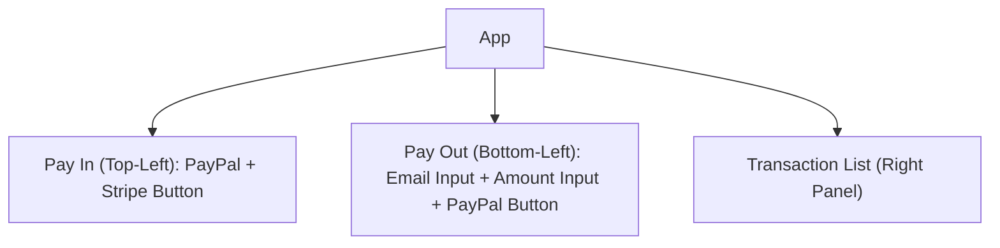
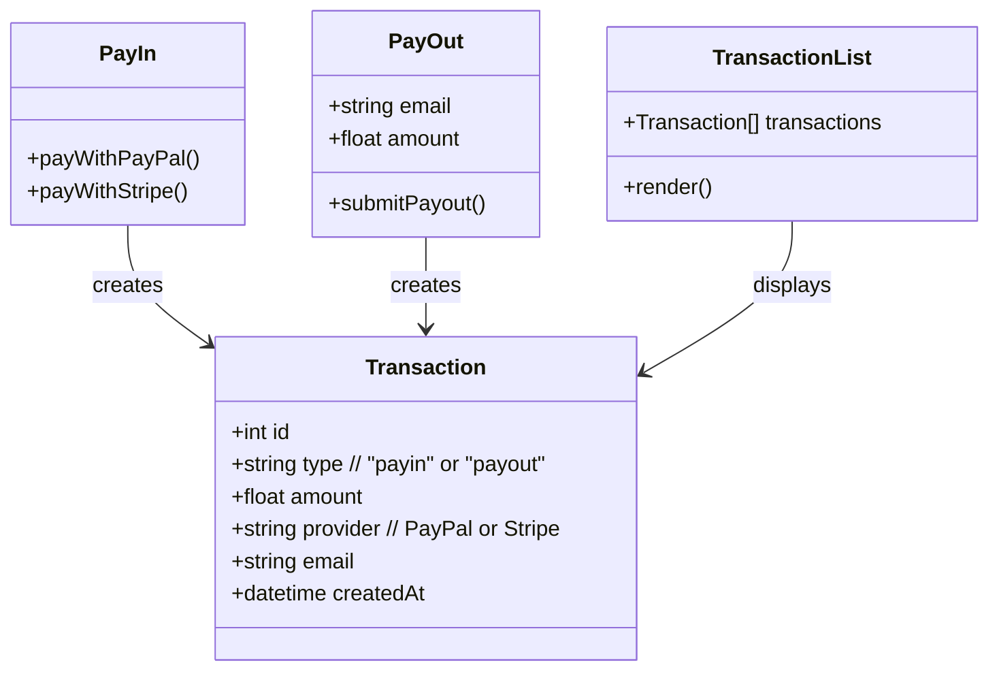
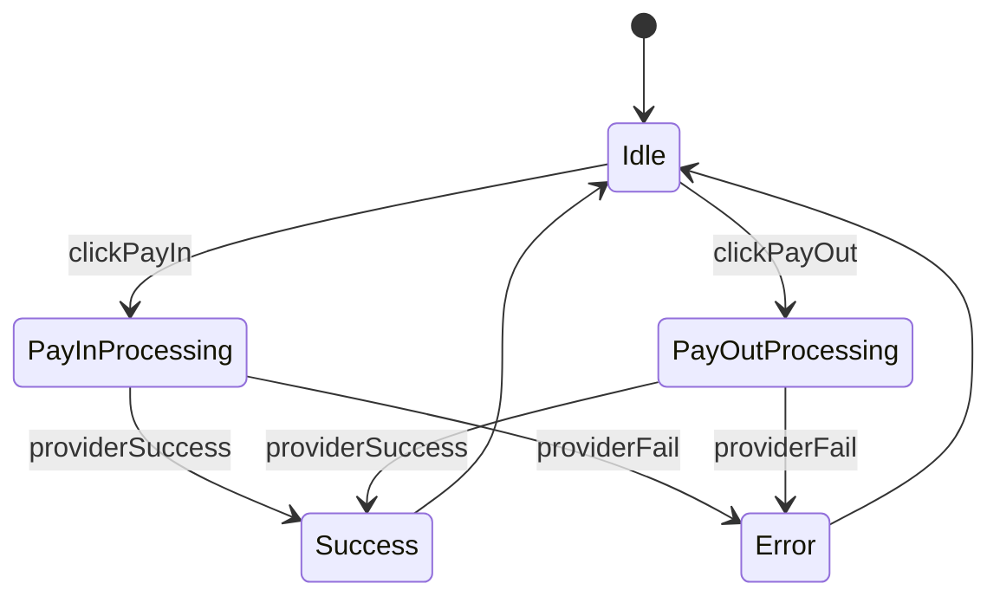
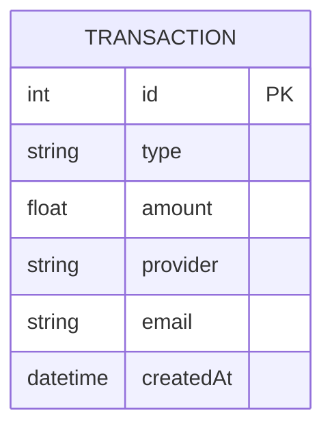

## Layout Hierarchy

```mermaid
flowchart TD
  App --> PayIn
  App --> PayOut
  App --> TransactionList

  PayIn["Pay In (Top-Left): PayPal + Stripe Button"]
  PayOut["Pay Out (Bottom-Left): Email Input + Amount Input + PayPal Button"]
  TransactionList["Transaction List (Right Panel)"]
```

## Component Contracts

```mermaid
classDiagram
  class PayIn {
    +payWithPayPal()
    +payWithStripe()
  }

  class PayOut {
    +string email
    +float amount
    +submitPayout()
  }

  class TransactionList {
    +Transaction[] transactions
    +render()
  }

  class Transaction {
    +int id
    +string type  // "payin" or "payout"
    +float amount
    +string provider  // PayPal or Stripe
    +string email
    +datetime createdAt
  }

  PayIn --> Transaction : creates
  PayOut --> Transaction : creates
  TransactionList --> Transaction : displays
```

## Interaction Flow

```mermaid
stateDiagram-v2
  [*] --> Idle

  Idle --> PayInProcessing : clickPayIn
  PayInProcessing --> Success : providerSuccess
  PayInProcessing --> Error : providerFail

  Idle --> PayOutProcessing : clickPayOut
  PayOutProcessing --> Success : providerSuccess
  PayOutProcessing --> Error : providerFail

  Success --> Idle
  Error --> Idle
```

## Database Schema

```mermaid
erDiagram
  TRANSACTION {
    int id PK
    string type
    float amount
    string provider
    string email
    datetime createdAt
  }
```
