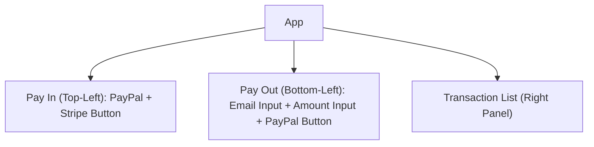
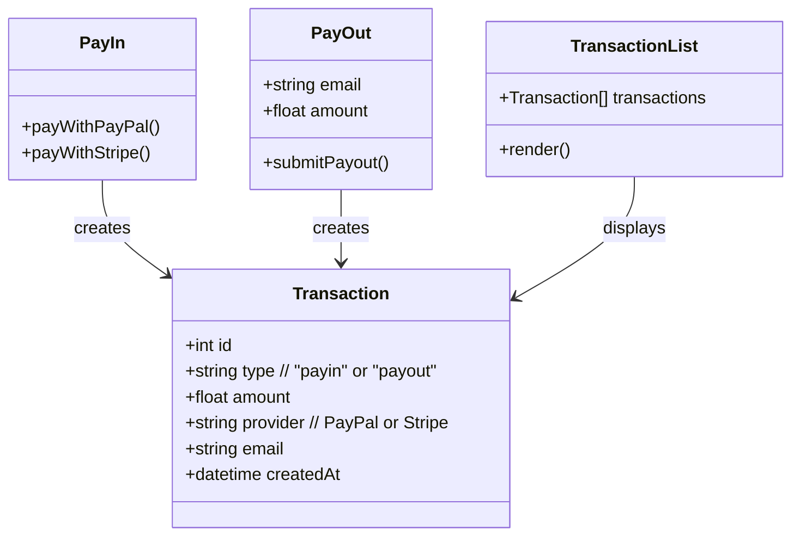
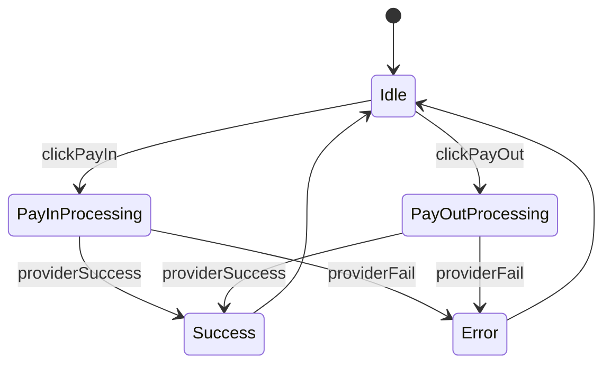

## Role

You are to generate a Node.js + SQLite web application based on the following Mermaid specifications.
The frontend should be React (or minimal HTML+JS) and the backend should use Express with SQLite.

## Layout Hierarchy



## Component Contracts



## Interaction Flow



## Database Schema

```mermaid
erDiagram
  TRANSACTION {
    int id PK
    string type  // payin or payout
    float amount
    string provider  // PayPal or Stripe
    string email
    datetime createdAt
  }
```

## Technical requirements:

1. Backend:

   - Node.js with Express.
   - SQLite database with one table: TRANSACTION.
   - Endpoints:
     - POST /payin/paypal
     - POST /payin/stripe
     - POST /payout/paypal
     - GET /transactions
   - Each successful call inserts into TRANSACTION table.

2. Frontend:

   - Layout: PayIn (top-left), PayOut (bottom-left), TransactionList (right).
   - PayIn: Two buttons ("Pay with PayPal", "Pay with Stripe").
   - PayOut: Email input, Amount input, "Payout with PayPal" button.
   - TransactionList: Renders all transactions from /transactions endpoint.

3. Follow contracts from diagrams strictly. Do not invent extra fields, states, or APIs.

4. Use design tokens (optional) if styling is needed, otherwise keep simple layout.
