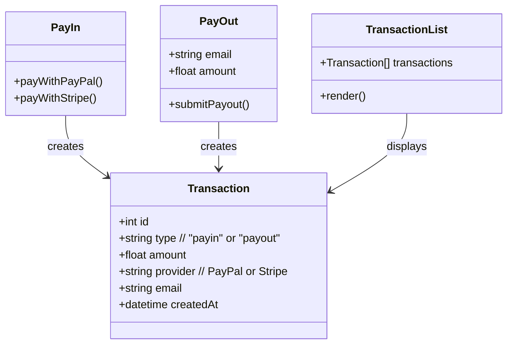
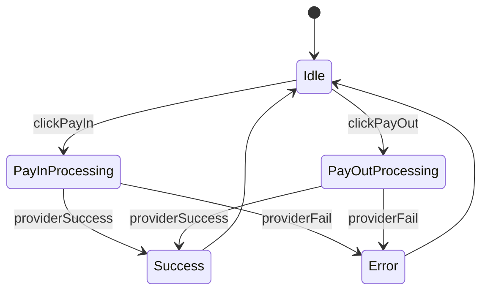
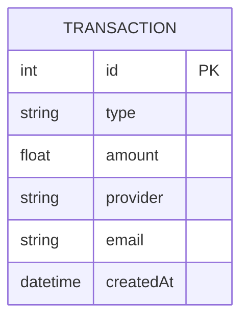

## Role

You are to generate a Node.js + SQLite web application based on the following Mermaid specifications.

## Technical requirements:

1. Backend:

   - `tsx` for typescript
   - Node.js with Express.
   - SQLite database.
   - Endpoints:
     - `POST /api/stripe/create-intent`
     - `POST /api/payin/stripe`
     - `POST /api/payin/paypal`
     - `POST /api/payout/paypal`
     - `GET /api/transactions`
   - Each successful call inserts into TRANSACTION table.

2. Frontend:

   - `tsx` for typescript
   - Vite: `npm create vite@latest` - `react-ts`
   - `@stripe/react-stripe-js @stripe/stripe-js`
   - Layout: PayIn (top-left), PayOut (bottom-left), TransactionList (right).
   - PayIn: Two buttons ("Pay with PayPal", "Pay with Stripe").
   - PayOut: Email input, Amount input, "Payout with PayPal" button.
   - TransactionList: Renders all transactions from /transactions endpoint.

3. Follow contracts from diagrams strictly. Do not invent extra fields, states, or APIs.

4. Use design tokens (optional) if styling is needed, otherwise keep simple layout.

## Layout Hierarchy


## Component Contracts



## Interaction Flow



## Database Schema



## Documentation

- This just example code, copied from official document
- Don't use exact example, recommended to follow coding guidelines

### `@stripe/react-stripe-js` example code

```tsx
import React, { useState } from "react";
import ReactDOM from "react-dom";
import { loadStripe } from "@stripe/stripe-js";
import {
  PaymentElement,
  Elements,
  useStripe,
  useElements,
} from "@stripe/react-stripe-js";

const CheckoutForm = () => {
  const stripe = useStripe();
  const elements = useElements();

  const [errorMessage, setErrorMessage] = useState(null);

  const handleSubmit = async (event) => {
    event.preventDefault();

    if (elements == null) {
      return;
    }

    // Trigger form validation and wallet collection
    const { error: submitError } = await elements.submit();
    if (submitError) {
      // Show error to your customer
      setErrorMessage(submitError.message);
      return;
    }

    // Create the PaymentIntent and obtain clientSecret from your server endpoint
    const res = await fetch("/stripe/create-intent", {
      method: "POST",
    });

    const { client_secret: clientSecret } = await res.json();

    const { error } = await stripe.confirmPayment({
      //`Elements` instance that was used to create the Payment Element
      elements,
      clientSecret,
      confirmParams: {
        return_url: "/complete",
      },
    });

    if (error) {
      // This point will only be reached if there is an immediate error when
      // confirming the payment. Show error to your customer (for example, payment
      // details incomplete)
      setErrorMessage(error.message);
    } else {
      // Your customer will be redirected to your `return_url`. For some payment
      // methods like iDEAL, your customer will be redirected to an intermediate
      // site first to authorize the payment, then redirected to the `return_url`.
    }
  };

  return (
    <form onSubmit={handleSubmit}>
      <PaymentElement />
      <button type="submit" disabled={!stripe || !elements}>
        Pay
      </button>
      {/* Show error message to your customers */}
      {errorMessage && <div>{errorMessage}</div>}
    </form>
  );
};

const stripePromise = loadStripe("$STRIPE_PUBLIC_KEY");

const options = {
  mode: "payment",
  amount: 1099,
  currency: "usd",
  // Fully customizable with appearance API.
  appearance: {
    /*...*/
  },
};

const App = () => (
  <Elements stripe={stripePromise} options={options}>
    <CheckoutForm />
  </Elements>
);

ReactDOM.render(<App />, document.body);
```

### create-intent

```sh
curl https://api.stripe.com/v1/payment_intents \
  -u "$STRIPE_SECRET_KEY" \
  -d amount=2000 \
  -d currency=usd \
  -d "automatic_payment_methods[enabled]"=true
```

```sh
curl -v -X POST https://api-m.sandbox.paypal.com/v1/payments/payouts \
-H 'Content-Type: application/json' \
-H 'Authorization: Bearer $PAYPAL_ACCESS_TOKEN' \
-d '{
  "sender_batch_header": {
    "sender_batch_id": "Payouts_2018_100007",
    "email_subject": "You have a payout!",
    "email_message": "You have received a payout! Thanks for using our service!"
  },
  "items": [
    {
      "recipient_type": "EMAIL",
      "amount": {
        "value": "9.87",
        "currency": "USD"
      },
      "note": "Thanks for your patronage!",
      "sender_item_id": "201403140001",
      "receiver": "receiver@example.com",
      "alternate_notification_method": {
        "phone": {
          "country_code": "91",
          "national_number": "9999988888"
        }
      },
      "notification_language": "fr-FR"
    },
    {
      "recipient_type": "PHONE",
      "amount": {
        "value": "112.34",
        "currency": "USD"
      },
      "note": "Thanks for your support!",
      "sender_item_id": "201403140002",
      "receiver": "91-734-234-1234"
    },
    {
      "recipient_type": "PAYPAL_ID",
      "amount": {
        "value": "5.32",
        "currency": "USD"
      },
      "note": "Thanks for your patronage!",
      "sender_item_id": "201403140003",
      "receiver": "G83JXTJ5EHCQ2",
      "purpose": "GOODS"
    }
  ]
}'
```

### env

```
APP_URL=
STRIPE_PUBLIC_KEY=
STRIPE_SECRET_KEY=
PAYPAL_CLIENT_ID=
PAYPAL_SECRET=
```

## Coding guidelines
