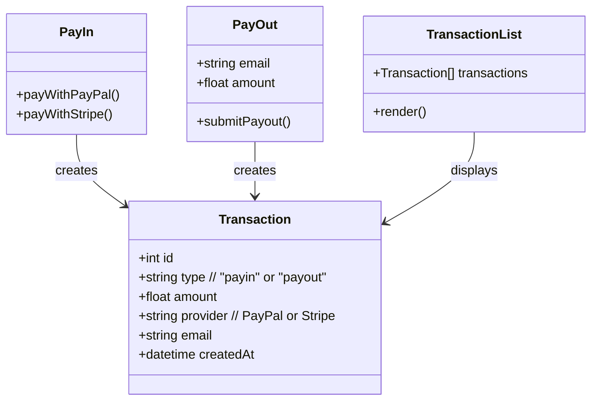
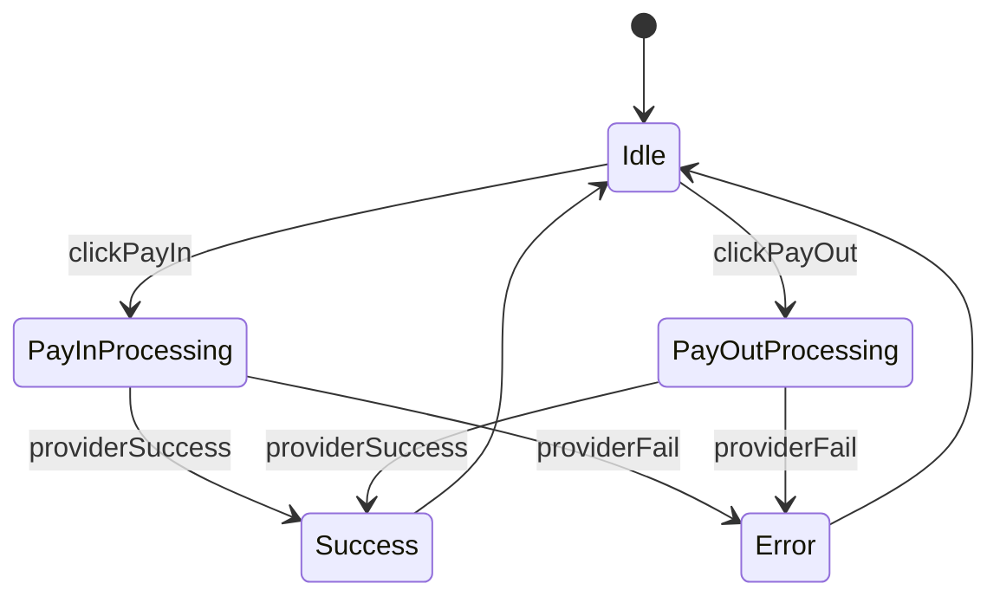
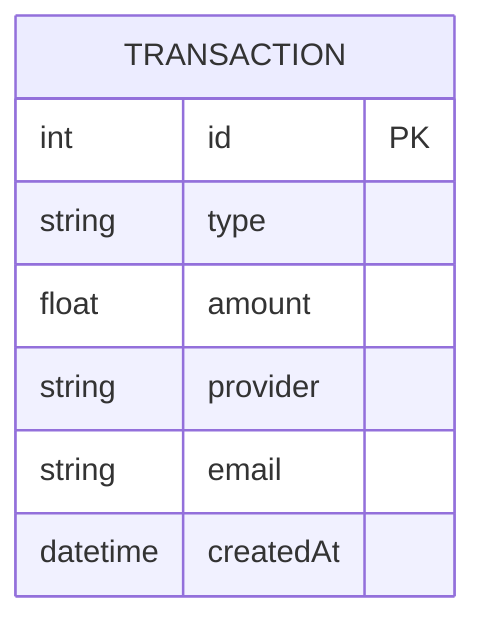

## Role

You are to generate a Node.js + SQLite web application based on the following Mermaid specifications.

## Technical requirements:

- `vite`
- `@trpc/client`
- `@trpc/server`
- `express`
- `zod`
- `tsx` for typescript
- `@stripe/react-stripe-js @stripe/stripe-js`

1. Backend:

   - Node.js with Express.
   - SQLite database.
   - Endpoints:
     - `POST /api/stripe/create-intent`
     - `POST /api/payin/stripe`
     - `POST /api/payin/paypal`
     - `POST /api/payout/paypal`
     - `GET /api/transactions`
   - Each successful call inserts into TRANSACTION table.

2. Frontend:

   - Vite: `npm create vite@latest` - `react-ts`
   - Layout: PayIn (top-left), PayOut (bottom-left), TransactionList (right).
   - PayIn: Two buttons ("Pay with PayPal", "Pay with Stripe").
   - PayOut: Email input, Amount input, "Payout with PayPal" button.
   - TransactionList: Renders all transactions from /transactions endpoint.

3. Follow contracts from diagrams strictly. Do not invent extra fields, states, or APIs.

4. Use design tokens (optional) if styling is needed, otherwise keep simple layout.

## Layout Hierarchy


## Component Contracts



## Interaction Flow



## Database Schema



## Documentation

- This just example code, copied from official document
- Don't use exact example, recommended to follow coding guidelines

### `@stripe/react-stripe-js` example code

```tsx
import React, { useState } from "react";
import ReactDOM from "react-dom";
import { loadStripe } from "@stripe/stripe-js";
import {
  PaymentElement,
  Elements,
  useStripe,
  useElements,
} from "@stripe/react-stripe-js";

const CheckoutForm = () => {
  const stripe = useStripe();
  const elements = useElements();

  const [errorMessage, setErrorMessage] = useState(null);

  const handleSubmit = async (event) => {
    event.preventDefault();

    if (elements == null) {
      return;
    }

    // Trigger form validation and wallet collection
    const { error: submitError } = await elements.submit();
    if (submitError) {
      // Show error to your customer
      setErrorMessage(submitError.message);
      return;
    }

    // Create the PaymentIntent and obtain clientSecret from your server endpoint
    const res = await fetch("/stripe/create-intent", {
      method: "POST",
    });

    const { client_secret: clientSecret } = await res.json();

    const { error } = await stripe.confirmPayment({
      //`Elements` instance that was used to create the Payment Element
      elements,
      clientSecret,
      confirmParams: {
        return_url: "/complete",
      },
    });

    if (error) {
      // This point will only be reached if there is an immediate error when
      // confirming the payment. Show error to your customer (for example, payment
      // details incomplete)
      setErrorMessage(error.message);
    } else {
      // Your customer will be redirected to your `return_url`. For some payment
      // methods like iDEAL, your customer will be redirected to an intermediate
      // site first to authorize the payment, then redirected to the `return_url`.
    }
  };

  return (
    <form onSubmit={handleSubmit}>
      <PaymentElement />
      <button type="submit" disabled={!stripe || !elements}>
        Pay
      </button>
      {/* Show error message to your customers */}
      {errorMessage && <div>{errorMessage}</div>}
    </form>
  );
};

const stripePromise = loadStripe("$STRIPE_PUBLIC_KEY");

const options = {
  mode: "payment",
  amount: 1099,
  currency: "usd",
  // Fully customizable with appearance API.
  appearance: {
    /*...*/
  },
};

const App = () => (
  <Elements stripe={stripePromise} options={options}>
    <CheckoutForm />
  </Elements>
);

ReactDOM.render(<App />, document.body);
```

### create-intent

```sh
curl https://api.stripe.com/v1/payment_intents \
  -u "$STRIPE_SECRET_KEY" \
  -d amount=2000 \
  -d currency=usd \
  -d "automatic_payment_methods[enabled]"=true
```

```sh
curl -v -X POST https://api-m.sandbox.paypal.com/v1/payments/payouts \
-H 'Content-Type: application/json' \
-H 'Authorization: Bearer $PAYPAL_ACCESS_TOKEN' \
-d '{
  "sender_batch_header": {
    "sender_batch_id": "Payouts_2018_100007",
    "email_subject": "You have a payout!",
    "email_message": "You have received a payout! Thanks for using our service!"
  },
  "items": [
    {
      "recipient_type": "EMAIL",
      "amount": {
        "value": "9.87",
        "currency": "USD"
      },
      "note": "Thanks for your patronage!",
      "sender_item_id": "201403140001",
      "receiver": "receiver@example.com",
      "alternate_notification_method": {
        "phone": {
          "country_code": "91",
          "national_number": "9999988888"
        }
      },
      "notification_language": "fr-FR"
    },
    {
      "recipient_type": "PHONE",
      "amount": {
        "value": "112.34",
        "currency": "USD"
      },
      "note": "Thanks for your support!",
      "sender_item_id": "201403140002",
      "receiver": "91-734-234-1234"
    },
    {
      "recipient_type": "PAYPAL_ID",
      "amount": {
        "value": "5.32",
        "currency": "USD"
      },
      "note": "Thanks for your patronage!",
      "sender_item_id": "201403140003",
      "receiver": "G83JXTJ5EHCQ2",
      "purpose": "GOODS"
    }
  ]
}'
```

### TRPC Client

```ts
import { createTRPCClient, httpBatchLink, loggerLink } from "@trpc/client";
import { tap } from "@trpc/server/observable";
import type { AppRouter } from "./server";

const sleep = (ms = 100) => new Promise((resolve) => setTimeout(resolve, ms));

async function main() {
  const url = `http://localhost:2021/trpc`;

  const trpc = createTRPCClient<AppRouter>({
    links: [
      () =>
        ({ op, next }) => {
          console.log("->", op.type, op.path, op.input);

          return next(op).pipe(
            tap({
              next(result) {
                console.log("<-", op.type, op.path, op.input, ":", result);
              },
            })
          );
        },
      httpBatchLink({ url }),
    ],
  });

  await sleep();

  // parallel queries
  await Promise.all([
    //
    trpc.hello.query(),
    trpc.hello.query("client"),
  ]);

  const postCreate = await trpc.post.createPost.mutate({
    title: "hello client",
  });
  console.log("created post", postCreate.title);
  await sleep();

  const postList = await trpc.post.listPosts.query();
  console.log("has posts", postList, "first:", postList[0].title);
  await sleep();

  try {
    await trpc.admin.secret.query();
  } catch (cause) {
    // will fail
  }
  await sleep();

  const authedClient = createTRPCClient<AppRouter>({
    links: [
      loggerLink(),
      httpBatchLink({
        url,
        headers: () => ({
          authorization: "secret",
        }),
      }),
    ],
  });

  await authedClient.admin.secret.query();

  const msgs = await trpc.message.listMessages.query();
  console.log("msgs", msgs);

  console.log("👌 should be a clean exit if everything is working right");
}

void main();
```

### TRPC Server

```ts
import { EventEmitter } from "events";
import { initTRPC, TRPCError } from "@trpc/server";
import * as trpcExpress from "@trpc/server/adapters/express";
import express from "express";
import { z } from "zod";

const createContext = ({
  req,
  res,
}: trpcExpress.CreateExpressContextOptions) => {
  const getUser = () => {
    if (req.headers.authorization !== "secret") {
      return null;
    }
    return {
      name: "alex",
    };
  };

  return {
    req,
    res,
    user: getUser(),
  };
};
type Context = Awaited<ReturnType<typeof createContext>>;

const t = initTRPC.context<Context>().create();

const router = t.router;
const publicProcedure = t.procedure;

// --------- create procedures etc

let id = 0;

const ee = new EventEmitter();
const db = {
  posts: [
    {
      id: ++id,
      title: "hello",
    },
  ],
  messages: [createMessage("initial message")],
};
function createMessage(text: string) {
  const msg = {
    id: ++id,
    text,
    createdAt: Date.now(),
    updatedAt: Date.now(),
  };
  ee.emit("newMessage", msg);
  return msg;
}

const postRouter = router({
  createPost: t.procedure
    .input(z.object({ title: z.string() }))
    .mutation(({ input }) => {
      const post = {
        id: ++id,
        ...input,
      };
      db.posts.push(post);
      return post;
    }),
  listPosts: publicProcedure.query(() => db.posts),
});

const messageRouter = router({
  addMessage: publicProcedure.input(z.string()).mutation(({ input }) => {
    const msg = createMessage(input);
    db.messages.push(msg);

    return msg;
  }),
  listMessages: publicProcedure.query(() => db.messages),
});

// root router to call
const appRouter = router({
  // merge predefined routers
  post: postRouter,
  message: messageRouter,
  // or individual procedures
  hello: publicProcedure.input(z.string().nullish()).query((opts) => {
    return `hello ${opts.input ?? opts.ctx.user?.name ?? "world"}`;
  }),
  // or inline a router
  admin: router({
    secret: publicProcedure.query((opts) => {
      if (!opts.ctx.user) {
        throw new TRPCError({ code: "UNAUTHORIZED" });
      }
      if (opts.ctx.user?.name !== "alex") {
        throw new TRPCError({ code: "FORBIDDEN" });
      }
      return {
        secret: "sauce",
      };
    }),
  }),
});

export type AppRouter = typeof appRouter;

async function main() {
  // express implementation
  const app = express();

  app.use((req, _res, next) => {
    // request logger
    console.log("⬅️ ", req.method, req.path, req.body ?? req.query);

    next();
  });

  app.use(
    "/trpc",
    trpcExpress.createExpressMiddleware({
      router: appRouter,
      createContext,
    })
  );
  app.get("/", (_req, res) => {
    res.send("hello");
  });
  app.listen(2021, () => {
    console.log("listening on port 2021");
  });
}

void main();
```

### env

```
APP_URL=
STRIPE_PUBLIC_KEY=
STRIPE_SECRET_KEY=
PAYPAL_CLIENT_ID=
PAYPAL_SECRET=
```

## Coding guidelines
